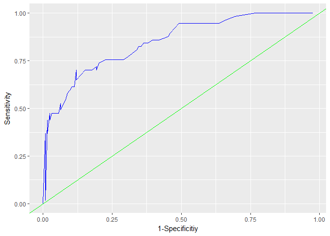
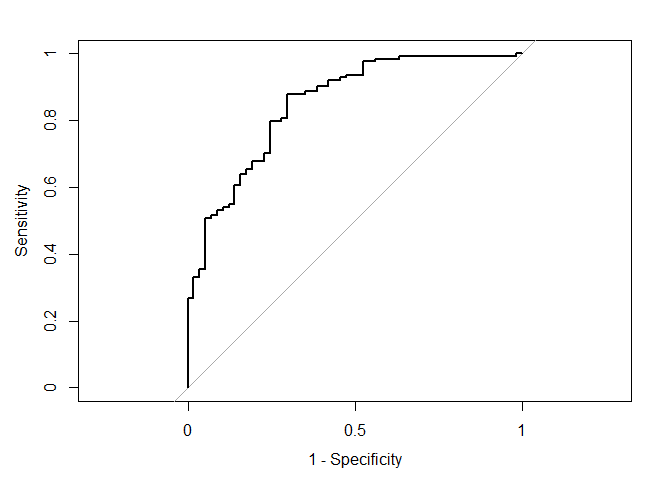
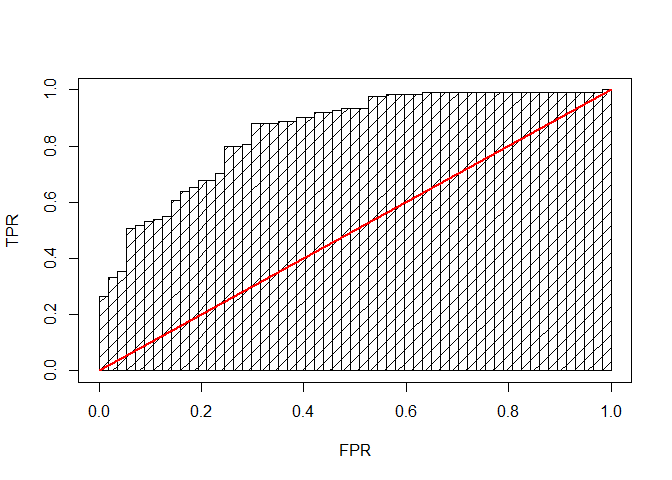

YMai\_Assignment2
================
Yun Mai
March 10, 2018

``` r
suppressMessages(suppressWarnings(library(knitr)))
suppressMessages(suppressWarnings(library(ggplot2)))
suppressMessages(suppressWarnings(library(kableExtra)))
suppressMessages(suppressWarnings(library(formattable)))
```

1.  Download the classification output data set (attached in Blackboard to the assignment).

``` r
cls <- read.csv('https://raw.githubusercontent.com/YunMai-SPS/DATA621_homework/master/data621_assignment2/classification-output-data.csv')

kable(head(cls), "html") %>% 
  kable_styling(bootstrap_options = c("bordered","condensed"),full_width = F)
```

<table class="table table-bordered table-condensed" style="width: auto !important; margin-left: auto; margin-right: auto;">
<thead>
<tr>
<th style="text-align:right;">
pregnant
</th>
<th style="text-align:right;">
glucose
</th>
<th style="text-align:right;">
diastolic
</th>
<th style="text-align:right;">
skinfold
</th>
<th style="text-align:right;">
insulin
</th>
<th style="text-align:right;">
bmi
</th>
<th style="text-align:right;">
pedigree
</th>
<th style="text-align:right;">
age
</th>
<th style="text-align:right;">
class
</th>
<th style="text-align:right;">
scored.class
</th>
<th style="text-align:right;">
scored.probability
</th>
</tr>
</thead>
<tbody>
<tr>
<td style="text-align:right;">
7
</td>
<td style="text-align:right;">
124
</td>
<td style="text-align:right;">
70
</td>
<td style="text-align:right;">
33
</td>
<td style="text-align:right;">
215
</td>
<td style="text-align:right;">
25.5
</td>
<td style="text-align:right;">
0.161
</td>
<td style="text-align:right;">
37
</td>
<td style="text-align:right;">
0
</td>
<td style="text-align:right;">
0
</td>
<td style="text-align:right;">
0.3284523
</td>
</tr>
<tr>
<td style="text-align:right;">
2
</td>
<td style="text-align:right;">
122
</td>
<td style="text-align:right;">
76
</td>
<td style="text-align:right;">
27
</td>
<td style="text-align:right;">
200
</td>
<td style="text-align:right;">
35.9
</td>
<td style="text-align:right;">
0.483
</td>
<td style="text-align:right;">
26
</td>
<td style="text-align:right;">
0
</td>
<td style="text-align:right;">
0
</td>
<td style="text-align:right;">
0.2731904
</td>
</tr>
<tr>
<td style="text-align:right;">
3
</td>
<td style="text-align:right;">
107
</td>
<td style="text-align:right;">
62
</td>
<td style="text-align:right;">
13
</td>
<td style="text-align:right;">
48
</td>
<td style="text-align:right;">
22.9
</td>
<td style="text-align:right;">
0.678
</td>
<td style="text-align:right;">
23
</td>
<td style="text-align:right;">
1
</td>
<td style="text-align:right;">
0
</td>
<td style="text-align:right;">
0.1096604
</td>
</tr>
<tr>
<td style="text-align:right;">
1
</td>
<td style="text-align:right;">
91
</td>
<td style="text-align:right;">
64
</td>
<td style="text-align:right;">
24
</td>
<td style="text-align:right;">
0
</td>
<td style="text-align:right;">
29.2
</td>
<td style="text-align:right;">
0.192
</td>
<td style="text-align:right;">
21
</td>
<td style="text-align:right;">
0
</td>
<td style="text-align:right;">
0
</td>
<td style="text-align:right;">
0.0559984
</td>
</tr>
<tr>
<td style="text-align:right;">
4
</td>
<td style="text-align:right;">
83
</td>
<td style="text-align:right;">
86
</td>
<td style="text-align:right;">
19
</td>
<td style="text-align:right;">
0
</td>
<td style="text-align:right;">
29.3
</td>
<td style="text-align:right;">
0.317
</td>
<td style="text-align:right;">
34
</td>
<td style="text-align:right;">
0
</td>
<td style="text-align:right;">
0
</td>
<td style="text-align:right;">
0.1004907
</td>
</tr>
<tr>
<td style="text-align:right;">
1
</td>
<td style="text-align:right;">
100
</td>
<td style="text-align:right;">
74
</td>
<td style="text-align:right;">
12
</td>
<td style="text-align:right;">
46
</td>
<td style="text-align:right;">
19.5
</td>
<td style="text-align:right;">
0.149
</td>
<td style="text-align:right;">
28
</td>
<td style="text-align:right;">
0
</td>
<td style="text-align:right;">
0
</td>
<td style="text-align:right;">
0.0551546
</td>
</tr>
</tbody>
</table>
1.  The data set has three key columns we will use:

??? class: the actual class for the observation

??? scored.class: the predicted class for the observation (based on a threshold of 0.5)

??? scored.probability: the predicted probability of success for the observation Use the table() function to get the raw confusion matrix for this scored dataset. Make sure you understand the output. In particular, do the rows represent the actual or predicted class? The columns?

``` r
(confusion_raw <- as.matrix(table(cls[,c('class','scored.class')])))
```

    ##      scored.class
    ## class   0   1
    ##     0 119   5
    ##     1  30  27

``` r
#kable(confusion_raw,"html",escape = T) %>% 
  #kable_styling("bordered",full_width = F) %>% 
  #add_header_above(c("", "scored.class" = 2)) 
```

1.  Write a function that takes the data set as a dataframe, with actual and predicted classifications identified, and returns the accuracy of the predictions.

Accuracy = (TP+TN)/(TP+TN+FP+FN)

1.  Write a function that takes the data set as a dataframe, with actual and predicted classifications identified, and returns the classification error rate of the predictions.

error rate = (FP+FN)/(TP+TN+FP+FN)

5.Write a function that takes the data set as a dataframe, with actual and predicted classifications identified, and returns the precision of the predictions.

precision = TP/(TP+FP)

6.Write a function that takes the data set as a dataframe, with actual and predicted classifications identified,and returns the sensitivity of the predictions. Sensitivity is also known as recall.

sensitivity = TP/(TP+FN)

7.Write a function that takes the data set as a dataframe, with actual and predicted classifications identified, and returns the specificity of the predictions.

specificity = TN/(TN+FP)

1.  Write a function that takes the data set as a dataframe, with actual and predicted classifications identified, and returns the F1 score of the predictions. $F1 = \\frac{2 \\times sensitivity \\times specificity}{sensitivity + specificity}$

The functions for classfication matrics:

    # the function for accuracy
    accuracy <- function(dt){
      TP <- nrow(dt[which(dt$scored.class==dt$class & dt$scored.class==1),])
      TN<- nrow(dt[which(dt$scored.class==dt$class & dt$scored.class==0),])
      FP <- nrow(dt[which(dt$scored.class!=dt$class & dt$scored.class==1),])
      FN <- nrow(dt[which(dt$scored.class!=dt$class & dt$scored.class==0),])
      acrcy <- (TP+TN)/(TP+TN+FP+FN)
      return(acrcy)
    }
    acrcy <- accuracy(cls)

    # the function for error rate
    error_rate <- function(dt){
      TP <- nrow(dt[which(dt$scored.class==dt$class & dt$scored.class==1),])
      TN<- nrow(dt[which(dt$scored.class==dt$class & dt$scored.class==0),])
      FP <- nrow(dt[which(dt$scored.class!=dt$class & dt$scored.class==1),])
      FN <- nrow(dt[which(dt$scored.class!=dt$class & dt$scored.class==0),])
      result <- (FP+FN)/(TP+TN+FP+FN)
      return(result)
    }
    err_rate <- error_rate(cls)

    # the function for precision 
    precision <- function(dt){
      TP <- nrow(dt[which(dt$scored.class==dt$class & dt$scored.class==1),])
      FP <- nrow(dt[which(dt$scored.class!=dt$class & dt$scored.class==1),])
      result <- TP/(TP+FP)
      return(result)
    }
    preci <- precision(cls)

    # the function for sensitivity
    sensitivity <- function(dt){
      TP <- nrow(dt[which(dt$scored.class==dt$class & dt$scored.class==1),])
      FN <- nrow(dt[which(dt$scored.class!=dt$class & dt$scored.class==0),])
      result <- TP/(TP+FN)
      return(result)
    }
    sensi <- sensitivity(cls)

    # the function for specificity
    specificity <- function(dt){
      TN<- nrow(dt[which(dt$scored.class==dt$class & dt$scored.class==0),])
      FP <- nrow(dt[which(dt$scored.class!=dt$class & dt$scored.class==1),])
      result <- TN/(TN+FP)
      return(result)
    }
    speci <- specificity(cls)

    # the function for F1 score
    F1 <- function(dt){
      result <- 2*precision(dt)*sensitivity(dt)/(precision(dt)+sensitivity(dt))
      return(result)
    }
    f1 <- F1(cls)

``` r
# the function for accuracy
accuracy <- function(dt){
  TP <- nrow(dt[which(dt$scored.class==dt$class & dt$scored.class==1),])
  TN<- nrow(dt[which(dt$scored.class==dt$class & dt$scored.class==0),])
  FP <- nrow(dt[which(dt$scored.class!=dt$class & dt$scored.class==1),])
  FN <- nrow(dt[which(dt$scored.class!=dt$class & dt$scored.class==0),])
  acrcy <- (TP+TN)/(TP+TN+FP+FN)
  return(acrcy)
}
acrcy <- accuracy(cls)

# the function for error rate
error_rate <- function(dt){
  TP <- nrow(dt[which(dt$scored.class==dt$class & dt$scored.class==1),])
  TN<- nrow(dt[which(dt$scored.class==dt$class & dt$scored.class==0),])
  FP <- nrow(dt[which(dt$scored.class!=dt$class & dt$scored.class==1),])
  FN <- nrow(dt[which(dt$scored.class!=dt$class & dt$scored.class==0),])
  result <- (FP+FN)/(TP+TN+FP+FN)
  return(result)
}
err_rate <- error_rate(cls)

# the function for precision 
precision <- function(dt){
  TP <- nrow(dt[which(dt$scored.class==dt$class & dt$scored.class==1),])
  FP <- nrow(dt[which(dt$scored.class!=dt$class & dt$scored.class==1),])
  result <- TP/(TP+FP)
  return(result)
}
preci <- precision(cls)

# the function for sensitivity
sensitivity_1 <- function(dt){
  TP <- nrow(dt[which(dt$scored.class==dt$class & dt$scored.class==1),])
  FN <- nrow(dt[which(dt$scored.class!=dt$class & dt$scored.class==0),])
  result <- TP/(TP+FN)
  return(result)
}
sensi <- sensitivity_1(cls)

# the function for specificity
specificity_1 <- function(dt){
  TN<- nrow(dt[which(dt$scored.class==dt$class & dt$scored.class==0),])
  FP <- nrow(dt[which(dt$scored.class!=dt$class & dt$scored.class==1),])
  result <- TN/(TN+FP)
  return(result)
}
speci <- specificity_1(cls)

# the function for F1 score
F1 <- function(dt){
  result <- 2*precision(dt)*sensitivity_1(dt)/(precision(dt)+sensitivity_1(dt))
  return(result)
}
f1 <- F1(cls)

#TP <- nrow(cls[which(cls$scored.class==cls$class & cls$scored.class==1),])
#TN<- nrow(cls[which(cls$scored.class==cls$class & cls$scored.class==0),])
#FP <- nrow(cls[which(cls$scored.class!=cls$class & cls$scored.class==1),])
#FN <- nrow(cls[which(cls$scored.class!=cls$class & cls$scored.class==0),])

#3
#acrcy <- (TP+TN)/(TP+TN+FP+FN)

#4
#err_rate <- (FP+FN)/(TP+TN+FP+FN)

# 5.precision of the prediction
#preci <- TP/(TP+FP)

# 6.sensitivity of the predictions
#sensi <- TP/(TP+FN)
#or use the sensitivity function from caret
suppressMessages(suppressWarnings(library(caret)))
sen <- sensitivity(data = as.factor(cls$scored.class), reference = as.factor(cls$class), positive = 1)

# 7.specificity of the predictions
#speci <- TN/(TN+FP)
# or use the sensitivity function from caret
spe <- specificity(data = as.factor(cls$scored.class), reference = as.factor(cls$class), negative = 0)

#8. F1 score of the predictions
F1 <- (2*preci*sensi) /(preci+sensi)
```

``` r
(acrcy <- accuracy(cls))
```

    ## [1] 0.8066298

``` r
(err_rate <- error_rate(cls))
```

    ## [1] 0.1933702

``` r
(preci <- precision(cls))
```

    ## [1] 0.84375

``` r
(sensi <- sensitivity_1(cls))
```

    ## [1] 0.4736842

``` r
(speci <- specificity_1(cls))
```

    ## [1] 0.9596774

``` r
(F1 <- (2*preci*sensi) /(preci+sensi))
```

    ## [1] 0.6067416

``` r
result_1 <- data.frame('evaluations'=c('accuracy','error rate','precision','sensitivity','specificity','F1 score'),'values'=c(acrcy,err_rate,preci,sensi,speci,F1))
kable(result_1,'html') %>% 
  kable_styling("bordered",full_width = F) %>% 
  add_header_above(c("Based on my own fucntions" = 2)) 
```

<table class="table table-bordered" style="width: auto !important; margin-left: auto; margin-right: auto;">
<thead>
<tr>
<th style="text-align:center; border-bottom:hidden; padding-bottom:0; padding-left:3px;padding-right:3px;" colspan="2">
Based on my own fucntions

</th>
</tr>
<tr>
<th style="text-align:left;">
evaluations
</th>
<th style="text-align:right;">
values
</th>
</tr>
</thead>
<tbody>
<tr>
<td style="text-align:left;">
accuracy
</td>
<td style="text-align:right;">
0.8066298
</td>
</tr>
<tr>
<td style="text-align:left;">
error rate
</td>
<td style="text-align:right;">
0.1933702
</td>
</tr>
<tr>
<td style="text-align:left;">
precision
</td>
<td style="text-align:right;">
0.8437500
</td>
</tr>
<tr>
<td style="text-align:left;">
sensitivity
</td>
<td style="text-align:right;">
0.4736842
</td>
</tr>
<tr>
<td style="text-align:left;">
specificity
</td>
<td style="text-align:right;">
0.9596774
</td>
</tr>
<tr>
<td style="text-align:left;">
F1 score
</td>
<td style="text-align:right;">
0.6067416
</td>
</tr>
</tbody>
</table>
9.Before we move on, let's consider a question that was asked: What are the bounds on the F1 score? Show that the F1 score will always be between 0 and 1.

F1 = (2*precision*sensitivity) /(precision+sensitivity)

Because 0 &lt; precision &lt; 1, 0 &lt; sensitivity &lt; 1, we now can conclude that:

precision \* sensitivity &lt; precision,

and

precision \* sensitivity &lt; sensitivity,

So:

$2 precision sensitivity &lt; precision+sensitivity $

1.  Write a function that generates an ROC curve from a data set with a true classification column (class in our example) and a probability column (scored.probability in our example). Your function should return a list that includes the plot of the ROC curve and a vector that contains the calculated area under the curve (AUC). Note that I recommend using a sequence of thresholds ranging from 0 to 1 at 0.01 intervals.

<!-- -->

    # function for the ROC plot and AUC
    suppressMessages(suppressWarnings(library(dplyr)))
    suppressMessages(suppressWarnings(library(ggplot2)))
    ROC_cal <- function(dt){
      # generate the lists for ROC curve
      thresholds <-list()
      sensitivities <- list()
      specificities <- list()
      i <- 0.01
      range <- max(dt$scored.probability)-min(dt$scored.probability)
      
      for (i in seq(0.01,1,0.01)){
        cutoff <- range*i
        col_name <- paste0('pred_',i)
        dt[,col_name] <- ifelse(dt$scored.probability>min(dt$scored.probability)+cutoff,1,0)
        #True positive rate or sensitivity --> y axis,
        #tpr <- confusionMatrix(data = dt[,col_name], reference = dt$class, positive = "1")$byClass['Sensitivity']
        #or
        TP <- nrow(dt[which(dt[,col_name] == dt$class & dt[,col_name] == 1),])
        TN<- nrow(dt[which(dt[,col_name] == dt$class & dt[,col_name] == 0),])
        FP <- nrow(dt[which(dt[,col_name] != dt$class & dt[,col_name] == 1),])
        FN <- nrow(dt[which(dt[,col_name] != dt$class & dt[,col_name] == 0),])
        tpr <- TP/(TP+FN)
        
        #False positive rate or specificity --> x axis
        #fpr <- 1- confusionMatrix(data = dt[,col_name], reference = dt$class, positive = "1")$byClass['Specificity']
        #or
        fpr <- TN/(TN+FP)
          
        thresholds<-c(thresholds,i)
        sensitivities<-c(sensitivities,tpr)
        specificities<-c(specificities,fpr)
      }
      
      #calculate the area under the curve of ROC
      roc_df <- data.frame(
        TPR=rev(unlist(sensitivities)),
        FPR=rev(1-unlist(specificities))
        ) %>% 
        mutate(dfTPR=c(diff(TPR),0)) %>% 
        mutate(dfFPR=c(diff(FPR),0))

      auc <- sum(roc_df$dfFPR*roc_df$TPR) + sum((roc_df$dfFPR*roc_df$dfTPR)/2)

      result <- c('thresholds'=list(unlist(thresholds)),
                  'sensitivities'=list(unlist(sensitivities)),
                  'specificities'=list(unlist(specificities)),
                  'AUC'=auc)
      return(result)  
    }

``` r
# function for the ROC plot and AUC
suppressMessages(suppressWarnings(library(dplyr)))
ROC_cal <- function(dt){
  # generate the lists for ROC curve
  thresholds <-list()
  sensitivities <- list()
  specificities <- list()
  i <- 0.01
  range <- max(dt$scored.probability)-min(dt$scored.probability)
  
  for (i in seq(0.01,1,0.01)){
    cutoff <- range*i
    col_name <- paste0('pred_',i)
    dt[,col_name] <- ifelse(dt$scored.probability>min(dt$scored.probability)+cutoff,1,0)
    #True positive rate or sensitivity --> y axis,
    #tpr <- confusionMatrix(data = dt[,col_name], reference = dt$class, positive = "1")$byClass['Sensitivity']
    #or
    TP <- nrow(dt[which(dt[,col_name] == dt$class & dt[,col_name] == 1),])
    TN<- nrow(dt[which(dt[,col_name] == dt$class & dt[,col_name] == 0),])
    FP <- nrow(dt[which(dt[,col_name] != dt$class & dt[,col_name] == 1),])
    FN <- nrow(dt[which(dt[,col_name] != dt$class & dt[,col_name] == 0),])
    tpr <- TP/(TP+FN)
    
    #False positive rate or specificity --> x axis
    #fpr <- 1- confusionMatrix(data = dt[,col_name], reference = dt$class, positive = "1")$byClass['Specificity']
    #or
    fpr <- TN/(TN+FP)
      
    thresholds<-c(thresholds,i)
    sensitivities<-c(sensitivities,tpr)
    specificities<-c(specificities,fpr)
  }
  
  #calculate the area under the curve of ROC
  roc_df <- data.frame(
    TPR=rev(unlist(sensitivities)),
    FPR=rev(1-unlist(specificities))
    ) %>% 
    mutate(dfTPR=c(diff(TPR),0)) %>% 
    mutate(dfFPR=c(diff(FPR),0))

  auc <- sum(roc_df$dfFPR*roc_df$TPR) + sum((roc_df$dfFPR*roc_df$dfTPR)/2)

  result <- c('thresholds'=list(unlist(thresholds)),
              'sensitivities'=list(unlist(sensitivities)),
              'specificities'=list(unlist(specificities)),
              'AUC'=auc)
  return(result)  
}
```

1.  Use your created R functions and the provided classification output data set to produce all of the classification metrics discussed above.

``` r
# generate the lists inlcuding ROC plot and the vector for AUC of ROC
temp_df <- cls[,c('class','scored.class','scored.probability')]
ROC <- ROC_cal(temp_df)
names(ROC)
```

    ## [1] "thresholds"    "sensitivities" "specificities" "AUC"

``` r
auc_ownfn <- ROC[['AUC']]

#plot the ROC curve
ROC_df <- do.call(rbind, Map(data.frame,'thresholds'=ROC$thresholds, 'sensitivities'=ROC$sensitivities,'specificities'=ROC$specificities))
(p <- ggplot(ROC_df,aes(1-ROC$specificities, ROC$sensitivities))+
  geom_line(color='blue')+
  geom_abline(intercept = 0,slope = 1,color='green')+
  xlab('1-Specificitiy')+ylab('Sensitivity'))
```



1.  Investigate the caret package. In particular, consider the functions confusionMatrix, sensitivity, and specificity. Apply the functions to the data set. How do the results compare with your own functions?

``` r
suppressMessages(suppressWarnings(library(caret)))
cfmx <- confusionMatrix(data = cls$scored.class, reference = cls$class, positive = "1")

cfmx
```

    ## Confusion Matrix and Statistics
    ## 
    ##           Reference
    ## Prediction   0   1
    ##          0 119  30
    ##          1   5  27
    ##                                           
    ##                Accuracy : 0.8066          
    ##                  95% CI : (0.7415, 0.8615)
    ##     No Information Rate : 0.6851          
    ##     P-Value [Acc > NIR] : 0.0001712       
    ##                                           
    ##                   Kappa : 0.4916          
    ##  Mcnemar's Test P-Value : 4.976e-05       
    ##                                           
    ##             Sensitivity : 0.4737          
    ##             Specificity : 0.9597          
    ##          Pos Pred Value : 0.8438          
    ##          Neg Pred Value : 0.7987          
    ##              Prevalence : 0.3149          
    ##          Detection Rate : 0.1492          
    ##    Detection Prevalence : 0.1768          
    ##       Balanced Accuracy : 0.7167          
    ##                                           
    ##        'Positive' Class : 1               
    ## 

``` r
names(cfmx)
```

    ## [1] "positive" "table"    "overall"  "byClass"  "mode"     "dots"

``` r
(cfmx$table)
```

    ##           Reference
    ## Prediction   0   1
    ##          0 119  30
    ##          1   5  27

``` r
(acrcy_caret <- cfmx$overall['Accuracy'])
```

    ##  Accuracy 
    ## 0.8066298

``` r
(err_rate_caret <- 1-cfmx$overall['Accuracy'])
```

    ##  Accuracy 
    ## 0.1933702

``` r
(preci_caret <- cfmx$byClass['Precision'])
```

    ## Precision 
    ##   0.84375

``` r
(sensi_caret <- cfmx$byClass['Sensitivity'])
```

    ## Sensitivity 
    ##   0.4736842

``` r
(speci_caret <- cfmx$byClass['Specificity'])
```

    ## Specificity 
    ##   0.9596774

``` r
(F1_caret <- cfmx$byClass['F1'])
```

    ##        F1 
    ## 0.6067416

``` r
result_2 <- data.frame('evaluations'=c('accuracy','error rate','precision','sensitivity','specificity','F1 score'),'values_myfunction'=c(acrcy,err_rate,preci,sensi,speci,F1),'values_caret'=c(acrcy_caret,err_rate_caret,preci_caret,sensi_caret,speci_caret,F1_caret))

kable(result_2,'html') %>% 
  kable_styling("bordered",full_width = F) 
```

<table class="table table-bordered" style="width: auto !important; margin-left: auto; margin-right: auto;">
<thead>
<tr>
<th style="text-align:left;">
evaluations
</th>
<th style="text-align:right;">
values\_myfunction
</th>
<th style="text-align:right;">
values\_caret
</th>
</tr>
</thead>
<tbody>
<tr>
<td style="text-align:left;">
accuracy
</td>
<td style="text-align:right;">
0.8066298
</td>
<td style="text-align:right;">
0.8066298
</td>
</tr>
<tr>
<td style="text-align:left;">
error rate
</td>
<td style="text-align:right;">
0.1933702
</td>
<td style="text-align:right;">
0.1933702
</td>
</tr>
<tr>
<td style="text-align:left;">
precision
</td>
<td style="text-align:right;">
0.8437500
</td>
<td style="text-align:right;">
0.8437500
</td>
</tr>
<tr>
<td style="text-align:left;">
sensitivity
</td>
<td style="text-align:right;">
0.4736842
</td>
<td style="text-align:right;">
0.4736842
</td>
</tr>
<tr>
<td style="text-align:left;">
specificity
</td>
<td style="text-align:right;">
0.9596774
</td>
<td style="text-align:right;">
0.9596774
</td>
</tr>
<tr>
<td style="text-align:left;">
F1 score
</td>
<td style="text-align:right;">
0.6067416
</td>
<td style="text-align:right;">
0.6067416
</td>
</tr>
</tbody>
</table>
1.  Investigate the pROC package. Use it to generate an ROC curve for the data set. How do the results compare with your own functions?

``` r
suppressMessages(suppressWarnings(library(pROC)))

rocCurve <- roc(response = cls$class,
 predictor = cls$scored.probability,
 levels = rev(levels(as.factor(cls$class))))

#rocCurve[['sensitivities']]
#rocCurve[['specificities']]
#rocCurve[['thresholds']]

plot(rocCurve, legacy.axes = TRUE)
```



``` r
cat('AUC is', auc_pROC <- auc(rocCurve))
```

    ## AUC is 0.8503113

``` r
ci(rocCurve)
```

    ## 95% CI: 0.7905-0.9101 (DeLong)

``` r
#######################
#calcualte AUC

suppressMessages(suppressWarnings(library(dplyr)))

roc_df <- data.frame(
  TPR=rev(rocCurve$sensitivities),
  FPR=rev(1-rocCurve$specificities)
) %>% 
  mutate(dfTPR=c(diff(TPR),0)) %>% 
  mutate(dfFPR=c(diff(FPR),0))

auc <- sum(roc_df$dfFPR*roc_df$TPR) + sum((roc_df$dfFPR*roc_df$dfTPR)/2)

# plot ROC
#rectangle <- function(x, y, width, height, colour,lwd) {
  #polygon(c(x,x,x+width,x+width), c(y,y+height,y+height,y),lwd=lwd)
#}

#triangle <- function(x, y, width, height, colour,lwd) {
  #polygon(c(x,x+width,x+width), c(y,y+height,y), lwd=lwd)
#}

rectangle <- function(x, y, width, height, density, angle,colour,lwd) {
  polygon(c(x,x,x+width,x+width), c(y,y+height,y+height,y), 
          density=density, angle=angle,lwd=lwd)
}

triangle <- function(x, y, width, height, density, angle,colour,lwd) {
  polygon(c(x,x+width,x+width), c(y,y+height,y), 
          density=density, angle=angle,lwd=lwd)
}
  

plot(0:10/10, 0:10/10, type='n', xlab="FPR", ylab="TPR")
#abline(h=0:10/10, col="lightblue")
#abline(v=0:10/10, col="lightblue")
with(roc_df, {
  mapply(rectangle, x=FPR, y=0,   
         width=dfFPR, height=TPR, density=10, angle=45,col="green", lwd=0.5)
  mapply(triangle, x=FPR, y=TPR, 
         width=dfFPR, height=dfTPR, density=10, angle=45,col="blue", lwd=0.5)
  lines(x = c(0,1), y = c(0,1),col="red",lwd=2)
  # other than using triangle, we can also connect the dots by line like this:
  #lines(FPR, TPR, type='l', lwd=3, col="red")
})
```



``` r
sum(roc_df$dfFPR*roc_df$TPR) + sum((roc_df$dfFPR*roc_df$dfTPR)/2)
```

    ## [1] 0.8503113

Reference: 1.Applied Predictive Modeling, Ch. 11 (provided as a PDF file). 2.Web tutorials: <http://www.saedsayad.com/model_evaluation_c.htm> 3.Web tutorials: <http://www.saedsayad.com/model_evaluation_c.htm> 4.Web tutorials: <http://gim.unmc.edu/dxtests/roc2.htm>
