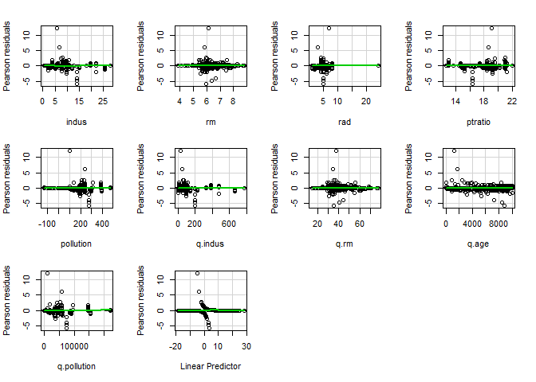
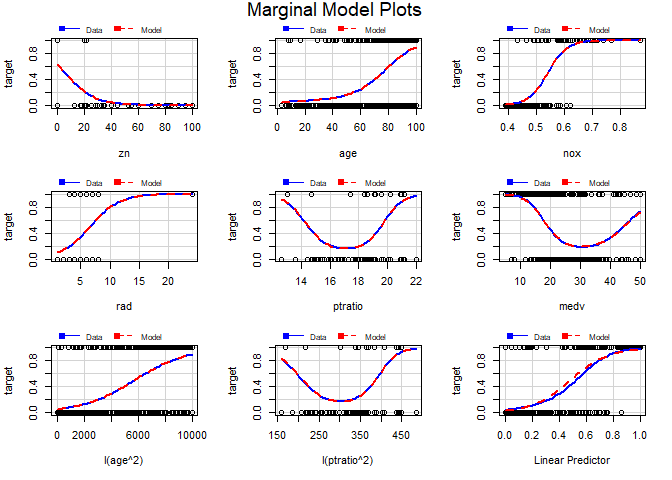

YunMai\_data621\_Assignment3
================
Yun Mai
March 30, 2018

Overview
--------

In this homework assignment, you will explore, analyze and model a data set containing information on crime for various neighborhoods of a major city. Each record has a response variable indicating whether or not the crime rate is above the median crime rate (1) or not (0).

Goals
-----

Build a binary logistic regression model on the training data set to predict whether the neighborhood will be at risk for high crime levels. Provide classifications and probabilities for the evaluation data set using your binary logistic regression model.

Specification
-------------

Only the variables given (or, variables that you derive from the variables provided) could be used in to modeling.

Below is a short description of the variables of interest in the data set:

. zn: proportion of residential land zoned for large lots (over 25000 square feet) (predictor variable)

. indus: proportion of non-retail business acres per suburb (predictor variable)

. chas: a dummy var. for whether the suburb borders the Charles River (1) or not (0) (predictor variable)

. nox: nitrogen oxides concentration (parts per 10 million) (predictor variable)

. rm: average number of rooms per dwelling (predictor variable)

. age: proportion of owner-occupied units built prior to 1940 (predictor variable)

. dis: weighted mean of distances to five Boston employment centers (predictor variable)

. rad: index of accessibility to radial highways (predictor variable)

. tax: full-value property-tax rate per $10,000 (predictor variable)

. ptratio: pupil-teacher ratio by town (predictor variable)

. lstat: lower status of the population (percent) (predictor variable)

. medv: median value of owner-occupied homes in $1000s (predictor variable)

. target: whether the crime rate is above the median crime rate (1) or not (0) (response variable)

. A write-up submitted in PDF format. Your write-up should have four sections. Each one is described below. You may assume you are addressing me as a fellow data scientist, so do not need to shy away from technical details.

. Assigned prediction (probabilities, classifications) for the evaluation data set. Use 0.5 threshold. Include your R statistical programming code in an Appendix.

``` r
suppressMessages(suppressWarnings(library(knitr)))
suppressMessages(suppressWarnings(library(ggplot2)))
suppressMessages(suppressWarnings(library(kableExtra)))
suppressMessages(suppressWarnings(library(formattable)))
suppressMessages(suppressWarnings(library(dplyr)))

suppressMessages(suppressWarnings(library(caret)))
suppressMessages(suppressWarnings(library(pROC)))
```

### 1. DATA EXPLORATION

``` r
# load the data 
crime_train <- read.csv('https://raw.githubusercontent.com/YunMai-SPS/DATA621_homework/master/data621_assignment3/crime-training-data_modified.csv')

crime_test <- read.csv('https://raw.githubusercontent.com/YunMai-SPS/DATA621_homework/master/data621_assignment3/crime-evaluation-data_modified.csv')
```

#### 1.1 Summarizing the dataset

In table 1, we can see the sample size of each variables, the missing data, the range of the value of each variable. The missing data here are actually 0s which are the real values for binary data set. There is no data missing as number of NA is 0 for each variable.

``` r
suppressMessages(suppressWarnings(library(pastecs)))
options(scipen = 100)
options(digits = 2)

kable(stat.desc(crime_train), "html") %>%
  kable_styling(bootstrap_options = c("bordered", "hover", "condensed"),full_width = F)
```

<table class="table table-bordered table-hover table-condensed" style="width: auto !important; margin-left: auto; margin-right: auto;">
<thead>
<tr>
<th style="text-align:left;">
</th>
<th style="text-align:right;">
zn
</th>
<th style="text-align:right;">
indus
</th>
<th style="text-align:right;">
chas
</th>
<th style="text-align:right;">
nox
</th>
<th style="text-align:right;">
rm
</th>
<th style="text-align:right;">
age
</th>
<th style="text-align:right;">
dis
</th>
<th style="text-align:right;">
rad
</th>
<th style="text-align:right;">
tax
</th>
<th style="text-align:right;">
ptratio
</th>
<th style="text-align:right;">
lstat
</th>
<th style="text-align:right;">
medv
</th>
<th style="text-align:right;">
target
</th>
</tr>
</thead>
<tbody>
<tr>
<td style="text-align:left;">
nbr.val
</td>
<td style="text-align:right;">
466.0
</td>
<td style="text-align:right;">
466.00
</td>
<td style="text-align:right;">
466.00
</td>
<td style="text-align:right;">
466.00
</td>
<td style="text-align:right;">
466.00
</td>
<td style="text-align:right;">
466.00
</td>
<td style="text-align:right;">
466.00
</td>
<td style="text-align:right;">
466.00
</td>
<td style="text-align:right;">
466.00
</td>
<td style="text-align:right;">
466.00
</td>
<td style="text-align:right;">
466.00
</td>
<td style="text-align:right;">
466.00
</td>
<td style="text-align:right;">
466.00
</td>
</tr>
<tr>
<td style="text-align:left;">
nbr.null
</td>
<td style="text-align:right;">
339.0
</td>
<td style="text-align:right;">
0.00
</td>
<td style="text-align:right;">
433.00
</td>
<td style="text-align:right;">
0.00
</td>
<td style="text-align:right;">
0.00
</td>
<td style="text-align:right;">
0.00
</td>
<td style="text-align:right;">
0.00
</td>
<td style="text-align:right;">
0.00
</td>
<td style="text-align:right;">
0.00
</td>
<td style="text-align:right;">
0.00
</td>
<td style="text-align:right;">
0.00
</td>
<td style="text-align:right;">
0.00
</td>
<td style="text-align:right;">
237.00
</td>
</tr>
<tr>
<td style="text-align:left;">
nbr.na
</td>
<td style="text-align:right;">
0.0
</td>
<td style="text-align:right;">
0.00
</td>
<td style="text-align:right;">
0.00
</td>
<td style="text-align:right;">
0.00
</td>
<td style="text-align:right;">
0.00
</td>
<td style="text-align:right;">
0.00
</td>
<td style="text-align:right;">
0.00
</td>
<td style="text-align:right;">
0.00
</td>
<td style="text-align:right;">
0.00
</td>
<td style="text-align:right;">
0.00
</td>
<td style="text-align:right;">
0.00
</td>
<td style="text-align:right;">
0.00
</td>
<td style="text-align:right;">
0.00
</td>
</tr>
<tr>
<td style="text-align:left;">
min
</td>
<td style="text-align:right;">
0.0
</td>
<td style="text-align:right;">
0.46
</td>
<td style="text-align:right;">
0.00
</td>
<td style="text-align:right;">
0.39
</td>
<td style="text-align:right;">
3.86
</td>
<td style="text-align:right;">
2.90
</td>
<td style="text-align:right;">
1.13
</td>
<td style="text-align:right;">
1.00
</td>
<td style="text-align:right;">
187.00
</td>
<td style="text-align:right;">
12.60
</td>
<td style="text-align:right;">
1.73
</td>
<td style="text-align:right;">
5.00
</td>
<td style="text-align:right;">
0.00
</td>
</tr>
<tr>
<td style="text-align:left;">
max
</td>
<td style="text-align:right;">
100.0
</td>
<td style="text-align:right;">
27.74
</td>
<td style="text-align:right;">
1.00
</td>
<td style="text-align:right;">
0.87
</td>
<td style="text-align:right;">
8.78
</td>
<td style="text-align:right;">
100.00
</td>
<td style="text-align:right;">
12.13
</td>
<td style="text-align:right;">
24.00
</td>
<td style="text-align:right;">
711.00
</td>
<td style="text-align:right;">
22.00
</td>
<td style="text-align:right;">
37.97
</td>
<td style="text-align:right;">
50.00
</td>
<td style="text-align:right;">
1.00
</td>
</tr>
<tr>
<td style="text-align:left;">
range
</td>
<td style="text-align:right;">
100.0
</td>
<td style="text-align:right;">
27.28
</td>
<td style="text-align:right;">
1.00
</td>
<td style="text-align:right;">
0.48
</td>
<td style="text-align:right;">
4.92
</td>
<td style="text-align:right;">
97.10
</td>
<td style="text-align:right;">
11.00
</td>
<td style="text-align:right;">
23.00
</td>
<td style="text-align:right;">
524.00
</td>
<td style="text-align:right;">
9.40
</td>
<td style="text-align:right;">
36.24
</td>
<td style="text-align:right;">
45.00
</td>
<td style="text-align:right;">
1.00
</td>
</tr>
<tr>
<td style="text-align:left;">
sum
</td>
<td style="text-align:right;">
5395.0
</td>
<td style="text-align:right;">
5174.94
</td>
<td style="text-align:right;">
33.00
</td>
<td style="text-align:right;">
258.31
</td>
<td style="text-align:right;">
2931.45
</td>
<td style="text-align:right;">
31859.30
</td>
<td style="text-align:right;">
1768.79
</td>
<td style="text-align:right;">
4441.00
</td>
<td style="text-align:right;">
190828.00
</td>
<td style="text-align:right;">
8573.70
</td>
<td style="text-align:right;">
5886.26
</td>
<td style="text-align:right;">
10526.60
</td>
<td style="text-align:right;">
229.00
</td>
</tr>
<tr>
<td style="text-align:left;">
median
</td>
<td style="text-align:right;">
0.0
</td>
<td style="text-align:right;">
9.69
</td>
<td style="text-align:right;">
0.00
</td>
<td style="text-align:right;">
0.54
</td>
<td style="text-align:right;">
6.21
</td>
<td style="text-align:right;">
77.15
</td>
<td style="text-align:right;">
3.19
</td>
<td style="text-align:right;">
5.00
</td>
<td style="text-align:right;">
334.50
</td>
<td style="text-align:right;">
18.90
</td>
<td style="text-align:right;">
11.35
</td>
<td style="text-align:right;">
21.20
</td>
<td style="text-align:right;">
0.00
</td>
</tr>
<tr>
<td style="text-align:left;">
mean
</td>
<td style="text-align:right;">
11.6
</td>
<td style="text-align:right;">
11.11
</td>
<td style="text-align:right;">
0.07
</td>
<td style="text-align:right;">
0.55
</td>
<td style="text-align:right;">
6.29
</td>
<td style="text-align:right;">
68.37
</td>
<td style="text-align:right;">
3.80
</td>
<td style="text-align:right;">
9.53
</td>
<td style="text-align:right;">
409.50
</td>
<td style="text-align:right;">
18.40
</td>
<td style="text-align:right;">
12.63
</td>
<td style="text-align:right;">
22.59
</td>
<td style="text-align:right;">
0.49
</td>
</tr>
<tr>
<td style="text-align:left;">
SE.mean
</td>
<td style="text-align:right;">
1.1
</td>
<td style="text-align:right;">
0.32
</td>
<td style="text-align:right;">
0.01
</td>
<td style="text-align:right;">
0.01
</td>
<td style="text-align:right;">
0.03
</td>
<td style="text-align:right;">
1.31
</td>
<td style="text-align:right;">
0.10
</td>
<td style="text-align:right;">
0.40
</td>
<td style="text-align:right;">
7.78
</td>
<td style="text-align:right;">
0.10
</td>
<td style="text-align:right;">
0.33
</td>
<td style="text-align:right;">
0.43
</td>
<td style="text-align:right;">
0.02
</td>
</tr>
<tr>
<td style="text-align:left;">
CI.mean.0.95
</td>
<td style="text-align:right;">
2.1
</td>
<td style="text-align:right;">
0.62
</td>
<td style="text-align:right;">
0.02
</td>
<td style="text-align:right;">
0.01
</td>
<td style="text-align:right;">
0.06
</td>
<td style="text-align:right;">
2.58
</td>
<td style="text-align:right;">
0.19
</td>
<td style="text-align:right;">
0.79
</td>
<td style="text-align:right;">
15.28
</td>
<td style="text-align:right;">
0.20
</td>
<td style="text-align:right;">
0.65
</td>
<td style="text-align:right;">
0.84
</td>
<td style="text-align:right;">
0.05
</td>
</tr>
<tr>
<td style="text-align:left;">
var
</td>
<td style="text-align:right;">
545.9
</td>
<td style="text-align:right;">
46.87
</td>
<td style="text-align:right;">
0.07
</td>
<td style="text-align:right;">
0.01
</td>
<td style="text-align:right;">
0.50
</td>
<td style="text-align:right;">
802.10
</td>
<td style="text-align:right;">
4.44
</td>
<td style="text-align:right;">
75.45
</td>
<td style="text-align:right;">
28190.44
</td>
<td style="text-align:right;">
4.83
</td>
<td style="text-align:right;">
50.44
</td>
<td style="text-align:right;">
85.37
</td>
<td style="text-align:right;">
0.25
</td>
</tr>
<tr>
<td style="text-align:left;">
std.dev
</td>
<td style="text-align:right;">
23.4
</td>
<td style="text-align:right;">
6.85
</td>
<td style="text-align:right;">
0.26
</td>
<td style="text-align:right;">
0.12
</td>
<td style="text-align:right;">
0.70
</td>
<td style="text-align:right;">
28.32
</td>
<td style="text-align:right;">
2.11
</td>
<td style="text-align:right;">
8.69
</td>
<td style="text-align:right;">
167.90
</td>
<td style="text-align:right;">
2.20
</td>
<td style="text-align:right;">
7.10
</td>
<td style="text-align:right;">
9.24
</td>
<td style="text-align:right;">
0.50
</td>
</tr>
<tr>
<td style="text-align:left;">
coef.var
</td>
<td style="text-align:right;">
2.0
</td>
<td style="text-align:right;">
0.62
</td>
<td style="text-align:right;">
3.63
</td>
<td style="text-align:right;">
0.21
</td>
<td style="text-align:right;">
0.11
</td>
<td style="text-align:right;">
0.41
</td>
<td style="text-align:right;">
0.56
</td>
<td style="text-align:right;">
0.91
</td>
<td style="text-align:right;">
0.41
</td>
<td style="text-align:right;">
0.12
</td>
<td style="text-align:right;">
0.56
</td>
<td style="text-align:right;">
0.41
</td>
<td style="text-align:right;">
1.02
</td>
</tr>
</tbody>
</table>
``` r
suppressMessages(suppressWarnings(library(stringr)))

a <- str_extract_all(summary(crime_train),":.\\d+\\.\\d+|:.\\d+ \\.\\d+|:.\\d+|:. \\d+|:.  \\d+|:\\d+\\.\\d+")
b <- str_replace_all(a,":", '')
(sum_df <- as.data.frame(matrix(unlist(b), nrow = 6, byrow = F)))
```

    ##    V1   V2   V3   V4  V5  V6   V7   V8  V9  V10 V11 V12  V13
    ## 1   0  0.5 0.00 0.39 3.9   3  1.1  1.0 187 12.6   2   5 0.00
    ## 2   0  5.1 0.00 0.45 5.9  44  2.1  4.0 281 16.9   7  17 0.00
    ## 3   0  9.7 0.00 0.54 6.2  77  3.2  5.0 334 18.9  11  21 0.00
    ## 4  12 11.1 0.07 0.55 6.3  68  3.8  9.5 410 18.4  13  23 0.49
    ## 5  16 18.1 0.00 0.62 6.6  94  5.2 24.0 666 20.2  17  25 1.00
    ## 6 100 27.7 1.00 0.87 8.8 100 12.1 24.0 711 22.0  38  50 1.00

``` r
colnames(sum_df) <- colnames(crime_train)
rownames(sum_df) <- c('Min.','1st Qu.','Median','Mean','3rd Qu.','Max')

kable(sum_df, "html") %>%
  kable_styling(bootstrap_options = c("bordered", "hover", "condensed"),full_width = F)
```

<table class="table table-bordered table-hover table-condensed" style="width: auto !important; margin-left: auto; margin-right: auto;">
<thead>
<tr>
<th style="text-align:left;">
</th>
<th style="text-align:left;">
zn
</th>
<th style="text-align:left;">
indus
</th>
<th style="text-align:left;">
chas
</th>
<th style="text-align:left;">
nox
</th>
<th style="text-align:left;">
rm
</th>
<th style="text-align:left;">
age
</th>
<th style="text-align:left;">
dis
</th>
<th style="text-align:left;">
rad
</th>
<th style="text-align:left;">
tax
</th>
<th style="text-align:left;">
ptratio
</th>
<th style="text-align:left;">
lstat
</th>
<th style="text-align:left;">
medv
</th>
<th style="text-align:left;">
target
</th>
</tr>
</thead>
<tbody>
<tr>
<td style="text-align:left;">
Min.
</td>
<td style="text-align:left;">
0
</td>
<td style="text-align:left;">
0.5
</td>
<td style="text-align:left;">
0.00
</td>
<td style="text-align:left;">
0.39
</td>
<td style="text-align:left;">
3.9
</td>
<td style="text-align:left;">
3
</td>
<td style="text-align:left;">
1.1
</td>
<td style="text-align:left;">
1.0
</td>
<td style="text-align:left;">
187
</td>
<td style="text-align:left;">
12.6
</td>
<td style="text-align:left;">
2
</td>
<td style="text-align:left;">
5
</td>
<td style="text-align:left;">
0.00
</td>
</tr>
<tr>
<td style="text-align:left;">
1st Qu.
</td>
<td style="text-align:left;">
0
</td>
<td style="text-align:left;">
5.1
</td>
<td style="text-align:left;">
0.00
</td>
<td style="text-align:left;">
0.45
</td>
<td style="text-align:left;">
5.9
</td>
<td style="text-align:left;">
44
</td>
<td style="text-align:left;">
2.1
</td>
<td style="text-align:left;">
4.0
</td>
<td style="text-align:left;">
281
</td>
<td style="text-align:left;">
16.9
</td>
<td style="text-align:left;">
7
</td>
<td style="text-align:left;">
17
</td>
<td style="text-align:left;">
0.00
</td>
</tr>
<tr>
<td style="text-align:left;">
Median
</td>
<td style="text-align:left;">
0
</td>
<td style="text-align:left;">
9.7
</td>
<td style="text-align:left;">
0.00
</td>
<td style="text-align:left;">
0.54
</td>
<td style="text-align:left;">
6.2
</td>
<td style="text-align:left;">
77
</td>
<td style="text-align:left;">
3.2
</td>
<td style="text-align:left;">
5.0
</td>
<td style="text-align:left;">
334
</td>
<td style="text-align:left;">
18.9
</td>
<td style="text-align:left;">
11
</td>
<td style="text-align:left;">
21
</td>
<td style="text-align:left;">
0.00
</td>
</tr>
<tr>
<td style="text-align:left;">
Mean
</td>
<td style="text-align:left;">
12
</td>
<td style="text-align:left;">
11.1
</td>
<td style="text-align:left;">
0.07
</td>
<td style="text-align:left;">
0.55
</td>
<td style="text-align:left;">
6.3
</td>
<td style="text-align:left;">
68
</td>
<td style="text-align:left;">
3.8
</td>
<td style="text-align:left;">
9.5
</td>
<td style="text-align:left;">
410
</td>
<td style="text-align:left;">
18.4
</td>
<td style="text-align:left;">
13
</td>
<td style="text-align:left;">
23
</td>
<td style="text-align:left;">
0.49
</td>
</tr>
<tr>
<td style="text-align:left;">
3rd Qu.
</td>
<td style="text-align:left;">
16
</td>
<td style="text-align:left;">
18.1
</td>
<td style="text-align:left;">
0.00
</td>
<td style="text-align:left;">
0.62
</td>
<td style="text-align:left;">
6.6
</td>
<td style="text-align:left;">
94
</td>
<td style="text-align:left;">
5.2
</td>
<td style="text-align:left;">
24.0
</td>
<td style="text-align:left;">
666
</td>
<td style="text-align:left;">
20.2
</td>
<td style="text-align:left;">
17
</td>
<td style="text-align:left;">
25
</td>
<td style="text-align:left;">
1.00
</td>
</tr>
<tr>
<td style="text-align:left;">
Max
</td>
<td style="text-align:left;">
100
</td>
<td style="text-align:left;">
27.7
</td>
<td style="text-align:left;">
1.00
</td>
<td style="text-align:left;">
0.87
</td>
<td style="text-align:left;">
8.8
</td>
<td style="text-align:left;">
100
</td>
<td style="text-align:left;">
12.1
</td>
<td style="text-align:left;">
24.0
</td>
<td style="text-align:left;">
711
</td>
<td style="text-align:left;">
22.0
</td>
<td style="text-align:left;">
38
</td>
<td style="text-align:left;">
50
</td>
<td style="text-align:left;">
1.00
</td>
</tr>
</tbody>
</table>
#### 1.2 Distribution of the variables

``` r
par(cex.axis=0.9, cex.lab=1, las = 1,mar=c(2,10,2,1)+.1)
boxplot(crime_train[,-which(names(crime_train) %in% c('target','chas','tax','nox','rm'))],horizontal = T)
```


``` r
par(mfrow=c(1,3))
boxplot(crime_train[,c('tax')],main='tax')
boxplot(crime_train[,c('nox')],main='nox')
boxplot(crime_train[,c('rm')],main='rm')
```


``` r
prop.table(table(crime_train$target))
```

    ## 
    ##    0    1 
    ## 0.51 0.49

This tells us that 51% of our data contains crimes. This is indicated crime is not a rare event.

``` r
bp_df <- crime_train[,-which(names(crime_train)=='chas')]

par(mfrow=c(3,4),oma=c(1,1,0,0), mar=c(2,1,1,0), tcl=-0.01, mgp=c(5,1,0))
for(i in 1:(length(bp_df)-1)){
  boxplot(bp_df[,i]~bp_df[,'target'],main = colnames(bp_df)[i])
}
```


``` r
par(mfrow=c(5,3),oma=c(1,1,0,0), mar=c(2,1,1,0), tcl=-0.01, mgp=c(5,1,0))
for(i in 1:13){
  hist(crime_train[,i], probability = T, xlab = '', main = colnames(crime_train)[i])
  d <- density(crime_train[,i],na.rm= T)
  lines(d,col = 'red')
}
```


From the boxplots and histograms, we can see that the distribution of zn, indus, nox, age, dis, rad, tax and ptratio are quite skewed.

``` r
#Plot matrix of all variables.
plot(crime_train, pch=16, col="black", main="Matrix Scatterplot for crime_train")
```


#### 1.3 collinearity

``` r
# Plot a correlation graph
suppressMessages(suppressWarnings(library(corrplot)))

# calculate Pearson correlation between predictors.
traincor <- cor(crime_train[,-which(names(crime_train)=='target')],use = "na.or.complete")

corrplot(traincor, method = "number",number.cex = .57)
```


``` r
#corr
```

Or

``` r
library(PerformanceAnalytics)
```

    ## Warning: package 'PerformanceAnalytics' was built under R version 3.4.4

    ## Loading required package: xts

    ## Loading required package: zoo

    ## 
    ## Attaching package: 'zoo'

    ## The following objects are masked from 'package:base':
    ## 
    ##     as.Date, as.Date.numeric

    ## 
    ## Attaching package: 'xts'

    ## The following objects are masked from 'package:pastecs':
    ## 
    ##     first, last

    ## The following objects are masked from 'package:dplyr':
    ## 
    ##     first, last

    ## 
    ## Attaching package: 'PerformanceAnalytics'

    ## The following object is masked from 'package:graphics':
    ## 
    ##     legend

``` r
chart.Correlation(crime_train, 
                  method="spearman",
                  histogram=TRUE,
                  pch=16)
```


**VIF test**

``` r
# copy these files in the working directory and source the code for vif function
source(file = "HighstatLibV6.R")

corvif_noCorr <- function(dataz) {
    dataz <- as.data.frame(dataz)
    # correlation part cat('Correlations of the variables\n\n') tmp_cor <-
    # cor(dataz,use='complete.obs') print(tmp_cor)

    # vif part
    form <- formula(paste("fooy ~ ", paste(strsplit(names(dataz), " "), collapse = " + ")))
    dataz <- data.frame(fooy = 1, dataz)
    lm_mod <- lm(form, dataz)

    cat("\n\nVariance inflation factors\n\n")
    print(myvif(lm_mod))
}

thinXwithVIF = function(X, Threshold = 3) {
    VIFS = corvif(X)
    XVars = names(X)
    max(VIFS$GVIF)
    while (max(VIFS$GVIF) >= Threshold) {
        print(paste("Drop ", XVars[which.max(VIFS$GVIF)], ".", sep = ""), quote = FALSE)
        XVars = XVars[-which.max(VIFS$GVIF)]
        X = X[, -which.max(VIFS$GVIF)]
        VIFS = corvif_noCorr(X)
        print(max(VIFS$GVIF))
    }
    return(list(VIFS = VIFS, XVars = XVars, X = X))
}


Threshold <- 4
thinXwithVIF(crime_train[,-which(names(crime_train)=='target')], Threshold)
```

    ## 
    ## 
    ## Variance inflation factors
    ## 
    ##         GVIF
    ## zn       2.3
    ## indus    4.1
    ## chas     1.1
    ## nox      4.5
    ## rm       2.4
    ## age      3.1
    ## dis      4.2
    ## rad      6.8
    ## tax      9.2
    ## ptratio  2.0
    ## lstat    3.6
    ## medv     3.7
    ## [1] Drop tax.
    ## 
    ## 
    ## Variance inflation factors
    ## 
    ##         GVIF
    ## zn       2.2
    ## indus    3.2
    ## chas     1.1
    ## nox      4.5
    ## rm       2.4
    ## age      3.1
    ## dis      4.2
    ## rad      2.2
    ## ptratio  2.0
    ## lstat    3.6
    ## medv     3.6
    ## [1] 4.5
    ## [1] Drop nox.
    ## 
    ## 
    ## Variance inflation factors
    ## 
    ##         GVIF
    ## zn       2.2
    ## indus    2.9
    ## chas     1.1
    ## rm       2.4
    ## age      2.9
    ## dis      3.8
    ## rad      2.0
    ## ptratio  1.7
    ## lstat    3.6
    ## medv     3.4
    ## [1] 3.8

    ## $VIFS
    ##         GVIF
    ## zn       2.2
    ## indus    2.9
    ## chas     1.1
    ## rm       2.4
    ## age      2.9
    ## dis      3.8
    ## rad      2.0
    ## ptratio  1.7
    ## lstat    3.6
    ## medv     3.4
    ## 
    ## $XVars
    ##  [1] "zn"      "indus"   "chas"    "rm"      "age"     "dis"     "rad"    
    ##  [8] "ptratio" "lstat"   "medv"   
    ## 
    ## $X
    ##      zn indus chas  rm   age  dis rad ptratio lstat medv
    ## 1     0 19.58    0 7.9  96.2  2.0   5      15   3.7 50.0
    ## 2     0 19.58    1 5.4 100.0  1.3   5      15  26.8 13.4
    ## 3     0 18.10    0 6.5 100.0  2.0  24      20  18.9 15.4
    ## 4    30  4.93    0 6.4   7.8  7.0   6      17   5.2 23.7
    ## 5     0  2.46    0 7.2  92.2  2.7   3      18   4.8 37.9
    ## 6     0  8.56    0 6.8  71.3  2.9   5      21   7.7 26.5
    ## 7     0 18.10    0 5.5 100.0  1.5  24      20  30.6  5.0
    ## 8     0 18.10    0 4.5 100.0  1.7  24      20  37.0  7.0
    ## 9     0  5.19    0 6.3  38.1  6.5   5      20   5.7 22.2
    ## 10   80  3.64    0 5.9  19.1  9.2   1      16   9.2 20.9
    ## 11   22  5.86    0 6.4   8.9  7.4   7      19   3.6 24.8
    ## 12    0 12.83    0 6.3  45.0  4.5   5      19   8.9 21.4
    ## 13    0 18.10    0 7.1  77.0  3.4  24      20   7.0 25.0
    ## 14   22  5.86    0 8.3   8.4  8.9   7      19   3.5 42.8
    ## 15    0  2.46    0 6.2  68.8  3.3   3      18  13.2 29.6
    ## 16    0  2.18    0 6.4  58.7  6.1   3      19   5.2 28.7
    ## 17  100  1.32    0 6.8  40.5  8.3   5      15   4.0 31.6
    ## 18   20  3.97    0 5.6  62.8  2.0   5      13  10.4 22.8
    ## 19    0 18.10    0 5.9  95.4  1.9  24      20  24.4  8.3
    ## 20    0 18.10    0 6.5  99.1  1.5  24      20  21.1 10.9
    ## 21    0  3.24    0 6.1  32.2  5.9   4      17   9.1 19.8
    ## 22    0  6.20    1 6.7  66.5  3.7   8      17   8.1 29.0
    ## 23    0  2.89    0 7.4  62.5  3.5   2      18   6.2 33.2
    ## 24   18  2.31    0 6.6  65.2  4.1   1      15   5.0 24.0
    ## 25    0  9.90    0 6.4  67.2  3.5   4      18  10.4 23.1
    ## 26   60  2.93    0 6.6  18.8  6.2   1      16   4.4 29.1
    ## 27    0  5.19    0 6.0  45.4  4.8   5      20   9.7 19.0
    ## 28    0 18.10    0 5.4  98.9  1.7  24      20  20.9 11.5
    ## 29   25  4.86    0 6.2  46.7  5.4   4      19   7.5 22.9
    ## 30   25  5.13    0 6.5  67.8  7.2   8      20   6.7 22.2
    ## 31    0  6.20    0 6.0  68.1  3.7   8      17  11.6 24.3
    ## 32    0  8.56    0 6.5  97.1  2.4   5      21  12.3 19.8
    ## 33    0  2.89    0 7.8  36.9  3.5   2      18   3.6 43.8
    ## 34    0 18.10    0 6.4  95.6  2.0  24      20  24.1  9.5
    ## 35    0  5.19    0 6.1  37.3  4.8   5      20   8.5 20.6
    ## 36   80  4.95    0 6.6  23.4  5.1   4      19   4.7 27.9
    ## 37    0  2.46    0 7.8  53.6  3.2   3      18   4.4 50.0
    ## 38    0 18.10    0 6.2  96.7  2.2  24      20  18.0 14.6
    ## 39    0  4.39    0 5.9  52.3  8.0   3      19  12.7 17.2
    ## 40    0 19.58    0 6.4  95.2  2.3   5      15  11.3 22.3
    ## 41    0  3.24    0 5.9  25.8  5.2   4      17  10.0 19.3
    ## 42    0 18.10    0 6.6  93.3  1.3  24      20  23.2 13.9
    ## 43    0  4.05    0 5.9  68.7  2.7   5      17   9.6 22.6
    ## 44   80  1.91    0 5.7  21.9 10.6   4      22   8.1 18.2
    ## 45   12  7.87    0 6.0  82.9  6.2   5      15  13.3 18.9
    ## 46    0  6.91    0 6.0  85.5  5.7   3      18  18.8 16.6
    ## 47    0 18.10    0 6.3  51.9  4.0  24      20  10.6 21.2
    ## 48    0  9.90    0 5.8  71.7  4.0   4      18  15.9 19.8
    ## 49    0 18.10    0 6.2  90.7  3.1  24      20  12.9 19.6
    ## 50    0  8.14    0 6.7  87.3  4.2   4      21  12.0 21.0
    ## 51   55  2.25    0 6.5  31.9  7.3   1      15   8.2 22.0
    ## 52   12  7.87    0 6.0  85.9  6.6   5      15  17.1 18.9
    ## 53    0  5.96    0 5.9  68.2  3.4   5      19   9.7 18.9
    ## 54    0  1.89    0 6.5  59.7  6.3   1      16   8.6 16.5
    ## 55    0 21.89    0 5.7  96.0  1.8   4      21  17.2 16.2
    ## 56    0 10.59    1 5.3 100.0  3.9   4      19  23.1 20.0
    ## 57   20  3.33    0 7.8  64.5  4.7   5      15   3.8 45.4
    ## 58   20  3.33    1 7.6  49.7  5.2   5      15   3.0 46.0
    ## 59    0  7.07    0 6.4  78.9  5.0   2      18   9.1 21.6
    ## 60    0 18.10    0 5.0  89.5  1.5  24      20  32.0  7.4
    ## 61    0 19.58    0 5.9  79.2  2.4   5      15  12.1 23.8
    ## 62    0  9.90    0 5.0  37.8  2.5   4      18  12.6 16.1
    ## 63    0 18.10    0 6.5  94.8  2.0  24      20  24.0 11.8
    ## 64   45  3.44    0 6.8  41.1  3.8   5      15   6.7 32.0
    ## 65   35  6.06    0 5.7  28.4  6.6   1      17  12.4 17.1
    ## 66    0  8.14    0 5.9  61.8  4.7   4      21   8.3 20.4
    ## 67    0 27.74    0 5.4  98.3  1.8   4      20  24.0  7.0
    ## 68    0 18.10    0 6.4 100.0  1.9  24      20  15.0 16.7
    ## 69    0  9.69    0 5.4  72.9  2.8   6      19  21.1 19.7
    ## 70    0  6.20    1 6.6  76.5  4.1   8      17   9.5 25.1
    ## 71    0 18.10    0 6.2 100.0  1.2  24      20   9.5 50.0
    ## 72    0  8.56    0 6.2  90.0  2.4   5      21  12.3 20.1
    ## 73    0 19.58    0 5.9  94.6  2.4   5      15  14.4 17.4
    ## 74    0 13.89    0 6.6  85.1  3.4   5      16   9.7 28.7
    ## 75    0 18.10    0 5.3  97.3  2.1  24      20  24.9 12.0
    ## 76    0 10.81    0 6.2   6.2  5.3   4      19   7.5 23.4
    ## 77    0 19.58    0 5.6  94.9  1.5   5      15  21.4 15.4
    ## 78    0 13.89    1 5.9  56.0  3.1   5      16  13.5 23.3
    ## 79    0  2.18    0 7.0  45.8  6.1   3      19   2.9 33.4
    ## 80    0  7.38    0 6.4  54.3  4.5   5      20   6.9 23.1
    ## 81    0 10.01    0 5.9  92.9  2.4   6      18  16.2 18.8
    ## 82    0 18.10    0 6.2  64.7  3.4  24      20  10.7 23.0
    ## 83    0 18.10    0 6.5  98.8  1.7  24      20  17.1 13.1
    ## 84   80  4.95    0 6.9  27.9  5.1   4      19   3.3 28.5
    ## 85   20  3.97    0 8.3  67.0  2.4   5      13   7.4 50.0
    ## 86   30  4.93    0 6.5  18.5  6.2   6      17   6.4 23.7
    ## 87    0 19.58    0 6.9  97.4  1.9   5      15   4.6 41.3
    ## 88    0 18.10    0 6.8  98.8  1.4  24      20  21.2 13.3
    ## 89    0 10.01    0 6.2  72.5  2.7   6      18  12.0 21.2
    ## 90   21  5.64    0 6.0  45.7  6.8   4      17  13.4 19.7
    ## 91   25  4.86    0 6.7  33.5  5.4   4      19   5.3 28.0
    ## 92   70  2.24    0 7.0  10.0  7.8   5      15   4.7 29.0
    ## 93    0 18.10    0 6.8  90.8  1.8  24      20  25.8  7.5
    ## 94    0  7.38    0 6.1  43.7  5.4   5      20  12.8 22.2
    ## 95   45  3.44    0 7.0  21.5  6.5   5      15   5.1 37.0
    ## 96    0 18.10    0 6.2  88.0  2.0  24      20  13.1 21.4
    ## 97   40  1.25    0 6.5  44.4  8.8   1      20   6.0 22.9
    ## 98    0 18.10    0 4.6 100.0  1.6  24      20  34.4 17.9
    ## 99    0 18.10    0 6.5  93.3  2.0  24      20  18.1  9.6
    ## 100   0  5.19    0 6.0  34.5  6.0   5      20   8.0 21.1
    ## 101   0  8.14    0 5.7  94.1  4.2   4      21  22.6 12.7
    ## 102   0 10.59    0 6.3  52.5  4.4   4      19  11.0 24.4
    ## 103   0 19.58    0 5.7  98.5  1.6   5      15  15.8 19.4
    ## 104  75  4.00    0 5.9  47.6  7.3   3      21  14.8 18.9
    ## 105   0 18.10    0 5.2 100.0  1.6  24      20  20.1 16.3
    ## 106   0 18.10    0 6.3  91.1  2.3  24      20  14.2 19.9
    ## 107   0 11.93    0 6.8  89.3  2.4   1      21   6.5 22.0
    ## 108  55  3.78    0 6.9  28.1  6.5   5      18   4.6 31.2
    ## 109   0 21.89    0 6.5  98.4  1.8   4      21  14.6 17.1
    ## 110   0  3.24    0 6.3  17.2  5.2   4      17   7.3 22.6
    ## 111   0  6.20    0 8.7  83.0  2.9   8      17   4.6 50.0
    ## 112  25  5.13    0 6.1  29.2  7.8   8      20   6.9 23.3
    ## 113   0  5.19    0 5.9  46.3  5.2   5      20   9.8 19.5
    ## 114  52  5.32    0 6.2  31.3  7.3   6      17   7.1 23.2
    ## 115   0  6.91    0 5.7  33.8  5.1   3      18  10.2 19.3
    ## 116  82  2.03    0 6.2  38.4  6.3   2      15   7.4 24.1
    ## 117   0 18.10    0 6.0  84.7  2.9  24      20  17.1 19.0
    ## 118   0  9.90    0 6.0  76.7  3.1   4      18  10.0 20.3
    ## 119   0 21.89    0 5.8  98.4  2.3   4      21  17.3 15.6
    ## 120   0  6.20    0 6.6  80.8  3.3   8      17   7.6 30.1
    ## 121   0  8.14    0 6.0  81.7  4.3   4      21  14.7 17.5
    ## 122   0  6.91    0 6.2   6.6  5.7   3      18   5.8 25.3
    ## 123   0  6.20    0 7.4  76.9  3.7   8      17   5.2 31.7
    ## 124   0 18.10    0 5.6 100.0  1.3  24      20  12.1 27.9
    ## 125  20  3.97    0 8.4  91.5  2.3   5      13   5.9 48.8
    ## 126   0 10.01    0 6.7  81.6  2.7   6      18  10.2 22.8
    ## 127   0 18.10    0 4.1 100.0  1.1  24      20  38.0 13.8
    ## 128   0  5.19    0 6.0  58.5  4.8   5      20   9.3 18.7
    ## 129   0  8.56    0 5.8  91.9  2.2   5      21  18.7 19.5
    ## 130   0 13.92    0 6.5  51.0  6.0   4      16   7.4 27.1
    ## 131   0 18.10    0 7.0  91.9  1.4  24      20  17.2 10.4
    ## 132   0 18.10    1 5.8  89.0  1.9  24      20  14.6 16.8
    ## 133  25  4.86    0 6.3  32.2  5.4   4      19   6.7 24.8
    ## 134   0 18.10    0 5.7  56.7  2.8  24      20  14.8 20.1
    ## 135  90  1.21    1 7.9  24.8  5.9   1      14   3.2 50.0
    ## 136   0  2.89    0 6.6  57.8  3.5   2      18   6.6 28.4
    ## 137  12  7.87    0 5.6 100.0  6.1   5      15  29.9 16.5
    ## 138   0  8.14    0 5.9  29.3  4.5   4      21   6.6 23.1
    ## 139   0 21.89    0 6.2  93.6  1.6   4      21  24.2 14.0
    ## 140  30  4.93    0 6.6  42.2  6.2   6      17   7.4 23.3
    ## 141   0  6.91    0 6.1  40.0  5.7   3      18   9.6 21.2
    ## 142   0  5.96    0 5.8  61.4  3.4   5      19  11.4 20.0
    ## 143   0 19.58    1 8.4  93.9  2.2   5      15   3.3 50.0
    ## 144   0 21.89    0 6.3  98.2  2.1   4      21  17.0 18.1
    ## 145   0  9.69    0 5.6  73.5  2.4   6      19  15.1 17.5
    ## 146   0  6.20    0 8.3  78.3  2.9   8      17   4.1 44.8
    ## 147   0 21.89    0 5.0 100.0  1.4   4      21  34.4 14.4
    ## 148   0  6.20    0 7.2  79.9  3.2   8      17   6.4 31.6
    ## 149   0 18.10    0 5.3  98.1  1.4  24      20  30.8  7.2
    ## 150  12  6.07    0 5.9  33.0  6.5   4      19   8.8 20.9
    ## 151   0 18.10    0 6.6  94.6  2.1  24      20  23.3 13.4
    ## 152  34  6.09    0 6.5  18.4  5.5   7      16   8.7 26.4
    ## 153   0 10.59    1 5.8  53.8  3.7   4      19  16.0 22.4
    ## 154   0 27.74    0 5.1  98.0  1.8   4      20  29.7  8.1
    ## 155   0 19.58    0 6.3  96.1  2.1   5      15  11.1 23.8
    ## 156  40  6.41    1 6.8  32.9  4.1   4      18   3.5 32.4
    ## 157   0 18.10    0 6.8  76.5  1.8  24      20  22.7  8.4
    ## 158  82  2.03    0 7.6  15.7  6.3   2      15   3.1 42.3
    ## 159   0  8.56    0 6.4  85.4  2.7   5      21  10.6 18.6
    ## 160   0 19.58    1 7.8  98.2  2.0   5      15   1.9 50.0
    ## 161   0 18.10    0 6.2  97.4  2.2  24      20  24.1 13.3
    ## 162   0  6.20    0 8.0  86.5  3.2   8      17   3.1 37.6
    ## 163  20  3.33    0 7.0  37.2  5.2   5      15   4.6 35.4
    ## 164  80  3.37    0 5.8  31.1  6.6   4      16  10.2 19.4
    ## 165   0  4.05    0 5.6  88.5  2.6   5      17  14.7 23.1
    ## 166  22  5.86    0 6.7  17.5  7.8   7      19   6.6 26.2
    ## 167  52  5.32    0 6.3  45.6  7.3   6      17   7.6 22.3
    ## 168   0 18.10    0 5.7  98.9  1.6  24      20  19.9  8.5
    ## 169   0 18.10    0 5.3  89.1  1.6  24      20  26.6 10.4
    ## 170   0 18.10    1 6.4  91.0  2.5  24      20  13.3 21.7
    ## 171  75  2.95    0 6.6  21.8  5.4   3      18   4.3 30.8
    ## 172   0 19.58    0 5.3  94.0  1.7   5      15  16.1 13.1
    ## 173   0  8.14    0 5.8  56.5  4.5   4      21   8.5 19.9
    ## 174  28 15.04    0 6.2  28.9  3.7   4      18   6.2 25.0
    ## 175  20  3.97    0 7.3  94.5  2.1   5      13  11.2 31.0
    ## 176   0 18.10    0 5.8  59.7  2.0  24      20  15.7 10.2
    ## 177   0 18.10    0 5.0  91.4  1.8  24      20  14.0 21.9
    ## 178   0 12.83    0 5.9  36.6  4.5   5      19   9.1 20.3
    ## 179   0 18.10    0 4.4  91.2  1.4  24      20  30.6  8.8
    ## 180  20  3.97    0 7.0  84.6  2.1   5      13  14.8 30.7
    ## 181   0  3.41    0 7.1  63.1  3.4   2      18   5.7 28.7
    ## 182  30  4.93    0 6.4  52.9  7.0   6      17  11.2 22.2
    ## 183   0 18.10    0 6.1  82.5  2.2  24      20  18.8 23.2
    ## 184  90  1.22    0 7.2  21.9  8.7   5      18   4.8 35.4
    ## 185   0  2.46    0 5.6  89.8  3.0   3      18  14.0 26.4
    ## 186   0  8.56    0 6.7  79.9  2.8   5      21   9.4 27.5
    ## 187  90  3.75    0 7.5  34.2  6.3   3      16   3.1 44.0
    ## 188   0 18.10    0 6.3  91.8  2.4  24      20  17.3 16.1
    ## 189   0 18.10    1 8.8  82.9  1.9  24      20   5.3 21.9
    ## 190   0 18.10    0 6.8  74.9  3.3  24      20   7.7 23.7
    ## 191  55  3.78    0 6.7  56.4  5.7   5      18   7.2 23.9
    ## 192   0  7.38    0 6.4  14.7  5.4   5      20   5.1 24.6
    ## 193  20  6.96    0 6.2  16.3  4.4   3      19   6.6 25.2
    ## 194   0 18.10    0 6.2 100.0  1.9  24      20  26.4  8.7
    ## 195   0 19.58    1 5.0  88.0  1.6   5      15  12.1 15.3
    ## 196   0  6.91    0 6.2   6.5  5.7   3      18   7.4 24.7
    ## 197   0 11.93    0 6.6  69.1  2.5   1      21   9.7 22.4
    ## 198   0 18.10    0 6.3  96.6  2.2  24      20  16.4 12.6
    ## 199   0 18.10    0 6.7 100.0  1.5  24      20  21.2 17.2
    ## 200  20  3.97    0 7.2  91.6  1.9   5      13   8.1 36.5
    ## 201  80  3.37    0 6.3  17.8  6.6   4      16   4.7 23.5
    ## 202   0 19.58    0 5.2  93.8  1.5   5      15  28.3 17.8
    ## 203   0 18.10    0 6.0 100.0  1.8  24      20  20.6  8.8
    ## 204   0 21.89    0 6.2  97.9  1.7   4      21  18.5 17.8
    ## 205  25  5.13    0 6.8  43.4  8.0   8      20   9.5 25.0
    ## 206   0  8.14    0 5.8 100.0  4.1   4      21  19.9 14.5
    ## 207  70  2.24    0 6.3  20.1  7.8   5      15   5.0 22.5
    ## 208  20  6.96    1 7.7  51.8  4.4   3      19   6.6 35.2
    ## 209  22  5.86    0 6.2  79.2  8.1   7      19  10.2 20.5
    ## 210   0 13.89    1 6.0  93.8  2.9   5      16  17.9 21.5
    ## 211   0 18.10    0 6.4  96.2  1.4  24      20  23.7 13.1
    ## 212   0  9.69    0 5.7  54.0  2.4   6      19  12.0 21.8
    ## 213   0 21.89    0 5.9  93.5  2.0   4      21  16.9 17.4
    ## 214   0 25.65    0 5.9  95.8  2.0   2      19  17.6 18.8
    ## 215   0 18.10    0 4.9 100.0  1.6  24      20  30.6 10.2
    ## 216   0  5.19    0 6.3  38.5  6.5   5      20   6.8 20.7
    ## 217   0 18.10    0 6.0  94.5  2.5  24      20  21.3 19.1
    ## 218  20  3.97    0 7.5  52.6  2.9   5      13   3.2 43.5
    ## 219   0 18.10    0 6.5  93.6  2.3  24      20  18.7 16.7
    ## 220  12  6.07    0 5.9  21.4  6.5   4      19   8.1 22.0
    ## 221  20  3.97    0 7.3 100.0  1.9   5      13   7.8 36.0
    ## 222   0  9.90    0 6.0  90.4  2.8   4      18  11.7 19.4
    ## 223  35  1.52    0 7.2  49.3  7.0   1      16   5.5 32.7
    ## 224  20  3.97    0 8.7  86.9  1.8   5      13   5.1 50.0
    ## 225   0  6.20    0 7.4  71.6  4.1   8      17   4.7 31.5
    ## 226   0 13.92    0 5.8  58.0  6.3   4      16  15.8 20.3
    ## 227   0 27.74    0 5.5  92.7  1.8   4      20  18.1 15.2
    ## 228   0  6.20    0 8.3  73.3  3.8   8      17   2.5 41.7
    ## 229   0  8.14    0 6.1 100.0  4.2   4      21  13.0 14.5
    ## 230   0 18.10    0 6.3  83.0  2.7  24      20  14.0 19.5
    ## 231   0 18.10    0 5.8  48.2  3.1  24      20  14.1 19.9
    ## 232   0 18.10    0 7.4  99.3  2.5  24      20  16.7 17.8
    ## 233   0  7.38    0 5.7  74.3  4.7   5      20  11.7 18.5
    ## 234   0 18.10    0 6.1  79.8  3.5  24      20  15.0 19.1
    ## 235   0 13.89    1 6.4  92.4  3.4   5      16  10.5 23.0
    ## 236  95  1.47    0 7.1  13.9  7.7   3      17   4.4 32.9
    ## 237  80  1.91    0 5.9  19.5 10.6   4      22   5.6 20.6
    ## 238  34  6.09    0 7.0  17.7  5.5   7      16   4.9 33.1
    ## 239   0  4.05    0 6.0  47.2  3.6   5      17  10.1 23.2
    ## 240   0 21.89    0 5.9  98.2  1.7   4      21  21.3 13.3
    ## 241   0 18.10    0 6.4  97.2  2.1  24      20  19.5 17.1
    ## 242   0  9.90    0 5.9  83.2  4.0   4      18  18.3 17.8
    ## 243   0 19.58    0 5.6 100.0  1.5   5      15  16.6 15.6
    ## 244   0 18.10    0 6.4  87.9  2.3  24      20  16.2 14.3
    ## 245  40  6.41    0 6.5  32.1  4.1   4      18   7.2 29.1
    ## 246   0 25.65    0 5.9  69.7  2.3   2      19  14.4 22.0
    ## 247   0 18.10    0 6.0  95.3  1.9  24      20  15.7 14.2
    ## 248   0 19.58    0 4.9  95.7  1.5   5      15  29.5 14.6
    ## 249   0  8.56    0 6.2  91.2  2.5   5      21  15.6 19.4
    ## 250   0 10.81    0 6.0  17.5  5.3   4      19   9.9 21.7
    ## 251  20  3.33    0 6.8  32.2  4.1   5      15   4.8 35.1
    ## 252   0  2.46    0 6.6  95.6  2.8   3      18   5.7 32.5
    ## 253   0 18.10    0 6.1  81.3  2.5  24      20  12.7 22.6
    ## 254  95  1.47    0 7.0  15.3  7.7   3      17   4.6 34.9
    ## 255  20  3.97    0 7.2  81.8  2.1   5      13   9.6 33.8
    ## 256   0 18.10    0 6.0 100.0  1.6  24      20  26.8  5.6
    ## 257   0 25.65    0 6.0  84.1  2.2   2      19  14.3 20.3
    ## 258   0  2.89    0 8.1  76.0  3.5   2      18   4.2 38.7
    ## 259  12  6.07    0 5.6  36.8  6.5   4      19  13.1 17.4
    ## 260   0 19.58    0 4.9  97.8  1.3   5      15  29.3 11.8
    ## 261  40  6.41    1 6.8  27.6  4.9   4      18   4.2 33.1
    ## 262  22  5.86    0 6.5  13.0  7.4   7      19   5.9 24.4
    ## 263   0  9.69    0 5.9  42.6  2.4   6      19  13.6 24.5
    ## 264   0 10.01    0 5.9  88.2  2.5   6      18  15.8 18.3
    ## 265   0 19.58    0 6.1 100.0  1.4   5      15  27.8 13.8
    ## 266   0  3.41    0 7.0  86.3  3.4   2      18   5.5 23.6
    ## 267   0 19.58    0 6.1  97.3  1.6   5      15  14.1 21.5
    ## 268   0 19.58    0 5.5 100.0  1.4   5      15  26.4 15.6
    ## 269   0 18.10    0 6.4  88.0  2.5  24      20   7.8 25.0
    ## 270   0 11.93    0 6.0  80.8  2.5   1      21   7.9 11.9
    ## 271   0 18.10    0 6.4  98.3  2.2  24      20  19.3 13.0
    ## 272   0 18.10    0 4.1 100.0  1.2  24      20  23.3 11.9
    ## 273   0 21.89    0 5.8  95.4  2.5   4      21  15.0 18.4
    ## 274   0  4.05    0 6.5  33.1  3.1   5      17   5.3 29.4
    ## 275   0 25.65    0 6.0  88.4  2.0   2      19  14.8 21.4
    ## 276   0 18.10    0 6.5  89.9  2.8  24      20  10.3 20.2
    ## 277   0 18.10    0 6.0  87.9  2.6  24      20  19.0 12.7
    ## 278   0  8.14    0 5.8  90.3  4.7   4      21  14.8 16.6
    ## 279   0 18.10    0 6.2  78.7  1.9  24      20  14.5 10.9
    ## 280  22  5.86    0 6.1  34.9  8.1   7      19   9.2 24.3
    ## 281  60  1.69    0 6.6  35.9 10.7   4      18   5.5 24.1
    ## 282  12  7.87    0 5.9  39.0  5.5   5      15  15.7 21.7
    ## 283   0 21.89    0 6.3  97.7  2.3   4      21  12.3 19.6
    ## 284   0 18.10    0 6.3  83.7  2.8  24      20  16.2 14.9
    ## 285   0 10.81    0 6.1   7.8  5.3   4      19   5.5 22.8
    ## 286   0 18.10    0 5.8 100.0  1.4  24      20  10.1 15.0
    ## 287   0  9.90    0 6.3  82.8  3.3   4      18   7.9 21.6
    ## 288   0 10.01    0 6.3  84.2  2.3   6      18  10.4 18.5
    ## 289   0 18.10    0 5.5 100.0  1.6  24      20  23.6 11.3
    ## 290   0 18.10    0 6.4  96.0  1.7  24      20  19.4 12.5
    ## 291   0 19.58    0 5.9  91.8  2.4   5      15  11.6 22.7
    ## 292   0  8.14    0 5.7  69.5  3.8   4      21  11.3 18.2
    ## 293   0  6.20    1 7.0  88.5  2.9   8      17   9.7 26.7
    ## 294   0  4.49    0 6.0  45.1  4.4   3      18  12.9 22.5
    ## 295   0 27.74    0 6.0  83.5  2.1   4      20  13.3 20.1
    ## 296   0 18.10    1 6.2  97.4  2.1  24      20  17.6 17.8
    ## 297   0  7.38    0 6.0  49.9  4.7   5      20   7.7 20.4
    ## 298   0 18.10    0 5.0 100.0  1.3  24      20   3.3 50.0
    ## 299  40  6.41    1 7.3  49.0  4.8   4      18   6.0 33.2
    ## 300   0  6.91    0 6.8   2.9  5.7   3      18   4.8 26.6
    ## 301  40  6.41    0 6.9  42.8  4.3   4      18   3.0 32.0
    ## 302   0 10.59    0 6.2  42.4  3.9   4      19   9.5 25.0
    ## 303   0 10.59    1 6.1  59.1  4.2   4      19  14.7 24.4
    ## 304   0  9.69    0 5.7  28.8  2.8   6      19  17.6 23.1
    ## 305   0  9.90    0 6.6  82.5  3.3   4      18   4.5 22.8
    ## 306  33  2.18    0 7.2  41.1  4.0   7      18   6.9 36.1
    ## 307   0 21.89    0 6.4  98.8  1.8   4      21  15.4 18.0
    ## 308   0 18.10    0 6.1  84.4  2.7  24      20  14.7 20.0
    ## 309  30  4.93    0 6.9  54.3  6.3   6      17  11.4 22.0
    ## 310  20  6.96    0 6.5  58.7  3.9   3      19   7.7 24.4
    ## 311   0 10.59    0 5.9  22.3  3.9   4      19  10.9 22.6
    ## 312   0 18.10    0 6.2  92.6  1.8  24      20  15.2 13.8
    ## 313   0  4.05    0 6.3  73.4  3.3   5      17   6.3 24.6
    ## 314   0  4.49    0 6.4  48.0  4.8   3      18   9.6 23.9
    ## 315   0 21.89    0 6.4  97.9  2.3   4      21  11.1 23.0
    ## 316   0 10.01    0 6.0  82.6  2.7   6      18  10.3 19.2
    ## 317  40  1.25    0 6.9  34.5  8.8   1      20   5.9 26.6
    ## 318   0  2.46    0 6.1  62.2  2.6   3      18   9.4 36.2
    ## 319   0  7.38    0 6.4  52.3  4.5   5      20   7.2 23.8
    ## 320   0 18.10    0 6.3 100.0  1.6  24      20  20.3  7.2
    ## 321   0  6.20    1 6.9  77.7  3.3   8      17   9.9 27.5
    ## 322  20  3.97    0 7.5  89.4  2.1   5      13   7.3 43.1
    ## 323   0 18.10    0 6.9 100.0  1.5  24      20  19.8 27.5
    ## 324  30  4.93    0 6.1  65.1  6.3   6      17  12.4 20.1
    ## 325   0  9.90    0 6.1  58.8  4.0   4      18  12.7 21.0
    ## 326   0 13.92    0 6.1  18.4  5.5   4      16   8.6 23.9
    ## 327  75  2.95    0 7.0  15.8  5.4   3      18   2.0 34.9
    ## 328  80  1.52    0 7.1  36.6  7.3   2      13   8.6 30.3
    ## 329   0  8.14    0 6.1  96.9  3.8   4      21  20.3 13.5
    ## 330  22  5.86    0 5.6  70.2  8.0   7      19  18.5 18.5
    ## 331   0 18.10    0 6.7  92.6  2.3  24      20  17.4 13.4
    ## 332  12  7.87    0 6.4  94.3  6.3   5      15  20.4 15.0
    ## 333   0  8.14    0 6.1  91.7  4.0   4      21  18.7 15.2
    ## 334  35  6.06    0 6.0  23.3  6.6   1      17   7.8 19.4
    ## 335   0 18.10    0 5.3  96.0  1.7  24      20  19.8  8.3
    ## 336   0 18.10    0 6.4  75.0  2.9  24      20  14.4 23.2
    ## 337  80  3.64    0 6.1  32.0  9.2   1      16   6.6 21.9
    ## 338  20  6.96    0 5.9  42.1  4.4   3      19  13.0 21.1
    ## 339   0 12.83    0 6.1  45.8  4.1   5      19  10.3 20.8
    ## 340   0  9.90    0 6.6  87.3  3.6   4      18   9.3 23.8
    ## 341   0 19.58    0 6.5 100.0  1.8   5      15   7.4 23.3
    ## 342   0  2.46    0 7.8  83.3  2.7   3      18   7.6 39.8
    ## 343  80  0.46    0 7.9  32.0  5.6   4      14   3.0 50.0
    ## 344   0 18.10    0 3.9 100.0  1.5  24      20  13.3 23.1
    ## 345  21  5.64    0 6.5  21.1  6.8   4      17   5.3 25.0
    ## 346   0  8.14    0 5.6  85.7  4.5   4      21  16.5 13.9
    ## 347   0 18.10    0 5.7 100.0  1.4  24      20  23.0  5.0
    ## 348   0  2.18    0 7.1  54.2  6.1   3      19   5.3 36.2
    ## 349  21  5.64    0 6.1  63.0  6.8   4      17   9.4 20.5
    ## 350  20  6.96    1 5.9  61.5  3.9   3      19  13.6 20.7
    ## 351  95  2.68    0 7.9  33.2  5.1   4      15   3.8 48.5
    ## 352  12  7.87    0 6.0  66.6  5.6   5      15  12.4 22.9
    ## 353   0 25.65    0 6.0  92.9  2.1   2      19  17.9 20.5
    ## 354   0 10.59    1 5.4  88.6  3.7   4      19  24.0 19.3
    ## 355   0  8.56    0 6.1  87.4  2.7   5      21  13.4 19.3
    ## 356  33  2.18    0 6.8  70.3  3.2   7      18   7.5 28.2
    ## 357   0 10.01    0 5.7  65.2  2.8   6      18  13.6 19.3
    ## 358  20  3.97    0 6.8 100.0  2.0   5      13   6.9 30.1
    ## 359   0 18.10    0 5.4  95.4  2.4  24      20  18.1 13.8
    ## 360  28 15.04    0 6.2  77.3  3.6   4      18  10.6 20.6
    ## 361   0  6.91    0 5.4  95.3  5.9   3      18  30.8 14.4
    ## 362  85  4.15    0 6.5  27.7  8.5   4      18   6.4 23.1
    ## 363   0  8.56    0 6.1  85.2  2.1   5      21  14.1 20.4
    ## 364   0  3.41    0 6.4  73.9  3.1   2      18   8.2 22.0
    ## 365   0 18.10    0 5.4  96.2  2.1  24      20  10.2 20.8
    ## 366   0 10.59    0 5.8  72.7  4.4   4      19  18.1 22.5
    ## 367   0  9.69    0 6.0  79.7  2.5   6      19  14.3 16.8
    ## 368   0 18.10    0 6.4 100.0  1.8  24      20  29.1  7.2
    ## 369   0 21.89    0 6.5  98.9  2.1   4      21  12.6 19.2
    ## 370   0 10.01    0 5.9  73.1  2.5   6      18  15.4 20.4
    ## 371   0 18.10    0 6.1  85.1  2.0  24      20  23.3 13.4
    ## 372  21  5.64    0 6.0  21.4  6.8   4      17   8.4 23.4
    ## 373   0 18.10    0 5.6  87.6  2.0  24      20  14.1 20.8
    ## 374  22  5.86    0 5.6  76.5  8.0   7      19  12.5 17.6
    ## 375   0 18.10    0 5.5 100.0  1.5  24      20  24.6 12.3
    ## 376   0 18.10    0 6.7  94.1  2.5  24      20  18.7 14.9
    ## 377   0 18.10    0 5.7  97.0  1.9  24      20  17.1 15.1
    ## 378  52  5.32    0 6.6  22.9  7.3   6      17   9.5 24.8
    ## 379   0 18.10    0 4.7 100.0  1.5  24      20  28.3 10.5
    ## 380  34  6.09    0 6.6  40.4  5.5   7      16   9.5 22.0
    ## 381   0 10.59    0 6.4  32.3  3.9   4      19   9.4 28.1
    ## 382   0  6.20    0 7.7  17.0  3.4   8      17   3.9 46.7
    ## 383   0 12.83    0 6.3  74.5  4.1   5      19  12.0 20.0
    ## 384   0 18.10    0 5.9  94.7  1.8  24      20  16.4 12.7
    ## 385   0 18.10    0 6.2 100.0  1.4  24      20  21.8 10.2
    ## 386   0 18.10    1 6.1  83.4  2.7  24      20  11.5 22.7
    ## 387   0 18.10    0 6.2  84.0  3.0  24      20  16.3 19.9
    ## 388   0 27.74    0 6.0  98.8  1.9   4      20  18.1 13.6
    ## 389   0  4.39    0 6.0  48.5  8.0   3      19  10.5 17.5
    ## 390   0  6.20    1 6.2  91.3  3.0   8      17  21.5 21.7
    ## 391   0 10.81    0 6.4   6.6  5.3   4      19   6.7 24.2
    ## 392   0  4.05    0 6.9  74.4  2.9   5      17   6.9 29.9
    ## 393   0 18.10    0 6.2  98.7  2.3  24      20  18.1 14.1
    ## 394   0  6.91    0 5.6  62.0  6.1   3      18  16.2 19.4
    ## 395   0 18.10    1 6.7  96.8  1.4  24      20   3.7 50.0
    ## 396  90  2.02    0 6.7  36.1 12.1   5      17   4.5 30.1
    ## 397   0 13.92    0 6.0  42.3  5.5   4      16  10.4 21.7
    ## 398   0 18.10    0 6.4 100.0  1.6  24      20  20.3 12.1
    ## 399   0 18.10    0 5.9  53.2  3.2  24      20  11.4 20.6
    ## 400   0 19.58    1 6.2  82.6  1.7   5      15  15.0 15.6
    ## 401   0 18.10    0 5.9  71.0  2.9  24      20  18.1 19.1
    ## 402  45  3.44    0 6.7  30.8  6.5   5      15   4.7 30.5
    ## 403   0 18.10    0 5.9  41.9  3.7  24      20  13.3 20.6
    ## 404   0 12.83    0 6.3   6.0  4.3   5      19   6.8 24.1
    ## 405   0 18.10    0 6.8  94.3  2.1  24      20  19.7 14.1
    ## 406   0  4.05    0 6.4  84.1  2.6   5      17   9.0 23.6
    ## 407  45  3.44    0 7.2  26.3  6.5   5      15   2.9 36.4
    ## 408  85  0.74    0 6.4  35.7  9.2   2      17   5.8 24.7
    ## 409   0 18.10    0 5.6  70.6  2.1  24      20  17.2 11.7
    ## 410   0  8.56    0 6.2  54.4  2.8   5      21  13.0 21.7
    ## 411   0  9.90    0 5.7  77.7  3.9   4      18  11.5 16.2
    ## 412   0  6.91    0 5.8  33.3  5.1   3      18  14.2 20.0
    ## 413  22  5.86    0 6.4  49.1  7.8   7      19   9.5 24.5
    ## 414   0 11.93    0 6.1  76.7  2.3   1      21   9.1 20.6
    ## 415   0  8.56    0 5.9  96.7  2.1   5      21  16.5 19.5
    ## 416  70  2.24    0 6.9  47.4  7.8   5      15   6.1 24.8
    ## 417  28 15.04    0 6.4  53.6  3.7   4      18   8.2 22.9
    ## 418   0 10.01    0 6.1  95.4  2.5   6      18  17.1 18.7
    ## 419   0 19.58    0 6.1 100.0  1.8   5      15   6.4 24.3
    ## 420   0  2.46    0 7.0  58.4  2.8   3      18   5.0 37.2
    ## 421  60  1.69    0 5.9  18.5 10.7   4      18   7.8 18.6
    ## 422   0 19.58    1 6.2  92.6  1.8   5      15   5.5 27.0
    ## 423   0 19.58    0 7.5  90.8  2.0   5      15   1.7 50.0
    ## 424   0  8.14    0 5.6  98.1  3.8   4      21  21.0 13.6
    ## 425   0  8.14    0 5.7  95.0  3.8   4      21  18.4 13.1
    ## 426  25  5.13    0 5.9  47.2  6.9   8      20   9.2 19.6
    ## 427   0 19.58    0 5.4 100.0  1.6   5      15  13.3 19.6
    ## 428   0 19.58    1 6.1  96.0  1.7   5      15  15.1 17.0
    ## 429   0 18.10    0 7.3  97.9  1.3  24      20  13.4 15.0
    ## 430   0 18.10    0 6.7  98.2  2.4  24      20  17.7 15.2
    ## 431  18  1.38    0 7.1  59.5  9.2   3      19   8.1 33.0
    ## 432  80  1.52    0 7.3  34.1  7.3   2      13   4.1 33.3
    ## 433   0  9.69    0 6.0  65.3  2.4   6      19  12.9 21.2
    ## 434   0  5.96    0 6.0  30.2  3.8   5      19  10.1 24.7
    ## 435  45  3.44    0 7.2  38.9  4.6   5      15   5.4 34.9
    ## 436   0  8.14    0 6.0  88.8  4.5   4      21  17.3 14.8
    ## 437  45  3.44    0 6.6  29.1  4.6   5      15   4.6 29.8
    ## 438   0 18.10    0 5.9  77.8  1.5  24      20  30.0  6.3
    ## 439  95  2.68    0 8.0  31.9  5.1   4      15   2.9 50.0
    ## 440   0  8.14    0 5.5  36.6  3.8   4      21  11.7 20.2
    ## 441   0 13.92    0 6.7  31.1  6.0   4      16   6.3 28.6
    ## 442   0 18.10    0 6.7  90.0  2.6  24      20  16.4 16.4
    ## 443   0 18.10    0 5.8  40.3  4.1  24      20  10.4 21.8
    ## 444  80  1.52    0 7.3  38.3  7.3   2      13   6.6 34.6
    ## 445   0  3.41    0 6.4  66.1  3.1   2      18   8.8 22.6
    ## 446  80  4.95    0 7.1  27.7  5.1   4      19   3.6 37.3
    ## 447   0 18.10    0 5.6  97.9  1.5  24      20  26.4 17.2
    ## 448  60  2.93    0 6.8   9.9  6.2   1      16   5.0 31.1
    ## 449   0 18.10    0 6.3  96.4  2.1  24      20  17.8 14.9
    ## 450   0 18.10    0 7.0  67.6  2.5  24      20  11.7 29.8
    ## 451   0 18.10    0 4.9 100.0  1.2  24      20  34.8 13.8
    ## 452   0  8.14    0 6.0  89.2  4.0   4      21  13.8 19.6
    ## 453  33  2.18    0 7.4  71.9  3.1   7      18   6.5 33.4
    ## 454   0 18.10    0 5.5  85.4  1.6  24      20  27.4  8.5
    ## 455   0  8.14    0 5.9  94.1  4.4   4      21  16.3 15.6
    ## 456  25  4.86    0 6.6  70.4  5.4   4      19   7.2 23.9
    ## 457   0 10.59    0 5.4   9.8  3.6   4      19  29.6 23.7
    ## 458  12  7.87    0 6.2  96.1  6.0   5      15  19.1 27.1
    ## 459   0 18.10    1 5.9  89.6  1.1  24      20   8.9 50.0
    ## 460   0  6.20    0 6.1  61.5  3.7   8      17  10.9 24.0
    ## 461   0 18.10    0 5.9  80.3  2.8  24      20  16.9 13.5
    ## 462   0 18.10    0 6.2  95.0  2.2  24      20  15.2 11.7
    ## 463   0 18.10    0 6.2  78.1  1.9  24      20  21.5 11.0
    ## 464   0 18.10    0 6.4  74.8  2.2  24      20  12.0 16.1
    ## 465   0 12.83    0 6.2  53.7  5.0   5      19  12.3 21.2
    ## 466   0 18.10    0 5.0  97.0  1.8  24      20  25.7  9.7

``` r
Cor <- cor(crime_train[,-13])
suppressMessages(suppressWarnings(library(caret)))
(highCor <- findCorrelation(Cor, cutoff = 0.75))
```

    ## [1] 2 4 9 6

Using the same cutoff, the find Correlation function suggests to remove two more variables, indus and age, comparing to the VIF test. I will keep these two variables for now because these two variables could be important for building the model. Maybe the area where there are more non-retail business acres and more very old houses have more crime.

### 2. DATA PREPARATION

#### 2.1 Take care of the collinearities

#### 2.1.1 Center the variables and test the collinearities again.

``` r
center_df <- crime_train
center_df$tax_ct <- scale(center_df$tax,scale = F)
center_df$nox_ct <- scale(center_df$nox,scale = F)

Threshold <- 4
thinXwithVIF(center_df[,-which(names(center_df)%in% c('target','tax','nox'))], Threshold)
```

    ## 
    ## 
    ## Variance inflation factors
    ## 
    ##         GVIF
    ## zn       2.3
    ## indus    4.1
    ## chas     1.1
    ## rm       2.4
    ## age      3.1
    ## dis      4.2
    ## rad      6.8
    ## ptratio  2.0
    ## lstat    3.6
    ## medv     3.7
    ## tax_ct   9.2
    ## nox_ct   4.5
    ## [1] Drop tax_ct.
    ## 
    ## 
    ## Variance inflation factors
    ## 
    ##         GVIF
    ## zn       2.2
    ## indus    3.2
    ## chas     1.1
    ## rm       2.4
    ## age      3.1
    ## dis      4.2
    ## rad      2.2
    ## ptratio  2.0
    ## lstat    3.6
    ## medv     3.6
    ## nox_ct   4.5
    ## [1] 4.5
    ## [1] Drop nox_ct.
    ## 
    ## 
    ## Variance inflation factors
    ## 
    ##         GVIF
    ## zn       2.2
    ## indus    2.9
    ## chas     1.1
    ## rm       2.4
    ## age      2.9
    ## dis      3.8
    ## rad      2.0
    ## ptratio  1.7
    ## lstat    3.6
    ## medv     3.4
    ## [1] 3.8

    ## $VIFS
    ##         GVIF
    ## zn       2.2
    ## indus    2.9
    ## chas     1.1
    ## rm       2.4
    ## age      2.9
    ## dis      3.8
    ## rad      2.0
    ## ptratio  1.7
    ## lstat    3.6
    ## medv     3.4
    ## 
    ## $XVars
    ##  [1] "zn"      "indus"   "chas"    "rm"      "age"     "dis"     "rad"    
    ##  [8] "ptratio" "lstat"   "medv"   
    ## 
    ## $X
    ##      zn indus chas  rm   age  dis rad ptratio lstat medv
    ## 1     0 19.58    0 7.9  96.2  2.0   5      15   3.7 50.0
    ## 2     0 19.58    1 5.4 100.0  1.3   5      15  26.8 13.4
    ## 3     0 18.10    0 6.5 100.0  2.0  24      20  18.9 15.4
    ## 4    30  4.93    0 6.4   7.8  7.0   6      17   5.2 23.7
    ## 5     0  2.46    0 7.2  92.2  2.7   3      18   4.8 37.9
    ## 6     0  8.56    0 6.8  71.3  2.9   5      21   7.7 26.5
    ## 7     0 18.10    0 5.5 100.0  1.5  24      20  30.6  5.0
    ## 8     0 18.10    0 4.5 100.0  1.7  24      20  37.0  7.0
    ## 9     0  5.19    0 6.3  38.1  6.5   5      20   5.7 22.2
    ## 10   80  3.64    0 5.9  19.1  9.2   1      16   9.2 20.9
    ## 11   22  5.86    0 6.4   8.9  7.4   7      19   3.6 24.8
    ## 12    0 12.83    0 6.3  45.0  4.5   5      19   8.9 21.4
    ## 13    0 18.10    0 7.1  77.0  3.4  24      20   7.0 25.0
    ## 14   22  5.86    0 8.3   8.4  8.9   7      19   3.5 42.8
    ## 15    0  2.46    0 6.2  68.8  3.3   3      18  13.2 29.6
    ## 16    0  2.18    0 6.4  58.7  6.1   3      19   5.2 28.7
    ## 17  100  1.32    0 6.8  40.5  8.3   5      15   4.0 31.6
    ## 18   20  3.97    0 5.6  62.8  2.0   5      13  10.4 22.8
    ## 19    0 18.10    0 5.9  95.4  1.9  24      20  24.4  8.3
    ## 20    0 18.10    0 6.5  99.1  1.5  24      20  21.1 10.9
    ## 21    0  3.24    0 6.1  32.2  5.9   4      17   9.1 19.8
    ## 22    0  6.20    1 6.7  66.5  3.7   8      17   8.1 29.0
    ## 23    0  2.89    0 7.4  62.5  3.5   2      18   6.2 33.2
    ## 24   18  2.31    0 6.6  65.2  4.1   1      15   5.0 24.0
    ## 25    0  9.90    0 6.4  67.2  3.5   4      18  10.4 23.1
    ## 26   60  2.93    0 6.6  18.8  6.2   1      16   4.4 29.1
    ## 27    0  5.19    0 6.0  45.4  4.8   5      20   9.7 19.0
    ## 28    0 18.10    0 5.4  98.9  1.7  24      20  20.9 11.5
    ## 29   25  4.86    0 6.2  46.7  5.4   4      19   7.5 22.9
    ## 30   25  5.13    0 6.5  67.8  7.2   8      20   6.7 22.2
    ## 31    0  6.20    0 6.0  68.1  3.7   8      17  11.6 24.3
    ## 32    0  8.56    0 6.5  97.1  2.4   5      21  12.3 19.8
    ## 33    0  2.89    0 7.8  36.9  3.5   2      18   3.6 43.8
    ## 34    0 18.10    0 6.4  95.6  2.0  24      20  24.1  9.5
    ## 35    0  5.19    0 6.1  37.3  4.8   5      20   8.5 20.6
    ## 36   80  4.95    0 6.6  23.4  5.1   4      19   4.7 27.9
    ## 37    0  2.46    0 7.8  53.6  3.2   3      18   4.4 50.0
    ## 38    0 18.10    0 6.2  96.7  2.2  24      20  18.0 14.6
    ## 39    0  4.39    0 5.9  52.3  8.0   3      19  12.7 17.2
    ## 40    0 19.58    0 6.4  95.2  2.3   5      15  11.3 22.3
    ## 41    0  3.24    0 5.9  25.8  5.2   4      17  10.0 19.3
    ## 42    0 18.10    0 6.6  93.3  1.3  24      20  23.2 13.9
    ## 43    0  4.05    0 5.9  68.7  2.7   5      17   9.6 22.6
    ## 44   80  1.91    0 5.7  21.9 10.6   4      22   8.1 18.2
    ## 45   12  7.87    0 6.0  82.9  6.2   5      15  13.3 18.9
    ## 46    0  6.91    0 6.0  85.5  5.7   3      18  18.8 16.6
    ## 47    0 18.10    0 6.3  51.9  4.0  24      20  10.6 21.2
    ## 48    0  9.90    0 5.8  71.7  4.0   4      18  15.9 19.8
    ## 49    0 18.10    0 6.2  90.7  3.1  24      20  12.9 19.6
    ## 50    0  8.14    0 6.7  87.3  4.2   4      21  12.0 21.0
    ## 51   55  2.25    0 6.5  31.9  7.3   1      15   8.2 22.0
    ## 52   12  7.87    0 6.0  85.9  6.6   5      15  17.1 18.9
    ## 53    0  5.96    0 5.9  68.2  3.4   5      19   9.7 18.9
    ## 54    0  1.89    0 6.5  59.7  6.3   1      16   8.6 16.5
    ## 55    0 21.89    0 5.7  96.0  1.8   4      21  17.2 16.2
    ## 56    0 10.59    1 5.3 100.0  3.9   4      19  23.1 20.0
    ## 57   20  3.33    0 7.8  64.5  4.7   5      15   3.8 45.4
    ## 58   20  3.33    1 7.6  49.7  5.2   5      15   3.0 46.0
    ## 59    0  7.07    0 6.4  78.9  5.0   2      18   9.1 21.6
    ## 60    0 18.10    0 5.0  89.5  1.5  24      20  32.0  7.4
    ## 61    0 19.58    0 5.9  79.2  2.4   5      15  12.1 23.8
    ## 62    0  9.90    0 5.0  37.8  2.5   4      18  12.6 16.1
    ## 63    0 18.10    0 6.5  94.8  2.0  24      20  24.0 11.8
    ## 64   45  3.44    0 6.8  41.1  3.8   5      15   6.7 32.0
    ## 65   35  6.06    0 5.7  28.4  6.6   1      17  12.4 17.1
    ## 66    0  8.14    0 5.9  61.8  4.7   4      21   8.3 20.4
    ## 67    0 27.74    0 5.4  98.3  1.8   4      20  24.0  7.0
    ## 68    0 18.10    0 6.4 100.0  1.9  24      20  15.0 16.7
    ## 69    0  9.69    0 5.4  72.9  2.8   6      19  21.1 19.7
    ## 70    0  6.20    1 6.6  76.5  4.1   8      17   9.5 25.1
    ## 71    0 18.10    0 6.2 100.0  1.2  24      20   9.5 50.0
    ## 72    0  8.56    0 6.2  90.0  2.4   5      21  12.3 20.1
    ## 73    0 19.58    0 5.9  94.6  2.4   5      15  14.4 17.4
    ## 74    0 13.89    0 6.6  85.1  3.4   5      16   9.7 28.7
    ## 75    0 18.10    0 5.3  97.3  2.1  24      20  24.9 12.0
    ## 76    0 10.81    0 6.2   6.2  5.3   4      19   7.5 23.4
    ## 77    0 19.58    0 5.6  94.9  1.5   5      15  21.4 15.4
    ## 78    0 13.89    1 5.9  56.0  3.1   5      16  13.5 23.3
    ## 79    0  2.18    0 7.0  45.8  6.1   3      19   2.9 33.4
    ## 80    0  7.38    0 6.4  54.3  4.5   5      20   6.9 23.1
    ## 81    0 10.01    0 5.9  92.9  2.4   6      18  16.2 18.8
    ## 82    0 18.10    0 6.2  64.7  3.4  24      20  10.7 23.0
    ## 83    0 18.10    0 6.5  98.8  1.7  24      20  17.1 13.1
    ## 84   80  4.95    0 6.9  27.9  5.1   4      19   3.3 28.5
    ## 85   20  3.97    0 8.3  67.0  2.4   5      13   7.4 50.0
    ## 86   30  4.93    0 6.5  18.5  6.2   6      17   6.4 23.7
    ## 87    0 19.58    0 6.9  97.4  1.9   5      15   4.6 41.3
    ## 88    0 18.10    0 6.8  98.8  1.4  24      20  21.2 13.3
    ## 89    0 10.01    0 6.2  72.5  2.7   6      18  12.0 21.2
    ## 90   21  5.64    0 6.0  45.7  6.8   4      17  13.4 19.7
    ## 91   25  4.86    0 6.7  33.5  5.4   4      19   5.3 28.0
    ## 92   70  2.24    0 7.0  10.0  7.8   5      15   4.7 29.0
    ## 93    0 18.10    0 6.8  90.8  1.8  24      20  25.8  7.5
    ## 94    0  7.38    0 6.1  43.7  5.4   5      20  12.8 22.2
    ## 95   45  3.44    0 7.0  21.5  6.5   5      15   5.1 37.0
    ## 96    0 18.10    0 6.2  88.0  2.0  24      20  13.1 21.4
    ## 97   40  1.25    0 6.5  44.4  8.8   1      20   6.0 22.9
    ## 98    0 18.10    0 4.6 100.0  1.6  24      20  34.4 17.9
    ## 99    0 18.10    0 6.5  93.3  2.0  24      20  18.1  9.6
    ## 100   0  5.19    0 6.0  34.5  6.0   5      20   8.0 21.1
    ## 101   0  8.14    0 5.7  94.1  4.2   4      21  22.6 12.7
    ## 102   0 10.59    0 6.3  52.5  4.4   4      19  11.0 24.4
    ## 103   0 19.58    0 5.7  98.5  1.6   5      15  15.8 19.4
    ## 104  75  4.00    0 5.9  47.6  7.3   3      21  14.8 18.9
    ## 105   0 18.10    0 5.2 100.0  1.6  24      20  20.1 16.3
    ## 106   0 18.10    0 6.3  91.1  2.3  24      20  14.2 19.9
    ## 107   0 11.93    0 6.8  89.3  2.4   1      21   6.5 22.0
    ## 108  55  3.78    0 6.9  28.1  6.5   5      18   4.6 31.2
    ## 109   0 21.89    0 6.5  98.4  1.8   4      21  14.6 17.1
    ## 110   0  3.24    0 6.3  17.2  5.2   4      17   7.3 22.6
    ## 111   0  6.20    0 8.7  83.0  2.9   8      17   4.6 50.0
    ## 112  25  5.13    0 6.1  29.2  7.8   8      20   6.9 23.3
    ## 113   0  5.19    0 5.9  46.3  5.2   5      20   9.8 19.5
    ## 114  52  5.32    0 6.2  31.3  7.3   6      17   7.1 23.2
    ## 115   0  6.91    0 5.7  33.8  5.1   3      18  10.2 19.3
    ## 116  82  2.03    0 6.2  38.4  6.3   2      15   7.4 24.1
    ## 117   0 18.10    0 6.0  84.7  2.9  24      20  17.1 19.0
    ## 118   0  9.90    0 6.0  76.7  3.1   4      18  10.0 20.3
    ## 119   0 21.89    0 5.8  98.4  2.3   4      21  17.3 15.6
    ## 120   0  6.20    0 6.6  80.8  3.3   8      17   7.6 30.1
    ## 121   0  8.14    0 6.0  81.7  4.3   4      21  14.7 17.5
    ## 122   0  6.91    0 6.2   6.6  5.7   3      18   5.8 25.3
    ## 123   0  6.20    0 7.4  76.9  3.7   8      17   5.2 31.7
    ## 124   0 18.10    0 5.6 100.0  1.3  24      20  12.1 27.9
    ## 125  20  3.97    0 8.4  91.5  2.3   5      13   5.9 48.8
    ## 126   0 10.01    0 6.7  81.6  2.7   6      18  10.2 22.8
    ## 127   0 18.10    0 4.1 100.0  1.1  24      20  38.0 13.8
    ## 128   0  5.19    0 6.0  58.5  4.8   5      20   9.3 18.7
    ## 129   0  8.56    0 5.8  91.9  2.2   5      21  18.7 19.5
    ## 130   0 13.92    0 6.5  51.0  6.0   4      16   7.4 27.1
    ## 131   0 18.10    0 7.0  91.9  1.4  24      20  17.2 10.4
    ## 132   0 18.10    1 5.8  89.0  1.9  24      20  14.6 16.8
    ## 133  25  4.86    0 6.3  32.2  5.4   4      19   6.7 24.8
    ## 134   0 18.10    0 5.7  56.7  2.8  24      20  14.8 20.1
    ## 135  90  1.21    1 7.9  24.8  5.9   1      14   3.2 50.0
    ## 136   0  2.89    0 6.6  57.8  3.5   2      18   6.6 28.4
    ## 137  12  7.87    0 5.6 100.0  6.1   5      15  29.9 16.5
    ## 138   0  8.14    0 5.9  29.3  4.5   4      21   6.6 23.1
    ## 139   0 21.89    0 6.2  93.6  1.6   4      21  24.2 14.0
    ## 140  30  4.93    0 6.6  42.2  6.2   6      17   7.4 23.3
    ## 141   0  6.91    0 6.1  40.0  5.7   3      18   9.6 21.2
    ## 142   0  5.96    0 5.8  61.4  3.4   5      19  11.4 20.0
    ## 143   0 19.58    1 8.4  93.9  2.2   5      15   3.3 50.0
    ## 144   0 21.89    0 6.3  98.2  2.1   4      21  17.0 18.1
    ## 145   0  9.69    0 5.6  73.5  2.4   6      19  15.1 17.5
    ## 146   0  6.20    0 8.3  78.3  2.9   8      17   4.1 44.8
    ## 147   0 21.89    0 5.0 100.0  1.4   4      21  34.4 14.4
    ## 148   0  6.20    0 7.2  79.9  3.2   8      17   6.4 31.6
    ## 149   0 18.10    0 5.3  98.1  1.4  24      20  30.8  7.2
    ## 150  12  6.07    0 5.9  33.0  6.5   4      19   8.8 20.9
    ## 151   0 18.10    0 6.6  94.6  2.1  24      20  23.3 13.4
    ## 152  34  6.09    0 6.5  18.4  5.5   7      16   8.7 26.4
    ## 153   0 10.59    1 5.8  53.8  3.7   4      19  16.0 22.4
    ## 154   0 27.74    0 5.1  98.0  1.8   4      20  29.7  8.1
    ## 155   0 19.58    0 6.3  96.1  2.1   5      15  11.1 23.8
    ## 156  40  6.41    1 6.8  32.9  4.1   4      18   3.5 32.4
    ## 157   0 18.10    0 6.8  76.5  1.8  24      20  22.7  8.4
    ## 158  82  2.03    0 7.6  15.7  6.3   2      15   3.1 42.3
    ## 159   0  8.56    0 6.4  85.4  2.7   5      21  10.6 18.6
    ## 160   0 19.58    1 7.8  98.2  2.0   5      15   1.9 50.0
    ## 161   0 18.10    0 6.2  97.4  2.2  24      20  24.1 13.3
    ## 162   0  6.20    0 8.0  86.5  3.2   8      17   3.1 37.6
    ## 163  20  3.33    0 7.0  37.2  5.2   5      15   4.6 35.4
    ## 164  80  3.37    0 5.8  31.1  6.6   4      16  10.2 19.4
    ## 165   0  4.05    0 5.6  88.5  2.6   5      17  14.7 23.1
    ## 166  22  5.86    0 6.7  17.5  7.8   7      19   6.6 26.2
    ## 167  52  5.32    0 6.3  45.6  7.3   6      17   7.6 22.3
    ## 168   0 18.10    0 5.7  98.9  1.6  24      20  19.9  8.5
    ## 169   0 18.10    0 5.3  89.1  1.6  24      20  26.6 10.4
    ## 170   0 18.10    1 6.4  91.0  2.5  24      20  13.3 21.7
    ## 171  75  2.95    0 6.6  21.8  5.4   3      18   4.3 30.8
    ## 172   0 19.58    0 5.3  94.0  1.7   5      15  16.1 13.1
    ## 173   0  8.14    0 5.8  56.5  4.5   4      21   8.5 19.9
    ## 174  28 15.04    0 6.2  28.9  3.7   4      18   6.2 25.0
    ## 175  20  3.97    0 7.3  94.5  2.1   5      13  11.2 31.0
    ## 176   0 18.10    0 5.8  59.7  2.0  24      20  15.7 10.2
    ## 177   0 18.10    0 5.0  91.4  1.8  24      20  14.0 21.9
    ## 178   0 12.83    0 5.9  36.6  4.5   5      19   9.1 20.3
    ## 179   0 18.10    0 4.4  91.2  1.4  24      20  30.6  8.8
    ## 180  20  3.97    0 7.0  84.6  2.1   5      13  14.8 30.7
    ## 181   0  3.41    0 7.1  63.1  3.4   2      18   5.7 28.7
    ## 182  30  4.93    0 6.4  52.9  7.0   6      17  11.2 22.2
    ## 183   0 18.10    0 6.1  82.5  2.2  24      20  18.8 23.2
    ## 184  90  1.22    0 7.2  21.9  8.7   5      18   4.8 35.4
    ## 185   0  2.46    0 5.6  89.8  3.0   3      18  14.0 26.4
    ## 186   0  8.56    0 6.7  79.9  2.8   5      21   9.4 27.5
    ## 187  90  3.75    0 7.5  34.2  6.3   3      16   3.1 44.0
    ## 188   0 18.10    0 6.3  91.8  2.4  24      20  17.3 16.1
    ## 189   0 18.10    1 8.8  82.9  1.9  24      20   5.3 21.9
    ## 190   0 18.10    0 6.8  74.9  3.3  24      20   7.7 23.7
    ## 191  55  3.78    0 6.7  56.4  5.7   5      18   7.2 23.9
    ## 192   0  7.38    0 6.4  14.7  5.4   5      20   5.1 24.6
    ## 193  20  6.96    0 6.2  16.3  4.4   3      19   6.6 25.2
    ## 194   0 18.10    0 6.2 100.0  1.9  24      20  26.4  8.7
    ## 195   0 19.58    1 5.0  88.0  1.6   5      15  12.1 15.3
    ## 196   0  6.91    0 6.2   6.5  5.7   3      18   7.4 24.7
    ## 197   0 11.93    0 6.6  69.1  2.5   1      21   9.7 22.4
    ## 198   0 18.10    0 6.3  96.6  2.2  24      20  16.4 12.6
    ## 199   0 18.10    0 6.7 100.0  1.5  24      20  21.2 17.2
    ## 200  20  3.97    0 7.2  91.6  1.9   5      13   8.1 36.5
    ## 201  80  3.37    0 6.3  17.8  6.6   4      16   4.7 23.5
    ## 202   0 19.58    0 5.2  93.8  1.5   5      15  28.3 17.8
    ## 203   0 18.10    0 6.0 100.0  1.8  24      20  20.6  8.8
    ## 204   0 21.89    0 6.2  97.9  1.7   4      21  18.5 17.8
    ## 205  25  5.13    0 6.8  43.4  8.0   8      20   9.5 25.0
    ## 206   0  8.14    0 5.8 100.0  4.1   4      21  19.9 14.5
    ## 207  70  2.24    0 6.3  20.1  7.8   5      15   5.0 22.5
    ## 208  20  6.96    1 7.7  51.8  4.4   3      19   6.6 35.2
    ## 209  22  5.86    0 6.2  79.2  8.1   7      19  10.2 20.5
    ## 210   0 13.89    1 6.0  93.8  2.9   5      16  17.9 21.5
    ## 211   0 18.10    0 6.4  96.2  1.4  24      20  23.7 13.1
    ## 212   0  9.69    0 5.7  54.0  2.4   6      19  12.0 21.8
    ## 213   0 21.89    0 5.9  93.5  2.0   4      21  16.9 17.4
    ## 214   0 25.65    0 5.9  95.8  2.0   2      19  17.6 18.8
    ## 215   0 18.10    0 4.9 100.0  1.6  24      20  30.6 10.2
    ## 216   0  5.19    0 6.3  38.5  6.5   5      20   6.8 20.7
    ## 217   0 18.10    0 6.0  94.5  2.5  24      20  21.3 19.1
    ## 218  20  3.97    0 7.5  52.6  2.9   5      13   3.2 43.5
    ## 219   0 18.10    0 6.5  93.6  2.3  24      20  18.7 16.7
    ## 220  12  6.07    0 5.9  21.4  6.5   4      19   8.1 22.0
    ## 221  20  3.97    0 7.3 100.0  1.9   5      13   7.8 36.0
    ## 222   0  9.90    0 6.0  90.4  2.8   4      18  11.7 19.4
    ## 223  35  1.52    0 7.2  49.3  7.0   1      16   5.5 32.7
    ## 224  20  3.97    0 8.7  86.9  1.8   5      13   5.1 50.0
    ## 225   0  6.20    0 7.4  71.6  4.1   8      17   4.7 31.5
    ## 226   0 13.92    0 5.8  58.0  6.3   4      16  15.8 20.3
    ## 227   0 27.74    0 5.5  92.7  1.8   4      20  18.1 15.2
    ## 228   0  6.20    0 8.3  73.3  3.8   8      17   2.5 41.7
    ## 229   0  8.14    0 6.1 100.0  4.2   4      21  13.0 14.5
    ## 230   0 18.10    0 6.3  83.0  2.7  24      20  14.0 19.5
    ## 231   0 18.10    0 5.8  48.2  3.1  24      20  14.1 19.9
    ## 232   0 18.10    0 7.4  99.3  2.5  24      20  16.7 17.8
    ## 233   0  7.38    0 5.7  74.3  4.7   5      20  11.7 18.5
    ## 234   0 18.10    0 6.1  79.8  3.5  24      20  15.0 19.1
    ## 235   0 13.89    1 6.4  92.4  3.4   5      16  10.5 23.0
    ## 236  95  1.47    0 7.1  13.9  7.7   3      17   4.4 32.9
    ## 237  80  1.91    0 5.9  19.5 10.6   4      22   5.6 20.6
    ## 238  34  6.09    0 7.0  17.7  5.5   7      16   4.9 33.1
    ## 239   0  4.05    0 6.0  47.2  3.6   5      17  10.1 23.2
    ## 240   0 21.89    0 5.9  98.2  1.7   4      21  21.3 13.3
    ## 241   0 18.10    0 6.4  97.2  2.1  24      20  19.5 17.1
    ## 242   0  9.90    0 5.9  83.2  4.0   4      18  18.3 17.8
    ## 243   0 19.58    0 5.6 100.0  1.5   5      15  16.6 15.6
    ## 244   0 18.10    0 6.4  87.9  2.3  24      20  16.2 14.3
    ## 245  40  6.41    0 6.5  32.1  4.1   4      18   7.2 29.1
    ## 246   0 25.65    0 5.9  69.7  2.3   2      19  14.4 22.0
    ## 247   0 18.10    0 6.0  95.3  1.9  24      20  15.7 14.2
    ## 248   0 19.58    0 4.9  95.7  1.5   5      15  29.5 14.6
    ## 249   0  8.56    0 6.2  91.2  2.5   5      21  15.6 19.4
    ## 250   0 10.81    0 6.0  17.5  5.3   4      19   9.9 21.7
    ## 251  20  3.33    0 6.8  32.2  4.1   5      15   4.8 35.1
    ## 252   0  2.46    0 6.6  95.6  2.8   3      18   5.7 32.5
    ## 253   0 18.10    0 6.1  81.3  2.5  24      20  12.7 22.6
    ## 254  95  1.47    0 7.0  15.3  7.7   3      17   4.6 34.9
    ## 255  20  3.97    0 7.2  81.8  2.1   5      13   9.6 33.8
    ## 256   0 18.10    0 6.0 100.0  1.6  24      20  26.8  5.6
    ## 257   0 25.65    0 6.0  84.1  2.2   2      19  14.3 20.3
    ## 258   0  2.89    0 8.1  76.0  3.5   2      18   4.2 38.7
    ## 259  12  6.07    0 5.6  36.8  6.5   4      19  13.1 17.4
    ## 260   0 19.58    0 4.9  97.8  1.3   5      15  29.3 11.8
    ## 261  40  6.41    1 6.8  27.6  4.9   4      18   4.2 33.1
    ## 262  22  5.86    0 6.5  13.0  7.4   7      19   5.9 24.4
    ## 263   0  9.69    0 5.9  42.6  2.4   6      19  13.6 24.5
    ## 264   0 10.01    0 5.9  88.2  2.5   6      18  15.8 18.3
    ## 265   0 19.58    0 6.1 100.0  1.4   5      15  27.8 13.8
    ## 266   0  3.41    0 7.0  86.3  3.4   2      18   5.5 23.6
    ## 267   0 19.58    0 6.1  97.3  1.6   5      15  14.1 21.5
    ## 268   0 19.58    0 5.5 100.0  1.4   5      15  26.4 15.6
    ## 269   0 18.10    0 6.4  88.0  2.5  24      20   7.8 25.0
    ## 270   0 11.93    0 6.0  80.8  2.5   1      21   7.9 11.9
    ## 271   0 18.10    0 6.4  98.3  2.2  24      20  19.3 13.0
    ## 272   0 18.10    0 4.1 100.0  1.2  24      20  23.3 11.9
    ## 273   0 21.89    0 5.8  95.4  2.5   4      21  15.0 18.4
    ## 274   0  4.05    0 6.5  33.1  3.1   5      17   5.3 29.4
    ## 275   0 25.65    0 6.0  88.4  2.0   2      19  14.8 21.4
    ## 276   0 18.10    0 6.5  89.9  2.8  24      20  10.3 20.2
    ## 277   0 18.10    0 6.0  87.9  2.6  24      20  19.0 12.7
    ## 278   0  8.14    0 5.8  90.3  4.7   4      21  14.8 16.6
    ## 279   0 18.10    0 6.2  78.7  1.9  24      20  14.5 10.9
    ## 280  22  5.86    0 6.1  34.9  8.1   7      19   9.2 24.3
    ## 281  60  1.69    0 6.6  35.9 10.7   4      18   5.5 24.1
    ## 282  12  7.87    0 5.9  39.0  5.5   5      15  15.7 21.7
    ## 283   0 21.89    0 6.3  97.7  2.3   4      21  12.3 19.6
    ## 284   0 18.10    0 6.3  83.7  2.8  24      20  16.2 14.9
    ## 285   0 10.81    0 6.1   7.8  5.3   4      19   5.5 22.8
    ## 286   0 18.10    0 5.8 100.0  1.4  24      20  10.1 15.0
    ## 287   0  9.90    0 6.3  82.8  3.3   4      18   7.9 21.6
    ## 288   0 10.01    0 6.3  84.2  2.3   6      18  10.4 18.5
    ## 289   0 18.10    0 5.5 100.0  1.6  24      20  23.6 11.3
    ## 290   0 18.10    0 6.4  96.0  1.7  24      20  19.4 12.5
    ## 291   0 19.58    0 5.9  91.8  2.4   5      15  11.6 22.7
    ## 292   0  8.14    0 5.7  69.5  3.8   4      21  11.3 18.2
    ## 293   0  6.20    1 7.0  88.5  2.9   8      17   9.7 26.7
    ## 294   0  4.49    0 6.0  45.1  4.4   3      18  12.9 22.5
    ## 295   0 27.74    0 6.0  83.5  2.1   4      20  13.3 20.1
    ## 296   0 18.10    1 6.2  97.4  2.1  24      20  17.6 17.8
    ## 297   0  7.38    0 6.0  49.9  4.7   5      20   7.7 20.4
    ## 298   0 18.10    0 5.0 100.0  1.3  24      20   3.3 50.0
    ## 299  40  6.41    1 7.3  49.0  4.8   4      18   6.0 33.2
    ## 300   0  6.91    0 6.8   2.9  5.7   3      18   4.8 26.6
    ## 301  40  6.41    0 6.9  42.8  4.3   4      18   3.0 32.0
    ## 302   0 10.59    0 6.2  42.4  3.9   4      19   9.5 25.0
    ## 303   0 10.59    1 6.1  59.1  4.2   4      19  14.7 24.4
    ## 304   0  9.69    0 5.7  28.8  2.8   6      19  17.6 23.1
    ## 305   0  9.90    0 6.6  82.5  3.3   4      18   4.5 22.8
    ## 306  33  2.18    0 7.2  41.1  4.0   7      18   6.9 36.1
    ## 307   0 21.89    0 6.4  98.8  1.8   4      21  15.4 18.0
    ## 308   0 18.10    0 6.1  84.4  2.7  24      20  14.7 20.0
    ## 309  30  4.93    0 6.9  54.3  6.3   6      17  11.4 22.0
    ## 310  20  6.96    0 6.5  58.7  3.9   3      19   7.7 24.4
    ## 311   0 10.59    0 5.9  22.3  3.9   4      19  10.9 22.6
    ## 312   0 18.10    0 6.2  92.6  1.8  24      20  15.2 13.8
    ## 313   0  4.05    0 6.3  73.4  3.3   5      17   6.3 24.6
    ## 314   0  4.49    0 6.4  48.0  4.8   3      18   9.6 23.9
    ## 315   0 21.89    0 6.4  97.9  2.3   4      21  11.1 23.0
    ## 316   0 10.01    0 6.0  82.6  2.7   6      18  10.3 19.2
    ## 317  40  1.25    0 6.9  34.5  8.8   1      20   5.9 26.6
    ## 318   0  2.46    0 6.1  62.2  2.6   3      18   9.4 36.2
    ## 319   0  7.38    0 6.4  52.3  4.5   5      20   7.2 23.8
    ## 320   0 18.10    0 6.3 100.0  1.6  24      20  20.3  7.2
    ## 321   0  6.20    1 6.9  77.7  3.3   8      17   9.9 27.5
    ## 322  20  3.97    0 7.5  89.4  2.1   5      13   7.3 43.1
    ## 323   0 18.10    0 6.9 100.0  1.5  24      20  19.8 27.5
    ## 324  30  4.93    0 6.1  65.1  6.3   6      17  12.4 20.1
    ## 325   0  9.90    0 6.1  58.8  4.0   4      18  12.7 21.0
    ## 326   0 13.92    0 6.1  18.4  5.5   4      16   8.6 23.9
    ## 327  75  2.95    0 7.0  15.8  5.4   3      18   2.0 34.9
    ## 328  80  1.52    0 7.1  36.6  7.3   2      13   8.6 30.3
    ## 329   0  8.14    0 6.1  96.9  3.8   4      21  20.3 13.5
    ## 330  22  5.86    0 5.6  70.2  8.0   7      19  18.5 18.5
    ## 331   0 18.10    0 6.7  92.6  2.3  24      20  17.4 13.4
    ## 332  12  7.87    0 6.4  94.3  6.3   5      15  20.4 15.0
    ## 333   0  8.14    0 6.1  91.7  4.0   4      21  18.7 15.2
    ## 334  35  6.06    0 6.0  23.3  6.6   1      17   7.8 19.4
    ## 335   0 18.10    0 5.3  96.0  1.7  24      20  19.8  8.3
    ## 336   0 18.10    0 6.4  75.0  2.9  24      20  14.4 23.2
    ## 337  80  3.64    0 6.1  32.0  9.2   1      16   6.6 21.9
    ## 338  20  6.96    0 5.9  42.1  4.4   3      19  13.0 21.1
    ## 339   0 12.83    0 6.1  45.8  4.1   5      19  10.3 20.8
    ## 340   0  9.90    0 6.6  87.3  3.6   4      18   9.3 23.8
    ## 341   0 19.58    0 6.5 100.0  1.8   5      15   7.4 23.3
    ## 342   0  2.46    0 7.8  83.3  2.7   3      18   7.6 39.8
    ## 343  80  0.46    0 7.9  32.0  5.6   4      14   3.0 50.0
    ## 344   0 18.10    0 3.9 100.0  1.5  24      20  13.3 23.1
    ## 345  21  5.64    0 6.5  21.1  6.8   4      17   5.3 25.0
    ## 346   0  8.14    0 5.6  85.7  4.5   4      21  16.5 13.9
    ## 347   0 18.10    0 5.7 100.0  1.4  24      20  23.0  5.0
    ## 348   0  2.18    0 7.1  54.2  6.1   3      19   5.3 36.2
    ## 349  21  5.64    0 6.1  63.0  6.8   4      17   9.4 20.5
    ## 350  20  6.96    1 5.9  61.5  3.9   3      19  13.6 20.7
    ## 351  95  2.68    0 7.9  33.2  5.1   4      15   3.8 48.5
    ## 352  12  7.87    0 6.0  66.6  5.6   5      15  12.4 22.9
    ## 353   0 25.65    0 6.0  92.9  2.1   2      19  17.9 20.5
    ## 354   0 10.59    1 5.4  88.6  3.7   4      19  24.0 19.3
    ## 355   0  8.56    0 6.1  87.4  2.7   5      21  13.4 19.3
    ## 356  33  2.18    0 6.8  70.3  3.2   7      18   7.5 28.2
    ## 357   0 10.01    0 5.7  65.2  2.8   6      18  13.6 19.3
    ## 358  20  3.97    0 6.8 100.0  2.0   5      13   6.9 30.1
    ## 359   0 18.10    0 5.4  95.4  2.4  24      20  18.1 13.8
    ## 360  28 15.04    0 6.2  77.3  3.6   4      18  10.6 20.6
    ## 361   0  6.91    0 5.4  95.3  5.9   3      18  30.8 14.4
    ## 362  85  4.15    0 6.5  27.7  8.5   4      18   6.4 23.1
    ## 363   0  8.56    0 6.1  85.2  2.1   5      21  14.1 20.4
    ## 364   0  3.41    0 6.4  73.9  3.1   2      18   8.2 22.0
    ## 365   0 18.10    0 5.4  96.2  2.1  24      20  10.2 20.8
    ## 366   0 10.59    0 5.8  72.7  4.4   4      19  18.1 22.5
    ## 367   0  9.69    0 6.0  79.7  2.5   6      19  14.3 16.8
    ## 368   0 18.10    0 6.4 100.0  1.8  24      20  29.1  7.2
    ## 369   0 21.89    0 6.5  98.9  2.1   4      21  12.6 19.2
    ## 370   0 10.01    0 5.9  73.1  2.5   6      18  15.4 20.4
    ## 371   0 18.10    0 6.1  85.1  2.0  24      20  23.3 13.4
    ## 372  21  5.64    0 6.0  21.4  6.8   4      17   8.4 23.4
    ## 373   0 18.10    0 5.6  87.6  2.0  24      20  14.1 20.8
    ## 374  22  5.86    0 5.6  76.5  8.0   7      19  12.5 17.6
    ## 375   0 18.10    0 5.5 100.0  1.5  24      20  24.6 12.3
    ## 376   0 18.10    0 6.7  94.1  2.5  24      20  18.7 14.9
    ## 377   0 18.10    0 5.7  97.0  1.9  24      20  17.1 15.1
    ## 378  52  5.32    0 6.6  22.9  7.3   6      17   9.5 24.8
    ## 379   0 18.10    0 4.7 100.0  1.5  24      20  28.3 10.5
    ## 380  34  6.09    0 6.6  40.4  5.5   7      16   9.5 22.0
    ## 381   0 10.59    0 6.4  32.3  3.9   4      19   9.4 28.1
    ## 382   0  6.20    0 7.7  17.0  3.4   8      17   3.9 46.7
    ## 383   0 12.83    0 6.3  74.5  4.1   5      19  12.0 20.0
    ## 384   0 18.10    0 5.9  94.7  1.8  24      20  16.4 12.7
    ## 385   0 18.10    0 6.2 100.0  1.4  24      20  21.8 10.2
    ## 386   0 18.10    1 6.1  83.4  2.7  24      20  11.5 22.7
    ## 387   0 18.10    0 6.2  84.0  3.0  24      20  16.3 19.9
    ## 388   0 27.74    0 6.0  98.8  1.9   4      20  18.1 13.6
    ## 389   0  4.39    0 6.0  48.5  8.0   3      19  10.5 17.5
    ## 390   0  6.20    1 6.2  91.3  3.0   8      17  21.5 21.7
    ## 391   0 10.81    0 6.4   6.6  5.3   4      19   6.7 24.2
    ## 392   0  4.05    0 6.9  74.4  2.9   5      17   6.9 29.9
    ## 393   0 18.10    0 6.2  98.7  2.3  24      20  18.1 14.1
    ## 394   0  6.91    0 5.6  62.0  6.1   3      18  16.2 19.4
    ## 395   0 18.10    1 6.7  96.8  1.4  24      20   3.7 50.0
    ## 396  90  2.02    0 6.7  36.1 12.1   5      17   4.5 30.1
    ## 397   0 13.92    0 6.0  42.3  5.5   4      16  10.4 21.7
    ## 398   0 18.10    0 6.4 100.0  1.6  24      20  20.3 12.1
    ## 399   0 18.10    0 5.9  53.2  3.2  24      20  11.4 20.6
    ## 400   0 19.58    1 6.2  82.6  1.7   5      15  15.0 15.6
    ## 401   0 18.10    0 5.9  71.0  2.9  24      20  18.1 19.1
    ## 402  45  3.44    0 6.7  30.8  6.5   5      15   4.7 30.5
    ## 403   0 18.10    0 5.9  41.9  3.7  24      20  13.3 20.6
    ## 404   0 12.83    0 6.3   6.0  4.3   5      19   6.8 24.1
    ## 405   0 18.10    0 6.8  94.3  2.1  24      20  19.7 14.1
    ## 406   0  4.05    0 6.4  84.1  2.6   5      17   9.0 23.6
    ## 407  45  3.44    0 7.2  26.3  6.5   5      15   2.9 36.4
    ## 408  85  0.74    0 6.4  35.7  9.2   2      17   5.8 24.7
    ## 409   0 18.10    0 5.6  70.6  2.1  24      20  17.2 11.7
    ## 410   0  8.56    0 6.2  54.4  2.8   5      21  13.0 21.7
    ## 411   0  9.90    0 5.7  77.7  3.9   4      18  11.5 16.2
    ## 412   0  6.91    0 5.8  33.3  5.1   3      18  14.2 20.0
    ## 413  22  5.86    0 6.4  49.1  7.8   7      19   9.5 24.5
    ## 414   0 11.93    0 6.1  76.7  2.3   1      21   9.1 20.6
    ## 415   0  8.56    0 5.9  96.7  2.1   5      21  16.5 19.5
    ## 416  70  2.24    0 6.9  47.4  7.8   5      15   6.1 24.8
    ## 417  28 15.04    0 6.4  53.6  3.7   4      18   8.2 22.9
    ## 418   0 10.01    0 6.1  95.4  2.5   6      18  17.1 18.7
    ## 419   0 19.58    0 6.1 100.0  1.8   5      15   6.4 24.3
    ## 420   0  2.46    0 7.0  58.4  2.8   3      18   5.0 37.2
    ## 421  60  1.69    0 5.9  18.5 10.7   4      18   7.8 18.6
    ## 422   0 19.58    1 6.2  92.6  1.8   5      15   5.5 27.0
    ## 423   0 19.58    0 7.5  90.8  2.0   5      15   1.7 50.0
    ## 424   0  8.14    0 5.6  98.1  3.8   4      21  21.0 13.6
    ## 425   0  8.14    0 5.7  95.0  3.8   4      21  18.4 13.1
    ## 426  25  5.13    0 5.9  47.2  6.9   8      20   9.2 19.6
    ## 427   0 19.58    0 5.4 100.0  1.6   5      15  13.3 19.6
    ## 428   0 19.58    1 6.1  96.0  1.7   5      15  15.1 17.0
    ## 429   0 18.10    0 7.3  97.9  1.3  24      20  13.4 15.0
    ## 430   0 18.10    0 6.7  98.2  2.4  24      20  17.7 15.2
    ## 431  18  1.38    0 7.1  59.5  9.2   3      19   8.1 33.0
    ## 432  80  1.52    0 7.3  34.1  7.3   2      13   4.1 33.3
    ## 433   0  9.69    0 6.0  65.3  2.4   6      19  12.9 21.2
    ## 434   0  5.96    0 6.0  30.2  3.8   5      19  10.1 24.7
    ## 435  45  3.44    0 7.2  38.9  4.6   5      15   5.4 34.9
    ## 436   0  8.14    0 6.0  88.8  4.5   4      21  17.3 14.8
    ## 437  45  3.44    0 6.6  29.1  4.6   5      15   4.6 29.8
    ## 438   0 18.10    0 5.9  77.8  1.5  24      20  30.0  6.3
    ## 439  95  2.68    0 8.0  31.9  5.1   4      15   2.9 50.0
    ## 440   0  8.14    0 5.5  36.6  3.8   4      21  11.7 20.2
    ## 441   0 13.92    0 6.7  31.1  6.0   4      16   6.3 28.6
    ## 442   0 18.10    0 6.7  90.0  2.6  24      20  16.4 16.4
    ## 443   0 18.10    0 5.8  40.3  4.1  24      20  10.4 21.8
    ## 444  80  1.52    0 7.3  38.3  7.3   2      13   6.6 34.6
    ## 445   0  3.41    0 6.4  66.1  3.1   2      18   8.8 22.6
    ## 446  80  4.95    0 7.1  27.7  5.1   4      19   3.6 37.3
    ## 447   0 18.10    0 5.6  97.9  1.5  24      20  26.4 17.2
    ## 448  60  2.93    0 6.8   9.9  6.2   1      16   5.0 31.1
    ## 449   0 18.10    0 6.3  96.4  2.1  24      20  17.8 14.9
    ## 450   0 18.10    0 7.0  67.6  2.5  24      20  11.7 29.8
    ## 451   0 18.10    0 4.9 100.0  1.2  24      20  34.8 13.8
    ## 452   0  8.14    0 6.0  89.2  4.0   4      21  13.8 19.6
    ## 453  33  2.18    0 7.4  71.9  3.1   7      18   6.5 33.4
    ## 454   0 18.10    0 5.5  85.4  1.6  24      20  27.4  8.5
    ## 455   0  8.14    0 5.9  94.1  4.4   4      21  16.3 15.6
    ## 456  25  4.86    0 6.6  70.4  5.4   4      19   7.2 23.9
    ## 457   0 10.59    0 5.4   9.8  3.6   4      19  29.6 23.7
    ## 458  12  7.87    0 6.2  96.1  6.0   5      15  19.1 27.1
    ## 459   0 18.10    1 5.9  89.6  1.1  24      20   8.9 50.0
    ## 460   0  6.20    0 6.1  61.5  3.7   8      17  10.9 24.0
    ## 461   0 18.10    0 5.9  80.3  2.8  24      20  16.9 13.5
    ## 462   0 18.10    0 6.2  95.0  2.2  24      20  15.2 11.7
    ## 463   0 18.10    0 6.2  78.1  1.9  24      20  21.5 11.0
    ## 464   0 18.10    0 6.4  74.8  2.2  24      20  12.0 16.1
    ## 465   0 12.83    0 6.2  53.7  5.0   5      19  12.3 21.2
    ## 466   0 18.10    0 5.0  97.0  1.8  24      20  25.7  9.7

Centering the variables tax and nox does not change the collinearities.

#### 2.1.2 Whether transformation will help in reduce the collinearities?

``` r
trsf_df <- crime_train
trsf_df$l.tax <- log(trsf_df[,'tax'])
trsf_df$l.nox  <- log(trsf_df[,'nox'])

Threshold <- 4
thinXwithVIF(trsf_df[,-which(names(trsf_df)%in% c('target','tax','nox'))], Threshold)
```

    ## 
    ## 
    ## Variance inflation factors
    ## 
    ##         GVIF
    ## zn       2.3
    ## indus    3.8
    ## chas     1.1
    ## rm       2.4
    ## age      3.2
    ## dis      4.4
    ## rad      4.6
    ## ptratio  2.0
    ## lstat    3.7
    ## medv     3.7
    ## l.tax    5.7
    ## l.nox    5.5
    ## [1] Drop l.tax.
    ## 
    ## 
    ## Variance inflation factors
    ## 
    ##         GVIF
    ## zn       2.2
    ## indus    3.2
    ## chas     1.1
    ## rm       2.4
    ## age      3.2
    ## dis      4.4
    ## rad      2.3
    ## ptratio  2.0
    ## lstat    3.6
    ## medv     3.6
    ## l.nox    5.5
    ## [1] 5.5
    ## [1] Drop l.nox.
    ## 
    ## 
    ## Variance inflation factors
    ## 
    ##         GVIF
    ## zn       2.2
    ## indus    2.9
    ## chas     1.1
    ## rm       2.4
    ## age      2.9
    ## dis      3.8
    ## rad      2.0
    ## ptratio  1.7
    ## lstat    3.6
    ## medv     3.4
    ## [1] 3.8

    ## $VIFS
    ##         GVIF
    ## zn       2.2
    ## indus    2.9
    ## chas     1.1
    ## rm       2.4
    ## age      2.9
    ## dis      3.8
    ## rad      2.0
    ## ptratio  1.7
    ## lstat    3.6
    ## medv     3.4
    ## 
    ## $XVars
    ##  [1] "zn"      "indus"   "chas"    "rm"      "age"     "dis"     "rad"    
    ##  [8] "ptratio" "lstat"   "medv"   
    ## 
    ## $X
    ##      zn indus chas  rm   age  dis rad ptratio lstat medv
    ## 1     0 19.58    0 7.9  96.2  2.0   5      15   3.7 50.0
    ## 2     0 19.58    1 5.4 100.0  1.3   5      15  26.8 13.4
    ## 3     0 18.10    0 6.5 100.0  2.0  24      20  18.9 15.4
    ## 4    30  4.93    0 6.4   7.8  7.0   6      17   5.2 23.7
    ## 5     0  2.46    0 7.2  92.2  2.7   3      18   4.8 37.9
    ## 6     0  8.56    0 6.8  71.3  2.9   5      21   7.7 26.5
    ## 7     0 18.10    0 5.5 100.0  1.5  24      20  30.6  5.0
    ## 8     0 18.10    0 4.5 100.0  1.7  24      20  37.0  7.0
    ## 9     0  5.19    0 6.3  38.1  6.5   5      20   5.7 22.2
    ## 10   80  3.64    0 5.9  19.1  9.2   1      16   9.2 20.9
    ## 11   22  5.86    0 6.4   8.9  7.4   7      19   3.6 24.8
    ## 12    0 12.83    0 6.3  45.0  4.5   5      19   8.9 21.4
    ## 13    0 18.10    0 7.1  77.0  3.4  24      20   7.0 25.0
    ## 14   22  5.86    0 8.3   8.4  8.9   7      19   3.5 42.8
    ## 15    0  2.46    0 6.2  68.8  3.3   3      18  13.2 29.6
    ## 16    0  2.18    0 6.4  58.7  6.1   3      19   5.2 28.7
    ## 17  100  1.32    0 6.8  40.5  8.3   5      15   4.0 31.6
    ## 18   20  3.97    0 5.6  62.8  2.0   5      13  10.4 22.8
    ## 19    0 18.10    0 5.9  95.4  1.9  24      20  24.4  8.3
    ## 20    0 18.10    0 6.5  99.1  1.5  24      20  21.1 10.9
    ## 21    0  3.24    0 6.1  32.2  5.9   4      17   9.1 19.8
    ## 22    0  6.20    1 6.7  66.5  3.7   8      17   8.1 29.0
    ## 23    0  2.89    0 7.4  62.5  3.5   2      18   6.2 33.2
    ## 24   18  2.31    0 6.6  65.2  4.1   1      15   5.0 24.0
    ## 25    0  9.90    0 6.4  67.2  3.5   4      18  10.4 23.1
    ## 26   60  2.93    0 6.6  18.8  6.2   1      16   4.4 29.1
    ## 27    0  5.19    0 6.0  45.4  4.8   5      20   9.7 19.0
    ## 28    0 18.10    0 5.4  98.9  1.7  24      20  20.9 11.5
    ## 29   25  4.86    0 6.2  46.7  5.4   4      19   7.5 22.9
    ## 30   25  5.13    0 6.5  67.8  7.2   8      20   6.7 22.2
    ## 31    0  6.20    0 6.0  68.1  3.7   8      17  11.6 24.3
    ## 32    0  8.56    0 6.5  97.1  2.4   5      21  12.3 19.8
    ## 33    0  2.89    0 7.8  36.9  3.5   2      18   3.6 43.8
    ## 34    0 18.10    0 6.4  95.6  2.0  24      20  24.1  9.5
    ## 35    0  5.19    0 6.1  37.3  4.8   5      20   8.5 20.6
    ## 36   80  4.95    0 6.6  23.4  5.1   4      19   4.7 27.9
    ## 37    0  2.46    0 7.8  53.6  3.2   3      18   4.4 50.0
    ## 38    0 18.10    0 6.2  96.7  2.2  24      20  18.0 14.6
    ## 39    0  4.39    0 5.9  52.3  8.0   3      19  12.7 17.2
    ## 40    0 19.58    0 6.4  95.2  2.3   5      15  11.3 22.3
    ## 41    0  3.24    0 5.9  25.8  5.2   4      17  10.0 19.3
    ## 42    0 18.10    0 6.6  93.3  1.3  24      20  23.2 13.9
    ## 43    0  4.05    0 5.9  68.7  2.7   5      17   9.6 22.6
    ## 44   80  1.91    0 5.7  21.9 10.6   4      22   8.1 18.2
    ## 45   12  7.87    0 6.0  82.9  6.2   5      15  13.3 18.9
    ## 46    0  6.91    0 6.0  85.5  5.7   3      18  18.8 16.6
    ## 47    0 18.10    0 6.3  51.9  4.0  24      20  10.6 21.2
    ## 48    0  9.90    0 5.8  71.7  4.0   4      18  15.9 19.8
    ## 49    0 18.10    0 6.2  90.7  3.1  24      20  12.9 19.6
    ## 50    0  8.14    0 6.7  87.3  4.2   4      21  12.0 21.0
    ## 51   55  2.25    0 6.5  31.9  7.3   1      15   8.2 22.0
    ## 52   12  7.87    0 6.0  85.9  6.6   5      15  17.1 18.9
    ## 53    0  5.96    0 5.9  68.2  3.4   5      19   9.7 18.9
    ## 54    0  1.89    0 6.5  59.7  6.3   1      16   8.6 16.5
    ## 55    0 21.89    0 5.7  96.0  1.8   4      21  17.2 16.2
    ## 56    0 10.59    1 5.3 100.0  3.9   4      19  23.1 20.0
    ## 57   20  3.33    0 7.8  64.5  4.7   5      15   3.8 45.4
    ## 58   20  3.33    1 7.6  49.7  5.2   5      15   3.0 46.0
    ## 59    0  7.07    0 6.4  78.9  5.0   2      18   9.1 21.6
    ## 60    0 18.10    0 5.0  89.5  1.5  24      20  32.0  7.4
    ## 61    0 19.58    0 5.9  79.2  2.4   5      15  12.1 23.8
    ## 62    0  9.90    0 5.0  37.8  2.5   4      18  12.6 16.1
    ## 63    0 18.10    0 6.5  94.8  2.0  24      20  24.0 11.8
    ## 64   45  3.44    0 6.8  41.1  3.8   5      15   6.7 32.0
    ## 65   35  6.06    0 5.7  28.4  6.6   1      17  12.4 17.1
    ## 66    0  8.14    0 5.9  61.8  4.7   4      21   8.3 20.4
    ## 67    0 27.74    0 5.4  98.3  1.8   4      20  24.0  7.0
    ## 68    0 18.10    0 6.4 100.0  1.9  24      20  15.0 16.7
    ## 69    0  9.69    0 5.4  72.9  2.8   6      19  21.1 19.7
    ## 70    0  6.20    1 6.6  76.5  4.1   8      17   9.5 25.1
    ## 71    0 18.10    0 6.2 100.0  1.2  24      20   9.5 50.0
    ## 72    0  8.56    0 6.2  90.0  2.4   5      21  12.3 20.1
    ## 73    0 19.58    0 5.9  94.6  2.4   5      15  14.4 17.4
    ## 74    0 13.89    0 6.6  85.1  3.4   5      16   9.7 28.7
    ## 75    0 18.10    0 5.3  97.3  2.1  24      20  24.9 12.0
    ## 76    0 10.81    0 6.2   6.2  5.3   4      19   7.5 23.4
    ## 77    0 19.58    0 5.6  94.9  1.5   5      15  21.4 15.4
    ## 78    0 13.89    1 5.9  56.0  3.1   5      16  13.5 23.3
    ## 79    0  2.18    0 7.0  45.8  6.1   3      19   2.9 33.4
    ## 80    0  7.38    0 6.4  54.3  4.5   5      20   6.9 23.1
    ## 81    0 10.01    0 5.9  92.9  2.4   6      18  16.2 18.8
    ## 82    0 18.10    0 6.2  64.7  3.4  24      20  10.7 23.0
    ## 83    0 18.10    0 6.5  98.8  1.7  24      20  17.1 13.1
    ## 84   80  4.95    0 6.9  27.9  5.1   4      19   3.3 28.5
    ## 85   20  3.97    0 8.3  67.0  2.4   5      13   7.4 50.0
    ## 86   30  4.93    0 6.5  18.5  6.2   6      17   6.4 23.7
    ## 87    0 19.58    0 6.9  97.4  1.9   5      15   4.6 41.3
    ## 88    0 18.10    0 6.8  98.8  1.4  24      20  21.2 13.3
    ## 89    0 10.01    0 6.2  72.5  2.7   6      18  12.0 21.2
    ## 90   21  5.64    0 6.0  45.7  6.8   4      17  13.4 19.7
    ## 91   25  4.86    0 6.7  33.5  5.4   4      19   5.3 28.0
    ## 92   70  2.24    0 7.0  10.0  7.8   5      15   4.7 29.0
    ## 93    0 18.10    0 6.8  90.8  1.8  24      20  25.8  7.5
    ## 94    0  7.38    0 6.1  43.7  5.4   5      20  12.8 22.2
    ## 95   45  3.44    0 7.0  21.5  6.5   5      15   5.1 37.0
    ## 96    0 18.10    0 6.2  88.0  2.0  24      20  13.1 21.4
    ## 97   40  1.25    0 6.5  44.4  8.8   1      20   6.0 22.9
    ## 98    0 18.10    0 4.6 100.0  1.6  24      20  34.4 17.9
    ## 99    0 18.10    0 6.5  93.3  2.0  24      20  18.1  9.6
    ## 100   0  5.19    0 6.0  34.5  6.0   5      20   8.0 21.1
    ## 101   0  8.14    0 5.7  94.1  4.2   4      21  22.6 12.7
    ## 102   0 10.59    0 6.3  52.5  4.4   4      19  11.0 24.4
    ## 103   0 19.58    0 5.7  98.5  1.6   5      15  15.8 19.4
    ## 104  75  4.00    0 5.9  47.6  7.3   3      21  14.8 18.9
    ## 105   0 18.10    0 5.2 100.0  1.6  24      20  20.1 16.3
    ## 106   0 18.10    0 6.3  91.1  2.3  24      20  14.2 19.9
    ## 107   0 11.93    0 6.8  89.3  2.4   1      21   6.5 22.0
    ## 108  55  3.78    0 6.9  28.1  6.5   5      18   4.6 31.2
    ## 109   0 21.89    0 6.5  98.4  1.8   4      21  14.6 17.1
    ## 110   0  3.24    0 6.3  17.2  5.2   4      17   7.3 22.6
    ## 111   0  6.20    0 8.7  83.0  2.9   8      17   4.6 50.0
    ## 112  25  5.13    0 6.1  29.2  7.8   8      20   6.9 23.3
    ## 113   0  5.19    0 5.9  46.3  5.2   5      20   9.8 19.5
    ## 114  52  5.32    0 6.2  31.3  7.3   6      17   7.1 23.2
    ## 115   0  6.91    0 5.7  33.8  5.1   3      18  10.2 19.3
    ## 116  82  2.03    0 6.2  38.4  6.3   2      15   7.4 24.1
    ## 117   0 18.10    0 6.0  84.7  2.9  24      20  17.1 19.0
    ## 118   0  9.90    0 6.0  76.7  3.1   4      18  10.0 20.3
    ## 119   0 21.89    0 5.8  98.4  2.3   4      21  17.3 15.6
    ## 120   0  6.20    0 6.6  80.8  3.3   8      17   7.6 30.1
    ## 121   0  8.14    0 6.0  81.7  4.3   4      21  14.7 17.5
    ## 122   0  6.91    0 6.2   6.6  5.7   3      18   5.8 25.3
    ## 123   0  6.20    0 7.4  76.9  3.7   8      17   5.2 31.7
    ## 124   0 18.10    0 5.6 100.0  1.3  24      20  12.1 27.9
    ## 125  20  3.97    0 8.4  91.5  2.3   5      13   5.9 48.8
    ## 126   0 10.01    0 6.7  81.6  2.7   6      18  10.2 22.8
    ## 127   0 18.10    0 4.1 100.0  1.1  24      20  38.0 13.8
    ## 128   0  5.19    0 6.0  58.5  4.8   5      20   9.3 18.7
    ## 129   0  8.56    0 5.8  91.9  2.2   5      21  18.7 19.5
    ## 130   0 13.92    0 6.5  51.0  6.0   4      16   7.4 27.1
    ## 131   0 18.10    0 7.0  91.9  1.4  24      20  17.2 10.4
    ## 132   0 18.10    1 5.8  89.0  1.9  24      20  14.6 16.8
    ## 133  25  4.86    0 6.3  32.2  5.4   4      19   6.7 24.8
    ## 134   0 18.10    0 5.7  56.7  2.8  24      20  14.8 20.1
    ## 135  90  1.21    1 7.9  24.8  5.9   1      14   3.2 50.0
    ## 136   0  2.89    0 6.6  57.8  3.5   2      18   6.6 28.4
    ## 137  12  7.87    0 5.6 100.0  6.1   5      15  29.9 16.5
    ## 138   0  8.14    0 5.9  29.3  4.5   4      21   6.6 23.1
    ## 139   0 21.89    0 6.2  93.6  1.6   4      21  24.2 14.0
    ## 140  30  4.93    0 6.6  42.2  6.2   6      17   7.4 23.3
    ## 141   0  6.91    0 6.1  40.0  5.7   3      18   9.6 21.2
    ## 142   0  5.96    0 5.8  61.4  3.4   5      19  11.4 20.0
    ## 143   0 19.58    1 8.4  93.9  2.2   5      15   3.3 50.0
    ## 144   0 21.89    0 6.3  98.2  2.1   4      21  17.0 18.1
    ## 145   0  9.69    0 5.6  73.5  2.4   6      19  15.1 17.5
    ## 146   0  6.20    0 8.3  78.3  2.9   8      17   4.1 44.8
    ## 147   0 21.89    0 5.0 100.0  1.4   4      21  34.4 14.4
    ## 148   0  6.20    0 7.2  79.9  3.2   8      17   6.4 31.6
    ## 149   0 18.10    0 5.3  98.1  1.4  24      20  30.8  7.2
    ## 150  12  6.07    0 5.9  33.0  6.5   4      19   8.8 20.9
    ## 151   0 18.10    0 6.6  94.6  2.1  24      20  23.3 13.4
    ## 152  34  6.09    0 6.5  18.4  5.5   7      16   8.7 26.4
    ## 153   0 10.59    1 5.8  53.8  3.7   4      19  16.0 22.4
    ## 154   0 27.74    0 5.1  98.0  1.8   4      20  29.7  8.1
    ## 155   0 19.58    0 6.3  96.1  2.1   5      15  11.1 23.8
    ## 156  40  6.41    1 6.8  32.9  4.1   4      18   3.5 32.4
    ## 157   0 18.10    0 6.8  76.5  1.8  24      20  22.7  8.4
    ## 158  82  2.03    0 7.6  15.7  6.3   2      15   3.1 42.3
    ## 159   0  8.56    0 6.4  85.4  2.7   5      21  10.6 18.6
    ## 160   0 19.58    1 7.8  98.2  2.0   5      15   1.9 50.0
    ## 161   0 18.10    0 6.2  97.4  2.2  24      20  24.1 13.3
    ## 162   0  6.20    0 8.0  86.5  3.2   8      17   3.1 37.6
    ## 163  20  3.33    0 7.0  37.2  5.2   5      15   4.6 35.4
    ## 164  80  3.37    0 5.8  31.1  6.6   4      16  10.2 19.4
    ## 165   0  4.05    0 5.6  88.5  2.6   5      17  14.7 23.1
    ## 166  22  5.86    0 6.7  17.5  7.8   7      19   6.6 26.2
    ## 167  52  5.32    0 6.3  45.6  7.3   6      17   7.6 22.3
    ## 168   0 18.10    0 5.7  98.9  1.6  24      20  19.9  8.5
    ## 169   0 18.10    0 5.3  89.1  1.6  24      20  26.6 10.4
    ## 170   0 18.10    1 6.4  91.0  2.5  24      20  13.3 21.7
    ## 171  75  2.95    0 6.6  21.8  5.4   3      18   4.3 30.8
    ## 172   0 19.58    0 5.3  94.0  1.7   5      15  16.1 13.1
    ## 173   0  8.14    0 5.8  56.5  4.5   4      21   8.5 19.9
    ## 174  28 15.04    0 6.2  28.9  3.7   4      18   6.2 25.0
    ## 175  20  3.97    0 7.3  94.5  2.1   5      13  11.2 31.0
    ## 176   0 18.10    0 5.8  59.7  2.0  24      20  15.7 10.2
    ## 177   0 18.10    0 5.0  91.4  1.8  24      20  14.0 21.9
    ## 178   0 12.83    0 5.9  36.6  4.5   5      19   9.1 20.3
    ## 179   0 18.10    0 4.4  91.2  1.4  24      20  30.6  8.8
    ## 180  20  3.97    0 7.0  84.6  2.1   5      13  14.8 30.7
    ## 181   0  3.41    0 7.1  63.1  3.4   2      18   5.7 28.7
    ## 182  30  4.93    0 6.4  52.9  7.0   6      17  11.2 22.2
    ## 183   0 18.10    0 6.1  82.5  2.2  24      20  18.8 23.2
    ## 184  90  1.22    0 7.2  21.9  8.7   5      18   4.8 35.4
    ## 185   0  2.46    0 5.6  89.8  3.0   3      18  14.0 26.4
    ## 186   0  8.56    0 6.7  79.9  2.8   5      21   9.4 27.5
    ## 187  90  3.75    0 7.5  34.2  6.3   3      16   3.1 44.0
    ## 188   0 18.10    0 6.3  91.8  2.4  24      20  17.3 16.1
    ## 189   0 18.10    1 8.8  82.9  1.9  24      20   5.3 21.9
    ## 190   0 18.10    0 6.8  74.9  3.3  24      20   7.7 23.7
    ## 191  55  3.78    0 6.7  56.4  5.7   5      18   7.2 23.9
    ## 192   0  7.38    0 6.4  14.7  5.4   5      20   5.1 24.6
    ## 193  20  6.96    0 6.2  16.3  4.4   3      19   6.6 25.2
    ## 194   0 18.10    0 6.2 100.0  1.9  24      20  26.4  8.7
    ## 195   0 19.58    1 5.0  88.0  1.6   5      15  12.1 15.3
    ## 196   0  6.91    0 6.2   6.5  5.7   3      18   7.4 24.7
    ## 197   0 11.93    0 6.6  69.1  2.5   1      21   9.7 22.4
    ## 198   0 18.10    0 6.3  96.6  2.2  24      20  16.4 12.6
    ## 199   0 18.10    0 6.7 100.0  1.5  24      20  21.2 17.2
    ## 200  20  3.97    0 7.2  91.6  1.9   5      13   8.1 36.5
    ## 201  80  3.37    0 6.3  17.8  6.6   4      16   4.7 23.5
    ## 202   0 19.58    0 5.2  93.8  1.5   5      15  28.3 17.8
    ## 203   0 18.10    0 6.0 100.0  1.8  24      20  20.6  8.8
    ## 204   0 21.89    0 6.2  97.9  1.7   4      21  18.5 17.8
    ## 205  25  5.13    0 6.8  43.4  8.0   8      20   9.5 25.0
    ## 206   0  8.14    0 5.8 100.0  4.1   4      21  19.9 14.5
    ## 207  70  2.24    0 6.3  20.1  7.8   5      15   5.0 22.5
    ## 208  20  6.96    1 7.7  51.8  4.4   3      19   6.6 35.2
    ## 209  22  5.86    0 6.2  79.2  8.1   7      19  10.2 20.5
    ## 210   0 13.89    1 6.0  93.8  2.9   5      16  17.9 21.5
    ## 211   0 18.10    0 6.4  96.2  1.4  24      20  23.7 13.1
    ## 212   0  9.69    0 5.7  54.0  2.4   6      19  12.0 21.8
    ## 213   0 21.89    0 5.9  93.5  2.0   4      21  16.9 17.4
    ## 214   0 25.65    0 5.9  95.8  2.0   2      19  17.6 18.8
    ## 215   0 18.10    0 4.9 100.0  1.6  24      20  30.6 10.2
    ## 216   0  5.19    0 6.3  38.5  6.5   5      20   6.8 20.7
    ## 217   0 18.10    0 6.0  94.5  2.5  24      20  21.3 19.1
    ## 218  20  3.97    0 7.5  52.6  2.9   5      13   3.2 43.5
    ## 219   0 18.10    0 6.5  93.6  2.3  24      20  18.7 16.7
    ## 220  12  6.07    0 5.9  21.4  6.5   4      19   8.1 22.0
    ## 221  20  3.97    0 7.3 100.0  1.9   5      13   7.8 36.0
    ## 222   0  9.90    0 6.0  90.4  2.8   4      18  11.7 19.4
    ## 223  35  1.52    0 7.2  49.3  7.0   1      16   5.5 32.7
    ## 224  20  3.97    0 8.7  86.9  1.8   5      13   5.1 50.0
    ## 225   0  6.20    0 7.4  71.6  4.1   8      17   4.7 31.5
    ## 226   0 13.92    0 5.8  58.0  6.3   4      16  15.8 20.3
    ## 227   0 27.74    0 5.5  92.7  1.8   4      20  18.1 15.2
    ## 228   0  6.20    0 8.3  73.3  3.8   8      17   2.5 41.7
    ## 229   0  8.14    0 6.1 100.0  4.2   4      21  13.0 14.5
    ## 230   0 18.10    0 6.3  83.0  2.7  24      20  14.0 19.5
    ## 231   0 18.10    0 5.8  48.2  3.1  24      20  14.1 19.9
    ## 232   0 18.10    0 7.4  99.3  2.5  24      20  16.7 17.8
    ## 233   0  7.38    0 5.7  74.3  4.7   5      20  11.7 18.5
    ## 234   0 18.10    0 6.1  79.8  3.5  24      20  15.0 19.1
    ## 235   0 13.89    1 6.4  92.4  3.4   5      16  10.5 23.0
    ## 236  95  1.47    0 7.1  13.9  7.7   3      17   4.4 32.9
    ## 237  80  1.91    0 5.9  19.5 10.6   4      22   5.6 20.6
    ## 238  34  6.09    0 7.0  17.7  5.5   7      16   4.9 33.1
    ## 239   0  4.05    0 6.0  47.2  3.6   5      17  10.1 23.2
    ## 240   0 21.89    0 5.9  98.2  1.7   4      21  21.3 13.3
    ## 241   0 18.10    0 6.4  97.2  2.1  24      20  19.5 17.1
    ## 242   0  9.90    0 5.9  83.2  4.0   4      18  18.3 17.8
    ## 243   0 19.58    0 5.6 100.0  1.5   5      15  16.6 15.6
    ## 244   0 18.10    0 6.4  87.9  2.3  24      20  16.2 14.3
    ## 245  40  6.41    0 6.5  32.1  4.1   4      18   7.2 29.1
    ## 246   0 25.65    0 5.9  69.7  2.3   2      19  14.4 22.0
    ## 247   0 18.10    0 6.0  95.3  1.9  24      20  15.7 14.2
    ## 248   0 19.58    0 4.9  95.7  1.5   5      15  29.5 14.6
    ## 249   0  8.56    0 6.2  91.2  2.5   5      21  15.6 19.4
    ## 250   0 10.81    0 6.0  17.5  5.3   4      19   9.9 21.7
    ## 251  20  3.33    0 6.8  32.2  4.1   5      15   4.8 35.1
    ## 252   0  2.46    0 6.6  95.6  2.8   3      18   5.7 32.5
    ## 253   0 18.10    0 6.1  81.3  2.5  24      20  12.7 22.6
    ## 254  95  1.47    0 7.0  15.3  7.7   3      17   4.6 34.9
    ## 255  20  3.97    0 7.2  81.8  2.1   5      13   9.6 33.8
    ## 256   0 18.10    0 6.0 100.0  1.6  24      20  26.8  5.6
    ## 257   0 25.65    0 6.0  84.1  2.2   2      19  14.3 20.3
    ## 258   0  2.89    0 8.1  76.0  3.5   2      18   4.2 38.7
    ## 259  12  6.07    0 5.6  36.8  6.5   4      19  13.1 17.4
    ## 260   0 19.58    0 4.9  97.8  1.3   5      15  29.3 11.8
    ## 261  40  6.41    1 6.8  27.6  4.9   4      18   4.2 33.1
    ## 262  22  5.86    0 6.5  13.0  7.4   7      19   5.9 24.4
    ## 263   0  9.69    0 5.9  42.6  2.4   6      19  13.6 24.5
    ## 264   0 10.01    0 5.9  88.2  2.5   6      18  15.8 18.3
    ## 265   0 19.58    0 6.1 100.0  1.4   5      15  27.8 13.8
    ## 266   0  3.41    0 7.0  86.3  3.4   2      18   5.5 23.6
    ## 267   0 19.58    0 6.1  97.3  1.6   5      15  14.1 21.5
    ## 268   0 19.58    0 5.5 100.0  1.4   5      15  26.4 15.6
    ## 269   0 18.10    0 6.4  88.0  2.5  24      20   7.8 25.0
    ## 270   0 11.93    0 6.0  80.8  2.5   1      21   7.9 11.9
    ## 271   0 18.10    0 6.4  98.3  2.2  24      20  19.3 13.0
    ## 272   0 18.10    0 4.1 100.0  1.2  24      20  23.3 11.9
    ## 273   0 21.89    0 5.8  95.4  2.5   4      21  15.0 18.4
    ## 274   0  4.05    0 6.5  33.1  3.1   5      17   5.3 29.4
    ## 275   0 25.65    0 6.0  88.4  2.0   2      19  14.8 21.4
    ## 276   0 18.10    0 6.5  89.9  2.8  24      20  10.3 20.2
    ## 277   0 18.10    0 6.0  87.9  2.6  24      20  19.0 12.7
    ## 278   0  8.14    0 5.8  90.3  4.7   4      21  14.8 16.6
    ## 279   0 18.10    0 6.2  78.7  1.9  24      20  14.5 10.9
    ## 280  22  5.86    0 6.1  34.9  8.1   7      19   9.2 24.3
    ## 281  60  1.69    0 6.6  35.9 10.7   4      18   5.5 24.1
    ## 282  12  7.87    0 5.9  39.0  5.5   5      15  15.7 21.7
    ## 283   0 21.89    0 6.3  97.7  2.3   4      21  12.3 19.6
    ## 284   0 18.10    0 6.3  83.7  2.8  24      20  16.2 14.9
    ## 285   0 10.81    0 6.1   7.8  5.3   4      19   5.5 22.8
    ## 286   0 18.10    0 5.8 100.0  1.4  24      20  10.1 15.0
    ## 287   0  9.90    0 6.3  82.8  3.3   4      18   7.9 21.6
    ## 288   0 10.01    0 6.3  84.2  2.3   6      18  10.4 18.5
    ## 289   0 18.10    0 5.5 100.0  1.6  24      20  23.6 11.3
    ## 290   0 18.10    0 6.4  96.0  1.7  24      20  19.4 12.5
    ## 291   0 19.58    0 5.9  91.8  2.4   5      15  11.6 22.7
    ## 292   0  8.14    0 5.7  69.5  3.8   4      21  11.3 18.2
    ## 293   0  6.20    1 7.0  88.5  2.9   8      17   9.7 26.7
    ## 294   0  4.49    0 6.0  45.1  4.4   3      18  12.9 22.5
    ## 295   0 27.74    0 6.0  83.5  2.1   4      20  13.3 20.1
    ## 296   0 18.10    1 6.2  97.4  2.1  24      20  17.6 17.8
    ## 297   0  7.38    0 6.0  49.9  4.7   5      20   7.7 20.4
    ## 298   0 18.10    0 5.0 100.0  1.3  24      20   3.3 50.0
    ## 299  40  6.41    1 7.3  49.0  4.8   4      18   6.0 33.2
    ## 300   0  6.91    0 6.8   2.9  5.7   3      18   4.8 26.6
    ## 301  40  6.41    0 6.9  42.8  4.3   4      18   3.0 32.0
    ## 302   0 10.59    0 6.2  42.4  3.9   4      19   9.5 25.0
    ## 303   0 10.59    1 6.1  59.1  4.2   4      19  14.7 24.4
    ## 304   0  9.69    0 5.7  28.8  2.8   6      19  17.6 23.1
    ## 305   0  9.90    0 6.6  82.5  3.3   4      18   4.5 22.8
    ## 306  33  2.18    0 7.2  41.1  4.0   7      18   6.9 36.1
    ## 307   0 21.89    0 6.4  98.8  1.8   4      21  15.4 18.0
    ## 308   0 18.10    0 6.1  84.4  2.7  24      20  14.7 20.0
    ## 309  30  4.93    0 6.9  54.3  6.3   6      17  11.4 22.0
    ## 310  20  6.96    0 6.5  58.7  3.9   3      19   7.7 24.4
    ## 311   0 10.59    0 5.9  22.3  3.9   4      19  10.9 22.6
    ## 312   0 18.10    0 6.2  92.6  1.8  24      20  15.2 13.8
    ## 313   0  4.05    0 6.3  73.4  3.3   5      17   6.3 24.6
    ## 314   0  4.49    0 6.4  48.0  4.8   3      18   9.6 23.9
    ## 315   0 21.89    0 6.4  97.9  2.3   4      21  11.1 23.0
    ## 316   0 10.01    0 6.0  82.6  2.7   6      18  10.3 19.2
    ## 317  40  1.25    0 6.9  34.5  8.8   1      20   5.9 26.6
    ## 318   0  2.46    0 6.1  62.2  2.6   3      18   9.4 36.2
    ## 319   0  7.38    0 6.4  52.3  4.5   5      20   7.2 23.8
    ## 320   0 18.10    0 6.3 100.0  1.6  24      20  20.3  7.2
    ## 321   0  6.20    1 6.9  77.7  3.3   8      17   9.9 27.5
    ## 322  20  3.97    0 7.5  89.4  2.1   5      13   7.3 43.1
    ## 323   0 18.10    0 6.9 100.0  1.5  24      20  19.8 27.5
    ## 324  30  4.93    0 6.1  65.1  6.3   6      17  12.4 20.1
    ## 325   0  9.90    0 6.1  58.8  4.0   4      18  12.7 21.0
    ## 326   0 13.92    0 6.1  18.4  5.5   4      16   8.6 23.9
    ## 327  75  2.95    0 7.0  15.8  5.4   3      18   2.0 34.9
    ## 328  80  1.52    0 7.1  36.6  7.3   2      13   8.6 30.3
    ## 329   0  8.14    0 6.1  96.9  3.8   4      21  20.3 13.5
    ## 330  22  5.86    0 5.6  70.2  8.0   7      19  18.5 18.5
    ## 331   0 18.10    0 6.7  92.6  2.3  24      20  17.4 13.4
    ## 332  12  7.87    0 6.4  94.3  6.3   5      15  20.4 15.0
    ## 333   0  8.14    0 6.1  91.7  4.0   4      21  18.7 15.2
    ## 334  35  6.06    0 6.0  23.3  6.6   1      17   7.8 19.4
    ## 335   0 18.10    0 5.3  96.0  1.7  24      20  19.8  8.3
    ## 336   0 18.10    0 6.4  75.0  2.9  24      20  14.4 23.2
    ## 337  80  3.64    0 6.1  32.0  9.2   1      16   6.6 21.9
    ## 338  20  6.96    0 5.9  42.1  4.4   3      19  13.0 21.1
    ## 339   0 12.83    0 6.1  45.8  4.1   5      19  10.3 20.8
    ## 340   0  9.90    0 6.6  87.3  3.6   4      18   9.3 23.8
    ## 341   0 19.58    0 6.5 100.0  1.8   5      15   7.4 23.3
    ## 342   0  2.46    0 7.8  83.3  2.7   3      18   7.6 39.8
    ## 343  80  0.46    0 7.9  32.0  5.6   4      14   3.0 50.0
    ## 344   0 18.10    0 3.9 100.0  1.5  24      20  13.3 23.1
    ## 345  21  5.64    0 6.5  21.1  6.8   4      17   5.3 25.0
    ## 346   0  8.14    0 5.6  85.7  4.5   4      21  16.5 13.9
    ## 347   0 18.10    0 5.7 100.0  1.4  24      20  23.0  5.0
    ## 348   0  2.18    0 7.1  54.2  6.1   3      19   5.3 36.2
    ## 349  21  5.64    0 6.1  63.0  6.8   4      17   9.4 20.5
    ## 350  20  6.96    1 5.9  61.5  3.9   3      19  13.6 20.7
    ## 351  95  2.68    0 7.9  33.2  5.1   4      15   3.8 48.5
    ## 352  12  7.87    0 6.0  66.6  5.6   5      15  12.4 22.9
    ## 353   0 25.65    0 6.0  92.9  2.1   2      19  17.9 20.5
    ## 354   0 10.59    1 5.4  88.6  3.7   4      19  24.0 19.3
    ## 355   0  8.56    0 6.1  87.4  2.7   5      21  13.4 19.3
    ## 356  33  2.18    0 6.8  70.3  3.2   7      18   7.5 28.2
    ## 357   0 10.01    0 5.7  65.2  2.8   6      18  13.6 19.3
    ## 358  20  3.97    0 6.8 100.0  2.0   5      13   6.9 30.1
    ## 359   0 18.10    0 5.4  95.4  2.4  24      20  18.1 13.8
    ## 360  28 15.04    0 6.2  77.3  3.6   4      18  10.6 20.6
    ## 361   0  6.91    0 5.4  95.3  5.9   3      18  30.8 14.4
    ## 362  85  4.15    0 6.5  27.7  8.5   4      18   6.4 23.1
    ## 363   0  8.56    0 6.1  85.2  2.1   5      21  14.1 20.4
    ## 364   0  3.41    0 6.4  73.9  3.1   2      18   8.2 22.0
    ## 365   0 18.10    0 5.4  96.2  2.1  24      20  10.2 20.8
    ## 366   0 10.59    0 5.8  72.7  4.4   4      19  18.1 22.5
    ## 367   0  9.69    0 6.0  79.7  2.5   6      19  14.3 16.8
    ## 368   0 18.10    0 6.4 100.0  1.8  24      20  29.1  7.2
    ## 369   0 21.89    0 6.5  98.9  2.1   4      21  12.6 19.2
    ## 370   0 10.01    0 5.9  73.1  2.5   6      18  15.4 20.4
    ## 371   0 18.10    0 6.1  85.1  2.0  24      20  23.3 13.4
    ## 372  21  5.64    0 6.0  21.4  6.8   4      17   8.4 23.4
    ## 373   0 18.10    0 5.6  87.6  2.0  24      20  14.1 20.8
    ## 374  22  5.86    0 5.6  76.5  8.0   7      19  12.5 17.6
    ## 375   0 18.10    0 5.5 100.0  1.5  24      20  24.6 12.3
    ## 376   0 18.10    0 6.7  94.1  2.5  24      20  18.7 14.9
    ## 377   0 18.10    0 5.7  97.0  1.9  24      20  17.1 15.1
    ## 378  52  5.32    0 6.6  22.9  7.3   6      17   9.5 24.8
    ## 379   0 18.10    0 4.7 100.0  1.5  24      20  28.3 10.5
    ## 380  34  6.09    0 6.6  40.4  5.5   7      16   9.5 22.0
    ## 381   0 10.59    0 6.4  32.3  3.9   4      19   9.4 28.1
    ## 382   0  6.20    0 7.7  17.0  3.4   8      17   3.9 46.7
    ## 383   0 12.83    0 6.3  74.5  4.1   5      19  12.0 20.0
    ## 384   0 18.10    0 5.9  94.7  1.8  24      20  16.4 12.7
    ## 385   0 18.10    0 6.2 100.0  1.4  24      20  21.8 10.2
    ## 386   0 18.10    1 6.1  83.4  2.7  24      20  11.5 22.7
    ## 387   0 18.10    0 6.2  84.0  3.0  24      20  16.3 19.9
    ## 388   0 27.74    0 6.0  98.8  1.9   4      20  18.1 13.6
    ## 389   0  4.39    0 6.0  48.5  8.0   3      19  10.5 17.5
    ## 390   0  6.20    1 6.2  91.3  3.0   8      17  21.5 21.7
    ## 391   0 10.81    0 6.4   6.6  5.3   4      19   6.7 24.2
    ## 392   0  4.05    0 6.9  74.4  2.9   5      17   6.9 29.9
    ## 393   0 18.10    0 6.2  98.7  2.3  24      20  18.1 14.1
    ## 394   0  6.91    0 5.6  62.0  6.1   3      18  16.2 19.4
    ## 395   0 18.10    1 6.7  96.8  1.4  24      20   3.7 50.0
    ## 396  90  2.02    0 6.7  36.1 12.1   5      17   4.5 30.1
    ## 397   0 13.92    0 6.0  42.3  5.5   4      16  10.4 21.7
    ## 398   0 18.10    0 6.4 100.0  1.6  24      20  20.3 12.1
    ## 399   0 18.10    0 5.9  53.2  3.2  24      20  11.4 20.6
    ## 400   0 19.58    1 6.2  82.6  1.7   5      15  15.0 15.6
    ## 401   0 18.10    0 5.9  71.0  2.9  24      20  18.1 19.1
    ## 402  45  3.44    0 6.7  30.8  6.5   5      15   4.7 30.5
    ## 403   0 18.10    0 5.9  41.9  3.7  24      20  13.3 20.6
    ## 404   0 12.83    0 6.3   6.0  4.3   5      19   6.8 24.1
    ## 405   0 18.10    0 6.8  94.3  2.1  24      20  19.7 14.1
    ## 406   0  4.05    0 6.4  84.1  2.6   5      17   9.0 23.6
    ## 407  45  3.44    0 7.2  26.3  6.5   5      15   2.9 36.4
    ## 408  85  0.74    0 6.4  35.7  9.2   2      17   5.8 24.7
    ## 409   0 18.10    0 5.6  70.6  2.1  24      20  17.2 11.7
    ## 410   0  8.56    0 6.2  54.4  2.8   5      21  13.0 21.7
    ## 411   0  9.90    0 5.7  77.7  3.9   4      18  11.5 16.2
    ## 412   0  6.91    0 5.8  33.3  5.1   3      18  14.2 20.0
    ## 413  22  5.86    0 6.4  49.1  7.8   7      19   9.5 24.5
    ## 414   0 11.93    0 6.1  76.7  2.3   1      21   9.1 20.6
    ## 415   0  8.56    0 5.9  96.7  2.1   5      21  16.5 19.5
    ## 416  70  2.24    0 6.9  47.4  7.8   5      15   6.1 24.8
    ## 417  28 15.04    0 6.4  53.6  3.7   4      18   8.2 22.9
    ## 418   0 10.01    0 6.1  95.4  2.5   6      18  17.1 18.7
    ## 419   0 19.58    0 6.1 100.0  1.8   5      15   6.4 24.3
    ## 420   0  2.46    0 7.0  58.4  2.8   3      18   5.0 37.2
    ## 421  60  1.69    0 5.9  18.5 10.7   4      18   7.8 18.6
    ## 422   0 19.58    1 6.2  92.6  1.8   5      15   5.5 27.0
    ## 423   0 19.58    0 7.5  90.8  2.0   5      15   1.7 50.0
    ## 424   0  8.14    0 5.6  98.1  3.8   4      21  21.0 13.6
    ## 425   0  8.14    0 5.7  95.0  3.8   4      21  18.4 13.1
    ## 426  25  5.13    0 5.9  47.2  6.9   8      20   9.2 19.6
    ## 427   0 19.58    0 5.4 100.0  1.6   5      15  13.3 19.6
    ## 428   0 19.58    1 6.1  96.0  1.7   5      15  15.1 17.0
    ## 429   0 18.10    0 7.3  97.9  1.3  24      20  13.4 15.0
    ## 430   0 18.10    0 6.7  98.2  2.4  24      20  17.7 15.2
    ## 431  18  1.38    0 7.1  59.5  9.2   3      19   8.1 33.0
    ## 432  80  1.52    0 7.3  34.1  7.3   2      13   4.1 33.3
    ## 433   0  9.69    0 6.0  65.3  2.4   6      19  12.9 21.2
    ## 434   0  5.96    0 6.0  30.2  3.8   5      19  10.1 24.7
    ## 435  45  3.44    0 7.2  38.9  4.6   5      15   5.4 34.9
    ## 436   0  8.14    0 6.0  88.8  4.5   4      21  17.3 14.8
    ## 437  45  3.44    0 6.6  29.1  4.6   5      15   4.6 29.8
    ## 438   0 18.10    0 5.9  77.8  1.5  24      20  30.0  6.3
    ## 439  95  2.68    0 8.0  31.9  5.1   4      15   2.9 50.0
    ## 440   0  8.14    0 5.5  36.6  3.8   4      21  11.7 20.2
    ## 441   0 13.92    0 6.7  31.1  6.0   4      16   6.3 28.6
    ## 442   0 18.10    0 6.7  90.0  2.6  24      20  16.4 16.4
    ## 443   0 18.10    0 5.8  40.3  4.1  24      20  10.4 21.8
    ## 444  80  1.52    0 7.3  38.3  7.3   2      13   6.6 34.6
    ## 445   0  3.41    0 6.4  66.1  3.1   2      18   8.8 22.6
    ## 446  80  4.95    0 7.1  27.7  5.1   4      19   3.6 37.3
    ## 447   0 18.10    0 5.6  97.9  1.5  24      20  26.4 17.2
    ## 448  60  2.93    0 6.8   9.9  6.2   1      16   5.0 31.1
    ## 449   0 18.10    0 6.3  96.4  2.1  24      20  17.8 14.9
    ## 450   0 18.10    0 7.0  67.6  2.5  24      20  11.7 29.8
    ## 451   0 18.10    0 4.9 100.0  1.2  24      20  34.8 13.8
    ## 452   0  8.14    0 6.0  89.2  4.0   4      21  13.8 19.6
    ## 453  33  2.18    0 7.4  71.9  3.1   7      18   6.5 33.4
    ## 454   0 18.10    0 5.5  85.4  1.6  24      20  27.4  8.5
    ## 455   0  8.14    0 5.9  94.1  4.4   4      21  16.3 15.6
    ## 456  25  4.86    0 6.6  70.4  5.4   4      19   7.2 23.9
    ## 457   0 10.59    0 5.4   9.8  3.6   4      19  29.6 23.7
    ## 458  12  7.87    0 6.2  96.1  6.0   5      15  19.1 27.1
    ## 459   0 18.10    1 5.9  89.6  1.1  24      20   8.9 50.0
    ## 460   0  6.20    0 6.1  61.5  3.7   8      17  10.9 24.0
    ## 461   0 18.10    0 5.9  80.3  2.8  24      20  16.9 13.5
    ## 462   0 18.10    0 6.2  95.0  2.2  24      20  15.2 11.7
    ## 463   0 18.10    0 6.2  78.1  1.9  24      20  21.5 11.0
    ## 464   0 18.10    0 6.4  74.8  2.2  24      20  12.0 16.1
    ## 465   0 12.83    0 6.2  53.7  5.0   5      19  12.3 21.2
    ## 466   0 18.10    0 5.0  97.0  1.8  24      20  25.7  9.7

Log transformation of the variables tax and nox does not change the collinerities.

#### 2.1.3 Make a new variable for the operational purposes?

From the correlation matrix, we can see that tax is highly related to indus and rad and that nox is highly related to indus, age, and dis (cor above 0.74). It make sense that nitrogen oxide levels is higher in the industry area and the neighborhood with the larger amount of old houses using heating system that will generate more waste. It is reasonable that full-value property-tax rate is higher in industry area and the places near radical highways.

Keeping tax and nox make cause the model unstable since they show high correlations with some other variables. It is possible that they carry the redundant information. But they could also have information useful for building the model. So I will combine these two variables. Since these two variables seems affecting the crime rate in opposite directions, I will do the subtraction.

``` r
trsf_df <- crime_train
trsf_df[,'pollution'] <- trsf_df$nox*1000 - trsf_df$tax

Threshold <- 4
thinXwithVIF(trsf_df[,-which(names(trsf_df) %in% c('tax','nox','target'))], Threshold)
```

    ## 
    ## 
    ## Variance inflation factors
    ## 
    ##           GVIF
    ## zn         2.3
    ## indus      3.0
    ## chas       1.1
    ## rm         2.4
    ## age        3.0
    ## dis        4.0
    ## rad        3.4
    ## ptratio    1.9
    ## lstat      3.6
    ## medv       3.4
    ## pollution  2.7

    ## $VIFS
    ##           GVIF
    ## zn         2.3
    ## indus      3.0
    ## chas       1.1
    ## rm         2.4
    ## age        3.0
    ## dis        4.0
    ## rad        3.4
    ## ptratio    1.9
    ## lstat      3.6
    ## medv       3.4
    ## pollution  2.7
    ## 
    ## $XVars
    ##  [1] "zn"        "indus"     "chas"      "rm"        "age"      
    ##  [6] "dis"       "rad"       "ptratio"   "lstat"     "medv"     
    ## [11] "pollution"
    ## 
    ## $X
    ##      zn indus chas  rm   age  dis rad ptratio lstat medv pollution
    ## 1     0 19.58    0 7.9  96.2  2.0   5      15   3.7 50.0       202
    ## 2     0 19.58    1 5.4 100.0  1.3   5      15  26.8 13.4       468
    ## 3     0 18.10    0 6.5 100.0  2.0  24      20  18.9 15.4        74
    ## 4    30  4.93    0 6.4   7.8  7.0   6      17   5.2 23.7       128
    ## 5     0  2.46    0 7.2  92.2  2.7   3      18   4.8 37.9       295
    ## 6     0  8.56    0 6.8  71.3  2.9   5      21   7.7 26.5       136
    ## 7     0 18.10    0 5.5 100.0  1.5  24      20  30.6  5.0        27
    ## 8     0 18.10    0 4.5 100.0  1.7  24      20  37.0  7.0        27
    ## 9     0  5.19    0 6.3  38.1  6.5   5      20   5.7 22.2       291
    ## 10   80  3.64    0 5.9  19.1  9.2   1      16   9.2 20.9        77
    ## 11   22  5.86    0 6.4   8.9  7.4   7      19   3.6 24.8       101
    ## 12    0 12.83    0 6.3  45.0  4.5   5      19   8.9 21.4        39
    ## 13    0 18.10    0 7.1  77.0  3.4  24      20   7.0 25.0      -134
    ## 14   22  5.86    0 8.3   8.4  8.9   7      19   3.5 42.8       101
    ## 15    0  2.46    0 6.2  68.8  3.3   3      18  13.2 29.6       295
    ## 16    0  2.18    0 6.4  58.7  6.1   3      19   5.2 28.7       236
    ## 17  100  1.32    0 6.8  40.5  8.3   5      15   4.0 31.6       155
    ## 18   20  3.97    0 5.6  62.8  2.0   5      13  10.4 22.8       383
    ## 19    0 18.10    0 5.9  95.4  1.9  24      20  24.4  8.3        13
    ## 20    0 18.10    0 6.5  99.1  1.5  24      20  21.1 10.9         5
    ## 21    0  3.24    0 6.1  32.2  5.9   4      17   9.1 19.8        30
    ## 22    0  6.20    1 6.7  66.5  3.7   8      17   8.1 29.0       200
    ## 23    0  2.89    0 7.4  62.5  3.5   2      18   6.2 33.2       169
    ## 24   18  2.31    0 6.6  65.2  4.1   1      15   5.0 24.0       242
    ## 25    0  9.90    0 6.4  67.2  3.5   4      18  10.4 23.1       240
    ## 26   60  2.93    0 6.6  18.8  6.2   1      16   4.4 29.1       136
    ## 27    0  5.19    0 6.0  45.4  4.8   5      20   9.7 19.0       291
    ## 28    0 18.10    0 5.4  98.9  1.7  24      20  20.9 11.5        34
    ## 29   25  4.86    0 6.2  46.7  5.4   4      19   7.5 22.9       145
    ## 30   25  5.13    0 6.5  67.8  7.2   8      20   6.7 22.2       169
    ## 31    0  6.20    0 6.0  68.1  3.7   8      17  11.6 24.3       197
    ## 32    0  8.56    0 6.5  97.1  2.4   5      21  12.3 19.8       136
    ## 33    0  2.89    0 7.8  36.9  3.5   2      18   3.6 43.8       169
    ## 34    0 18.10    0 6.4  95.6  2.0  24      20  24.1  9.5        13
    ## 35    0  5.19    0 6.1  37.3  4.8   5      20   8.5 20.6       291
    ## 36   80  4.95    0 6.6  23.4  5.1   4      19   4.7 27.9       166
    ## 37    0  2.46    0 7.8  53.6  3.2   3      18   4.4 50.0       295
    ## 38    0 18.10    0 6.2  96.7  2.2  24      20  18.0 14.6       -52
    ## 39    0  4.39    0 5.9  52.3  8.0   3      19  12.7 17.2        90
    ## 40    0 19.58    0 6.4  95.2  2.3   5      15  11.3 22.3       202
    ## 41    0  3.24    0 5.9  25.8  5.2   4      17  10.0 19.3        30
    ## 42    0 18.10    0 6.6  93.3  1.3  24      20  23.2 13.9         5
    ## 43    0  4.05    0 5.9  68.7  2.7   5      17   9.6 22.6       214
    ## 44   80  1.91    0 5.7  21.9 10.6   4      22   8.1 18.2        79
    ## 45   12  7.87    0 6.0  82.9  6.2   5      15  13.3 18.9       213
    ## 46    0  6.91    0 6.0  85.5  5.7   3      18  18.8 16.6       215
    ## 47    0 18.10    0 6.3  51.9  4.0  24      20  10.6 21.2       -83
    ## 48    0  9.90    0 5.8  71.7  4.0   4      18  15.9 19.8       240
    ## 49    0 18.10    0 6.2  90.7  3.1  24      20  12.9 19.6      -134
    ## 50    0  8.14    0 6.7  87.3  4.2   4      21  12.0 21.0       231
    ## 51   55  2.25    0 6.5  31.9  7.3   1      15   8.2 22.0        89
    ## 52   12  7.87    0 6.0  85.9  6.6   5      15  17.1 18.9       213
    ## 53    0  5.96    0 5.9  68.2  3.4   5      19   9.7 18.9       220
    ## 54    0  1.89    0 6.5  59.7  6.3   1      16   8.6 16.5        96
    ## 55    0 21.89    0 5.7  96.0  1.8   4      21  17.2 16.2       187
    ## 56    0 10.59    1 5.3 100.0  3.9   4      19  23.1 20.0       212
    ## 57   20  3.33    0 7.8  64.5  4.7   5      15   3.8 45.4       227
    ## 58   20  3.33    1 7.6  49.7  5.2   5      15   3.0 46.0       227
    ## 59    0  7.07    0 6.4  78.9  5.0   2      18   9.1 21.6       227
    ## 60    0 18.10    0 5.0  89.5  1.5  24      20  32.0  7.4        34
    ## 61    0 19.58    0 5.9  79.2  2.4   5      15  12.1 23.8       202
    ## 62    0  9.90    0 5.0  37.8  2.5   4      18  12.6 16.1       240
    ## 63    0 18.10    0 6.5  94.8  2.0  24      20  24.0 11.8        74
    ## 64   45  3.44    0 6.8  41.1  3.8   5      15   6.7 32.0        39
    ## 65   35  6.06    0 5.7  28.4  6.6   1      17  12.4 17.1       134
    ## 66    0  8.14    0 5.9  61.8  4.7   4      21   8.3 20.4       231
    ## 67    0 27.74    0 5.4  98.3  1.8   4      20  24.0  7.0      -102
    ## 68    0 18.10    0 6.4 100.0  1.9  24      20  15.0 16.7        52
    ## 69    0  9.69    0 5.4  72.9  2.8   6      19  21.1 19.7       194
    ## 70    0  6.20    1 6.6  76.5  4.1   8      17   9.5 25.1       200
    ## 71    0 18.10    0 6.2 100.0  1.2  24      20   9.5 50.0       -35
    ## 72    0  8.56    0 6.2  90.0  2.4   5      21  12.3 20.1       136
    ## 73    0 19.58    0 5.9  94.6  2.4   5      15  14.4 17.4       202
    ## 74    0 13.89    0 6.6  85.1  3.4   5      16   9.7 28.7       274
    ## 75    0 18.10    0 5.3  97.3  2.1  24      20  24.9 12.0       -52
    ## 76    0 10.81    0 6.2   6.2  5.3   4      19   7.5 23.4       108
    ## 77    0 19.58    0 5.6  94.9  1.5   5      15  21.4 15.4       468
    ## 78    0 13.89    1 5.9  56.0  3.1   5      16  13.5 23.3       274
    ## 79    0  2.18    0 7.0  45.8  6.1   3      19   2.9 33.4       236
    ## 80    0  7.38    0 6.4  54.3  4.5   5      20   6.9 23.1       206
    ## 81    0 10.01    0 5.9  92.9  2.4   6      18  16.2 18.8       115
    ## 82    0 18.10    0 6.2  64.7  3.4  24      20  10.7 23.0      -134
    ## 83    0 18.10    0 6.5  98.8  1.7  24      20  17.1 13.1        27
    ## 84   80  4.95    0 6.9  27.9  5.1   4      19   3.3 28.5       166
    ## 85   20  3.97    0 8.3  67.0  2.4   5      13   7.4 50.0       311
    ## 86   30  4.93    0 6.5  18.5  6.2   6      17   6.4 23.7       128
    ## 87    0 19.58    0 6.9  97.4  1.9   5      15   4.6 41.3       202
    ## 88    0 18.10    0 6.8  98.8  1.4  24      20  21.2 13.3         5
    ## 89    0 10.01    0 6.2  72.5  2.7   6      18  12.0 21.2       115
    ## 90   21  5.64    0 6.0  45.7  6.8   4      17  13.4 19.7       196
    ## 91   25  4.86    0 6.7  33.5  5.4   4      19   5.3 28.0       145
    ## 92   70  2.24    0 7.0  10.0  7.8   5      15   4.7 29.0        42
    ## 93    0 18.10    0 6.8  90.8  1.8  24      20  25.8  7.5        13
    ## 94    0  7.38    0 6.1  43.7  5.4   5      20  12.8 22.2       206
    ## 95   45  3.44    0 7.0  21.5  6.5   5      15   5.1 37.0        39
    ## 96    0 18.10    0 6.2  88.0  2.0  24      20  13.1 21.4       -52
    ## 97   40  1.25    0 6.5  44.4  8.8   1      20   6.0 22.9        94
    ## 98    0 18.10    0 4.6 100.0  1.6  24      20  34.4 17.9       -69
    ## 99    0 18.10    0 6.5  93.3  2.0  24      20  18.1  9.6        74
    ## 100   0  5.19    0 6.0  34.5  6.0   5      20   8.0 21.1       291
    ## 101   0  8.14    0 5.7  94.1  4.2   4      21  22.6 12.7       231
    ## 102   0 10.59    0 6.3  52.5  4.4   4      19  11.0 24.4       212
    ## 103   0 19.58    0 5.7  98.5  1.6   5      15  15.8 19.4       468
    ## 104  75  4.00    0 5.9  47.6  7.3   3      21  14.8 18.9       -59
    ## 105   0 18.10    0 5.2 100.0  1.6  24      20  20.1 16.3       -69
    ## 106   0 18.10    0 6.3  91.1  2.3  24      20  14.2 19.9       104
    ## 107   0 11.93    0 6.8  89.3  2.4   1      21   6.5 22.0       300
    ## 108  55  3.78    0 6.9  28.1  6.5   5      18   4.6 31.2       114
    ## 109   0 21.89    0 6.5  98.4  1.8   4      21  14.6 17.1       187
    ## 110   0  3.24    0 6.3  17.2  5.2   4      17   7.3 22.6        30
    ## 111   0  6.20    0 8.7  83.0  2.9   8      17   4.6 50.0       197
    ## 112  25  5.13    0 6.1  29.2  7.8   8      20   6.9 23.3       169
    ## 113   0  5.19    0 5.9  46.3  5.2   5      20   9.8 19.5       291
    ## 114  52  5.32    0 6.2  31.3  7.3   6      17   7.1 23.2       112
    ## 115   0  6.91    0 5.7  33.8  5.1   3      18  10.2 19.3       215
    ## 116  82  2.03    0 6.2  38.4  6.3   2      15   7.4 24.1        67
    ## 117   0 18.10    0 6.0  84.7  2.9  24      20  17.1 19.0       -11
    ## 118   0  9.90    0 6.0  76.7  3.1   4      18  10.0 20.3       240
    ## 119   0 21.89    0 5.8  98.4  2.3   4      21  17.3 15.6       187
    ## 120   0  6.20    0 6.6  80.8  3.3   8      17   7.6 30.1       200
    ## 121   0  8.14    0 6.0  81.7  4.3   4      21  14.7 17.5       231
    ## 122   0  6.91    0 6.2   6.6  5.7   3      18   5.8 25.3       215
    ## 123   0  6.20    0 7.4  76.9  3.7   8      17   5.2 31.7       197
    ## 124   0 18.10    0 5.6 100.0  1.3  24      20  12.1 27.9        -7
    ## 125  20  3.97    0 8.4  91.5  2.3   5      13   5.9 48.8       383
    ## 126   0 10.01    0 6.7  81.6  2.7   6      18  10.2 22.8       115
    ## 127   0 18.10    0 4.1 100.0  1.1  24      20  38.0 13.8         2
    ## 128   0  5.19    0 6.0  58.5  4.8   5      20   9.3 18.7       291
    ## 129   0  8.56    0 5.8  91.9  2.2   5      21  18.7 19.5       136
    ## 130   0 13.92    0 6.5  51.0  6.0   4      16   7.4 27.1       148
    ## 131   0 18.10    0 7.0  91.9  1.4  24      20  17.2 10.4         5
    ## 132   0 18.10    1 5.8  89.0  1.9  24      20  14.6 16.8       104
    ## 133  25  4.86    0 6.3  32.2  5.4   4      19   6.7 24.8       145
    ## 134   0 18.10    0 5.7  56.7  2.8  24      20  14.8 20.1       -86
    ## 135  90  1.21    1 7.9  24.8  5.9   1      14   3.2 50.0       203
    ## 136   0  2.89    0 6.6  57.8  3.5   2      18   6.6 28.4       169
    ## 137  12  7.87    0 5.6 100.0  6.1   5      15  29.9 16.5       213
    ## 138   0  8.14    0 5.9  29.3  4.5   4      21   6.6 23.1       231
    ## 139   0 21.89    0 6.2  93.6  1.6   4      21  24.2 14.0       187
    ## 140  30  4.93    0 6.6  42.2  6.2   6      17   7.4 23.3       128
    ## 141   0  6.91    0 6.1  40.0  5.7   3      18   9.6 21.2       215
    ## 142   0  5.96    0 5.8  61.4  3.4   5      19  11.4 20.0       220
    ## 143   0 19.58    1 8.4  93.9  2.2   5      15   3.3 50.0       202
    ## 144   0 21.89    0 6.3  98.2  2.1   4      21  17.0 18.1       187
    ## 145   0  9.69    0 5.6  73.5  2.4   6      19  15.1 17.5       194
    ## 146   0  6.20    0 8.3  78.3  2.9   8      17   4.1 44.8       197
    ## 147   0 21.89    0 5.0 100.0  1.4   4      21  34.4 14.4       187
    ## 148   0  6.20    0 7.2  79.9  3.2   8      17   6.4 31.6       197
    ## 149   0 18.10    0 5.3  98.1  1.4  24      20  30.8  7.2        34
    ## 150  12  6.07    0 5.9  33.0  6.5   4      19   8.8 20.9        64
    ## 151   0 18.10    0 6.6  94.6  2.1  24      20  23.3 13.4        74
    ## 152  34  6.09    0 6.5  18.4  5.5   7      16   8.7 26.4       104
    ## 153   0 10.59    1 5.8  53.8  3.7   4      19  16.0 22.4       212
    ## 154   0 27.74    0 5.1  98.0  1.8   4      20  29.7  8.1      -102
    ## 155   0 19.58    0 6.3  96.1  2.1   5      15  11.1 23.8       202
    ## 156  40  6.41    1 6.8  32.9  4.1   4      18   3.5 32.4       193
    ## 157   0 18.10    0 6.8  76.5  1.8  24      20  22.7  8.4        52
    ## 158  82  2.03    0 7.6  15.7  6.3   2      15   3.1 42.3        67
    ## 159   0  8.56    0 6.4  85.4  2.7   5      21  10.6 18.6       136
    ## 160   0 19.58    1 7.8  98.2  2.0   5      15   1.9 50.0       202
    ## 161   0 18.10    0 6.2  97.4  2.2  24      20  24.1 13.3       -82
    ## 162   0  6.20    0 8.0  86.5  3.2   8      17   3.1 37.6       197
    ## 163  20  3.33    0 7.0  37.2  5.2   5      15   4.6 35.4       227
    ## 164  80  3.37    0 5.8  31.1  6.6   4      16  10.2 19.4        61
    ## 165   0  4.05    0 5.6  88.5  2.6   5      17  14.7 23.1       214
    ## 166  22  5.86    0 6.7  17.5  7.8   7      19   6.6 26.2       101
    ## 167  52  5.32    0 6.3  45.6  7.3   6      17   7.6 22.3       112
    ## 168   0 18.10    0 5.7  98.9  1.6  24      20  19.9  8.5        27
    ## 169   0 18.10    0 5.3  89.1  1.6  24      20  26.6 10.4        13
    ## 170   0 18.10    1 6.4  91.0  2.5  24      20  13.3 21.7       104
    ## 171  75  2.95    0 6.6  21.8  5.4   3      18   4.3 30.8       176
    ## 172   0 19.58    0 5.3  94.0  1.7   5      15  16.1 13.1       468
    ## 173   0  8.14    0 5.8  56.5  4.5   4      21   8.5 19.9       231
    ## 174  28 15.04    0 6.2  28.9  3.7   4      18   6.2 25.0       194
    ## 175  20  3.97    0 7.3  94.5  2.1   5      13  11.2 31.0       383
    ## 176   0 18.10    0 5.8  59.7  2.0  24      20  15.7 10.2       -82
    ## 177   0 18.10    0 5.0  91.4  1.8  24      20  14.0 21.9        52
    ## 178   0 12.83    0 5.9  36.6  4.5   5      19   9.1 20.3        39
    ## 179   0 18.10    0 4.4  91.2  1.4  24      20  30.6  8.8        34
    ## 180  20  3.97    0 7.0  84.6  2.1   5      13  14.8 30.7       383
    ## 181   0  3.41    0 7.1  63.1  3.4   2      18   5.7 28.7       219
    ## 182  30  4.93    0 6.4  52.9  7.0   6      17  11.2 22.2       128
    ## 183   0 18.10    0 6.1  82.5  2.2  24      20  18.8 23.2        34
    ## 184  90  1.22    0 7.2  21.9  8.7   5      18   4.8 35.4       177
    ## 185   0  2.46    0 5.6  89.8  3.0   3      18  14.0 26.4       295
    ## 186   0  8.56    0 6.7  79.9  2.8   5      21   9.4 27.5       136
    ## 187  90  3.75    0 7.5  34.2  6.3   3      16   3.1 44.0       150
    ## 188   0 18.10    0 6.3  91.8  2.4  24      20  17.3 16.1        47
    ## 189   0 18.10    1 8.8  82.9  1.9  24      20   5.3 21.9        52
    ## 190   0 18.10    0 6.8  74.9  3.3  24      20   7.7 23.7      -134
    ## 191  55  3.78    0 6.7  56.4  5.7   5      18   7.2 23.9       114
    ## 192   0  7.38    0 6.4  14.7  5.4   5      20   5.1 24.6       206
    ## 193  20  6.96    0 6.2  16.3  4.4   3      19   6.6 25.2       241
    ## 194   0 18.10    0 6.2 100.0  1.9  24      20  26.4  8.7        74
    ## 195   0 19.58    1 5.0  88.0  1.6   5      15  12.1 15.3       468
    ## 196   0  6.91    0 6.2   6.5  5.7   3      18   7.4 24.7       215
    ## 197   0 11.93    0 6.6  69.1  2.5   1      21   9.7 22.4       300
    ## 198   0 18.10    0 6.3  96.6  2.2  24      20  16.4 12.6        74
    ## 199   0 18.10    0 6.7 100.0  1.5  24      20  21.2 17.2       -69
    ## 200  20  3.97    0 7.2  91.6  1.9   5      13   8.1 36.5       383
    ## 201  80  3.37    0 6.3  17.8  6.6   4      16   4.7 23.5        61
    ## 202   0 19.58    0 5.2  93.8  1.5   5      15  28.3 17.8       468
    ## 203   0 18.10    0 6.0 100.0  1.8  24      20  20.6  8.8        13
    ## 204   0 21.89    0 6.2  97.9  1.7   4      21  18.5 17.8       187
    ## 205  25  5.13    0 6.8  43.4  8.0   8      20   9.5 25.0       169
    ## 206   0  8.14    0 5.8 100.0  4.1   4      21  19.9 14.5       231
    ## 207  70  2.24    0 6.3  20.1  7.8   5      15   5.0 22.5        42
    ## 208  20  6.96    1 7.7  51.8  4.4   3      19   6.6 35.2       241
    ## 209  22  5.86    0 6.2  79.2  8.1   7      19  10.2 20.5       101
    ## 210   0 13.89    1 6.0  93.8  2.9   5      16  17.9 21.5       274
    ## 211   0 18.10    0 6.4  96.2  1.4  24      20  23.7 13.1         5
    ## 212   0  9.69    0 5.7  54.0  2.4   6      19  12.0 21.8       194
    ## 213   0 21.89    0 5.9  93.5  2.0   4      21  16.9 17.4       187
    ## 214   0 25.65    0 5.9  95.8  2.0   2      19  17.6 18.8       393
    ## 215   0 18.10    0 4.9 100.0  1.6  24      20  30.6 10.2        34
    ## 216   0  5.19    0 6.3  38.5  6.5   5      20   6.8 20.7       291
    ## 217   0 18.10    0 6.0  94.5  2.5  24      20  21.3 19.1       -82
    ## 218  20  3.97    0 7.5  52.6  2.9   5      13   3.2 43.5       311
    ## 219   0 18.10    0 6.5  93.6  2.3  24      20  18.7 16.7       -52
    ## 220  12  6.07    0 5.9  21.4  6.5   4      19   8.1 22.0        64
    ## 221  20  3.97    0 7.3 100.0  1.9   5      13   7.8 36.0       383
    ## 222   0  9.90    0 6.0  90.4  2.8   4      18  11.7 19.4       240
    ## 223  35  1.52    0 7.2  49.3  7.0   1      16   5.5 32.7       158
    ## 224  20  3.97    0 8.7  86.9  1.8   5      13   5.1 50.0       383
    ## 225   0  6.20    0 7.4  71.6  4.1   8      17   4.7 31.5       200
    ## 226   0 13.92    0 5.8  58.0  6.3   4      16  15.8 20.3       148
    ## 227   0 27.74    0 5.5  92.7  1.8   4      20  18.1 15.2      -102
    ## 228   0  6.20    0 8.3  73.3  3.8   8      17   2.5 41.7       200
    ## 229   0  8.14    0 6.1 100.0  4.2   4      21  13.0 14.5       231
    ## 230   0 18.10    0 6.3  83.0  2.7  24      20  14.0 19.5        47
    ## 231   0 18.10    0 5.8  48.2  3.1  24      20  14.1 19.9       -11
    ## 232   0 18.10    0 7.4  99.3  2.5  24      20  16.7 17.8        47
    ## 233   0  7.38    0 5.7  74.3  4.7   5      20  11.7 18.5       206
    ## 234   0 18.10    0 6.1  79.8  3.5  24      20  15.0 19.1       -83
    ## 235   0 13.89    1 6.4  92.4  3.4   5      16  10.5 23.0       274
    ## 236  95  1.47    0 7.1  13.9  7.7   3      17   4.4 32.9         1
    ## 237  80  1.91    0 5.9  19.5 10.6   4      22   5.6 20.6        79
    ## 238  34  6.09    0 7.0  17.7  5.5   7      16   4.9 33.1       104
    ## 239   0  4.05    0 6.0  47.2  3.6   5      17  10.1 23.2       214
    ## 240   0 21.89    0 5.9  98.2  1.7   4      21  21.3 13.3       187
    ## 241   0 18.10    0 6.4  97.2  2.1  24      20  19.5 17.1        74
    ## 242   0  9.90    0 5.9  83.2  4.0   4      18  18.3 17.8       240
    ## 243   0 19.58    0 5.6 100.0  1.5   5      15  16.6 15.6       468
    ## 244   0 18.10    0 6.4  87.9  2.3  24      20  16.2 14.3        47
    ## 245  40  6.41    0 6.5  32.1  4.1   4      18   7.2 29.1       193
    ## 246   0 25.65    0 5.9  69.7  2.3   2      19  14.4 22.0       393
    ## 247   0 18.10    0 6.0  95.3  1.9  24      20  15.7 14.2        52
    ## 248   0 19.58    0 4.9  95.7  1.5   5      15  29.5 14.6       468
    ## 249   0  8.56    0 6.2  91.2  2.5   5      21  15.6 19.4       136
    ## 250   0 10.81    0 6.0  17.5  5.3   4      19   9.9 21.7       108
    ## 251  20  3.33    0 6.8  32.2  4.1   5      15   4.8 35.1       227
    ## 252   0  2.46    0 6.6  95.6  2.8   3      18   5.7 32.5       295
    ## 253   0 18.10    0 6.1  81.3  2.5  24      20  12.7 22.6       104
    ## 254  95  1.47    0 7.0  15.3  7.7   3      17   4.6 34.9         1
    ## 255  20  3.97    0 7.2  81.8  2.1   5      13   9.6 33.8       383
    ## 256   0 18.10    0 6.0 100.0  1.6  24      20  26.8  5.6        27
    ## 257   0 25.65    0 6.0  84.1  2.2   2      19  14.3 20.3       393
    ## 258   0  2.89    0 8.1  76.0  3.5   2      18   4.2 38.7       169
    ## 259  12  6.07    0 5.6  36.8  6.5   4      19  13.1 17.4        64
    ## 260   0 19.58    0 4.9  97.8  1.3   5      15  29.3 11.8       468
    ## 261  40  6.41    1 6.8  27.6  4.9   4      18   4.2 33.1       193
    ## 262  22  5.86    0 6.5  13.0  7.4   7      19   5.9 24.4       101
    ## 263   0  9.69    0 5.9  42.6  2.4   6      19  13.6 24.5       194
    ## 264   0 10.01    0 5.9  88.2  2.5   6      18  15.8 18.3       115
    ## 265   0 19.58    0 6.1 100.0  1.4   5      15  27.8 13.8       468
    ## 266   0  3.41    0 7.0  86.3  3.4   2      18   5.5 23.6       219
    ## 267   0 19.58    0 6.1  97.3  1.6   5      15  14.1 21.5       468
    ## 268   0 19.58    0 5.5 100.0  1.4   5      15  26.4 15.6       468
    ## 269   0 18.10    0 6.4  88.0  2.5  24      20   7.8 25.0       104
    ## 270   0 11.93    0 6.0  80.8  2.5   1      21   7.9 11.9       300
    ## 271   0 18.10    0 6.4  98.3  2.2  24      20  19.3 13.0        47
    ## 272   0 18.10    0 4.1 100.0  1.2  24      20  23.3 11.9        -7
    ## 273   0 21.89    0 5.8  95.4  2.5   4      21  15.0 18.4       187
    ## 274   0  4.05    0 6.5  33.1  3.1   5      17   5.3 29.4       214
    ## 275   0 25.65    0 6.0  88.4  2.0   2      19  14.8 21.4       393
    ## 276   0 18.10    0 6.5  89.9  2.8  24      20  10.3 20.2        47
    ## 277   0 18.10    0 6.0  87.9  2.6  24      20  19.0 12.7        47
    ## 278   0  8.14    0 5.8  90.3  4.7   4      21  14.8 16.6       231
    ## 279   0 18.10    0 6.2  78.7  1.9  24      20  14.5 10.9        13
    ## 280  22  5.86    0 6.1  34.9  8.1   7      19   9.2 24.3       101
    ## 281  60  1.69    0 6.6  35.9 10.7   4      18   5.5 24.1         0
    ## 282  12  7.87    0 5.9  39.0  5.5   5      15  15.7 21.7       213
    ## 283   0 21.89    0 6.3  97.7  2.3   4      21  12.3 19.6       187
    ## 284   0 18.10    0 6.3  83.7  2.8  24      20  16.2 14.9        47
    ## 285   0 10.81    0 6.1   7.8  5.3   4      19   5.5 22.8       108
    ## 286   0 18.10    0 5.8 100.0  1.4  24      20  10.1 15.0       -69
    ## 287   0  9.90    0 6.3  82.8  3.3   4      18   7.9 21.6       240
    ## 288   0 10.01    0 6.3  84.2  2.3   6      18  10.4 18.5       115
    ## 289   0 18.10    0 5.5 100.0  1.6  24      20  23.6 11.3        34
    ## 290   0 18.10    0 6.4  96.0  1.7  24      20  19.4 12.5        27
    ## 291   0 19.58    0 5.9  91.8  2.4   5      15  11.6 22.7       202
    ## 292   0  8.14    0 5.7  69.5  3.8   4      21  11.3 18.2       231
    ## 293   0  6.20    1 7.0  88.5  2.9   8      17   9.7 26.7       200
    ## 294   0  4.49    0 6.0  45.1  4.4   3      18  12.9 22.5       202
    ## 295   0 27.74    0 6.0  83.5  2.1   4      20  13.3 20.1      -102
    ## 296   0 18.10    1 6.2  97.4  2.1  24      20  17.6 17.8       104
    ## 297   0  7.38    0 6.0  49.9  4.7   5      20   7.7 20.4       206
    ## 298   0 18.10    0 5.0 100.0  1.3  24      20   3.3 50.0       -35
    ## 299  40  6.41    1 7.3  49.0  4.8   4      18   6.0 33.2       193
    ## 300   0  6.91    0 6.8   2.9  5.7   3      18   4.8 26.6       215
    ## 301  40  6.41    0 6.9  42.8  4.3   4      18   3.0 32.0       193
    ## 302   0 10.59    0 6.2  42.4  3.9   4      19   9.5 25.0       212
    ## 303   0 10.59    1 6.1  59.1  4.2   4      19  14.7 24.4       212
    ## 304   0  9.69    0 5.7  28.8  2.8   6      19  17.6 23.1       194
    ## 305   0  9.90    0 6.6  82.5  3.3   4      18   4.5 22.8       240
    ## 306  33  2.18    0 7.2  41.1  4.0   7      18   6.9 36.1       250
    ## 307   0 21.89    0 6.4  98.8  1.8   4      21  15.4 18.0       187
    ## 308   0 18.10    0 6.1  84.4  2.7  24      20  14.7 20.0        47
    ## 309  30  4.93    0 6.9  54.3  6.3   6      17  11.4 22.0       128
    ## 310  20  6.96    0 6.5  58.7  3.9   3      19   7.7 24.4       241
    ## 311   0 10.59    0 5.9  22.3  3.9   4      19  10.9 22.6       212
    ## 312   0 18.10    0 6.2  92.6  1.8  24      20  15.2 13.8        27
    ## 313   0  4.05    0 6.3  73.4  3.3   5      17   6.3 24.6       214
    ## 314   0  4.49    0 6.4  48.0  4.8   3      18   9.6 23.9       202
    ## 315   0 21.89    0 6.4  97.9  2.3   4      21  11.1 23.0       187
    ## 316   0 10.01    0 6.0  82.6  2.7   6      18  10.3 19.2       115
    ## 317  40  1.25    0 6.9  34.5  8.8   1      20   5.9 26.6        94
    ## 318   0  2.46    0 6.1  62.2  2.6   3      18   9.4 36.2       295
    ## 319   0  7.38    0 6.4  52.3  4.5   5      20   7.2 23.8       206
    ## 320   0 18.10    0 6.3 100.0  1.6  24      20  20.3  7.2        27
    ## 321   0  6.20    1 6.9  77.7  3.3   8      17   9.9 27.5       200
    ## 322  20  3.97    0 7.5  89.4  2.1   5      13   7.3 43.1       383
    ## 323   0 18.10    0 6.9 100.0  1.5  24      20  19.8 27.5       -69
    ## 324  30  4.93    0 6.1  65.1  6.3   6      17  12.4 20.1       128
    ## 325   0  9.90    0 6.1  58.8  4.0   4      18  12.7 21.0       240
    ## 326   0 13.92    0 6.1  18.4  5.5   4      16   8.6 23.9       148
    ## 327  75  2.95    0 7.0  15.8  5.4   3      18   2.0 34.9       176
    ## 328  80  1.52    0 7.1  36.6  7.3   2      13   8.6 30.3        75
    ## 329   0  8.14    0 6.1  96.9  3.8   4      21  20.3 13.5       231
    ## 330  22  5.86    0 5.6  70.2  8.0   7      19  18.5 18.5       101
    ## 331   0 18.10    0 6.7  92.6  2.3  24      20  17.4 13.4        47
    ## 332  12  7.87    0 6.4  94.3  6.3   5      15  20.4 15.0       213
    ## 333   0  8.14    0 6.1  91.7  4.0   4      21  18.7 15.2       231
    ## 334  35  6.06    0 6.0  23.3  6.6   1      17   7.8 19.4       134
    ## 335   0 18.10    0 5.3  96.0  1.7  24      20  19.8  8.3        27
    ## 336   0 18.10    0 6.4  75.0  2.9  24      20  14.4 23.2       -86
    ## 337  80  3.64    0 6.1  32.0  9.2   1      16   6.6 21.9        77
    ## 338  20  6.96    0 5.9  42.1  4.4   3      19  13.0 21.1       241
    ## 339   0 12.83    0 6.1  45.8  4.1   5      19  10.3 20.8        39
    ## 340   0  9.90    0 6.6  87.3  3.6   4      18   9.3 23.8       240
    ## 341   0 19.58    0 6.5 100.0  1.8   5      15   7.4 23.3       468
    ## 342   0  2.46    0 7.8  83.3  2.7   3      18   7.6 39.8       295
    ## 343  80  0.46    0 7.9  32.0  5.6   4      14   3.0 50.0       167
    ## 344   0 18.10    0 3.9 100.0  1.5  24      20  13.3 23.1       -35
    ## 345  21  5.64    0 6.5  21.1  6.8   4      17   5.3 25.0       196
    ## 346   0  8.14    0 5.6  85.7  4.5   4      21  16.5 13.9       231
    ## 347   0 18.10    0 5.7 100.0  1.4  24      20  23.0  5.0        27
    ## 348   0  2.18    0 7.1  54.2  6.1   3      19   5.3 36.2       236
    ## 349  21  5.64    0 6.1  63.0  6.8   4      17   9.4 20.5       196
    ## 350  20  6.96    1 5.9  61.5  3.9   3      19  13.6 20.7       241
    ## 351  95  2.68    0 7.9  33.2  5.1   4      15   3.8 48.5       192
    ## 352  12  7.87    0 6.0  66.6  5.6   5      15  12.4 22.9       213
    ## 353   0 25.65    0 6.0  92.9  2.1   2      19  17.9 20.5       393
    ## 354   0 10.59    1 5.4  88.6  3.7   4      19  24.0 19.3       212
    ## 355   0  8.56    0 6.1  87.4  2.7   5      21  13.4 19.3       136
    ## 356  33  2.18    0 6.8  70.3  3.2   7      18   7.5 28.2       250
    ## 357   0 10.01    0 5.7  65.2  2.8   6      18  13.6 19.3       115
    ## 358  20  3.97    0 6.8 100.0  2.0   5      13   6.9 30.1       383
    ## 359   0 18.10    0 5.4  95.4  2.4  24      20  18.1 13.8       -82
    ## 360  28 15.04    0 6.2  77.3  3.6   4      18  10.6 20.6       194
    ## 361   0  6.91    0 5.4  95.3  5.9   3      18  30.8 14.4       215
    ## 362  85  4.15    0 6.5  27.7  8.5   4      18   6.4 23.1        78
    ## 363   0  8.56    0 6.1  85.2  2.1   5      21  14.1 20.4       136
    ## 364   0  3.41    0 6.4  73.9  3.1   2      18   8.2 22.0       219
    ## 365   0 18.10    0 5.4  96.2  2.1  24      20  10.2 20.8       104
    ## 366   0 10.59    0 5.8  72.7  4.4   4      19  18.1 22.5       212
    ## 367   0  9.69    0 6.0  79.7  2.5   6      19  14.3 16.8       194
    ## 368   0 18.10    0 6.4 100.0  1.8  24      20  29.1  7.2        13
    ## 369   0 21.89    0 6.5  98.9  2.1   4      21  12.6 19.2       187
    ## 370   0 10.01    0 5.9  73.1  2.5   6      18  15.4 20.4       115
    ## 371   0 18.10    0 6.1  85.1  2.0  24      20  23.3 13.4       -52
    ## 372  21  5.64    0 6.0  21.4  6.8   4      17   8.4 23.4       196
    ## 373   0 18.10    0 5.6  87.6  2.0  24      20  14.1 20.8       -52
    ## 374  22  5.86    0 5.6  76.5  8.0   7      19  12.5 17.6       101
    ## 375   0 18.10    0 5.5 100.0  1.5  24      20  24.6 12.3        34
    ## 376   0 18.10    0 6.7  94.1  2.5  24      20  18.7 14.9        47
    ## 377   0 18.10    0 5.7  97.0  1.9  24      20  17.1 15.1        34
    ## 378  52  5.32    0 6.6  22.9  7.3   6      17   9.5 24.8       112
    ## 379   0 18.10    0 4.7 100.0  1.5  24      20  28.3 10.5        34
    ## 380  34  6.09    0 6.6  40.4  5.5   7      16   9.5 22.0       104
    ## 381   0 10.59    0 6.4  32.3  3.9   4      19   9.4 28.1       212
    ## 382   0  6.20    0 7.7  17.0  3.4   8      17   3.9 46.7       197
    ## 383   0 12.83    0 6.3  74.5  4.1   5      19  12.0 20.0        39
    ## 384   0 18.10    0 5.9  94.7  1.8  24      20  16.4 12.7        27
    ## 385   0 18.10    0 6.2 100.0  1.4  24      20  21.8 10.2         5
    ## 386   0 18.10    1 6.1  83.4  2.7  24      20  11.5 22.7       104
    ## 387   0 18.10    0 6.2  84.0  3.0  24      20  16.3 19.9       -86
    ## 388   0 27.74    0 6.0  98.8  1.9   4      20  18.1 13.6      -102
    ## 389   0  4.39    0 6.0  48.5  8.0   3      19  10.5 17.5        90
    ## 390   0  6.20    1 6.2  91.3  3.0   8      17  21.5 21.7       200
    ## 391   0 10.81    0 6.4   6.6  5.3   4      19   6.7 24.2       108
    ## 392   0  4.05    0 6.9  74.4  2.9   5      17   6.9 29.9       214
    ## 393   0 18.10    0 6.2  98.7  2.3  24      20  18.1 14.1        47
    ## 394   0  6.91    0 5.6  62.0  6.1   3      18  16.2 19.4       215
    ## 395   0 18.10    1 6.7  96.8  1.4  24      20   3.7 50.0       -35
    ## 396  90  2.02    0 6.7  36.1 12.1   5      17   4.5 30.1       223
    ## 397   0 13.92    0 6.0  42.3  5.5   4      16  10.4 21.7       148
    ## 398   0 18.10    0 6.4 100.0  1.6  24      20  20.3 12.1        27
    ## 399   0 18.10    0 5.9  53.2  3.2  24      20  11.4 20.6       -83
    ## 400   0 19.58    1 6.2  82.6  1.7   5      15  15.0 15.6       468
    ## 401   0 18.10    0 5.9  71.0  2.9  24      20  18.1 19.1       -86
    ## 402  45  3.44    0 6.7  30.8  6.5   5      15   4.7 30.5        39
    ## 403   0 18.10    0 5.9  41.9  3.7  24      20  13.3 20.6       -83
    ## 404   0 12.83    0 6.3   6.0  4.3   5      19   6.8 24.1        39
    ## 405   0 18.10    0 6.8  94.3  2.1  24      20  19.7 14.1       -82
    ## 406   0  4.05    0 6.4  84.1  2.6   5      17   9.0 23.6       214
    ## 407  45  3.44    0 7.2  26.3  6.5   5      15   2.9 36.4        39
    ## 408  85  0.74    0 6.4  35.7  9.2   2      17   5.8 24.7        97
    ## 409   0 18.10    0 5.6  70.6  2.1  24      20  17.2 11.7       -82
    ## 410   0  8.56    0 6.2  54.4  2.8   5      21  13.0 21.7       136
    ## 411   0  9.90    0 5.7  77.7  3.9   4      18  11.5 16.2       240
    ## 412   0  6.91    0 5.8  33.3  5.1   3      18  14.2 20.0       215
    ## 413  22  5.86    0 6.4  49.1  7.8   7      19   9.5 24.5       101
    ## 414   0 11.93    0 6.1  76.7  2.3   1      21   9.1 20.6       300
    ## 415   0  8.56    0 5.9  96.7  2.1   5      21  16.5 19.5       136
    ## 416  70  2.24    0 6.9  47.4  7.8   5      15   6.1 24.8        42
    ## 417  28 15.04    0 6.4  53.6  3.7   4      18   8.2 22.9       194
    ## 418   0 10.01    0 6.1  95.4  2.5   6      18  17.1 18.7       115
    ## 419   0 19.58    0 6.1 100.0  1.8   5      15   6.4 24.3       202
    ## 420   0  2.46    0 7.0  58.4  2.8   3      18   5.0 37.2       295
    ## 421  60  1.69    0 5.9  18.5 10.7   4      18   7.8 18.6         0
    ## 422   0 19.58    1 6.2  92.6  1.8   5      15   5.5 27.0       202
    ## 423   0 19.58    0 7.5  90.8  2.0   5      15   1.7 50.0       202
    ## 424   0  8.14    0 5.6  98.1  3.8   4      21  21.0 13.6       231
    ## 425   0  8.14    0 5.7  95.0  3.8   4      21  18.4 13.1       231
    ## 426  25  5.13    0 5.9  47.2  6.9   8      20   9.2 19.6       169
    ## 427   0 19.58    0 5.4 100.0  1.6   5      15  13.3 19.6       468
    ## 428   0 19.58    1 6.1  96.0  1.7   5      15  15.1 17.0       468
    ## 429   0 18.10    0 7.3  97.9  1.3  24      20  13.4 15.0         5
    ## 430   0 18.10    0 6.7  98.2  2.4  24      20  17.7 15.2        47
    ## 431  18  1.38    0 7.1  59.5  9.2   3      19   8.1 33.0       200
    ## 432  80  1.52    0 7.3  34.1  7.3   2      13   4.1 33.3        75
    ## 433   0  9.69    0 6.0  65.3  2.4   6      19  12.9 21.2       194
    ## 434   0  5.96    0 6.0  30.2  3.8   5      19  10.1 24.7       220
    ## 435  45  3.44    0 7.2  38.9  4.6   5      15   5.4 34.9        39
    ## 436   0  8.14    0 6.0  88.8  4.5   4      21  17.3 14.8       231
    ## 437  45  3.44    0 6.6  29.1  4.6   5      15   4.6 29.8        39
    ## 438   0 18.10    0 5.9  77.8  1.5  24      20  30.0  6.3        27
    ## 439  95  2.68    0 8.0  31.9  5.1   4      15   2.9 50.0       192
    ## 440   0  8.14    0 5.5  36.6  3.8   4      21  11.7 20.2       231
    ## 441   0 13.92    0 6.7  31.1  6.0   4      16   6.3 28.6       148
    ## 442   0 18.10    0 6.7  90.0  2.6  24      20  16.4 16.4        47
    ## 443   0 18.10    0 5.8  40.3  4.1  24      20  10.4 21.8      -134
    ## 444  80  1.52    0 7.3  38.3  7.3   2      13   6.6 34.6        75
    ## 445   0  3.41    0 6.4  66.1  3.1   2      18   8.8 22.6       219
    ## 446  80  4.95    0 7.1  27.7  5.1   4      19   3.6 37.3       166
    ## 447   0 18.10    0 5.6  97.9  1.5  24      20  26.4 17.2       -69
    ## 448  60  2.93    0 6.8   9.9  6.2   1      16   5.0 31.1       136
    ## 449   0 18.10    0 6.3  96.4  2.1  24      20  17.8 14.9        74
    ## 450   0 18.10    0 7.0  67.6  2.5  24      20  11.7 29.8       -52
    ## 451   0 18.10    0 4.9 100.0  1.2  24      20  34.8 13.8         2
    ## 452   0  8.14    0 6.0  89.2  4.0   4      21  13.8 19.6       231
    ## 453  33  2.18    0 7.4  71.9  3.1   7      18   6.5 33.4       250
    ## 454   0 18.10    0 5.5  85.4  1.6  24      20  27.4  8.5        27
    ## 455   0  8.14    0 5.9  94.1  4.4   4      21  16.3 15.6       231
    ## 456  25  4.86    0 6.6  70.4  5.4   4      19   7.2 23.9       145
    ## 457   0 10.59    0 5.4   9.8  3.6   4      19  29.6 23.7       212
    ## 458  12  7.87    0 6.2  96.1  6.0   5      15  19.1 27.1       213
    ## 459   0 18.10    1 5.9  89.6  1.1  24      20   8.9 50.0         2
    ## 460   0  6.20    0 6.1  61.5  3.7   8      17  10.9 24.0       200
    ## 461   0 18.10    0 5.9  80.3  2.8  24      20  16.9 13.5        47
    ## 462   0 18.10    0 6.2  95.0  2.2  24      20  15.2 11.7        47
    ## 463   0 18.10    0 6.2  78.1  1.9  24      20  21.5 11.0        13
    ## 464   0 18.10    0 6.4  74.8  2.2  24      20  12.0 16.1       -82
    ## 465   0 12.83    0 6.2  53.7  5.0   5      19  12.3 21.2        39
    ## 466   0 18.10    0 5.0  97.0  1.8  24      20  25.7  9.7        34

Check the distribution of the new variable.

``` r
par(mfrow=c(1,2))
boxplot(trsf_df[,'pollution']~trsf_df[,'target'],main = 'pollution')
hist(trsf_df[,'pollution'], probability = T, xlab = '', main = 'pollution')
d <- density(trsf_df[,'pollution'],na.rm= T)
lines(d,col = 'red')
```


#### 2.2 Log or quadratic transformation for the predictor variables

#### 2.2.1 Marginal model plots

Use the marginal model plots to check whether there is a need to add extra predictor terms.

``` r
Y <- cbind(trsf_df$target)
X <- trsf_df[,which(names(trsf_df) %in% c("zn",  "indus", "chas", "tax","nox","rm", "age", "dis",  "rad",  "ptratio", "lstat", "medv"))]

logit.ori <- glm(paste('target ~',paste(names(X),collapse = "+")),trsf_df, family=binomial(link = 'logit'))

suppressMessages(suppressWarnings(library(alr3)))
mmps(logit.ori,vars=~.,fitted=TRUE, ask=F)
```

    ## Warning in plot.xy(xy.coords(x, y), type = type, ...): "vars" is not a
    ## graphical parameter

    ## Warning in plot.xy(xy.coords(x, y), type = type, ...): "vars" is not a
    ## graphical parameter

    ## Warning in plot.xy(xy.coords(x, y), type = type, ...): "vars" is not a
    ## graphical parameter

    ## Warning in plot.xy(xy.coords(x, y), type = type, ...): "vars" is not a
    ## graphical parameter

    ## Warning in plot.xy(xy.coords(x, y), type = type, ...): "vars" is not a
    ## graphical parameter

    ## Warning in plot.xy(xy.coords(x, y), type = type, ...): "vars" is not a
    ## graphical parameter

    ## Warning in plot.xy(xy.coords(x, y), type = type, ...): "vars" is not a
    ## graphical parameter

    ## Warning in plot.xy(xy.coords(x, y), type = type, ...): "vars" is not a
    ## graphical parameter

    ## Warning in plot.xy(xy.coords(x, y), type = type, ...): "vars" is not a
    ## graphical parameter


    ## Warning in plot.xy(xy.coords(x, y), type = type, ...): "vars" is not a
    ## graphical parameter

    ## Warning in plot.xy(xy.coords(x, y), type = type, ...): "vars" is not a
    ## graphical parameter

    ## Warning in plot.xy(xy.coords(x, y), type = type, ...): "vars" is not a
    ## graphical parameter

    ## Warning in plot.xy(xy.coords(x, y), type = type, ...): "vars" is not a
    ## graphical parameter


The model and the data agree to each other quite well for each predictor. There is no need to transform any predictor variable by looking at the plots.

But The boxplots for the predictor variables show some predictors are skewed. Usually, the right skewed variables (zn, dis and lstat) will need log transformation and the left skewed variables (indus, age, rad and ptratio) quadratic transformation.

Before doing the transformation, use residual plots to check which predictors need transformation.

#### 2.2.2 Residual plots

Use the residuals to check whether there is a need to add extra predictor terms.

``` r
X.minus <- trsf_df[,which(names(trsf_df) %in% c("zn",  "indus", "chas", "rm", "age", "dis",  "rad",  "ptratio", "lstat", "medv","pollution"))]

logit.minus <- glm(paste('target ~',paste(names(X.minus),collapse = "+")),trsf_df, family=binomial(link = 'logit'))

#residual plots for all of the original predictor viriables
residualPlots(logit.ori, layout = c(3, 4),ask=F) 
```


    ##         Test stat Pr(>|t|)
    ## zn          0.001    0.975
    ## indus       8.532    0.003
    ## chas        0.000    1.000
    ## nox         1.234    0.267
    ## rm         11.103    0.001
    ## age         6.819    0.009
    ## dis         5.896    0.015
    ## rad         0.009    0.926
    ## tax        20.896    0.000
    ## ptratio     8.596    0.003
    ## lstat       2.404    0.121
    ## medv        1.564    0.211

``` r
#residual plots for the set of predictor viriables without tax and nox but with combined variable pollution
residualPlots(logit.minus, layout = c(3, 4),ask=F) 
```

    ## Warning: glm.fit: fitted probabilities numerically 0 or 1 occurred


    ##           Test stat Pr(>|t|)
    ## zn              5.6    0.018
    ## indus          21.6    0.000
    ## chas            0.0    1.000
    ## rm             16.1    0.000
    ## age             9.0    0.003
    ## dis             1.3    0.259
    ## rad             1.5    0.218
    ## ptratio        39.0    0.000
    ## lstat           1.9    0.165
    ## medv            7.8    0.005
    ## pollution       8.9    0.003

The residual plots results are different for the original predictor list and the new predictors set with combined variable pollution. I will do the transformation based on the latter results. Usually, the right skewed variables like zn will need log transformed and the left skewed variables like indus, age , ptratio will be quadratic transformed. I will quadratic transformation for those not skewed variables rm, medv and pollution. Because there are a lot of 0 in zn, I shift zn 1 unit to the right.

After transformation, the residual plots and the statistical results show as follows. There is no significant relationship between the residuals with each predictor.

``` r
logit.trsf <- glm(target ~ zn+indus+chas+rm+age+dis+rad+ptratio+lstat+medv+pollution+log(zn+1)+I(indus^2)+I(rm^2)+I(age^2)+I(ptratio^2)+I(medv^2)+I(pollution^2),trsf_df, family=binomial(link = 'logit'))
```

    ## Warning: glm.fit: fitted probabilities numerically 0 or 1 occurred

``` r
residualPlots(logit.trsf, layout = c(3, 4),ask=F) 
```

    ## Warning: glm.fit: fitted probabilities numerically 0 or 1 occurred

    ## Warning: glm.fit: fitted probabilities numerically 0 or 1 occurred

    ## Warning: glm.fit: fitted probabilities numerically 0 or 1 occurred

    ## Warning: glm.fit: fitted probabilities numerically 0 or 1 occurred

    ## Warning: glm.fit: fitted probabilities numerically 0 or 1 occurred

    ## Warning: glm.fit: fitted probabilities numerically 0 or 1 occurred

    ## Warning: glm.fit: fitted probabilities numerically 0 or 1 occurred

    ## Warning: glm.fit: fitted probabilities numerically 0 or 1 occurred

    ## Warning: glm.fit: fitted probabilities numerically 0 or 1 occurred

    ## Warning: glm.fit: fitted probabilities numerically 0 or 1 occurred

    ## Warning: glm.fit: fitted probabilities numerically 0 or 1 occurred

    ## Warning: glm.fit: fitted probabilities numerically 0 or 1 occurred

    ## Warning: glm.fit: fitted probabilities numerically 0 or 1 occurred


    ## Warning: glm.fit: fitted probabilities numerically 0 or 1 occurred

    ## Warning: glm.fit: fitted probabilities numerically 0 or 1 occurred

    ## Warning: glm.fit: fitted probabilities numerically 0 or 1 occurred

    ## Warning: glm.fit: fitted probabilities numerically 0 or 1 occurred

    ## Warning: glm.fit: fitted probabilities numerically 0 or 1 occurred


    ##                Test stat Pr(>|t|)
    ## zn                18.985    0.000
    ## indus              0.000    1.000
    ## chas               0.000    1.000
    ## rm                 0.000    1.000
    ## age                0.000    1.000
    ## dis                3.086    0.079
    ## rad                0.238    0.625
    ## ptratio            0.000    1.000
    ## lstat              0.147    0.702
    ## medv               0.000    1.000
    ## pollution          0.000    1.000
    ## log(zn + 1)       18.970    0.000
    ## I(indus^2)         0.789    0.374
    ## I(rm^2)            0.409    0.522
    ## I(age^2)           0.952    0.329
    ## I(ptratio^2)       3.530    0.060
    ## I(medv^2)          0.019    0.891
    ## I(pollution^2)     0.977    0.323

Then generate new columns for the transformed variables for convenience purpose.

``` r
trsf_df$l.zn <- log(trsf_df[,'zn']+1)

trsf_df$q.indus  <- (trsf_df[,'indus'])^2
trsf_df$q.rm <- (trsf_df[,'rm'])^2
trsf_df$q.age  <- (trsf_df[,'age'])^2
trsf_df$q.ptratio  <- (trsf_df[,'ptratio'])^2
trsf_df$q.medv  <- (trsf_df[,'medv'])^2
trsf_df$q.pollution  <- (trsf_df[,'pollution'])^2

kable(head(trsf_df,5))
```

|   zn|  indus|  chas|   nox|   rm|    age|  dis|  rad|  tax|  ptratio|  lstat|  medv|  target|  pollution|  l.zn|  q.indus|  q.rm|  q.age|  q.ptratio|  q.medv|  q.pollution|
|----:|------:|-----:|-----:|----:|------:|----:|----:|----:|--------:|------:|-----:|-------:|----------:|-----:|--------:|-----:|------:|----------:|-------:|------------:|
|    0|   19.6|     0|  0.60|  7.9|   96.2|  2.0|    5|  403|       15|    3.7|    50|       1|        202|   0.0|      383|    63|   9254|        216|    2500|        40804|
|    0|   19.6|     1|  0.87|  5.4|  100.0|  1.3|    5|  403|       15|   26.8|    13|       1|        468|   0.0|      383|    29|  10000|        216|     180|       219024|
|    0|   18.1|     0|  0.74|  6.5|  100.0|  2.0|   24|  666|       20|   18.9|    15|       1|         74|   0.0|      328|    42|  10000|        408|     237|         5476|
|   30|    4.9|     0|  0.43|  6.4|    7.8|  7.0|    6|  300|       17|    5.2|    24|       0|        128|   3.4|       24|    41|     61|        276|     562|        16384|
|    0|    2.5|     0|  0.49|  7.2|   92.2|  2.7|    3|  193|       18|    4.8|    38|       0|        295|   0.0|        6|    51|   8501|        317|    1436|        87025|

l.zn q.indus q.rm q.age q.ptratio q.medv q.pollution

### 3. BUILD MODELS

#### 3.1 Ordinary least squares regression model - backward selection

**Build the model**

First I want to see what will linear regression model do just for fun.

``` r
Y <- cbind(trsf_df$target)

X1 <- trsf_df[,which(names(trsf_df) %in% c("zn",  "indus",   "chas", "rm", "age", "dis",  "rad",  "ptratio", "lstat", "medv" ,"pollution", "l.zn",  "q.indus", "q.rm", "q.age","q.ptratio", "q.medv", "q.pollution"))]


# OLS regression cofficients
olsreg <- lm(paste('target ~',paste(names(X1),collapse = "+")),trsf_df)

olsfit_1 <- step(olsreg,direction="backward",trace=FALSE)
#coef(olsfit_1)
summary(olsfit_1)
```

    ## 
    ## Call:
    ## lm(formula = target ~ zn + indus + rm + rad + ptratio + pollution + 
    ##     l.zn + q.indus + q.rm + q.age + q.ptratio, data = trsf_df)
    ## 
    ## Residuals:
    ##    Min     1Q Median     3Q    Max 
    ## -0.691 -0.171 -0.034  0.126  0.984 
    ## 
    ## Coefficients:
    ##                Estimate  Std. Error t value             Pr(>|t|)    
    ## (Intercept)  9.02143669  1.15677068    7.80    0.000000000000043 ***
    ## zn           0.00216628  0.00143422    1.51              0.13163    
    ## indus        0.05281919  0.01172203    4.51    0.000008415240615 ***
    ## rm          -0.59330282  0.20107658   -2.95              0.00334 ** 
    ## rad          0.02893280  0.00290855    9.95 < 0.0000000000000002 ***
    ## ptratio     -0.87045503  0.11094371   -7.85    0.000000000000031 ***
    ## pollution    0.00081159  0.00017264    4.70    0.000003437796644 ***
    ## l.zn        -0.05817470  0.02108616   -2.76              0.00603 ** 
    ## q.indus     -0.00168792  0.00042013   -4.02    0.000068812727809 ***
    ## q.rm         0.04989151  0.01554596    3.21              0.00142 ** 
    ## q.age        0.00002424  0.00000633    3.83              0.00015 ***
    ## q.ptratio    0.02453885  0.00313309    7.83    0.000000000000034 ***
    ## ---
    ## Signif. codes:  0 '***' 0.001 '**' 0.01 '*' 0.05 '.' 0.1 ' ' 1
    ## 
    ## Residual standard error: 0.29 on 454 degrees of freedom
    ## Multiple R-squared:  0.673,  Adjusted R-squared:  0.665 
    ## F-statistic:   85 on 11 and 454 DF,  p-value: <0.0000000000000002

``` r
#diagnostic plots for linear regression
par(mfrow=c(2,2))
plot(olsfit_1)
```


Residual plots are problematic when the data are binary. Residual does not provide an assessment of the goodness-of-fit of model. Then I use the marginal model plots to evaluate the goodness-of-fit.

``` r
#diagnostic plots for binary response
suppressMessages(suppressWarnings(library(alr3)))
suppressMessages(suppressWarnings(library(car)))
mmps(olsfit_1,smoother.args=list(smoother = loessLine,span=2/3),ask=F)
```


``` r
#mmps(olsfit_1,smoother.args=list(list(smoother=gamLine, k=3)),ask=F)
```

From the bottom right-hand plot which uses these fitted values as the horizontal axis, we can see that the two lines do not agree to each other. The model is not reproducing the data in that direction. So I conclude that ordinary linear regression is not a right tool to fit the data with binary response. logistic or Poisson will be appropriate link functions.

#### 3.2 logistic regression model - likelihood-ratio-test-based backward selection

**Build the model**

``` r
Y <- cbind(trsf_df$target)

X1 <- trsf_df[,which(names(trsf_df) %in% c("zn",  "indus",   "chas", "rm", "age", "dis",  "rad",  "ptratio", "lstat", "medv" ,"pollution", "l.zn",  "q.indus", "q.rm", "q.age"," q.ptratio", "q.medv", "q.pollution"))]

#Create a full and null logistic models
logit.full <- glm(paste('target ~',paste(names(X1),collapse = "+")), trsf_df, family=binomial(link = 'logit'))
```

    ## Warning: glm.fit: fitted probabilities numerically 0 or 1 occurred

``` r
logit.null <- glm(target ~ 1, trsf_df, family=binomial(link = 'logit'))

#Manual likelihood-ratio-test-based backward selection
(drop1(logit.full, test = "LRT"))
```

    ## Warning: glm.fit: fitted probabilities numerically 0 or 1 occurred

    ## Warning: glm.fit: fitted probabilities numerically 0 or 1 occurred

    ## Warning: glm.fit: fitted probabilities numerically 0 or 1 occurred

    ## Warning: glm.fit: fitted probabilities numerically 0 or 1 occurred

    ## Warning: glm.fit: fitted probabilities numerically 0 or 1 occurred

    ## Warning: glm.fit: fitted probabilities numerically 0 or 1 occurred

    ## Warning: glm.fit: fitted probabilities numerically 0 or 1 occurred

    ## Warning: glm.fit: fitted probabilities numerically 0 or 1 occurred

    ## Warning: glm.fit: fitted probabilities numerically 0 or 1 occurred

    ## Warning: glm.fit: fitted probabilities numerically 0 or 1 occurred

    ## Warning: glm.fit: fitted probabilities numerically 0 or 1 occurred

    ## Single term deletions
    ## 
    ## Model:
    ## target ~ zn + indus + chas + rm + age + dis + rad + ptratio + 
    ##     lstat + medv + pollution + l.zn + q.indus + q.rm + q.age + 
    ##     q.medv + q.pollution
    ##             Df Deviance AIC   LRT             Pr(>Chi)    
    ## <none>              171 207                               
    ## zn           1      174 208   2.6              0.10554    
    ## indus        1      189 223  18.3           0.00001883 ***
    ## chas         1      173 207   1.7              0.19180    
    ## rm           1      181 215   9.6              0.00197 ** 
    ## age          1      176 210   5.2              0.02254 *  
    ## dis          1      174 208   2.4              0.12039    
    ## rad          1      280 314 108.6 < 0.0000000000000002 ***
    ## ptratio      1      178 212   7.0              0.00819 ** 
    ## lstat        1      174 208   2.8              0.09601 .  
    ## medv         1      171 205   0.0              0.91687    
    ## pollution    1      196 230  24.7           0.00000065 ***
    ## l.zn         1      174 208   2.4              0.12458    
    ## q.indus      1      186 220  15.0              0.00011 ***
    ## q.rm         1      180 214   8.8              0.00302 ** 
    ## q.age        1      181 215   9.9              0.00169 ** 
    ## q.medv       1      171 205   0.0              0.86693    
    ## q.pollution  1      182 216  10.4              0.00125 ** 
    ## ---
    ## Signif. codes:  0 '***' 0.001 '**' 0.01 '*' 0.05 '.' 0.1 ' ' 1

``` r
# zn is least significant
(drop1(update(logit.full, ~ . -zn), test = "LRT"))
```

    ## Warning: glm.fit: fitted probabilities numerically 0 or 1 occurred

    ## Warning: glm.fit: fitted probabilities numerically 0 or 1 occurred

    ## Single term deletions
    ## 
    ## Model:
    ## target ~ indus + chas + rm + age + dis + rad + ptratio + lstat + 
    ##     medv + pollution + l.zn + q.indus + q.rm + q.age + q.medv + 
    ##     q.pollution
    ##             Df Deviance AIC   LRT             Pr(>Chi)    
    ## <none>              174 208                               
    ## indus        1      194 226  20.6            0.0000056 ***
    ## chas         1      176 208   2.1               0.1485    
    ## rm           1      182 214   8.8               0.0031 ** 
    ## age          1      179 211   5.2               0.0224 *  
    ## dis          1      175 207   1.0               0.3235    
    ## rad          1      282 314 108.2 < 0.0000000000000002 ***
    ## ptratio      1      178 210   4.8               0.0290 *  
    ## lstat        1      176 208   1.9               0.1650    
    ## medv         1      174 206   0.0               0.8534    
    ## pollution    1      197 229  23.2            0.0000015 ***
    ## l.zn         1      174 206   0.0               0.9048    
    ## q.indus      1      191 223  17.2            0.0000332 ***
    ## q.rm         1      182 214   8.0               0.0046 ** 
    ## q.age        1      184 216  10.3               0.0013 ** 
    ## q.medv       1      174 206   0.1               0.7735    
    ## q.pollution  1      183 215   9.2               0.0025 ** 
    ## ---
    ## Signif. codes:  0 '***' 0.001 '**' 0.01 '*' 0.05 '.' 0.1 ' ' 1

``` r
# dis is least significant
(drop1(update(logit.full, ~ . -zn -dis), test = "LRT"))
```

    ## Warning: glm.fit: fitted probabilities numerically 0 or 1 occurred

    ## Warning: glm.fit: fitted probabilities numerically 0 or 1 occurred

    ## Single term deletions
    ## 
    ## Model:
    ## target ~ indus + chas + rm + age + rad + ptratio + lstat + medv + 
    ##     pollution + l.zn + q.indus + q.rm + q.age + q.medv + q.pollution
    ##             Df Deviance AIC   LRT             Pr(>Chi)    
    ## <none>              175 207                               
    ## indus        1      197 227  22.4            0.0000023 ***
    ## chas         1      177 207   2.4               0.1228    
    ## rm           1      184 214   8.8               0.0030 ** 
    ## age          1      179 209   4.6               0.0324 *  
    ## rad          1      286 316 110.8 < 0.0000000000000002 ***
    ## ptratio      1      180 210   4.8               0.0287 *  
    ## lstat        1      177 207   1.9               0.1683    
    ## medv         1      175 205   0.0               0.9571    
    ## pollution    1      197 227  22.2            0.0000024 ***
    ## l.zn         1      175 205   0.2               0.6281    
    ## q.indus      1      193 223  18.1            0.0000214 ***
    ## q.rm         1      183 213   8.0               0.0047 ** 
    ## q.age        1      185 215   9.9               0.0017 ** 
    ## q.medv       1      175 205   0.0               0.8717    
    ## q.pollution  1      183 213   8.2               0.0041 ** 
    ## ---
    ## Signif. codes:  0 '***' 0.001 '**' 0.01 '*' 0.05 '.' 0.1 ' ' 1

``` r
# lstat is least significant
(drop1(update(logit.full, ~ . -zn -dis -lstat), test = "LRT"))
```

    ## Warning: glm.fit: fitted probabilities numerically 0 or 1 occurred

    ## Warning: glm.fit: fitted probabilities numerically 0 or 1 occurred

    ## Single term deletions
    ## 
    ## Model:
    ## target ~ indus + chas + rm + age + rad + ptratio + medv + pollution + 
    ##     l.zn + q.indus + q.rm + q.age + q.medv + q.pollution
    ##             Df Deviance AIC   LRT             Pr(>Chi)    
    ## <none>              177 207                               
    ## indus        1      199 227  22.5            0.0000021 ***
    ## chas         1      180 208   3.0               0.0843 .  
    ## rm           1      184 212   7.3               0.0069 ** 
    ## age          1      180 208   3.3               0.0691 .  
    ## rad          1      286 314 108.9 < 0.0000000000000002 ***
    ## ptratio      1      182 210   5.3               0.0215 *  
    ## medv         1      177 205   0.1               0.7998    
    ## pollution    1      199 227  22.2            0.0000024 ***
    ## l.zn         1      177 205   0.4               0.5273    
    ## q.indus      1      195 223  18.3            0.0000194 ***
    ## q.rm         1      183 211   6.7               0.0095 ** 
    ## q.age        1      185 213   8.1               0.0045 ** 
    ## q.medv       1      177 205   0.0               0.9515    
    ## q.pollution  1      185 213   8.3               0.0040 ** 
    ## ---
    ## Signif. codes:  0 '***' 0.001 '**' 0.01 '*' 0.05 '.' 0.1 ' ' 1

``` r
# chas is least significant
(drop1(update(logit.full, ~ . -zn -dis -lstat -chas), test = "LRT"))
```

    ## Warning: glm.fit: fitted probabilities numerically 0 or 1 occurred

    ## Single term deletions
    ## 
    ## Model:
    ## target ~ indus + rm + age + rad + ptratio + medv + pollution + 
    ##     l.zn + q.indus + q.rm + q.age + q.medv + q.pollution
    ##             Df Deviance AIC   LRT             Pr(>Chi)    
    ## <none>              180 208                               
    ## indus        1      200 226  19.9            0.0000080 ***
    ## rm           1      186 212   6.8               0.0092 ** 
    ## age          1      184 210   4.0               0.0466 *  
    ## rad          1      286 312 106.2 < 0.0000000000000002 ***
    ## ptratio      1      185 211   5.8               0.0160 *  
    ## medv         1      180 206   0.0               0.9823    
    ## pollution    1      200 226  20.1            0.0000075 ***
    ## l.zn         1      180 206   0.2               0.6862    
    ## q.indus      1      196 222  16.0            0.0000634 ***
    ## q.rm         1      186 212   6.3               0.0122 *  
    ## q.age        1      188 214   9.0               0.0028 ** 
    ## q.medv       1      180 206   0.1               0.7895    
    ## q.pollution  1      187 213   7.1               0.0076 ** 
    ## ---
    ## Signif. codes:  0 '***' 0.001 '**' 0.01 '*' 0.05 '.' 0.1 ' ' 1

``` r
# medv is least significant
(drop1(update(logit.full, ~ . -zn -dis -lstat -chas -medv), test = "LRT"))
```

    ## Warning: glm.fit: fitted probabilities numerically 0 or 1 occurred

    ## Single term deletions
    ## 
    ## Model:
    ## target ~ indus + rm + age + rad + ptratio + pollution + l.zn + 
    ##     q.indus + q.rm + q.age + q.medv + q.pollution
    ##             Df Deviance AIC   LRT             Pr(>Chi)    
    ## <none>              180 206                               
    ## indus        1      200 224  20.7            0.0000055 ***
    ## rm           1      188 212   8.8               0.0030 ** 
    ## age          1      184 208   4.0               0.0462 *  
    ## rad          1      286 310 106.8 < 0.0000000000000002 ***
    ## ptratio      1      186 210   6.4               0.0116 *  
    ## pollution    1      200 224  20.1            0.0000074 ***
    ## l.zn         1      180 204   0.2               0.6834    
    ## q.indus      1      196 220  16.5            0.0000497 ***
    ## q.rm         1      188 212   7.9               0.0050 ** 
    ## q.age        1      189 213   9.0               0.0027 ** 
    ## q.medv       1      180 204   0.5               0.4752    
    ## q.pollution  1      187 211   7.2               0.0074 ** 
    ## ---
    ## Signif. codes:  0 '***' 0.001 '**' 0.01 '*' 0.05 '.' 0.1 ' ' 1

``` r
# q.medv is least significant
(drop1(update(logit.full, ~ . -zn -dis -lstat -chas -medv -q.medv), test = "LRT"))
```

    ## Warning: glm.fit: fitted probabilities numerically 0 or 1 occurred

    ## Single term deletions
    ## 
    ## Model:
    ## target ~ indus + rm + age + rad + ptratio + pollution + l.zn + 
    ##     q.indus + q.rm + q.age + q.pollution
    ##             Df Deviance AIC   LRT             Pr(>Chi)    
    ## <none>              180 204                               
    ## indus        1      201 223  20.6            0.0000057 ***
    ## rm           1      198 220  17.5            0.0000295 ***
    ## age          1      184 206   3.9               0.0485 *  
    ## rad          1      287 309 107.0 < 0.0000000000000002 ***
    ## ptratio      1      186 208   6.4               0.0112 *  
    ## pollution    1      201 223  20.7            0.0000054 ***
    ## l.zn         1      180 202   0.4               0.5308    
    ## q.indus      1      196 218  16.3            0.0000544 ***
    ## q.rm         1      199 221  18.9            0.0000140 ***
    ## q.age        1      189 211   8.6               0.0034 ** 
    ## q.pollution  1      188 210   7.5               0.0062 ** 
    ## ---
    ## Signif. codes:  0 '***' 0.001 '**' 0.01 '*' 0.05 '.' 0.1 ' ' 1

``` r
# age is least significant
(drop1(update(logit.full, ~ . -zn -dis -lstat -chas -medv -q.medv -age), test = "LRT"))
```

    ## Single term deletions
    ## 
    ## Model:
    ## target ~ indus + rm + rad + ptratio + pollution + l.zn + q.indus + 
    ##     q.rm + q.age + q.pollution
    ##             Df Deviance AIC   LRT             Pr(>Chi)    
    ## <none>              184 206                               
    ## indus        1      206 226  22.2          0.000002521 ***
    ## rm           1      205 225  20.9          0.000004764 ***
    ## rad          1      287 307 103.4 < 0.0000000000000002 ***
    ## ptratio      1      191 211   6.9               0.0086 ** 
    ## pollution    1      204 224  19.7          0.000009225 ***
    ## l.zn         1      184 204   0.2               0.6284    
    ## q.indus      1      201 221  16.9          0.000040352 ***
    ## q.rm         1      206 226  22.5          0.000002118 ***
    ## q.age        1      213 233  28.8          0.000000081 ***
    ## q.pollution  1      191 211   7.1               0.0078 ** 
    ## ---
    ## Signif. codes:  0 '***' 0.001 '**' 0.01 '*' 0.05 '.' 0.1 ' ' 1

``` r
# l.zn is least significant
(drop1(update(logit.full, ~ . -zn -dis -lstat -chas -medv -q.medv -age -l.zn), test = "LRT"))
```

    ## Warning: glm.fit: fitted probabilities numerically 0 or 1 occurred

    ## Single term deletions
    ## 
    ## Model:
    ## target ~ indus + rm + rad + ptratio + pollution + q.indus + q.rm + 
    ##     q.age + q.pollution
    ##             Df Deviance AIC   LRT             Pr(>Chi)    
    ## <none>              184 204                               
    ## indus        1      210 228  26.1          0.000000330 ***
    ## rm           1      205 223  21.1          0.000004325 ***
    ## rad          1      288 306 103.8 < 0.0000000000000002 ***
    ## ptratio      1      194 212   9.4               0.0022 ** 
    ## pollution    1      205 223  20.5          0.000006022 ***
    ## q.indus      1      204 222  19.2          0.000011553 ***
    ## q.rm         1      207 225  22.6          0.000001972 ***
    ## q.age        1      214 232  29.8          0.000000048 ***
    ## q.pollution  1      192 210   7.4               0.0066 ** 
    ## ---
    ## Signif. codes:  0 '***' 0.001 '**' 0.01 '*' 0.05 '.' 0.1 ' ' 1

``` r
#the result model
logitfit.1 <- update(logit.full, ~ .  -zn -dis -lstat -chas -medv -q.medv -age -l.zn)

summary(logitfit.1)
```

    ## 
    ## Call:
    ## glm(formula = target ~ indus + rm + rad + ptratio + pollution + 
    ##     q.indus + q.rm + q.age + q.pollution, family = binomial(link = "logit"), 
    ##     data = trsf_df)
    ## 
    ## Deviance Residuals: 
    ##    Min      1Q  Median      3Q     Max  
    ## -2.665  -0.125   0.000   0.022   3.163  
    ## 
    ## Coefficients:
    ##                Estimate  Std. Error z value    Pr(>|z|)    
    ## (Intercept)  45.9501893  18.3553035    2.50      0.0123 *  
    ## indus         0.9088333   0.2064265    4.40 0.000010691 ***
    ## rm          -23.5627759   5.9627751   -3.95 0.000077616 ***
    ## rad           1.1449771   0.1875515    6.10 0.000000001 ***
    ## ptratio       0.2955890   0.0992275    2.98      0.0029 ** 
    ## pollution     0.0600895   0.0137596    4.37 0.000012591 ***
    ## q.indus      -0.0278519   0.0070516   -3.95 0.000078246 ***
    ## q.rm          1.8537191   0.4569445    4.06 0.000049756 ***
    ## q.age         0.0003765   0.0000772    4.88 0.000001080 ***
    ## q.pollution  -0.0000726   0.0000239   -3.04      0.0024 ** 
    ## ---
    ## Signif. codes:  0 '***' 0.001 '**' 0.01 '*' 0.05 '.' 0.1 ' ' 1
    ## 
    ## (Dispersion parameter for binomial family taken to be 1)
    ## 
    ##     Null deviance: 645.88  on 465  degrees of freedom
    ## Residual deviance: 184.22  on 456  degrees of freedom
    ## AIC: 204.2
    ## 
    ## Number of Fisher Scoring iterations: 9

``` r
residualPlots(logitfit.1, layout = c(3, 4),ask=F) 
```

    ## Warning: glm.fit: fitted probabilities numerically 0 or 1 occurred

    ## Warning: glm.fit: fitted probabilities numerically 0 or 1 occurred



    ##             Test stat Pr(>|t|)
    ## indus           0.000    1.000
    ## rm              0.000    1.000
    ## rad             0.042    0.838
    ## ptratio        28.108    0.000
    ## pollution       0.000    1.000
    ## q.indus         1.705    0.192
    ## q.rm            0.645    0.422
    ## q.age           3.476    0.062
    ## q.pollution     0.278    0.598

``` r
mmps(logitfit.1,ask=F)
```


residualPlots() function performs lack-of-fit test to see if a variable has relationship with residuals. From the plots we can see the relationship between Pearson residuals and each variable is linear.

**Evaluation of the model**

``` r
suppressMessages(suppressWarnings(library(MASS)))
# goodness of fit: pseudo R squared
(pR2_1 <- 1 - logitfit.1$deviance / logitfit.1$null.deviance)
```

    ## [1] 0.71

``` r
#or
#(pR2 <- 1- logLik(logitfit.1)/logLik(logit.null))
 
# AIC
extractAIC(logitfit.1 )
```

    ## [1]  10 204

``` r
# confusion matrix
clsdf_1 <- data.frame(trsf_df$target)
clsdf_1$pre.prob <- predict( logitfit.1, newdata = trsf_df ,type = "response")
clsdf_1$pre.target <- ifelse(clsdf_1$pre.prob>0.5, 1,0)
clsdf_1$pre.target <- as.factor(clsdf_1$pre.target)
names(clsdf_1)[names(clsdf_1)=='trsf_df.target'] <- 'target'

#X.test <- trsf_df[,-which(names(trsf_df)=='target')]
#X.test <- X.test[,which(names(X.test) %in% c('medv', 'q.medv', 'zn', 'l.zn', 'dis', 'chas', 'lstat', 'age'))]
#y_predicted <- predict(logitfit.1, newx = as.matrix(X.test))

suppressMessages(suppressWarnings(library(caret)))
cfmx_1 <- confusionMatrix(data = clsdf_1$pre.target, reference = clsdf_1$target, positive = "1")

(cfmx_1$table)
```

    ##           Reference
    ## Prediction   0   1
    ##          0 222  17
    ##          1  15 212

``` r
(acrcy_1 <- cfmx_1$overall['Accuracy'])
```

    ## Accuracy 
    ##     0.93

``` r
(err_rate_1 <- 1-cfmx_1$overall['Accuracy'])
```

    ## Accuracy 
    ##    0.069

``` r
(preci_1 <- cfmx_1$byClass['Precision'])
```

    ## Precision 
    ##      0.93

``` r
(sensi_1 <- cfmx_1$byClass['Sensitivity'])
```

    ## Sensitivity 
    ##        0.93

``` r
(speci_1 <- cfmx_1$byClass['Specificity'])
```

    ## Specificity 
    ##        0.94

``` r
(F1_1 <- cfmx_1$byClass['F1'])
```

    ##   F1 
    ## 0.93

``` r
# ROC and AUC
suppressMessages(suppressWarnings(library(ROCR)))
rocCurve_1 <- roc(response = clsdf_1$target,
 predictor = clsdf_1$pre.prob,
 levels = rev(levels(as.factor(clsdf_1$target))))

plot(rocCurve_1, legacy.axes = TRUE)
```


``` r
cat('AUC is', auc_pROC_1 <- pROC::auc(rocCurve_1),'\n\n')
```

    ## AUC is 0.98

``` r
ci_1 <- ci(rocCurve_1)
```

#### 3.3 Logistic regression model - Automated likelihood-ratio-test-based backward selection

**Build the model**

``` r
suppressMessages(suppressWarnings(library(rms)))

lrm.full <- lrm(target ~ zn+indus+chas+rm+age+dis+rad+ptratio+lstat+medv+pollution+l.zn+q.indus+q.rm+q.age+q.ptratio+q.medv+q.pollution,data=data.frame(scale(trsf_df)),maxit=50)


fastbw(lrm.full, rule = "p", sls = 0.1)
```

    ## 
    ##  Deleted Chi-Sq d.f. P     Residual d.f. P    AIC  
    ##  zn      0.05   1    0.821  0.05    1    0.82  -1.9
    ##  dis     0.33   1    0.564  0.38    2    0.82  -3.6
    ##  lstat   0.40   1    0.525  0.79    3    0.85  -5.2
    ##  chas    0.74   1    0.390  1.53    4    0.82  -6.5
    ##  medv    0.78   1    0.377  2.31    5    0.80  -7.7
    ##  q.medv  0.04   1    0.844  2.35    6    0.89  -9.6
    ##  age     1.25   1    0.263  3.60    7    0.82 -10.4
    ##  l.zn    3.00   1    0.083  6.60    8    0.58  -9.4
    ##  q.age   6.55   1    0.010 13.15    9    0.16  -4.8
    ## 
    ## Approximate Estimates after Deleting Factors
    ## 
    ##                Coef   S.E. Wald Z             P
    ## Intercept     1.944 0.7707  2.522 0.01165804829
    ## indus         6.646 1.7045  3.899 0.00009659160
    ## rm          -15.340 4.8623 -3.155 0.00160559163
    ## rad           9.962 1.7939  5.553 0.00000002806
    ## ptratio     -17.293 3.6346 -4.758 0.00000195710
    ## pollution     7.993 2.0209  3.955 0.00007652818
    ## q.indus      -4.706 1.4752 -3.190 0.00142117377
    ## q.rm         15.565 4.8973  3.178 0.00148162063
    ## q.ptratio    17.638 3.5809  4.925 0.00000084161
    ## q.pollution  -4.276 1.3144 -3.253 0.00114253531
    ## 
    ## Factors in Final Model
    ## 
    ## [1] indus       rm          rad         ptratio     pollution   q.indus    
    ## [7] q.rm        q.ptratio   q.pollution

``` r
logitfit.2 <- glm(target ~ indus+rm+rad+ ptratio+pollution+
 q.indus+q.rm+q.ptratio+q.pollution,trsf_df, family=binomial(link = 'logit'))
```

    ## Warning: glm.fit: fitted probabilities numerically 0 or 1 occurred

``` r
summary(logitfit.2)
```

    ## 
    ## Call:
    ## glm(formula = target ~ indus + rm + rad + ptratio + pollution + 
    ##     q.indus + q.rm + q.ptratio + q.pollution, family = binomial(link = "logit"), 
    ##     data = trsf_df)
    ## 
    ## Deviance Residuals: 
    ##     Min       1Q   Median       3Q      Max  
    ## -2.1923  -0.1115  -0.0001   0.0054   3.0266  
    ## 
    ## Coefficients:
    ##                Estimate  Std. Error z value      Pr(>|z|)    
    ## (Intercept) 127.4822907  25.5978270    4.98 0.00000063519 ***
    ## indus         1.1619440   0.2597213    4.47 0.00000768375 ***
    ## rm          -23.5160986   6.3005184   -3.73       0.00019 ***
    ## rad           1.3499651   0.2095711    6.44 0.00000000012 ***
    ## ptratio      -9.1736992   1.6953565   -5.41 0.00000006265 ***
    ## pollution     0.0723076   0.0167655    4.31 0.00001611455 ***
    ## q.indus      -0.0336299   0.0090742   -3.71       0.00021 ***
    ## q.rm          1.8364492   0.4854077    3.78       0.00015 ***
    ## q.ptratio     0.2657231   0.0476575    5.58 0.00000002466 ***
    ## q.pollution  -0.0001036   0.0000297   -3.49       0.00048 ***
    ## ---
    ## Signif. codes:  0 '***' 0.001 '**' 0.01 '*' 0.05 '.' 0.1 ' ' 1
    ## 
    ## (Dispersion parameter for binomial family taken to be 1)
    ## 
    ##     Null deviance: 645.88  on 465  degrees of freedom
    ## Residual deviance: 164.13  on 456  degrees of freedom
    ## AIC: 184.1
    ## 
    ## Number of Fisher Scoring iterations: 10

``` r
residualPlots(logitfit.2, layout = c(3, 4),ask=F) 
```

    ## Warning: glm.fit: fitted probabilities numerically 0 or 1 occurred

    ## Warning: glm.fit: fitted probabilities numerically 0 or 1 occurred

    ## Warning: glm.fit: fitted probabilities numerically 0 or 1 occurred

    ## Warning: glm.fit: fitted probabilities numerically 0 or 1 occurred

    ## Warning: glm.fit: fitted probabilities numerically 0 or 1 occurred

    ## Warning: glm.fit: fitted probabilities numerically 0 or 1 occurred

    ## Warning: glm.fit: fitted probabilities numerically 0 or 1 occurred

    ## Warning: glm.fit: fitted probabilities numerically 0 or 1 occurred

    ## Warning: glm.fit: fitted probabilities numerically 0 or 1 occurred


    ##             Test stat Pr(>|t|)
    ## indus           0.000     1.00
    ## rm              0.000     1.00
    ## rad             0.017     0.90
    ## ptratio         0.000     1.00
    ## pollution       0.000     1.00
    ## q.indus         1.968     0.16
    ## q.rm            0.991     0.32
    ## q.ptratio       0.740     0.39
    ## q.pollution     1.265     0.26

``` r
mmps(logitfit.2,ask=F)
```

    ## Warning: glm.fit: fitted probabilities numerically 0 or 1 occurred


**Evaluation of the model**

``` r
# goodness of fit: pseudo R squared
(pR2_2 <- 1 - logitfit.2$deviance / logitfit.2$null.deviance)
```

    ## [1] 0.75

``` r
# AIC
extractAIC(logitfit.2 )
```

    ## [1]  10 184

``` r
# confusion matrix
clsdf_2 <- data.frame(trsf_df$target)
clsdf_2$pre.prob <- predict( logitfit.2, newdata = trsf_df ,type = "response")
clsdf_2$pre.target <- ifelse(clsdf_2$pre.prob>0.5, 1,0)
names(clsdf_2)[names(clsdf_2)=='trsf_df.target'] <- 'target'

cfmx_2 <- confusionMatrix(data = clsdf_2$pre.target, reference = clsdf_2$target, positive = "1")

(cfmx_2$table)
```

    ##           Reference
    ## Prediction   0   1
    ##          0 226  15
    ##          1  11 214

``` r
(acrcy_2 <- cfmx_2$overall['Accuracy'])
```

    ## Accuracy 
    ##     0.94

``` r
(err_rate_2 <- 1-cfmx_2$overall['Accuracy'])
```

    ## Accuracy 
    ##    0.056

``` r
(preci_2 <- cfmx_2$byClass['Precision'])
```

    ## Precision 
    ##      0.95

``` r
(sensi_2 <- cfmx_2$byClass['Sensitivity'])
```

    ## Sensitivity 
    ##        0.93

``` r
(speci_2 <- cfmx_2$byClass['Specificity'])
```

    ## Specificity 
    ##        0.95

``` r
(F1_2 <- cfmx_2$byClass['F1'])
```

    ##   F1 
    ## 0.94

``` r
# ROC and AUC
rocCurve_2 <- roc(response = clsdf_2$target,
 predictor = clsdf_2$pre.prob,
 levels = rev(levels(as.factor(clsdf_2$target))))

plot(rocCurve_2, legacy.axes = TRUE)
```


``` r
cat('AUC is', auc_pROC_2 <- pROC::auc(rocCurve_2),'\n\n')
```

    ## AUC is 0.98

``` r
ci_2 <- ci(rocCurve_2)
```

#### 3.4 Logistic regression model - AIC-based automated enumeration approach

**Build the model**

``` r
logitfit.3 <- step(logit.full, direction = "backward", trace = 0)
```

    ## Warning: glm.fit: fitted probabilities numerically 0 or 1 occurred

    ## Warning: glm.fit: fitted probabilities numerically 0 or 1 occurred

    ## Warning: glm.fit: fitted probabilities numerically 0 or 1 occurred

    ## Warning: glm.fit: fitted probabilities numerically 0 or 1 occurred

    ## Warning: glm.fit: fitted probabilities numerically 0 or 1 occurred

    ## Warning: glm.fit: fitted probabilities numerically 0 or 1 occurred

    ## Warning: glm.fit: fitted probabilities numerically 0 or 1 occurred

    ## Warning: glm.fit: fitted probabilities numerically 0 or 1 occurred

    ## Warning: glm.fit: fitted probabilities numerically 0 or 1 occurred

    ## Warning: glm.fit: fitted probabilities numerically 0 or 1 occurred

    ## Warning: glm.fit: fitted probabilities numerically 0 or 1 occurred

    ## Warning: glm.fit: fitted probabilities numerically 0 or 1 occurred

    ## Warning: glm.fit: fitted probabilities numerically 0 or 1 occurred

    ## Warning: glm.fit: fitted probabilities numerically 0 or 1 occurred

    ## Warning: glm.fit: fitted probabilities numerically 0 or 1 occurred

    ## Warning: glm.fit: fitted probabilities numerically 0 or 1 occurred

    ## Warning: glm.fit: fitted probabilities numerically 0 or 1 occurred

    ## Warning: glm.fit: fitted probabilities numerically 0 or 1 occurred

    ## Warning: glm.fit: fitted probabilities numerically 0 or 1 occurred

    ## Warning: glm.fit: fitted probabilities numerically 0 or 1 occurred

    ## Warning: glm.fit: fitted probabilities numerically 0 or 1 occurred

    ## Warning: glm.fit: fitted probabilities numerically 0 or 1 occurred

    ## Warning: glm.fit: fitted probabilities numerically 0 or 1 occurred

    ## Warning: glm.fit: fitted probabilities numerically 0 or 1 occurred

    ## Warning: glm.fit: fitted probabilities numerically 0 or 1 occurred

    ## Warning: glm.fit: fitted probabilities numerically 0 or 1 occurred

    ## Warning: glm.fit: fitted probabilities numerically 0 or 1 occurred

    ## Warning: glm.fit: fitted probabilities numerically 0 or 1 occurred

    ## Warning: glm.fit: fitted probabilities numerically 0 or 1 occurred

    ## Warning: glm.fit: fitted probabilities numerically 0 or 1 occurred

    ## Warning: glm.fit: fitted probabilities numerically 0 or 1 occurred

    ## Warning: glm.fit: fitted probabilities numerically 0 or 1 occurred

    ## Warning: glm.fit: fitted probabilities numerically 0 or 1 occurred

    ## Warning: glm.fit: fitted probabilities numerically 0 or 1 occurred

    ## Warning: glm.fit: fitted probabilities numerically 0 or 1 occurred

    ## Warning: glm.fit: fitted probabilities numerically 0 or 1 occurred

    ## Warning: glm.fit: fitted probabilities numerically 0 or 1 occurred

    ## Warning: glm.fit: fitted probabilities numerically 0 or 1 occurred

    ## Warning: glm.fit: fitted probabilities numerically 0 or 1 occurred

    ## Warning: glm.fit: fitted probabilities numerically 0 or 1 occurred

    ## Warning: glm.fit: fitted probabilities numerically 0 or 1 occurred

    ## Warning: glm.fit: fitted probabilities numerically 0 or 1 occurred

``` r
summary(logitfit.3)
```

    ## 
    ## Call:
    ## glm(formula = target ~ zn + indus + rm + age + dis + rad + ptratio + 
    ##     lstat + pollution + l.zn + q.indus + q.rm + q.age + q.pollution, 
    ##     family = binomial(link = "logit"), data = trsf_df)
    ## 
    ## Deviance Residuals: 
    ##    Min      1Q  Median      3Q     Max  
    ## -2.576  -0.121   0.000   0.019   3.336  
    ## 
    ## Coefficients:
    ##                Estimate  Std. Error z value     Pr(>|z|)    
    ## (Intercept)  56.9640403  22.8474844    2.49      0.01266 *  
    ## zn           -0.2367260   0.1435957   -1.65      0.09924 .  
    ## indus         0.8516966   0.2152059    3.96 0.0000757098 ***
    ## rm          -25.8367640   7.1373815   -3.62      0.00029 ***
    ## age          -0.1255941   0.0490435   -2.56      0.01044 *  
    ## dis          -0.3635065   0.2123828   -1.71      0.08698 .  
    ## rad           1.3150596   0.2157728    6.09 0.0000000011 ***
    ## ptratio       0.4275205   0.1375417    3.11      0.00188 ** 
    ## lstat        -0.1119981   0.0603889   -1.85      0.06365 .  
    ## pollution     0.0712701   0.0153667    4.64 0.0000035186 ***
    ## l.zn          1.8177061   1.0919408    1.66      0.09598 .  
    ## q.indus      -0.0267936   0.0073791   -3.63      0.00028 ***
    ## q.rm          1.9772210   0.5387267    3.67      0.00024 ***
    ## q.age         0.0013650   0.0004123    3.31      0.00093 ***
    ## q.pollution  -0.0000919   0.0000258   -3.56      0.00037 ***
    ## ---
    ## Signif. codes:  0 '***' 0.001 '**' 0.01 '*' 0.05 '.' 0.1 ' ' 1
    ## 
    ## (Dispersion parameter for binomial family taken to be 1)
    ## 
    ##     Null deviance: 645.88  on 465  degrees of freedom
    ## Residual deviance: 172.95  on 451  degrees of freedom
    ## AIC: 203
    ## 
    ## Number of Fisher Scoring iterations: 10

``` r
residualPlots(logitfit.3, layout = c(3, 4),ask=F) 
```

    ## Warning: glm.fit: fitted probabilities numerically 0 or 1 occurred

    ## Warning: glm.fit: fitted probabilities numerically 0 or 1 occurred

    ## Warning: glm.fit: fitted probabilities numerically 0 or 1 occurred

    ## Warning: glm.fit: fitted probabilities numerically 0 or 1 occurred

    ## Warning: glm.fit: fitted probabilities numerically 0 or 1 occurred

    ## Warning: glm.fit: fitted probabilities numerically 0 or 1 occurred

    ## Warning: glm.fit: fitted probabilities numerically 0 or 1 occurred

    ## Warning: glm.fit: fitted probabilities numerically 0 or 1 occurred

    ## Warning: glm.fit: fitted probabilities numerically 0 or 1 occurred

    ## Warning: glm.fit: fitted probabilities numerically 0 or 1 occurred

    ## Warning: glm.fit: fitted probabilities numerically 0 or 1 occurred

    ## Warning: glm.fit: fitted probabilities numerically 0 or 1 occurred

    ## Warning: glm.fit: fitted probabilities numerically 0 or 1 occurred


    ## Warning: glm.fit: fitted probabilities numerically 0 or 1 occurred


    ##             Test stat Pr(>|t|)
    ## zn             25.317     0.00
    ## indus           0.000     1.00
    ## rm              0.000     1.00
    ## age             0.000     1.00
    ## dis             1.216     0.27
    ## rad             0.002     0.96
    ## ptratio        22.832     0.00
    ## lstat           0.046     0.83
    ## pollution       0.000     1.00
    ## l.zn           25.304     0.00
    ## q.indus         1.016     0.31
    ## q.rm            0.767     0.38
    ## q.age           0.000     0.99
    ## q.pollution     0.339     0.56

``` r
mmps(logitfit.3,ask=F)
```


    ## Warning: glm.fit: fitted probabilities numerically 0 or 1 occurred


**Evaluation of the model**

``` r
# goodness of fit: pseudo R squared
(pR2_3 <- 1 - logitfit.3$deviance / logitfit.3$null.deviance)
```

    ## [1] 0.73

``` r
# AIC
extractAIC(logitfit.3 )
```

    ## [1]  15 203

``` r
# confusion matrix
clsdf_3 <- data.frame(trsf_df$target)
clsdf_3$pre.prob <- predict( logitfit.3, newdata = trsf_df ,type = "response")
clsdf_3$pre.target <- ifelse(clsdf_3$pre.prob>0.5, 1,0)
names(clsdf_3)[names(clsdf_3)=='trsf_df.target'] <- 'target'

cfmx_3 <- confusionMatrix(data = clsdf_3$pre.target, reference = clsdf_3$target, positive = "1")

(cfmx_3$table)
```

    ##           Reference
    ## Prediction   0   1
    ##          0 222  18
    ##          1  15 211

``` r
(acrcy_3 <- cfmx_3$overall['Accuracy'])
```

    ## Accuracy 
    ##     0.93

``` r
(err_rate_3 <- 1-cfmx_3$overall['Accuracy'])
```

    ## Accuracy 
    ##    0.071

``` r
(preci_3 <- cfmx_3$byClass['Precision'])
```

    ## Precision 
    ##      0.93

``` r
(sensi_3 <- cfmx_3$byClass['Sensitivity'])
```

    ## Sensitivity 
    ##        0.92

``` r
(speci_3 <- cfmx_3$byClass['Specificity'])
```

    ## Specificity 
    ##        0.94

``` r
(F1_3 <- cfmx_3$byClass['F1'])
```

    ##   F1 
    ## 0.93

``` r
# ROC and AUC
rocCurve_3 <- roc(response = clsdf_3$target,
 predictor = clsdf_3$pre.prob,
 levels = rev(levels(as.factor(clsdf_3$target))))

plot(rocCurve_3, legacy.axes = TRUE)
```


``` r
cat('AUC is', auc_pROC_3 <- pROC::auc(rocCurve_3),'\n\n')
```

    ## AUC is 0.98

``` r
ci_3 <- ci(rocCurve_3)
```

#### 3.5 Logistic regression model - Penalized method

I got warning message "glm.fit: fitted probabilities numerically 0 or 1 occurred" while doing manually likelihood-ratio-test-based backward selection. I still get the model but the coefficient estimates will be inflated. To avoid this problem, I try penalized regression by applying glmnet package. glmnet package fits a generalized linear model via penalized maximum likelihood. The object of the regression is to a model with the smallest number of coefficients that also gives a good accuracy. The hyperparameter lambda (lambda.1se) gives the simplest model but also lies within one standard error of the optimal value of lambda. This value of lambda is what will be used in the the future computation. Here, cv.glmnet function will do k-fold cross-validation to automatically find a value for the value of lambda.

**build the model**

``` r
suppressMessages(suppressWarnings(library(glmnet)))

#perform grid search to find optimal value of lambda
#family= binomial => logistic regression, alpha=1 => lasso, deviance => logistic and poisson regression
logitfit.4 <- cv.glmnet(as.matrix(X1),Y,alpha=1,family="binomial",type.measure="deviance")
summary(logitfit.4)
```

    ##            Length Class  Mode     
    ## lambda     83     -none- numeric  
    ## cvm        83     -none- numeric  
    ## cvsd       83     -none- numeric  
    ## cvup       83     -none- numeric  
    ## cvlo       83     -none- numeric  
    ## nzero      83     -none- numeric  
    ## name        1     -none- character
    ## glmnet.fit 13     lognet list     
    ## lambda.min  1     -none- numeric  
    ## lambda.1se  1     -none- numeric

``` r
#cv.glmnet() uses cross-validation to work out how well each model generalises, which we can visualise as:
plot(logitfit.4,label=TRUE)
```

    ## Warning in plot.window(...): "label" is not a graphical parameter

    ## Warning in plot.xy(xy, type, ...): "label" is not a graphical parameter

    ## Warning in axis(side = side, at = at, labels = labels, ...): "label" is not
    ## a graphical parameter

    ## Warning in axis(side = side, at = at, labels = labels, ...): "label" is not
    ## a graphical parameter

    ## Warning in box(...): "label" is not a graphical parameter

    ## Warning in title(...): "label" is not a graphical parameter


The plot shows that the log of the optimal value of lambda (i.e. the one that minimises the root mean square error) is approximately -8.

``` r
#min value of lambda
(lambda_min <- logitfit.4$lambda.min)
```

    ## [1] 0.00016

``` r
#best value of lambda
(lambda_1se <- logitfit.4$lambda.1se)
```

    ## [1] 0.0034

Extract the lambda value from the model then lambda. min = 0.00044. lambda.1se = 0.0018.

``` r
#regression coefficients
coef(logitfit.4,s=lambda_1se)
```

    ## 18 x 1 sparse Matrix of class "dgCMatrix"
    ##                     1
    ## (Intercept) -11.16233
    ## zn           -0.02028
    ## indus         0.20881
    ## chas          .      
    ## rm            .      
    ## age           .      
    ## dis          -0.04430
    ## rad           0.52015
    ## ptratio       0.13091
    ## lstat         0.01824
    ## medv          .      
    ## pollution     0.01091
    ## l.zn         -0.03683
    ## q.indus      -0.00545
    ## q.rm          .      
    ## q.age         0.00027
    ## q.medv        0.00098
    ## q.pollution   .

**Evaluation of the model**

``` r
trsf_test <- crime_train
trsf_test[,'pollution'] <- trsf_test$nox*1000 - trsf_test$tax

trsf_test$l.zn <- log(trsf_test[,'zn']+1)

trsf_test$q.indus  <- (trsf_test[,'indus'])^2
trsf_test$q.rm  <- (trsf_test[,'rm'])^2
trsf_test$q.age  <- (trsf_test[,'age'])^2
trsf_test$q.ptratio  <- (trsf_test[,'ptratio'])^2
trsf_test$q.medv  <- (trsf_test[,'medv'])^2
trsf_test$q.pollution  <- (trsf_test[,'pollution'])^2

X.test <- trsf_test[,-which(names(trsf_test)=='target')]
X.test <- X.test[,which(names(X.test) %in% names(X1))]

y_predicted <- predict(logitfit.4, s = lambda_1se, newx = as.matrix(X.test),type="response")

# goodness of fit: pseudo R squared
(pR2_4 <- logitfit.4$glmnet.fit$dev.ratio[which(logitfit.4$glmnet.fit$lambda == logitfit.4$lambda.1se)] )
```

    ## [1] 0.66

``` r
k <- logitfit.4$glmnet.fit$df[which(logitfit.4$glmnet.fit$lambda == logitfit.4$lambda.1se)]
n <- 466
nulldev <- logit.null$null.deviance
dev.ratio <- logitfit.4$glmnet.fit$dev.ratio[which(logitfit.4$glmnet.fit$lambda == logitfit.4$lambda.1se)]
devs <- (1-dev.ratio)*nulldev
AICc <- -(nulldev-devs)+2*k+2*k*(k+1)/(n-k-1)

# confusion matrix
clsdf_4 <- data.frame(trsf_df$target)
clsdf_4$pre.prob <- y_predicted 
clsdf_4$pre.target <- ifelse(clsdf_4$pre.prob>0.5, 1,0)
names(clsdf_4)[names(clsdf_4)=='trsf_df.target'] <- 'target'

cfmx_4 <- confusionMatrix(data = clsdf_4$pre.target, reference = clsdf_4$target, positive = "1")

(cfmx_4$table)
```

    ##           Reference
    ## Prediction   0   1
    ##          0 221  25
    ##          1  16 204

``` r
(acrcy_4 <- cfmx_4$overall['Accuracy'])
```

    ## Accuracy 
    ##     0.91

``` r
(err_rate_4 <- 1-cfmx_4$overall['Accuracy'])
```

    ## Accuracy 
    ##    0.088

``` r
(preci_4 <- cfmx_4$byClass['Precision'])
```

    ## Precision 
    ##      0.93

``` r
(sensi_4 <- cfmx_4$byClass['Sensitivity'])
```

    ## Sensitivity 
    ##        0.89

``` r
(speci_4<- cfmx_4$byClass['Specificity'])
```

    ## Specificity 
    ##        0.93

``` r
(F1_4 <- cfmx_4$byClass['F1'])
```

    ##   F1 
    ## 0.91

``` r
# ROC and AUC
rocCurve_4 <- roc(response = clsdf_4$target,
 predictor = clsdf_4$pre.prob,
 levels = rev(levels(as.factor(clsdf_4$target))))
```

    ## Warning in roc.default(response = clsdf_4$target, predictor =
    ## clsdf_4$pre.prob, : Deprecated use a matrix as predictor. Unexpected
    ## results may be produced, please pass a numeric vector.

``` r
#rocCurve[['sensitivities']]
#rocCurve[['specificities']]
#rocCurve[['thresholds']]

plot(rocCurve_4, legacy.axes = TRUE)
```


``` r
cat('AUC is', auc_pROC_4 <- pROC::auc(rocCurve_4),'\n\n')
```

    ## AUC is 0.97

``` r
ci_4 <- ci(rocCurve_4)
```

#### 3.6 Logistic regression model - AIC-based bestglm

**Build the model**

Because the memory is not big enough to do bestglm computation for more than 12 variables, I used to untransformed variables including nox and tax as initiate dataset to search for the best predictor variable set with bestglm function. I tried AIC-based method first and then try BIC-based method in the next section (3.7).

``` r
suppressMessages(suppressWarnings(library(bestglm)))

suppressMessages(suppressWarnings(library(dplyr)))
Xy <-crime_train
#Xy <-crime_train[,-which(names(crime_train) %in% c('tax','nox'))]
names(Xy)[names(Xy)=='target'] <- 'y'
Xy$y <- as.factor(Xy$y)
#move y to the last column because bestglm take the last column as response variable
Xy <- Xy%>%dplyr::select(-y,y)

# Perform all-subset linear (logit) regression based on Akaike Information Criteria (AIC)
bestfit <- bestglm(Xy, IC = "AIC",family = binomial)
```

    ## Morgan-Tatar search since family is non-gaussian.

``` r
logitfit.5 <- glm(target ~ zn+age+nox+dis+rad+tax+ptratio+medv,family=binomial(link='logit'),crime_train)

summary(bestfit$BestModel)
```

    ## 
    ## Call:
    ## glm(formula = y ~ ., family = family, data = Xi, weights = weights)
    ## 
    ## Deviance Residuals: 
    ##    Min      1Q  Median      3Q     Max  
    ## -1.830  -0.175  -0.002   0.003   3.419  
    ## 
    ## Coefficients:
    ##              Estimate Std. Error z value      Pr(>|z|)    
    ## (Intercept) -37.41592    6.03501   -6.20 0.00000000057 ***
    ## zn           -0.06865    0.03202   -2.14        0.0320 *  
    ## nox          42.80777    6.67869    6.41 0.00000000015 ***
    ## age           0.03295    0.01095    3.01        0.0026 ** 
    ## dis           0.65490    0.21405    3.06        0.0022 ** 
    ## rad           0.72511    0.14979    4.84 0.00000129256 ***
    ## tax          -0.00776    0.00265   -2.92        0.0035 ** 
    ## ptratio       0.32363    0.11139    2.91        0.0037 ** 
    ## medv          0.11047    0.03545    3.12        0.0018 ** 
    ## ---
    ## Signif. codes:  0 '***' 0.001 '**' 0.01 '*' 0.05 '.' 0.1 ' ' 1
    ## 
    ## (Dispersion parameter for binomial family taken to be 1)
    ## 
    ##     Null deviance: 645.88  on 465  degrees of freedom
    ## Residual deviance: 197.32  on 457  degrees of freedom
    ## AIC: 215.3
    ## 
    ## Number of Fisher Scoring iterations: 9

``` r
residualPlots(logitfit.5, layout = c(3, 4),ask=F) 
```


    ##         Test stat Pr(>|t|)
    ## zn           0.07    0.792
    ## age          5.92    0.015
    ## nox          0.61    0.433
    ## dis          7.54    0.006
    ## rad          0.30    0.585
    ## tax         21.10    0.000
    ## ptratio      9.48    0.002
    ## medv         2.47    0.116

There is statistically significant relationship between Pearson residuals and the predictor variables age, dis, ptratio and tax, suggesting adding the quadratic terms in previous models for age, dis, ptratio is reasonable.

After testing, removing dis and quadratic dis will make the residual vs predictor variable reasonable. So the final model is:

``` r
logitfit.5 <- glm(target ~ zn+age+nox+rad+ptratio+medv+I(age^2)+ I(ptratio^2),family=binomial(link='logit'),crime_train)
summary(logitfit.5)
```

    ## 
    ## Call:
    ## glm(formula = target ~ zn + age + nox + rad + ptratio + medv + 
    ##     I(age^2) + I(ptratio^2), family = binomial(link = "logit"), 
    ##     data = crime_train)
    ## 
    ## Deviance Residuals: 
    ##    Min      1Q  Median      3Q     Max  
    ## -1.997  -0.325  -0.005   0.003   3.320  
    ## 
    ## Coefficients:
    ##               Estimate Std. Error z value  Pr(>|z|)    
    ## (Intercept)  41.173734  17.523797    2.35   0.01879 *  
    ## zn           -0.084562   0.032672   -2.59   0.00965 ** 
    ## age          -0.049510   0.036004   -1.38   0.16909    
    ## nox          13.459534   4.647311    2.90   0.00378 ** 
    ## rad           0.649376   0.136123    4.77 0.0000018 ***
    ## ptratio      -6.156163   1.798073   -3.42   0.00062 ***
    ## medv          0.076511   0.031808    2.41   0.01616 *  
    ## I(age^2)      0.000512   0.000293    1.75   0.08096 .  
    ## I(ptratio^2)  0.175988   0.049360    3.57   0.00036 ***
    ## ---
    ## Signif. codes:  0 '***' 0.001 '**' 0.01 '*' 0.05 '.' 0.1 ' ' 1
    ## 
    ## (Dispersion parameter for binomial family taken to be 1)
    ## 
    ##     Null deviance: 645.88  on 465  degrees of freedom
    ## Residual deviance: 202.94  on 457  degrees of freedom
    ## AIC: 220.9
    ## 
    ## Number of Fisher Scoring iterations: 8

``` r
residualPlots(logitfit.5, layout = c(3, 4),ask=F)  
```

    ## Warning: glm.fit: fitted probabilities numerically 0 or 1 occurred


    ##              Test stat Pr(>|t|)
    ## zn               0.095     0.76
    ## age              0.000     1.00
    ## nox              0.000     1.00
    ## rad              1.680     0.20
    ## ptratio          0.000     1.00
    ## medv             0.108     0.74
    ## I(age^2)         0.258     0.61
    ## I(ptratio^2)     0.401     0.53

The marginal model plots in below show the agreement between the model and the data. But because the existence of linear relationship between some predictors and the residual, the model is not optimal.

``` r
mmps(logitfit.5,ask=F)
```



**Evaluation of the model**

``` r
# goodness of fit: pseudo R squared
(pR2_5 <- 1 - logitfit.5$deviance / logitfit.5$null.deviance)
```

    ## [1] 0.69

``` r
# AIC
extractAIC(logitfit.5 )
```

    ## [1]   9 221

``` r
# confusion matrix
clsdf_5 <- data.frame(trsf_df$target)
clsdf_5$pre.prob <- predict( logitfit.5, newdata = trsf_df ,type = "response")
clsdf_5$pre.target <- ifelse(clsdf_5$pre.prob>0.5, 1,0)
names(clsdf_5)[names(clsdf_5)=='trsf_df.target'] <- 'target'

cfmx_5 <- confusionMatrix(data = clsdf_5$pre.target, reference = clsdf_5$target, positive = "1")

(cfmx_5$table)
```

    ##           Reference
    ## Prediction   0   1
    ##          0 217  22
    ##          1  20 207

``` r
(acrcy_5<- cfmx_5$overall['Accuracy'])
```

    ## Accuracy 
    ##     0.91

``` r
(err_rate_5 <- 1-cfmx_5$overall['Accuracy'])
```

    ## Accuracy 
    ##     0.09

``` r
(preci_5 <- cfmx_5$byClass['Precision'])
```

    ## Precision 
    ##      0.91

``` r
(sensi_5 <- cfmx_5$byClass['Sensitivity'])
```

    ## Sensitivity 
    ##         0.9

``` r
(speci_5<- cfmx_5$byClass['Specificity'])
```

    ## Specificity 
    ##        0.92

``` r
(F1_5 <- cfmx_5$byClass['F1'])
```

    ##   F1 
    ## 0.91

``` r
# ROC and AUC
rocCurve_5 <- roc(response = clsdf_5$target,
 predictor = clsdf_5$pre.prob,
 levels = rev(levels(as.factor(clsdf_5$target))))

plot(rocCurve_5, legacy.axes = TRUE)
```


``` r
cat('AUC is', auc_pROC_5 <- pROC::auc(rocCurve_5),'\n\n')
```

    ## AUC is 0.97

``` r
ci_5 <- ci(rocCurve_5)
```

#### 3.7 logistic regression model - BIC-based bestglm

**Build the model**

``` r
bestfit2 <- bestglm(Xy, IC = "BIC",family = binomial)
```

    ## Morgan-Tatar search since family is non-gaussian.

``` r
summary(bestfit2$BestModel)
```

    ## 
    ## Call:
    ## glm(formula = y ~ ., family = family, data = Xi, weights = weights)
    ## 
    ## Deviance Residuals: 
    ##     Min       1Q   Median       3Q      Max  
    ## -1.8972  -0.2780  -0.0400   0.0056   2.5595  
    ## 
    ## Coefficients:
    ##              Estimate Std. Error z value             Pr(>|z|)    
    ## (Intercept) -19.86742    2.36832   -8.39 < 0.0000000000000002 ***
    ## nox          35.63352    4.52368    7.88   0.0000000000000034 ***
    ## rad           0.63764    0.11944    5.34   0.0000000937677682 ***
    ## tax          -0.00815    0.00233   -3.49              0.00048 ***
    ## ---
    ## Signif. codes:  0 '***' 0.001 '**' 0.01 '*' 0.05 '.' 0.1 ' ' 1
    ## 
    ## (Dispersion parameter for binomial family taken to be 1)
    ## 
    ##     Null deviance: 645.88  on 465  degrees of freedom
    ## Residual deviance: 224.47  on 462  degrees of freedom
    ## AIC: 232.5
    ## 
    ## Number of Fisher Scoring iterations: 8

``` r
logitfit.6<- glm(target ~ nox+rad+tax,family=binomial(link='logit'),crime_train)

residualPlots(logitfit.6, layout = c(3, 4),ask=F) 
```


    ##     Test stat Pr(>|t|)
    ## nox     0.112     0.74
    ## rad     0.015     0.90
    ## tax    21.389     0.00

There is statistically significant relationship between Pearson residuals and the predictor variables tax. But adding the quadratic terms for tax there is still significant relationship between the residual and tax and quadratic tax. So I remove tax and there is no significant relationship between the residual and predictor variables anymore. But the model become too simple with only two predictor variables.

``` r
logitfit.6<- glm(target ~ nox+rad,family=binomial(link='logit'),crime_train)
summary(logitfit.6)
```

    ## 
    ## Call:
    ## glm(formula = target ~ nox + rad, family = binomial(link = "logit"), 
    ##     data = crime_train)
    ## 
    ## Deviance Residuals: 
    ##     Min       1Q   Median       3Q      Max  
    ## -1.8769  -0.3447  -0.0692   0.0068   2.5803  
    ## 
    ## Coefficients:
    ##             Estimate Std. Error z value             Pr(>|z|)    
    ## (Intercept)  -17.453      1.949   -8.96 < 0.0000000000000002 ***
    ## nox           27.196      3.232    8.42 < 0.0000000000000002 ***
    ## rad            0.514      0.108    4.75             0.000002 ***
    ## ---
    ## Signif. codes:  0 '***' 0.001 '**' 0.01 '*' 0.05 '.' 0.1 ' ' 1
    ## 
    ## (Dispersion parameter for binomial family taken to be 1)
    ## 
    ##     Null deviance: 645.88  on 465  degrees of freedom
    ## Residual deviance: 239.51  on 463  degrees of freedom
    ## AIC: 245.5
    ## 
    ## Number of Fisher Scoring iterations: 8

``` r
residualPlots(logitfit.6, layout = c(3, 4),ask=F) 
```


    ##     Test stat Pr(>|t|)
    ## nox      1.30     0.25
    ## rad      0.69     0.40

``` r
mmps(logitfit.6,ask=F)
```


**Evaluation of the model**

``` r
# goodness of fit: pseudo R squared
(pR2_6 <- 1 - logitfit.6$deviance / logitfit.6$null.deviance)
```

    ## [1] 0.63

``` r
# AIC
extractAIC(logitfit.6 )
```

    ## [1]   3 246

``` r
# confusion matrix
clsdf_6 <- data.frame(trsf_df$target)
clsdf_6$pre.prob <- predict( logitfit.6, newdata = trsf_df ,type = "response")
clsdf_6$pre.target <- ifelse(clsdf_6$pre.prob>0.5, 1,0)
names(clsdf_6)[names(clsdf_6)=='trsf_df.target'] <- 'target'

cfmx_6 <- confusionMatrix(data = clsdf_6$pre.target, reference = clsdf_6$target, positive = "1")

(cfmx_6$table)
```

    ##           Reference
    ## Prediction   0   1
    ##          0 213  37
    ##          1  24 192

``` r
(acrcy_6 <- cfmx_6$overall['Accuracy'])
```

    ## Accuracy 
    ##     0.87

``` r
(err_rate_6 <- 1-cfmx_6$overall['Accuracy'])
```

    ## Accuracy 
    ##     0.13

``` r
(preci_6 <- cfmx_6$byClass['Precision'])
```

    ## Precision 
    ##      0.89

``` r
(sensi_6 <- cfmx_6$byClass['Sensitivity'])
```

    ## Sensitivity 
    ##        0.84

``` r
(speci_6 <- cfmx_6$byClass['Specificity'])
```

    ## Specificity 
    ##         0.9

``` r
(F1_6 <- cfmx_6$byClass['F1'])
```

    ##   F1 
    ## 0.86

``` r
# ROC and AUC
rocCurve_6 <- roc(response = clsdf_6$target,
 predictor = clsdf_6$pre.prob,
 levels = rev(levels(as.factor(clsdf_6$target))))

#rocCurve[['sensitivities']]
#rocCurve[['specificities']]
#rocCurve[['thresholds']]

plot(rocCurve_6, legacy.axes = TRUE)
```


``` r
cat('AUC is', auc_pROC_6 <- pROC::auc(rocCurve_3),'\n\n')
```

    ## AUC is 0.98

``` r
ci_6 <- ci(rocCurve_6)
```

#### 3.8 Logistic regression model - train model

**Build the model**

``` r
suppressMessages(suppressWarnings(library(caret)))
t1 <-train(X1,as.factor(Y),method='glm')
```

    ## Warning: glm.fit: fitted probabilities numerically 0 or 1 occurred

    ## Warning: glm.fit: fitted probabilities numerically 0 or 1 occurred

    ## Warning: glm.fit: fitted probabilities numerically 0 or 1 occurred

    ## Warning: glm.fit: fitted probabilities numerically 0 or 1 occurred

    ## Warning: glm.fit: fitted probabilities numerically 0 or 1 occurred

    ## Warning: glm.fit: fitted probabilities numerically 0 or 1 occurred

    ## Warning: glm.fit: fitted probabilities numerically 0 or 1 occurred

    ## Warning: glm.fit: fitted probabilities numerically 0 or 1 occurred

    ## Warning: glm.fit: fitted probabilities numerically 0 or 1 occurred

    ## Warning: glm.fit: fitted probabilities numerically 0 or 1 occurred

    ## Warning: glm.fit: fitted probabilities numerically 0 or 1 occurred

    ## Warning: glm.fit: fitted probabilities numerically 0 or 1 occurred

    ## Warning: glm.fit: fitted probabilities numerically 0 or 1 occurred

    ## Warning: glm.fit: fitted probabilities numerically 0 or 1 occurred

    ## Warning: glm.fit: fitted probabilities numerically 0 or 1 occurred

    ## Warning: glm.fit: fitted probabilities numerically 0 or 1 occurred

    ## Warning: glm.fit: fitted probabilities numerically 0 or 1 occurred

    ## Warning: glm.fit: fitted probabilities numerically 0 or 1 occurred

    ## Warning: glm.fit: fitted probabilities numerically 0 or 1 occurred

    ## Warning: glm.fit: fitted probabilities numerically 0 or 1 occurred

    ## Warning: glm.fit: fitted probabilities numerically 0 or 1 occurred

    ## Warning: glm.fit: fitted probabilities numerically 0 or 1 occurred

    ## Warning: glm.fit: fitted probabilities numerically 0 or 1 occurred

    ## Warning: glm.fit: fitted probabilities numerically 0 or 1 occurred

``` r
#names(getModelInfo())
#summary(t1$finalModel)

logitfit.7 <- glm(target ~ zn+rm+rad+ptratio+pollution+q.indus+q.rm+q.ptratio+q.pollution,family=binomial(link='logit'),trsf_df)
summary(logitfit.7)
```

    ## 
    ## Call:
    ## glm(formula = target ~ zn + rm + rad + ptratio + pollution + 
    ##     q.indus + q.rm + q.ptratio + q.pollution, family = binomial(link = "logit"), 
    ##     data = trsf_df)
    ## 
    ## Deviance Residuals: 
    ##    Min      1Q  Median      3Q     Max  
    ## -2.328  -0.169   0.000   0.008   3.348  
    ## 
    ## Coefficients:
    ##                Estimate  Std. Error z value      Pr(>|z|)    
    ## (Intercept) 150.5946112  26.5012009    5.68 0.00000001327 ***
    ## zn           -0.1321370   0.0379156   -3.49       0.00049 ***
    ## rm          -22.7430469   5.6960208   -3.99 0.00006529885 ***
    ## rad           1.0774629   0.1807254    5.96 0.00000000249 ***
    ## ptratio     -10.2426381   1.7005770   -6.02 0.00000000171 ***
    ## pollution     0.0477046   0.0136439    3.50       0.00047 ***
    ## q.indus       0.0049233   0.0015874    3.10       0.00192 ** 
    ## q.rm          1.7387473   0.4336651    4.01 0.00006086690 ***
    ## q.ptratio     0.2887534   0.0470045    6.14 0.00000000081 ***
    ## q.pollution  -0.0000748   0.0000242   -3.09       0.00200 ** 
    ## ---
    ## Signif. codes:  0 '***' 0.001 '**' 0.01 '*' 0.05 '.' 0.1 ' ' 1
    ## 
    ## (Dispersion parameter for binomial family taken to be 1)
    ## 
    ##     Null deviance: 645.88  on 465  degrees of freedom
    ## Residual deviance: 173.79  on 456  degrees of freedom
    ## AIC: 193.8
    ## 
    ## Number of Fisher Scoring iterations: 9

``` r
residualPlots(logitfit.7, layout = c(3, 4),ask=F) 
```

    ## Warning: glm.fit: fitted probabilities numerically 0 or 1 occurred

    ## Warning: glm.fit: fitted probabilities numerically 0 or 1 occurred


    ##             Test stat Pr(>|t|)
    ## zn              0.057    0.811
    ## rm              0.000    1.000
    ## rad             0.540    0.462
    ## ptratio         0.000    1.000
    ## pollution       0.000    1.000
    ## q.indus         9.090    0.003
    ## q.rm            0.593    0.441
    ## q.ptratio       0.396    0.529
    ## q.pollution     2.797    0.094

``` r
logitfit.7 <- glm(target ~ zn+rm+rad+ptratio+pollution+q.rm+q.ptratio+q.pollution,family=binomial(link='logit'),trsf_df)
summary(logitfit.7)
```

    ## 
    ## Call:
    ## glm(formula = target ~ zn + rm + rad + ptratio + pollution + 
    ##     q.rm + q.ptratio + q.pollution, family = binomial(link = "logit"), 
    ##     data = trsf_df)
    ## 
    ## Deviance Residuals: 
    ##    Min      1Q  Median      3Q     Max  
    ## -1.799  -0.196   0.000   0.014   3.349  
    ## 
    ## Coefficients:
    ##                Estimate  Std. Error z value       Pr(>|z|)    
    ## (Intercept) 157.7617132  26.6596509    5.92 0.000000003266 ***
    ## zn           -0.1547377   0.0401490   -3.85        0.00012 ***
    ## rm          -20.7885742   5.4008673   -3.85        0.00012 ***
    ## rad           0.9325898   0.1640043    5.69 0.000000012976 ***
    ## ptratio     -11.3900700   1.7830048   -6.39 0.000000000168 ***
    ## pollution     0.0350264   0.0125724    2.79        0.00534 ** 
    ## q.rm          1.5839195   0.4107434    3.86        0.00012 ***
    ## q.ptratio     0.3197318   0.0491423    6.51 0.000000000077 ***
    ## q.pollution  -0.0000490   0.0000222   -2.21        0.02686 *  
    ## ---
    ## Signif. codes:  0 '***' 0.001 '**' 0.01 '*' 0.05 '.' 0.1 ' ' 1
    ## 
    ## (Dispersion parameter for binomial family taken to be 1)
    ## 
    ##     Null deviance: 645.88  on 465  degrees of freedom
    ## Residual deviance: 184.71  on 457  degrees of freedom
    ## AIC: 202.7
    ## 
    ## Number of Fisher Scoring iterations: 9

``` r
residualPlots(logitfit.7, layout = c(3, 4),ask=F) 
```

    ## Warning: glm.fit: fitted probabilities numerically 0 or 1 occurred


    ##             Test stat Pr(>|t|)
    ## zn               0.21    0.645
    ## rm               0.00    1.000
    ## rad              1.52    0.218
    ## ptratio          0.00    1.000
    ## pollution        0.00    1.000
    ## q.rm             0.32    0.573
    ## q.ptratio        0.00    0.987
    ## q.pollution      3.38    0.066

``` r
mmps(logitfit.7,ask=F)
```


**Evaluation of the model**

``` r
# goodness of fit: pseudo R squared
(pR2_7 <- 1 - logitfit.7$deviance / logitfit.7$null.deviance)
```

    ## [1] 0.71

``` r
# AIC
extractAIC(logitfit.7 )
```

    ## [1]   9 203

``` r
# confusion matrix
clsdf_7 <- data.frame(trsf_df$target)
clsdf_7$pre.prob <- predict( logitfit.7, newdata = trsf_df ,type = "response")
clsdf_7$pre.target <- ifelse(clsdf_7$pre.prob>0.5, 1,0)
names(clsdf_7)[names(clsdf_7)=='trsf_df.target'] <- 'target'

cfmx_7 <- confusionMatrix(data = clsdf_7$pre.target, reference = clsdf_7$target, positive = "1")

(cfmx_7$table)
```

    ##           Reference
    ## Prediction   0   1
    ##          0 221  17
    ##          1  16 212

``` r
(acrcy_7 <- cfmx_7$overall['Accuracy'])
```

    ## Accuracy 
    ##     0.93

``` r
(err_rate_7 <- 1-cfmx_7$overall['Accuracy'])
```

    ## Accuracy 
    ##    0.071

``` r
(preci_7 <- cfmx_7$byClass['Precision'])
```

    ## Precision 
    ##      0.93

``` r
(sensi_7 <- cfmx_7$byClass['Sensitivity'])
```

    ## Sensitivity 
    ##        0.93

``` r
(speci_7 <- cfmx_7$byClass['Specificity'])
```

    ## Specificity 
    ##        0.93

``` r
(F1_7 <- cfmx_7$byClass['F1'])
```

    ##   F1 
    ## 0.93

``` r
# ROC and AUC
rocCurve_7 <- roc(response = clsdf_7$target,
 predictor = clsdf_7$pre.prob,
 levels = rev(levels(as.factor(clsdf_7$target))))

#rocCurve[['sensitivities']]
#rocCurve[['specificities']]
#rocCurve[['thresholds']]

plot(rocCurve_7, legacy.axes = TRUE)
```


``` r
cat('AUC is', auc_pROC_7 <- pROC::auc(rocCurve_3),'\n\n')
```

    ## AUC is 0.98

``` r
ci_7 <- ci(rocCurve_7)
```

### 4 Select models

1.  accuracy, (b) classification error rate, (c) precision, (d) sensitivity, (e) specificity, (f) F1 score, (g) AUC, and (h) confusion matrix.

``` r
parameter.1 <- n-df.residual(logitfit.1)-1
parameter.2 <- n-df.residual(logitfit.2)-1
parameter.3 <- n-df.residual(logitfit.3)-1
parameter.4 <- logitfit.4$glmnet.fit$df[which(logitfit.4$glmnet.fit$lambda == logitfit.4$lambda.1se)]
parameter.5 <- n-df.residual(logitfit.5)-1
parameter.6 <- n-df.residual(logitfit.6)-1
parameter.7 <- n-df.residual(logitfit.7)-1

performance_summary <- data.frame('model'=c('model.1 manually LRT','model.2 automatic LRT','model.3 AIC-backwards','model.4 LASSO','model.5 AIC-based bestglm','model.6 BIC-based bestglm','model.7 train model'),'accuracy'=c(acrcy_1,acrcy_2,acrcy_3,acrcy_4,acrcy_5,acrcy_6,acrcy_7),'error rate'= c(err_rate_1,err_rate_2,err_rate_3,err_rate_4,err_rate_5,err_rate_6,err_rate_7),'precision'=c(preci_1,preci_2,preci_3,preci_4,preci_5,preci_6,preci_7),'sensitivity'=c(sensi_1,sensi_2,sensi_3,sensi_4,sensi_5,sensi_6,sensi_7),'specificity'=c(speci_1,speci_2,speci_3,speci_4,speci_5,speci_6,speci_7),'F1'=c(F1_1,F1_2,F1_3,F1_4,F1_5,F1_6,F1_7),'pseudo-R2'=c(pR2_1,pR2_2,pR2_3,pR2_4,pR2_5,pR2_6,pR2_7),'AIC'=c(extractAIC(logitfit.1)[2],extractAIC(logitfit.2)[2],extractAIC(logitfit.3)[2],AICc,extractAIC(logitfit.5)[2],extractAIC(logitfit.6)[2],extractAIC(logitfit.7)[2]),'AUC'=c(auc_pROC_1,auc_pROC_2,auc_pROC_3,auc_pROC_4,auc_pROC_5,auc_pROC_6,auc_pROC_7),'number of predictor'=c(parameter.1,parameter.2,parameter.3,parameter.4,parameter.5,parameter.6,parameter.7))

kable(performance_summary, "html") %>%
  kable_styling(bootstrap_options = c("bordered", "hover", "condensed"),full_width = F)
```

<table class="table table-bordered table-hover table-condensed" style="width: auto !important; margin-left: auto; margin-right: auto;">
<thead>
<tr>
<th style="text-align:left;">
model
</th>
<th style="text-align:right;">
accuracy
</th>
<th style="text-align:right;">
error.rate
</th>
<th style="text-align:right;">
precision
</th>
<th style="text-align:right;">
sensitivity
</th>
<th style="text-align:right;">
specificity
</th>
<th style="text-align:right;">
F1
</th>
<th style="text-align:right;">
pseudo.R2
</th>
<th style="text-align:right;">
AIC
</th>
<th style="text-align:right;">
AUC
</th>
<th style="text-align:right;">
number.of.predictor
</th>
</tr>
</thead>
<tbody>
<tr>
<td style="text-align:left;">
model.1 manually LRT
</td>
<td style="text-align:right;">
0.93
</td>
<td style="text-align:right;">
0.07
</td>
<td style="text-align:right;">
0.93
</td>
<td style="text-align:right;">
0.93
</td>
<td style="text-align:right;">
0.94
</td>
<td style="text-align:right;">
0.93
</td>
<td style="text-align:right;">
0.71
</td>
<td style="text-align:right;">
204
</td>
<td style="text-align:right;">
0.98
</td>
<td style="text-align:right;">
9
</td>
</tr>
<tr>
<td style="text-align:left;">
model.2 automatic LRT
</td>
<td style="text-align:right;">
0.94
</td>
<td style="text-align:right;">
0.06
</td>
<td style="text-align:right;">
0.95
</td>
<td style="text-align:right;">
0.93
</td>
<td style="text-align:right;">
0.95
</td>
<td style="text-align:right;">
0.94
</td>
<td style="text-align:right;">
0.75
</td>
<td style="text-align:right;">
184
</td>
<td style="text-align:right;">
0.98
</td>
<td style="text-align:right;">
9
</td>
</tr>
<tr>
<td style="text-align:left;">
model.3 AIC-backwards
</td>
<td style="text-align:right;">
0.93
</td>
<td style="text-align:right;">
0.07
</td>
<td style="text-align:right;">
0.93
</td>
<td style="text-align:right;">
0.92
</td>
<td style="text-align:right;">
0.94
</td>
<td style="text-align:right;">
0.93
</td>
<td style="text-align:right;">
0.73
</td>
<td style="text-align:right;">
203
</td>
<td style="text-align:right;">
0.98
</td>
<td style="text-align:right;">
14
</td>
</tr>
<tr>
<td style="text-align:left;">
model.4 LASSO
</td>
<td style="text-align:right;">
0.91
</td>
<td style="text-align:right;">
0.09
</td>
<td style="text-align:right;">
0.93
</td>
<td style="text-align:right;">
0.89
</td>
<td style="text-align:right;">
0.93
</td>
<td style="text-align:right;">
0.91
</td>
<td style="text-align:right;">
0.66
</td>
<td style="text-align:right;">
-401
</td>
<td style="text-align:right;">
0.97
</td>
<td style="text-align:right;">
11
</td>
</tr>
<tr>
<td style="text-align:left;">
model.5 AIC-based bestglm
</td>
<td style="text-align:right;">
0.91
</td>
<td style="text-align:right;">
0.09
</td>
<td style="text-align:right;">
0.91
</td>
<td style="text-align:right;">
0.90
</td>
<td style="text-align:right;">
0.92
</td>
<td style="text-align:right;">
0.91
</td>
<td style="text-align:right;">
0.69
</td>
<td style="text-align:right;">
221
</td>
<td style="text-align:right;">
0.97
</td>
<td style="text-align:right;">
8
</td>
</tr>
<tr>
<td style="text-align:left;">
model.6 BIC-based bestglm
</td>
<td style="text-align:right;">
0.87
</td>
<td style="text-align:right;">
0.13
</td>
<td style="text-align:right;">
0.89
</td>
<td style="text-align:right;">
0.84
</td>
<td style="text-align:right;">
0.90
</td>
<td style="text-align:right;">
0.86
</td>
<td style="text-align:right;">
0.63
</td>
<td style="text-align:right;">
246
</td>
<td style="text-align:right;">
0.98
</td>
<td style="text-align:right;">
2
</td>
</tr>
<tr>
<td style="text-align:left;">
model.7 train model
</td>
<td style="text-align:right;">
0.93
</td>
<td style="text-align:right;">
0.07
</td>
<td style="text-align:right;">
0.93
</td>
<td style="text-align:right;">
0.93
</td>
<td style="text-align:right;">
0.93
</td>
<td style="text-align:right;">
0.93
</td>
<td style="text-align:right;">
0.71
</td>
<td style="text-align:right;">
203
</td>
<td style="text-align:right;">
0.98
</td>
<td style="text-align:right;">
8
</td>
</tr>
</tbody>
</table>
Make predictions using the evaluation data set

``` r
trsf_test <- crime_test
trsf_test[,'pollution'] <- trsf_test$nox*1000 - trsf_test$tax
trsf_test$l.zn <- log(trsf_test[,'zn']+1)

trsf_test$q.indus  <- (trsf_test[,'indus'])^2
trsf_test$q.rm <- (trsf_test[,'rm'])^2
trsf_test$q.age  <- (trsf_test[,'age'])^2
trsf_test$q.ptratio  <- (trsf_test[,'ptratio'])^2
trsf_test$q.medv  <- (trsf_test[,'medv'])^2
trsf_test$q.pollution  <- (trsf_test[,'pollution'])^2

  
trsf_test <- trsf_test[,which(names(trsf_test)%in%c('indus','rm','rad','ptratio','pollution','q.indus','q.rm','q.ptratio','q.pollution'))]  

test_pre <- crime_test

test_pre$pred.prob <- predict(logitfit.2, newdata = trsf_test ,type = "response")
test_pre$pred.target <- ifelse(test_pre$pred.prob>0.5,1,0)

kable(head(test_pre,10), "html") %>%
  kable_styling(bootstrap_options = c("bordered", "hover", "condensed"),full_width = F)
```

<table class="table table-bordered table-hover table-condensed" style="width: auto !important; margin-left: auto; margin-right: auto;">
<thead>
<tr>
<th style="text-align:right;">
zn
</th>
<th style="text-align:right;">
indus
</th>
<th style="text-align:right;">
chas
</th>
<th style="text-align:right;">
nox
</th>
<th style="text-align:right;">
rm
</th>
<th style="text-align:right;">
age
</th>
<th style="text-align:right;">
dis
</th>
<th style="text-align:right;">
rad
</th>
<th style="text-align:right;">
tax
</th>
<th style="text-align:right;">
ptratio
</th>
<th style="text-align:right;">
lstat
</th>
<th style="text-align:right;">
medv
</th>
<th style="text-align:right;">
pred.prob
</th>
<th style="text-align:right;">
pred.target
</th>
</tr>
</thead>
<tbody>
<tr>
<td style="text-align:right;">
0
</td>
<td style="text-align:right;">
7.1
</td>
<td style="text-align:right;">
0
</td>
<td style="text-align:right;">
0.47
</td>
<td style="text-align:right;">
7.2
</td>
<td style="text-align:right;">
61
</td>
<td style="text-align:right;">
5.0
</td>
<td style="text-align:right;">
2
</td>
<td style="text-align:right;">
242
</td>
<td style="text-align:right;">
18
</td>
<td style="text-align:right;">
4.0
</td>
<td style="text-align:right;">
35
</td>
<td style="text-align:right;">
0.00
</td>
<td style="text-align:right;">
0
</td>
</tr>
<tr>
<td style="text-align:right;">
0
</td>
<td style="text-align:right;">
8.1
</td>
<td style="text-align:right;">
0
</td>
<td style="text-align:right;">
0.54
</td>
<td style="text-align:right;">
6.1
</td>
<td style="text-align:right;">
84
</td>
<td style="text-align:right;">
4.5
</td>
<td style="text-align:right;">
4
</td>
<td style="text-align:right;">
307
</td>
<td style="text-align:right;">
21
</td>
<td style="text-align:right;">
10.3
</td>
<td style="text-align:right;">
18
</td>
<td style="text-align:right;">
0.67
</td>
<td style="text-align:right;">
1
</td>
</tr>
<tr>
<td style="text-align:right;">
0
</td>
<td style="text-align:right;">
8.1
</td>
<td style="text-align:right;">
0
</td>
<td style="text-align:right;">
0.54
</td>
<td style="text-align:right;">
6.5
</td>
<td style="text-align:right;">
94
</td>
<td style="text-align:right;">
4.4
</td>
<td style="text-align:right;">
4
</td>
<td style="text-align:right;">
307
</td>
<td style="text-align:right;">
21
</td>
<td style="text-align:right;">
12.8
</td>
<td style="text-align:right;">
18
</td>
<td style="text-align:right;">
0.64
</td>
<td style="text-align:right;">
1
</td>
</tr>
<tr>
<td style="text-align:right;">
0
</td>
<td style="text-align:right;">
8.1
</td>
<td style="text-align:right;">
0
</td>
<td style="text-align:right;">
0.54
</td>
<td style="text-align:right;">
6.0
</td>
<td style="text-align:right;">
82
</td>
<td style="text-align:right;">
4.0
</td>
<td style="text-align:right;">
4
</td>
<td style="text-align:right;">
307
</td>
<td style="text-align:right;">
21
</td>
<td style="text-align:right;">
27.7
</td>
<td style="text-align:right;">
13
</td>
<td style="text-align:right;">
0.71
</td>
<td style="text-align:right;">
1
</td>
</tr>
<tr>
<td style="text-align:right;">
0
</td>
<td style="text-align:right;">
6.0
</td>
<td style="text-align:right;">
0
</td>
<td style="text-align:right;">
0.50
</td>
<td style="text-align:right;">
5.8
</td>
<td style="text-align:right;">
42
</td>
<td style="text-align:right;">
3.9
</td>
<td style="text-align:right;">
5
</td>
<td style="text-align:right;">
279
</td>
<td style="text-align:right;">
19
</td>
<td style="text-align:right;">
8.8
</td>
<td style="text-align:right;">
21
</td>
<td style="text-align:right;">
0.11
</td>
<td style="text-align:right;">
0
</td>
</tr>
<tr>
<td style="text-align:right;">
25
</td>
<td style="text-align:right;">
5.1
</td>
<td style="text-align:right;">
0
</td>
<td style="text-align:right;">
0.45
</td>
<td style="text-align:right;">
5.7
</td>
<td style="text-align:right;">
66
</td>
<td style="text-align:right;">
7.2
</td>
<td style="text-align:right;">
8
</td>
<td style="text-align:right;">
284
</td>
<td style="text-align:right;">
20
</td>
<td style="text-align:right;">
13.2
</td>
<td style="text-align:right;">
19
</td>
<td style="text-align:right;">
0.63
</td>
<td style="text-align:right;">
1
</td>
</tr>
<tr>
<td style="text-align:right;">
25
</td>
<td style="text-align:right;">
5.1
</td>
<td style="text-align:right;">
0
</td>
<td style="text-align:right;">
0.45
</td>
<td style="text-align:right;">
6.0
</td>
<td style="text-align:right;">
93
</td>
<td style="text-align:right;">
6.8
</td>
<td style="text-align:right;">
8
</td>
<td style="text-align:right;">
284
</td>
<td style="text-align:right;">
20
</td>
<td style="text-align:right;">
14.4
</td>
<td style="text-align:right;">
16
</td>
<td style="text-align:right;">
0.52
</td>
<td style="text-align:right;">
1
</td>
</tr>
<tr>
<td style="text-align:right;">
0
</td>
<td style="text-align:right;">
4.5
</td>
<td style="text-align:right;">
0
</td>
<td style="text-align:right;">
0.45
</td>
<td style="text-align:right;">
6.6
</td>
<td style="text-align:right;">
56
</td>
<td style="text-align:right;">
4.4
</td>
<td style="text-align:right;">
3
</td>
<td style="text-align:right;">
247
</td>
<td style="text-align:right;">
18
</td>
<td style="text-align:right;">
6.5
</td>
<td style="text-align:right;">
27
</td>
<td style="text-align:right;">
0.00
</td>
<td style="text-align:right;">
0
</td>
</tr>
<tr>
<td style="text-align:right;">
0
</td>
<td style="text-align:right;">
4.5
</td>
<td style="text-align:right;">
0
</td>
<td style="text-align:right;">
0.45
</td>
<td style="text-align:right;">
6.1
</td>
<td style="text-align:right;">
57
</td>
<td style="text-align:right;">
3.8
</td>
<td style="text-align:right;">
3
</td>
<td style="text-align:right;">
247
</td>
<td style="text-align:right;">
18
</td>
<td style="text-align:right;">
8.4
</td>
<td style="text-align:right;">
22
</td>
<td style="text-align:right;">
0.00
</td>
<td style="text-align:right;">
0
</td>
</tr>
<tr>
<td style="text-align:right;">
0
</td>
<td style="text-align:right;">
2.9
</td>
<td style="text-align:right;">
0
</td>
<td style="text-align:right;">
0.44
</td>
<td style="text-align:right;">
6.2
</td>
<td style="text-align:right;">
70
</td>
<td style="text-align:right;">
3.5
</td>
<td style="text-align:right;">
2
</td>
<td style="text-align:right;">
276
</td>
<td style="text-align:right;">
18
</td>
<td style="text-align:right;">
11.3
</td>
<td style="text-align:right;">
21
</td>
<td style="text-align:right;">
0.00
</td>
<td style="text-align:right;">
0
</td>
</tr>
</tbody>
</table>
``` r
#write.csv(test_pre,'crime_test_predition.csv')
```
