DATA621\_Assignment\_4
================
Yun Mai
April 19, 2018

``` r
suppressMessages(suppressWarnings(library(knitr)))
suppressMessages(suppressWarnings(library(ggplot2)))
suppressMessages(suppressWarnings(library(kableExtra)))
suppressMessages(suppressWarnings(library(formattable)))
suppressMessages(suppressWarnings(library(dplyr)))
suppressMessages(suppressWarnings(library(stringr)))

#suppressMessages(suppressWarnings(library(alr3)))
suppressMessages(suppressWarnings(library(car))) #for residualPlots and mmps

suppressMessages(suppressWarnings(library(caret)))
suppressMessages(suppressWarnings(library(pROC)))

suppressMessages(suppressWarnings(library(rms))) # rms ols lrm
```

Overview
--------

In this homework assignment, you will explore, analyze and model a data set containing approximately 8000 records representing a customer at an auto insurance company. Each record has two response variables. The first response variable, TARGET\_FLAG, is a 1 or a 0. 1 means that the person was in a car crash. A zero means that the person was not in a car crash. The second response variable is TARGET\_AMT. This value is zero if the person did not crash their car. But if they did crash their car, this number will be a value greater than zero.

Your objective is to build multiple linear regression and binary logistic regression models on the training data to predict the probability that a person will crash their car and also the amount of money it will cost if the person does crash their car. You can only use the variables given to you (or variables that you derive from the variables provided). Below is a short description of the variables of interest in the data set:

<table class="table table-bordered table-hover table-condensed" style="margin-left: auto; margin-right: auto;">
<thead>
<tr>
<th style="text-align:left;">
VARIABLE.NAME
</th>
<th style="text-align:left;">
DEFINITION
</th>
<th style="text-align:left;">
THEORETICAL.EFFECT
</th>
</tr>
</thead>
<tbody>
<tr>
<td style="text-align:left;">
INDEX
</td>
<td style="text-align:left;">
Identification Variable (do not use)
</td>
<td style="text-align:left;">
None
</td>
</tr>
<tr>
<td style="text-align:left;">
TARGET\_FLAG
</td>
<td style="text-align:left;">
Was Car in a crash? 1=YES 0=NO
</td>
<td style="text-align:left;">
None
</td>
</tr>
<tr>
<td style="text-align:left;">
TARGET\_AMT
</td>
<td style="text-align:left;">
If car was in a crash, what was the cost
</td>
<td style="text-align:left;">
None
</td>
</tr>
<tr>
<td style="text-align:left;">
AGE
</td>
<td style="text-align:left;">
Age of Driver
</td>
<td style="text-align:left;">
Very young people tend to be risky. Maybe very old people also.
</td>
</tr>
<tr>
<td style="text-align:left;">
BLUEBOOK
</td>
<td style="text-align:left;">
Value of Vehicle
</td>
<td style="text-align:left;">
Unknown effect on probability of collision, but probably effect the payout if there is a crash
</td>
</tr>
<tr>
<td style="text-align:left;">
CAR\_AGE
</td>
<td style="text-align:left;">
Vehicle Age
</td>
<td style="text-align:left;">
Unknown effect on probability of collision, but probably effect the payout if there is a crash
</td>
</tr>
<tr>
<td style="text-align:left;">
CAR\_TYPE
</td>
<td style="text-align:left;">
Type of Car
</td>
<td style="text-align:left;">
Unknown effect on probability of collision, but probably effect the payout if there is a crash
</td>
</tr>
<tr>
<td style="text-align:left;">
CAR\_USE
</td>
<td style="text-align:left;">
Vehicle Use
</td>
<td style="text-align:left;">
Commercial vehicles are driven more, so might increase probability of collision
</td>
</tr>
<tr>
<td style="text-align:left;">
CLM\_FREQ
</td>
<td style="text-align:left;">
\# Claims (Past 5 Years)
</td>
<td style="text-align:left;">
The more claims you filed in the past, the more you are likely to file in the future
</td>
</tr>
<tr>
<td style="text-align:left;">
EDUCATION
</td>
<td style="text-align:left;">
Max Education Level
</td>
<td style="text-align:left;">
Unknown effect, but in theory more educated people tend to drive more safely
</td>
</tr>
<tr>
<td style="text-align:left;">
HOMEKIDS
</td>
<td style="text-align:left;">
\# Children at Home
</td>
<td style="text-align:left;">
Unknown effect
</td>
</tr>
<tr>
<td style="text-align:left;">
HOME\_VAL
</td>
<td style="text-align:left;">
Home Value
</td>
<td style="text-align:left;">
In theory, home owners tend to drive more responsibly
</td>
</tr>
<tr>
<td style="text-align:left;">
INCOME
</td>
<td style="text-align:left;">
Income
</td>
<td style="text-align:left;">
In theory, rich people tend to get into fewer crashes
</td>
</tr>
<tr>
<td style="text-align:left;">
JOB
</td>
<td style="text-align:left;">
Job Category
</td>
<td style="text-align:left;">
In theory, white collar jobs tend to be safer
</td>
</tr>
<tr>
<td style="text-align:left;">
KIDSDRIV
</td>
<td style="text-align:left;">
\# Driving Children
</td>
<td style="text-align:left;">
When teenagers drive your car, you are more likely to get into crashes
</td>
</tr>
<tr>
<td style="text-align:left;">
MSTATUS
</td>
<td style="text-align:left;">
Marital Status
</td>
<td style="text-align:left;">
In theory, married people drive more safely
</td>
</tr>
<tr>
<td style="text-align:left;">
MVR\_PTS
</td>
<td style="text-align:left;">
Motor Vehicle Record Points
</td>
<td style="text-align:left;">
If you get lots of traffic tickets, you tend to get into more crashes
</td>
</tr>
<tr>
<td style="text-align:left;">
OLDCLAIM
</td>
<td style="text-align:left;">
Total Claims (Past 5 Years)
</td>
<td style="text-align:left;">
If your total payout over the past five years was high, this suggests future payouts will be high
</td>
</tr>
<tr>
<td style="text-align:left;">
PARENT1
</td>
<td style="text-align:left;">
Single Parent
</td>
<td style="text-align:left;">
Unknown effect
</td>
</tr>
<tr>
<td style="text-align:left;">
RED\_CAR A
</td>
<td style="text-align:left;">
Red Car
</td>
<td style="text-align:left;">
Urban legend says that red cars (especially red sports cars) are more risky. Is that true?
</td>
</tr>
<tr>
<td style="text-align:left;">
REVOKED
</td>
<td style="text-align:left;">
License Revoked (Past 7 Years)
</td>
<td style="text-align:left;">
If your license was revoked in the past 7 years, you probably are a more risky driver.
</td>
</tr>
<tr>
<td style="text-align:left;">
SEX
</td>
<td style="text-align:left;">
Gender
</td>
<td style="text-align:left;">
Urban legend says that women have less crashes then men. Is that true?
</td>
</tr>
<tr>
<td style="text-align:left;">
TIF
</td>
<td style="text-align:left;">
Time in Force
</td>
<td style="text-align:left;">
People who have been customers for a long time are usually more safe.
</td>
</tr>
<tr>
<td style="text-align:left;">
TRAVTIME
</td>
<td style="text-align:left;">
Distance to Work
</td>
<td style="text-align:left;">
Long drives to work usually suggest greater risk
</td>
</tr>
<tr>
<td style="text-align:left;">
URBANICITY
</td>
<td style="text-align:left;">
Home/Work Area
</td>
<td style="text-align:left;">
Unknown
</td>
</tr>
<tr>
<td style="text-align:left;">
YOJ
</td>
<td style="text-align:left;">
Years on Job
</td>
<td style="text-align:left;">
People who stay at a job for a long time are usually more safe
</td>
</tr>
</tbody>
</table>
Deliverables:

1· A write-up submitted in PDF format. Your write-up should have four sections. Each one is described below. You may assume you are addressing me as a fellow data scientist, so do not need to shy away from technical details.

2· Assigned predictions (probabilities, classifications, cost) for the evaluation data set. Use 0.5 threshold.

3· Include your R statistical programming code in an Appendix.

1. DATA EXPLORATION
-------------------

Describe the size and the variables in the insurance training data set. Consider that too much detail will cause a manager to lose interest while too little detail will make the manager consider that you are not doing your job. Some suggestions are given below. Please do NOT treat this as a check list of things to do to complete the assignment. You should have your own thoughts on what to tell the boss. These are just ideas.

1.  Mean / Standard Deviation / Median

2.  Bar Chart or Box Plot of the data

3.  Is the data correlated to the target variable (or to other variables?)

4.  Are any of the variables missing and need to be imputed and fixed?

``` r
insurance_train <- read.csv('https://raw.githubusercontent.com/YunMai-SPS/DATA621_homework/master/data621_assignment4/insurance_training_data.csv')

insurance_test <- read.csv('https://raw.githubusercontent.com/YunMai-SPS/DATA621_homework/master/data621_assignment4/insurance-evaluation-data.csv')

kable(head(insurance_train,10),'html') %>% 
  kable_styling(bootstrap_options = c('bordered','hover','condensed',full_width=F))
```

<table class="table table-bordered table-hover table-condensed" style="margin-left: auto; margin-right: auto;">
<thead>
<tr>
<th style="text-align:right;">
INDEX
</th>
<th style="text-align:right;">
TARGET\_FLAG
</th>
<th style="text-align:right;">
TARGET\_AMT
</th>
<th style="text-align:right;">
KIDSDRIV
</th>
<th style="text-align:right;">
AGE
</th>
<th style="text-align:right;">
HOMEKIDS
</th>
<th style="text-align:right;">
YOJ
</th>
<th style="text-align:left;">
INCOME
</th>
<th style="text-align:left;">
PARENT1
</th>
<th style="text-align:left;">
HOME\_VAL
</th>
<th style="text-align:left;">
MSTATUS
</th>
<th style="text-align:left;">
SEX
</th>
<th style="text-align:left;">
EDUCATION
</th>
<th style="text-align:left;">
JOB
</th>
<th style="text-align:right;">
TRAVTIME
</th>
<th style="text-align:left;">
CAR\_USE
</th>
<th style="text-align:left;">
BLUEBOOK
</th>
<th style="text-align:right;">
TIF
</th>
<th style="text-align:left;">
CAR\_TYPE
</th>
<th style="text-align:left;">
RED\_CAR
</th>
<th style="text-align:left;">
OLDCLAIM
</th>
<th style="text-align:right;">
CLM\_FREQ
</th>
<th style="text-align:left;">
REVOKED
</th>
<th style="text-align:right;">
MVR\_PTS
</th>
<th style="text-align:right;">
CAR\_AGE
</th>
<th style="text-align:left;">
URBANICITY
</th>
</tr>
</thead>
<tbody>
<tr>
<td style="text-align:right;">
1
</td>
<td style="text-align:right;">
0
</td>
<td style="text-align:right;">
0
</td>
<td style="text-align:right;">
0
</td>
<td style="text-align:right;">
60
</td>
<td style="text-align:right;">
0
</td>
<td style="text-align:right;">
11
</td>
<td style="text-align:left;">
$67,349
</td>
<td style="text-align:left;">
No
</td>
<td style="text-align:left;">
$0
</td>
<td style="text-align:left;">
z\_No
</td>
<td style="text-align:left;">
M
</td>
<td style="text-align:left;">
PhD
</td>
<td style="text-align:left;">
Professional
</td>
<td style="text-align:right;">
14
</td>
<td style="text-align:left;">
Private
</td>
<td style="text-align:left;">
$14,230
</td>
<td style="text-align:right;">
11
</td>
<td style="text-align:left;">
Minivan
</td>
<td style="text-align:left;">
yes
</td>
<td style="text-align:left;">
$4,461
</td>
<td style="text-align:right;">
2
</td>
<td style="text-align:left;">
No
</td>
<td style="text-align:right;">
3
</td>
<td style="text-align:right;">
18
</td>
<td style="text-align:left;">
Highly Urban/ Urban
</td>
</tr>
<tr>
<td style="text-align:right;">
2
</td>
<td style="text-align:right;">
0
</td>
<td style="text-align:right;">
0
</td>
<td style="text-align:right;">
0
</td>
<td style="text-align:right;">
43
</td>
<td style="text-align:right;">
0
</td>
<td style="text-align:right;">
11
</td>
<td style="text-align:left;">
$91,449
</td>
<td style="text-align:left;">
No
</td>
<td style="text-align:left;">
$257,252
</td>
<td style="text-align:left;">
z\_No
</td>
<td style="text-align:left;">
M
</td>
<td style="text-align:left;">
z\_High School
</td>
<td style="text-align:left;">
z\_Blue Collar
</td>
<td style="text-align:right;">
22
</td>
<td style="text-align:left;">
Commercial
</td>
<td style="text-align:left;">
$14,940
</td>
<td style="text-align:right;">
1
</td>
<td style="text-align:left;">
Minivan
</td>
<td style="text-align:left;">
yes
</td>
<td style="text-align:left;">
$0
</td>
<td style="text-align:right;">
0
</td>
<td style="text-align:left;">
No
</td>
<td style="text-align:right;">
0
</td>
<td style="text-align:right;">
1
</td>
<td style="text-align:left;">
Highly Urban/ Urban
</td>
</tr>
<tr>
<td style="text-align:right;">
4
</td>
<td style="text-align:right;">
0
</td>
<td style="text-align:right;">
0
</td>
<td style="text-align:right;">
0
</td>
<td style="text-align:right;">
35
</td>
<td style="text-align:right;">
1
</td>
<td style="text-align:right;">
10
</td>
<td style="text-align:left;">
$16,039
</td>
<td style="text-align:left;">
No
</td>
<td style="text-align:left;">
$124,191
</td>
<td style="text-align:left;">
Yes
</td>
<td style="text-align:left;">
z\_F
</td>
<td style="text-align:left;">
z\_High School
</td>
<td style="text-align:left;">
Clerical
</td>
<td style="text-align:right;">
5
</td>
<td style="text-align:left;">
Private
</td>
<td style="text-align:left;">
$4,010
</td>
<td style="text-align:right;">
4
</td>
<td style="text-align:left;">
z\_SUV
</td>
<td style="text-align:left;">
no
</td>
<td style="text-align:left;">
$38,690
</td>
<td style="text-align:right;">
2
</td>
<td style="text-align:left;">
No
</td>
<td style="text-align:right;">
3
</td>
<td style="text-align:right;">
10
</td>
<td style="text-align:left;">
Highly Urban/ Urban
</td>
</tr>
<tr>
<td style="text-align:right;">
5
</td>
<td style="text-align:right;">
0
</td>
<td style="text-align:right;">
0
</td>
<td style="text-align:right;">
0
</td>
<td style="text-align:right;">
51
</td>
<td style="text-align:right;">
0
</td>
<td style="text-align:right;">
14
</td>
<td style="text-align:left;">
</td>
<td style="text-align:left;">
No
</td>
<td style="text-align:left;">
$306,251
</td>
<td style="text-align:left;">
Yes
</td>
<td style="text-align:left;">
M
</td>
<td style="text-align:left;">
&lt;High School
</td>
<td style="text-align:left;">
z\_Blue Collar
</td>
<td style="text-align:right;">
32
</td>
<td style="text-align:left;">
Private
</td>
<td style="text-align:left;">
$15,440
</td>
<td style="text-align:right;">
7
</td>
<td style="text-align:left;">
Minivan
</td>
<td style="text-align:left;">
yes
</td>
<td style="text-align:left;">
$0
</td>
<td style="text-align:right;">
0
</td>
<td style="text-align:left;">
No
</td>
<td style="text-align:right;">
0
</td>
<td style="text-align:right;">
6
</td>
<td style="text-align:left;">
Highly Urban/ Urban
</td>
</tr>
<tr>
<td style="text-align:right;">
6
</td>
<td style="text-align:right;">
0
</td>
<td style="text-align:right;">
0
</td>
<td style="text-align:right;">
0
</td>
<td style="text-align:right;">
50
</td>
<td style="text-align:right;">
0
</td>
<td style="text-align:right;">
NA
</td>
<td style="text-align:left;">
$114,986
</td>
<td style="text-align:left;">
No
</td>
<td style="text-align:left;">
$243,925
</td>
<td style="text-align:left;">
Yes
</td>
<td style="text-align:left;">
z\_F
</td>
<td style="text-align:left;">
PhD
</td>
<td style="text-align:left;">
Doctor
</td>
<td style="text-align:right;">
36
</td>
<td style="text-align:left;">
Private
</td>
<td style="text-align:left;">
$18,000
</td>
<td style="text-align:right;">
1
</td>
<td style="text-align:left;">
z\_SUV
</td>
<td style="text-align:left;">
no
</td>
<td style="text-align:left;">
$19,217
</td>
<td style="text-align:right;">
2
</td>
<td style="text-align:left;">
Yes
</td>
<td style="text-align:right;">
3
</td>
<td style="text-align:right;">
17
</td>
<td style="text-align:left;">
Highly Urban/ Urban
</td>
</tr>
<tr>
<td style="text-align:right;">
7
</td>
<td style="text-align:right;">
1
</td>
<td style="text-align:right;">
2946
</td>
<td style="text-align:right;">
0
</td>
<td style="text-align:right;">
34
</td>
<td style="text-align:right;">
1
</td>
<td style="text-align:right;">
12
</td>
<td style="text-align:left;">
$125,301
</td>
<td style="text-align:left;">
Yes
</td>
<td style="text-align:left;">
$0
</td>
<td style="text-align:left;">
z\_No
</td>
<td style="text-align:left;">
z\_F
</td>
<td style="text-align:left;">
Bachelors
</td>
<td style="text-align:left;">
z\_Blue Collar
</td>
<td style="text-align:right;">
46
</td>
<td style="text-align:left;">
Commercial
</td>
<td style="text-align:left;">
$17,430
</td>
<td style="text-align:right;">
1
</td>
<td style="text-align:left;">
Sports Car
</td>
<td style="text-align:left;">
no
</td>
<td style="text-align:left;">
$0
</td>
<td style="text-align:right;">
0
</td>
<td style="text-align:left;">
No
</td>
<td style="text-align:right;">
0
</td>
<td style="text-align:right;">
7
</td>
<td style="text-align:left;">
Highly Urban/ Urban
</td>
</tr>
<tr>
<td style="text-align:right;">
8
</td>
<td style="text-align:right;">
0
</td>
<td style="text-align:right;">
0
</td>
<td style="text-align:right;">
0
</td>
<td style="text-align:right;">
54
</td>
<td style="text-align:right;">
0
</td>
<td style="text-align:right;">
NA
</td>
<td style="text-align:left;">
$18,755
</td>
<td style="text-align:left;">
No
</td>
<td style="text-align:left;">
</td>
<td style="text-align:left;">
Yes
</td>
<td style="text-align:left;">
z\_F
</td>
<td style="text-align:left;">
&lt;High School
</td>
<td style="text-align:left;">
z\_Blue Collar
</td>
<td style="text-align:right;">
33
</td>
<td style="text-align:left;">
Private
</td>
<td style="text-align:left;">
$8,780
</td>
<td style="text-align:right;">
1
</td>
<td style="text-align:left;">
z\_SUV
</td>
<td style="text-align:left;">
no
</td>
<td style="text-align:left;">
$0
</td>
<td style="text-align:right;">
0
</td>
<td style="text-align:left;">
No
</td>
<td style="text-align:right;">
0
</td>
<td style="text-align:right;">
1
</td>
<td style="text-align:left;">
Highly Urban/ Urban
</td>
</tr>
<tr>
<td style="text-align:right;">
11
</td>
<td style="text-align:right;">
1
</td>
<td style="text-align:right;">
4021
</td>
<td style="text-align:right;">
1
</td>
<td style="text-align:right;">
37
</td>
<td style="text-align:right;">
2
</td>
<td style="text-align:right;">
NA
</td>
<td style="text-align:left;">
$107,961
</td>
<td style="text-align:left;">
No
</td>
<td style="text-align:left;">
$333,680
</td>
<td style="text-align:left;">
Yes
</td>
<td style="text-align:left;">
M
</td>
<td style="text-align:left;">
Bachelors
</td>
<td style="text-align:left;">
z\_Blue Collar
</td>
<td style="text-align:right;">
44
</td>
<td style="text-align:left;">
Commercial
</td>
<td style="text-align:left;">
$16,970
</td>
<td style="text-align:right;">
1
</td>
<td style="text-align:left;">
Van
</td>
<td style="text-align:left;">
yes
</td>
<td style="text-align:left;">
$2,374
</td>
<td style="text-align:right;">
1
</td>
<td style="text-align:left;">
Yes
</td>
<td style="text-align:right;">
10
</td>
<td style="text-align:right;">
7
</td>
<td style="text-align:left;">
Highly Urban/ Urban
</td>
</tr>
<tr>
<td style="text-align:right;">
12
</td>
<td style="text-align:right;">
1
</td>
<td style="text-align:right;">
2501
</td>
<td style="text-align:right;">
0
</td>
<td style="text-align:right;">
34
</td>
<td style="text-align:right;">
0
</td>
<td style="text-align:right;">
10
</td>
<td style="text-align:left;">
$62,978
</td>
<td style="text-align:left;">
No
</td>
<td style="text-align:left;">
$0
</td>
<td style="text-align:left;">
z\_No
</td>
<td style="text-align:left;">
z\_F
</td>
<td style="text-align:left;">
Bachelors
</td>
<td style="text-align:left;">
Clerical
</td>
<td style="text-align:right;">
34
</td>
<td style="text-align:left;">
Private
</td>
<td style="text-align:left;">
$11,200
</td>
<td style="text-align:right;">
1
</td>
<td style="text-align:left;">
z\_SUV
</td>
<td style="text-align:left;">
no
</td>
<td style="text-align:left;">
$0
</td>
<td style="text-align:right;">
0
</td>
<td style="text-align:left;">
No
</td>
<td style="text-align:right;">
0
</td>
<td style="text-align:right;">
1
</td>
<td style="text-align:left;">
Highly Urban/ Urban
</td>
</tr>
<tr>
<td style="text-align:right;">
13
</td>
<td style="text-align:right;">
0
</td>
<td style="text-align:right;">
0
</td>
<td style="text-align:right;">
0
</td>
<td style="text-align:right;">
50
</td>
<td style="text-align:right;">
0
</td>
<td style="text-align:right;">
7
</td>
<td style="text-align:left;">
$106,952
</td>
<td style="text-align:left;">
No
</td>
<td style="text-align:left;">
$0
</td>
<td style="text-align:left;">
z\_No
</td>
<td style="text-align:left;">
M
</td>
<td style="text-align:left;">
Bachelors
</td>
<td style="text-align:left;">
Professional
</td>
<td style="text-align:right;">
48
</td>
<td style="text-align:left;">
Commercial
</td>
<td style="text-align:left;">
$18,510
</td>
<td style="text-align:right;">
7
</td>
<td style="text-align:left;">
Van
</td>
<td style="text-align:left;">
no
</td>
<td style="text-align:left;">
$0
</td>
<td style="text-align:right;">
0
</td>
<td style="text-align:left;">
No
</td>
<td style="text-align:right;">
1
</td>
<td style="text-align:right;">
17
</td>
<td style="text-align:left;">
z\_Highly Rural/ Rural
</td>
</tr>
</tbody>
</table>
``` r
summary(insurance_train)
```

    ##      INDEX        TARGET_FLAG       TARGET_AMT        KIDSDRIV     
    ##  Min.   :    1   Min.   :0.0000   Min.   :     0   Min.   :0.0000  
    ##  1st Qu.: 2559   1st Qu.:0.0000   1st Qu.:     0   1st Qu.:0.0000  
    ##  Median : 5133   Median :0.0000   Median :     0   Median :0.0000  
    ##  Mean   : 5152   Mean   :0.2638   Mean   :  1504   Mean   :0.1711  
    ##  3rd Qu.: 7745   3rd Qu.:1.0000   3rd Qu.:  1036   3rd Qu.:0.0000  
    ##  Max.   :10302   Max.   :1.0000   Max.   :107586   Max.   :4.0000  
    ##                                                                    
    ##       AGE           HOMEKIDS           YOJ            INCOME    
    ##  Min.   :16.00   Min.   :0.0000   Min.   : 0.0   $0      : 615  
    ##  1st Qu.:39.00   1st Qu.:0.0000   1st Qu.: 9.0           : 445  
    ##  Median :45.00   Median :0.0000   Median :11.0   $26,840 :   4  
    ##  Mean   :44.79   Mean   :0.7212   Mean   :10.5   $48,509 :   4  
    ##  3rd Qu.:51.00   3rd Qu.:1.0000   3rd Qu.:13.0   $61,790 :   4  
    ##  Max.   :81.00   Max.   :5.0000   Max.   :23.0   $107,375:   3  
    ##  NA's   :6                        NA's   :454    (Other) :7086  
    ##  PARENT1        HOME_VAL    MSTATUS      SEX               EDUCATION   
    ##  No :7084   $0      :2294   Yes :4894   M  :3786   <High School :1203  
    ##  Yes:1077           : 464   z_No:3267   z_F:4375   Bachelors    :2242  
    ##             $111,129:   3                          Masters      :1658  
    ##             $115,249:   3                          PhD          : 728  
    ##             $123,109:   3                          z_High School:2330  
    ##             $153,061:   3                                              
    ##             (Other) :5391                                              
    ##             JOB          TRAVTIME            CAR_USE        BLUEBOOK   
    ##  z_Blue Collar:1825   Min.   :  5.00   Commercial:3029   $1,500 : 157  
    ##  Clerical     :1271   1st Qu.: 22.00   Private   :5132   $6,000 :  34  
    ##  Professional :1117   Median : 33.00                     $5,800 :  33  
    ##  Manager      : 988   Mean   : 33.49                     $6,200 :  33  
    ##  Lawyer       : 835   3rd Qu.: 44.00                     $6,400 :  31  
    ##  Student      : 712   Max.   :142.00                     $5,900 :  30  
    ##  (Other)      :1413                                      (Other):7843  
    ##       TIF                CAR_TYPE    RED_CAR       OLDCLAIM   
    ##  Min.   : 1.000   Minivan    :2145   no :5783   $0     :5009  
    ##  1st Qu.: 1.000   Panel Truck: 676   yes:2378   $1,310 :   4  
    ##  Median : 4.000   Pickup     :1389              $1,391 :   4  
    ##  Mean   : 5.351   Sports Car : 907              $4,263 :   4  
    ##  3rd Qu.: 7.000   Van        : 750              $1,105 :   3  
    ##  Max.   :25.000   z_SUV      :2294              $1,332 :   3  
    ##                                                 (Other):3134  
    ##     CLM_FREQ      REVOKED       MVR_PTS          CAR_AGE      
    ##  Min.   :0.0000   No :7161   Min.   : 0.000   Min.   :-3.000  
    ##  1st Qu.:0.0000   Yes:1000   1st Qu.: 0.000   1st Qu.: 1.000  
    ##  Median :0.0000              Median : 1.000   Median : 8.000  
    ##  Mean   :0.7986              Mean   : 1.696   Mean   : 8.328  
    ##  3rd Qu.:2.0000              3rd Qu.: 3.000   3rd Qu.:12.000  
    ##  Max.   :5.0000              Max.   :13.000   Max.   :28.000  
    ##                                               NA's   :510     
    ##                  URBANICITY  
    ##  Highly Urban/ Urban  :6492  
    ##  z_Highly Rural/ Rural:1669  
    ##                              
    ##                              
    ##                              
    ##                              
    ## 

### 1.1 Convert the money to numerical data

``` r
rl_list <- c('INCOME','HOME_VAL','BLUEBOOK','OLDCLAIM')

insurance_train[,which(names(insurance_train)%in%rl_list)] <- lapply(insurance_train[,which(names(insurance_train)%in%rl_list)], function(x) as.character(x))

insurance_train[,which(names(insurance_train)%in%rl_list)] <- lapply(insurance_train[,which(names(insurance_train)%in%rl_list)], function(x) str_replace_all(x,"[[:punct:]$]",""))

insurance_train[,which(names(insurance_train)%in%rl_list)] <- lapply(insurance_train[,which(names(insurance_train)%in%rl_list)], function(x) as.numeric(x))

summary(insurance_train)
```

    ##      INDEX        TARGET_FLAG       TARGET_AMT        KIDSDRIV     
    ##  Min.   :    1   Min.   :0.0000   Min.   :     0   Min.   :0.0000  
    ##  1st Qu.: 2559   1st Qu.:0.0000   1st Qu.:     0   1st Qu.:0.0000  
    ##  Median : 5133   Median :0.0000   Median :     0   Median :0.0000  
    ##  Mean   : 5152   Mean   :0.2638   Mean   :  1504   Mean   :0.1711  
    ##  3rd Qu.: 7745   3rd Qu.:1.0000   3rd Qu.:  1036   3rd Qu.:0.0000  
    ##  Max.   :10302   Max.   :1.0000   Max.   :107586   Max.   :4.0000  
    ##                                                                    
    ##       AGE           HOMEKIDS           YOJ           INCOME      
    ##  Min.   :16.00   Min.   :0.0000   Min.   : 0.0   Min.   :     0  
    ##  1st Qu.:39.00   1st Qu.:0.0000   1st Qu.: 9.0   1st Qu.: 28097  
    ##  Median :45.00   Median :0.0000   Median :11.0   Median : 54028  
    ##  Mean   :44.79   Mean   :0.7212   Mean   :10.5   Mean   : 61898  
    ##  3rd Qu.:51.00   3rd Qu.:1.0000   3rd Qu.:13.0   3rd Qu.: 85986  
    ##  Max.   :81.00   Max.   :5.0000   Max.   :23.0   Max.   :367030  
    ##  NA's   :6                        NA's   :454    NA's   :445     
    ##  PARENT1       HOME_VAL      MSTATUS      SEX               EDUCATION   
    ##  No :7084   Min.   :     0   Yes :4894   M  :3786   <High School :1203  
    ##  Yes:1077   1st Qu.:     0   z_No:3267   z_F:4375   Bachelors    :2242  
    ##             Median :161160                          Masters      :1658  
    ##             Mean   :154867                          PhD          : 728  
    ##             3rd Qu.:238724                          z_High School:2330  
    ##             Max.   :885282                                              
    ##             NA's   :464                                                 
    ##             JOB          TRAVTIME            CAR_USE        BLUEBOOK    
    ##  z_Blue Collar:1825   Min.   :  5.00   Commercial:3029   Min.   : 1500  
    ##  Clerical     :1271   1st Qu.: 22.00   Private   :5132   1st Qu.: 9280  
    ##  Professional :1117   Median : 33.00                     Median :14440  
    ##  Manager      : 988   Mean   : 33.49                     Mean   :15710  
    ##  Lawyer       : 835   3rd Qu.: 44.00                     3rd Qu.:20850  
    ##  Student      : 712   Max.   :142.00                     Max.   :69740  
    ##  (Other)      :1413                                                     
    ##       TIF                CAR_TYPE    RED_CAR       OLDCLAIM    
    ##  Min.   : 1.000   Minivan    :2145   no :5783   Min.   :    0  
    ##  1st Qu.: 1.000   Panel Truck: 676   yes:2378   1st Qu.:    0  
    ##  Median : 4.000   Pickup     :1389              Median :    0  
    ##  Mean   : 5.351   Sports Car : 907              Mean   : 4037  
    ##  3rd Qu.: 7.000   Van        : 750              3rd Qu.: 4636  
    ##  Max.   :25.000   z_SUV      :2294              Max.   :57037  
    ##                                                                
    ##     CLM_FREQ      REVOKED       MVR_PTS          CAR_AGE      
    ##  Min.   :0.0000   No :7161   Min.   : 0.000   Min.   :-3.000  
    ##  1st Qu.:0.0000   Yes:1000   1st Qu.: 0.000   1st Qu.: 1.000  
    ##  Median :0.0000              Median : 1.000   Median : 8.000  
    ##  Mean   :0.7986              Mean   : 1.696   Mean   : 8.328  
    ##  3rd Qu.:2.0000              3rd Qu.: 3.000   3rd Qu.:12.000  
    ##  Max.   :5.0000              Max.   :13.000   Max.   :28.000  
    ##                                               NA's   :510     
    ##                  URBANICITY  
    ##  Highly Urban/ Urban  :6492  
    ##  z_Highly Rural/ Rural:1669  
    ##                              
    ##                              
    ##                              
    ##                              
    ## 

### 1.2 Descriptive statistics for TARGET\_FLAG

``` r
table(insurance_train$TARGET_FLAG)
```

    ## 
    ##    0    1 
    ## 6008 2153

There are about 26% of the case has car crash in the past.

### 1.3 Plot the numerical data and the categorical data separately

**Statistic of the numerical data**

``` r
suppressMessages(suppressWarnings(library(pastecs)))
options(scipen = 100)
options(digits = 3)

# numeric variables
num_var <- select_if(insurance_train[-1], is.numeric)

# categorical variables
cat_var <- insurance_train[,-1]
cat_var <- cat_var[,-which(names(cat_var)%in% names(num_var))]
```

\*\* Histagram and boxplot of numeric independent variables:\*\*

``` r
par(mfrow=c(5,4),oma=c(1,1,0,0), mar=c(2,1,1,0), tcl=-0.01, mgp=c(5,1,0),pin=c(1.4,0.4))
for(i in 1:15){
  hist(num_var[,i], probability = T, xlab = '', main = colnames(num_var)[i])
  d <- density(num_var[,i],na.rm= T)
  lines(d,col = 'red')
}

par(mfrow=c(3,4),oma=c(1,1,0,0), mar=c(2,1,1,0), tcl=-0.01, mgp=c(5,1,0),pin=c(1.2,0.9))
```


``` r
for(i in 2:(length(num_var)-1)){
  boxplot(num_var[,i]~num_var[,'TARGET_FLAG'],main = colnames(num_var)[i])
}
```


The dependent variable TARGET\_AMT is not only not normally distributed but also shows a strong imbalanced pattern with very large amount of 0.

It is obvious that the variables TARGET\_FLAG, KIDSDRIV, HOMEKIDS, TIF, CLM\_FREQ and MVR\_PTS are not continuous variables. It is better to treat them as categorical variables.

As shown in the boxplots, the CLAM\_FREQ and MVR\_PTS may positively related to the probability of crash. It is easy to understand that the claim amount TARGET\_AMT is positively related to the probability of crash as TARGET\_FLAG is the binary code for TARGET\_AMT. TIF may negatively correlated to the probability of crash.

``` r
#levels(as.factor(insurance_train$TARGET_FLAG))
#levels(as.factor(insurance_train$KIDSDRIV))
#levels(as.factor(insurance_train$HOMEKIDS))
#levels(as.factor(insurance_train$TIF))
#levels(as.factor(insurance_train$CLM_FREQ))
#levels(as.factor(insurance_train$MVR_PTS))

insurance_train$TARGET_FLAG <- as.factor(insurance_train$TARGET_FLAG)
insurance_train$KIDSDRIV <- as.factor(insurance_train$KIDSDRIV)
insurance_train$HOMEKIDS <- as.factor(insurance_train$HOMEKIDS)
insurance_train$TIF <- as.factor(insurance_train$TIF)
insurance_train$CLM_FREQ <- as.factor(insurance_train$CLM_FREQ)
insurance_train$MVR_PTS <- as.factor(insurance_train$MVR_PTS)

# the numeric variables dataframe changed
num_var <- select_if(insurance_train[-1], is.numeric)

# categorical variables dataframe changed
cat_var <- insurance_train[,-1]
cat_var <- cat_var[,-which(names(cat_var)%in% names(num_var))]

kable(stat.desc(num_var),'html') %>% 
  kable_styling(bootstrap_options = c('bordered','hover','condensed'),full_width = F)
```

<table class="table table-bordered table-hover table-condensed" style="width: auto !important; margin-left: auto; margin-right: auto;">
<thead>
<tr>
<th style="text-align:left;">
</th>
<th style="text-align:right;">
TARGET\_AMT
</th>
<th style="text-align:right;">
AGE
</th>
<th style="text-align:right;">
YOJ
</th>
<th style="text-align:right;">
INCOME
</th>
<th style="text-align:right;">
HOME\_VAL
</th>
<th style="text-align:right;">
TRAVTIME
</th>
<th style="text-align:right;">
BLUEBOOK
</th>
<th style="text-align:right;">
OLDCLAIM
</th>
<th style="text-align:right;">
CAR\_AGE
</th>
</tr>
</thead>
<tbody>
<tr>
<td style="text-align:left;">
nbr.val
</td>
<td style="text-align:right;">
8161.00
</td>
<td style="text-align:right;">
8155.000
</td>
<td style="text-align:right;">
7707.000
</td>
<td style="text-align:right;">
7716.000
</td>
<td style="text-align:right;">
7697.000
</td>
<td style="text-align:right;">
8161.000
</td>
<td style="text-align:right;">
8161.000
</td>
<td style="text-align:right;">
8161.00
</td>
<td style="text-align:right;">
7651.000
</td>
</tr>
<tr>
<td style="text-align:left;">
nbr.null
</td>
<td style="text-align:right;">
6008.00
</td>
<td style="text-align:right;">
0.000
</td>
<td style="text-align:right;">
625.000
</td>
<td style="text-align:right;">
615.000
</td>
<td style="text-align:right;">
2294.000
</td>
<td style="text-align:right;">
0.000
</td>
<td style="text-align:right;">
0.000
</td>
<td style="text-align:right;">
5009.00
</td>
<td style="text-align:right;">
3.000
</td>
</tr>
<tr>
<td style="text-align:left;">
nbr.na
</td>
<td style="text-align:right;">
0.00
</td>
<td style="text-align:right;">
6.000
</td>
<td style="text-align:right;">
454.000
</td>
<td style="text-align:right;">
445.000
</td>
<td style="text-align:right;">
464.000
</td>
<td style="text-align:right;">
0.000
</td>
<td style="text-align:right;">
0.000
</td>
<td style="text-align:right;">
0.00
</td>
<td style="text-align:right;">
510.000
</td>
</tr>
<tr>
<td style="text-align:left;">
min
</td>
<td style="text-align:right;">
0.00
</td>
<td style="text-align:right;">
16.000
</td>
<td style="text-align:right;">
0.000
</td>
<td style="text-align:right;">
0.000
</td>
<td style="text-align:right;">
0.000
</td>
<td style="text-align:right;">
5.000
</td>
<td style="text-align:right;">
1500.000
</td>
<td style="text-align:right;">
0.00
</td>
<td style="text-align:right;">
-3.000
</td>
</tr>
<tr>
<td style="text-align:left;">
max
</td>
<td style="text-align:right;">
107586.14
</td>
<td style="text-align:right;">
81.000
</td>
<td style="text-align:right;">
23.000
</td>
<td style="text-align:right;">
367030.000
</td>
<td style="text-align:right;">
885282.000
</td>
<td style="text-align:right;">
142.000
</td>
<td style="text-align:right;">
69740.000
</td>
<td style="text-align:right;">
57037.00
</td>
<td style="text-align:right;">
28.000
</td>
</tr>
<tr>
<td style="text-align:left;">
range
</td>
<td style="text-align:right;">
107586.14
</td>
<td style="text-align:right;">
65.000
</td>
<td style="text-align:right;">
23.000
</td>
<td style="text-align:right;">
367030.000
</td>
<td style="text-align:right;">
885282.000
</td>
<td style="text-align:right;">
137.000
</td>
<td style="text-align:right;">
68240.000
</td>
<td style="text-align:right;">
57037.00
</td>
<td style="text-align:right;">
31.000
</td>
</tr>
<tr>
<td style="text-align:left;">
sum
</td>
<td style="text-align:right;">
12276793.45
</td>
<td style="text-align:right;">
365265.000
</td>
<td style="text-align:right;">
80918.000
</td>
<td style="text-align:right;">
477605698.000
</td>
<td style="text-align:right;">
1192013529.000
</td>
<td style="text-align:right;">
273277.000
</td>
<td style="text-align:right;">
128208490.000
</td>
<td style="text-align:right;">
32946579.00
</td>
<td style="text-align:right;">
63720.000
</td>
</tr>
<tr>
<td style="text-align:left;">
median
</td>
<td style="text-align:right;">
0.00
</td>
<td style="text-align:right;">
45.000
</td>
<td style="text-align:right;">
11.000
</td>
<td style="text-align:right;">
54028.000
</td>
<td style="text-align:right;">
161160.000
</td>
<td style="text-align:right;">
33.000
</td>
<td style="text-align:right;">
14440.000
</td>
<td style="text-align:right;">
0.00
</td>
<td style="text-align:right;">
8.000
</td>
</tr>
<tr>
<td style="text-align:left;">
mean
</td>
<td style="text-align:right;">
1504.33
</td>
<td style="text-align:right;">
44.790
</td>
<td style="text-align:right;">
10.499
</td>
<td style="text-align:right;">
61898.095
</td>
<td style="text-align:right;">
154867.290
</td>
<td style="text-align:right;">
33.486
</td>
<td style="text-align:right;">
15709.900
</td>
<td style="text-align:right;">
4037.08
</td>
<td style="text-align:right;">
8.328
</td>
</tr>
<tr>
<td style="text-align:left;">
SE.mean
</td>
<td style="text-align:right;">
52.07
</td>
<td style="text-align:right;">
0.096
</td>
<td style="text-align:right;">
0.047
</td>
<td style="text-align:right;">
541.579
</td>
<td style="text-align:right;">
1471.789
</td>
<td style="text-align:right;">
0.176
</td>
<td style="text-align:right;">
93.202
</td>
<td style="text-align:right;">
97.16
</td>
<td style="text-align:right;">
0.065
</td>
</tr>
<tr>
<td style="text-align:left;">
CI.mean.0.95
</td>
<td style="text-align:right;">
102.07
</td>
<td style="text-align:right;">
0.187
</td>
<td style="text-align:right;">
0.091
</td>
<td style="text-align:right;">
1061.641
</td>
<td style="text-align:right;">
2885.107
</td>
<td style="text-align:right;">
0.345
</td>
<td style="text-align:right;">
182.700
</td>
<td style="text-align:right;">
190.46
</td>
<td style="text-align:right;">
0.128
</td>
</tr>
<tr>
<td style="text-align:left;">
var
</td>
<td style="text-align:right;">
22127869.36
</td>
<td style="text-align:right;">
74.435
</td>
<td style="text-align:right;">
16.748
</td>
<td style="text-align:right;">
2263160149.589
</td>
<td style="text-align:right;">
16672949160.189
</td>
<td style="text-align:right;">
253.075
</td>
<td style="text-align:right;">
70891921.902
</td>
<td style="text-align:right;">
77038170.86
</td>
<td style="text-align:right;">
32.498
</td>
</tr>
<tr>
<td style="text-align:left;">
std.dev
</td>
<td style="text-align:right;">
4704.03
</td>
<td style="text-align:right;">
8.628
</td>
<td style="text-align:right;">
4.092
</td>
<td style="text-align:right;">
47572.683
</td>
<td style="text-align:right;">
129123.775
</td>
<td style="text-align:right;">
15.908
</td>
<td style="text-align:right;">
8419.734
</td>
<td style="text-align:right;">
8777.14
</td>
<td style="text-align:right;">
5.701
</td>
</tr>
<tr>
<td style="text-align:left;">
coef.var
</td>
<td style="text-align:right;">
3.13
</td>
<td style="text-align:right;">
0.193
</td>
<td style="text-align:right;">
0.390
</td>
<td style="text-align:right;">
0.769
</td>
<td style="text-align:right;">
0.834
</td>
<td style="text-align:right;">
0.475
</td>
<td style="text-align:right;">
0.536
</td>
<td style="text-align:right;">
2.17
</td>
<td style="text-align:right;">
0.685
</td>
</tr>
</tbody>
</table>
\*\* Categorical independent variables:\*\*

``` r
cat_var$URBANICITY<-str_replace_all(cat_var$URBANICITY,"z_Highly Rural/ Rural","Rural")
cat_var$URBANICITY <- str_replace_all(cat_var$URBANICITY,"Highly Urban/ Urban"
,"Urban")
cat_var$URBANICITY <- as.factor(cat_var$URBANICITY)

par(mfrow=c(3,5),mar=c(6,2.0,1,3.0))
for(i in 2:length(cat_var)){
  #par(mgp=c(axis.title.position, axis.label.position, axis.line.position))
  par(las=2,mgp=c(8,0.2,0.1)) #mgp=c(10,1.5,1), mar=c(12,10,1,10),
  spineplot(cat_var[,i], cat_var$TARGET_FLAG, xlab=names(cat_var)[i], ylab="TARGET_FLAG")
  title(names(cat_var)[i], adj = 0.5, line = 0.3, cex.main=0.8)
  #lab<-levels(cat_var[,i])
  #rotate 45 degrees, srt=60
  #axis(1, at=length(lab), labels=FALSE)
  #text(x=lab, y=par()$usr[3]-0.1*(par()$usr[4]-par()$usr[3]),
  #labels=lab, srt=45, adj=1, xpd=TRUE)
}
```

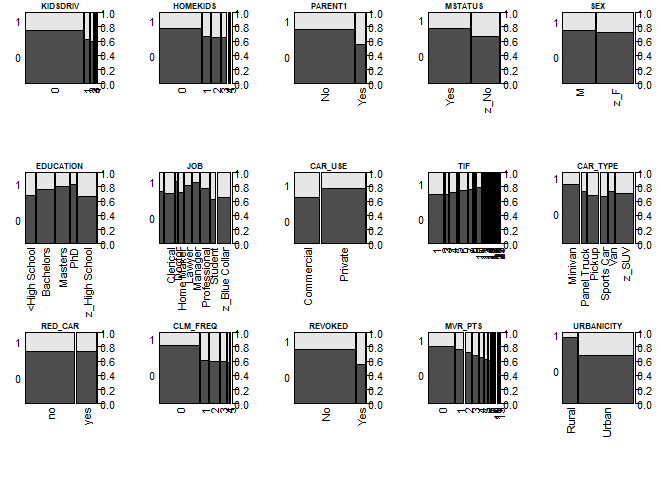

``` r
#for(i in 2:length(cat_var)){
#  par(las=2,mar=c(12,10,1,10),mgp=c(10,1.5,1))
#  cdplot(cat_var$TARGET_FLAG ~ cat_var[,i], data=cat_var ,xlab=names(cat_var)[i], ylab="TARGET_FLAG")
#}

#  conditional densities plots
par(mfrow=c(3,5),mar=c(5,2.0,1,3.0))
for(i in 2:length(cat_var)){
  par(las=2,mgp=c(8,1,0.5)) #mgp=c(10,1.5,1), mar=c(12,10,1,10),
  cdplot(cat_var$TARGET_FLAG ~ cat_var[,i], data=cat_var ,xlab=NULL, ylab="TARGET_FLAG")
  title(names(cat_var)[i], adj = 0.5, line = 0.3, cex.main=0.9)
}
```

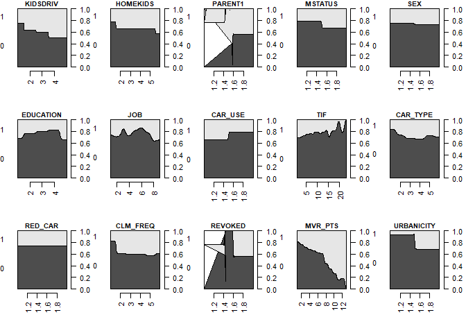

``` r
#names(cat_var)
```

The conditional densities plots show the conditional distribution of a crash over each categorical variables. There is trends that number of kids drive the car (KIDSDRIV), number of kids in the family (HOMEKIDS), whether us single parent (PARENT1), Marital Status(MSTATUS), Vehicle Use for commercial or private (CAR\_USE) time to be a customer (TIF), claim frequEncy (CLM\_FREQ), whether has been revoked (REVOKED), Motor Vehicle Record Points (MVR\_PTS), URBANICITY affect the outcome of whether the car was in crash or not.

### 1.4 Fill in the empty entries on JOB with a new category

From the summary of the whole data set, we can there is one category "others" . By checking the data we see some blank entries in JOB variable. These are the "others". It is not know whether the job information is not collected or the policy holder does not have a job. So the blank entries are coded as 'not known' instead of missing data.

``` r
#levels(insurance_train$JOB)

#str_detect(insurance_train$JOB,"^$|^ $")
insurance_train$JOB <- as.factor(str_replace_all(insurance_train$JOB,"^$|^ $","unkown"))
levels(insurance_train$JOB)
```

    ## [1] "Clerical"      "Doctor"        "Home Maker"    "Lawyer"       
    ## [5] "Manager"       "Professional"  "Student"       "unkown"       
    ## [9] "z_Blue Collar"

### 1.5 Missing values

**1.5.1. The missing data for variables:**

``` r
missing_age <- 6/nrow(insurance_train)
missing_yoj <- 454/nrow(insurance_train)
missing_income <- 445/nrow(insurance_train)
missing_carage <- 464/nrow(insurance_train)
missing_homeval <- 510/nrow(insurance_train)

independent_miss <- data.frame('age'=missing_age,'yoj'=missing_yoj,'income'=missing_income,'carage'=missing_carage,'homeval'=missing_homeval)

kable(independent_miss)
```

|    age|    yoj|  income|  carage|  homeval|
|------:|------:|-------:|-------:|--------:|
|  0.001|  0.056|   0.055|   0.057|    0.062|

There are missing values in AGE (0.07%), YOJ (5.56%), INCOME (5.45%), HOME\_VAL(5.69%) and CAR\_AGE (6.25%). The percentage of missing data for each of these four viables is either less than 5% or sighltly more than 5%.

**1.5.2. The missing data for cases:**

``` r
row_miss <- data.frame(apply(insurance_train, 1, function(x) sum(is.na(x))))
colnames(row_miss) <- 'NAs'
row_miss$NA_percent <- row_miss$NAs/dim(insurance_train)[2]
#kable(row_miss[-which(row_miss==0),])
#kable(row_miss[which(row_miss$NA_percent>0.05),])
table(row_miss[which(row_miss$NA_percent>0.05),])
```

    ##    NA_percent
    ## NAs 0.0769230769230769 0.115384615384615 0.153846153846154
    ##   2                139                 0                 0
    ##   3                  0                12                 0
    ##   4                  0                 0                 1

There are 139 cases miss 7.69% values, 12 cases miss 11.53% and one case misses 15.38% values. To preserve the information and meaning of the non-missing data, I will do the imputation for the missing values.

2. DATA PREPARATION
-------------------

Describe how you have transformed the data by changing the original variables or creating new variables. If you did transform the data or create new variables, discuss why you did this. Here are some possible transformations.

1.  Fix missing values (maybe with a Mean or Median value)

2.  Create flags to suggest if a variable was missing

3.  Transform data by putting it into buckets

4.  Mathematical transforms such as log or square root (or use Box-Cox)

5.  Combine variables (such as ratios or adding or multiplying) to create new variables

### 2.1 MCAR test

Before deciding how to impute the data, we will need to examine the missing data patterns. A visualization of the missing values in variables shown as follows:

``` r
suppressMessages(suppressWarnings(library (rpart)))

suppressMessages(suppressWarnings(library (Hmisc)))
na.patterns <- naclus(insurance_train)

#who.na <- rpart ( is.na (YOJ) ~ TARGET_FLAG+ TARGET_AMT+KIDSDRIV+AGE+HOMEKIDS+INCOME+PARENT1+HOME_VAL+MSTATUS+SEX+EDUCATION+JOB+TRAVTIME+CAR_USE+BLUEBOOK+TIF+CAR_TYPE+RED_CAR+OLDCLAIM+CLM_FREQ+REVOKED+MVR_PTS+CAR_AGE+URBANICITY, data = insurance_train , minbucket =15)

naplot ( na.patterns , 'na per var')
```

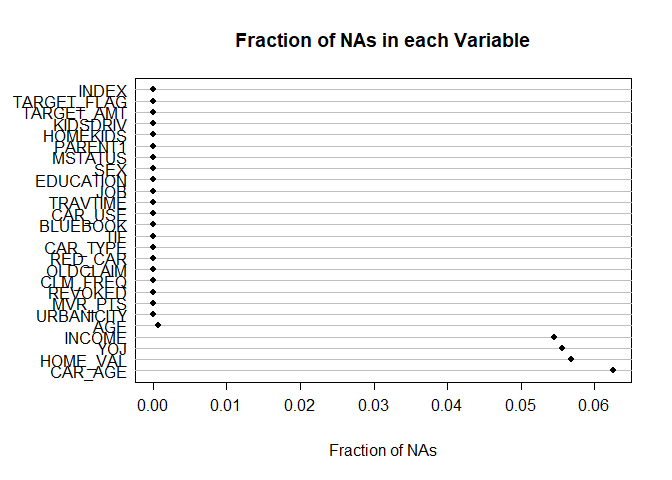

``` r
#plot ( who.na , margin = .1 ) 
#text ( who.na,use.n=TRUE, all=TRUE, cex=.7 ) #too many text

plot ( na.patterns )
```

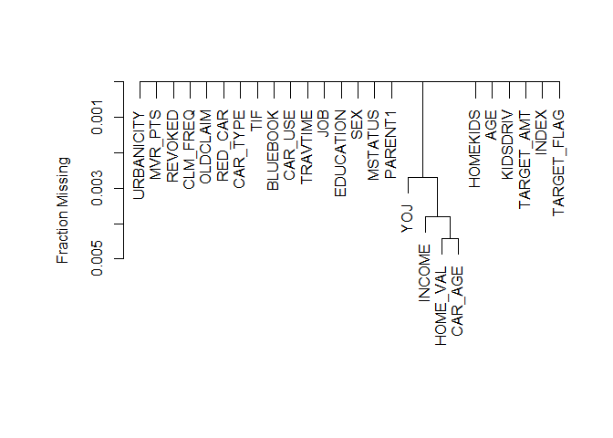

Upper panel shows the fraction of observations missing on each predictor. Lower panel depicts a hierarchical cluster analysis of missingness combinations. The similarity measure shown on the Y -axis is the fraction of observations for which both variables are missing.

``` r
suppressMessages(suppressWarnings(library(MissMech)))
out <- TestMCARNormality(data = insurance_train[,c('AGE', 'YOJ', 'INCOME', 'HOME_VAL', 'CAR_AGE')])
out
```

    ## Call:
    ## TestMCARNormality(data = insurance_train[, c("AGE", "YOJ", "INCOME", 
    ##     "HOME_VAL", "CAR_AGE")])
    ## 
    ## Number of Patterns:  11 
    ## 
    ## Total number of cases used in the analysis:  8142 
    ## 
    ##  Pattern(s) used:
    ##            AGE   YOJ   INCOME   HOME_VAL   CAR_AGE   Number of cases
    ## group.1      1     1        1          1         1              6448
    ## group.2      1     1       NA          1         1               364
    ## group.3      1    NA        1          1         1               385
    ## group.4      1    NA        1         NA         1                21
    ## group.5      1     1        1         NA         1               378
    ## group.6      1     1        1          1        NA               431
    ## group.7      1     1        1         NA        NA                29
    ## group.8      1    NA       NA          1         1                22
    ## group.9      1     1       NA         NA         1                23
    ## group.10     1    NA        1          1        NA                18
    ## group.11     1     1       NA          1        NA                23
    ## 
    ## 
    ##     Test of normality and Homoscedasticity:
    ##   -------------------------------------------
    ## 
    ## Hawkins Test:
    ## 
    ##     P-value for the Hawkins test of normality and homoscedasticity:  0.000000000000000000000000000000000000000214 
    ## 
    ##     Either the test of multivariate normality or homoscedasticity (or both) is rejected.
    ##     Provided that normality can be assumed, the hypothesis of MCAR is 
    ##     rejected at 0.05 significance level. 
    ## 
    ## Non-Parametric Test:
    ## 
    ##     P-value for the non-parametric test of homoscedasticity:  0.259 
    ## 
    ##     Reject Normality at 0.05 significance level.
    ##     There is not sufficient evidence to reject MCAR at 0.05 significance level.

So we conclude that the assumption that missing values has a completely random pattern is valid.

### 2.2 Multiple Imputation

Then impute the missing values using Hmisc package.

The highest fraction of observations with missing values is about 6%, so use 6 imputations.

``` r
#suppressMessages(suppressWarnings(library (Hmisc)))

set.seed (1) 
(mi<-aregImpute (~ TARGET_FLAG+TARGET_AMT+YOJ +KIDSDRIV+AGE+HOMEKIDS+INCOME+PARENT1+HOME_VAL+MSTATUS+SEX+EDUCATION+JOB+TRAVTIME+CAR_USE+BLUEBOOK+TIF+CAR_TYPE+RED_CAR+OLDCLAIM+CLM_FREQ+REVOKED+MVR_PTS+CAR_AGE+URBANICITY, data = insurance_train[,-1], n.impute = 6, nk = 0, pr= FALSE,tlinear=TRUE, type="normpmm",
           pmmtype=1, match="weighted",
           fweighted=0.02,
           curtail=TRUE, boot.method='approximate bayesian', 
           burnin=5, x=FALSE))
```

    ## Warning in aregImpute(~TARGET_FLAG + TARGET_AMT + YOJ + KIDSDRIV + AGE + : KIDSDRIV has the following levels with < 5 observations: 4 
    ## Consider using the group parameter to balance bootstrap samples

    ## Warning in aregImpute(~TARGET_FLAG + TARGET_AMT + YOJ + KIDSDRIV + AGE + : TIF has the following levels with < 5 observations: 22 25 
    ## Consider using the group parameter to balance bootstrap samples

    ## Warning in aregImpute(~TARGET_FLAG + TARGET_AMT + YOJ + KIDSDRIV + AGE + : MVR_PTS has the following levels with < 5 observations: 13 
    ## Consider using the group parameter to balance bootstrap samples

    ## 
    ## Multiple Imputation using Bootstrap and PMM
    ## 
    ## aregImpute(formula = ~TARGET_FLAG + TARGET_AMT + YOJ + KIDSDRIV + 
    ##     AGE + HOMEKIDS + INCOME + PARENT1 + HOME_VAL + MSTATUS + 
    ##     SEX + EDUCATION + JOB + TRAVTIME + CAR_USE + BLUEBOOK + TIF + 
    ##     CAR_TYPE + RED_CAR + OLDCLAIM + CLM_FREQ + REVOKED + MVR_PTS + 
    ##     CAR_AGE + URBANICITY, data = insurance_train[, -1], n.impute = 6, 
    ##     nk = 0, tlinear = TRUE, type = "normpmm", pmmtype = 1, match = "weighted", 
    ##     fweighted = 0.02, curtail = TRUE, boot.method = "approximate bayesian", 
    ##     burnin = 5, x = FALSE, pr = FALSE)
    ## 
    ## n: 8161  p: 25   Imputations: 6      nk: 0 
    ## 
    ## Number of NAs:
    ## TARGET_FLAG  TARGET_AMT         YOJ    KIDSDRIV         AGE    HOMEKIDS 
    ##           0           0         454           0           6           0 
    ##      INCOME     PARENT1    HOME_VAL     MSTATUS         SEX   EDUCATION 
    ##         445           0         464           0           0           0 
    ##         JOB    TRAVTIME     CAR_USE    BLUEBOOK         TIF    CAR_TYPE 
    ##           0           0           0           0           0           0 
    ##     RED_CAR    OLDCLAIM    CLM_FREQ     REVOKED     MVR_PTS     CAR_AGE 
    ##           0           0           0           0           0         510 
    ##  URBANICITY 
    ##           0 
    ## 
    ##             type d.f.
    ## TARGET_FLAG    c    1
    ## TARGET_AMT     l    1
    ## YOJ            l    1
    ## KIDSDRIV       c    4
    ## AGE            l    1
    ## HOMEKIDS       c    5
    ## INCOME         l    1
    ## PARENT1        c    1
    ## HOME_VAL       l    1
    ## MSTATUS        c    1
    ## SEX            c    1
    ## EDUCATION      c    4
    ## JOB            c    8
    ## TRAVTIME       l    1
    ## CAR_USE        c    1
    ## BLUEBOOK       l    1
    ## TIF            c   22
    ## CAR_TYPE       c    5
    ## RED_CAR        c    1
    ## OLDCLAIM       l    1
    ## CLM_FREQ       c    5
    ## REVOKED        c    1
    ## MVR_PTS        c   12
    ## CAR_AGE        l    1
    ## URBANICITY     c    1
    ## 
    ## Transformation of Target Variables Forced to be Linear
    ## 
    ## R-squares for Predicting Non-Missing Values for Each Variable
    ## Using Last Imputations of Predictors
    ##      YOJ      AGE   INCOME HOME_VAL  CAR_AGE 
    ##    0.321    0.368    0.691    0.593    0.529

``` r
#set.seed (3) 
#(mi<-aregImpute (~ TARGET_FLAG+YOJ +TARGET_AMT+KIDSDRIV+AGE+HOMEKIDS+INCOME+PARENT1+HOME_VAL+MSTATUS+SEX+EDUCATION+JOB+TRAVTIME+CAR_USE+BLUEBOOK+TIF+CAR_TYPE+RED_CAR+OLDCLAIM+CLM_FREQ+REVOKED+MVR_PTS+CAR_AGE+URBANICITY, data = insurance_train[,-1], n.impute = 6, nk = 3, pr= FALSE,tlinear=TRUE, type="regression",           match="weighted",           fweighted=0.02))
```

R-squares for predicting non-missing values for each variable are shown as above. R-squares for predicting INCOME, HOME\_VAL and CAR\_AGE are 0.5 - 0.6, suggesting that missing observations in these variables had been adequately predicted. But the prediction for the missing values in YOJ and AGE had not been effectively predicted as the other three variables as the R-squares are only 0.3.

**Collapse some levels less than 10 case to make the data fit the imputation mathod.**

Some levels of some varaibles have too less cases to do bootstrap. Collapse those levels will help to sovle this problem.

``` r
#collapse the levels less than 5 cases
collapse_train <- insurance_train

table(insurance_train$MVR_PTS)
```

    ## 
    ##    0    1    2    3    4    5    6    7    8    9   10   11   13 
    ## 3712 1157  948  758  599  399  266  167   84   45   13   11    2

``` r
#which(table(insurance_train$MVR_PTS)<5)
collapse_train$MVR_PTS <- as.numeric(as.character(collapse_train$MVR_PTS))
collapse_train$MVR_PTS[collapse_train$MVR_PTS%in% c(11,13) ] <- 11
collapse_train$MVR_PTS <- as.factor(collapse_train$MVR_PTS)

table(insurance_train$KIDSDRIV)
```

    ## 
    ##    0    1    2    3    4 
    ## 7180  636  279   62    4

``` r
#which(table(insurance_train$KIDSDRIV)<5)
collapse_train$KIDSDRIV <- as.numeric(as.character(collapse_train$KIDSDRIV))
collapse_train$KIDSDRIV[collapse_train$KIDSDRIV%in% c(3,4) ] <- 3
collapse_train$KIDSDRIV <- as.factor(collapse_train$KIDSDRIV)

table(insurance_train$TIF)
```

    ## 
    ##    1    2    3    4    5    6    7    8    9   10   11   12   13   14   15 
    ## 2533    6  424 1242   52 1341  620   60  225  780  242   45  278   78   31 
    ##   16   17   18   19   20   21   22   25 
    ##   44  104   24    8    8   11    3    2

``` r
collapse_train$TIF <- as.numeric(as.character(collapse_train$TIF))
collapse_train$TIF[collapse_train$TIF%in% c(2) ] <- 3
collapse_train$TIF[collapse_train$TIF%in% c(19,20,21,22,25) ] <- 19
collapse_train$TIF <- as.factor(collapse_train$TIF)

set.seed (4) 
(mi<-aregImpute (~ TARGET_FLAG+YOJ +TARGET_AMT+KIDSDRIV+AGE+HOMEKIDS+INCOME+PARENT1+HOME_VAL+MSTATUS+SEX+EDUCATION+JOB+TRAVTIME+CAR_USE+BLUEBOOK+TIF+CAR_TYPE+RED_CAR+OLDCLAIM+CLM_FREQ+REVOKED+MVR_PTS+CAR_AGE+URBANICITY, data = collapse_train[,-1], n.impute = 6, nk = 3, pr= FALSE,tlinear=TRUE, type="regression",
           match="weighted",boot.method='simple',
           fweighted=0.02))
```

    ## 
    ## Multiple Imputation using Bootstrap and PMM
    ## 
    ## aregImpute(formula = ~TARGET_FLAG + YOJ + TARGET_AMT + KIDSDRIV + 
    ##     AGE + HOMEKIDS + INCOME + PARENT1 + HOME_VAL + MSTATUS + 
    ##     SEX + EDUCATION + JOB + TRAVTIME + CAR_USE + BLUEBOOK + TIF + 
    ##     CAR_TYPE + RED_CAR + OLDCLAIM + CLM_FREQ + REVOKED + MVR_PTS + 
    ##     CAR_AGE + URBANICITY, data = collapse_train[, -1], n.impute = 6, 
    ##     nk = 3, tlinear = TRUE, type = "regression", match = "weighted", 
    ##     fweighted = 0.02, boot.method = "simple", pr = FALSE)
    ## 
    ## n: 8161  p: 25   Imputations: 6      nk: 3 
    ## 
    ## Number of NAs:
    ## TARGET_FLAG         YOJ  TARGET_AMT    KIDSDRIV         AGE    HOMEKIDS 
    ##           0         454           0           0           6           0 
    ##      INCOME     PARENT1    HOME_VAL     MSTATUS         SEX   EDUCATION 
    ##         445           0         464           0           0           0 
    ##         JOB    TRAVTIME     CAR_USE    BLUEBOOK         TIF    CAR_TYPE 
    ##           0           0           0           0           0           0 
    ##     RED_CAR    OLDCLAIM    CLM_FREQ     REVOKED     MVR_PTS     CAR_AGE 
    ##           0           0           0           0           0         510 
    ##  URBANICITY 
    ##           0 
    ## 
    ##             type d.f.
    ## TARGET_FLAG    c    1
    ## YOJ            s    2
    ## TARGET_AMT     s    2
    ## KIDSDRIV       c    3
    ## AGE            s    2
    ## HOMEKIDS       c    5
    ## INCOME         s    2
    ## PARENT1        c    1
    ## HOME_VAL       s    2
    ## MSTATUS        c    1
    ## SEX            c    1
    ## EDUCATION      c    4
    ## JOB            c    8
    ## TRAVTIME       s    2
    ## CAR_USE        c    1
    ## BLUEBOOK       s    2
    ## TIF            c   17
    ## CAR_TYPE       c    5
    ## RED_CAR        c    1
    ## OLDCLAIM       s    2
    ## CLM_FREQ       c    5
    ## REVOKED        c    1
    ## MVR_PTS        c   11
    ## CAR_AGE        s    1
    ## URBANICITY     c    1
    ## 
    ## Transformation of Target Variables Forced to be Linear
    ## 
    ## R-squares for Predicting Non-Missing Values for Each Variable
    ## Using Last Imputations of Predictors
    ##      YOJ      AGE   INCOME HOME_VAL  CAR_AGE 
    ##    0.349    0.404    0.792    0.621    0.544

``` r
#Ecdf (mi$imputed$AGE)
#Ecdf (insurance_train$AGE, add=TRUE , col='gray ', lwd =2, subtitles = FALSE )


#set.seed (4) 
#(mi<-aregImpute (~ TARGET_FLAG+YOJ +TARGET_AMT+KIDSDRIV+AGE+HOMEKIDS+INCOME+PARENT1+HOME_VAL+MSTATUS+SEX+EDUCATION+JOB+TRAVTIME+CAR_USE+BLUEBOOK+TIF+CAR_TYPE+RED_CAR+OLDCLAIM+CLM_FREQ+REVOKED+MVR_PTS+CAR_AGE+URBANICITY, data = collapse_train, n.impute = 6, nk = 0, pr= FALSE,tlinear=TRUE, type="pmm",pmmtype=1,match="weighted",fweighted=0.02,   curtail=TRUE, boot.method='approximate bayesian',  burnin=5, x=FALSE))

#set.seed (6) 
#(mi<-aregImpute (~ TARGET_FLAG+YOJ +TARGET_AMT+KIDSDRIV+AGE+HOMEKIDS+INCOME+PARENT1+HOME_VAL+MSTATUS+SEX+EDUCATION+JOB+TRAVTIME+CAR_USE+BLUEBOOK+TIF+CAR_TYPE+RED_CAR+OLDCLAIM+CLM_FREQ+REVOKED+MVR_PTS+CAR_AGE+URBANICITY, data = collapse_train[,-1], n.impute = 6, nk = 3, pr= FALSE,tlinear=TRUE, type="regression",           match="closest"，boot.method='approximate bayesian'))
```

After collapsing some variables, perform the imputation again. The method also change from nrompmm to regression. R-squares for predicting non-missing values for each variable are shown as above. R-squares for predicting non-missing values of INCOME, HOME\_VAL and CAR\_AGE increase 0.5 - 0.7, suggesting an adequately prediction for these variables. R-squares for AGE increased from 0.3 to 0.4. R-squares for YOJ is still 0.3, suggesting an inadequate prediction.

``` r
# print the first 10 imputed values
mi$imputed$YOJ[1:10,]
```

    ##      [,1]  [,2]  [,3]  [,4] [,5]  [,6]
    ## 5   10.93 12.83 11.62  6.45 16.8  7.07
    ## 7    7.24  7.70 11.29  8.91 11.6  9.02
    ## 8   19.04 14.13 18.93 11.81 11.1 12.75
    ## 46  13.31 14.70 20.07 12.29 19.1 12.13
    ## 54   3.93 11.45 19.38  6.60 11.2  7.46
    ## 55  14.06 17.02 12.70 10.07 13.7  4.49
    ## 71   9.81  8.31  5.71  4.56 12.7 10.16
    ## 77  15.74 12.69 17.36 11.45 15.8 10.64
    ## 83  15.76 13.69 14.09 16.73 13.9 12.00
    ## 116  9.97 11.89 15.12 11.04 11.2 12.57

Show the distribution of imputed (black) and actual data (gray).

``` r
par(mfrow=c(2,3))
Ecdf (mi$imputed$YOJ)
Ecdf (insurance_train$YOJ, add=TRUE , col='gray ', lwd =2, subtitles = FALSE )

Ecdf (mi$imputed$AGE)
Ecdf (insurance_train$AGE, add=TRUE , col='gray ', lwd =2, subtitles = FALSE )

Ecdf (mi$imputed$INCOME[,1])
Ecdf (insurance_train$INCOME, add=TRUE , col='gray ', lwd =2, subtitles = FALSE )

Ecdf (mi$imputed$HOME_VAL[,1])
Ecdf (insurance_train$HOME_VAL, add=TRUE , col='gray ', lwd =2, subtitles = FALSE )

Ecdf (mi$imputed$CAR_AGE[,1])
#Ecdf (insurance_train$CAR_AGE, add=TRUE , col='gray ', lwd =2, subtitles = FALSE )
Ecdf (insurance_train$CAR_AGE, add=TRUE , col='gray ', lwd =2, subtitles = FALSE )
```

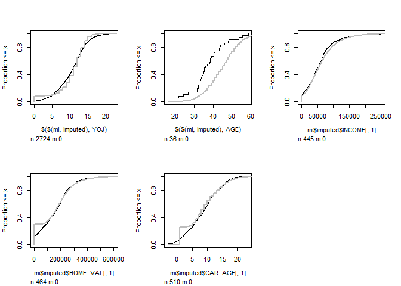

Except AGE, all the distributions of the imputation agree with the distributions of the observed data. Other methods have been tried and the results shown here seems to be the best I can get.

Since AGE only misses 6 values out of 8161 values, the off of the imputation would not be a big problem.

### 2.3 Collinearities

The imputed values fill the empty entries before performing collinearities test.

``` r
fill_data <- function(impute = mi, data = collapse_train, im = 1) {
  cbind.data.frame(impute.transcan(x = impute, 
                                   imputation = im, 
                                   data = data, 
                                   list.out = TRUE, 
                                   pr = FALSE))
}

fill_data_6 <- fill_data(im = 6) #use the last imputation

# the numeric variables dataframe changed
num_var_fill <- select_if(fill_data_6, is.numeric)
```

#### 2.3.1 correlation graph

``` r
# Plot a correlation graph
suppressMessages(suppressWarnings(library(corrplot)))

# calculate Pearson correlation between predictors.
traincor <- cor(num_var_fill,use = "na.or.complete")

corrplot(traincor, method = "number",number.cex = .57)
```

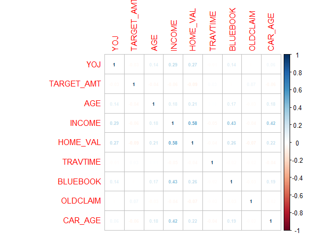

``` r
#corr
```

No variable is correlated to the target variable. It is supprise that there is no appreciable correlation between the dependent variable TARGET\_AMT between any other independent variable.

``` r
suppressMessages(suppressWarnings(library(PerformanceAnalytics)))

chart.Correlation(num_var_fill, 
                  method="spearman",
                  histogram=TRUE,
                  pch=16)
```

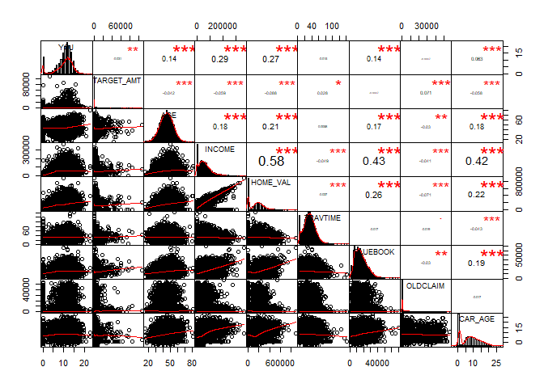

#### 2.3.2 VIF test

``` r
# copy these files in the working directory and source the code for vif function
source(file = "HighstatLibV6.R")

corvif_noCorr <- function(dataz) {
    dataz <- as.data.frame(dataz)
    # correlation part cat('Correlations of the variables\n\n') tmp_cor <-
    # cor(dataz,use='complete.obs') print(tmp_cor)

    # vif part
    form <- formula(paste("fooy ~ ", paste(strsplit(names(dataz), " "), collapse = " + ")))
    dataz <- data.frame(fooy = 1, dataz)
    lm_mod <- lm(form, dataz)

    cat("\n\nVariance inflation factors\n\n")
    print(myvif(lm_mod))
}

thinXwithVIF = function(X, Threshold = 3) {
    VIFS = corvif(X)
    XVars = names(X)
    max(VIFS$GVIF)
    while (max(VIFS$GVIF) >= Threshold) {
        print(paste("Drop ", XVars[which.max(VIFS$GVIF)], ".", sep = ""), quote = FALSE)
        XVars = XVars[-which.max(VIFS$GVIF)]
        X = X[, -which.max(VIFS$GVIF)]
        VIFS = corvif_noCorr(X)
        print(max(VIFS$GVIF))
    }
    return(list(VIFS = VIFS, XVars = XVars, X = X))
}


Threshold <- 4
thinXwithVIF(num_var_fill, Threshold)$VIFS
```

    ## 
    ## 
    ## Variance inflation factors
    ## 
    ##            GVIF
    ## YOJ        1.12
    ## TARGET_AMT 1.02
    ## AGE        1.09
    ## INCOME     2.00
    ## HOME_VAL   1.57
    ## TRAVTIME   1.00
    ## BLUEBOOK   1.24
    ## OLDCLAIM   1.01
    ## CAR_AGE    1.24

    ##            GVIF
    ## YOJ        1.12
    ## TARGET_AMT 1.02
    ## AGE        1.09
    ## INCOME     2.00
    ## HOME_VAL   1.57
    ## TRAVTIME   1.00
    ## BLUEBOOK   1.24
    ## OLDCLAIM   1.01
    ## CAR_AGE    1.24

VIFs are less than the threshold and do not indicate we should take off any numeric variables because of the multicollinearities. Using the same cut-off, the correlation test results do not warn any variable highly correlated to other variables and need to be eliminated.

``` r
Cor <- cor(num_var_fill)
suppressMessages(suppressWarnings(library(caret)))
(highCor <- findCorrelation(Cor, cutoff = 0.75))
```

    ## integer(0)

Using findCorrelation function in caret package also suggests there is no collinearities needs to be watched and no variable needs to be eliminated.

3. BUILD MODELS
---------------

Using the training data set, build at least two different multiple linear regression models and three different binary logistic regression models, using different variables (or the same variables with different transformations). You may select the variables manually, use an approach such as Forward or Stepwise, use a different approach such as trees, or use a combination of techniques. Describe the techniques you used. If you manually selected a variable for inclusion into the model or exclusion into the model, indicate why this was done.

Discuss the coefficients in the models, do they make sense? For example, if a person has a lot of traffic tickets, you would reasonably expect that person to have more car crashes. If the coefficient is negative (suggesting that the person is a safer driver), then that needs to be discussed. Are you keeping the model even though it is counter intuitive? Why? The boss needs to know.

### 3.1 Logistic regression model - AIC-based automated enumeration approach

In part 2 function aregImpute is used to multiply imputes every missing value in the data and thus creates multiple data sets. Now fit.mult.impute will be used to calculates averaged coefficients, based on the created data sets, with imputation corrected variances.

#### 3.1.3 Build the model

``` r
logit_1 <- fit.mult.impute(TARGET_FLAG ~ YOJ+KIDSDRIV+AGE+HOMEKIDS+INCOME+PARENT1+HOME_VAL+MSTATUS+SEX+EDUCATION+JOB+TRAVTIME+CAR_USE+BLUEBOOK+TIF+CAR_TYPE+RED_CAR+OLDCLAIM+CLM_FREQ+REVOKED+MVR_PTS+CAR_AGE+URBANICITY,fitter=glm, xtrans=mi,  family = binomial(link='logit'), data = collapse_train)
```

    ## 
    ## Variance Inflation Factors Due to Imputation:
    ## 
    ##                     (Intercept)                             YOJ 
    ##                            1.01                            1.10 
    ##                       KIDSDRIV1                       KIDSDRIV2 
    ##                            1.00                            1.00 
    ##                       KIDSDRIV3                             AGE 
    ##                            1.00                            1.00 
    ##                       HOMEKIDS1                       HOMEKIDS2 
    ##                            1.00                            1.00 
    ##                       HOMEKIDS3                       HOMEKIDS4 
    ##                            1.00                            1.00 
    ##                       HOMEKIDS5                          INCOME 
    ##                            1.00                            1.05 
    ##                      PARENT1Yes                        HOME_VAL 
    ##                            1.00                            1.05 
    ##                     MSTATUSz_No                          SEXz_F 
    ##                            1.02                            1.00 
    ##              EDUCATIONBachelors                EDUCATIONMasters 
    ##                            1.00                            1.00 
    ##                    EDUCATIONPhD          EDUCATIONz_High School 
    ##                            1.00                            1.00 
    ##                       JOBDoctor                   JOBHome Maker 
    ##                            1.00                            1.01 
    ##                       JOBLawyer                      JOBManager 
    ##                            1.00                            1.00 
    ##                 JOBProfessional                      JOBStudent 
    ##                            1.00                            1.02 
    ##                       JOBunkown                JOBz_Blue Collar 
    ##                            1.00                            1.00 
    ##                        TRAVTIME                  CAR_USEPrivate 
    ##                            1.00                            1.00 
    ##                        BLUEBOOK                            TIF3 
    ##                            1.00                            1.00 
    ##                            TIF4                            TIF5 
    ##                            1.00                            1.00 
    ##                            TIF6                            TIF7 
    ##                            1.00                            1.00 
    ##                            TIF8                            TIF9 
    ##                            1.00                            1.00 
    ##                           TIF10                           TIF11 
    ##                            1.00                            1.00 
    ##                           TIF12                           TIF13 
    ##                            1.00                            1.00 
    ##                           TIF14                           TIF15 
    ##                            1.00                            1.00 
    ##                           TIF16                           TIF17 
    ##                            1.00                            1.00 
    ##                           TIF18                           TIF19 
    ##                            1.00                            1.00 
    ##             CAR_TYPEPanel Truck                  CAR_TYPEPickup 
    ##                            1.00                            1.00 
    ##              CAR_TYPESports Car                     CAR_TYPEVan 
    ##                            1.00                            1.00 
    ##                   CAR_TYPEz_SUV                      RED_CARyes 
    ##                            1.00                            1.00 
    ##                        OLDCLAIM                       CLM_FREQ1 
    ##                            1.00                            1.00 
    ##                       CLM_FREQ2                       CLM_FREQ3 
    ##                            1.00                            1.00 
    ##                       CLM_FREQ4                       CLM_FREQ5 
    ##                            1.00                            1.00 
    ##                      REVOKEDYes                        MVR_PTS1 
    ##                            1.00                            1.00 
    ##                        MVR_PTS2                        MVR_PTS3 
    ##                            1.00                            1.00 
    ##                        MVR_PTS4                        MVR_PTS5 
    ##                            1.00                            1.00 
    ##                        MVR_PTS6                        MVR_PTS7 
    ##                            1.00                            1.00 
    ##                        MVR_PTS8                        MVR_PTS9 
    ##                            1.00                            1.00 
    ##                       MVR_PTS10                       MVR_PTS11 
    ##                            1.00                            1.00 
    ##                         CAR_AGE URBANICITYz_Highly Rural/ Rural 
    ##                            1.02                            1.00 
    ## 
    ## Rate of Missing Information:
    ## 
    ##                     (Intercept)                             YOJ 
    ##                            0.01                            0.09 
    ##                       KIDSDRIV1                       KIDSDRIV2 
    ##                            0.00                            0.00 
    ##                       KIDSDRIV3                             AGE 
    ##                            0.00                            0.00 
    ##                       HOMEKIDS1                       HOMEKIDS2 
    ##                            0.00                            0.00 
    ##                       HOMEKIDS3                       HOMEKIDS4 
    ##                            0.00                            0.00 
    ##                       HOMEKIDS5                          INCOME 
    ##                            0.00                            0.05 
    ##                      PARENT1Yes                        HOME_VAL 
    ##                            0.00                            0.05 
    ##                     MSTATUSz_No                          SEXz_F 
    ##                            0.02                            0.00 
    ##              EDUCATIONBachelors                EDUCATIONMasters 
    ##                            0.00                            0.00 
    ##                    EDUCATIONPhD          EDUCATIONz_High School 
    ##                            0.00                            0.00 
    ##                       JOBDoctor                   JOBHome Maker 
    ##                            0.00                            0.01 
    ##                       JOBLawyer                      JOBManager 
    ##                            0.00                            0.00 
    ##                 JOBProfessional                      JOBStudent 
    ##                            0.00                            0.02 
    ##                       JOBunkown                JOBz_Blue Collar 
    ##                            0.00                            0.00 
    ##                        TRAVTIME                  CAR_USEPrivate 
    ##                            0.00                            0.00 
    ##                        BLUEBOOK                            TIF3 
    ##                            0.00                            0.00 
    ##                            TIF4                            TIF5 
    ##                            0.00                            0.00 
    ##                            TIF6                            TIF7 
    ##                            0.00                            0.00 
    ##                            TIF8                            TIF9 
    ##                            0.00                            0.00 
    ##                           TIF10                           TIF11 
    ##                            0.00                            0.00 
    ##                           TIF12                           TIF13 
    ##                            0.00                            0.00 
    ##                           TIF14                           TIF15 
    ##                            0.00                            0.00 
    ##                           TIF16                           TIF17 
    ##                            0.00                            0.00 
    ##                           TIF18                           TIF19 
    ##                            0.00                            0.00 
    ##             CAR_TYPEPanel Truck                  CAR_TYPEPickup 
    ##                            0.00                            0.00 
    ##              CAR_TYPESports Car                     CAR_TYPEVan 
    ##                            0.00                            0.00 
    ##                   CAR_TYPEz_SUV                      RED_CARyes 
    ##                            0.00                            0.00 
    ##                        OLDCLAIM                       CLM_FREQ1 
    ##                            0.00                            0.00 
    ##                       CLM_FREQ2                       CLM_FREQ3 
    ##                            0.00                            0.00 
    ##                       CLM_FREQ4                       CLM_FREQ5 
    ##                            0.00                            0.00 
    ##                      REVOKEDYes                        MVR_PTS1 
    ##                            0.00                            0.00 
    ##                        MVR_PTS2                        MVR_PTS3 
    ##                            0.00                            0.00 
    ##                        MVR_PTS4                        MVR_PTS5 
    ##                            0.00                            0.00 
    ##                        MVR_PTS6                        MVR_PTS7 
    ##                            0.00                            0.00 
    ##                        MVR_PTS8                        MVR_PTS9 
    ##                            0.00                            0.00 
    ##                       MVR_PTS10                       MVR_PTS11 
    ##                            0.00                            0.00 
    ##                         CAR_AGE URBANICITYz_Highly Rural/ Rural 
    ##                            0.02                            0.00 
    ## 
    ## d.f. for t-distribution for Tests of Single Coefficients:
    ## 
    ##                     (Intercept)                             YOJ 
    ##                           46247                             574 
    ##                       KIDSDRIV1                       KIDSDRIV2 
    ##                       154782762                        64548303 
    ##                       KIDSDRIV3                             AGE 
    ##                       111843465                         1865255 
    ##                       HOMEKIDS1                       HOMEKIDS2 
    ##                        30591293                         2113696 
    ##                       HOMEKIDS3                       HOMEKIDS4 
    ##                         1087973                         4779908 
    ##                       HOMEKIDS5                          INCOME 
    ##                       426234621                            1849 
    ##                      PARENT1Yes                        HOME_VAL 
    ##                        41160350                            2256 
    ##                     MSTATUSz_No                          SEXz_F 
    ##                           14216                       233560940 
    ##              EDUCATIONBachelors                EDUCATIONMasters 
    ##                         1276361                          378669 
    ##                    EDUCATIONPhD          EDUCATIONz_High School 
    ##                          943438                        35240791 
    ##                       JOBDoctor                   JOBHome Maker 
    ##                       104233178                           25724 
    ##                       JOBLawyer                      JOBManager 
    ##                        18423335                         2520195 
    ##                 JOBProfessional                      JOBStudent 
    ##                          596061                           18918 
    ##                       JOBunkown                JOBz_Blue Collar 
    ##                         3690770                         4548197 
    ##                        TRAVTIME                  CAR_USEPrivate 
    ##                       691400227                       133949637 
    ##                        BLUEBOOK                            TIF3 
    ##                          829194                       629311971 
    ##                            TIF4                            TIF5 
    ##                        29999639                      3390013638 
    ##                            TIF6                            TIF7 
    ##                        29697439                      6729957770 
    ##                            TIF8                            TIF9 
    ##                        29882518                       129953067 
    ##                           TIF10                           TIF11 
    ##                         8652978                        87285762 
    ##                           TIF12                           TIF13 
    ##                        54753784                      4178897862 
    ##                           TIF14                           TIF15 
    ##                       386124046                       868205006 
    ##                           TIF16                           TIF17 
    ##                      1954134544                     30510602105 
    ##                           TIF18                           TIF19 
    ##                       734772726                       564151960 
    ##             CAR_TYPEPanel Truck                  CAR_TYPEPickup 
    ##                       324858157                        93615219 
    ##              CAR_TYPESports Car                     CAR_TYPEVan 
    ##                        25547646                       156278090 
    ##                   CAR_TYPEz_SUV                      RED_CARyes 
    ##                       874098785                       107612758 
    ##                        OLDCLAIM                       CLM_FREQ1 
    ##                        13417465                        38714247 
    ##                       CLM_FREQ2                       CLM_FREQ3 
    ##                        48564792                        27458966 
    ##                       CLM_FREQ4                       CLM_FREQ5 
    ##                       515436964                        27214637 
    ##                      REVOKEDYes                        MVR_PTS1 
    ##                        26895764                        36725100 
    ##                        MVR_PTS2                        MVR_PTS3 
    ##                        90866875                       224984003 
    ##                        MVR_PTS4                        MVR_PTS5 
    ##                        22090764                       157080019 
    ##                        MVR_PTS6                        MVR_PTS7 
    ##                       173796020                        87775973 
    ##                        MVR_PTS8                        MVR_PTS9 
    ##                        52024566                        83221854 
    ##                       MVR_PTS10                       MVR_PTS11 
    ##                         5432293                        16613524 
    ##                         CAR_AGE URBANICITYz_Highly Rural/ Rural 
    ##                            9216                        88112458 
    ## 
    ## The following fit components were averaged over the 6 model fits:
    ## 
    ##   fitted.values linear.predictors

``` r
summary(logit_1)
```

    ## 
    ## Call:
    ## fit.mult.impute(formula = TARGET_FLAG ~ YOJ + KIDSDRIV + AGE + 
    ##     HOMEKIDS + INCOME + PARENT1 + HOME_VAL + MSTATUS + SEX + 
    ##     EDUCATION + JOB + TRAVTIME + CAR_USE + BLUEBOOK + TIF + CAR_TYPE + 
    ##     RED_CAR + OLDCLAIM + CLM_FREQ + REVOKED + MVR_PTS + CAR_AGE + 
    ##     URBANICITY, fitter = glm, xtrans = mi, data = collapse_train, 
    ##     family = binomial(link = "logit"))
    ## 
    ## Deviance Residuals: 
    ##    Min      1Q  Median      3Q     Max  
    ## -2.656  -0.707  -0.389   0.607   3.145  
    ## 
    ## Coefficients:
    ##                                     Estimate   Std. Error z value
    ## (Intercept)                     -0.764439000  0.282566238   -2.71
    ## YOJ                             -0.013007877  0.008543048   -1.52
    ## KIDSDRIV1                        0.464321820  0.115555312    4.02
    ## KIDSDRIV2                        0.716069239  0.164857919    4.34
    ## KIDSDRIV3                        0.900266787  0.310262736    2.90
    ## AGE                              0.001919886  0.004206635    0.46
    ## HOMEKIDS1                        0.331462114  0.119822402    2.77
    ## HOMEKIDS2                        0.229730763  0.118219572    1.94
    ## HOMEKIDS3                        0.209271833  0.137275442    1.52
    ## HOMEKIDS4                        0.116944253  0.219073841    0.53
    ## HOMEKIDS5                        0.655637772  0.629570729    1.04
    ## INCOME                          -0.000003703  0.000001134   -3.27
    ## PARENT1Yes                       0.256865662  0.122043749    2.10
    ## HOME_VAL                        -0.000001295  0.000000354   -3.66
    ## MSTATUSz_No                      0.543021709  0.089598661    6.06
    ## SEXz_F                          -0.124901730  0.113186380   -1.10
    ## EDUCATIONBachelors              -0.369734718  0.117727133   -3.14
    ## EDUCATIONMasters                -0.241304306  0.182963019   -1.32
    ## EDUCATIONPhD                    -0.103467573  0.218279718   -0.47
    ## EDUCATIONz_High School           0.014099516  0.095804273    0.15
    ## JOBDoctor                       -0.859681456  0.289676893   -2.97
    ## JOBHome Maker                   -0.205701970  0.146731154   -1.40
    ## JOBLawyer                       -0.316850005  0.187843667   -1.69
    ## JOBManager                      -0.949051205  0.145716672   -6.51
    ## JOBProfessional                 -0.233403049  0.126196193   -1.85
    ## JOBStudent                      -0.223446018  0.133985508   -1.67
    ## JOBunkown                       -0.373180807  0.199285343   -1.87
    ## JOBz_Blue Collar                -0.060753901  0.107825440   -0.56
    ## TRAVTIME                         0.014941965  0.001903074    7.85
    ## CAR_USEPrivate                  -0.743859690  0.092564717   -8.04
    ## BLUEBOOK                        -0.000020223  0.000005311   -3.81
    ## TIF3                            -0.194638470  0.132702737   -1.47
    ## TIF4                            -0.213578238  0.090151698   -2.37
    ## TIF5                            -0.925183754  0.421794634   -2.19
    ## TIF6                            -0.362145378  0.088849934   -4.08
    ## TIF7                            -0.545504781  0.121027402   -4.51
    ## TIF8                             0.157983064  0.338641316    0.47
    ## TIF9                            -0.533484118  0.193832924   -2.75
    ## TIF10                           -0.736673826  0.113649525   -6.48
    ## TIF11                           -0.353247353  0.180915275   -1.95
    ## TIF12                           -0.569651304  0.437492729   -1.30
    ## TIF13                           -0.547036387  0.172068189   -3.18
    ## TIF14                           -1.189359079  0.386258455   -3.08
    ## TIF15                            0.249336347  0.422451009    0.59
    ## TIF16                           -0.572427651  0.414426933   -1.38
    ## TIF17                           -0.782186405  0.287787816   -2.72
    ## TIF18                           -0.334791030  0.560984942   -0.60
    ## TIF19                           -1.336392231  0.643377123   -2.08
    ## CAR_TYPEPanel Truck              0.539859902  0.163434942    3.30
    ## CAR_TYPEPickup                   0.544430601  0.101643144    5.36
    ## CAR_TYPESports Car               1.046978598  0.131007671    7.99
    ## CAR_TYPEVan                      0.622993946  0.127613665    4.88
    ## CAR_TYPEz_SUV                    0.770089730  0.112318765    6.86
    ## RED_CARyes                      -0.007091485  0.087377171   -0.08
    ## OLDCLAIM                        -0.000020535  0.000004243   -4.84
    ## CLM_FREQ1                        0.600419179  0.100415062    5.98
    ## CLM_FREQ2                        0.650558759  0.095256330    6.83
    ## CLM_FREQ3                        0.648419674  0.107608840    6.03
    ## CLM_FREQ4                        0.827055334  0.179029037    4.62
    ## CLM_FREQ5                        1.187578805  0.551457622    2.15
    ## REVOKEDYes                       0.963476535  0.093539673   10.30
    ## MVR_PTS1                         0.136813969  0.092455500    1.48
    ## MVR_PTS2                         0.296360432  0.096962548    3.06
    ## MVR_PTS3                         0.341412243  0.102843179    3.32
    ## MVR_PTS4                         0.269178293  0.112528318    2.39
    ## MVR_PTS5                         0.208228960  0.130256748    1.60
    ## MVR_PTS6                         0.296695490  0.153199882    1.94
    ## MVR_PTS7                         0.961824869  0.186895969    5.15
    ## MVR_PTS8                         1.311424910  0.264495304    4.96
    ## MVR_PTS9                         1.298289666  0.372335121    3.49
    ## MVR_PTS10                        1.669294104  0.806398110    2.07
    ## MVR_PTS11                        2.137541900  0.858955917    2.49
    ## CAR_AGE                         -0.003713393  0.007641788   -0.49
    ## URBANICITYz_Highly Rural/ Rural -2.348025164  0.113656020  -20.66
    ##                                             Pr(>|z|)    
    ## (Intercept)                                  0.00682 ** 
    ## YOJ                                          0.12785    
    ## KIDSDRIV1                        0.00005864987230935 ***
    ## KIDSDRIV2                        0.00001401961347883 ***
    ## KIDSDRIV3                                    0.00371 ** 
    ## AGE                                          0.64811    
    ## HOMEKIDS1                                    0.00567 ** 
    ## HOMEKIDS2                                    0.05199 .  
    ## HOMEKIDS3                                    0.12739    
    ## HOMEKIDS4                                    0.59347    
    ## HOMEKIDS5                                    0.29769    
    ## INCOME                                       0.00109 ** 
    ## PARENT1Yes                                   0.03532 *  
    ## HOME_VAL                                     0.00026 ***
    ## MSTATUSz_No                      0.00000000135614133 ***
    ## SEXz_F                                       0.26981    
    ## EDUCATIONBachelors                           0.00169 ** 
    ## EDUCATIONMasters                             0.18721    
    ## EDUCATIONPhD                                 0.63549    
    ## EDUCATIONz_High School                       0.88300    
    ## JOBDoctor                                    0.00300 ** 
    ## JOBHome Maker                                0.16095    
    ## JOBLawyer                                    0.09165 .  
    ## JOBManager                       0.00000000007366948 ***
    ## JOBProfessional                              0.06438 .  
    ## JOBStudent                                   0.09538 .  
    ## JOBunkown                                    0.06112 .  
    ## JOBz_Blue Collar                             0.57313    
    ## TRAVTIME                         0.00000000000000411 ***
    ## CAR_USEPrivate                   0.00000000000000093 ***
    ## BLUEBOOK                                     0.00014 ***
    ## TIF3                                         0.14245    
    ## TIF4                                         0.01783 *  
    ## TIF5                                         0.02828 *  
    ## TIF6                             0.00004583243291394 ***
    ## TIF7                             0.00000656629576547 ***
    ## TIF8                                         0.64084    
    ## TIF9                                         0.00592 ** 
    ## TIF10                            0.00000000009052728 ***
    ## TIF11                                        0.05087 .  
    ## TIF12                                        0.19289    
    ## TIF13                                        0.00148 ** 
    ## TIF14                                        0.00208 ** 
    ## TIF15                                        0.55505    
    ## TIF16                                        0.16720    
    ## TIF17                                        0.00657 ** 
    ## TIF18                                        0.55065    
    ## TIF19                                        0.03779 *  
    ## CAR_TYPEPanel Truck                          0.00096 ***
    ## CAR_TYPEPickup                   0.00000008494607557 ***
    ## CAR_TYPESports Car               0.00000000000000133 ***
    ## CAR_TYPEVan                      0.00000105081924846 ***
    ## CAR_TYPEz_SUV                    0.00000000000706731 ***
    ## RED_CARyes                                   0.93532    
    ## OLDCLAIM                         0.00000130065701561 ***
    ## CLM_FREQ1                        0.00000000223997214 ***
    ## CLM_FREQ2                        0.00000000000851759 ***
    ## CLM_FREQ3                        0.00000000168368760 ***
    ## CLM_FREQ4                        0.00000384348123079 ***
    ## CLM_FREQ5                                    0.03128 *  
    ## REVOKEDYes                      < 0.0000000000000002 ***
    ## MVR_PTS1                                     0.13893    
    ## MVR_PTS2                                     0.00224 ** 
    ## MVR_PTS3                                     0.00090 ***
    ## MVR_PTS4                                     0.01675 *  
    ## MVR_PTS5                                     0.10991    
    ## MVR_PTS6                                     0.05279 .  
    ## MVR_PTS7                         0.00000026565819130 ***
    ## MVR_PTS8                         0.00000071143352558 ***
    ## MVR_PTS9                                     0.00049 ***
    ## MVR_PTS10                                    0.03845 *  
    ## MVR_PTS11                                    0.01283 *  
    ## CAR_AGE                                      0.62701    
    ## URBANICITYz_Highly Rural/ Rural < 0.0000000000000002 ***
    ## ---
    ## Signif. codes:  0 '***' 0.001 '**' 0.01 '*' 0.05 '.' 0.1 ' ' 1
    ## 
    ## (Dispersion parameter for binomial family taken to be 1)
    ## 
    ##     Null deviance: 9418.0  on 8160  degrees of freedom
    ## Residual deviance: 7207.6  on 8087  degrees of freedom
    ## AIC: 7356
    ## 
    ## Number of Fisher Scoring iterations: 5

There are more than half of the 18 TIF levels (10 levels) are significant. similar things could be seen in the categorical variables KIDSDRIV, CLM\_FREQ, MVR\_PTS. 2 out of 6 levels which larger than 0 in HOMEKIDS are significant. To make the model simpler, I will collapse the non-zero levels to be one level. In the other words, These five categorical variables with numbers as their levels will be converted to binary variables.

**Adjust the model**

``` r
binary_trsf <- collapse_train[,-1]
binary_trsf$KIDSDRIV <- as.factor(ifelse(binary_trsf$KIDSDRIV == 0,0,1))
binary_trsf$HOMEKIDS <- as.factor(ifelse(binary_trsf$HOMEKIDS == 0,0,1))
#binary_trsf$PARENT1 <- as.factor(ifelse(binary_trsf$PARENT1 == 'No',0,1))
#binary_trsf$MSTATUS <- as.factor(ifelse(binary_trsf$MSTATUS == 'z_No',0,1))
#binary_trsf$CAR_USE <- as.factor(ifelse(binary_trsf$CAR_USE == 'Private',0,1))
binary_trsf$TIF <- as.factor(ifelse(binary_trsf$TIF == 1,0,1))
binary_trsf$CLM_FREQ <- as.factor(ifelse(binary_trsf$CLM_FREQ == 0,0,1))
#binary_trsf$REVOKED <- as.factor(ifelse(binary_trsf$REVOKED == 'No',0,1))
binary_trsf$MVR_PTS <- as.factor(ifelse(binary_trsf$MVR_PTS == 0,0,1))
#binary_trsf$URBANICITY <- as.factor(ifelse(binary_trsf$URBANICITY == 'z_Highly Rural/ Rural',0,1))

#There is kids driver will be 1 otherwise 0. There are kids in the family will be coded as 1 otherwise 0. Single parent will be denoted as 1 otherwise 0. Married person is coded as 1 otherwise 0. Commerail car

# redo imputation
set.seed (6) 
(mi_2 <- aregImpute (~ TARGET_FLAG+YOJ +TARGET_AMT+KIDSDRIV+AGE+HOMEKIDS+INCOME+PARENT1+HOME_VAL+MSTATUS+SEX+EDUCATION+JOB+TRAVTIME+CAR_USE+BLUEBOOK+TIF+CAR_TYPE+RED_CAR+OLDCLAIM+CLM_FREQ+REVOKED+MVR_PTS+CAR_AGE+URBANICITY, data = binary_trsf, n.impute = 6, nk = 3, pr= FALSE,tlinear=TRUE, type="regression",
           match="weighted",boot.method='simple',
           fweighted=0.02))
```

    ## 
    ## Multiple Imputation using Bootstrap and PMM
    ## 
    ## aregImpute(formula = ~TARGET_FLAG + YOJ + TARGET_AMT + KIDSDRIV + 
    ##     AGE + HOMEKIDS + INCOME + PARENT1 + HOME_VAL + MSTATUS + 
    ##     SEX + EDUCATION + JOB + TRAVTIME + CAR_USE + BLUEBOOK + TIF + 
    ##     CAR_TYPE + RED_CAR + OLDCLAIM + CLM_FREQ + REVOKED + MVR_PTS + 
    ##     CAR_AGE + URBANICITY, data = binary_trsf, n.impute = 6, nk = 3, 
    ##     tlinear = TRUE, type = "regression", match = "weighted", 
    ##     fweighted = 0.02, boot.method = "simple", pr = FALSE)
    ## 
    ## n: 8161  p: 25   Imputations: 6      nk: 3 
    ## 
    ## Number of NAs:
    ## TARGET_FLAG         YOJ  TARGET_AMT    KIDSDRIV         AGE    HOMEKIDS 
    ##           0         454           0           0           6           0 
    ##      INCOME     PARENT1    HOME_VAL     MSTATUS         SEX   EDUCATION 
    ##         445           0         464           0           0           0 
    ##         JOB    TRAVTIME     CAR_USE    BLUEBOOK         TIF    CAR_TYPE 
    ##           0           0           0           0           0           0 
    ##     RED_CAR    OLDCLAIM    CLM_FREQ     REVOKED     MVR_PTS     CAR_AGE 
    ##           0           0           0           0           0         510 
    ##  URBANICITY 
    ##           0 
    ## 
    ##             type d.f.
    ## TARGET_FLAG    c    1
    ## YOJ            s    2
    ## TARGET_AMT     s    2
    ## KIDSDRIV       c    1
    ## AGE            s    2
    ## HOMEKIDS       c    1
    ## INCOME         s    2
    ## PARENT1        c    1
    ## HOME_VAL       s    2
    ## MSTATUS        c    1
    ## SEX            c    1
    ## EDUCATION      c    4
    ## JOB            c    8
    ## TRAVTIME       s    2
    ## CAR_USE        c    1
    ## BLUEBOOK       s    2
    ## TIF            c    1
    ## CAR_TYPE       c    5
    ## RED_CAR        c    1
    ## OLDCLAIM       s    2
    ## CLM_FREQ       c    1
    ## REVOKED        c    1
    ## MVR_PTS        c    1
    ## CAR_AGE        s    1
    ## URBANICITY     c    1
    ## 
    ## Transformation of Target Variables Forced to be Linear
    ## 
    ## R-squares for Predicting Non-Missing Values for Each Variable
    ## Using Last Imputations of Predictors
    ##      YOJ      AGE   INCOME HOME_VAL  CAR_AGE 
    ##    0.339    0.406    0.812    0.590    0.516

``` r
#Then put the imputed values in the missing cells to get completed data.

fill_data <- function(impute = mi_2, data = binary_trsf, im = 1) {
  cbind.data.frame(impute.transcan(x = impute, 
                                   imputation = im, 
                                   data = data, 
                                   list.out = TRUE, 
                                   pr = FALSE))
}

fill_data_new <- fill_data(im = 6) #use the last imputation

# the numeric variables dataframe changed
num_var_new <- select_if(fill_data_new, is.numeric)

logit_1 <- fit.mult.impute(TARGET_FLAG ~ YOJ+KIDSDRIV+AGE+HOMEKIDS+INCOME+PARENT1+HOME_VAL+MSTATUS+SEX+EDUCATION+JOB+TRAVTIME+CAR_USE+BLUEBOOK+TIF+CAR_TYPE+RED_CAR+OLDCLAIM+CLM_FREQ+REVOKED+MVR_PTS+CAR_AGE+URBANICITY,fitter=glm, xtrans=mi_2,  family = binomial(link='logit'), data = binary_trsf)
```

    ## 
    ## Variance Inflation Factors Due to Imputation:
    ## 
    ##                     (Intercept)                             YOJ 
    ##                            1.00                            1.02 
    ##                       KIDSDRIV1                             AGE 
    ##                            1.00                            1.00 
    ##                       HOMEKIDS1                          INCOME 
    ##                            1.00                            1.02 
    ##                      PARENT1Yes                        HOME_VAL 
    ##                            1.00                            1.05 
    ##                     MSTATUSz_No                          SEXz_F 
    ##                            1.01                            1.00 
    ##              EDUCATIONBachelors                EDUCATIONMasters 
    ##                            1.01                            1.02 
    ##                    EDUCATIONPhD          EDUCATIONz_High School 
    ##                            1.01                            1.00 
    ##                       JOBDoctor                   JOBHome Maker 
    ##                            1.00                            1.00 
    ##                       JOBLawyer                      JOBManager 
    ##                            1.00                            1.00 
    ##                 JOBProfessional                      JOBStudent 
    ##                            1.00                            1.00 
    ##                       JOBunkown                JOBz_Blue Collar 
    ##                            1.00                            1.00 
    ##                        TRAVTIME                  CAR_USEPrivate 
    ##                            1.00                            1.00 
    ##                        BLUEBOOK                            TIF1 
    ##                            1.00                            1.00 
    ##             CAR_TYPEPanel Truck                  CAR_TYPEPickup 
    ##                            1.00                            1.00 
    ##              CAR_TYPESports Car                     CAR_TYPEVan 
    ##                            1.00                            1.00 
    ##                   CAR_TYPEz_SUV                      RED_CARyes 
    ##                            1.00                            1.00 
    ##                        OLDCLAIM                       CLM_FREQ1 
    ##                            1.00                            1.00 
    ##                      REVOKEDYes                        MVR_PTS1 
    ##                            1.00                            1.00 
    ##                         CAR_AGE URBANICITYz_Highly Rural/ Rural 
    ##                            1.09                            1.00 
    ## 
    ## Rate of Missing Information:
    ## 
    ##                     (Intercept)                             YOJ 
    ##                            0.00                            0.02 
    ##                       KIDSDRIV1                             AGE 
    ##                            0.00                            0.00 
    ##                       HOMEKIDS1                          INCOME 
    ##                            0.00                            0.02 
    ##                      PARENT1Yes                        HOME_VAL 
    ##                            0.00                            0.05 
    ##                     MSTATUSz_No                          SEXz_F 
    ##                            0.01                            0.00 
    ##              EDUCATIONBachelors                EDUCATIONMasters 
    ##                            0.01                            0.02 
    ##                    EDUCATIONPhD          EDUCATIONz_High School 
    ##                            0.01                            0.00 
    ##                       JOBDoctor                   JOBHome Maker 
    ##                            0.00                            0.00 
    ##                       JOBLawyer                      JOBManager 
    ##                            0.00                            0.00 
    ##                 JOBProfessional                      JOBStudent 
    ##                            0.00                            0.00 
    ##                       JOBunkown                JOBz_Blue Collar 
    ##                            0.00                            0.00 
    ##                        TRAVTIME                  CAR_USEPrivate 
    ##                            0.00                            0.00 
    ##                        BLUEBOOK                            TIF1 
    ##                            0.00                            0.00 
    ##             CAR_TYPEPanel Truck                  CAR_TYPEPickup 
    ##                            0.00                            0.00 
    ##              CAR_TYPESports Car                     CAR_TYPEVan 
    ##                            0.00                            0.00 
    ##                   CAR_TYPEz_SUV                      RED_CARyes 
    ##                            0.00                            0.00 
    ##                        OLDCLAIM                       CLM_FREQ1 
    ##                            0.00                            0.00 
    ##                      REVOKEDYes                        MVR_PTS1 
    ##                            0.00                            0.00 
    ##                         CAR_AGE URBANICITYz_Highly Rural/ Rural 
    ##                            0.08                            0.00 
    ## 
    ## d.f. for t-distribution for Tests of Single Coefficients:
    ## 
    ##                     (Intercept)                             YOJ 
    ##                         4876460                           15705 
    ##                       KIDSDRIV1                             AGE 
    ##                        81772704                          308796 
    ##                       HOMEKIDS1                          INCOME 
    ##                         1519808                           15848 
    ##                      PARENT1Yes                        HOME_VAL 
    ##                        25788537                            1940 
    ##                     MSTATUSz_No                          SEXz_F 
    ##                           39104                        28329519 
    ##              EDUCATIONBachelors                EDUCATIONMasters 
    ##                           41896                           20186 
    ##                    EDUCATIONPhD          EDUCATIONz_High School 
    ##                           66376                         5776032 
    ##                       JOBDoctor                   JOBHome Maker 
    ##                       104576186                          291290 
    ##                       JOBLawyer                      JOBManager 
    ##                        69850484                        12356295 
    ##                 JOBProfessional                      JOBStudent 
    ##                         6543934                          260945 
    ##                       JOBunkown                JOBz_Blue Collar 
    ##                        11798841                        49212091 
    ##                        TRAVTIME                  CAR_USEPrivate 
    ##                        97853199                       847007728 
    ##                        BLUEBOOK                            TIF1 
    ##                         5841256                       115212173 
    ##             CAR_TYPEPanel Truck                  CAR_TYPEPickup 
    ##                        58049358                       341087321 
    ##              CAR_TYPESports Car                     CAR_TYPEVan 
    ##                        25451009                       128159127 
    ##                   CAR_TYPEz_SUV                      RED_CARyes 
    ##                        44017821                        42769707 
    ##                        OLDCLAIM                       CLM_FREQ1 
    ##                        33040341                        21403392 
    ##                      REVOKEDYes                        MVR_PTS1 
    ##                      2984751305                       316600409 
    ##                         CAR_AGE URBANICITYz_Highly Rural/ Rural 
    ##                             765                        96610476 
    ## 
    ## The following fit components were averaged over the 6 model fits:
    ## 
    ##   fitted.values linear.predictors

``` r
summary(logit_1)
```

    ## 
    ## Call:
    ## fit.mult.impute(formula = TARGET_FLAG ~ YOJ + KIDSDRIV + AGE + 
    ##     HOMEKIDS + INCOME + PARENT1 + HOME_VAL + MSTATUS + SEX + 
    ##     EDUCATION + JOB + TRAVTIME + CAR_USE + BLUEBOOK + TIF + CAR_TYPE + 
    ##     RED_CAR + OLDCLAIM + CLM_FREQ + REVOKED + MVR_PTS + CAR_AGE + 
    ##     URBANICITY, fitter = glm, xtrans = mi_2, data = binary_trsf, 
    ##     family = binomial(link = "logit"))
    ## 
    ## Deviance Residuals: 
    ##    Min      1Q  Median      3Q     Max  
    ## -2.304  -0.726  -0.392   0.680   3.160  
    ## 
    ## Coefficients:
    ##                                     Estimate   Std. Error z value
    ## (Intercept)                     -0.786353480  0.279548233   -2.81
    ## YOJ                             -0.016143336  0.008369193   -1.93
    ## KIDSDRIV1                        0.553583584  0.098036423    5.65
    ## AGE                              0.001739400  0.004138881    0.42
    ## HOMEKIDS1                        0.268491976  0.099730884    2.69
    ## INCOME                          -0.000003770  0.000001122   -3.36
    ## PARENT1Yes                       0.243146231  0.120571954    2.02
    ## HOME_VAL                        -0.000001305  0.000000349   -3.74
    ## MSTATUSz_No                      0.539640942  0.088619026    6.09
    ## SEXz_F                          -0.096451830  0.112245571   -0.86
    ## EDUCATIONBachelors              -0.335189871  0.116169145   -2.89
    ## EDUCATIONMasters                -0.192546465  0.180903348   -1.06
    ## EDUCATIONPhD                    -0.069603564  0.216175203   -0.32
    ## EDUCATIONz_High School           0.026651791  0.094504909    0.28
    ## JOBDoctor                       -0.785368695  0.285144948   -2.75
    ## JOBHome Maker                   -0.212901779  0.145196696   -1.47
    ## JOBLawyer                       -0.273696197  0.185806634   -1.47
    ## JOBManager                      -0.935290950  0.143923910   -6.50
    ## JOBProfessional                 -0.213940661  0.124559129   -1.72
    ## JOBStudent                      -0.212668958  0.131696111   -1.61
    ## JOBunkown                       -0.359932446  0.196782734   -1.83
    ## JOBz_Blue Collar                -0.055957441  0.106475158   -0.53
    ## TRAVTIME                         0.014811279  0.001877624    7.89
    ## CAR_USEPrivate                  -0.759299990  0.091557363   -8.29
    ## BLUEBOOK                        -0.000019589  0.000005260   -3.72
    ## TIF1                            -0.410879152  0.061653310   -6.66
    ## CAR_TYPEPanel Truck              0.544968393  0.161129506    3.38
    ## CAR_TYPEPickup                   0.548445179  0.100457477    5.46
    ## CAR_TYPESports Car               1.043437600  0.129804176    8.04
    ## CAR_TYPEVan                      0.615104532  0.126469086    4.86
    ## CAR_TYPEz_SUV                    0.773068576  0.111298718    6.95
    ## RED_CARyes                       0.009341014  0.086253330    0.11
    ## OLDCLAIM                        -0.000021246  0.000004193   -5.07
    ## CLM_FREQ1                        0.740283022  0.074922954    9.88
    ## REVOKEDYes                       0.973998022  0.092610887   10.52
    ## MVR_PTS1                         0.314990979  0.062488182    5.04
    ## CAR_AGE                         -0.007341775  0.007551122   -0.97
    ## URBANICITYz_Highly Rural/ Rural -2.341161229  0.112852907  -20.75
    ##                                             Pr(>|z|)    
    ## (Intercept)                                  0.00491 ** 
    ## YOJ                                          0.05374 .  
    ## KIDSDRIV1                        0.00000001635441527 ***
    ## AGE                                          0.67430    
    ## HOMEKIDS1                                    0.00710 ** 
    ## INCOME                                       0.00078 ***
    ## PARENT1Yes                                   0.04374 *  
    ## HOME_VAL                                     0.00019 ***
    ## MSTATUSz_No                      0.00000000113300748 ***
    ## SEXz_F                                       0.39018    
    ## EDUCATIONBachelors                           0.00391 ** 
    ## EDUCATIONMasters                             0.28717    
    ## EDUCATIONPhD                                 0.74747    
    ## EDUCATIONz_High School                       0.77793    
    ## JOBDoctor                                    0.00588 ** 
    ## JOBHome Maker                                0.14257    
    ## JOBLawyer                                    0.14075    
    ## JOBManager                       0.00000000008111948 ***
    ## JOBProfessional                              0.08587 .  
    ## JOBStudent                                   0.10634    
    ## JOBunkown                                    0.06739 .  
    ## JOBz_Blue Collar                             0.59920    
    ## TRAVTIME                         0.00000000000000306 ***
    ## CAR_USEPrivate                  < 0.0000000000000002 ***
    ## BLUEBOOK                                     0.00020 ***
    ## TIF1                             0.00000000002658418 ***
    ## CAR_TYPEPanel Truck                          0.00072 ***
    ## CAR_TYPEPickup                   0.00000004775420222 ***
    ## CAR_TYPESports Car               0.00000000000000091 ***
    ## CAR_TYPEVan                      0.00000115226047935 ***
    ## CAR_TYPEz_SUV                    0.00000000000376084 ***
    ## RED_CARyes                                   0.91376    
    ## OLDCLAIM                         0.00000040452288981 ***
    ## CLM_FREQ1                       < 0.0000000000000002 ***
    ## REVOKEDYes                      < 0.0000000000000002 ***
    ## MVR_PTS1                         0.00000046356849985 ***
    ## CAR_AGE                                      0.33091    
    ## URBANICITYz_Highly Rural/ Rural < 0.0000000000000002 ***
    ## ---
    ## Signif. codes:  0 '***' 0.001 '**' 0.01 '*' 0.05 '.' 0.1 ' ' 1
    ## 
    ## (Dispersion parameter for binomial family taken to be 1)
    ## 
    ##     Null deviance: 9418.0  on 8160  degrees of freedom
    ## Residual deviance: 7312.4  on 8123  degrees of freedom
    ## AIC: 7388
    ## 
    ## Number of Fisher Scoring iterations: 5

**Build the Null logistic regression model.**

``` r
#null_lgt1 <- glm(TARGET_FLAG ~ 1, data=fill_data_new,family=binomial(link = 'logit'))
#null_lgt2 <- fit.mult.impute(TARGET_FLAG ~ 1,fitter=glm, xtrans=mi_2,  family = binomial(link='logit'), data = binary_trsf[,-1])

#summary(null_lgt1)
#summary(null_lgt2)
#summary(null_lgt1) and summary(null_lgt1) are the same.

logit.null <- fit.mult.impute(TARGET_FLAG ~ 1,fitter=glm, xtrans=mi_2,  family = binomial(link='logit'), data = binary_trsf)
```

    ## 
    ## Variance Inflation Factors Due to Imputation:
    ## 
    ## (Intercept) 
    ##           1 
    ## 
    ## Rate of Missing Information:
    ## 
    ## (Intercept) 
    ##           0 
    ## 
    ## d.f. for t-distribution for Tests of Single Coefficients:
    ## 
    ##               (Intercept) 
    ## 5148857828899783144848886 
    ## 
    ## The following fit components were averaged over the 6 model fits:
    ## 
    ##   fitted.values linear.predictors

#### 3.1.2 Diagnostics

``` r
residualPlot(logit_1,layout = c(3, 4),ask=F)
```

    ## Warning in plot.window(...): "layout" is not a graphical parameter

    ## Warning in plot.xy(xy, type, ...): "layout" is not a graphical parameter

    ## Warning in axis(side = side, at = at, labels = labels, ...): "layout" is
    ## not a graphical parameter

    ## Warning in axis(side = side, at = at, labels = labels, ...): "layout" is
    ## not a graphical parameter

    ## Warning in box(...): "layout" is not a graphical parameter

    ## Warning in title(...): "layout" is not a graphical parameter

    ## Warning in plot.xy(xy.coords(x, y), type = type, ...): "layout" is not a
    ## graphical parameter


``` r
#mmps(logit_1,terms= ~ .-TARGET_FLAG, fitted=TRUE, layout=NULL,ask=F)
```

There is no correlation between residuals and predictors, suggesting the model is properly fitted.

``` r
outlierTest(logit_1)
```

    ## 
    ## No Studentized residuals with Bonferonni p < 0.05
    ## Largest |rstudent|:
    ##      rstudent unadjusted p-value Bonferonni p
    ## 5101     3.16            0.00156           NA

The results show that there is no outlier as judged by Bonferonni p.

``` r
infIndexPlot(logit_1,id.n=3)
```

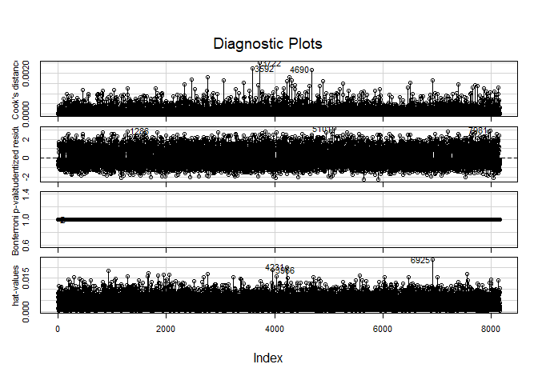

The largest hat values, Bonferonni P values, Cook's distance have been plotted. No observations that are farthest from the average has been denoted.

``` r
influencePlot(logit_1,col='red',id.n=2)
```

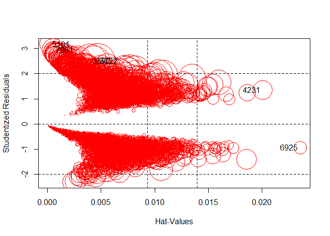

    ##      StudRes      Hat    CookD
    ## 3592   2.502 0.003987 0.002215
    ## 3722   2.487 0.004696 0.002495
    ## 4231   1.341 0.020067 0.000782
    ## 5101   3.165 0.000225 0.000865
    ## 6925  -0.934 0.023547 0.000349
    ## 7981   2.944 0.000543 0.001053

The above table shows some points with large studentized residuals, hat-values or Cook's distances from the influential plots. To test if the case, 3722, which has the largest Cook's distances is influential, I remove it from the model and compare the coefficients.

``` r
logit_1_3722 <- update(logit_1,subset=c(-3722))
```

    ## 
    ## Variance Inflation Factors Due to Imputation:
    ## 
    ##                     (Intercept)                             YOJ 
    ##                            1.00                            1.02 
    ##                       KIDSDRIV1                             AGE 
    ##                            1.00                            1.00 
    ##                       HOMEKIDS1                          INCOME 
    ##                            1.00                            1.02 
    ##                      PARENT1Yes                        HOME_VAL 
    ##                            1.00                            1.05 
    ##                     MSTATUSz_No                          SEXz_F 
    ##                            1.01                            1.00 
    ##              EDUCATIONBachelors                EDUCATIONMasters 
    ##                            1.01                            1.02 
    ##                    EDUCATIONPhD          EDUCATIONz_High School 
    ##                            1.01                            1.00 
    ##                       JOBDoctor                   JOBHome Maker 
    ##                            1.00                            1.00 
    ##                       JOBLawyer                      JOBManager 
    ##                            1.00                            1.00 
    ##                 JOBProfessional                      JOBStudent 
    ##                            1.00                            1.00 
    ##                       JOBunkown                JOBz_Blue Collar 
    ##                            1.00                            1.00 
    ##                        TRAVTIME                  CAR_USEPrivate 
    ##                            1.00                            1.00 
    ##                        BLUEBOOK                            TIF1 
    ##                            1.00                            1.00 
    ##             CAR_TYPEPanel Truck                  CAR_TYPEPickup 
    ##                            1.00                            1.00 
    ##              CAR_TYPESports Car                     CAR_TYPEVan 
    ##                            1.00                            1.00 
    ##                   CAR_TYPEz_SUV                      RED_CARyes 
    ##                            1.00                            1.00 
    ##                        OLDCLAIM                       CLM_FREQ1 
    ##                            1.00                            1.00 
    ##                      REVOKEDYes                        MVR_PTS1 
    ##                            1.00                            1.00 
    ##                         CAR_AGE URBANICITYz_Highly Rural/ Rural 
    ##                            1.09                            1.00 
    ## 
    ## Rate of Missing Information:
    ## 
    ##                     (Intercept)                             YOJ 
    ##                            0.00                            0.02 
    ##                       KIDSDRIV1                             AGE 
    ##                            0.00                            0.00 
    ##                       HOMEKIDS1                          INCOME 
    ##                            0.00                            0.02 
    ##                      PARENT1Yes                        HOME_VAL 
    ##                            0.00                            0.05 
    ##                     MSTATUSz_No                          SEXz_F 
    ##                            0.01                            0.00 
    ##              EDUCATIONBachelors                EDUCATIONMasters 
    ##                            0.01                            0.02 
    ##                    EDUCATIONPhD          EDUCATIONz_High School 
    ##                            0.01                            0.00 
    ##                       JOBDoctor                   JOBHome Maker 
    ##                            0.00                            0.00 
    ##                       JOBLawyer                      JOBManager 
    ##                            0.00                            0.00 
    ##                 JOBProfessional                      JOBStudent 
    ##                            0.00                            0.00 
    ##                       JOBunkown                JOBz_Blue Collar 
    ##                            0.00                            0.00 
    ##                        TRAVTIME                  CAR_USEPrivate 
    ##                            0.00                            0.00 
    ##                        BLUEBOOK                            TIF1 
    ##                            0.00                            0.00 
    ##             CAR_TYPEPanel Truck                  CAR_TYPEPickup 
    ##                            0.00                            0.00 
    ##              CAR_TYPESports Car                     CAR_TYPEVan 
    ##                            0.00                            0.00 
    ##                   CAR_TYPEz_SUV                      RED_CARyes 
    ##                            0.00                            0.00 
    ##                        OLDCLAIM                       CLM_FREQ1 
    ##                            0.00                            0.00 
    ##                      REVOKEDYes                        MVR_PTS1 
    ##                            0.00                            0.00 
    ##                         CAR_AGE URBANICITYz_Highly Rural/ Rural 
    ##                            0.08                            0.00 
    ## 
    ## d.f. for t-distribution for Tests of Single Coefficients:
    ## 
    ##                     (Intercept)                             YOJ 
    ##                         4904032                           15544 
    ##                       KIDSDRIV1                             AGE 
    ##                        79207312                          307337 
    ##                       HOMEKIDS1                          INCOME 
    ##                         1494996                           15973 
    ##                      PARENT1Yes                        HOME_VAL 
    ##                        24954840                            1940 
    ##                     MSTATUSz_No                          SEXz_F 
    ##                           39146                        27504870 
    ##              EDUCATIONBachelors                EDUCATIONMasters 
    ##                           41524                           20175 
    ##                    EDUCATIONPhD          EDUCATIONz_High School 
    ##                           66661                         5739468 
    ##                       JOBDoctor                   JOBHome Maker 
    ##                        95080261                          286035 
    ##                       JOBLawyer                      JOBManager 
    ##                        69687716                        12515841 
    ##                 JOBProfessional                      JOBStudent 
    ##                         6431672                          254226 
    ##                       JOBunkown                JOBz_Blue Collar 
    ##                        11556556                        48897741 
    ##                        TRAVTIME                  CAR_USEPrivate 
    ##                        97566394                       740647952 
    ##                        BLUEBOOK                            TIF1 
    ##                         5785453                       104205098 
    ##             CAR_TYPEPanel Truck                  CAR_TYPEPickup 
    ##                        55966639                       329385736 
    ##              CAR_TYPESports Car                     CAR_TYPEVan 
    ##                        24757956                       121121542 
    ##                   CAR_TYPEz_SUV                      RED_CARyes 
    ##                        43311816                        40869933 
    ##                        OLDCLAIM                       CLM_FREQ1 
    ##                        33104064                        21036363 
    ##                      REVOKEDYes                        MVR_PTS1 
    ##                      3299679301                       304943947 
    ##                         CAR_AGE URBANICITYz_Highly Rural/ Rural 
    ##                             765                        88251384 
    ## 
    ## The following fit components were averaged over the 6 model fits:
    ## 
    ##   fitted.values linear.predictors

``` r
compareCoefs(logit_1, logit_1_3722)
```

    ## 
    ## Call:
    ## 1: fit.mult.impute(formula = TARGET_FLAG ~ YOJ + KIDSDRIV + AGE + 
    ##   HOMEKIDS + INCOME + PARENT1 + HOME_VAL + MSTATUS + SEX + EDUCATION + 
    ##   JOB + TRAVTIME + CAR_USE + BLUEBOOK + TIF + CAR_TYPE + RED_CAR + 
    ##   OLDCLAIM + CLM_FREQ + REVOKED + MVR_PTS + CAR_AGE + URBANICITY, fitter 
    ##   = glm, xtrans = mi_2, data = binary_trsf, family = binomial(link = 
    ##   "logit"))
    ## 2: fit.mult.impute(formula = TARGET_FLAG ~ YOJ + KIDSDRIV + AGE + 
    ##   HOMEKIDS + INCOME + PARENT1 + HOME_VAL + MSTATUS + SEX + EDUCATION + 
    ##   JOB + TRAVTIME + CAR_USE + BLUEBOOK + TIF + CAR_TYPE + RED_CAR + 
    ##   OLDCLAIM + CLM_FREQ + REVOKED + MVR_PTS + CAR_AGE + URBANICITY, fitter 
    ##   = glm, xtrans = mi_2, data = binary_trsf, subset = c(-3722), family = 
    ##   binomial(link = "logit"))
    ##                                       Est. 1         SE 1       Est. 2
    ## (Intercept)                     -0.786353480  0.279877428 -0.785143959
    ## YOJ                             -0.016143336  0.008458868 -0.016152608
    ## KIDSDRIV1                        0.553583584  0.098055503  0.554279830
    ## AGE                              0.001739400  0.004143428  0.001666637
    ## HOMEKIDS1                        0.268491976  0.099776564  0.270117500
    ## INCOME                          -0.000003770  0.000001134 -0.000003864
    ## PARENT1Yes                       0.243146231  0.120596094  0.240636306
    ## HOME_VAL                        -0.000001305  0.000000359 -0.000001323
    ## MSTATUSz_No                      0.539640942  0.089124389  0.540448345
    ## SEXz_F                          -0.096451830  0.112280095 -0.099371017
    ## EDUCATIONBachelors              -0.335189871  0.116589981 -0.334228837
    ## EDUCATIONMasters                -0.192546465  0.181896256 -0.196518056
    ## EDUCATIONPhD                    -0.069603564  0.216814074 -0.086756767
    ## EDUCATIONz_High School           0.026651791  0.094534876  0.027020444
    ## JOBDoctor                       -0.785368695  0.285340986 -0.762103297
    ## JOBHome Maker                   -0.212901779  0.145437049 -0.212021887
    ## JOBLawyer                       -0.273696197  0.185873473 -0.264961349
    ## JOBManager                      -0.935290950  0.143995407 -0.938107745
    ## JOBProfessional                 -0.213940661  0.124624500 -0.210808316
    ## JOBStudent                      -0.212668958  0.131848759 -0.216620008
    ## JOBunkown                       -0.359932446  0.196967539 -0.346613808
    ## JOBz_Blue Collar                -0.055957441  0.106491765 -0.054614995
    ## TRAVTIME                         0.014811279  0.001878039  0.014809945
    ## CAR_USEPrivate                  -0.759299990  0.091583012 -0.760408937
    ## BLUEBOOK                        -0.000019589  0.000005261 -0.000019143
    ## TIF1                            -0.410879152  0.061668535 -0.408907061
    ## CAR_TYPEPanel Truck              0.544968393  0.161156874  0.540377380
    ## CAR_TYPEPickup                   0.548445179  0.100475437  0.549062761
    ## CAR_TYPESports Car               1.043437600  0.129831316  1.040839963
    ## CAR_TYPEVan                      0.615104532  0.126472628  0.613829174
    ## CAR_TYPEz_SUV                    0.773068576  0.111327415  0.775709631
    ## RED_CARyes                       0.009341014  0.086277644  0.009582566
    ## OLDCLAIM                        -0.000021246  0.000004193 -0.000022066
    ## CLM_FREQ1                        0.740283022  0.074961295  0.746910034
    ## REVOKEDYes                       0.973998022  0.092616092  0.984058846
    ## MVR_PTS1                         0.314990979  0.062502762  0.314120036
    ## CAR_AGE                         -0.007341775  0.007872652 -0.007158832
    ## URBANICITYz_Highly Rural/ Rural -2.341161229  0.112852686 -2.341494144
    ##                                         SE 2
    ## (Intercept)                      0.279988368
    ## YOJ                              0.008462299
    ## KIDSDRIV1                        0.098092946
    ## AGE                              0.004145272
    ## HOMEKIDS1                        0.099828484
    ## INCOME                           0.000001136
    ## PARENT1Yes                       0.120643568
    ## HOME_VAL                         0.000000359
    ## MSTATUSz_No                      0.089178563
    ## SEXz_F                           0.112328906
    ## EDUCATIONBachelors               0.116628624
    ## EDUCATIONMasters                 0.182093593
    ## EDUCATIONPhD                     0.217295127
    ## EDUCATIONz_High School           0.094547558
    ## JOBDoctor                        0.285790286
    ## JOBHome Maker                    0.145466182
    ## JOBLawyer                        0.186072717
    ## JOBManager                       0.144166471
    ## JOBProfessional                  0.124657812
    ## JOBStudent                       0.131892617
    ## JOBunkown                        0.197208092
    ## JOBz_Blue Collar                 0.106515732
    ## TRAVTIME                         0.001878866
    ## CAR_USEPrivate                   0.091613266
    ## BLUEBOOK                         0.000005263
    ## TIF1                             0.061703325
    ## CAR_TYPEPanel Truck              0.161216864
    ## CAR_TYPEPickup                   0.100508355
    ## CAR_TYPESports Car               0.129918926
    ## CAR_TYPEVan                      0.126515231
    ## CAR_TYPEz_SUV                    0.111383413
    ## RED_CARyes                       0.086311551
    ## OLDCLAIM                         0.000004206
    ## CLM_FREQ1                        0.075021547
    ## REVOKEDYes                       0.092709751
    ## MVR_PTS1                         0.062533929
    ## CAR_AGE                          0.007878006
    ## URBANICITYz_Highly Rural/ Rural  0.112865319

From the output table, we can see that coefficients are changed minimally, and the observation 119 is not influential.

#### 3.1.3 Evaluation of the model

``` r
suppressMessages(suppressWarnings(library(MASS)))
# goodness of fit: pseudo R squared
(pR2_1 <- 1 - logit_1$deviance / logit_1$null.deviance)
```

    ## [1] 0.224

``` r
#or
#(pR2 <- 1- logLik(logitfit.1)/logLik(logit.null))

# Log likelihood
(logLik_1<-logLik(logit_1))
```

    ## 'log Lik.' -3656 (df=38)

``` r
# AIC
AIC_1 <- logit_1$aic

# confusion matrix
clsdf_1 <- data.frame(fill_data_new$TARGET_FLAG)
clsdf_1$pre.prob <- predict( logit_1, newdata = fill_data_new, type = "response")
clsdf_1$pre.target <- ifelse(clsdf_1$pre.prob>0.5, 1,0)
clsdf_1$pre.target <- as.factor(clsdf_1$pre.target)
names(clsdf_1)[names(clsdf_1)=='fill_data_new.TARGET_FLAG'] <- 'TARGET_FLAG'

cfmx_1 <- confusionMatrix(data = clsdf_1$pre.target, reference = clsdf_1$TARGET_FLAG, positive = "1")

cfmx_1$table
```

    ##           Reference
    ## Prediction    0    1
    ##          0 5516 1234
    ##          1  492  919

``` r
(kappa_1 <- cfmx_1$overall['Kappa'])  #assess the agreement between two raters
```

    ## Kappa 
    ## 0.388

``` r
(acrcy_1 <- cfmx_1$overall['Accuracy'])
```

    ## Accuracy 
    ##    0.789

``` r
(err_rate_1 <- 1-cfmx_1$overall['Accuracy'])
```

    ## Accuracy 
    ##    0.211

``` r
(preci_1 <- cfmx_1$byClass['Precision'])
```

    ## Precision 
    ##     0.651

``` r
(sensi_1 <- cfmx_1$byClass['Sensitivity'])
```

    ## Sensitivity 
    ##       0.427

``` r
(speci_1 <- cfmx_1$byClass['Specificity'])
```

    ## Specificity 
    ##       0.918

``` r
(F1_1 <- cfmx_1$byClass['F1'])
```

    ##    F1 
    ## 0.516

``` r
prevalence <- length(fill_data_new$TARGET_FLAG[fill_data_new$TARGET_FLAG == 1])/length(fill_data_new$TARGET_FLAG)
(J_1 <-  sensi_1 + speci_1 - 1) # J index proportions of correctly predicted samples for both the event and nonevent groups
```

    ## Sensitivity 
    ##       0.345

``` r
(ppv_1 <- (sensi_1 * prevalence)/((sensi_1 * prevalence) + ((1 - speci_1) * (1 - prevalence)))) # positive predicted value,answer what is the probability that this sample is an event?â
```

    ## Sensitivity 
    ##       0.651

``` r
(npv_1 <- (sensi_1 * (1-prevalence))/(((1-sensi_1) * prevalence) + ( speci_1 * (1 - prevalence)))) # negative predicted value 
```

    ## Sensitivity 
    ##        0.38

``` r
# ROC and AUC
suppressMessages(suppressWarnings(library(ROCR)))
rocCurve_1 <- roc(response = clsdf_1$TARGET_FLAG,
 predictor = clsdf_1$pre.prob,
 levels = levels(as.factor(clsdf_1$TARGET_FLAG)))

plot(rocCurve_1, legacy.axes = TRUE)
```


``` r
cat('AUC is', auc_pROC_1 <- pROC::auc(rocCurve_1),'\n\n')
```

    ## AUC is 0.813

``` r
#ci_1 <- ci(rocCurve_1)
```

#### 3.1.4 Interpretation

``` r
round(summary(logit_1)$coef[summary(logit_1)$coef[,4] <= .05,],4)
```

    ##                                 Estimate Std. Error z value Pr(>|z|)
    ## (Intercept)                      -0.7864     0.2795   -2.81   0.0049
    ## KIDSDRIV1                         0.5536     0.0980    5.65   0.0000
    ## HOMEKIDS1                         0.2685     0.0997    2.69   0.0071
    ## INCOME                            0.0000     0.0000   -3.36   0.0008
    ## PARENT1Yes                        0.2431     0.1206    2.02   0.0437
    ## HOME_VAL                          0.0000     0.0000   -3.74   0.0002
    ## MSTATUSz_No                       0.5396     0.0886    6.09   0.0000
    ## EDUCATIONBachelors               -0.3352     0.1162   -2.89   0.0039
    ## JOBDoctor                        -0.7854     0.2851   -2.75   0.0059
    ## JOBManager                       -0.9353     0.1439   -6.50   0.0000
    ## TRAVTIME                          0.0148     0.0019    7.89   0.0000
    ## CAR_USEPrivate                   -0.7593     0.0916   -8.29   0.0000
    ## BLUEBOOK                          0.0000     0.0000   -3.72   0.0002
    ## TIF1                             -0.4109     0.0617   -6.66   0.0000
    ## CAR_TYPEPanel Truck               0.5450     0.1611    3.38   0.0007
    ## CAR_TYPEPickup                    0.5484     0.1005    5.46   0.0000
    ## CAR_TYPESports Car                1.0434     0.1298    8.04   0.0000
    ## CAR_TYPEVan                       0.6151     0.1265    4.86   0.0000
    ## CAR_TYPEz_SUV                     0.7731     0.1113    6.95   0.0000
    ## OLDCLAIM                          0.0000     0.0000   -5.07   0.0000
    ## CLM_FREQ1                         0.7403     0.0749    9.88   0.0000
    ## REVOKEDYes                        0.9740     0.0926   10.52   0.0000
    ## MVR_PTS1                          0.3150     0.0625    5.04   0.0000
    ## URBANICITYz_Highly Rural/ Rural  -2.3412     0.1129  -20.75   0.0000

**Marginal effects**

``` r
suppressMessages(suppressWarnings(library(margins)))

margins(logit_1)
```

    ## Warning in warn_for_weights(model): 'weights' used in model estimation are
    ## currently ignored!

    ## Average marginal effects

    ## fit.mult.impute(formula = TARGET_FLAG ~ YOJ + KIDSDRIV + AGE +     HOMEKIDS + INCOME + PARENT1 + HOME_VAL + MSTATUS + SEX +     EDUCATION + JOB + TRAVTIME + CAR_USE + BLUEBOOK + TIF + CAR_TYPE +     RED_CAR + OLDCLAIM + CLM_FREQ + REVOKED + MVR_PTS + CAR_AGE +     URBANICITY, fitter = glm, xtrans = mi_2, data = binary_trsf,     family = binomial(link = "logit"))

    ##        YOJ       AGE        INCOME      HOME_VAL TRAVTIME     BLUEBOOK
    ##  -0.002354 0.0002536 -0.0000005496 -0.0000001903 0.002159 -0.000002856
    ##      OLDCLAIM  CAR_AGE KIDSDRIV1 HOMEKIDS1 PARENT1Yes MSTATUSz_No   SEXz_F
    ##  -0.000003098 -0.00107   0.08566   0.03989    0.03656     0.08045 -0.01406
    ##  EDUCATIONBachelors EDUCATIONMasters EDUCATIONPhD EDUCATIONz_High School
    ##            -0.04867         -0.02855      -0.0105                0.00407
    ##  JOBDoctor JOBHome Maker JOBLawyer JOBManager JOBProfessional JOBStudent
    ##    -0.1119      -0.03311  -0.04222    -0.1298        -0.03327   -0.03307
    ##  JOBunkown JOBz_Blue Collar CAR_USEPrivate     TIF1 CAR_TYPEPanel Truck
    ##   -0.05485        -0.008879        -0.1149 -0.06142             0.07387
    ##  CAR_TYPEPickup CAR_TYPESports Car CAR_TYPEVan CAR_TYPEz_SUV RED_CARyes
    ##         0.07439             0.1526     0.08437        0.1087   0.001363
    ##  CLM_FREQ1 REVOKEDYes MVR_PTS1 URBANICITYz_Highly Rural/ Rural
    ##     0.1122     0.1562  0.04602                         -0.2615

### 3.2 Logistic regression model - Automated likelihood-ratio-test-based backward selection

#### 3.2.1 Build the model

A initial generalized logistic regression model with all the independent variables is built and followed by backward eliminating all non-statistically significant predictors one by one from the model based on thelikelihood-ratio test.

``` r
#Create a full and null logistic models
logit.full <- glm(paste('TARGET_FLAG ~',paste(names(fill_data_new[,-c(1,3)]),collapse = "+")), fill_data_new, family=binomial(link = 'logit'))
#logit.null <- glm(TARGET_FLAG ~ 1, fill_data_6, family=binomial(link = 'logit'))

#center the data before fit the full lrm model
num_var_cen <- data.frame(scale(num_var_new))
fill_data_new_cen <- fill_data_new[,-which(names(fill_data_new) %in% names(num_var_cen))] 
fill_data_new_cen <- cbind(fill_data_new_cen,num_var_cen)
  
lrm.full <- lrm(TARGET_FLAG ~ YOJ+KIDSDRIV+AGE+HOMEKIDS+INCOME+PARENT1+HOME_VAL+MSTATUS+SEX+EDUCATION+JOB+TRAVTIME+CAR_USE+BLUEBOOK+TIF+CAR_TYPE+RED_CAR+OLDCLAIM+CLM_FREQ+REVOKED+MVR_PTS+CAR_AGE+URBANICITY,data=fill_data_new_cen,maxit=50)

fastbw(lrm.full, rule = "p", sls = 0.1)
```

    ## 
    ##  Deleted Chi-Sq d.f. P      Residual d.f. P     AIC  
    ##  RED_CAR 0.01   1    0.9168  0.01    1    0.917 -1.99
    ##  AGE     0.14   1    0.7109  0.15    2    0.929 -3.85
    ##  SEX     1.12   1    0.2893  1.27    3    0.736 -4.73
    ##  CAR_AGE 1.30   1    0.2541  2.57    4    0.632 -5.43
    ##  YOJ     3.07   1    0.0798  5.64    5    0.343 -4.36
    ##  PARENT1 4.40   1    0.0360 10.04    6    0.123 -1.96
    ## 
    ## Approximate Estimates after Deleting Factors
    ## 
    ##                                      Coef    S.E.   Wald Z
    ## Intercept                        -1.33094 0.17150  -7.7604
    ## KIDSDRIV=1                        0.55260 0.09559   5.7807
    ## HOMEKIDS=1                        0.33884 0.06977   4.8564
    ## INCOME                           -0.19153 0.05281  -3.6267
    ## HOME_VAL                         -0.15925 0.04457  -3.5730
    ## MSTATUS=z_No                      0.65368 0.07296   8.9598
    ## EDUCATION=Bachelors              -0.36471 0.10864  -3.3570
    ## EDUCATION=Masters                -0.26164 0.16155  -1.6196
    ## EDUCATION=PhD                    -0.13009 0.20095  -0.6474
    ## EDUCATION=z_High School           0.02242 0.09419   0.2380
    ## JOB=Doctor                       -0.77150 0.28448  -2.7120
    ## JOB=Home Maker                   -0.13573 0.13578  -0.9997
    ## JOB=Lawyer                       -0.25901 0.18523  -1.3983
    ## JOB=Manager                      -0.91712 0.14335  -6.3976
    ## JOB=Professional                 -0.20328 0.12426  -1.6360
    ## JOB=Student                      -0.13644 0.12539  -1.0881
    ## JOB=unkown                       -0.35341 0.19666  -1.7970
    ## JOB=z_Blue Collar                -0.05211 0.10637  -0.4899
    ## TRAVTIME                          0.23346 0.02986   7.8196
    ## CAR_USE=Private                  -0.76038 0.09151  -8.3089
    ## BLUEBOOK                         -0.18353 0.03979  -4.6124
    ## TIF=1                            -0.41035 0.06164  -6.6567
    ## CAR_TYPE=Panel Truck              0.60055 0.15048   3.9910
    ## CAR_TYPE=Pickup                   0.54525 0.10043   5.4291
    ## CAR_TYPE=Sports Car               0.97853 0.10722   9.1262
    ## CAR_TYPE=Van                      0.65222 0.12221   5.3367
    ## CAR_TYPE=z_SUV                    0.69901 0.08589   8.1387
    ## OLDCLAIM                         -0.18770 0.03679  -5.1015
    ## CLM_FREQ=1                        0.74143 0.07491   9.8981
    ## REVOKED=Yes                       0.97488 0.09259  10.5291
    ## MVR_PTS=1                         0.31534 0.06240   5.0539
    ## URBANICITY=z_Highly Rural/ Rural -2.32333 0.11268 -20.6181
    ##                                                      P
    ## Intercept                        0.0000000000000084377
    ## KIDSDRIV=1                       0.0000000074374110204
    ## HOMEKIDS=1                       0.0000011956378068723
    ## INCOME                           0.0002870669844584617
    ## HOME_VAL                         0.0003529216010128566
    ## MSTATUS=z_No                     0.0000000000000000000
    ## EDUCATION=Bachelors              0.0007880729340493664
    ## EDUCATION=Masters                0.1053150646156810755
    ## EDUCATION=PhD                    0.5173924879266789123
    ## EDUCATION=z_High School          0.8118927055271041304
    ## JOB=Doctor                       0.0066879535963001446
    ## JOB=Home Maker                   0.3174788368183338871
    ## JOB=Lawyer                       0.1620134212286571396
    ## JOB=Manager                      0.0000000001578435160
    ## JOB=Professional                 0.1018379327300111825
    ## JOB=Student                      0.2765480712913747086
    ## JOB=unkown                       0.0723304039590201286
    ## JOB=z_Blue Collar                0.6242039455395205216
    ## TRAVTIME                         0.0000000000000053291
    ## CAR_USE=Private                  0.0000000000000001110
    ## BLUEBOOK                         0.0000039800981520566
    ## TIF=1                            0.0000000000279968271
    ## CAR_TYPE=Panel Truck             0.0000658089794195460
    ## CAR_TYPE=Pickup                  0.0000000566340749852
    ## CAR_TYPE=Sports Car              0.0000000000000000000
    ## CAR_TYPE=Van                     0.0000000946349666409
    ## CAR_TYPE=z_SUV                   0.0000000000000004441
    ## OLDCLAIM                         0.0000003370263309543
    ## CLM_FREQ=1                       0.0000000000000000000
    ## REVOKED=Yes                      0.0000000000000000000
    ## MVR_PTS=1                        0.0000004329111119583
    ## URBANICITY=z_Highly Rural/ Rural 0.0000000000000000000
    ## 
    ## Factors in Final Model
    ## 
    ##  [1] KIDSDRIV   HOMEKIDS   INCOME     HOME_VAL   MSTATUS    EDUCATION 
    ##  [7] JOB        TRAVTIME   CAR_USE    BLUEBOOK   TIF        CAR_TYPE  
    ## [13] OLDCLAIM   CLM_FREQ   REVOKED    MVR_PTS    URBANICITY

``` r
logit_2 <- glm(paste('TARGET_FLAG ~',paste(names(fill_data_new[,-c(1,3)]),collapse = "+")),data=fill_data_new, family=binomial(link = 'logit'))
summary(logit_2)
```

    ## 
    ## Call:
    ## glm(formula = paste("TARGET_FLAG ~", paste(names(fill_data_new[, 
    ##     -c(1, 3)]), collapse = "+")), family = binomial(link = "logit"), 
    ##     data = fill_data_new)
    ## 
    ## Deviance Residuals: 
    ##    Min      1Q  Median      3Q     Max  
    ## -2.305  -0.725  -0.394   0.678   3.160  
    ## 
    ## Coefficients:
    ##                                     Estimate   Std. Error z value
    ## (Intercept)                     -0.787016477  0.279548233   -2.82
    ## YOJ                             -0.015154995  0.008369193   -1.81
    ## KIDSDRIV1                        0.553939210  0.098036423    5.65
    ## AGE                              0.001541267  0.004138881    0.37
    ## HOMEKIDS1                        0.264013514  0.099730884    2.65
    ## INCOME                          -0.000003649  0.000001122   -3.25
    ## PARENT1Yes                       0.245101937  0.120571954    2.03
    ## HOME_VAL                        -0.000001307  0.000000349   -3.74
    ## MSTATUSz_No                      0.538898937  0.088619026    6.08
    ## SEXz_F                          -0.096677593  0.112245571   -0.86
    ## EDUCATIONBachelors              -0.328853723  0.116169145   -2.83
    ## EDUCATIONMasters                -0.180345528  0.180903348   -1.00
    ## EDUCATIONPhD                    -0.060317057  0.216175203   -0.28
    ## EDUCATIONz_High School           0.027103442  0.094504909    0.29
    ## JOBDoctor                       -0.789802557  0.285144948   -2.77
    ## JOBHome Maker                   -0.205233759  0.145196696   -1.41
    ## JOBLawyer                       -0.278143738  0.185806634   -1.50
    ## JOBManager                      -0.940717128  0.143923910   -6.54
    ## JOBProfessional                 -0.218302321  0.124559129   -1.75
    ## JOBStudent                      -0.205170582  0.131696111   -1.56
    ## JOBunkown                       -0.368008616  0.196782734   -1.87
    ## JOBz_Blue Collar                -0.059340253  0.106475158   -0.56
    ## TRAVTIME                         0.014802077  0.001877624    7.88
    ## CAR_USEPrivate                  -0.758588480  0.091557363   -8.29
    ## BLUEBOOK                        -0.000019695  0.000005260   -3.74
    ## TIF1                            -0.409992146  0.061653310   -6.65
    ## CAR_TYPEPanel Truck              0.545646405  0.161129506    3.39
    ## CAR_TYPEPickup                   0.547735931  0.100457477    5.45
    ## CAR_TYPESports Car               1.044130680  0.129804176    8.04
    ## CAR_TYPEVan                      0.617153800  0.126469086    4.88
    ## CAR_TYPEz_SUV                    0.773513859  0.111298718    6.95
    ## RED_CARyes                       0.009005139  0.086253330    0.10
    ## OLDCLAIM                        -0.000021217  0.000004193   -5.06
    ## CLM_FREQ1                        0.742238186  0.074922954    9.91
    ## REVOKEDYes                       0.974381298  0.092610887   10.52
    ## MVR_PTS1                         0.315274963  0.062488182    5.05
    ## CAR_AGE                         -0.008518454  0.007551122   -1.13
    ## URBANICITYz_Highly Rural/ Rural -2.338765523  0.112852907  -20.72
    ##                                             Pr(>|z|)    
    ## (Intercept)                                  0.00487 ** 
    ## YOJ                                          0.07017 .  
    ## KIDSDRIV1                        0.00000001601299914 ***
    ## AGE                                          0.70960    
    ## HOMEKIDS1                                    0.00811 ** 
    ## INCOME                                       0.00114 ** 
    ## PARENT1Yes                                   0.04207 *  
    ## HOME_VAL                                     0.00018 ***
    ## MSTATUSz_No                      0.00000000119379508 ***
    ## SEXz_F                                       0.38907    
    ## EDUCATIONBachelors                           0.00464 ** 
    ## EDUCATIONMasters                             0.31881    
    ## EDUCATIONPhD                                 0.78023    
    ## EDUCATIONz_High School                       0.77427    
    ## JOBDoctor                                    0.00561 ** 
    ## JOBHome Maker                                0.15751    
    ## JOBLawyer                                    0.13441    
    ## JOBManager                       0.00000000006309664 ***
    ## JOBProfessional                              0.07967 .  
    ## JOBStudent                                   0.11925    
    ## JOBunkown                                    0.06147 .  
    ## JOBz_Blue Collar                             0.57731    
    ## TRAVTIME                         0.00000000000000319 ***
    ## CAR_USEPrivate                  < 0.0000000000000002 ***
    ## BLUEBOOK                                     0.00018 ***
    ## TIF1                             0.00000000002931695 ***
    ## CAR_TYPEPanel Truck                          0.00071 ***
    ## CAR_TYPEPickup                   0.00000004969010980 ***
    ## CAR_TYPESports Car               0.00000000000000087 ***
    ## CAR_TYPEVan                      0.00000106151097276 ***
    ## CAR_TYPEz_SUV                    0.00000000000365571 ***
    ## RED_CARyes                                   0.91685    
    ## OLDCLAIM                         0.00000041936163979 ***
    ## CLM_FREQ1                       < 0.0000000000000002 ***
    ## REVOKEDYes                      < 0.0000000000000002 ***
    ## MVR_PTS1                         0.00000045268390784 ***
    ## CAR_AGE                                      0.25928    
    ## URBANICITYz_Highly Rural/ Rural < 0.0000000000000002 ***
    ## ---
    ## Signif. codes:  0 '***' 0.001 '**' 0.01 '*' 0.05 '.' 0.1 ' ' 1
    ## 
    ## (Dispersion parameter for binomial family taken to be 1)
    ## 
    ##     Null deviance: 9418.0  on 8160  degrees of freedom
    ## Residual deviance: 7312.4  on 8123  degrees of freedom
    ## AIC: 7388
    ## 
    ## Number of Fisher Scoring iterations: 5

``` r
residualPlots(logit_2, layout = c(3, 4),ask=F) 
```

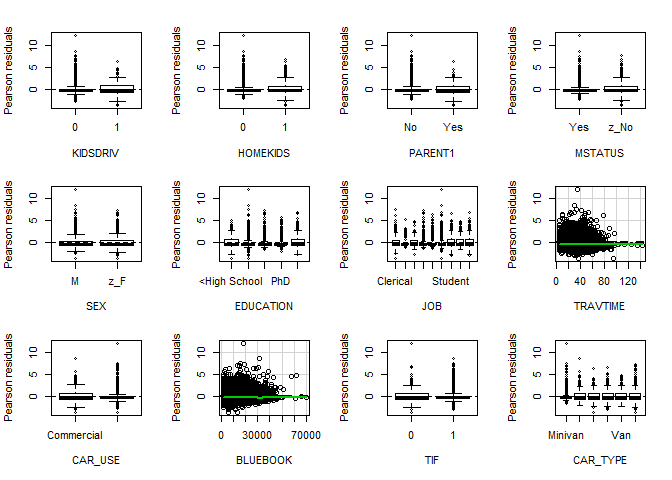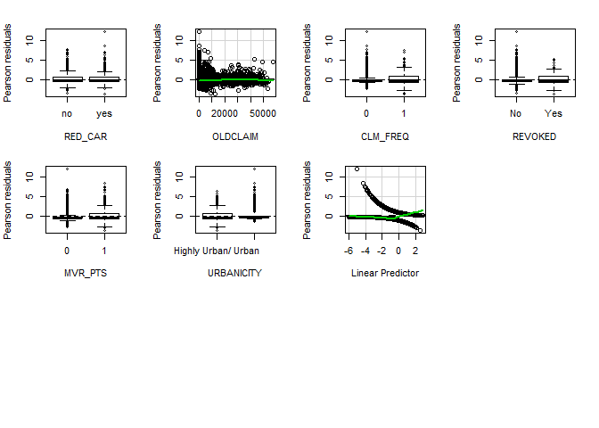

    ##            Test stat Pr(>|t|)
    ## KIDSDRIV          NA       NA
    ## HOMEKIDS          NA       NA
    ## PARENT1           NA       NA
    ## MSTATUS           NA       NA
    ## SEX               NA       NA
    ## EDUCATION         NA       NA
    ## JOB               NA       NA
    ## TRAVTIME       6.843    0.009
    ## CAR_USE           NA       NA
    ## BLUEBOOK      13.740    0.000
    ## TIF               NA       NA
    ## CAR_TYPE          NA       NA
    ## RED_CAR           NA       NA
    ## OLDCLAIM       0.527    0.468
    ## CLM_FREQ          NA       NA
    ## REVOKED           NA       NA
    ## MVR_PTS           NA       NA
    ## URBANICITY        NA       NA

From the results of the lack-of-fit test we can see that there is relationship between residuals with two significant numerical predictor variables, TRAVTIME and BLUEBOOK. They are both right skewed such they will need log transformation.

**Adjust the model**

``` r
lrm.full <- lrm(TARGET_FLAG ~ YOJ+KIDSDRIV+AGE+HOMEKIDS+INCOME+PARENT1+HOME_VAL+MSTATUS+SEX+EDUCATION+JOB+TRAVTIME+CAR_USE+BLUEBOOK+TIF+CAR_TYPE+RED_CAR+OLDCLAIM+CLM_FREQ+REVOKED+MVR_PTS+CAR_AGE+URBANICITY,data=fill_data_new_cen,maxit=50)

fastbw(lrm.full, rule = "p", sls = 0.1)
```

    ## 
    ##  Deleted Chi-Sq d.f. P      Residual d.f. P     AIC  
    ##  RED_CAR 0.01   1    0.9168  0.01    1    0.917 -1.99
    ##  AGE     0.14   1    0.7109  0.15    2    0.929 -3.85
    ##  SEX     1.12   1    0.2893  1.27    3    0.736 -4.73
    ##  CAR_AGE 1.30   1    0.2541  2.57    4    0.632 -5.43
    ##  YOJ     3.07   1    0.0798  5.64    5    0.343 -4.36
    ##  PARENT1 4.40   1    0.0360 10.04    6    0.123 -1.96
    ## 
    ## Approximate Estimates after Deleting Factors
    ## 
    ##                                      Coef    S.E.   Wald Z
    ## Intercept                        -1.33094 0.17150  -7.7604
    ## KIDSDRIV=1                        0.55260 0.09559   5.7807
    ## HOMEKIDS=1                        0.33884 0.06977   4.8564
    ## INCOME                           -0.19153 0.05281  -3.6267
    ## HOME_VAL                         -0.15925 0.04457  -3.5730
    ## MSTATUS=z_No                      0.65368 0.07296   8.9598
    ## EDUCATION=Bachelors              -0.36471 0.10864  -3.3570
    ## EDUCATION=Masters                -0.26164 0.16155  -1.6196
    ## EDUCATION=PhD                    -0.13009 0.20095  -0.6474
    ## EDUCATION=z_High School           0.02242 0.09419   0.2380
    ## JOB=Doctor                       -0.77150 0.28448  -2.7120
    ## JOB=Home Maker                   -0.13573 0.13578  -0.9997
    ## JOB=Lawyer                       -0.25901 0.18523  -1.3983
    ## JOB=Manager                      -0.91712 0.14335  -6.3976
    ## JOB=Professional                 -0.20328 0.12426  -1.6360
    ## JOB=Student                      -0.13644 0.12539  -1.0881
    ## JOB=unkown                       -0.35341 0.19666  -1.7970
    ## JOB=z_Blue Collar                -0.05211 0.10637  -0.4899
    ## TRAVTIME                          0.23346 0.02986   7.8196
    ## CAR_USE=Private                  -0.76038 0.09151  -8.3089
    ## BLUEBOOK                         -0.18353 0.03979  -4.6124
    ## TIF=1                            -0.41035 0.06164  -6.6567
    ## CAR_TYPE=Panel Truck              0.60055 0.15048   3.9910
    ## CAR_TYPE=Pickup                   0.54525 0.10043   5.4291
    ## CAR_TYPE=Sports Car               0.97853 0.10722   9.1262
    ## CAR_TYPE=Van                      0.65222 0.12221   5.3367
    ## CAR_TYPE=z_SUV                    0.69901 0.08589   8.1387
    ## OLDCLAIM                         -0.18770 0.03679  -5.1015
    ## CLM_FREQ=1                        0.74143 0.07491   9.8981
    ## REVOKED=Yes                       0.97488 0.09259  10.5291
    ## MVR_PTS=1                         0.31534 0.06240   5.0539
    ## URBANICITY=z_Highly Rural/ Rural -2.32333 0.11268 -20.6181
    ##                                                      P
    ## Intercept                        0.0000000000000084377
    ## KIDSDRIV=1                       0.0000000074374110204
    ## HOMEKIDS=1                       0.0000011956378068723
    ## INCOME                           0.0002870669844584617
    ## HOME_VAL                         0.0003529216010128566
    ## MSTATUS=z_No                     0.0000000000000000000
    ## EDUCATION=Bachelors              0.0007880729340493664
    ## EDUCATION=Masters                0.1053150646156810755
    ## EDUCATION=PhD                    0.5173924879266789123
    ## EDUCATION=z_High School          0.8118927055271041304
    ## JOB=Doctor                       0.0066879535963001446
    ## JOB=Home Maker                   0.3174788368183338871
    ## JOB=Lawyer                       0.1620134212286571396
    ## JOB=Manager                      0.0000000001578435160
    ## JOB=Professional                 0.1018379327300111825
    ## JOB=Student                      0.2765480712913747086
    ## JOB=unkown                       0.0723304039590201286
    ## JOB=z_Blue Collar                0.6242039455395205216
    ## TRAVTIME                         0.0000000000000053291
    ## CAR_USE=Private                  0.0000000000000001110
    ## BLUEBOOK                         0.0000039800981520566
    ## TIF=1                            0.0000000000279968271
    ## CAR_TYPE=Panel Truck             0.0000658089794195460
    ## CAR_TYPE=Pickup                  0.0000000566340749852
    ## CAR_TYPE=Sports Car              0.0000000000000000000
    ## CAR_TYPE=Van                     0.0000000946349666409
    ## CAR_TYPE=z_SUV                   0.0000000000000004441
    ## OLDCLAIM                         0.0000003370263309543
    ## CLM_FREQ=1                       0.0000000000000000000
    ## REVOKED=Yes                      0.0000000000000000000
    ## MVR_PTS=1                        0.0000004329111119583
    ## URBANICITY=z_Highly Rural/ Rural 0.0000000000000000000
    ## 
    ## Factors in Final Model
    ## 
    ##  [1] KIDSDRIV   HOMEKIDS   INCOME     HOME_VAL   MSTATUS    EDUCATION 
    ##  [7] JOB        TRAVTIME   CAR_USE    BLUEBOOK   TIF        CAR_TYPE  
    ## [13] OLDCLAIM   CLM_FREQ   REVOKED    MVR_PTS    URBANICITY

``` r
#logit_2 <- glm(paste('TARGET_FLAG ~',paste(names(fill_data_new[,-c(1,3)]),collapse = "+")),data=fill_data_new, family=binomial(link = 'logit'))
logit_2 <- glm(TARGET_FLAG ~ YOJ+KIDSDRIV+AGE+HOMEKIDS+INCOME+PARENT1+HOME_VAL+MSTATUS+SEX+EDUCATION+JOB+TRAVTIME+CAR_USE+BLUEBOOK+TIF+CAR_TYPE+RED_CAR+OLDCLAIM+CLM_FREQ+REVOKED+MVR_PTS+CAR_AGE+URBANICITY+log(TRAVTIME)+log(BLUEBOOK),data=fill_data_new, family=binomial(link = 'logit'))

summary(logit_2)
```

    ## 
    ## Call:
    ## glm(formula = TARGET_FLAG ~ YOJ + KIDSDRIV + AGE + HOMEKIDS + 
    ##     INCOME + PARENT1 + HOME_VAL + MSTATUS + SEX + EDUCATION + 
    ##     JOB + TRAVTIME + CAR_USE + BLUEBOOK + TIF + CAR_TYPE + RED_CAR + 
    ##     OLDCLAIM + CLM_FREQ + REVOKED + MVR_PTS + CAR_AGE + URBANICITY + 
    ##     log(TRAVTIME) + log(BLUEBOOK), family = binomial(link = "logit"), 
    ##     data = fill_data_new)
    ## 
    ## Deviance Residuals: 
    ##    Min      1Q  Median      3Q     Max  
    ## -2.345  -0.724  -0.392   0.674   3.158  
    ## 
    ## Coefficients:
    ##                                     Estimate   Std. Error z value
    ## (Intercept)                      2.228904420  1.088470741    2.05
    ## YOJ                             -0.013475917  0.008398774   -1.60
    ## KIDSDRIV1                        0.561743460  0.098252378    5.72
    ## AGE                              0.001452379  0.004141363    0.35
    ## HOMEKIDS1                        0.258871648  0.099870599    2.59
    ## INCOME                          -0.000004013  0.000001124   -3.57
    ## PARENT1Yes                       0.249508835  0.120803412    2.07
    ## HOME_VAL                        -0.000001284  0.000000349   -3.68
    ## MSTATUSz_No                      0.546637469  0.088741973    6.16
    ## SEXz_F                          -0.135828610  0.112799934   -1.20
    ## EDUCATIONBachelors              -0.318293770  0.116441517   -2.73
    ## EDUCATIONMasters                -0.158661395  0.181315484   -0.88
    ## EDUCATIONPhD                    -0.049374381  0.216674185   -0.23
    ## EDUCATIONz_High School           0.040032461  0.094691311    0.42
    ## JOBDoctor                       -0.787847339  0.285155201   -2.76
    ## JOBHome Maker                   -0.221410666  0.145595747   -1.52
    ## JOBLawyer                       -0.268009570  0.186081557   -1.44
    ## JOBManager                      -0.928688522  0.144126107   -6.44
    ## JOBProfessional                 -0.205092610  0.124741416   -1.64
    ## JOBStudent                      -0.230798763  0.132365777   -1.74
    ## JOBunkown                       -0.371361788  0.196982612   -1.89
    ## JOBz_Blue Collar                -0.040341392  0.106681129   -0.38
    ## TRAVTIME                         0.005792926  0.005105689    1.13
    ## CAR_USEPrivate                  -0.758669574  0.091679393   -8.28
    ## BLUEBOOK                         0.000013988  0.000010747    1.30
    ## TIF1                            -0.406790054  0.061768241   -6.59
    ## CAR_TYPEPanel Truck              0.416019876  0.164498809    2.53
    ## CAR_TYPEPickup                   0.558710492  0.100602666    5.55
    ## CAR_TYPESports Car               1.052951776  0.130164825    8.09
    ## CAR_TYPEVan                      0.623357256  0.126281110    4.94
    ## CAR_TYPEz_SUV                    0.814505778  0.112337222    7.25
    ## RED_CARyes                       0.004280192  0.086356859    0.05
    ## OLDCLAIM                        -0.000021331  0.000004203   -5.08
    ## CLM_FREQ1                        0.749371632  0.075060902    9.98
    ## REVOKEDYes                       0.974730192  0.092740033   10.51
    ## MVR_PTS1                         0.314168424  0.062569481    5.02
    ## CAR_AGE                         -0.008298959  0.007559676   -1.10
    ## URBANICITYz_Highly Rural/ Rural -2.334034950  0.113053925  -20.65
    ## log(TRAVTIME)                    0.261088288  0.136377887    1.91
    ## log(BLUEBOOK)                   -0.434636467  0.121965431   -3.56
    ##                                             Pr(>|z|)    
    ## (Intercept)                                  0.04059 *  
    ## YOJ                                          0.10860    
    ## KIDSDRIV1                         0.0000000108196652 ***
    ## AGE                                          0.72581    
    ## HOMEKIDS1                                    0.00954 ** 
    ## INCOME                                       0.00036 ***
    ## PARENT1Yes                                   0.03888 *  
    ## HOME_VAL                                     0.00023 ***
    ## MSTATUSz_No                       0.0000000007281272 ***
    ## SEXz_F                                       0.22853    
    ## EDUCATIONBachelors                           0.00627 ** 
    ## EDUCATIONMasters                             0.38154    
    ## EDUCATIONPhD                                 0.81974    
    ## EDUCATIONz_High School                       0.67246    
    ## JOBDoctor                                    0.00573 ** 
    ## JOBHome Maker                                0.12833    
    ## JOBLawyer                                    0.14979    
    ## JOBManager                        0.0000000001166855 ***
    ## JOBProfessional                              0.10015    
    ## JOBStudent                                   0.08122 .  
    ## JOBunkown                                    0.05940 .  
    ## JOBz_Blue Collar                             0.70532    
    ## TRAVTIME                                     0.25654    
    ## CAR_USEPrivate                  < 0.0000000000000002 ***
    ## BLUEBOOK                                     0.19307    
    ## TIF1                              0.0000000000452602 ***
    ## CAR_TYPEPanel Truck                          0.01144 *  
    ## CAR_TYPEPickup                    0.0000000279789307 ***
    ## CAR_TYPESports Car                0.0000000000000006 ***
    ## CAR_TYPEVan                       0.0000007963213385 ***
    ## CAR_TYPEz_SUV                     0.0000000000004151 ***
    ## RED_CARyes                                   0.96047    
    ## OLDCLAIM                          0.0000003869531276 ***
    ## CLM_FREQ1                       < 0.0000000000000002 ***
    ## REVOKEDYes                      < 0.0000000000000002 ***
    ## MVR_PTS1                          0.0000005137296380 ***
    ## CAR_AGE                                      0.27229    
    ## URBANICITYz_Highly Rural/ Rural < 0.0000000000000002 ***
    ## log(TRAVTIME)                                0.05556 .  
    ## log(BLUEBOOK)                                0.00037 ***
    ## ---
    ## Signif. codes:  0 '***' 0.001 '**' 0.01 '*' 0.05 '.' 0.1 ' ' 1
    ## 
    ## (Dispersion parameter for binomial family taken to be 1)
    ## 
    ##     Null deviance: 9418.0  on 8160  degrees of freedom
    ## Residual deviance: 7296.4  on 8121  degrees of freedom
    ## AIC: 7376
    ## 
    ## Number of Fisher Scoring iterations: 5

``` r
residualPlots(logit_2, layout = c(3, 4),ask=F) 
```

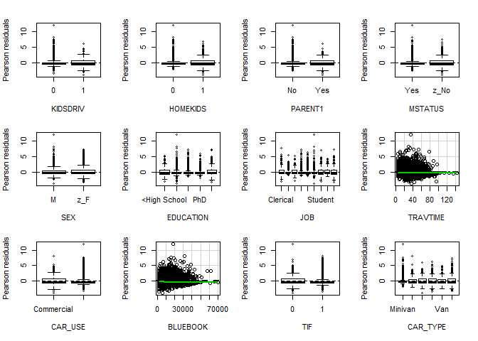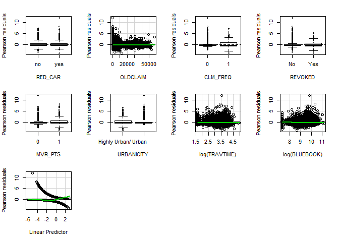

    ##               Test stat Pr(>|t|)
    ## KIDSDRIV             NA       NA
    ## HOMEKIDS             NA       NA
    ## PARENT1              NA       NA
    ## MSTATUS              NA       NA
    ## SEX                  NA       NA
    ## EDUCATION            NA       NA
    ## JOB                  NA       NA
    ## TRAVTIME          3.877    0.049
    ## CAR_USE              NA       NA
    ## BLUEBOOK          2.301    0.129
    ## TIF                  NA       NA
    ## CAR_TYPE             NA       NA
    ## RED_CAR              NA       NA
    ## OLDCLAIM          0.494    0.482
    ## CLM_FREQ             NA       NA
    ## REVOKED              NA       NA
    ## MVR_PTS              NA       NA
    ## URBANICITY           NA       NA
    ## log(TRAVTIME)     1.779    0.182
    ## log(BLUEBOOK)     1.753    0.185

The introduction of log form of TRAVTIME and BLUEBOOK improve the model. There is no significant relationship between residuals and BLUEBOOK.The relationship between residuals and TRAVTIME is still significant and the p value increase from 0.008 to 0.047. It does not matter since the TRAVTIME becomes not significant. The log(TRAVTIME) considered as one of the predictor variables. Overall, there is no correlation between residuals and the significant predictors, suggesting the model is properly fitted.

#### 3.2.2 Diagnostics

``` r
residualPlot(logit_2,layout = c(3, 4),ask=F)
```

    ## Warning in plot.window(...): "layout" is not a graphical parameter

    ## Warning in plot.xy(xy, type, ...): "layout" is not a graphical parameter

    ## Warning in axis(side = side, at = at, labels = labels, ...): "layout" is
    ## not a graphical parameter

    ## Warning in axis(side = side, at = at, labels = labels, ...): "layout" is
    ## not a graphical parameter

    ## Warning in box(...): "layout" is not a graphical parameter

    ## Warning in title(...): "layout" is not a graphical parameter

    ## Warning in plot.xy(xy.coords(x, y), type = type, ...): "layout" is not a
    ## graphical parameter

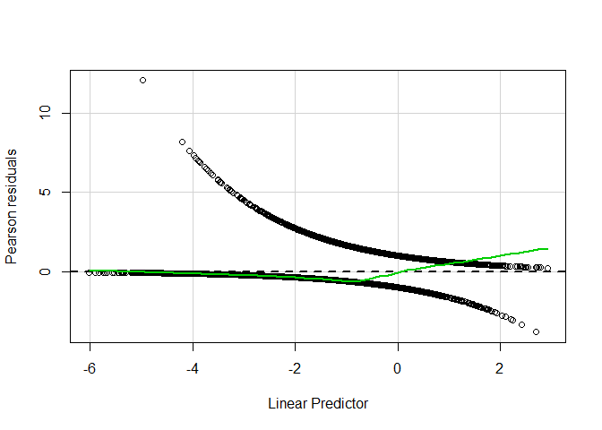

``` r
mmps(logit_2,ask=F)
```

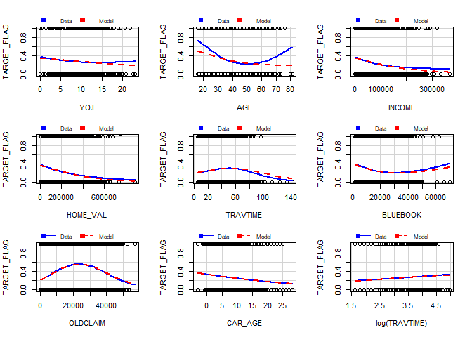

    ## Warning in mmps(logit_2, ask = F): Interactions and/or factors skipped

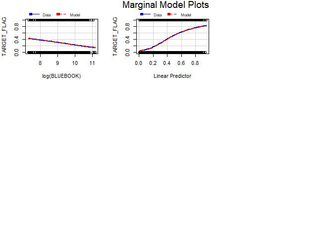

From the results of the lack-of-fit test we can see that there is no relationship between the Pearson residuals with the predictor variable. There is no need to add any log or quadratic transformation.

The goodness-of-fit test by the marginal model plot shows the agreement between the model and the data.

``` r
outlierTest(logit_2)
```

    ## 
    ## No Studentized residuals with Bonferonni p < 0.05
    ## Largest |rstudent|:
    ##      rstudent unadjusted p-value Bonferonni p
    ## 5101     3.16            0.00156           NA

The results show that there is no outlier as judged by Bonferonni p.

``` r
infIndexPlot(logit_2,id.n=3)
```

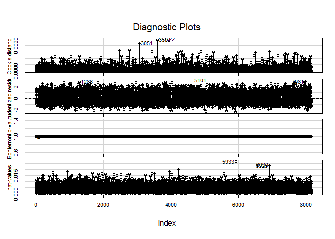

The largest hat values, Bonferonni P values, Cook's distance have been plotted. No observations that are farthest from the average has been denoted.

``` r
influencePlot(logit_2,col='red',id.n=2)
```

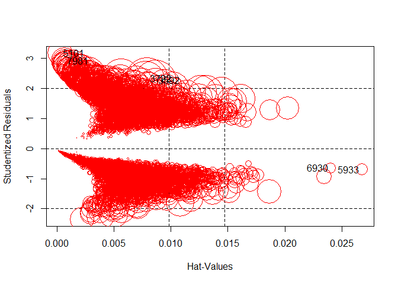

    ##      StudRes      Hat    CookD
    ## 3592   2.257 0.008608 0.002444
    ## 3722   2.303 0.007889 0.002501
    ## 5101   3.163 0.000231 0.000838
    ## 5933  -0.702 0.026777 0.000194
    ## 6930  -0.658 0.024049 0.000150
    ## 7981   2.910 0.000598 0.000999

The above table shows some points with large studentized residuals, hat-values or Cook's distances from the influential plots. To test if the case, 3722, which has the largest Cook's distances is influential, I remove it from the model and compare the coefficients.

``` r
logit_2_3722 <- update(logit_2,subset=c(-3722))
compareCoefs(logit_2, logit_2_3722)
```

    ## 
    ## Call:
    ## 1: glm(formula = TARGET_FLAG ~ YOJ + KIDSDRIV + AGE + HOMEKIDS + 
    ##   INCOME + PARENT1 + HOME_VAL + MSTATUS + SEX + EDUCATION + JOB + 
    ##   TRAVTIME + CAR_USE + BLUEBOOK + TIF + CAR_TYPE + RED_CAR + OLDCLAIM + 
    ##   CLM_FREQ + REVOKED + MVR_PTS + CAR_AGE + URBANICITY + log(TRAVTIME) + 
    ##   log(BLUEBOOK), family = binomial(link = "logit"), data = fill_data_new)
    ## 2: glm(formula = TARGET_FLAG ~ YOJ + KIDSDRIV + AGE + HOMEKIDS + 
    ##   INCOME + PARENT1 + HOME_VAL + MSTATUS + SEX + EDUCATION + JOB + 
    ##   TRAVTIME + CAR_USE + BLUEBOOK + TIF + CAR_TYPE + RED_CAR + OLDCLAIM + 
    ##   CLM_FREQ + REVOKED + MVR_PTS + CAR_AGE + URBANICITY + log(TRAVTIME) + 
    ##   log(BLUEBOOK), family = binomial(link = "logit"), data = fill_data_new,
    ##    subset = c(-3722))
    ##                                       Est. 1         SE 1       Est. 2
    ## (Intercept)                      2.228904420  1.088470741  2.129025030
    ## YOJ                             -0.013475917  0.008398774 -0.013532139
    ## KIDSDRIV1                        0.561743460  0.098252378  0.562169544
    ## AGE                              0.001452379  0.004141363  0.001385127
    ## HOMEKIDS1                        0.258871648  0.099870599  0.260610368
    ## INCOME                          -0.000004013  0.000001124 -0.000004094
    ## PARENT1Yes                       0.249508835  0.120803412  0.246976813
    ## HOME_VAL                        -0.000001284  0.000000349 -0.000001302
    ## MSTATUSz_No                      0.546637469  0.088741973  0.547159464
    ## SEXz_F                          -0.135828610  0.112799934 -0.137461735
    ## EDUCATIONBachelors              -0.318293770  0.116441517 -0.317649461
    ## EDUCATIONMasters                -0.158661395  0.181315484 -0.163118355
    ## EDUCATIONPhD                    -0.049374381  0.216674185 -0.066121313
    ## EDUCATIONz_High School           0.040032461  0.094691311  0.040096760
    ## JOBDoctor                       -0.787847339  0.285155201 -0.765389787
    ## JOBHome Maker                   -0.221410666  0.145595747 -0.219919034
    ## JOBLawyer                       -0.268009570  0.186081557 -0.259815646
    ## JOBManager                      -0.928688522  0.144126107 -0.931713225
    ## JOBProfessional                 -0.205092610  0.124741416 -0.202405614
    ## JOBStudent                      -0.230798763  0.132365777 -0.233733338
    ## JOBunkown                       -0.371361788  0.196982612 -0.358282361
    ## JOBz_Blue Collar                -0.040341392  0.106681129 -0.039577913
    ## TRAVTIME                         0.005792926  0.005105689  0.005883249
    ## CAR_USEPrivate                  -0.758669574  0.091679393 -0.759587206
    ## BLUEBOOK                         0.000013988  0.000010747  0.000013419
    ## TIF1                            -0.406790054  0.061768241 -0.404826840
    ## CAR_TYPEPanel Truck              0.416019876  0.164498809  0.415314115
    ## CAR_TYPEPickup                   0.558710492  0.100602666  0.558909772
    ## CAR_TYPESports Car               1.052951776  0.130164825  1.050008581
    ## CAR_TYPEVan                      0.623357256  0.126281110  0.621926872
    ## CAR_TYPEz_SUV                    0.814505778  0.112337222  0.815711523
    ## RED_CARyes                       0.004280192  0.086356859  0.004662017
    ## OLDCLAIM                        -0.000021331  0.000004203 -0.000022129
    ## CLM_FREQ1                        0.749371632  0.075060902  0.755595394
    ## REVOKEDYes                       0.974730192  0.092740033  0.984552796
    ## MVR_PTS1                         0.314168424  0.062569481  0.313342832
    ## CAR_AGE                         -0.008298959  0.007559676 -0.008127700
    ## URBANICITYz_Highly Rural/ Rural -2.334034950  0.113053925 -2.333962887
    ## log(TRAVTIME)                    0.261088288  0.136377887  0.258358967
    ## log(BLUEBOOK)                   -0.434636467  0.121965431 -0.421714855
    ##                                         SE 2
    ## (Intercept)                      1.090159525
    ## YOJ                              0.008400903
    ## KIDSDRIV1                        0.098280093
    ## AGE                              0.004142949
    ## HOMEKIDS1                        0.099913665
    ## INCOME                           0.000001126
    ## PARENT1Yes                       0.120840226
    ## HOME_VAL                         0.000000349
    ## MSTATUSz_No                      0.088788449
    ## SEXz_F                           0.112843478
    ## EDUCATIONBachelors               0.116466587
    ## EDUCATIONMasters                 0.181497178
    ## EDUCATIONPhD                     0.217143501
    ## EDUCATIONz_High School           0.094695704
    ## JOBDoctor                        0.285603817
    ## JOBHome Maker                    0.145609702
    ## JOBLawyer                        0.186267497
    ## JOBManager                       0.144286609
    ## JOBProfessional                  0.124765293
    ## JOBStudent                       0.132390259
    ## JOBunkown                        0.197220743
    ## JOBz_Blue Collar                 0.106698104
    ## TRAVTIME                         0.005106559
    ## CAR_USEPrivate                   0.091701766
    ## BLUEBOOK                         0.000010762
    ## TIF1                             0.061799013
    ## CAR_TYPEPanel Truck              0.164573377
    ## CAR_TYPEPickup                   0.100627772
    ## CAR_TYPESports Car               0.130237262
    ## CAR_TYPEVan                      0.126325961
    ## CAR_TYPEz_SUV                    0.112374183
    ## RED_CARyes                       0.086385105
    ## OLDCLAIM                         0.000004217
    ## CLM_FREQ1                        0.075120490
    ## REVOKEDYes                       0.092840934
    ## MVR_PTS1                         0.062595904
    ## CAR_AGE                          0.007564387
    ## URBANICITYz_Highly Rural/ Rural  0.113053825
    ## log(TRAVTIME)                    0.136392493
    ## log(BLUEBOOK)                    0.122185319

From the output table, we can see that coefficients are changed minimally, and the observation 3722 is not influential.

``` r
logit_2_5101 <- update(logit_2,subset=c(-5101))
compareCoefs(logit_2, logit_2_5101)
```

    ## 
    ## Call:
    ## 1: glm(formula = TARGET_FLAG ~ YOJ + KIDSDRIV + AGE + HOMEKIDS + 
    ##   INCOME + PARENT1 + HOME_VAL + MSTATUS + SEX + EDUCATION + JOB + 
    ##   TRAVTIME + CAR_USE + BLUEBOOK + TIF + CAR_TYPE + RED_CAR + OLDCLAIM + 
    ##   CLM_FREQ + REVOKED + MVR_PTS + CAR_AGE + URBANICITY + log(TRAVTIME) + 
    ##   log(BLUEBOOK), family = binomial(link = "logit"), data = fill_data_new)
    ## 2: glm(formula = TARGET_FLAG ~ YOJ + KIDSDRIV + AGE + HOMEKIDS + 
    ##   INCOME + PARENT1 + HOME_VAL + MSTATUS + SEX + EDUCATION + JOB + 
    ##   TRAVTIME + CAR_USE + BLUEBOOK + TIF + CAR_TYPE + RED_CAR + OLDCLAIM + 
    ##   CLM_FREQ + REVOKED + MVR_PTS + CAR_AGE + URBANICITY + log(TRAVTIME) + 
    ##   log(BLUEBOOK), family = binomial(link = "logit"), data = fill_data_new,
    ##    subset = c(-5101))
    ##                                       Est. 1         SE 1       Est. 2
    ## (Intercept)                      2.228904420  1.088470741  2.252473425
    ## YOJ                             -0.013475917  0.008398774 -0.013532960
    ## KIDSDRIV1                        0.561743460  0.098252378  0.563545350
    ## AGE                              0.001452379  0.004141363  0.001295478
    ## HOMEKIDS1                        0.258871648  0.099870599  0.259314841
    ## INCOME                          -0.000004013  0.000001124 -0.000003999
    ## PARENT1Yes                       0.249508835  0.120803412  0.247877063
    ## HOME_VAL                        -0.000001284  0.000000349 -0.000001286
    ## MSTATUSz_No                      0.546637469  0.088741973  0.549317606
    ## SEXz_F                          -0.135828610  0.112799934 -0.134731099
    ## EDUCATIONBachelors              -0.318293770  0.116441517 -0.320227352
    ## EDUCATIONMasters                -0.158661395  0.181315484 -0.156653188
    ## EDUCATIONPhD                    -0.049374381  0.216674185 -0.048284864
    ## EDUCATIONz_High School           0.040032461  0.094691311  0.040123977
    ## JOBDoctor                       -0.787847339  0.285155201 -0.788933862
    ## JOBHome Maker                   -0.221410666  0.145595747 -0.221935846
    ## JOBLawyer                       -0.268009570  0.186081557 -0.269875230
    ## JOBManager                      -0.928688522  0.144126107 -0.930171848
    ## JOBProfessional                 -0.205092610  0.124741416 -0.211966077
    ## JOBStudent                      -0.230798763  0.132365777 -0.231139753
    ## JOBunkown                       -0.371361788  0.196982612 -0.376371156
    ## JOBz_Blue Collar                -0.040341392  0.106681129 -0.041308529
    ## TRAVTIME                         0.005792926  0.005105689  0.005931990
    ## CAR_USEPrivate                  -0.758669574  0.091679393 -0.760674017
    ## BLUEBOOK                         0.000013988  0.000010747  0.000013977
    ## TIF1                            -0.406790054  0.061768241 -0.404837192
    ## CAR_TYPEPanel Truck              0.416019876  0.164498809  0.422271958
    ## CAR_TYPEPickup                   0.558710492  0.100602666  0.562603552
    ## CAR_TYPESports Car               1.052951776  0.130164825  1.055771070
    ## CAR_TYPEVan                      0.623357256  0.126281110  0.628972619
    ## CAR_TYPEz_SUV                    0.814505778  0.112337222  0.816909827
    ## RED_CARyes                       0.004280192  0.086356859  0.001355920
    ## OLDCLAIM                        -0.000021331  0.000004203 -0.000021360
    ## CLM_FREQ1                        0.749371632  0.075060902  0.749855039
    ## REVOKEDYes                       0.974730192  0.092740033  0.976139796
    ## MVR_PTS1                         0.314168424  0.062569481  0.316038929
    ## CAR_AGE                         -0.008298959  0.007559676 -0.008383489
    ## URBANICITYz_Highly Rural/ Rural -2.334034950  0.113053925 -2.346731678
    ## log(TRAVTIME)                    0.261088288  0.136377887  0.258323802
    ## log(BLUEBOOK)                   -0.434636467  0.121965431 -0.436193582
    ##                                         SE 2
    ## (Intercept)                      1.089330852
    ## YOJ                              0.008405416
    ## KIDSDRIV1                        0.098326833
    ## AGE                              0.004144529
    ## HOMEKIDS1                        0.099947141
    ## INCOME                           0.000001124
    ## PARENT1Yes                       0.120894560
    ## HOME_VAL                         0.000000349
    ## MSTATUSz_No                      0.088809232
    ## SEXz_F                           0.112892350
    ## EDUCATIONBachelors               0.116532043
    ## EDUCATIONMasters                 0.181439502
    ## EDUCATIONPhD                     0.216789892
    ## EDUCATIONz_High School           0.094763085
    ## JOBDoctor                        0.285247504
    ## JOBHome Maker                    0.145703581
    ## JOBLawyer                        0.186190736
    ## JOBManager                       0.144213691
    ## JOBProfessional                  0.124879163
    ## JOBStudent                       0.132470929
    ## JOBunkown                        0.197076870
    ## JOBz_Blue Collar                 0.106756339
    ## TRAVTIME                         0.005109309
    ## CAR_USEPrivate                   0.091747790
    ## BLUEBOOK                         0.000010756
    ## TIF1                             0.061820159
    ## CAR_TYPEPanel Truck              0.164631190
    ## CAR_TYPEPickup                   0.100693018
    ## CAR_TYPESports Car               0.130278659
    ## CAR_TYPEVan                      0.126387306
    ## CAR_TYPEz_SUV                    0.112440065
    ## RED_CARyes                       0.086423883
    ## OLDCLAIM                         0.000004205
    ## CLM_FREQ1                        0.075103855
    ## REVOKEDYes                       0.092802538
    ## MVR_PTS1                         0.062618833
    ## CAR_AGE                          0.007565165
    ## URBANICITYz_Highly Rural/ Rural  0.113462102
    ## log(TRAVTIME)                    0.136450762
    ## log(BLUEBOOK)                    0.122068109

If we remove 5010, which is farest from the average of studentized residuals, we can see that all of the coefficients except RED\_CARyes are changed minimally. RED\_CARyes is not significant. So the observation 5101 is not influential.

### 3.2.3 Evaluation of the model

``` r
# goodness of fit: pseudo R squared
(pR2_2 <- 1 - logit_2$deviance / logit_2$null.deviance)
```

    ## [1] 0.225

``` r
#or
#(pR2 <- 1- logLik(logitfit.1)/logLik(logit.null))

# Log likelihood
(logLik_2<-logLik(logit_2)) 
```

    ## 'log Lik.' -3648 (df=40)

``` r
# AIC
AIC_2 <- logit_2$aic

# confusion matrix
clsdf_2 <- data.frame(fill_data_new$TARGET_FLAG)
clsdf_2$pre.prob <- predict( logit_2, newdata = fill_data_new, type = "response")
clsdf_2$pre.target <- ifelse(clsdf_2$pre.prob>0.5, 1,0)
clsdf_2$pre.target <- as.factor(clsdf_2$pre.target)
names(clsdf_2)[names(clsdf_2)=='fill_data_new.TARGET_FLAG'] <- 'TARGET_FLAG'

#X.test <- trsf_df[,-which(names(trsf_df)=='target')]
#X.test <- X.test[,which(names(X.test) %in% c('medv', 'q.medv', 'zn', 'l.zn', 'dis', 'chas', 'lstat', 'age'))]
#y_predicted <- predict(logitfit.1, newx = as.matrix(X.test))

cfmx_2 <- confusionMatrix(data = clsdf_2$pre.target, reference = clsdf_2$TARGET_FLAG, positive = "1")

(cfmx_2$table)
```

    ##           Reference
    ## Prediction    0    1
    ##          0 5516 1230
    ##          1  492  923

``` r
(kappa_2 <- cfmx_2$overall['Kappa'])  #assess the agreement between two raters
```

    ## Kappa 
    ##  0.39

``` r
(acrcy_2 <- cfmx_2$overall['Accuracy'])
```

    ## Accuracy 
    ##    0.789

``` r
(err_rate_2 <- 1-cfmx_2$overall['Accuracy'])
```

    ## Accuracy 
    ##    0.211

``` r
(preci_2 <- cfmx_2$byClass['Precision'])
```

    ## Precision 
    ##     0.652

``` r
(sensi_2 <- cfmx_2$byClass['Sensitivity'])
```

    ## Sensitivity 
    ##       0.429

``` r
(speci_2 <- cfmx_2$byClass['Specificity'])
```

    ## Specificity 
    ##       0.918

``` r
(F1_2 <- cfmx_2$byClass['F1'])
```

    ##    F1 
    ## 0.517

``` r
(J_2 <-  sensi_2 + speci_2 - 1) # J index proportions of correctly predicted samples for both the event and nonevent groups
```

    ## Sensitivity 
    ##       0.347

``` r
(ppv_2 <- (sensi_2 * prevalence)/((sensi_2 * prevalence) + ((1 - speci_2) * (1 - prevalence)))) # positive predicted value,answer -what is the probability that this sample is an event?-
```

    ## Sensitivity 
    ##       0.652

``` r
(npv_2 <- (sensi_2 * (1-prevalence))/(((1-sensi_2) * prevalence) + ( speci_2 * (1 - prevalence)))) # negative predicted value 
```

    ## Sensitivity 
    ##       0.382

``` r
# ROC and AUC
rocCurve_2 <- roc(response = clsdf_2$TARGET_FLAG,
 predictor = clsdf_2$pre.prob,
 levels = levels(as.factor(clsdf_2$TARGET_FLAG)))

plot(rocCurve_2, legacy.axes = TRUE)
```


``` r
cat('AUC is', auc_pROC_2 <- pROC::auc(rocCurve_2),'\n\n')
```

    ## AUC is 0.814

``` r
#ci_2 <- ci(rocCurve_2)
```

#### 3.2.4 Interpretation

``` r
round(summary(logit_1)$coef[summary(logit_1)$coef[,4] <= .05,],4)
```

    ##                                 Estimate Std. Error z value Pr(>|z|)
    ## (Intercept)                      -0.7864     0.2795   -2.81   0.0049
    ## KIDSDRIV1                         0.5536     0.0980    5.65   0.0000
    ## HOMEKIDS1                         0.2685     0.0997    2.69   0.0071
    ## INCOME                            0.0000     0.0000   -3.36   0.0008
    ## PARENT1Yes                        0.2431     0.1206    2.02   0.0437
    ## HOME_VAL                          0.0000     0.0000   -3.74   0.0002
    ## MSTATUSz_No                       0.5396     0.0886    6.09   0.0000
    ## EDUCATIONBachelors               -0.3352     0.1162   -2.89   0.0039
    ## JOBDoctor                        -0.7854     0.2851   -2.75   0.0059
    ## JOBManager                       -0.9353     0.1439   -6.50   0.0000
    ## TRAVTIME                          0.0148     0.0019    7.89   0.0000
    ## CAR_USEPrivate                   -0.7593     0.0916   -8.29   0.0000
    ## BLUEBOOK                          0.0000     0.0000   -3.72   0.0002
    ## TIF1                             -0.4109     0.0617   -6.66   0.0000
    ## CAR_TYPEPanel Truck               0.5450     0.1611    3.38   0.0007
    ## CAR_TYPEPickup                    0.5484     0.1005    5.46   0.0000
    ## CAR_TYPESports Car                1.0434     0.1298    8.04   0.0000
    ## CAR_TYPEVan                       0.6151     0.1265    4.86   0.0000
    ## CAR_TYPEz_SUV                     0.7731     0.1113    6.95   0.0000
    ## OLDCLAIM                          0.0000     0.0000   -5.07   0.0000
    ## CLM_FREQ1                         0.7403     0.0749    9.88   0.0000
    ## REVOKEDYes                        0.9740     0.0926   10.52   0.0000
    ## MVR_PTS1                          0.3150     0.0625    5.04   0.0000
    ## URBANICITYz_Highly Rural/ Rural  -2.3412     0.1129  -20.75   0.0000

**Marginal effects**

``` r
margins(logit_2)
```

    ## Warning in warn_for_weights(model): 'weights' used in model estimation are
    ## currently ignored!

    ## Average marginal effects

    ## glm(formula = TARGET_FLAG ~ YOJ + KIDSDRIV + AGE + HOMEKIDS +     INCOME + PARENT1 + HOME_VAL + MSTATUS + SEX + EDUCATION +     JOB + TRAVTIME + CAR_USE + BLUEBOOK + TIF + CAR_TYPE + RED_CAR +     OLDCLAIM + CLM_FREQ + REVOKED + MVR_PTS + CAR_AGE + URBANICITY +     log(TRAVTIME) + log(BLUEBOOK), family = binomial(link = "logit"),     data = fill_data_new)

    ##        YOJ       AGE        INCOME      HOME_VAL TRAVTIME     BLUEBOOK
    ##  -0.001963 0.0002116 -0.0000005845 -0.0000001871 0.002426 -0.000004433
    ##      OLDCLAIM   CAR_AGE KIDSDRIV1 HOMEKIDS1 PARENT1Yes MSTATUSz_No
    ##  -0.000003107 -0.001209   0.08689   0.03839     0.0375     0.08148
    ##    SEXz_F EDUCATIONBachelors EDUCATIONMasters EDUCATIONPhD
    ##  -0.01978           -0.04603         -0.02349     -0.00742
    ##  EDUCATIONz_High School JOBDoctor JOBHome Maker JOBLawyer JOBManager
    ##                0.006087    -0.112      -0.03432  -0.04128    -0.1288
    ##  JOBProfessional JOBStudent JOBunkown JOBz_Blue Collar CAR_USEPrivate
    ##         -0.03186   -0.03573  -0.05637        -0.006399        -0.1147
    ##      TIF1 CAR_TYPEPanel Truck CAR_TYPEPickup CAR_TYPESports Car
    ##  -0.06068             0.05496        0.07569             0.1538
    ##  CAR_TYPEVan CAR_TYPEz_SUV RED_CARyes CLM_FREQ1 REVOKEDYes MVR_PTS1
    ##      0.08537         0.115  0.0006236    0.1133     0.1563  0.04586
    ##  URBANICITYz_Highly Rural/ Rural
    ##                          -0.2606

### 3.3 Logistic regression model - Multinomial logistic regression model

#### 3.3.1 Build the model\*\*

Since binomial logistic regression model is a special form of multinomial logistic regression model, I will use mlogit function to build the binomial logistic regression model.

``` r
suppressMessages(suppressWarnings(library(mlogit)))

# Reshaping the data from wide to long format
#mydata$mode<-as.factor(mydata$mode)
mldata<-mlogit.data(fill_data_new[,-3], varying=NULL, choice="TARGET_FLAG", shape="wide")

# Multinomial logit model 
logit_3 <- mlogit(TARGET_FLAG ~ 1 | YOJ+KIDSDRIV+AGE+HOMEKIDS+INCOME+PARENT1+HOME_VAL+MSTATUS+SEX+EDUCATION+JOB+TRAVTIME+CAR_USE+BLUEBOOK+TIF+CAR_TYPE+RED_CAR+OLDCLAIM+CLM_FREQ+REVOKED+MVR_PTS+CAR_AGE+URBANICITY,data=mldata, reflevel=levels(fill_data_new$TARGET_FLAG)[1])
summary(logit_3)
```

    ## 
    ## Call:
    ## mlogit(formula = TARGET_FLAG ~ 1 | YOJ + KIDSDRIV + AGE + HOMEKIDS + 
    ##     INCOME + PARENT1 + HOME_VAL + MSTATUS + SEX + EDUCATION + 
    ##     JOB + TRAVTIME + CAR_USE + BLUEBOOK + TIF + CAR_TYPE + RED_CAR + 
    ##     OLDCLAIM + CLM_FREQ + REVOKED + MVR_PTS + CAR_AGE + URBANICITY, 
    ##     data = mldata, reflevel = levels(fill_data_new$TARGET_FLAG)[1], 
    ##     method = "nr", print.level = 0)
    ## 
    ## Frequencies of alternatives:
    ##     0     1 
    ## 0.736 0.264 
    ## 
    ## nr method
    ## 6 iterations, 0h:0m:1s 
    ## g'(-H)^-1g = 0.000161 
    ## successive function values within tolerance limits 
    ## 
    ## Coefficients :
    ##                                       Estimate   Std. Error t-value
    ## 1:(intercept)                     -0.787016452  0.279549735   -2.82
    ## 1:YOJ                             -0.015154994  0.008369245   -1.81
    ## 1:KIDSDRIV1                        0.553939182  0.098037023    5.65
    ## 1:AGE                              0.001541267  0.004138902    0.37
    ## 1:HOMEKIDS1                        0.264013518  0.099731426    2.65
    ## 1:INCOME                          -0.000003649  0.000001122   -3.25
    ## 1:PARENT1Yes                       0.245101902  0.120572642    2.03
    ## 1:HOME_VAL                        -0.000001307  0.000000349   -3.74
    ## 1:MSTATUSz_No                      0.538898923  0.088619475    6.08
    ## 1:SEXz_F                          -0.096677597  0.112246140   -0.86
    ## 1:EDUCATIONBachelors              -0.328853714  0.116169879   -2.83
    ## 1:EDUCATIONMasters                -0.180345520  0.180904257   -1.00
    ## 1:EDUCATIONPhD                    -0.060317052  0.216176210   -0.28
    ## 1:EDUCATIONz_High School           0.027103443  0.094505590    0.29
    ## 1:JOBDoctor                       -0.789802563  0.285145916   -2.77
    ## 1:JOBHome Maker                   -0.205233746  0.145197755   -1.41
    ## 1:JOBLawyer                       -0.278143748  0.185807408   -1.50
    ## 1:JOBManager                      -0.940717128  0.143924436   -6.54
    ## 1:JOBProfessional                 -0.218302320  0.124559783   -1.75
    ## 1:JOBStudent                      -0.205170598  0.131697058   -1.56
    ## 1:JOBunkown                       -0.368008620  0.196783444   -1.87
    ## 1:JOBz_Blue Collar                -0.059340248  0.106475834   -0.56
    ## 1:TRAVTIME                         0.014802076  0.001877637    7.88
    ## 1:CAR_USEPrivate                  -0.758588459  0.091557891   -8.29
    ## 1:BLUEBOOK                        -0.000019695  0.000005260   -3.74
    ## 1:TIF1                            -0.409992134  0.061653634   -6.65
    ## 1:CAR_TYPEPanel Truck              0.545646388  0.161130255    3.39
    ## 1:CAR_TYPEPickup                   0.547735920  0.100458016    5.45
    ## 1:CAR_TYPESports Car               1.044130654  0.129804857    8.04
    ## 1:CAR_TYPEVan                      0.617153784  0.126469685    4.88
    ## 1:CAR_TYPEz_SUV                    0.773513847  0.111299296    6.95
    ## 1:RED_CARyes                       0.009005137  0.086253751    0.10
    ## 1:OLDCLAIM                        -0.000021217  0.000004193   -5.06
    ## 1:CLM_FREQ1                        0.742238163  0.074923228    9.91
    ## 1:REVOKEDYes                       0.974381268  0.092611327   10.52
    ## 1:MVR_PTS1                         0.315274953  0.062488532    5.05
    ## 1:CAR_AGE                         -0.008518454  0.007551159   -1.13
    ## 1:URBANICITYz_Highly Rural/ Rural -2.338764927  0.112857333  -20.72
    ##                                               Pr(>|t|)    
    ## 1:(intercept)                                  0.00487 ** 
    ## 1:YOJ                                          0.07017 .  
    ## 1:KIDSDRIV1                        0.00000001601624322 ***
    ## 1:AGE                                          0.70961    
    ## 1:HOMEKIDS1                                    0.00812 ** 
    ## 1:INCOME                                       0.00114 ** 
    ## 1:PARENT1Yes                                   0.04207 *  
    ## 1:HOME_VAL                                     0.00018 ***
    ## 1:MSTATUSz_No                      0.00000000119402555 ***
    ## 1:SEXz_F                                       0.38907    
    ## 1:EDUCATIONBachelors                           0.00464 ** 
    ## 1:EDUCATIONMasters                             0.31881    
    ## 1:EDUCATIONPhD                                 0.78023    
    ## 1:EDUCATIONz_High School                       0.77427    
    ## 1:JOBDoctor                                    0.00561 ** 
    ## 1:JOBHome Maker                                0.15752    
    ## 1:JOBLawyer                                    0.13441    
    ## 1:JOBManager                       0.00000000006310663 ***
    ## 1:JOBProfessional                              0.07967 .  
    ## 1:JOBStudent                                   0.11926    
    ## 1:JOBunkown                                    0.06147 .  
    ## 1:JOBz_Blue Collar                             0.57731    
    ## 1:TRAVTIME                         0.00000000000000311 ***
    ## 1:CAR_USEPrivate                   0.00000000000000022 ***
    ## 1:BLUEBOOK                                     0.00018 ***
    ## 1:TIF1                             0.00000000002932388 ***
    ## 1:CAR_TYPEPanel Truck                          0.00071 ***
    ## 1:CAR_TYPEPickup                   0.00000004969832301 ***
    ## 1:CAR_TYPESports Car               0.00000000000000089 ***
    ## 1:CAR_TYPEVan                      0.00000106163613900 ***
    ## 1:CAR_TYPEz_SUV                    0.00000000000365663 ***
    ## 1:RED_CARyes                                   0.91685    
    ## 1:OLDCLAIM                         0.00000041939923223 ***
    ## 1:CLM_FREQ1                       < 0.0000000000000002 ***
    ## 1:REVOKEDYes                      < 0.0000000000000002 ***
    ## 1:MVR_PTS1                         0.00000045275114835 ***
    ## 1:CAR_AGE                                      0.25928    
    ## 1:URBANICITYz_Highly Rural/ Rural < 0.0000000000000002 ***
    ## ---
    ## Signif. codes:  0 '***' 0.001 '**' 0.01 '*' 0.05 '.' 0.1 ' ' 1
    ## 
    ## Log-Likelihood: -3660
    ## McFadden R^2:  0.224 
    ## Likelihood ratio test : chisq = 2110 (p.value = <0.0000000000000002)

### 3.3.2 Evaluation of the model

``` r
# goodness of fit: pseudo R squared
#(pR2_3 <- 1 - logit_3$deviance / logit_3$null.deviance)

#or
(pR2_3 <- (1- logLik(logit_3)/logLik(logit.null))[1])
```

    ## [1] 0.224

``` r
# Log likelihood
(logLik_3<-logLik(logit_3))
```

    ## 'log Lik.' -3656 (df=38)

``` r
# AIC
k <- length(logit_3$coefficients)
AIC_3 <- (2*k -2*logit_3$logLik)[1]

#type = c("outcome", "probabilities","linpred", "parameters"),outcome = NULL)
#length(fitted(logit_3,type = 'outcome')) # predict 

# confusion matrix
clsdf_3 <- cbind(fill_data_new$TARGET_FLAG,as.data.frame(fitted(logit_3,type = 'outcome')))
colnames(clsdf_3) <- c('TARGET_FLAG','pre.prob')
clsdf_3$pre.target <- ifelse(clsdf_3[,2]>0.5,0,1) # predict probability is for the alternative chosen which is "0"

cfmx_3 <- confusionMatrix(data = clsdf_3$pre.target, reference = clsdf_3$TARGET_FLAG, positive = "1")

(cfmx_3$table)
```

    ##           Reference
    ## Prediction    0    1
    ##          0 5518  915
    ##          1  490 1238

``` r
(kappa_3 <- cfmx_3$overall['Kappa'])  #assess the agreement between two raters
```

    ## Kappa 
    ## 0.527

``` r
(acrcy_3 <- cfmx_3$overall['Accuracy'])
```

    ## Accuracy 
    ##    0.828

``` r
(err_rate_3 <- 1-cfmx_3$overall['Accuracy'])
```

    ## Accuracy 
    ##    0.172

``` r
(preci_3 <- cfmx_3$byClass['Precision'])
```

    ## Precision 
    ##     0.716

``` r
(sensi_3 <- cfmx_3$byClass['Sensitivity'])
```

    ## Sensitivity 
    ##       0.575

``` r
(speci_3 <- cfmx_3$byClass['Specificity'])
```

    ## Specificity 
    ##       0.918

``` r
(F1_3 <- cfmx_3$byClass['F1'])
```

    ##    F1 
    ## 0.638

``` r
(J_3 <-  sensi_3 + speci_3 - 1) # J index proportions of correctly predicted samples for both the event and nonevent groups
```

    ## Sensitivity 
    ##       0.493

``` r
(ppv_3 <- (sensi_3 * prevalence)/((sensi_3 * prevalence) + ((1 - speci_3) * (1 - prevalence)))) # positive predicted value,answer -what is the probability that this sample is an event?-
```

    ## Sensitivity 
    ##       0.716

``` r
(npv_3 <- (sensi_3 * (1-prevalence))/(((1-sensi_3) * prevalence) + ( speci_3 * (1 - prevalence)))) # negative predicted value 
```

    ## Sensitivity 
    ##       0.537

``` r
# ROC and AUC
rocCurve_3 <- roc(response = clsdf_3$TARGET_FLAG,
 predictor = clsdf_3$pre.prob,
 levels = levels(as.factor(clsdf_3$TARGET_FLAG)))

plot(rocCurve_3, legacy.axes = TRUE)
```

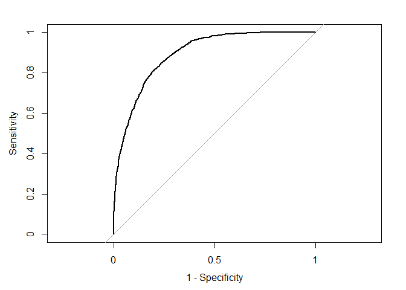

``` r
cat('AUC is', auc_pROC_3 <- pROC::auc(rocCurve_3),'\n\n')
```

    ## AUC is 0.892

``` r
#ci_3 <- ci(rocCurve_3)
```

#### 3.3.4 Intepretation

Similar to model-1 and model-2, the the significant predictors are: KIDSDRIV1, HOMEKIDS1, INCOME, PARENT1Yes, HOME\_VAL, MSTATUSz\_No, EDUCATIONBachelors, JOBDoctor, JOBManager, TRAVELTIME,CAR\_USEPrivate, BLUEBOOK, TIF1, CAR\_TYPEPanel Truck,CAR\_TYPEPickup,CAR\_TYPESports Car, CAR\_TYPEPEVan, CAR\_TYPEz\_SUV, OLDCLAIM,CLM\_FREQ1,REVOKEYes, MVR\_PTS1, URBANCITYz\_Highly Rural / Rural.

### 3.4 Model 4 -Linear regression model - backward selection

#### 3.4.1 Build the model

``` r
fill_data_lm <- fill_data_new
fill_data_lm$TARGET_FLAG <- as.numeric(as.character(fill_data_lm$TARGET_FLAG))

# OLS regression cofficients
olsreg <- lm(paste('TARGET_FLAG ~',paste(names(fill_data_lm[,-c(1,3)]),collapse = "+")),fill_data_lm )

olsfit_1 <- step(olsreg, data=fill_data_lm, direction="backward",trace=0)
summary(olsfit_1)
```

    ## 
    ## Call:
    ## lm(formula = TARGET_FLAG ~ YOJ + KIDSDRIV + HOMEKIDS + INCOME + 
    ##     PARENT1 + HOME_VAL + MSTATUS + EDUCATION + JOB + TRAVTIME + 
    ##     CAR_USE + BLUEBOOK + TIF + CAR_TYPE + OLDCLAIM + CLM_FREQ + 
    ##     REVOKED + MVR_PTS + URBANICITY, data = fill_data_lm)
    ## 
    ## Residuals:
    ##    Min     1Q Median     3Q    Max 
    ## -0.877 -0.289 -0.110  0.319  1.226 
    ## 
    ## Coefficients:
    ##                                     Estimate   Std. Error t value
    ## (Intercept)                      0.361269640  0.032516913   11.11
    ## YOJ                             -0.002462984  0.001239669   -1.99
    ## KIDSDRIV1                        0.086607326  0.015160431    5.71
    ## HOMEKIDS1                        0.030883693  0.013002711    2.38
    ## INCOME                          -0.000000412  0.000000162   -2.55
    ## PARENT1Yes                       0.061430428  0.018599529    3.30
    ## HOME_VAL                        -0.000000163  0.000000052   -3.12
    ## MSTATUSz_No                      0.074334459  0.012983111    5.73
    ## EDUCATIONBachelors              -0.059390618  0.016613550   -3.57
    ## EDUCATIONMasters                -0.037841396  0.023251489   -1.63
    ## EDUCATIONPhD                    -0.025453800  0.028719032   -0.89
    ## EDUCATIONz_High School           0.004961401  0.014660612    0.34
    ## JOBDoctor                       -0.122724343  0.036940916   -3.32
    ## JOBHome Maker                   -0.023698807  0.021472156   -1.10
    ## JOBLawyer                       -0.058494985  0.026234413   -2.23
    ## JOBManager                      -0.151475896  0.020435395   -7.41
    ## JOBProfessional                 -0.038451592  0.018553750   -2.07
    ## JOBStudent                      -0.020410411  0.020314244   -1.00
    ## JOBunkown                       -0.086508293  0.029250372   -2.96
    ## JOBz_Blue Collar                -0.009528123  0.016488992   -0.58
    ## TRAVTIME                         0.002029302  0.000275579    7.36
    ## CAR_USEPrivate                  -0.121225141  0.014065805   -8.62
    ## BLUEBOOK                        -0.000002809  0.000000668   -4.20
    ## TIF1                            -0.062407945  0.009324790   -6.69
    ## CAR_TYPEPanel Truck              0.059686125  0.022411583    2.66
    ## CAR_TYPEPickup                   0.069311102  0.014604147    4.75
    ## CAR_TYPESports Car               0.134891506  0.015836943    8.52
    ## CAR_TYPEVan                      0.077446461  0.017723000    4.37
    ## CAR_TYPEz_SUV                    0.093181662  0.012086595    7.71
    ## OLDCLAIM                        -0.000003489  0.000000682   -5.11
    ## CLM_FREQ1                        0.123234375  0.012073050   10.21
    ## REVOKEDYes                       0.166616914  0.014989669   11.12
    ## MVR_PTS1                         0.046825031  0.009128543    5.13
    ## URBANICITYz_Highly Rural/ Rural -0.291567465  0.012046038  -24.20
    ##                                             Pr(>|t|)    
    ## (Intercept)                     < 0.0000000000000002 ***
    ## YOJ                                          0.04698 *  
    ## KIDSDRIV1                          0.000000011510375 ***
    ## HOMEKIDS1                                    0.01756 *  
    ## INCOME                                       0.01086 *  
    ## PARENT1Yes                                   0.00096 ***
    ## HOME_VAL                                     0.00179 ** 
    ## MSTATUSz_No                        0.000000010681476 ***
    ## EDUCATIONBachelors                           0.00035 ***
    ## EDUCATIONMasters                             0.10367    
    ## EDUCATIONPhD                                 0.37548    
    ## EDUCATIONz_High School                       0.73506    
    ## JOBDoctor                                    0.00090 ***
    ## JOBHome Maker                                0.26976    
    ## JOBLawyer                                    0.02579 *  
    ## JOBManager                         0.000000000000136 ***
    ## JOBProfessional                              0.03826 *  
    ## JOBStudent                                   0.31505    
    ## JOBunkown                                    0.00311 ** 
    ## JOBz_Blue Collar                             0.56338    
    ## TRAVTIME                           0.000000000000196 ***
    ## CAR_USEPrivate                  < 0.0000000000000002 ***
    ## BLUEBOOK                           0.000026643886896 ***
    ## TIF1                               0.000000000023363 ***
    ## CAR_TYPEPanel Truck                          0.00776 ** 
    ## CAR_TYPEPickup                     0.000002110359926 ***
    ## CAR_TYPESports Car              < 0.0000000000000002 ***
    ## CAR_TYPEVan                        0.000012588978023 ***
    ## CAR_TYPEz_SUV                      0.000000000000014 ***
    ## OLDCLAIM                           0.000000322782929 ***
    ## CLM_FREQ1                       < 0.0000000000000002 ***
    ## REVOKEDYes                      < 0.0000000000000002 ***
    ## MVR_PTS1                           0.000000297196147 ***
    ## URBANICITYz_Highly Rural/ Rural < 0.0000000000000002 ***
    ## ---
    ## Signif. codes:  0 '***' 0.001 '**' 0.01 '*' 0.05 '.' 0.1 ' ' 1
    ## 
    ## Residual standard error: 0.389 on 8127 degrees of freedom
    ## Multiple R-squared:  0.225,  Adjusted R-squared:  0.222 
    ## F-statistic: 71.4 on 33 and 8127 DF,  p-value: <0.0000000000000002

``` r
#diagnostic plots for linear regression
#par(mfrow=c(2,2))
#plot(olsfit_1)
```

``` r
# set the null model
null_lm <- lm(TARGET_FLAG ~ 1, data=fill_data_lm)
```

#### 3.4.2 Diagnostics

``` r
residualPlots(olsfit_1,layout = c(3, 4),ask=F) #car
```

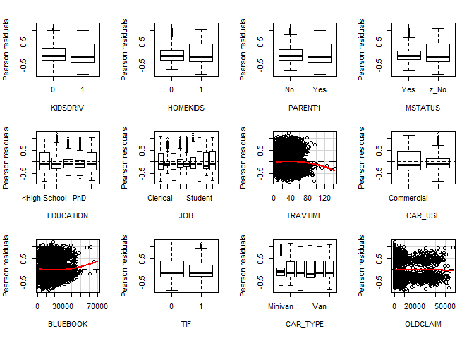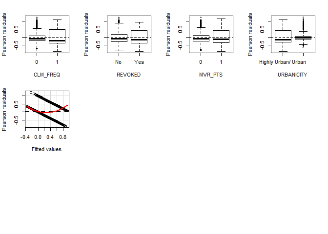

    ##            Test stat Pr(>|t|)
    ## KIDSDRIV          NA       NA
    ## HOMEKIDS          NA       NA
    ## PARENT1           NA       NA
    ## MSTATUS           NA       NA
    ## EDUCATION         NA       NA
    ## JOB               NA       NA
    ## TRAVTIME      -3.211    0.001
    ## CAR_USE           NA       NA
    ## BLUEBOOK       3.909    0.000
    ## TIF               NA       NA
    ## CAR_TYPE          NA       NA
    ## OLDCLAIM      -0.742    0.458
    ## CLM_FREQ          NA       NA
    ## REVOKED           NA       NA
    ## MVR_PTS           NA       NA
    ## URBANICITY        NA       NA
    ## Tukey test    14.469    0.000

``` r
mmps(olsfit_1,ask=F)
```

    ## Warning in mmps(olsfit_1, ask = F): Interactions and/or factors skipped

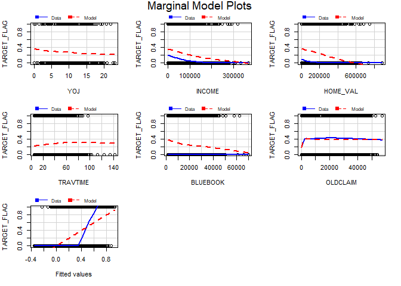

The goodness-of-fit test by the marginal model plot shows the model does not agree with the real data.

``` r
outlierTest(olsfit_1)
```

    ## 
    ## No Studentized residuals with Bonferonni p < 0.05
    ## Largest |rstudent|:
    ##      rstudent unadjusted p-value Bonferonni p
    ## 5101     3.16             0.0016           NA

The results show that there is no outlier as judged by Bonferonni p.

``` r
infIndexPlot(olsfit_1,id.n=3)
```

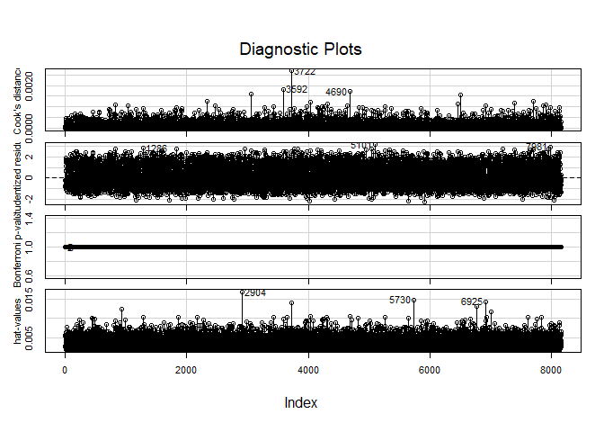

The largest hat values, Bonferonni P values, Cook's distance have been plotted. No observations that are farthest from the average has been denoted.

``` r
influencePlot(olsfit_1,col='red',id.n=2)
```

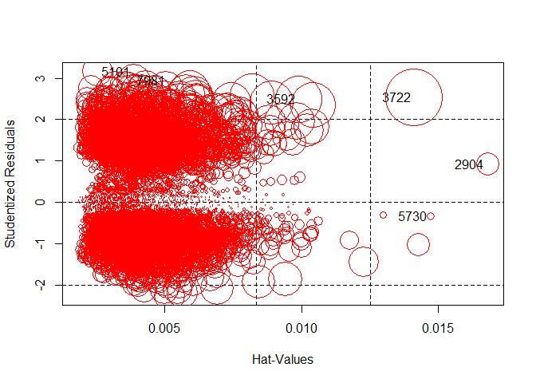

    ##      StudRes     Hat     CookD
    ## 2904   0.919 0.01679 0.0004239
    ## 3592   2.490 0.00990 0.0018228
    ## 3722   2.526 0.01412 0.0026877
    ## 5101   3.158 0.00255 0.0007476
    ## 5730  -0.345 0.01473 0.0000524
    ## 7981   2.933 0.00385 0.0009766

The above table shows some points with large studentized residuals, hat-values or Cook's distances from the influential plots. To test if the case, 3722, which has the largest Cook's distances is influential, I remove it from the model and compare the coefficients.

``` r
olsfit_1_3722 <- update(olsfit_1,subset=c(-3722))
compareCoefs(olsfit_1, olsfit_1_3722)
```

    ## 
    ## Call:
    ## 1: lm(formula = TARGET_FLAG ~ YOJ + KIDSDRIV + HOMEKIDS + INCOME + 
    ##   PARENT1 + HOME_VAL + MSTATUS + EDUCATION + JOB + TRAVTIME + CAR_USE + 
    ##   BLUEBOOK + TIF + CAR_TYPE + OLDCLAIM + CLM_FREQ + REVOKED + MVR_PTS + 
    ##   URBANICITY, data = fill_data_lm)
    ## 2: lm(formula = TARGET_FLAG ~ YOJ + KIDSDRIV + HOMEKIDS + INCOME + 
    ##   PARENT1 + HOME_VAL + MSTATUS + EDUCATION + JOB + TRAVTIME + CAR_USE + 
    ##   BLUEBOOK + TIF + CAR_TYPE + OLDCLAIM + CLM_FREQ + REVOKED + MVR_PTS + 
    ##   URBANICITY, data = fill_data_lm, subset = c(-3722))
    ##                                       Est. 1         SE 1       Est. 2
    ## (Intercept)                      0.361269640  0.032516913  0.361077592
    ## YOJ                             -0.002462984  0.001239669 -0.002468417
    ## KIDSDRIV1                        0.086607326  0.015160431  0.086583005
    ## HOMEKIDS1                        0.030883693  0.013002711  0.031181138
    ## INCOME                          -0.000000412  0.000000162 -0.000000422
    ## PARENT1Yes                       0.061430428  0.018599529  0.061084241
    ## HOME_VAL                        -0.000000163  0.000000052 -0.000000164
    ## MSTATUSz_No                      0.074334459  0.012983111  0.074424057
    ## EDUCATIONBachelors              -0.059390618  0.016613550 -0.059115262
    ## EDUCATIONMasters                -0.037841396  0.023251489 -0.037954043
    ## EDUCATIONPhD                    -0.025453800  0.028719032 -0.027345003
    ## EDUCATIONz_High School           0.004961401  0.014660612  0.005040856
    ## JOBDoctor                       -0.122724343  0.036940916 -0.119822010
    ## JOBHome Maker                   -0.023698807  0.021472156 -0.023639738
    ## JOBLawyer                       -0.058494985  0.026234413 -0.057603685
    ## JOBManager                      -0.151475896  0.020435395 -0.151692469
    ## JOBProfessional                 -0.038451592  0.018553750 -0.038153857
    ## JOBStudent                      -0.020410411  0.020314244 -0.020825408
    ## JOBunkown                       -0.086508293  0.029250372 -0.084971475
    ## JOBz_Blue Collar                -0.009528123  0.016488992 -0.009387942
    ## TRAVTIME                         0.002029302  0.000275579  0.002026864
    ## CAR_USEPrivate                  -0.121225141  0.014065805 -0.121279184
    ## BLUEBOOK                        -0.000002809  0.000000668 -0.000002754
    ## TIF1                            -0.062407945  0.009324790 -0.062044674
    ## CAR_TYPEPanel Truck              0.059686125  0.022411583  0.059270349
    ## CAR_TYPEPickup                   0.069311102  0.014604147  0.069334947
    ## CAR_TYPESports Car               0.134891506  0.015836943  0.133954496
    ## CAR_TYPEVan                      0.077446461  0.017723000  0.077365929
    ## CAR_TYPEz_SUV                    0.093181662  0.012086595  0.093192587
    ## OLDCLAIM                        -0.000003489  0.000000682 -0.000003633
    ## CLM_FREQ1                        0.123234375  0.012073050  0.124326245
    ## REVOKEDYes                       0.166616914  0.014989669  0.168225528
    ## MVR_PTS1                         0.046825031  0.009128543  0.046659300
    ## URBANICITYz_Highly Rural/ Rural -0.291567465  0.012046038 -0.291589400
    ##                                         SE 2
    ## (Intercept)                      0.032506238
    ## YOJ                              0.001239261
    ## KIDSDRIV1                        0.015155415
    ## HOMEKIDS1                        0.012998941
    ## INCOME                           0.000000162
    ## PARENT1Yes                       0.018593877
    ## HOME_VAL                         0.000000052
    ## MSTATUSz_No                      0.012978861
    ## EDUCATIONBachelors               0.016608408
    ## EDUCATIONMasters                 0.023243835
    ## EDUCATIONPhD                     0.028719283
    ## EDUCATIONz_High School           0.014655793
    ## JOBDoctor                        0.036946551
    ## JOBHome Maker                    0.021465061
    ## JOBLawyer                        0.026228102
    ## JOBManager                       0.020428810
    ## JOBProfessional                  0.018547983
    ## JOBStudent                       0.020308184
    ## JOBunkown                        0.029247016
    ## JOBz_Blue Collar                 0.016483627
    ## TRAVTIME                         0.000275490
    ## CAR_USEPrivate                   0.014061165
    ## BLUEBOOK                         0.000000669
    ## TIF1                             0.009322812
    ## CAR_TYPEPanel Truck              0.022404769
    ## CAR_TYPEPickup                   0.014599316
    ## CAR_TYPESports Car               0.015836044
    ## CAR_TYPEVan                      0.017717162
    ## CAR_TYPEz_SUV                    0.012082595
    ## OLDCLAIM                         0.000000684
    ## CLM_FREQ1                        0.012076789
    ## REVOKEDYes                       0.014998228
    ## MVR_PTS1                         0.009125757
    ## URBANICITYz_Highly Rural/ Rural  0.012042054

From the output table, we can see that coefficients are changed minimally, and the observation 3722 is not influential.

#### 3.4.2 Interpretation

``` r
round(summary(olsfit_1)$coef[summary(olsfit_1)$coef[,4] <= .05,],4)
```

    ##                                 Estimate Std. Error t value Pr(>|t|)
    ## (Intercept)                       0.3613     0.0325   11.11   0.0000
    ## YOJ                              -0.0025     0.0012   -1.99   0.0470
    ## KIDSDRIV1                         0.0866     0.0152    5.71   0.0000
    ## HOMEKIDS1                         0.0309     0.0130    2.38   0.0176
    ## INCOME                            0.0000     0.0000   -2.55   0.0109
    ## PARENT1Yes                        0.0614     0.0186    3.30   0.0010
    ## HOME_VAL                          0.0000     0.0000   -3.12   0.0018
    ## MSTATUSz_No                       0.0743     0.0130    5.73   0.0000
    ## EDUCATIONBachelors               -0.0594     0.0166   -3.57   0.0004
    ## JOBDoctor                        -0.1227     0.0369   -3.32   0.0009
    ## JOBLawyer                        -0.0585     0.0262   -2.23   0.0258
    ## JOBManager                       -0.1515     0.0204   -7.41   0.0000
    ## JOBProfessional                  -0.0385     0.0186   -2.07   0.0383
    ## JOBunkown                        -0.0865     0.0293   -2.96   0.0031
    ## TRAVTIME                          0.0020     0.0003    7.36   0.0000
    ## CAR_USEPrivate                   -0.1212     0.0141   -8.62   0.0000
    ## BLUEBOOK                          0.0000     0.0000   -4.20   0.0000
    ## TIF1                             -0.0624     0.0093   -6.69   0.0000
    ## CAR_TYPEPanel Truck               0.0597     0.0224    2.66   0.0078
    ## CAR_TYPEPickup                    0.0693     0.0146    4.75   0.0000
    ## CAR_TYPESports Car                0.1349     0.0158    8.52   0.0000
    ## CAR_TYPEVan                       0.0774     0.0177    4.37   0.0000
    ## CAR_TYPEz_SUV                     0.0932     0.0121    7.71   0.0000
    ## OLDCLAIM                          0.0000     0.0000   -5.11   0.0000
    ## CLM_FREQ1                         0.1232     0.0121   10.21   0.0000
    ## REVOKEDYes                        0.1666     0.0150   11.12   0.0000
    ## MVR_PTS1                          0.0468     0.0091    5.13   0.0000
    ## URBANICITYz_Highly Rural/ Rural  -0.2916     0.0120  -24.20   0.0000

**Marginal effects**

``` r
margins(olsfit_1)
```

    ## Average marginal effects

    ## lm(formula = TARGET_FLAG ~ YOJ + KIDSDRIV + HOMEKIDS + INCOME +     PARENT1 + HOME_VAL + MSTATUS + EDUCATION + JOB + TRAVTIME +     CAR_USE + BLUEBOOK + TIF + CAR_TYPE + OLDCLAIM + CLM_FREQ +     REVOKED + MVR_PTS + URBANICITY, data = fill_data_lm)

    ##        YOJ        INCOME      HOME_VAL TRAVTIME     BLUEBOOK     OLDCLAIM
    ##  -0.002463 -0.0000004116 -0.0000001626 0.002029 -0.000002809 -0.000003489
    ##  KIDSDRIV1 HOMEKIDS1 PARENT1Yes MSTATUSz_No EDUCATIONBachelors
    ##    0.08661   0.03088    0.06143     0.07433           -0.05939
    ##  EDUCATIONMasters EDUCATIONPhD EDUCATIONz_High School JOBDoctor
    ##          -0.03784     -0.02545               0.004961   -0.1227
    ##  JOBHome Maker JOBLawyer JOBManager JOBProfessional JOBStudent JOBunkown
    ##        -0.0237  -0.05849    -0.1515        -0.03845   -0.02041  -0.08651
    ##  JOBz_Blue Collar CAR_USEPrivate     TIF1 CAR_TYPEPanel Truck
    ##         -0.009528        -0.1212 -0.06241             0.05969
    ##  CAR_TYPEPickup CAR_TYPESports Car CAR_TYPEVan CAR_TYPEz_SUV CLM_FREQ1
    ##         0.06931             0.1349     0.07745       0.09318    0.1232
    ##  REVOKEDYes MVR_PTS1 URBANICITYz_Highly Rural/ Rural
    ##      0.1666  0.04683                         -0.2916

#### 3.4.3 Evaluation of the model

``` r
# goodness of fit: pseudo R squared
#(pR2_4 <- 1 - olsfit_1$deviance / olsfit_1$null.deviance) # not work for lm object

#or
(pR2_4 <- (1- logLik(olsfit_1)/logLik(null_lm))[1])
```

    ## [1] 0.212

``` r
# Log likelihood
(logLik_4<-logLik(olsfit_1))
```

    ## 'log Lik.' -3854 (df=35)

``` r
# AIC
#AIC_4 <- extractAIC(olsfit_1,K=35)[2]  # not right
suppressMessages((suppressWarnings(library(broom))))
```

    ##  [1] "broom"                "mlogit"               "maxLik"              
    ##  [4] "miscTools"            "margins"              "ROCR"                
    ##  [7] "gplots"               "MASS"                 "PerformanceAnalytics"
    ## [10] "xts"                  "zoo"                  "corrplot"            
    ## [13] "MissMech"             "rpart"                "pastecs"             
    ## [16] "boot"                 "rms"                  "SparseM"             
    ## [19] "Hmisc"                "Formula"              "survival"            
    ## [22] "pROC"                 "caret"                "lattice"             
    ## [25] "car"                  "stringr"              "dplyr"               
    ## [28] "formattable"          "kableExtra"           "ggplot2"             
    ## [31] "knitr"                "stats"                "graphics"            
    ## [34] "grDevices"            "utils"                "datasets"            
    ## [37] "methods"              "base"

``` r
AIC_4 <- glance(olsfit_1)$AIC

# confusion matrix
clsdf_4 <- data.frame(fill_data_lm$TARGET_FLAG)
clsdf_4$pre.prob <- predict( olsfit_1, newdata = fill_data_lm, type = "response")
clsdf_4$pre.target <- ifelse(clsdf_4$pre.prob>0.5, 1,0)
#clsdf_4$pre.target <- as.factor(clsdf_4$pre.target)
names(clsdf_4)[names(clsdf_4)=='fill_data_lm.TARGET_FLAG'] <- 'TARGET_FLAG'

cfmx_4 <- confusionMatrix(data = clsdf_4$pre.target, reference = clsdf_4$TARGET_FLAG, positive = "1")

(cfmx_4$table)
```

    ##           Reference
    ## Prediction    0    1
    ##          0 5640 1382
    ##          1  368  771

``` r
(kappa_4 <- cfmx_4$overall['Kappa'])  #assess the agreement between two raters
```

    ## Kappa 
    ##  0.35

``` r
(acrcy_4 <- cfmx_4$overall['Accuracy'])
```

    ## Accuracy 
    ##    0.786

``` r
(err_rate_4 <- 1-cfmx_4$overall['Accuracy'])
```

    ## Accuracy 
    ##    0.214

``` r
(preci_4 <- cfmx_4$byClass['Precision'])
```

    ## Precision 
    ##     0.677

``` r
(sensi_4 <- cfmx_4$byClass['Sensitivity'])
```

    ## Sensitivity 
    ##       0.358

``` r
(speci_4 <- cfmx_4$byClass['Specificity'])
```

    ## Specificity 
    ##       0.939

``` r
(F1_4 <- cfmx_4$byClass['F1'])
```

    ##    F1 
    ## 0.468

``` r
(J_4 <-  sensi_4 + speci_4 - 1) # J index proportions of correctly predicted samples for both the event and nonevent groups
```

    ## Sensitivity 
    ##       0.297

``` r
(ppv_4 <- (sensi_4 * prevalence)/((sensi_4 * prevalence) + ((1 - speci_4) * (1 - prevalence)))) # positive predicted value,answer what is the probability that this sample is an event?-
```

    ## Sensitivity 
    ##       0.677

``` r
(npv_4 <- (sensi_4 * (1-prevalence))/(((1-sensi_4) * prevalence) + ( speci_4 * (1 - prevalence)))) # negative predicted value 
```

    ## Sensitivity 
    ##       0.306

``` r
# ROC and AUC
rocCurve_4 <- roc(response = clsdf_4$TARGET_FLAG,
 predictor = clsdf_4$pre.prob,
 levels = levels(as.factor(clsdf_4$TARGET_FLAG)))

plot(rocCurve_4, legacy.axes = TRUE)
```

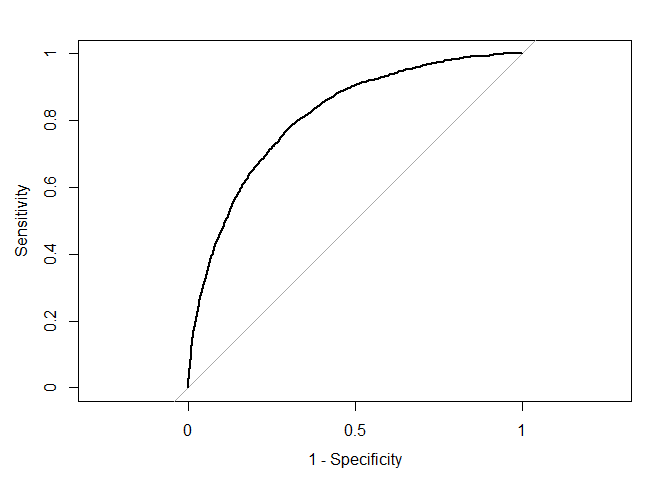

``` r
cat('AUC is', auc_pROC_4 <- pROC::auc(rocCurve_4),'\n\n')
```

    ## AUC is 0.811

``` r
#ci_4 <- ci(rocCurve_4)
```

### 3.5 Model 5 - Linear regression model - fit.mult.impute function

#### 3.5.1 Build the model

In model-5, TARGET\_FLAG is considered as numerical variable in fitting the ordinary least squares (OLS). In part 2, multiply imputation is applied to impute every missing value in the data set and 6 data sets were created. In this model, the averaged coefficients is calculated based on the created data sets, with imputation corrected variances. The model is shown below:

``` r
#convert TARGET_FLAG to numeric for the linear regression model
binary_trsf_lm <- binary_trsf
binary_trsf_lm$TARGET_FLAG <- as.numeric(as.character(binary_trsf_lm$TARGET_FLAG))

(olsfit_2 <- fit.mult.impute(TARGET_FLAG ~ YOJ+KIDSDRIV+AGE+HOMEKIDS+INCOME+PARENT1+HOME_VAL+MSTATUS+SEX+EDUCATION+JOB+TRAVTIME+CAR_USE+BLUEBOOK+TIF+CAR_TYPE+RED_CAR+OLDCLAIM+CLM_FREQ+REVOKED+MVR_PTS+CAR_AGE+URBANICITY,fitter=ols,xtrans=mi_2,data=binary_trsf_lm))
```

    ## 
    ## Variance Inflation Factors Due to Imputation:
    ## 
    ##                        Intercept                              YOJ 
    ##                             1.00                             1.03 
    ##                       KIDSDRIV=1                              AGE 
    ##                             1.00                             1.00 
    ##                       HOMEKIDS=1                           INCOME 
    ##                             1.00                             1.02 
    ##                      PARENT1=Yes                         HOME_VAL 
    ##                             1.00                             1.05 
    ##                     MSTATUS=z_No                          SEX=z_F 
    ##                             1.01                             1.00 
    ##              EDUCATION=Bachelors                EDUCATION=Masters 
    ##                             1.01                             1.01 
    ##                    EDUCATION=PhD          EDUCATION=z_High School 
    ##                             1.01                             1.00 
    ##                       JOB=Doctor                   JOB=Home Maker 
    ##                             1.00                             1.00 
    ##                       JOB=Lawyer                      JOB=Manager 
    ##                             1.00                             1.00 
    ##                 JOB=Professional                      JOB=Student 
    ##                             1.00                             1.00 
    ##                       JOB=unkown                JOB=z_Blue Collar 
    ##                             1.00                             1.00 
    ##                         TRAVTIME                  CAR_USE=Private 
    ##                             1.00                             1.00 
    ##                         BLUEBOOK                            TIF=1 
    ##                             1.00                             1.00 
    ##             CAR_TYPE=Panel Truck                  CAR_TYPE=Pickup 
    ##                             1.00                             1.00 
    ##              CAR_TYPE=Sports Car                     CAR_TYPE=Van 
    ##                             1.00                             1.00 
    ##                   CAR_TYPE=z_SUV                      RED_CAR=yes 
    ##                             1.00                             1.00 
    ##                         OLDCLAIM                       CLM_FREQ=1 
    ##                             1.00                             1.00 
    ##                      REVOKED=Yes                        MVR_PTS=1 
    ##                             1.00                             1.00 
    ##                          CAR_AGE URBANICITY=z_Highly Rural/ Rural 
    ##                             1.08                             1.00 
    ## 
    ## Rate of Missing Information:
    ## 
    ##                        Intercept                              YOJ 
    ##                             0.00                             0.03 
    ##                       KIDSDRIV=1                              AGE 
    ##                             0.00                             0.00 
    ##                       HOMEKIDS=1                           INCOME 
    ##                             0.00                             0.02 
    ##                      PARENT1=Yes                         HOME_VAL 
    ##                             0.00                             0.05 
    ##                     MSTATUS=z_No                          SEX=z_F 
    ##                             0.01                             0.00 
    ##              EDUCATION=Bachelors                EDUCATION=Masters 
    ##                             0.01                             0.01 
    ##                    EDUCATION=PhD          EDUCATION=z_High School 
    ##                             0.01                             0.00 
    ##                       JOB=Doctor                   JOB=Home Maker 
    ##                             0.00                             0.00 
    ##                       JOB=Lawyer                      JOB=Manager 
    ##                             0.00                             0.00 
    ##                 JOB=Professional                      JOB=Student 
    ##                             0.00                             0.00 
    ##                       JOB=unkown                JOB=z_Blue Collar 
    ##                             0.00                             0.00 
    ##                         TRAVTIME                  CAR_USE=Private 
    ##                             0.00                             0.00 
    ##                         BLUEBOOK                            TIF=1 
    ##                             0.00                             0.00 
    ##             CAR_TYPE=Panel Truck                  CAR_TYPE=Pickup 
    ##                             0.00                             0.00 
    ##              CAR_TYPE=Sports Car                     CAR_TYPE=Van 
    ##                             0.00                             0.00 
    ##                   CAR_TYPE=z_SUV                      RED_CAR=yes 
    ##                             0.00                             0.00 
    ##                         OLDCLAIM                       CLM_FREQ=1 
    ##                             0.00                             0.00 
    ##                      REVOKED=Yes                        MVR_PTS=1 
    ##                             0.00                             0.00 
    ##                          CAR_AGE URBANICITY=z_Highly Rural/ Rural 
    ##                             0.07                             0.00 
    ## 
    ## d.f. for t-distribution for Tests of Single Coefficients:
    ## 
    ##                        Intercept                              YOJ 
    ##                         21895496                             6351 
    ##                       KIDSDRIV=1                              AGE 
    ##                        108462971                           250538 
    ##                       HOMEKIDS=1                           INCOME 
    ##                          1386211                            15663 
    ##                      PARENT1=Yes                         HOME_VAL 
    ##                        108794833                             2017 
    ##                     MSTATUS=z_No                          SEX=z_F 
    ##                            39985                         29204835 
    ##              EDUCATION=Bachelors                EDUCATION=Masters 
    ##                            74984                            27078 
    ##                    EDUCATION=PhD          EDUCATION=z_High School 
    ##                            88352                          8833740 
    ##                       JOB=Doctor                   JOB=Home Maker 
    ##                         72293732                           315858 
    ##                       JOB=Lawyer                      JOB=Manager 
    ##                        436373160                         98285155 
    ##                 JOB=Professional                      JOB=Student 
    ##                         46710557                           292337 
    ##                       JOB=unkown                JOB=z_Blue Collar 
    ##                         50414095                        117956826 
    ##                         TRAVTIME                  CAR_USE=Private 
    ##                        175047741                        641623481 
    ##                         BLUEBOOK                            TIF=1 
    ##                         10356168                        475513198 
    ##             CAR_TYPE=Panel Truck                  CAR_TYPE=Pickup 
    ##                         54593579                        249050177 
    ##              CAR_TYPE=Sports Car                     CAR_TYPE=Van 
    ##                         20073818                        116790819 
    ##                   CAR_TYPE=z_SUV                      RED_CAR=yes 
    ##                         79553249                        116572083 
    ##                         OLDCLAIM                       CLM_FREQ=1 
    ##                         58565928                         19252107 
    ##                      REVOKED=Yes                        MVR_PTS=1 
    ##                       7244717722                         83175986 
    ##                          CAR_AGE URBANICITY=z_Highly Rural/ Rural 
    ##                             1008                         46979983 
    ## 
    ## The following fit components were averaged over the 6 model fits:
    ## 
    ##   fitted.values stats linear.predictors

    ## Linear Regression Model
    ##  
    ##  fit.mult.impute(formula = TARGET_FLAG ~ YOJ + KIDSDRIV + AGE + 
    ##      HOMEKIDS + INCOME + PARENT1 + HOME_VAL + MSTATUS + SEX + 
    ##      EDUCATION + JOB + TRAVTIME + CAR_USE + BLUEBOOK + TIF + CAR_TYPE + 
    ##      RED_CAR + OLDCLAIM + CLM_FREQ + REVOKED + MVR_PTS + CAR_AGE + 
    ##      URBANICITY, fitter = ols, xtrans = mi_2, data = binary_trsf_lm)
    ##  
    ##                  Model Likelihood     Discrimination    
    ##                     Ratio Test           Indexes        
    ##  Obs    8161    LR chi2    2081.90    R2       0.225    
    ##  sigma0.3888    d.f.            37    R2 adj   0.222    
    ##  d.f.   8123    Pr(> chi2)  0.0000    g        0.238    
    ##  
    ##  Residuals
    ##  
    ##      Min      1Q  Median      3Q     Max 
    ##  -0.8836 -0.2883 -0.1091  0.3177  1.2222 
    ##  
    ##  
    ##                                   Coef    S.E.   t      Pr(>|t|)
    ##  Intercept                         0.3633 0.0420   8.64 <0.0001 
    ##  YOJ                              -0.0027 0.0013  -2.13 0.0332  
    ##  KIDSDRIV=1                        0.0857 0.0155   5.54 <0.0001 
    ##  AGE                               0.0001 0.0006   0.23 0.8184  
    ##  HOMEKIDS=1                        0.0335 0.0145   2.31 0.0209  
    ##  INCOME                            0.0000 0.0000  -2.51 0.0119  
    ##  PARENT1=Yes                       0.0612 0.0186   3.29 0.0010  
    ##  HOME_VAL                          0.0000 0.0000  -3.10 0.0019  
    ##  MSTATUS=z_No                      0.0742 0.0131   5.68 <0.0001 
    ##  SEX=z_F                          -0.0139 0.0157  -0.89 0.3759  
    ##  EDUCATION=Bachelors              -0.0525 0.0177  -2.96 0.0030  
    ##  EDUCATION=Masters                -0.0238 0.0262  -0.91 0.3633  
    ##  EDUCATION=PhD                    -0.0114 0.0310  -0.37 0.7133  
    ##  EDUCATION=z_High School           0.0065 0.0147   0.44 0.6567  
    ##  JOB=Doctor                       -0.1240 0.0370  -3.35 0.0008  
    ##  JOB=Home Maker                   -0.0228 0.0217  -1.05 0.2954  
    ##  JOB=Lawyer                       -0.0593 0.0263  -2.25 0.0242  
    ##  JOB=Manager                      -0.1522 0.0205  -7.42 <0.0001 
    ##  JOB=Professional                 -0.0388 0.0186  -2.08 0.0371  
    ##  JOB=Student                      -0.0216 0.0204  -1.06 0.2883  
    ##  JOB=unkown                       -0.0869 0.0293  -2.97 0.0030  
    ##  JOB=z_Blue Collar                -0.0096 0.0165  -0.58 0.5589  
    ##  TRAVTIME                          0.0020 0.0003   7.36 <0.0001 
    ##  CAR_USE=Private                  -0.1213 0.0141  -8.62 <0.0001 
    ##  BLUEBOOK                          0.0000 0.0000  -3.40 0.0007  
    ##  TIF=1                            -0.0626 0.0093  -6.71 <0.0001 
    ##  CAR_TYPE=Panel Truck              0.0522 0.0238   2.19 0.0284  
    ##  CAR_TYPE=Pickup                   0.0696 0.0146   4.77 <0.0001 
    ##  CAR_TYPE=Sports Car               0.1434 0.0186   7.70 <0.0001 
    ##  CAR_TYPE=Van                      0.0728 0.0182   3.99 <0.0001 
    ##  CAR_TYPE=z_SUV                    0.1019 0.0154   6.63 <0.0001 
    ##  RED_CAR=yes                      -0.0013 0.0128  -0.10 0.9190  
    ##  OLDCLAIM                          0.0000 0.0000  -5.12 <0.0001 
    ##  CLM_FREQ=1                        0.1226 0.0121  10.15 <0.0001 
    ##  REVOKED=Yes                       0.1663 0.0150  11.09 <0.0001 
    ##  MVR_PTS=1                         0.0473 0.0091   5.17 <0.0001 
    ##  CAR_AGE                          -0.0013 0.0011  -1.13 0.2565  
    ##  URBANICITY=z_Highly Rural/ Rural -0.2920 0.0121 -24.22 <0.0001 
    ## 

``` r
dd <- datadist(binary_trsf_lm)
options(datadist="dd")
summary(olsfit_2)
```

    ##              Effects              Response : TARGET_FLAG 
    ## 
    ##  Factor                                                 Low   High  
    ##  YOJ                                                        9     13
    ##  AGE                                                       39     51
    ##  INCOME                                                 28097  85986
    ##  HOME_VAL                                                   0 238720
    ##  TRAVTIME                                                  22     44
    ##  BLUEBOOK                                                9280  20850
    ##  OLDCLAIM                                                   0   4636
    ##  CAR_AGE                                                    1     12
    ##  KIDSDRIV - 1:0                                             1      2
    ##  HOMEKIDS - 1:0                                             1      2
    ##  PARENT1 - Yes:No                                           1      2
    ##  MSTATUS - z_No:Yes                                         1      2
    ##  SEX - M:z_F                                                2      1
    ##  EDUCATION - <High School:z_High School                     5      1
    ##  EDUCATION - Bachelors:z_High School                        5      2
    ##  EDUCATION - Masters:z_High School                          5      3
    ##  EDUCATION - PhD:z_High School                              5      4
    ##  JOB - Clerical:z_Blue Collar                               9      1
    ##  JOB - Doctor:z_Blue Collar                                 9      2
    ##  JOB - Home Maker:z_Blue Collar                             9      3
    ##  JOB - Lawyer:z_Blue Collar                                 9      4
    ##  JOB - Manager:z_Blue Collar                                9      5
    ##  JOB - Professional:z_Blue Collar                           9      6
    ##  JOB - Student:z_Blue Collar                                9      7
    ##  JOB - unkown:z_Blue Collar                                 9      8
    ##  CAR_USE - Commercial:Private                               2      1
    ##  TIF - 0:1                                                  2      1
    ##  CAR_TYPE - Minivan:z_SUV                                   6      1
    ##  CAR_TYPE - Panel Truck:z_SUV                               6      2
    ##  CAR_TYPE - Pickup:z_SUV                                    6      3
    ##  CAR_TYPE - Sports Car:z_SUV                                6      4
    ##  CAR_TYPE - Van:z_SUV                                       6      5
    ##  RED_CAR - yes:no                                           1      2
    ##  CLM_FREQ - 1:0                                             1      2
    ##  REVOKED - Yes:No                                           1      2
    ##  MVR_PTS - 0:1                                              2      1
    ##  URBANICITY - z_Highly Rural/ Rural:Highly Urban/ Urban     1      2
    ##  Diff.  Effect   S.E.    Lower 0.95 Upper 0.95
    ##       4 -0.01092 0.00512 -0.02096   -0.000871 
    ##      12  0.00172 0.00750 -0.01298    0.016428 
    ##   57889 -0.02387 0.00949 -0.04247   -0.005261 
    ##  238720 -0.03971 0.01280 -0.06481   -0.014615 
    ##      22  0.04463 0.00606  0.03274    0.056518 
    ##   11570 -0.02913 0.00856 -0.04590   -0.012354 
    ##    4636 -0.01618 0.00316 -0.02239   -0.009983 
    ##      11 -0.01422 0.01253 -0.03878    0.010342 
    ##      NA  0.08574 0.01546  0.05542    0.116060 
    ##      NA  0.03351 0.01451  0.00507    0.061954 
    ##      NA  0.06116 0.01860  0.02470    0.097625 
    ##      NA  0.07424 0.01306  0.04863    0.099844 
    ##      NA  0.01394 0.01574 -0.01692    0.044807 
    ##      NA -0.00654 0.01472 -0.03539    0.022306 
    ##      NA -0.05905 0.01366 -0.08582   -0.032278 
    ##      NA -0.03034 0.02291 -0.07525    0.014570 
    ##      NA -0.01794 0.02811 -0.07304    0.037150 
    ##      NA  0.00965 0.01650 -0.02270    0.041996 
    ##      NA -0.11434 0.03725 -0.18735   -0.041332 
    ##      NA -0.01311 0.02318 -0.05855    0.032328 
    ##      NA -0.04970 0.02659 -0.10183    0.002435 
    ##      NA -0.14259 0.02006 -0.18192   -0.103270 
    ##      NA -0.02912 0.01823 -0.06485    0.006614 
    ##      NA -0.01200 0.02014 -0.05147    0.027484 
    ##      NA -0.07730 0.02756 -0.13132   -0.023273 
    ##      NA  0.12128 0.01407  0.09370    0.148860 
    ##      NA  0.06260 0.00933  0.04432    0.080878 
    ##      NA -0.10185 0.01535 -0.13195   -0.071760 
    ##      NA -0.04966 0.02915 -0.10680    0.007475 
    ##      NA -0.03222 0.01705 -0.06564    0.001191 
    ##      NA  0.04157 0.01531  0.01157    0.071578 
    ##      NA -0.02909 0.02286 -0.07391    0.015723 
    ##      NA -0.00130 0.01276 -0.02631    0.023713 
    ##      NA  0.12265 0.01208  0.09896    0.146330 
    ##      NA  0.16634 0.01499  0.13695    0.195730 
    ##      NA -0.04729 0.00914 -0.06520   -0.029371 
    ##      NA -0.29197 0.01205 -0.31560   -0.268350

``` r
# A good way to check for stable variance of residuals from ols
# xYplot(resid(fit) ~ fitted(fit), method=smean.sdl)
# smean.sdl is defined with summary.formula in Hmisc
```

#### 3.5.2 Evaluation of the model

``` r
# goodness of fit: pseudo R squared
#(pR2_5 <- 1 - olsfit_2$deviance / olsfit_2$null.deviance) # not work for fit.mult.impute object

#or
(pR2_5 <- (1- logLik(olsfit_2)/logLik(null_lm))[1])
```

    ## [1] 0.213

``` r
# Log likelihood
(logLik_5<-logLik(olsfit_2))
```

    ## 'log Lik.' -3853 (df=39)

``` r
# AIC
k5 <- length(olsfit_2$coefficients)
AIC_5 <- (2*k5 -2*logLik_5)[1]

#or
#library(broom)
AIC_5 <- glance(olsfit_2)$AIC

# confusion matrix
clsdf_5 <- data.frame(fill_data_new$TARGET_FLAG)
clsdf_5$pre.prob <- predict( olsfit_2, newdata = fill_data_lm)
clsdf_5$pre.target <- ifelse(clsdf_5$pre.prob<0.5, 0,1)
clsdf_5$pre.target <- as.factor(clsdf_5$pre.target)
names(clsdf_5)[names(clsdf_5)=='fill_data_new.TARGET_FLAG'] <- 'TARGET_FLAG'

#X.test <- trsf_df[,-which(names(trsf_df)=='target')]
#X.test <- X.test[,which(names(X.test) %in% c('medv', 'q.medv', 'zn', 'l.zn', 'dis', 'chas', 'lstat', 'age'))]
#y_predicted <- predict(logitfit.1, newx = as.matrix(X.test))

cfmx_5 <- confusionMatrix(data = clsdf_5$pre.target, reference = clsdf_5$TARGET_FLAG, positive = "1")

(cfmx_5$table)
```

    ##           Reference
    ## Prediction    0    1
    ##          0 5650 1387
    ##          1  358  766

``` r
(kappa_5 <- cfmx_5$overall['Kappa'])  #assess the agreement between two raters
```

    ## Kappa 
    ##  0.35

``` r
(acrcy_5 <- cfmx_5$overall['Accuracy'])
```

    ## Accuracy 
    ##    0.786

``` r
(err_rate_5 <- 1-cfmx_5$overall['Accuracy'])
```

    ## Accuracy 
    ##    0.214

``` r
(preci_5 <- cfmx_5$byClass['Precision'])
```

    ## Precision 
    ##     0.681

``` r
(sensi_5 <- cfmx_5$byClass['Sensitivity'])
```

    ## Sensitivity 
    ##       0.356

``` r
(speci_5 <- cfmx_5$byClass['Specificity'])
```

    ## Specificity 
    ##        0.94

``` r
(F1_5 <- cfmx_5$byClass['F1'])
```

    ##    F1 
    ## 0.468

``` r
(J_5 <-  sensi_5 + speci_5 - 1) # J index proportions of correctly predicted samples for both the event and nonevent groups
```

    ## Sensitivity 
    ##       0.296

``` r
(ppv_5 <- (sensi_5 * prevalence)/((sensi_5 * prevalence) + ((1 - speci_5) * (1 - prevalence)))) # positive predicted value,answer -what is the probability that this sample is an event?-
```

    ## Sensitivity 
    ##       0.681

``` r
(npv_5 <- (sensi_5 * (1-prevalence))/(((1-sensi_5) * prevalence) + ( speci_5 * (1 - prevalence)))) # negative predicted value 
```

    ## Sensitivity 
    ##       0.304

``` r
# ROC and AUC
rocCurve_5 <- roc(response = clsdf_5$TARGET_FLAG,
 predictor = clsdf_5$pre.prob,
 levels = levels(as.factor(clsdf_5$TARGET_FLAG)))

plot(rocCurve_5, legacy.axes = TRUE)
```


``` r
cat('AUC is', auc_pROC_5 <- pROC::auc(rocCurve_5),'\n\n')
```

    ## AUC is 0.811

``` r
#ci_5 <- ci(rocCurve_5)
```

### 3.6 Model 6 - Use TARGET\_AMT as dependent model

#### 3.6.1 Build the model

The previously built models either use TARGET\_FLAG as binary data in the logistic regression model or as numerical data in the linear regression model. In model-6, TARGET\_AMT is considered as numerical variable in fitting the ordinary least squares (OLS). In part 2, multiply imputation is applied to impute every missing value in the data set and 6 data sets were created. In this model, the averaged coefficients is calculated based on the created data sets, with imputation corrected variances. The model is shown below:

``` r
dd <- datadist(binary_trsf_lm)
options(datadist="dd")

(olsfit_3 <- fit.mult.impute(TARGET_AMT ~ YOJ+KIDSDRIV+AGE+HOMEKIDS+INCOME+PARENT1+HOME_VAL+MSTATUS+SEX+EDUCATION+JOB+TRAVTIME+CAR_USE+BLUEBOOK+TIF+CAR_TYPE+RED_CAR+OLDCLAIM+CLM_FREQ+REVOKED+MVR_PTS+CAR_AGE+URBANICITY,fitter=ols,xtrans=mi_2,data=binary_trsf_lm))
```

    ## 
    ## Variance Inflation Factors Due to Imputation:
    ## 
    ##                        Intercept                              YOJ 
    ##                             1.00                             1.05 
    ##                       KIDSDRIV=1                              AGE 
    ##                             1.00                             1.00 
    ##                       HOMEKIDS=1                           INCOME 
    ##                             1.00                             1.06 
    ##                      PARENT1=Yes                         HOME_VAL 
    ##                             1.00                             1.03 
    ##                     MSTATUS=z_No                          SEX=z_F 
    ##                             1.01                             1.00 
    ##              EDUCATION=Bachelors                EDUCATION=Masters 
    ##                             1.00                             1.01 
    ##                    EDUCATION=PhD          EDUCATION=z_High School 
    ##                             1.00                             1.00 
    ##                       JOB=Doctor                   JOB=Home Maker 
    ##                             1.00                             1.01 
    ##                       JOB=Lawyer                      JOB=Manager 
    ##                             1.00                             1.00 
    ##                 JOB=Professional                      JOB=Student 
    ##                             1.00                             1.01 
    ##                       JOB=unkown                JOB=z_Blue Collar 
    ##                             1.00                             1.00 
    ##                         TRAVTIME                  CAR_USE=Private 
    ##                             1.00                             1.00 
    ##                         BLUEBOOK                            TIF=1 
    ##                             1.00                             1.00 
    ##             CAR_TYPE=Panel Truck                  CAR_TYPE=Pickup 
    ##                             1.00                             1.00 
    ##              CAR_TYPE=Sports Car                     CAR_TYPE=Van 
    ##                             1.00                             1.00 
    ##                   CAR_TYPE=z_SUV                      RED_CAR=yes 
    ##                             1.00                             1.00 
    ##                         OLDCLAIM                       CLM_FREQ=1 
    ##                             1.00                             1.00 
    ##                      REVOKED=Yes                        MVR_PTS=1 
    ##                             1.00                             1.00 
    ##                          CAR_AGE URBANICITY=z_Highly Rural/ Rural 
    ##                             1.03                             1.00 
    ## 
    ## Rate of Missing Information:
    ## 
    ##                        Intercept                              YOJ 
    ##                             0.00                             0.05 
    ##                       KIDSDRIV=1                              AGE 
    ##                             0.00                             0.00 
    ##                       HOMEKIDS=1                           INCOME 
    ##                             0.00                             0.06 
    ##                      PARENT1=Yes                         HOME_VAL 
    ##                             0.00                             0.03 
    ##                     MSTATUS=z_No                          SEX=z_F 
    ##                             0.01                             0.00 
    ##              EDUCATION=Bachelors                EDUCATION=Masters 
    ##                             0.00                             0.01 
    ##                    EDUCATION=PhD          EDUCATION=z_High School 
    ##                             0.00                             0.00 
    ##                       JOB=Doctor                   JOB=Home Maker 
    ##                             0.00                             0.01 
    ##                       JOB=Lawyer                      JOB=Manager 
    ##                             0.00                             0.00 
    ##                 JOB=Professional                      JOB=Student 
    ##                             0.00                             0.01 
    ##                       JOB=unkown                JOB=z_Blue Collar 
    ##                             0.00                             0.00 
    ##                         TRAVTIME                  CAR_USE=Private 
    ##                             0.00                             0.00 
    ##                         BLUEBOOK                            TIF=1 
    ##                             0.00                             0.00 
    ##             CAR_TYPE=Panel Truck                  CAR_TYPE=Pickup 
    ##                             0.00                             0.00 
    ##              CAR_TYPE=Sports Car                     CAR_TYPE=Van 
    ##                             0.00                             0.00 
    ##                   CAR_TYPE=z_SUV                      RED_CAR=yes 
    ##                             0.00                             0.00 
    ##                         OLDCLAIM                       CLM_FREQ=1 
    ##                             0.00                             0.00 
    ##                      REVOKED=Yes                        MVR_PTS=1 
    ##                             0.00                             0.00 
    ##                          CAR_AGE URBANICITY=z_Highly Rural/ Rural 
    ##                             0.03                             0.00 
    ## 
    ## d.f. for t-distribution for Tests of Single Coefficients:
    ## 
    ##                        Intercept                              YOJ 
    ##                          1177018                             1967 
    ##                       KIDSDRIV=1                              AGE 
    ##                         31127726                           339256 
    ##                       HOMEKIDS=1                           INCOME 
    ##                           933343                             1448 
    ##                      PARENT1=Yes                         HOME_VAL 
    ##                        264536791                             7857 
    ##                     MSTATUS=z_No                          SEX=z_F 
    ##                            83092                        135528057 
    ##              EDUCATION=Bachelors                EDUCATION=Masters 
    ##                           451962                           155057 
    ##                    EDUCATION=PhD          EDUCATION=z_High School 
    ##                           211080                         45389367 
    ##                       JOB=Doctor                   JOB=Home Maker 
    ##                         34999682                            55617 
    ##                       JOB=Lawyer                      JOB=Manager 
    ##                         13269664                          2358257 
    ##                 JOB=Professional                      JOB=Student 
    ##                          3751697                           100623 
    ##                       JOB=unkown                JOB=z_Blue Collar 
    ##                          3083265                          2996746 
    ##                         TRAVTIME                  CAR_USE=Private 
    ##                        415911551                        140038118 
    ##                         BLUEBOOK                            TIF=1 
    ##                          1171575                       1030746992 
    ##             CAR_TYPE=Panel Truck                  CAR_TYPE=Pickup 
    ##                        193062598                      18167060720 
    ##              CAR_TYPE=Sports Car                     CAR_TYPE=Van 
    ##                         63226029                      15203602302 
    ##                   CAR_TYPE=z_SUV                      RED_CAR=yes 
    ##                        248624431                        470951313 
    ##                         OLDCLAIM                       CLM_FREQ=1 
    ##                       1146706275                         33898449 
    ##                      REVOKED=Yes                        MVR_PTS=1 
    ##                       8633487805                       1412188669 
    ##                          CAR_AGE URBANICITY=z_Highly Rural/ Rural 
    ##                             4482                         84816537 
    ## 
    ## The following fit components were averaged over the 6 model fits:
    ## 
    ##   fitted.values stats linear.predictors

    ## Linear Regression Model
    ##  
    ##  fit.mult.impute(formula = TARGET_AMT ~ YOJ + KIDSDRIV + AGE + 
    ##      HOMEKIDS + INCOME + PARENT1 + HOME_VAL + MSTATUS + SEX + 
    ##      EDUCATION + JOB + TRAVTIME + CAR_USE + BLUEBOOK + TIF + CAR_TYPE + 
    ##      RED_CAR + OLDCLAIM + CLM_FREQ + REVOKED + MVR_PTS + CAR_AGE + 
    ##      URBANICITY, fitter = ols, xtrans = mi_2, data = binary_trsf_lm)
    ##  
    ##                    Model Likelihood     Discrimination    
    ##                       Ratio Test           Indexes        
    ##  Obs       8161    LR chi2    583.70    R2       0.069    
    ##  sigma4549.1013    d.f.           37    R2 adj   0.065    
    ##  d.f.      8123    Pr(> chi2) 0.0000    g     1409.628    
    ##  
    ##  Residuals
    ##  
    ##       Min       1Q   Median       3Q      Max 
    ##   -5272.3  -1729.9   -777.4    400.0 104356.4 
    ##  
    ##  
    ##                                   Coef       S.E.     t      Pr(>|t|)
    ##  Intercept                         1489.4958 492.3091   3.03 0.0025  
    ##  YOJ                                 -7.7292  15.1622  -0.51 0.6102  
    ##  KIDSDRIV=1                         546.3785 180.9510   3.02 0.0025  
    ##  AGE                                  6.4183   7.3119   0.88 0.3801  
    ##  HOMEKIDS=1                         271.7465 169.7753   1.60 0.1095  
    ##  INCOME                              -0.0050   0.0020  -2.54 0.0111  
    ##  PARENT1=Yes                        466.3139 217.6062   2.14 0.0321  
    ##  HOME_VAL                            -0.0006   0.0006  -1.04 0.2987  
    ##  MSTATUS=z_No                       597.2622 152.5617   3.91 <0.0001 
    ##  SEX=z_F                           -368.6143 184.1871  -2.00 0.0454  
    ##  EDUCATION=Bachelors               -224.8520 206.7693  -1.09 0.2769  
    ##  EDUCATION=Masters                   91.9928 305.0354   0.30 0.7630  
    ##  EDUCATION=PhD                      396.6119 362.5927   1.09 0.2741  
    ##  EDUCATION=z_High School            -87.4740 172.1304  -0.51 0.6113  
    ##  JOB=Doctor                        -968.0621 433.4465  -2.23 0.0255  
    ##  JOB=Home Maker                    -207.2516 255.1249  -0.81 0.4166  
    ##  JOB=Lawyer                        -229.3697 307.9793  -0.74 0.4564  
    ##  JOB=Manager                       -976.5290 240.1507  -4.07 <0.0001 
    ##  JOB=Professional                   -21.7830 217.6531  -0.10 0.9203  
    ##  JOB=Student                       -256.7087 238.7868  -1.08 0.2824  
    ##  JOB=unkown                        -467.8510 342.7486  -1.36 0.1723  
    ##  JOB=z_Blue Collar                   15.2513 193.1834   0.08 0.9371  
    ##  TRAVTIME                            12.1495   3.2247   3.77 0.0002  
    ##  CAR_USE=Private                   -798.2742 164.6016  -4.85 <0.0001 
    ##  BLUEBOOK                             0.0156   0.0087   1.81 0.0707  
    ##  TIF=1                             -373.6614 109.1033  -3.42 0.0006  
    ##  CAR_TYPE=Panel Truck               238.4446 278.5372   0.86 0.3920  
    ##  CAR_TYPE=Pickup                    365.4937 170.9099   2.14 0.0325  
    ##  CAR_TYPE=Sports Car               1033.0378 218.0028   4.74 <0.0001 
    ##  CAR_TYPE=Van                       518.9423 213.4753   2.43 0.0151  
    ##  CAR_TYPE=z_SUV                     745.7117 179.5938   4.15 <0.0001 
    ##  RED_CAR=yes                        -33.4529 149.2605  -0.22 0.8227  
    ##  OLDCLAIM                            -0.0165   0.0080  -2.06 0.0390  
    ##  CLM_FREQ=1                         660.0914 141.3471   4.67 <0.0001 
    ##  REVOKED=Yes                        619.1994 175.4057   3.53 0.0004  
    ##  MVR_PTS=1                          395.5936 106.9216   3.70 0.0002  
    ##  CAR_AGE                            -30.9554  13.0694  -2.37 0.0179  
    ##  URBANICITY=z_Highly Rural/ Rural -1643.6341 141.0084 -11.66 <0.0001 
    ## 

``` r
summary(olsfit_3)
```

    ##              Effects              Response : TARGET_AMT 
    ## 
    ##  Factor                                                 Low   High  
    ##  YOJ                                                        9     13
    ##  AGE                                                       39     51
    ##  INCOME                                                 28097  85986
    ##  HOME_VAL                                                   0 238720
    ##  TRAVTIME                                                  22     44
    ##  BLUEBOOK                                                9280  20850
    ##  OLDCLAIM                                                   0   4636
    ##  CAR_AGE                                                    1     12
    ##  KIDSDRIV - 1:0                                             1      2
    ##  HOMEKIDS - 1:0                                             1      2
    ##  PARENT1 - Yes:No                                           1      2
    ##  MSTATUS - z_No:Yes                                         1      2
    ##  SEX - M:z_F                                                2      1
    ##  EDUCATION - <High School:z_High School                     5      1
    ##  EDUCATION - Bachelors:z_High School                        5      2
    ##  EDUCATION - Masters:z_High School                          5      3
    ##  EDUCATION - PhD:z_High School                              5      4
    ##  JOB - Clerical:z_Blue Collar                               9      1
    ##  JOB - Doctor:z_Blue Collar                                 9      2
    ##  JOB - Home Maker:z_Blue Collar                             9      3
    ##  JOB - Lawyer:z_Blue Collar                                 9      4
    ##  JOB - Manager:z_Blue Collar                                9      5
    ##  JOB - Professional:z_Blue Collar                           9      6
    ##  JOB - Student:z_Blue Collar                                9      7
    ##  JOB - unkown:z_Blue Collar                                 9      8
    ##  CAR_USE - Commercial:Private                               2      1
    ##  TIF - 0:1                                                  2      1
    ##  CAR_TYPE - Minivan:z_SUV                                   6      1
    ##  CAR_TYPE - Panel Truck:z_SUV                               6      2
    ##  CAR_TYPE - Pickup:z_SUV                                    6      3
    ##  CAR_TYPE - Sports Car:z_SUV                                6      4
    ##  CAR_TYPE - Van:z_SUV                                       6      5
    ##  RED_CAR - yes:no                                           1      2
    ##  CLM_FREQ - 1:0                                             1      2
    ##  REVOKED - Yes:No                                           1      2
    ##  MVR_PTS - 0:1                                              2      1
    ##  URBANICITY - z_Highly Rural/ Rural:Highly Urban/ Urban     1      2
    ##  Diff.  Effect  S.E.  Lower 0.95 Upper 0.95
    ##       4   -30.9  60.6  -149.80      87.97  
    ##      12    77.0  87.7   -94.98     249.02  
    ##   57889  -288.0 113.4  -510.36     -65.63  
    ##  238720  -153.7 147.9  -443.57     136.20  
    ##      22   267.3  70.9   128.22     406.36  
    ##   11570   181.1 100.2   -15.28     377.41  
    ##    4636   -76.4  37.0  -148.97      -3.87  
    ##      11  -340.5 143.8  -622.32     -58.70  
    ##      NA   546.4 180.9   191.67     901.09  
    ##      NA   271.8 169.8   -61.06     604.55  
    ##      NA   466.3 217.6    39.75     892.88  
    ##      NA   597.3 152.6   298.20     896.32  
    ##      NA   368.6 184.2     7.56     729.67  
    ##      NA    87.5 172.1  -249.95     424.89  
    ##      NA  -137.4 159.4  -449.84     175.09  
    ##      NA   179.5 267.0  -343.93     702.86  
    ##      NA   484.1 328.5  -159.79    1128.00  
    ##      NA   -15.3 193.2  -393.94     363.44  
    ##      NA  -983.3 435.7 -1837.40    -129.18  
    ##      NA  -222.5 272.3  -756.30     311.29  
    ##      NA  -244.6 311.1  -854.54     365.30  
    ##      NA  -991.8 234.7 -1451.90    -531.69  
    ##      NA   -37.0 213.3  -455.10     381.03  
    ##      NA  -272.0 236.3  -735.16     191.24  
    ##      NA  -483.1 322.4 -1115.20     148.98  
    ##      NA   798.3 164.6   475.61    1120.90  
    ##      NA   373.7 109.1   159.79     587.53  
    ##      NA  -745.7 179.6 -1097.80    -393.66  
    ##      NA  -507.3 341.0 -1175.70     161.13  
    ##      NA  -380.2 199.4  -771.14      10.70  
    ##      NA   287.3 179.1   -63.73     638.38  
    ##      NA  -226.8 267.4  -751.03     297.50  
    ##      NA   -33.5 149.3  -326.04     259.14  
    ##      NA   660.1 141.3   383.01     937.17  
    ##      NA   619.2 175.4   275.36     963.04  
    ##      NA  -395.6 106.9  -605.19    -186.00  
    ##      NA -1643.6 141.0 -1920.00   -1367.20

``` r
# set the null model
null_lm_2 <- lm(TARGET_AMT ~ 1, data=fill_data_lm)
```

#### 3.6.2 Evaluation of the model

``` r
# goodness of fit: pseudo R squared
#(pR2_5 <- 1 - olsfit_2$deviance / olsfit_2$null.deviance) # not work for fit.mult.impute object

#or
(pR2_6 <- (1- logLik(olsfit_3)/logLik(null_lm_2))[1])
```

    ## [1] 0.00362

``` r
# Log likelihood
(logLik_6<-logLik(olsfit_3))
```

    ## 'log Lik.' -80299 (df=39)

``` r
# AIC
k6 <- length(olsfit_3$coefficients)
AIC_6 <- (2*k6 -2*logLik_6)[1]

#or
#library(broom)
AIC_6 <- glance(olsfit_3)$AIC

# confusion matrix
clsdf_6 <- data.frame(fill_data_new$TARGET_AMT)
clsdf_6$TARGET_FLAG <- fill_data_new$TARGET_FLAG
clsdf_6$pre.amt <- predict(olsfit_3, fill_data_lm[,-1])
clsdf_6$pre.target <- ifelse(clsdf_6$pre.amt <= 0, 0,1)
clsdf_6$pre.target <- as.factor(clsdf_6$pre.target)
names(clsdf_6)[names(clsdf_6)=='fill_data_new.TARGET_AMT'] <- 'TARGET_AMT'

cfmx_6 <- confusionMatrix(data = clsdf_6$pre.target, reference = clsdf_6$TARGET_FLAG, positive = "1")

(cfmx_6$table)
```

    ##           Reference
    ## Prediction    0    1
    ##          0  996   27
    ##          1 5012 2126

``` r
(kappa_6 <- cfmx_6$overall['Kappa'])  #assess the agreement between two raters
```

    ##  Kappa 
    ## 0.0879

``` r
(acrcy_6 <- cfmx_6$overall['Accuracy'])
```

    ## Accuracy 
    ##    0.383

``` r
(err_rate_6 <- 1-cfmx_6$overall['Accuracy'])
```

    ## Accuracy 
    ##    0.617

``` r
(preci_6 <- cfmx_6$byClass['Precision'])
```

    ## Precision 
    ##     0.298

``` r
(sensi_6 <- cfmx_6$byClass['Sensitivity'])
```

    ## Sensitivity 
    ##       0.987

``` r
(speci_6 <- cfmx_6$byClass['Specificity'])
```

    ## Specificity 
    ##       0.166

``` r
(F1_6 <- cfmx_6$byClass['F1'])
```

    ##    F1 
    ## 0.458

``` r
(J_6 <-  sensi_6 + speci_6 - 1) # J index proportions of correctly predicted samples for both the event and nonevent groups
```

    ## Sensitivity 
    ##       0.153

``` r
(ppv_6 <- (sensi_6 * prevalence)/((sensi_6 * prevalence) + ((1 - speci_6) * (1 - prevalence)))) # positive predicted value,answer -what is the probability that this sample is an event?-
```

    ## Sensitivity 
    ##       0.298

``` r
(npv_6 <- (sensi_6 * (1-prevalence))/(((1-sensi_6) * prevalence) + ( speci_6 * (1 - prevalence)))) # negative predicted value 
```

    ## Sensitivity 
    ##         5.8

``` r
#ci_6 <- ci(rocCurve_6)
```

4. SELECT MODELS
----------------

Decide on the criteria for selecting the best multiple linear regression model and the best binary logistic regression model. Will you select models with slightly worse performance if it makes more sense or is more parsimonious? Discuss why you selected your models.

For the multiple linear regression model, will you use a metric such as Adjusted R2, RMSE, etc.? Be sure to explain how you can make inferences from the model, discuss multi-collinearity issues (if any), and discuss other relevant model output. Using the training data set, evaluate the multiple linear regression model based on (a) mean squared error, (b) R2, (c) F-statistic, and (d) residual plots. For the binary logistic regression model, will you use a metric such as log likelihood, AIC, ROC curve, etc.? Using the training data set, evaluate the binary logistic regression model based on (a) accuracy, (b) classification error rate, (c) precision, (d) sensitivity, (e) specificity, (f)F1 score, (g) AUC, and (h) confusion matrix. Make predictions using the evaluation data set.

``` r
performance_summary <- data.frame(
  'model'=c('model.1 fit.mult.impute-glm','model.2 automatic LRT','model.3 multinomial logit model','model.4 AIC-based backward','model.5 fit.mult.impute-ols','model.6 TARGET_AMT as dependent variable'),   
  'Kappa'=c(kappa_1,kappa_2,kappa_3,kappa_4,kappa_5,kappa_6),
  'accuracy'=c(acrcy_1,acrcy_2,acrcy_3,acrcy_4,acrcy_5,acrcy_6),
  'error rate'= c(err_rate_1,err_rate_2,err_rate_3,err_rate_4,err_rate_5,err_rate_6),
  'precision'=c(preci_1,preci_2,preci_3,preci_4,preci_5,preci_6),
  'sensitivity'=c(sensi_1,sensi_2,sensi_3,sensi_4,sensi_5,sensi_6),
  'specificity'=c(speci_1,speci_2,speci_3,speci_4,speci_5,speci_6),
  'F1'=c(F1_1,F1_2,F1_3,F1_4,F1_5,F1_6),
  'pseudo-R2'=c(pR2_1,pR2_2,pR2_3,pR2_4,pR2_5,pR2_6),
  'LogLikelihood'=c(logLik_1[1],logLik_2[1],logLik_3[1],logLik_4[1],logLik_5[1],logLik_6[1]),
  'AIC'=c(AIC_1,AIC_2,AIC_3,AIC_4,AIC_5,AIC_6),
  'AUC'=c(auc_pROC_1,auc_pROC_2,auc_pROC_3,auc_pROC_4,auc_pROC_5,NA),
  'predictor'=c(23,23,23,26,27,21))

kable(performance_summary, "html") %>%
  kable_styling(bootstrap_options = c("bordered", "hover", "condensed"),full_width = F)
```

Model-3 has the highest accuracy which is 10% higher than the other models. It also ahs the higest sensitivity. But its specificity is not the best. Model-5 has the best specificity. There is not much difference in AIC values between the 5 models. So, even Model-3's AIC is not the lowest, model-3 is not worse than other models if we comparing their AICs. When look at the number of predictor variables, those numbers are close to each other. Model-4 has the smallest numer of predictor variables, but it has the worst accuracy in prediction. Taken together, model-3 achieved by multinomial logistic regression model is the best model.

Then make predictions using the evaluation data set.

``` r
#########################################################################
# Predict TARGET_AMT with model-3
#########################################################################
# Convert the money to numeric
# rl_list <- c('INCOME','HOME_VAL','BLUEBOOK','OLDCLAIM')
insurance_test[,which(names(insurance_test)%in%rl_list)] <- lapply(insurance_test[,which(names(insurance_test)%in%rl_list)], function(x) as.character(x))

insurance_test[,which(names(insurance_test)%in%rl_list)] <- lapply(insurance_test[,which(names(insurance_test)%in%rl_list)], function(x) str_replace_all(x,"[[:punct:]$]",""))

insurance_test[,which(names(insurance_test)%in%rl_list)] <- lapply(insurance_test[,which(names(insurance_test)%in%rl_list)], function(x) as.numeric(x))

# any missing values?
summary(insurance_test)
```

    ##      INDEX       TARGET_FLAG    TARGET_AMT        KIDSDRIV    
    ##  Min.   :    3   Mode:logical   Mode:logical   Min.   :0.000  
    ##  1st Qu.: 2632   NA's:2141      NA's:2141      1st Qu.:0.000  
    ##  Median : 5224                                 Median :0.000  
    ##  Mean   : 5150                                 Mean   :0.163  
    ##  3rd Qu.: 7669                                 3rd Qu.:0.000  
    ##  Max.   :10300                                 Max.   :3.000  
    ##                                                               
    ##       AGE        HOMEKIDS         YOJ           INCOME       PARENT1   
    ##  Min.   :17   Min.   :0.00   Min.   : 0.0   Min.   :     0   No :1875  
    ##  1st Qu.:39   1st Qu.:0.00   1st Qu.: 9.0   1st Qu.: 25818   Yes: 266  
    ##  Median :45   Median :0.00   Median :11.0   Median : 51778             
    ##  Mean   :45   Mean   :0.72   Mean   :10.4   Mean   : 60324             
    ##  3rd Qu.:51   3rd Qu.:1.00   3rd Qu.:13.0   3rd Qu.: 86278             
    ##  Max.   :73   Max.   :5.00   Max.   :19.0   Max.   :291182             
    ##  NA's   :1                   NA's   :94     NA's   :125                
    ##     HOME_VAL      MSTATUS      SEX               EDUCATION  
    ##  Min.   :     0   Yes :1294   M  : 971   <High School :312  
    ##  1st Qu.:     0   z_No: 847   z_F:1170   Bachelors    :581  
    ##  Median :158840                          Masters      :420  
    ##  Mean   :153218                          PhD          :206  
    ##  3rd Qu.:236652                          z_High School:622  
    ##  Max.   :669271                                             
    ##  NA's   :111                                                
    ##             JOB         TRAVTIME           CAR_USE        BLUEBOOK    
    ##  z_Blue Collar:463   Min.   :  5.0   Commercial: 760   Min.   : 1500  
    ##  Clerical     :319   1st Qu.: 22.0   Private   :1381   1st Qu.: 8870  
    ##  Professional :291   Median : 33.0                     Median :14170  
    ##  Manager      :269   Mean   : 33.2                     Mean   :15469  
    ##  Home Maker   :202   3rd Qu.: 43.0                     3rd Qu.:21050  
    ##  Lawyer       :196   Max.   :105.0                     Max.   :49940  
    ##  (Other)      :401                                                    
    ##       TIF               CAR_TYPE   RED_CAR       OLDCLAIM    
    ##  Min.   : 1.00   Minivan    :549   no :1543   Min.   :    0  
    ##  1st Qu.: 1.00   Panel Truck:177   yes: 598   1st Qu.:    0  
    ##  Median : 4.00   Pickup     :383              Median :    0  
    ##  Mean   : 5.24   Sports Car :272              Mean   : 4022  
    ##  3rd Qu.: 7.00   Van        :171              3rd Qu.: 4718  
    ##  Max.   :25.00   z_SUV      :589              Max.   :54399  
    ##                                                              
    ##     CLM_FREQ    REVOKED       MVR_PTS         CAR_AGE    
    ##  Min.   :0.00   No :1880   Min.   : 0.00   Min.   : 0.0  
    ##  1st Qu.:0.00   Yes: 261   1st Qu.: 0.00   1st Qu.: 1.0  
    ##  Median :0.00              Median : 1.00   Median : 8.0  
    ##  Mean   :0.81              Mean   : 1.77   Mean   : 8.2  
    ##  3rd Qu.:2.00              3rd Qu.: 3.00   3rd Qu.:12.0  
    ##  Max.   :5.00              Max.   :12.00   Max.   :26.0  
    ##                                            NA's   :129   
    ##                  URBANICITY  
    ##  Highly Urban/ Urban  :1738  
    ##  z_Highly Rural/ Rural: 403  
    ##                              
    ##                              
    ##                              
    ##                              
    ## 

``` r
# fill empty entries with new categorical variable
insurance_test$JOB <- as.factor(str_replace_all(insurance_test$JOB,"^$|^ $","unkown"))
levels(insurance_test$JOB)
```

    ## [1] "Clerical"      "Doctor"        "Home Maker"    "Lawyer"       
    ## [5] "Manager"       "Professional"  "Student"       "unkown"       
    ## [9] "z_Blue Collar"

``` r
#collapse the levels less than 5 cases
collapse_test <- insurance_test

binary_trsf_test <- insurance_test
binary_trsf_test$KIDSDRIV <- as.factor(ifelse(binary_trsf_test$KIDSDRIV == 0,0,1))
binary_trsf_test$HOMEKIDS <- as.factor(ifelse(binary_trsf_test$HOMEKIDS == 0,0,1))
binary_trsf_test$TIF <- as.factor(ifelse(binary_trsf_test$TIF == 1,0,1))
binary_trsf_test$CLM_FREQ <- as.factor(ifelse(binary_trsf_test$CLM_FREQ == 0,0,1))
binary_trsf_test$MVR_PTS <- as.factor(ifelse(binary_trsf_test$MVR_PTS == 0,0,1))
#convert TARGET_FLAG and TARGET_AMT from NA to 0
binary_trsf_test$TARGET_FLAG[is.na(binary_trsf_test$TARGET_FLAG)] <- 0
binary_trsf_test$TARGET_AMT <- rep(0,dim(binary_trsf_test)[1])


set.seed (6) 
(mi_3 <- aregImpute (~ KIDSDRIV+AGE+HOMEKIDS+YOJ+INCOME+PARENT1+HOME_VAL+MSTATUS+SEX+EDUCATION+JOB+TRAVTIME+CAR_USE+BLUEBOOK+TIF+CAR_TYPE+RED_CAR+OLDCLAIM+CLM_FREQ+REVOKED+MVR_PTS+CAR_AGE+URBANICITY, data = binary_trsf_test, n.impute = 6, nk = 0, pr= FALSE,tlinear=TRUE, type="regression", match="weighted",boot.method='simple', fweighted=0.02))
```

    ## 
    ## Multiple Imputation using Bootstrap and PMM
    ## 
    ## aregImpute(formula = ~KIDSDRIV + AGE + HOMEKIDS + YOJ + INCOME + 
    ##     PARENT1 + HOME_VAL + MSTATUS + SEX + EDUCATION + JOB + TRAVTIME + 
    ##     CAR_USE + BLUEBOOK + TIF + CAR_TYPE + RED_CAR + OLDCLAIM + 
    ##     CLM_FREQ + REVOKED + MVR_PTS + CAR_AGE + URBANICITY, data = binary_trsf_test, 
    ##     n.impute = 6, nk = 0, tlinear = TRUE, type = "regression", 
    ##     match = "weighted", fweighted = 0.02, boot.method = "simple", 
    ##     pr = FALSE)
    ## 
    ## n: 2141  p: 23   Imputations: 6      nk: 0 
    ## 
    ## Number of NAs:
    ##   KIDSDRIV        AGE   HOMEKIDS        YOJ     INCOME    PARENT1 
    ##          0          1          0         94        125          0 
    ##   HOME_VAL    MSTATUS        SEX  EDUCATION        JOB   TRAVTIME 
    ##        111          0          0          0          0          0 
    ##    CAR_USE   BLUEBOOK        TIF   CAR_TYPE    RED_CAR   OLDCLAIM 
    ##          0          0          0          0          0          0 
    ##   CLM_FREQ    REVOKED    MVR_PTS    CAR_AGE URBANICITY 
    ##          0          0          0        129          0 
    ## 
    ##            type d.f.
    ## KIDSDRIV      c    1
    ## AGE           l    1
    ## HOMEKIDS      c    1
    ## YOJ           l    1
    ## INCOME        l    1
    ## PARENT1       c    1
    ## HOME_VAL      l    1
    ## MSTATUS       c    1
    ## SEX           c    1
    ## EDUCATION     c    4
    ## JOB           c    8
    ## TRAVTIME      l    1
    ## CAR_USE       c    1
    ## BLUEBOOK      l    1
    ## TIF           c    1
    ## CAR_TYPE      c    5
    ## RED_CAR       c    1
    ## OLDCLAIM      l    1
    ## CLM_FREQ      c    1
    ## REVOKED       c    1
    ## MVR_PTS       c    1
    ## CAR_AGE       l    1
    ## URBANICITY    c    1
    ## 
    ## Transformation of Target Variables Forced to be Linear
    ## 
    ## R-squares for Predicting Non-Missing Values for Each Variable
    ## Using Last Imputations of Predictors
    ##      AGE      YOJ   INCOME HOME_VAL  CAR_AGE 
    ##    0.373    0.327    0.693    0.606    0.575

``` r
fill_data_t <- function(impute = mi_3, data = binary_trsf_test, im = 1) {
  cbind.data.frame(impute.transcan(x = impute, 
                                   imputation = im, 
                                   data = data, 
                                   list.out = TRUE, 
                                   pr = FALSE))
}

fill_data_test <- fill_data_t(im = 6) #use the last imputation

# replace 25% of 0 with 1 to TARGET_FLAG and TARGET_AMT 
df <- binary_trsf_test$TARGET_FLAG
set.seed(9)
df <- as.data.frame(lapply(df, function(cc) cc[ sample(c(TRUE, NA), prob = c(0.75, 0.25), size = length(cc), replace = TRUE) ]))
df <-as.data.frame( t(df))
df[is.na(df)] <- 1
row.names(df)<- row.names(insurance_test)

fill_data_test <- cbind(binary_trsf_test$INDEX,df,binary_trsf_test$TARGET_AMT,fill_data_test)
colnames(fill_data_test)[colnames(fill_data_test)=='binary_trsf_test$INDEX']<-'INDEX'
colnames(fill_data_test)[colnames(fill_data_test)=='V1']<-'TARGET_FLAG'
colnames(fill_data_test)[colnames(fill_data_test)=='binary_trsf_test$TARGET_AMT']<-'TARGET_AMT'
fill_data_test$TARGET_FLAG <- as.factor(fill_data_test$TARGET_FLAG)

mldata_test <- mlogit.data(fill_data_test[,-c(1,3)], varying=NULL, choice="TARGET_FLAG", shape="wide")

logit_3_test <-  mlogit(TARGET_FLAG ~ 1 | YOJ+KIDSDRIV+AGE+HOMEKIDS+INCOME+PARENT1+HOME_VAL+MSTATUS+SEX+EDUCATION+JOB+TRAVTIME+CAR_USE+BLUEBOOK+TIF+CAR_TYPE+RED_CAR+OLDCLAIM+CLM_FREQ+REVOKED+MVR_PTS+CAR_AGE+URBANICITY,data=mldata_test, reflevel=levels(fill_data_new$TARGET_FLAG)[1])

#a <- fitted(logit_3_test,type='outcome') 
#b <- predict(logit_3,mldata_test,type='outcome')
test_pre <- insurance_test
test_pre$TARGET_FLAG <- fitted(logit_3_test,type='outcome')
test_pre$TARGET_FLAG <- ifelse(test_pre$TARGET_FLAG>0.5,0,1)

#########################################################################
# Predict TARGET_AMT with model-6
#########################################################################

fill_data_test_lm <- fill_data_test[,-1]
fill_data_test_lm$TARGET_FLAG <- as.numeric(as.character(fill_data_test_lm$TARGET_FLAG))

test_pre2 <- cbind(binary_trsf_test$INDEX, fill_data_test_lm)
colnames(test_pre2)[colnames(test_pre2)=='binary_trsf_test$INDEX'] <- 'INDEX'

test_pre2$TARGET_FLAG <- c(0,0,1,0,binary_trsf_test$TARGET_FLAG[-c(1:4)])
test_pre2$TARGET_AMT <- c(0,0,100,0,rep(NA,2137))
  
dd <- datadist(test_pre2)
options(datadist="dd")

test_pre2$TARGET_AMT <- predict(olsfit_3,test_pre2) 
test_pre2$TARGET_AMT [test_pre2$TARGET_AMT<=0] <- 0
test_pre2$TARGET_FLAG <- ifelse(test_pre2$TARGET_AMT==0,0,1)


#########################################################################
# Write the evaluation table with predicted values into CSV file
#########################################################################
kable(head(test_pre,10), "html") %>%
  kable_styling(bootstrap_options = c("bordered", "hover", "condensed"),full_width = F)
```

<table class="table table-bordered table-hover table-condensed" style="width: auto !important; margin-left: auto; margin-right: auto;">
<thead>
<tr>
<th style="text-align:right;">
INDEX
</th>
<th style="text-align:right;">
TARGET\_FLAG
</th>
<th style="text-align:left;">
TARGET\_AMT
</th>
<th style="text-align:right;">
KIDSDRIV
</th>
<th style="text-align:right;">
AGE
</th>
<th style="text-align:right;">
HOMEKIDS
</th>
<th style="text-align:right;">
YOJ
</th>
<th style="text-align:right;">
INCOME
</th>
<th style="text-align:left;">
PARENT1
</th>
<th style="text-align:right;">
HOME\_VAL
</th>
<th style="text-align:left;">
MSTATUS
</th>
<th style="text-align:left;">
SEX
</th>
<th style="text-align:left;">
EDUCATION
</th>
<th style="text-align:left;">
JOB
</th>
<th style="text-align:right;">
TRAVTIME
</th>
<th style="text-align:left;">
CAR\_USE
</th>
<th style="text-align:right;">
BLUEBOOK
</th>
<th style="text-align:right;">
TIF
</th>
<th style="text-align:left;">
CAR\_TYPE
</th>
<th style="text-align:left;">
RED\_CAR
</th>
<th style="text-align:right;">
OLDCLAIM
</th>
<th style="text-align:right;">
CLM\_FREQ
</th>
<th style="text-align:left;">
REVOKED
</th>
<th style="text-align:right;">
MVR\_PTS
</th>
<th style="text-align:right;">
CAR\_AGE
</th>
<th style="text-align:left;">
URBANICITY
</th>
</tr>
</thead>
<tbody>
<tr>
<td style="text-align:right;">
3
</td>
<td style="text-align:right;">
0
</td>
<td style="text-align:left;">
NA
</td>
<td style="text-align:right;">
0
</td>
<td style="text-align:right;">
48
</td>
<td style="text-align:right;">
0
</td>
<td style="text-align:right;">
11
</td>
<td style="text-align:right;">
52881
</td>
<td style="text-align:left;">
No
</td>
<td style="text-align:right;">
0
</td>
<td style="text-align:left;">
z\_No
</td>
<td style="text-align:left;">
M
</td>
<td style="text-align:left;">
Bachelors
</td>
<td style="text-align:left;">
Manager
</td>
<td style="text-align:right;">
26
</td>
<td style="text-align:left;">
Private
</td>
<td style="text-align:right;">
21970
</td>
<td style="text-align:right;">
1
</td>
<td style="text-align:left;">
Van
</td>
<td style="text-align:left;">
yes
</td>
<td style="text-align:right;">
0
</td>
<td style="text-align:right;">
0
</td>
<td style="text-align:left;">
No
</td>
<td style="text-align:right;">
2
</td>
<td style="text-align:right;">
10
</td>
<td style="text-align:left;">
Highly Urban/ Urban
</td>
</tr>
<tr>
<td style="text-align:right;">
9
</td>
<td style="text-align:right;">
0
</td>
<td style="text-align:left;">
NA
</td>
<td style="text-align:right;">
1
</td>
<td style="text-align:right;">
40
</td>
<td style="text-align:right;">
1
</td>
<td style="text-align:right;">
11
</td>
<td style="text-align:right;">
50815
</td>
<td style="text-align:left;">
Yes
</td>
<td style="text-align:right;">
0
</td>
<td style="text-align:left;">
z\_No
</td>
<td style="text-align:left;">
M
</td>
<td style="text-align:left;">
z\_High School
</td>
<td style="text-align:left;">
Manager
</td>
<td style="text-align:right;">
21
</td>
<td style="text-align:left;">
Private
</td>
<td style="text-align:right;">
18930
</td>
<td style="text-align:right;">
6
</td>
<td style="text-align:left;">
Minivan
</td>
<td style="text-align:left;">
no
</td>
<td style="text-align:right;">
3295
</td>
<td style="text-align:right;">
1
</td>
<td style="text-align:left;">
No
</td>
<td style="text-align:right;">
2
</td>
<td style="text-align:right;">
1
</td>
<td style="text-align:left;">
Highly Urban/ Urban
</td>
</tr>
<tr>
<td style="text-align:right;">
10
</td>
<td style="text-align:right;">
0
</td>
<td style="text-align:left;">
NA
</td>
<td style="text-align:right;">
0
</td>
<td style="text-align:right;">
44
</td>
<td style="text-align:right;">
2
</td>
<td style="text-align:right;">
12
</td>
<td style="text-align:right;">
43486
</td>
<td style="text-align:left;">
Yes
</td>
<td style="text-align:right;">
0
</td>
<td style="text-align:left;">
z\_No
</td>
<td style="text-align:left;">
z\_F
</td>
<td style="text-align:left;">
z\_High School
</td>
<td style="text-align:left;">
z\_Blue Collar
</td>
<td style="text-align:right;">
30
</td>
<td style="text-align:left;">
Commercial
</td>
<td style="text-align:right;">
5900
</td>
<td style="text-align:right;">
10
</td>
<td style="text-align:left;">
z\_SUV
</td>
<td style="text-align:left;">
no
</td>
<td style="text-align:right;">
0
</td>
<td style="text-align:right;">
0
</td>
<td style="text-align:left;">
No
</td>
<td style="text-align:right;">
0
</td>
<td style="text-align:right;">
10
</td>
<td style="text-align:left;">
z\_Highly Rural/ Rural
</td>
</tr>
<tr>
<td style="text-align:right;">
18
</td>
<td style="text-align:right;">
0
</td>
<td style="text-align:left;">
NA
</td>
<td style="text-align:right;">
0
</td>
<td style="text-align:right;">
35
</td>
<td style="text-align:right;">
2
</td>
<td style="text-align:right;">
NA
</td>
<td style="text-align:right;">
21204
</td>
<td style="text-align:left;">
Yes
</td>
<td style="text-align:right;">
0
</td>
<td style="text-align:left;">
z\_No
</td>
<td style="text-align:left;">
M
</td>
<td style="text-align:left;">
z\_High School
</td>
<td style="text-align:left;">
Clerical
</td>
<td style="text-align:right;">
74
</td>
<td style="text-align:left;">
Private
</td>
<td style="text-align:right;">
9230
</td>
<td style="text-align:right;">
6
</td>
<td style="text-align:left;">
Pickup
</td>
<td style="text-align:left;">
no
</td>
<td style="text-align:right;">
0
</td>
<td style="text-align:right;">
0
</td>
<td style="text-align:left;">
Yes
</td>
<td style="text-align:right;">
0
</td>
<td style="text-align:right;">
4
</td>
<td style="text-align:left;">
z\_Highly Rural/ Rural
</td>
</tr>
<tr>
<td style="text-align:right;">
21
</td>
<td style="text-align:right;">
0
</td>
<td style="text-align:left;">
NA
</td>
<td style="text-align:right;">
0
</td>
<td style="text-align:right;">
59
</td>
<td style="text-align:right;">
0
</td>
<td style="text-align:right;">
12
</td>
<td style="text-align:right;">
87460
</td>
<td style="text-align:left;">
No
</td>
<td style="text-align:right;">
0
</td>
<td style="text-align:left;">
z\_No
</td>
<td style="text-align:left;">
M
</td>
<td style="text-align:left;">
z\_High School
</td>
<td style="text-align:left;">
Manager
</td>
<td style="text-align:right;">
45
</td>
<td style="text-align:left;">
Private
</td>
<td style="text-align:right;">
15420
</td>
<td style="text-align:right;">
1
</td>
<td style="text-align:left;">
Minivan
</td>
<td style="text-align:left;">
yes
</td>
<td style="text-align:right;">
44857
</td>
<td style="text-align:right;">
2
</td>
<td style="text-align:left;">
No
</td>
<td style="text-align:right;">
4
</td>
<td style="text-align:right;">
1
</td>
<td style="text-align:left;">
Highly Urban/ Urban
</td>
</tr>
<tr>
<td style="text-align:right;">
30
</td>
<td style="text-align:right;">
0
</td>
<td style="text-align:left;">
NA
</td>
<td style="text-align:right;">
0
</td>
<td style="text-align:right;">
46
</td>
<td style="text-align:right;">
0
</td>
<td style="text-align:right;">
14
</td>
<td style="text-align:right;">
NA
</td>
<td style="text-align:left;">
No
</td>
<td style="text-align:right;">
207519
</td>
<td style="text-align:left;">
Yes
</td>
<td style="text-align:left;">
M
</td>
<td style="text-align:left;">
Bachelors
</td>
<td style="text-align:left;">
Professional
</td>
<td style="text-align:right;">
7
</td>
<td style="text-align:left;">
Commercial
</td>
<td style="text-align:right;">
25660
</td>
<td style="text-align:right;">
1
</td>
<td style="text-align:left;">
Panel Truck
</td>
<td style="text-align:left;">
no
</td>
<td style="text-align:right;">
2119
</td>
<td style="text-align:right;">
1
</td>
<td style="text-align:left;">
No
</td>
<td style="text-align:right;">
2
</td>
<td style="text-align:right;">
12
</td>
<td style="text-align:left;">
Highly Urban/ Urban
</td>
</tr>
<tr>
<td style="text-align:right;">
31
</td>
<td style="text-align:right;">
0
</td>
<td style="text-align:left;">
NA
</td>
<td style="text-align:right;">
0
</td>
<td style="text-align:right;">
60
</td>
<td style="text-align:right;">
0
</td>
<td style="text-align:right;">
12
</td>
<td style="text-align:right;">
37940
</td>
<td style="text-align:left;">
No
</td>
<td style="text-align:right;">
182739
</td>
<td style="text-align:left;">
Yes
</td>
<td style="text-align:left;">
z\_F
</td>
<td style="text-align:left;">
z\_High School
</td>
<td style="text-align:left;">
z\_Blue Collar
</td>
<td style="text-align:right;">
16
</td>
<td style="text-align:left;">
Commercial
</td>
<td style="text-align:right;">
11290
</td>
<td style="text-align:right;">
1
</td>
<td style="text-align:left;">
Sports Car
</td>
<td style="text-align:left;">
no
</td>
<td style="text-align:right;">
0
</td>
<td style="text-align:right;">
0
</td>
<td style="text-align:left;">
No
</td>
<td style="text-align:right;">
0
</td>
<td style="text-align:right;">
1
</td>
<td style="text-align:left;">
Highly Urban/ Urban
</td>
</tr>
<tr>
<td style="text-align:right;">
37
</td>
<td style="text-align:right;">
0
</td>
<td style="text-align:left;">
NA
</td>
<td style="text-align:right;">
0
</td>
<td style="text-align:right;">
54
</td>
<td style="text-align:right;">
0
</td>
<td style="text-align:right;">
12
</td>
<td style="text-align:right;">
33212
</td>
<td style="text-align:left;">
No
</td>
<td style="text-align:right;">
158432
</td>
<td style="text-align:left;">
Yes
</td>
<td style="text-align:left;">
M
</td>
<td style="text-align:left;">
&lt;High School
</td>
<td style="text-align:left;">
z\_Blue Collar
</td>
<td style="text-align:right;">
27
</td>
<td style="text-align:left;">
Commercial
</td>
<td style="text-align:right;">
24000
</td>
<td style="text-align:right;">
4
</td>
<td style="text-align:left;">
Panel Truck
</td>
<td style="text-align:left;">
no
</td>
<td style="text-align:right;">
0
</td>
<td style="text-align:right;">
0
</td>
<td style="text-align:left;">
No
</td>
<td style="text-align:right;">
5
</td>
<td style="text-align:right;">
NA
</td>
<td style="text-align:left;">
Highly Urban/ Urban
</td>
</tr>
<tr>
<td style="text-align:right;">
39
</td>
<td style="text-align:right;">
0
</td>
<td style="text-align:left;">
NA
</td>
<td style="text-align:right;">
2
</td>
<td style="text-align:right;">
36
</td>
<td style="text-align:right;">
2
</td>
<td style="text-align:right;">
12
</td>
<td style="text-align:right;">
130540
</td>
<td style="text-align:left;">
Yes
</td>
<td style="text-align:right;">
344195
</td>
<td style="text-align:left;">
z\_No
</td>
<td style="text-align:left;">
z\_F
</td>
<td style="text-align:left;">
Bachelors
</td>
<td style="text-align:left;">
z\_Blue Collar
</td>
<td style="text-align:right;">
5
</td>
<td style="text-align:left;">
Commercial
</td>
<td style="text-align:right;">
27200
</td>
<td style="text-align:right;">
4
</td>
<td style="text-align:left;">
Minivan
</td>
<td style="text-align:left;">
no
</td>
<td style="text-align:right;">
0
</td>
<td style="text-align:right;">
0
</td>
<td style="text-align:left;">
No
</td>
<td style="text-align:right;">
0
</td>
<td style="text-align:right;">
9
</td>
<td style="text-align:left;">
z\_Highly Rural/ Rural
</td>
</tr>
<tr>
<td style="text-align:right;">
47
</td>
<td style="text-align:right;">
1
</td>
<td style="text-align:left;">
NA
</td>
<td style="text-align:right;">
0
</td>
<td style="text-align:right;">
50
</td>
<td style="text-align:right;">
0
</td>
<td style="text-align:right;">
8
</td>
<td style="text-align:right;">
167469
</td>
<td style="text-align:left;">
No
</td>
<td style="text-align:right;">
0
</td>
<td style="text-align:left;">
z\_No
</td>
<td style="text-align:left;">
z\_F
</td>
<td style="text-align:left;">
PhD
</td>
<td style="text-align:left;">
Doctor
</td>
<td style="text-align:right;">
22
</td>
<td style="text-align:left;">
Private
</td>
<td style="text-align:right;">
34150
</td>
<td style="text-align:right;">
4
</td>
<td style="text-align:left;">
Sports Car
</td>
<td style="text-align:left;">
no
</td>
<td style="text-align:right;">
0
</td>
<td style="text-align:right;">
0
</td>
<td style="text-align:left;">
No
</td>
<td style="text-align:right;">
3
</td>
<td style="text-align:right;">
1
</td>
<td style="text-align:left;">
Highly Urban/ Urban
</td>
</tr>
</tbody>
</table>
``` r
kable(head(test_pre2,20), "html") %>%
  kable_styling(bootstrap_options = c("bordered", "hover", "condensed"),full_width = F)
```

<table class="table table-bordered table-hover table-condensed" style="width: auto !important; margin-left: auto; margin-right: auto;">
<thead>
<tr>
<th style="text-align:right;">
INDEX
</th>
<th style="text-align:right;">
TARGET\_FLAG
</th>
<th style="text-align:right;">
TARGET\_AMT
</th>
<th style="text-align:left;">
KIDSDRIV
</th>
<th style="text-align:right;">
AGE
</th>
<th style="text-align:left;">
HOMEKIDS
</th>
<th style="text-align:right;">
YOJ
</th>
<th style="text-align:right;">
INCOME
</th>
<th style="text-align:left;">
PARENT1
</th>
<th style="text-align:right;">
HOME\_VAL
</th>
<th style="text-align:left;">
MSTATUS
</th>
<th style="text-align:left;">
SEX
</th>
<th style="text-align:left;">
EDUCATION
</th>
<th style="text-align:left;">
JOB
</th>
<th style="text-align:right;">
TRAVTIME
</th>
<th style="text-align:left;">
CAR\_USE
</th>
<th style="text-align:right;">
BLUEBOOK
</th>
<th style="text-align:left;">
TIF
</th>
<th style="text-align:left;">
CAR\_TYPE
</th>
<th style="text-align:left;">
RED\_CAR
</th>
<th style="text-align:right;">
OLDCLAIM
</th>
<th style="text-align:left;">
CLM\_FREQ
</th>
<th style="text-align:left;">
REVOKED
</th>
<th style="text-align:left;">
MVR\_PTS
</th>
<th style="text-align:right;">
CAR\_AGE
</th>
<th style="text-align:left;">
URBANICITY
</th>
</tr>
</thead>
<tbody>
<tr>
<td style="text-align:right;">
3
</td>
<td style="text-align:right;">
1
</td>
<td style="text-align:right;">
1278
</td>
<td style="text-align:left;">
0
</td>
<td style="text-align:right;">
48
</td>
<td style="text-align:left;">
0
</td>
<td style="text-align:right;">
11.0
</td>
<td style="text-align:right;">
52881
</td>
<td style="text-align:left;">
No
</td>
<td style="text-align:right;">
0
</td>
<td style="text-align:left;">
z\_No
</td>
<td style="text-align:left;">
M
</td>
<td style="text-align:left;">
Bachelors
</td>
<td style="text-align:left;">
Manager
</td>
<td style="text-align:right;">
26
</td>
<td style="text-align:left;">
Private
</td>
<td style="text-align:right;">
21970
</td>
<td style="text-align:left;">
0
</td>
<td style="text-align:left;">
Van
</td>
<td style="text-align:left;">
yes
</td>
<td style="text-align:right;">
0
</td>
<td style="text-align:left;">
0
</td>
<td style="text-align:left;">
No
</td>
<td style="text-align:left;">
1
</td>
<td style="text-align:right;">
10.00
</td>
<td style="text-align:left;">
Highly Urban/ Urban
</td>
</tr>
<tr>
<td style="text-align:right;">
9
</td>
<td style="text-align:right;">
1
</td>
<td style="text-align:right;">
2576
</td>
<td style="text-align:left;">
1
</td>
<td style="text-align:right;">
40
</td>
<td style="text-align:left;">
1
</td>
<td style="text-align:right;">
11.0
</td>
<td style="text-align:right;">
50815
</td>
<td style="text-align:left;">
Yes
</td>
<td style="text-align:right;">
0
</td>
<td style="text-align:left;">
z\_No
</td>
<td style="text-align:left;">
M
</td>
<td style="text-align:left;">
z\_High School
</td>
<td style="text-align:left;">
Manager
</td>
<td style="text-align:right;">
21
</td>
<td style="text-align:left;">
Private
</td>
<td style="text-align:right;">
18930
</td>
<td style="text-align:left;">
1
</td>
<td style="text-align:left;">
Minivan
</td>
<td style="text-align:left;">
no
</td>
<td style="text-align:right;">
3295
</td>
<td style="text-align:left;">
1
</td>
<td style="text-align:left;">
No
</td>
<td style="text-align:left;">
1
</td>
<td style="text-align:right;">
1.00
</td>
<td style="text-align:left;">
Highly Urban/ Urban
</td>
</tr>
<tr>
<td style="text-align:right;">
10
</td>
<td style="text-align:right;">
1
</td>
<td style="text-align:right;">
1233
</td>
<td style="text-align:left;">
0
</td>
<td style="text-align:right;">
44
</td>
<td style="text-align:left;">
1
</td>
<td style="text-align:right;">
12.0
</td>
<td style="text-align:right;">
43486
</td>
<td style="text-align:left;">
Yes
</td>
<td style="text-align:right;">
0
</td>
<td style="text-align:left;">
z\_No
</td>
<td style="text-align:left;">
z\_F
</td>
<td style="text-align:left;">
z\_High School
</td>
<td style="text-align:left;">
z\_Blue Collar
</td>
<td style="text-align:right;">
30
</td>
<td style="text-align:left;">
Commercial
</td>
<td style="text-align:right;">
5900
</td>
<td style="text-align:left;">
1
</td>
<td style="text-align:left;">
z\_SUV
</td>
<td style="text-align:left;">
no
</td>
<td style="text-align:right;">
0
</td>
<td style="text-align:left;">
0
</td>
<td style="text-align:left;">
No
</td>
<td style="text-align:left;">
0
</td>
<td style="text-align:right;">
10.00
</td>
<td style="text-align:left;">
z\_Highly Rural/ Rural
</td>
</tr>
<tr>
<td style="text-align:right;">
18
</td>
<td style="text-align:right;">
1
</td>
<td style="text-align:right;">
1866
</td>
<td style="text-align:left;">
0
</td>
<td style="text-align:right;">
35
</td>
<td style="text-align:left;">
1
</td>
<td style="text-align:right;">
10.3
</td>
<td style="text-align:right;">
21204
</td>
<td style="text-align:left;">
Yes
</td>
<td style="text-align:right;">
0
</td>
<td style="text-align:left;">
z\_No
</td>
<td style="text-align:left;">
M
</td>
<td style="text-align:left;">
z\_High School
</td>
<td style="text-align:left;">
Clerical
</td>
<td style="text-align:right;">
74
</td>
<td style="text-align:left;">
Private
</td>
<td style="text-align:right;">
9230
</td>
<td style="text-align:left;">
1
</td>
<td style="text-align:left;">
Pickup
</td>
<td style="text-align:left;">
no
</td>
<td style="text-align:right;">
0
</td>
<td style="text-align:left;">
0
</td>
<td style="text-align:left;">
Yes
</td>
<td style="text-align:left;">
0
</td>
<td style="text-align:right;">
4.00
</td>
<td style="text-align:left;">
z\_Highly Rural/ Rural
</td>
</tr>
<tr>
<td style="text-align:right;">
21
</td>
<td style="text-align:right;">
1
</td>
<td style="text-align:right;">
1115
</td>
<td style="text-align:left;">
0
</td>
<td style="text-align:right;">
59
</td>
<td style="text-align:left;">
0
</td>
<td style="text-align:right;">
12.0
</td>
<td style="text-align:right;">
87460
</td>
<td style="text-align:left;">
No
</td>
<td style="text-align:right;">
0
</td>
<td style="text-align:left;">
z\_No
</td>
<td style="text-align:left;">
M
</td>
<td style="text-align:left;">
z\_High School
</td>
<td style="text-align:left;">
Manager
</td>
<td style="text-align:right;">
45
</td>
<td style="text-align:left;">
Private
</td>
<td style="text-align:right;">
15420
</td>
<td style="text-align:left;">
0
</td>
<td style="text-align:left;">
Minivan
</td>
<td style="text-align:left;">
yes
</td>
<td style="text-align:right;">
44857
</td>
<td style="text-align:left;">
1
</td>
<td style="text-align:left;">
No
</td>
<td style="text-align:left;">
1
</td>
<td style="text-align:right;">
1.00
</td>
<td style="text-align:left;">
Highly Urban/ Urban
</td>
</tr>
<tr>
<td style="text-align:right;">
30
</td>
<td style="text-align:right;">
1
</td>
<td style="text-align:right;">
2229
</td>
<td style="text-align:left;">
0
</td>
<td style="text-align:right;">
46
</td>
<td style="text-align:left;">
0
</td>
<td style="text-align:right;">
14.0
</td>
<td style="text-align:right;">
88704
</td>
<td style="text-align:left;">
No
</td>
<td style="text-align:right;">
207519
</td>
<td style="text-align:left;">
Yes
</td>
<td style="text-align:left;">
M
</td>
<td style="text-align:left;">
Bachelors
</td>
<td style="text-align:left;">
Professional
</td>
<td style="text-align:right;">
7
</td>
<td style="text-align:left;">
Commercial
</td>
<td style="text-align:right;">
25660
</td>
<td style="text-align:left;">
0
</td>
<td style="text-align:left;">
Panel Truck
</td>
<td style="text-align:left;">
no
</td>
<td style="text-align:right;">
2119
</td>
<td style="text-align:left;">
1
</td>
<td style="text-align:left;">
No
</td>
<td style="text-align:left;">
1
</td>
<td style="text-align:right;">
12.00
</td>
<td style="text-align:left;">
Highly Urban/ Urban
</td>
</tr>
<tr>
<td style="text-align:right;">
31
</td>
<td style="text-align:right;">
1
</td>
<td style="text-align:right;">
2408
</td>
<td style="text-align:left;">
0
</td>
<td style="text-align:right;">
60
</td>
<td style="text-align:left;">
0
</td>
<td style="text-align:right;">
12.0
</td>
<td style="text-align:right;">
37940
</td>
<td style="text-align:left;">
No
</td>
<td style="text-align:right;">
182739
</td>
<td style="text-align:left;">
Yes
</td>
<td style="text-align:left;">
z\_F
</td>
<td style="text-align:left;">
z\_High School
</td>
<td style="text-align:left;">
z\_Blue Collar
</td>
<td style="text-align:right;">
16
</td>
<td style="text-align:left;">
Commercial
</td>
<td style="text-align:right;">
11290
</td>
<td style="text-align:left;">
0
</td>
<td style="text-align:left;">
Sports Car
</td>
<td style="text-align:left;">
no
</td>
<td style="text-align:right;">
0
</td>
<td style="text-align:left;">
0
</td>
<td style="text-align:left;">
No
</td>
<td style="text-align:left;">
0
</td>
<td style="text-align:right;">
1.00
</td>
<td style="text-align:left;">
Highly Urban/ Urban
</td>
</tr>
<tr>
<td style="text-align:right;">
37
</td>
<td style="text-align:right;">
1
</td>
<td style="text-align:right;">
2342
</td>
<td style="text-align:left;">
0
</td>
<td style="text-align:right;">
54
</td>
<td style="text-align:left;">
0
</td>
<td style="text-align:right;">
12.0
</td>
<td style="text-align:right;">
33212
</td>
<td style="text-align:left;">
No
</td>
<td style="text-align:right;">
158432
</td>
<td style="text-align:left;">
Yes
</td>
<td style="text-align:left;">
M
</td>
<td style="text-align:left;">
&lt;High School
</td>
<td style="text-align:left;">
z\_Blue Collar
</td>
<td style="text-align:right;">
27
</td>
<td style="text-align:left;">
Commercial
</td>
<td style="text-align:right;">
24000
</td>
<td style="text-align:left;">
1
</td>
<td style="text-align:left;">
Panel Truck
</td>
<td style="text-align:left;">
no
</td>
<td style="text-align:right;">
0
</td>
<td style="text-align:left;">
0
</td>
<td style="text-align:left;">
No
</td>
<td style="text-align:left;">
1
</td>
<td style="text-align:right;">
3.67
</td>
<td style="text-align:left;">
Highly Urban/ Urban
</td>
</tr>
<tr>
<td style="text-align:right;">
39
</td>
<td style="text-align:right;">
1
</td>
<td style="text-align:right;">
251
</td>
<td style="text-align:left;">
1
</td>
<td style="text-align:right;">
36
</td>
<td style="text-align:left;">
1
</td>
<td style="text-align:right;">
12.0
</td>
<td style="text-align:right;">
130540
</td>
<td style="text-align:left;">
Yes
</td>
<td style="text-align:right;">
344195
</td>
<td style="text-align:left;">
z\_No
</td>
<td style="text-align:left;">
z\_F
</td>
<td style="text-align:left;">
Bachelors
</td>
<td style="text-align:left;">
z\_Blue Collar
</td>
<td style="text-align:right;">
5
</td>
<td style="text-align:left;">
Commercial
</td>
<td style="text-align:right;">
27200
</td>
<td style="text-align:left;">
1
</td>
<td style="text-align:left;">
Minivan
</td>
<td style="text-align:left;">
no
</td>
<td style="text-align:right;">
0
</td>
<td style="text-align:left;">
0
</td>
<td style="text-align:left;">
No
</td>
<td style="text-align:left;">
0
</td>
<td style="text-align:right;">
9.00
</td>
<td style="text-align:left;">
z\_Highly Rural/ Rural
</td>
</tr>
<tr>
<td style="text-align:right;">
47
</td>
<td style="text-align:right;">
1
</td>
<td style="text-align:right;">
1600
</td>
<td style="text-align:left;">
0
</td>
<td style="text-align:right;">
50
</td>
<td style="text-align:left;">
0
</td>
<td style="text-align:right;">
8.0
</td>
<td style="text-align:right;">
167469
</td>
<td style="text-align:left;">
No
</td>
<td style="text-align:right;">
0
</td>
<td style="text-align:left;">
z\_No
</td>
<td style="text-align:left;">
z\_F
</td>
<td style="text-align:left;">
PhD
</td>
<td style="text-align:left;">
Doctor
</td>
<td style="text-align:right;">
22
</td>
<td style="text-align:left;">
Private
</td>
<td style="text-align:right;">
34150
</td>
<td style="text-align:left;">
1
</td>
<td style="text-align:left;">
Sports Car
</td>
<td style="text-align:left;">
no
</td>
<td style="text-align:right;">
0
</td>
<td style="text-align:left;">
0
</td>
<td style="text-align:left;">
No
</td>
<td style="text-align:left;">
1
</td>
<td style="text-align:right;">
1.00
</td>
<td style="text-align:left;">
Highly Urban/ Urban
</td>
</tr>
<tr>
<td style="text-align:right;">
60
</td>
<td style="text-align:right;">
1
</td>
<td style="text-align:right;">
275
</td>
<td style="text-align:left;">
0
</td>
<td style="text-align:right;">
42
</td>
<td style="text-align:left;">
0
</td>
<td style="text-align:right;">
13.5
</td>
<td style="text-align:right;">
52988
</td>
<td style="text-align:left;">
No
</td>
<td style="text-align:right;">
176275
</td>
<td style="text-align:left;">
Yes
</td>
<td style="text-align:left;">
M
</td>
<td style="text-align:left;">
z\_High School
</td>
<td style="text-align:left;">
z\_Blue Collar
</td>
<td style="text-align:right;">
24
</td>
<td style="text-align:left;">
Commercial
</td>
<td style="text-align:right;">
23450
</td>
<td style="text-align:left;">
0
</td>
<td style="text-align:left;">
Minivan
</td>
<td style="text-align:left;">
no
</td>
<td style="text-align:right;">
0
</td>
<td style="text-align:left;">
0
</td>
<td style="text-align:left;">
No
</td>
<td style="text-align:left;">
1
</td>
<td style="text-align:right;">
11.00
</td>
<td style="text-align:left;">
z\_Highly Rural/ Rural
</td>
</tr>
<tr>
<td style="text-align:right;">
62
</td>
<td style="text-align:right;">
1
</td>
<td style="text-align:right;">
3212
</td>
<td style="text-align:left;">
0
</td>
<td style="text-align:right;">
41
</td>
<td style="text-align:left;">
1
</td>
<td style="text-align:right;">
7.0
</td>
<td style="text-align:right;">
17755
</td>
<td style="text-align:left;">
Yes
</td>
<td style="text-align:right;">
148815
</td>
<td style="text-align:left;">
z\_No
</td>
<td style="text-align:left;">
z\_F
</td>
<td style="text-align:left;">
&lt;High School
</td>
<td style="text-align:left;">
Clerical
</td>
<td style="text-align:right;">
29
</td>
<td style="text-align:left;">
Private
</td>
<td style="text-align:right;">
14480
</td>
<td style="text-align:left;">
0
</td>
<td style="text-align:left;">
Minivan
</td>
<td style="text-align:left;">
yes
</td>
<td style="text-align:right;">
0
</td>
<td style="text-align:left;">
0
</td>
<td style="text-align:left;">
Yes
</td>
<td style="text-align:left;">
1
</td>
<td style="text-align:right;">
1.00
</td>
<td style="text-align:left;">
Highly Urban/ Urban
</td>
</tr>
<tr>
<td style="text-align:right;">
63
</td>
<td style="text-align:right;">
1
</td>
<td style="text-align:right;">
4539
</td>
<td style="text-align:left;">
1
</td>
<td style="text-align:right;">
37
</td>
<td style="text-align:left;">
1
</td>
<td style="text-align:right;">
13.0
</td>
<td style="text-align:right;">
0
</td>
<td style="text-align:left;">
Yes
</td>
<td style="text-align:right;">
0
</td>
<td style="text-align:left;">
z\_No
</td>
<td style="text-align:left;">
z\_F
</td>
<td style="text-align:left;">
z\_High School
</td>
<td style="text-align:left;">
z\_Blue Collar
</td>
<td style="text-align:right;">
62
</td>
<td style="text-align:left;">
Commercial
</td>
<td style="text-align:right;">
9360
</td>
<td style="text-align:left;">
1
</td>
<td style="text-align:left;">
Sports Car
</td>
<td style="text-align:left;">
no
</td>
<td style="text-align:right;">
0
</td>
<td style="text-align:left;">
0
</td>
<td style="text-align:left;">
No
</td>
<td style="text-align:left;">
0
</td>
<td style="text-align:right;">
2.83
</td>
<td style="text-align:left;">
Highly Urban/ Urban
</td>
</tr>
<tr>
<td style="text-align:right;">
64
</td>
<td style="text-align:right;">
1
</td>
<td style="text-align:right;">
1099
</td>
<td style="text-align:left;">
0
</td>
<td style="text-align:right;">
36
</td>
<td style="text-align:left;">
1
</td>
<td style="text-align:right;">
12.0
</td>
<td style="text-align:right;">
56048
</td>
<td style="text-align:left;">
No
</td>
<td style="text-align:right;">
137836
</td>
<td style="text-align:left;">
Yes
</td>
<td style="text-align:left;">
M
</td>
<td style="text-align:left;">
Masters
</td>
<td style="text-align:left;">
Lawyer
</td>
<td style="text-align:right;">
15
</td>
<td style="text-align:left;">
Private
</td>
<td style="text-align:right;">
10700
</td>
<td style="text-align:left;">
1
</td>
<td style="text-align:left;">
Minivan
</td>
<td style="text-align:left;">
no
</td>
<td style="text-align:right;">
2045
</td>
<td style="text-align:left;">
1
</td>
<td style="text-align:left;">
No
</td>
<td style="text-align:left;">
1
</td>
<td style="text-align:right;">
16.00
</td>
<td style="text-align:left;">
Highly Urban/ Urban
</td>
</tr>
<tr>
<td style="text-align:right;">
68
</td>
<td style="text-align:right;">
0
</td>
<td style="text-align:right;">
0
</td>
<td style="text-align:left;">
0
</td>
<td style="text-align:right;">
34
</td>
<td style="text-align:left;">
1
</td>
<td style="text-align:right;">
12.0
</td>
<td style="text-align:right;">
22510
</td>
<td style="text-align:left;">
No
</td>
<td style="text-align:right;">
123888
</td>
<td style="text-align:left;">
Yes
</td>
<td style="text-align:left;">
M
</td>
<td style="text-align:left;">
z\_High School
</td>
<td style="text-align:left;">
Clerical
</td>
<td style="text-align:right;">
26
</td>
<td style="text-align:left;">
Private
</td>
<td style="text-align:right;">
14690
</td>
<td style="text-align:left;">
1
</td>
<td style="text-align:left;">
Minivan
</td>
<td style="text-align:left;">
yes
</td>
<td style="text-align:right;">
0
</td>
<td style="text-align:left;">
0
</td>
<td style="text-align:left;">
Yes
</td>
<td style="text-align:left;">
0
</td>
<td style="text-align:right;">
1.00
</td>
<td style="text-align:left;">
z\_Highly Rural/ Rural
</td>
</tr>
<tr>
<td style="text-align:right;">
75
</td>
<td style="text-align:right;">
1
</td>
<td style="text-align:right;">
2983
</td>
<td style="text-align:left;">
0
</td>
<td style="text-align:right;">
35
</td>
<td style="text-align:left;">
1
</td>
<td style="text-align:right;">
12.0
</td>
<td style="text-align:right;">
28327
</td>
<td style="text-align:left;">
Yes
</td>
<td style="text-align:right;">
0
</td>
<td style="text-align:left;">
z\_No
</td>
<td style="text-align:left;">
z\_F
</td>
<td style="text-align:left;">
&lt;High School
</td>
<td style="text-align:left;">
z\_Blue Collar
</td>
<td style="text-align:right;">
43
</td>
<td style="text-align:left;">
Private
</td>
<td style="text-align:right;">
9730
</td>
<td style="text-align:left;">
1
</td>
<td style="text-align:left;">
z\_SUV
</td>
<td style="text-align:left;">
no
</td>
<td style="text-align:right;">
0
</td>
<td style="text-align:left;">
0
</td>
<td style="text-align:left;">
No
</td>
<td style="text-align:left;">
1
</td>
<td style="text-align:right;">
4.00
</td>
<td style="text-align:left;">
Highly Urban/ Urban
</td>
</tr>
<tr>
<td style="text-align:right;">
76
</td>
<td style="text-align:right;">
1
</td>
<td style="text-align:right;">
2653
</td>
<td style="text-align:left;">
1
</td>
<td style="text-align:right;">
44
</td>
<td style="text-align:left;">
1
</td>
<td style="text-align:right;">
14.0
</td>
<td style="text-align:right;">
45576
</td>
<td style="text-align:left;">
No
</td>
<td style="text-align:right;">
156623
</td>
<td style="text-align:left;">
Yes
</td>
<td style="text-align:left;">
z\_F
</td>
<td style="text-align:left;">
&lt;High School
</td>
<td style="text-align:left;">
z\_Blue Collar
</td>
<td style="text-align:right;">
27
</td>
<td style="text-align:left;">
Private
</td>
<td style="text-align:right;">
1500
</td>
<td style="text-align:left;">
1
</td>
<td style="text-align:left;">
Sports Car
</td>
<td style="text-align:left;">
no
</td>
<td style="text-align:right;">
25276
</td>
<td style="text-align:left;">
1
</td>
<td style="text-align:left;">
No
</td>
<td style="text-align:left;">
1
</td>
<td style="text-align:right;">
0.00
</td>
<td style="text-align:left;">
Highly Urban/ Urban
</td>
</tr>
<tr>
<td style="text-align:right;">
83
</td>
<td style="text-align:right;">
1
</td>
<td style="text-align:right;">
1471
</td>
<td style="text-align:left;">
0
</td>
<td style="text-align:right;">
48
</td>
<td style="text-align:left;">
0
</td>
<td style="text-align:right;">
9.0
</td>
<td style="text-align:right;">
61509
</td>
<td style="text-align:left;">
No
</td>
<td style="text-align:right;">
195438
</td>
<td style="text-align:left;">
Yes
</td>
<td style="text-align:left;">
M
</td>
<td style="text-align:left;">
Masters
</td>
<td style="text-align:left;">
unkown
</td>
<td style="text-align:right;">
40
</td>
<td style="text-align:left;">
Commercial
</td>
<td style="text-align:right;">
23230
</td>
<td style="text-align:left;">
1
</td>
<td style="text-align:left;">
Panel Truck
</td>
<td style="text-align:left;">
yes
</td>
<td style="text-align:right;">
0
</td>
<td style="text-align:left;">
0
</td>
<td style="text-align:left;">
No
</td>
<td style="text-align:left;">
1
</td>
<td style="text-align:right;">
17.00
</td>
<td style="text-align:left;">
Highly Urban/ Urban
</td>
</tr>
<tr>
<td style="text-align:right;">
87
</td>
<td style="text-align:right;">
1
</td>
<td style="text-align:right;">
2436
</td>
<td style="text-align:left;">
0
</td>
<td style="text-align:right;">
62
</td>
<td style="text-align:left;">
0
</td>
<td style="text-align:right;">
15.0
</td>
<td style="text-align:right;">
40656
</td>
<td style="text-align:left;">
No
</td>
<td style="text-align:right;">
208242
</td>
<td style="text-align:left;">
Yes
</td>
<td style="text-align:left;">
z\_F
</td>
<td style="text-align:left;">
z\_High School
</td>
<td style="text-align:left;">
Clerical
</td>
<td style="text-align:right;">
57
</td>
<td style="text-align:left;">
Private
</td>
<td style="text-align:right;">
9170
</td>
<td style="text-align:left;">
1
</td>
<td style="text-align:left;">
Sports Car
</td>
<td style="text-align:left;">
no
</td>
<td style="text-align:right;">
42342
</td>
<td style="text-align:left;">
1
</td>
<td style="text-align:left;">
Yes
</td>
<td style="text-align:left;">
1
</td>
<td style="text-align:right;">
7.00
</td>
<td style="text-align:left;">
Highly Urban/ Urban
</td>
</tr>
<tr>
<td style="text-align:right;">
92
</td>
<td style="text-align:right;">
1
</td>
<td style="text-align:right;">
2483
</td>
<td style="text-align:left;">
0
</td>
<td style="text-align:right;">
39
</td>
<td style="text-align:left;">
0
</td>
<td style="text-align:right;">
11.0
</td>
<td style="text-align:right;">
33727
</td>
<td style="text-align:left;">
No
</td>
<td style="text-align:right;">
0
</td>
<td style="text-align:left;">
z\_No
</td>
<td style="text-align:left;">
z\_F
</td>
<td style="text-align:left;">
Bachelors
</td>
<td style="text-align:left;">
Clerical
</td>
<td style="text-align:right;">
27
</td>
<td style="text-align:left;">
Private
</td>
<td style="text-align:right;">
10850
</td>
<td style="text-align:left;">
0
</td>
<td style="text-align:left;">
z\_SUV
</td>
<td style="text-align:left;">
no
</td>
<td style="text-align:right;">
8350
</td>
<td style="text-align:left;">
1
</td>
<td style="text-align:left;">
No
</td>
<td style="text-align:left;">
1
</td>
<td style="text-align:right;">
12.00
</td>
<td style="text-align:left;">
Highly Urban/ Urban
</td>
</tr>
</tbody>
</table>
``` r
#write.csv(test_pre,'insurance-evaluation-predcition.csv')
#write.csv(test_pre2,'insurance-evaluation-predcition2.csv')
```
