DATA621\_Assignment\_4
================
Yun Mai
April 19, 2018

``` r
suppressMessages(suppressWarnings(library(knitr)))
suppressMessages(suppressWarnings(library(ggplot2)))
suppressMessages(suppressWarnings(library(kableExtra)))
suppressMessages(suppressWarnings(library(formattable)))
suppressMessages(suppressWarnings(library(dplyr)))
suppressMessages(suppressWarnings(library(stringr)))

#suppressMessages(suppressWarnings(library(alr3)))
suppressMessages(suppressWarnings(library(car))) #for residualPlots and mmps

suppressMessages(suppressWarnings(library(caret)))
suppressMessages(suppressWarnings(library(pROC)))
```

Overview

In this homework assignment, you will explore, analyze and model a data set containing approximately 8000 records representing a customer at an auto insurance company. Each record has two response variables. The first response variable, TARGET\_FLAG, is a 1 or a 0. A "1" means that the person was in a car crash. A zero means that the person was not in a car crash. The second response variable is TARGET\_AMT. This value is zero if the person did not crash their car. But if they did crash their car, this number will be a value greater than zero.

Your objective is to build multiple linear regression and binary logistic regression models on the training data to predict the probability that a person will crash their car and also the amount of money it will cost if the person does crash their car. You can only use the variables given to you (or variables that you derive from the variables provided). Below is a short description of the variables of interest in the data set:

<table class="table table-bordered table-hover table-condensed" style="margin-left: auto; margin-right: auto;">
<thead>
<tr>
<th style="text-align:left;">
VARIABLE.NAME
</th>
<th style="text-align:left;">
DEFINITION
</th>
<th style="text-align:left;">
THEORETICAL.EFFECT
</th>
</tr>
</thead>
<tbody>
<tr>
<td style="text-align:left;">
INDEX
</td>
<td style="text-align:left;">
Identification Variable (do not use)
</td>
<td style="text-align:left;">
None
</td>
</tr>
<tr>
<td style="text-align:left;">
TARGET\_FLAG
</td>
<td style="text-align:left;">
Was Car in a crash? 1=YES 0=NO
</td>
<td style="text-align:left;">
None
</td>
</tr>
<tr>
<td style="text-align:left;">
TARGET\_AMT
</td>
<td style="text-align:left;">
If car was in a crash, what was the cost
</td>
<td style="text-align:left;">
None
</td>
</tr>
<tr>
<td style="text-align:left;">
AGE
</td>
<td style="text-align:left;">
Age of Driver
</td>
<td style="text-align:left;">
Very young people tend to be risky. Maybe very old people also.
</td>
</tr>
<tr>
<td style="text-align:left;">
BLUEBOOK
</td>
<td style="text-align:left;">
Value of Vehicle
</td>
<td style="text-align:left;">
Unknown effect on probability of collision, but probably effect the payout if there is a crash
</td>
</tr>
<tr>
<td style="text-align:left;">
CAR\_AGE
</td>
<td style="text-align:left;">
Vehicle Age
</td>
<td style="text-align:left;">
Unknown effect on probability of collision, but probably effect the payout if there is a crash
</td>
</tr>
<tr>
<td style="text-align:left;">
CAR\_TYPE
</td>
<td style="text-align:left;">
Type of Car
</td>
<td style="text-align:left;">
Unknown effect on probability of collision, but probably effect the payout if there is a crash
</td>
</tr>
<tr>
<td style="text-align:left;">
CAR\_USE
</td>
<td style="text-align:left;">
Vehicle Use
</td>
<td style="text-align:left;">
Commercial vehicles are driven more, so might increase probability of collision
</td>
</tr>
<tr>
<td style="text-align:left;">
CLM\_FREQ
</td>
<td style="text-align:left;">
\# Claims (Past 5 Years)
</td>
<td style="text-align:left;">
The more claims you filed in the past, the more you are likely to file in the future
</td>
</tr>
<tr>
<td style="text-align:left;">
EDUCATION
</td>
<td style="text-align:left;">
Max Education Level
</td>
<td style="text-align:left;">
Unknown effect, but in theory more educated people tend to drive more safely
</td>
</tr>
<tr>
<td style="text-align:left;">
HOMEKIDS
</td>
<td style="text-align:left;">
\# Children at Home
</td>
<td style="text-align:left;">
Unknown effect
</td>
</tr>
<tr>
<td style="text-align:left;">
HOME\_VAL
</td>
<td style="text-align:left;">
Home Value
</td>
<td style="text-align:left;">
In theory, home owners tend to drive more responsibly
</td>
</tr>
<tr>
<td style="text-align:left;">
INCOME
</td>
<td style="text-align:left;">
Income
</td>
<td style="text-align:left;">
In theory, rich people tend to get into fewer crashes
</td>
</tr>
<tr>
<td style="text-align:left;">
JOB
</td>
<td style="text-align:left;">
Job Category
</td>
<td style="text-align:left;">
In theory, white collar jobs tend to be safer
</td>
</tr>
<tr>
<td style="text-align:left;">
KIDSDRIV
</td>
<td style="text-align:left;">
\# Driving Children
</td>
<td style="text-align:left;">
When teenagers drive your car, you are more likely to get into crashes
</td>
</tr>
<tr>
<td style="text-align:left;">
MSTATUS
</td>
<td style="text-align:left;">
Marital Status
</td>
<td style="text-align:left;">
In theory, married people drive more safely
</td>
</tr>
<tr>
<td style="text-align:left;">
MVR\_PTS
</td>
<td style="text-align:left;">
Motor Vehicle Record Points
</td>
<td style="text-align:left;">
If you get lots of traffic tickets, you tend to get into more crashes
</td>
</tr>
<tr>
<td style="text-align:left;">
OLDCLAIM
</td>
<td style="text-align:left;">
Total Claims (Past 5 Years)
</td>
<td style="text-align:left;">
If your total payout over the past five years was high, this suggests future payouts will be high
</td>
</tr>
<tr>
<td style="text-align:left;">
PARENT1
</td>
<td style="text-align:left;">
Single Parent
</td>
<td style="text-align:left;">
Unknown effect
</td>
</tr>
<tr>
<td style="text-align:left;">
RED\_CAR A
</td>
<td style="text-align:left;">
Red Car
</td>
<td style="text-align:left;">
Urban legend says that red cars (especially red sports cars) are more risky. Is that true?
</td>
</tr>
<tr>
<td style="text-align:left;">
REVOKED
</td>
<td style="text-align:left;">
License Revoked (Past 7 Years)
</td>
<td style="text-align:left;">
If your license was revoked in the past 7 years, you probably are a more risky driver.
</td>
</tr>
<tr>
<td style="text-align:left;">
SEX
</td>
<td style="text-align:left;">
Gender
</td>
<td style="text-align:left;">
Urban legend says that women have less crashes then men. Is that true?
</td>
</tr>
<tr>
<td style="text-align:left;">
TIF
</td>
<td style="text-align:left;">
Time in Force
</td>
<td style="text-align:left;">
People who have been customers for a long time are usually more safe.
</td>
</tr>
<tr>
<td style="text-align:left;">
TRAVTIME
</td>
<td style="text-align:left;">
Distance to Work
</td>
<td style="text-align:left;">
Long drives to work usually suggest greater risk
</td>
</tr>
<tr>
<td style="text-align:left;">
URBANICITY
</td>
<td style="text-align:left;">
Home/Work Area
</td>
<td style="text-align:left;">
Unknown
</td>
</tr>
<tr>
<td style="text-align:left;">
YOJ
</td>
<td style="text-align:left;">
Years on Job
</td>
<td style="text-align:left;">
People who stay at a job for a long time are usually more safe
</td>
</tr>
</tbody>
</table>
Deliverables:

??? A write-up submitted in PDF format. Your write-up should have four sections. Each one is described below. You may assume you are addressing me as a fellow data scientist, so do not need to shy away from technical details.

??? Assigned predictions (probabilities, classifications, cost) for the evaluation data set. Use 0.5 threshold.

??? Include your R statistical programming code in an Appendix.

1. DATA EXPLORATION
-------------------

Describe the size and the variables in the insurance training data set. Consider that too much detail will cause a manager to lose interest while too little detail will make the manager consider that you aren't doing your job. Some suggestions are given below. Please do NOT treat this as a check list of things to do to complete the assignment. You should have your own thoughts on what to tell the boss. These are just ideas.

1.  Mean / Standard Deviation / Median

2.  Bar Chart or Box Plot of the data

3.  Is the data correlated to the target variable (or to other variables?)

4.  Are any of the variables missing and need to be imputed "fixed"?

``` r
insurance_train <- read.csv('https://raw.githubusercontent.com/YunMai-SPS/DATA621_homework/master/data621_assignment4/insurance_training_data.csv')

insurance_test <- read.csv('https://raw.githubusercontent.com/YunMai-SPS/DATA621_homework/master/data621_assignment4/insurance-evaluation-data.csv')

kable(head(insurance_train,10),'html') %>% 
  kable_styling(bootstrap_options = c('bordered','hover','condensed',full_width=F))
```

<table class="table table-bordered table-hover table-condensed" style="margin-left: auto; margin-right: auto;">
<thead>
<tr>
<th style="text-align:right;">
INDEX
</th>
<th style="text-align:right;">
TARGET\_FLAG
</th>
<th style="text-align:right;">
TARGET\_AMT
</th>
<th style="text-align:right;">
KIDSDRIV
</th>
<th style="text-align:right;">
AGE
</th>
<th style="text-align:right;">
HOMEKIDS
</th>
<th style="text-align:right;">
YOJ
</th>
<th style="text-align:left;">
INCOME
</th>
<th style="text-align:left;">
PARENT1
</th>
<th style="text-align:left;">
HOME\_VAL
</th>
<th style="text-align:left;">
MSTATUS
</th>
<th style="text-align:left;">
SEX
</th>
<th style="text-align:left;">
EDUCATION
</th>
<th style="text-align:left;">
JOB
</th>
<th style="text-align:right;">
TRAVTIME
</th>
<th style="text-align:left;">
CAR\_USE
</th>
<th style="text-align:left;">
BLUEBOOK
</th>
<th style="text-align:right;">
TIF
</th>
<th style="text-align:left;">
CAR\_TYPE
</th>
<th style="text-align:left;">
RED\_CAR
</th>
<th style="text-align:left;">
OLDCLAIM
</th>
<th style="text-align:right;">
CLM\_FREQ
</th>
<th style="text-align:left;">
REVOKED
</th>
<th style="text-align:right;">
MVR\_PTS
</th>
<th style="text-align:right;">
CAR\_AGE
</th>
<th style="text-align:left;">
URBANICITY
</th>
</tr>
</thead>
<tbody>
<tr>
<td style="text-align:right;">
1
</td>
<td style="text-align:right;">
0
</td>
<td style="text-align:right;">
0
</td>
<td style="text-align:right;">
0
</td>
<td style="text-align:right;">
60
</td>
<td style="text-align:right;">
0
</td>
<td style="text-align:right;">
11
</td>
<td style="text-align:left;">
$67,349
</td>
<td style="text-align:left;">
No
</td>
<td style="text-align:left;">
$0
</td>
<td style="text-align:left;">
z\_No
</td>
<td style="text-align:left;">
M
</td>
<td style="text-align:left;">
PhD
</td>
<td style="text-align:left;">
Professional
</td>
<td style="text-align:right;">
14
</td>
<td style="text-align:left;">
Private
</td>
<td style="text-align:left;">
$14,230
</td>
<td style="text-align:right;">
11
</td>
<td style="text-align:left;">
Minivan
</td>
<td style="text-align:left;">
yes
</td>
<td style="text-align:left;">
$4,461
</td>
<td style="text-align:right;">
2
</td>
<td style="text-align:left;">
No
</td>
<td style="text-align:right;">
3
</td>
<td style="text-align:right;">
18
</td>
<td style="text-align:left;">
Highly Urban/ Urban
</td>
</tr>
<tr>
<td style="text-align:right;">
2
</td>
<td style="text-align:right;">
0
</td>
<td style="text-align:right;">
0
</td>
<td style="text-align:right;">
0
</td>
<td style="text-align:right;">
43
</td>
<td style="text-align:right;">
0
</td>
<td style="text-align:right;">
11
</td>
<td style="text-align:left;">
$91,449
</td>
<td style="text-align:left;">
No
</td>
<td style="text-align:left;">
$257,252
</td>
<td style="text-align:left;">
z\_No
</td>
<td style="text-align:left;">
M
</td>
<td style="text-align:left;">
z\_High School
</td>
<td style="text-align:left;">
z\_Blue Collar
</td>
<td style="text-align:right;">
22
</td>
<td style="text-align:left;">
Commercial
</td>
<td style="text-align:left;">
$14,940
</td>
<td style="text-align:right;">
1
</td>
<td style="text-align:left;">
Minivan
</td>
<td style="text-align:left;">
yes
</td>
<td style="text-align:left;">
$0
</td>
<td style="text-align:right;">
0
</td>
<td style="text-align:left;">
No
</td>
<td style="text-align:right;">
0
</td>
<td style="text-align:right;">
1
</td>
<td style="text-align:left;">
Highly Urban/ Urban
</td>
</tr>
<tr>
<td style="text-align:right;">
4
</td>
<td style="text-align:right;">
0
</td>
<td style="text-align:right;">
0
</td>
<td style="text-align:right;">
0
</td>
<td style="text-align:right;">
35
</td>
<td style="text-align:right;">
1
</td>
<td style="text-align:right;">
10
</td>
<td style="text-align:left;">
$16,039
</td>
<td style="text-align:left;">
No
</td>
<td style="text-align:left;">
$124,191
</td>
<td style="text-align:left;">
Yes
</td>
<td style="text-align:left;">
z\_F
</td>
<td style="text-align:left;">
z\_High School
</td>
<td style="text-align:left;">
Clerical
</td>
<td style="text-align:right;">
5
</td>
<td style="text-align:left;">
Private
</td>
<td style="text-align:left;">
$4,010
</td>
<td style="text-align:right;">
4
</td>
<td style="text-align:left;">
z\_SUV
</td>
<td style="text-align:left;">
no
</td>
<td style="text-align:left;">
$38,690
</td>
<td style="text-align:right;">
2
</td>
<td style="text-align:left;">
No
</td>
<td style="text-align:right;">
3
</td>
<td style="text-align:right;">
10
</td>
<td style="text-align:left;">
Highly Urban/ Urban
</td>
</tr>
<tr>
<td style="text-align:right;">
5
</td>
<td style="text-align:right;">
0
</td>
<td style="text-align:right;">
0
</td>
<td style="text-align:right;">
0
</td>
<td style="text-align:right;">
51
</td>
<td style="text-align:right;">
0
</td>
<td style="text-align:right;">
14
</td>
<td style="text-align:left;">
</td>
<td style="text-align:left;">
No
</td>
<td style="text-align:left;">
$306,251
</td>
<td style="text-align:left;">
Yes
</td>
<td style="text-align:left;">
M
</td>
<td style="text-align:left;">
&lt;High School
</td>
<td style="text-align:left;">
z\_Blue Collar
</td>
<td style="text-align:right;">
32
</td>
<td style="text-align:left;">
Private
</td>
<td style="text-align:left;">
$15,440
</td>
<td style="text-align:right;">
7
</td>
<td style="text-align:left;">
Minivan
</td>
<td style="text-align:left;">
yes
</td>
<td style="text-align:left;">
$0
</td>
<td style="text-align:right;">
0
</td>
<td style="text-align:left;">
No
</td>
<td style="text-align:right;">
0
</td>
<td style="text-align:right;">
6
</td>
<td style="text-align:left;">
Highly Urban/ Urban
</td>
</tr>
<tr>
<td style="text-align:right;">
6
</td>
<td style="text-align:right;">
0
</td>
<td style="text-align:right;">
0
</td>
<td style="text-align:right;">
0
</td>
<td style="text-align:right;">
50
</td>
<td style="text-align:right;">
0
</td>
<td style="text-align:right;">
NA
</td>
<td style="text-align:left;">
$114,986
</td>
<td style="text-align:left;">
No
</td>
<td style="text-align:left;">
$243,925
</td>
<td style="text-align:left;">
Yes
</td>
<td style="text-align:left;">
z\_F
</td>
<td style="text-align:left;">
PhD
</td>
<td style="text-align:left;">
Doctor
</td>
<td style="text-align:right;">
36
</td>
<td style="text-align:left;">
Private
</td>
<td style="text-align:left;">
$18,000
</td>
<td style="text-align:right;">
1
</td>
<td style="text-align:left;">
z\_SUV
</td>
<td style="text-align:left;">
no
</td>
<td style="text-align:left;">
$19,217
</td>
<td style="text-align:right;">
2
</td>
<td style="text-align:left;">
Yes
</td>
<td style="text-align:right;">
3
</td>
<td style="text-align:right;">
17
</td>
<td style="text-align:left;">
Highly Urban/ Urban
</td>
</tr>
<tr>
<td style="text-align:right;">
7
</td>
<td style="text-align:right;">
1
</td>
<td style="text-align:right;">
2946
</td>
<td style="text-align:right;">
0
</td>
<td style="text-align:right;">
34
</td>
<td style="text-align:right;">
1
</td>
<td style="text-align:right;">
12
</td>
<td style="text-align:left;">
$125,301
</td>
<td style="text-align:left;">
Yes
</td>
<td style="text-align:left;">
$0
</td>
<td style="text-align:left;">
z\_No
</td>
<td style="text-align:left;">
z\_F
</td>
<td style="text-align:left;">
Bachelors
</td>
<td style="text-align:left;">
z\_Blue Collar
</td>
<td style="text-align:right;">
46
</td>
<td style="text-align:left;">
Commercial
</td>
<td style="text-align:left;">
$17,430
</td>
<td style="text-align:right;">
1
</td>
<td style="text-align:left;">
Sports Car
</td>
<td style="text-align:left;">
no
</td>
<td style="text-align:left;">
$0
</td>
<td style="text-align:right;">
0
</td>
<td style="text-align:left;">
No
</td>
<td style="text-align:right;">
0
</td>
<td style="text-align:right;">
7
</td>
<td style="text-align:left;">
Highly Urban/ Urban
</td>
</tr>
<tr>
<td style="text-align:right;">
8
</td>
<td style="text-align:right;">
0
</td>
<td style="text-align:right;">
0
</td>
<td style="text-align:right;">
0
</td>
<td style="text-align:right;">
54
</td>
<td style="text-align:right;">
0
</td>
<td style="text-align:right;">
NA
</td>
<td style="text-align:left;">
$18,755
</td>
<td style="text-align:left;">
No
</td>
<td style="text-align:left;">
</td>
<td style="text-align:left;">
Yes
</td>
<td style="text-align:left;">
z\_F
</td>
<td style="text-align:left;">
&lt;High School
</td>
<td style="text-align:left;">
z\_Blue Collar
</td>
<td style="text-align:right;">
33
</td>
<td style="text-align:left;">
Private
</td>
<td style="text-align:left;">
$8,780
</td>
<td style="text-align:right;">
1
</td>
<td style="text-align:left;">
z\_SUV
</td>
<td style="text-align:left;">
no
</td>
<td style="text-align:left;">
$0
</td>
<td style="text-align:right;">
0
</td>
<td style="text-align:left;">
No
</td>
<td style="text-align:right;">
0
</td>
<td style="text-align:right;">
1
</td>
<td style="text-align:left;">
Highly Urban/ Urban
</td>
</tr>
<tr>
<td style="text-align:right;">
11
</td>
<td style="text-align:right;">
1
</td>
<td style="text-align:right;">
4021
</td>
<td style="text-align:right;">
1
</td>
<td style="text-align:right;">
37
</td>
<td style="text-align:right;">
2
</td>
<td style="text-align:right;">
NA
</td>
<td style="text-align:left;">
$107,961
</td>
<td style="text-align:left;">
No
</td>
<td style="text-align:left;">
$333,680
</td>
<td style="text-align:left;">
Yes
</td>
<td style="text-align:left;">
M
</td>
<td style="text-align:left;">
Bachelors
</td>
<td style="text-align:left;">
z\_Blue Collar
</td>
<td style="text-align:right;">
44
</td>
<td style="text-align:left;">
Commercial
</td>
<td style="text-align:left;">
$16,970
</td>
<td style="text-align:right;">
1
</td>
<td style="text-align:left;">
Van
</td>
<td style="text-align:left;">
yes
</td>
<td style="text-align:left;">
$2,374
</td>
<td style="text-align:right;">
1
</td>
<td style="text-align:left;">
Yes
</td>
<td style="text-align:right;">
10
</td>
<td style="text-align:right;">
7
</td>
<td style="text-align:left;">
Highly Urban/ Urban
</td>
</tr>
<tr>
<td style="text-align:right;">
12
</td>
<td style="text-align:right;">
1
</td>
<td style="text-align:right;">
2501
</td>
<td style="text-align:right;">
0
</td>
<td style="text-align:right;">
34
</td>
<td style="text-align:right;">
0
</td>
<td style="text-align:right;">
10
</td>
<td style="text-align:left;">
$62,978
</td>
<td style="text-align:left;">
No
</td>
<td style="text-align:left;">
$0
</td>
<td style="text-align:left;">
z\_No
</td>
<td style="text-align:left;">
z\_F
</td>
<td style="text-align:left;">
Bachelors
</td>
<td style="text-align:left;">
Clerical
</td>
<td style="text-align:right;">
34
</td>
<td style="text-align:left;">
Private
</td>
<td style="text-align:left;">
$11,200
</td>
<td style="text-align:right;">
1
</td>
<td style="text-align:left;">
z\_SUV
</td>
<td style="text-align:left;">
no
</td>
<td style="text-align:left;">
$0
</td>
<td style="text-align:right;">
0
</td>
<td style="text-align:left;">
No
</td>
<td style="text-align:right;">
0
</td>
<td style="text-align:right;">
1
</td>
<td style="text-align:left;">
Highly Urban/ Urban
</td>
</tr>
<tr>
<td style="text-align:right;">
13
</td>
<td style="text-align:right;">
0
</td>
<td style="text-align:right;">
0
</td>
<td style="text-align:right;">
0
</td>
<td style="text-align:right;">
50
</td>
<td style="text-align:right;">
0
</td>
<td style="text-align:right;">
7
</td>
<td style="text-align:left;">
$106,952
</td>
<td style="text-align:left;">
No
</td>
<td style="text-align:left;">
$0
</td>
<td style="text-align:left;">
z\_No
</td>
<td style="text-align:left;">
M
</td>
<td style="text-align:left;">
Bachelors
</td>
<td style="text-align:left;">
Professional
</td>
<td style="text-align:right;">
48
</td>
<td style="text-align:left;">
Commercial
</td>
<td style="text-align:left;">
$18,510
</td>
<td style="text-align:right;">
7
</td>
<td style="text-align:left;">
Van
</td>
<td style="text-align:left;">
no
</td>
<td style="text-align:left;">
$0
</td>
<td style="text-align:right;">
0
</td>
<td style="text-align:left;">
No
</td>
<td style="text-align:right;">
1
</td>
<td style="text-align:right;">
17
</td>
<td style="text-align:left;">
z\_Highly Rural/ Rural
</td>
</tr>
</tbody>
</table>
``` r
summary(insurance_train)
```

    ##      INDEX        TARGET_FLAG       TARGET_AMT        KIDSDRIV     
    ##  Min.   :    1   Min.   :0.0000   Min.   :     0   Min.   :0.0000  
    ##  1st Qu.: 2559   1st Qu.:0.0000   1st Qu.:     0   1st Qu.:0.0000  
    ##  Median : 5133   Median :0.0000   Median :     0   Median :0.0000  
    ##  Mean   : 5152   Mean   :0.2638   Mean   :  1504   Mean   :0.1711  
    ##  3rd Qu.: 7745   3rd Qu.:1.0000   3rd Qu.:  1036   3rd Qu.:0.0000  
    ##  Max.   :10302   Max.   :1.0000   Max.   :107586   Max.   :4.0000  
    ##                                                                    
    ##       AGE           HOMEKIDS           YOJ            INCOME    
    ##  Min.   :16.00   Min.   :0.0000   Min.   : 0.0   $0      : 615  
    ##  1st Qu.:39.00   1st Qu.:0.0000   1st Qu.: 9.0           : 445  
    ##  Median :45.00   Median :0.0000   Median :11.0   $26,840 :   4  
    ##  Mean   :44.79   Mean   :0.7212   Mean   :10.5   $48,509 :   4  
    ##  3rd Qu.:51.00   3rd Qu.:1.0000   3rd Qu.:13.0   $61,790 :   4  
    ##  Max.   :81.00   Max.   :5.0000   Max.   :23.0   $107,375:   3  
    ##  NA's   :6                        NA's   :454    (Other) :7086  
    ##  PARENT1        HOME_VAL    MSTATUS      SEX               EDUCATION   
    ##  No :7084   $0      :2294   Yes :4894   M  :3786   <High School :1203  
    ##  Yes:1077           : 464   z_No:3267   z_F:4375   Bachelors    :2242  
    ##             $111,129:   3                          Masters      :1658  
    ##             $115,249:   3                          PhD          : 728  
    ##             $123,109:   3                          z_High School:2330  
    ##             $153,061:   3                                              
    ##             (Other) :5391                                              
    ##             JOB          TRAVTIME            CAR_USE        BLUEBOOK   
    ##  z_Blue Collar:1825   Min.   :  5.00   Commercial:3029   $1,500 : 157  
    ##  Clerical     :1271   1st Qu.: 22.00   Private   :5132   $6,000 :  34  
    ##  Professional :1117   Median : 33.00                     $5,800 :  33  
    ##  Manager      : 988   Mean   : 33.49                     $6,200 :  33  
    ##  Lawyer       : 835   3rd Qu.: 44.00                     $6,400 :  31  
    ##  Student      : 712   Max.   :142.00                     $5,900 :  30  
    ##  (Other)      :1413                                      (Other):7843  
    ##       TIF                CAR_TYPE    RED_CAR       OLDCLAIM   
    ##  Min.   : 1.000   Minivan    :2145   no :5783   $0     :5009  
    ##  1st Qu.: 1.000   Panel Truck: 676   yes:2378   $1,310 :   4  
    ##  Median : 4.000   Pickup     :1389              $1,391 :   4  
    ##  Mean   : 5.351   Sports Car : 907              $4,263 :   4  
    ##  3rd Qu.: 7.000   Van        : 750              $1,105 :   3  
    ##  Max.   :25.000   z_SUV      :2294              $1,332 :   3  
    ##                                                 (Other):3134  
    ##     CLM_FREQ      REVOKED       MVR_PTS          CAR_AGE      
    ##  Min.   :0.0000   No :7161   Min.   : 0.000   Min.   :-3.000  
    ##  1st Qu.:0.0000   Yes:1000   1st Qu.: 0.000   1st Qu.: 1.000  
    ##  Median :0.0000              Median : 1.000   Median : 8.000  
    ##  Mean   :0.7986              Mean   : 1.696   Mean   : 8.328  
    ##  3rd Qu.:2.0000              3rd Qu.: 3.000   3rd Qu.:12.000  
    ##  Max.   :5.0000              Max.   :13.000   Max.   :28.000  
    ##                                               NA's   :510     
    ##                  URBANICITY  
    ##  Highly Urban/ Urban  :6492  
    ##  z_Highly Rural/ Rural:1669  
    ##                              
    ##                              
    ##                              
    ##                              
    ## 

### Convert the money to numeric

``` r
rl_list <- c('INCOME','HOME_VAL','BLUEBOOK','OLDCLAIM')

insurance_train[,which(names(insurance_train)%in%rl_list)] <- lapply(insurance_train[,which(names(insurance_train)%in%rl_list)], function(x) as.character(x))

insurance_train[,which(names(insurance_train)%in%rl_list)] <- lapply(insurance_train[,which(names(insurance_train)%in%rl_list)], function(x) str_replace_all(x,"[[:punct:]$]",""))

insurance_train[,which(names(insurance_train)%in%rl_list)] <- lapply(insurance_train[,which(names(insurance_train)%in%rl_list)], function(x) as.numeric(x))

summary(insurance_train)
```

    ##      INDEX        TARGET_FLAG       TARGET_AMT        KIDSDRIV     
    ##  Min.   :    1   Min.   :0.0000   Min.   :     0   Min.   :0.0000  
    ##  1st Qu.: 2559   1st Qu.:0.0000   1st Qu.:     0   1st Qu.:0.0000  
    ##  Median : 5133   Median :0.0000   Median :     0   Median :0.0000  
    ##  Mean   : 5152   Mean   :0.2638   Mean   :  1504   Mean   :0.1711  
    ##  3rd Qu.: 7745   3rd Qu.:1.0000   3rd Qu.:  1036   3rd Qu.:0.0000  
    ##  Max.   :10302   Max.   :1.0000   Max.   :107586   Max.   :4.0000  
    ##                                                                    
    ##       AGE           HOMEKIDS           YOJ           INCOME      
    ##  Min.   :16.00   Min.   :0.0000   Min.   : 0.0   Min.   :     0  
    ##  1st Qu.:39.00   1st Qu.:0.0000   1st Qu.: 9.0   1st Qu.: 28097  
    ##  Median :45.00   Median :0.0000   Median :11.0   Median : 54028  
    ##  Mean   :44.79   Mean   :0.7212   Mean   :10.5   Mean   : 61898  
    ##  3rd Qu.:51.00   3rd Qu.:1.0000   3rd Qu.:13.0   3rd Qu.: 85986  
    ##  Max.   :81.00   Max.   :5.0000   Max.   :23.0   Max.   :367030  
    ##  NA's   :6                        NA's   :454    NA's   :445     
    ##  PARENT1       HOME_VAL      MSTATUS      SEX               EDUCATION   
    ##  No :7084   Min.   :     0   Yes :4894   M  :3786   <High School :1203  
    ##  Yes:1077   1st Qu.:     0   z_No:3267   z_F:4375   Bachelors    :2242  
    ##             Median :161160                          Masters      :1658  
    ##             Mean   :154867                          PhD          : 728  
    ##             3rd Qu.:238724                          z_High School:2330  
    ##             Max.   :885282                                              
    ##             NA's   :464                                                 
    ##             JOB          TRAVTIME            CAR_USE        BLUEBOOK    
    ##  z_Blue Collar:1825   Min.   :  5.00   Commercial:3029   Min.   : 1500  
    ##  Clerical     :1271   1st Qu.: 22.00   Private   :5132   1st Qu.: 9280  
    ##  Professional :1117   Median : 33.00                     Median :14440  
    ##  Manager      : 988   Mean   : 33.49                     Mean   :15710  
    ##  Lawyer       : 835   3rd Qu.: 44.00                     3rd Qu.:20850  
    ##  Student      : 712   Max.   :142.00                     Max.   :69740  
    ##  (Other)      :1413                                                     
    ##       TIF                CAR_TYPE    RED_CAR       OLDCLAIM    
    ##  Min.   : 1.000   Minivan    :2145   no :5783   Min.   :    0  
    ##  1st Qu.: 1.000   Panel Truck: 676   yes:2378   1st Qu.:    0  
    ##  Median : 4.000   Pickup     :1389              Median :    0  
    ##  Mean   : 5.351   Sports Car : 907              Mean   : 4037  
    ##  3rd Qu.: 7.000   Van        : 750              3rd Qu.: 4636  
    ##  Max.   :25.000   z_SUV      :2294              Max.   :57037  
    ##                                                                
    ##     CLM_FREQ      REVOKED       MVR_PTS          CAR_AGE      
    ##  Min.   :0.0000   No :7161   Min.   : 0.000   Min.   :-3.000  
    ##  1st Qu.:0.0000   Yes:1000   1st Qu.: 0.000   1st Qu.: 1.000  
    ##  Median :0.0000              Median : 1.000   Median : 8.000  
    ##  Mean   :0.7986              Mean   : 1.696   Mean   : 8.328  
    ##  3rd Qu.:2.0000              3rd Qu.: 3.000   3rd Qu.:12.000  
    ##  Max.   :5.0000              Max.   :13.000   Max.   :28.000  
    ##                                               NA's   :510     
    ##                  URBANICITY  
    ##  Highly Urban/ Urban  :6492  
    ##  z_Highly Rural/ Rural:1669  
    ##                              
    ##                              
    ##                              
    ##                              
    ## 

Descriptive statistics for TARGET\_FLAG

``` r
table(insurance_train$TARGET_FLAG)
```

    ## 
    ##    0    1 
    ## 6008 2153

There are about 25% of the case has car crash in the past.

### Statistic of the numeric data

``` r
suppressMessages(suppressWarnings(library(pastecs)))
options(scipen = 100)
options(digits = 3)

# numeric variables
num_var <- select_if(insurance_train[-1], is.numeric)

# categorical variables
cat_var <- insurance_train[,-1]
cat_var <- cat_var[,-which(names(cat_var)%in% names(num_var))]

kable(stat.desc(num_var),'html') %>% 
  kable_styling(bootstrap_options = c('bordered','hover','condensed'),full_width = F)
```

<table class="table table-bordered table-hover table-condensed" style="width: auto !important; margin-left: auto; margin-right: auto;">
<thead>
<tr>
<th style="text-align:left;">
</th>
<th style="text-align:right;">
TARGET\_FLAG
</th>
<th style="text-align:right;">
TARGET\_AMT
</th>
<th style="text-align:right;">
KIDSDRIV
</th>
<th style="text-align:right;">
AGE
</th>
<th style="text-align:right;">
HOMEKIDS
</th>
<th style="text-align:right;">
YOJ
</th>
<th style="text-align:right;">
INCOME
</th>
<th style="text-align:right;">
HOME\_VAL
</th>
<th style="text-align:right;">
TRAVTIME
</th>
<th style="text-align:right;">
BLUEBOOK
</th>
<th style="text-align:right;">
TIF
</th>
<th style="text-align:right;">
OLDCLAIM
</th>
<th style="text-align:right;">
CLM\_FREQ
</th>
<th style="text-align:right;">
MVR\_PTS
</th>
<th style="text-align:right;">
CAR\_AGE
</th>
</tr>
</thead>
<tbody>
<tr>
<td style="text-align:left;">
nbr.val
</td>
<td style="text-align:right;">
8161.000
</td>
<td style="text-align:right;">
8161.00
</td>
<td style="text-align:right;">
8161.000
</td>
<td style="text-align:right;">
8155.000
</td>
<td style="text-align:right;">
8161.000
</td>
<td style="text-align:right;">
7707.000
</td>
<td style="text-align:right;">
7716.000
</td>
<td style="text-align:right;">
7697.000
</td>
<td style="text-align:right;">
8161.000
</td>
<td style="text-align:right;">
8161.000
</td>
<td style="text-align:right;">
8161.000
</td>
<td style="text-align:right;">
8161.00
</td>
<td style="text-align:right;">
8161.000
</td>
<td style="text-align:right;">
8161.000
</td>
<td style="text-align:right;">
7651.000
</td>
</tr>
<tr>
<td style="text-align:left;">
nbr.null
</td>
<td style="text-align:right;">
6008.000
</td>
<td style="text-align:right;">
6008.00
</td>
<td style="text-align:right;">
7180.000
</td>
<td style="text-align:right;">
0.000
</td>
<td style="text-align:right;">
5289.000
</td>
<td style="text-align:right;">
625.000
</td>
<td style="text-align:right;">
615.000
</td>
<td style="text-align:right;">
2294.000
</td>
<td style="text-align:right;">
0.000
</td>
<td style="text-align:right;">
0.000
</td>
<td style="text-align:right;">
0.000
</td>
<td style="text-align:right;">
5009.00
</td>
<td style="text-align:right;">
5009.000
</td>
<td style="text-align:right;">
3712.000
</td>
<td style="text-align:right;">
3.000
</td>
</tr>
<tr>
<td style="text-align:left;">
nbr.na
</td>
<td style="text-align:right;">
0.000
</td>
<td style="text-align:right;">
0.00
</td>
<td style="text-align:right;">
0.000
</td>
<td style="text-align:right;">
6.000
</td>
<td style="text-align:right;">
0.000
</td>
<td style="text-align:right;">
454.000
</td>
<td style="text-align:right;">
445.000
</td>
<td style="text-align:right;">
464.000
</td>
<td style="text-align:right;">
0.000
</td>
<td style="text-align:right;">
0.000
</td>
<td style="text-align:right;">
0.000
</td>
<td style="text-align:right;">
0.00
</td>
<td style="text-align:right;">
0.000
</td>
<td style="text-align:right;">
0.000
</td>
<td style="text-align:right;">
510.000
</td>
</tr>
<tr>
<td style="text-align:left;">
min
</td>
<td style="text-align:right;">
0.000
</td>
<td style="text-align:right;">
0.00
</td>
<td style="text-align:right;">
0.000
</td>
<td style="text-align:right;">
16.000
</td>
<td style="text-align:right;">
0.000
</td>
<td style="text-align:right;">
0.000
</td>
<td style="text-align:right;">
0.000
</td>
<td style="text-align:right;">
0.000
</td>
<td style="text-align:right;">
5.000
</td>
<td style="text-align:right;">
1500.000
</td>
<td style="text-align:right;">
1.000
</td>
<td style="text-align:right;">
0.00
</td>
<td style="text-align:right;">
0.000
</td>
<td style="text-align:right;">
0.000
</td>
<td style="text-align:right;">
-3.000
</td>
</tr>
<tr>
<td style="text-align:left;">
max
</td>
<td style="text-align:right;">
1.000
</td>
<td style="text-align:right;">
107586.14
</td>
<td style="text-align:right;">
4.000
</td>
<td style="text-align:right;">
81.000
</td>
<td style="text-align:right;">
5.000
</td>
<td style="text-align:right;">
23.000
</td>
<td style="text-align:right;">
367030.000
</td>
<td style="text-align:right;">
885282.000
</td>
<td style="text-align:right;">
142.000
</td>
<td style="text-align:right;">
69740.000
</td>
<td style="text-align:right;">
25.000
</td>
<td style="text-align:right;">
57037.00
</td>
<td style="text-align:right;">
5.000
</td>
<td style="text-align:right;">
13.000
</td>
<td style="text-align:right;">
28.000
</td>
</tr>
<tr>
<td style="text-align:left;">
range
</td>
<td style="text-align:right;">
1.000
</td>
<td style="text-align:right;">
107586.14
</td>
<td style="text-align:right;">
4.000
</td>
<td style="text-align:right;">
65.000
</td>
<td style="text-align:right;">
5.000
</td>
<td style="text-align:right;">
23.000
</td>
<td style="text-align:right;">
367030.000
</td>
<td style="text-align:right;">
885282.000
</td>
<td style="text-align:right;">
137.000
</td>
<td style="text-align:right;">
68240.000
</td>
<td style="text-align:right;">
24.000
</td>
<td style="text-align:right;">
57037.00
</td>
<td style="text-align:right;">
5.000
</td>
<td style="text-align:right;">
13.000
</td>
<td style="text-align:right;">
31.000
</td>
</tr>
<tr>
<td style="text-align:left;">
sum
</td>
<td style="text-align:right;">
2153.000
</td>
<td style="text-align:right;">
12276793.45
</td>
<td style="text-align:right;">
1396.000
</td>
<td style="text-align:right;">
365265.000
</td>
<td style="text-align:right;">
5886.000
</td>
<td style="text-align:right;">
80918.000
</td>
<td style="text-align:right;">
477605698.000
</td>
<td style="text-align:right;">
1192013529.000
</td>
<td style="text-align:right;">
273277.000
</td>
<td style="text-align:right;">
128208490.000
</td>
<td style="text-align:right;">
43672.000
</td>
<td style="text-align:right;">
32946579.00
</td>
<td style="text-align:right;">
6517.000
</td>
<td style="text-align:right;">
13837.000
</td>
<td style="text-align:right;">
63720.000
</td>
</tr>
<tr>
<td style="text-align:left;">
median
</td>
<td style="text-align:right;">
0.000
</td>
<td style="text-align:right;">
0.00
</td>
<td style="text-align:right;">
0.000
</td>
<td style="text-align:right;">
45.000
</td>
<td style="text-align:right;">
0.000
</td>
<td style="text-align:right;">
11.000
</td>
<td style="text-align:right;">
54028.000
</td>
<td style="text-align:right;">
161160.000
</td>
<td style="text-align:right;">
33.000
</td>
<td style="text-align:right;">
14440.000
</td>
<td style="text-align:right;">
4.000
</td>
<td style="text-align:right;">
0.00
</td>
<td style="text-align:right;">
0.000
</td>
<td style="text-align:right;">
1.000
</td>
<td style="text-align:right;">
8.000
</td>
</tr>
<tr>
<td style="text-align:left;">
mean
</td>
<td style="text-align:right;">
0.264
</td>
<td style="text-align:right;">
1504.33
</td>
<td style="text-align:right;">
0.171
</td>
<td style="text-align:right;">
44.790
</td>
<td style="text-align:right;">
0.721
</td>
<td style="text-align:right;">
10.499
</td>
<td style="text-align:right;">
61898.095
</td>
<td style="text-align:right;">
154867.290
</td>
<td style="text-align:right;">
33.486
</td>
<td style="text-align:right;">
15709.900
</td>
<td style="text-align:right;">
5.351
</td>
<td style="text-align:right;">
4037.08
</td>
<td style="text-align:right;">
0.799
</td>
<td style="text-align:right;">
1.696
</td>
<td style="text-align:right;">
8.328
</td>
</tr>
<tr>
<td style="text-align:left;">
SE.mean
</td>
<td style="text-align:right;">
0.005
</td>
<td style="text-align:right;">
52.07
</td>
<td style="text-align:right;">
0.006
</td>
<td style="text-align:right;">
0.096
</td>
<td style="text-align:right;">
0.012
</td>
<td style="text-align:right;">
0.047
</td>
<td style="text-align:right;">
541.579
</td>
<td style="text-align:right;">
1471.789
</td>
<td style="text-align:right;">
0.176
</td>
<td style="text-align:right;">
93.202
</td>
<td style="text-align:right;">
0.046
</td>
<td style="text-align:right;">
97.16
</td>
<td style="text-align:right;">
0.013
</td>
<td style="text-align:right;">
0.024
</td>
<td style="text-align:right;">
0.065
</td>
</tr>
<tr>
<td style="text-align:left;">
CI.mean.0.95
</td>
<td style="text-align:right;">
0.010
</td>
<td style="text-align:right;">
102.07
</td>
<td style="text-align:right;">
0.011
</td>
<td style="text-align:right;">
0.187
</td>
<td style="text-align:right;">
0.024
</td>
<td style="text-align:right;">
0.091
</td>
<td style="text-align:right;">
1061.641
</td>
<td style="text-align:right;">
2885.107
</td>
<td style="text-align:right;">
0.345
</td>
<td style="text-align:right;">
182.700
</td>
<td style="text-align:right;">
0.090
</td>
<td style="text-align:right;">
190.46
</td>
<td style="text-align:right;">
0.025
</td>
<td style="text-align:right;">
0.047
</td>
<td style="text-align:right;">
0.128
</td>
</tr>
<tr>
<td style="text-align:left;">
var
</td>
<td style="text-align:right;">
0.194
</td>
<td style="text-align:right;">
22127869.36
</td>
<td style="text-align:right;">
0.262
</td>
<td style="text-align:right;">
74.435
</td>
<td style="text-align:right;">
1.246
</td>
<td style="text-align:right;">
16.748
</td>
<td style="text-align:right;">
2263160149.589
</td>
<td style="text-align:right;">
16672949160.189
</td>
<td style="text-align:right;">
253.075
</td>
<td style="text-align:right;">
70891921.902
</td>
<td style="text-align:right;">
17.195
</td>
<td style="text-align:right;">
77038170.86
</td>
<td style="text-align:right;">
1.342
</td>
<td style="text-align:right;">
4.610
</td>
<td style="text-align:right;">
32.498
</td>
</tr>
<tr>
<td style="text-align:left;">
std.dev
</td>
<td style="text-align:right;">
0.441
</td>
<td style="text-align:right;">
4704.03
</td>
<td style="text-align:right;">
0.512
</td>
<td style="text-align:right;">
8.628
</td>
<td style="text-align:right;">
1.116
</td>
<td style="text-align:right;">
4.092
</td>
<td style="text-align:right;">
47572.683
</td>
<td style="text-align:right;">
129123.775
</td>
<td style="text-align:right;">
15.908
</td>
<td style="text-align:right;">
8419.734
</td>
<td style="text-align:right;">
4.147
</td>
<td style="text-align:right;">
8777.14
</td>
<td style="text-align:right;">
1.158
</td>
<td style="text-align:right;">
2.147
</td>
<td style="text-align:right;">
5.701
</td>
</tr>
<tr>
<td style="text-align:left;">
coef.var
</td>
<td style="text-align:right;">
1.671
</td>
<td style="text-align:right;">
3.13
</td>
<td style="text-align:right;">
2.990
</td>
<td style="text-align:right;">
0.193
</td>
<td style="text-align:right;">
1.548
</td>
<td style="text-align:right;">
0.390
</td>
<td style="text-align:right;">
0.769
</td>
<td style="text-align:right;">
0.834
</td>
<td style="text-align:right;">
0.475
</td>
<td style="text-align:right;">
0.536
</td>
<td style="text-align:right;">
0.775
</td>
<td style="text-align:right;">
2.17
</td>
<td style="text-align:right;">
1.451
</td>
<td style="text-align:right;">
1.266
</td>
<td style="text-align:right;">
0.685
</td>
</tr>
</tbody>
</table>
### Histagram and boxplot of numeric independent variables:

``` r
par(mfrow=c(5,4),oma=c(1,1,0,0), mar=c(2,1,1,0), tcl=-0.01, mgp=c(5,1,0),pin=c(1.4,0.4))
for(i in 1:15){
  hist(num_var[,i], probability = T, xlab = '', main = colnames(num_var)[i])
  d <- density(num_var[,i],na.rm= T)
  lines(d,col = 'red')
}

par(mfrow=c(3,4),oma=c(1,1,0,0), mar=c(2,1,1,0), tcl=-0.01, mgp=c(5,1,0),pin=c(1.2,0.9))
```

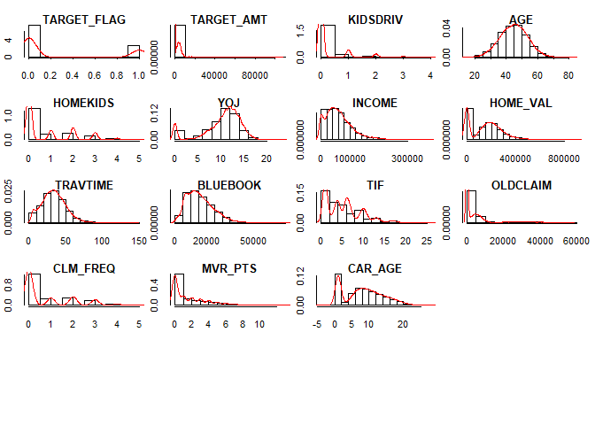

``` r
for(i in 2:(length(num_var)-1)){
  boxplot(num_var[,i]~num_var[,'TARGET_FLAG'],main = colnames(num_var)[i])
}
```

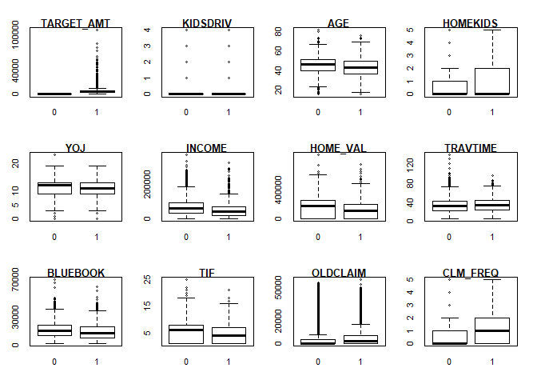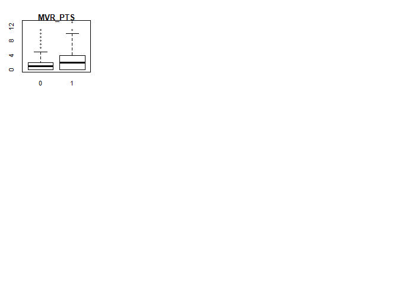

It is obcious that the variables TARGET\_FLAG, KIDSDRIV, HOMEKIDS, TIF, CLM\_FREQ and MVR\_PTS are not contunuous variables. It is better to treat them as categorical variables.

``` r
levels(as.factor(insurance_train$TARGET_FLAG))
```

    ## [1] "0" "1"

``` r
levels(as.factor(insurance_train$KIDSDRIV))
```

    ## [1] "0" "1" "2" "3" "4"

``` r
levels(as.factor(insurance_train$HOMEKIDS))
```

    ## [1] "0" "1" "2" "3" "4" "5"

``` r
levels(as.factor(insurance_train$TIF))
```

    ##  [1] "1"  "2"  "3"  "4"  "5"  "6"  "7"  "8"  "9"  "10" "11" "12" "13" "14"
    ## [15] "15" "16" "17" "18" "19" "20" "21" "22" "25"

``` r
levels(as.factor(insurance_train$CLM_FREQ))
```

    ## [1] "0" "1" "2" "3" "4" "5"

``` r
levels(as.factor(insurance_train$MVR_PTS))
```

    ##  [1] "0"  "1"  "2"  "3"  "4"  "5"  "6"  "7"  "8"  "9"  "10" "11" "13"

``` r
insurance_train$TARGET_FLAG <- as.factor(insurance_train$TARGET_FLAG)
insurance_train$KIDSDRIV <- as.factor(insurance_train$KIDSDRIV)
insurance_train$HOMEKIDS <- as.factor(insurance_train$HOMEKIDS)
insurance_train$TIF <- as.factor(insurance_train$TIF)
insurance_train$CLM_FREQ <- as.factor(insurance_train$CLM_FREQ)
insurance_train$MVR_PTS <- as.factor(insurance_train$MVR_PTS)

# the numeric variables dataframe changed
num_var <- select_if(insurance_train[-1], is.numeric)

# categorical variables dataframe changed
cat_var <- insurance_train[,-1]
cat_var <- cat_var[,-which(names(cat_var)%in% names(num_var))]
```

### Categorical independent variables:

``` r
par(mfrow=c(3,5),mar=c(8,2.0,1,3.0))
for(i in 2:length(cat_var)){
  #par(mgp=c(axis.title.position, axis.label.position, axis.line.position))
  par(las=2,mgp=c(8,1,0.5)) #mgp=c(10,1.5,1), mar=c(12,10,1,10),
  spineplot(cat_var[,i], cat_var$TARGET_FLAG, xlab=names(cat_var)[i], ylab="TARGET_FLAG")
  title(names(cat_var)[i], adj = 0.5, line = 0.3, cex.main=0.8)
  #lab<-levels(cat_var[,i])
  #rotate 45 degrees, srt=60
  #axis(1, at=length(lab), labels=FALSE)
  #text(x=lab, y=par()$usr[3]-0.1*(par()$usr[4]-par()$usr[3]),
  #labels=lab, srt=45, adj=1, xpd=TRUE)
}
```

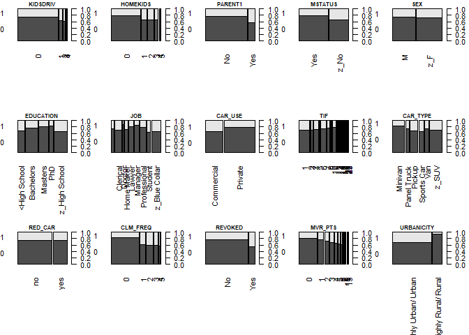

``` r
#for(i in 2:length(cat_var)){
#  par(las=2,mar=c(12,10,1,10),mgp=c(10,1.5,1))
#  cdplot(cat_var$TARGET_FLAG ~ cat_var[,i], data=cat_var ,xlab=names(cat_var)[i], ylab="TARGET_FLAG")
#}

par(mfrow=c(3,5),mar=c(5,2.0,1,3.0))
for(i in 2:length(cat_var)){
  par(las=2,mgp=c(8,1,0.5)) #mgp=c(10,1.5,1), mar=c(12,10,1,10),
  cdplot(cat_var$TARGET_FLAG ~ cat_var[,i], data=cat_var ,xlab=NULL, ylab="TARGET_FLAG")
  title(names(cat_var)[i], adj = 0.5, line = 0.3, cex.main=0.9)
}
```

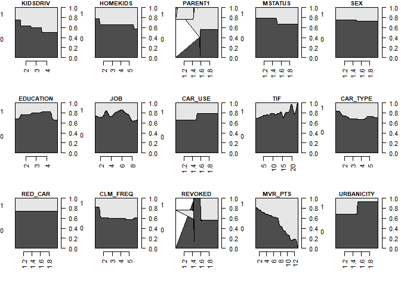

There is trends that KIDSDRIV, Marital Status(MSTATUS), Vehicle Use for commecial or private(CAR\_USE), Motor Vehicle Record Points(MVR\_PTS), URBANICITY affect the outcome of whether the car was in crash or not.

### Fill in the empty entries on JOB with a new category

There are blank entries in JOB variable. It is not know whether the job information is not collected or the policy hodler does not have a job. So the blank entries are coded as 'not known' instead of missing data.

``` r
#levels(insurance_train$JOB)

suppressMessages(suppressWarnings(library(stringr)))

#str_detect(insurance_train$JOB,"^$|^ $")
insurance_train$JOB <- as.factor(str_replace_all(insurance_train$JOB,"^$|^ $","unkown"))
levels(insurance_train$JOB)
```

    ## [1] "Clerical"      "Doctor"        "Home Maker"    "Lawyer"       
    ## [5] "Manager"       "Professional"  "Student"       "unkown"       
    ## [9] "z_Blue Collar"

### Missing velues

1.  First Check the missing data for variables:

``` r
missing_age <- 6/nrow(insurance_train)
missing_yoj <- 454/nrow(insurance_train)
missing_income <- 445/nrow(insurance_train)
missing_carage <- 464/nrow(insurance_train)
missing_homeval <- 510/nrow(insurance_train)

independent_miss <- data.frame('age'=missing_age,'yoj'=missing_yoj,'income'=missing_income,'carage'=missing_carage,'homeval'=missing_homeval)

kable(independent_miss)
```

|    age|    yoj|  income|  carage|  homeval|
|------:|------:|-------:|-------:|--------:|
|  0.001|  0.056|   0.055|   0.057|    0.062|

There are missing values in AGE(0.07%), YOJ(5.56%), INCOME(5.45%), HOME\_VAL(5.69%) and CAR\_AGE(6.25%). The percentage of missing data for each of these four viables is either less than 5% or sigltly more than 5%.

1.  Then Check the missing data for cases:

``` r
row_miss <- data.frame(apply(insurance_train, 1, function(x) sum(is.na(x))))
colnames(row_miss) <- 'NAs'
row_miss$NA_percent <- row_miss$NAs/dim(insurance_train)[2]
#kable(row_miss[-which(row_miss==0),])
#kable(row_miss[which(row_miss$NA_percent>0.05),])
table(row_miss[which(row_miss$NA_percent>0.05),])
```

    ##    NA_percent
    ## NAs 0.0769230769230769 0.115384615384615 0.153846153846154
    ##   2                139                 0                 0
    ##   3                  0                12                 0
    ##   4                  0                 0                 1

There are 139 cases miss 7.69% values, 12 cases miss 11.53% and one case misses 15.38% values. To preserve the information and meaning of the non-missing data, I will do the imputation for the missing values.

2. DATA PREPARATION
-------------------

Describe how you have transformed the data by changing the original variables or creating new variables. If you did transform the data or create new variables, discuss why you did this. Here are some possible transformations.

1.  Fix missing values (maybe with a Mean or Median value)

2.  Create flags to suggest if a variable was missing

3.  Transform data by putting it into buckets

4.  Mathematical transforms such as log or square root (or use Box-Cox)

5.  Combine variables (such as ratios or adding or multiplying) to create new variables

Before deciding how to impute the data, we will need to examine the missing data patterns. Impute Using Hmisc Package.

``` r
suppressMessages(suppressWarnings(library (rpart)))

suppressMessages(suppressWarnings(library (Hmisc)))
na.patterns <- naclus(insurance_train)

#who.na <- rpart ( is.na (YOJ) ~ TARGET_FLAG+ TARGET_AMT+KIDSDRIV+AGE+HOMEKIDS+INCOME+PARENT1+HOME_VAL+MSTATUS+SEX+EDUCATION+JOB+TRAVTIME+CAR_USE+BLUEBOOK+TIF+CAR_TYPE+RED_CAR+OLDCLAIM+CLM_FREQ+REVOKED+MVR_PTS+CAR_AGE+URBANICITY, data = insurance_train , minbucket =15)

naplot ( na.patterns , 'na per var')
```

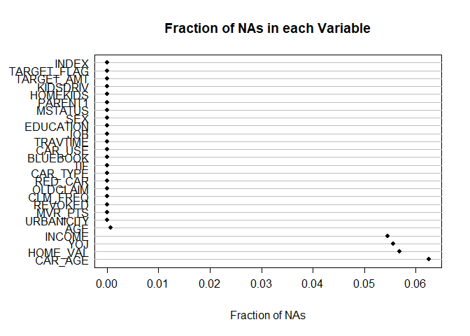

``` r
#plot ( who.na , margin = .1 ) 
#text ( who.na,use.n=TRUE, all=TRUE, cex=.7 ) #too many text

plot ( na.patterns )
```

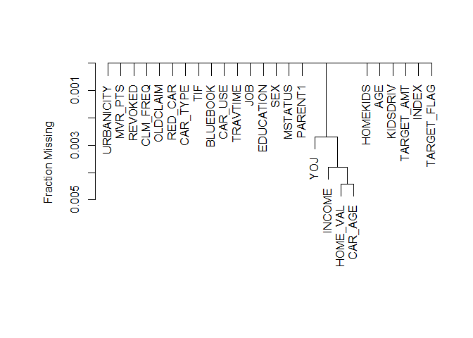

upper panel shows the fraction of observations missing on each predictor. Lower panel depicts a hierarchical cluster analysis of missingness combinations. The similarity measure shown on the Y -axis is the fraction of observations for which both variables are missing.

``` r
suppressMessages(suppressWarnings(library(MissMech)))
out <- TestMCARNormality(data = insurance_train[,c('AGE', 'YOJ', 'INCOME', 'HOME_VAL', 'CAR_AGE')])
out
```

    ## Call:
    ## TestMCARNormality(data = insurance_train[, c("AGE", "YOJ", "INCOME", 
    ##     "HOME_VAL", "CAR_AGE")])
    ## 
    ## Number of Patterns:  11 
    ## 
    ## Total number of cases used in the analysis:  8142 
    ## 
    ##  Pattern(s) used:
    ##            AGE   YOJ   INCOME   HOME_VAL   CAR_AGE   Number of cases
    ## group.1      1     1        1          1         1              6448
    ## group.2      1     1       NA          1         1               364
    ## group.3      1    NA        1          1         1               385
    ## group.4      1    NA        1         NA         1                21
    ## group.5      1     1        1         NA         1               378
    ## group.6      1     1        1          1        NA               431
    ## group.7      1     1        1         NA        NA                29
    ## group.8      1    NA       NA          1         1                22
    ## group.9      1     1       NA         NA         1                23
    ## group.10     1    NA        1          1        NA                18
    ## group.11     1     1       NA          1        NA                23
    ## 
    ## 
    ##     Test of normality and Homoscedasticity:
    ##   -------------------------------------------
    ## 
    ## Hawkins Test:
    ## 
    ##     P-value for the Hawkins test of normality and homoscedasticity:  0.000000000000000000000000000000000000000214 
    ## 
    ##     Either the test of multivariate normality or homoscedasticity (or both) is rejected.
    ##     Provided that normality can be assumed, the hypothesis of MCAR is 
    ##     rejected at 0.05 significance level. 
    ## 
    ## Non-Parametric Test:
    ## 
    ##     P-value for the non-parametric test of homoscedasticity:  0.259 
    ## 
    ##     Reject Normality at 0.05 significance level.
    ##     There is not sufficient evidence to reject MCAR at 0.05 significance level.

So the missing values has a completely radom pattern.

Multiple Imputation

The highest fraction of observations with missing values is about 6%, so use 6 imputations.

``` r
#suppressMessages(suppressWarnings(library (Hmisc)))

set.seed (1) 
(mi<-aregImpute (~ TARGET_FLAG+YOJ +TARGET_AMT+KIDSDRIV+AGE+HOMEKIDS+INCOME+PARENT1+HOME_VAL+MSTATUS+SEX+EDUCATION+JOB+TRAVTIME+CAR_USE+BLUEBOOK+TIF+CAR_TYPE+RED_CAR+OLDCLAIM+CLM_FREQ+REVOKED+MVR_PTS+CAR_AGE+URBANICITY, data = insurance_train, n.impute = 6, nk = 0, pr= FALSE,tlinear=TRUE, type="normpmm",
           pmmtype=1, match="weighted",
           fweighted=0.02,
           curtail=TRUE, boot.method='approximate bayesian', 
           burnin=5, x=FALSE))
```

    ## Warning in aregImpute(~TARGET_FLAG + YOJ + TARGET_AMT + KIDSDRIV + AGE + : KIDSDRIV has the following levels with < 5 observations: 4 
    ## Consider using the group parameter to balance bootstrap samples

    ## Warning in aregImpute(~TARGET_FLAG + YOJ + TARGET_AMT + KIDSDRIV + AGE + : TIF has the following levels with < 5 observations: 22 25 
    ## Consider using the group parameter to balance bootstrap samples

    ## Warning in aregImpute(~TARGET_FLAG + YOJ + TARGET_AMT + KIDSDRIV + AGE + : MVR_PTS has the following levels with < 5 observations: 13 
    ## Consider using the group parameter to balance bootstrap samples

    ## 
    ## Multiple Imputation using Bootstrap and PMM
    ## 
    ## aregImpute(formula = ~TARGET_FLAG + YOJ + TARGET_AMT + KIDSDRIV + 
    ##     AGE + HOMEKIDS + INCOME + PARENT1 + HOME_VAL + MSTATUS + 
    ##     SEX + EDUCATION + JOB + TRAVTIME + CAR_USE + BLUEBOOK + TIF + 
    ##     CAR_TYPE + RED_CAR + OLDCLAIM + CLM_FREQ + REVOKED + MVR_PTS + 
    ##     CAR_AGE + URBANICITY, data = insurance_train, n.impute = 6, 
    ##     nk = 0, tlinear = TRUE, type = "normpmm", pmmtype = 1, match = "weighted", 
    ##     fweighted = 0.02, curtail = TRUE, boot.method = "approximate bayesian", 
    ##     burnin = 5, x = FALSE, pr = FALSE)
    ## 
    ## n: 8161  p: 25   Imputations: 6      nk: 0 
    ## 
    ## Number of NAs:
    ## TARGET_FLAG         YOJ  TARGET_AMT    KIDSDRIV         AGE    HOMEKIDS 
    ##           0         454           0           0           6           0 
    ##      INCOME     PARENT1    HOME_VAL     MSTATUS         SEX   EDUCATION 
    ##         445           0         464           0           0           0 
    ##         JOB    TRAVTIME     CAR_USE    BLUEBOOK         TIF    CAR_TYPE 
    ##           0           0           0           0           0           0 
    ##     RED_CAR    OLDCLAIM    CLM_FREQ     REVOKED     MVR_PTS     CAR_AGE 
    ##           0           0           0           0           0         510 
    ##  URBANICITY 
    ##           0 
    ## 
    ##             type d.f.
    ## TARGET_FLAG    c    1
    ## YOJ            l    1
    ## TARGET_AMT     l    1
    ## KIDSDRIV       c    4
    ## AGE            l    1
    ## HOMEKIDS       c    5
    ## INCOME         l    1
    ## PARENT1        c    1
    ## HOME_VAL       l    1
    ## MSTATUS        c    1
    ## SEX            c    1
    ## EDUCATION      c    4
    ## JOB            c    8
    ## TRAVTIME       l    1
    ## CAR_USE        c    1
    ## BLUEBOOK       l    1
    ## TIF            c   22
    ## CAR_TYPE       c    5
    ## RED_CAR        c    1
    ## OLDCLAIM       l    1
    ## CLM_FREQ       c    5
    ## REVOKED        c    1
    ## MVR_PTS        c   12
    ## CAR_AGE        l    1
    ## URBANICITY     c    1
    ## 
    ## Transformation of Target Variables Forced to be Linear
    ## 
    ## R-squares for Predicting Non-Missing Values for Each Variable
    ## Using Last Imputations of Predictors
    ##      YOJ      AGE   INCOME HOME_VAL  CAR_AGE 
    ##    0.320    0.368    0.689    0.593    0.528

``` r
#set.seed (3) 
#(mi<-aregImpute (~ TARGET_FLAG+YOJ +TARGET_AMT+KIDSDRIV+AGE+HOMEKIDS+INCOME+PARENT1+HOME_VAL+MSTATUS+SEX+EDUCATION+JOB+TRAVTIME+CAR_USE+BLUEBOOK+TIF+CAR_TYPE+RED_CAR+OLDCLAIM+CLM_FREQ+REVOKED+MVR_PTS+CAR_AGE+URBANICITY, data = insurance_train[,-1], n.impute = 6, nk = 3, pr= FALSE,tlinear=TRUE, type="regression",           match="weighted",           fweighted=0.02))
```

Some levels of some varaibles have too less cases to do bootstrap. Collapse those levels will help to sovle this problem.

``` r
#collapse the levels less than 5 cases
collapse_train <- insurance_train

table(insurance_train$MVR_PTS)
```

    ## 
    ##    0    1    2    3    4    5    6    7    8    9   10   11   13 
    ## 3712 1157  948  758  599  399  266  167   84   45   13   11    2

``` r
#which(table(insurance_train$MVR_PTS)<5)
collapse_train$MVR_PTS <- as.numeric(as.character(collapse_train$MVR_PTS))
collapse_train$MVR_PTS[collapse_train$MVR_PTS%in% c(11,13) ] <- 11
collapse_train$MVR_PTS <- as.factor(collapse_train$MVR_PTS)

table(insurance_train$KIDSDRIV)
```

    ## 
    ##    0    1    2    3    4 
    ## 7180  636  279   62    4

``` r
#which(table(insurance_train$KIDSDRIV)<5)
collapse_train$KIDSDRIV <- as.numeric(as.character(collapse_train$KIDSDRIV))
collapse_train$KIDSDRIV[collapse_train$KIDSDRIV%in% c(3,4) ] <- 3
collapse_train$KIDSDRIV <- as.factor(collapse_train$KIDSDRIV)

table(insurance_train$TIF)
```

    ## 
    ##    1    2    3    4    5    6    7    8    9   10   11   12   13   14   15 
    ## 2533    6  424 1242   52 1341  620   60  225  780  242   45  278   78   31 
    ##   16   17   18   19   20   21   22   25 
    ##   44  104   24    8    8   11    3    2

``` r
collapse_train$TIF <- as.numeric(as.character(collapse_train$TIF))
collapse_train$TIF[collapse_train$TIF%in% c(2) ] <- 3
collapse_train$TIF[collapse_train$TIF%in% c(19,20,21,22,25) ] <- 19
collapse_train$TIF <- as.factor(collapse_train$TIF)

set.seed (4) 
(mi<-aregImpute (~ TARGET_FLAG+YOJ +TARGET_AMT+KIDSDRIV+AGE+HOMEKIDS+INCOME+PARENT1+HOME_VAL+MSTATUS+SEX+EDUCATION+JOB+TRAVTIME+CAR_USE+BLUEBOOK+TIF+CAR_TYPE+RED_CAR+OLDCLAIM+CLM_FREQ+REVOKED+MVR_PTS+CAR_AGE+URBANICITY, data = collapse_train[,-1], n.impute = 6, nk = 3, pr= FALSE,tlinear=TRUE, type="regression",
           match="weighted",boot.method='simple',
           fweighted=0.02))
```

    ## 
    ## Multiple Imputation using Bootstrap and PMM
    ## 
    ## aregImpute(formula = ~TARGET_FLAG + YOJ + TARGET_AMT + KIDSDRIV + 
    ##     AGE + HOMEKIDS + INCOME + PARENT1 + HOME_VAL + MSTATUS + 
    ##     SEX + EDUCATION + JOB + TRAVTIME + CAR_USE + BLUEBOOK + TIF + 
    ##     CAR_TYPE + RED_CAR + OLDCLAIM + CLM_FREQ + REVOKED + MVR_PTS + 
    ##     CAR_AGE + URBANICITY, data = collapse_train[, -1], n.impute = 6, 
    ##     nk = 3, tlinear = TRUE, type = "regression", match = "weighted", 
    ##     fweighted = 0.02, boot.method = "simple", pr = FALSE)
    ## 
    ## n: 8161  p: 25   Imputations: 6      nk: 3 
    ## 
    ## Number of NAs:
    ## TARGET_FLAG         YOJ  TARGET_AMT    KIDSDRIV         AGE    HOMEKIDS 
    ##           0         454           0           0           6           0 
    ##      INCOME     PARENT1    HOME_VAL     MSTATUS         SEX   EDUCATION 
    ##         445           0         464           0           0           0 
    ##         JOB    TRAVTIME     CAR_USE    BLUEBOOK         TIF    CAR_TYPE 
    ##           0           0           0           0           0           0 
    ##     RED_CAR    OLDCLAIM    CLM_FREQ     REVOKED     MVR_PTS     CAR_AGE 
    ##           0           0           0           0           0         510 
    ##  URBANICITY 
    ##           0 
    ## 
    ##             type d.f.
    ## TARGET_FLAG    c    1
    ## YOJ            s    2
    ## TARGET_AMT     s    2
    ## KIDSDRIV       c    3
    ## AGE            s    2
    ## HOMEKIDS       c    5
    ## INCOME         s    2
    ## PARENT1        c    1
    ## HOME_VAL       s    2
    ## MSTATUS        c    1
    ## SEX            c    1
    ## EDUCATION      c    4
    ## JOB            c    8
    ## TRAVTIME       s    2
    ## CAR_USE        c    1
    ## BLUEBOOK       s    2
    ## TIF            c   17
    ## CAR_TYPE       c    5
    ## RED_CAR        c    1
    ## OLDCLAIM       s    2
    ## CLM_FREQ       c    5
    ## REVOKED        c    1
    ## MVR_PTS        c   11
    ## CAR_AGE        s    1
    ## URBANICITY     c    1
    ## 
    ## Transformation of Target Variables Forced to be Linear
    ## 
    ## R-squares for Predicting Non-Missing Values for Each Variable
    ## Using Last Imputations of Predictors
    ##      YOJ      AGE   INCOME HOME_VAL  CAR_AGE 
    ##    0.349    0.404    0.792    0.621    0.544

``` r
#Ecdf (mi$imputed$AGE)
#Ecdf (insurance_train$AGE, add=TRUE , col='gray ', lwd =2, subtitles = FALSE )


#set.seed (4) 
#(mi<-aregImpute (~ TARGET_FLAG+YOJ +TARGET_AMT+KIDSDRIV+AGE+HOMEKIDS+INCOME+PARENT1+HOME_VAL+MSTATUS+SEX+EDUCATION+JOB+TRAVTIME+CAR_USE+BLUEBOOK+TIF+CAR_TYPE+RED_CAR+OLDCLAIM+CLM_FREQ+REVOKED+MVR_PTS+CAR_AGE+URBANICITY, data = collapse_train, n.impute = 6, nk = 0, pr= FALSE,tlinear=TRUE, type="pmm",pmmtype=1,match="weighted",fweighted=0.02,   curtail=TRUE, boot.method='approximate bayesian',  burnin=5, x=FALSE))

#set.seed (6) 
#(mi<-aregImpute (~ TARGET_FLAG+YOJ +TARGET_AMT+KIDSDRIV+AGE+HOMEKIDS+INCOME+PARENT1+HOME_VAL+MSTATUS+SEX+EDUCATION+JOB+TRAVTIME+CAR_USE+BLUEBOOK+TIF+CAR_TYPE+RED_CAR+OLDCLAIM+CLM_FREQ+REVOKED+MVR_PTS+CAR_AGE+URBANICITY, data = collapse_train[,-1], n.impute = 6, nk = 3, pr= FALSE,tlinear=TRUE, type="regression",           match="closest",boot.method='approximate bayesian'))
```

``` r
# print the first 10 imputed values
mi$imputed$YOJ[1:10,]
```

    ##      [,1]  [,2]  [,3]  [,4] [,5]  [,6]
    ## 5   10.93 12.83 11.62  6.45 16.8  7.07
    ## 7    7.24  7.70 11.29  8.91 11.6  9.02
    ## 8   19.04 14.13 18.93 11.81 11.1 12.75
    ## 46  13.31 14.70 20.07 12.29 19.1 12.13
    ## 54   3.93 11.45 19.38  6.60 11.2  7.46
    ## 55  14.06 17.02 12.70 10.07 13.7  4.49
    ## 71   9.81  8.31  5.71  4.56 12.7 10.16
    ## 77  15.74 12.69 17.36 11.45 15.8 10.64
    ## 83  15.76 13.69 14.09 16.73 13.9 12.00
    ## 116  9.97 11.89 15.12 11.04 11.2 12.57

Show the distribution of imputed (black) and actual YOJ (gray).

``` r
par(mfrow=c(2,3))
Ecdf (mi$imputed$YOJ)
Ecdf (insurance_train$YOJ, add=TRUE , col='gray ', lwd =2, subtitles = FALSE )

Ecdf (mi$imputed$AGE)
Ecdf (insurance_train$AGE, add=TRUE , col='gray ', lwd =2, subtitles = FALSE )

Ecdf (mi$imputed$INCOME[,1])
Ecdf (insurance_train$INCOME, add=TRUE , col='gray ', lwd =2, subtitles = FALSE )

Ecdf (mi$imputed$HOME_VAL[,1])
Ecdf (insurance_train$HOME_VAL, add=TRUE , col='gray ', lwd =2, subtitles = FALSE )

Ecdf (mi$imputed$CAR_AGE[,1])
#Ecdf (insurance_train$CAR_AGE, add=TRUE , col='gray ', lwd =2, subtitles = FALSE )
Ecdf (insurance_train$CAR_AGE, add=TRUE , col='gray ', lwd =2, subtitles = FALSE )
```

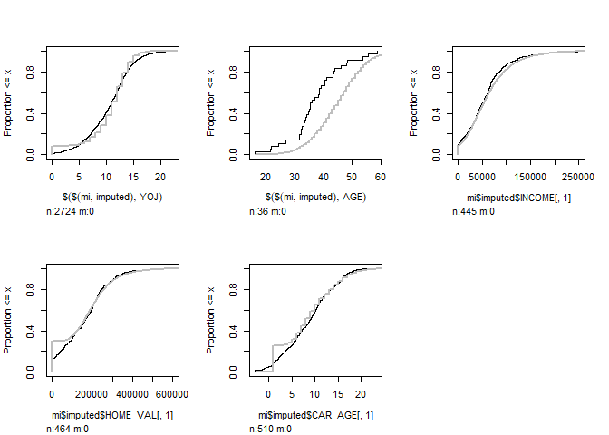

### Collinearities

First put the imputed values in the missing cells to get completed data.

``` r
fill_data <- function(impute = mi, data = collapse_train, im = 1) {
  cbind.data.frame(impute.transcan(x = impute, 
                                   imputation = im, 
                                   data = data, 
                                   list.out = TRUE, 
                                   pr = FALSE))
}

fill_data_6 <- fill_data(im = 6)#use the last imputation

# the numeric variables dataframe changed
num_var_1 <- select_if(fill_data_6, is.numeric)
```

``` r
suppressMessages(suppressWarnings(library(PerformanceAnalytics)))

chart.Correlation(num_var_1, 
                  method="spearman",
                  histogram=TRUE,
                  pch=16)
```

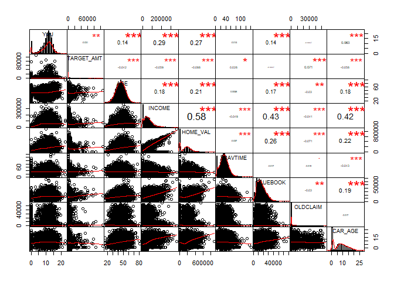

**VIF test**

``` r
# copy these files in the working directory and source the code for vif function
source(file = "HighstatLibV6.R")

corvif_noCorr <- function(dataz) {
    dataz <- as.data.frame(dataz)
    # correlation part cat('Correlations of the variables\n\n') tmp_cor <-
    # cor(dataz,use='complete.obs') print(tmp_cor)

    # vif part
    form <- formula(paste("fooy ~ ", paste(strsplit(names(dataz), " "), collapse = " + ")))
    dataz <- data.frame(fooy = 1, dataz)
    lm_mod <- lm(form, dataz)

    cat("\n\nVariance inflation factors\n\n")
    print(myvif(lm_mod))
}

thinXwithVIF = function(X, Threshold = 3) {
    VIFS = corvif(X)
    XVars = names(X)
    max(VIFS$GVIF)
    while (max(VIFS$GVIF) >= Threshold) {
        print(paste("Drop ", XVars[which.max(VIFS$GVIF)], ".", sep = ""), quote = FALSE)
        XVars = XVars[-which.max(VIFS$GVIF)]
        X = X[, -which.max(VIFS$GVIF)]
        VIFS = corvif_noCorr(X)
        print(max(VIFS$GVIF))
    }
    return(list(VIFS = VIFS, XVars = XVars, X = X))
}


Threshold <- 4
thinXwithVIF(num_var_1, Threshold)
```

    ## 
    ## 
    ## Variance inflation factors
    ## 
    ##            GVIF
    ## YOJ        1.12
    ## TARGET_AMT 1.02
    ## AGE        1.09
    ## INCOME     2.00
    ## HOME_VAL   1.57
    ## TRAVTIME   1.00
    ## BLUEBOOK   1.24
    ## OLDCLAIM   1.01
    ## CAR_AGE    1.24

    ## $VIFS
    ##            GVIF
    ## YOJ        1.12
    ## TARGET_AMT 1.02
    ## AGE        1.09
    ## INCOME     2.00
    ## HOME_VAL   1.57
    ## TRAVTIME   1.00
    ## BLUEBOOK   1.24
    ## OLDCLAIM   1.01
    ## CAR_AGE    1.24
    ## 
    ## $XVars
    ## [1] "YOJ"        "TARGET_AMT" "AGE"        "INCOME"     "HOME_VAL"  
    ## [6] "TRAVTIME"   "BLUEBOOK"   "OLDCLAIM"   "CAR_AGE"   
    ## 
    ## $X
    ##         YOJ TARGET_AMT  AGE INCOME HOME_VAL TRAVTIME BLUEBOOK OLDCLAIM
    ## 1    11.000        0.0 60.0  67349        0       14    14230     4461
    ## 2    11.000        0.0 43.0  91449   257252       22    14940        0
    ## 3    10.000        0.0 35.0  16039   124191        5     4010    38690
    ## 4    14.000        0.0 51.0  64182   306251       32    15440        0
    ## 5     7.075        0.0 50.0 114986   243925       36    18000    19217
    ## 6    12.000     2946.0 34.0 125301        0       46    17430        0
    ## 7     9.023        0.0 54.0  18755   198414       33     8780        0
    ## 8    12.750     4021.0 37.0 107961   333680       44    16970     2374
    ## 9    10.000     2501.0 34.0  62978        0       34    11200        0
    ## 10    7.000        0.0 50.0 106952        0       48    18510        0
    ## 11   14.000     6077.0 53.0  77100        0       15    18300        0
    ## 12    5.000        0.0 43.0  52642   209970       36    22420        0
    ## 13   11.000        0.0 55.0  59162   180232       25    17600     5028
    ## 14   11.000     1267.0 53.0 130795        0       64    28340        0
    ## 15    0.000     2920.2 45.0      0   106859       48     6000        0
    ## 16   12.000        0.0 39.0  51884   180951       43    10590        0
    ## 17   11.000        0.0 42.0  59945   192207       42    14190        0
    ## 18   13.000        0.0 34.0  34019    91875       27     8300        0
    ## 19   12.000        0.0 31.0  18903    93797       48    17330        0
    ## 20   13.000     6857.0 28.0  44077   170598       29     8710     8935
    ## 21   13.000     3627.0 43.0  37214   222245       52    26560        0
    ## 22   14.000        0.0 48.0  96274   282904       36    11130     8250
    ## 23   11.000        0.0 47.0  46281        0       29    19700        0
    ## 24    0.000        0.0 44.0      0    82344        8     5900     3338
    ## 25   13.000        0.0 33.0  79606   225962       27    16830        0
    ## 26    9.000     4486.0 32.0  31275   118160       26    10030        0
    ## 27   17.000        0.0 44.0  45488   219378       16    22090        0
    ## 28    8.000        0.0 35.0  72193        0       26    12220        0
    ## 29    0.000        0.0 40.0      0    98777       15    14130    38127
    ## 30    5.000        0.0 49.0  49244   163444       30    15880        0
    ## 31    8.000        0.0 52.0  51278   230340       37     1500        0
    ## 32    7.000        0.0 41.0  92842   286113       12    25810     1431
    ## 33   10.000        0.0 39.0  35081   202839       38    16640        0
    ## 34    0.000        0.0 56.0      0    63827       65    13220        0
    ## 35   12.000        0.0 49.0 115044   311980       18    17900        0
    ## 36   11.000        0.0 38.0  37754   138823       47    12080        0
    ## 37   17.000        0.0 43.0 145353   418785       38    29450        0
    ## 38   15.000        0.0 63.0 121398   343410       10    16270        0
    ## 39    0.000        0.0 52.0      0    87925       48     9280        0
    ## 40    7.000        0.0 35.0  14508        0       22     6450        0
    ## 41   13.000        0.0 43.0  75338   270555       40    23080        0
    ## 42   10.000        0.0 41.0  32774        0       44    20120        0
    ## 43   11.000        0.0 40.0  57474   186418        5    29270        0
    ## 44   12.000        0.0 31.0  26520   154493       62     4600        0
    ## 45    8.000        0.0 47.0  18444        0       35    19450     2981
    ## 46   12.131        0.0 53.0 107259   343700       36    29230        0
    ## 47    7.000        0.0 39.0  34046   183383       33     4040        0
    ## 48   14.000        0.0 33.0  32364   152894       40    12270        0
    ## 49    5.000        0.0 59.0 106775   219508       10    31930        0
    ## 50   11.000     6100.0 40.0  16989        0       20    12230    26104
    ## 51   15.000     8840.7 44.0  16352   134164       37    10520     7838
    ## 52   16.000        0.0 56.0  44760   164852       30    21770        0
    ## 53   14.000     2117.0 45.0  63952   196368       50    32340    27877
    ## 54    7.456        0.0 48.0  87272   252896       14    28560     1554
    ## 55    4.491     3532.0 44.0  24060        0       24    14220        0
    ## 56   12.000      866.0 33.0  20822    76022       46     6880     7896
    ## 57   14.000        0.0 32.0  54968   146784       20    10040        0
    ## 58    8.000     7786.0 34.0  14194    87034       13     2920    24767
    ## 59   12.000        0.0 38.0   2149    72889       35    22690        0
    ## 60   11.000     4148.0 43.0 137103        0       29    19510     8890
    ## 61    9.000        0.0 49.0 117694        0       31    33710    34351
    ## 62   10.000        0.0 46.0  79538        0       13    14050        0
    ## 63   11.000        0.0 45.0 185836   509115       28    10250     4307
    ## 64   14.000        0.0 46.0 172488   397661       22    33320        0
    ## 65   11.000        0.0 45.0  61931   213530       30    10910    25106
    ## 66    9.000        0.0 63.0  74426        0       11    27600        0
    ## 67    9.000        0.0 44.0  74722   231034        9    23640        0
    ## 68   11.000     2371.0 45.0 102393        0       25     1500        0
    ## 69    0.000        0.0 48.0      0    98920       50     8660     8363
    ## 70   12.000     4804.0 37.0  44541   205211       43     5200     2718
    ## 71   10.156        0.0 35.0  29371        0       49     4860        0
    ## 72   12.000     1354.0 48.0  31773   165090       14     9640     1212
    ## 73    0.000        0.0 49.0      0   159389       42     6400     9115
    ## 74   15.000        0.0 44.0 139330   316900       35    22050        0
    ## 75   13.000        0.0 50.0 163296   447616       42    22830        0
    ## 76   10.000        0.0 30.0  17455   140978       50    12380        0
    ## 77   10.636        0.0 54.0  71007   240833       61    14000        0
    ## 78    6.000     2425.0 53.0  38036   153381       32    13140        0
    ## 79   13.000        0.0 53.0  41199   150933       21    15360        0
    ## 80   10.000        0.0 29.0  38042   202967       15    15160        0
    ## 81   11.000        0.0 58.0  91223        0       23    10620        0
    ## 82    7.000        0.0 55.0  45787   173196        5    19380        0
    ## 83   12.001        0.0 55.0  84964   227091       21     5760      969
    ## 84    8.000        0.0 56.0  38240   190675       28    16220        0
    ## 85   11.000        0.0 34.0  51565        0       36    18110      759
    ## 86    0.000     5711.0 34.0      0    66358       25    11740     1800
    ## 87   11.000        0.0 36.0 105384   267509       24    13800    31695
    ## 88   10.000    13105.3 41.0  66265   159276       59    12230        0
    ## 89    7.000     4061.0 46.0  72669     6296       17    23350     4678
    ## 90    9.000        0.0 42.0  76226   217920       18    23390        0
    ## 91   16.000        0.0 38.0   7528   113809       26     8080        0
    ## 92    0.000     7838.0 33.0      0        0       14    15090     1631
    ## 93    0.000     3660.0 37.0  18608    73890       48    12850        0
    ## 94    9.000        0.0 42.0  32797   160661       63    21690        0
    ## 95   11.000     5125.0 47.0  44705   217885       50    12840     1533
    ## 96    9.000        0.0 52.0  68992   216986       36    15120        0
    ## 97   11.000        0.0 43.0 132561   314433        8    30150    12294
    ## 98   17.000        0.0 66.0  96830   325826       23    11180        0
    ## 99    7.000     2143.0 52.0  64014   244863       33     7900     8882
    ## 100   7.000        0.0 38.0  13292        0       40     7050        0
    ## 101  14.000        0.0 47.0  95749   276241       48    21320        0
    ## 102  12.000        0.0 37.0 123520   383731       14    17550        0
    ## 103  13.000        0.0 47.0  45257   160051       33    29210        0
    ## 104  17.000        0.0 61.0  41857   169015       35    20870        0
    ## 105   8.000     2114.0 41.0 126468        0       34    32690        0
    ## 106   9.000        0.0 40.0  75516   247673       53    13050        0
    ## 107  16.000        0.0 52.0  76954   249290       44    19540        0
    ## 108   8.000        0.0 58.0 150352   421665       21    24240        0
    ## 109  12.000     8671.0 38.0  37580   173495       36     5260      867
    ## 110  15.000     6287.0 41.0  23344   147172       10     7930        0
    ## 111  16.000        0.0 37.0  43290   158771       29    23640        0
    ## 112  10.000        0.0 48.0  48737   220264       24    11220        0
    ## 113  12.000        0.0 47.0  64259   202031       26    25100     9526
    ## 114   6.000        0.0 41.0  12541        0        5     7500        0
    ## 115  12.000        0.0 47.0 104271   265153       40    36120        0
    ## 116  12.572        0.0 44.0  67278   220556       49    20210        0
    ## 117  10.000        0.0 46.0 104990   306540       40    16080        0
    ## 118   6.000        0.0 49.0  89948        0       37    18160        0
    ## 119  12.000        0.0 33.0 111427   321483       35    28180        0
    ## 120  11.000     1807.0 43.0  76159        0       52    19750        0
    ## 121   6.000        0.0 62.0 107734        0       54    18470        0
    ## 122   0.000    10593.9 42.0      0        0       47     5700        0
    ## 123  12.000        0.0 36.0  25282        0       38    11160        0
    ## 124  11.000        0.0 47.0  18549   116136       24    12800        0
    ## 125  14.000        0.0 50.0  37489   147191       11    17300        0
    ## 126   9.000        0.0 51.0  50166   187297       32    11620    50701
    ## 127   8.000        0.0 46.0  73872   245878       43    20240        0
    ## 128  14.000        0.0 50.0  73343   254600       60    20010     4179
    ## 129  15.000     6158.0 43.0  49849        0       35    13130     3622
    ## 130  16.000     4887.0 39.0  12054        0       28    15760     1738
    ## 131  14.000        0.0 43.0  48184   209188       50    14530     6891
    ## 132  18.000     5147.0 60.0  78936   235670       40    20350        0
    ## 133   0.000        0.0 55.0      0        0       33     7000        0
    ## 134  10.000        0.0 40.0  78914   229055       36     5500     6803
    ## 135   6.000        0.0 39.0  77125   210840       49     9570        0
    ## 136  14.000        0.0 38.0  25835   109685       29     8490        0
    ## 137  12.000        0.0 42.0  47660   180206       31    11940      974
    ## 138  10.000        0.0 42.0 123143   306368       16    24930        0
    ## 139   8.000        0.0 49.0  22059   123924       24    21990        0
    ## 140  12.000        0.0 36.0  50750        0       26    10170     5877
    ## 141  10.000        0.0 34.0  23571        0       35    12180        0
    ## 142   0.000        0.0 49.0      0    79913       29    18110        0
    ## 143  12.000        0.0 52.0  35631   155972       39     6040        0
    ## 144  11.000        0.0 50.0 129234        0       37    21200        0
    ## 145  12.000        0.0 53.0  39202        0       16    11650     6175
    ## 146  14.000        0.0 55.0  55409   162237       45    27890        0
    ## 147  15.000        0.0 40.0  48067   186025       21    18120        0
    ## 148  12.000        0.0 45.0  64867   210631       21    12490        0
    ## 149  23.000        0.0 80.0  97716   389344       14    15920        0
    ## 150  10.000        0.0 48.0  39613   159534       48     8460     7437
    ## 151  11.000        0.0 37.0  12880   108683       69    14130        0
    ## 152  11.000        0.0 40.0  49780        0       52    10500        0
    ## 153  11.000        0.0 45.0  60845        0       31    24260        0
    ## 154  12.000     6087.0 42.0 136344        0       45    13160        0
    ## 155   7.000        0.0 36.0  70313   211506       55    14960     7650
    ## 156  15.000        0.0 45.0  23773        0        9    34510        0
    ## 157  11.000        0.0 52.0 115713   327167       28    21660        0
    ## 158   8.000        0.0 41.0  55364        0       17    31390        0
    ## 159  14.000        0.0 36.0  27693   130324       37    11300    19385
    ## 160   0.000        0.0 56.0      0   103058       29    27890    25147
    ## 161   0.000        0.0 53.0      0        0       34     1500     1175
    ## 162  12.000     3894.0 39.0  32936   169721       12     1500        0
    ## 163  11.000        0.0 38.0  33151   184852       31    11530        0
    ## 164   0.000     2659.0 45.0      0        0       36    16510    17445
    ## 165  14.000        0.0 46.0  24575   176282       73     8560        0
    ## 166  16.000        0.0 43.0  32546   200891       49     5800        0
    ## 167   0.000        0.0 54.0      0        0       21    18820     5537
    ## 168  16.000        0.0 55.0 163158   431809       44    23320        0
    ## 169  10.000        0.0 61.0  58212   226638       37    13420     3573
    ## 170  15.000     6693.0 53.0  84345   264549       36     9930        0
    ## 171  12.000        0.0 52.0  24590   166773       59    10350     1507
    ## 172  15.000        0.0 54.0 107808   278940       45    27020     1780
    ## 173  15.000        0.0 51.0  76443   257889        7    25450     5958
    ## 174  12.000        0.0 39.0  59685   197089       42     7470        0
    ## 175  12.000        0.0 38.0  90647   251629       38    13740     8450
    ## 176  10.000     4380.0 42.0  43174   208811       48    10020        0
    ## 177  14.000     1826.0 31.0  30653        0       41    12930    35666
    ## 178   0.000        0.0 41.0      0    54130       18    32090        0
    ## 179   0.000     6716.0 36.0   9659        0       54     1500        0
    ## 180  13.000        0.0 49.0  59148   162428       18    12310     8948
    ## 181  10.000        0.0 47.0  81899   232928       25    14390        0
    ## 182  12.266        0.0 45.0   1158        0       10     6120        0
    ## 183  15.000        0.0 53.0 114088   306745       25    22920        0
    ## 184  13.000        0.0 51.0  80621   256152       27    25700        0
    ## 185  12.000        0.0 51.0  94328   327651       44     6900        0
    ## 186  11.000    53571.2 36.0  49703   253132       37    42550    35879
    ## 187  12.000        0.0 43.0  89585   179229       55     8160     6836
    ## 188  11.000        0.0 43.0  49921   209570       32    13160     8569
    ## 189  13.000     4257.0 53.0  25289   108139       31    13850        0
    ## 190   7.000        0.0 40.0  95405        0       34    24220        0
    ## 191  14.000     4277.0 31.0  26112   117229       58    14030        0
    ## 192  12.000    19597.1 58.0 131560   248193       40    14870        0
    ## 193  14.000        0.0 50.0  90566   295771       40    23260        0
    ## 194  12.000        0.0 45.0  62447   203472       39    12240        0
    ## 195   5.000        0.0 46.0 108701   337340       39    12070        0
    ## 196  12.000        0.0 47.0  94774   254197       43    21070     3460
    ## 197  16.000        0.0 43.0  72357   288115       40    23190        0
    ## 198  11.000        0.0 48.0 140112   336063       47    28380        0
    ## 199  11.000        0.0 39.0  19016   173712       22    10950        0
    ## 200   0.000        0.0 49.0      0        0       55    19810        0
    ## 201   9.330        0.0 45.0  19909   130331       14     7990        0
    ## 202   9.233        0.0 36.0   4885    99107       35     7080     5486
    ## 203  12.000     2738.0 59.0 119382        0       26    24130        0
    ## 204  13.000        0.0 60.0  89511   224350        5    11380     4470
    ## 205  15.000        0.0 49.0 107375   332673       12    19840        0
    ## 206  13.000        0.0 45.0  36947   165094       32     6200        0
    ## 207  13.000        0.0 34.0  27581        0       38    12250        0
    ## 208  14.000     1146.0 57.0   8212        0        5     7200        0
    ## 209  11.000        0.0 33.0  86187   241285       81    13420        0
    ## 210  12.000        0.0 52.0  42255        0       61    22280        0
    ## 211  13.000        0.0 53.0  37646   257569       19    16020     7462
    ## 212   8.000        0.0 57.0   4107   261901       41    32530        0
    ## 213  11.000        0.0 37.0 116043        0       40    16800        0
    ## 214   8.827        0.0 45.0  89479   239934       30    14950        0
    ## 215   8.000        0.0 38.0  92917        0       57    15120      722
    ## 216   7.000        0.0 36.0  29741        0       32     8070     2797
    ## 217  12.000        0.0 51.0   3673   120377        5    11180        0
    ## 218  15.000     4658.0 39.0  61370        0        6    21770    35577
    ## 219  13.000        0.0 51.0  32159   195096       46     2600        0
    ## 220  14.000        0.0 40.0  20126   138444        5     8260        0
    ## 221  11.000     5259.0 54.0  44782   148676       83    30260        0
    ## 222  14.000        0.0 34.0  59828        0       56    10880        0
    ## 223  14.000        0.0 41.0  74022   247884       51    13000     4418
    ## 224  11.000        0.0 36.0  80256   235169        9    14860     2592
    ## 225  14.000        0.0 55.0   6094        0       28    22770     2631
    ## 226   0.000        0.0 45.0      0    69743       27    14300     9062
    ## 227  12.000     3769.0 45.0  30085   128194       44     7200        0
    ## 228  11.000        0.0 50.0  80241        0       17    14520     7628
    ## 229  12.000        0.0 55.0  55673   245678       43    27400        0
    ## 230   8.000     4363.2 44.0  32317        0       68    22450     3738
    ## 231   9.000        0.0 50.0  58762        0       13    13320     5253
    ## 232  15.000        0.0 60.0  76899   270631       34     7900    45574
    ## 233  12.000        0.0 40.0  48640        0       19    10360        0
    ## 234   6.000        0.0 57.0  78592   248326       42    15760     9462
    ## 235  11.947     5523.0 47.0  21282        0       40    18150     6544
    ## 236  13.000     7390.4 64.0  61521   248878       41     7650        0
    ## 237   9.000     1165.0 34.0 105554   229868       75     5300     7504
    ## 238   6.000        0.0 52.0 147666   405910       43     6700        0
    ## 239   3.000     2362.0 42.0  69290        0       30    23900     1052
    ## 240   8.000     6142.0 31.5   2954        0       21     3100    10099
    ## 241  11.000        0.0 54.0 105762        0        5    17480        0
    ## 242  11.000        0.0 42.0  79185   243880       28    13020     6689
    ## 243  13.000        0.0 56.0 111702   165857       18    18270        0
    ## 244  12.000        0.0 59.0   5005   158960       30     7500        0
    ## 245  11.000        0.0 35.0  13760        0       27     7700    10177
    ## 246  13.000     1065.0 54.0  88668   316419       63    20090    10520
    ## 247  13.000     5075.0 50.0   2657   109134       63    10480    20452
    ## 248  11.000        0.0 29.0  51122   201650       40    10470    19030
    ## 249  12.000      680.0 57.0  22008        0       19    11650    10231
    ## 250  10.000        0.0 43.0  97953        0       43    27180     4784
    ## 251   0.000        0.0 44.0      0   104490       28    14190    35430
    ## 252  14.000        0.0 38.0  83937   234151       28    13800    10851
    ## 253  14.000        0.0 37.0  96188        0       49    13340        0
    ## 254  14.000        0.0 55.0  17820   115540       32    13340     6913
    ## 255  14.000        0.0 51.0  62894   228994       84     5990        0
    ## 256  12.000     2287.0 42.0  68090   169854       45    11750     9261
    ## 257   4.000     6195.0 45.0  25032        0       34     6100     5771
    ## 258  12.000     4862.0 54.0  52078   194227       51    23250     5039
    ## 259  12.000        0.0 48.0  22633   135679       30    16730        0
    ## 260   0.000        0.0 50.0      0   109511       32     4980        0
    ## 261   9.000     9775.6 25.0  51544    17735       44    20630     7767
    ## 262   9.000        0.0 35.0  72389   213173       45    13440     8185
    ## 263   8.000     3418.0 29.0  73842        0       25    22340     4769
    ## 264   0.000     4423.0 45.0      0        0       33     6000    41818
    ## 265  14.000        0.0 37.0  57285   141069       34    10370      663
    ## 266  16.000        0.0 56.0 109521   321674       30     7100        0
    ## 267  17.000        0.0 45.0  71969   212081       44    13060        0
    ## 268  10.000        0.0 48.0  86547        0       43    24150        0
    ## 269  13.000        0.0 52.0  37295   163285       28     6700        0
    ## 270   7.000        0.0 40.0  50224        0       16    13780     1937
    ## 271  13.000     2328.0 41.0 109957   260749       50    29470        0
    ## 272  14.000        0.0 44.0  44141   141312       11     5900     7401
    ## 273   5.009        0.0 54.0  30388        0       24    16580    27130
    ## 274  12.000        0.0 42.0  85752   285727       36     5700        0
    ## 275  11.000        0.0 50.0   8345        0       39    15330        0
    ## 276  14.000     4700.0 38.0  10486    66515       33     6350     5702
    ## 277  12.000        0.0 36.0  33284   141018       68    14640        0
    ## 278  12.000     6880.0 62.0  33713   171810       26    23470    41913
    ## 279   7.000        0.0 47.0 144957   420966       22    24120        0
    ## 280   8.000        0.0 46.0  79317   241733        5     6100     4263
    ## 281   9.000        0.0 42.0  64705        0       46    22560    10375
    ## 282   0.000        0.0 33.0      0        0       27    10160     8118
    ## 283  11.000        0.0 43.0 142297        0        6    24360        0
    ## 284  14.000     4875.0 45.0  94325   301739       55     6960        0
    ## 285  14.000        0.0 55.0  72337   210378       28    22980        0
    ## 286  14.000        0.0 27.0   1212        0       30     4200        0
    ## 287  13.000        0.0 41.0 157237        0       45    17410        0
    ## 288  13.000        0.0 40.0   5322    57657       32     9960     5489
    ## 289  15.000        0.0 57.0  51737   167419       56    17440        0
    ## 290   9.000    17290.3 64.0  38020   297089       11    28710        0
    ## 291   9.000     5395.0 32.0  60050   212562       31    11480    17493
    ## 292  11.000     5021.0 39.0 136692        0       16    22920        0
    ## 293   7.000        0.0 37.0  97266   252596       21    14930     4048
    ## 294  14.000        0.0 45.0  19793   132884        5     7980        0
    ## 295  14.000        0.0 39.0  50875   131770       23    14100        0
    ## 296  10.000        0.0 41.0  32057   166326       20     9800        0
    ## 297   7.000     3149.0 35.0  62036   154297        5    16370     3913
    ## 298  15.000     3602.0 64.0  40528   208306       54    11950     5137
    ## 299  13.000        0.0 46.0 266027        0       52    34020     1332
    ## 300  15.000        0.0 59.0 158703        0       32    20540        0
    ## 301  13.000     2516.0 39.0  52950   187514        6    10210        0
    ## 302  12.000     3259.0 40.0  39600   193495       37     5460     4188
    ## 303   8.000        0.0 43.0  67109   219801       38     8530        0
    ## 304  13.000        0.0 48.0  75723   257475       37     7210        0
    ## 305   0.000        0.0 48.0      0    49456       47     6520        0
    ## 306  15.000        0.0 60.0  97726   330229       39    16780     4500
    ## 307  11.000        0.0 59.0 186632   483645       35    21730        0
    ## 308   8.000        0.0 43.0  97103   278248       17    17960     3575
    ## 309   0.000     3085.0 43.0      0    86118       41    14240        0
    ## 310   7.000        0.0 64.0  75166   248599       31     5010     4750
    ## 311   0.000     3593.0 55.0      0    68500       11     8560     3769
    ## 312  12.000      457.6 54.0  10617        0       14     7960     1079
    ## 313   8.000        0.0 35.0  33799   148536       48    13420     8174
    ## 314   8.000     6143.0 46.0 140766   375813       41    29220        0
    ## 315   0.000     4524.0 26.0      0        0       10     4100    11279
    ## 316  11.000     4480.0 43.0  46224   173103       45    11510        0
    ## 317   8.000        0.0 43.0  91877   298385        5    26290        0
    ## 318  13.000        0.0 54.0 193895   445020       51     9060     3400
    ## 319   0.000        0.0 45.0      0        0       36    26500        0
    ## 320   1.106     1766.0 46.0  31177   150102       41    25420        0
    ## 321   7.000        0.0 47.0  28654   144131       22     9070        0
    ## 322  12.000        0.0 45.0 107327   316035       38    18540        0
    ## 323   8.000        0.0 55.0  45918   226111       52    11590     3614
    ## 324  12.000        0.0 53.0 106830        0       28    17480        0
    ## 325  13.000        0.0 49.0  33322   154892       45    21320    36556
    ## 326   0.000        0.0 30.0  19786    79192       22     4500        0
    ## 327  10.000        0.0 47.0  15249   145735       62     8400        0
    ## 328  16.000        0.0 41.0  38034   190148       30    11300     5299
    ## 329  14.000        0.0 49.0  95156   278953       70     9720     5645
    ## 330  11.000        0.0 31.0 110404   278647        5    13710        0
    ## 331  15.000        0.0 50.0  36504   137025       30    14210        0
    ## 332  11.000    40151.7 58.0  51870        0       36    24520        0
    ## 333  13.000        0.0 56.0 125795        0       52     7100        0
    ## 334  14.000     1237.0 41.0  99959   268154       13    18850        0
    ## 335   7.000     2876.0 37.0  61790        0       32    15150        0
    ## 336  10.000        0.0 57.0  33707        0       40    27520        0
    ## 337   0.000     1650.0 37.0      0        0       18     1500        0
    ## 338  13.000    14833.6 49.0  28592   183206       31     9260    39892
    ## 339  13.000     1796.0 42.0  64766   263986       20    11840    44414
    ## 340   8.000        0.0 38.0  81447   275745       36    15820        0
    ## 341  14.000        0.0 55.0  81188   296244       45    39190        0
    ## 342  11.000     4057.0 37.0  62426   209548       20    11440      981
    ## 343  12.000     5177.0 25.0  40095        0       38    22720     1992
    ## 344   5.000        0.0 44.0  87072   234367       21    14820        0
    ## 345   7.000        0.0 20.0  19933   105715       19    15400     4148
    ## 346   7.000     5287.0 40.0  52423   150723       30     7420        0
    ## 347  12.000     1444.0 32.0  76985        0       37    19500     6762
    ## 348   0.000        0.0 35.0      0        0       17     5000        0
    ## 349  11.000        0.0 37.0  80997        0       47    16290        0
    ## 350  11.665        0.0 58.0  37528   185996       26    11050    41833
    ## 351  10.320     3008.0 54.0  62215   244460       30    21840     6600
    ## 352  12.000        0.0 39.0  54714   152044       42     5400        0
    ## 353   8.000     3943.0 49.0  37356   133175       63     6400     7993
    ## 354  13.895        0.0 48.0      0        0       25     6300        0
    ## 355  13.000     2316.0 42.0  28341   124838       45     8530     3710
    ## 356  13.000        0.0 56.0  27968   156795       20     8260        0
    ## 357   6.000     5051.0 48.0  52275   169104       57    14060     3868
    ## 358   5.000     6245.0 21.0  40022        0       67     9360        0
    ## 359  12.000        0.0 33.0  46453   166667       47     6150        0
    ## 360  10.459        0.0 38.0 122492   168671       22    33250        0
    ## 361   7.000        0.0 33.0  22899   126382       19     7090        0
    ## 362  11.000        0.0 51.0 124550   330451       37    38290        0
    ## 363  12.000        0.0 45.0 100822   290668        5     8310        0
    ## 364   5.000     2872.0 40.0  57063        0       46    16250        0
    ## 365   7.000        0.0 50.0 116403        0       21    26520     2659
    ## 366  12.000        0.0 39.0  87562        0       26    10260        0
    ## 367   0.000        0.0 39.0      0        0       46     5400     5338
    ## 368   0.000        0.0 19.0      0   106041       25     9100     5289
    ## 369   7.000        0.0 49.0  40452   184692       25    21600        0
    ## 370  12.000        0.0 33.0  14369   142305       37     6240        0
    ## 371  11.000        0.0 43.0 176021   446011       35    29330        0
    ## 372   9.000        0.0 48.0  43095   332770       39    10850     7219
    ## 373  15.000        0.0 45.0  70982   220008        5    13660        0
    ## 374  10.000        0.0 39.0  76150   219917       39    14010        0
    ## 375  12.000     1347.0 32.0  52469        0       21     4700        0
    ## 376  13.000        0.0 45.0 103087   237957       28    18230        0
    ## 377   0.000        0.0 51.0      0        0       10    16180        0
    ## 378  11.000        0.0 36.0  48710        0       59     9970    18331
    ## 379  18.000     4997.0 72.0  27625   162415       32    18960     8571
    ## 380  12.000        0.0 51.0  27940        0       20    21010     4652
    ## 381  13.000        0.0 39.0  54298   217992       21    14480        0
    ## 382  12.788        0.0 34.0  88760        0       56    20460        0
    ## 383   8.000        0.0 45.0  45105   181896       37    17540    36562
    ## 384  13.000     8662.0 36.0  28326   145411       37    26280    39535
    ## 385  13.000        0.0 32.0  17545        0       46     8240        0
    ## 386  13.869        0.0 57.0 159517   456583       43    23150        0
    ## 387   8.000        0.0 47.0  28172   175173       27    13970        0
    ## 388  13.000        0.0 36.0  60097   173562       40    28040        0
    ## 389  11.000        0.0 43.0  19219        0       53    10470        0
    ## 390  11.000        0.0 46.0 107677   225448       42    17820        0
    ## 391   6.000        0.0 41.0  43889        0       29    18010        0
    ## 392  18.000        0.0 55.0  49627   255967       49    11550        0
    ## 393  15.000     5952.0 63.0  26921   140455       19    14360    30288
    ## 394  12.000     5252.0 45.0  13891    64530       47     7390     1546
    ## 395  13.000     5440.0 35.0  64488   116402       37    21820     1144
    ## 396  15.000        0.0 60.0 163014   421250       35    23800        0
    ## 397  10.000        0.0 51.0  72900        0       39     6600        0
    ## 398   0.000        0.0 43.0      0        0       30    19790     8251
    ## 399   9.000     7719.0 33.0  31675   159621       25     9130    32882
    ## 400   9.000        0.0 37.0   6857    86075       35    12540     3452
    ## 401   7.000     8289.0 39.0  66367   167036       35     5560     2949
    ## 402  12.000        0.0 48.0  93658   274828       33    18050        0
    ## 403   0.000        0.0 45.0      0    99798       24    14750        0
    ## 404  17.000     2353.0 56.0  29524   198107       52    14250        0
    ## 405   6.000        0.0 37.0  70495        0       17    22790    39614
    ## 406  11.000        0.0 40.0 180525   473389       34    11490        0
    ## 407  13.000        0.0 46.0  27669   163356       45     8870        0
    ## 408  10.000        0.0 43.0  68350   204797       36    22570        0
    ## 409  11.000        0.0 64.0  76552   229237       26     7900        0
    ## 410  11.000        0.0 46.0  57456   207400       32    12520        0
    ## 411  17.000        0.0 39.0 173533   445428       36    25210        0
    ## 412  14.000        0.0 69.0  69098   249026       57    15310        0
    ## 413   9.000        0.0 44.0  65134   241443       15    12410        0
    ## 414   7.000        0.0 44.0  93041   278760       23    15200    16255
    ## 415   9.000        0.0 39.0  69516   208435       37    11470     1392
    ## 416  15.000        0.0 56.0 126700   316939       36    23980        0
    ## 417  14.000        0.0 59.0  89197   268617       35    16400        0
    ## 418  15.000     5457.0 57.0  34116        0       25    10610    34041
    ## 419  13.000        0.0 52.0  65465   210434       42    18760     5372
    ## 420  14.000        0.0 46.0  56849        0       53     6270     6418
    ## 421   9.000        0.0 51.0  46201   193649       33    11220        0
    ## 422   0.000        0.0 43.0      0        0       32    13160    10412
    ## 423  14.000        0.0 52.0 125662   344191       21    22880        0
    ## 424  15.000        0.0 43.0 102262   266234       47    15490        0
    ## 425  11.000        0.0 47.0  18535   136413       47    11750        0
    ## 426  15.000        0.0 44.0  29502   141516       30    28750    37130
    ## 427  10.000        0.0 48.0  93303   295050       30    15630     6031
    ## 428  11.000     4898.0 33.0    249        0       30    10590        0
    ## 429  10.000     4046.0 41.0  24862        0       26     7790     1055
    ## 430  14.000        0.0 49.0 108748   322394       32    21520        0
    ## 431   0.000     2812.0 50.0      0   113870       12     6500        0
    ## 432  10.000        0.0 42.0  86596   251362       32    15280        0
    ## 433  12.000        0.0 33.0  92904   264763       30    14060        0
    ## 434  12.000        0.0 42.0  82281        0       36    18530    14552
    ## 435  11.000     5050.0 41.0  54774   159061       35     9170        0
    ## 436  15.365        0.0 40.0  63400   242530       58    27080        0
    ## 437  13.000        0.0 51.0  62463   269190       37    19370     1107
    ## 438  15.000     3782.0 57.0  25761   149672       57    11940     4792
    ## 439  11.000     3443.0 42.0  49224   155963       29    27460     4546
    ## 440  10.000        0.0 46.0  41083   177527       21    12810     2520
    ## 441  12.000        0.0 52.0  70293   271091       34    33440        0
    ## 442   9.000        0.0 38.0  34319   202323       48    13460        0
    ## 443  13.000    46858.3 43.0  22623   184773       15     8060        0
    ## 444  16.000        0.0 54.0  19961    69660       36     3500        0
    ## 445  11.000     1958.0 27.0  68493   217494       22    20180        0
    ## 446  12.000        0.0 56.0    278    91930       58    26150    49641
    ## 447   8.000        0.0 48.0 137411   391680       22    11940        0
    ## 448  11.637        0.0 47.0  44963   160317       33    11610        0
    ## 449  11.000     1736.0 33.0  25544        0       29     4050     3971
    ## 450  13.000     1412.6 50.0  94589   276150        8     6500        0
    ## 451  10.000        0.0 48.0 116063   346587       48     8370        0
    ## 452   0.000        0.0 33.0      0    99663       41    11980        0
    ## 453  12.000        0.0 53.0  16536   133204       24     3150     1335
    ## 454   0.000        0.0 58.0      0   111793       29     8650     5240
    ## 455  12.000        0.0 49.0  66972        0       17    24760     6813
    ## 456  13.000     1036.0 40.0  50537   193855       39    28960     1613
    ## 457  11.000        0.0 38.0 282292   376405       40    33530        0
    ## 458  13.000        0.0 49.0  83569   249804       23     6500    44932
    ## 459   6.000     6827.0 39.0 137053        0       51    12880        0
    ## 460  13.000     1842.2 27.0  50139   167990       22     9210     1271
    ## 461  14.000        0.0 48.0  74597   300560       25    15730        0
    ## 462  10.865     8798.0 47.0  92543   236446       52    25250    30450
    ## 463  13.000        0.0 38.0  15755   112616       32    14440     1413
    ## 464  12.000        0.0 46.0   5420        0       29    12780        0
    ## 465  11.000        0.0 50.0 109786   348666       35     9440        0
    ## 466  13.000        0.0 24.0  23109    93445       34     6210     5876
    ## 467   6.000     5636.0 37.0  53895   161774       44    11250        0
    ## 468  14.000        0.0 38.0  33481   152554       41     9450     1584
    ## 469  12.000     3414.0 43.0  60973        0       56     5800        0
    ## 470   8.000        0.0 46.0 138828   162243       17    10990        0
    ## 471  10.000     7161.0 36.0  85731        0       13    21660     4002
    ## 472  12.000        0.0 50.0  34703   162958       31     9970      651
    ## 473   3.000        0.0 31.0  57017   202880       45    10870        0
    ## 474   0.000    26305.3 47.0      0        0       35    11610    19545
    ## 475  11.000     5717.0 42.0  14166        0       36    23280        0
    ## 476   9.000        0.0 44.0  66069   132342       19    22700     5117
    ## 477   0.000        0.0 59.0      0   113739       52    11480        0
    ## 478  15.000        0.0 40.0  36846   138850       65     9180     2743
    ## 479  11.000        0.0 40.0 164807        0       22     5500        0
    ## 480  11.000        0.0 45.0  70784   276390       11    14060        0
    ## 481   0.000        0.0 58.0      0        0       29     7300     3485
    ## 482  12.000        0.0 46.0   3929    69208       56     1500        0
    ## 483  14.000        0.0 32.0   2270    54255       41     1730        0
    ## 484  15.000      465.0 47.0  91221   263877       31     1500     5385
    ## 485  12.000        0.0 44.0   6035        0       29     6500    23949
    ## 486  10.000     5016.0 44.0 146338        0       21    22620    37211
    ## 487   8.000        0.0 46.0 109874   319629       72    19450        0
    ## 488   8.000        0.0 55.0 245498        0       13    33790     7531
    ## 489  13.000        0.0 52.0 255823        0       54    47030        0
    ## 490   7.000        0.0 43.0  33703    87190        5    19010     1159
    ## 491  11.000        0.0 52.0  12363   195069       42     2740        0
    ## 492  10.000        0.0 51.0   8900    80818       65    11600        0
    ## 493  12.000     3354.0 47.0  47235   205801       27    10920     9933
    ## 494  10.000        0.0 52.0  27019   142929       59     9400        0
    ## 495  10.000        0.0 41.0 198600   460196        5    19480        0
    ## 496  15.000        0.0 67.0   2558        0       41     1500        0
    ## 497  14.000        0.0 43.0  30037   166871        5    11920    25664
    ## 498  15.000     1368.0 36.0  79457   213122       34     5100        0
    ## 499  14.000     3998.0 58.0  37991    59950       23    14000        0
    ## 500  12.000        0.0 37.0  64020        0       42    15620        0
    ## 501  11.000        0.0 44.0 108412        0       47     1500     7859
    ## 502   7.000        0.0 51.0  94082   255867       57    15140        0
    ## 503   9.000        0.0 28.0  54005   164212       46     1500        0
    ## 504  12.000        0.0 50.0  26748   122059       25    31770     7808
    ## 505  12.000        0.0 44.0  92673   294311       20    11020        0
    ## 506  13.000        0.0 41.0 104652   277713       25    24660        0
    ## 507  10.000        0.0 42.0  89052   213519       12    15550        0
    ## 508  13.000     3854.0 37.0 133335        0       15    21740      975
    ## 509  15.000        0.0 32.0  77222   197097       36    12420        0
    ## 510  14.000     4611.0 38.0  58833   193644       41    17680        0
    ## 511  13.000        0.0 42.0  58797        0        5    19980     1310
    ## 512  10.000        0.0 42.0  32526   165588       38    20150        0
    ## 513  14.000        0.0 44.0  13587   130260       43     7260        0
    ## 514  13.000        0.0 46.0  57712   140734       50    11700        0
    ## 515  12.000        0.0 44.0  24197        0       44     3920        0
    ## 516   7.000        0.0 37.0 111183   314817       67    12420        0
    ## 517  14.000        0.0 48.0  48866   185826       36    26400        0
    ## 518  14.000        0.0 52.0 207687   510742       26    35160        0
    ## 519   9.000     9162.1 40.0   5253    77463       23    23600        0
    ## 520  15.000        0.0 62.0  37018        0       60     5200        0
    ## 521  13.000        0.0 45.0  32722   175607       49     4770        0
    ## 522   8.000     3829.0 32.0  51700   193566       43     7080        0
    ## 523   9.000        0.0 42.0  54178   176935       39     5700        0
    ## 524   0.000        0.0 33.0      0        0       31     4900     1992
    ## 525  16.000        0.0 43.0  45348   198638       16    10330        0
    ## 526  13.000        0.0 43.0  45784   165388       79    14820        0
    ## 527  10.000        0.0 47.0 114507        0       27     6200      900
    ## 528  11.000     3844.0 44.0  48374   215391       48    34640        0
    ## 529  11.000        0.0 50.0 209620   481028       12     8300     1161
    ## 530  13.000        0.0 48.0  70682   263905       25    13370    11976
    ## 531  10.000        0.0 42.0      0    51401       41     7340        0
    ## 532  12.157        0.0 51.0  40862        0       14    30800     3919
    ## 533   8.000        0.0 32.0  63720        0       21    18010    39833
    ## 534  12.000        0.0 52.0 188148        0       19     6700        0
    ## 535  10.000        0.0 41.0  19816   142622       37    11590        0
    ## 536   5.000        0.0 39.0 123064   306644        7     5400        0
    ## 537   8.000     2595.0 27.0  84339        0       35    24340     4599
    ## 538  12.000     5951.2 53.0  48587        0       61    19300     4390
    ## 539  10.000        0.0 48.0  27208        0       64    10150    18535
    ## 540  13.000        0.0 52.0 152004   406183       29     6700        0
    ## 541  10.000        0.0 38.0 106267        0       37    14810        0
    ## 542  14.000        0.0 53.0  47625   161743       53    15780     8386
    ## 543   9.000        0.0 40.0   5253    77463       23     8140        0
    ## 544   7.000        0.0 49.0 173242   420092       40     6400        0
    ## 545   0.000        0.0 59.0      0        0       42    30430     1511
    ## 546  14.000        0.0 34.0   5017        0       76     8220        0
    ## 547  12.000        0.0 52.0  78609   281358       37    18910        0
    ## 548  11.000    22134.3 35.0  85430        0       14    13540     8062
    ## 549  13.000        0.0 46.0 161372        0       36    22240     6724
    ## 550  15.000        0.0 56.0 134166   324905       45    20520        0
    ## 551  11.000    60838.1 48.0  81084        0       42    27360     2860
    ## 552  12.000     2705.0 36.0 204373   403055       20     5100     3423
    ## 553  14.000        0.0 30.0  40889   147629       28    29990        0
    ## 554  16.000    16840.1 62.0  33995   136008       42     7700     8002
    ## 555  11.000        0.0 50.0 113845        0       18    12880        0
    ## 556  10.000     4423.0 55.0  39405   161357       28    10940        0
    ## 557  11.000        0.0 52.0   5109        0        5     2010        0
    ## 558  13.000     9893.0 46.0  57933   202659        7    16620        0
    ## 559  12.000        0.0 46.0   9537   113805       18    10760     5624
    ## 560  12.000     5494.7 24.0  94566   239142       34     3900        0
    ## 561  13.000     5386.0 55.0  90152   315515        5    21270     2622
    ## 562  10.000        0.0 33.0  39584   191472       40    10260        0
    ## 563  12.000        0.0 56.0  95259   320094       25    11030        0
    ## 564   8.000        0.0 49.0  76399   225768       44    14040    32239
    ## 565  14.000        0.0 52.0  57134   173480       41     8430        0
    ## 566  11.000     5190.0 60.0 105842   290875       44    22780     8400
    ## 567  14.000        0.0 30.0  53140   190090       16     6810    36267
    ## 568  14.000        0.0 36.0  80765   191252       29    13840        0
    ## 569  12.000        0.0 30.0  80872   285859       27    29580        0
    ## 570  15.000        0.0 62.0  39953   181434        5    14740     8006
    ## 571  11.000     5109.0 59.0   8213        0       61     8840     2479
    ## 572  13.000        0.0 46.0  49838   159152       15    11080        0
    ## 573  11.000     2424.0 30.0  75891   222952       33     4500     3919
    ## 574  17.000        0.0 42.0  69465   200108       35    15770        0
    ## 575   6.499        0.0 57.0 104257   303043       32     7650        0
    ## 576   0.000        0.0 46.0      0        0       23    10080        0
    ## 577  11.000        0.0 43.0  69651   272225       50    19210        0
    ## 578  12.000        0.0 50.0  92237        0       56    15720        0
    ## 579   9.000    27495.9 42.0  61995        0       52    36080        0
    ## 580   7.000        0.0 42.0 178453   450858       29    24790        0
    ## 581  11.000     5862.0 38.0  22938        0       38    14170     9785
    ## 582   9.000        0.0 56.0  29401   195993       43    18350        0
    ## 583  10.000        0.0 43.0  49205        0       50    14080        0
    ## 584  10.000        0.0 52.0  47417   229556       61     8840        0
    ## 585  12.000        0.0 42.0  91845   261848       41    33490        0
    ## 586  10.000     3960.0 32.0  16118        0       44     6380     7223
    ## 587  13.000        0.0 42.0 172119   429985       26     7580        0
    ## 588  15.000        0.0 27.0  52335   187295       24     9430        0
    ## 589  10.000        0.0 38.0  40180   164346       23     3320        0
    ## 590  11.000        0.0 46.0  89657   267839       39    11070        0
    ## 591  14.000        0.0 38.0  39338        0       28     9230        0
    ## 592   0.000        0.0 41.0      0   132571       21     5600     4263
    ## 593  10.000     1226.0 41.0  50331        0       23    18870     5581
    ## 594   6.000        0.0 42.0  68984   219684       46     1500        0
    ## 595   9.000        0.0 44.0  70914        0       69     5900        0
    ## 596  13.000        0.0 55.0  28196   147611       27    16340        0
    ## 597  10.000        0.0 39.0 198320   494094       20    38910        0
    ## 598   6.000        0.0 56.0  66150   242441       13    29040        0
    ## 599   7.000        0.0 45.0 155990   405671       30     6000        0
    ## 600  14.000        0.0 50.0   5041    85437        5    13620        0
    ## 601  11.495        0.0 56.0  84186   266968       45    15520        0
    ## 602   0.000     4402.0 36.0      0    68436       62     2680        0
    ## 603   8.000        0.0 31.0   2177        0       24    13150        0
    ## 604   8.000        0.0 40.0  55258   182917       37    13860     6474
    ## 605  14.000        0.0 44.0  25588   119825       30    14830        0
    ## 606   8.000     5722.0 54.0  55742   186013       52    15810     9718
    ## 607  14.000     6220.0 54.0  81438        0       39    15040        0
    ## 608  13.000        0.0 40.0  45777   199049       78    16990        0
    ## 609  10.000        0.0 38.0  98120        0       22    16090     2982
    ## 610  10.000     2962.1 42.0  36230   158234       42     6480     9773
    ## 611  12.000        0.0 43.0  37384   196790       51     9540        0
    ## 612  10.000        0.0 41.0  36339   217475       40    25980        0
    ## 613  18.000        0.0 45.0  77865   209526       14    27170        0
    ## 614  11.000        0.0 53.0  97706        0       48    18020        0
    ## 615  15.000        0.0 53.0  63049   197046       40    13010     1402
    ## 616  14.000     4405.0 32.0  42667    78643       30     8130     5398
    ## 617  18.067        0.0 42.0  43444   190220       33    28060        0
    ## 618  12.000     5378.0 42.0  71686        0       37    12870     5982
    ## 619   0.000        0.0 41.0      0   105303       60     5600        0
    ## 620  14.000        0.0 39.0  46878   176582       27    13740        0
    ## 621   8.000        0.0 27.0  78197   229920       12    18040        0
    ## 622  11.000        0.0 43.0  84342   289734       47    28840     3826
    ## 623   9.000        0.0 45.0  24178   115381       67    29790     9197
    ## 624  11.000        0.0 43.0  44139   149105       40    13910        0
    ## 625   9.000     2044.2 33.0  69641   230290       33    22680     1712
    ## 626  15.000        0.0 48.0  81940   263363        5    17270    17691
    ## 627  13.000        0.0 52.0  16005    52557       38    11570     3546
    ## 628  15.000        0.0 55.0  53872   147545       40    33880     6822
    ## 629  13.000        0.0 51.0  46381   217179       18    20130        0
    ## 630   8.000        0.0 47.0  51624        0       24    20500        0
    ## 631   9.000      834.5 28.0  13410        0       27     4500     5575
    ## 632  11.000        0.0 51.0  61666   198755       34    20910    10147
    ## 633  12.000        0.0 47.0  64246   233450       34     7200    10265
    ## 634   9.000        0.0 40.0  31957   143354       29    19930        0
    ## 635  11.000     4578.0 30.0  13490    95447        5     5850    31401
    ## 636  11.000        0.0 53.0  82266        0       21    15030        0
    ## 637  16.319        0.0 42.0  35101   150376       37     9210        0
    ## 638  13.000        0.0 53.0  52019   213950       52    16940    32115
    ## 639  12.000        0.0 43.0   2346    99554       25    24590    33218
    ## 640  15.000        0.0 38.0  40342   189439        5     8230        0
    ## 641  13.000        0.0 41.0  78370   230394       42    21340        0
    ## 642  11.000        0.0 28.0  70029   227430       52    11300        0
    ## 643  13.000        0.0 35.0  35907   160171       53     8590     1278
    ## 644  12.000        0.0 51.0  37721    15284       23    11750     6281
    ## 645   9.000        0.0 47.0 107414        0       50    21220     8295
    ## 646  15.000        0.0 46.0  45109   230564       31    26780        0
    ## 647   9.000        0.0 43.0  21913   125624       26     7990     4748
    ## 648   2.000        0.0 53.0  55890        0       43    12390     6668
    ## 649  10.000        0.0 46.0  70307   226429       36    22210     6632
    ## 650  10.000        0.0 47.0  81516        0       23    32020    37066
    ## 651  15.000        0.0 55.0  39422   173117       32    18150        0
    ## 652   3.000     9270.0 50.0  87719        0       20     9160        0
    ## 653  12.000        0.0 55.0  26448   118928       36     1500        0
    ## 654  11.000     5040.0 40.0  32265        0       46     8730     3979
    ## 655  10.000        0.0 47.0  55821   223804       48    11780     7822
    ## 656  15.000        0.0 37.0  98655   272278       15    11370        0
    ## 657  11.000        0.0 34.0  35136   121175        9    15330        0
    ## 658  12.000        0.0 44.0  75820   228990       39    21960        0
    ## 659  12.000        0.0 53.0 167661   433494       36    24390    10421
    ## 660  10.000        0.0 37.0  44705   159710       21    12990        0
    ## 661  13.000        0.0 53.0  30220   185521       27    14880        0
    ## 662  13.000     4539.0 56.0  44320   166535       48    12160     3211
    ## 663  13.000        0.0 52.0 154956        0       39    26910        0
    ## 664   9.986     2010.6 58.0   7452        0       30     8050     9231
    ## 665  14.000     2408.0 42.0  73694   224623       37     5730        0
    ## 666  13.000        0.0 52.0  57536   180830       74    17130        0
    ## 667   9.000     2697.0 45.0  44786   175534        5    10480        0
    ## 668   6.000     6098.0 39.0  56014   234014       28     7100        0
    ## 669  12.000        0.0 47.0  38760   215332       17    27820        0
    ## 670  13.000        0.0 46.0  52955        0       15    14640        0
    ## 671  12.000        0.0 34.0  33197   123199       29     5100        0
    ## 672  17.000        0.0 37.0  22699        0       35     7470        0
    ## 673  10.000        0.0 46.0 144448   370578       34    12130        0
    ## 674  12.000        0.0 30.0  28162   137585        6    12680    49131
    ## 675  14.720        0.0 49.0  39934   178681       54    11750        0
    ## 676  10.000        0.0 46.0  33333   124115       28     9430        0
    ## 677  17.000        0.0 41.0  65901   243198       16    16570        0
    ## 678   0.000     5834.7 57.0      0    83843       36     9180     2933
    ## 679  16.000     1418.0 40.0  96613   296274       30    24010     4426
    ## 680  13.000        0.0 36.0  46195   218149       25    20530        0
    ## 681  17.000        0.0 53.0 145784   344629       43     6800        0
    ## 682   6.000        0.0 39.0  56014   234014       28    23370        0
    ## 683   8.000        0.0 28.0  62294   177386       43    18370        0
    ## 684  14.000        0.0 46.0  99224   274393       33    13500        0
    ## 685  15.000        0.0 53.0  58231   176785       58     1500        0
    ## 686  10.000        0.0 39.0  31869        0        5    15140     8431
    ## 687  14.000        0.0 44.0  57857        0       23    19170        0
    ## 688   9.000     3338.0 38.0  57890        0       19    25280        0
    ## 689  16.000        0.0 30.0  42579   169596       12    24490     2974
    ## 690   4.000        0.0 44.0  64617        0       46    12360        0
    ## 691   9.000        0.0 37.0 101863   291191       43    25850        0
    ## 692   7.000     2569.0 24.0   6862        0       38     2190    11226
    ## 693  14.000        0.0 44.0 110556   345278       41    14090        0
    ## 694  15.000        0.0 57.0  66293   242648        7    27370        0
    ## 695   0.000     3079.0 52.0   7508        0       22     1500        0
    ## 696  10.000        0.0 55.0   7231    82289       21     2220    26871
    ## 697  15.000        0.0 49.0  95637   277837        9    12330        0
    ## 698  12.000        0.0 52.0  82599        0       16    13660        0
    ## 699  15.000        0.0 51.0  58184   231102       11    16010        0
    ## 700  11.000        0.0 51.0 122934        0       38    28140     4992
    ## 701  12.000        0.0 48.0  80657   257921       42    14370     2928
    ## 702  10.000        0.0 48.0  19718   126038       23    15550        0
    ## 703   0.000        0.0 45.0      0   115797       21     6880        0
    ## 704  14.000        0.0 51.0  77728   215250       43    14370     8466
    ## 705  16.000        0.0 53.0  73056        0       34    14110        0
    ## 706  10.000        0.0 46.0  93543        0       54    24430    43170
    ## 707  12.000        0.0 54.0   1590    58365       14    20320        0
    ## 708   9.000        0.0 31.0  17645        0       32     4600        0
    ## 709  13.000        0.0 47.0  40460        0       54     5550        0
    ## 710  12.000        0.0 51.0  15542        0       14     3050        0
    ## 711   5.000        0.0 38.0  25123   101352       52    11710        0
    ## 712  14.000        0.0 47.0  52814   217253       20    11480        0
    ## 713  10.000     4011.0 45.0 116018   224807       25    17600    16545
    ## 714   6.000        0.0 52.0 147666   405910       43    21530        0
    ## 715  11.000        0.0 50.0  92321   317665       28    11660        0
    ## 716  11.000        0.0 47.0  86434   236431       36    13270        0
    ## 717   9.000        0.0 27.0   7989    59185       48     5000        0
    ## 718  13.000        0.0 42.0 129274   281200       64    28930        0
    ## 719   9.000        0.0 25.0  24234        0       46     6420     1368
    ## 720   6.835        0.0 46.0      0    99200       28     6500     6913
    ## 721   9.000        0.0 36.0  64677        0       43    11570     8190
    ## 722  15.000        0.0 44.0  74483   265815       43    12300        0
    ## 723   9.000        0.0 49.0 117252        0       28    18130     6494
    ## 724  15.000     3771.0 41.0 105563   306854       23    27520    35585
    ## 725  13.000        0.0 54.0  63212   207429       38    13220     6712
    ## 726  14.000        0.0 46.0  39075   170744        8    26000        0
    ## 727  13.000        0.0 46.0  62886   202178       18    22260     5290
    ## 728  14.000        0.0 40.0  33150   146180       23    20990        0
    ## 729   8.848     6868.0 33.0 112943   307155       29    16090        0
    ## 730  10.000     5811.0 45.0  36365        0       48    20010        0
    ## 731  10.000      889.6 36.0  35990        0       34    13840    10310
    ## 732  12.000        0.0 50.0 102191   308402       55    19380     8730
    ## 733  12.000        0.0 44.0  19237   129516       28    22500        0
    ## 734   8.000        0.0 46.0 132767   348409       20    23910        0
    ## 735  10.000     6755.0 35.0  99325   253542       40    20870     1994
    ## 736  11.000        0.0 47.0 183410   407959       44     1500        0
    ## 737  18.000        0.0 59.0  69483   255868       34    14350        0
    ## 738  11.000        0.0 37.0  55341   180901       46    19220    12204
    ## 739  10.000        0.0 41.0 130607   319354       31     5600        0
    ## 740   4.000        0.0 43.0 135157   358420       31    20470        0
    ## 741  11.000        0.0 30.0 132463   362176       38    14820     5007
    ## 742   9.000     5455.0 43.0 215536   525566       38    36390        0
    ## 743   9.000     6849.0 50.0 180783   486015       42    36690        0
    ## 744  12.000        0.0 40.0  71237   203433       25    12620    30001
    ## 745   6.000        0.0 49.0  45551   239831       34    16460     5545
    ## 746  16.000        0.0 51.0  36431   170380       51    18050        0
    ## 747   0.000        0.0 40.0      0        0       48     8690        0
    ## 748  14.000    20540.0 33.0  58973   197613       26    10580        0
    ## 749  10.000        0.0 37.0 107765   309216       14    24440     5818
    ## 750  13.000      962.0 35.0   8746   127941       50     5370        0
    ## 751   9.000        0.0 26.0  53982   152641       37    18980        0
    ## 752  15.000        0.0 42.0   9950        0       37     6690        0
    ## 753   8.000        0.0 35.0  32994   142226       26    13120        0
    ## 754  11.000        0.0 55.0  44427   214963       27    15890        0
    ## 755  10.000        0.0 48.0  87020   286631       39    15790        0
    ## 756   0.000     4439.0 49.0      0        0       52     6400        0
    ## 757   9.000        0.0 37.0   6478   114124       43     5300        0
    ## 758   8.000        0.0 48.0 117338   331818       12    28510        0
    ## 759  13.000     2203.0 55.0  74385        0       61    12520     8533
    ## 760  14.000        0.0 43.0  37416   181625       30    19670        0
    ## 761   9.000        0.0 62.0 133130   342825       20    33010        0
    ## 762   8.000        0.0 47.0  76134   218823       22    37580        0
    ## 763   4.000        0.0 36.0  75587        0       36    22520     3753
    ## 764  13.863        0.0 44.0  48088   131782       31    10710     3647
    ## 765  11.000        0.0 48.0 136008        0       34    30280        0
    ## 766  12.000        0.0 31.0  14064        0       24    12470     9237
    ## 767  11.000        0.0 40.0  83999   224899       28    24530        0
    ## 768  13.000     2303.0 40.0  37958        0       45    13890    15849
    ## 769   0.000        0.0 39.0      0    99103       46    13840        0
    ## 770  11.000     5181.0 33.0  13812   135116       49     4800        0
    ## 771  11.000        0.0 37.0  90295   240194       25    14890        0
    ## 772  14.000        0.0 51.0 121900   392573       56    14740     5519
    ## 773   5.000        0.0 35.0  71424   224831       32    18390        0
    ## 774  12.000        0.0 38.0  97821   268333       39    15080        0
    ## 775  15.000        0.0 48.0  24503   141398       39    20350        0
    ## 776   9.000     2553.0 41.0  18939        0       50     5600    41669
    ## 777  13.000        0.0 44.0 102872   345288       38     5960        0
    ## 778   0.000     2398.0 32.0      0        0       28    10120     3928
    ## 779   0.000        0.0 25.0      0   132278       37     4000     4920
    ## 780  12.000     5600.0 48.0  30377   137865       29     6300        0
    ## 781  15.000        0.0 36.0   7585    75925        5    15500     6826
    ## 782  15.000        0.0 41.0  44224   158126       74    11710        0
    ## 783   7.000        0.0 43.0  83550        0        5    24950        0
    ## 784   6.000        0.0 49.0   8252    98860       42     6400        0
    ## 785  12.000     3282.0 30.0 106722        0       43    26520        0
    ## 786  14.000     3337.0 43.0  12284   100519       43    26710        0
    ## 787  13.000        0.0 52.0  92182   286479       55    20160     7888
    ## 788  10.000        0.0 35.0  49299   162024       54     9210        0
    ## 789   8.000    20432.9 42.0  57379        0       37     9420     5858
    ## 790  13.000     6075.0 41.0  30299        0       35    11830     7645
    ## 791   5.000        0.0 46.0  40264   116913        5    17940        0
    ## 792   7.438        0.0 24.0      0        0       58     3900        0
    ## 793   9.000     3753.0 42.0  44661   189703       51    25750     7637
    ## 794  12.342        0.0 45.0  78796   236707       24    15950        0
    ## 795  10.000     2804.0 23.0  27239        0       53     6520        0
    ## 796   9.000        0.0 37.0    591        0       42    11370        0
    ## 797   6.000        0.0 45.0 131148        0       19    28400        0
    ## 798   0.000        0.0 65.0      0   110627       43    16830        0
    ## 799  14.000        0.0 45.0 227092   544976       11    31370        0
    ## 800  13.000        0.0 45.0 103093   323805       31    14830        0
    ## 801   9.000        0.0 45.0 107537   295463       30    16820        0
    ## 802  12.000        0.0 55.0  87793   285139       60    38340        0
    ## 803  13.000     2088.0 42.0  42891   197173       26    22150     3790
    ## 804  12.000     2479.0 43.0  66101   247991       42    12410        0
    ## 805  16.000        0.0 54.0  19394   158811       51    11550        0
    ## 806  16.000        0.0 49.0  70497   198019        5     6400        0
    ## 807  11.000     4544.0 26.0  28726   119210       40    17370     7081
    ## 808  11.000     9863.2 30.0 112687   292964       24    12770        0
    ## 809  13.000        0.0 59.0  83937   243854       52    28250        0
    ## 810  14.000        0.0 33.0  54109   198173       28     8700        0
    ## 811  16.000        0.0 45.0  63479   218781       23    24510        0
    ## 812  16.000        0.0 45.0  32959   124867       32    18400        0
    ## 813  10.000        0.0 39.0 106944        0       21    19960        0
    ## 814   6.000        0.0 44.0  84736   222348       10     7930     2772
    ## 815  14.000     2160.0 56.0  63535        0       51    13450    30094
    ## 816   7.000        0.0 50.0  62069   227214       30    12710        0
    ## 817  10.000        0.0 31.0  26119        0       47     7210        0
    ## 818   7.000        0.0 57.0  93870   302628       16    16870        0
    ## 819  10.000     1644.7 57.0 216985        0       40    20590        0
    ## 820  11.000        0.0 51.0  54920        0       31    33400        0
    ## 821  13.000        0.0 49.0  66196   229425       17     8550    28274
    ## 822  11.000        0.0 47.0  77501   223491       66    21030     8657
    ## 823  15.000        0.0 38.0 136334   340085       23    21130        0
    ## 824  14.000        0.0 70.0  12280        0       18    27040     2080
    ## 825  12.000        0.0 53.0 176037   496550       18    41180        0
    ## 826  13.000     6418.0 58.0 103555   322978       49    30580        0
    ## 827  13.000     1185.4 39.0  17900    90212        7     5480     2904
    ## 828   0.000        0.0 32.0      0        0       24     4700        0
    ## 829   9.000        0.0 37.0  67175        0       40    23340        0
    ## 830   9.000     4456.0 48.0  40408        0       24     5540        0
    ## 831  11.000        0.0 37.0  24447   143909       25    19720        0
    ## 832  16.000        0.0 44.0  35794    87721       40    13050    45337
    ## 833  12.000        0.0 47.0 143716   379399       23    38120        0
    ## 834  13.000        0.0 45.0  72727   246002       24    13210        0
    ## 835  12.000        0.0 54.0 121989   296150       22    25520        0
    ## 836  12.000        0.0 50.0 227493   559830       50     6500        0
    ## 837  11.000        0.0 47.0  63239   227786       22     7820     8752
    ## 838  13.000        0.0 39.0  26840   143884       26    21950     5477
    ## 839  11.000        0.0 40.0  87967   260892       49    14300        0
    ## 840   9.000        0.0 38.0 100355        0       36    28670        0
    ## 841   0.000     4025.0 51.0      0   100658       30    11750        0
    ## 842   9.000        0.0 41.0 176301   448442       26    11740        0
    ## 843  13.000        0.0 58.0  86647   310620       88    22420        0
    ## 844   8.885        0.0 54.0  70008        0       18    15480        0
    ## 845   5.000     5102.7 47.0  68602        0       36     6200     9136
    ## 846   8.000        0.0 29.0  62116        0       11     1500     3165
    ## 847  11.000        0.0 50.0  72930   275761       71    13790        0
    ## 848   3.000        0.0 46.0  16717        0       45    15520        0
    ## 849   0.000        0.0 41.0      0        0       18     6610     3825
    ## 850  10.000        0.0 41.0  88233   177004       26    19750        0
    ## 851  14.643        0.0 46.0  69350   254858       42    13030     1699
    ## 852  11.000        0.0 49.0  99292   316705       48    10190        0
    ## 853  13.000        0.0 53.0 173218   492219       27    18820        0
    ## 854  14.000        0.0 46.0  54340   218964       45    20320        0
    ## 855  13.000        0.0 42.0  49120   197752       37     5700     1775
    ## 856  12.000        0.0 38.0  26074   167980       22    10500        0
    ## 857   0.000     7836.0 51.0      0    87503       16     6720     3029
    ## 858  14.000        0.0 57.0  18306   118518       10    11710        0
    ## 859  13.000        0.0 53.0  17424        0       39    15200        0
    ## 860  16.000     6879.0 40.0  52475        0        9    10750        0
    ## 861  10.000        0.0 40.0 157263   430484       58    21230        0
    ## 862  16.000     3288.0 62.0 103109   344523       41    11810        0
    ## 863  11.000        0.0 47.0  92214   266417       19    19200     5184
    ## 864  13.000        0.0 46.0  63553   115219       39    33640    37876
    ## 865   0.000     3521.0 45.0      0        0       35    14500     9063
    ## 866   6.000        0.0 39.0  98997        0       32    24510        0
    ## 867  14.000        0.0 35.0  27446   129102       23    13410        0
    ## 868  12.000        0.0 45.0  37846   162455       21    20150        0
    ## 869  10.000        0.0 49.0  75580   222553       29    17220        0
    ## 870  12.000     4021.0 35.0   8276        0       13     2330        0
    ## 871  15.000        0.0 54.0 130241   332285       46    15570        0
    ## 872  13.483        0.0 42.0 127148   286147       33    31830        0
    ## 873  11.000        0.0 50.0 104831        0       31     6500     6657
    ## 874   0.000        0.0 56.0      0   134398       39    13130        0
    ## 875  12.000        0.0 41.0  95076        0       21    28710        0
    ## 876  12.000        0.0 42.0 109098   268393       44     1500     1015
    ## 877  11.000        0.0 48.0 105299   276038       33    28610     6936
    ## 878  13.000        0.0 27.0 166855   436711       71    23060        0
    ## 879   0.000        0.0 21.0      0    51893       55     3600     3231
    ## 880   0.000        0.0 41.0      0    56089       27    16840        0
    ## 881   0.000        0.0 49.0      0        0       46    17520     7665
    ## 882  12.000        0.0 25.0  78062        0        5    20640        0
    ## 883   8.000        0.0 42.0  61322   228496       36    11830        0
    ## 884  11.000        0.0 42.0  97054   282590       40    19580        0
    ## 885  10.000     2327.0 42.0  58453   202236       29     9480        0
    ## 886   8.000    29865.1 41.0 175783        0       46    21520     4082
    ## 887  11.000        0.0 42.0  63180   243719       23    12030        0
    ## 888   9.000        0.0 41.0  37523   166138       40    12260     3134
    ## 889   8.000        0.0 37.0  73897   244387        5    16390    34941
    ## 890   0.000     3755.0 30.0      0        0       21     4500      754
    ## 891  14.000        0.0 52.0 135116   335050       28    17530        0
    ## 892  13.000        0.0 50.0  36605   184411       48    18050    46625
    ## 893  14.000     3429.0 32.0  25991   128776       34     6890    36000
    ## 894  12.000        0.0 50.0  47265        0       16    14910        0
    ## 895   0.000        0.0 27.0      0        0       39    11330    35165
    ## 896  11.000        0.0 36.0 121391   310275       46    36420     2602
    ## 897   0.000        0.0 46.0      0        0       57    25940        0
    ## 898  11.000        0.0 36.0  30071   152771       33    17970        0
    ## 899  11.000        0.0 49.0 215818   582905       17    38940        0
    ## 900  11.000     4348.0 42.0  68171        0       13    18130        0
    ## 901  15.000        0.0 63.0  32824   195693       30    23750        0
    ## 902   0.000    12300.6 64.0      0        0       60     7900    23432
    ## 903   0.000     5297.0 35.0      0    59496       21     5000     4477
    ## 904  13.000        0.0 47.0  78119   226596       25    14010        0
    ## 905  13.000        0.0 57.0  99985   298356       23    17200     6739
    ## 906   0.000     4699.0 29.0      0        0       12     6720    52445
    ## 907   9.000        0.0 46.0 107006   342272        7     6100        0
    ## 908  14.000        0.0 37.0  66376   214022       26    20570        0
    ## 909   0.000     4799.0 56.0      0        0       35    23630    10612
    ## 910  14.000        0.0 61.0  52529   183779       66    12850        0
    ## 911  13.000        0.0 39.0  92000   301965       50     7730     8091
    ## 912   7.000        0.0 42.0 130882   348968       39    14590    42820
    ## 913  13.000        0.0 29.0  36708        0       45    16150     5618
    ## 914   9.000        0.0 51.0  65506   213835       42    31120        0
    ## 915   6.000        0.0 49.0  89547        0       38    10450        0
    ## 916  13.000        0.0 45.0  79720   270342       26    20280        0
    ## 917  14.000        0.0 58.0 131658   390952       31    26780        0
    ## 918  13.000        0.0 50.0  73668   212878       13     8870        0
    ## 919  14.000        0.0 35.0   5628    64192       24     6820        0
    ## 920  11.000     3349.0 39.0  32188   174247       38     8620     5399
    ## 921  12.000        0.0 37.0  97671   257408       49    22660     1371
    ## 922  12.000        0.0 55.0  43293        0       59     1500    23756
    ## 923  17.382        0.0 55.0  83090   202465       20    24750        0
    ## 924   3.000        0.0 54.0  27546   181137        5    15730        0
    ## 925   7.764     3244.0 42.0  49120   197752       37    10440        0
    ## 926  10.000     3581.0 45.0  59197        0       61    22690     4940
    ## 927  11.000        0.0 44.0 188428   497746       35    24740        0
    ## 928   0.000        0.0 45.0      0        0       23     6000    52068
    ## 929  13.335        0.0 47.0  64183   253869        5    13000        0
    ## 930  16.000     2441.0 39.0  92117   295537       40    14610        0
    ## 931  10.000        0.0 46.0 154985        0       29    28540        0
    ## 932   7.000        0.0 48.0  35398        0       13     6200        0
    ## 933  13.000        0.0 47.0  23596   147506       32    13250        0
    ## 934   8.000        0.0 41.0  29622   116005       38    12770        0
    ## 935  14.000        0.0 57.0  75468   249251       36    14750        0
    ## 936  10.000        0.0 29.0  79059   240683       37    14460     5903
    ## 937  10.000     6250.0 37.0  55242   183992       30     8700    33030
    ## 938  13.382        0.0 44.0  98743   234546       18    21330     5632
    ## 939  13.000        0.0 33.0  67171   131767       17    16780        0
    ## 940   0.000        0.0 55.0      0    96761       34    26890        0
    ## 941  10.000        0.0 50.0  77214        0       46     9220     2657
    ## 942  14.000    13041.6 45.0  28731        0       57     6000        0
    ## 943   7.000        0.0 52.0  16253        0       40     8080      969
    ## 944  13.000        0.0 32.0 109683   276821       33    15670    30571
    ## 945  13.000        0.0 39.0  93925        0       37    27310        0
    ## 946  11.000        0.0 45.0  51655   182945       52    16210        0
    ## 947   9.000        0.0 38.0  35663   183880       64    10740        0
    ## 948  13.000        0.0 39.0  48738   214103       32    23420     5115
    ## 949  10.000     5657.0 28.0  10032        0       13     5850    12269
    ## 950   9.000        0.0 26.0  44386   209993       47    12000     7611
    ## 951  14.000        0.0 41.0 128895   373531       10    44270        0
    ## 952  16.000     4815.0 59.0 109210   324059       32    21880     6120
    ## 953  11.000     5501.0 59.0  38141        0       43    15080     9575
    ## 954  10.000     3048.0 61.0   9902   103647       31     8590     3175
    ## 955  13.000        0.0 52.0  99251   275991       35    35570        0
    ## 956  14.000     1502.0 29.0  45299   148600       11     8930     5289
    ## 957   9.000     6452.0 48.0  49251   180173        9    11230        0
    ## 958  16.000     2777.0 32.0  28430        0       52     4340    39168
    ## 959   8.000        0.0 53.0  21190   104523       30    32730     7558
    ## 960  15.000        0.0 50.0  63910   227449       46    12890     1946
    ## 961   9.000     4621.0 35.0  98918        0       27    23740        0
    ## 962  13.000     3730.0 34.0  38307   151790       24     5330    17857
    ## 963  10.000     4034.0 46.0  88632   258636       34    15670     7864
    ## 964  14.000     1133.0 49.0  45689   250792       42    10970        0
    ## 965  12.000        0.0 54.0 112804   323947       32    21380        0
    ## 966  12.000        0.0 46.0  88359   267679       25    31980        0
    ## 967   7.000        0.0 38.0 114212   249564       26    16970        0
    ## 968  13.000        0.0 56.0  76638        0       61    14060    24930
    ## 969  12.000        0.0 42.0  64019   249488       38    12100     3558
    ## 970   6.000        0.0 31.0  53633   183242       46     9960     4646
    ## 971  12.000     2891.0 58.0 146202   473366       22    10320     4716
    ## 972   9.000        0.0 42.0  16716   117163        5    21580        0
    ## 973   0.000        0.0 36.0      0        0        5     9540     9925
    ## 974  14.000        0.0 34.0  57244        0       45    36000        0
    ## 975  13.000        0.0 40.0  48187   136205        5    16930    30944
    ## 976   5.000        0.0 50.0  28299   183581       40     9330        0
    ## 977   8.000        0.0 48.0  90623        0       46    27700        0
    ## 978  11.000        0.0 50.0  81150   252133       41    33500        0
    ## 979  12.000        0.0 38.0  45965   125191       25     9970        0
    ## 980  11.000     6027.0 29.0 101767   284160       48    14580    25433
    ## 981  11.000        0.0 40.0  23057   126080       51    27660        0
    ## 982   7.000        0.0 53.0 332339   738153       34    34730     3019
    ## 983   3.000        0.0 52.0  81555   258898       32    13900        0
    ## 984  11.000        0.0 37.0   9664   147749       30    28700     5476
    ## 985  16.000     3668.0 33.0  28395   137268       65    23450    20060
    ## 986   0.000        0.0 41.0      0    83306       50    10570        0
    ## 987  10.000     4895.0 45.0  22860        0       32    11800     3118
    ## 988  10.000        0.0 49.0  82130   212655       40    13050        0
    ## 989   8.000        0.0 36.0  21926   106069       44     7290     7166
    ## 990  12.000        0.0 48.0  19393        0       39     8240        0
    ## 991  12.000     1029.0 39.0  69464   199330       18     5400     7940
    ## 992   9.000        0.0 35.0  95536        0       33    25840        0
    ## 993  10.000        0.0 37.0  24672        0       68    11250      565
    ## 994  11.000        0.0 40.0  66788   233946       62     8180        0
    ## 995  14.000     5142.0 42.0  20586   142997       47     7760        0
    ## 996   3.000        0.0 54.0  26423        0       90     4070        0
    ## 997  10.000        0.0 47.0  64759        0        5    15970        0
    ## 998  11.000        0.0 49.0  99100   251945       26    26650        0
    ## 999   0.000        0.0 40.0      0    55761       21    17840        0
    ## 1000  0.000        0.0 53.0      0    93901       55    14340        0
    ## 1001  8.000        0.0 45.0  40368   171248       37    10040        0
    ## 1002 12.000        0.0 42.0 102313   351394       51    15930        0
    ## 1003 10.000      648.0 44.0  53660   232498        5    34260     3783
    ## 1004 11.000        0.0 48.0  37886   168597       37    28200     1686
    ## 1005 10.000        0.0 52.0  77113        0       34    25370     3176
    ## 1006 12.000        0.0 49.0  33303        0       33    21100        0
    ## 1007  0.000        0.0 21.0      0   154937       24    15650     6485
    ## 1008  8.000        0.0 51.0  12524   131010       30     2750        0
    ## 1009 12.000        0.0 46.0  74607   275748       37    13930        0
    ## 1010 11.000        0.0 44.0  35574        0       65     6980        0
    ## 1011 12.000        0.0 43.0  85358   255939       20    25160        0
    ## 1012 11.000        0.0 41.0  35203        0       34    13140     2988
    ## 1013 13.000        0.0 45.0  75527        0       31    11240     2611
    ## 1014 10.000    24720.0 61.0  46161   197331       24    12220    25313
    ## 1015  5.000        0.0 55.0  60745   233583       15    15320        0
    ## 1016 15.000        0.0 48.0  15506   113491       21    15590        0
    ## 1017 11.000        0.0 48.0  38329        0       18    22400        0
    ## 1018  7.000        0.0 63.0  52613   209832       46    13060     7649
    ## 1019 15.000        0.0 53.0 107636   301188       16    26870        0
    ## 1020  8.000        0.0 40.0  17107   154357        7    22940     7247
    ## 1021  9.000    54928.3 52.0 140534   387349       66    21620        0
    ## 1022  9.000        0.0 47.0  39837   147765       59    10940        0
    ## 1023 11.000        0.0 47.0  61407        0       16    10830        0
    ## 1024 14.000     4123.0 31.0  48317   133939       15     1500    26686
    ## 1025  8.000        0.0 67.0 182018   392118       56    24940     6088
    ## 1026 10.000        0.0 48.0 198719   506607       30    39720        0
    ## 1027  0.000     4809.0 40.0      0        0       56     5260        0
    ## 1028  8.000        0.0 55.0  62781   242381       16    17140        0
    ## 1029 11.000        0.0 37.0  30058        0       31    18980     7890
    ## 1030 12.000     4610.0 58.0  71101   266848       40    14160    43052
    ## 1031  6.000        0.0 48.0 133282        0       31     7540        0
    ## 1032  0.000        0.0 34.0      0        0       38     9220     7575
    ## 1033 18.000        0.0 31.0  24323        0        9    16830     3846
    ## 1034 11.000        0.0 46.0  82398   235439       19    15890        0
    ## 1035  8.000     1166.0 37.0  95502        0       37    37180     1681
    ## 1036  5.498        0.0 37.0  45426   146780       19     9740     5030
    ## 1037 12.000        0.0 49.0  33303        0       33    19940     5393
    ## 1038 12.000     5520.0 29.0  54310   174139       39     1500     5419
    ## 1039 10.000     7463.0 51.0  81246   231151       38    11160        0
    ## 1040 12.000        0.0 43.0  57821   218089       33    11580        0
    ## 1041 12.000        0.0 39.0  44171        0        7     6930        0
    ## 1042 11.000     3897.0 54.0  63027        0       52     7650     6927
    ## 1043  0.000     3092.0 34.2      0        0        5     1500        0
    ## 1044 13.000     4155.0 37.0   4319        0       36     9960        0
    ## 1045 10.000        0.0 47.0  31096   173254       31    27760        0
    ## 1046 12.000        0.0 39.0 152271        0       30    16730        0
    ## 1047  9.000     6653.0 39.0  24628   195489       32    18810     2415
    ## 1048 12.000        0.0 29.0  45114   121949       41     8780        0
    ## 1049 13.000     4209.5 39.0  22348        0       26    13150     5484
    ## 1050 10.000        0.0 44.0  83682   278852       24    15310     3655
    ## 1051 13.000        0.0 50.0  64934   235719       28    27460     1678
    ## 1052 11.000        0.0 36.0  67036   240155       40    23050     3777
    ## 1053 14.000        0.0 45.0  73867   231278       14    14060     1300
    ## 1054 16.000     3626.0 58.0   6657        0       23     4790    37285
    ## 1055 13.000     3332.2 35.0  72167        0       31    19700     7276
    ## 1056  7.000        0.0 46.0 130464   362541       37    24180    11728
    ## 1057 15.000        0.0 54.0 144348   367562       16    27810        0
    ## 1058 13.000        0.0 52.0    605        0       45    19420        0
    ## 1059  9.000     3760.0 26.0  73655        0       44     9150     7303
    ## 1060  8.000        0.0 29.0  36324        0       30     8030        0
    ## 1061 14.000        0.0 47.0  14632        0       42     7590     2988
    ## 1062 13.000        0.0 48.0 127462   183979       30     7830     5782
    ## 1063  9.000        0.0 39.0  24492        0       24     8710        0
    ## 1064 14.000        0.0 45.0  64665   255595       48    20970        0
    ## 1065 14.000     2856.0 38.0  58833   193644       41    20750     8403
    ## 1066 12.000        0.0 51.0  35024   196320       38     5000        0
    ## 1067 12.000        0.0 36.0  16950        0       34    12190        0
    ## 1068  7.000     3242.0 30.0  10678        0       22    11700     7228
    ## 1069 13.000        0.0 44.0  57267   208613       23    11630        0
    ## 1070 15.000     1397.0 24.0  13003   104742       38     1500     3230
    ## 1071 11.000     7692.0 38.0 145073   406547       15    19810        0
    ## 1072 10.000        0.0 49.0  70590   219205       28    17640        0
    ## 1073 11.000     4007.0 32.0  21400        0       30    14790     6373
    ## 1074 12.000     2193.0 40.0   4344    69014       38    22010     3226
    ## 1075 14.000        0.0 50.0 126896   340102       34     1500        0
    ## 1076 10.000     1748.7 22.0   5442        0       46     3800    30922
    ## 1077 10.000     4617.0 38.0  53532        0       53    10650     6697
    ## 1078  6.000    22243.7 42.0  82608        0       41    20730        0
    ## 1079 11.000    33590.5 49.0  13148   159195       71    12540        0
    ## 1080  9.000     4020.7 27.0  37130        0        5     7910     2616
    ## 1081 12.000        0.0 62.0  11668        0       47     8870        0
    ## 1082 17.000        0.0 45.0   5306        0       32    12990        0
    ## 1083  8.000        0.0 44.0  45152   177436       49     9180    18289
    ## 1084 14.038        0.0 30.0  26226   165178       68     4120     5833
    ## 1085 12.000        0.0 38.0 149453   390144       24    20250     5040
    ## 1086 19.000        0.0 38.0  30735   136298       15     8370        0
    ## 1087  7.000        0.0 36.0  36990        0       35     5100        0
    ## 1088 10.000        0.0 34.0 142459   343404       38    19190        0
    ## 1089 13.000     3762.0 41.0  55138        0       29    16880        0
    ## 1090 12.000        0.0 52.0  23406   175922       25     6960        0
    ## 1091 12.000        0.0 42.0  82660   208431       59     9770        0
    ## 1092 14.000        0.0 46.0 125379   347068       29    18640        0
    ## 1093  0.000     1758.0 65.0      0    94474       24     8000    37129
    ## 1094  8.000        0.0 59.0 137279   349652       59    16430     9849
    ## 1095 10.000        0.0 32.0  52102   213376       23    10750     7476
    ## 1096 10.000     4289.0 47.0  57607        0       24    12970     8917
    ## 1097  0.000        0.0 35.0      0        0        5     1500     7160
    ## 1098 11.000     1669.0 51.0  65979   164614       35    19990        0
    ## 1099 14.000        0.0 45.0  79941   258068       35    20720     1826
    ## 1100  0.000        0.0 41.0      0        0       40    12830        0
    ## 1101  7.000        0.0 51.0  76916   255588       20    21080        0
    ## 1102 14.000        0.0 43.0  39140   173591       21    26470        0
    ## 1103 12.000     2034.0 36.0  39400   152463       54     5100        0
    ## 1104  0.000     2753.0 37.0      0    80883       26     7070      982
    ## 1105  0.000        0.0 44.0      0    97040       36     1500        0
    ## 1106 13.000        0.0 53.0 117854        0        5     6800        0
    ## 1107  0.000     4868.0 47.0      0   121454       23    23060     8752
    ## 1108 10.000        0.0 46.0  37360        0       24    22770        0
    ## 1109 12.000     4451.0 37.0 102604   276929       38    21620     5222
    ## 1110 15.000        0.0 56.0 118666   335737       59    15390        0
    ## 1111  9.000        0.0 53.0  12336   136383       33    25950     2367
    ## 1112 12.000        0.0 26.0  50402   169080       48     9140     7567
    ## 1113 10.000        0.0 40.0  30120    63316       20     4510    14646
    ## 1114  7.000     4419.0 52.0  64531        0       34     6700     5524
    ## 1115 14.000        0.0 50.0  17557    81891       21     9540        0
    ## 1116  7.000     3643.0 37.0  89343   251826       64    14130     6265
    ## 1117 16.000        0.0 43.0  63612   220417       57    12160        0
    ## 1118  8.000        0.0 47.0  63752        0       49     9550        0
    ## 1119 12.000        0.0 41.0  17996    94434       27     5600     1391
    ## 1120 11.000        0.0 51.0 102410        0       56    14620        0
    ## 1121 12.000        0.0 39.0  70673   223484       55    17900        0
    ## 1122  0.000        0.0 48.0      0        0        5     8640        0
    ## 1123 12.000        0.0 34.0  55229   202455       56     8390        0
    ## 1124  8.000        0.0 58.0  77886   270550       34    42010     6138
    ## 1125  5.000      931.0 34.0  59972   165806       51    23040        0
    ## 1126  6.000        0.0 43.0  39273        0       39    21660        0
    ## 1127  7.000        0.0 37.0 114636   300906       34    33240        0
    ## 1128 10.000        0.0 41.0  27907   152144       40     8390        0
    ## 1129 14.000     7406.0 40.0  12339   107774       47    22310     3816
    ## 1130 15.000        0.0 43.0  97610   415691       14    21720        0
    ## 1131 12.000        0.0 30.0  78213   245925       57    17630        0
    ## 1132  6.000        0.0 42.0  22019   140727       47    12100     1738
    ## 1133 15.000        0.0 41.0  79648        0       18    25990        0
    ## 1134 11.000        0.0 47.0  69616   264840       63    10510        0
    ## 1135 13.000     8484.0 29.0  26413   172043       29    16200        0
    ## 1136 12.000        0.0 38.0  31615   151255       36     5400     4843
    ## 1137 12.000     8162.0 62.0  34033        0       69    11100     4821
    ## 1138 13.000        0.0 41.0 137112   240520       25    19600     3220
    ## 1139  0.000        0.0 47.0      0        0       25    12030        0
    ## 1140 10.000     4026.0 28.0  23427    98357       50     6640    17308
    ## 1141 11.000        0.0 30.0 134792   304438       28    23560        0
    ## 1142 12.000        0.0 49.0   4542   116360       33     6850        0
    ## 1143 13.000        0.0 53.0  70494   227305       22    13850        0
    ## 1144  0.000     4027.0 35.0      0        0       53    11630     9624
    ## 1145 17.000        0.0 40.0  96169   281910       34    17170        0
    ## 1146 16.000        0.0 41.0  38819   154796       57    27910     4858
    ## 1147 11.000        0.0 50.0 176680   430103       20    35190        0
    ## 1148 12.000        0.0 45.0  20850   129556       48    17920        0
    ## 1149 12.000        0.0 57.0  55119   232678       29    12710        0
    ## 1150 14.000        0.0 52.0  27616   167006       49     9460        0
    ## 1151  9.000        0.0 40.0  44138        0       46    22590     1799
    ## 1152 12.000        0.0 54.0 155634   418686        5    26200        0
    ## 1153  9.000        0.0 45.0  38290   157907       39     9830     1434
    ## 1154 10.000        0.0 32.0  38500        0       12     8550        0
    ## 1155 14.000        0.0 42.0  46751   177328       30    22040        0
    ## 1156  0.000     3440.0 33.0      0        0       34     7810    31379
    ## 1157 13.000        0.0 53.0 218054   281482       38    24280        0
    ## 1158 12.000        0.0 49.0 169708        0       23    32530        0
    ## 1159 13.000        0.0 41.0  49208   204795       57    21910        0
    ## 1160  5.000        0.0 52.0  54545        0       30    17930     4037
    ## 1161  6.000        0.0 45.0 153565   435509       11    31110        0
    ## 1162  0.000        0.0 40.0   9595        0       31    11840    30363
    ## 1163  6.000        0.0 48.0  93543   289825        9    38210        0
    ## 1164  5.000     6110.8 40.0  16575   158720       34     7160        0
    ## 1165  0.000        0.0 39.0      0    82620       47    15290     1344
    ## 1166 12.000        0.0 54.0 103454   303050       45    26420     5555
    ## 1167 13.000        0.0 42.0  77737   238724       27    13470        0
    ## 1168 10.000     1335.0 45.0  67263   212757       50    32270        0
    ## 1169 14.000        0.0 50.0 123536   327205       25    19880        0
    ## 1170  9.000        0.0 38.0  51996   223035       46    11330     2721
    ## 1171  9.000    27254.0 29.0    445    97183       32    16060     2555
    ## 1172 10.000        0.0 46.0 131260        0       22    19230        0
    ## 1173  3.000        0.0 29.0  17120   117426       20     6970    26023
    ## 1174 14.000        0.0 47.0  62048        0       24    12400    19899
    ## 1175  9.000        0.0 35.0  67298   182676       24    15860        0
    ## 1176 12.000        0.0 40.0 114853   326499       16    11970        0
    ## 1177  7.000        0.0 36.0  39376   142985       47     9040     4905
    ## 1178  6.819        0.0 50.0  50710   203217       28    11570    11653
    ## 1179 17.000    16012.3 42.0  51608   169843       35    10860     7497
    ## 1180 13.000     1070.0 52.0  77351   187879       51     6700     5984
    ## 1181  0.000        0.0 43.0      0    97754       22     8030        0
    ## 1182 10.000     4277.0 41.0  18523        0       27     9400     9642
    ## 1183 11.000     6431.0 49.0  52485        0       40    19830        0
    ## 1184  9.000        0.0 54.0  71530        0       50    23870     5971
    ## 1185 12.000        0.0 46.0  53694   193057       75    11530        0
    ## 1186 12.000     7035.0 31.0  65651   288294       32    17760    29471
    ## 1187  0.000        0.0 63.0      0   111129       33    10440     2482
    ## 1188  5.000        0.0 31.0  11878   110650       17    11530     8837
    ## 1189 14.000     5485.0 54.0  81524    68164       50    10650        0
    ## 1190 10.000        0.0 42.0  63994   295428       30    18750        0
    ## 1191 14.000     9623.1 33.0  46780   142430       38     9480     6937
    ## 1192 14.000     2505.0 56.0  38924   183890       49     5390        0
    ## 1193 12.000        0.0 53.0  90887        0       37    18240        0
    ## 1194 11.000        0.0 43.0 124814        0       15    31140        0
    ## 1195 10.103        0.0 40.0  89448        0       49    14920        0
    ## 1196 11.031        0.0 42.0  82981   265823       63    14560        0
    ## 1197 13.000     4415.0 43.0  65779   190317       29    14850    35737
    ## 1198  0.000     6673.0 36.0      0        0       26    12370     3373
    ## 1199  9.000        0.0 33.0   9530        0       25    10270     1108
    ## 1200 12.000        0.0 53.0  79183   259874       25    16610        0
    ## 1201 12.000     6761.0 43.0  13349   140323       45     9470        0
    ## 1202  7.000        0.0 54.0 221413   511661       17    35760        0
    ## 1203 16.000        0.0 41.0  74400   278185        5    13250        0
    ## 1204 11.000        0.0 33.0  12921   129916        5     4900        0
    ## 1205 11.000     4368.0 38.0  43036        0       49     9600     4111
    ## 1206 11.000        0.0 59.0 123969   347418       35    31540        0
    ## 1207 10.000        0.0 41.0 103948   290521       67    15990        0
    ## 1208 11.000        0.0 37.0  17197        0       52     6630     8296
    ## 1209  0.000     3084.0 53.0      0   116797       25    12380    29865
    ## 1210  9.000        0.0 44.0 124829        0       39    23030     3441
    ## 1211 16.000        0.0 70.0  62304   214707        5    24710     4346
    ## 1212 13.000        0.0 52.0   3079    64198       35     8930        0
    ## 1213 12.000        0.0 38.0  32447   143714       25    13170        0
    ## 1214 10.134        0.0 46.0  64966    69692       30     6300     7893
    ## 1215  0.000     1043.0 43.0      0        0       27     7770    32562
    ## 1216 14.000        0.0 42.0  84798   247913        5    25860        0
    ## 1217 14.000     5900.0 40.0   2970        0       72    17710        0
    ## 1218 16.000     3343.0 61.0  41801   210979       26    19030     8377
    ## 1219 12.000        0.0 59.0  50245        0       33    12420        0
    ## 1220  8.000        0.0 31.0  90392   284792       42    16910        0
    ## 1221 10.000     5017.0 24.0  20220   115168        5    17850    27872
    ## 1222 14.000        0.0 38.0  20449   143283        8    16580        0
    ## 1223  9.000     1793.0 61.0  28390   171805       43    14350        0
    ## 1224 12.000        0.0 32.0  77949   222584       29    12180        0
    ## 1225  0.000     9470.1 40.0      0        0       26    21340        0
    ## 1226 10.000        0.0 45.0  76115   262673        5    13610        0
    ## 1227 15.000        0.0 48.0 132284   346399       58    20590     1327
    ## 1228 12.000        0.0 32.0  42360   133640       21     6760     4211
    ## 1229 11.000     5802.0 28.0  57417   144443       37    15640     7628
    ## 1230 11.000        0.0 45.0  55239        0       50    15700        0
    ## 1231 11.000        0.0 51.0  66296   205130       58    29990        0
    ## 1232 13.000     6057.0 60.0   8250   113386       14     8330     3730
    ## 1233  6.000        0.0 50.0  32310        0       35    33150        0
    ## 1234 11.000        0.0 34.0 114901   295872       19    19940        0
    ## 1235 12.000        0.0 36.0  62419   197290       62    16850        0
    ## 1236  0.000     5636.5 22.0      0        0       63    13520    28386
    ## 1237 14.000        0.0 33.0   6607        0        9    26940    11963
    ## 1238 12.000     1482.0 39.0  39619   183660       42     9360     1218
    ## 1239 16.000        0.0 37.0  32397   166306       41    12740        0
    ## 1240 11.000        0.0 50.0  57669   229682       36    14510        0
    ## 1241  0.000        0.0 57.0      0   125266        5    23490        0
    ## 1242 12.000        0.0 48.0  49551   218904       24    16310        0
    ## 1243 10.000    11769.9 52.0  83901        0       43    23650        0
    ## 1244 13.000     3254.0 40.0  44431   178105       47    12460        0
    ## 1245 12.000        0.0 36.0  44977   119567       36    14780        0
    ## 1246 12.000        0.0 39.0  71345   259414       34    29690        0
    ## 1247  0.000        0.0 35.0      0    99767       44    16870    11353
    ## 1248 11.000        0.0 45.0 207123   488301       42    27520        0
    ## 1249 12.000        0.0 50.0  36622   154253       25    22210        0
    ## 1250 12.000        0.0 65.0  72928   187397       50    18870     3357
    ## 1251 12.000        0.0 38.0  73664        0       43    13950        0
    ## 1252  8.000        0.0 36.0  68284   218441       31     8330     4891
    ## 1253 14.000        0.0 42.0  66183   192396       64     5700     4761
    ## 1254 11.000        0.0 43.0 190991   529523       46    20600        0
    ## 1255 14.000        0.0 46.0  64800   221460       26    12580        0
    ## 1256 15.000        0.0 34.0 109200   306724       26    17840        0
    ## 1257 13.000        0.0 33.0  19296     7162       21    12350     4931
    ## 1258  9.000        0.0 39.0  35366   166481       30     1500        0
    ## 1259  8.000        0.0 48.0 103751   347956       24    27950        0
    ## 1260 11.000        0.0 41.0  98960   283545       32    11400        0
    ## 1261 12.000        0.0 51.0 103029        0       37    16900    37667
    ## 1262  7.000        0.0 38.0  99207   303759       27    17240        0
    ## 1263 13.000     4197.0 42.0  58008   213887       54    18610        0
    ## 1264  6.000        0.0 47.0 101231        0       38    16320    13518
    ## 1265  0.000        0.0 42.0      0        0       32     5700        0
    ## 1266 14.000     5372.0 61.0  65775   199244       57    28170        0
    ## 1267  7.000        0.0 37.0  27606    94925       28     8280     7278
    ## 1268 14.000      664.0 44.0  82068   215344       26     8980     4423
    ## 1269 13.000        0.0 34.0   9573   114949       30     3270        0
    ## 1270  9.000        0.0 53.0  43802   194653       36    12870        0
    ## 1271  9.000     4085.0 28.0  47307        0       32    24560    20778
    ## 1272 10.000        0.0 43.0  31428        0        5     5800        0
    ## 1273 10.000     6686.0 35.0  70274        0       32    12030    29205
    ## 1274 12.000     3931.0 38.0  21119   136098       24    12180     3252
    ## 1275 11.000        0.0 38.0  73677        0       61    20610        0
    ## 1276 13.000        0.0 60.0 104827   324437       14    18420        0
    ## 1277  4.000        0.0 28.0 107827        0       17    15080        0
    ## 1278  0.000        0.0 43.0      0        0       62    11680        0
    ## 1279 12.000     2593.0 40.0   2289        0       21     5730        0
    ## 1280  8.000        0.0 41.0  95166   306407       31    26890        0
    ## 1281 11.000        0.0 58.0  98263   296689       27    31700    38683
    ## 1282 13.000        0.0 28.0   1754        0       23     5810    10118
    ## 1283 14.000        0.0 39.0  33915   161735       32    15010        0
    ## 1284  6.000     1442.0 58.0 123288   366424       25     7000    50111
    ## 1285 11.000        0.0 44.0  72318        0       55     9830        0
    ## 1286 11.000     2908.0 34.0  76847        0       34    15870        0
    ## 1287 10.000     2967.0 47.0  31456   148339       56     1500     3278
    ## 1288 10.000        0.0 44.0  83339   269056       37    15460        0
    ## 1289 13.000    39260.2 59.0 111559   330596       30    29020     1348
    ## 1290 14.000        0.0 57.0 101399        0        5    14350     6739
    ## 1291 12.000        0.0 48.0  62681   230262        5    11920        0
    ## 1292  9.904        0.0 39.0  16851   150516       43     5400        0
    ## 1293 17.000        0.0 59.0  44966        0       40    11900     6606
    ## 1294 12.000        0.0 43.0  85494    46793       29    15180        0
    ## 1295 14.000        0.0 51.0  57775   216780       46     7780        0
    ## 1296 10.000        0.0 53.0 222372        0       60    37140        0
    ## 1297 13.000        0.0 48.0  92111   273337       26    13190        0
    ## 1298 14.000        0.0 39.0  32966        0       59     7750        0
    ## 1299  5.000        0.0 47.0  31957   156435       24     9400        0
    ## 1300 10.000        0.0 36.0  62833   252113       49    19800        0
    ## 1301  2.543     1342.0 44.0  27039        0       49    11270     2189
    ## 1302 10.000        0.0 31.0 104421        0       33    21070        0
    ## 1303  9.000     5967.0 36.0 110873        0       50    24730        0
    ## 1304 13.000        0.0 31.0  93540   386515       39    13950     1150
    ## 1305  0.000        0.0 44.0      0        0       50    17700        0
    ## 1306 10.000        0.0 35.0  82082   263271       36    15280    21014
    ## 1307 12.000        0.0 33.0  23514   105036       27     7920        0
    ## 1308 11.000        0.0 40.0  41477   185913       16    16710        0
    ## 1309 14.000        0.0 52.0  74422   247486        5    22490        0
    ## 1310 12.000        0.0 41.0  37282        0       41     9330     7037
    ## 1311 13.000     4344.0 39.0  31138   160202       38     9830     4582
    ## 1312 11.000        0.0 37.0 106784   290821       22    12410        0
    ## 1313 11.000     5292.0 38.0  13337   106321       53     6920        0
    ## 1314 12.000        0.0 43.0 128223        0       68    21890        0
    ## 1315  0.000     3444.0 38.4      0        0       23    14500        0
    ## 1316 12.000     4943.0 35.0  75165   253077       32    11290        0
    ## 1317 11.000        0.0 41.0  46294   182167       30    11960     5759
    ## 1318  7.000    18084.0 49.0 225083        0       53    50970     6364
    ## 1319  6.000        0.0 44.0  38002   185665       30    10690     2513
    ## 1320 14.000     5295.0 36.0 118971        0       44    31390        0
    ## 1321  8.000        0.0 45.0  72245   241795       28    13220        0
    ## 1322 10.000        0.0 42.0  61438   222008       25    16060        0
    ## 1323 11.000        0.0 43.0  87247        0       21    20900        0
    ## 1324  0.000        0.0 53.0      0        0       53     6800    31796
    ## 1325  0.000        0.0 51.0      0        0       30    12360        0
    ## 1326 11.000        0.0 46.0 111580   291785       86     6100        0
    ## 1327  0.000     7940.0 54.0      0    67587       28     6900      856
    ## 1328  0.000        0.0 33.0      0   148106       27    11300        0
    ## 1329  7.338        0.0 45.0  55983        0       31     7240        0
    ## 1330  0.000        0.0 44.0      0        0       57     7900        0
    ## 1331 16.000     1914.0 56.0  44940   196891       39    15320        0
    ## 1332 14.000     2820.0 28.0  10518   107763       50     5800     6755
    ## 1333 11.000        0.0 41.0  23649    77718       10     7960        0
    ## 1334 12.000        0.0 33.0   7024    60073       31    22300        0
    ## 1335  0.000      909.0 28.0      0    63142       42     9750        0
    ## 1336 12.000        0.0 53.0  79834   253064       44    15180     2053
    ## 1337 15.000     1448.0 43.0  44857   229294       18    20850     7946
    ## 1338  9.000        0.0 51.0  68059   243423       35     6600        0
    ## 1339 10.000        0.0 43.0 114966   310472       38    20960        0
    ## 1340 10.000        0.0 47.0 220533   591993       35    32400        0
    ## 1341 13.000        0.0 51.0  46709   170183       28    26080        0
    ## 1342  9.000     5084.0 57.0  51060        0       35    33220     4678
    ## 1343 12.000    16372.0 33.0  45893   189452       54    18990    29781
    ## 1344 12.000        0.0 48.0 141508   428576       12    20450        0
    ## 1345 11.000        0.0 35.0  74315   225301       60    24230        0
    ## 1346 13.000     9823.9 27.0  43083   138247       29    20950     5737
    ## 1347  4.170     4716.0 37.0 109732        0       70    11740     9883
    ## 1348  6.298        0.0 47.0  14206    89120       18    15070        0
    ## 1349 15.000     4805.3 50.0  41447   148330       14     6500        0
    ## 1350  9.000        0.0 29.0  85413        0       27    13920     4189
    ## 1351 15.000        0.0 35.0  45893    89889       46     9590        0
    ## 1352  8.000     6132.0 51.0      0    96484       37     9530        0
    ## 1353  6.000     6535.0 50.0  55230        0       36    24950     4997
    ## 1354 10.000     2840.0 47.0 129926        0       62    19190        0
    ## 1355 13.000        0.0 36.0  38946   201598       24    21200    38892
    ## 1356 12.000        0.0 54.0 103910   314938       19    30250        0
    ## 1357 12.000      464.4 36.0  26587        0       45     5100     4936
    ## 1358 13.000     1842.0 34.0  79957   172461       47    12510        0
    ## 1359  7.000        0.0 53.0   3528    73903       54     7150        0
    ## 1360  8.000        0.0 41.0  69129        0        8    11580    27127
    ## 1361 14.000        0.0 39.0  35865   143215       38    22780        0
    ## 1362 11.000        0.0 35.0  18570   134014       18    14290        0
    ## 1363 15.000        0.0 54.0 106746   310093       56    17570        0
    ## 1364 13.000        0.0 62.0  25426        0       35    10240     6706
    ## 1365 15.000     3609.0 57.0  44108        0       45    21720        0
    ## 1366 11.000        0.0 43.0  78812   266497       36    13680        0
    ## 1367 14.000        0.0 48.0  42455   139603       48    26460     4755
    ## 1368 12.000        0.0 51.0 170537   444387       35    15000        0
    ## 1369 11.000     2729.0 39.0  63433   236857       30     6610        0
    ## 1370 14.000        0.0 54.0 129566   352586       57     6900    15686
    ## 1371  7.000        0.0 51.0  44481   226940       30     7990        0
    ## 1372 11.000        0.0 48.0 141297        0       31    22550        0
    ## 1373 10.000        0.0 47.0 172981   451118       42    30110        0
    ## 1374  0.000        0.0 17.0   4985        0       32    17830     4373
    ## 1375  8.000        0.0 50.0  32200   190439       13    16030        0
    ## 1376  2.000     2474.0 32.0  50522        0       15     9750     6691
    ## 1377  7.000        0.0 46.0  46247   186682       58    10720        0
    ## 1378 10.000        0.0 44.0  66642   264360       28    15570        0
    ## 1379 14.000     5316.0 34.0   9699   107132       39    18120     6801
    ## 1380 10.000        0.0 44.0  91652        0       44    25290     4653
    ## 1381  9.000        0.0 48.0 201768        0       37    31780        0
    ## 1382  8.000     4347.0 36.0  40339   173090       41    22200        0
    ## 1383 13.000        0.0 46.0 113386   322467       36    21070        0
    ## 1384 14.000        0.0 46.0  60697        0        8    11980     7109
    ## 1385 14.000        0.0 41.0  75501   262109       16    15380     3960
    ## 1386 12.000    23345.8 40.0   4716   121325       45     6410    46652
    ## 1387 12.000        0.0 49.0  56739   207006       32    19540        0
    ## 1388 15.000        0.0 51.0  65245   242164       42    24630     6125
    ## 1389  0.000     8701.6 54.0      0        0       28    25020    44429
    ## 1390 13.000        0.0 59.0  50748   127235       40     9650      734
    ## 1391  4.000        0.0 44.0  47140   211304       23    18860    18979
    ## 1392 13.000        0.0 48.0  57713        0       52    14880        0
    ## 1393 15.000        0.0 53.0 129069   345479       35    22860        0
    ## 1394 17.000        0.0 43.0  20028   139616       42     7800     6330
    ## 1395 11.000        0.0 46.0  67857   225981        5    21130    33223
    ## 1396 11.000        0.0 51.0  23582   147425       57     8960        0
    ## 1397 13.000     4531.0 60.0  82171   275664       45    15720        0
    ## 1398 13.000        0.0 26.0  88987   248335       42    29220     7070
    ## 1399 12.000     1432.0 43.0  57712   298195       24     7270        0
    ## 1400 10.000        0.0 27.0  94166        0       38    13620        0
    ## 1401  2.000        0.0 54.0  96154        0       21    25080        0
    ## 1402  5.348     4995.0 32.0      0        0       28     4700     4196
    ## 1403  0.000     2189.0 45.0      0   101395       34    16920    10264
    ## 1404  6.000     6796.0 46.0  59927        0       24    19410        0
    ## 1405 13.000        0.0 72.0 100995   295292       28    14040        0
    ## 1406  7.000        0.0 48.0  55962        0       21     6400        0
    ## 1407 11.000        0.0 44.0  54355   234437       49     5900        0
    ## 1408 11.000     3405.0 51.0  43654   167541       38    11590     4383
    ## 1409  0.000        0.0 42.0      0    87178      113     7820        0
    ## 1410  8.584        0.0 50.0  81293   255251       51    14630     2575
    ## 1411 16.000     7919.0 38.0  15889    95776       46    30050    13182
    ## 1412 10.289        0.0 56.0  40506   210796       46    25140        0
    ## 1413 12.000        0.0 38.0  73664        0       43    15110        0
    ## 1414  9.000     1680.0 45.0  72702   221350       43    13270     4740
    ## 1415 15.000     4252.0 62.0  68063   269614       45    12620    34151
    ## 1416 12.000        0.0 33.0  67776   210356       19    22450        0
    ## 1417 13.000        0.0 53.0  89250        0       54    15720        0
    ## 1418 13.000        0.0 40.0  66745        0       16    20420    31127
    ## 1419  5.890        0.0 35.0  43218   206595       11    15480     9144
    ## 1420 16.000        0.0 29.0  65242   216583       51     1500        0
    ## 1421  0.000     8374.3 46.0      0   111439       29     6100        0
    ## 1422 12.000        0.0 50.0 218705        0       47    28370     4558
    ## 1423  9.000    19088.9 26.0  45254   196146       32    23270     4567
    ## 1424  9.000        0.0 40.0  20915    87526       65    12940        0
    ## 1425 11.000        0.0 45.0 119566   334438       49    18500        0
    ## 1426  9.000        0.0 32.0   4060        0       25     9170        0
    ## 1427 12.000        0.0 30.0 117106   297195        7    16490        0
    ## 1428 12.000        0.0 55.0  81769   295162       26    14950        0
    ## 1429  7.000        0.0 40.0  18909    93871       32    16310     6377
    ## 1430 11.000     7803.1 39.0  79594        0       29    20660     2299
    ## 1431  5.000        0.0 35.0  28551   128411       45     7860     4632
    ## 1432 10.000        0.0 52.0  32140   147434       48    21250        0
    ## 1433 12.000        0.0 45.0 103249   329348        6    23140        0
    ## 1434 11.000        0.0 36.0  26820   172039       70    14730        0
    ## 1435 15.000        0.0 59.0  67486   271840       17    19660     4256
    ## 1436 14.000        0.0 54.0  35638   188539       34    10460        0
    ## 1437  6.606     5069.0 60.0  32607   176839       31    23360        0
    ## 1438 14.000        0.0 61.0 121688   378194       63    14340        0
    ## 1439  8.000        0.0 52.0  83171   292802       27    24160        0
    ## 1440 12.000        0.0 37.0  38575   180148       44    26340        0
    ## 1441 13.000        0.0 37.0  69083   249273       39    27200        0
    ## 1442  6.000        0.0 43.0  63107   166342       22    17630        0
    ## 1443 12.000     3865.0 42.0  52792   213473       29    10980        0
    ## 1444 15.000     5603.0 38.0 137897   335993       21    19090    38774
    ## 1445 16.000        0.0 55.0  27656    59722       33    15540        0
    ## 1446  7.000     6597.0 52.0 132280   388651       33    27590        0
    ## 1447 14.000     5970.0 33.0  30504        0       33     7850        0
    ## 1448 11.000        0.0 41.0 110358   327232       13    26630     2521
    ## 1449 11.000        0.0 48.0  48848        0       34    11890        0
    ## 1450  7.000        0.0 55.0 152439   413325       54    20000        0
    ## 1451 14.000        0.0 49.0  96143   275140       40    16010        0
    ## 1452 11.000        0.0 43.0  17225   202240       41    20700        0
    ## 1453 16.000     2960.0 45.0  39327   179607       27    15940    17963
    ## 1454 11.000        0.0 57.0 173426   401463       19    18840        0
    ## 1455 12.000     3997.0 40.0 108059        0       29    22070        0
    ## 1456 11.000     4521.0 53.0  58691   255524        5    12670     1208
    ## 1457  9.000     4805.0 50.0  78083        0       32    19310    27959
    ## 1458 15.000        0.0 41.0  66059   220811       29    12420        0
    ## 1459 10.000        0.0 51.0  45086   201195       39    11110        0
    ## 1460 15.000        0.0 36.0  67775    21539       34    13820        0
    ## 1461 16.000      315.8 36.0  40983   142139        5    33960     1200
    ## 1462 13.000        0.0 41.0 125603   280181       22    18160        0
    ## 1463  1.000        0.0 55.0  55352        0       41     7030     7373
    ## 1464  0.000        0.0 45.0      0        0       58    11880        0
    ## 1465 13.000        0.0 48.0  57973   231145       26    12100     1402
    ## 1466 15.000        0.0 52.0  55766   239175       18    23900     5946
    ## 1467 13.000        0.0 42.0  40256   162915       36    18940        0
    ## 1468 11.000        0.0 57.0  43956   143523       40    11600        0
    ## 1469  9.000        0.0 45.0  39089   206898       35    12730     1332
    ## 1470 15.000        0.0 58.0  58139   229625       48    30260        0
    ## 1471 10.000        0.0 38.0  37769        0       24    15070     2820
    ## 1472  4.000     3320.8 45.0  34240        0       42    13830     6556
    ## 1473 10.000        0.0 38.0  17028   100123       35     5300        0
    ## 1474  0.000        0.0 50.0      0    90068       50    10250        0
    ## 1475 14.000        0.0 39.0  47121   178545       40    12370     4526
    ## 1476 13.000     1465.0 51.0  46570        0       59    35990        0
    ## 1477 12.000        0.0 46.0 133300   379537       37    16840        0
    ## 1478 11.000        0.0 36.0  77022   272512       16    15250        0
    ## 1479  0.000        0.0 26.0      0        0       34     4100     5262
    ## 1480 11.000        0.0 44.0 102379   328971       46    24510        0
    ## 1481 14.000        0.0 52.0  29264        0       19     1500        0
    ## 1482 10.000     2199.0 34.0  53914   209691       22    27620        0
    ## 1483 12.000        0.0 53.0  72537        0       78     6800        0
    ## 1484 14.000        0.0 28.0  59889   193646       45    11100     5867
    ## 1485 14.000        0.0 56.0  57358        0       25     6830        0
    ## 1486 13.000        0.0 57.0 113903   322692       51    22030        0
    ## 1487  9.000        0.0 40.0  59645   200891       24    20410    27758
    ## 1488 15.000        0.0 55.0  41643   237816       45     1500     6715
    ## 1489 10.000        0.0 43.0  21814   139978       46    16390        0
    ## 1490 11.000        0.0 44.0 178864   428679       43     5900        0
    ## 1491 16.000        0.0 40.0  36886   169625       47    13130        0
    ## 1492 14.000        0.0 38.0  54064   201418        7     5300     2307
    ## 1493 12.000        0.0 35.0  33621   173611       52    20890        0
    ## 1494  7.000        0.0 44.0   7113        0       28     9850        0
    ## 1495 13.000        0.0 49.0 116497   283565       10    28870    30791
    ## 1496 15.000        0.0 55.0 100308   321843       36    13430        0
    ## 1497 12.000     4206.0 30.0  58248        0       25    21760     9533
    ## 1498 12.841        0.0 40.0  47486   165374       74    21300        0
    ## 1499 13.000        0.0 56.0  42176        0       38     9360        0
    ## 1500 16.000     1069.0 35.0  26127   150058       42    23690     9633
    ## 1501 11.000     8331.0 46.0  43651   128478       25    15250     6391
    ## 1502  0.000     5141.0 58.0      0        0        9     7300        0
    ## 1503 13.000        0.0 41.0  58963   214655       64    18780        0
    ## 1504 13.000        0.0 39.0 134460        0       33     7350     1650
    ## 1505 11.000        0.0 54.0 108317   325936       26    25190     3110
    ## 1506 12.000        0.0 42.0 138219   327627       48     5700        0
    ## 1507 11.000        0.0 41.0  34024   153936       16    18870     5386
    ## 1508  8.000        0.0 37.0  60121   151782       43    11210     4233
    ## 1509 10.000        0.0 50.0  94403   270997       33    29750        0
    ## 1510 12.000        0.0 41.0  59567   224649       27    18870        0
    ## 1511 10.000        0.0 39.0  35558   154532       60     8960        0
    ## 1512 12.000        0.0 50.0  41799        0       20    17270        0
    ## 1513 14.000        0.0 41.0  44679   146956       80     7420        0
    ## 1514 14.000     4541.0 38.0  60854   216780       27    29170        0
    ## 1515  9.000        0.0 46.0  28125        0       51     8410        0
    ## 1516  1.896     5101.0 41.0      0    78794       43    12450        0
    ## 1517  8.000     1479.0 24.0  40245    98218       34     7920     1836
    ## 1518 10.108     5015.0 38.0  69530   224447       44     5200    48188
    ## 1519 14.000     1682.2 34.0  54208   194465       49    17200        0
    ## 1520 12.000        0.0 41.0 105494   282125       35    12050        0
    ## 1521 10.000        0.0 43.0  57018   233968       72    13540        0
    ## 1522 12.000        0.0 45.0  37675   148826       47     5270     3978
    ## 1523 12.000        0.0 42.0  69134   223170       33    23730        0
    ## 1524 13.000        0.0 50.0  46169        0       52     6600        0
    ## 1525 11.000        0.0 41.0  47632   195979       51    10830     5241
    ## 1526 10.000        0.0 44.0  46092        0       32    26300    11743
    ## 1527  0.000     2664.0 54.0      0        0       49     6900        0
    ## 1528  7.404     4383.0 58.0      0        0        9     7300        0
    ## 1529  9.000        0.0 45.0  55272   212774       19    13860        0
    ## 1530 15.000        0.0 28.0  40061   134035       39     8310     5084
    ## 1531 14.000        0.0 42.0  70404        0       40    21530    28889
    ## 1532 11.000     6990.0 50.0  22470        0       32    13810     5558
    ## 1533  6.000     7055.0 51.0  50049        0       49    12820        0
    ## 1534 17.000        0.0 41.0  70870   218586       46    17810        0
    ## 1535 13.000     1101.9 32.0  57583   213828       36    15950     4365
    ## 1536 11.000        0.0 31.0  58391   187063       34    20400     1829
    ## 1537 14.000        0.0 60.0  64076   231698       58    13910     1773
    ## 1538  9.000        0.0 38.0  97801   276815       17    27630        0
    ## 1539 14.000        0.0 53.0  69297   211553       19    20310        0
    ## 1540 15.000        0.0 43.0  64065   204282        5    16330     1389
    ## 1541  6.000        0.0 35.0  32301   112763       39    18430        0
    ## 1542 11.000        0.0 39.0   2743        0       90     5670     2490
    ## 1543 15.000     3440.0 45.0   7680        0       49     2270        0
    ## 1544 12.590     5175.0 27.0  40202   172177       18     4200     3045
    ## 1545  0.000        0.0 27.0      0        0       13    22200        0
    ## 1546  8.532     2850.0 43.0  49533   255386       20     7110        0
    ## 1547  9.000        0.0 48.0  52858   213305       18     9720        0
    ## 1548 11.000        0.0 54.0      0   153917        5    12200        0
    ## 1549 11.000     3193.0 41.0  69638   216395       45    12560        0
    ## 1550 15.000        0.0 44.0  23270        0       36     8230     2317
    ## 1551  6.385        0.0 46.0  34724   148351       25    12780     8340
    ## 1552 11.000        0.0 42.0 200928   513817       25    18090        0
    ## 1553 13.000        0.0 42.0 129274   281200       64    11090        0
    ## 1554  9.000        0.0 54.0  62317        0       50     8650    32639
    ## 1555  8.000     3764.0 50.0  34928        0       27    12700    22345
    ## 1556 12.000     3310.0 24.0  11215        0       32     5020     1122
    ## 1557 17.631        0.0 52.0  70232   241350       33    13750        0
    ## 1558  9.000     4704.0 28.0  20852   123109        5     6390     8413
    ## 1559 11.000        0.0 39.0  69842   197667       25     8480     1421
    ## 1560  9.000        0.0 28.0  40142   153692       20    16060    25866
    ## 1561 17.000        0.0 42.0  82170   252845       17    24350        0
    ## 1562  0.000        0.0 49.0      0    85478       36    19260     3444
    ## 1563  9.000        0.0 37.0  27431   153652       58    15400        0
    ## 1564 11.000        0.0 31.0  51982   165805       25     4600        0
    ## 1565 10.000        0.0 40.0  29499   129021       23     8450     5389
    ## 1566 13.000      845.0 28.0  38460   135988       49    18640        0
    ## 1567 11.000     5297.2 37.0  48737   224515       32     5200        0
    ## 1568 10.000        0.0 48.0  47606   186364       19    22000        0
    ## 1569 14.000        0.0 34.0  95191   269159       30    19150     7248
    ## 1570 15.000        0.0 45.0  24846   152559       56    13900    39204
    ## 1571  5.000        0.0 38.0 133913        0       40    21950        0
    ## 1572  9.930     2719.0 58.0   8191   116336       33     1500     8786
    ## 1573 16.000        0.0 53.0  37345   177601       29    24030     7952
    ## 1574 11.000        0.0 56.0  14227   124712       45     8520        0
    ## 1575 12.000     1911.0 45.0  91347   301304       37    17130        0
    ## 1576  4.000        0.0 40.0  22143   155912       37     1500        0
    ## 1577 12.000        0.0 38.0  14560    99549       12     7180     7918
    ## 1578 10.000     3143.0 42.0  34760   111521       22    24060     5608
    ## 1579 12.000     3348.0 37.0  42797        0       31    27140        0
    ## 1580 12.000     9467.0 37.0  14024    64600       26    15820     5697
    ## 1581  7.000     1729.0 34.0  18211        0       20     6720     3050
    ## 1582 12.000        0.0 31.0  42456   149155       22     8900        0
    ## 1583  8.000        0.0 41.0  97472   294809       43    38820        0
    ## 1584 12.000     2912.0 25.0  47996   159776        5     8800        0
    ## 1585 13.000        0.0 48.0  20887   159568       15    18570        0
    ## 1586 10.000        0.0 40.0  30179   230934       47    14630        0
    ## 1587 13.000        0.0 55.0  91433   273791       27     7000        0
    ## 1588 12.000        0.0 44.0  46233        0       22    10520     1994
    ## 1589 11.000        0.0 37.0  33216        0       52    30340        0
    ## 1590  8.000     3107.0 41.0  95166   306407       57    21690    11742
    ## 1591 14.000        0.0 51.0  89606   288266       32    10460    21581
    ## 1592 13.000      159.2 56.0  40355   192566       10     2690        0
    ## 1593  0.000        0.0 33.0      0        0       31    16080     2942
    ## 1594  9.000        0.0 40.0  68418   253498       20    12340        0
    ## 1595 13.000     1200.0 60.0  54710   190364        6    17100        0
    ## 1596 14.000        0.0 34.0  31389   158657       16    12710        0
    ## 1597 12.000        0.0 44.0  59693   197014       50    23950        0
    ## 1598  9.000        0.0 39.0  40716   170076        9     5570    24183
    ## 1599 10.000        0.0 44.0  80403   241977       35    13940     5049
    ## 1600 12.000        0.0 44.0  51538   211021       35    11240        0
    ## 1601 13.000        0.0 52.0  68098   216432       32     1500        0
    ## 1602 12.000        0.0 33.0  67789        0       26    15090     6430
    ## 1603  0.000     3027.0 47.0      0    52929       52     6430     8376
    ## 1604 14.000        0.0 51.0  26806   132117       22     1500        0
    ## 1605 11.000        0.0 47.0  31392   142235       38    17460     7811
    ## 1606  8.000        0.0 51.0 106090   306975       37    12110        0
    ## 1607 13.000        0.0 40.0  38463   164112       55    11610        0
    ## 1608 14.000        0.0 19.0   1774    78025       43    12720        0
    ## 1609  0.000        0.0 45.0      0    97496       42    11100        0
    ## 1610 11.000     3766.0 39.0  10666        0       10     5600        0
    ## 1611 10.000        0.0 42.0 105512   303875       32    24040        0
    ## 1612  0.000     1493.0 44.0      0        0       20     8660        0
    ## 1613  8.358        0.0 51.0  54139   197100       38    12010        0
    ## 1614 12.000        0.0 38.0  61159        0       36     5300        0
    ## 1615 10.000        0.0 46.0  44574        0       39    27130     6939
    ## 1616 11.000        0.0 54.0  66623   261930       32    34300     9485
    ## 1617  8.000     6407.0 22.0  18632        0       21    10800        0
    ## 1618  0.000        0.0 55.0      0   111559       34     7000     6479
    ## 1619 12.000        0.0 47.0  59164        0       20     6200        0
    ## 1620 16.000      377.9 37.0   6398   109751       39     5840     6247
    ## 1621  8.000     3424.0 41.0  54289        0       45     6960    10823
    ## 1622 15.000     3731.0 39.0  30804   159351       39    13140     5101
    ## 1623 12.000        0.0 32.0  67229        0       39    11420        0
    ## 1624 10.000     3504.0 64.0  37380        0       14    11640        0
    ## 1625 12.000        0.0 58.0  71509   214596       37    13020        0
    ## 1626 13.000     2531.0 35.0  28777   116463       37     7880     2569
    ## 1627 14.000        0.0 55.0  72337   210378       28    27130     4957
    ## 1628 13.000        0.0 29.0  27222   146133       33    12200        0
    ## 1629 11.000        0.0 36.0  53385   169913       26    12590        0
    ## 1630 16.000        0.0 61.0   8559        0       45     8470        0
    ## 1631 11.000        0.0 55.0 152237        0       14    22220     3005
    ## 1632 12.000        0.0 57.0  61754        0       23     7680        0
    ## 1633  8.000     7041.6 56.0  56111   204304       61    14180     3387
    ## 1634  9.000        0.0 47.0 105623        0       47    15810        0
    ## 1635 11.000        0.0 45.0  88787   215953        5    14880        0
    ## 1636  8.000        0.0 57.0  98693   309069       14    17070        0
    ## 1637 10.000        0.0 45.0  62552   208227       34    29080     2631
    ## 1638 14.000     2098.0 51.0  18282        0       61    17500        0
    ## 1639 11.000     2275.0 41.0  71303   213841       31    12730     6984
    ## 1640  8.000      616.0 66.0  20443   164510       40     1500     3331
    ## 1641  7.000        0.0 51.0  33349   178852       32    10570     1529
    ## 1642 12.000    13276.8 55.0   5821        0       31    11130        0
    ## 1643 11.000        0.0 50.0  52593   188236       52    26560        0
    ## 1644 12.000        0.0 41.0  77814   282125       35    20950        0
    ## 1645  9.000        0.0 51.0  78283   262744       16     6400        0
    ## 1646  7.000        0.0 30.0  20022        0       52     7530        0
    ## 1647  3.807        0.0 55.0   2665   139588       21     9420     6161
    ## 1648 12.000        0.0 54.0 112481   318831        8    25790        0
    ## 1649 12.000     5320.0 41.0  61618   211160       25    13220        0
    ## 1650 14.000        0.0 45.0  36620   158714       65    12000        0
    ## 1651 10.000     4312.0 52.0  43539   200883       43    13290     9667
    ## 1652 11.000        0.0 39.0  93339   288509       46    23790    24310
    ## 1653 11.000        0.0 44.0  88492        0        8    14750        0
    ## 1654 10.000        0.0 43.0 102933   306714       40    11790        0
    ## 1655 10.000        0.0 47.0   4399        0       68    17130        0
    ## 1656  8.000        0.0 62.0  43210        0        5    16410     2999
    ## 1657 16.000        0.0 49.0  45807   204460        7    18650        0
    ## 1658 14.000     4127.0 35.0  29250   159239       45     9170     1881
    ## 1659  8.000     7939.0 35.0  20950   129612       38     7960     5002
    ## 1660 16.000        0.0 44.0  72509        0       38    12380        0
    ## 1661 12.000        0.0 35.0  26625        0       33     5360        0
    ## 1662 13.000     5359.0 33.0  29161   127565       21    24690        0
    ## 1663 14.000        0.0 55.0  31573   156734       63    11490     6290
    ## 1664 13.000        0.0 31.0  40008   199854       47    16820     5135
    ## 1665 15.000        0.0 37.0  75111   278221       38    18580        0
    ## 1666 13.000     2052.0 59.0  61159   208072       37    19210    45254
    ## 1667 12.000        0.0 47.0 188778        0       29    10680        0
    ## 1668 10.000        0.0 55.0 109900   320515        7     9500        0
    ## 1669 12.000        0.0 48.0  37634   200492       19    14200        0
    ## 1670  3.000        0.0 52.0  59233   222590       56    17450     9175
    ## 1671 10.000        0.0 43.0  98771   268668       50    30300        0
    ## 1672  9.000        0.0 38.0  23221   108815       36     5300        0
    ## 1673  9.000        0.0 65.0  26123        0       55    10610     5766
    ## 1674 11.000     5818.0 44.0  33056   171068       51    19120        0
    ## 1675 13.000     4369.0 52.0  36332        0       42    27710        0
    ## 1676  0.000        0.0 44.0      0        0       16    13240        0
    ## 1677 10.000        0.0 55.0  41455        0       24    18080        0
    ## 1678 10.000     1691.0 47.0  38027        0       40     6300    34506
    ## 1679  0.000    13491.5 35.0      0        0        5     8920     6031
    ## 1680  0.000     3274.0 30.0      0        0       32     5080     7784
    ## 1681  6.000        0.0 52.0  86498   287091       49    17360        0
    ## 1682 11.000    39687.4 37.0  23338   152954       24     7530     6566
    ## 1683 14.000        0.0 59.0 107938   298176       22    18550        0
    ## 1684 12.000     3559.0 32.0  13847   129852       44     6080     2321
    ## 1685 15.000     7123.0 35.0  25647   155005       36    10710        0
    ## 1686 16.000        0.0 33.0   9002        0       19     4700        0
    ## 1687 14.000        0.0 45.0   4430    88615       45     6440        0
    ## 1688 11.000        0.0 54.0  66100   222183       37    27270     5911
    ## 1689 13.000    32613.9 63.0  74789        0       37    15280     2487
    ## 1690 13.000        0.0 45.0  67803   206997       12     5330     3948
    ## 1691 13.000     7135.0 46.0  65075        0       33    12610     5219
    ## 1692  0.000     6524.5 56.0      0   129145       42     7100        0
    ## 1693  0.000        0.0 59.0      0   121656       17     9940        0
    ## 1694 10.000        0.0 43.0 125575   308112       21    17430        0
    ## 1695  9.000        0.0 44.0  17049        0        9    29160     1830
    ## 1696 15.000        0.0 66.0  74260   277449       31    15530        0
    ## 1697 12.000     1290.0 37.0  64563   225995       24     7960        0
    ## 1698 12.000        0.0 46.0  35018   177267       28    28470        0
    ## 1699 10.000     3633.0 42.0  21670        0       27     9800     5229
    ## 1700 13.000     4266.0 49.0  32589   169057       56    17380        0
    ## 1701  0.000     1875.0 38.0      0        0       60     5300        0
    ## 1702 13.000        0.0 49.0  74109   272103       21     8910        0
    ## 1703  9.000     4739.0 27.0   8408    54880       45    19900        0
    ## 1704  5.000        0.0 45.0  89531        0       26    30300     4441
    ## 1705 11.000    20509.5 59.0  65456        0       35    17890        0
    ## 1706 10.393        0.0 38.0  20299    99501       18    28850        0
    ## 1707 13.000        0.0 44.0  10627        0       17     6960        0
    ## 1708  5.000        0.0 49.0 174804   474948       59    18980     2207
    ## 1709 17.000        0.0 40.0  27204   170218       66    10700        0
    ## 1710 12.000        0.0 46.0  82398        0       44    20510    34195
    ## 1711  0.000        0.0 39.0      0    81473       20     6670    10102
    ## 1712 10.000        0.0 50.0 114135   301977       56    25790     4733
    ## 1713 11.000     2786.0 46.0  71667        0       53    15340        0
    ## 1714 14.000        0.0 40.0  72359   168365       33    24160        0
    ## 1715 16.000      312.6 37.0  74246   237469       40    11940     5326
    ## 1716 14.289        0.0 41.0 178019   471354       28    26740        0
    ## 1717  8.314        0.0 26.0  21276        0       17    13420        0
    ## 1718 14.000        0.0 43.0  29922        0       40    12140        0
    ## 1719 14.000     4975.0 34.0 113195   296393       57     4900        0
    ## 1720 10.000        0.0 42.0  47836   175242       34     6280     8273
    ## 1721 14.000     9540.0 54.0  80227   247045       23    14920        0
    ## 1722  7.000        0.0 46.0  76216        0       56    29700    35098
    ## 1723  0.000     1957.0 44.0  10318   132038       39     5900        0
    ## 1724 19.124        0.0 51.0  27030   148356       30    16570    43297
    ## 1725 15.000        0.0 58.0  52518   155156       32    26790        0
    ## 1726 15.000        0.0 56.0 160200   403584       38    11420        0
    ## 1727 11.000     3261.0 40.0  53899   128766       16    14080        0
    ## 1728 15.000        0.0 54.0  88233   260694       27    20610        0
    ## 1729 10.000     2855.0 38.0  26006        0       42     5300     8342
    ## 1730  9.518     7088.4 33.0  30863    97212       39     4900        0
    ## 1731 12.000        0.0 52.0  69741   109872       21    28700        0
    ## 1732 15.000        0.0 57.0 119961   374650       25    17120        0
    ## 1733 18.000        0.0 33.0 113498   305456       28    16150     6974
    ## 1734 16.000        0.0 60.0 112980        0       14    27780        0
    ## 1735 14.000        0.0 47.0  71660   222417       22    13610        0
    ## 1736 12.000        0.0 52.0 125625   313727       15    20120        0
    ## 1737 11.000        0.0 36.0  92773        0       48    18700        0
    ## 1738  7.000        0.0 46.0  43197        0       36    14620        0
    ## 1739 11.000        0.0 43.0  26036   140262       52     8400        0
    ## 1740  9.000     3369.0 44.0  20638        0       19     3560        0
    ## 1741  9.000        0.0 60.0  38504        0       49     8690        0
    ## 1742 15.000        0.0 54.0  52027   217277       31     6900        0
    ## 1743  7.000     5816.5 39.0   9968        0       44     5500        0
    ## 1744 11.000        0.0 46.0  35214   139244       35    12230        0
    ## 1745  9.000        0.0 48.0  88552        0       16    15160        0
    ## 1746  9.000        0.0 40.0  37143   165032       11     9060    36486
    ## 1747  0.000        0.0 45.0      0        0       66    24070        0
    ## 1748 14.310        0.0 50.0  29139   176944       25     9410        0
    ## 1749 15.000        0.0 46.0 181918   411687       42    28030        0
    ## 1750 12.000        0.0 29.0  59254   165552       50    10130     6399
    ## 1751  5.000        0.0 46.0  75983   252802       21    17510    30343
    ## 1752 11.000        0.0 42.0  75856   273638       44    14900        0
    ## 1753  8.000        0.0 46.0  56388   204486       35     7140        0
    ## 1754 12.000        0.0 34.0  27908   136439       32     1500        0
    ## 1755 14.000        0.0 58.0  36927        0       29    30410        0
    ## 1756  5.000        0.0 38.0  30592   160256       26    14660        0
    ## 1757 13.000        0.0 44.0  23276   109877       18    16000        0
    ## 1758 12.000        0.0 49.0  64446   235164       19    14690        0
    ## 1759 11.000     3044.0 42.0   4480        0       50     1950    30089
    ## 1760  0.000        0.0 39.0      0        0       32     9030        0
    ## 1761 14.000        0.0 46.0  31834        0       68    28190        0
    ## 1762 13.000        0.0 50.0  26137   121970       31    23980        0
    ## 1763  0.000        0.0 32.0      0        0       44     9830     7644
    ## 1764  0.000        0.0 43.0      0        0       25    11750     4520
    ## 1765 12.000        0.0 48.0  92972        0       26    28830        0
    ## 1766 13.000     4147.0 54.0  33791   171275       63     9730    41917
    ## 1767  7.000        0.0 49.0  87961   275723       30    20150        0
    ## 1768  0.000        0.0 46.0      0        0       15    32280        0
    ## 1769  5.034     6123.0 41.0  16108        0       34    25010    39315
    ## 1770 14.000        0.0 50.0  15989   117038       22    20000        0
    ## 1771 12.000     3925.0 43.0  77104        0       33    27330        0
    ## 1772 12.000        0.0 44.0 100046   238931       38    24300        0
    ## 1773 12.000        0.0 51.0 113158   333903       18    30690     3601
    ## 1774 12.000     4373.0 57.0 100769        0       31    11580     6712
    ## 1775 10.000        0.0 49.0 122192   337259       32    33960        0
    ## 1776 12.000        0.0 42.0  15307   123562       53    10880        0
    ## 1777  6.000        0.0 50.0  50621   199108       32    15860        0
    ## 1778 13.000      706.0 39.0  77889   217053       44     9290        0
    ## 1779  7.000        0.0 53.0  55869        0       10    22920        0
    ## 1780 12.000    16798.1 42.0  31093   159141        9    13550     5029
    ## 1781  6.000        0.0 47.0  64549   222737       51    14780     3457
    ## 1782 13.000        0.0 63.0  65962   244144       12    14400     3694
    ## 1783 10.000        0.0 45.0  19802    68205       42     3480        0
    ## 1784  0.000     5641.0 45.0      0        0       38     7920     5288
    ## 1785 10.000        0.0 48.0  90174        0       52    28090     4436
    ## 1786  9.000        0.0 46.0  98346   296257       16    17980        0
    ## 1787 13.000     1338.0 41.0  39645   150503       48    20800        0
    ## 1788 12.000        0.0 46.0  78804   270734       54     9380     7428
    ## 1789  8.000        0.0 49.0  57775   176758       35    15680        0
    ## 1790 14.000        0.0 51.0 117742   305361       23     1500        0
    ## 1791 10.000        0.0 47.0 161627   408755       23    11240        0
    ## 1792  9.000        0.0 35.0 103802   319590       30    34270        0
    ## 1793 14.000        0.0 34.0  34135        0       40    21670        0
    ## 1794 11.000        0.0 45.0  67095   259295       56    19420        0
    ## 1795 15.000     2907.3 60.0 151225   416062       46    10560        0
    ## 1796 14.000        0.0 48.0 115126   271839       38    30600        0
    ## 1797 12.000     2934.0 35.0  20986        0       37     7100        0
    ## 1798  9.000        0.0 52.0 138004   343853       10    19630        0
    ## 1799 12.000        0.0 45.0  38639   151007       98     9500        0
    ## 1800 14.000        0.0 33.0  52682   185164       23    10070     4676
    ## 1801 13.000        0.0 49.0  17804   130333       20    33990        0
    ## 1802  9.000        0.0 56.0 178807   451332       53    33140     2925
    ## 1803  9.000        0.0 50.0  76515   218078       25    31330        0
    ## 1804 12.000        0.0 53.0 168489   422061       32    29020        0
    ## 1805 10.000        0.0 34.0   6362        0       36    18830        0
    ## 1806  0.000        0.0 41.0      0    61649       50     6200        0
    ## 1807 14.000        0.0 52.0 174389   447758       28    26740     3432
    ## 1808 12.000        0.0 36.0  19217   120635       25     8220     7194
    ## 1809 15.000     2166.0 60.0   3005   125809        5    11640        0
    ## 1810 12.000        0.0 60.0  19796   153061       19    21560     3437
    ## 1811  0.000      707.0 30.0      0        0       46     4500        0
    ## 1812 12.000        0.0 43.0  80746        0       11    16760        0
    ## 1813 13.000      774.3 50.0  68194        0       69    13920     3800
    ## 1814 13.000     6332.0 37.0  91450   284853       47    10650    27439
    ## 1815 10.000        0.0 61.0 145194   390342       12    10960        0
    ## 1816 18.000        0.0 43.0  22798        0       16    10900        0
    ## 1817  3.000        0.0 33.0  16502        0       31     1500    24512
    ## 1818 11.000     3554.0 52.0  56582        0       47    21460     1606
    ## 1819 11.000        0.0 41.0  36445   190650       23     9200     8518
    ## 1820 11.000     3388.0 41.0  63989   212477       41     5600    37404
    ## 1821  8.000        0.0 24.0  57504   147969       22    17720        0
    ## 1822 10.000        0.0 40.0  13719        0       32    21320        0
    ## 1823 13.000     5146.0 37.0 141969        0       50    19400        0
    ## 1824 12.000        0.0 42.0  14006   120836       23     7760        0
    ## 1825 13.000        0.0 48.0  34351        0       29    18090        0
    ## 1826  0.000        0.0 39.0      0        0       75    11290        0
    ## 1827 12.000        0.0 61.0 115440        0       11    41250     5650
    ## 1828 12.000        0.0 48.0 180128   437339       16    32110        0
    ## 1829 12.000        0.0 39.0  55246   210896        9     1500     9011
    ## 1830 14.000     5349.0 51.0 175219   477999       22     6600        0
    ## 1831  6.782     2532.0 36.0  51969   221596       55     1500     3488
    ## 1832 10.000    45191.3 59.0   8966        0       34    11600        0
    ## 1833  8.000        0.0 49.0 105594   301702       17    12920        0
    ## 1834  8.000        0.0 39.0  74548        0       33    18100    25130
    ## 1835 13.604     5667.0 53.0  31205   170358       27    12080        0
    ## 1836 12.000        0.0 48.0  42156        0       50    11680        0
    ## 1837  0.000     5836.0 36.0      0        0       35    13440     5093
    ## 1838 11.000     3036.0 46.0  68126   214584       52    12910        0
    ## 1839  0.000        0.0 29.0      0   103207       44    26670        0
    ## 1840  0.000        0.0 40.0      0        0       30     7890        0
    ## 1841  0.000     3110.0 26.0      0    50964       42     4100     2621
    ## 1842 15.000        0.0 55.0 127075        0       41    19450     7744
    ## 1843 15.000        0.0 44.0  27069   134937       80    24910        0
    ## 1844 13.000        0.0 36.0   8615    72501       41    20150        0
    ## 1845 13.000        0.0 54.0  70223   415520       24     7880     5203
    ## 1846 15.000        0.0 41.0 126363   349884       27    18240        0
    ## 1847 13.000        0.0 45.0  78432   259622       25     9590        0
    ## 1848 13.000        0.0 51.0  74501   190592       46    26020     9845
    ## 1849 14.000        0.0 43.0   6162    50223       32    14350    13752
    ## 1850  0.000        0.0 44.0      0        0       77     9770        0
    ## 1851 13.000        0.0 28.0  97231   262856       56    22200        0
    ## 1852 11.000        0.0 61.0  61472   227562       46    17410        0
    ## 1853 10.000        0.0 41.0  90991   310709       43     5600     1421
    ## 1854 11.000        0.0 42.0  69780   223784       32    22350     5346
    ## 1855 16.000     5443.0 39.0  22626    60718       46    19950     6937
    ## 1856  8.000     4847.0 43.0 199866        0       33    25510        0
    ## 1857 14.000        0.0 34.0  51497   219049       51    15230        0
    ## 1858  5.321        0.0 41.0 103461   305052       35    15950     3443
    ## 1859 14.000        0.0 53.0  64915   186151       41    21920        0
    ## 1860 11.000        0.0 32.0   8824    91593       60     9280     4409
    ## 1861 11.000        0.0 51.0  91605   276147       58    15910     2645
    ## 1862 11.000        0.0 54.0 177842        0       50     7000    47939
    ## 1863 14.000        0.0 46.0  23571   145066       45    11890        0
    ## 1864 12.000        0.0 44.0   5069        0       37     8060     1022
    ## 1865 14.000        0.0 48.0  20792   165130       49    13930        0
    ## 1866 10.000        0.0 52.0 104067   319855       33    35760        0
    ## 1867 14.000     7485.0 34.0  58991   162309       61     5490     1423
    ## 1868  0.000        0.0 53.0      0        0        7    20530        0
    ## 1869  0.000        0.0 39.0      0    73529       35     9460        0
    ## 1870  8.000     3034.0 35.0  47797        0       23     1500    41303
    ## 1871  2.847     4271.4 43.0  49021   177127       49    10700        0
    ## 1872  7.000        0.0 50.0 125583   306939       41    20730     1358
    ## 1873  7.000        0.0 38.0  46947   150812       13    13990        0
    ## 1874 12.000        0.0 39.0  24790        0       29     8310        0
    ## 1875  8.000        0.0 46.0  93129   132956       17    18220        0
    ## 1876 11.000        0.0 43.0 106059   267152       44     5800        0
    ## 1877  8.000        0.0 47.0  25567   119708       18     9570        0
    ## 1878  9.000        0.0 52.0  30776   200353       25    25530     1086
    ## 1879 11.000     6685.4 53.0  12824        0       48    16720     9851
    ## 1880 13.000        0.0 39.0  78477   161712       26    10170     3927
    ## 1881 13.000        0.0 50.0   5386        0       68     7040     2996
    ## 1882 14.000        0.0 51.0  89582   269747       37    22020        0
    ## 1883  0.000     1037.0 54.0      0   111556       26    11020        0
    ## 1884 12.000        0.0 39.0   6843        0        9     7050        0
    ## 1885 11.000     1990.0 36.0  33447        0       42    22070        0
    ## 1886 12.000     6208.0 54.0  27354        0       19     9640        0
    ## 1887 12.000        0.0 41.0  70426   209877       38    22860        0
    ## 1888 12.000        0.0 42.0  77005   241791       57    18690     1698
    ## 1889  6.152        0.0 42.0      0        0       35    18020        0
    ## 1890 11.000        0.0 39.0  50891   194126       32    10490        0
    ## 1891  8.000    19351.6 57.0  81767   308350       30    19820        0
    ## 1892 14.000     4903.0 47.0  19779    96107       50    25250        0
    ## 1893  0.000        0.0 51.0      0    56589       56    19640     6187
    ## 1894  9.000        0.0 42.0 116863   335371       45    17390        0
    ## 1895  7.000        0.0 49.0 176866        0       69     6400        0
    ## 1896 14.000        0.0 49.0  21918   157112       18    25530        0
    ## 1897 12.000        0.0 32.0 126678   325815       60    20480        0
    ## 1898  9.000     2589.0 47.0  27169   149582       44     5430        0
    ## 1899  9.000        0.0 37.0  62409   217421       55    11440        0
    ## 1900 14.000        0.0 51.0  28979   174100       45    22570        0
    ## 1901 11.000        0.0 35.0  77486   232815       28    13690        0
    ## 1902 13.000        0.0 53.0  93908        0       41    16190        0
    ## 1903  1.190        0.0 39.0      0        0       79     5600     4697
    ## 1904  6.000        0.0 52.0 168168        0       22     6700        0
    ## 1905  9.000     4296.0 36.0  60847   211273       31     8560     6295
    ## 1906 11.000     2777.0 39.0  57744   213239       45    11170        0
    ## 1907 10.000     4298.0 52.0      5        0       38     6700     4824
    ## 1908 10.000        0.0 53.0  62280        0       52    30810     4390
    ## 1909  0.000        0.0 37.0      0        0       41    20860     9237
    ## 1910 15.000     2536.0 57.0  79053   135341       57    15110     3795
    ## 1911  4.000     5723.0 39.0 102052   237341       21     7020        0
    ## 1912  7.000        0.0 35.0  64890        0       27    12760        0
    ## 1913 12.000      337.5 51.0 146881   396556       70    19920        0
    ## 1914 15.000        0.0 44.0  69264   242234       35    16510        0
    ## 1915  0.000        0.0 34.0      0        0       42    11990        0
    ## 1916 15.000     2257.0 51.0  57410   231626       34    12340    33089
    ## 1917  8.565        0.0 34.0   6363        0       23     7850    53477
    ## 1918  9.154        0.0 43.0  41229        0       43     9920     5303
    ## 1919  5.000     2774.0 41.0  53293        0       46     6830        0
    ## 1920 11.000        0.0 42.0  94090   208625       29    18340    39973
    ## 1921 12.000        0.0 38.0  15216   134163       10     8650        0
    ## 1922 12.000        0.0 34.0 121279   325518       35    10960        0
    ## 1923 13.000        0.0 49.0  58661   232785       43    16940     3170
    ## 1924 13.000     3997.0 26.0    989        0       24     4200    25081
    ## 1925  7.493     8496.0 42.0   7804        0       25     6480     4400
    ## 1926 11.000        0.0 44.0  65426   181181       44     6040        0
    ## 1927 14.000        0.0 55.0 174526   439040       26    24450     4478
    ## 1928 12.759        0.0 30.0  55307   174352       22    12360     5278
    ## 1929 14.000        0.0 36.0  45484   187068       23     9650     4448
    ## 1930 12.000        0.0 49.0  23111   135834       39    12260        0
    ## 1931 10.261        0.0 50.0 120424   315565       37    33030        0
    ## 1932 15.000        0.0 58.0  89403   274333       23    22990        0
    ## 1933 15.000        0.0 56.0   4200   127300       35    37380        0
    ## 1934  9.000        0.0 37.0  14818   137447       34    16710        0
    ## 1935  0.000      291.7 41.0      0        0       53     1500     1433
    ## 1936 12.000        0.0 45.0  43998   181595       16    25500        0
    ## 1937 14.000        0.0 53.0  39095   197227       11    10710        0
    ## 1938 12.000        0.0 51.0  54236   219127       40     6600        0
    ## 1939  0.000        0.0 33.0      0        0       45     9930        0
    ## 1940 11.000        0.0 43.0  72637        0       46    24050        0
    ## 1941 13.000        0.0 47.0 128481        0       40    14350        0
    ## 1942 14.000        0.0 43.0  93239   277687       36     5800        0
    ## 1943  0.000     9388.0 38.0      0        0       22     5300        0
    ## 1944 10.000        0.0 36.0 166406   410930       37    25020        0
    ## 1945  5.000     4229.0 31.0  11425        0       40     4780     2168
    ## 1946  6.000        0.0 47.0 108031   329698       13    21460        0
    ## 1947 13.000        0.0 36.0  20490   145803       69    30370     5872
    ## 1948  6.000        0.0 38.0  90075   271397       40    30110        0
    ## 1949 10.000        0.0 41.0 185205   480262       47     5600        0
    ## 1950 14.000        0.0 53.0  46817   223487       21     6800        0
    ## 1951 10.000     5120.0 46.0  42621        0       45    10360     7333
    ## 1952 15.000        0.0 55.0 105178   313734       25    12020        0
    ## 1953 13.000        0.0 63.0  31269   201461       42    10930        0
    ## 1954 10.000     6767.0 40.0 147647   385798       12    28870     1449
    ## 1955  5.000        0.0 35.0  60855        0       52    23480        0
    ## 1956 12.000        0.0 55.0 130162   356853       17    29990        0
    ## 1957 12.000        0.0 38.0  10287    19413       11    19320        0
    ## 1958  5.000        0.0 60.0 100328   302757       20    22300        0
    ## 1959 11.000        0.0 48.0 105103   318523       34     6300        0
    ## 1960 11.000        0.0 58.0  66762   225043       21    28600     4007
    ## 1961 13.000        0.0 40.0  48623   221757       21    25620        0
    ## 1962 10.483        0.0 47.0 120150   318649       20    20800        0
    ## 1963  8.000        0.0 42.0  57095        0       25    20720    46442
    ## 1964 15.000        0.0 48.0  36098        0       24     9910     8258
    ## 1965 12.000        0.0 47.0  65417        0       22    17880        0
    ## 1966 14.000        0.0 46.0 104466   299208       19    24840        0
    ## 1967  0.000        0.0 44.0  22288   155196       14     8130        0
    ## 1968 10.000        0.0 31.0  47623        0       27     4600    35375
    ## 1969 14.000        0.0 52.0  25835   127524       53    11340        0
    ## 1970 10.000     3840.0 35.0  71379        0       34    22010    31039
    ## 1971 13.000     2527.0 49.0  37414   185993       32    10260     7105
    ## 1972 14.000        0.0 53.0 161395   412344       40    22940        0
    ## 1973  9.000    19970.2 31.0  83316   239711       12    37720        0
    ## 1974 13.000        0.0 50.0  21262   152605       22     1930        0
    ## 1975 13.000        0.0 51.0  81948   308197        5     7850     2219
    ## 1976 16.000        0.0 53.0 139307   338975        5    21910        0
    ## 1977 13.000        0.0 54.0  74398   233136       49    14340        0
    ## 1978  7.000        0.0 47.0 108139        0       46    17440     3924
    ## 1979 11.000        0.0 48.0  45916   194824       27     9160     3424
    ## 1980  9.044        0.0 38.0 109491   305294       48    16810        0
    ## 1981  0.000        0.0 30.0      0        0       37     4500     4749
    ## 1982 11.000        0.0 45.0 191870   546868       28     5900        0
    ## 1983 13.000     1499.2 37.0  14981   143167       36     7550        0
    ## 1984  3.000        0.0 43.0 154611        0       53    31830        0
    ## 1985 11.000        0.0 43.0  43032   122731       44    12490        0
    ## 1986  7.000     3291.0 51.0  26114        0       36     9780     1867
    ## 1987 12.000        0.0 56.0  38389   173079       21     1500        0
    ## 1988 13.000        0.0 28.0  98485   284911       71    22490        0
    ## 1989 16.000     4236.0 42.0  35586   125317       29     5060    24208
    ## 1990 11.000     8107.4 27.0  14461   108046       30     9990        0
    ## 1991  7.000        0.0 43.0  39527        0       37    16650        0
    ## 1992 10.000        0.0 47.0  45669   165229       34     9840        0
    ## 1993 10.000        0.0 33.0  82640   262750       33    18870    40521
    ## 1994  8.000        0.0 48.0  37095   188930       43     7090    28456
    ## 1995 13.000        0.0 59.0 137935   380971       26    21190        0
    ## 1996 16.000        0.0 55.0  64603   217162       20    13460     5916
    ## 1997 15.000     6111.0 44.0  62936   155178       39    15270        0
    ## 1998 12.770        0.0 39.0 159727   352003       31    21370     7931
    ## 1999 14.000        0.0 45.0  71033   219527       36    14330        0
    ## 2000  7.000        0.0 35.0  17562        0        6    14320        0
    ## 2001  7.000     5342.0 60.0 102339        0        9    27420        0
    ## 2002 13.000     5488.0 46.0  26412   140131       43    10060     8636
    ## 2003 12.000        0.0 57.0  47248   193274       32    27690     4179
    ## 2004  0.000        0.0 49.0      0        0       26    13640        0
    ## 2005 12.000        0.0 53.0  74061   272686       70    13430        0
    ## 2006 14.000     5027.0 37.0  83419   297024       33     9840     3771
    ## 2007 10.000        0.0 47.0 129926        0       62    15650     6527
    ## 2008 14.000        0.0 40.0  96462   262391       20    15150        0
    ## 2009 10.000        0.0 45.0  63457   209490       33    28770     4845
    ## 2010  7.000        0.0 58.0  65923   238115       30    29800     3886
    ## 2011 14.000        0.0 48.0  29295   147113       28     9230        0
    ## 2012 13.832        0.0 46.0  60213   216721       29    22630        0
    ## 2013  9.000        0.0 32.0  36763   175960       12     6550     7475
    ## 2014 12.000        0.0 54.0  93400   317614       26    16240     9866
    ## 2015 12.000        0.0 48.0  43650   140348       34    11020     8727
    ## 2016  9.000        0.0 39.0 103073   257576       29    28750        0
    ## 2017 12.000     3673.7 42.0  80130   231747        6     5700    34020
    ## 2018  7.000        0.0 53.0  10232   129979       33    24470     5458
    ## 2019 11.000        0.0 39.0  67011        0       39    25740    10535
    ## 2020  0.000        0.0 44.0      0    83523       72    20230        0
    ## 2021 10.831        0.0 56.0  99186   336691       35    16820        0
    ## 2022 11.000        0.0 49.0 165193        0       29    27170        0
    ## 2023 12.000        0.0 43.0  10859   117283       45    19150        0
    ## 2024 11.000     3180.0 46.0  98572        0       27    17020     4538
    ## 2025 13.000     3439.0 37.0  80183        0       22    15500     8385
    ## 2026 11.000        0.0 33.0  27939        0       18     4290        0
    ## 2027  0.000     5430.0 22.0      0        0       22     3700        0
    ## 2028  7.000        0.0 55.0  24785   160333       63     9480     3587
    ## 2029  0.000     3736.0 60.0      0   108148       30     7500     8739
    ## 2030 14.000        0.0 36.0  20926   122046       23     9000    37689
    ## 2031 12.000        0.0 60.0  89504   239965       50    10450      893
    ## 2032 13.000        0.0 53.0  34455        0       62    28170        0
    ## 2033  7.000        0.0 45.0  26681   166588       10    14560        0
    ## 2034  7.000        0.0 43.0  57170   198402       41    26320    25804
    ## 2035  7.000        0.0 43.0  89955   309466       43    26740        0
    ## 2036 10.000     3140.0 49.0  43676    44011       22    10770     9230
    ## 2037 10.000     4482.0 36.0  27370        0       25    13670     4318
    ## 2038 14.000        0.0 50.0  63166   201839       26    12990        0
    ## 2039 14.000     4278.0 64.0  45110   178514       22    14860        0
    ## 2040 10.000        0.0 56.0  47562   169576       16    21880     9894
    ## 2041 10.000     5576.0 41.0  43488        0       48     9950        0
    ## 2042 10.000        0.0 42.0  14356   112218       25    11310        0
    ## 2043  0.000        0.0 60.0      0   146261       45    23800     6223
    ## 2044  8.000        0.0 45.0  62991   234990       30    12300     3078
    ## 2045 11.000        0.0 53.0  63593        0       39    23410        0
    ## 2046 13.000        0.0 51.0  81987   258282       36    14800        0
    ## 2047 13.000        0.0 53.0  50516   218287        5    11850        0
    ## 2048 14.000        0.0 55.0  74441   226180       18    16050        0
    ## 2049  8.000        0.0 52.0 130393   363470       34    22360        0
    ## 2050  7.837        0.0 45.0 191579   449329        8     6200        0
    ## 2051 14.000        0.0 41.0  99403   247297       36    16520        0
    ## 2052 12.000        0.0 36.0 107845   322073       27    15880        0
    ## 2053 11.000     5692.0 32.0   6622        0       22     1500        0
    ## 2054 10.000        0.0 65.0  29603   159862       26    10960     5088
    ## 2055 13.000        0.0 43.0  43900   184254       11    19760     6024
    ## 2056  8.000        0.0 41.0 169599        0       31    27680     3196
    ## 2057 11.494        0.0 35.0  76219   262755       13     9120        0
    ## 2058 14.000        0.0 43.0  75423        0       28    36290     9568
    ## 2059  9.000        0.0 41.0 139860   321852       33    33210     6449
    ## 2060 13.000        0.0 56.0 104468   313603       49    27950        0
    ## 2061 12.000        0.0 37.0 112814   361722       52    25630        0
    ## 2062 14.000        0.0 40.0  84157   269578       49    38320     3442
    ## 2063 15.000        0.0 45.0  23000   167879       19    10680        0
    ## 2064 15.000        0.0 57.0 171913   468103       67    37960    36540
    ## 2065 14.215     6316.0 64.0  40188   203994       65     7900    10942
    ## 2066 14.000        0.0 36.0 118551   378545       28    21450     3502
    ## 2067 14.000     3124.0 50.0  27783        0       41     6500     8506
    ## 2068 14.000        0.0 38.0  17724   147657       31    12270        0
    ## 2069  9.000        0.0 28.0  20852   123109        5    20960    20581
    ## 2070 14.000        0.0 57.0  60599   214459       50    16550    19751
    ## 2071 15.000        0.0 58.0 102092   270868       16    17510        0
    ## 2072 13.000        0.0 49.0 147455   394201       53    23230        0
    ## 2073 10.000     1187.0 41.0  96166   241382       29    15220        0
    ## 2074 15.000        0.0 49.0   7077        0       35     9700        0
    ## 2075  9.000      294.7 56.0  47847   178445       49    11880        0
    ## 2076 10.000     1283.0 45.0 102765        0       43    19680        0
    ## 2077 11.000     4550.0 31.0  38453   163602        9    17360     8153
    ## 2078  8.000        0.0 46.0 196756   502867       12    25780     1815
    ## 2079 13.000        0.0 57.0  81022   259579       35    31280        0
    ## 2080  0.000     3149.0 53.0  42159        0       48    41470     1797
    ## 2081 13.000        0.0 55.0  44967   205531       30     6000        0
    ## 2082 12.270        0.0 39.0  30728   174194        6    27250     1400
    ## 2083 13.000        0.0 44.0 169602        0       37    28650     4069
    ## 2084 14.000        0.0 48.0 100709        0       12    16370        0
    ## 2085 10.000        0.0 27.0  38951   184377       18     9780        0
    ## 2086 11.000     4849.2 48.0  66817   218953       31    14690        0
    ## 2087 11.000     7084.0 42.0  50009        0       64    17000        0
    ## 2088 12.000        0.0 55.0  37537   158064       30    10750     2595
    ## 2089  7.000        0.0 30.0  43992        0        5    13180        0
    ## 2090 12.000     1131.3 52.0  37388        0       26     7310    19685
    ## 2091 10.000        0.0 41.0  62840   220786       52    35960        0
    ## 2092 13.000        0.0 42.0 122085   351792       33    18450        0
    ## 2093 16.000        0.0 32.0  25749   128717       33     4700     8864
    ## 2094 15.000        0.0 27.0  53458   211386       26    21600    47389
    ## 2095 10.000     4361.0 45.0  61696   207862       43    18090        0
    ## 2096  9.000      596.0 38.0  70851   205840       48    20330        0
    ## 2097 10.000        0.0 34.0  54853        0       44    18480    31830
    ## 2098  9.000        0.0 46.0  95662   254898       21    25490     4796
    ## 2099 13.000        0.0 39.0  55220   127926       66    10920        0
    ## 2100 14.000        0.0 39.0  75946   229313       19    20090     4017
    ## 2101  0.000        0.0 36.0      0    66630       32     5100        0
    ## 2102 10.000        0.0 51.0  59486    29037       13    15990    20084
    ## 2103  6.000        0.0 41.0  52282     9279       40    16500        0
    ## 2104 12.000     4446.0 27.0  22252        0       33    14070        0
    ## 2105  8.000        0.0 36.0  26981   122302        7    14410        0
    ## 2106  9.000     2115.0 48.0 118277        0       36    17680     7274
    ## 2107 11.000        0.0 40.0  93310   265298       48    10830    45879
    ## 2108  7.000     3007.0 40.0  30631        0       50    11510      981
    ## 2109 11.000        0.0 36.0 127079   308335       30    33200      952
    ## 2110  8.000     3725.0 51.0  93709        0       22    20770        0
    ## 2111  8.000        0.0 33.0  74409   243092       31    12240        0
    ## 2112 10.000        0.0 56.0  63141   357501       51     1500      725
    ## 2113 13.000        0.0 39.0  96542        0        6    11150        0
    ## 2114 13.000        0.0 54.0  76049   272992       43    11190        0
    ## 2115  6.272        0.0 35.0  78163   170975        9    19020        0
    ## 2116 13.000        0.0 57.0 128956        0       22    20100        0
    ## 2117 14.000        0.0 43.0  12259        0       29     4250        0
    ## 2118 13.000        0.0 41.0   4130   102229       51     1500        0
    ## 2119 15.000        0.0 57.0  98323   334600       21    20920        0
    ## 2120  5.000        0.0 47.0  88285   281686       55    15030     1493
    ## 2121  9.000        0.0 39.0  85600        0       19    19760     4948
    ## 2122  0.000        0.0 47.0      0    94101       27    17840        0
    ## 2123 10.000     2551.2 57.0  28617   183202       40    17850     8579
    ## 2124  0.000        0.0 45.0      0        0        9     6000      698
    ## 2125 12.000     1205.5 38.0  48793        0       34     4900        0
    ## 2126 14.000        0.0 35.0  45684   173040       30    24110        0
    ## 2127 11.000        0.0 48.0 131063   368546       36    19410        0
    ## 2128 12.000     3748.0 25.0  26906        0       10     4000    23451
    ## 2129 13.000        0.0 53.0  36755        0       49    10480    44990
    ## 2130  0.000        0.0 35.0      0        0        8     6330     6191
    ## 2131 11.000        0.0 36.0  33294        0       26    10070        0
    ## 2132 12.000        0.0 39.0  61612   219629       32    24780        0
    ## 2133 10.641        0.0 49.0  24289   158421       36     8830        0
    ## 2134 12.000        0.0 44.0 220722   583508       49    13890        0
    ## 2135  6.000        0.0 50.0  83168   324893       29    16490     2740
    ## 2136 10.000        0.0 57.0 297435   611328       40    34050     6581
    ## 2137  7.000     4519.0 50.0  72306   193868       57    14500     9583
    ## 2138 15.000        0.0 57.0  78467        0       45    42690     3891
    ## 2139 11.000        0.0 49.0 154853        0       40    24670        0
    ## 2140  7.000        0.0 48.0  78931   247182        5    15550        0
    ## 2141 12.000    39728.8 41.0  64957   209019       47    12100     6936
    ## 2142  0.000    18460.8 52.0      0        0       41     6400     6966
    ## 2143  8.000     1760.0 36.0  90886        0       46    30790    11692
    ## 2144  7.000     3993.0 46.0  71869   246071       20    11180     4839
    ## 2145 11.000        0.0 39.0 101105        0       42    28800        0
    ## 2146 11.000        0.0 28.0  61320   209361       34    14870        0
    ## 2147 14.000        0.0 47.0 212572   525908       18    30670        0
    ## 2148 12.000        0.0 53.0  27337        0       26    11970        0
    ## 2149 15.000        0.0 51.0 192037   469315       32    22170        0
    ## 2150 16.000     2660.0 43.0  58158   203678       24    16400        0
    ## 2151 14.000        0.0 49.0  37781   167789       41    11370        0
    ## 2152 14.000        0.0 51.0  74713        0        5     6600        0
    ## 2153 14.000     8641.3 67.0  56089   219318       66    12690    21525
    ## 2154  0.000     2091.0 34.0      0        0       22    10510     4422
    ## 2155 14.000        0.0 54.0  38768   177896       28     1500     6521
    ## 2156 15.000        0.0 37.0   7575        0       59     6580        0
    ## 2157 10.000        0.0 42.0  86596   251362       32     7570        0
    ## 2158 13.000        0.0 33.0  19824    94883       53     4990        0
    ## 2159 13.000        0.0 50.0  79989   247773       29    25380        0
    ## 2160 11.000        0.0 43.0  39848   136304       45     5800     3010
    ## 2161 12.000        0.0 46.0  21525   113804       25     7920        0
    ## 2162 11.000        0.0 53.0  32196   151510       11    11310        0
    ## 2163 13.000        0.0 49.0  15492   143129       39    18950        0
    ## 2164 11.000        0.0 34.0  91963        0       40    25410     3535
    ## 2165 13.000        0.0 44.0  74943   230439       21    10320        0
    ## 2166  6.000        0.0 51.0  28496   147825       26    17930        0
    ## 2167 11.000     3404.0 41.0  67569        0       49    13070     2932
    ## 2168 10.000        0.0 59.0  52356        0       84     6740     4535
    ## 2169 10.000        0.0 46.0  86724   195459       28    12600        0
    ## 2170 16.000        0.0 47.0 131985   385981       21    19400        0
    ## 2171  2.488     4267.0 44.0      0        0       27     5900        0
    ## 2172 13.000        0.0 49.0 276054        0       61    34070     4603
    ## 2173 10.000     8812.2 37.0  41832        0       21     8360    17775
    ## 2174  5.000     2635.0 34.0  42025   138760       38     4900        0
    ## 2175 14.000        0.0 47.0 179696   453933       37    32300        0
    ## 2176 14.000        0.0 49.0  70588        0       19    13460     7079
    ## 2177 14.000        0.0 34.0  24554   105171        5     8770     3691
    ## 2178 16.000        0.0 43.0  50308   187532       21    13380        0
    ## 2179 10.000        0.0 58.0 182598   460349       24    25560        0
    ## 2180 12.000        0.0 50.0    727        0       62    18920        0
    ## 2181 11.000        0.0 39.0  49423        0       53    10340        0
    ## 2182 13.000        0.0 40.0  75128   171886       50     6980        0
    ## 2183 13.000     1941.0 37.0  38416        0       62    16790    17919
    ## 2184 14.000        0.0 52.0 107636   327629       68    16820        0
    ## 2185 12.000     3501.0 46.0  24139        0       41     8510        0
    ## 2186 12.000        0.0 34.0   4362        0       43     6510     7693
    ## 2187 13.000        0.0 51.0 109916   328686       31     6600        0
    ## 2188 15.000        0.0 53.0 129978   332538       63    25350    25777
    ## 2189 13.000        0.0 47.0  58273   238850       33    12030        0
    ## 2190  9.000        0.0 53.0  29429   149217       33    12770        0
    ## 2191 11.000        0.0 42.0  45301   188757       42    22010        0
    ## 2192 13.000        0.0 36.0  32646   173200       18    11460        0
    ## 2193  7.000     4056.0 39.0  36141        0       27    15820        0
    ## 2194  0.000        0.0 50.0      0    75386       23    10350     8023
    ## 2195 12.000     3846.0 47.0  40363    74183       36    11120    30981
    ## 2196 12.000        0.0 44.0 115636   306166        5    27630        0
    ## 2197 15.000     6787.0 38.0  61749   138681       21    16800     1191
    ## 2198 13.000     4715.0 48.0  45819   161549       27     6080    25622
    ## 2199 11.000      810.0 36.0  33274        0       46    16780     3997
    ## 2200 10.000        0.0 38.0 113279   185558       23    27970        0
    ## 2201  9.000     3776.0 58.0  27917   171659       52    20410        0
    ## 2202 15.000        0.0 61.0  43251   166632       19    13660        0
    ## 2203 10.000        0.0 42.0 149897        0       34    13910        0
    ## 2204  0.000     2597.0 39.0      0        0       15    19470        0
    ## 2205 10.000        0.0 46.0  52703   221964        6    11370        0
    ## 2206  3.614        0.0 29.0      0    83783       55    12710    24718
    ## 2207 14.000        0.0 43.0  54593   221267       14    11260     1449
    ## 2208 10.000        0.0 42.0  50484   177222       24    23760        0
    ## 2209 14.000        0.0 49.0  65786    79879       49    25290        0
    ## 2210 11.000        0.0 52.0  36700   172009       12    17610        0
    ## 2211 12.000        0.0 55.0  50601        0       54    18480    36661
    ## 2212 11.000        0.0 44.0  71901   220610       60     5900        0
    ## 2213 17.000        0.0 63.0  42928   203946       31    22480    32671
    ## 2214  8.000        0.0 45.0 170924   411363       29    24520        0
    ## 2215  9.000        0.0 36.0  32537   173072       37     8990        0
    ## 2216 12.000     5453.0 49.0 128329   380183       44    23000     1448
    ## 2217  8.444     3581.0 26.0   2226    71148       51     1720        0
    ## 2218  7.000        0.0 59.0  94973   319369       21     7400        0
    ## 2219  6.000     2843.0 46.0  51624   209830       39    12850     5863
    ## 2220  8.000        0.0 49.0  47174   223083       22    14380        0
    ## 2221 14.000        0.0 35.0  82478   273153       35    15790        0
    ## 2222 12.000        0.0 46.0  49654        0        7    24220     2088
    ## 2223 10.000        0.0 42.0  29346   141995       36     7930        0
    ## 2224 11.000     9117.0 27.0  27957        0       28     3770     5581
    ## 2225  9.000        0.0 40.0 113595   338139       35    15380     1935
    ## 2226 13.000        0.0 49.0  93885   237445       26    17380        0
    ## 2227  5.992        0.0 34.0   7581        0       50     7560        0
    ## 2228 10.000        0.0 39.0  92882   250484       33    14690        0
    ## 2229 11.000        0.0 59.0 122116   329256       42    19610        0
    ## 2230 11.000        0.0 48.0 252222        0       44    38550     6194
    ## 2231  9.000        0.0 43.0 197628   471638       37    26410        0
    ## 2232 12.000     1379.0 45.0  16082   165224       38     9580     4253
    ## 2233 12.000        0.0 52.0 116612   327211       57    18360    11754
    ## 2234 15.000        0.0 49.0  40599   193571       39    23790     4397
    ## 2235 11.000        0.0 49.0  62881        0       36     6400        0
    ## 2236 14.000        0.0 57.0  57298   207148       66     7200        0
    ## 2237 15.000        0.0 39.0  48741   158683       31    25460     1814
    ## 2238  5.000        0.0 32.0  68288   256646       25     5790        0
    ## 2239 12.000        0.0 45.0  20850   129556       48     9590        0
    ## 2240 11.000     5525.0 41.0  21589   134865       55    25700        0
    ## 2241 15.000        0.0 47.0  71775   271644       38     8680        0
    ## 2242  7.000        0.0 36.0  49413   243072        5    16480        0
    ## 2243 10.000        0.0 33.0  42225   161986       42    16320        0
    ## 2244  8.000     5745.0 41.0  60314   251106        9     9350     4265
    ## 2245 11.000        0.0 42.0  80054        0        5    37120        0
    ## 2246 10.000        0.0 39.0  24177   152551       47    20570        0
    ## 2247 13.000        0.0 33.0  21990   144045       24    13900        0
    ## 2248 14.000        0.0 37.0  63770   216280       12    12510        0
    ## 2249  9.000        0.0 37.0   6857    86075       35     6480     4503
    ## 2250 13.000        0.0 53.0  76129        0        6    12810        0
    ## 2251 13.000        0.0 43.0  25643   125466       30    12930     4094
    ## 2252 13.000        0.0 39.0  11585        0       54    11620        0
    ## 2253 12.000        0.0 44.0  26011    87994       11     8500        0
    ## 2254  9.851        0.0 62.0      0        0       39    12820        0
    ## 2255 11.000        0.0 40.0 159373   424491       24     5500        0
    ## 2256 13.000        0.0 48.0 114948   353367        5    18370        0
    ## 2257 11.000        0.0 32.0  75452        0       22    15680        0
    ## 2258 15.000     3161.0 33.0  37793        0       21     9710        0
    ## 2259 11.000     5013.0 36.0  34329   156793       56     8530      743
    ## 2260 11.000        0.0 49.0   1545        0       54     6550        0
    ## 2261 12.000     2519.0 39.0  33570   189197       44     7410        0
    ## 2262  8.000     5149.5 37.0  95102   144400       32    22160        0
    ## 2263 14.000        0.0 51.0  47936   209337       41    11390        0
    ## 2264 15.000        0.0 59.0  43118   173745       22    30660        0
    ## 2265 10.000        0.0 42.0  74412        0       26    16250     5936
    ## 2266  6.000        0.0 51.0 141687   235901       45    21390     1744
    ## 2267 13.000        0.0 31.0  44120        0       12     6410        0
    ## 2268 14.000    10106.5 54.0  40862        0       48    20400        0
    ## 2269 16.000        0.0 51.0  10119   170380       51    23520        0
    ## 2270 14.000     5061.0 57.0  28629   191973       59    10060     4478
    ## 2271 10.000        0.0 44.0  27607        0       48    12750        0
    ## 2272 14.000     3207.0 40.0  50401   149910        5    14340     7986
    ## 2273  0.000        0.0 16.0      0        0       54    12940        0
    ## 2274 11.000     2489.0 52.0  84438        0       65    16940        0
    ## 2275 11.000        0.0 36.0  49703   253132       37     6470        0
    ## 2276 12.000        0.0 37.0  48252   167093       36    16170        0
    ## 2277  9.000        0.0 39.0  35366   166481       30     5400        0
    ## 2278 17.000        0.0 61.0 201627        0       26    42770        0
    ## 2279 12.000        0.0 46.0  12603   111492       27    28440        0
    ## 2280 12.000     2736.9 40.0 130381   324844       20     5500     7756
    ## 2281 13.000        0.0 51.0  58874   213744       41    22010        0
    ## 2282 13.000        0.0 43.0 118983   355673       29    36960    50347
    ## 2283 11.214        0.0 34.0 102480   277568       30    24360        0
    ## 2284 11.000        0.0 50.0  60895   244784       17     7590     2005
    ## 2285 15.000        0.0 49.0  58904   255755       39    25890        0
    ## 2286 10.000        0.0 43.0 174555   427796       13    23250        0
    ## 2287  0.000     5387.0 41.0      0    83235       40     5600     5020
    ## 2288 12.000        0.0 35.0  16920        0       33     6690    45332
    ## 2289 12.000        0.0 46.0  87380   249873       56     1500        0
    ## 2290  9.000        0.0 36.0  57148        0       57    28170        0
    ## 2291 13.000        0.0 51.0  60776   266370       25    16640        0
    ## 2292 11.000        0.0 50.0  53567   225043       15    11860     4098
    ## 2293 14.000     6855.0 55.0  17049    86562       28     8740     7153
    ## 2294 13.000        0.0 29.0 170162   246236        5    25870        0
    ## 2295 12.000        0.0 36.0  15358   125216       16    24480        0
    ## 2296  9.000        0.0 47.0  61365        0        6    26140        0
    ## 2297 13.000        0.0 52.0  90250   313721       44    15730        0
    ## 2298  7.000        0.0 46.0   2633    89590       45    12720        0
    ## 2299 14.000        0.0 45.0 118731   369706       60     8820    25752
    ## 2300 16.000        0.0 57.0  70532   275532       33    14250        0
    ## 2301 19.000     4314.0 63.0  73121   259648       14    20840        0
    ## 2302 10.000     5727.0 42.0  41593    51401       41     5800     8834
    ## 2303 13.000        0.0 66.0  78187   285421       45    14200     3834
    ## 2304 15.000        0.0 54.0  92261   282708       55    12620        0
    ## 2305 15.000      531.0 52.0  47042   191400       15    18070        0
    ## 2306 10.000        0.0 47.0  68244   206961       19    18930     1928
    ## 2307 13.000    23805.4 42.0  88995        0       45    25830    31687
    ## 2308  6.000        0.0 50.0  72745        0       47    17590     6186
    ## 2309 13.000        0.0 40.0  72242   212157       14    17580        0
    ## 2310 10.000     2360.0 43.0 119341   338327       35     1500        0
    ## 2311 15.000        0.0 40.0  79991   232559       29    28270        0
    ## 2312  0.000     6480.0 37.0      0    90224       29    29330     9512
    ## 2313 12.000        0.0 49.0 137420   385020       73    20140        0
    ## 2314 13.000        0.0 44.0  73528   240210       43    13250        0
    ## 2315 11.000        0.0 45.0  64874   167556        5    21160    37583
    ## 2316 14.000        0.0 43.0  30708   162715       41    18550     1042
    ## 2317 14.000        0.0 51.0  71267   251915       39    33370        0
    ## 2318 13.000        0.0 39.0  10315        0       33    16570        0
    ## 2319  9.000     5021.0 48.0  56910   143167       36     9430     1524
    ## 2320 13.000        0.0 34.0  69318   238256       36    17700        0
    ## 2321 10.000        0.0 34.0  71328   203768       32    21320        0
    ## 2322 13.000     3857.0 53.0 140694        0       28    21750        0
    ## 2323  9.000        0.0 53.0  21296   154214       32     8930        0
    ## 2324 11.000     2729.0 54.0 127589        0       58    20810        0
    ## 2325 13.000        0.0 30.0   6719   100989       25     5170     9402
    ## 2326 13.000        0.0 51.0  30764   175919       24     8430     3644
    ## 2327  0.000     1076.0 39.0      0        0       39     6580        0
    ## 2328 11.000        0.0 58.0 141386        0       51    23530     1524
    ## 2329  6.000        0.0 35.0   4287   152065       41    11290        0
    ## 2330  9.000     3257.0 46.0  53842        0       36    11910     9868
    ## 2331  8.000        0.0 35.0  58941   190840       61    13510        0
    ## 2332 12.000     6995.0 42.0 110128   282423       33    37670        0
    ## 2333 13.000        0.0 41.0 153270   382564       12    20930        0
    ## 2334  6.000        0.0 52.0 109493   279275       26    27790        0
    ## 2335  5.000        0.0 34.0  33865   131342       17    16350     6968
    ## 2336 14.000     8876.0 39.0  44293   228387       37     9830     5957
    ## 2337  0.000        0.0 37.0      0    88852       10    13090        0
    ## 2338 12.000     4896.0 51.0 101859   272958       48    13390        0
    ## 2339 13.000     2517.0 55.0  33519   232836       61    14760        0
    ## 2340 12.000     2513.0 42.0  24177   118852       42    21200    39717
    ## 2341  0.000        0.0 41.0      0    84279       55     5600        0
    ## 2342 11.000        0.0 28.0  75089   155503       18    22420        0
    ## 2343 16.147        0.0 36.0  98279   194096       50    14730        0
    ## 2344 12.000        0.0 45.0 128654   378761       41     7580        0
    ## 2345 12.000        0.0 53.0 113918        0       37     6800        0
    ## 2346 16.000     4148.0 36.0  30033   107743       32    16310        0
    ## 2347 14.000        0.0 51.0 101534   307718       28    32910    20587
    ## 2348  0.000        0.0 37.0      0        0       59    16590     1234
    ## 2349 13.000        0.0 61.0  42089   181406       35    11810        0
    ## 2350 11.000     1441.0 55.0  42304        0       24    31210     6978
    ## 2351  7.000        0.0 46.0 165373        0       32    41490        0
    ## 2352 13.714        0.0 55.0  73246   252432       12    19610        0
    ## 2353  6.000     5211.0 36.0  40570   186294       30     1500    25188
    ## 2354 15.000        0.0 41.0  14226        0       37     7020     5239
    ## 2355  4.000        0.0 55.0  95473        0       22    35340        0
    ## 2356 12.000        0.0 48.0  27700   117400       35    15070    34237
    ## 2357 10.000     7801.0 42.0 134520   342728       36     5700     2308
    ## 2358 16.000        0.0 38.0  18348    92593       18     7130        0
    ## 2359  0.000        0.0 56.0      0   118581       60    20680        0
    ## 2360 11.000        0.0 44.0  41390   175478       27     7710     3173
    ## 2361 11.000        0.0 56.0  75265   212010        7    14630        0
    ## 2362 11.000        0.0 34.0 105690        0       38    15180    46746
    ## 2363  0.000        0.0 37.0  27263        0       43     5200        0
    ## 2364  2.644     4566.0 16.0  49522   155030       24    14980        0
    ## 2365 10.000     8727.0 48.0  50655    44454       29    11370    21229
    ## 2366 10.000        0.0 47.0  42278   126429       25    18570    36646
    ## 2367 10.000        0.0 40.0 104996        0        5    16000    45838
    ## 2368 12.000        0.0 48.0  69589   195516       39    37500        0
    ## 2369 15.000        0.0 35.0  43196   166154       22    16430        0
    ## 2370  9.000     3667.0 49.0  13394        0       37    21190     3653
    ## 2371 14.000    16677.7 36.0 102147   270030       28    15310     6455
    ## 2372  6.000        0.0 59.0 155403   401237       26    22680        0
    ## 2373  9.000     5005.0 43.0  96399   285628       51    14920     3117
    ## 2374  9.000        0.0 53.0 203641   533607       40    31820        0
    ## 2375  8.000     3005.0 31.0  67842        0       49     4600        0
    ## 2376 12.000        0.0 55.0  63376   225111       25    20390        0
    ## 2377 10.000     3456.0 47.0  64777   237421       47    31120    23078
    ## 2378 13.000        0.0 48.0 120483   358643       60    14110        0
    ## 2379 12.000        0.0 41.0 225311   509647       33    16990     4811
    ## 2380 12.000        0.0 53.0 142751   333479       58    30860     3191
    ## 2381 12.000        0.0 53.0  98239   293964       51    34040        0
    ## 2382 12.000     6978.0 45.0  72738        0       52    15420     2448
    ## 2383 13.000     4933.0 47.0  65802   262566       31     6200        0
    ## 2384 11.000        0.0 55.0  30841   148864       42     8310        0
    ## 2385  8.000     2297.0 38.0  52506   210236       56    41570    10584
    ## 2386  5.000        0.0 38.0  29879        0       29    15590        0
    ## 2387 10.000        0.0 34.0  79549   232259       35    11310        0
    ## 2388  9.000        0.0 46.0  74181   251024       33    24340        0
    ## 2389 15.000     2665.0 50.0  43543   105982       49    15890        0
    ## 2390 13.000        0.0 48.0  29626   168178       34    30490    42332
    ## 2391 13.000        0.0 58.0  71529        0        5     1500        0
    ## 2392 15.000        0.0 32.0  14937   126561       40     6190     4890
    ## 2393 12.000      502.0 51.0  16052        0       43     6600        0
    ## 2394  9.000        0.0 35.0 141632        0       36     2950        0
    ## 2395 10.000        0.0 41.0  55867   208816       20    11190        0
    ## 2396 10.000        0.0 42.0  50644   177193       26    29970     4016
    ## 2397  9.000        0.0 49.0  39484   216908       23    12660        0
    ## 2398 11.000        0.0 56.0  64124   210353       19    22950     4232
    ## 2399 23.000        0.0 81.0 109275   381377       39    22030     4773
    ## 2400 12.000     4234.0 34.0  91832   291888       37    24910     4317
    ## 2401  9.000        0.0 36.0 134361   356290       27    18540        0
    ## 2402  0.000        0.0 32.0      0        0       31    10740        0
    ## 2403  9.000        0.0 37.0  76100   204139       32    19860        0
    ## 2404 13.076        0.0 44.0  49810   148947       27    11740     7417
    ## 2405 14.000     9136.2 50.0  73277   205265       41     7230    13102
    ## 2406  8.000        0.0 33.0  53598    52088        5    11410     9867
    ## 2407  9.000        0.0 43.0 105442   174822       38    11040        0
    ## 2408  9.000        0.0 37.0  22148   136293       31     5200     3904
    ## 2409  2.000        0.0 44.0  26965   201108       22    10960    10494
    ## 2410 13.000        0.0 46.0  66326   273845       49    12730        0
    ## 2411  0.000     2854.0 51.0  11989        0       34    19630     6061
    ## 2412  7.000        0.0 45.0  40730   220167       45     1500        0
    ## 2413 14.000        0.0 47.0  72853   217443        5     6200     5176
    ## 2414  9.000        0.0 40.0 126679   350077       16    14420        0
    ## 2415 12.000        0.0 42.0  90409   279593       42    16270     3791
    ## 2416 12.000        0.0 45.0  62884   157961       45     7790        0
    ## 2417  9.000        0.0 49.0  94062   287762       15    35690        0
    ## 2418 12.000        0.0 35.0  81125        0       35    25900        0
    ## 2419 13.000     3340.0 41.0  57371   153181       69    28600     1858
    ## 2420 12.000        0.0 56.0  36935   195331       12    28580     4567
    ## 2421 10.000        0.0 46.0  35564   179331       27    19750        0
    ## 2422  0.000     4926.0 44.0      0        0       44     5900    33385
    ## 2423 10.000     3292.0 41.0  29020        0       45    18050     3728
    ## 2424  5.000        0.0 42.0   3374        0       74    21660     7313
    ## 2425 15.000        0.0 31.0  69201   224997        8    11550     6997
    ## 2426 12.000        0.0 37.0  35377   170101       47     9990        0
    ## 2427  6.000        0.0 41.0  80392        0       40    24670        0
    ## 2428 11.000        0.0 42.0  49264   198207        5    37750        0
    ## 2429 12.000        0.0 34.0  87295   264318       46    32190        0
    ## 2430 12.000    18323.3 31.0  22654        0       38    23250        0
    ## 2431 14.000        0.0 40.0 107499   281873       19    17470        0
    ## 2432 10.000      978.4 51.0  65678        0       57     6600        0
    ## 2433  0.000        0.0 34.0      0    89983       17    20990        0
    ## 2434  0.000        0.0 34.0      0    66706       25    19800        0
    ## 2435 11.000     6780.0 37.0  40868        0       40     9620     7414
    ## 2436  7.000    73783.5 37.0  61790        0       32    21460        0
    ## 2437 12.000        0.0 46.0 108636        0       45    30750        0
    ## 2438 15.000     3901.0 48.0 134640        0       38    10000        0
    ## 2439  0.000        0.0 33.0      0    85078        6    18390     8999
    ## 2440 15.000        0.0 42.0  51409   205895       23    22270        0
    ## 2441  6.000        0.0 38.0  21073    91827       34    17570     4657
    ## 2442  0.000      980.0 30.0      0        0       55     4500        0
    ## 2443  9.000        0.0 48.0   2229        0       21    21930        0
    ## 2444  9.000     7385.0 53.0  48780    20554       55    18730    32593
    ## 2445  7.000        0.0 43.0  57170   198402       41    11520        0
    ## 2446 13.000        0.0 60.0  99441        0       51    28560        0
    ## 2447 10.000        0.0 41.0  51424     2095       48    10740      519
    ## 2448 12.000        0.0 40.0  88413   246706       26    15410        0
    ## 2449 15.000        0.0 57.0  94890   267064       17    18170        0
    ## 2450 13.000     5301.0 38.0  46061        0       39    18910        0
    ## 2451 13.000        0.0 52.0  31742        0       45    24540        0
    ## 2452 10.000        0.0 53.0 142206        0       34    21720        0
    ## 2453 12.000        0.0 44.0  79076   367057       26    16150        0
    ## 2454 11.000        0.0 26.0 180627        0       37    27870        0
    ## 2455  0.000     7136.0 45.0      0    63103       23     7640        0
    ## 2456 16.000        0.0 54.0  48078   274259       40    18290        0
    ## 2457 13.000        0.0 41.0   6236        0       36     9130        0
    ## 2458 10.000     2574.0 29.0  74202        0       41    19300     7291
    ## 2459 13.000        0.0 31.0  40851   181084       32     8690     1570
    ## 2460 11.000        0.0 43.0 190991   534391       46     5800        0
    ## 2461 10.000     4930.0 42.0  58489        0        9    11550    43863
    ## 2462 14.000        0.0 53.0 138550   398559       24    20660        0
    ## 2463 12.000        0.0 37.0  15035   101132       21    10340        0
    ## 2464 12.000     1030.0 53.0 189052        0       31    12550     2045
    ## 2465 11.000        0.0 52.0  23196   137379       68    15820        0
    ## 2466  6.000        0.0 38.0  10609   204690       22    25040        0
    ## 2467 15.000        0.0 49.0  62786   221669       56    19510    49613
    ## 2468 10.000        0.0 27.0  60214   174522       20    13330        0
    ## 2469 12.000        0.0 45.0  78103   229352       53     6010        0
    ## 2470  8.000        0.0 51.0  33957   166754       36    14910        0
    ## 2471 10.000     8363.0 33.0  23953        0       39    10650    32044
    ## 2472 12.000        0.0 44.0  92898   264737       35    14130        0
    ## 2473 15.000        0.0 45.0  77183   262380       34    17440        0
    ## 2474 12.000        0.0 50.0  67782   202324       44    19390        0
    ## 2475 12.000        0.0 46.0  23783        0       40    11010        0
    ## 2476  7.000        0.0 38.0  34984   165512       32    22400        0
    ## 2477 16.000        0.0 38.0  30433   137925       21    12560        0
    ## 2478  0.000     4979.0 33.0      0    64786       16     4800        0
    ## 2479 10.000        0.0 54.0 136962   108963       30    28300     6003
    ## 2480  2.654        0.0 48.0      7        0       21     6550        0
    ## 2481 14.000        0.0 52.0 106218   323804       47    12120        0
    ## 2482 13.000    50818.0 38.0  39005        0       45     9200     3255
    ## 2483 14.000        0.0 47.0  11054   119578       28    24780    40567
    ## 2484 10.000        0.0 48.0  58716        0       64    12170        0
    ## 2485 10.000     2877.0 31.0  16715    85406       32     6190     5900
    ## 2486 14.000     5853.0 38.0  25570        0       49    13200        0
    ## 2487 11.000     6035.0 57.0  77631        0       44    26180     3090
    ## 2488  8.000        0.0 40.0  86091        0       30    14110        0
    ## 2489 11.000     6156.0 40.0  67700        0       16    12270     5722
    ## 2490 14.000        0.0 50.0 112658   301389       26    27160        0
    ## 2491 10.000        0.0 43.0  42067        0       50    17640        0
    ## 2492 11.000        0.0 48.0  36225   153355       23     9920        0
    ## 2493 10.279     5252.0 34.0 113522    83689       33    18420     7258
    ## 2494  7.000        0.0 54.0 170110   438186       42    25040        0
    ## 2495 12.000        0.0 45.0  54667   204364       14    13570        0
    ## 2496 14.000        0.0 33.0 112762   274953       29    33490     7239
    ## 2497 14.000        0.0 54.0  97382   308418       48    23510        0
    ## 2498 12.000        0.0 53.0  45432   182320       39     8020        0
    ## 2499 11.000        0.0 47.0  42303   199772       29    10430        0
    ## 2500  8.000      864.0 43.0  66613   197000       40     5800     6646
    ## 2501 14.000        0.0 38.0  48021   170963       13    17090        0
    ## 2502 15.000        0.0 57.0 126348   368289       36    29650     6142
    ## 2503 15.000        0.0 46.0  36026   190921       26     9700        0
    ## 2504  0.000    22284.6 33.0      0        0       19    15990        0
    ## 2505  8.000        0.0 50.0  52442   210062       55    19900        0
    ## 2506  4.000        0.0 51.0  40481        0       24     6600        0
    ## 2507  0.000     2729.0 22.0      0    53636       54     1500        0
    ## 2508 13.000        0.0 39.0  26840   143884       26    10360        0
    ## 2509  6.000        0.0 45.0   9159        0       49     6920        0
    ## 2510  2.000        0.0 48.0  66784   234860       15    14150        0
    ## 2511 15.000        0.0 36.0  61462   203940       23    21100        0
    ## 2512 11.000     1254.0 33.0  19894   156233       52     6790    16816
    ## 2513  9.000        0.0 38.0  23864        0       43    15240        0
    ## 2514 13.000        0.0 48.0  83477   275854       53    12050        0
    ## 2515 11.000     6726.0 43.0  77030   233339        5    22230    10064
    ## 2516  8.000    32059.0 52.0  57912   236693       78    14350        0
    ## 2517 11.000        0.0 46.0 104206        0       27    20760        0
    ## 2518 12.000     2381.6 53.0  25698   213856       25     9370    37412
    ## 2519 16.000        0.0 46.0  35231   160852       34     5020        0
    ## 2520 14.000        0.0 41.0  53358   194664       30    15930        0
    ## 2521 15.000        0.0 53.0  74295   267509       50    10330     6550
    ## 2522 11.000        0.0 54.0 101450        0       25    17050     6941
    ## 2523 13.000     3636.0 36.0  64755   244414       57    23420     3174
    ## 2524 10.000        0.0 39.0  92139   289351       11    20300        0
    ## 2525  5.000     5963.0 31.0  14195   122416       34     5480     6350
    ## 2526  9.000    41076.9 50.0  41696   210765       23    24920     6902
    ## 2527  0.000     4552.0 31.0      0        0       29    21390        0
    ## 2528 11.000        0.0 53.0  41557   182863        7    24970        0
    ## 2529 17.000     2545.0 59.0  85596   276908       53    15960        0
    ## 2530  9.000        0.0 41.0  37196    58094       34    14420     7869
    ## 2531 10.000        0.0 47.0  87887        0       23     6200     6841
    ## 2532 13.000     4623.0 50.0  40685   220806       65    15360        0
    ## 2533 15.000        0.0 48.0  38939   155006       28    31970        0
    ## 2534 12.000        0.0 55.0  63376   225111       25    25450        0
    ## 2535 15.000        0.0 43.0  61852   176219       30     1500        0
    ## 2536 15.000        0.0 44.0  15665   112912       34     8700     5944
    ## 2537 16.816     2037.0 53.0  29080   143650       34    14650        0
    ## 2538 13.000        0.0 41.0  65185   253054       12    17220    28753
    ## 2539 11.000        0.0 36.0  20921   124116       71    25280        0
    ## 2540 16.000        0.0 62.0  43410   186429       43    15400    10086
    ## 2541 15.000        0.0 45.0   4271   179713       50     1930        0
    ## 2542 12.000        0.0 45.0  84028   223747       50    23280     1749
    ## 2543  7.000        0.0 47.0 123715   389009       27     4300        0
    ## 2544 11.000        0.0 47.0  30960   190150       31     9300        0
    ## 2545 11.000        0.0 31.0  90411        0        5    23160     2985
    ## 2546  4.000        0.0 45.0  83111   237263       31    23790     7017
    ## 2547 12.000        0.0 37.0  93190   288129       34    31180        0
    ## 2548 12.000        0.0 33.0  36354   192457       26    18730        0
    ## 2549 11.000        0.0 47.0  68061   209610       35    16580     8085
    ## 2550  0.000        0.0 38.0      0        0       11     5300        0
    ## 2551 12.000     6542.0 46.0  56006   190938       52    11700      712
    ## 2552 14.000     3897.0 38.0  51620        0       50    10460        0
    ## 2553 13.000     6113.0 55.0  35916   151830       31    17290    46761
    ## 2554  6.000        0.0 38.0   9173   118100       14     6220        0
    ## 2555 13.000        0.0 31.0  71738   223313       93     5750        0
    ## 2556  3.000     4751.0 48.0  91053        0       47    20860     6038
    ## 2557 11.000        0.0 30.0  88305   278236        5    19710        0
    ## 2558  6.000        0.0 46.0  90232   260661       42    15780        0
    ## 2559 10.000     7311.0 42.0 101636        0       36    24890     1452
    ## 2560 14.000     5396.0 36.0 167971   441721       33     5100     2769
    ## 2561 12.000        0.0 43.0  61949   245454       17    11990        0
    ## 2562  0.000        0.0 53.0      0    84982       45     6800        0
    ## 2563  9.000     4720.0 41.0  21651   142293       24    25640        0
    ## 2564  6.000        0.0 43.0  70352   205650       43    17380        0
    ## 2565 11.000        0.0 43.0  24382   168092       31     8240        0
    ## 2566 15.000        0.0 41.0  24386   177209       38    11510     7383
    ## 2567  8.000     2601.0 47.0  48857   186797       17    18400        0
    ## 2568  5.000        0.0 40.0  89348   230106       48    18150        0
    ## 2569  9.000        0.0 45.0  26237        0       26    29420        0
    ## 2570  9.000        0.0 39.0  51814        0       28    15170     5446
    ## 2571 12.000    19866.6 52.0 112512        0       33    37550        0
    ## 2572  7.000     3929.0 44.0  78850   294899       40    24730        0
    ## 2573 13.000        0.0 57.0 151528        0       31    14280    29378
    ## 2574  2.000        0.0 40.0 164028        0        5    14800        0
    ## 2575 15.000    45338.5 33.0  39662    49986       27    11470     2248
    ## 2576 11.000        0.0 46.0  82398   235439       19    19240        0
    ## 2577 11.000     4307.0 32.0  36179   106892       12    13030        0
    ## 2578 12.000        0.0 36.0 130540   344195        5    35990        0
    ## 2579 14.000        0.0 39.0  24546   147125        5     3950     4227
    ## 2580 12.673        0.0 53.0  45970   203230       24    17570     6616
    ## 2581 10.000        0.0 46.0 123289   300477       24    18430        0
    ## 2582 12.000        0.0 63.0  52739   265690       36    13670     2085
    ## 2583 13.000        0.0 47.0  80431   243919       22    25630        0
    ## 2584  8.000        0.0 43.0 110543   330562       48    14110        0
    ## 2585 14.000        0.0 46.0 125610   329203       27    18660        0
    ## 2586 13.000        0.0 55.0  19694   162610       60     8970     1084
    ## 2587 12.000        0.0 45.0 129261   325139       52    20530    25495
    ## 2588  7.000     4974.0 45.0  12028   181752       38    19360        0
    ## 2589  2.000        0.0 55.0  68204   226828       23    13820        0
    ## 2590 12.000     8697.3 26.0  35262        0       25    15110        0
    ## 2591  8.000        0.0 38.0  83304   234493       10    17600     8109
    ## 2592 11.000        0.0 55.0 133318   398344       20    33470        0
    ## 2593 13.000        0.0 52.0  43393   202835       23    21250    30910
    ## 2594 14.000        0.0 54.0  48952   203371       21    25010        0
    ## 2595 12.000        0.0 44.0  84015        0       45    12230     5571
    ## 2596  6.000        0.0 39.0  33893   210190       39    10650    20631
    ## 2597 13.000        0.0 40.0  12570        0       20    12710     6722
    ## 2598 10.000        0.0 50.0  68801        0       27    19710        0
    ## 2599  8.000        0.0 55.0 117066   316356       48    13210     3029
    ## 2600 11.000        0.0 46.0  28063   114907       40    15820        0
    ## 2601 11.000     5143.0 40.0  27788   136672       60     9390        0
    ## 2602 14.000        0.0 45.0  20637        0       44     8060        0
    ## 2603 12.000        0.0 39.0  85837   241913       43    14460     6055
    ## 2604 17.000        0.0 53.0  81478        0       24     9650        0
    ## 2605 10.000     2899.0 36.0  29412   149177       45    23210     1247
    ## 2606 12.000        0.0 49.0  98175   321272       27    18800        0
    ## 2607 13.000        0.0 45.0 103272   318758       37    16330      633
    ## 2608  7.237        0.0 45.0  17167        0       22    30400        0
    ## 2609 14.000        0.0 39.0  45261        0       13    12910      521
    ## 2610  0.000     2827.0 38.0      0        0       24     5920        0
    ## 2611  6.000        0.0 47.0  26295   111145       32    22260        0
    ## 2612 13.000        0.0 66.0  75778   231320       34    15680     4450
    ## 2613 16.000        0.0 44.0  71918   244929       16    11470    37729
    ## 2614 12.500     2424.0 39.0 153236        0       27     5400        0
    ## 2615 12.000        0.0 31.0  92817        0       26    10780        0
    ## 2616 12.000     4729.0 33.0  40990   151286       22     8900        0
    ## 2617 12.000     5583.0 35.0   4457        0       18     1500        0
    ## 2618 11.000        0.0 49.0  45962   140966       29    11000        0
    ## 2619  0.000     7293.0 42.0      0        0       12     4230        0
    ## 2620 15.000     6284.0 61.0  52894   216569       37    11250     8057
    ## 2621 12.299        0.0 48.0  53628   166295        5    11660     1237
    ## 2622 16.000     2524.0 43.0  99455   268736       45    15750        0
    ## 2623 12.000        0.0 49.0    195        0       54     7300        0
    ## 2624 13.000     5388.0 29.0  25294        0       31     6930     9282
    ## 2625 14.000     4364.0 56.0  35735        0       21    13760        0
    ## 2626 14.000        0.0 53.0  55770   163735       44    12380        0
    ## 2627 12.000        0.0 51.0   4431        0       48    27390        0
    ## 2628 14.000        0.0 45.0  92626   252585       35    31340        0
    ## 2629  0.000        0.0 43.0      0    96114       50     5800        0
    ## 2630 11.851        0.0 56.0  52044        0       22    12300        0
    ## 2631  0.000     5089.0 58.0      0        0       40     1500     3564
    ## 2632 14.000        0.0 45.0  36630   179158       34    24280        0
    ## 2633 16.000        0.0 52.0  72500   273022        5     7270     6217
    ## 2634 13.000        0.0 50.0  15545   139781       15     8050     6952
    ## 2635  9.000        0.0 42.0  65079   227860       69    18600        0
    ## 2636  9.000     3262.0 44.0  34408   169326       34    13460     7250
    ## 2637 11.000        0.0 48.0  61434   197678       35    19950     5466
    ## 2638 14.000     5822.0 45.0 108309        0       29    17450        0
    ## 2639 13.000     4506.0 41.0  87333   293661       35    18240     6863
    ## 2640  6.000        0.0 46.0 111916   327623       35    14060        0
    ## 2641 10.000        0.0 36.0  37452   187054       30     7840    35720
    ## 2642 14.000        0.0 44.0  23683   118863       88     8270        0
    ## 2643 14.000     3242.0 61.0  62378   181874       70    15570     3636
    ## 2644 12.000     3246.0 30.0  26315        0       56     7130        0
    ## 2645 12.000        0.0 48.0  57529   202840       82    14120        0
    ## 2646 13.000        0.0 41.0  11124    91506       22    17570     1951
    ## 2647 11.000        0.0 43.0 203511   501150        5    36000        0
    ## 2648 11.000        0.0 34.0  13343   155171       46     1500        0
    ## 2649  8.000        0.0 40.0  74053        0       44     7200     2740
    ## 2650  5.942        0.0 44.0  67278   220556       49     5330        0
    ## 2651 17.000        0.0 32.0  27585    79871       33    16700        0
    ## 2652  9.000     3565.0 50.0  72665   156936       25    36440     7292
    ## 2653  9.000     3651.0 39.0  82791        0        5    20800    27444
    ## 2654 10.000        0.0 66.0  49077   191144       24    18140        0
    ## 2655  8.000     1496.0 44.0  42408   187508       43    10700        0
    ## 2656 10.000     6145.0 31.0 115308   313484       39    26980     7506
    ## 2657  9.000     6571.0 41.0 173557   450715       34    26570        0
    ## 2658 14.000        0.0 44.0  69639   209133       14     5910        0
    ## 2659 11.000     3667.0 22.0  12825   105132       28     9610     2468
    ## 2660  8.000    12072.1 57.0  43288   207205       71    11530     2333
    ## 2661 15.000     4909.0 58.0  50762        0       19    31540        0
    ## 2662  6.875     6581.0 51.0      0        0       38    13070     7999
    ## 2663 15.693        0.0 49.0  56116   184489       46     9840        0
    ## 2664  0.000        0.0 41.0      0    95757       56    10550    12609
    ## 2665 11.000     3930.0 49.0  65659        0       24    23780     7367
    ## 2666 10.000        0.0 49.0  45366   237044       32    35510        0
    ## 2667 12.000        0.0 47.0  32992   143769       28     9860        0
    ## 2668 11.000     6597.0 32.0  42139   143454       50    22000     5396
    ## 2669 12.000     2598.0 40.0  43489        0       44     5850        0
    ## 2670 10.000     7407.0 45.0  57627        0       24     6000        0
    ## 2671 11.000        0.0 48.0  78940   279868       44    19510    33315
    ## 2672 10.000        0.0 36.0  32666   149170       48     8370        0
    ## 2673  5.000        0.0 54.0  57706   214111       42    13240        0
    ## 2674 10.000        0.0 34.0  83792   261803       21    13280        0
    ## 2675 15.000     2723.0 41.0 173572   447608       34    24180    10877
    ## 2676 15.000        0.0 56.0  72381   220541       24    28780     6857
    ## 2677 13.000     4517.0 30.0  67793   221399       35    10730        0
    ## 2678 13.000        0.0 67.0 104421   268256       38    18640        0
    ## 2679  0.000        0.0 44.0      0        0       17     9620        0
    ## 2680  5.000        0.0 36.0 103076   269435       11    21980     4035
    ## 2681 11.000        0.0 46.0  27703   178482       12    20660        0
    ## 2682 14.000        0.0 48.0  54691   179827       21    14520        0
    ## 2683 10.000        0.0 54.0 193786   478456       47    46610        0
    ## 2684 10.000        0.0 32.0  40536    96634       42     8750     5267
    ## 2685 14.000        0.0 42.0  84250   270583       30    14130     6240
    ## 2686 14.000     4805.0 73.0 164088        0       38     8800     3338
    ## 2687 13.000     3146.0 31.0  33470   107174       54     4850        0
    ## 2688  9.000        0.0 49.0  36306   184878       39    10030        0
    ## 2689 11.000     1245.5 37.0   3081        0       43     1500        0
    ## 2690  0.000      960.0 35.0      0   110883       50     5000     5456
    ## 2691 13.000        0.0 57.0  92674   313520       37    10770     3148
    ## 2692 12.000        0.0 49.0 117424        0       26    33670     4327
    ## 2693 18.000        0.0 59.0  79178   290382       87    16620        0
    ## 2694 16.000    28706.3 58.0  78397   281077       37    20790        0
    ## 2695 11.000        0.0 47.0  50282   232945       29    10730        0
    ## 2696 14.000        0.0 43.0  37898   191417       55     9590        0
    ## 2697 13.000        0.0 46.0  63354        0      124    27880        0
    ## 2698  4.938        0.0 45.0   4786        0        6    12790     6158
    ## 2699 12.571     1533.0 47.0  50603        0       16    14670        0
    ## 2700  9.000        0.0 33.0  46867        0       12     9490        0
    ## 2701 16.273        0.0 47.0  65324   191554       36    14250     8880
    ## 2702 12.000        0.0 46.0  91319   277559       47    28460        0
    ## 2703 16.000        0.0 43.0 129376   361375       23    14440     6020
    ## 2704 12.000     1592.7 48.0  60281    86783       31    12090    10024
    ## 2705 13.000     3329.0 27.0 123062        0       25    23590     4441
    ## 2706 14.000        0.0 36.0 125646   266746       60    39090     2157
    ## 2707 10.000        0.0 35.0 122048        0       32    33570        0
    ## 2708 12.000        0.0 37.0  49340   191449       31     5300        0
    ## 2709  9.000        0.0 41.0  64928   250830       34    20590        0
    ## 2710  7.000        0.0 49.0  86847   228889       33    16320        0
    ## 2711 14.000     4017.0 43.0  31713   147621       16    26940        0
    ## 2712  0.000     5982.0 54.0      0        0       40     6900    42642
    ## 2713  0.000     3702.0 42.0      0        0       47     5800        0
    ## 2714 14.000        0.0 34.0  59907   185912       33    14420        0
    ## 2715 13.000        0.0 40.0  21411        0       28    12670        0
    ## 2716 14.000        0.0 49.0 275392   653952       14    46250        0
    ## 2717 11.000        0.0 51.0 142545   398369       28    43560        0
    ## 2718 12.000        0.0 47.0  61880   191991       30    17570        0
    ## 2719 15.000     7261.4 53.0  57836        0       73    16080     5935
    ## 2720  0.000        0.0 50.0      0        0       47     7580        0
    ## 2721 11.000        0.0 43.0  55613        0       23    12790    18366
    ## 2722 11.000        0.0 40.0 101144        0       18     6390     7547
    ## 2723 17.000        0.0 64.0  23433   144171        7    19420    38528
    ## 2724 13.000        0.0 30.0  38898   128607       14     4500        0
    ## 2725 14.293        0.0 61.0  66433   249869       10    19040        0
    ## 2726 12.000        0.0 52.0  68564   274122       44    10950        0
    ## 2727 16.000        0.0 44.0  58069   190282       14     5900        0
    ## 2728 10.000        0.0 44.0  70103        0       47    12910        0
    ## 2729 12.000        0.0 50.0  53129   229566       10    18600        0
    ## 2730 13.000        0.0 48.0   3798        0       43    13140        0
    ## 2731  9.000        0.0 42.0 115584   296239       18    29640        0
    ## 2732 11.000     9187.0 52.0 137357   327227       11    19960     8306
    ## 2733 11.000        0.0 51.0  30508   136905       46    11160      746
    ## 2734 13.000        0.0 51.0  31380   155473       28    14900        0
    ## 2735 10.000        0.0 35.0  19681        0       58    21120        0
    ## 2736  9.000        0.0 37.0  41786   168932        5    26320        0
    ## 2737 16.000        0.0 35.0  32601   136454       20     5000        0
    ## 2738  6.000        0.0 39.0 104023   323456       59    11030     6050
    ## 2739 14.000        0.0 34.0 101095   307596       32    17980        0
    ## 2740  0.000        0.0 44.0      0        0       23    12450     2457
    ## 2741 14.000     1333.0 28.0  61941   196239       50    10490    41137
    ## 2742 14.000     6290.0 59.0 119537   360697       26    48380        0
    ## 2743 14.000        0.0 43.0  87752   238137       52    22370        0
    ## 2744 11.238        0.0 31.0 107482   304014       41    27170     8303
    ## 2745 14.000        0.0 40.0  56070   216157       49    14000        0
    ## 2746 10.159        0.0 40.0  46395        0       24     7830     3520
    ## 2747 13.000     3237.0 49.0 123574   347009       53    31000     4344
    ## 2748 10.000        0.0 44.0 139681   327139       14    37510        0
    ## 2749 15.000        0.0 49.0 107375   332673       12    25470        0
    ## 2750 12.000        0.0 37.0 142513   329320       42    29540        0
    ## 2751 17.000    26699.2 43.0  36179   121806       35     9420     1571
    ## 2752 14.000     2421.0 33.0   6607        0        9    12580        0
    ## 2753 14.000        0.0 62.0 155164   425892       29     7700        0
    ## 2754 10.000     6857.0 53.0  72291        0        9    14310     8013
    ## 2755 12.000        0.0 43.0  55086        0       32    20670        0
    ## 2756  6.826     3348.0 40.0      0    58318       30     3440     6986
    ## 2757 12.000        0.0 40.0  37076        0       42     9530        0
    ## 2758 11.000        0.0 48.0  47513   211621        5     3470        0
    ## 2759  0.000     2327.0 36.0      0        0       18    21620     6259
    ## 2760  8.000     1850.0 55.0 149254   409592       64    21930     6413
    ## 2761 14.000        0.0 42.0  97484   271024        6    24510        0
    ## 2762  9.000        0.0 38.0 101267   279674       33    15430        0
    ## 2763  9.000    17042.9 33.0  53021   233074       51    26370        0
    ## 2764 13.000    24493.9 35.0  48386   138283        5     9840    38832
    ## 2765 10.000      856.0 39.0  82598        0       39     5600        0
    ## 2766 13.000        0.0 49.0  63687   233953       18     7870        0
    ## 2767 17.000        0.0 58.0 100886   331606       32    34790     4805
    ## 2768 13.000     9662.8 67.0  97259   313615       17    27570     1451
    ## 2769  9.245        0.0 32.0      0        0       39     1500     2800
    ## 2770 12.000     5837.0 51.0  38724   159866       33     5370        0
    ## 2771 12.000        0.0 34.0  25989   137836       48     9490        0
    ## 2772 10.000     1762.0 44.0 155143   368111       39    23630     8599
    ## 2773 16.000        0.0 51.0  23640   146378       48     8960     5372
    ## 2774 14.000        0.0 56.0 128950   360515       37     7100        0
    ## 2775 12.000        0.0 46.0  34671        0       57    17420        0
    ## 2776  4.000     3375.0 52.0  46326        0       47     1500     8618
    ## 2777 12.000        0.0 44.0  90671        0        8    14180        0
    ## 2778  8.000        0.0 46.0  76620   139252       17    27440        0
    ## 2779 13.000        0.0 47.0 109533   300480       37    25240     6035
    ## 2780 12.000        0.0 47.0 189392   453142       51    10850        0
    ## 2781  0.000     1630.0 36.0      0    70259       31     6410        0
    ## 2782 10.000        0.0 51.0 103745        0       20    18430     4987
    ## 2783 12.000        0.0 38.0  29699   136999       57    15500        0
    ## 2784 14.000        0.0 52.0 100704   305905       58    19290     8292
    ## 2785 11.000        0.0 56.0  21637        0       29    31530        0
    ## 2786  9.000     5567.0 46.0  35586   168624       40     6620     3627
    ## 2787  0.000        0.0 50.0      0        0       45     6500        0
    ## 2788 12.000        0.0 44.0 124219   311476       29    23490        0
    ## 2789 12.000        0.0 32.0  29481    76767       43     5330     3319
    ## 2790 12.000        0.0 43.0  12085        0       43    18470        0
    ## 2791 11.000     1834.0 37.0  93766        0       17     7060     1757
    ## 2792 10.000        0.0 37.0 182713   429722       51    15880        0
    ## 2793 10.000     2940.0 32.0  52466   187881       27     6750      582
    ## 2794 15.000        0.0 49.0  26988        0       39    15240        0
    ## 2795 16.989        0.0 52.0 114553   355136       52     6700        0
    ## 2796 10.000        0.0 51.0 176833   458030       45    24280        0
    ## 2797 11.000        0.0 47.0  68061   209610       35    20870        0
    ## 2798 10.000        0.0 58.0 101009   322161       38    42540     3977
    ## 2799 12.000        0.0 50.0  63907   177293       58    15120        0
    ## 2800 10.000        0.0 49.0  86986   295143        9    19340     5059
    ## 2801 13.000        0.0 37.0  48377   159858       13    10040        0
    ## 2802 13.000        0.0 54.0 144681   416019       26    26820        0
    ## 2803 13.000        0.0 47.0  55920   213697       46    26700        0
    ## 2804 12.000        0.0 48.0  42156    39975       50    31520        0
    ## 2805  0.000        0.0 44.0      0    69788       21     6200        0
    ## 2806  9.000        0.0 43.0 110954   310458       28    13120        0
    ## 2807 12.407        0.0 65.0  21038        0       53    24090    20330
    ## 2808 16.000        0.0 30.0  30619   130436       42    16330     7829
    ## 2809 13.000        0.0 51.0  54307   216808       49    20490        0
    ## 2810 12.000        0.0 47.0  54319   217348       51    14770        0
    ## 2811 10.000        0.0 37.0 101120   246196       22    28220        0
    ## 2812 15.000        0.0 64.0  70171   257641       29    10210        0
    ## 2813 13.000        0.0 35.0  64872   187354       44     7990     4620
    ## 2814  4.995     4436.0 33.0      0        0       25     1500     6755
    ## 2815  0.000        0.0 46.0      0    99021        9    17650     4826
    ## 2816 11.000        0.0 48.0  89404   288123       35    15240        0
    ## 2817 14.000        0.0 52.0  52939   251642       22     9290     9795
    ## 2818  9.000     2002.0 53.0  30047   117269       28     9800        0
    ## 2819 12.000     3742.0 37.0  50556   186221       37     6180        0
    ## 2820  9.000        0.0 35.0  33522        0       47     1500        0
    ## 2821 11.000        0.0 40.0  23124    43979       72    18050        0
    ## 2822 10.859    10145.5 47.0  15996   148617       22    18000     4263
    ## 2823 13.000        0.0 61.0  57977   222551        5    13400     7496
    ## 2824 11.000        0.0 49.0 108365   328979       28    17240        0
    ## 2825 12.000        0.0 52.0  75774   258868       34    20900    11407
    ## 2826 10.000        0.0 41.0  89602   258834       25    22210     5384
    ## 2827 14.000     4281.0 56.0  58247   190172       42    18150     1380
    ## 2828 10.000        0.0 51.0  18205        0       23     8420        0
    ## 2829 10.000        0.0 46.0  85479   260410       54    10810        0
    ## 2830 13.000    29612.8 45.0  48319   205802       34    10830     6170
    ## 2831  0.000     1431.0 43.0      0        0       27     5990        0
    ## 2832 11.000     2721.6 36.0  23372        0       15     7180        0
    ## 2833 12.000     5509.0 54.0   9123   120711       20     3320     7499
    ## 2834  0.000        0.0 53.0      0   111180       44     6800        0
    ## 2835 12.000     4002.0 48.0  42437   175236       39    11070        0
    ## 2836 11.000    18883.3 31.0  29644   148568       32    34880    46912
    ## 2837 13.000     3183.0 41.0  35256   159003       59    11010     3603
    ## 2838 13.000        0.0 44.0  26763   141019       49    11500        0
    ## 2839 10.000        0.0 54.0  81465   244977       21    15050        0
    ## 2840 12.000        0.0 48.0 106742        0       28    18340     1124
    ## 2841  9.000        0.0 41.0  41619   185203       31    28360        0
    ## 2842 13.000        0.0 57.0  62226        0       55    13340     4438
    ## 2843 11.000        0.0 41.0  71303    90207       31    30660        0
    ## 2844 15.000        0.0 60.0  91519   251790       15    24590     5292
    ## 2845 10.000        0.0 33.0  70565   241472       10    10380        0
    ## 2846 14.000        0.0 42.0 151927   388141       27    30000        0
    ## 2847 12.000        0.0 58.0  33680   183800        5    10670        0
    ## 2848 15.000     4276.0 59.0 134778   404248       41    26910        0
    ## 2849  0.000        0.0 33.0      0        0       34     4800        0
    ## 2850  7.000        0.0 47.0  53215   185654       24    14260        0
    ## 2851 17.000     6050.0 42.0  24865   152293       35     8580     1143
    ## 2852 12.000        0.0 40.0  80317   277050       42    13800        0
    ## 2853  8.000     1398.0 32.0   8659        0       43    14460    31073
    ## 2854 10.000     3225.0 22.0  20646        0       68     5760     3409
    ## 2855 15.000        0.0 63.0  55530   227405       43    13350        0
    ## 2856 11.000        0.0 34.0  24380   122245       18    17830        0
    ## 2857 12.000        0.0 41.0 145260   215350       12    20130     4188
    ## 2858 10.000        0.0 42.0  77912   242830        9    22760        0
    ## 2859  6.000     6188.0 23.0   5822        0       11     4380    11027
    ## 2860 19.000     2132.0 60.0  29176   167334       51    17790        0
    ## 2861 15.000        0.0 45.0  44213   186149       31    10420        0
    ## 2862 12.000    19784.5 36.0  20178    97480        6     8030        0
    ## 2863 14.000        0.0 52.0 115643        0        8    14440    44214
    ## 2864  0.000        0.0 37.0      0    84041       30     9970        0
    ## 2865  0.000     3568.0 43.0      0        0       19    13890     1501
    ## 2866 12.000        0.0 34.0  17069    77863       61    13510     3092
    ## 2867 15.000     3501.0 42.0  96537   306515       39    15350     5734
    ## 2868 14.000        0.0 45.0  49474   169453       26     7980        0
    ## 2869 11.000     2793.0 49.0 214189        0       17    18350     4004
    ## 2870 13.000        0.0 55.0 264481   657804        5    33450        0
    ## 2871 12.000        0.0 52.0 130476   244784       27    14990        0
    ## 2872  8.000      863.0 47.0  39324   186797        5     7510        0
    ## 2873 14.000     1748.0 52.0  63482   226408       51    17280        0
    ## 2874 13.000        0.0 48.0   7379    97939       28     8940    39397
    ## 2875 14.000        0.0 61.0  78094   229815       57    15410     3380
    ## 2876 11.000    29737.6 33.0  40518    38189       15    20090        0
    ## 2877 15.000        0.0 43.0  70255   208574       38    31560        0
    ## 2878 13.000        0.0 48.0  54917   214528       62     7250        0
    ## 2879 10.000      755.0 30.0  27803        0       41     4500     6351
    ## 2880 16.000        0.0 39.0  94726   268126       23    29250        0
    ## 2881 10.000     3619.0 45.0  13544        0       25     9670     2412
    ## 2882  8.000     1205.0 41.0  88887   265793       31    30190        0
    ## 2883 13.000        0.0 59.0  41301        0       10    11140        0
    ## 2884 14.000        0.0 44.0  52857        0       30     6790        0
    ## 2885 13.000        0.0 49.0 154736   361185       31    21870     8737
    ## 2886 12.000    39672.2 37.0  46661   164362       26    15120     2977
    ## 2887  0.000        0.0 38.0      0        0       53    11530        0
    ## 2888 10.000    32037.6 64.0  83033   275175       17    23620        0
    ## 2889  0.000        0.0 40.0      0        0       38    12880        0
    ## 2890 11.000     3263.0 40.0  83613        0        6     5950    48010
    ## 2891 14.000        0.0 43.0  28890   155512       48    10660        0
    ## 2892  8.000        0.0 31.0 190945   462430       45    15440        0
    ## 2893 11.000        0.0 53.0  84435   291779       14     9940    39710
    ## 2894 10.000        0.0 48.0  49693        0       48    16280        0
    ## 2895 12.000        0.0 50.0   7971        0        5     1520        0
    ## 2896 14.000        0.0 67.0  40863        0       38    26310        0
    ## 2897 12.788     3670.0 42.0  75701   165531       69    12010    17445
    ## 2898 12.000        0.0 38.0  61564   223120       40    27260        0
    ## 2899 13.000        0.0 48.0  65359        0       35    12840        0
    ## 2900  7.000        0.0 35.0  32634   131445        5    20690     5898
    ## 2901 10.000        0.0 44.0 152787   398731       36    23940        0
    ## 2902 10.000        0.0 40.0  48812   149499       12    14960     4056
    ## 2903 10.000    44916.1 16.0  50100   158926       41    19430        0
    ## 2904 10.000        0.0 50.0 367030   885282       29    65970        0
    ## 2905  8.000        0.0 30.0  52120        0       11    28600        0
    ## 2906 10.000        0.0 37.0  11754   108868       23    18190        0
    ## 2907 11.000        0.0 55.0  43180   160177       21    19770     4559
    ## 2908 10.000        0.0 43.0  69301        0       25    20670     3502
    ## 2909  9.000        0.0 44.0   4701        0       12     5900        0
    ## 2910 11.000        0.0 46.0  19313   120019       52    19390        0
    ## 2911 13.000        0.0 46.0 153458        0       39    40980    16328
    ## 2912  8.000        0.0 47.0   9898   160830       41    17190     6495
    ## 2913 14.000     3158.0 33.0  21746   124207       41    15050     3246
    ## 2914 10.000        0.0 48.0  34606   163682       42    14400        0
    ## 2915  9.000        0.0 34.0  85128   230131       12    29980     2911
    ## 2916 11.000        0.0 35.0 106211        0       50    20590    24139
    ## 2917 13.000        0.0 50.0  15545   139781       48    17060        0
    ## 2918 15.000        0.0 41.0 129236   324725       28    27770        0
    ## 2919 11.000        0.0 50.0  37967   149654       31    10300        0
    ## 2920 10.000        0.0 37.0 138854   410049       29    19090        0
    ## 2921 11.000        0.0 40.0  52068   220790       19     8770        0
    ## 2922 10.000     1145.0 52.0  43546        0       46     6700        0
    ## 2923  0.000        0.0 39.0      0        0       38     5400        0
    ## 2924 14.000        0.0 54.0 151138   409989       32    22010     2733
    ## 2925  9.000        0.0 49.0 114122        0       52    17810        0
    ## 2926 17.000     5064.0 38.0  77830   157793       58     8030     9937
    ## 2927 10.000        0.0 49.0  45187   165265       37    32490     6534
    ## 2928 13.000     2557.0 36.0  39811   139551       22    16260     3416
    ## 2929  0.000        0.0 32.0      0        0       14     9640        0
    ## 2930 12.000        0.0 58.0 142170   381407       35    37620        0
    ## 2931 13.000        0.0 37.0  53059   220548       38    18450        0
    ## 2932 10.000        0.0 50.0 136458        0       33    15630        0
    ## 2933  9.000        0.0 51.0 161325   429578       46    24650        0
    ## 2934 12.000     2473.6 39.0  69394        0       52     9720        0
    ## 2935 11.000     4847.0 42.0  73762   262869       53    27210     1372
    ## 2936 12.000        0.0 66.0 238031   579056       22    30530     6617
    ## 2937 13.000        0.0 38.0  93831   279303       46     6500        0
    ## 2938 13.000        0.0 50.0  21652   180517       21    13870        0
    ## 2939  8.000        0.0 54.0  37092        0       42    13170        0
    ## 2940 10.000     6325.1 55.0  42680   205108       25    25430     4564
    ## 2941 12.000        0.0 44.0  97624   285242       53    15660    31213
    ## 2942 14.000        0.0 47.0 107406   290537       52    25940        0
    ## 2943 11.000     4032.0 27.0 118870        0       33    32880     7861
    ## 2944 13.000        0.0 50.0  43128   144562       45    13420        0
    ## 2945 10.000        0.0 43.0  69769   235716       37     5800     6591
    ## 2946 11.357        0.0 46.0  67410   210755       31    30350        0
    ## 2947 14.000     1870.0 48.0  64798   231016       37    12780     5244
    ## 2948 15.000        0.0 44.0  38108   196692        7     5900    40943
    ## 2949 12.000        0.0 46.0  48885   166750       52    17570    37412
    ## 2950 15.000        0.0 63.0 118663   317637       54    19670    10491
    ## 2951  8.000        0.0 46.0  89878   380430       49    24520        0
    ## 2952  7.000        0.0 47.0  22213   158705       33     8420        0
    ## 2953 11.000        0.0 44.0  95091   279317       31    31890        0
    ## 2954 11.000        0.0 39.0  14782   127970       48     5080        0
    ## 2955  0.000        0.0 55.0      0   101007       36    10360        0
    ## 2956 14.000        0.0 46.0  65060   206130       39    12610     4814
    ## 2957 13.000     2478.0 58.0  84376   279277       30    22620     4497
    ## 2958  9.000     5250.0 52.0  87455   247728       11    26010        0
    ## 2959 12.000        0.0 46.0  67711        0        5    18080        0
    ## 2960  0.000     5157.0 49.0      0        0       28    14900        0
    ## 2961 11.000        0.0 28.0  81506        0       38    22470     1263
    ## 2962 14.000        0.0 43.0  94682   292145       15     1500        0
    ## 2963  8.000        0.0 38.0  43851   135243       25     9690        0
    ## 2964  0.000        0.0 36.0      0        0       64    13880        0
    ## 2965  0.000        0.0 32.0      0   124865       66     7100        0
    ## 2966 12.000        0.0 42.0   9109   103306       25    15840     8455
    ## 2967 10.000        0.0 40.0  74871   206864       46    27110     3137
    ## 2968 14.000        0.0 56.0  54286        0       52    15440     6417
    ## 2969 12.000        0.0 44.0  44893   222835       58    26670        0
    ## 2970 13.000     3336.0 42.0      0   123721       17     9860        0
    ## 2971  0.000     2541.0 21.8  11256        0       31     3180    25235
    ## 2972 15.000        0.0 34.0  50401   182057       41    14470     7006
    ## 2973 10.000     1858.0 27.0  20972        0       28     6640     7186
    ## 2974  8.000        0.0 49.0  22059   168611       24     9340        0
    ## 2975 14.000        0.0 53.0 109437   333093       59    17740        0
    ## 2976 18.000        0.0 42.0  63737   182220       17    12070        0
    ## 2977 10.000        0.0 54.0 235075   565122       24    37130     5211
    ## 2978  5.000     2298.0 33.0  12067   119691       19     3870     3608
    ## 2979 15.000     4390.0 60.0   1007        0       24    10800     7378
    ## 2980 12.000        0.0 41.0    218        0       34    15370     8283
    ## 2981 18.000        0.0 44.0  96210   247876       15     5900        0
    ## 2982 13.000        0.0 51.0  43406   151929       37    13780        0
    ## 2983 15.000        0.0 51.0  92962   302726       19    26310        0
    ## 2984 12.000        0.0 52.0  50853        0       43     9920        0
    ## 2985 17.021        0.0 44.0 108375   285331       32    39360        0
    ## 2986 14.000     6315.0 47.0  52891   232693       44     6200     8352
    ## 2987 15.000        0.0 38.0  27419   135907       35     9790        0
    ## 2988 13.000        0.0 48.0  43136   175406       17    10610      865
    ## 2989 12.000        0.0 51.0  30969   181779       40     9700        0
    ## 2990  0.000        0.0 51.0      0        0       18     1500        0
    ## 2991 10.000     4905.0 45.0  75209        0       37    15480        0
    ## 2992 14.000        0.0 48.0  43996   210809       38    29980        0
    ## 2993  7.000        0.0 42.0  70141   237130       63     9110     1744
    ## 2994 11.000        0.0 47.0  25674   151714       46    10020        0
    ## 2995  3.000     2856.0 61.0  23111   198141       40    11380        0
    ## 2996 14.000        0.0 49.0  57070   135174       44    16170        0
    ## 2997  8.000        0.0 46.0   5740        0       19    24480    13665
    ## 2998 11.000        0.0 32.0  26933   141200       37     8040    23659
    ## 2999  9.000        0.0 46.0  49680   228046       50    26440        0
    ## 3000  1.000        0.0 40.0  50298   152956       20     5500        0
    ## 3001 10.000     7865.0 43.0  71905   191685       19    19810        0
    ## 3002  0.000     1718.0 32.0      0        0       15    20430        0
    ## 3003 13.000        0.0 32.0   8404    78995       46    25390        0
    ## 3004 10.000        0.0 48.0  83419   220207       38    15570        0
    ## 3005 11.000        0.0 37.0  11629        0       16     6360        0
    ## 3006 11.000     2357.0 32.0  21357        0       48     3640     8037
    ## 3007 12.000        0.0 35.0 104948   317002       40    18360    15821
    ## 3008  9.000        0.0 51.0  72961        0       34    15740        0
    ## 3009 13.000     5900.0 41.0  57615   181310       37    11360        0
    ## 3010 12.000        0.0 40.0  20574        0       41    21440    27094
    ## 3011  0.000        0.0 36.0      0    53476       87    10430        0
    ## 3012  0.000        0.0 49.0      0        0       31    10930        0
    ## 3013  0.000        0.0 49.0      0   100880       34     7440     6711
    ## 3014  9.000        0.0 39.0  45789        0       25     9980        0
    ## 3015  9.000        0.0 28.0  94863   269454        5    13790        0
    ## 3016  8.000     3642.0 45.0  48819   198108       17    19880        0
    ## 3017 10.000        0.0 46.0  48173   288592        7    15920        0
    ## 3018 13.000        0.0 60.0   8855   123071       58     3330    22248
    ## 3019 10.000        0.0 40.0  80052        0       22    13510        0
    ## 3020 11.000     1143.9 43.0  21666   209570       32     5800     2768
    ## 3021 13.000        0.0 46.0  66030   211063       35    20110        0
    ## 3022 19.000     3752.0 57.0  95811        0       29    21100        0
    ## 3023 14.000    45987.1 45.0  35403   184059       44     9540        0
    ## 3024 11.000        0.0 45.0  80601        0       54    15170     9448
    ## 3025 13.000        0.0 44.0  10638   192461       45    18540        0
    ## 3026 11.000      878.0 47.0  85729   254068       33    10550     6730
    ## 3027 10.000        0.0 40.0  15519   158830       22     7050        0
    ## 3028  0.000        0.0 33.0      0        0       28    18960        0
    ## 3029 13.000     7628.0 39.0  25444        0        5    11950        0
    ## 3030 12.000        0.0 35.0  98324   280336       35     5000        0
    ## 3031  3.000     4036.0 31.0  19230        0       31    18250     2039
    ## 3032 14.000        0.0 42.0  11617   151370       33    14650    46600
    ## 3033 13.000        0.0 55.0 137657   236287       39    26500     6264
    ## 3034  9.000        0.0 39.0 122867   279728       26    16270     3280
    ## 3035 15.000     5059.0 34.0  42284        0       37     9130     3922
    ## 3036 13.000        0.0 60.0  58463   253026       12    17550        0
    ## 3037  8.000        0.0 31.0  23533   115964       57    12200     6931
    ## 3038  0.000      991.1 43.0      0        0       47     5800     5820
    ## 3039 11.000        0.0 44.0 181640   462793        5     5900        0
    ## 3040 13.000        0.0 55.0  46227   222674       42    22930        0
    ## 3041 12.000     4080.0 40.0  37128   175125       52    14620     4728
    ## 3042 11.000        0.0 38.0 112581   303728       31    16560    33656
    ## 3043 17.000        0.0 45.0  34890   168229       42    11660    27896
    ## 3044 10.000        0.0 40.0  40956   205669       37     9600     3374
    ## 3045 12.506        0.0 46.0 175117   349456       28    28950        0
    ## 3046  0.000        0.0 23.0      0        0       29     3800     7705
    ## 3047 12.000        0.0 38.0 103323   312217       44    15630        0
    ## 3048 10.000        0.0 46.0 256870        0        9    48620        0
    ## 3049 14.000        0.0 59.0  89636   256374       44    16360        0
    ## 3050 11.000     2240.0 44.0  70452        0       33    12950        0
    ## 3051 12.000     4104.0 60.0 249589   559258       41    62240        0
    ## 3052  4.988        0.0 53.0  95044   264753       13    32890        0
    ## 3053 10.000        0.0 30.0  17455   140978       50    12490        0
    ## 3054 15.000        0.0 65.0  64980   240241       20    10950     5914
    ## 3055  9.004     6916.0 44.0 219768        0       40    29100     3348
    ## 3056 13.000     4522.0 35.0  58228        0       30    12460        0
    ## 3057 14.000        0.0 39.0  36532   136701       32     5150        0
    ## 3058  8.000        0.0 46.0  39238   180762       39    11570        0
    ## 3059 13.000     3694.0 44.0  21789        0       35    17930     4824
    ## 3060 14.000     7205.0 40.0  18886   148097       26     7390        0
    ## 3061 11.000        0.0 57.0 186610   508282       39    12800        0
    ## 3062  9.000        0.0 30.0  31374        0       54    32820        0
    ## 3063 17.000     2870.0 57.0  76123   287747       28    14810        0
    ## 3064 11.000        0.0 45.0 102264        0       14    16230     8132
    ## 3065  7.000        0.0 49.0 226422   550607       52    29040        0
    ## 3066 12.000        0.0 30.0  61164   196346       47    21410        0
    ## 3067 13.000        0.0 41.0  50542   197090       37    29870    40450
    ## 3068 12.000        0.0 49.0 116040   274423       52    28850        0
    ## 3069  3.000        0.0 50.0  87719        0       20    15360        0
    ## 3070 11.000        0.0 51.0  66501   197809       42    13250     7049
    ## 3071 13.000        0.0 53.0  95455        0        5    18550     9969
    ## 3072  0.000        0.0 40.0      0    66506       38     2670        0
    ## 3073  9.000     4447.0 61.0  59563   233352       18     9470    35070
    ## 3074 11.000        0.0 52.0  63967   246870       38    20630     2088
    ## 3075 13.026        0.0 41.0  27907   152144       40    14500        0
    ## 3076 12.608        0.0 42.0  80054        0        5    11110        0
    ## 3077 11.000     1937.0 51.0  52967        0       11    11900        0
    ## 3078  8.000        0.0 54.0  77051        0       11    14610        0
    ## 3079 14.000        0.0 59.0  85842   268617       35    18560        0
    ## 3080  0.000        0.0 40.0      0        0       27     8380     1343
    ## 3081 11.397        0.0 39.0  11009        0       41     6500        0
    ## 3082  0.000        0.0 53.0      0    66839        6    15440    47414
    ## 3083 12.000        0.0 46.0  51225   129042       48    19280        0
    ## 3084 13.719        0.0 30.0 134792   304438       28    23840        0
    ## 3085  9.000        0.0 37.0  30287   174483       31    17580    10205
    ## 3086  4.000        0.0 35.0  60075   184673       16     7510    51593
    ## 3087 11.000     2040.0 42.0  52898        0       19    26620     3950
    ## 3088 13.710        0.0 56.0  44259   183641       27    11530        0
    ## 3089 13.000        0.0 58.0  69214   225537       43    33750     6016
    ## 3090 12.000        0.0 50.0 107047   290830       27    19650        0
    ## 3091 11.000        0.0 46.0  16369   129084       22     7740        0
    ## 3092 12.000        0.0 56.0  97775   325479       38    22450        0
    ## 3093 13.000        0.0 39.0  36241   167608       23     9780     4253
    ## 3094 12.000        0.0 41.0   1954    98325       69     5800        0
    ## 3095 11.000        0.0 46.0  26601   130121       32    21620        0
    ## 3096 13.000     6570.4 43.0  67891   199571       22     8290        0
    ## 3097  9.000     3294.0 57.0   9763   146670       21     7200        0
    ## 3098 11.000        0.0 48.0  82709        0       39    23510        0
    ## 3099  0.000    14386.0 34.0      0     3293       36    22160    11132
    ## 3100 11.000        0.0 39.0  93612   268445       34    17820     7905
    ## 3101 14.000        0.0 50.0  26537   163884       36    10300        0
    ## 3102 12.000        0.0 52.0  91300   294883        9    10110        0
    ## 3103 12.000        0.0 39.0  91963   233181        6     9800        0
    ## 3104 13.000        0.0 48.0  31114   144375       22     7500        0
    ## 3105  8.000        0.0 33.0  31530        0       43     9620        0
    ## 3106  5.000     3040.0 44.0  51172   177812       52    14870     5817
    ## 3107 12.000        0.0 27.0  19255   121206       45     3680        0
    ## 3108  0.000        0.0 41.0      0        0       34     5600     9715
    ## 3109  8.000        0.0 49.0  47965   160049       41    13410    11389
    ## 3110  5.000        0.0 49.0  38170        0       28     6650        0
    ## 3111 12.000        0.0 54.0  84096        0       31    20820     6987
    ## 3112  0.000        0.0 38.0      0        0       13     5300     6815
    ## 3113  8.000        0.0 46.0  66251   217701       44    25850        0
    ## 3114 11.000     2932.0 37.0  27509        0       38    22610      812
    ## 3115 12.849        0.0 45.0  77203        0       30    16540     3901
    ## 3116 10.000        0.0 40.0 133623   328267       40    16030        0
    ## 3117  7.000        0.0 51.0  13659        0       30     8150        0
    ## 3118  8.000     3531.0 46.0  35995        0       58     5100        0
    ## 3119 10.000     3373.0 24.0   5427        0       23    24630    24546
    ## 3120 13.000        0.0 41.0  43704   122066       20    14390     3482
    ## 3121 12.000        0.0 44.0 151991   409512       25    25770        0
    ## 3122  8.000     4759.0 35.0      0    95898       53    24050        0
    ## 3123  9.000        0.0 63.0  87516   289088       37    25540      720
    ## 3124  0.000     3604.0 63.0      0   111129       33     7800     6181
    ## 3125 15.000        0.0 42.0  30939   153954       33     8790     5192
    ## 3126 11.000     4496.0 49.0  99488        0       56    16350     8692
    ## 3127 12.000        0.0 50.0  14600   117538       75    17360        0
    ## 3128  0.000     8192.6 41.0      0        0       13     5600        0
    ## 3129  6.000        0.0 61.0  46826   178836       19    23880     1776
    ## 3130 16.000        0.0 40.0 138736        0       20    19370     5375
    ## 3131  6.000        0.0 52.0  21802        0       56     8880        0
    ## 3132 14.000        0.0 53.0  66062   217993       36    32400        0
    ## 3133  8.000        0.0 35.0  17569   103278       58     6760        0
    ## 3134 14.000        0.0 50.0  81493   283169       44    15600     1833
    ## 3135 10.000        0.0 48.0  58368   246967       30    10420      506
    ## 3136 15.000        0.0 33.0  72731   286643       28    12070        0
    ## 3137 11.000     5257.0 29.0  72438        0       16    25450    22443
    ## 3138 12.750        0.0 47.0 133675        0       32     2840        0
    ## 3139  0.000     2956.0 45.0      0   108137       50    12140        0
    ## 3140 14.000        0.0 38.0  68328        0       50     8010     1011
    ## 3141 10.000        0.0 30.0  74725        0       38    11970     5891
    ## 3142 11.000        0.0 42.0  14795   106253       36     7180        0
    ## 3143  5.000     2432.0 64.0  46598   180231       27    12560        0
    ## 3144 12.000        0.0 44.0 179607   449065       27    29390        0
    ## 3145 11.000        0.0 45.0  78599   255423       23     1500     7579
    ## 3146  0.000     5899.0 43.0      0    76613       45     5800        0
    ## 3147 13.000     2392.0 43.0  42554        0       22    10060    27746
    ## 3148 11.000     3127.0 48.0 106668   247751       29    16970        0
    ## 3149 13.000        0.0 45.0 226674        0       23    28670    10474
    ## 3150 11.000        0.0 33.0  46376   189029       16    11040        0
    ## 3151 12.000        0.0 54.0 133408   342194       30    36030        0
    ## 3152  0.000        0.0 54.0      0        0       29     1500        0
    ## 3153  0.000        0.0 26.0      0    51796       22     1500        0
    ## 3154 13.000        0.0 50.0  43218   192238       14    16200        0
    ## 3155 11.000        0.0 36.0  25087   172361       51    13120        0
    ## 3156 13.000        0.0 38.0  92395        0       61    22780        0
    ## 3157  0.000      868.0 38.0      0        0       75     6570        0
    ## 3158 10.000        0.0 30.0  37797        0       43    21230        0
    ## 3159 13.000        0.0 45.0  86603        0       57    18750        0
    ## 3160  8.000        0.0 36.0  78948   194294       60    12990    39424
    ## 3161 13.000        0.0 55.0 113700   354191       33    40750     1534
    ## 3162  7.000     2136.0 31.0   3594        0       26     4960        0
    ## 3163 12.000        0.0 39.0  38924   185320       16     1500        0
    ## 3164 14.000        0.0 42.0 182462   401307       32    40630        0
    ## 3165 14.000      663.0 40.0  58000   244016       31    15150     1190
    ## 3166  8.000        0.0 49.0   1133   117420       35     6400     5761
    ## 3167 13.000        0.0 48.0 156918   432118       41    21990        0
    ## 3168 10.000     3361.0 47.0  52412        0        5    20110     1455
    ## 3169  0.000        0.0 60.0      0   195400       32     7500        0
    ## 3170  0.000     2885.0 32.0      0        0       49    12790     4514
    ## 3171 12.000        0.0 51.0  50375   114612       37    10790        0
    ## 3172  5.000    14755.3 42.0  21042        0       37    20630     6870
    ## 3173 10.000     1026.0 32.0  27053   137180       10     4210        0
    ## 3174 10.000        0.0 46.0  59110   248132       32    12010        0
    ## 3175  7.000        0.0 47.0 115008   313017       36    17700        0
    ## 3176  0.000        0.0 52.0      0   135296       48    17620        0
    ## 3177  7.000        0.0 50.0  63724        0       21     7870    11070
    ## 3178  8.000        0.0 37.0  72447   230332       32    23670    11213
    ## 3179 11.000        0.0 54.0  43385   120939       27    29370        0
    ## 3180 10.000        0.0 56.0  31093   143407       19    12560        0
    ## 3181 12.501        0.0 41.0  74187        0       43    16360        0
    ## 3182 14.000        0.0 54.0  38999   155493       30    26150        0
    ## 3183 14.000        0.0 37.0  61517   204018       47    17240        0
    ## 3184  6.000    18959.9 39.0  65984    76646       44    12720        0
    ## 3185  9.000        0.0 39.0  61567   218824       29    13640        0
    ## 3186 13.000        0.0 44.0  89292   281688       15     6000     6637
    ## 3187 16.000        0.0 53.0  20618        0       28     8860        0
    ## 3188 12.000        0.0 36.0   2647        0       49    15340        0
    ## 3189 13.000        0.0 49.0  35867   149919       46    11280        0
    ## 3190  0.000     1452.0 43.0      0        0       24     5800     8566
    ## 3191  8.000        0.0 38.0  40662   154033       29    20690    35134
    ## 3192 17.000     3318.0 60.0  38391   137071       47     5340     7108
    ## 3193 12.000        0.0 53.0  45308   182449       39    21980        0
    ## 3194 11.000     4542.0 38.0  63503        0        5    17380        0
    ## 3195 14.000        0.0 52.0  84091   268669       53    15110     6466
    ## 3196 13.000        0.0 52.0 146001   437230       19    18630        0
    ## 3197  0.000        0.0 53.0      0        0       47    30050        0
    ## 3198 10.000        0.0 44.0  72118   224429       41    13110        0
    ## 3199 11.513        0.0 58.0  61077   205595       39    30050        0
    ## 3200 11.000        0.0 35.0  81630   232014       71    32210        0
    ## 3201  8.000        0.0 51.0  42750   166754       36     8100        0
    ## 3202  0.000        0.0 54.0      0   110051       55     6900        0
    ## 3203 12.244        0.0 73.0 116520   362060        5    19540        0
    ## 3204 15.000        0.0 46.0  36079        0       44    18410        0
    ## 3205 13.000     8748.3 35.0  22021        0       10    14360        0
    ## 3206 13.000        0.0 31.0  39489   116150       60    10260        0
    ## 3207 13.000        0.0 47.0  63367   182321       28    14460        0
    ## 3208  9.000        0.0 39.0  31395   118758       67     1500        0
    ## 3209 13.000        0.0 61.0  48734   207509       49    12470        0
    ## 3210 12.000        0.0 52.0  54096   191881       26    28200        0
    ## 3211 11.000        0.0 46.0  50863   199438       17    18920        0
    ## 3212 11.000     3535.0 36.0    158        0       33    10510    38190
    ## 3213 15.000        0.0 43.0  39432   117343       41     9740     6324
    ## 3214  0.000        0.0 43.0      0        0       14     5790        0
    ## 3215  9.000        0.0 52.0 151150   414734       29    23490        0
    ## 3216  9.000        0.0 27.0  81474        0       39    25720     6985
    ## 3217 12.000     1646.0 55.0  26088        0       40     5220     2158
    ## 3218 13.000        0.0 53.0  97531   301461       55    25350     5477
    ## 3219  0.000        0.0 31.0      0        0       46     2480        0
    ## 3220 11.000        0.0 46.0  45045   159854       35     6100        0
    ## 3221 15.000        0.0 53.0 106622   334528       31    21750        0
    ## 3222 14.000        0.0 46.0 103884   305037       47    16490        0
    ## 3223 11.000        0.0 48.0  60531   252119       45    18370        0
    ## 3224 14.000        0.0 42.0 107386   289626       25    15990        0
    ## 3225 13.000        0.0 52.0 101282   310564       28    10160        0
    ## 3226  4.837    23303.6 54.0  21866   163729       47    18200     8375
    ## 3227 16.000        0.0 58.0  46214   241259       34    18860        0
    ## 3228 10.000        0.0 43.0  40232   164521       81     5520        0
    ## 3229 13.000        0.0 35.0   1344    70973       36    14960     8206
    ## 3230 13.000        0.0 41.0  34056   122908       29     1500     4576
    ## 3231 14.000     5457.0 38.0  40248   166402       42    20280     4162
    ## 3232  8.000        0.0 44.0  67813   252457       11    16480        0
    ## 3233 10.000        0.0 28.0  16045        0       42     1590        0
    ## 3234  9.000        0.0 46.0  59838   192061       58    12080     1982
    ## 3235 13.000     6228.0 50.0  35097   159912       21    15690        0
    ## 3236 10.000        0.0 51.0 117809        0       68    23740        0
    ## 3237 13.000        0.0 45.0  59958        0       36     6000        0
    ## 3238 13.000        0.0 57.0 196889   484353       42     7910        0
    ## 3239 13.000        0.0 41.0  58963   214655       25    17310     6412
    ## 3240 13.000        0.0 55.0 234568   553501       54    24960     7642
    ## 3241  8.000        0.0 44.0  98098   231094       29    18890        0
    ## 3242 13.000        0.0 42.0   7313    94969       25     7520     1101
    ## 3243 11.000        0.0 42.0  23937   168755       35    10840        0
    ## 3244  6.000        0.0 46.0 140113   363845       30    22780     7601
    ## 3245 10.000        0.0 47.0  71976   207191       21    34790        0
    ## 3246  8.000     4685.0 39.0  28924   140957       26    28000        0
    ## 3247 14.000      539.4 37.0  40924   203314       12     9290     4567
    ## 3248 11.000        0.0 52.0  19421        0       50    10460        0
    ## 3249 11.000        0.0 47.0 125125   335460       12    29620    10321
    ## 3250  0.000        0.0 53.0      0        0       43     8640        0
    ## 3251 12.000        0.0 49.0 137135   328587       37    19480        0
    ## 3252 15.000        0.0 42.0  74549        0       62     6530        0
    ## 3253  7.000        0.0 47.0  69560        0       33    18240        0
    ## 3254 14.000        0.0 38.0  57936   203583       32    15740        0
    ## 3255 12.000        0.0 55.0  58163   223080       53    34030        0
    ## 3256 12.000        0.0 42.0  91845   261848       41    15650        0
    ## 3257 12.000     4696.0 50.0  47991   214996       53    11300     2159
    ## 3258 10.000     2355.0 42.0  41293        0       48     5700        0
    ## 3259  9.000        0.0 45.0  19917   102059       50     9550        0
    ## 3260  6.000     3065.0 41.0   9536        0       30     6550        0
    ## 3261  0.000        0.0 46.0      0        0       19     6990        0
    ## 3262 11.000        0.0 34.0  44572    17780       52     9360        0
    ## 3263  8.000        0.0 46.0 102092        0       25     1500     2619
    ## 3264 13.000        0.0 60.0  38395        0       17    12520    20667
    ## 3265  7.000    32203.4 46.0  50252   182910       63    18050     9351
    ## 3266 12.000     1279.6 42.0  14705    97885       45    11020        0
    ## 3267  8.000     3007.0 57.0  81767   308350       30    15570     4734
    ## 3268  0.000        0.0 50.0      0    88189       44     8370     4123
    ## 3269  9.000     4539.0 25.0  71207   202437       19    23910      548
    ## 3270 13.000        0.0 40.0 113747   271639       19    18080        0
    ## 3271 15.000        0.0 53.0 186173   363083       11    25420        0
    ## 3272  8.000        0.0 35.0  33522   123260       53     7600        0
    ## 3273 13.000        0.0 35.0  55262   170646       20    10530     6444
    ## 3274 13.000        0.0 55.0   9619   126015       20     7960        0
    ## 3275 14.000     2727.0 59.0  27823   161744       49     3950        0
    ## 3276 17.000     7893.0 38.0  14098    60733       27     6710     3545
    ## 3277 10.000        0.0 44.0  73724        0       50    19330        0
    ## 3278 11.000        0.0 40.0  43098   224877       14     9810     3137
    ## 3279 11.000        0.0 54.0  36231   153711       28    31800        0
    ## 3280  6.000        0.0 51.0 101320   297694       20    16730        0
    ## 3281 14.000        0.0 58.0  89858   272665       33    22040     8510
    ## 3282 13.000        0.0 50.0  57387   181408        8    12240        0
    ## 3283 11.000        0.0 29.0  87621   258898       32    13410    44735
    ## 3284 12.000     2041.0 45.0 117965   335380       13    14780        0
    ## 3285 11.000        0.0 43.0  71724        0       36    29900        0
    ## 3286  7.000     2078.0 46.0  60551        0       36    25850     1294
    ## 3287  9.000        0.0 36.0  51353        0       66     6710     3863
    ## 3288 12.000     6004.0 60.0  45038   242566       43    17980        0
    ## 3289 11.000        0.0 33.0   9981   126082       18     2500        0
    ## 3290 13.000        0.0 45.0  87420   244089       55    17330        0
    ## 3291 12.000     1901.0 37.0  38128   139340       51    23350        0
    ## 3292  8.000        0.0 52.0  21727   175392       64    17270        0
    ## 3293  4.000        0.0 36.0   2411        0       64     6980        0
    ## 3294 14.000        0.0 57.0 144342   403628       32     8540        0
    ## 3295 12.000        0.0 49.0  46336   159199       12    21590        0
    ## 3296 10.000        0.0 46.0  50117   169838       36    11110     5303
    ## 3297 14.000        0.0 62.0  44846   215950       48    12290        0
    ## 3298 10.495     5095.0 45.0  73326   256305       28    14650    12098
    ## 3299  0.000        0.0 41.0      0    95757       33     8870        0
    ## 3300 12.000      843.0 39.0  87416   231934       30    18330     6690
    ## 3301 13.828        0.0 53.0  77352   249371       51    32260     3115
    ## 3302 10.000     1294.0 45.0  15796   145824       42    15860    29536
    ## 3303  6.311    13875.3 58.0   1102        0       11    10900        0
    ## 3304  6.000        0.0 49.0 137537   375497       22     9260        0
    ## 3305 10.000        0.0 48.0  14882   111509       32    11550        0
    ## 3306 15.000        0.0 58.0  98573        0       22    19200     2459
    ## 3307 14.000        0.0 49.0  47796   201302       37    15620     5150
    ## 3308 15.000        0.0 55.0 114134   341067       18    20290        0
    ## 3309 18.000        0.0 43.0  36945   122062       30    21100        0
    ## 3310  0.000        0.0 36.0      0        0       36     1500        0
    ## 3311 13.000        0.0 41.0  34056   122908       29     6180      502
    ## 3312 13.000        0.0 37.0  31722   127110       35    12660        0
    ## 3313 10.000        0.0 53.0  24904   150064       19    10840     6841
    ## 3314 13.000        0.0 46.0  36607   206422       85    17540        0
    ## 3315 14.000        0.0 39.0  57550   184666       54     3200     1517
    ## 3316 10.000        0.0 57.0  58924   209735       16     6470        0
    ## 3317  8.000        0.0 50.0  33870   175517       40     4890        0
    ## 3318 12.000     1215.0 54.0  39568   201483       36    11030    32922
    ## 3319  7.000     6889.0 39.0  12236    92520       66    16320     4352
    ## 3320 12.000     4193.0 48.0  59146   239920       45    20360     6710
    ## 3321 11.951     1008.8 47.0  62486        0       57    20690    14915
    ## 3322 11.000        0.0 48.0  89404   288123       35    15240        0
    ## 3323 11.000        0.0 33.0  91549   269268       51    13950        0
    ## 3324 10.981        0.0 52.0  35259        0        8    12850     1304
    ## 3325 12.000        0.0 44.0  69620   239561       37    22830        0
    ## 3326 15.000        0.0 43.0  41394   142306       19    27010     3988
    ## 3327 15.000     6409.0 29.0  45828   149103       20    16420     8171
    ## 3328 11.000        0.0 41.0  85056   270894       38    10440        0
    ## 3329 13.000        0.0 48.0 132869   393765       38    22360        0
    ## 3330 13.000        0.0 49.0  90468   269584       40    30330        0
    ## 3331  1.000        0.0 45.0  42133   184640       20    10530        0
    ## 3332 12.000    14929.0 37.0 152060        0       34    33380        0
    ## 3333 15.000        0.0 62.0  94344   259666        5    20160        0
    ## 3334 11.000        0.0 49.0   6004    81701       56    16150        0
    ## 3335 14.000        0.0 38.0   9617   190318       65    15200     3165
    ## 3336 13.000        0.0 31.0  99412        0       29    21180        0
    ## 3337 13.000        0.0 48.0 120483   358643       60     6100        0
    ## 3338 11.000        0.0 51.0  64292   202366       31    13030        0
    ## 3339  9.000        0.0 44.0  76589   213661       11    12680    27779
    ## 3340 13.000        0.0 54.0  24397   143227       35    15240        0
    ## 3341  0.000        0.0 32.0      0    86502       39     4700        0
    ## 3342 10.000        0.0 42.0  74484        0       46     5700     2090
    ## 3343 11.000        0.0 39.0  59995        0       38     5400        0
    ## 3344 11.000        0.0 40.0 195506        0       32    29520        0
    ## 3345 13.796        0.0 57.0  53339    77630       37    34150        0
    ## 3346 10.000        0.0 43.0   1764   112808        5     1680        0
    ## 3347 14.000        0.0 49.0 122265   384884       29    19020        0
    ## 3348  0.000        0.0 50.0      0    91409       37     6820        0
    ## 3349 15.000        0.0 38.0 124238   339360       15    38260        0
    ## 3350 12.000     2986.0 38.0  81024   223678       31    21480        0
    ## 3351 12.000        0.0 33.0 120665   353724       35     5820        0
    ## 3352 12.251        0.0 50.0  29139   104048       25     7970        0
    ## 3353  0.000        0.0 47.0      0   132240       22     8740        0
    ## 3354  9.000        0.0 38.0  48606   224500       37    17810        0
    ## 3355 11.000        0.0 56.0  76065        0       46    13110        0
    ## 3356 16.000        0.0 51.0 133469   376662       23     8370        0
    ## 3357 11.000        0.0 48.0 124487   323693       41    21970        0
    ## 3358 13.000        0.0 33.0  72968   188061       19    19000        0
    ## 3359 13.000        0.0 44.0  37638   204376       47    16270        0
    ## 3360 13.000        0.0 35.0  59555   121303       23    17030    13272
    ## 3361  8.190        0.0 29.0  92948   302971       53    17120        0
    ## 3362  9.000        0.0 40.0  49182   186066       28    18770        0
    ## 3363 15.000     1698.0 55.0  86268   274362       48    34310     4423
    ## 3364 11.000        0.0 49.0  68711   232438       29    21780        0
    ## 3365 12.000        0.0 42.0  50519   134578       44    18490     3590
    ## 3366 12.000        0.0 41.0  23327   147099       25     7890        0
    ## 3367 12.000        0.0 45.0  63117        0       41    22040        0
    ## 3368 15.000        0.0 51.0  85317        0       40     1500        0
    ## 3369  8.000     6393.0 38.0  58530   238054       21    16480     2775
    ## 3370  8.000        0.0 29.0  83557   224864       20    33100        0
    ## 3371 13.000        0.0 55.0  76118   242287       61    14000        0
    ## 3372 12.000        0.0 52.0  66436   241047       58     6700        0
    ## 3373 12.000        0.0 57.0 188536   489403       35    18930    11320
    ## 3374 14.000        0.0 56.0 198720   522898       23    30690     4638
    ## 3375 14.000        0.0 42.0 120315        0       61     6760     9609
    ## 3376 12.000        0.0 36.0 111446        0       29    16240        0
    ## 3377 12.000        0.0 35.0 101956   284104       73    15370        0
    ## 3378 15.000     3159.0 57.0 148443        0       40    18500     7014
    ## 3379 11.000        0.0 42.0  38189        0       25    21570    18264
    ## 3380 15.000        0.0 34.0  42463   166941       26    20520        0
    ## 3381 18.000        0.0 46.0  57870   264516       59    17500        0
    ## 3382 13.000        0.0 46.0 109609   316291       47    21860    23433
    ## 3383 16.000     5236.0 34.0  61220   237329       46     8090     4402
    ## 3384 13.000     5686.0 45.0  44492        0        9    13540    10941
    ## 3385 19.772        0.0 67.0  55289        0       40    20000        0
    ## 3386 14.000        0.0 50.0  41988   161160       30    10700        0
    ## 3387 17.000     5692.0 44.0 204668        0       32    21970        0
    ## 3388  0.000        0.0 29.0      0    66346       34     6170        0
    ## 3389 12.000        0.0 55.0  39482        0       31    28850        0
    ## 3390  8.000        0.0 36.0  99247        0       44    27080        0
    ## 3391  6.000        0.0 43.0  24411   127798       12     8240    44891
    ## 3392  0.000     4045.0 52.0      0    98396       22    12280     7070
    ## 3393 15.000    13351.9 31.0  20555   128048       26     7760     3327
    ## 3394 12.000     2944.0 53.0  44438   172432       43    34450        0
    ## 3395  6.000        0.0 42.0  19502   112001       30    17680     4352
    ## 3396 13.000        0.0 42.0  19835   141117       43     5700        0
    ## 3397 14.000     1022.5 26.0  10730        0        5    16150     6135
    ## 3398  8.000        0.0 45.0 114905   294905       34    17490        0
    ## 3399 10.000        0.0 37.0  97916        0       14    14990        0
    ## 3400 13.000        0.0 38.0  77505   201937       20     5300        0
    ## 3401  8.000        0.0 40.0  31678        0       23    18210    34196
    ## 3402 13.000        0.0 45.0  39163   168058       59     9920    36025
    ## 3403 10.000        0.0 39.0  71260   180150       40     5400     6349
    ## 3404 12.000        0.0 45.0  52244   270015       39    27610        0
    ## 3405 15.000        0.0 55.0  41882   164710       46     7000        0
    ## 3406  7.000        0.0 59.0 150956   386522       25     9300     7670
    ## 3407  8.000        0.0 51.0  42597   204432       35    18830     5109
    ## 3408 13.000     6074.0 35.0  40457        0       55     9050      974
    ## 3409  0.000     2421.0 54.0      0    98561       29    17700        0
    ## 3410  8.000     2890.0 41.0   3604        0       53    10850     5810
    ## 3411  9.000        0.0 35.0 142997   333140       16    27320        0
    ## 3412  9.000        0.0 23.0  68687        0       44    31560    33581
    ## 3413  9.000        0.0 43.0  63644   174541       24    19410     4123
    ## 3414 12.000     1941.0 31.0  32381        0       25    16980     4185
    ## 3415 10.000        0.0 48.0 108267   342009       13    17760     3573
    ## 3416  0.000        0.0 61.0      0   137023       54    15490        0
    ## 3417 16.000        0.0 58.0 235986   545492       27    30900        0
    ## 3418 10.000        0.0 42.0  37438        0       24    10550        0
    ## 3419 14.000     5542.0 48.0   7505   116332       37    14300     7341
    ## 3420  9.000     4049.0 49.0  75772   256898       41     6400        0
    ## 3421 11.000     4767.0 50.0  53210        0       33    23810    19595
    ## 3422  7.146        0.0 38.0  81462   311732       15    17690        0
    ## 3423  4.972        0.0 32.0      0    76582       70    11500        0
    ## 3424 18.000        0.0 56.0  14757   149528       44    11750        0
    ## 3425 10.000        0.0 50.0 101296   291426        7    20820        0
    ## 3426 15.000        0.0 55.0  19532   133408      142     8950        0
    ## 3427 14.000        0.0 42.0  22225   103267       31    18780        0
    ## 3428  3.000        0.0 48.0  54239   223217       13    16520        0
    ## 3429  0.000     6836.3 51.0      0        0       23     6600    27503
    ## 3430 13.000        0.0 62.0  69874        0       32    26910     6494
    ## 3431 14.000        0.0 40.0   4885        0       58     5600        0
    ## 3432 11.000        0.0 28.0  30877   114482       26    13290     1852
    ## 3433 16.000     3762.0 40.0 189555   452019       35     1500        0
    ## 3434 14.000     7783.0 37.0  14055        0       55     9960        0
    ## 3435 14.000        0.0 47.0  43779   191660       36    10580     7588
    ## 3436  0.000        0.0 34.0      0    70103       16     5410    22598
    ## 3437  7.000     3090.0 29.0  11954        0       16    10190        0
    ## 3438  9.000        0.0 47.0  95398   278934       21    38440        0
    ## 3439  7.000        0.0 59.0 150956   386522        9    22500        0
    ## 3440 17.865        0.0 57.0 144876   389058       34    29940        0
    ## 3441  9.000        0.0 46.0  57049   211508       15    11800     1437
    ## 3442 13.000     2585.0 51.0  55727   195859       55     7250        0
    ## 3443 11.000        0.0 43.0  73247        0       12    13170     3338
    ## 3444  0.000     5063.0 63.0      0   111129       33    24020        0
    ## 3445 12.000        0.0 42.0  48915        0       25    16360     6720
    ## 3446  8.000     5865.0 24.0  12871        0       53    16500        0
    ## 3447  0.000        0.0 36.0      0        0       28     6570        0
    ## 3448 13.000        0.0 29.0  30447   145720       24     5640        0
    ## 3449  9.000        0.0 55.0 188788   481769       31    29640        0
    ## 3450  7.000        0.0 54.0  82395   224691       41     6900        0
    ## 3451  0.000     7746.0 45.0      0    98716       34     6000    29651
    ## 3452 14.000        0.0 44.0 250286   554267       44    30930        0
    ## 3453 10.000        0.0 40.0  31993        0       42    14070     1128
    ## 3454 14.000        0.0 32.0  35793        0       28    19960        0
    ## 3455 14.000     3794.0 59.0  71197        0       37    14520        0
    ## 3456 12.000        0.0 52.0  97336        0       22    18660        0
    ## 3457 15.000     5074.0 66.0  33644   186626       41    21020        0
    ## 3458  9.000     4019.0 35.0  69592        0       32    11960        0
    ## 3459 11.000        0.0 61.0  24049        0       31    10000        0
    ## 3460 12.000     5640.0 21.3  16227    53876       39    20770        0
    ## 3461 12.000        0.0 60.0  37940   182739       16    21280        0
    ## 3462  9.000      571.0 59.0  79380   193331       73    19960     3960
    ## 3463 11.000        0.0 55.0 112423   286788       30    17210        0
    ## 3464 12.000     5732.0 32.0  66841        0       12     4700        0
    ## 3465  0.000        0.0 48.0      0        0       16    25250        0
    ## 3466  0.000     2370.0 26.0      0        0       27     4120        0
    ## 3467  0.000        0.0 43.0      0        0       49     6320     2434
    ## 3468 12.000        0.0 41.0  64957   209019       47    15000     7323
    ## 3469 10.000        0.0 52.0 101637   325193       26    14220        0
    ## 3470 12.000     2979.0 31.0  17567        0       14     6360        0
    ## 3471 10.000        0.0 57.0 162165   437750       33    13820        0
    ## 3472 11.000        0.0 46.0  73644   266128        5     6100        0
    ## 3473 13.000        0.0 46.0  19270   118739       51    18870        0
    ## 3474 12.000        0.0 34.0  56113   163622       16     4900        0
    ## 3475  7.000        0.0 37.0 102769   235822        5    15480        0
    ## 3476 14.000        0.0 42.0  32808   165172       32    11990     1188
    ## 3477 12.000        0.0 42.0   9671        0        9     9900     3986
    ## 3478 12.000        0.0 51.0  70846        0       23    17810        0
    ## 3479 12.000        0.0 36.0  32252   127659       33     5620    10383
    ## 3480 12.000        0.0 39.0  66962   219185       41    12100        0
    ## 3481 15.000        0.0 45.0  79586   375173        5    13960     5006
    ## 3482 14.000        0.0 40.0  26555   160140       47     8160        0
    ## 3483  9.000        0.0 56.0  68800   233047       38    13980     3631
    ## 3484 10.000        0.0 56.0 199336   501076       23    41280        0
    ## 3485 14.000      599.0 34.0  56095   186866       58     6970        0
    ## 3486 16.000        0.0 54.0  72540   265894       37    19470    32145
    ## 3487 11.000        0.0 44.0  26653        0       54     9260        0
    ## 3488 12.000        0.0 40.0 109956        0       32    19330     3869
    ## 3489  8.000        0.0 53.0 109230   301276       32    28570        0
    ## 3490 11.000     4582.0 52.0  38442   175653       25    14880        0
    ## 3491 11.000        0.0 36.0  78379   240848       31    14080     7419
    ## 3492 11.000        0.0 38.0  19207        0       34     4200    13591
    ## 3493 12.000        0.0 42.0 109919   348658       23    22520        0
    ## 3494 15.000        0.0 55.0 121913        0       38    18080        0
    ## 3495  8.000        0.0 51.0  52395        0       74    19740     4447
    ## 3496 12.000        0.0 21.0    360        0       44     3320     6117
    ## 3497 11.000        0.0 40.0  38957   140755       29    12110        0
    ## 3498 16.000     4790.0 57.0   6018        0       23     9330        0
    ## 3499  8.000     2375.0 33.0  32708        0       56    31040     7343
    ## 3500  6.000        0.0 51.0  72037        0       13    19080     6162
    ## 3501 12.000        0.0 58.0  95447   344763        9    12460        0
    ## 3502 15.000        0.0 37.0  18784        0       20     7080    26827
    ## 3503  0.000     4580.0 37.0      0        0       50     9270        0
    ## 3504 13.000        0.0 54.0  20058   140497       15    16390        0
    ## 3505  9.000        0.0 46.0 136301        0       18     1500     1155
    ## 3506 14.000        0.0 51.0 188841   455605       43    35600        0
    ## 3507 11.000        0.0 37.0  92633   268718       55    33220        0
    ## 3508  9.000     3887.0 36.0  20765        0       19    12510        0
    ## 3509  0.000        0.0 49.0      0        0       24     6400     7399
    ## 3510 12.000        0.0 60.0  79245        0       36    24170        0
    ## 3511 11.000        0.0 39.0  97766    96457       10    11280     8835
    ## 3512 11.000     6603.0 53.0  32956   202231       57    18150        0
    ## 3513 10.000        0.0 54.0 107553   346995       18    29070        0
    ## 3514 13.000        0.0 46.0  64030   191941       60    24070    30807
    ## 3515 13.000     2386.0 42.0  65593        0       37    31960     5827
    ## 3516 12.000        0.0 46.0 214653   498559       21    37960     7327
    ## 3517 15.000        0.0 44.0  90939   290793       21     2740        0
    ## 3518 10.000        0.0 38.0  95197   281124       46    20730        0
    ## 3519 12.000        0.0 35.0  21075        0       38    22730      778
    ## 3520  8.000        0.0 37.0  32497   117288        5    22090        0
    ## 3521 11.000        0.0 47.0  14359        0       31    15490        0
    ## 3522 13.000        0.0 51.0  27450   115618       40    10030        0
    ## 3523 12.000        0.0 50.0  23773   132316       17     8880     6552
    ## 3524  7.000        0.0 51.0 105194   283144       11    12020        0
    ## 3525  6.000        0.0 27.0  58576   168176       47    16420     2101
    ## 3526  8.000        0.0 22.0  33571        0       33    24560        0
    ## 3527 14.000        0.0 42.0  68330   254660       22    12990        0
    ## 3528  8.000        0.0 51.0 185019   454107       62    40180        0
    ## 3529  7.000    19013.4 41.0  78866        0       22    18270     6856
    ## 3530 14.000        0.0 41.0  57073   230870       38    18180        0
    ## 3531 12.000        0.0 62.0  69331   276064       43    26360     5837
    ## 3532 13.000     3918.0 60.0 128275        0       33    14330     3977
    ## 3533 13.000        0.0 48.0 132114   360740       62    14710        0
    ## 3534 12.000        0.0 59.0  12359   122315       24    13640        0
    ## 3535 10.000        0.0 48.0  84647   235879       21    14760    30076
    ## 3536  9.000        0.0 33.0 120322        0       19    16830    26318
    ## 3537 13.000        0.0 55.0  59543   210698       32    12950      677
    ## 3538 16.000        0.0 55.0  18244        0       33    11030        0
    ## 3539  7.851     1212.0 43.0  69476        0       44    12750     2516
    ## 3540 12.000        0.0 50.0  43892   197955       30    27980        0
    ## 3541 11.000     5184.0 48.0  56814   230221       55    10930        0
    ## 3542 13.000        0.0 32.0  35119   173478       25    13270    34233
    ## 3543  8.777        0.0 49.0 143719        0       35    20770        0
    ## 3544 14.000        0.0 57.0 134837   413916       45    27640        0
    ## 3545 12.000        0.0 58.0  30360   171625       12    12000     6060
    ## 3546 11.000        0.0 45.0  55573   172203       22    11560        0
    ## 3547 11.000        0.0 39.0  80021   264048       41    19530     3047
    ## 3548 14.893     3587.0 52.0  52626        0       36    10300     5236
    ## 3549 11.000     6651.0 35.0 116870   309742       38    11940        0
    ## 3550  0.000        0.0 46.0      0   114513       31    22920        0
    ## 3551 10.000        0.0 40.0  52856   174800       36    10790        0
    ## 3552 14.734        0.0 40.0  83891   222080       64    27000        0
    ## 3553 14.000        0.0 55.0 253058   545672       30    26810        0
    ## 3554 11.000        0.0 41.0  97614   273987       19    31930        0
    ## 3555  0.000        0.0 33.0      0   120175       40     9030        0
    ## 3556 15.000     3968.0 57.0 106465   329334       37    11760    11528
    ## 3557 10.000        0.0 41.0  55714   190206       75    11690        0
    ## 3558 11.000        0.0 39.0 140275   385708        9    23170        0
    ## 3559 12.000        0.0 50.0  45215        0       41     8240        0
    ## 3560  0.000     8927.0 43.0      0        0       15     5800     5767
    ## 3561 11.000        0.0 37.0  29058        0       30     8110        0
    ## 3562 13.000        0.0 54.0  11804        0       41    10390        0
    ## 3563  0.000        0.0 50.0      0   103572       51     1500        0
    ## 3564  9.331        0.0 54.0  52383   197029       64     7730        0
    ## 3565 15.000        0.0 60.0  35390   140705       21    17140     8410
    ## 3566 11.000        0.0 47.0 243751        0       18    33840        0
    ## 3567 14.000        0.0 29.0  33572        0       56     7760     5293
    ## 3568 13.000     4579.0 44.0  18154   108984       77     6420     8183
    ## 3569 13.000        0.0 61.0 103293   284550       37    42520        0
    ## 3570 10.740        0.0 51.0 152156   396292       22    19780        0
    ## 3571 13.000     2091.0 38.0  15252   146062       31     3030        0
    ## 3572 17.000        0.0 49.0  34127   181309       33     4910     7244
    ## 3573  6.000        0.0 32.0  11898   118273       39    10700        0
    ## 3574  0.000        0.0 51.0      0        0       52    11800        0
    ## 3575 11.000     5613.0 48.0  49035   168921       20    11210     7759
    ## 3576  9.000        0.0 38.0 178356        0       21    23140        0
    ## 3577 17.000      196.1 38.0   3151   107534       39    14990     3826
    ## 3578 11.000        0.0 42.0  59598        0       49    14190        0
    ## 3579 15.566        0.0 44.0  61616   236422       26    16540        0
    ## 3580 12.000        0.0 48.0  46839        0       14    13790    19596
    ## 3581 14.000        0.0 59.0  23892        0       27    23830     3600
    ## 3582  0.000        0.0 52.0      0   277231       64     6700        0
    ## 3583 13.000     6357.0 45.0  34675   165566       37     7660        0
    ## 3584 12.000        0.0 33.0  40071    72461       23     8810        0
    ## 3585 15.000     8349.0 38.0  61916        0       61    19550     6436
    ## 3586 11.000        0.0 33.0  18196        0       26     8510        0
    ## 3587  8.000        0.0 48.0  78254   233959       37    14130        0
    ## 3588  9.000        0.0 53.0  96093   282737       25     6800        0
    ## 3589  5.000        0.0 46.0  75983   252802       21    14610        0
    ## 3590  9.000        0.0 40.0  64032        0       25     7900        0
    ## 3591 11.412        0.0 35.0 132922   345792       20    17470        0
    ## 3592 17.000     3231.0 59.0 320127   750455       19    57970     6375
    ## 3593 15.000     3428.5 30.0   9361        0       38     2440    31992
    ## 3594 15.000        0.0 62.0 189238   261419       43    43960        0
    ## 3595  0.000      108.7 47.0      0        0       59     6200     4754
    ## 3596 14.000        0.0 52.0  52829   192969       41    14720        0
    ## 3597 11.000     4078.0 31.0  58391   187063       34    10440     2018
    ## 3598 10.000     4308.0 30.0  32809   141859       24     8260        0
    ## 3599 18.992       95.6 40.0  38855   206959       45     1500     2154
    ## 3600  8.000        0.0 43.0  33403   177486        6     8550        0
    ## 3601 11.000        0.0 50.0  96762   274013       16    16180        0
    ## 3602 10.000        0.0 64.0  15878   130367       20    16180        0
    ## 3603 13.000        0.0 47.0  28966   127520       54     6400        0
    ## 3604 12.000        0.0 45.0 107327   316035       38    24320        0
    ## 3605 12.000     1222.0 43.0    636        0       34     8450     2210
    ## 3606  0.000     6767.0 62.0      0   114515       39    11060        0
    ## 3607 12.000        0.0 42.0  67644   233085       25    12460        0
    ## 3608  0.000     2467.0 45.0      0        0       38    12000        0
    ## 3609 14.000        0.0 50.0 100094   274673       15    44110    21533
    ## 3610 10.000        0.0 36.0  52720        0       41     9460        0
    ## 3611  6.000        0.0 54.0  52182   177163       38    28890        0
    ## 3612  0.000     2493.0 28.0      0        0       30     4300     6905
    ## 3613  9.238        0.0 51.0  26416   116607       48    35610        0
    ## 3614  9.000        0.0 55.0 244905   602718       19    31490     5353
    ## 3615  6.000        0.0 43.0  35313   135863        5     7940        0
    ## 3616 10.000        0.0 50.0  28140   178643       13     9370        0
    ## 3617  0.000      698.0 50.0      0        0       57     7350    17009
    ## 3618 11.000        0.0 36.0  84674    96160       39     6100        0
    ## 3619 12.000        0.0 50.0  77559   249758        5    17070        0
    ## 3620  6.343     4487.0 27.0 104575        0       42    25660        0
    ## 3621 15.000        0.0 52.0  74468   236175       20     8950        0
    ## 3622 15.000        0.0 60.0  40092   188729        9    11510     6196
    ## 3623 13.000        0.0 51.0 188187        0       51    41620        0
    ## 3624 11.000        0.0 43.0  45289        0       53    38750        0
    ## 3625 10.000     3674.0 43.0 112450   337743       12    17290        0
    ## 3626 13.000        0.0 27.0  98136   247369       32    16440        0
    ## 3627 14.000        0.0 48.0 113886        0       16    29730     7196
    ## 3628  6.000        0.0 53.0  32073   145645       25    10010        0
    ## 3629 11.000        0.0 35.0  51912   162562       14    30420        0
    ## 3630 11.855        0.0 37.0  29002   142734       18     9140        0
    ## 3631  9.679     1325.0 35.0 149937   404842       36    19990        0
    ## 3632 16.000        0.0 48.0 203751   504144       25    21640     2175
    ## 3633 10.000        0.0 52.0  74203        0       31    20580        0
    ## 3634  9.000        0.0 38.0  47604   212673       31    15610        0
    ## 3635  9.000        0.0 36.0 111961        0       33    16300        0
    ## 3636  7.000        0.0 45.0  73240   217583       31     5700        0
    ## 3637  6.560        0.0 28.0  29802   149126       44     4480        0
    ## 3638  8.000        0.0 45.0 107202   268710       25    22410    32164
    ## 3639  9.000        0.0 56.0 140205   378490       22    15520        0
    ## 3640 13.000     8609.0 43.0  55274   220590       24    17740     4500
    ## 3641 11.000        0.0 52.0  74620   227542       17    10660     5029
    ## 3642  0.000     5200.0 32.0      0        0       29    11990     6867
    ## 3643  0.000        0.0 51.0      0        0       37     6600        0
    ## 3644 13.000        0.0 50.0  74366   264375       35    13940     4563
    ## 3645 14.000        0.0 59.0 264817        0       37    33880        0
    ## 3646 13.000     2118.0 61.0  28350   173790       23    21180     9637
    ## 3647  8.000     5722.0 29.0   5292        0       30     2670        0
    ## 3648 11.000     2419.0 42.0  61415   250198       18    21300        0
    ## 3649 10.314     3909.0 48.0  17635        0       41    22280        0
    ## 3650  9.000        0.0 36.0 102382        0       10    19230        0
    ## 3651 16.000        0.0 44.0  60398   216070       18     1500     3751
    ## 3652 11.000        0.0 46.0 146882        0       34    21830     8170
    ## 3653 10.000        0.0 54.0 114434   349801       38    18340        0
    ## 3654 13.000     2703.0 40.0  72551        0       22    12760     4895
    ## 3655  0.000        0.0 57.0      0        0       32     7200        0
    ## 3656 14.000        0.0 41.0 114989   132681       30    21650     8756
    ## 3657 12.000        0.0 39.0  75121   217852       11    31540        0
    ## 3658 14.000        0.0 33.0  39156        0       40    19690        0
    ## 3659 10.000        0.0 48.0  48837   198193       42     6640        0
    ## 3660 15.000        0.0 49.0  94464   313932       47    22300     7016
    ## 3661 14.000        0.0 44.0  27508    54626        9     4250        0
    ## 3662 12.000        0.0 33.0 110125   308850       12    14190        0
    ## 3663 13.000        0.0 57.0  94167        0       23    21900        0
    ## 3664 11.000        0.0 45.0  39978   162767       16    10000        0
    ## 3665  9.000     3842.0 55.0  51811    94584       29     7000     1815
    ## 3666 14.000        0.0 35.0  27396   123548       40    15180        0
    ## 3667 13.000        0.0 41.0  69083   271197       35    10510     6168
    ## 3668  9.000        0.0 54.0   5340        0       19     2030        0
    ## 3669 15.000        0.0 46.0  91685   287159       38    15270        0
    ## 3670 10.000        0.0 52.0  26116        0       51    16850        0
    ## 3671 13.000        0.0 31.0  80861   222576       20    29980        0
    ## 3672  0.000        0.0 36.0      0        0       52    13350        0
    ## 3673  3.000        0.0 51.0  93268   302157       32    43350        0
    ## 3674 10.000     4452.0 51.0  31860        0       32     9540        0
    ## 3675 13.000     5272.0 43.0  25464        0       22    17600     5336
    ## 3676  3.000        0.0 34.0   6953    56355       16     4900        0
    ## 3677 15.000        0.0 54.0  82465   256667       32    18910        0
    ## 3678 13.000        0.0 44.0  76922   289712       30    28580        0
    ## 3679 16.667        0.0 52.0  95833   298849       31    16050        0
    ## 3680 13.000        0.0 58.0  84608   250392       25    26880        0
    ## 3681  0.000        0.0 53.0      0    94471       33     6800     1909
    ## 3682 12.000     4171.0 36.0  69714   201852       36    12070      597
    ## 3683  8.000        0.0 53.0  51802        0       48    24600        0
    ## 3684  8.000     1204.0 38.0  97114        0       59    25530        0
    ## 3685 11.000        0.0 33.0  77951   226375       47    22310     8294
    ## 3686 12.000        0.0 21.0    360        0       65     5250    36775
    ## 3687 12.000        0.0 32.0   5768        0       40     5280     3409
    ## 3688  0.000        0.0 53.0      0        0       28    16530        0
    ## 3689 14.000     7324.0 49.0   4216    18586       55    17960     4466
    ## 3690 15.000        0.0 51.0  11070        0       30    13200        0
    ## 3691 11.000     3278.0 45.0 186027   455275       57    20100     2104
    ## 3692 12.000        0.0 66.0  83827   275725       10    43590        0
    ## 3693 10.000     2424.0 37.0  85504        0       34    23140    21481
    ## 3694  7.000        0.0 48.0 100218   287441       37    16320        0
    ## 3695 15.000        0.0 36.0   7585    75925        5     5860     6271
    ## 3696  0.000        0.0 48.0      0    75688       39     1500     3867
    ## 3697 11.000        0.0 56.0 133949   360770       38    27530     7557
    ## 3698 13.000        0.0 53.0  17424        0       39    10860        0
    ## 3699  0.000        0.0 50.0      0   144740       18    16230    32135
    ## 3700 14.000        0.0 50.0  55246   208813       26    16160        0
    ## 3701 12.000        0.0 46.0 116634   360331       14    17760        0
    ## 3702 15.000     4995.0 59.0  68526   219285       35    30390     5714
    ## 3703 12.000        0.0 53.0  16536   133204       24    17700        0
    ## 3704 11.000     6435.0 38.0  48484   190992       43    11840     5726
    ## 3705  9.000        0.0 43.0  77488   223714       33    27000      954
    ## 3706 18.000        0.0 45.0  37986   183759       24    15610        0
    ## 3707  9.000        0.0 42.0  43834   153656       38    33280        0
    ## 3708 13.000        0.0 34.0  95438   260567       57    27730    19629
    ## 3709 12.000        0.0 44.0  69785   242695       34    29550     2615
    ## 3710  6.000     3279.0 42.0 126381   374595       27    32040     8748
    ## 3711 11.000        0.0 35.0 116036   299266       36    28470     6049
    ## 3712  8.000        0.0 52.0  63346   252296       31    24780        0
    ## 3713  9.000        0.0 49.0  24894   155546       39     8890     4794
    ## 3714 12.000        0.0 51.0  78387   257655       35    22330        0
    ## 3715 12.000        0.0 54.0  58360   165109       20    37440        0
    ## 3716 17.000        0.0 34.0  24795    86848       24    14550        0
    ## 3717 11.000        0.0 37.0 135035   353160       28    32090        0
    ## 3718 14.000        0.0 44.0  79557   231560       24    25500    53986
    ## 3719 17.000        0.0 57.0 102493   284774       25    31030        0
    ## 3720 12.000        0.0 52.0  30775   117060       30    13020    15089
    ## 3721  9.996     2401.0 43.0  45909   160945       21    15360        0
    ## 3722 13.000     7803.0 56.0 210660   542288       33     1500    57037
    ## 3723 12.000        0.0 55.0  42357   142651        5    26320     5551
    ## 3724  0.000     5336.0 38.0      0        0       48    10090     6753
    ## 3725 15.000     2251.0 65.0  13880   179255       62     9390    10138
    ## 3726 11.000        0.0 48.0  79916   242391       60    17990        0
    ## 3727  0.000     3819.0 42.0      0        0       29    10930        0
    ## 3728 11.000        0.0 47.0   8575        0       42    10930        0
    ## 3729 16.000        0.0 32.0  53770   183951       49    12900        0
    ## 3730 14.000        0.0 47.0  14096   163866        5     2910     5101
    ## 3731 13.000        0.0 68.0   3729   168795       43     8350        0
    ## 3732 10.000        0.0 35.0  45651   147787       37    13760        0
    ## 3733 10.000        0.0 47.0 105960   286301       24    28750     5807
    ## 3734 11.000        0.0 43.0  74635        0       45    18720        0
    ## 3735 10.000     3705.0 50.0  58945        0       18    20260     5603
    ## 3736 11.000        0.0 40.0  90832        0       20    14580     3842
    ## 3737  6.662        0.0 40.0  76913   197922       24    13820        0
    ## 3738 10.000        0.0 42.0  14356   112218       25    13100    29964
    ## 3739  6.000        0.0 39.0  68004        0       29    28800        0
    ## 3740 13.000        0.0 42.0  45060   184246       32     9490        0
    ## 3741 12.000        0.0 25.0  75966   187523       25    18160    31063
    ## 3742 11.000     4408.0 52.0  54983   223545       24    12200     9093
    ## 3743  9.000        0.0 37.0  26816        0       11    15090    30605
    ## 3744 12.000        0.0 46.0 128083   342166       41     6100     8151
    ## 3745 12.000        0.0 50.0  21477    97768       41    25640    33825
    ## 3746 14.000        0.0 48.0   1613    93040       35    32260        0
    ## 3747  0.000        0.0 33.0      0    68811       23     8670        0
    ## 3748  9.000     3334.0 44.0  61958   168222       56    27120      642
    ## 3749 14.000        0.0 45.0  82069   347979       28    21910        0
    ## 3750 12.000        0.0 31.0  46948        0        5    29080        0
    ## 3751 16.000        0.0 57.0  39907   214055       21    11190        0
    ## 3752 13.000        0.0 47.0  75622   228396       23    13760    34545
    ## 3753 10.000     3886.0 31.0   8247        0       46     5200     3068
    ## 3754 10.000        0.0 43.0  35511   148772       23     9350     9981
    ## 3755  7.000        0.0 40.0  52898        0       30    10790     5399
    ## 3756  0.000        0.0 36.0      0        0       29    10910     8255
    ## 3757 12.000     2936.0 55.0 111708   292773        5    18080        0
    ## 3758 11.000        0.0 51.0 118786   351051       29    30480        0
    ## 3759 14.000        0.0 39.0  58154   205760       21    25650        0
    ## 3760 16.000        0.0 55.0  97765   265727       55    26030    23719
    ## 3761 13.000     5544.0 48.0    312    90071       30    14770        0
    ## 3762 14.000        0.0 44.0  67071   268429       44    16690        0
    ## 3763 10.000    32363.2 68.0  76821        0       47    15980        0
    ## 3764 13.000     2841.6 47.0 109533   300480       37    14730        0
    ## 3765 11.000     5704.0 48.0  75741   225300       44    15190        0
    ## 3766  7.000        0.0 51.0 232256   583973       43    32670    14738
    ## 3767  0.000        0.0 49.0      0        0       30    19120     3605
    ## 3768 10.000        0.0 35.0    367        0       25     7360        0
    ## 3769  0.000     5759.7 58.0      0   103525       48    20710     8956
    ## 3770  5.000        0.0 38.0  29879        0       29    19630     3587
    ## 3771  9.000     2096.0 45.0  22741   151957       34    17940        0
    ## 3772  9.000        0.0 50.0  49883   236239       19    20940     8390
    ## 3773 18.000        0.0 70.0  48622   169995       23    25640    24392
    ## 3774  7.000        0.0 54.0  48697   219687       10     6900        0
    ## 3775 10.000        0.0 44.0  89607   260398       70    26080        0
    ## 3776 13.000        0.0 40.0  20676   161481        5     7570        0
    ## 3777 10.000        0.0 38.0  93898        0       53    17350        0
    ## 3778 15.000     2550.0 48.0  67876   242138       31     6410     8268
    ## 3779 14.000     5470.0 45.0   4910        0       12    17450        0
    ## 3780 15.000        0.0 45.0  64916   232064       57    21270      958
    ## 3781  8.000        0.0 43.0  51566   175137       31    16010        0
    ## 3782 14.000        0.0 48.0  54691   179827       21     6970     6124
    ## 3783 14.000        0.0 41.0  56820   176631       56    11280        0
    ## 3784 15.000        0.0 63.0  26921   140455       19    13660     8255
    ## 3785 14.000        0.0 45.0 238874   484965        7     8560        0
    ## 3786 15.000        0.0 34.0  17215        0       24    13630    17880
    ## 3787 15.000        0.0 55.0  81427        0        7    25160    30500
    ## 3788 14.000        0.0 57.0  89632   276816       17    28350        0
    ## 3789 13.000     6932.0 37.0  27964   125832       19     9980     6321
    ## 3790 11.000        0.0 41.0  54113   216408       14    18330     7147
    ## 3791 16.000     2910.0 41.0  66119   239085       46    19300     5909
    ## 3792 13.000        0.0 57.0 119975   339052       40     7200        0
    ## 3793 14.000        0.0 52.0  86469   227552       16    26410        0
    ## 3794 12.000        0.0 40.0   9984        0       41    14610        0
    ## 3795  0.000        0.0 39.0      0        0       34    18770        0
    ## 3796 10.000    26672.6 42.0  47114        0       22    10410        0
    ## 3797 11.000     3379.0 38.0  51551   177942       19     5200     2605
    ## 3798 16.000        0.0 58.0 115070   327538       55    19750        0
    ## 3799  7.000        0.0 31.0    654    99465       25     4670        0
    ## 3800  1.000        0.0 49.0  34920   160162       23    15750        0
    ## 3801  0.000     2292.0 37.0      0        0       26     5200        0
    ## 3802 17.000        0.0 45.0  19421        0       30     6000        0
    ## 3803  9.000     1288.0 31.0  54009        0       27    12780        0
    ## 3804  0.000        0.0 36.0      0    58191       65    16450    24681
    ## 3805 10.000     3640.0 42.0  75013   237750       25    15110     3928
    ## 3806 13.000        0.0 44.0  35475   168463       26    31770        0
    ## 3807  3.000        0.0 33.0  91431    89473       60    26480        0
    ## 3808 11.000        0.0 41.0  96880   270726       34    21300        0
    ## 3809 10.000        0.0 44.0  53245        0       40    11400        0
    ## 3810 11.000     3801.0 32.0  34660        0       18    17590    13154
    ## 3811  7.609        0.0 63.0      0   210512       28     9210        0
    ## 3812 13.000        0.0 54.0  88985   224145       15    15800        0
    ## 3813  0.000        0.0 47.0      0        0       18     6410        0
    ## 3814 15.000        0.0 27.0  29008   147459       77    16500        0
    ## 3815 16.000        0.0 51.0  17398   165641        7    17010        0
    ## 3816  9.000        0.0 30.0  66708   209538       24    11900        0
    ## 3817  0.000        0.0 40.0      0        0       35     5500     5784
    ## 3818  9.000        0.0 38.0  67053        0        9    13700    40315
    ## 3819 12.000        0.0 55.0  43293        0       59    27490        0
    ## 3820 14.000        0.0 40.0  42420   192942       20    25200        0
    ## 3821 11.000     4037.0 55.0  83304   238891       40    15330     7238
    ## 3822  9.000     3236.0 30.0  21313   140640       53    13120        0
    ## 3823 13.000        0.0 38.0  33219   149415       45    15150        0
    ## 3824 14.000        0.0 53.0  97958   242606       35    30730        0
    ## 3825 12.000        0.0 38.0  82078   227011       10    10130    33036
    ## 3826  0.000     2998.0 36.0      0        0       39     8270     4765
    ## 3827  0.000     5126.0 43.0      0        0       28     5700        0
    ## 3828 18.966        0.0 32.0  71791   207232       46    15100     4430
    ## 3829 14.000        0.0 41.0  51550   162774       31    11930    44702
    ## 3830 16.000        0.0 53.0 148193   436694       31    26200        0
    ## 3831  9.000     1902.0 45.0  13996   105537       41     9630    49148
    ## 3832  7.000        0.0 52.0  94024   287265       35    35130        0
    ## 3833 14.000        0.0 49.0  97447   251642       21    18630        0
    ## 3834  8.000        0.0 50.0  28029        0       40    13810        0
    ## 3835  6.000     6031.0 49.0  61068        0       21    14080        0
    ## 3836 13.000        0.0 42.0  15881   136461       18    12850     3742
    ## 3837  9.000     1704.0 53.0  47793   199133       29    24120        0
    ## 3838  7.313        0.0 45.0  19599   134906       43    24580        0
    ## 3839 13.000     1731.0 29.0  78572   269107       48    11190        0
    ## 3840 13.000     1798.0 57.0  53329   219712       55     7200        0
    ## 3841 12.000        0.0 49.0  70688        0       28    12440        0
    ## 3842 10.000        0.0 40.0  73600   153741       25     5500     4238
    ## 3843 14.000        0.0 55.0  76991   210996       19     7000        0
    ## 3844 10.000        0.0 47.0  78942   238237       53     5900    20847
    ## 3845  9.000        0.0 43.0  32555   143834        5    21040        0
    ## 3846  0.000     2829.0 38.0      0    66812       17    13490        0
    ## 3847 14.000     3121.0 47.0  14096   163866        5     3790     7285
    ## 3848 10.000        0.0 42.0  61419   196525        6    27380        0
    ## 3849 14.000        0.0 47.0  71660   222417       22     6200     1391
    ## 3850 10.000        0.0 44.0 175284        0       52    17160        0
    ## 3851 11.000        0.0 51.0  31498   145207       41    20550        0
    ## 3852  6.000     7045.0 58.0  57517        0       22    28740        0
    ## 3853  6.000     8116.0 58.0  57454        0       27     7300    34123
    ## 3854  0.000     5075.0 51.0      0    89512       59     1500     6745
    ## 3855  3.000        0.0 47.0  55764   160057       30    11780        0
    ## 3856 11.000        0.0 47.0  72156   272736       40    10800     4136
    ## 3857 12.000     4822.0 56.0  44308        0       18     5930      977
    ## 3858  8.000        0.0 41.0  67014        0       39    12300     5101
    ## 3859  9.000     4855.4 39.0  55771   234502        7    18540        0
    ## 3860  0.000     3011.0 43.0      0        0       31     1500     9516
    ## 3861 11.000        0.0 38.0  85100   256407       34    13810        0
    ## 3862 15.988        0.0 39.0 111240   366164       56    12620        0
    ## 3863 12.000        0.0 41.0 201242   376275       17    21730        0
    ## 3864 16.000        0.0 45.0  49089        0       41     6000        0
    ## 3865  9.000        0.0 44.0  26455   185130       39     8040        0
    ## 3866 11.000        0.0 30.0  22010   136187       18    10890        0
    ## 3867 11.000        0.0 49.0  13148   159195       71    15700    29869
    ## 3868  0.000        0.0 43.0      0   124611       12     7400        0
    ## 3869 13.000        0.0 39.0  17015   113792       57    11330        0
    ## 3870 12.000        0.0 30.0 153415        0       40    19340     1474
    ## 3871  0.000        0.0 46.0      0    80928       24     1500        0
    ## 3872 11.000        0.0 39.0  22613        0       23    10940        0
    ## 3873 11.000        0.0 30.0  89085        0       43    30290    44291
    ## 3874 13.000     3118.0 46.0 120401   348157       29    23370    35980
    ## 3875 11.000        0.0 51.0  61666   198755       34    14760     9227
    ## 3876 17.000     1298.9 61.0  25525   158142       16    11060    30023
    ## 3877 14.000        0.0 55.0 145735   417765       26     8460        0
    ## 3878  0.000     6409.0 33.0      0        0       49    25280        0
    ## 3879 12.000        0.0 42.0  53904   206207       41    19760        0
    ## 3880 13.000        0.0 49.0 147455   394201       53    33430        0
    ## 3881 14.000        0.0 49.0  46209   191274        7    16970        0
    ## 3882  0.000     2750.0 39.0      0        0       42    12240     5093
    ## 3883 12.000     5295.0 50.0  31291   197110       14     6500     3108
    ## 3884 12.000        0.0 47.0  53320   164347       29    11530     4571
    ## 3885  8.000        0.0 50.0  55536   163641       16    24510     7715
    ## 3886 10.000     4704.0 39.0  74719        0       45    25760     4094
    ## 3887  0.000     5190.0 39.0      0        0       31     5400        0
    ## 3888  8.000        0.0 50.0  91494   282486       41    24790     5398
    ## 3889 14.000        0.0 49.0  39193   180525       32    10320        0
    ## 3890  9.000        0.0 56.0  61964   259175       39    34480        0
    ## 3891 16.000        0.0 33.0  24396    87591       49     9310        0
    ## 3892 14.000        0.0 55.0  30559   200812       37    12700        0
    ## 3893  6.000     1530.0 35.0  77556        0       18    26810     1249
    ## 3894 12.000     2987.0 36.0  77950    87318       34     9510        0
    ## 3895 14.000        0.0 50.0  85878    97670       22    15230        0
    ## 3896 12.000      943.0 49.0  61790   206446       51    12580        0
    ## 3897 15.000        0.0 44.0  77698   215703       51    27820        0
    ## 3898 10.000     2575.0 57.0  35778   170435       26    10780    31557
    ## 3899 14.000        0.0 49.0 150566   340877       10    45680        0
    ## 3900 11.000        0.0 51.0 103445   299787       10    33570        0
    ## 3901  6.000     2646.0 39.0  81042   247600       39    21430     7114
    ## 3902 14.000        0.0 56.0  24266   133273       45    10340     6826
    ## 3903  6.000        0.0 29.0  16609        0       40     9890        0
    ## 3904 12.000        0.0 54.0  52722        0       55     2280        0
    ## 3905 12.000     2194.0 57.0  62203        0        5     7720     7326
    ## 3906  8.000     3892.0 41.0  26652    64285       47     8270     1944
    ## 3907 12.881        0.0 47.0  22295   127813       35    13260        0
    ## 3908 12.000     6005.0 45.0  33648   180461       45     6720        0
    ## 3909  0.000        0.0 40.0      0    89042       25     5500    25344
    ## 3910 10.000        0.0 41.0  15472    97918       28     6740        0
    ## 3911  8.000        0.0 45.0  49261    84370       49    18010      551
    ## 3912 13.000        0.0 35.0 126046   282938       24    37420     5949
    ## 3913 10.000        0.0 42.0    997        0       43    12840        0
    ## 3914 15.000        0.0 49.0  26988        0       50    11440        0
    ## 3915 14.000        0.0 41.0  89892   276692       45    18280     1288
    ## 3916 10.000     5108.0 45.0  32279   163420       46     6000        0
    ## 3917 13.000        0.0 41.0  51717        0       95    23970        0
    ## 3918 12.000        0.0 45.0  47253   178667       33     4040     3398
    ## 3919  5.000        0.0 53.0 183296        0       10    34310     4900
    ## 3920  6.000      429.7 43.0  41274   103580       38     9930        0
    ## 3921 12.000        0.0 49.0  53445   164155       31    11040        0
    ## 3922 12.000        0.0 41.0  73187   256137       39    15160        0
    ## 3923  9.000     1326.0 45.0    683    61630       60    19090     2279
    ## 3924 11.000        0.0 46.0  49024   219719       52     8270        0
    ## 3925 11.000        0.0 53.0 108233   290195       32     1670        0
    ## 3926  7.000     5076.0 30.0  22718   116700       14     4300     4448
    ## 3927 11.000        0.0 36.0  10568        0       22     5170        0
    ## 3928 16.000        0.0 44.0 114537   307024        7    26090        0
    ## 3929 17.000        0.0 62.0  64106   242833       30    14450        0
    ## 3930 14.000        0.0 60.0  84990        0        5    16000     9244
    ## 3931 10.000        0.0 46.0 183558   472867       33    19860        0
    ## 3932 11.000        0.0 34.0  49098   182986       29    10740     5265
    ## 3933 11.586        0.0 45.0 178375   468171       32    24190        0
    ## 3934  0.000     6804.0 31.0      0        0       25     4600     6070
    ## 3935 12.000        0.0 57.0    601   109016       21     7260        0
    ## 3936  9.000        0.0 30.0   6154   100633       37     1500        0
    ## 3937 12.000     4984.0 58.0  42607   112850       55    11560     5238
    ## 3938 14.000        0.0 52.0  62804   225810       26    15510        0
    ## 3939 15.000        0.0 48.0  79078   219277       53     9410        0
    ## 3940 12.000      956.0 40.0  35453   156023       24     4010     2244
    ## 3941 10.000     6279.7 42.0  42371        0       45     5740     6703
    ## 3942 17.000        0.0 40.0   8679        0       10     4650        0
    ## 3943 15.000        0.0 38.0   5225        0       60     5300        0
    ## 3944 12.000     4978.0 52.0  50584   157928       27    11760     1328
    ## 3945 12.000        0.0 49.0  34961        0       44     9900     7863
    ## 3946 15.000        0.0 50.0  47433   242552       36     7750        0
    ## 3947 11.000        0.0 52.0  42236        0       34    20920     5949
    ## 3948 10.000     2711.0 45.0  32867        0       24     9290     9635
    ## 3949 10.000        0.0 37.0  69874   212459       58    13060        0
    ## 3950 11.000     2410.0 49.0 284071   350245       53     7940     2939
    ## 3951 11.000        0.0 40.0  44803        0       42    24320     3285
    ## 3952 13.000        0.0 46.0 225712   550223       13    23660        0
    ## 3953  0.000     2356.0 44.0      0        0       86    10460        0
    ## 3954 14.099        0.0 49.0  97595   298102       25    23750     6971
    ## 3955  6.000        0.0 40.0  40651   200910       49    18610        0
    ## 3956 13.000        0.0 47.0  74208   196225       17    13620        0
    ## 3957 10.000        0.0 40.0  61375   206239       42    11640        0
    ## 3958  6.000        0.0 47.0  25871   193683       38    18400     5307
    ## 3959 15.000        0.0 35.0  29000   137510       15    17380     1553
    ## 3960 14.000        0.0 50.0  95534   278295       24    16870        0
    ## 3961  9.000    20126.4 44.0 148528        0       49    20830        0
    ## 3962  7.000     7204.0 47.0  44812        0       27     6200    43405
    ## 3963  9.000        0.0 57.0  51633   321169       29    21770     1324
    ## 3964 17.000        0.0 44.0 204668        0       32    34650    14010
    ## 3965 11.000        0.0 48.0  48182   167923       35    24980        0
    ## 3966 12.000     5728.0 48.0 228376   586096       57     9260     5458
    ## 3967  7.000        0.0 59.0 150444   372496       64    22440        0
    ## 3968 14.000     2199.0 36.0  66335   241407       19     2670        0
    ## 3969 12.000        0.0 50.0 131876   370511       67    24710        0
    ## 3970 13.000        0.0 41.0  96830   273341       32    11980        0
    ## 3971  5.792        0.0 36.0  48680   198173       10     9970        0
    ## 3972  0.000        0.0 50.0      0     4162       37     6500        0
    ## 3973 19.000        0.0 42.0   8282   113033       25     5960     3967
    ## 3974 10.000     3452.0 58.0 157619   397530       13    38240        0
    ## 3975  8.000        0.0 31.0 190945   462430       45    23690        0
    ## 3976  0.000        0.0 44.0      0        0       66     1500     4042
    ## 3977 12.000        0.0 42.0 108916   331946       13     5700    27861
    ## 3978 14.000        0.0 46.0  33899   158521       31     9490        0
    ## 3979  8.107        0.0 45.0  66631   189498       27    13910     7141
    ## 3980 13.000        0.0 36.0  48494   232930       67     9950     5951
    ## 3981  8.000        0.0 45.0  62615   226510       49    30610        0
    ## 3982  8.000        0.0 50.0  91494   282486       41    27370        0
    ## 3983 11.000        0.0 44.0  20526   129198       12    16180     7673
    ## 3984  8.000        0.0 48.0 118987   296135       55    21280        0
    ## 3985  7.000        0.0 46.0  26667   144726       36    27020        0
    ## 3986  3.070     4256.0 46.0 100790        0       34    21010        0
    ## 3987 13.000        0.0 41.0   7029   112990       48    12880     6444
    ## 3988 12.000        0.0 49.0  92317   248232       24     6720     2566
    ## 3989  0.000        0.0 49.0      0        0       28     8870        0
    ## 3990 11.000        0.0 60.0   4103   103570       51    16180        0
    ## 3991  6.000        0.0 51.0   1022   118028       42    28350     7570
    ## 3992 12.000        0.0 43.0  89290   170818       34    38810        0
    ## 3993 13.000        0.0 62.0  29453   135076       26    15190     3107
    ## 3994 15.000     8767.0 55.0   3113        0       25    11550     5660
    ## 3995 13.000        0.0 39.0  96707   313359       28    30410        0
    ## 3996  0.000        0.0 32.0      0    70053       16    24100     4980
    ## 3997 10.000      966.0 48.0 111405   326745       12    29540     3848
    ## 3998 10.000     4666.0 38.0  38819   128779       49     5680        0
    ## 3999 11.000        0.0 41.0  31538        0       39     6730        0
    ## 4000  0.000        0.0 41.0      0        0       43    15660        0
    ## 4001 11.000        0.0 45.0  54795        0       19     5060        0
    ## 4002  0.000     1402.0 67.0      0        0       33     8200     6934
    ## 4003 15.000        0.0 55.0  67569   226686       41    13760        0
    ## 4004 12.000        0.0 51.0 242362        0       40    61050        0
    ## 4005  7.000        0.0 36.0  76837   250653       67    13000        0
    ## 4006 15.000      926.0 39.0  56819   188860       34    14660        0
    ## 4007  6.634     4070.0 43.0  40612        0       35    18130     4263
    ## 4008 14.000        0.0 53.0  83417   238741       22    21370        0
    ## 4009  8.000     3590.0 35.0  84794        0       19    26860     4575
    ## 4010 12.000        0.0 34.0  42192   152848       35    25820        0
    ## 4011  8.000        0.0 55.0   7578   219960       36    11870        0
    ## 4012  0.000        0.0 39.0      0        0       31     5400    11063
    ## 4013 14.000        0.0 35.0  22500   108085       48    12360        0
    ## 4014 11.000        0.0 46.0  23921   156557       24    12180        0
    ## 4015 12.000        0.0 42.0  55507   163671       11     7050        0
    ## 4016 12.000        0.0 50.0  49242   191938       40    33690        0
    ## 4017 15.000        0.0 44.0  55996   220628       33    22280        0
    ## 4018 15.000        0.0 54.0 144348   365385       16    27460        0
    ## 4019  9.000        0.0 34.0  26128   140038       22    29050        0
    ## 4020 11.000        0.0 55.0   5744        0        5    12330        0
    ## 4021 12.000        0.0 53.0  16313   162241       33    11460        0
    ## 4022 13.000        0.0 44.0  19507   165870       25    19080     7458
    ## 4023 13.000        0.0 47.0 157146        0       34    21910        0
    ## 4024 10.000        0.0 48.0   3813    89708       16    20310    28280
    ## 4025 15.000        0.0 38.0  10678   143199       32     6370        0
    ## 4026 14.000        0.0 51.0  65711        0       10    28350     9591
    ## 4027  7.000        0.0 48.0  85342   263337       46    19520        0
    ## 4028 11.000        0.0 49.0  96145        0       34    17530        0
    ## 4029  8.000     3166.0 49.0   3044        0       65     6700        0
    ## 4030 13.000        0.0 55.0  83801   296735       10    12960        0
    ## 4031  8.000        0.0 52.0 183345   459009       25    11750        0
    ## 4032  7.000     5377.0 45.0  26681   166588       10    28840        0
    ## 4033  6.000        0.0 44.0  35210   140238       16    10380     2116
    ## 4034 10.000        0.0 42.0 104560   319400       13    26070        0
    ## 4035 14.000        0.0 36.0  17100   128888       21     6810     3444
    ## 4036 16.000     3226.0 57.0  53739   220862       41    21740        0
    ## 4037 13.000        0.0 41.0  45685        0        7     8830     2516
    ## 4038 12.000        0.0 40.0  47897        0        5    16460    42734
    ## 4039  8.000     6281.0 44.0 152292        0       42    31380        0
    ## 4040 12.000        0.0 49.0  12084        0       47     9640        0
    ## 4041 12.000        0.0 37.0 156346   425591       30    20830        0
    ## 4042 13.000        0.0 47.0 195139   472185       11    29180        0
    ## 4043  7.000        0.0 43.0  41949   138961       26     9990        0
    ## 4044 11.000        0.0 50.0  16666   184536       18     8170     7411
    ## 4045  8.000        0.0 42.0  43920   114115       36     1500        0
    ## 4046 15.000        0.0 43.0  17391   171680       15     1500        0
    ## 4047 13.000     1036.0 58.0  88490        0       52    10350     2737
    ## 4048 10.000        0.0 41.0  90319   276968        5    10530        0
    ## 4049 12.000        0.0 54.0  73138   255540       30    29310    16922
    ## 4050 11.000        0.0 45.0 117583   295982       18    20180        0
    ## 4051  0.000        0.0 48.0      0    94797       50     7310        0
    ## 4052 12.000        0.0 35.0  43011   115957       30     5800     5642
    ## 4053 10.000        0.0 46.0  24526   183982       46    11190        0
    ## 4054 15.000        0.0 53.0  66054   250182       47    13410     8404
    ## 4055 14.000        0.0 42.0  71417   282918       26    17050        0
    ## 4056 12.000     1833.0 39.0  12332    98982       20     8450     7262
    ## 4057 13.000     2641.0 42.0  54729   181515       30    23360        0
    ## 4058 12.000     7799.6 39.0  24609    95505       68     7860     8455
    ## 4059 11.000        0.0 46.0  30969        0       77     9200        0
    ## 4060  5.000        0.0 28.0  87052   215053       54    13200        0
    ## 4061  0.000     4388.0 42.0      0   122520       62    14260     3460
    ## 4062  8.000     7961.0 51.0  80479        0       31    14650      575
    ## 4063  8.000        0.0 27.0  29357   177256       49     7140        0
    ## 4064 15.000        0.0 43.0  14815   118795       60     5800        0
    ## 4065 11.014        0.0 47.0 126384   370023        9     6200        0
    ## 4066 13.000        0.0 51.0  37040        0       25    10010        0
    ## 4067 15.000        0.0 50.0  57070   241758       31     7210        0
    ## 4068  7.000        0.0 28.0  31745   140248       20    18170     8380
    ## 4069 10.000        0.0 49.0 150401   452008       25    27010        0
    ## 4070 11.000        0.0 33.0  86321   227138       17    29160        0
    ## 4071 10.000        0.0 53.0  37965   178189       22    32390        0
    ## 4072 11.000        0.0 38.0  93840   233716       31    14010        0
    ## 4073 13.000        0.0 49.0   1201        0       13    31430        0
    ## 4074 10.000        0.0 36.0  14418        0       37    17120        0
    ## 4075  9.000        0.0 40.0  24359   143208       19    11820        0
    ## 4076 13.000        0.0 52.0  86756   224768       51    11560        0
    ## 4077 13.000        0.0 42.0  48305   193615       23    24520        0
    ## 4078 13.000     4298.0 42.0 112205   311529       48    27770     6557
    ## 4079 11.000        0.0 40.0 119244   349833       23    14400        0
    ## 4080  8.000        0.0 57.0 134899   427952       28    18510        0
    ## 4081 13.000        0.0 44.0  64124   195977       22    15940        0
    ## 4082 12.000        0.0 51.0  77030        0        5    11490    51904
    ## 4083 14.000        0.0 66.0  23569   178084       41    13010        0
    ## 4084 12.000    41063.4 40.0  52471   153087       31    21860        0
    ## 4085  6.206        0.0 48.0   3902   135903       63    14040        0
    ## 4086 14.000    12338.4 32.0  81772        0       38    19460        0
    ## 4087 10.000        0.0 22.0  23005    81033       14     8320        0
    ## 4088 14.000        0.0 43.0  70029   210170       29    11130     5311
    ## 4089  9.000     6296.0 30.0  61790   185253       28    10680        0
    ## 4090  7.074        0.0 57.0  37047   161286       43    19510     4630
    ## 4091 10.000        0.0 60.0 105600   305449       37    26440        0
    ## 4092 10.000     4898.3 53.0  58049   186384       44     5590        0
    ## 4093 12.000        0.0 42.0 108677   297884        5     8210        0
    ## 4094 13.000        0.0 48.0  16923   115976       38    17760    12373
    ## 4095 11.000        0.0 50.0  22284   135680       44     9950        0
    ## 4096 10.000     5454.0 49.0  73241        0       36     6400     3863
    ## 4097 11.000     2649.0 49.0  48215        0       46    13190     2516
    ## 4098  0.000        0.0 45.0      0        0       50    25550        0
    ## 4099  0.000     1668.0 31.0      0        0       14     4600     8136
    ## 4100 14.000        0.0 42.0  44970   224155       35     6100        0
    ## 4101  6.738        0.0 33.0 158124   366033        5    20610        0
    ## 4102 10.000     6595.0 48.0  90044        0       79    17310     2317
    ## 4103  0.000        0.0 29.0      0   100948       30    19670     3449
    ## 4104 13.000        0.0 53.0  30897        0       31    16970        0
    ## 4105 12.000        0.0 57.0  91920   258080       34     7200        0
    ## 4106 10.000        0.0 48.0  91245   278928       10    15420     3136
    ## 4107 11.000        0.0 37.0 135691        0       29    14920        0
    ## 4108  8.000        0.0 46.0  62433   143960       41    12240        0
    ## 4109 10.000     5685.0 48.0  23588   174929       61     9500    31664
    ## 4110 12.000        0.0 52.0  66184   190466       37    15650     7428
    ## 4111 10.000     2546.0 37.0  45282   170166       50     5100     7136
    ## 4112 12.000        0.0 44.0  48288        0       23    13280        0
    ## 4113 12.000        0.0 40.0 101794   256716       21    22090        0
    ## 4114 12.000        0.0 50.0  89157   257091       52    19700     3175
    ## 4115 11.000        0.0 50.0  74970        0       28    13930        0
    ## 4116 14.000        0.0 33.0  38780   153659       37    23520     3236
    ## 4117  4.000        0.0 38.0 127783   314273       26    14280        0
    ## 4118 12.000        0.0 46.0  86380   217164       53    25360    31180
    ## 4119  7.000        0.0 29.0  31407        0       42    22210        0
    ## 4120 10.000        0.0 37.0  34052   124094       82    14000        0
    ## 4121 10.000        0.0 37.0  24622   135310       52     7660        0
    ## 4122 14.000        0.0 46.0  50206   176373       22    25400        0
    ## 4123 13.000     1148.0 54.0  65234   280155       36    23170        0
    ## 4124 12.000        0.0 48.0  24671        0       22     3970        0
    ## 4125 10.000     1947.0 42.0  73376        0       39    25590     7328
    ## 4126 15.000        0.0 62.0  66739        0       36    34990     4736
    ## 4127 12.000        0.0 36.0  70407    83563       27    12620        0
    ## 4128 11.000        0.0 45.0  26378   151135       26     6680        0
    ## 4129 12.000        0.0 46.0  24306   150872       12    27790     8414
    ## 4130  8.000        0.0 51.0  42335   182465       44    14110     3341
    ## 4131  0.000     2490.0 53.0      0        0       24    17190        0
    ## 4132 14.000     4181.0 33.0  82407        0       17     4800        0
    ## 4133 12.000        0.0 36.0  28989   191192       28    21520     5971
    ## 4134 17.000     1444.0 45.0  28538   140924       15    16920    22262
    ## 4135 13.000        0.0 45.0  64632   258727       18    19590        0
    ## 4136 13.000        0.0 27.0  29979   139981       20     7200        0
    ## 4137  9.000     5453.0 47.0  62133   222691       35    25310        0
    ## 4138  8.000        0.0 50.0  70569   211353       41     8560        0
    ## 4139 14.000        0.0 44.0  35276   131158        5    17810        0
    ## 4140 10.000     3270.0 39.0  14677        0       44    10180        0
    ## 4141 10.000     3613.0 46.0  45626   183557       30    14550     4758
    ## 4142 14.000        0.0 60.0  75523   269976       10    22140        0
    ## 4143  0.000        0.0 51.0      0        0       40     6600        0
    ## 4144 14.000        0.0 50.0  96299   273212       40    16130        0
    ## 4145  0.000     1414.0 62.0      0    52952       37    12760        0
    ## 4146 10.000        0.0 39.0  38193   158688       24    16300        0
    ## 4147  8.822        0.0 42.0 143781        0       48    32070        0
    ## 4148  7.000        0.0 48.0 139337   369214       40    16030        0
    ## 4149 11.000        0.0 34.0   7806        0       33    10840     5804
    ## 4150 11.000        0.0 40.0  76548   214584       20     5500     6999
    ## 4151 13.000        0.0 51.0  77831        0       39    16830        0
    ## 4152  9.000        0.0 33.0  21124        0       30     5000        0
    ## 4153 15.606        0.0 58.0  43680   180158       24    29910     9677
    ## 4154  8.000     4400.0 20.0   4209    80790       23    10570        0
    ## 4155 13.000     5782.0 42.0  71779   187108        5    15480        0
    ## 4156  0.000        0.0 55.7      0   108029       43     2600     4656
    ## 4157  9.000        0.0 42.0 124521   336516       21    18150        0
    ## 4158  8.545        0.0 63.0  49485   180070       36     6270        0
    ## 4159 12.000        0.0 48.0  93955   303379       35    15700        0
    ## 4160 12.000        0.0 55.0  72430   226009       54    23980        0
    ## 4161 15.107        0.0 57.0 104257   328804       32     7200        0
    ## 4162 14.000        0.0 50.0  14518        0       41    13170        0
    ## 4163 10.000     3989.0 48.0 106752        0       46    19540     8212
    ## 4164  7.000        0.0 40.0  46337   178708        5    13720     3598
    ## 4165 11.000        0.0 46.0  78915   248764       41    13990     5531
    ## 4166 10.000     1428.0 43.0  49729   211046       49    13760        0
    ## 4167 11.000        0.0 49.0  65904   265782        7    30910        0
    ## 4168 10.000     4890.0 50.0  52956    63366       35     8370     2988
    ## 4169 13.000        0.0 55.0  60091   250327       48     7810        0
    ## 4170 11.000    45985.4 26.0  21443   116421       19    24280    42208
    ## 4171  0.000        0.0 50.0      0        0       29    14870        0
    ## 4172  8.000        0.0 57.0  66618        0       27    18100        0
    ## 4173  0.000        0.0 34.0      0        0       59    26550    33961
    ## 4174 11.000     1401.0 42.0  27253        0       25    45360    29919
    ## 4175  6.000        0.0 26.0  48074        0       25    21760        0
    ## 4176  6.000        0.0 49.0  99948   248589       41     6800        0
    ## 4177 13.000        0.0 39.0  97870   308324       38    19670        0
    ## 4178 16.000     4291.0 63.0 141953   377925       35    27570        0
    ## 4179 11.000        0.0 31.0  93703   257486        5    29620        0
    ## 4180 14.000        0.0 43.0 104258   269356       19    12500        0
    ## 4181 17.000        0.0 65.0  52074   220576       28    10010        0
    ## 4182  8.000        0.0 53.0 169259   470371       28    16850        0
    ## 4183 11.000        0.0 37.0  47554   150128       18    18230        0
    ## 4184 10.000        0.0 50.0  60395   194332       41    32720     4896
    ## 4185 12.000        0.0 56.0  98422   279217        5    25200        0
    ## 4186 12.000        0.0 40.0  73851   244529       25    14700        0
    ## 4187 13.000        0.0 50.0  74366   264375       35    25950        0
    ## 4188 12.000        0.0 51.0 217269   502389       22     1500        0
    ## 4189  6.000        0.0 55.0  48509   210146       31    18390        0
    ## 4190 13.000     2572.0 46.0   9494        0       38     2450        0
    ## 4191 10.000    22951.3 61.0  62185        0       40    26550     4843
    ## 4192 15.000     1746.0 31.0  20277   134375        5    24670        0
    ## 4193 12.000        0.0 47.0 190455   482747       39    28200        0
    ## 4194 13.000    17424.8 37.0  64927   184518       31    35270        0
    ## 4195 13.000        0.0 67.0  45368   190399       33    20410     7445
    ## 4196  5.000        0.0 40.0  27433        0       47     8240        0
    ## 4197 10.000        0.0 39.0 100474        0       43    36790     8539
    ## 4198 12.000        0.0 39.0  55036   187649       44    30380    32132
    ## 4199 11.000        0.0 28.0  22178    88733       55    13430        0
    ## 4200 11.000        0.0 47.0 223259   531026       36     8570        0
    ## 4201  9.000        0.0 51.0 103721        0       53    14310     3491
    ## 4202 11.000        0.0 42.0 111682        0       34    14880        0
    ## 4203 13.000        0.0 44.0  40825   193319       23    25570     1019
    ## 4204  0.000        0.0 39.0      0    99103       46     5400        0
    ## 4205  9.000        0.0 57.0  26222   165896       73     6800        0
    ## 4206 13.000        0.0 52.0 143242   364925       43    23340     4749
    ## 4207 12.000        0.0 51.0 100205        0        5    16620    32112
    ## 4208 14.000        0.0 50.0  38666   136025       70    26030        0
    ## 4209 12.000        0.0 46.0  33576   213497       30     9240     4851
    ## 4210  8.000     3367.0 55.0  86574   323469       47    17020        0
    ## 4211 12.000        0.0 52.0  64914   236516       29    34280        0
    ## 4212 11.000        0.0 44.0  48374   151658       48    10740        0
    ## 4213 14.000        0.0 46.0  51968        0       52     8820        0
    ## 4214 12.000        0.0 32.0  77021   196820       55    10400        0
    ## 4215 17.000     1020.0 58.0 100886   263177       29    18740     5108
    ## 4216 12.000        0.0 51.0  42326   164805       11    12660        0
    ## 4217 10.000     6835.0 52.0  25709   128190       22    10680    28621
    ## 4218  9.000     3776.0 46.0  24202        0       24    17270     3475
    ## 4219 15.000     3763.0 54.0  64548   251584       32    16360    26281
    ## 4220 14.000     5413.0 33.0  36351   193200       47    11450     3647
    ## 4221 12.000        0.0 42.0  73232   242645       36    12970    44835
    ## 4222 13.000        0.0 40.0  54475   158491       37    18170        0
    ## 4223  8.000        0.0 53.0  42907   159304       30    12380     9102
    ## 4224 12.000     3246.0 37.0  40012   200016       20     9200     3119
    ## 4225 10.000        0.0 53.0  82824   293807       29    20220     5630
    ## 4226  8.000        0.0 39.0  30119   157162       12     8410    35909
    ## 4227  8.000        0.0 43.0  69855   231275       65    17430        0
    ## 4228  9.000        0.0 35.0  74781        0       23    12480        0
    ## 4229  0.000        0.0 44.0      0        0       74    15580        0
    ## 4230 14.000     4618.0 35.0  34235   139521       52     8420        0
    ## 4231  0.000     3666.0 44.0      0        0       39    23570     1380
    ## 4232 11.000        0.0 36.0 132953   318007       42    23840     6808
    ## 4233  9.000     3845.0 46.0 177832   471670       54    25240      949
    ## 4234 14.000        0.0 48.0  28408   181535       33    14280        0
    ## 4235 11.000        0.0 46.0  56467        0       37    12710        0
    ## 4236 13.000        0.0 51.0  42383   185747       30    24350        0
    ## 4237  0.000        0.0 48.0      0   157614       50     7970        0
    ## 4238 14.000        0.0 45.0  26156   179165       48    11810        0
    ## 4239 12.000        0.0 47.0  40875   179476       64    21800     3397
    ## 4240  0.000        0.0 50.0      0    81605       26     1500    39250
    ## 4241 12.000        0.0 32.0  86380   253243       47    28710        0
    ## 4242  4.000     2707.0 43.0  82795        0       40     8460     8844
    ## 4243  8.652        0.0 49.0 214180        0       19    27820     4872
    ## 4244 10.000     7981.0 50.0 216924        0        6     6500    27369
    ## 4245 14.000        0.0 35.0 154247   387192       45    23940        0
    ## 4246 10.000     2190.0 47.0  28600        0       28     8830    31567
    ## 4247  0.000        0.0 37.0      0        0       38     1500    17372
    ## 4248 10.000        0.0 58.0  46946   247003       22    16860    28158
    ## 4249 10.000        0.0 37.0  28284   112574       49     7810        0
    ## 4250 13.000        0.0 28.0  28383   133622       26     5180        0
    ## 4251  0.000     2222.0 47.0      0        0        5     1500     5886
    ## 4252 13.000        0.0 51.0  53323   233408        8    11930        0
    ## 4253 11.000        0.0 48.0  47354   171779        5    11040     3901
    ## 4254  9.000     4286.0 45.0  20188        0       38    14200     1310
    ## 4255 11.000     5499.0 47.0  28808        0        6     8770        0
    ## 4256 10.000        0.0 46.0  95212   288592        7     6100        0
    ## 4257  9.000        0.0 38.0  30822   125424       33    20060        0
    ## 4258 17.000        0.0 42.0  23759   151636       66    12420        0
    ## 4259 11.000        0.0 42.0 106538        0       57    27470        0
    ## 4260 12.000     4433.0 48.0  34669   146134       42     8630     2499
    ## 4261 11.338        0.0 40.0 126291   320281       24    25130        0
    ## 4262 11.000        0.0 45.0  92792        0       28     6000     8609
    ## 4263 11.000        0.0 40.0  17020    93220        5     7960        0
    ## 4264 13.000        0.0 54.0 136052        0       33    20510     6779
    ## 4265 12.000     5160.0 50.0 180074   442649       59    35520     4657
    ## 4266  5.000        0.0 44.0  31473   189278       45    14970     7700
    ## 4267 13.793        0.0 59.0 126093        0       62    14110        0
    ## 4268  8.989        0.0 55.0  42516        0       54    14570        0
    ## 4269  8.000     2651.0 26.0  68524        0       34     1500     7946
    ## 4270 10.000        0.0 47.0  36229   148633       48     5120        0
    ## 4271 11.000     2418.0 45.0 125058        0       33    18510        0
    ## 4272 13.000        0.0 54.0  52895        0       34    12260     8229
    ## 4273 11.000        0.0 49.0  85307   195236       44    16790     4670
    ## 4274 10.000        0.0 40.0  55395   194491       45    28910        0
    ## 4275 15.000        0.0 44.0  87445   191511       44    17200        0
    ## 4276  9.000     2080.0 38.0  12216        0       39     5560        0
    ## 4277  5.000        0.0 38.0  29624   151927       49    21410     6119
    ## 4278  0.000        0.0 42.0      0    83970        5     9240        0
    ## 4279  2.000        0.0 47.0  52284   229647       34    11440        0
    ## 4280 15.000        0.0 51.0      0   102667       52     9960        0
    ## 4281 14.000        0.0 60.0  41048        0        5     8040        0
    ## 4282  6.000        0.0 47.0 124520   352158       21    22050        0
    ## 4283 14.000        0.0 49.0  21129        0       24     8660        0
    ## 4284 13.000     4618.0 33.0  28084   132519       43    11100      555
    ## 4285  9.000     4966.0 35.0  77179        0       34    12720        0
    ## 4286  7.000        0.0 47.0  21517   130812       34    27430     6934
    ## 4287 14.000        0.0 43.0  36849   187005       27     9480        0
    ## 4288  0.000        0.0 46.0      0        0       41     6100        0
    ## 4289  0.000        0.0 37.0      0        0       38     5000     5342
    ## 4290 14.000        0.0 43.0  71141   217600       36    14010      716
    ## 4291  9.000     4120.0 28.0  12117        0       26     5510        0
    ## 4292  0.000        0.0 55.0      0    60179       30    19590        0
    ## 4293  9.000        0.0 51.0 271813   631309       48    49230        0
    ## 4294 11.000        0.0 54.0      0   153917        5     7450        0
    ## 4295  9.000        0.0 32.0  53194        0       32    19660     8085
    ## 4296 12.380        0.0 40.0  45216   198322       44    14610        0
    ## 4297 13.000     3213.0 45.0  90479   250111       30    36330        0
    ## 4298  5.000        0.0 54.0 132687        0       55    20170        0
    ## 4299 12.000        0.0 39.0  59935   173337       35     7490        0
    ## 4300  9.000     3896.0 41.0  18939        0       50     5600     5171
    ## 4301  7.000        0.0 52.0  64014   244863       33    16870     5542
    ## 4302 10.000     1834.0 43.0  50952        0       27    10900        0
    ## 4303 12.000     4915.0 46.0  54945   147580       40    12220     6780
    ## 4304 14.161        0.0 43.0  86347   254834       34    23570        0
    ## 4305 13.000        0.0 40.0  97217        0       32    21930    49178
    ## 4306  6.000        0.0 40.0  80395   260592       31    22770    14003
    ## 4307 11.000        0.0 45.0  22679   163845       37    24120        0
    ## 4308 14.000        0.0 53.0     18   104869       48    17300        0
    ## 4309 11.000        0.0 51.0  48580        0       11    21220        0
    ## 4310 11.000        0.0 39.0 108311   332473       43    24550        0
    ## 4311 12.000        0.0 52.0  66888   214191       52    22050        0
    ## 4312 13.000        0.0 57.0 119975   339052       40     7880        0
    ## 4313 12.000        0.0 24.0  12527    70594       19    13980        0
    ## 4314  7.512     5524.0 58.0  45977   142622       52     9960     1444
    ## 4315  8.000     3975.0 52.0 273507   630267       26    17570    10200
    ## 4316 11.000        0.0 29.0  22698        0       30    20120        0
    ## 4317 10.000     5664.0 34.0  79445        0       36    12840        0
    ## 4318  9.000     6761.2 57.0 162519        0       25    23450     8044
    ## 4319 13.000        0.0 38.0  50015        0       25    14410        0
    ## 4320 12.000        0.0 34.0  16839    76152       37     7340        0
    ## 4321 11.000     6217.0 31.0  64365   172289       23     4900     6156
    ## 4322 11.000        0.0 52.0  74175   111972       24    14120     2484
    ## 4323 12.000     2956.0 32.0  75539        0       37     9060        0
    ## 4324  9.000     5201.1 56.0  36635   132567       16     5160    24822
    ## 4325 12.000        0.0 50.0  98172        0        5    16320        0
    ## 4326  8.000        0.0 50.0  63612   282453       14    16740        0
    ## 4327 12.000        0.0 51.0  51628   206070       34     6940        0
    ## 4328  8.000        0.0 47.0  87236   280361       62     9820        0
    ## 4329  7.000        0.0 35.0  66662   206692       73    11670        0
    ## 4330 13.595        0.0 48.0 144906        0       42    33040        0
    ## 4331 15.000        0.0 39.0  79961   246846       41    13400     3207
    ## 4332 10.000        0.0 36.0  32666   265758       48     2690        0
    ## 4333  2.000     1885.6 41.0  25072   139729       48    11780    16948
    ## 4334  0.000     1463.0 43.0      0    94377       47    11190        0
    ## 4335 13.000        0.0 41.0  46286   176678        5    30640        0
    ## 4336  3.000        0.0 51.0  82591   308611       14    25740        0
    ## 4337  8.000        0.0 39.0  71950   228455       21     3070    13656
    ## 4338 13.000        0.0 37.0 111152   286594       39    15410    10590
    ## 4339 13.000        0.0 53.0  79082   270035       27    14850    10293
    ## 4340  7.000        0.0 47.0  56232   171687       44    11350        0
    ## 4341 11.000        0.0 60.0  69211   204527       28    26690        0
    ## 4342 13.000        0.0 46.0  94198   315253       42    26190        0
    ## 4343 15.000        0.0 42.0 122744   322924       24    13770        0
    ## 4344 13.000        0.0 55.0  19694   162610       63    22430        0
    ## 4345 13.000        0.0 39.0  79415   228056       45    13870    35944
    ## 4346 12.000    23910.1 42.0  98515   289187       22    15990     4208
    ## 4347  9.000        0.0 47.0  58081        0       42    12010        0
    ## 4348 11.000        0.0 49.0  20529    83752       40     8450        0
    ## 4349 11.000        0.0 29.0  28459   117349       63     6970        0
    ## 4350 11.000        0.0 41.0  48022        0       40    11050        0
    ## 4351 14.000        0.0 40.0  51583   188787       51    29330     3755
    ## 4352 11.000        0.0 46.0  52543   219675       33    18450     5393
    ## 4353 12.000    60846.5 36.0 131090   360638       29    32430     6514
    ## 4354 13.000        0.0 42.0  22743   114624       12    17270     7340
    ## 4355 11.000        0.0 40.0  46224   160527       43     5500        0
    ## 4356 10.000        0.0 52.0  58780        0       45    12580     1971
    ## 4357  8.000     5125.0 44.0  42408        0       43     6400        0
    ## 4358 12.000        0.0 52.0  68471   256802       11    22140        0
    ## 4359  0.000        0.0 31.0      0        0       23    14140        0
    ## 4360 14.000        0.0 57.0   8254        0       79     1500    28137
    ## 4361  7.000     6799.0 39.0  23551        0       39     9200     6632
    ## 4362 11.827     4613.0 51.0  94160   310037       31     6600     8136
    ## 4363  0.000     3068.9 29.0      0        0       40     9370        0
    ## 4364  9.000        0.0 49.0  65884        0       30    10240     2144
    ## 4365 11.000        0.0 42.0  74223        0        5    13120    35061
    ## 4366 10.000        0.0 37.0  91613   286674       57    14360        0
    ## 4367 13.000        0.0 52.0   4857   100327       42     7190        0
    ## 4368 15.000    26243.5 50.0  61138   198569       16    36330        0
    ## 4369  8.157     7680.0 34.0  39752   148049       40    21510     6025
    ## 4370 10.000        0.0 53.0  53261   213913       19     1500        0
    ## 4371  5.000        0.0 37.0  79846        0       27    13180     3903
    ## 4372 11.000        0.0 46.0  99739        0       53    24220     4707
    ## 4373  0.000        0.0 39.0      0        0       38     9400     5436
    ## 4374 12.000        0.0 50.0  43610   160173       57    14730        0
    ## 4375  6.000     6471.0 46.0  77946   225853       34    17840     4002
    ## 4376 10.000        0.0 56.0 229724        0       61    42580        0
    ## 4377 12.000      830.0 49.0  26217        0       15    12510     6281
    ## 4378  8.000        0.0 40.0  30926   157866       35     8440        0
    ## 4379 12.000     4907.0 40.0 159889   412774       10    24870     7343
    ## 4380  9.000     5165.0 35.0  55578   173187       47    22230        0
    ## 4381 10.000        0.0 38.0  10521        0       47    24580        0
    ## 4382 15.000        0.0 36.0  10705   149950       24     6330        0
    ## 4383 10.000     6872.0 37.0  55076   245993       23    16400        0
    ## 4384 11.000        0.0 31.0 101321   206447        5    11640        0
    ## 4385 13.000     3542.0 46.0  83790   266852       53    16450     5105
    ## 4386  5.000        0.0 46.0  17991        0       61    17280        0
    ## 4387  9.000        0.0 34.0 105953        0       38    31310     3622
    ## 4388 12.000        0.0 48.0  58438   210729       16    25670     3963
    ## 4389 14.000        0.0 57.0  82198   322327       31    19000        0
    ## 4390  0.000        0.0 43.0      0    68086       30     5800    35965
    ## 4391 16.000     6425.0 58.0  46187   201756       27     4090        0
    ## 4392  0.000        0.0 47.0      0        0        5     6200     5479
    ## 4393  4.254        0.0 59.0   1249   116783       11     7520        0
    ## 4394 12.000        0.0 46.0  47655    29326       18    13210        0
    ## 4395  0.000        0.0 47.0      0   134127       28     5710     4036
    ## 4396  1.623        0.0 39.0 102903   233330        9     7640     3873
    ## 4397 17.000        0.0 59.0  55165   225948       34    14050        0
    ## 4398 10.000     1896.0 42.0  61365   152143       36    14830        0
    ## 4399 11.000        0.0 53.0  83353   114233       21    20220     4923
    ## 4400 13.000        0.0 39.0 109387   263198       20     5330        0
    ## 4401  9.000        0.0 46.0  60352   246779       51    12140        0
    ## 4402 10.000        0.0 45.0  79627   252862       31     5900        0
    ## 4403 12.000        0.0 33.0  40071    30188       23     8810        0
    ## 4404 10.000      980.0 29.0  17984        0       35    13680     4814
    ## 4405 11.000        0.0 56.0  45762   112192       23    19620        0
    ## 4406 14.000     3421.0 40.0  50401   149910        5     1500        0
    ## 4407  7.000        0.0 35.0  17975        0       35    12320     7652
    ## 4408  8.000        0.0 34.0 129682        0       42    17870        0
    ## 4409 11.000        0.0 39.0  15430   134172       20     6940        0
    ## 4410 13.000     1639.0 41.0 111014   298205       35     1500    20972
    ## 4411  9.000        0.0 59.0  84401   291524       39    15910        0
    ## 4412 11.000        0.0 43.0 116360   320874       56     5700        0
    ## 4413 13.000      754.5 48.0  54028   193941       46     6450     2755
    ## 4414 13.000        0.0 49.0 126820        0       31    19080     6563
    ## 4415 12.000        0.0 54.0  61428   248266        5    23450        0
    ## 4416 12.000        0.0 36.0  47060   175052       32    26170        0
    ## 4417  4.000        0.0 43.0  67546        0        9    26880        0
    ## 4418  0.000     1550.0 47.0      0        0       26     6200        0
    ## 4419  0.000        0.0 37.0      0    79301       41     1500        0
    ## 4420 11.000     6050.0 50.0  33575   175923       44    12470     3707
    ## 4421  0.000        0.0 52.0      0   105539       70    15070        0
    ## 4422 14.000        0.0 44.0 148065        0       32    24600     6276
    ## 4423 15.000        0.0 55.0 152567   450664       40    18290        0
    ## 4424 11.000     1213.0 52.0  38806   202431       69    10580     1552
    ## 4425  0.000     6052.0 46.0      0        0       74     7710        0
    ## 4426  0.000     2851.0 21.0      0        0       14     9560     7225
    ## 4427 12.000        0.0 59.0  74419   263080       10     7400        0
    ## 4428  0.000        0.0 34.0      0        0       22     6790     6153
    ## 4429 13.000        0.0 43.0  48248   188049       74    10620        0
    ## 4430 14.000        0.0 59.0  43378   201957       31     1500        0
    ## 4431  0.000        0.0 24.0      0    79821       45    14420     8072
    ## 4432  8.653        0.0 42.0 107562   281386       36    21600        0
    ## 4433 13.000     2389.0 53.0  40383   203659       27    10490     8424
    ## 4434 14.000        0.0 43.0 170381        0       32    19190     7316
    ## 4435 10.000        0.0 52.0  91209        0       26    15820        0
    ## 4436 10.343     2982.0 45.0  38563        0        6     9860        0
    ## 4437 12.000        0.0 52.0 143073   404124       29    22190      589
    ## 4438 14.000        0.0 51.0  45174   212235       26    33850        0
    ## 4439 15.000        0.0 28.0  37767   214775       50    33320        0
    ## 4440 12.000     3930.0 45.0  28453   126662       30    13730     1150
    ## 4441  7.000     5013.0 42.0 155570        0       39    16390     4601
    ## 4442 14.000        0.0 45.0  60769   218782       28     8310        0
    ## 4443 12.000     7513.0 41.0  60288   245089       56    28730        0
    ## 4444 13.000     6519.0 31.0 106614   316309       21    15260     5318
    ## 4445 10.000        0.0 53.0 145737   387144       20    21370        0
    ## 4446 10.000     6835.0 55.0  40683   163194       32     5570        0
    ## 4447 16.000        0.0 51.0  17398   165641       28    23720        0
    ## 4448 12.341     1961.9 42.0  46436   175019       37    25140     5795
    ## 4449 11.000        0.0 55.0 241408        0       41    24680        0
    ## 4450 10.000        0.0 43.0 180152        0       53    23820        0
    ## 4451 10.000      980.0 42.0 104560   319400       13    17500        0
    ## 4452  8.000        0.0 28.0  28472        0       59    15920        0
    ## 4453 13.000        0.0 40.0  53241   205451       48    15390        0
    ## 4454 14.000     5863.0 51.0  23766   173701       43     8980        0
    ## 4455 11.000     2797.0 63.0  46814        0       29    24660    43501
    ## 4456 10.000        0.0 40.0  94833        0       58    14980        0
    ## 4457 11.000        0.0 46.0 132292   386835       43    31010        0
    ## 4458 14.000     1494.0 28.0  68876   201709       56     4300    10658
    ## 4459 14.000        0.0 46.0  51247   197593       49    25480        0
    ## 4460  9.000        0.0 65.0  61059   229924       32    14110     3628
    ## 4461 12.000        0.0 51.0 183316        0       29    27980        0
    ## 4462 10.000        0.0 42.0  61419   196525        6     9330        0
    ## 4463 15.000        0.0 51.0   7601    99968       37    27680        0
    ## 4464 11.000        0.0 43.0  94758   236020       46    15280        0
    ## 4465 11.000        0.0 47.0  40430        0       20    20550    10848
    ## 4466 14.000        0.0 47.0 155658   329502       32    11920        0
    ## 4467 15.000        0.0 50.0  25104   110907       21    17340        0
    ## 4468 14.000        0.0 55.0  58959   201607        8     7000        0
    ## 4469  8.000        0.0 59.0  81111   265068       39    25350        0
    ## 4470  8.000        0.0 45.0  76910   230941       52    34200        0
    ## 4471 16.000        0.0 44.0  58069   214779       14     7310        0
    ## 4472 12.000        0.0 32.0  27388        0       30     7440        0
    ## 4473 15.000        0.0 67.0  53714   209432       27    21810     2049
    ## 4474 10.000        0.0 52.0 100501        0       36    16750        0
    ## 4475  7.407     5162.0 39.0  18362        0       34    26550     8673
    ## 4476 13.000        0.0 47.0 153802   405257       42    21580        0
    ## 4477 15.000     4904.0 57.0  44108        0       14    18530     2056
    ## 4478  9.000        0.0 38.0 141365   365297       43    31140    10976
    ## 4479  0.000     5543.0 39.0      0     3820       18     5200    13647
    ## 4480 13.000        0.0 42.0  31988        0       59     1500        0
    ## 4481 13.000        0.0 54.0 106880   287545       27    32880        0
    ## 4482 15.000        0.0 44.0  88327   321329       22    22060        0
    ## 4483  8.000        0.0 41.0   6352        0       53    12930     5513
    ## 4484 10.000        0.0 56.0  55722   243285       21    23130        0
    ## 4485 13.000     2901.0 46.0 147091        0       57    30690    35095
    ## 4486  9.000        0.0 52.0  65529    79926       10    20310        0
    ## 4487 13.627        0.0 46.0  26391        0       15     6100        0
    ## 4488  9.000        0.0 37.0  20050    89548       35     7210        0
    ## 4489 12.000        0.0 33.0  23514   105036       27     7560        0
    ## 4490  7.000        0.0 49.0 109183   329560       67    19590        0
    ## 4491  8.000        0.0 49.0  54869        0       31    11890        0
    ## 4492 12.000        0.0 30.0  89216   238191       66    10420        0
    ## 4493 12.000        0.0 48.0  46839        0       51    18670        0
    ## 4494 11.000        0.0 38.0  67347   240436       79    30180        0
    ## 4495  7.941    16208.1 60.0      0        0       46     8960        0
    ## 4496 14.000     4435.0 61.0  76875        0       39    17740     6587
    ## 4497 10.000     5812.0 45.0 108151        0       50    12320     4746
    ## 4498 18.000     3561.0 51.0  30531   122736       48    15470     4874
    ## 4499  8.000        0.0 33.0  52705   160953       11    22640     6153
    ## 4500 13.000        0.0 47.0  59699   192290       29    22690        0
    ## 4501  5.000     7028.0 47.0  48058   148046       56    19030        0
    ## 4502  7.000        0.0 38.0 138953        0       24    19200        0
    ## 4503 14.000        0.0 52.0  33255   185460       33    11180        0
    ## 4504  7.000        0.0 45.0  65750   241791        5    14980    20038
    ## 4505 14.000        0.0 52.0  58454   184206       26    28900        0
    ## 4506 10.000     4155.0 47.0 116767   275218       67    34610        0
    ## 4507 10.000        0.0 32.0  47950   187841       47     9490        0
    ## 4508  6.000        0.0 53.0 117644   330217       41    23920        0
    ## 4509 17.000        0.0 51.0 118301   285597       36    20650     6272
    ## 4510 13.000        0.0 54.0  92513        0       13    22150        0
    ## 4511 11.000      744.0 35.0  55637        0       38    22780        0
    ## 4512 12.000        0.0 57.0 157191   404986       19    22920        0
    ## 4513 16.000        0.0 48.0 203751   504144       30    26680        0
    ## 4514 12.000     5548.0 51.0  67452        0       58    21600     4075
    ## 4515 17.000        0.0 59.0      0   176811       21    14110     7245
    ## 4516 11.000        0.0 44.0   1769        0       48     6080    11006
    ## 4517 14.000        0.0 47.0  80198   262212       31    14220        0
    ## 4518 11.000        0.0 35.0  77339        0       30     9230     5347
    ## 4519 11.440        0.0 47.0  48517   220943       33    16460     5976
    ## 4520 12.000        0.0 33.0  40990   151286       33    20280    26914
    ## 4521 13.000        0.0 41.0  38129   158485       18    28190     6789
    ## 4522 10.000     5568.0 52.0  77491        0       45    20750        0
    ## 4523 14.000        0.0 38.0  54064   201418        7    12220        0
    ## 4524 13.000        0.0 42.0  15840    87972       65    17830        0
    ## 4525 10.000        0.0 48.0  43283   135271       42    10630        0
    ## 4526  7.000        0.0 34.0  45085   157612       61    28300     8990
    ## 4527 10.000        0.0 42.0  20882        0       17    17140     3785
    ## 4528 10.000     1781.0 58.0 125791   371188       45    14680     8386
    ## 4529  6.000        0.0 50.0  71511   240378        5    24770        0
    ## 4530 11.000        0.0 30.0  71996   220870       21    11700        0
    ## 4531  9.000        0.0 32.0  42272   143531       41     8370        0
    ## 4532 13.000     3556.0 45.0  14604   114676       52     7460     9543
    ## 4533  0.000        0.0 44.0      0        0       31     5900     1097
    ## 4534  7.000        0.0 41.0  60772   204764       45    22510        0
    ## 4535 11.000        0.0 57.0  54486    67686       24     5980        0
    ## 4536  8.000        0.0 54.0 217584   456526       29    31180        0
    ## 4537 15.000     1808.0 37.0  42758    97042       24     9480     1432
    ## 4538  5.000        0.0 57.0  67997   263804       56    18280        0
    ## 4539 13.000     5349.0 44.0 216412   495325       40    28770     1312
    ## 4540 12.000        0.0 45.0  47343   218313       16     1500        0
    ## 4541 12.000        0.0 49.0  70481   251427       18    39560        0
    ## 4542 15.000        0.0 50.0 121746   283752       30    23490     3181
    ## 4543  6.000        0.0 45.0  39315   140422       27    28870     4792
    ## 4544  8.000        0.0 41.0  49886        0        8    12510     5439
    ## 4545  0.000        0.0 60.0      0    86874       24     7500        0
    ## 4546 11.000        0.0 46.0 104017        0       13    21610    28005
    ## 4547  0.000     1710.0 48.0      0        0       30    10940        0
    ## 4548 14.000        0.0 52.0 126865   346249       16    14440    30341
    ## 4549 10.000        0.0 40.0  29499   129021       23     8450        0
    ## 4550 14.487        0.0 52.0  51669   234454       35    15780        0
    ## 4551 15.000        0.0 52.0  85288   218202       31    17480        0
    ## 4552 15.000        0.0 44.0  55989   153738       46     7100        0
    ## 4553 13.000        0.0 36.0  35984   143787       35    16990        0
    ## 4554 11.000      865.0 44.0  27052        0       15     8610     4321
    ## 4555 11.000     1942.0 43.0  40791   197873        7     9480     3507
    ## 4556 17.000        0.0 45.0  85428   236050       16     7890        0
    ## 4557 11.000        0.0 49.0  20116   145781       54    20900        0
    ## 4558 13.000        0.0 50.0 144932   390895       42    20990        0
    ## 4559 15.000        0.0 32.0  69557   244291       47    11660        0
    ## 4560 12.000        0.0 42.0  67644   233085       25     8260     6730
    ## 4561 12.000        0.0 31.0  18903    93797       48    18060        0
    ## 4562  8.000        0.0 39.0  89712        0       54    22810      988
    ## 4563 13.000        0.0 53.0  23847   108261       51    17970        0
    ## 4564 12.000        0.0 38.0   6611   122610       39    11810        0
    ## 4565 13.000        0.0 32.0  62507   175142       48    32090    42535
    ## 4566 12.000        0.0 51.0  30758    41595       55    15340     4868
    ## 4567 10.000        0.0 50.0  22365   131413       17     6500        0
    ## 4568 10.000     4538.0 33.0  93258   291200       66    20120     5480
    ## 4569 16.000        0.0 54.0  33472   198200       29    14150    46753
    ## 4570 10.000        0.0 47.0  42991   175567       10    20720        0
    ## 4571 12.000        0.0 49.0 100260        0       43    11370     2957
    ## 4572  9.000    24590.7 42.0  65598   214164       35     5700     4332
    ## 4573 12.000     3649.0 35.0  74688   223333       61    13230     4292
    ## 4574 13.000        0.0 41.0 153270   382564       12    30480    31683
    ## 4575  9.000        0.0 55.0  60436   248157       34    17300        0
    ## 4576 12.000        0.0 45.0  43998   206911       16    20430        0
    ## 4577 16.000        0.0 53.0  90526   262538        5    30810        0
    ## 4578  9.000        0.0 36.0 111961        0       33    16300     9055
    ## 4579 14.000        0.0 40.0  64520   231035       12    10480     3295
    ## 4580 10.000        0.0 39.0  34237   108663       57     7730        0
    ## 4581 14.000        0.0 52.0  63936   198077       34    27240        0
    ## 4582 14.000        0.0 30.0  36720   162538       46    13410        0
    ## 4583  0.000        0.0 36.0      0   111775       17     5100        0
    ## 4584 11.000        0.0 46.0 108439   361875       23    28250     5293
    ## 4585  7.491     5800.0 44.0  27222        0       25     8620        0
    ## 4586  9.000        0.0 45.0  63432   218922       47    12340     1201
    ## 4587 13.000        0.0 45.0 170576   363308       42    30030     7097
    ## 4588 11.313        0.0 43.0  74276   277737       34    12640    31392
    ## 4589 12.000        0.0 56.0  37695   191351       27    19530        0
    ## 4590 12.000        0.0 26.0  27666        0        5    20310     6596
    ## 4591  5.000        0.0 53.0 183296        0       21     7330     5274
    ## 4592 14.000        0.0 50.0  31889   169899       24    11050        0
    ## 4593 13.000     5089.0 56.0  33193   149500       40    11480     4196
    ## 4594 10.000        0.0 37.0  65715   240441       32    11770        0
    ## 4595  0.000     6931.0 53.0      0    81019        8     1700     4543
    ## 4596 10.000        0.0 38.0  91424   247423       27    14440        0
    ## 4597 12.000        0.0 44.0  55241   205177       40    14200        0
    ## 4598 15.000        0.0 51.0  37174   272522       26    19260        0
    ## 4599 12.000        0.0 49.0 120694   342407       38    13800        0
    ## 4600 14.000        0.0 41.0  66405   222434       33    25420        0
    ## 4601 14.000        0.0 55.0  91610   296001       51     7000     7409
    ## 4602  8.000     5871.0 49.0  39490   175057       61     5450        0
    ## 4603  0.000        0.0 56.0      0        0       33     7100        0
    ## 4604 13.000        0.0 48.0 166907   450605       24    22990        0
    ## 4605 12.114    52063.4 39.0  55226   212190       15    22120      654
    ## 4606  3.000        0.0 50.0  87332   265923       49    24060        0
    ## 4607 10.000        0.0 36.0  89509   265394       29    30180     5288
    ## 4608 15.000        0.0 41.0  32437   140264       37    19820     7501
    ## 4609 14.000        0.0 38.0 137075   280547       34    17010        0
    ## 4610 13.000     5803.0 38.0   7443     5737       21     6040        0
    ## 4611 13.190     3779.0 47.0  82992   231457       47     9800    38649
    ## 4612 11.000     1361.2 50.0  68517        0       52    26290        0
    ## 4613  9.594        0.0 50.0 157531        0       56    35550     4156
    ## 4614  9.000    16652.1 35.0  26048        0       42    28370        0
    ## 4615  6.000     1050.0 35.0  17972   109056       35    14050     6890
    ## 4616 12.000        0.0 57.0 106922   285968       57    23640     4169
    ## 4617  7.000    27521.5 50.0  50899        0       55    11590        0
    ## 4618 10.000     5019.0 43.0  61206    42429       32    24450     4752
    ## 4619 13.000        0.0 39.0 114840   299021       50    16550     9627
    ## 4620 12.000        0.0 42.0  42589   152629       76    10900        0
    ## 4621 11.000        0.0 43.0  91165   274668        5    14920     4099
    ## 4622  0.000        0.0 36.0      0    73668       33     7530     9895
    ## 4623 12.000     8446.0 53.0  46979   212163       24     4580     5011
    ## 4624  8.000     1803.9 38.0  47366        0       66     6240        0
    ## 4625  5.000        0.0 53.0  57915        0       49     9590    40763
    ## 4626  0.000     8441.0 53.0      0   136780       46     7100        0
    ## 4627 11.000        0.0 40.0  24189   100892       14     9510     3961
    ## 4628  0.000     2986.0 53.0      0    74945       56     1500        0
    ## 4629 10.000     5791.0 45.0 102765        0       43    18150     5796
    ## 4630 14.000        0.0 32.0  37320   157137       40     7600        0
    ## 4631 17.000        0.0 39.0  14054    98184       35    13690        0
    ## 4632  9.000     6022.0 45.0  61710   255337       34     9040        0
    ## 4633 13.000        0.0 34.0  37806   173130       46     4800        0
    ## 4634 11.000        0.0 36.0 101575   282821       48     5100     2862
    ## 4635  7.000     9058.6 28.0  21970        0       60     7950     2004
    ## 4636 11.000        0.0 55.0  31875        0       18    17910    41844
    ## 4637 10.000        0.0 50.0 150619   404945       46    21680        0
    ## 4638 10.000        0.0 36.0   6528        0       15     5750    11290
    ## 4639 12.000     3591.0 54.0  64423   216645       20    17350        0
    ## 4640  0.000    13720.4 47.0      0    84486       32     8140    41175
    ## 4641 12.000        0.0 39.0 129132   335180       30    18310        0
    ## 4642 10.000     2667.0 47.0 119454        0       23    27530        0
    ## 4643 13.000        0.0 62.0  29453   135076       26    17090        0
    ## 4644 12.000        0.0 51.0  62349   202627       38    12830     6127
    ## 4645 11.476        0.0 45.0  62808   237038       45    17110     1266
    ## 4646 15.000        0.0 62.0  35296   189767       44    18950     4764
    ## 4647 10.000        0.0 40.0  98471   309481       40     6460     3495
    ## 4648  0.000        0.0 50.0      0        0       33     9490        0
    ## 4649  7.523        0.0 45.0  27266        0       23    10020     5788
    ## 4650 10.000    20263.7 27.0  25564        0       26     9070        0
    ## 4651 11.000        0.0 40.0  54417   192028       57    22180        0
    ## 4652 14.000     5487.0 56.0  54286        0       52    10040     6216
    ## 4653 14.000        0.0 42.0 125243   360647       52    30390        0
    ## 4654 12.000        0.0 64.0 120539   366173       46    24780        0
    ## 4655  8.000        0.0 50.0  40552   163186        5     9350    38792
    ## 4656 13.000     1745.0 52.0  18426   137473       14     8540     3653
    ## 4657 13.000        0.0 32.0  21204        0       10    13450        0
    ## 4658 12.000     6639.0 46.0  28996   137891       60     9200        0
    ## 4659 12.000        0.0 58.0 181620   500309       45    23730        0
    ## 4660 19.000     5984.0 36.0  34658   191264       25     8290    30192
    ## 4661 12.235        0.0 38.0  97847        0       36    21030        0
    ## 4662 12.000        0.0 46.0 132651   340258       11     1500        0
    ## 4663 15.000        0.0 43.0  74518   268680       39    23170     1464
    ## 4664 15.000        0.0 33.0  17686    92707       19     6570    10388
    ## 4665 10.000        0.0 44.0  39077   154749       41    12880        0
    ## 4666  9.000        0.0 38.0  10631        0       61     8290        0
    ## 4667 15.000        0.0 45.0  28725    72560       51     6000        0
    ## 4668  8.000        0.0 42.0  85664   258771       18     5700        0
    ## 4669 12.000     5505.0 39.0  46674   200479       42    12330      652
    ## 4670 11.000        0.0 48.0  29702        0       46    22700        0
    ## 4671  0.000     1906.6 57.0      0        0       38     7200        0
    ## 4672 12.000     4259.0 31.0  33782        0       17     4600        0
    ## 4673  0.000     3273.5 18.0      0        0       52     9970    14140
    ## 4674 10.000     2288.0 38.0  44809        0       26     9780        0
    ## 4675 13.000        0.0 43.0  97542   266417       33    21040        0
    ## 4676 10.000        0.0 53.0  74826   237354       51    25900        0
    ## 4677 12.000     4018.0 23.0  14307   119409       49     2930        0
    ## 4678 13.000        0.0 53.0  24992   145079       38     5400        0
    ## 4679  7.000        0.0 52.0  33560   125086       26    10060    24301
    ## 4680  0.000        0.0 39.0      0    66702       56     5400        0
    ## 4681  0.000        0.0 33.0      0    83983       27    11360        0
    ## 4682  9.000     4746.0 32.0  42018   124856       12    18600        0
    ## 4683  0.000        0.0 45.0      0        0       22     8620        0
    ## 4684 11.000     4326.0 35.0  47643   150050       34     5000     7165
    ## 4685 12.000        0.0 38.0  21852   115923       32    17450      613
    ## 4686 11.000     6346.0 41.0  96813   279879       14    24300    10764
    ## 4687  5.000        0.0 53.0 154099        0       25    29330        0
    ## 4688  0.000        0.0 45.0      0    70232       38    23460        0
    ## 4689  0.000        0.0 47.0      0    91949       52     6200        0
    ## 4690 14.000     2908.0 41.0 290846   682634       41    43280     4422
    ## 4691 14.000        0.0 44.0 118257   320567        9     5900        0
    ## 4692 12.000     6389.0 44.0  40711   128970       33    12250        0
    ## 4693 12.000     3615.0 31.0  31476   121092       45     7750        0
    ## 4694 13.000        0.0 54.0  72289        0       44    14130    39793
    ## 4695 15.000        0.0 34.0  14769   104027       36    17570        0
    ## 4696  7.000        0.0 46.0 152992   366152       21    21400        0
    ## 4697 13.000     5301.0 34.0  54488   216444       34    13360     4470
    ## 4698 14.000     3595.0 53.0  49636   158951       23     8670        0
    ## 4699 11.000     3116.0 36.0  43680   164455       17    10220     6121
    ## 4700 15.000     5557.9 40.0  74402   247416       43     8940     2712
    ## 4701 14.000        0.0 51.0  24789   137805       17    10900     3633
    ## 4702 10.000        0.0 35.0  38370   146686       43    24490        0
    ## 4703 12.000        0.0 50.0   4766        0       33     6980    10506
    ## 4704 13.000     5238.0 22.0  11047        0       47    18770     6996
    ## 4705 11.000        0.0 61.0 127649   351274       41    14260     5827
    ## 4706 15.000        0.0 57.0  20635   123810       33    21110        0
    ## 4707 10.000        0.0 34.0  14942    95764       12    12030     9925
    ## 4708 14.000        0.0 37.0  25513   164445        6    20890     5393
    ## 4709 13.000        0.0 44.0  89627        0       14    14860        0
    ## 4710 15.000        0.0 39.0 117244   326392       42    17780        0
    ## 4711 10.000        0.0 40.0  61426   115256       58    13710        0
    ## 4712 17.000     1828.0 60.0  35092    83791       54    20580     2601
    ## 4713 11.000        0.0 44.0  15711   102166       22    16880        0
    ## 4714 13.000        0.0 36.0  69223   211406       19    15340        0
    ## 4715 12.000        0.0 51.0  13275        0       30    12850     6057
    ## 4716 14.000        0.0 49.0  74669   245513       40    14390     6880
    ## 4717 13.000     4634.5 48.0  24713   125318       11    23550        0
    ## 4718 11.000     1929.0 37.0  73941   265035        6     5200     7372
    ## 4719 14.000        0.0 47.0 118674        0       56    26430    50375
    ## 4720 10.000        0.0 38.0  34734   138910       38     8770        0
    ## 4721 14.000        0.0 39.0  51524        0       41    32260        0
    ## 4722 14.000        0.0 48.0  37854   158470       56    17040     1245
    ## 4723 17.000        0.0 41.0  23097   127612       17    10910     6138
    ## 4724  0.000     3312.0 39.0      0        0       41    10070     3855
    ## 4725 11.000        0.0 53.0  76876   231577       10    17030        0
    ## 4726 13.000        0.0 44.0  67373   223991       35     8780        0
    ## 4727 12.160     6573.0 35.0  69943        0        5    11990        0
    ## 4728 11.000        0.0 35.0  88298   246895       66    24240        0
    ## 4729  6.532        0.0 47.0   2916    92800       62    23720        0
    ## 4730 13.000        0.0 40.0  42507   146606       35     5500        0
    ## 4731 12.000     4348.0 39.0  39643   218195       38    22810     6656
    ## 4732 11.000     3931.0 39.0  43971   186086       52    16540        0
    ## 4733 14.000        0.0 63.0 106372   344365       28    35140     3679
    ## 4734 13.000        0.0 45.0  66508        0       44    20120    19698
    ## 4735 11.000        0.0 31.0  33483   114256       26    11690        0
    ## 4736 12.000        0.0 51.0  37611   153346       23     1500        0
    ## 4737  7.000        0.0 53.0  98678   268734       25    11650        0
    ## 4738 10.000        0.0 52.0  55891   377405       29    17400        0
    ## 4739 10.000        0.0 46.0  82996   240689       26    14400        0
    ## 4740 12.000        0.0 49.0  91922   262101       30    15590        0
    ## 4741 10.000        0.0 61.0 106108        0       36    25320        0
    ## 4742 15.143        0.0 57.0 161208   408578       12    15440        0
    ## 4743 12.000        0.0 45.0  67218   245505       24    28290     2581
    ## 4744 14.000     3397.0 25.0  18159    87400       55    15360     5117
    ## 4745 11.000     7481.0 47.0  28163   126125       22     4320    17368
    ## 4746 16.000        0.0 38.0  57371   251268       35     7100        0
    ## 4747 13.000     3666.5 55.0  56227   211232       40     7000     6552
    ## 4748 13.000        0.0 50.0  21642        0       55     8660        0
    ## 4749 10.000     8615.0 41.0 119354   309520       34     5600    38312
    ## 4750 10.000        0.0 47.0  28129   162420       32    11030        0
    ## 4751 11.000        0.0 47.0  56256   209158       25    11830     1381
    ## 4752  8.000     8195.5 40.0  20753   165464       65     8570     3068
    ## 4753  0.000     1973.0 48.0      0   111959       12    15610     5316
    ## 4754  9.656        0.0 53.0  73849        0       24    13350    10816
    ## 4755 12.000        0.0 37.0  85292   227344       32    13730        0
    ## 4756 10.000        0.0 47.0  45023   204371       27    11440        0
    ## 4757 14.000        0.0 44.0   8928    61306       27     6790        0
    ## 4758 14.000        0.0 68.0  50096   247477       20    11040     5209
    ## 4759 14.000        0.0 56.0  42675   238812       19    14160        0
    ## 4760 14.000        0.0 45.0  55519   162478       23    19450        0
    ## 4761 13.000        0.0 50.0  54873   217398       44    16840    29181
    ## 4762 11.000        0.0 49.0  97623   277348       44    16160        0
    ## 4763 16.000        0.0 28.0  32509   149827       39    21200    11240
    ## 4764 12.000        0.0 32.0  23504    86581       11    12770        0
    ## 4765 14.000        0.0 37.0  24736   125297       34    29620        0
    ## 4766 13.000        0.0 52.0  49010   212621       13    14670        0
    ## 4767  8.000     4090.0 39.0  52589        0       55    25580     4823
    ## 4768 14.658        0.0 56.0  98830   313286       28    11380        0
    ## 4769 11.000        0.0 51.0 139745   400399       12    21220        0
    ## 4770 11.000     5152.0 43.0  79388   134906       33    13740        0
    ## 4771 10.000     1381.0 54.0 122773        0       44     7590     5517
    ## 4772 14.000        0.0 34.0  26328        0       54     5720     4005
    ## 4773 13.000        0.0 51.0  68245   235648       20     1530        0
    ## 4774 10.000        0.0 30.0  18721        0        9    20650        0
    ## 4775 14.251     2097.0 48.0 144922        0       31    33290        0
    ## 4776 11.000        0.0 39.0    138        0       35     7550        0
    ## 4777 15.000        0.0 59.0  43118   173745       22    25060        0
    ## 4778 13.000    10957.5 41.0  65885        0       51    12190        0
    ## 4779  8.000     2007.0 57.0  38253   208139       37     9690     4588
    ## 4780 10.000     2487.0 37.0 107937   297539       35    19130     5730
    ## 4781  9.000        0.0 52.0  22658    96532       17    30450     5369
    ## 4782 13.000        0.0 50.0  40854   136186       23    12490     5928
    ## 4783 11.000        0.0 48.0  98569   271115       51    16550        0
    ## 4784 16.000        0.0 41.0   9836        0       40    27910        0
    ## 4785 11.000        0.0 52.0  51446   194928       19    13330        0
    ## 4786 14.000    12023.8 47.0  66524        0       56    12850        0
    ## 4787 17.000        0.0 55.0  74027   292979       17     9740        0
    ## 4788 12.000        0.0 50.0  46269   145691       10    19450     5109
    ## 4789 14.000        0.0 61.0  62063   233201       28    14440     4641
    ## 4790 11.000     5212.0 53.0  30319   175890        8     6800        0
    ## 4791  0.000     1869.0 49.0      0    87080       69     6400     5032
    ## 4792  9.000        0.0 55.0  70628        0       51    18290     5493
    ## 4793  8.000        0.0 51.0  57906   201076       51    25780    10019
    ## 4794 11.000      731.3 51.0  38668        0       49     1500    31344
    ## 4795 10.000        0.0 39.0  58544   215542       29    26050        0
    ## 4796 15.000        0.0 40.0   2660        0       48     5770        0
    ## 4797 15.000        0.0 37.0  54416   186564       55    15800        0
    ## 4798 13.000     4042.0 44.0  69236   266489       38     5800        0
    ## 4799 15.000     5441.0 39.0  12854        0       25    12800     2452
    ## 4800 15.000        0.0 51.0  68128   200577       25    13410        0
    ## 4801  8.000        0.0 41.0  36807        0       37    11030        0
    ## 4802  0.000     6415.0 40.0      0        0       31     7470     9603
    ## 4803 14.121        0.0 33.0  95584   265755       27    24610        0
    ## 4804 12.000        0.0 35.0  78582   185020       28    12860        0
    ## 4805  5.000        0.0 55.0  30028   162408       10     9430        0
    ## 4806  0.000     3510.0 56.0      0   100226       32     1500        0
    ## 4807  7.000     8351.0 35.0  64379        0       88    15030        0
    ## 4808  0.000     1221.0 45.0      0    70067       40     6000     3373
    ## 4809 14.000     3419.0 33.0  82407        0       51     4600     1794
    ## 4810 12.000        0.0 48.0  75948   247618       31    14040     1065
    ## 4811  7.000     3547.9 54.0  64155   221443       34    13320     7884
    ## 4812  7.000        0.0 46.0  44358   169297        9    10540        0
    ## 4813  0.000        0.0 42.0      0        0       49    24600    48684
    ## 4814 12.000        0.0 48.0  64133   243575       34     7910        0
    ## 4815 16.000     3393.0 45.0 101470   321990       25    11840        0
    ## 4816  0.000     1791.4 32.0      0    60950       36     9150        0
    ## 4817  7.000     8097.0 26.0 110880   282194       29     3900        0
    ## 4818 10.000        0.0 49.0 104462   310893       32    25630        0
    ## 4819 14.000        0.0 56.0 142333   360296       25    21330        0
    ## 4820 13.000        0.0 46.0  29416   168933       34    12360        0
    ## 4821 13.000     2763.0 37.0  78341        0       47    10890     3857
    ## 4822  8.000        0.0 47.0  94054   291077       46     6200        0
    ## 4823 14.000     6162.0 64.0  65398   231176       53    13810     9658
    ## 4824  6.000        0.0 33.0  28182   122763       40     7840        0
    ## 4825  7.000        0.0 42.0  58460   204259       36    20230        0
    ## 4826 10.000        0.0 44.0  67730   242148       44    16800        0
    ## 4827  3.000     7531.0 41.0  85545        0       36     6000    26003
    ## 4828 11.000        0.0 39.0  19785    95240        5    26210        0
    ## 4829  7.313        0.0 38.0    730    98248       80    13830        0
    ## 4830 14.000     7563.0 25.0  59896   224977       30    11780    30213
    ## 4831  9.000        0.0 53.0  21267        0       35     8930        0
    ## 4832  0.000     2188.0 37.0      0    80900       40     5200     6064
    ## 4833 13.000     4435.0 56.0 231004   553221       22    30200     7092
    ## 4834 11.000        0.0 37.0  45147   199373       76    11470    23588
    ## 4835  0.000        0.0 51.0      0        0       30    19480        0
    ## 4836 14.000     4041.0 55.0  37523   165342       28    10750        0
    ## 4837  9.000        0.0 50.0 154602        0       36     6500        0
    ## 4838  6.000        0.0 55.0  48509   210146       31     6400     9009
    ## 4839  0.000     7008.0 48.0      0        0       47     7380     4969
    ## 4840 13.000        0.0 51.0  85345   287012       37    34270     8481
    ## 4841  5.000        0.0 50.0  28299   183581       40     1500        0
    ## 4842 12.000        0.0 53.0  58319   206406       13    12630     4582
    ## 4843 10.198        0.0 52.0  67096        0       38    13410        0
    ## 4844  9.000        0.0 43.0  87597   244590       41    12530        0
    ## 4845  5.000        0.0 57.0  40864   169993       39    12820        0
    ## 4846 16.000     4804.0 45.0  65801        0       14    16070     7056
    ## 4847 12.000        0.0 48.0 212960   533713       13    28530        0
    ## 4848  5.739     3491.0 35.0  66452        0       39    23100        0
    ## 4849 14.000        0.0 49.0  54639        0       50    28140        0
    ## 4850 12.000        0.0 47.0  62538   242258       21    20530    26544
    ## 4851 11.171     3749.3 60.0  35120        0       37    17700        0
    ## 4852  7.000     4876.0 46.0  37192   139612       24     6100        0
    ## 4853 10.000        0.0 40.0  61758        0       45    15220    28003
    ## 4854  0.000        0.0 42.0      0    68310       64     1500        0
    ## 4855  8.000        0.0 41.0 104436   304883        5    26970        0
    ## 4856  0.000     3674.0 53.0      0        0       28    18070    20773
    ## 4857 13.000        0.0 45.0  33464   153488       18     6000     2883
    ## 4858 15.000        0.0 44.0  30242   160824       40     8920    45823
    ## 4859 12.000        0.0 39.0  33997   123850        8    22520        0
    ## 4860 12.000        0.0 48.0  46482        0       51    12100        0
    ## 4861  0.000     3172.0 58.0      0        0       51    13140     5696
    ## 4862  7.000        0.0 51.0 133425   361561       22    19940     4434
    ## 4863 14.000        0.0 39.0  30600   171976        7    12760        0
    ## 4864 15.000        0.0 64.0  56744   288704       35     8810        0
    ## 4865  7.000        0.0 44.0 109254        0        5    24150        0
    ## 4866 12.000        0.0 40.0  31311   153571       12     8630        0
    ## 4867  9.000        0.0 39.0  30394        0       59     8370        0
    ## 4868 11.000    15018.7 52.0  41367   198177        7    10840        0
    ## 4869 12.000        0.0 58.0 195415   556607       28    26840        0
    ## 4870 15.000        0.0 44.0 107278   283673       35    28590        0
    ## 4871 10.000        0.0 48.0 112684   308937       38    18060        0
    ## 4872 14.000     6059.0 47.0  19527   134741       50     8150    23275
    ## 4873 10.000        0.0 47.0  53564   195598       29    15420     4608
    ## 4874  8.000        0.0 43.0  60860   185719       40    18240        0
    ## 4875  9.000     1519.1 38.0  19122        0       40     5300        0
    ## 4876 18.000        0.0 69.0  16122   159132       71    24500     6364
    ## 4877  4.161     5270.0 27.0      0        0       16    14900    33611
    ## 4878  0.000     1911.0 49.0      0        0       16     8820    29572
    ## 4879 12.000        0.0 38.0  69618   212888       36     7510        0
    ## 4880  7.000        0.0 49.0  28123   110261       83     7410        0
    ## 4881 10.000        0.0 52.0  33933   156362       25    11630     3764
    ## 4882 12.000        0.0 50.0  41656   165740       26    10670        0
    ## 4883  7.000        0.0 33.0  85030   290127       24    23220        0
    ## 4884 13.000        0.0 55.0  35594   166691       43    19760    20437
    ## 4885 12.000        0.0 54.0  52722        0       55    12170        0
    ## 4886 12.000        0.0 56.0 184068        0       31    27560     5224
    ## 4887 10.000        0.0 47.0  42474   151397       31    13790        0
    ## 4888 12.000        0.0 53.0  51435        0       33    29260     4099
    ## 4889  9.000     1756.0 33.0  26177   113050       33     6780     3469
    ## 4890 11.000     3128.0 42.0  44955   161808       30    18790        0
    ## 4891  8.000        0.0 49.0  70135   237554       17     8510        0
    ## 4892 11.000        0.0 31.0  17398        0       26     8550        0
    ## 4893  7.000        0.0 55.0  72085   230667        5    20040        0
    ## 4894 14.000     5761.0 47.0  85183   273069       40    34380     6308
    ## 4895 14.000     5386.0 61.0  36611   172982       28     8380     1139
    ## 4896  8.000        0.0 48.0 113910        0       34    11010        0
    ## 4897 10.000     2051.0 30.0  69357   227852       33    11440        0
    ## 4898 12.000     6612.0 61.0 179536   481375       45     7600        0
    ## 4899 11.000        0.0 38.0 196273   428605       49    22280        0
    ## 4900  7.000        0.0 47.0  97611   265828       12    15960      808
    ## 4901 13.000        0.0 32.0  54464   197379       34    10150     6474
    ## 4902 17.000     5724.0 43.0  32505   162586       29     3750     6714
    ## 4903  5.000        0.0 43.0    263        0       26    16170    42604
    ## 4904 16.000        0.0 50.0  90015   265405       49    15500     9082
    ## 4905  0.000        0.0 40.0      0        0       70     5500     8149
    ## 4906 12.000        0.0 53.0  58108   236411       14     6800        0
    ## 4907 12.000        0.0 51.0  81284   231329       26    26860        0
    ## 4908 13.000        0.0 53.0  44405   178233       24    11240    29959
    ## 4909  8.434        0.0 37.0  21128        0       41    24380        0
    ## 4910 14.000     9945.0 61.0  62706   196195       45    13870     8081
    ## 4911  0.000        0.0 36.0      0        0       35     1500        0
    ## 4912  0.000     5381.0 37.0      0    64066       35     5390     4650
    ## 4913 14.000     6076.0 42.0  34084   121601       38     4910        0
    ## 4914  0.000     6914.0 28.0      0        0       33     3830     4311
    ## 4915 15.000        0.0 41.0  97285   235369       44    20380        0
    ## 4916 12.000     2559.0 45.0  67633   211342       29     6000     4339
    ## 4917 11.000        0.0 52.0 137357   327227       11    17750        0
    ## 4918 12.000     2707.0 51.0 216134   467883       29    44590     8331
    ## 4919  6.000        0.0 38.0  83053        0       29    20120     5068
    ## 4920  9.000        0.0 35.0  55424        0       64    16260        0
    ## 4921 12.000        0.0 44.0  47543   187957       19    20380     7039
    ## 4922 11.000        0.0 52.0  35681        0       28    15210        0
    ## 4923 16.000        0.0 54.0  49268   209157       20    20570        0
    ## 4924 12.000        0.0 37.0  58561   182367       15     5590     2942
    ## 4925 14.000     4037.0 61.0  59690   232227       44    13570        0
    ## 4926 15.000        0.0 54.0 103598   308889       16    34170        0
    ## 4927  7.000        0.0 51.0  63265        0       37    17890        0
    ## 4928  9.000     5216.1 39.0  54960   215876        5    10450        0
    ## 4929 11.000        0.0 49.0 115347   365908       26    10150        0
    ## 4930 11.000        0.0 49.0  60079   194764       33    17310        0
    ## 4931 10.000        0.0 46.0 140919   365826       49    22700        0
    ## 4932 13.000        0.0 53.0 114845   351686       54    24930        0
    ## 4933  0.000     3737.0 51.0      0        0       34    26580     5921
    ## 4934 12.000     5139.0 53.0  35168   175879       41    11250     5103
    ## 4935 12.528        0.0 54.0  35638   188539       34    12340     1278
    ## 4936  6.000     3351.0 54.0  52409   212452       40    12140     1986
    ## 4937 10.000     4440.0 36.0  39019   182970       46    14420     1414
    ## 4938  8.000        0.0 48.0  81389   247569       48    14440        0
    ## 4939 12.000        0.0 48.0 118753   325325       47    13380        0
    ## 4940 14.000        0.0 52.0  94022   273130       13    23260        0
    ## 4941 12.000     4420.0 64.0  12291   119621       33    15280     6247
    ## 4942 10.000        0.0 46.0 189106   486942        5     6100    32969
    ## 4943 14.000        0.0 32.0  57511   207946       39     1500        0
    ## 4944 11.000     2829.0 36.0    907        0       43     8160     5386
    ## 4945 11.000        0.0 66.0 182270   438521        9    35810        0
    ## 4946 10.000        0.0 40.0  78188   242904       42    40860        0
    ## 4947 11.000        0.0 46.0  56460   199879        5    24120     7688
    ## 4948 10.000        0.0 53.0  37172   195043        5    20960        0
    ## 4949 11.874        0.0 44.0  86624   276152       35    18560        0
    ## 4950  9.000        0.0 59.0  98537   451164        5    17780        0
    ## 4951 12.000        0.0 33.0  22962        0       27    25380        0
    ## 4952 13.000        0.0 46.0  63903   210314       30    20950        0
    ## 4953 11.532        0.0 29.0  86159   232132       29    16250        0
    ## 4954 10.000        0.0 45.0  48344        0       59    24350        0
    ## 4955  6.000        0.0 55.0  65629   252950        5    22750        0
    ## 4956 14.000        0.0 31.0 137663   303237       46    14300        0
    ## 4957  0.000        0.0 46.0      0        0        5    13420        0
    ## 4958  0.000     2778.0 44.0      0        0       25    15070        0
    ## 4959 10.000        0.0 47.0  29630   137970       27    20780        0
    ## 4960 13.000        0.0 42.0 118052        0       30    28930     2568
    ## 4961  6.454        0.0 48.0 113910        0        8    17690        0
    ## 4962  0.000        0.0 31.0      0    87889       66     7860     1105
    ## 4963 12.323     3698.0 36.0  61320        0       34    11580    23198
    ## 4964 10.000        0.0 49.0  57714        0        5    21450        0
    ## 4965 12.878        0.0 47.0  25620   141115       64     8760        0
    ## 4966 14.000     4487.0 38.0  40248   166402       27    11520        0
    ## 4967  0.000     4575.0 33.0      0        0        5     8700        0
    ## 4968 11.000     8199.0 25.0   3355        0       27    10060        0
    ## 4969 15.000     7108.0 45.0  35441   143569       39     6000     9611
    ## 4970 12.000        0.0 60.0  32603        0       38    12840     8294
    ## 4971 10.000        0.0 48.0  49602   196320       10    17030        0
    ## 4972 10.000        0.0 55.0  20046   154672       26    39580        0
    ## 4973  6.000        0.0 46.0 182650   419730       59    34540        0
    ## 4974  6.722        0.0 40.0  44029   142645        5     9900        0
    ## 4975 10.000        0.0 52.0  61988   209789       24    12900        0
    ## 4976  9.000        0.0 54.0  76799        0       45    20410        0
    ## 4977 12.000        0.0 54.0  52088   316225       36    10470        0
    ## 4978 13.000        0.0 46.0  43220   204282       28     6100     2882
    ## 4979 14.000        0.0 56.0  69098   224600       21    11800        0
    ## 4980 11.000        0.0 44.0  89782   237927       45    10260        0
    ## 4981 13.000        0.0 36.0  76845        0       34    17420        0
    ## 4982  6.554        0.0 56.0   1336   108929       18    16140        0
    ## 4983 12.000        0.0 50.0  78100   240000       28    13380        0
    ## 4984 15.000     4274.0 40.0  40015   145021       15    25120        0
    ## 4985 14.000        0.0 53.0  62405   225899       39    11400        0
    ## 4986  6.000        0.0 48.0 105356        0       55    16840     2605
    ## 4987 11.000        0.0 45.0  86810   284565       44    17670        0
    ## 4988 14.094        0.0 34.0  30432   138584       40    16420     3367
    ## 4989  0.000     2953.0 44.0      0   115329       65     5900     3218
    ## 4990  0.000        0.0 43.0      0        0       20     1620        0
    ## 4991 14.401        0.0 44.0  81966   249463       23    19600     3592
    ## 4992 12.000        0.0 40.0   7707   119431       47    14810      858
    ## 4993  0.000        0.0 48.0      0   100592       20     8470    21949
    ## 4994 13.000        0.0 36.0  40834   205130       48    10080        0
    ## 4995 14.000        0.0 40.0  79282   203516       27    21350        0
    ## 4996 12.000        0.0 46.0  38392   210039       52     9940     5629
    ## 4997 11.000     5499.0 39.0  23919        0       29     5400     4031
    ## 4998 13.000        0.0 39.0  79484   239904       19     5400        0
    ## 4999 15.000        0.0 48.0  77039        0       25     9200        0
    ## 5000  0.000        0.0 61.0      0        0       62    16430     3106
    ## 5001  0.000        0.0 44.0      0        0       21    16560        0
    ## 5002 13.000        0.0 61.0  41349   215205       56    14460        0
    ## 5003 14.000        0.0 52.0  40556   190086       30    11860        0
    ## 5004 13.000        0.0 49.0  56868        0        5    13950        0
    ## 5005 13.000     5626.0 44.0 111701   303430       32    16370     4873
    ## 5006  9.000     2217.0 50.0  71544        0       36    29900    10768
    ## 5007 14.000        0.0 62.0  96415   290329        5     7700        0
    ## 5008 12.000    10209.0 39.0  71304   260235       43     7210        0
    ## 5009 15.000        0.0 48.0 185747   449553       12    40260        0
    ## 5010 11.000        0.0 55.0  54276   190354       28    23470        0
    ## 5011 12.000     3585.0 44.0  29914        0       41     5900        0
    ## 5012 13.000        0.0 50.0  43926   130264       46    18460     1226
    ## 5013 14.000        0.0 44.0 111939   298520        5    21790        0
    ## 5014 13.000        0.0 42.0  86216   272829       46     4970        0
    ## 5015 14.000        0.0 57.0 135361   390682       41    15040        0
    ## 5016  8.000        0.0 39.0  69514   119226       20     8450        0
    ## 5017  9.000        0.0 42.0  34560   119626       36    21040        0
    ## 5018  7.000     5800.0 40.0  82565        0       14    26440     3699
    ## 5019  8.000     4873.0 49.0   3044        0       65     1800        0
    ## 5020 12.000        0.0 48.0  47748   154669       45    11070    23937
    ## 5021 12.000        0.0 38.0 107958   273174       11    24270        0
    ## 5022 12.000        0.0 39.0  52052        0       42    12690        0
    ## 5023  3.000        0.0 46.0 116668        0       30    31180        0
    ## 5024 12.000        0.0 36.0  30884   184656       23    11090        0
    ## 5025 11.000        0.0 33.0  56405   137034       32    29200    21805
    ## 5026 14.000        0.0 41.0  57073   230870       38    18260        0
    ## 5027 13.000        0.0 52.0  29540   163285       28    10430        0
    ## 5028  6.000        0.0 21.0   5411        0       23    15130        0
    ## 5029 12.000        0.0 39.0  97598   275282        5    36610        0
    ## 5030 14.000     4790.0 29.0  51724   148689       45    10330        0
    ## 5031 15.000     1327.1 44.0  83327   250380        5    17730     6421
    ## 5032 10.248        0.0 41.0  29829    82793       42    16860        0
    ## 5033  9.000     1315.0 49.0  82536   238959       30     7350    46105
    ## 5034  7.000        0.0 46.0   8588   119058       58    19600        0
    ## 5035  9.000     2365.0 57.0  97059   311131       30    15050     6713
    ## 5036 13.000        0.0 46.0  61674        0       16    12270        0
    ## 5037 10.000     5922.0 50.0  27782   110257       38     3630     3653
    ## 5038  0.000     2149.0 40.0      0        0       32     2750    39401
    ## 5039 13.000     3527.0 33.0  49121   222342       31    12170     3055
    ## 5040 10.000        0.0 53.0  39923   190523       44     1500     3011
    ## 5041 12.000        0.0 35.0  43492     3647       37    18780     5437
    ## 5042 15.000        0.0 54.0  80297        0       29    24160        0
    ## 5043 12.000        0.0 48.0  55378   173998       44    14610        0
    ## 5044  0.000     3620.0 48.0      0        0       24     1500     8567
    ## 5045 17.000        0.0 45.0   8065        0       32     6530        0
    ## 5046 10.000     5563.0 39.0 116247        0       25    21380        0
    ## 5047 14.000        0.0 37.0  80947    47946       25     7590        0
    ## 5048 13.000        0.0 32.0  75512        0        8    20760        0
    ## 5049  5.000        0.0 50.0  45070   171265       34    22240        0
    ## 5050 13.724        0.0 50.0 238724   576824       37    30370        0
    ## 5051 13.000     4212.0 41.0  39055   173444       81    26020     1044
    ## 5052 14.000        0.0 36.0  27012   127689       30    12410        0
    ## 5053 12.000        0.0 35.0  67075   216740        7    28680        0
    ## 5054 12.000     6405.0 53.0  41359   182242       31    16850     9581
    ## 5055 11.879        0.0 37.0  18555    97618       36    45730     8270
    ## 5056 12.000        0.0 56.0 137181   392070       47    40260        0
    ## 5057  7.000        0.0 46.0  85559   285506       18    15190        0
    ## 5058 12.000        0.0 53.0  45432   182320       27    14560     5465
    ## 5059 16.000        0.0 51.0 133469   376662       23    19950        0
    ## 5060 11.000        0.0 47.0  32916        0       34     5640        0
    ## 5061  0.000        0.0 38.0      0    72864       51    22740     7171
    ## 5062  9.000        0.0 51.0  94561   250521       24    21710      679
    ## 5063 14.000        0.0 55.0  37930   190513       51    10790        0
    ## 5064  0.000     2663.0 50.0      0   122287       66     1500        0
    ## 5065 12.000        0.0 39.0  52052        0       31    21980        0
    ## 5066 12.000        0.0 31.0  22654        0       38    13330        0
    ## 5067 15.000        0.0 46.0  62565   188189       35    14450        0
    ## 5068 11.000     3220.0 38.0  51551   177942       19    15380     5563
    ## 5069  9.000        0.0 48.0  72838   204780       49    13580        0
    ## 5070 13.000        0.0 46.0   5015   105811       45     2690        0
    ## 5071  7.000     2546.0 22.0  12301        0       49     8770     9232
    ## 5072 11.000        0.0 42.0  36864   104136       29     5700     5930
    ## 5073  9.000        0.0 44.0 138442        0       31    19740        0
    ## 5074 16.000        0.0 42.0  39636   161117       56    26550        0
    ## 5075 12.000        0.0 38.0  49434   125191       25    10250        0
    ## 5076 10.000     1125.0 55.0  54877        0       37    42170        0
    ## 5077  9.000     5423.0 35.0  63364        0       69    23330        0
    ## 5078  0.000        0.0 54.0      0    91744       23     6900    12271
    ## 5079 17.000        0.0 66.0 102485   345449       40    17610     1194
    ## 5080  7.000        0.0 46.0  79249   269116       24    14020        0
    ## 5081 10.000     2394.0 31.0  26606        0       27    10890     4044
    ## 5082 10.000        0.0 45.0  50352   201404       16    11040        0
    ## 5083  9.000        0.0 31.0  73727        0       31    19210        0
    ## 5084  0.000        0.0 32.0      0        0       22     9050    10152
    ## 5085 13.000        0.0 43.0  42768   183793       32    10080        0
    ## 5086  9.000     5401.0 43.0  76726        0       46    12830     1510
    ## 5087  9.000        0.0 36.0  64599   189527       16    21490     5846
    ## 5088 14.000        0.0 50.0  23357   117038       22    15330        0
    ## 5089 14.000     2931.0 67.0  41990   219318       66    14080     5898
    ## 5090  7.000        0.0 48.0  22362   127087       39    27160    22906
    ## 5091  7.000        0.0 51.0  66948    98666       39    28870        0
    ## 5092 16.490        0.0 42.0  16423        0       44    21540        0
    ## 5093 15.000        0.0 54.0  52105   196481       40    21430        0
    ## 5094 12.000        0.0 57.0  62411   260638       31    34720    30789
    ## 5095 11.000        0.0 26.0  21443   116421       33     6240        0
    ## 5096  8.000    18539.9 43.0  27413    56521       10     8540        0
    ## 5097 15.000        0.0 61.0  85554   272542       43    19870        0
    ## 5098 11.000        0.0 43.0  45931   137861        5    19870     5989
    ## 5099  6.000        0.0 55.0  86546   329062        6    15960        0
    ## 5100 13.000        0.0 40.0 120603        0       16    17560        0
    ## 5101 13.000     7369.0 60.0  60432   235070       35    18560        0
    ## 5102  9.725     5463.0 52.0  50356    70417       36    22590        0
    ## 5103 13.000        0.0 57.0 192297   488216       53    33630    10074
    ## 5104  6.000        0.0 55.0  38322   149578        5    15590        0
    ## 5105 13.000        0.0 51.0  32570   158055       17     9860     5533
    ## 5106 12.000        0.0 35.0 101956   284104       45    28160        0
    ## 5107 14.000        0.0 43.0  23215    80406       33    16530        0
    ## 5108 14.000        0.0 35.0  56007   172856       10    21950        0
    ## 5109  9.000    11212.9 26.0  24722        0       28     9420        0
    ## 5110 12.000     6880.0 38.0  14320    77725       26    23950     3718
    ## 5111 13.000        0.0 41.0  96886   256416       13    15290        0
    ## 5112  0.000        0.0 38.0      0        0       24    10560        0
    ## 5113 10.000        0.0 46.0  70840        0       32    13180        0
    ## 5114 13.542        0.0 60.0  21920    78026       50    11810     6973
    ## 5115 14.000     4287.0 62.0  67112   238759       32    18300     8363
    ## 5116 12.000        0.0 41.0  36449        0       37    17900        0
    ## 5117 11.000        0.0 49.0 138942        0       37    18920        0
    ## 5118 13.000        0.0 42.0  77737   238724       27    22800        0
    ## 5119  0.000        0.0 54.0      0   109280       13     7140        0
    ## 5120 11.000        0.0 38.0  50718        0       51    14230     3649
    ## 5121 11.000        0.0 38.0  58820   181915       55    19690     4528
    ## 5122 12.204     4586.0 60.0      0   141088       47     7500        0
    ## 5123 16.000     3676.0 37.0  67892        0       23     1500    49223
    ## 5124 14.000        0.0 44.0  47231   168478       31    18170        0
    ## 5125 13.000        0.0 32.0  14744        0       27    14930      613
    ## 5126 15.000    56399.8 44.0  16352   134164       37     9760     2316
    ## 5127  0.000        0.0 47.0  15438   114664        8     8770        0
    ## 5128  9.000        0.0 30.0  77156        0       28    11430    11295
    ## 5129 11.000        0.0 29.0 144242        0       15    16370     4822
    ## 5130 10.000     2386.0 60.0  16919   116786       24     9190        0
    ## 5131 15.000    10689.7 45.0  20653   140294       24    20720        0
    ## 5132 18.000        0.0 33.0   4562    55632        8     9650        0
    ## 5133 11.000        0.0 44.0  29929   124756       41    15320        0
    ## 5134 13.000        0.0 49.0 104691   271132       14    30260    22813
    ## 5135 11.000      934.0 52.0  70198   239210       41    37810        0
    ## 5136 15.000        0.0 54.0  50646   222419       40    32100        0
    ## 5137  8.000        0.0 50.0  69030   196452       10    35450      764
    ## 5138  8.000        0.0 45.0  38632   187532       35    25340        0
    ## 5139 11.000     1841.0 39.0  30290   134576       20    18270     2787
    ## 5140 15.000        0.0 47.0  57446   205310       30    12120        0
    ## 5141  8.000        0.0 33.0 102981   302779       29    16680        0
    ## 5142 11.000        0.0 38.0  72901   243300       28    15200     1310
    ## 5143 15.000     5324.0 47.0  57446   205310       30    25090        0
    ## 5144  6.000        0.0 38.0 159691   379686       44    23260        0
    ## 5145 14.000        0.0 65.0  56513   189268       42    15360     5229
    ## 5146 10.000        0.0 48.0  20551    88080       40    14150     4939
    ## 5147  0.000     4913.0 38.0      0    93228       51     9750    11093
    ## 5148  9.000        0.0 40.0  83000   248949       30    21880        0
    ## 5149  8.000     4495.0 36.0 131766        0       45    13950        0
    ## 5150 13.000        0.0 46.0 122086   347291        5     7020        0
    ## 5151 15.000     8549.8 64.0  34199   174149        5    11210    10572
    ## 5152  2.000        0.0 48.0 134333   358876        9    22490        0
    ## 5153 10.000     3423.0 39.0  70750   228858       68     3350     6006
    ## 5154  0.000        0.0 51.0      0        0       29     8310        0
    ## 5155  9.000        0.0 40.0 103636   270623       47    14070        0
    ## 5156  9.000        0.0 60.0 100207   320199       34     1500    15403
    ## 5157 12.345     4083.0 42.0  56969   252556       18    11400     4512
    ## 5158  0.000        0.0 54.0      0    87156       36    22350        0
    ## 5159 16.000        0.0 34.0 118064   330500        5    13310        0
    ## 5160 16.000     3459.0 44.0 165769   414539       27    44250    26121
    ## 5161 15.000        0.0 44.0  80140   233009       40    13910        0
    ## 5162 14.000        0.0 62.0  74430   266176       64    19690        0
    ## 5163 16.000        0.0 43.0  49984   191740       61    14450        0
    ## 5164  4.000        0.0 56.0  42235   145837       40     5720     8901
    ## 5165  4.000        0.0 49.0 148125   392383       38     6400        0
    ## 5166 11.000        0.0 32.0  16976        0       25     6640     3468
    ## 5167 12.000        0.0 66.0  84791        0       10     9980     5918
    ## 5168 12.000     3858.0 30.0  12832   160464       35     6140      696
    ## 5169 15.000        0.0 34.0   6876    92026       45    15930        0
    ## 5170  9.000     5769.0 38.0  43476   156267       37     5850     7145
    ## 5171 12.000        0.0 51.0 101212        0       43    16720        0
    ## 5172 10.000        0.0 32.0  37895   218633       21     8490     6073
    ## 5173  9.000     4392.0 40.0  90326        0       33    19380        0
    ## 5174 12.000        0.0 47.0  34840   202773       24    14410        0
    ## 5175 12.000        0.0 57.0  62238        0       44    11400        0
    ## 5176 15.000        0.0 52.0  26782   164119       52    10890        0
    ## 5177 13.000        0.0 49.0   9486   146041       24     6390        0
    ## 5178  8.000        0.0 31.0  32099   115939       24    23010        0
    ## 5179  8.000        0.0 51.0  66804        0       35    16130        0
    ## 5180 15.000        0.0 33.0  40095   167208       48     5510    34993
    ## 5181  5.000     5834.0 57.0  32033   167795       44    18110     1575
    ## 5182 13.000        0.0 56.0  19657        0       36     3470        0
    ## 5183 12.000     4771.0 35.0 105992        0       43    17540    25379
    ## 5184  0.000     2357.0 26.0      0   135187       10    22430     8538
    ## 5185 10.000        0.0 59.0  32857        0       29    34470        0
    ## 5186 11.000     5374.0 51.0  51303   209767        5    18900     3328
    ## 5187  5.341        0.0 48.0   5711   252896       14    14030        0
    ## 5188 13.000     1151.0 60.0  62049   217434       70    19620        0
    ## 5189 13.000        0.0 43.0  85951    18239       27    11560        0
    ## 5190 14.000       58.5 40.0  22705   138803       28     7770    28476
    ## 5191 13.000        0.0 55.0   7898   153061       38     9310        0
    ## 5192 12.000        0.0 57.0      0   109016       21     7260        0
    ## 5193 11.000        0.0 50.0  38998   175757       47    21460        0
    ## 5194 11.000        0.0 54.0  98657        0       46    16770        0
    ## 5195 13.000    10215.1 41.0  39677   166364       14    20210        0
    ## 5196 11.000        0.0 40.0  78433   206379       40    16610        0
    ## 5197 15.000        0.0 55.0  71402   246583       19    27370      718
    ## 5198 14.000        0.0 56.0 220881   596021       29    50180        0
    ## 5199  9.000        0.0 43.0  63644   174541       24    16640        0
    ## 5200 19.257        0.0 45.0 153009   416576       22    24640     5777
    ## 5201  7.000        0.0 43.0  35234        0       34    11610        0
    ## 5202 16.000      470.5 60.0  28634   151602       17     5730    30480
    ## 5203  0.000        0.0 51.0      0   106237       22    13470        0
    ## 5204  3.000        0.0 56.0  37352        0       40    13910        0
    ## 5205 11.000        0.0 39.0 135877   367206       31    17580    43663
    ## 5206  7.000        0.0 46.0  29968   180980       43    26310        0
    ## 5207 14.000        0.0 44.0  62721   165941       42    29770        0
    ## 5208 19.000        0.0 61.0 158546   390219       24    42680     4640
    ## 5209 13.000        0.0 38.0  42245        0       42    20510        0
    ## 5210 13.000     2059.0 44.0  18564   117386       12    13850     3828
    ## 5211  4.000        0.0 47.0  12765        0       71    28640        0
    ## 5212 11.000     2422.0 57.0  13235   135560        6    10170     8135
    ## 5213 13.991     1894.0 48.0 105051   313504       37    16810     6978
    ## 5214 13.000        0.0 36.0  14729    91594       26    14270        0
    ## 5215  7.325     1058.0 53.0 126548        0       64    19450        0
    ## 5216 16.000     1436.2 40.0  75188   241182       25    13020    44010
    ## 5217 11.000        0.0 38.0  91952   282565       30    17850        0
    ## 5218 10.000        0.0 36.0  45451        0       48     9650        0
    ## 5219  9.000        0.0 46.0  52932   214272       15    15560    18907
    ## 5220 12.000      936.6 45.0  56828   201430       54    14060        0
    ## 5221 10.000        0.0 41.0  53401        0       26    14210     3189
    ## 5222  9.000        0.0 34.0  28698        0       32    10970        0
    ## 5223  6.000        0.0 31.0  32838   117101       24     4600        0
    ## 5224 15.000        0.0 45.0 197836   504107       15    11280     8832
    ## 5225 10.000     5692.0 63.0  44866   203341       56    11160     6499
    ## 5226  6.000        0.0 41.0 180031   455995       25     8440        0
    ## 5227 11.000        0.0 41.0  88426        0        9    14440     6193
    ## 5228 12.000        0.0 47.0  48776   187090        5    17910        0
    ## 5229  9.000        0.0 36.0  48741   210875       48    13230        0
    ## 5230 11.000        0.0 54.0  88903   183255       32    15790        0
    ## 5231 13.000        0.0 44.0  21247   112368       35     3620     3008
    ## 5232  9.000     4172.0 39.0 133920        0       41    18790    26926
    ## 5233 12.000        0.0 42.0  73661        0       45    25940        0
    ## 5234 14.000        0.0 37.0  25346   257609       36    11790    31255
    ## 5235 11.000        0.0 35.0 105367   365124       30    15540        0
    ## 5236 13.000        0.0 46.0  18311   145159       33    27300     2607
    ## 5237 14.000        0.0 54.0  66955   241544       23    23370        0
    ## 5238  8.000     6528.0 38.0  41230    68439       30    25730     1410
    ## 5239 11.000        0.0 48.0  59286   225803       49    19810        0
    ## 5240 13.000        0.0 33.0  33285   153247       28    10610     3739
    ## 5241  8.000        0.0 42.0  52463   156992       18    34890     9058
    ## 5242 16.000        0.0 54.0  74020   152054       61    27310        0
    ## 5243 11.543     2255.0 43.0  36928   183000       25    15710        0
    ## 5244 11.000        0.0 45.0 105756   298161       36    20520        0
    ## 5245  0.000        0.0 33.0      0        0       38     5950        0
    ## 5246 10.000     2439.0 33.0  53041   147510       45    19240     4445
    ## 5247 13.000        0.0 37.0  64668   134852        5     4550        0
    ## 5248 12.000     3726.0 38.0 102020        0       28    15500     5306
    ## 5249 14.000        0.0 56.0 133296   390866       24    20430        0
    ## 5250  7.000        0.0 53.0  22953   139610       24    11640        0
    ## 5251 12.000    40941.3 44.0  51279   200803       52    12200        0
    ## 5252 11.000        0.0 51.0  50173   186074       22    11620        0
    ## 5253 12.000        0.0 49.0  73242        0       22    13580    11479
    ## 5254  8.000        0.0 33.0  92261        0       28    13380        0
    ## 5255 12.000        0.0 29.0  34600   113013       20     7860      558
    ## 5256 11.000        0.0 25.0  46671   125555       29    22140     7326
    ## 5257 10.000        0.0 47.0  80963        0       35    40240        0
    ## 5258  9.000        0.0 44.0  67373        0       15    32460     8423
    ## 5259  9.847        0.0 56.0      0    92380       34    24820        0
    ## 5260 15.000        0.0 53.0 169926   442348       49     6800        0
    ## 5261  8.000        0.0 46.0  48656   194871       45    12580     7450
    ## 5262  6.000     4262.0 44.0 234825        0       14    16790    32113
    ## 5263  9.000        0.0 39.0  26454   131738       45     8050     7607
    ## 5264 11.000        0.0 47.0  49565        0       43    11160     4552
    ## 5265 13.000     5399.0 52.0  63301   213026       46    26630    11364
    ## 5266 13.000     3298.0 62.0      0   157022       15    13940        0
    ## 5267 13.000     5908.0 52.0 147351   408720       24    21670        0
    ## 5268 11.000        0.0 46.0  57456   207400       32    15160        0
    ## 5269 15.000     3007.7 45.0 114695        0       26    17930    41167
    ## 5270 13.000        0.0 41.0  33623   158987       43     8960    23981
    ## 5271  0.000     2295.0 40.0      0    50343       49     5500        0
    ## 5272 12.000        0.0 38.0  43720   203213       46    11820        0
    ## 5273 16.000        0.0 45.0 117640   296369       48    13260        0
    ## 5274  0.000     7539.0 44.0      0        0       22     1500    11086
    ## 5275 11.000        0.0 31.0  22988        0       21     4200        0
    ## 5276 14.000        0.0 37.0  16071   120881       47     5240     8100
    ## 5277 11.000     2027.0 49.0    776   108249       56    12960     3116
    ## 5278 12.000        0.0 52.0  88224   241402       30    21000        0
    ## 5279 14.000     5143.0 38.0  89065   229172       12    14210     1155
    ## 5280 12.000        0.0 52.0 197895   502063       52    27670        0
    ## 5281  9.000        0.0 37.0  47043   210595       21     7070        0
    ## 5282 13.000        0.0 55.0  64593   200725       27    13460        0
    ## 5283 12.000     3509.0 51.0  59961   200761       28    44130        0
    ## 5284 14.000        0.0 58.0  41712   150884       50    25070        0
    ## 5285 10.000        0.0 44.0  46420   184409       51    11010        0
    ## 5286 13.000        0.0 37.0  89596   271298       30    14160     1344
    ## 5287 17.000        0.0 32.0  51346   167536       33    16650        0
    ## 5288 13.000        0.0 51.0  36202   164228       25    24220     9587
    ## 5289  9.000     3488.0 36.0 148595   391168       62    23380        0
    ## 5290 13.000        0.0 40.0  61057   195866       31     5500        0
    ## 5291 12.000        0.0 41.0  98385   331428       45    24840        0
    ## 5292 10.000        0.0 22.0    747        0       15    10070        0
    ## 5293 15.000        0.0 51.0  95659   296768       29    12320        0
    ## 5294  9.000        0.0 31.0  39456   148093       57     8550        0
    ## 5295 14.000        0.0 57.0 101497   261129       80    23560     2898
    ## 5296 10.000        0.0 47.0 122973        0       32    31740        0
    ## 5297 11.054        0.0 33.0  83156   255687       10    21830        0
    ## 5298 12.000        0.0 57.0 147971   376318       36    25410     7441
    ## 5299 14.000     1973.0 35.0 127504        0       36    15380        0
    ## 5300 11.000        0.0 44.0 111321   272246       30    22830        0
    ## 5301 12.000        0.0 43.0 137117   313152       25    24090        0
    ## 5302 12.000        0.0 51.0  97713   296752       29    17750        0
    ## 5303 15.000        0.0 55.0  59128   173782       59    24130    22302
    ## 5304  0.000        0.0 45.0      0    95330       45     6000        0
    ## 5305 11.000     2318.0 58.0  70745   237422       15    16730     6864
    ## 5306 12.000        0.0 48.0 107503   353815       24    28270        0
    ## 5307 16.063        0.0 56.0 119361   396499        5    31830        0
    ## 5308 13.000        0.0 45.0  88735        0       37    13450        0
    ## 5309 13.000        0.0 45.0  21123   123825       36     8110        0
    ## 5310 14.000        0.0 35.0  14835   133338       29     4110        0
    ## 5311 16.000        0.0 57.0  33545   178637       33     4850        0
    ## 5312 11.000        0.0 44.0  61798   227814       20    17640     3863
    ## 5313 12.000     4322.0 38.0  40197   160874       26     9720        0
    ## 5314 14.000     2323.0 43.0  77437   218079       27    13540     1879
    ## 5315 14.000     6506.0 32.0   7308   138342       42    26020    10626
    ## 5316 12.000        0.0 44.0   3985    66681       17    15350        0
    ## 5317 13.000        0.0 43.0  98128   271063       20    15610        0
    ## 5318 14.452        0.0 58.0  49128   160194       48    13470        0
    ## 5319  8.298        0.0 43.0  37135   160427       59     5210        0
    ## 5320 12.000        0.0 46.0  48407   182720       34     9980        0
    ## 5321 15.000        0.0 52.0  37049   196411       21    28390        0
    ## 5322 12.000        0.0 55.0  41841   197511       46    24100        0
    ## 5323 12.000     3327.0 37.0   5678        0       42     2070     6535
    ## 5324 14.000        0.0 45.0  66809   246682       38    13970        0
    ## 5325  9.000        0.0 56.0  83464   316391       37    12740    29423
    ## 5326 13.000        0.0 63.0  31269   201461       42    29400        0
    ## 5327 14.000        0.0 34.0  25535    99326       45    18270    30146
    ## 5328 15.000     4578.0 61.0  47534   199888       22    12350     2414
    ## 5329  5.626        0.0 33.0 114322   301530       14    17190    10786
    ## 5330 14.000        0.0 47.0  33519   150028       27     9550        0
    ## 5331  6.000     3682.0 48.0  33434   176292       38     6300     3614
    ## 5332 15.000        0.0 50.0  86825   228978       33    18820    10377
    ## 5333 11.000        0.0 46.0  45300   152064       28     6030        0
    ## 5334  9.000        0.0 47.0 133908   358993       26    17320        0
    ## 5335 11.000        0.0 28.0  30877   114482       26    17360        0
    ## 5336  0.000        0.0 49.0      0        0       21     7150     4742
    ## 5337 13.000     1324.0 34.0  37806   173130       46     3680        0
    ## 5338  8.676     4667.0 50.0  70135        0        5    13510        0
    ## 5339 14.000        0.0 54.0 100981   303119       51    25430        0
    ## 5340 10.000     2489.0 41.0 136585        0       47    22060     1685
    ## 5341 12.000     5901.0 41.0  56447   205861       29    24660        0
    ## 5342 12.000        0.0 46.0  42764   171180       17     5780        0
    ## 5343  7.000        0.0 47.0  84011   249357       35    30590        0
    ## 5344 13.000        0.0 58.0  65131   236533       32     7300     6334
    ## 5345  0.000     2437.0 38.0      0        0       34    16880        0
    ## 5346  5.000     1475.0 35.0  54922   181427       45    18710    33276
    ## 5347 12.000        0.0 52.0  68410        0       30    25720        0
    ## 5348 15.000        0.0 33.0  79118   228495       32     4800    28216
    ## 5349 13.000        0.0 53.0  35516        0       42    19780        0
    ## 5350 14.000        0.0 49.0  76778   209440       62     6400     4324
    ## 5351  9.000        0.0 23.0  68687        0       44    17670        0
    ## 5352 13.000     1379.0 45.0 111560        0       28     6000    29150
    ## 5353 13.000        0.0 42.0   1719        0       19    10980        0
    ## 5354 11.000     2590.0 48.0  49370        0       48     6440    10000
    ## 5355  5.968     3352.0 53.0  28637        0       48     6600    21606
    ## 5356  8.000     6481.0 39.0  24062   149083       36    12510        0
    ## 5357 12.000        0.0 50.0   7971        0        5    17250        0
    ## 5358 12.809        0.0 51.0  53288   207371       42    15940    24782
    ## 5359 10.000     5431.0 39.0  23756        0       52     7780        0
    ## 5360 13.000        0.0 51.0  30764   165099       24     9680        0
    ## 5361  9.000     7476.0 33.0  73988   238468        5    11670     9302
    ## 5362 13.000     3467.0 43.0 180733   477862       30    26480        0
    ## 5363 15.000        0.0 50.0 121299   315447       19     6500        0
    ## 5364 15.000        0.0 50.0  65389   249847       35    12440     5863
    ## 5365  7.914        0.0 40.0  28430   123290       37    14450        0
    ## 5366  9.000        0.0 36.0 102382   115771       10    23490     4768
    ## 5367  5.000        0.0 48.0  92868   256927       31    28970        0
    ## 5368  8.000        0.0 46.0  46955        0       14    11140        0
    ## 5369 10.000        0.0 50.0  46802   169519       62    21280     3108
    ## 5370 13.000        0.0 44.0  77576   261611       48    27810        0
    ## 5371 16.806     7234.0 37.0  23048   132852       13    21780        0
    ## 5372 14.000        0.0 54.0  80227   247045       23    31530     8152
    ## 5373  0.000        0.0 38.0      0    86648       23     7620        0
    ## 5374 10.000        0.0 54.0  21864        0       12    12290        0
    ## 5375  9.000        0.0 50.0  58724   280436       26    23460        0
    ## 5376 13.000        0.0 43.0 128815   397571       35    17380        0
    ## 5377  0.000     2988.0 28.0      0        0       27    15370     2747
    ## 5378 15.000        0.0 53.0  73099   212950       57    30290     1046
    ## 5379 13.000        0.0 47.0 152054   397028       39    17670        0
    ## 5380  7.000        0.0 49.0  44316        0       24    11490        0
    ## 5381 13.000        0.0 54.0  43104   305391       18     1500        0
    ## 5382 10.000     3662.0 48.0  33332   104797       24    26710        0
    ## 5383 14.000        0.0 49.0 172229   388586       17    18720        0
    ## 5384 13.000     2299.0 50.0  36504   209726       35    10150    10658
    ## 5385 12.000        0.0 51.0  14581   138114       50     2960        0
    ## 5386 11.000        0.0 61.0  78143        0       20    21670        0
    ## 5387 12.000        0.0 43.0  53455   200230       13    16120        0
    ## 5388  9.000     2518.0 32.0  19063        0       32     8190     2892
    ## 5389 10.000    85523.7 39.0  92264        0       53    22830    10011
    ## 5390 11.000     4758.0 49.0  34390        0       31     6300     6041
    ## 5391 15.558        0.0 48.0 151853   440392       66    29130     3004
    ## 5392  0.000        0.0 45.0      0        0       63     6000        0
    ## 5393  5.000        0.0 48.0  97212   331961       51     1500        0
    ## 5394 12.000        0.0 51.0  25953   148167       45    13730     3053
    ## 5395 12.000     7698.0 46.0 217967   345456       42    33500        0
    ## 5396  5.831        0.0 61.0  47029   148560       30    12300    40923
    ## 5397  9.000        0.0 50.0  96243   288973       19    16120     1092
    ## 5398 10.000        0.0 54.0 171157   466984       39    19900        0
    ## 5399 12.000        0.0 52.0  56508   218512       28    17280        0
    ## 5400 12.000    16852.8 56.0  78291        0       38    24010    11445
    ## 5401  0.000     5428.0 56.0      0        0       45     7100        0
    ## 5402 12.000    26312.4 25.0  83329   235165       17     5120     4336
    ## 5403 13.000        0.0 43.0  27684   121310       11    13250        0
    ## 5404 13.000     2391.0 41.0  69777   231278       25    12980        0
    ## 5405 10.000        0.0 43.0  21189   130494       47    30330        0
    ## 5406 14.000     4538.0 57.0  37694   175270       45    10970     5653
    ## 5407  0.000     5725.0 53.0      0        0       22    40100    27795
    ## 5408  0.000        0.0 41.0      0        0       13    11320        0
    ## 5409  9.000     2483.0 35.0  32494   124012       14    20140     5105
    ## 5410 10.000      807.0 47.0  55183        0       26     7020        0
    ## 5411 15.000        0.0 63.0  29128   184516       39    32440        0
    ## 5412 11.000        0.0 53.0  47264   215249       36    11530        0
    ## 5413 15.000        0.0 49.0  60527   203057       25    14620     7324
    ## 5414 12.000     5400.0 65.0  60349   247580       40    14030        0
    ## 5415 13.000        0.0 40.0  16914   199444        5    20030        0
    ## 5416 13.000     3125.0 39.0   3241   100093       16     5720        0
    ## 5417 14.000     5689.0 35.0 114506   293583       54    16450    11156
    ## 5418 14.000        0.0 35.0  22533   111447       25    13490        0
    ## 5419 13.000        0.0 40.0  57137   197882       24    21520        0
    ## 5420 14.000     2927.0 18.0    479        0       20     7940     4922
    ## 5421 16.000        0.0 46.0 100888   277621       12    16190        0
    ## 5422 13.000        0.0 64.0  93064   271134       32    18710     5757
    ## 5423  9.000        0.0 23.0  34811        0       27    15620     7170
    ## 5424 11.000        0.0 37.0  49500   178997        5     6450      999
    ## 5425  6.000        0.0 42.0  95538        0       19     9840     2315
    ## 5426 17.000     4506.0 45.0  35457   203037       51    19680     6279
    ## 5427 14.000        0.0 43.0  35647   194536       58    14250        0
    ## 5428  7.000        0.0 43.0  50491   240774       57    16500        0
    ## 5429  9.000        0.0 36.0  24652   101872       11     7570     4615
    ## 5430  9.000        0.0 37.0 136306        0       64    11640     8939
    ## 5431 14.000        0.0 53.0 122959   342426       33    21830        0
    ## 5432  5.982        0.0 50.0  11888        0       34     7690        0
    ## 5433 10.000        0.0 37.0 103620   288628       23    24230        0
    ## 5434 16.761        0.0 50.0 152283   441904       12    16650        0
    ## 5435 15.000        0.0 45.0  32089   156060       34     9210     5823
    ## 5436 13.000        0.0 55.0  51314   164516       36    12130     7038
    ## 5437 13.000        0.0 43.0  48778        0       85     6380        0
    ## 5438  0.000        0.0 34.0      0    58946       11     3210        0
    ## 5439 14.000        0.0 36.0  80765   191252       29    17630     6988
    ## 5440  0.000     3317.0 36.0      0        0       13     5100        0
    ## 5441 12.000     5322.0 50.0 134888   319144       45    22160    41742
    ## 5442  6.000        0.0 42.0  71797        0       36    25200        0
    ## 5443 12.000        0.0 56.0 138173        0       29    15370     7876
    ## 5444 10.911     5253.0 40.0  41356   136345       13     9640     2951
    ## 5445 16.000     3321.0 40.0  92951   280562       25     5500        0
    ## 5446  6.000        0.0 47.0  22181   136274       24    16720        0
    ## 5447  8.000        0.0 46.0  72207   242596       32    16760        0
    ## 5448 14.000     7359.0 60.0  36730   307022       28    21360        0
    ## 5449 11.000      595.0 43.0  40754   160597       21     9880        0
    ## 5450 14.000     4970.0 50.0  29073   164591       26    18700        0
    ## 5451 13.000        0.0 54.0  67723        0       24    14800        0
    ## 5452 10.000     4367.0 36.0  15927   130924       24     6900        0
    ## 5453  4.823     5987.0 33.0      0    58710       24    11190     1332
    ## 5454  9.000        0.0 38.0  30483   148848       27    14410        0
    ## 5455 16.000        0.0 50.0  90015   265405       49     6500    41886
    ## 5456 14.000        0.0 54.0 151741   401846       37    29620        0
    ## 5457 12.000        0.0 50.0  88484   277535       42    10350     3068
    ## 5458 14.000        0.0 39.0  23676   218377       38    15210        0
    ## 5459 16.000        0.0 53.0  48953   209234       19     9990     5441
    ## 5460 10.000        0.0 40.0   8519        0       37    14760        0
    ## 5461  0.000        0.0 35.0      0        0       34     9240     5365
    ## 5462 12.000        0.0 39.0  40337   200448       14     6130        0
    ## 5463 14.000        0.0 63.0  33872   160972       36    22580    11337
    ## 5464 14.000        0.0 40.0  18631    96932       41     5300        0
    ## 5465 18.000      979.0 56.0  67745   288257       35    13870     5691
    ## 5466 13.000        0.0 48.0  57368   210206       33    19960     8639
    ## 5467 10.000     2964.0 35.0  71827   193298       46    22460     6029
    ## 5468 10.000        0.0 51.0  36334   161166       19    10410        0
    ## 5469 12.000        0.0 39.0  33472   158296       24    11550        0
    ## 5470  0.000        0.0 50.0      0        0       20     6500        0
    ## 5471  9.000        0.0 42.0  53156   221725       78    12850        0
    ## 5472 13.000        0.0 41.0  19074    88942        7     2770        0
    ## 5473 13.000     3396.0 45.0  65442   209679       33    22420    27497
    ## 5474 15.000        0.0 37.0  31874        0       19    16780        0
    ## 5475 11.000     3745.0 49.0  51371   208185       64    23360     4963
    ## 5476  0.000     4910.0 33.0      0        0       10    13930     2711
    ## 5477 17.000        0.0 44.0   9189    73828       33     6820        0
    ## 5478 17.000        0.0 34.0  96579   232823       54    15890        0
    ## 5479 11.000        0.0 44.0   5011   132606       56     6100        0
    ## 5480 12.000        0.0 56.0  69620        0       38    21940        0
    ## 5481 10.000     2444.0 22.0   3461        0       13     9360        0
    ## 5482 11.000        0.0 37.0  36073   176174       32     8810        0
    ## 5483 12.000        0.0 28.0  10619   135899       42    13070     4302
    ## 5484  9.000    38377.6 49.0 107150        0       46    17280     3780
    ## 5485 12.000        0.0 42.0 137417   385800       38    19440    24520
    ## 5486 12.000        0.0 42.0  84185   265289       32     9920        0
    ## 5487  6.000        0.0 54.0  35167   176773       31    14310    35800
    ## 5488 10.000        0.0 66.0  86112   278597       18    27690        0
    ## 5489 12.409        0.0 36.0  98311        0        5    27620        0
    ## 5490  8.000        0.0 46.0  75614   188804       35    16010        0
    ## 5491 13.000     4740.0 45.0   8027        0       55    35500     4600
    ## 5492  0.000     1153.0 41.0      0        0       19    11100        0
    ## 5493 11.000     2639.3 48.0  84042   263403       55     6300     4596
    ## 5494 10.014     1366.0 51.0  76916   255588       20    14290    11365
    ## 5495  9.000        0.0 47.0  67433   155700       38    12940        0
    ## 5496 11.000        0.0 39.0  88497   295232       29    27820    19852
    ## 5497 13.000     4485.0 49.0  43560   174690       35    10760     6675
    ## 5498 12.000        0.0 49.0  16156    65017       31    19410        0
    ## 5499  9.000        0.0 57.0  38767   165360       59    24620        0
    ## 5500 14.000        0.0 35.0  77303   206251       13    16880        0
    ## 5501 10.000        0.0 48.0 111305        0       59     8260     6682
    ## 5502 10.951        0.0 29.0  90053   235649       30    17930        0
    ## 5503 10.000        0.0 48.0 129215   323491       23    23420        0
    ## 5504 10.000        0.0 52.0 161741   427283       37    10090        0
    ## 5505 11.000        0.0 44.0 234282   567615       45    24900        0
    ## 5506 15.000        0.0 52.0  37626   162387       46    10460        0
    ## 5507  9.000        0.0 40.0  76668   268878       46    13970        0
    ## 5508 15.000     3231.0 53.0  55659   235880       70    12370        0
    ## 5509 11.000        0.0 57.0 209787        0       23    41030        0
    ## 5510 12.000     5434.0 45.0  61705   217907       68    16710     3618
    ## 5511 12.000        0.0 48.0  94460   250808       36    42020        0
    ## 5512 10.000        0.0 51.0 117791   343849       42    18380     8947
    ## 5513 12.000        0.0 48.0  90990        0        5    23590     3079
    ## 5514 10.000     2662.0 39.0  30618   157285       44     8460     6403
    ## 5515 14.000     2462.0 48.0  12981   142714       40     7600    11681
    ## 5516 11.000        0.0 45.0 118996   292222       45    19510        0
    ## 5517 12.000        0.0 45.0  71076   216234       19     8610     3300
    ## 5518 17.000      594.0 35.0  50879   217901       60    17890        0
    ## 5519 11.000        0.0 53.0  64513   204500       35    15860        0
    ## 5520 12.000      714.0 24.0    803   114965       69     3980     1391
    ## 5521 12.000        0.0 48.0   7716    59860       54     9070        0
    ## 5522 11.000     1107.0 51.0  51041        0       41    20580        0
    ## 5523 10.000        0.0 48.0  66026   167796       34    35850        0
    ## 5524 14.000        0.0 39.0  41376   176065       58    21390     2743
    ## 5525  7.000        0.0 43.0   5352    60715       61     8560        0
    ## 5526  6.000        0.0 50.0  67488   206632       52    19300        0
    ## 5527  8.000        0.0 38.0  32725   178282        5     8570        0
    ## 5528  9.597        0.0 50.0  46045   191891       35    11100        0
    ## 5529 13.000     3698.0 41.0  57615   181310       37    18510     9986
    ## 5530  3.000        0.0 36.0  17884   114530       37    12800        0
    ## 5531 12.000        0.0 40.0 133776   374317       29    20720        0
    ## 5532 11.000        0.0 50.0  43937   132130       42     5890    20627
    ## 5533  0.000        0.0 45.0      0   129814       87     1500        0
    ## 5534 12.000        0.0 48.0  45085   188770       31    10810        0
    ## 5535 11.000        0.0 40.0   4026        0       30     5900     4006
    ## 5536 11.000        0.0 38.0  26263   125375       41     5300        0
    ## 5537 10.000        0.0 41.0  32057   166326       20     8810        0
    ## 5538 13.000    34991.7 43.0 145697   356585       49    28200     6013
    ## 5539 12.000        0.0 44.0  81476   243539       23    15310        0
    ## 5540  9.000     8671.0 42.0  44059   206758       62     5800        0
    ## 5541 12.000        0.0 46.0  51402        0       49    27010     6987
    ## 5542 12.000    23139.1 59.0  55693   184159       40    22930     7089
    ## 5543  0.000        0.0 44.0      0        0       46     7030        0
    ## 5544 10.000        0.0 50.0  67060    73725       19    25660     8272
    ## 5545  7.000        0.0 49.0  18142   118774       29    11900        0
    ## 5546  8.000        0.0 48.0  79637   199180       27    30120        0
    ## 5547 15.000        0.0 52.0  10764   164119       37    16720     5087
    ## 5548  0.000        0.0 30.0      0    62607       40    15210        0
    ## 5549 12.000        0.0 48.0  88392   237486       24    30630        0
    ## 5550  6.000     3824.0 47.0  22358        0       19    19840     5341
    ## 5551 10.000        0.0 42.0 122587   342728       36    28840        0
    ## 5552 13.000        0.0 44.0 116675   353981       24    26770        0
    ## 5553  9.000     8622.5 34.0  33538        0       29    16380     7564
    ## 5554 12.000        0.0 46.0  35852   142093       21    21100    11214
    ## 5555 15.000        0.0 65.0 131232   374391       36    15970        0
    ## 5556 14.000        0.0 56.0  94712   271338       12    21950        0
    ## 5557 12.000     5097.0 57.0  70400        0       16    30390        0
    ## 5558 12.000        0.0 51.0 126617   327654       49    31380        0
    ## 5559  6.000     7111.0 49.0  61068        0       21    22780     1105
    ## 5560 11.000        0.0 41.0 111407   320420       33    19830        0
    ## 5561  8.000        0.0 34.0  43115   114423       16     8010        0
    ## 5562 17.000        0.0 57.0  61412   224518       15    14040        0
    ## 5563  9.000     4290.0 40.0 103903        0       57    15020     8921
    ## 5564 11.000     4666.0 59.0  39099   154311       23    21070        0
    ## 5565  9.000     2996.0 52.0  39157   130089       50    22480     1105
    ## 5566 14.000        0.0 45.0 116603   339740       37    23860        0
    ## 5567 14.000        0.0 45.0 116415   335711       38    20990        0
    ## 5568  9.000        0.0 40.0  64032        0       43    15390        0
    ## 5569 11.000        0.0 45.0  93349        0        9     9920     4354
    ## 5570  5.000        0.0 42.0  36330   185624       27    15250        0
    ## 5571  0.000        0.0 53.0      0    77849       27    16000        0
    ## 5572 13.000     7442.0 39.0  26694   133159       13     9210     6848
    ## 5573 11.000        0.0 45.0 150529        0       32    30110        0
    ## 5574 10.000        0.0 64.0  36628   195006       34    17670        0
    ## 5575  4.000     1741.3 51.0  67954        0       53    22440     8419
    ## 5576 14.000        0.0 52.0  63399   227602       32    30130     5653
    ## 5577 12.000    13773.4 40.0  91497   284313       37    23450        0
    ## 5578 13.422        0.0 50.0  99260   334108       29    20940        0
    ## 5579 12.000        0.0 46.0  49654   105254        7    15450        0
    ## 5580 12.000        0.0 37.0  49548        0       29     6450        0
    ## 5581 14.000     1972.0 52.0  15512   117398       52    26920        0
    ## 5582  8.765     8712.0 58.0  89240   287331       58    10420     4528
    ## 5583 12.000        0.0 47.0 102445   364620       57    16440        0
    ## 5584 11.000        0.0 46.0 174806   442158       38    18980        0
    ## 5585 10.000        0.0 47.0 166325   470327       53    21970        0
    ## 5586 14.000        0.0 63.0  69277   209787       39    14730        0
    ## 5587 13.000     4390.0 41.0  65885        0       51     8090        0
    ## 5588 13.000     3642.6 49.0  51677        0       32    19390        0
    ## 5589 14.000        0.0 58.0  12931   123551       39    18110        0
    ## 5590 12.000        0.0 49.0 210235   500458       36    18000        0
    ## 5591 14.000        0.0 55.0 189373   453614       17    34770        0
    ## 5592  7.000        0.0 47.0  28598   102214       46     9060        0
    ## 5593 13.000        0.0 54.0 131383   371652       25    16030        0
    ## 5594 13.000        0.0 33.0  34200        0       14     6610     4502
    ## 5595  7.000     1264.0 51.0  78329   255810       15    37070      996
    ## 5596 14.000     3141.0 59.0  45594        0       31    12570     9015
    ## 5597 15.000     1511.0 60.0   8585   114615       52    24900     2033
    ## 5598 11.000     2641.0 50.0 116927        0       58     6300        0
    ## 5599 16.000        0.0 52.0  65268   288825       61    15810     5171
    ## 5600  8.000        0.0 37.0  57892   169651       29    15730        0
    ## 5601  9.000        0.0 49.0 114679   342865       39    17870        0
    ## 5602 15.000        0.0 54.0  88233   260694       27    10320    15541
    ## 5603  7.394        0.0 41.0      0        0       22     9260        0
    ## 5604  7.000        0.0 34.0  71592        0       43    31410        0
    ## 5605  8.481        0.0 37.0   7093        0       20     8560     5489
    ## 5606 12.000     4448.0 31.0  41855   197553       24    14330        0
    ## 5607 14.000        0.0 55.0  61908   227345       43    13190     2371
    ## 5608  8.000     4906.0 58.0   4334        0       38     7730     3229
    ## 5609  9.000     4970.0 59.0  81254    25156       14    20630     4562
    ## 5610 10.000        0.0 53.0 151495   363560       29    23920        0
    ## 5611 11.000        0.0 45.0  54013        0       30    21450        0
    ## 5612  6.000     5072.0 37.0  16069   137554       50    10530     1089
    ## 5613 12.000     6978.0 46.0  96729   270745       60    16400     4052
    ## 5614 13.000        0.0 35.0  35643   180709       21     7810        0
    ## 5615 10.989        0.0 39.0  36313   161899       32     9030        0
    ## 5616 14.000     6663.0 46.0  48284   180887       49    10880    28621
    ## 5617 10.000     3270.0 42.0  78883   239377       34    13590        0
    ## 5618 14.000        0.0 46.0   9633   128109       37    22000        0
    ## 5619 13.000        0.0 40.0  77047   239933       41    13200    20290
    ## 5620 10.000     1710.0 39.0  77591        0       22    13160    24983
    ## 5621  7.000    23153.7 39.0  36154        0       35    10140        0
    ## 5622 12.000        0.0 41.0  40034   184277        5    31560        0
    ## 5623 12.000        0.0 50.0  45750   187982       49    19490        0
    ## 5624 13.000        0.0 53.0  86562   266575        5    11900        0
    ## 5625 15.000        0.0 45.0  20765        0       35    15250        0
    ## 5626 14.000     5662.0 42.0  36463   184091       10     5700        0
    ## 5627 12.000        0.0 57.0  32805   153560       25    22820        0
    ## 5628 11.000    19469.9 40.0  52715   177273       19     8370     4707
    ## 5629 11.000        0.0 35.0   8344        0       33    13340        0
    ## 5630  8.000        0.0 47.0  36234   151414       31    30870        0
    ## 5631 14.000        0.0 58.0 215428   555878       32    33730        0
    ## 5632 14.000        0.0 50.0  52752   168324       82     9670        0
    ## 5633  0.000     8861.0 44.0      0        0       40     5900     8054
    ## 5634 12.000        0.0 35.0 165624        0       17    30030        0
    ## 5635  8.000     5300.0 37.0  82971   240550       40     5200     5760
    ## 5636 15.000        0.0 49.0  42242   187645       39    13270        0
    ## 5637 13.000        0.0 48.0 131396   304658        5     3080        0
    ## 5638 14.000        0.0 45.0  68958   190128       36    13860        0
    ## 5639  0.000        0.0 37.0      0    72314        5    22810        0
    ## 5640 16.000     5063.0 44.0   5409    97653       30     9390     8339
    ## 5641 11.000        0.0 45.0 115540   336608       21     6100        0
    ## 5642 13.000        0.0 55.0 113228   279318       45    15390    23290
    ## 5643 10.000        0.0 47.0  25907        0       22     7170        0
    ## 5644 13.000        0.0 42.0  78552   246264       66    26420        0
    ## 5645 13.000        0.0 48.0  91507   254903       45    13980        0
    ## 5646  0.000        0.0 28.0      0        0       14    15580        0
    ## 5647 15.000        0.0 48.0  97733   313285        5    24600        0
    ## 5648 11.000     1643.0 39.0 215158        0       34    20520        0
    ## 5649 13.000        0.0 51.0 181674   413165       16    19670        0
    ## 5650 13.000        0.0 40.0  71402   238349       44     8640        0
    ## 5651 16.000        0.0 44.0  42393   150361       27    20040        0
    ## 5652 12.000        0.0 45.0  22738        0       95    13400     8935
    ## 5653 12.000        0.0 41.0  70366        0       44    23690    10052
    ## 5654  7.416    17618.0 39.0  97934   297260       30    16650        0
    ## 5655 12.000        0.0 46.0  56006   190938       52    30910        0
    ## 5656 10.000        0.0 50.0 127893        0        5    28610        0
    ## 5657 10.000        0.0 33.0  70565   241472       10    16280        0
    ## 5658  9.000     2865.0 51.0  99235   207968       48    12990     5638
    ## 5659 11.000        0.0 47.0  58363   259844       32    25930        0
    ## 5660 11.000        0.0 44.0  34255   190620       36     4930     2091
    ## 5661  9.000        0.0 63.0  61023   224449       48    26620        0
    ## 5662 13.000        0.0 46.0  78005   267536       52    16160        0
    ## 5663 11.000        0.0 47.0  40430        0       45    10240     6128
    ## 5664 12.000        0.0 41.0  10359    75321       42    16570        0
    ## 5665 13.000        0.0 55.0  80505        0       16    13760        0
    ## 5666 10.000        0.0 46.0  91283   277520       37    26610    12861
    ## 5667 13.000        0.0 43.0 116116   335494       12    17640        0
    ## 5668 14.000        0.0 31.0  38940   193932       16     5390        0
    ## 5669  0.000        0.0 40.0      0   103199       48     1500        0
    ## 5670 12.000     6961.0 34.0  55353   203703       41     4800     1536
    ## 5671  7.000        0.0 41.0  15497   125266       12    12440        0
    ## 5672 11.000     2745.5 51.0  49451        0       43    11550     6079
    ## 5673 14.000        0.0 51.0  79951   295820       41    19450        0
    ## 5674  0.000        0.0 55.0      0   125917       31     7770        0
    ## 5675 13.000        0.0 46.0  98493   280663       20    18270        0
    ## 5676  0.000        0.0 51.0      0   109799       29     6600        0
    ## 5677  9.000     5065.0 52.0 100099   262480       35    17860    33326
    ## 5678 13.000        0.0 46.0  61552   201807       40     9290     6499
    ## 5679  3.000        0.0 42.0  27902   128039       31    14710        0
    ## 5680 14.000        0.0 36.0     70        0       35    19790        0
    ## 5681  0.000        0.0 49.0      0        0       36    10090        0
    ## 5682 13.299        0.0 50.0 213242   488202       11    17570        0
    ## 5683 10.000        0.0 37.0  59558   179857       37     8710        0
    ## 5684  8.000        0.0 30.0  57411   150044       31    11280     3776
    ## 5685 13.000     3350.0 42.0  43301   163397       27    23340    10718
    ## 5686  0.000     3089.0 42.0      0    83913        8    19620    28816
    ## 5687 12.000        0.0 42.0  85426   243538       35    10040        0
    ## 5688  3.000        0.0 52.0  52000        0       19    13840     6447
    ## 5689  7.000        0.0 49.0  56038   148321       35    12000    39660
    ## 5690 13.000        0.0 44.0  52351   229463       43    11140     1098
    ## 5691 12.000     4691.0 48.0  73342        0       34    31440        0
    ## 5692 12.000    11802.3 53.0  58319   206406       13    23710     1429
    ## 5693  9.000    18773.6 36.0  72167        0       24     8720     2481
    ## 5694  7.000        0.0 53.0  45623   135118       47     6060     5442
    ## 5695 12.000        0.0 46.0  50112   185273       52    14370     2894
    ## 5696 13.000     3238.0 54.0  65825   237062       48     8080     2658
    ## 5697 13.000        0.0 47.0  10951   103160       37     6200     1862
    ## 5698 15.000     2106.0 57.0 162818   427325       33    36350     8456
    ## 5699  9.000     2112.0 43.0  12953        0       30     2800     1354
    ## 5700  0.000        0.0 41.0      0        0       43    10950     1050
    ## 5701 12.000     2668.0 49.0  44497        0       39    14990        0
    ## 5702 12.000        0.0 50.0  76861   254725       25    12170        0
    ## 5703 15.000        0.0 54.0  94709   272378       37    18650      678
    ## 5704 11.000        0.0 50.0 168176   406315       42    23320        0
    ## 5705 11.000        0.0 48.0  44193   199947       12    11400        0
    ## 5706 15.000        0.0 51.0 167310   429113       17    27520        0
    ## 5707  7.000     3043.0 47.0  30229        0       27     6200     2849
    ## 5708  8.000        0.0 48.0  47288   191476       32     9820        0
    ## 5709 15.854        0.0 40.0  93474   237916       46     5500     1115
    ## 5710  7.595        0.0 35.0  73106   257856        6    20680        0
    ## 5711 13.000        0.0 49.0  73910   250498       62    13790     8827
    ## 5712 14.000        0.0 44.0 102426   252372        5    22700        0
    ## 5713 13.000     5453.0 44.0  80824   259932       41     9580    40929
    ## 5714 11.000        0.0 40.0  58532   166952       20     7720        0
    ## 5715 13.000        0.0 40.0  58231   209820       20    11310        0
    ## 5716 11.000        0.0 56.0  41301   216050       54    14310        0
    ## 5717 14.000        0.0 54.0  89674   261646       55    11230        0
    ## 5718 14.000        0.0 36.0  83757   271204       49    16140        0
    ## 5719 11.000        0.0 38.0  73578   378529       33     8860     5483
    ## 5720 13.000     5951.0 45.0  81255   231143       40    15810        0
    ## 5721 14.000      677.0 33.0   6607        0        9    15770        0
    ## 5722  0.000     1897.0 38.0      0        0       17     5300     2185
    ## 5723  9.000     3521.0 39.0  59833        0       58     9930     7578
    ## 5724 12.000        0.0 45.0   2887        0       33     5800        0
    ## 5725 12.000     1737.0 40.0  31162        0        9     6100    10224
    ## 5726  7.000        0.0 51.0  40316        0       44    10630        0
    ## 5727 11.000        0.0 40.0 105664   296326       21    16070        0
    ## 5728  0.000     5003.0 27.0      0        0       16    20510     4570
    ## 5729  8.000        0.0 55.0  35137   164775       25    21520     6656
    ## 5730  9.000        0.0 54.0 276354        0       26    19570    48993
    ## 5731 14.000        0.0 45.0  81287   234505       33    29590        0
    ## 5732 13.000     2144.0 37.0  35718   145487       36     8770        0
    ## 5733 12.000      724.0 31.0  54909   230862       33     6990        0
    ## 5734 16.000        0.0 40.0  66987   236897       28    12200     8216
    ## 5735 15.000     6491.0 54.0   4716   120571       25     7770        0
    ## 5736 10.000    49179.5 25.0  35714        0       25    12710     2083
    ## 5737 15.000        0.0 38.0  10408   126847       46     6340        0
    ## 5738  8.000        0.0 47.0  55987   219207       14    18500        0
    ## 5739  9.000        0.0 50.0  59812        0       27    14030     3810
    ## 5740 13.000        0.0 42.0 129529   312360       33    27770        0
    ## 5741 12.000        0.0 50.0 116061   329334       25    26750        0
    ## 5742 13.219        0.0 43.0  19467    96667       34    20430     1487
    ## 5743 12.000        0.0 29.0  58478   178204       45    16380        0
    ## 5744 10.000        0.0 34.0  46771   181943       13    15250        0
    ## 5745 15.000        0.0 45.0  44138   135756        9     5900     4671
    ## 5746  7.000        0.0 54.0  78921   257604        5     5000        0
    ## 5747 12.000        0.0 41.0      0        0        5     7960     5562
    ## 5748 13.000        0.0 41.0 211617   524149       19    30340        0
    ## 5749 12.000        0.0 41.0  43743   161096       10     5600     6033
    ## 5750 13.081        0.0 52.0 127730   348342       42    20920        0
    ## 5751  9.000     6607.0 48.0  77344   242830       12    24680     3319
    ## 5752 15.000        0.0 40.0  53841   187745       35    11660        0
    ## 5753 14.000        0.0 45.0  24360   155714       24    21410        0
    ## 5754 13.000        0.0 49.0 126295   373031       26     7430        0
    ## 5755 14.000        0.0 47.0 138524   391739       29     9990     6699
    ## 5756 12.000     3393.0 43.0  33888        0       22     9190     2982
    ## 5757 14.000        0.0 45.0 121880   319026       44    19250     7704
    ## 5758 16.000        0.0 63.0  70931   236296       58    24590        0
    ## 5759 10.000     4363.0 35.0  33087    92673       18    22950        0
    ## 5760  9.000        0.0 52.0  40706   172715        5    26650        0
    ## 5761 15.000        0.0 40.0  52210   129915        9    10720     1995
    ## 5762 13.000        0.0 55.0  80567   274721       41    15060     2335
    ## 5763  5.000        0.0 36.0 103076   269435       32    11750        0
    ## 5764  9.000     3281.0 46.0  63990   228402       38     8410    13251
    ## 5765  0.000        0.0 47.0      0    71452       29    20430        0
    ## 5766 14.000        0.0 44.0 182620   470025       24    14670        0
    ## 5767  7.000        0.0 27.0 131567        0       32     8790        0
    ## 5768 12.000        0.0 48.0 105199    99819       25    16970        0
    ## 5769 10.000        0.0 45.0  11677     1743       56     5240        0
    ## 5770 14.261        0.0 41.0 122572   315539       17    14750        0
    ## 5771  7.000        0.0 39.0 140469   351523        8    15550        0
    ## 5772  6.699     2580.0 45.0  86139   259637       16    16800     6524
    ## 5773 11.000        0.0 40.0      0        0       32     6680        0
    ## 5774 13.000        0.0 47.0  88078   279722       50    16040     2526
    ## 5775 10.000        0.0 47.0  90802   300604       16    15280        0
    ## 5776 15.000        0.0 63.0  39247   183403       47    20960        0
    ## 5777  0.000        0.0 50.0      0    73210       27    18080        0
    ## 5778 11.000        0.0 41.0  47937        0       16    24250        0
    ## 5779 19.878        0.0 61.0  79528   286107        5    21160        0
    ## 5780  9.000     2746.0 38.0  21001   110313       50    14990     6055
    ## 5781 14.000        0.0 45.0  20094   125307       30    23470     5162
    ## 5782 11.000        0.0 36.0  24187   117768       83    10620        0
    ## 5783  0.000      959.7 34.0      0        0       17     4900        0
    ## 5784 13.000        0.0 42.0   7313    94969       25    14300    27090
    ## 5785 12.000        0.0 55.0  45954        0       92     7280     5252
    ## 5786 13.000        0.0 54.0 167400   430292       35    27710        0
    ## 5787  9.000     2468.0 38.0  71179   226918       19    17560        0
    ## 5788 13.000     1856.0 45.0  21335        0       21     8130     7852
    ## 5789 14.000        0.0 51.0 115325   290501       40    26980        0
    ## 5790  7.000     6387.0 28.0  23553        0       38    18820        0
    ## 5791  9.000     7145.0 46.0  49680   228046       50     6100     2986
    ## 5792 19.000        0.0 68.0  67371   248630       14    15820        0
    ## 5793  6.000     5126.0 54.0  52206   188403       36    12120     1520
    ## 5794 13.000        0.0 55.0 240198   600591       31    31020        0
    ## 5795 13.000        0.0 43.0 120386   280919       25    17840        0
    ## 5796 15.369     6988.0 46.0  57766        0       53    14620     2476
    ## 5797 14.000        0.0 45.0  30403   144522       41     9040     4994
    ## 5798 13.000        0.0 38.0  90487   245441       58    14350        0
    ## 5799 11.000     1696.0 38.0 105307   281950       39    30260     5255
    ## 5800 10.000     5102.0 46.0  68485   228016       13    18820     7848
    ## 5801 11.000        0.0 47.0  30960   190150       31     8720    34027
    ## 5802 13.000    58851.1 56.0  67783   245496       29    23520        0
    ## 5803  0.000        0.0 29.0      0        0       15     4640     8658
    ## 5804 10.000        0.0 48.0  29552   159533       18    25250     3465
    ## 5805 14.343        0.0 41.0  71600   214130       35    14910        0
    ## 5806  9.000     6261.0 37.0 116092        0       51    33760     2491
    ## 5807  7.919     5452.0 30.0  44609   193747       24     8960        0
    ## 5808 14.000     3022.0 40.0  61105   158995       23    13780     5014
    ## 5809 11.000     2819.0 43.0  69071   214053       29    13400        0
    ## 5810 12.000        0.0 48.0  78990   247318       20    11420     4701
    ## 5811  7.000        0.0 54.0 101307   287314        9    14270        0
    ## 5812 13.000        0.0 46.0  45100        0       18    10610    37157
    ## 5813 12.000        0.0 53.0  73926   231118       29    12970        0
    ## 5814  7.000        0.0 29.0  22428   120624       29     3170      953
    ## 5815 11.000        0.0 39.0  85392        0       24    16750     3261
    ## 5816 15.000        0.0 39.0  48741   158683       31    32530        0
    ## 5817 11.000        0.0 54.0  53908   187804       46    19970        0
    ## 5818  9.000        0.0 37.0 102272        0       15     8520        0
    ## 5819 17.000        0.0 46.0  45298   137041        8    14660        0
    ## 5820  0.000        0.0 39.0      0    87282       27     8490        0
    ## 5821 12.000      721.0 52.0  11545        0       22    26900        0
    ## 5822 14.000     7491.0 41.0  73581   237829       12     8860     2680
    ## 5823 14.000        0.0 47.0  99175   268846       33    26730        0
    ## 5824 12.000        0.0 41.0  28034   134937       41     8400    31812
    ## 5825 11.000        0.0 53.0  21665   178318       40     8970        0
    ## 5826  7.000        0.0 35.0  52277   208305       41    26840        0
    ## 5827 12.000        0.0 40.0  41002        0       47    12090        0
    ## 5828 10.000     7199.0 43.0  36436        0       46    31000        0
    ## 5829 14.000        0.0 45.0  26627   130959       67    12820        0
    ## 5830 15.000        0.0 51.0 104756   284859       80    17080    25979
    ## 5831  9.000        0.0 51.0  44977   239785       41    13540    29883
    ## 5832 17.000        0.0 34.0  17949   100773       65    20060    10821
    ## 5833  0.000        0.0 49.0      0        0       60     6540        0
    ## 5834 12.000        0.0 53.0  74061   272686       70    30850        0
    ## 5835 12.000        0.0 50.0  87083        0       47    20590        0
    ## 5836 12.000        0.0 48.0  63419        0       38    14950        0
    ## 5837 13.000     4477.0 50.0  42226   211402       61     6500    43963
    ## 5838  8.000     1700.0 35.0  96291        0       46    14320     3597
    ## 5839  9.000        0.0 41.0  78284        0       32    28760        0
    ## 5840 11.000        0.0 43.0  80267   235361       32     9530        0
    ## 5841 11.000        0.0 54.0  88903   421289       32    31810     4507
    ## 5842  5.000     4386.2 19.0   3871    76851       49     3790        0
    ## 5843 13.000        0.0 51.0  16818   113607       19    39520        0
    ## 5844 11.000     3549.0 40.0  63913        0        5     5500     1896
    ## 5845  2.993        0.0 45.0  19599   134906       43    11950        0
    ## 5846 12.000     1137.0 37.0 158489   415676       58     5200        0
    ## 5847 11.000        0.0 41.0 112913   317850       40    16890        0
    ## 5848 11.000        0.0 59.0  35158   162722       23    10920        0
    ## 5849 14.000        0.0 46.0  35384   210695       53    11880        0
    ## 5850 14.000        0.0 41.0   3228   139530        6     5600      793
    ## 5851 14.000     4623.0 40.0  58914        0       14    16220     9216
    ## 5852 12.000        0.0 47.0  59612   204103       21    15390        0
    ## 5853 14.000        0.0 43.0 141177   378960       30    15620    17232
    ## 5854 15.000        0.0 43.0 171529        0       27    18920    16619
    ## 5855 13.000        0.0 46.0 103093   271213       39    30060        0
    ## 5856 14.000        0.0 38.0  42139   178950       31    17290        0
    ## 5857  8.000        0.0 48.0  47288   191476       32     5120        0
    ## 5858 12.000        0.0 53.0  34565        0       49    31900        0
    ## 5859  7.000        0.0 55.0  44276   208217       26     1500     2510
    ## 5860 15.000        0.0 43.0 137028   336613       48    18760        0
    ## 5861 12.000        0.0 53.0  32354   179566       64    27550        0
    ## 5862 12.000        0.0 36.0  62893        0       37    13630        0
    ## 5863 12.000        0.0 58.0  73283   251025       37    14630        0
    ## 5864  0.000     5082.0 34.0      0        0       58    11730    38888
    ## 5865 12.000        0.0 50.0  29296   173233       34    26950      805
    ## 5866 10.000        0.0 46.0  42644   158938       59    28470        0
    ## 5867 11.000        0.0 47.0  95184   306410       32     9830        0
    ## 5868 15.000        0.0 54.0 144348   334366       31     7890        0
    ## 5869 10.000        0.0 41.0 239084   538702       29    43450        0
    ## 5870 11.000        0.0 46.0 164953   220644       35    26220        0
    ## 5871 10.000        0.0 36.0  89112        0       55    24370        0
    ## 5872  9.000        0.0 18.0   6284        0       16    20130        0
    ## 5873 12.000     3982.0 55.0 164848        0       24    38200     1657
    ## 5874 13.000     4878.0 34.0  16436   127447       44    23320     3939
    ## 5875  9.000        0.0 42.0 110335   263599       59     8110     1411
    ## 5876 13.000        0.0 50.0  91956   302275       41    18320        0
    ## 5877 10.000        0.0 35.0  70389   182499       35     5000        0
    ## 5878 13.000        0.0 50.0 176648   461706       28    19160        0
    ## 5879  8.000        0.0 64.0  90354   280325       33    16940        0
    ## 5880  9.000        0.0 32.0  49920        0        7     9690        0
    ## 5881 15.000        0.0 35.0  10994   103798       38     6100        0
    ## 5882 10.000        0.0 46.0  38887   288592        7    14470        0
    ## 5883 12.000        0.0 49.0  61950   252591       26    25950        0
    ## 5884 14.000        0.0 60.0  87546   329211       35    20470        0
    ## 5885 13.000        0.0 53.0  33354   165408       49    12680        0
    ## 5886 11.000     2121.0 32.0  84255   260802       50    16050     2253
    ## 5887 11.000        0.0 33.0  48097    82928       36     8170        0
    ## 5888 12.000        0.0 53.0  99424   355608       56    17660        0
    ## 5889 12.000        0.0 47.0  32992   143769       18    21130        0
    ## 5890  9.000        0.0 37.0  12455        0       26     8290        0
    ## 5891 14.000     3857.0 39.0  51524        0       41    10550     8454
    ## 5892 12.000        0.0 45.0 190010   464792       28    28010     8334
    ## 5893 10.000     6850.0 23.0  13991   117778       23    10960        0
    ## 5894 11.000        0.0 53.0  36273        0       10     1500     3685
    ## 5895 15.000        0.0 60.0  32175        0        5    12500     2102
    ## 5896 11.365        0.0 51.0 100919        0       34    21890     9811
    ## 5897  7.000        0.0 61.0  51428   242717        8     7700    14597
    ## 5898 14.000     2285.0 49.0 115320   311697       44    20540        0
    ## 5899 10.000      779.0 36.0  60589        0       16    11160        0
    ## 5900  7.000        0.0 38.0   2140    61482       19     7930        0
    ## 5901 15.000        0.0 45.0 120490   359096       30    12880        0
    ## 5902 10.388        0.0 53.0  94786   331854       55    12060     4441
    ## 5903 13.000        0.0 42.0  39080   126088       12     9610        0
    ## 5904 12.000        0.0 47.0 109013        0       14    17100    21266
    ## 5905 14.000        0.0 53.0  62731   214682       20    13070        0
    ## 5906 12.000        0.0 43.0  71235        0       36     5800    12424
    ## 5907 11.000     9605.0 43.0  45416   146899       15    10340        0
    ## 5908 15.000        0.0 55.0  73014   295579        5     1500    26544
    ## 5909 11.000        0.0 45.0  28207        0       43     9640    10737
    ## 5910 10.000        0.0 43.0  13077        0       22     7110        0
    ## 5911 13.000        0.0 35.0  90456   180125       26    10550     4223
    ## 5912 16.000        0.0 41.0  82224   294513       44    16160     3288
    ## 5913 12.000        0.0 35.0  16287   105347       72     6630        0
    ## 5914 11.000        0.0 46.0  37484   199906       12     6100        0
    ## 5915 12.000     6770.0 48.0 127253   115104       56    19030        0
    ## 5916  9.000     3667.0 38.0  62290   223013       22    14640        0
    ## 5917  5.000        0.0 51.0  83967   215941       55    19420     2476
    ## 5918 11.000        0.0 52.0  96339   321111       20    11130        0
    ## 5919  8.605        0.0 55.0  20327        0       48    23060     7052
    ## 5920  0.000     8138.0 34.0      0        0       44    31810     1157
    ## 5921 16.000        0.0 29.0    687        0       52    13720        0
    ## 5922  4.000        0.0 35.0 112952   309305       34    19700        0
    ## 5923 13.000     5759.0 38.0  23711        0       24     7670     3158
    ## 5924 11.000        0.0 41.0  51765   195292       40     5600     5259
    ## 5925  7.000        0.0 26.0  21826   114769       64     3680    18428
    ## 5926  0.000        0.0 49.0      0   111773       29     6400        0
    ## 5927 10.000     5831.0 36.0  75263   207877       45    16560        0
    ## 5928  9.252        0.0 32.0  92192        0       15    18160     5432
    ## 5929 10.000        0.0 34.0  21868    74301       42     9030        0
    ## 5930  7.000        0.0 46.0   4034    66400       40     8470        0
    ## 5931 13.000        0.0 62.0  25407   151032       13    12930        0
    ## 5932 10.000     4136.0 43.0  41796        0       20    17750        0
    ## 5933 13.000        0.0 21.0   1114        0      134     1500        0
    ## 5934  0.000        0.0 43.0      0    92216       55     5800     4171
    ## 5935  0.000        0.0 46.0      0        0       57     6420        0
    ## 5936  0.000      360.6 48.0      0        0       37     6300     2460
    ## 5937 15.000    12632.5 43.0  59346        0       29     8090     5037
    ## 5938 11.000    23642.0 36.0    158        0       33     9850        0
    ## 5939 12.000     4797.0 53.0  25972    97541       21    10860     2457
    ## 5940 10.000        0.0 51.0 117791   343849       18    19730        0
    ## 5941  8.000        0.0 46.0  23655   190550       40     8470        0
    ## 5942 11.000     1750.8 44.0 104682        0       38    25950     8543
    ## 5943 11.375        0.0 38.0  74378   232956       23    19590        0
    ## 5944 13.000        0.0 27.0  55877   169598       41     9400        0
    ## 5945 12.000      840.0 60.0  77658   272962       64    15270     7705
    ## 5946 11.000     3658.8 40.0  62849   225934       41    11780        0
    ## 5947 13.000        0.0 39.0  15098   140954       32     5400        0
    ## 5948 13.000        0.0 50.0 172109   439996       50    23710     7348
    ## 5949  8.000     3425.0 37.0  30848   160731       25    31500     7957
    ## 5950 12.000    19807.3 50.0  67399   266563       49    19240    44641
    ## 5951 11.000        0.0 39.0  63542   232154       51     7240        0
    ## 5952 14.000        0.0 43.0  79568   227743       81    23490        0
    ## 5953 13.000     3353.0 40.0  52884   280943       33    26040        0
    ## 5954 11.000        0.0 49.0  95152   157861       13    24000        0
    ## 5955 10.000        0.0 33.0  59473   203200       23    10750     5676
    ## 5956 11.000     4093.0 34.0  98273   295335       22    28190        0
    ## 5957 13.000        0.0 42.0  25860   102425       54     7140     6983
    ## 5958 15.000     9769.5 34.0  26777        0        5     4900     1620
    ## 5959 11.000     3489.0 36.0  93067        0       51    10810        0
    ## 5960  8.000    31857.7 39.0  15790        0       24    23970     1849
    ## 5961 14.000        0.0 49.0 139423   370415       28    27600        0
    ## 5962 10.000        0.0 40.0  36867   138277       56    10620        0
    ## 5963 13.000     1875.0 30.0  20631   110165       45     4630        0
    ## 5964 13.000        0.0 52.0  59496   214626       17    14070        0
    ## 5965  9.000        0.0 35.0  19639        0       45    20860        0
    ## 5966 15.000        0.0 49.0  23672    98437       68    21530        0
    ## 5967 13.000        0.0 50.0  46580   130264       46     9200        0
    ## 5968  6.965        0.0 53.0  20741   134822       57    13130        0
    ## 5969 13.000     3226.0 49.0  48983   190088       38    11010     3767
    ## 5970 16.629        0.0 54.0  37424   155505       24     6900        0
    ## 5971  3.642        0.0 40.0  18631   137432       19    14400    26940
    ## 5972 12.000        0.0 52.0  78609   281358       37    17520        0
    ## 5973 10.000     1139.0 40.0  59566   207187       15     8260        0
    ## 5974 14.000        0.0 49.0  73568   241539       17    24300        0
    ## 5975 14.000        0.0 47.0  50542   234379       52    12340    11471
    ## 5976 12.750     1030.0 45.0  48124   226555       26    10810        0
    ## 5977 12.000        0.0 47.0 172091   374376        5    23410        0
    ## 5978 11.000        0.0 44.0  92582        0       27    15160     7939
    ## 5979  9.000        0.0 49.0  52652   190470       13    10110        0
    ## 5980  7.000     5792.0 39.0  55123   269897       22    20580        0
    ## 5981  0.000     2327.0 46.0      0        0       43     8110        0
    ## 5982 10.000        0.0 51.0  83235        0       10    30400        0
    ## 5983 11.000        0.0 30.0  77207   318565       34    21160    35118
    ## 5984 13.000     5338.0 52.0  23714   121354       59     9070        0
    ## 5985 12.000        0.0 44.0 118032   337904       23     5900        0
    ## 5986 14.000        0.0 44.0  19751   132760       26     8260        0
    ## 5987 11.000     2576.0 25.0  49576   160042        5     6460     3862
    ## 5988 14.516        0.0 52.0  31701   248909       25    18690        0
    ## 5989 15.000        0.0 49.0 107375   332673       12    18390        0
    ## 5990 10.000        0.0 36.0  95525   264584       19     5100     2665
    ## 5991 14.000        0.0 39.0  55799   187099       19    13550        0
    ## 5992  8.000        0.0 50.0  37803   158257       18    16550        0
    ## 5993 14.000        0.0 48.0  92496   296957       33    18910        0
    ## 5994  9.000     1985.0 36.0  64947        0       26    34920        0
    ## 5995 11.000     4130.0 26.0  42687        0       35    17200        0
    ## 5996  9.000     4665.0 41.0  74706        0       31    26530     2884
    ## 5997  9.000        0.0 50.0  14588        0       35    13280        0
    ## 5998  0.000        0.0 53.0      0        0       35    13870        0
    ## 5999 11.000        0.0 51.0 102099   305769       27    11710        0
    ## 6000 13.000        0.0 32.0  74702   183767        5    18820     8985
    ## 6001 17.000        0.0 48.0  23080   139852       28     8610        0
    ## 6002 14.000     3381.0 42.0  55328        0       32    11230     7607
    ## 6003 16.000        0.0 65.0  24274   211649       42    10770     1235
    ## 6004 11.000        0.0 44.0  32812   139785       39     9180        0
    ## 6005 11.000        0.0 58.0 178147        0       39     1500        0
    ## 6006 15.000        0.0 66.0  35095   200581       40    25280     2596
    ## 6007  8.000        0.0 47.0  84850   256828       31    23840        0
    ## 6008 15.000        0.0 53.0  72403   247537       14    24140        0
    ## 6009 13.000     5238.0 45.0   8234        0       12     1650        0
    ## 6010  9.000        0.0 44.0  92022   232327       40    19090        0
    ## 6011 12.000     3543.5 26.0  41746        0       41     8270     6081
    ## 6012 12.000        0.0 39.0  80186        0       19    14020     6642
    ## 6013 12.000     2573.0 62.0  23264   205740       24    19120     2136
    ## 6014 12.000        0.0 31.0 112632   298529       57    16550        0
    ## 6015 12.000        0.0 46.0  30263   131414       35    21640        0
    ## 6016 16.000        0.0 52.0  56482   213726       31    18390     2067
    ## 6017 13.000        0.0 42.0 126762        0       54    18380     5279
    ## 6018 10.000        0.0 46.0  70191   218831       30    31500        0
    ## 6019  7.000        0.0 55.0  41952   197932       56    11200     2085
    ## 6020 14.000        0.0 57.0  49564   195914       12    11530    38084
    ## 6021 14.000        0.0 59.0  28100   116034       71     7400     2319
    ## 6022 13.000        0.0 55.0 108409   307730       56    20260        0
    ## 6023 12.000     2124.0 36.0  95942        0       46    14690    17070
    ## 6024 14.000     1651.0 58.0   2724        0       53    15220    20511
    ## 6025  1.000        0.0 50.0  76489   259139       33    14150        0
    ## 6026 12.000        0.0 55.0 107264        0       56     7000     5191
    ## 6027 11.000        0.0 37.0  16251        0       19     6830        0
    ## 6028  7.000        0.0 45.0  31127   167730       36    25860        0
    ## 6029 14.000        0.0 46.0  50759        0       30    11180        0
    ## 6030 11.000        0.0 36.0  37869   160542       13     8890        0
    ## 6031  0.000        0.0 66.0      0   148288       45    22240        0
    ## 6032 14.000        0.0 54.0  54439   199224       18    22900        0
    ## 6033  6.000        0.0 50.0  67488   206632       52    17000        0
    ## 6034 16.000        0.0 63.0 141953   377925       35    29630    38930
    ## 6035  9.000     2849.0 41.0  27521   141133       29     8350      536
    ## 6036 12.000        0.0 49.0  71512        0       27    13550        0
    ## 6037 12.000        0.0 37.0  28292        0       47    14600        0
    ## 6038 11.000     3335.0 41.0  63610        0       10    11960    45931
    ## 6039 13.000        0.0 49.0  12194   102719       25    12120        0
    ## 6040 14.000        0.0 54.0  70632   250307       56    19750        0
    ## 6041 14.000        0.0 29.0 104420        0       19     4400    44351
    ## 6042 10.000     5323.0 46.0  70840        0       26    17140     4655
    ## 6043 11.000        0.0 61.0  67813   249997       51    21190        0
    ## 6044 14.000        0.0 58.0 213892   507584       34    28690        0
    ## 6045 11.000        0.0 52.0 189038        0       32    35980     8292
    ## 6046 10.000     5161.0 49.0  44021    48569       24    18430    27389
    ## 6047 12.000     4857.0 57.0  35436   187051       39    10100        0
    ## 6048 12.000     7843.0 62.0  34033        0       43    19010        0
    ## 6049 11.000        0.0 46.0  33914        0       25    16300        0
    ## 6050  0.000     3883.0 34.0      0    74744       36     4900        0
    ## 6051 11.000        0.0 43.0   1852        0       17     5800        0
    ## 6052  9.000        0.0 44.0  91785   288497       35    34750        0
    ## 6053 13.000        0.0 52.0   7079   115595       26    19640        0
    ## 6054 11.000        0.0 58.0  57103        0       17     7300      592
    ## 6055 13.000      942.0 26.0   7832    58632       33     7620     5304
    ## 6056 13.000        0.0 49.0  19377        0       43    12850     4761
    ## 6057 12.000        0.0 46.0  49657   139287       38    13420    12775
    ## 6058 11.000        0.0 56.0 123999   332786       47    19500        0
    ## 6059 10.000        0.0 54.0  35090   188255       40    14650        0
    ## 6060 15.000        0.0 34.0  88882   264963        5     4900     3548
    ## 6061 10.000        0.0 36.0  35676     5384       45    15120        0
    ## 6062  0.000        0.0 49.0      0    84563       67    18420    26088
    ## 6063 15.000        0.0 41.0 211575   515570        9     7260      698
    ## 6064 10.000        0.0 37.0 110007   243816       44    16200        0
    ## 6065 13.000        0.0 49.0  99129   359366       32    27820        0
    ## 6066 15.000        0.0 51.0 123363   441952       37    21780        0
    ## 6067 13.000     2535.0 46.0  33953   164542       32    12040        0
    ## 6068 13.000     3505.0 39.0  13765    82223       28    22960        0
    ## 6069 15.000        0.0 50.0  51006   182512       52    11600        0
    ## 6070  7.000        0.0 53.0  83066   251126       30     6800        0
    ## 6071  0.000        0.0 51.0      0        0       36     7500        0
    ## 6072  5.000        0.0 53.0  38467        0       30    11560     1231
    ## 6073 15.000        0.0 42.0  22155   127123       30     3720        0
    ## 6074 10.000     2939.0 56.0  18237   128367       12     8920        0
    ## 6075 13.000        0.0 31.0   9961    94727       53     5860        0
    ## 6076 11.991     1923.0 42.0  77508   102554       38    43290    19942
    ## 6077 11.000        0.0 56.0 197493        0       21    26000     8018
    ## 6078 13.000     1157.8 49.0  55447        0        5    13650     7062
    ## 6079  6.000        0.0 55.0  51516        0       39    11940        0
    ## 6080  8.000        0.0 45.0  40368   171248       37    10040        0
    ## 6081  6.000        0.0 50.0  41723   206552       42    10670        0
    ## 6082 15.000        0.0 51.0  36751        0       36    20730        0
    ## 6083 18.000        0.0 62.0  48350   241411       39    16860    27425
    ## 6084 11.986        0.0 54.0  74857   236453       38    14390        0
    ## 6085 14.000     4614.0 44.0  15385        0       38     9670        0
    ## 6086 10.000        0.0 56.0  31093   215658       19     7060        0
    ## 6087  9.000     3392.0 27.0  10852        0       59    10830        0
    ## 6088 12.000        0.0 47.0  56483   229334       37    20960        0
    ## 6089 13.000        0.0 53.0  26429   163090       42     9440        0
    ## 6090 11.000     7345.0 40.0  30069   168683       41     9460        0
    ## 6091  7.000        0.0 49.0 176866        0       69    32720        0
    ## 6092 12.000        0.0 45.0  49979   186606       31    11000        0
    ## 6093 16.000        0.0 34.0  72641   230443       15     4800        0
    ## 6094 11.000        0.0 45.0  53556   167505       63    21290        0
    ## 6095 14.000    14811.1 42.0  40480   164701       71    10830        0
    ## 6096 12.000     5005.0 39.0  70862   225345       48     4740        0
    ## 6097  9.000        0.0 57.0 177380   422429       31    19590        0
    ## 6098 12.000        0.0 56.0  62483   343211       18    13350        0
    ## 6099 13.000        0.0 42.0  54038   244711       24    16340     7523
    ## 6100 14.105        0.0 46.0  67938   235842       48    13690     4656
    ## 6101  7.000        0.0 43.0  29435        0       37    27500        0
    ## 6102  0.000     3833.4 38.0      0    87708       24    20260      934
    ## 6103  3.000        0.0 56.0  37352        0       20    13340        0
    ## 6104  0.000        0.0 32.0      0        0       75     4700        0
    ## 6105 12.000        0.0 48.0  10476   106938       29     6480        0
    ## 6106  0.000        0.0 51.0      0    91232       25     1500        0
    ## 6107 13.000        0.0 45.0  75386   207203        5    17570        0
    ## 6108  8.000     4081.0 44.0  79899        0       25     9490        0
    ## 6109  0.000        0.0 44.0      0    91344       39    11340        0
    ## 6110 12.000        0.0 46.0  91996   355800       36     7490     9255
    ## 6111 11.000        0.0 51.0 152462        0       23    17930     6788
    ## 6112 11.000     4783.0 43.0  58251   210945       57    19030        0
    ## 6113 14.000        0.0 34.0  86877        0       14    13590        0
    ## 6114 14.000        0.0 44.0  23541   171928       49     6250        0
    ## 6115 14.000        0.0 57.0 100985   280768        8    22710     4531
    ## 6116  0.000     5273.0 32.0      0    64184       51    13140        0
    ## 6117 10.000        0.0 49.0  39893    70794       22     4720      557
    ## 6118 17.272        0.0 36.0  29033   181744       29    29960     7867
    ## 6119 13.000        0.0 41.0  90405   268678       32    17680    36839
    ## 6120 16.000        0.0 41.0  18351        0       30    11720        0
    ## 6121 13.000        0.0 36.0  24146   150426       13    16230     6654
    ## 6122 12.000        0.0 47.0 114748   289437       34    24740        0
    ## 6123 11.000        0.0 51.0 159809   462009       22    22580        0
    ## 6124 13.000        0.0 50.0  81614        0       32    21870        0
    ## 6125  4.000        0.0 31.0 119331   363888       30    29230    12636
    ## 6126  9.000        0.0 31.0  33768   147167       19     8210        0
    ## 6127 13.000        0.0 45.0  29754        0       12    19350        0
    ## 6128 13.000        0.0 66.0  45790   213595       15    25090        0
    ## 6129 10.000        0.0 45.0  69411        0       34    12940        0
    ## 6130 16.000     3012.0 47.0  54807   183953       43     7280     4009
    ## 6131  5.000        0.0 44.0  28833   183748       36    20550        0
    ## 6132  4.000     2972.0 42.0  19759        0       30    15100    35863
    ## 6133 12.820        0.0 47.0  23290   269049       46     8530    17597
    ## 6134 13.000        0.0 43.0  63357   222957       26    12930        0
    ## 6135 10.000        0.0 68.0  92422   300670       29    27430     5967
    ## 6136  9.000        0.0 51.0 102330   319224       22    16830        0
    ## 6137 12.000     7802.0 32.0   4564        0       31    13810        0
    ## 6138 13.000        0.0 55.0  50431   178760       39    14660        0
    ## 6139  7.000     4771.0 66.0  78458   267837       40    14910     3894
    ## 6140 14.000     4847.7 40.0  67700   200231       47    17430     6452
    ## 6141  4.000        0.0 35.0  51116        0       43    14200     5459
    ## 6142 11.000    53796.2 54.0  43673   172395       39    18690        0
    ## 6143 11.890        0.0 41.0  49094   212215       28    10510     7010
    ## 6144 13.000        0.0 50.0  45499   196923       28     6050        0
    ## 6145 18.000        0.0 43.0  20292        0       51     7620        0
    ## 6146 11.000        0.0 45.0  48961   177210       24    16930        0
    ## 6147 16.000        0.0 50.0  46228   171083       47    21090        0
    ## 6148 13.000     4927.0 42.0  40277   156362       46     5530     8942
    ## 6149 13.000        0.0 57.0  92106        0       46    25710        0
    ## 6150 13.000        0.0 36.0 244076   565586       48    29510        0
    ## 6151 13.000        0.0 38.0 126747   311195        9    17970     3381
    ## 6152 10.000     3758.0 26.0  12240   101334       21     5320     6094
    ## 6153 12.000        0.0 48.0  25094        0       18     8810     4852
    ## 6154 11.000        0.0 45.0  35825   212583       34     5080        0
    ## 6155 11.000     1331.0 41.0  65483   222057       30     5620     7351
    ## 6156  7.000     3455.0 48.0  24601   128982       21     8760        0
    ## 6157 11.000        0.0 39.0  23670        0       10    16440    34346
    ## 6158 13.056        0.0 49.0 174329   417731       22    26250        0
    ## 6159 18.265        0.0 47.0  48517   220943       33    11050     5908
    ## 6160 12.000        0.0 44.0  31526   139414       27    10960        0
    ## 6161 14.000        0.0 57.0 188059        0       28    26010    25989
    ## 6162  8.000     4536.0 50.0  30956   166846       11    17400     3288
    ## 6163 11.000        0.0 42.0  10806        0        5     8230        0
    ## 6164 12.000     5282.0 36.0  32474   108745       59     8350        0
    ## 6165 12.000     2959.0 36.0  83116        0       44    18320     8143
    ## 6166 12.000        0.0 56.0  53594   174157       38    17990        0
    ## 6167 14.000        0.0 41.0  27045   205386       39    18800     1420
    ## 6168 13.000        0.0 44.0  60448   218546       52     7540        0
    ## 6169  0.000        0.0 48.0      0        0       24     6300        0
    ## 6170  0.000        0.0 43.0      0        0       62    12410        0
    ## 6171 14.000        0.0 57.0  51121   177371       35     7100        0
    ## 6172 11.000        0.0 41.0  48230        0       45    14540     2157
    ## 6173 14.000        0.0 48.0  50201   169828       24    29670     5053
    ## 6174 10.000     6503.0 35.0  18047    97247        5     6950        0
    ## 6175 14.000        0.0 41.0  17321   109835       24     6530        0
    ## 6176  9.000     3161.0 48.0  29928   102900       18    17630     3826
    ## 6177 11.000        0.0 46.0  80336        0       37    14130        0
    ## 6178 12.000        0.0 47.0  33909   167505       22    13110        0
    ## 6179 13.000        0.0 55.0 192328   475685       10    41400        0
    ## 6180 13.000     1592.0 46.0  72383   224700       31    13340     3990
    ## 6181  6.000        0.0 47.0  23595   127966       34    28520        0
    ## 6182 12.000        0.0 48.0  65219   146235       20     8020     3660
    ## 6183 15.000        0.0 64.0  42332   186390       24     5730        0
    ## 6184 12.000     4931.0 42.0  35595   175107       77    13480     3819
    ## 6185  7.000        0.0 40.0  30743        0       44     1500        0
    ## 6186  8.000        0.0 47.0  59245   238724       40    18700        0
    ## 6187 12.000        0.0 49.0  93491        0       15     6400        0
    ## 6188 13.000        0.0 54.0  40783   166605       44    12400        0
    ## 6189 12.000     4340.0 43.0  71235        0       12    17160     3744
    ## 6190 11.000        0.0 33.0 132410   339695       39    18040        0
    ## 6191  5.016        0.0 32.0   3165    71276       30     6030        0
    ## 6192  0.000        0.0 41.0  29983   128528       38     5600        0
    ## 6193  7.000        0.0 53.0  59445   225151       25    16390    34824
    ## 6194 11.000        0.0 51.0 142545   398369       28    20850        0
    ## 6195 13.000        0.0 51.0  44811   166284       28     6460        0
    ## 6196 14.000        0.0 43.0  17721    99815        6    12810        0
    ## 6197 11.000        0.0 50.0    525        0       49    34220        0
    ## 6198 13.000        0.0 39.0  91164   258261       46    14680        0
    ## 6199 13.000        0.0 39.0  16862   148063       47    20670     6387
    ## 6200 14.000        0.0 40.0  51401   179590       15     6640        0
    ## 6201  6.000        0.0 43.0 139019   354407       30    15400        0
    ## 6202 19.913        0.0 44.0 116327        0       47     6810    25901
    ## 6203 13.000        0.0 50.0 111254        0       53    15710     3917
    ## 6204 12.000        0.0 52.0  47161        0       41    18460        0
    ## 6205 11.000        0.0 57.0  54744        0       20    15380        0
    ## 6206 16.000        0.0 59.0 114460   339950       11     7950        0
    ## 6207 11.000        0.0 34.0    455        0       55    17510        0
    ## 6208 10.000     5618.0 28.0  23427    98357       50     7040     5283
    ## 6209  2.348     3029.0 40.0      0        0       46    14810     7846
    ## 6210 11.000        0.0 44.0  41935   150973       39    10090        0
    ## 6211  6.778        0.0 49.0  47513        0       16     6400     8052
    ## 6212 12.000     1538.0 45.0  47907        0       40    11930     4658
    ## 6213 11.000     6693.0 41.0  95903   285983       30    39540     6599
    ## 6214 14.000        0.0 43.0  15259    49431       46     8180    49422
    ## 6215 10.000        0.0 55.0  43348   235847       21    17660        0
    ## 6216  9.000        0.0 39.0  46027   118758       67     4390        0
    ## 6217 11.000        0.0 48.0  21246   115947       48     6830     6645
    ## 6218  0.000     3490.0 28.0      0    81076       27     4300        0
    ## 6219 10.000        0.0 38.0  61957   233449        5    11500        0
    ## 6220  7.000        0.0 48.0  49860   197121       26     2250     8907
    ## 6221  7.000        0.0 50.0  63724    53050       21     7870        0
    ## 6222 10.000     4363.0 35.0  78260   259867       57    23610     6011
    ## 6223  0.000     2922.0 32.0      0        0       29     7410     1491
    ## 6224 13.000        0.0 27.0 123062        0       25    16510     4174
    ## 6225 12.000        0.0 48.0  85221   266311       37    35420        0
    ## 6226  8.000     3970.0 32.0  16720    98989       52    16700    45357
    ## 6227  0.000        0.0 44.0   9633    84812       38     9910    25706
    ## 6228  9.000        0.0 46.0  52338   199441       43    15840        0
    ## 6229 13.000        0.0 55.0 240198   600591       46    31640        0
    ## 6230  9.000        0.0 44.0  55663   170090       19    17630        0
    ## 6231 14.000     4953.0 45.0  51165   218258       45    12310        0
    ## 6232  9.000        0.0 51.0  61293   242297       26    12730        0
    ## 6233 15.000        0.0 61.0 103017   332631       19    36370        0
    ## 6234  8.000        0.0 47.0 176012   405597        5    23070        0
    ## 6235 13.000        0.0 50.0  61082   177094       48    12610        0
    ## 6236 13.000        0.0 47.0 129415   374372       38    29900     2033
    ## 6237 11.000     4735.0 49.0   9444        0       33     6400     5551
    ## 6238 12.000     7640.0 37.0  32924   170564       36     8000    39722
    ## 6239 15.000        0.0 54.0  64787   228544       18     6900        0
    ## 6240  0.000     1453.0 27.0      0        0       12     4200        0
    ## 6241  9.000        0.0 42.0 117740   327212       43    13270        0
    ## 6242  0.000     5728.0 53.0      0   131358       22    26620     4504
    ## 6243 10.000        0.0 48.0  45685   153261       25    15610        0
    ## 6244 17.000     2313.0 56.0  97670   331977       34    29700     7238
    ## 6245  0.000        0.0 49.0      0        0       90    22920        0
    ## 6246 13.000        0.0 50.0 114092   301844       25     6600     7922
    ## 6247 15.000        0.0 62.0  64811   291079       49    16620        0
    ## 6248 11.000        0.0 42.0  35587   157807       10    11050     5863
    ## 6249  9.000        0.0 39.0 133920        0       41    18790     5904
    ## 6250  0.000        0.0 48.0      0   106532       12    11630        0
    ## 6251 13.000        0.0 57.0  75143   276789       40    26030        0
    ## 6252 14.000        0.0 52.0  33255   185460       61    10030        0
    ## 6253 16.000     3969.0 47.0  13637   126549       50    26520     3431
    ## 6254 12.000        0.0 34.0  11047   127167       13     6000        0
    ## 6255  5.640        0.0 41.0      0        0       31    15670        0
    ## 6256 10.765        0.0 48.0  64286        0       37    19710        0
    ## 6257  8.000      829.7 40.0  47841        0       42    10280     9035
    ## 6258 12.000        0.0 58.0  69194   271781       30    20490        0
    ## 6259 11.000        0.0 33.0  70235   194149       56    15850        0
    ## 6260 13.000        0.0 47.0 166359   386052       41    38550        0
    ## 6261 14.000     5109.0 45.0  12106        0       44     7210    36236
    ## 6262  0.000        0.0 20.0      0        0       33     5470     6625
    ## 6263  8.000        0.0 30.0  59336   145621       33    10430     7959
    ## 6264  8.000        0.0 35.0  44680   184181       45     9470        0
    ## 6265 12.000        0.0 38.0 107958   301559       11    16430     6825
    ## 6266 10.000        0.0 47.0  21281   117398       17     9640        0
    ## 6267 10.000        0.0 37.0  41486   173130       38    16210        0
    ## 6268  2.599        0.0 35.0  16427    86902       14    16920        0
    ## 6269 12.000        0.0 43.0  48725   178348       13    13630        0
    ## 6270 15.000     6023.0 27.0  31168   122298       58     7320     7582
    ## 6271 13.000        0.0 30.0  15278        0       44     6030        0
    ## 6272 11.000        0.0 38.0  92242   233525       39    27390    33887
    ## 6273  8.000        0.0 47.0  63936   241912       48    16670    11375
    ## 6274 11.000        0.0 56.0  49979   164936       22    13090        0
    ## 6275 12.000        0.0 48.0   6505        0       21    22520        0
    ## 6276  8.000        0.0 40.0  83222   217841       15     1500        0
    ## 6277 12.000     4249.0 33.0 101222        0       17    24710      898
    ## 6278 15.000        0.0 57.0 121505   333405       27    14720        0
    ## 6279  0.000        0.0 45.0      0    71936       36    13110        0
    ## 6280 14.000    27711.4 49.0  39589   197001       41    14080     3767
    ## 6281 11.000        0.0 49.0 108934   331885       27    18560        0
    ## 6282 11.000        0.0 42.0  69825        0       40    22780        0
    ## 6283 12.000        0.0 46.0  25549        0       53    10440        0
    ## 6284  7.000        0.0 39.0  45692   169069        8     7790     6627
    ## 6285  6.000        0.0 48.0  32424   168411       37    13710        0
    ## 6286  9.000     4993.0 36.0  79801        0       21    23110        0
    ## 6287 12.000        0.0 57.0  59305   214635       16    28000        0
    ## 6288 15.000     4004.0 43.0 122806        0       19    18080     1784
    ## 6289 16.000        0.0 56.0  47862        0       56    27320        0
    ## 6290  8.000     6907.0 50.0  91589   287485       40     6730        0
    ## 6291 13.000        0.0 50.0  61302   263318       52    28390     7787
    ## 6292  8.000        0.0 32.0  76002   232538       49    12300     8223
    ## 6293 14.000        0.0 50.0 226780   574552        5    35350        0
    ## 6294 15.000        0.0 41.0  43392   145587       58     5840        0
    ## 6295 13.000        0.0 50.0 195523        0       29    17360        0
    ## 6296 14.000        0.0 48.0  69643   245463       33     9970        0
    ## 6297 15.000        0.0 38.0  15614   104999       38     9980      995
    ## 6298 13.000        0.0 58.0  36950   215692       19     9390        0
    ## 6299  0.000     3966.0 33.0      0        0       52    16670     1051
    ## 6300 11.000        0.0 53.0  10543        0       37    27800        0
    ## 6301 14.000        0.0 51.0 102469   336343       27     6600        0
    ## 6302 14.000        0.0 37.0  76930   280067       11    12890        0
    ## 6303 15.000        0.0 51.0 142521   353218       36    22440        0
    ## 6304 14.000        0.0 54.0  59690   226836       59    26410        0
    ## 6305 12.000     7765.0 38.0 149453   390144       24    23120        0
    ## 6306 17.000     4308.0 41.0  21696    84618       33     9530        0
    ## 6307 11.000    31356.9 48.0  39285        0       26    22930     6367
    ## 6308 12.000        0.0 44.0   5069        0       37     5900     8026
    ## 6309 13.000        0.0 27.0  26012   128197        5    19250        0
    ## 6310  0.000        0.0 43.0      0    74577       52    14740        0
    ## 6311 10.000        0.0 50.0 199653   491482       21    26370        0
    ## 6312 15.000        0.0 62.0  35296   189767       21    18260     8839
    ## 6313 11.000     4681.0 26.0  56347   201599       30    16410        0
    ## 6314 11.000        0.0 57.0  72611        0       44    19410        0
    ## 6315  0.000        0.0 41.0      0        0       18     3550        0
    ## 6316  8.000        0.0 51.0  25152        0       51    22480        0
    ## 6317  9.000        0.0 45.0 109237        0       17    26900        0
    ## 6318  0.000        0.0 41.0      0    68224       44     2320        0
    ## 6319 14.000        0.0 62.0  25482   170408        8     7790     9348
    ## 6320 15.000        0.0 47.0  62068   208644       45    13380        0
    ## 6321 10.000        0.0 52.0   4119        0       21     7110        0
    ## 6322 17.000        0.0 43.0  19012   166396       69     7700        0
    ## 6323 12.000        0.0 55.0 130162   356853       17    28420        0
    ## 6324 13.000     6001.0 51.0 106722   289522       34    17270        0
    ## 6325 10.000        0.0 39.0  44920        0       27    20350        0
    ## 6326 16.000     4953.0 39.0  66525   228868       34    14000        0
    ## 6327 12.000        0.0 55.0  26597   183867       28    27190        0
    ## 6328  7.000        0.0 52.0  73574   224049       43     6700     1496
    ## 6329 11.000     6190.0 39.0  67608        0       32    12160        0
    ## 6330  2.000        0.0 49.0 132359   341357       40    27910     3408
    ## 6331 13.000        0.0 40.0  55599   146156       18    11060        0
    ## 6332 14.000        0.0 40.0    381    53204       39     1540        0
    ## 6333 12.000        0.0 48.0 111783        0       22     1500     4724
    ## 6334 12.000        0.0 39.0    956        0       25    17550        0
    ## 6335  9.000        0.0 40.0  78658   236005       69    17040        0
    ## 6336  9.000        0.0 41.0 107814   282778       44    18920        0
    ## 6337 13.000        0.0 55.0  59217   217584       13    13950        0
    ## 6338 10.000        0.0 35.0  17617        0       62     6760        0
    ## 6339 14.000        0.0 47.0 119222   338080       49    27670        0
    ## 6340 15.000     7776.0 32.0  29206   146212       24    13390     4447
    ## 6341  7.000        0.0 48.0  70308        0        5    27540        0
    ## 6342 14.000        0.0 27.0  26840   264782       57     7750     4537
    ## 6343  8.000        0.0 51.0 112819   345297       33    18660        0
    ## 6344 13.000        0.0 43.0  14216        0       29     7500        0
    ## 6345  4.000        0.0 46.0  56062   223241       48     6100        0
    ## 6346 10.000        0.0 47.0  70241   190629       52    15670        0
    ## 6347  8.000     1322.1 58.0  83521   275791       37    23260        0
    ## 6348 11.000        0.0 42.0  74355   260195       47    30110        0
    ## 6349 12.000        0.0 47.0 128796   393866       64    11460        0
    ## 6350 10.000        0.0 33.0  93522        0       36     3500    42413
    ## 6351  0.000        0.0 47.0      0        0       52     6970        0
    ## 6352 11.000        0.0 49.0  63827        0       37    12780     6428
    ## 6353 13.224        0.0 31.0  70309   234283       13     4600        0
    ## 6354  0.000        0.0 47.0      0        0       18    21190        0
    ## 6355 15.000        0.0 56.0  93072   274616        5    10810        0
    ## 6356 17.000        0.0 45.0  38212   170400       26     8780        0
    ## 6357 15.000      692.0 31.0  47629   144222       38     9360     6906
    ## 6358 14.000        0.0 29.0  15936    76628       28    12010        0
    ## 6359 14.000        0.0 50.0  62494   210162       14    13760        0
    ## 6360 13.000        0.0 46.0  26353   128701       35    11350        0
    ## 6361 16.000        0.0 53.0  59270   189686       16     6800        0
    ## 6362 10.000        0.0 43.0 134469        0       33    30250        0
    ## 6363  9.000        0.0 44.0  91785   288497       35    16060        0
    ## 6364  7.000     4286.0 36.0   6018        0       18     1500        0
    ## 6365 13.000        0.0 55.0  70478   232836       61    22140        0
    ## 6366  8.000     4903.0 57.0  54028   202278       28    12710    24458
    ## 6367 12.000        0.0 56.0  43369   197904       20    32050        0
    ## 6368  7.000     6250.0 34.0 161846        0       48    32020    28495
    ## 6369 14.000     1697.0 50.0  11454   138053       33    13570        0
    ## 6370  9.000        0.0 49.0 114679   342865       55     6300        0
    ## 6371  8.000        0.0 35.0  84393   149695       32    11740    36720
    ## 6372 10.000        0.0 45.0  89187   241074       29    17720        0
    ## 6373 14.000        0.0 33.0  40205        0       33     5750     3226
    ## 6374 12.000        0.0 56.0 140201   379999       51    21120     4019
    ## 6375 15.000        0.0 55.0 124833   400395       40    37360        0
    ## 6376 10.000        0.0 30.0   7132        0       18     4700     1739
    ## 6377 13.000        0.0 39.0  37443   104380       45    14480        0
    ## 6378  0.000        0.0 55.0      0   135832        5    22040     3707
    ## 6379 13.000        0.0 47.0  31610   166942       46     9760        0
    ## 6380 19.000      706.0 36.0  34658   191264       25    24600        0
    ## 6381 13.965        0.0 54.0  32690        0       29    21930        0
    ## 6382 11.000        0.0 43.0  73247        0       12    24000        0
    ## 6383 12.000        0.0 44.0 156493   403292       19    24410        0
    ## 6384 13.000     7840.8 36.0  66859        0       51     5470        0
    ## 6385 11.000        0.0 41.0  65346   240364       40    12130     5651
    ## 6386 10.000     2648.0 49.0  67735   209679       50    17190     8174
    ## 6387 13.000        0.0 33.0 163436   393600       25    21140        0
    ## 6388 10.000        0.0 55.0  85024        0       46     5730     4582
    ## 6389  8.000     3432.0 40.0  35660        0       31     5500        0
    ## 6390 12.000        0.0 50.0  45969   141496        5     6500     3414
    ## 6391 14.780        0.0 45.0 147990   411073       21    20800        0
    ## 6392 13.086        0.0 38.0  92652        0       36    26460        0
    ## 6393  7.000        0.0 55.0  45787   173196        5    11580     2528
    ## 6394  7.000        0.0 46.0 100251   316455       47    12430        0
    ## 6395 12.000        0.0 42.0  46177   159806       28    21620     6271
    ## 6396  7.000        0.0 51.0 100505        0       31    11550        0
    ## 6397 12.000        0.0 32.0  30770        0       24     7950        0
    ## 6398 13.720     3454.0 44.0  28045   158817       48    20450        0
    ## 6399 11.000        0.0 45.0 106015   263348       14    18910    32915
    ## 6400 13.000        0.0 59.0  82231   270288       58    15620     2978
    ## 6401 14.000     1853.0 48.0  96659   246612       61    18490     4906
    ## 6402 12.000        0.0 47.0  28068   125923       19     9550        0
    ## 6403 11.000        0.0 47.0  27381   146238       46    19520        0
    ## 6404  8.000        0.0 43.0 153778   353534       34    24020     3660
    ## 6405 15.000        0.0 35.0   7350    67463       14     2230        0
    ## 6406  9.000        0.0 49.0  94062   287762       15     6200        0
    ## 6407 12.000        0.0 47.0  94523   268445       46     7300        0
    ## 6408 10.000        0.0 51.0  52391        0       46     6740        0
    ## 6409  0.000     1993.0 61.0      0    96739        5     1500     6414
    ## 6410  9.000        0.0 49.0  34427   158704       38     9840        0
    ## 6411 16.000        0.0 45.0  30111   162409       36    10870        0
    ## 6412 12.000     8284.0 44.0  60217        0        5     7520        0
    ## 6413 10.000        0.0 30.0  33063        0       50    17920        0
    ## 6414  6.000        0.0 56.0 103503   279903       14    45480        0
    ## 6415 13.000     6221.6 42.0 156532        0       31    18060      785
    ## 6416 11.000        0.0 37.0  28907   162439       34     4390     4383
    ## 6417 11.000        0.0 43.0  72435   252182       28     5800    23852
    ## 6418  7.000        0.0 30.0  57553   196689       13    33610        0
    ## 6419 12.000     4753.0 50.0 131311        0       43    26370     5055
    ## 6420 12.000        0.0 47.0  76811   243367       56     7090        0
    ## 6421  0.000     2327.0 44.0      0        0       17     1500        0
    ## 6422 13.000        0.0 34.0  86323   266214       27     6270        0
    ## 6423  8.000        0.0 41.0  91619   299467       23    14830        0
    ## 6424 11.000        0.0 38.0  64345   206587       72    10210        0
    ## 6425 12.000        0.0 40.0  51882   185978       56    10690        0
    ## 6426 11.000        0.0 45.0  87038        0       27    14580        0
    ## 6427 10.000        0.0 40.0  89006   268136       58    25060        0
    ## 6428 13.000        0.0 49.0  99493   288808       14    23030     6980
    ## 6429 13.000     6001.0 58.0  69879   259753       33    20520     3120
    ## 6430 13.000        0.0 60.0  57389   232281       53    27620     5639
    ## 6431 10.000        0.0 45.0  61853   220043       32    17180     5092
    ## 6432 12.000        0.0 45.0  81264   245734       39    13010        0
    ## 6433 15.000        0.0 43.0  57424   240666       69    18670        0
    ## 6434 10.000     7505.1 43.0  72894        0       55     5800    22464
    ## 6435 10.000        0.0 44.0  70539   232942        5    14830        0
    ## 6436  7.000     4301.0 44.0  24091        0       27     8310     6693
    ## 6437 10.000        0.0 54.0  19920   173863       12    16920    33694
    ## 6438 13.000        0.0 52.0 223020        0       21    35830        0
    ## 6439 13.000        0.0 46.0  83187        0       41    13200     4185
    ## 6440 13.000        0.0 40.0  69946   260369       51    12490        0
    ## 6441 16.000        0.0 49.0  54288   172214       15    11830        0
    ## 6442 14.000        0.0 49.0   1463   101545       33     6550      883
    ## 6443  7.000        0.0 52.0   1423    80489       31     6700     6208
    ## 6444  8.000     6088.2 49.0  31873   123025       41     9830     4600
    ## 6445  8.000        0.0 42.0  28691   269418       44     5600    39146
    ## 6446 13.000        0.0 43.0  63357   222957       16    20790        0
    ## 6447 16.000        0.0 37.0   5175        0        5     5720        0
    ## 6448  9.000        0.0 41.0 107814   282778       28    16380    22642
    ## 6449 13.000        0.0 43.0 181818   412672       19    19680        0
    ## 6450  9.000     3686.0 43.0  63511   219943       19    12150        0
    ## 6451 13.000     3822.0 53.0  61486        0       32    24180    19709
    ## 6452 10.000        0.0 50.0 194030   472849       32    36300     8293
    ## 6453  9.000        0.0 49.0  51576   222560       50    27460        0
    ## 6454 13.000        0.0 47.0  32611   132321       11     1500    26973
    ## 6455 16.000        0.0 44.0  30560   135266       25     5900        0
    ## 6456 10.000        0.0 45.0  55626   234216       28     4860        0
    ## 6457 16.000     8067.0 53.0  63269   243277       45     6710     3850
    ## 6458 13.000        0.0 49.0  67489   221734        6    10450    11054
    ## 6459 13.000        0.0 55.0  74295   196144       26     1500    42748
    ## 6460 15.000        0.0 41.0   6232        0       40     6220     6292
    ## 6461 11.000     1232.0 38.0  42229   167121       21    23020        0
    ## 6462 10.000        0.0 37.0 104460        0       59    14860        0
    ## 6463  5.517     7907.0 44.0      0    64624       40    11910    36386
    ## 6464  8.000        0.0 47.0 104019   281021       76    20600        0
    ## 6465 19.000     3331.0 62.0 174140   487307       20    26310        0
    ## 6466  9.000        0.0 40.0  56626   210500       27    11160    40584
    ## 6467  9.000        0.0 47.0   2400        0       32     2860        0
    ## 6468 10.000        0.0 60.0 105600   100627       37    10420     4853
    ## 6469 12.000        0.0 47.0 112366        0       10    17440    18599
    ## 6470  9.000        0.0 39.0  35366   166481       30     6790        0
    ## 6471 11.000     2524.0 48.0  84042   263403       55    10320     7560
    ## 6472 14.000     5610.0 38.0  50104   241191       44    10310     6384
    ## 6473  5.000        0.0 46.0  17991    12151       61     3300        0
    ## 6474 10.000        0.0 52.0  46183   188378        5    11320        0
    ## 6475  0.000     7862.0 25.0      0        0       27     5950        0
    ## 6476  0.000        0.0 47.0      0   120276       33    15420     4662
    ## 6477 11.000     7833.0 44.0  75161   241237       48    11220     6367
    ## 6478 13.000        0.0 39.0  51981        0       59     5400        0
    ## 6479 11.000     3682.0 37.0   5590    90639       27    24770        0
    ## 6480 12.000        0.0 52.0 143073   404124       30    16930        0
    ## 6481 13.486        0.0 51.0  66804        0       21    21460    22531
    ## 6482  9.000      867.0 36.0  12546        0       22     1500     4636
    ## 6483 12.000        0.0 47.0  78438   241003       18    15810        0
    ## 6484  3.000        0.0 43.0 154611        0       30    21260        0
    ## 6485 10.000     7027.0 52.0  32028        0       41    14860        0
    ## 6486 14.000        0.0 32.0  86539   305557       42    13350        0
    ## 6487  9.000        0.0 37.0  38200   167131       51    11200     5824
    ## 6488 11.000        0.0 49.0   8958   127077       21    10130     2740
    ## 6489 11.000     3350.0 28.0  12891    86839       10    26350     3683
    ## 6490  9.000        0.0 41.0 101337   277732       36    11630        0
    ## 6491 14.000        0.0 41.0   7863   113380       20     5300        0
    ## 6492 15.000        0.0 66.0  90934   271721       32    21250        0
    ## 6493 12.000        0.0 44.0  32633        0        8     9160        0
    ## 6494 15.000        0.0 38.0  23297        0       58     7630     6510
    ## 6495  8.000        0.0 48.0  66702   221009       24    15580        0
    ## 6496 16.000        0.0 58.0 100958   306198       20    18170        0
    ## 6497 13.000        0.0 45.0  69158        0       24    22680     6314
    ## 6498  0.000        0.0 37.0      0        0       54    20590     5161
    ## 6499 15.000        0.0 45.0  24101        0       47     8410        0
    ## 6500 11.000        0.0 49.0  62975   208369       24    23130        0
    ## 6501 10.000     2012.0 42.0  60522        0       27    19710    49380
    ## 6502 14.000     1683.0 38.0  21571   109536       24    21990        0
    ## 6503  9.994        0.0 51.0 187815   490865       45    33800     5594
    ## 6504 11.000        0.0 46.0  80183   210725       25    16870        0
    ## 6505 14.000     6424.0 54.0  60115   188846       27     8130        0
    ## 6506  9.000        0.0 38.0  97608   239022       81    20160      812
    ## 6507 10.000        0.0 48.0  82236        0       36    16000        0
    ## 6508  0.000     5555.0 30.0      0    91900       60     4500        0
    ## 6509 10.000        0.0 46.0  23965        0       26     6300        0
    ## 6510 12.000        0.0 53.0  80329   229383       45    37080        0
    ## 6511  8.000        0.0 55.0 108048   305727       44    17800        0
    ## 6512 11.000        0.0 45.0  53896   221275       41    11570        0
    ## 6513  7.000        0.0 29.0  25690        0       36    14750        0
    ## 6514 10.000        0.0 53.0  41924        0       51    11150        0
    ## 6515  0.000     8584.0 49.0      0        0       24     6200     7304
    ## 6516  7.000      346.5 31.0  27439   155543       26     4500     3923
    ## 6517 15.000        0.0 51.0 109836   322934       42     1500    42214
    ## 6518  9.000     9249.1 38.0  62290   223013       22    11530     7003
    ## 6519  0.171     5779.0 33.0   3068    92992       35     5110        0
    ## 6520  8.000     4395.0 46.0 177562        0       53    22110     6935
    ## 6521 12.000     4043.0 48.0  80016        0       36    33550        0
    ## 6522 13.000     4321.0 31.0  30089   121900       36    31510     4278
    ## 6523  6.922     2628.0 60.0  71840   278030       33     7500     5035
    ## 6524  8.000     8696.0 46.0  23655   190550       40     9340    43381
    ## 6525 12.000        0.0 36.0 105674        0        5    30620        0
    ## 6526 13.000     5648.0 27.0  67168        0       36    15570        0
    ## 6527 15.000        0.0 37.0  62894   245334       70    23120    36320
    ## 6528  0.000        0.0 41.0      0        0       34     5990        0
    ## 6529  5.000        0.0 47.0  32577   185790       61    16600        0
    ## 6530 13.000     3720.0 46.0  66522        0       36    19860    28642
    ## 6531 12.000        0.0 43.0  72605   246305        5    15800        0
    ## 6532  7.000        0.0 39.0   3414        0        9    10840     3973
    ## 6533 12.000        0.0 37.0  87762   277357       50    23970        0
    ## 6534 12.000        0.0 50.0 108224        0       35    27010     4235
    ## 6535  8.000        0.0 61.0  19222        0       39    25620     5400
    ## 6536 12.000        0.0 61.0 179536   481375       45    25550        0
    ## 6537 13.000        0.0 32.0 189093        0       27    33600    37394
    ## 6538  9.000      223.6 33.0  31675   159621       25     4800        0
    ## 6539 14.000        0.0 41.0  45153   170290       26    13730    30903
    ## 6540  0.000     6611.0 46.0      0        0       53     6100     5348
    ## 6541 13.000        0.0 39.0  31906   141079       74    11120        0
    ## 6542 15.000        0.0 57.0  94042   233414       41    32660        0
    ## 6543 10.000     1664.0 43.0  36115   176491       46    11410        0
    ## 6544 13.000        0.0 42.0  30458        0       37     5700     9081
    ## 6545  9.000        0.0 19.0   6284        0       33    17300     7026
    ## 6546  0.000        0.0 57.0      0   112663       37     1500        0
    ## 6547 13.000        0.0 58.0 151814   420602       35    11440        0
    ## 6548 13.000        0.0 56.0  23830   166141        8     5470        0
    ## 6549 10.000     3760.0 48.0 123223        0       34    24380     3233
    ## 6550 14.000        0.0 46.0  84614   285181       37    38420        0
    ## 6551 10.000        0.0 42.0  38943   161068       32    10010     1008
    ## 6552 16.000     2075.0 37.0 122598   307051       48    28800     6407
    ## 6553  0.000        0.0 38.0      0    81040       21     1500        0
    ## 6554 14.000        0.0 51.0  35579   156824       24    13830        0
    ## 6555 13.270        0.0 53.0  88712   239681       49    16310     1835
    ## 6556 12.000        0.0 51.0 106036   301485       37    12100        0
    ## 6557  9.000        0.0 34.0  36648   159565       47    11980        0
    ## 6558 12.000     1132.6 48.0  49551   218904       24     6300     6130
    ## 6559 13.000        0.0 46.0  64030   191941       24     7900        0
    ## 6560 10.000        0.0 41.0  97497        0       26    20970        0
    ## 6561 13.000        0.0 54.0  39048   229578       64    22670     1450
    ## 6562 11.000        0.0 41.0  43670   180307       25     9970        0
    ## 6563  0.000     4220.0 33.0      0        0       45    21380     3676
    ## 6564 18.000     4370.0 51.0  30531   122736       35     6600    32674
    ## 6565 13.000        0.0 55.0  54844   220205        5    21060        0
    ## 6566 15.000        0.0 52.0  61586   257565       16    20340     1322
    ## 6567 11.000        0.0 30.0 200175        0        5    18820        0
    ## 6568 11.000        0.0 52.0 106169        0       13    21650        0
    ## 6569 12.000        0.0 34.0  80475   222266       39     9550        0
    ## 6570  7.000        0.0 46.0   4034    18858       40     6500        0
    ## 6571 12.000        0.0 45.0  36544   123639       57    15670        0
    ## 6572 11.000        0.0 43.0  56331   191688       44    21130        0
    ## 6573 11.000        0.0 46.0  47520   205201       30    22000        0
    ## 6574 14.000        0.0 44.0 134967   335456       31    20580        0
    ## 6575 12.000        0.0 56.0  87574   212983       13    29940        0
    ## 6576 17.000     5391.0 67.0  30182   143293       25    20610        0
    ## 6577  9.000     8116.0 44.0  40069        0       28    12070     1529
    ## 6578 10.490        0.0 47.0  58414   211733       33    22250     3099
    ## 6579 11.000        0.0 52.0  90349   299552       40    30200        0
    ## 6580  4.452        0.0 33.0   5206   151478       25     5980     7100
    ## 6581  5.000        0.0 48.0  78374   239962       27     9730        0
    ## 6582 11.000        0.0 52.0  12169        0       26    13340    52465
    ## 6583 14.000        0.0 50.0  81493   391681       44    35340     8522
    ## 6584  9.000        0.0 49.0  71192   263204        8     6360        0
    ## 6585  0.000        0.0 36.0      0        0       21    12360    36756
    ## 6586 16.000        0.0 53.0  59931   198685       31    13770        0
    ## 6587 10.000        0.0 42.0 137878        0       30    33920        0
    ## 6588  6.000        0.0 21.0   5411        0       23    28600     1337
    ## 6589 10.000     9235.0 26.0  46604   164657       55     8760     6188
    ## 6590 11.000     4541.0 42.0 105796   290251       21    26880    20061
    ## 6591 19.620     1882.0 32.0  70298   164424       46    11730     5715
    ## 6592 16.000        0.0 54.0  49268   209157       20    17810     3133
    ## 6593  0.000     4743.0 39.0      0        0        5     5400     9037
    ## 6594 12.000        0.0 39.0  33570   189197       44     8520        0
    ## 6595  7.000        0.0 48.0 114869   300454        5     6300     5933
    ## 6596 12.000        0.0 45.0   5106   103537       20    13240     6084
    ## 6597 10.000     3049.7 46.0  21238        0       39    14410     9513
    ## 6598 12.000        0.0 51.0  58714   220686       17    11560        0
    ## 6599 12.000        0.0 59.0  83208   271242       49    22280        0
    ## 6600 16.000        0.0 37.0  50822   161182       46    13540        0
    ## 6601 15.000        0.0 51.0  23772   159235       25    23860        0
    ## 6602  9.000        0.0 63.0  87516   289088       37    13790        0
    ## 6603  0.000        0.0 40.0      0        0       61     1500        0
    ## 6604 13.000        0.0 41.0 104001        0        9    11900        0
    ## 6605 11.000        0.0 52.0  66139   198065       11    10600        0
    ## 6606  8.000       30.3 38.0  62177   178852       34     7300     4717
    ## 6607 11.000        0.0 51.0  69554   239699       50     6600        0
    ## 6608  8.000        0.0 43.0  45304   138325       58    14190        0
    ## 6609 12.000        0.0 45.0  87334   208665       18    14730        0
    ## 6610 10.430        0.0 52.0  40601   221230       28    11350        0
    ## 6611  9.000     6049.0 24.0  21455        0        8     6050     2661
    ## 6612 13.000     4591.0 40.0  37580   159200       66    15930     2718
    ## 6613 11.000     2200.0 55.0  39975   190228       57    11860        0
    ## 6614  0.000     8139.0 25.0      0        0       52    17650        0
    ## 6615 15.000     1467.0 63.0  42209        0       22    16850     7199
    ## 6616 13.000        0.0 37.0  56637   177360       34    10860        0
    ## 6617 12.000     6499.0 49.0  50295   234324       38    10390     2319
    ## 6618  3.000        0.0 29.0  26911        0       34    18970     1258
    ## 6619  4.000        0.0 56.0  95560   306725       80     5450        0
    ## 6620 11.547        0.0 49.0 115666        0       17    14590        0
    ## 6621  5.000        0.0 33.0  12067   207123       19     3170        0
    ## 6622  0.000        0.0 54.0      0        0       47    14530        0
    ## 6623 11.000        0.0 44.0 126023   322205       17     5900     2863
    ## 6624 13.000        0.0 30.0  10355        0       23    19080     4260
    ## 6625  5.000        0.0 53.0 183296        0       10    34030        0
    ## 6626  5.000        0.0 39.0  26440        0       67     9640     2068
    ## 6627 12.000     8220.3 36.0  53169        0       44     9610     3698
    ## 6628  8.000        0.0 29.0  38494        0       59    29190        0
    ## 6629 10.000     2528.0 32.0   6930        0       42    23660     4415
    ## 6630 12.000        0.0 51.0  40038   184071       45    28460        0
    ## 6631 10.000        0.0 49.0  73241        0       36     6400     5198
    ## 6632 11.000        0.0 48.0 138905   387272       14    29980        0
    ## 6633 10.000        0.0 56.0  29783   146121       30    17990     9058
    ## 6634 10.000     1483.0 37.0  86754        0       21    13880    31966
    ## 6635 14.000      686.0 37.0  66175   214792       51    13240        0
    ## 6636 14.000        0.0 56.0  80719   262361       50    13730     9598
    ## 6637 15.000        0.0 73.0   1773        0       46     8980        0
    ## 6638 11.000     5429.0 48.0  11515        0       20    10230        0
    ## 6639  9.000        0.0 48.0  12169        0       69     7520        0
    ## 6640 14.000        0.0 33.0  86451   261276       40    13450        0
    ## 6641  0.000        0.0 55.0      0   105646       31     1500     7447
    ## 6642 11.000        0.0 54.0  95024   290418       53    22930    20351
    ## 6643 13.000        0.0 25.0  55422   138922       61     9540     6798
    ## 6644 15.000        0.0 42.0  21863   131324       30     7890        0
    ## 6645  0.000        0.0 35.0      0        0       15     6050        0
    ## 6646  3.000        0.0 46.0      0        0       44     7330        0
    ## 6647  2.000     2927.2 55.0  38371   132392       44    12820        0
    ## 6648 12.000        0.0 43.0  46793   184381       34    10340     3819
    ## 6649  0.000        0.0 48.0      0    79976       44     7220        0
    ## 6650 15.000        0.0 56.0  92145   108052        7    11650     7905
    ## 6651  7.000        0.0 48.0  24212   182544       38    19520        0
    ## 6652 13.000        0.0 56.0  66579   173701       29    12820        0
    ## 6653 14.000        0.0 42.0  23853   120985       46    15850        0
    ## 6654  7.000        0.0 40.0  14848    90755       26    12060        0
    ## 6655 12.000     4592.0 41.0  14129   225981       54    15210    34575
    ## 6656 15.000    38223.5 56.0  88858   249331       20     5670     4906
    ## 6657 12.000        0.0 40.0  77388   260895       17     9240     3716
    ## 6658 10.000     3905.0 43.0  46119        0       51    10410    10930
    ## 6659 11.000        0.0 55.0 241408        0       41    41230        0
    ## 6660 17.413     1541.0 29.0  15958   111962       30     6000        0
    ## 6661  9.000        0.0 47.0  47331        0       37    10930    33948
    ## 6662 10.000        0.0 49.0  29998   153415       48    18110        0
    ## 6663 16.000     5296.0 56.0  38338   190759       26     2160        0
    ## 6664 12.000     1906.0 38.0      0    99549       12     5720    15635
    ## 6665 12.000        0.0 49.0 106541   291795       26     6400     5758
    ## 6666 11.000        0.0 30.0 175172   403714       38    29470     4683
    ## 6667 15.000        0.0 43.0  89534   243221       43    28890        0
    ## 6668 13.000     3498.0 39.0 110251   349101       36    38900    21033
    ## 6669 11.000        0.0 44.0  50747   184074       28    24210    41477
    ## 6670 15.000     5358.0 50.0  39861   216739       22    10490        0
    ## 6671 11.000    15731.3 51.0  23386   210209       31    10670        0
    ## 6672 11.000        0.0 51.0 172877        0        5    28650     4631
    ## 6673 12.000        0.0 52.0  99034        0       23    26660        0
    ## 6674  7.000     3351.0 33.0  66604        0       29    11460     1552
    ## 6675  8.000        0.0 37.0  85208        0       26    13410        0
    ## 6676 13.000        0.0 48.0  59232        0       31     7710        0
    ## 6677 11.000     5354.0 27.0  64412        0       29     4200    10679
    ## 6678  8.000        0.0 48.0  28012   117343       38    26370        0
    ## 6679 10.000     3336.0 34.0  19742        0       13     5200    44231
    ## 6680  5.000        0.0 39.0  77044   255062       34    13100     7120
    ## 6681 12.000     5179.0 37.0  62010        0       33     7700        0
    ## 6682 15.000     2985.0 52.0  99963   291133       33    29850     6600
    ## 6683 12.954        0.0 57.0  33707        0       40     7200        0
    ## 6684  9.000        0.0 30.0  18447   104225       45     3340        0
    ## 6685 11.000    18139.4 48.0  65240   189120        5    12040     5396
    ## 6686 11.000        0.0 47.0  90305   277466       49    15470    12111
    ## 6687 11.000        0.0 49.0  33170   149759        8     8730        0
    ## 6688 12.000        0.0 51.0  55657   204828       41    20030    21745
    ## 6689  6.000        0.0 46.0  83277        0        5    23090        0
    ## 6690 16.000     4284.0 55.0 174355   457551       38    16230        0
    ## 6691  7.000     4066.0 31.0   6249        0        9    10110     2511
    ## 6692  7.000        0.0 62.0  71961        0       43    19520     1293
    ## 6693  9.000        0.0 23.0      0    56000       21     3870     9822
    ## 6694 13.059        0.0 47.0  17097   116001       56    12520        0
    ## 6695 10.000        0.0 45.0 117309        0       25    17730    12118
    ## 6696 13.000        0.0 36.0  16212   143697       29     5100        0
    ## 6697  9.000        0.0 46.0  99087   298048       28     6100        0
    ## 6698  8.000        0.0 36.0  32905    20479       30     5100     6014
    ## 6699  7.348        0.0 45.0  78061        0       43    13810     7810
    ## 6700  5.668    29227.4 40.0  72640        0       17    14330        0
    ## 6701 12.548    15720.6 40.0 137394        0        6    21690    30553
    ## 6702  8.000        0.0 60.0  50279   253143        5    12530     7566
    ## 6703 11.000        0.0 28.0   4087        0       26     6350        0
    ## 6704 12.000        0.0 47.0  64545   247072       31    22620        0
    ## 6705 12.000        0.0 33.0  70408   190139       31    11840        0
    ## 6706  4.000        0.0 47.0  12765        0       71    11820     4960
    ## 6707  8.000     2611.0 36.0  34503   189551       16    23790    39271
    ## 6708 15.000        0.0 59.0  61833   220235       46    13580    31858
    ## 6709 10.000        0.0 38.0  50688   238411       33     9590     9157
    ## 6710 12.000        0.0 56.0  48414        0       44    18120     9932
    ## 6711  9.000        0.0 43.0 122306        0       16     5800        0
    ## 6712 11.000        0.0 43.0  11500        0       30    13640        0
    ## 6713 13.000        0.0 46.0  66067   194092       35     9660    53568
    ## 6714 10.000        0.0 36.0 149140   399270       43    34700    27207
    ## 6715 14.000        0.0 53.0 123265   345259        5    15910        0
    ## 6716 18.000        0.0 30.0  22780   116924        8     9930     1641
    ## 6717 14.000        0.0 30.0  34392   133262       11     8720        0
    ## 6718  8.000     2277.0 42.0  24076        0       43     8110    32580
    ## 6719 11.000        0.0 51.0 109179   322080       23    17520     1173
    ## 6720 11.000        0.0 40.0  60157   216690       28    15600    47231
    ## 6721  8.000        0.0 35.0  30782        0       40     8840        0
    ## 6722  0.000     2380.0 47.0      0        0       30     6200        0
    ## 6723 13.000        0.0 44.0  72811   228454       47    18580        0
    ## 6724 17.000        0.0 42.0  55805   237874       47    11530        0
    ## 6725 12.000        0.0 54.0  10838        0       37    22280     8238
    ## 6726 11.000        0.0 49.0   1573   120732       49     6560        0
    ## 6727 12.000     3773.5 39.0  72695   201849       53     5400     5346
    ## 6728  0.000        0.0 50.0      0        0       48     6500        0
    ## 6729  8.000        0.0 49.0 156753   260326       38     6670    26178
    ## 6730 10.000        0.0 48.0  70210   250072       38    11450        0
    ## 6731 14.000        0.0 55.0  98789   269098        5    11430     8592
    ## 6732  8.000        0.0 47.0 185671        0        9    36260     9196
    ## 6733 16.000        0.0 48.0 140390        0       18    32140        0
    ## 6734 19.000        0.0 58.0  42485   156093       57    25530        0
    ## 6735  4.000        0.0 57.0  50397        0       29    12950        0
    ## 6736  0.000        0.0 34.0      0    14409       38    22090        0
    ## 6737 13.000        0.0 58.0  41696   206805       36    19480        0
    ## 6738 10.000     3280.0 27.0  44208        0       33     8620     3700
    ## 6739 11.000        0.0 39.0 121626   306169       20    17560        0
    ## 6740 12.000        0.0 50.0   7971        0        5    17620        0
    ## 6741 15.000     5273.0 43.0  39564   205645       30    33110      610
    ## 6742 12.000     7893.2 42.0  44614   210753       64    11780        0
    ## 6743 16.000        0.0 45.0  40390   229727       39     7970    10037
    ## 6744 12.946        0.0 54.0  50457   234578       22    40900     7103
    ## 6745  8.000        0.0 43.0 196974   486776       30    28610        0
    ## 6746 11.000     3829.0 39.0  52586   260933       38     8330        0
    ## 6747 11.000    34639.8 57.0 113403   320542       52    24370    10457
    ## 6748 12.000     1807.0 29.0  24464   123024       17     6850    40703
    ## 6749 12.000        0.0 42.0  62386   202871        5    18840     8835
    ## 6750 12.000        0.0 45.0 139239   342461       33    19920        0
    ## 6751 15.000        0.0 53.0  75184   268417       11    25540     1037
    ## 6752 11.000     8363.0 48.0 151979   395160       25    38290    14968
    ## 6753 10.000     3033.0 24.0  55492        0       16    22330        0
    ## 6754  2.000     8633.0 63.0  38111   152804       28    15700        0
    ## 6755 13.000        0.0 42.0  63030   217602       78    38870        0
    ## 6756  0.000        0.0 41.0      0    68224       44     1500        0
    ## 6757 12.000     9543.0 55.0  62924   237604       39     9310        0
    ## 6758 11.000        0.0 49.0 105646   334922       41     6000        0
    ## 6759 13.000        0.0 41.0  79190   235543       30    13520     3469
    ## 6760  5.000        0.0 46.0  95640   282509        5    24860     3777
    ## 6761 11.000        0.0 40.0 214804   542478       16    29600        0
    ## 6762 11.000        0.0 37.0  66504   164213       14    13500        0
    ## 6763 12.000        0.0 40.0 306277        0       21    19520        0
    ## 6764  9.000        0.0 39.0  16149        0       44     7010        0
    ## 6765 13.000     1537.8 53.0  64993   241636       45    13540    10345
    ## 6766  0.000        0.0 42.0      0    78609       66    15380        0
    ## 6767 11.333        0.0 58.0  38435   156981       17     7960     4351
    ## 6768  8.000        0.0 41.0  36807        0       27     9280        0
    ## 6769  8.000     3518.0 30.0  13186        0       40     5820        0
    ## 6770 12.000        0.0 37.0 117782   323295       21    19440        0
    ## 6771 11.000        0.0 43.0 142297        0        6    36460     4289
    ## 6772 13.000        0.0 30.0 103881   287047       33    14890        0
    ## 6773 11.000        0.0 47.0  33046   216287       51    15940    22195
    ## 6774 16.000     5153.0 44.0  48525   188588       42    10750     6733
    ## 6775 13.000        0.0 52.0  32967        0       20     6700     4663
    ## 6776  8.000     3177.0 48.0  21028        0       25    17220     5765
    ## 6777  9.000        0.0 58.0  53526   196828       30    13040    19582
    ## 6778 13.000        0.0 36.0  77925   241182       44    19790        0
    ## 6779 13.000        0.0 46.0  59244   174518       35    12020    42789
    ## 6780  9.000        0.0 42.0  34560   119626       36    10830        0
    ## 6781 10.325        0.0 39.0  47424        0       37    24120     8436
    ## 6782 13.000        0.0 52.0  30149   124483       25     9710     6359
    ## 6783 15.000        0.0 43.0  48999   223626       32    11510        0
    ## 6784 11.000        0.0 49.0  62580   231574       16    12660        0
    ## 6785 16.000        0.0 34.0  49923   152311        5    34700        0
    ## 6786 14.000        0.0 53.0  70371   247936       17    14690        0
    ## 6787 10.000     4934.0 25.0  35714        0       28    18850        0
    ## 6788 13.000        0.0 44.0  99555   290524       31    26420        0
    ## 6789  8.529        0.0 38.0  35183        0       21    16370        0
    ## 6790 17.000     4102.0 38.0   3151   107534       39     5620        0
    ## 6791 10.000        0.0 42.0  45375        0       36    24500        0
    ## 6792 10.000        0.0 34.0   8903        0       28    20070        0
    ## 6793 14.000    15871.3 38.0  40542        0       26     6210    24066
    ## 6794  8.265        0.0 33.0  60049   196524        5    25300     1552
    ## 6795 11.000        0.0 56.0  70341   248361       26    34170        0
    ## 6796 12.000        0.0 49.0  44767        0        5    10880        0
    ## 6797 16.000        0.0 34.0  37543   180907       35    19020        0
    ## 6798 14.000        0.0 46.0  20243    84030       15     2040        0
    ## 6799 12.000        0.0 32.0  17453   143763       34    13250    35363
    ## 6800 10.000        0.0 45.0  22335        0       30    12100     9030
    ## 6801 13.000        0.0 45.0  37405   173601       23    19260     4578
    ## 6802 13.000        0.0 41.0  16680        0        7     7270        0
    ## 6803 13.000        0.0 56.0  30010   155394       56    14430     8586
    ## 6804  0.000     4306.0 49.0      0    36266       28    28620        0
    ## 6805  9.000        0.0 40.0  27071   202824       11     8210        0
    ## 6806 15.000     3974.0 43.0  58095   229294       18    14770     7456
    ## 6807 10.000     5161.0 54.0  41345   140075       35    15870     8877
    ## 6808 12.000        0.0 47.0  76663   286924       52    26410        0
    ## 6809 11.000        0.0 34.0    408        0        9     4940        0
    ## 6810  8.000        0.0 41.0 104436   304883        5    16040        0
    ## 6811 13.000        0.0 56.0 111702   236840       18    13600        0
    ## 6812 15.000        0.0 41.0  92259   252944       16    17050        0
    ## 6813 13.000        0.0 30.0   2519        0       52    30810     2630
    ## 6814 14.000        0.0 44.0  88371        0       11    16550     3584
    ## 6815 11.000     3374.0 48.0  34449   164590       47     1500        0
    ## 6816 10.726        0.0 46.0  82037   263995       57    12010        0
    ## 6817 12.000        0.0 42.0  80623        0       72    13760     2209
    ## 6818 10.000     3404.0 36.0  22362   126267       34     9200     4633
    ## 6819  4.000        0.0 50.0 111354   306463       40    24550    15917
    ## 6820  8.125        0.0 45.0      0   106180       31     6000        0
    ## 6821 11.000        0.0 34.0   2785        0       24     1780     2989
    ## 6822 14.000        0.0 57.0  27145   162136       29     7200        0
    ## 6823  9.000     4824.0 51.0  44977   155304       41     6000     8060
    ## 6824 10.000        0.0 40.0  92381        0       22    20250        0
    ## 6825 14.000        0.0 56.0  93802   282652       44    16300        0
    ## 6826 13.000        0.0 56.0 169761   443175       26    26330     2683
    ## 6827 13.000        0.0 56.0 108027        0       14    15000        0
    ## 6828  0.000        0.0 42.0      0   100967       10    19590        0
    ## 6829 12.000        0.0 28.0  35450   145343       53    18260     8353
    ## 6830  9.000        0.0 26.0 117984        0       65    26330     5756
    ## 6831 12.000        0.0 33.0  91434   258169        8    14460     9347
    ## 6832 12.000        0.0 49.0 102664   294908       47    33870        0
    ## 6833 12.000        0.0 41.0 188472   426546       12    15430        0
    ## 6834 11.000        0.0 41.0  12285   187594       47    18800        0
    ## 6835  0.000     1098.0 59.0      0   119473       45     7400     3903
    ## 6836 12.000        0.0 51.0 118821   350398       28    12880        0
    ## 6837  9.000        0.0 40.0  70381   267721       24    13790        0
    ## 6838 11.000        0.0 48.0 105516   292777        9    12050     2878
    ## 6839 11.000        0.0 38.0  60026        0       23    11300     2353
    ## 6840 12.000        0.0 37.0 140609   374856       35    14210     7101
    ## 6841 14.000        0.0 57.0 200772   465304       27    27280        0
    ## 6842 13.000        0.0 43.0  36309   149226       23    10140        0
    ## 6843  7.000        0.0 62.0  69909   237139       58    18060        0
    ## 6844 11.000      879.0 46.0  66222   241932       33    12720     7872
    ## 6845  8.000        0.0 48.0  31228   142887       34    22550        0
    ## 6846 11.627        0.0 46.0  24342   190366        5    30300     7071
    ## 6847 12.000        0.0 41.0  45135        0       65    10110        0
    ## 6848 16.000        0.0 48.0   4183        0       44     6720     5525
    ## 6849 12.000        0.0 61.0  31716   155029       53    20040        0
    ## 6850 16.000        0.0 48.0  97829   292727       29    18940        0
    ## 6851 10.000        0.0 59.0  19661   145506       38    11550     4780
    ## 6852 15.000        0.0 52.0  74468   155013       20    26470        0
    ## 6853 15.000        0.0 40.0  57160   211253       18    17930        0
    ## 6854 12.000        0.0 40.0  35910   156663       25     9090    11865
    ## 6855 12.000        0.0 47.0   8778   130878        5    22410        0
    ## 6856 14.000        0.0 68.0 172804   459717       31     4590        0
    ## 6857 11.000        0.0 38.0   1729        0       35    19340        0
    ## 6858 15.000        0.0 65.0  68304   253131       39    28440        0
    ## 6859 13.000        0.0 39.0  77914   234761       24    13190        0
    ## 6860  8.000        0.0 41.0 192839        0       27     7340        0
    ## 6861 12.000     2349.0 46.0  54216        0       15    10410        0
    ## 6862 15.000        0.0 52.0  31519        0       33     9850        0
    ## 6863  7.000     5632.0 31.0  41196   180045       39    26220     9960
    ## 6864 14.074     2635.0 54.0  73830   262020       43    16710     4086
    ## 6865  9.000        0.0 34.0  38362    62894       28     5340        0
    ## 6866 10.000        0.0 46.0  37599   153059       29    10100        0
    ## 6867 16.000        0.0 63.0  73358   229797       28     8840        0
    ## 6868 11.000        0.0 50.0 101130   335516       36    16610        0
    ## 6869  9.000        0.0 53.0  48792        0       48    18510        0
    ## 6870 12.000        0.0 37.0  58694   210695       20    14750        0
    ## 6871  8.000        0.0 45.0  57365   226671       17    17160        0
    ## 6872 10.000        0.0 43.0 155446        0        8    21340        0
    ## 6873 13.000        0.0 50.0 176648   461706       28    33130        0
    ## 6874 12.000        0.0 46.0 102271   298214        5    16330        0
    ## 6875 16.000     4460.0 60.0   3103   114402       34    14560    25947
    ## 6876 15.000     3851.0 26.0 157649   362484       35     4100     4364
    ## 6877 13.000        0.0 38.0 136645        0       56    23710        0
    ## 6878 12.000        0.0 44.0  64586   198774       24    11180        0
    ## 6879  8.000        0.0 43.0  69129   199182       55    15020     8884
    ## 6880  0.000     2344.0 52.0      0   131093       22     1500     6997
    ## 6881 12.000        0.0 33.0  58086   192350       13    10820        0
    ## 6882 15.000        0.0 41.0  38601   151038       17    14130        0
    ## 6883  0.000     6203.0 50.0      0        0       27     1500    10709
    ## 6884 12.000        0.0 44.0  51279   200803       52    21400        0
    ## 6885  0.000     3311.0 25.0      0    86545       17    17350     1430
    ## 6886  9.000     2724.0 47.0  54841   209723       40    17650        0
    ## 6887  7.000     1107.0 46.0  39393   176823        8    10040        0
    ## 6888 17.000        0.0 29.0  51529   177583       30     9550     8589
    ## 6889 14.000        0.0 43.0  17026   146136       27     7500     7888
    ## 6890 11.000        0.0 40.0  75978   267066       67    30080        0
    ## 6891  8.000        0.0 39.0 115182   312887       25     5400        0
    ## 6892  8.000     3868.0 32.0  33403   108287        5     8450        0
    ## 6893  6.000        0.0 42.0  48834   194280       37    12720        0
    ## 6894 13.000        0.0 47.0 171348   414733       50    37170        0
    ## 6895 13.000        0.0 40.0   3169        0       44     5820     4306
    ## 6896 10.000        0.0 39.0  30993   141512       34    13940     6743
    ## 6897 10.000        0.0 48.0  39213   180671       18    23340      979
    ## 6898 11.000        0.0 40.0  32060    83352       57     8710        0
    ## 6899 15.000        0.0 43.0  46168   187933       48    10420    41971
    ## 6900  0.000        0.0 39.0      0    99587      103     5400        0
    ## 6901 15.000        0.0 34.0  28088   121722       46    14420        0
    ## 6902 14.000        0.0 55.0 207044   498027       30    22620        0
    ## 6903  9.000        0.0 45.0  39669        0       13     8810     1055
    ## 6904  0.000     1373.0 50.0      0    55078       27     2590     5559
    ## 6905  9.000        0.0 50.0  46680   186705       20    18440        0
    ## 6906 13.000        0.0 66.0  61473   248544       33    24100        0
    ## 6907 11.000        0.0 40.0  71281   208393       43    11180        0
    ## 6908 15.000     6528.0 58.0  43393   157054       45    28690    11068
    ## 6909 14.000        0.0 45.0  41492   198232       27    17670        0
    ## 6910 11.000        0.0 46.0 142852   387756       15    26090     2934
    ## 6911 16.000     4117.0 57.0 193618   474628       53    41440     1277
    ## 6912 16.000        0.0 48.0  35343   193912        8    13520        0
    ## 6913 11.000     2582.0 46.0  34208   160959       35     9090     6583
    ## 6914 10.000        0.0 37.0  80576   245635       35    11140        0
    ## 6915 13.955        0.0 52.0  45180   248185       39    11220        0
    ## 6916 15.000        0.0 43.0 220895   547820       33    34800        0
    ## 6917 13.000        0.0 30.0 118112   339955       58    21550        0
    ## 6918 12.000        0.0 49.0  54691   198100       73    30780      795
    ## 6919 13.000        0.0 56.0 134448   460154       37    28300        0
    ## 6920 10.000     3853.0 30.0  39710   173759       32    21920        0
    ## 6921 11.000        0.0 43.0  68044        0        8    31080        0
    ## 6922  0.000        0.0 49.0  32514   117961       38    15930     1116
    ## 6923  3.000        0.0 36.0  17884   114530       37     9360        0
    ## 6924 12.000        0.0 52.0  52223   226451       42    16540        0
    ## 6925  8.000        0.0 48.0 309628        0       33     6300     1953
    ## 6926 11.000        0.0 46.0 109084   257476       31    30930        0
    ## 6927  7.000        0.0 52.0  56626   192493       62    21920        0
    ## 6928 15.000        0.0 63.0  47276   203372       66    20370     5721
    ## 6929 11.000        0.0 51.0 103374   298213       47    12040     4938
    ## 6930 11.000        0.0 56.0  70341   248361       26    69740        0
    ## 6931 15.000        0.0 39.0  26737   153572       22    15340        0
    ## 6932  7.000        0.0 40.0  38589   130713       17    30570     1000
    ## 6933 13.000        0.0 45.0 136408        0       26    39900        0
    ## 6934 12.000        0.0 55.0  64727   257070       35    25590        0
    ## 6935 11.000        0.0 47.0 150684   424827       28    28890        0
    ## 6936 12.000        0.0 38.0  26917   153466       18    12660        0
    ## 6937 12.000        0.0 39.0  34623   120548       18     4960        0
    ## 6938 11.000        0.0 53.0  42478   160747       17    27060    15315
    ## 6939  7.000        0.0 48.0  57906   191014       39    12090        0
    ## 6940 10.000        0.0 56.0 143904   328673       21    25100        0
    ## 6941 12.000     1469.0 47.0  48696   212014       46    15390    33521
    ## 6942 17.000     5329.0 45.0 111268   288071       46    21680    10366
    ## 6943 10.000        0.0 39.0  13317   100772       39     9160        0
    ## 6944  7.000        0.0 57.0 113038   283423        5    18970        0
    ## 6945  8.000        0.0 39.0  70153   214644       13    30840        0
    ## 6946 11.000        0.0 52.0  87751   236742       19    18760        0
    ## 6947 13.000     3979.0 28.0  43910   179794       35    27240     3460
    ## 6948 12.000        0.0 53.0  44235        0       19     5920        0
    ## 6949  8.000     3444.0 27.0  16571        0        5    13890     6465
    ## 6950 11.000        0.0 47.0  39429   180809       77    17240        0
    ## 6951 11.000        0.0 37.0  43711        0        8    24660     1511
    ## 6952 12.000        0.0 40.0  37076        0       42    31430        0
    ## 6953 17.140        0.0 48.0  53628   166295        5    13060        0
    ## 6954 12.000     5159.0 37.0  16829   150388       30    23830        0
    ## 6955  0.000        0.0 56.0      0    83118       43     9540        0
    ## 6956  6.000        0.0 56.0  65291   227016       40     8030        0
    ## 6957  9.000        0.0 45.0  29805   179666       23    16080      683
    ## 6958 14.361        0.0 66.0  72781   220801       41    31770     4259
    ## 6959 12.000      726.0 37.0     77    77025       24     8620     5289
    ## 6960  9.000        0.0 37.0  58571        0       29     7360        0
    ## 6961 12.000        0.0 43.0 164733        0       19    26070        0
    ## 6962  9.000        0.0 48.0  45371   173920       42    10840        0
    ## 6963 11.000        0.0 41.0  84766   272923       29    30840     3487
    ## 6964 14.000    64181.7 58.0  56858   201989       17    17480        0
    ## 6965 10.255        0.0 52.0 106942        0       30    17390        0
    ## 6966 11.000        0.0 44.0  91668   283487       21    15960        0
    ## 6967 10.000        0.0 41.0  39320        0       34    22670        0
    ## 6968 12.000        0.0 38.0  33489   148212       19    24910     2461
    ## 6969 13.000     6293.0 44.0  18154   108984       77     8330     3401
    ## 6970  0.000        0.0 29.0      0        0       24     7180     1855
    ## 6971  7.000        0.0 34.0  30337        0       45     7930        0
    ## 6972 10.000     2103.0 27.0  17686   136423       60    10050     5433
    ## 6973 13.000     4232.0 47.0  61214   219101       53    18180     4723
    ## 6974 12.000        0.0 42.0  38944   146952       36    12580        0
    ## 6975 11.000        0.0 49.0  65659        0       40    12880      763
    ## 6976  3.000        0.0 52.0 229365   531301       25    33810        0
    ## 6977 15.125        0.0 47.0  30835   141710       15     6000        0
    ## 6978 12.000        0.0 48.0  88661   292894       17    20730        0
    ## 6979  9.000     1168.0 44.0  79664        0       25     6220        0
    ## 6980 12.000        0.0 33.0  79726   223536       63    18960    27679
    ## 6981  8.000        0.0 36.0  84097   261399       17    14400    29265
    ## 6982 10.000        0.0 47.0  54590   123396       42     6200     5120
    ## 6983 13.000        0.0 45.0 278656   517501       32    31310        0
    ## 6984 14.000        0.0 44.0  40819   194339       15     9980        0
    ## 6985 15.000        0.0 38.0  40342   189439        5    19940        0
    ## 6986  8.000     3981.0 35.0  61486   190316       14     5000        0
    ## 6987 12.000        0.0 46.0  33870   164424       38    10220     1868
    ## 6988  8.000        0.0 34.0 102728   310619       22     5980     6033
    ## 6989  7.000        0.0 51.0  66587   180750       31    27240        0
    ## 6990 11.000        0.0 59.0  71226   252722       10    13490     9287
    ## 6991  7.000        0.0 36.0  19443   156109       36    10660        0
    ## 6992 13.000        0.0 29.0  58773   192117       36    10730        0
    ## 6993  7.000        0.0 51.0  53264        0        9    18500     5562
    ## 6994 13.000        0.0 54.0  73561   252879       33    14260        0
    ## 6995 13.000     1921.1 41.0  67216   211834       39    27240     7776
    ## 6996 13.000        0.0 42.0  82439   276313        7    39420        0
    ## 6997 14.000     2977.0 50.0  31436        0       33     4680     6909
    ## 6998  7.000        0.0 42.0  50058        0       12    10710     7488
    ## 6999 12.000        0.0 33.0  57492        0        5     4800        0
    ## 7000  7.000        0.0 46.0 165373        0       32    18040     1088
    ## 7001  7.000        0.0 34.0  63367   167276       34    11240        0
    ## 7002 11.000     4185.0 40.0  43386   132248       20    21880      702
    ## 7003 11.000        0.0 48.0  76581   239130       41    21030        0
    ## 7004 13.000        0.0 55.0 145860   410029       18    40420        0
    ## 7005 12.000        0.0 43.0 115221   308209       36     5800        0
    ## 7006  9.000        0.0 35.0  13865        0        6    24620    52507
    ## 7007 11.000     6777.0 43.0  34148    74144       29     7750     2741
    ## 7008 10.000     7345.0 36.0  34057   204508       38     6210     7098
    ## 7009 16.000        0.0 57.0  71518        0       35     7000        0
    ## 7010 11.011     3041.0 53.0 119273   321164       18    40880        0
    ## 7011  8.000        0.0 37.0  40699        0       57    17110        0
    ## 7012 14.000     4405.2 35.0   4290        0       35     5430     6570
    ## 7013 11.000        0.0 64.0  76552   229237       26    15560        0
    ## 7014 14.000        0.0 55.0  50492   226015       17    22770        0
    ## 7015  8.000        0.0 54.0  49256   170816       35    11830        0
    ## 7016 12.000     4337.0 44.0   2511        0       60    17370        0
    ## 7017 17.000        0.0 52.0  68184   215796       41    13520        0
    ## 7018 14.000        0.0 42.0  41193   161249       48    14390     4448
    ## 7019 11.000        0.0 36.0  70806   300754       35    17990        0
    ## 7020  9.000        0.0 52.0 138004   343853       10    27310        0
    ## 7021 12.000        0.0 51.0 195074   437248       26    30230        0
    ## 7022  9.000        0.0 60.0  75499   258131       19    34480        0
    ## 7023 11.000        0.0 46.0  26266   125951       20    13990     7766
    ## 7024  6.000        0.0 46.0  74417   263259       50    28360     2913
    ## 7025  8.000        0.0 44.0 152292        0       42    21130     5747
    ## 7026 10.000        0.0 56.0 106343   326073       19     7100        0
    ## 7027 12.000        0.0 36.0  48509   149832       49    18480     4426
    ## 7028 12.000        0.0 52.0  43993   149835       44    12000    31448
    ## 7029 15.000        0.0 38.0   2610        0       62    12850     2562
    ## 7030 14.000        0.0 57.0  97345   403628        5    31550     4355
    ## 7031  9.000        0.0 44.0 156367   424404       14    21540        0
    ## 7032 12.000        0.0 49.0 184275   248521       28    19560     6893
    ## 7033 20.948        0.0 43.0  49834   189056       22    10780     3534
    ## 7034 11.000        0.0 48.0  38311   177828       33     6300     3699
    ## 7035 13.000        0.0 51.0 109056   307278       27    18480        0
    ## 7036 12.000        0.0 36.0 115701        0       37    33210        0
    ## 7037  0.000     5899.0 47.0      0        0       17     6200        0
    ## 7038 13.000     6639.0 59.0  66942   303427       24     8390     9019
    ## 7039 14.000     4290.2 45.0  36912        0       60     9690    34514
    ## 7040  8.672        0.0 43.0      0        0       45    19680     2870
    ## 7041 12.854        0.0 50.0  33854   139245       15    17600     5217
    ## 7042 11.000        0.0 38.0 185867   502580       37    22850        0
    ## 7043 11.000        0.0 33.0  65009   220639       30    14620     8122
    ## 7044  0.000     7552.0 37.0      0    55922        5     5580    12048
    ## 7045 11.000     4322.0 43.0  29081        0       33    10320        0
    ## 7046 10.000        0.0 40.0  98338   325481       54    29050        0
    ## 7047 10.000        0.0 35.0  46192   133668       37     9810        0
    ## 7048 12.000        0.0 39.0  70673   223484       55    46990        0
    ## 7049 11.000     7052.0 38.0   1729        0       35     8860        0
    ## 7050  9.000    18689.1 39.0  40716   170076       64    10740     8784
    ## 7051 14.000    42522.9 46.0  31276   129120       47    30070     5008
    ## 7052  0.000     6752.0 52.0      0        0       26     6700     4549
    ## 7053  8.000        0.0 50.0  40552   269634        5     5560        0
    ## 7054  8.000        0.0 51.0  47706   203426       18    11370     7639
    ## 7055 14.348        0.0 47.0  58414   211733       37    12060        0
    ## 7056  5.000        0.0 53.0  20683   151996        5     8870     1745
    ## 7057 14.000        0.0 40.0  53456   166725       19    15350     9724
    ## 7058 11.000        0.0 37.0  73941   265035        6    12680        0
    ## 7059  8.000     3964.0 34.0  47689   143574       50    25040        0
    ## 7060  6.730     5787.0 53.0  67799   227787       35    13580     3668
    ## 7061 13.000     5438.0 40.0 114032        0       65    26780        0
    ## 7062 14.000        0.0 49.0  24490        0       35     8850        0
    ## 7063  9.000        0.0 51.0  78283   262744        5    15380        0
    ## 7064 12.000        0.0 33.0  50086   295220        6     4800        0
    ## 7065 11.000        0.0 46.0 252146   584116        5    14230        0
    ## 7066 15.000        0.0 54.0  38084   160180       42    11080        0
    ## 7067 12.000        0.0 43.0  15715   143966       59     7370     3301
    ## 7068 17.000        0.0 70.0  30792   245245       41     8500        0
    ## 7069  0.000        0.0 36.0      0        0       30     8250        0
    ## 7070 13.331        0.0 63.0  93590        0       39    14190     3088
    ## 7071  7.291        0.0 47.0   2916    92800       62    16900        0
    ## 7072  0.000    77907.4 32.0      0        0        5    17700     4211
    ## 7073  8.000      615.0 36.0  41424        0       22    15770     8174
    ## 7074 11.000        0.0 47.0  20300   137480       37    11160        0
    ## 7075 14.000        0.0 60.0  87355   283792        9    24050        0
    ## 7076 12.000     2492.0 62.0  47590   179494       19    22050        0
    ## 7077  9.000        0.0 52.0  60029   259474       31    15780        0
    ## 7078 12.000     2912.0 51.0  15200   142894       18    14620        0
    ## 7079 10.545        0.0 49.0  60121        0       24    21640        0
    ## 7080 12.000     4737.0 24.0   8458        0       13    11120    16927
    ## 7081 17.000        0.0 41.0  29439   138922       41    17940        0
    ## 7082 15.000        0.0 39.0  92702   276313       26    14670        0
    ## 7083 10.000        0.0 34.0  34706        0       56     4700     8852
    ## 7084 12.000     2907.0 33.0  70408   190139       31    18850     2665
    ## 7085 11.000     7635.0 50.0  98347   282017       64    19610     8924
    ## 7086 10.000        0.0 31.0  33551    91689       30     7960        0
    ## 7087  0.000        0.0 57.0      0    77032       49    13740        0
    ## 7088 14.000        0.0 62.0  89562   255843        5    22220        0
    ## 7089 14.000     4442.0 34.0  28902        0        6    16020     5300
    ## 7090 10.000     3492.0 35.0  39741        0       10     5130     4158
    ## 7091 13.000        0.0 47.0  47355   165540       23    10940        0
    ## 7092  0.000        0.0 49.0      0    88927        5     4190     4870
    ## 7093  9.000     1779.0 39.0  36330        0       47    14520     7191
    ## 7094 14.000        0.0 49.0  18232   145361       29    25060     2400
    ## 7095  8.000        0.0 52.0  42778   146329       21    30390        0
    ## 7096 10.000     3953.0 50.0  80108        0       42    16140        0
    ## 7097  5.862        0.0 46.0 143073   346667       20    27710        0
    ## 7098 13.000        0.0 50.0  92028        0       40    16260     6453
    ## 7099 12.000        0.0 53.0      0   162241       33    11460        0
    ## 7100 14.000     2413.0 38.0  82527        0       36    22560        0
    ## 7101  7.000     6730.0 43.0  50491   240774       57     3930     1156
    ## 7102 14.000        0.0 43.0  92815   247752       36    10780    20585
    ## 7103 15.000     3182.0 45.0  90153   240867       42    18290     3639
    ## 7104 11.000     4515.0 24.0  24666        0       54     9010        0
    ## 7105  8.000     5100.0 24.0  11664    91216       15     2670        0
    ## 7106  0.000        0.0 45.0      0   101860       31    16250    40086
    ## 7107 14.883     5853.0 41.0 109957   284462       32    18130        0
    ## 7108 14.000     1363.0 53.0  69335   181471       27    20200     5685
    ## 7109 11.000        0.0 30.0  60216        0       23    17420     3878
    ## 7110 14.000        0.0 44.0 132044   357956       61    23140        0
    ## 7111 10.000        0.0 38.0 126105   398812       49    13900        0
    ## 7112  9.577        0.0 50.0   4583        0       44    26310        0
    ## 7113 11.000        0.0 51.0  72518        0       28    16510     5217
    ## 7114  6.000        0.0 43.0  57869        0       22    26420     5021
    ## 7115 16.000        0.0 46.0  55901   231583       13    33560        0
    ## 7116 12.000        0.0 47.0 125741   359404       41    18770        0
    ## 7117  7.000        0.0 47.0  18789   146055       20    12040        0
    ## 7118  7.000        0.0 41.0  53202   167495       11     6820        0
    ## 7119 13.000     2758.0 46.0 119904        0       22    23530        0
    ## 7120  0.000      554.0 54.0      0        0       36     6900        0
    ## 7121 15.000        0.0 38.0  15413    91720        5     6840        0
    ## 7122 13.000        0.0 37.0  12262   155369       51    14610        0
    ## 7123 14.000        0.0 44.0  11065   110907       80    12410        0
    ## 7124  0.000     8131.0 53.0      0   118678       29     6800     1930
    ## 7125  1.000        0.0 37.0  42878   158179       54    11480     6870
    ## 7126 13.000     3773.0 57.0  65968        0       37    16640    10215
    ## 7127 11.000        0.0 41.0  29541   204260       45    13640     3265
    ## 7128 13.000        0.0 49.0  94072   251912        8     6810        0
    ## 7129 10.000        0.0 36.0  10632        0       29    16290        0
    ## 7130  8.000     5440.0 47.0   5846    99468       10     9030        0
    ## 7131 17.000        0.0 60.0  18681   176330        5    27260        0
    ## 7132  9.000        0.0 41.0  25982   156820        5     8710        0
    ## 7133  8.000        0.0 44.0  77760   280176       20    13680     1416
    ## 7134  9.000        0.0 46.0  34522        0       34     8820     4936
    ## 7135 12.834        0.0 58.0  60958   247454       43     8730     8073
    ## 7136 13.000        0.0 31.0   9684        0        8     2470        0
    ## 7137 12.000        0.0 43.0  21658        0       22     7970     3954
    ## 7138  9.000      895.0 44.0 124829   115490       39    31810        0
    ## 7139 10.000        0.0 41.0 136585        0       24    16560    29754
    ## 7140 11.000     2782.0 37.0  36217   186385       57    28090        0
    ## 7141  0.000        0.0 49.0      0        0        8    22100        0
    ## 7142  9.000        0.0 42.0  38770   154518       41    14780        0
    ## 7143  8.000     1487.0 47.0  90940        0       50    16710     8490
    ## 7144 10.000        0.0 38.0  51176        0       10    15330        0
    ## 7145  9.000        0.0 46.0  74478   223052       71    22930     5855
    ## 7146 11.000        0.0 46.0  64654        0       11     6670        0
    ## 7147  0.000        0.0 53.0      0    99253       15     8580        0
    ## 7148 12.000        0.0 46.0  14704    80659       57    10620        0
    ## 7149  0.000        0.0 32.0      0   107325       51    10350        0
    ## 7150 10.000        0.0 63.0   4597   121824       34     7800     2841
    ## 7151 14.000        0.0 43.0  82939        0       34    21920     3381
    ## 7152 12.000        0.0 41.0  65895   248403       44    12190     4604
    ## 7153 13.000        0.0 45.0 148221        0       17    20820    21998
    ## 7154 14.000        0.0 59.0  32974   166796       41    15010     6063
    ## 7155 11.000     2440.0 47.0  28808        0       40    11840     1092
    ## 7156 12.000     3392.0 54.0  50235   200391       67    10480    27414
    ## 7157 13.000     5603.1 61.0  57095        0       52     7600     1904
    ## 7158 16.000        0.0 51.0  23239   140239       54    11240        0
    ## 7159 13.000        0.0 46.0  30226   114879       45     6100        0
    ## 7160  0.000        0.0 28.0      0        0        9     4300        0
    ## 7161 13.000        0.0 44.0  95114   289409       21    16330        0
    ## 7162 18.129     3985.0 40.0  39753   181338       50    24820        0
    ## 7163 16.000        0.0 44.0 127838   296916       28    18180        0
    ## 7164 11.000        0.0 47.0  72463        0       52    22400        0
    ## 7165  7.000        0.0 51.0  46502   148272       52    11250        0
    ## 7166 12.000        0.0 40.0 133776   374317       29    25080        0
    ## 7167 12.000        0.0 45.0  22721   143434       31    19880        0
    ## 7168 14.000     4366.0 58.0  41712   131405        5    16810     1351
    ## 7169  7.000        0.0 37.0 125314        0       24    17730        0
    ## 7170 11.000        0.0 51.0 152462        0       39    22290        0
    ## 7171  9.000        0.0 60.0   8287   160005       63    15900     6315
    ## 7172 14.000        0.0 56.0  59188   238256       65     8980        0
    ## 7173 14.000        0.0 46.0 121133   297340       13    18750        0
    ## 7174 16.755        0.0 33.0  41583   145551       32    18820        0
    ## 7175 14.000     1257.0 44.0  25536   178708       50    12160        0
    ## 7176  9.000     5524.0 36.0  79801        0       21    24810        0
    ## 7177  0.000        0.0 42.0      0   104265       61    17190        0
    ## 7178 10.000        0.0 47.0  18304    99839       97    17670        0
    ## 7179 13.000        0.0 36.0 135520   336846        5    38870     4976
    ## 7180  0.000        0.0 50.0      0        0       45     6500        0
    ## 7181  7.000        0.0 53.0   8791   117461       67    19620        0
    ## 7182 17.000        0.0 43.0  23886   136125       42    16110        0
    ## 7183  7.000        0.0 48.0  85734        0       65    27670        0
    ## 7184  8.000     3793.0 46.0  36110   175359       18    13260    26321
    ## 7185 13.000        0.0 48.0  34351        0       29    22440        0
    ## 7186 16.000        0.0 56.0   8137   111717       38    17540        0
    ## 7187 10.000        0.0 50.0  16625        0       49     6500        0
    ## 7188 14.000        0.0 51.0  81743        0       37    14770    30760
    ## 7189 12.000        0.0 36.0  19217   120635       29    21430        0
    ## 7190 12.000        0.0 38.0  10653        0       35     5300        0
    ## 7191 12.000        0.0 54.0  61626        0       25    13060     5598
    ## 7192 13.000        0.0 54.0  71579   257342       46    18560     9514
    ## 7193 12.000        0.0 41.0  38430        0       22     9440        0
    ## 7194 15.000        0.0 44.0  39455   186500       48    10600        0
    ## 7195  0.000     2705.0 33.0      0        0       14    12470    10794
    ## 7196 15.000     3955.0 50.0  36015   137355       23    15100        0
    ## 7197  9.000     6132.0 34.0  28719        0       15    14340        0
    ## 7198 11.000     5477.0 40.0  82505        0       35    33910     5464
    ## 7199 16.221     6079.0 62.0 137666   243930       60    17790     3902
    ## 7200 16.000        0.0 38.0  29688   131833       24    14910     5991
    ## 7201  6.000        0.0 42.0  30696    99263       47    30700        0
    ## 7202 14.000        0.0 54.0  66955   241544       48    10540        0
    ## 7203 12.000     2943.0 32.0  40851   112094       52    15550        0
    ## 7204 12.000        0.0 43.0  23157   115249       27    14230        0
    ## 7205  6.000     5314.0 52.0 115075        0       23    18210     7619
    ## 7206  8.000     3917.0 19.0  37536        0       53    22810     4686
    ## 7207 13.000        0.0 34.0  20299    66016       45     4900        0
    ## 7208 11.000        0.0 44.0  36570   150122        9     9560    29233
    ## 7209 14.000        0.0 45.0 107663   389586       47    15300    26455
    ## 7210 16.000        0.0 51.0  36451   138535       68     7900        0
    ## 7211 11.000        0.0 41.0  44972   128494       11    26270        0
    ## 7212 14.000        0.0 36.0  58839   170516       27     7380    22419
    ## 7213 12.000        0.0 47.0  80232        0       32     6200     6685
    ## 7214  8.000        0.0 57.0 106584   297358       18    17380        0
    ## 7215  9.000     4546.0 28.0  36113   187871       75     9240     5065
    ## 7216  9.000        0.0 52.0  89124   250040       17    15610        0
    ## 7217 10.000        0.0 48.0  55934    95352       38    23900     8804
    ## 7218 11.000        0.0 50.0 224408   523039       33    28940        0
    ## 7219 11.000        0.0 43.0  59026        0       45    11700     4449
    ## 7220 14.000        0.0 70.0  78170   285826       40    14940        0
    ## 7221 13.000     5571.0 36.0  31259   145148       32    21510     3719
    ## 7222  8.000     4703.0 39.0  48490   195777       39    15180     3893
    ## 7223 14.000     1467.0 48.0  82885        0       60    21340        0
    ## 7224  0.000     3968.0 47.0      0        0       25    17890        0
    ## 7225 13.000        0.0 47.0 166359   386052       41    10250        0
    ## 7226 13.000        0.0 48.0  90971    75441       39    14630        0
    ## 7227 13.000     1100.0 55.0  32880   197778       27     4790        0
    ## 7228 17.000    18391.6 42.0  54427        0       29     5700        0
    ## 7229 12.000        0.0 48.0  98735   304410       14    32250     4159
    ## 7230  1.793        0.0 38.0   3136        0       39    14230        0
    ## 7231 14.000        0.0 30.0 110913   305472       40     4500        0
    ## 7232 13.000        0.0 56.0 102385   254408       51    22500        0
    ## 7233 11.000        0.0 42.0 200928   513817       13    29950        0
    ## 7234  0.000     3096.0 30.0      0        0       49     6130        0
    ## 7235 10.000        0.0 55.0   3083    64682       46     7310        0
    ## 7236 11.990        0.0 41.0 119109        0       39    21890        0
    ## 7237 15.000        0.0 44.0  85472   310143       51    28640     7537
    ## 7238 11.000        0.0 39.0  25687   106801       49     7970        0
    ## 7239  7.000        0.0 40.0 120419   341539       29    14130        0
    ## 7240 15.000        0.0 68.0  45033        0        5     8400    36622
    ## 7241  8.000        0.0 48.0 102226   217532        9    12080        0
    ## 7242 11.000     5937.0 36.0 104424    50941       43    13190     6032
    ## 7243 12.000        0.0 33.0  45808   130901        5    19410      922
    ## 7244 11.000        0.0 42.0 114277   307203        6    15620        0
    ## 7245  6.000        0.0 48.0 105356   267891       55    16840        0
    ## 7246  9.000        0.0 45.0  96599   306391       42    22940     6292
    ## 7247 12.000        0.0 29.0 109719        0       28    21160     6091
    ## 7248 12.000        0.0 49.0  68593   224750       29    14760        0
    ## 7249 13.466        0.0 49.0  67359   234148        6    13140        0
    ## 7250 13.000     8362.0 57.0  26634   167976       38     4980     7795
    ## 7251 12.000        0.0 47.0 136130        0       46    15110        0
    ## 7252  0.000        0.0 27.0      0    91135       48    20570        0
    ## 7253 12.000      262.0 39.0  13511        0       18     5400     2781
    ## 7254 16.000        0.0 51.0  24119   123904       49    14760      935
    ## 7255 10.000        0.0 33.0  22343   159595        5     7030     1717
    ## 7256 17.000    12588.3 44.0  35066        0       47    18880    37642
    ## 7257 11.000        0.0 46.0  57209   214461       24     6100     5334
    ## 7258 17.000      629.0 44.0  66200   223960       53    17260        0
    ## 7259 11.000        0.0 55.0 127755   354569       39    37670        0
    ## 7260 12.000        0.0 41.0  23327   147099       25    13460    27632
    ## 7261 10.000     5771.0 30.0  34586        0       38    10130    28174
    ## 7262  9.000        0.0 43.0 101805        0       50    35240    34646
    ## 7263  0.000     5255.0 28.0      0        0       39     4300        0
    ## 7264 15.000     4760.2 35.0  31407   119496        9     8140        0
    ## 7265 12.000      839.0 57.0 118155        0       43    40520        0
    ## 7266 13.000        0.0 41.0  42206        0       35    18460     5274
    ## 7267 15.000        0.0 45.0  39055   133294       17     9910     5762
    ## 7268 13.000        0.0 46.0  57323        0       17     8780        0
    ## 7269  9.000        0.0 51.0  50166   187297       32    11620    33864
    ## 7270  9.000        0.0 51.0 112674   312871       59    12770        0
    ## 7271 13.000        0.0 58.0  34136   163417       28    17000    26749
    ## 7272  0.000        0.0 57.0 182811   472122       31     7200     2059
    ## 7273 14.000        0.0 52.0  78271   274598       38    27400     7337
    ## 7274 10.000        0.0 48.0  11067        0       47     7410        0
    ## 7275 16.000        0.0 41.0   5316    62643       30     9160        0
    ## 7276 12.000        0.0 32.0  14846        0       40    22330        0
    ## 7277  0.000        0.0 47.0      0        0       32    19860        0
    ## 7278 13.000        0.0 29.0  75468        0       24    13140        0
    ## 7279  8.000        0.0 50.0  55172   176835       33    12020        0
    ## 7280 11.000        0.0 65.0 131548   379682       37    23930        0
    ## 7281 13.000     2933.0 53.0 117470   357727       50    14580    47097
    ## 7282  9.773        0.0 49.0  94283   270384       35    29550        0
    ## 7283 11.000     1497.0 57.0 128441   374931       29    20040     6713
    ## 7284 16.000     4530.0 56.0  55380        0       18    11100     6164
    ## 7285 10.000        0.0 52.0  44370   180747       20    19930        0
    ## 7286 12.000        0.0 58.0 116948   350971       54    18990        0
    ## 7287 12.000        0.0 43.0  23157   115249       27     8120        0
    ## 7288  9.000        0.0 43.0  25934        0       46    28580        0
    ## 7289 11.595        0.0 54.0  50705   240155       43    31410        0
    ## 7290  8.000        0.0 45.0  55060        0       52    27660        0
    ## 7291 12.000        0.0 48.0  44895   139265       57    30470     6313
    ## 7292 12.000     1909.0 46.0  49917   182126       36    18640        0
    ## 7293 17.000        0.0 42.0  32038   156632       44    20880     8260
    ## 7294 10.000        0.0 39.0  46491        0       22    23550     1823
    ## 7295 12.000     2887.0 55.0  27688        0       20    16760     7369
    ## 7296 12.315        0.0 46.0  30111   164877       28    19780     8863
    ## 7297 16.067        0.0 45.0  20045   160500        5     3500        0
    ## 7298  9.000     6763.0 27.0  10405        0       39    15840    32477
    ## 7299 13.811        0.0 45.0 100335   286248       36    16030        0
    ## 7300 17.000     7099.0 38.0  77830   157793       58    11630        0
    ## 7301  2.000        0.0 46.0 102253   265759       27    22900     4842
    ## 7302 14.272        0.0 35.0  43196   166154       22     5000        0
    ## 7303 13.000     6062.0 57.0  51343   175607       22    15440     1125
    ## 7304  2.000        0.0 41.0 187284   254816       32    11360     4538
    ## 7305 11.000        0.0 52.0  78322        0       20    14230        0
    ## 7306 14.007        0.0 52.0 152004   406183       29    21900        0
    ## 7307 11.000     3138.4 34.0  45843   158708       12    19980        0
    ## 7308  0.000        0.0 68.0      0   129914       41     8300        0
    ## 7309 11.270        0.0 42.0 107562   281386       36     5700      971
    ## 7310  0.000     5094.0 28.0      0        0       45     4950     8438
    ## 7311  7.000     1525.0 47.0  76901   229973       34    18680        0
    ## 7312  0.000        0.0 44.0      0        0       12     1500        0
    ## 7313  7.000        0.0 48.0  68521        0       18     6300        0
    ## 7314 13.000     4743.0 58.0  72840   277784       20    27830     3589
    ## 7315  0.000        0.0 48.0      0   105542       24     6920        0
    ## 7316 10.000     2362.9 43.0  90610   260271       38    21090     1942
    ## 7317  9.000        0.0 53.0   8712   139250       39     6800        0
    ## 7318 10.000        0.0 47.0 136179   392131       30    29650     4256
    ## 7319  6.000     4398.0 41.0  52942        0       25    24980    10023
    ## 7320 14.000        0.0 48.0 114544   326091       19     9910     6555
    ## 7321 12.000        0.0 30.0  51110   176252       30    12350     7884
    ## 7322 12.000        0.0 49.0 146639   373860       34    21060        0
    ## 7323  5.799     4023.0 36.0    158        0       33    18270     8187
    ## 7324 11.000     6882.0 38.0  23636    98166        6     4800        0
    ## 7325 16.000        0.0 40.0  62024   233053       35    11700     7507
    ## 7326 11.000        0.0 53.0 197036   498667       42    26500        0
    ## 7327  5.767        0.0 48.0  84426   222894       40    14740     2878
    ## 7328  0.000        0.0 53.0      0        0       35    21200        0
    ## 7329  6.000     3350.0 51.0  72037        0       13    19980        0
    ## 7330  0.000        0.0 51.0      0    90777       61     6600        0
    ## 7331 13.000        0.0 46.0 153199   370944       17    17520     4636
    ## 7332  9.000        0.0 54.0 120141        0       13    25690        0
    ## 7333 10.000     2902.0 44.0   2141    56678       53    10070    40958
    ## 7334 12.000        0.0 53.0  91516   276176       17    17830     6700
    ## 7335 12.000        0.0 43.0  78757        0       56    14310        0
    ## 7336 12.000        0.0 35.0  52216        0       29    10220        0
    ## 7337  9.000     3398.0 59.0  51425   189235       19    12540        0
    ## 7338  6.000        0.0 51.0 102135   282192       16    29070        0
    ## 7339  0.000        0.0 28.0      0        0       22     4300     8800
    ## 7340 13.000     2637.0 47.0  50323   183327        5     7620     5513
    ## 7341 14.000     6764.0 42.0  41901        0       35    17520        0
    ## 7342  8.000    13606.8 36.0  28591        0       29     5000        0
    ## 7343 10.000     1633.7 39.0  39512        0       29     7660     2054
    ## 7344 10.000        0.0 39.0  53918   156830       42    10880        0
    ## 7345 12.000        0.0 46.0  67381   226928       34    27630     6149
    ## 7346 12.000        0.0 35.0 110312        0       43    14070      778
    ## 7347  9.000    13787.4 43.0  23035        0       62    15250     2213
    ## 7348 13.000     3304.0 48.0  34313   112626       50    10300        0
    ## 7349  6.000        0.0 38.0 172670   455410       41    21900        0
    ## 7350  0.000        0.0 46.0      0    59722       54     6140        0
    ## 7351 16.000        0.0 56.0 127361   405729       12    13530     7068
    ## 7352  0.000     6005.0 63.0      0    89932       36    14590     7540
    ## 7353 12.000     5077.0 33.0  54480   180381       48    10250    31332
    ## 7354 14.000        0.0 53.0  58354   216333       23    13760        0
    ## 7355 13.000     2582.0 48.0  70682   263905       25    27800        0
    ## 7356 14.000        0.0 44.0  98369    54270       15    34270        0
    ## 7357  8.000        0.0 45.0  81547        0       21     8100        0
    ## 7358 10.000        0.0 50.0  77950   241690        5    20210    13118
    ## 7359 13.000     2440.0 51.0 147923   388763        5    26470        0
    ## 7360  5.000        0.0 49.0  86211   261021       71     8170        0
    ## 7361  9.000        0.0 26.0  31270   137930       26     7230        0
    ## 7362 12.000        0.0 35.0  71903   261075       18    12190     4688
    ## 7363  0.000        0.0 49.0      0        0       38     6400        0
    ## 7364 13.000     3884.0 41.0  24660   147588       25    16230     5330
    ## 7365 17.000        0.0 52.0 232280   445042       33    49880     1482
    ## 7366 11.000        0.0 51.0 201146   338131       52    19350        0
    ## 7367 12.000     1157.0 53.0  46396   164037       29    22340        0
    ## 7368 12.000     1824.0 48.0  17224   106948       28     9680        0
    ## 7369 11.000        0.0 42.0 168800   425375       13    30610        0
    ## 7370 13.000        0.0 57.0  11322        0       63     8330     5732
    ## 7371  0.000     4454.2 40.0      0        0       38     6690        0
    ## 7372 20.941        0.0 28.0  33900   150093       40    15870        0
    ## 7373 14.000        0.0 41.0  72024   177692       26    17580     3351
    ## 7374 14.000        0.0 42.0  75288   249920        8    19250    13118
    ## 7375 14.000        0.0 47.0  58568   217714       34    12060      873
    ## 7376 15.000        0.0 66.0 108654   328868       22    11460        0
    ## 7377 16.000        0.0 36.0  71487   248456       24     5100     3519
    ## 7378 15.000        0.0 45.0  65630   245081       51    26310        0
    ## 7379  0.000        0.0 48.0      0   137446       51    17630    35519
    ## 7380  0.000     4226.0 39.0      0        0       55     5400    27973
    ## 7381 11.000        0.0 46.0  73085   248799       36    10220        0
    ## 7382 13.250        0.0 58.0  38435   156981       21    27360     2357
    ## 7383 13.000        0.0 48.0 132869   393765       38    34800        0
    ## 7384 13.000        0.0 63.0  39508   192734       28     7800        0
    ## 7385 13.000        0.0 41.0  49470        0       21    10550     2987
    ## 7386 11.000        0.0 48.0  78323   223445       46    14130     7517
    ## 7387 16.000      343.8 61.0 113754   354907       44    19560    44029
    ## 7388 14.000     2979.0 37.0  80822        0       22    22860     1361
    ## 7389  9.000     5548.0 50.0  76091   246609       53    38500        0
    ## 7390 15.000        0.0 54.0  28329   169273       22    10490        0
    ## 7391  7.000        0.0 42.0  64735        0       23    15320        0
    ## 7392 10.000        0.0 37.0 104539   314427       27    26230     5046
    ## 7393 16.000    52489.8 58.0 108047   261777       29    18100     4646
    ## 7394 14.000     4600.0 62.0 144823   370308       17    22180        0
    ## 7395  5.000        0.0 40.0  18539    98559       45     9390        0
    ## 7396 14.000        0.0 45.0  58369   200672       49    20480        0
    ## 7397 14.000     5084.0 47.0  28750    58173        5     6200    11068
    ## 7398 13.000        0.0 40.0  39793        0       29    12780      803
    ## 7399 11.000        0.0 42.0  60304   215405       23    24100    48726
    ## 7400 13.000     5219.0 60.0  64086        0       25     7500     6795
    ## 7401 12.000        0.0 32.0  39858        0       59    11810        0
    ## 7402  5.000        0.0 44.0  49604   175392       22     6640        0
    ## 7403  8.431     2358.0 57.0      0    51038       32    16720        0
    ## 7404 12.000     3921.0 49.0  55015   194953       23     6400     3034
    ## 7405 13.000        0.0 64.0  50166   234582       42    13450        0
    ## 7406 12.000        0.0 26.0   9828        0       46     5080        0
    ## 7407  0.000        0.0 35.0      0        0       13    15840     4665
    ## 7408 15.000        0.0 50.0  33231   181556       43     9820        0
    ## 7409  9.000        0.0 54.0  64306   245459       38    12630        0
    ## 7410 13.000        0.0 56.0 113370        0       49    18990     1841
    ## 7411  9.000     2776.0 51.0 163219        0       26    11940        0
    ## 7412  5.000     5317.0 60.0  17461   175587       30    11240        0
    ## 7413 12.000        0.0 46.0 160642   406906       25    22160    30575
    ## 7414  9.000        0.0 27.0  26096   150000       17     9980     5425
    ## 7415 17.000        0.0 40.0  42466   163367       35    30690        0
    ## 7416 11.000        0.0 49.0  93202   285990       30    15720        0
    ## 7417 11.000     2107.0 47.0  56731   213116       26     7170     8547
    ## 7418 11.000        0.0 52.0  81008   216655       22    24830    11193
    ## 7419 14.000        0.0 42.0    880        0       43    10890        0
    ## 7420 11.000        0.0 31.0  64365   344470       23    22790        0
    ## 7421 14.000     3332.0 41.0  77432   191042       43    18110        0
    ## 7422  7.000        0.0 38.0  74705   217457       14    15070        0
    ## 7423 14.000        0.0 43.0  31713   147621       39    27460     3594
    ## 7424  0.000     2024.0 47.0      0   113253        5     6200     4962
    ## 7425 15.000        0.0 54.0  56480   167638       61    27640        0
    ## 7426 15.960     3278.0 41.0  50008   219814       37    10600     9995
    ## 7427 13.000        0.0 54.0 131383   371652       25    11940        0
    ## 7428 10.000        0.0 43.0  49982   220762       17    10800        0
    ## 7429 11.199        0.0 46.0  85610   254647        5    14660        0
    ## 7430 11.000        0.0 51.0  83293   261529       62    19620        0
    ## 7431  8.000     6623.0 27.0  35263        0       10    20150        0
    ## 7432 17.000    16802.7 51.0  48882   179926       35    11510    42970
    ## 7433  0.000     3850.0 46.0      0        0       35     1500        0
    ## 7434 13.000     5268.0 46.0  56237   210027       42     7440    16165
    ## 7435 13.000        0.0 45.0  15249        0       24    29370        0
    ## 7436 19.000        0.0 64.0   4143   128325       46     4890        0
    ## 7437 15.000        0.0 42.0  84505   235004       20    26860     8161
    ## 7438  7.000        0.0 50.0  74659   238299       29    23680    36136
    ## 7439 15.000        0.0 32.0  97645   328265       87    20900        0
    ## 7440 14.000        0.0 44.0  62721   165941       42    15290    24878
    ## 7441 15.000        0.0 37.0  74546        0       12    15180     7078
    ## 7442 12.000     4637.0 46.0 113004   323383       15    29370     4174
    ## 7443  8.000        0.0 50.0  43379   210026       16    32120        0
    ## 7444 14.000        0.0 54.0 185714   462340       56    24610     6316
    ## 7445  8.000        0.0 35.0  59387        0       24    20140    27454
    ## 7446  0.000        0.0 44.0      0        0       38    14460        0
    ## 7447 13.000        0.0 60.0  13684   130678        5    23600        0
    ## 7448  0.000     6909.0 46.0      0        0       97    18610        0
    ## 7449 13.000     5854.0 52.0  51342   145692       28    16530     5828
    ## 7450  5.000      838.0 26.0  49485   174530       23    17800     5269
    ## 7451 13.000     3305.0 57.0  40264        0       57    19260        0
    ## 7452  9.000     3621.0 30.0  34581        0       51    16110     3062
    ## 7453 11.026     7558.0 49.0  47513        0       16     7620     9921
    ## 7454  9.000        0.0 42.0  17631    89248       35     9250     6923
    ## 7455  6.000        0.0 48.0  25827   158622       40     9950        0
    ## 7456 11.000        0.0 61.0  92775   294708       50    10390        0
    ## 7457 10.000        0.0 44.0  65914   223975       45    19860     3474
    ## 7458  6.284        0.0 46.0      0        0       39    24780     6781
    ## 7459  7.000     3386.0 38.0  64160        0       43    21530     1913
    ## 7460 11.000        0.0 38.0  50978   201696        5    25080    36473
    ## 7461 14.000        0.0 40.0  31067   139574       78     9640        0
    ## 7462 12.000        0.0 45.0  52822        0       14     6400        0
    ## 7463 13.000        0.0 42.0  50006   211174       45     5700        0
    ## 7464 12.000        0.0 46.0  49917   182126       36    18980        0
    ## 7465 12.000        0.0 33.0  51179   221920        5    19050        0
    ## 7466  8.000        0.0 36.0   6848        0       46    15020        0
    ## 7467 13.000        0.0 51.0 107209   258855       58    17320        0
    ## 7468 16.000        0.0 38.0  16596    86339       47     7120        0
    ## 7469 12.000        0.0 63.0  50134   162253       45    14960    33390
    ## 7470 13.000     2818.0 54.0  39480        0       41    22610        0
    ## 7471 12.000        0.0 48.0   7535        0       41    25060        0
    ## 7472 10.000        0.0 29.0  53643        0       54    10080     5910
    ## 7473 12.000     2451.0 39.0  12179   107069       51     2720        0
    ## 7474 12.000      708.0 59.0 106523        0       42    12150        0
    ## 7475 11.000        0.0 48.0  36296   163877       19     6300        0
    ## 7476 13.000     3646.4 60.0  55260   187662       36    16450     1064
    ## 7477 10.000    17628.4 47.0  82633        0       45    14460    15697
    ## 7478  0.000     5530.0 29.0      0        0       40    15610     7857
    ## 7479 10.000        0.0 21.0  32391   170274       51    10600     4166
    ## 7480 12.000        0.0 47.0  60036   154467       37    19900        0
    ## 7481  6.000     4929.0 51.0  42313        0       27    14340        0
    ## 7482  0.000     4112.1 55.0      0        0       48    17050     2962
    ## 7483  8.000        0.0 39.0  55134   207766       25    10910     3233
    ## 7484  0.000        0.0 36.0      0        0       37     9880        0
    ## 7485 11.000        0.0 50.0  22683   143229        5     8770        0
    ## 7486 13.000     6124.0 24.0  27547        0       38     6650        0
    ## 7487  0.000     6093.0 46.0  22931        0       43    21280     9303
    ## 7488 10.000      531.0 42.0  78372   286330       38    15120        0
    ## 7489 10.000        0.0 31.0  52714   159142       33    14330     5896
    ## 7490 13.000        0.0 38.0  24578   141220       40    12300        0
    ## 7491 12.000        0.0 40.0  50779   157121       13    21730        0
    ## 7492 14.000        0.0 43.0  40158   171950       62     9820        0
    ## 7493  0.000    11193.1 50.0      0   113870       12    29200        0
    ## 7494 13.000     3844.0 41.0  65885        0       32    13660     4394
    ## 7495 11.000        0.0 50.0  47902        0       38    21830     1116
    ## 7496 14.000        0.0 58.0 122631   364677       33    24430     3054
    ## 7497 10.000     4570.0 42.0  55340   227741       44    34210     2773
    ## 7498  6.000        0.0 48.0  90752   281218       24    19930        0
    ## 7499  0.000     4572.7 46.0      0        0       25     7270     2280
    ## 7500 10.000        0.0 44.0  73558   236794        6    18650        0
    ## 7501 12.000        0.0 51.0  93283   262489       44    34410        0
    ## 7502 12.000        0.0 43.0  23157   115249       27    20720        0
    ## 7503 13.000        0.0 50.0  39245   185056       30     1500        0
    ## 7504 11.159        0.0 40.0  55300   203008       31    30510        0
    ## 7505  9.000     6961.0 44.0  53122   216534       23    11210     7312
    ## 7506 14.000        0.0 53.0 103536   142795       33    17150        0
    ## 7507  7.000        0.0 33.0  71121   214821       78    11910        0
    ## 7508 12.000     7881.9 28.0  38305   135831       42    21980     1310
    ## 7509 11.000     4545.0 35.0  46416   183094       27    28290        0
    ## 7510  9.000        0.0 50.0  59327        0       45     8940        0
    ## 7511 12.000     3870.0 38.0  51773   185145       45    14610        0
    ## 7512 17.000        0.0 70.0 109487   339524       41    15070        0
    ## 7513 13.000        0.0 55.0  30799        0       28    25700     7155
    ## 7514 11.000     4652.0 34.0  27434   120044       45    13610        0
    ## 7515  6.000        0.0 51.0  67189        0        5    13320        0
    ## 7516 13.000        0.0 44.0  91653   275424       48    19220        0
    ## 7517 15.000     5209.0 43.0   6324        0       58    13180        0
    ## 7518 12.000     6969.0 46.0  24139        0       41     8510     5233
    ## 7519  9.000        0.0 46.0  19139   123576       27    17200        0
    ## 7520  7.000        0.0 38.0 107827   296962        5    27800        0
    ## 7521 11.000        0.0 63.0  19205   150574       38     9200        0
    ## 7522  9.000        0.0 48.0    556        0       21    13920     6091
    ## 7523 12.000        0.0 42.0  69766   235881       24    12330        0
    ## 7524  9.000        0.0 42.0  67003   184719       11    22660        0
    ## 7525  0.000        0.0 48.0      0    94656       13     1500     1061
    ## 7526 11.000        0.0 50.0 130563   376707        5    14560        0
    ## 7527 15.000     5413.0 55.0  81427        0        7    20320    21548
    ## 7528 14.000        0.0 49.0  88696        0       18    28600        0
    ## 7529  0.000        0.0 42.0      0        0       60     9170     3799
    ## 7530 15.000        0.0 50.0 187677   487230        5    42190        0
    ## 7531 14.000     6457.4 39.0  40259   178724       35    18040        0
    ## 7532 15.000        0.0 43.0  61852   176219       30    12260        0
    ## 7533 14.000        0.0 49.0  72106   273869        5    15730        0
    ## 7534 11.000     2301.0 55.0  70460   220405       35    21420     6440
    ## 7535 13.000        0.0 31.0  65048   212535       21    13240    18524
    ## 7536 10.768        0.0 38.0 140599   365669       26    19360        0
    ## 7537 12.000        0.0 39.0  29149   140253       34     8310        0
    ## 7538 14.000        0.0 45.0  89161   317592       25     6000        0
    ## 7539 16.000        0.0 34.0 165026   413525       29    20100        0
    ## 7540 10.928        0.0 48.0  64286        0       37    45130     4423
    ## 7541 13.000        0.0 48.0 192843   510325       45    30220     6015
    ## 7542 11.000        0.0 45.0  42127    53140       44    25290        0
    ## 7543 10.000     2457.0 32.0  67399   185061       33    11520        0
    ## 7544  0.000        0.0 38.0      0        0       46    22380     2531
    ## 7545 15.000     5928.0 35.0 109104        0       68     5000     3349
    ## 7546 13.000     3982.0 48.0  64049   202657       42    22930        0
    ## 7547 12.000        0.0 50.0 138304   368049       54    20330        0
    ## 7548 11.000        0.0 48.0 133493   340509       82     9820        0
    ## 7549 13.000        0.0 56.0 114731   340476       18    20820     2569
    ## 7550  8.000        0.0 25.0 118074   353178       26    15810        0
    ## 7551 12.000     1119.0 43.0  43574        0       21    20550     5769
    ## 7552  7.000        0.0 42.0 134729   343128       25    18080        0
    ## 7553 12.000        0.0 40.0  19905   123097       29     7400     1412
    ## 7554 10.000        0.0 42.0  58283   201901       25    15060        0
    ## 7555 12.000     4378.0 47.0  61352   223768       47    33510     1893
    ## 7556 12.080        0.0 46.0  44041   211550       51    20340     7813
    ## 7557 13.000        0.0 33.0  37352    91430       33    10950     8994
    ## 7558 12.000        0.0 48.0 115016        0        5    13690        0
    ## 7559 11.000        0.0 51.0  15641   107618       58    17800        0
    ## 7560 14.000    11087.9 50.0  62570        0       49    18760        0
    ## 7561 11.985        0.0 44.0  21102    97406       26    20100     6921
    ## 7562 11.000        0.0 44.0  26821   171022       10    11600     4055
    ## 7563 13.000        0.0 38.0  69604        0       36    16990        0
    ## 7564  6.000     1031.0 38.0  88981   252797       19    22450     4986
    ## 7565 12.000        0.0 49.0  46336   159199        5    11030        0
    ## 7566 11.000        0.0 48.0 120212   354919       39     6300        0
    ## 7567 14.000        0.0 34.0  41816   151776       65    15630        0
    ## 7568  9.000        0.0 41.0 115516   325288       17    17150        0
    ## 7569  0.000        0.0 33.0      0        0       36    17340        0
    ## 7570 12.000        0.0 39.0  84464   266846       44    12770        0
    ## 7571  8.000     7756.0 45.0  75556   269688       26    31350     1435
    ## 7572  7.000     7581.0 54.0  29567   195060       18    20200     2913
    ## 7573 14.000        0.0 37.0  79665   222382       34    13170     2614
    ## 7574  8.000        0.0 44.0 148701   377122       20    22000        0
    ## 7575 12.000        0.0 51.0  72035        0       41    18260     3077
    ## 7576  6.000        0.0 52.0  46605        0       28     8920     7035
    ## 7577 12.000        0.0 48.0  52516   208181       37    12110        0
    ## 7578 12.000        0.0 55.0 131889   345513       32    20190        0
    ## 7579 13.000        0.0 38.0 117219   337915       47    17950        0
    ## 7580 13.000        0.0 43.0  47983   181173       20    16460        0
    ## 7581 10.000        0.0 53.0  71735        0       39    14360     6900
    ## 7582  9.000        0.0 38.0  81976   273051       19    20680        0
    ## 7583  0.000        0.0 36.0      0    75650       34    16570        0
    ## 7584  0.000        0.0 32.0  11310    86502       39     6440        0
    ## 7585 17.000        0.0 37.0 123358   325560       59     8070        0
    ## 7586  8.000        0.0 50.0  28436   142428       40     6480        0
    ## 7587 13.000        0.0 39.0  45678   214068        6    16920     8785
    ## 7588 12.000        0.0 40.0 100957   340404       45    16650        0
    ## 7589 11.000     2489.0 47.0  19956        0       25     8200    25355
    ## 7590 13.000        0.0 33.0  57334   196083       13    10900        0
    ## 7591 12.000     3060.0 46.0  46254   162914       30    10730        0
    ## 7592  9.000      692.7 47.0  11802        0       29     1500     6838
    ## 7593  0.000        0.0 40.0      0    93377       18     9730        0
    ## 7594  4.000        0.0 44.0  31473        0       36     5900        0
    ## 7595 14.000     4101.0 57.0  68818   253974       46    23050        0
    ## 7596 14.000        0.0 46.0  28302   165281       13     6100        0
    ## 7597 11.000     5846.0 56.0  38290        0        5    13250     7716
    ## 7598 13.000        0.0 65.0  98581   326554       13    13960     9126
    ## 7599 11.000        0.0 39.0   6929    79415       42     6090        0
    ## 7600 14.000     4274.0 58.0 113195   302154       21    18620     4020
    ## 7601 10.000        0.0 47.0  70440        0       22    13240        0
    ## 7602 13.000        0.0 41.0 111014   298205       35    16700        0
    ## 7603  9.000        0.0 49.0  60413   188899       17     7540        0
    ## 7604 14.000     7400.0 50.0  60854    42668       28    28330      607
    ## 7605 11.000        0.0 48.0  57601   187285       53    15790    27682
    ## 7606 12.000        0.0 42.0 124867   312242       52    18190        0
    ## 7607 16.000        0.0 55.0  97890   325876       10    24930      569
    ## 7608  8.867        0.0 41.0  78834   200776       15    29830     9980
    ## 7609 11.000        0.0 48.0  53350   220481        5     1500        0
    ## 7610 16.000        0.0 37.0 117454   338110       44    21690     5373
    ## 7611 11.000        0.0 36.0  45778   167893       26    21180    40554
    ## 7612  9.000        0.0 54.0  50925        0       25     8780     4777
    ## 7613 11.000        0.0 34.0  45384   187731       39     9810        0
    ## 7614 11.000        0.0 36.0  27579    82613       34     7860        0
    ## 7615 11.000        0.0 60.0   4103   103570       51     7910        0
    ## 7616 11.000        0.0 48.0  55760   187341       32    34000        0
    ## 7617 10.000     1946.0 42.0  26770        0       15    18900        0
    ## 7618 16.000     5064.0 62.0  53698   135378       75    13070     3664
    ## 7619  5.000        0.0 39.0 103142   294037       50    20680    33399
    ## 7620  9.668        0.0 41.0  29895   173177       39    22480     3856
    ## 7621 13.000        0.0 38.0  72350   199487       15    33070        0
    ## 7622 10.000        0.0 49.0  58225   272636       70    12580     2856
    ## 7623 15.000     6040.0 32.0  51554        0       60    13990     2551
    ## 7624 14.000        0.0 40.0  62000   174525       22    13720    26951
    ## 7625  3.000     5047.0 40.0 101059   302340       35    23780     3808
    ## 7626 14.474        0.0 38.0  70111   197824       62    20360        0
    ## 7627 11.000     2497.0 49.0  36552   171716       13    17030     2938
    ## 7628 13.000        0.0 58.0  44949   185547       41    15520        0
    ## 7629 17.000        0.0 43.0 149134   329238       22    16410     4403
    ## 7630 15.000        0.0 50.0 116524   341701       42     6500    23429
    ## 7631 12.000        0.0 56.0 125135   361933       66    19610     4788
    ## 7632 14.000        0.0 52.0  31616        0       42    27290        0
    ## 7633 11.000      864.0 25.0  44516        0       17     8450        0
    ## 7634 15.000        0.0 48.0  66960        0       43    13000     4748
    ## 7635 10.000        0.0 50.0  80472   239345       39    34150     8936
    ## 7636  6.000        0.0 48.0 120330   329419       36    31310        0
    ## 7637 10.000        0.0 38.0  22746   192479        5    26300        0
    ## 7638  7.000     3200.0 35.0  20717        0       24     7070     5179
    ## 7639 12.000        0.0 60.0  97320        0       35    24640        0
    ## 7640 12.000        0.0 51.0  57343   197113       30    20160     4577
    ## 7641 14.000     8653.0 41.0  41611   205283       28    33800        0
    ## 7642 14.000        0.0 55.0  51309   201137       55    24110     4664
    ## 7643 11.000        0.0 57.0  50295   157724       47    10650        0
    ## 7644 12.000     6833.0 60.0  65624   235124       31    16690        0
    ## 7645 16.000        0.0 56.0  23465   173980       29    37010    11160
    ## 7646 12.000     4415.0 48.0      0   117400       35     9070        0
    ## 7647  9.000    38750.2 46.0 119816        0       48    28260     3320
    ## 7648 12.000        0.0 41.0  18124    95099       30     7410        0
    ## 7649 11.000        0.0 43.0  90334   268229       49    15350     3308
    ## 7650  0.000     6022.0 41.0      0    60944       59    22070        0
    ## 7651 15.000     3589.0 76.0  46927        0       78    20750        0
    ## 7652 13.000     5728.0 35.0  54309        0       37    19150    32871
    ## 7653 17.000        0.0 38.0  57833   160429       38    11080        0
    ## 7654  7.000        0.0 46.0  76666   248160       60    13770        0
    ## 7655  6.000     4994.0 34.0  29707   133725       24     8020     6109
    ## 7656 13.000     2658.0 58.0  38259   195213       58    11130     5712
    ## 7657 12.813        0.0 57.0      0   188505       44    26030    30159
    ## 7658  0.000        0.0 58.0      0    93576       48    17160     3393
    ## 7659 12.000        0.0 44.0 126608   354910       84    16610     9869
    ## 7660  5.000        0.0 55.0 159826   444838       16    22980        0
    ## 7661 10.000        0.0 44.0  39077   154749       41    20990        0
    ## 7662 13.000        0.0 66.0  92929   290836       36     1500        0
    ## 7663 13.000        0.0 49.0  79625   239235       25    14360        0
    ## 7664 11.000        0.0 34.0 147734   373987       46    19670        0
    ## 7665 12.000        0.0 52.0  56919   249577        5    12840        0
    ## 7666 13.000        0.0 44.0  67457   273634       23    14480        0
    ## 7667  7.000     2888.0 38.0  27027   133854       31    12330        0
    ## 7668 12.000        0.0 50.0 108290        0       23     6500     4995
    ## 7669  9.000        0.0 47.0 185370   424118       54     9210        0
    ## 7670 14.000        0.0 44.0 120355   355500       41    17640        0
    ## 7671 18.972     5266.8 45.0  27266        0       23    10240        0
    ## 7672 13.000        0.0 48.0 149244   393353       51     6200        0
    ## 7673 14.000        0.0 57.0  76123   265089       31    18970    39529
    ## 7674 13.000        0.0 47.0  78046   237869       48    17760    20767
    ## 7675 10.000        0.0 36.0  65149        0       44    18500        0
    ## 7676  9.000        0.0 49.0  54108   225756       35    23780     3911
    ## 7677 12.000        0.0 55.0 155290   411574       18    27120        0
    ## 7678 13.000        0.0 39.0  91164   258261       17    19520        0
    ## 7679 16.000        0.0 52.0  24575   118811       43    12990        0
    ## 7680 15.000        0.0 41.0  79213   219393       32    13520     1192
    ## 7681 14.000        0.0 53.0  69297   211553       41    10340        0
    ## 7682 13.000        0.0 47.0  42196   143209       50    19460        0
    ## 7683 14.000        0.0 56.0  57750        0       49    10280     8044
    ## 7684 16.000     2609.8 34.0  61220   237329       46     4900        0
    ## 7685  6.000        0.0 46.0  85408   224054       24    14640     3916
    ## 7686  7.000        0.0 51.0 100505        0       21     4540     9281
    ## 7687  9.000        0.0 47.0  18896   106991       14    12250    40844
    ## 7688  9.000        0.0 40.0  64032        0       43    20360        0
    ## 7689 13.000        0.0 50.0  55852   167905       36    11530        0
    ## 7690 10.000        0.0 33.0  30885   142220       33     4800     6772
    ## 7691  3.408   107586.1 51.0  72354   213346       44    18110     2060
    ## 7692 12.000        0.0 45.0  92049   267902       66     6000    41771
    ## 7693 16.000     4193.0 28.0  68394   226146       30     2340     6013
    ## 7694 11.000        0.0 54.0  29393   183904       29    18710        0
    ## 7695 11.000     7483.2 58.0  70745   237422       15    21170        0
    ## 7696  6.000     9741.9 43.0  15726    29744       30     7370     3588
    ## 7697 11.000        0.0 42.0  22486   122778       13    12810        0
    ## 7698  8.000        0.0 53.0  46573   164089       41    22830    11541
    ## 7699 14.000     8748.0 53.0  22395   177678       47     9040        0
    ## 7700  0.000     1995.0 40.0  22560        0       70     5500        0
    ## 7701 12.000        0.0 41.0 117352        0       74    24050        0
    ## 7702  8.000        0.0 45.0  14856    98109       29     9400        0
    ## 7703 11.000        0.0 46.0  71667   246252       53    31500        0
    ## 7704 13.000        0.0 38.0  79678   255154       68    13150        0
    ## 7705 15.000        0.0 60.0 148887   431699        6    20570     1012
    ## 7706 15.000        0.0 43.0  48077   188744       58    21210     3931
    ## 7707  6.000        0.0 53.0  55580   214013       10     6800        0
    ## 7708 12.000     4493.0 46.0 216464   544783       44    39130        0
    ## 7709  9.000        0.0 37.0 183039        0       45    23500        0
    ## 7710 12.000        0.0 51.0  85076   249276       25    25860        0
    ## 7711 13.000        0.0 52.0  32636   132838       32     9960     5243
    ## 7712 14.000     4164.0 48.0 119753   308646       47    17690        0
    ## 7713 14.000     1356.0 55.0  70112   284285       21    22740        0
    ## 7714 17.000        0.0 33.0   6503    76221       25    12480        0
    ## 7715 13.000        0.0 31.0  40008   199854       47     4600     7780
    ## 7716 15.000     1089.0 24.0  13003   104742       38     3900        0
    ## 7717  7.279        0.0 33.0      0        0       58     6100     6316
    ## 7718 12.000     3790.0 27.0  42254   138816       47     5730    32025
    ## 7719 13.000        0.0 53.0 186706   476703       43    38700        0
    ## 7720 13.000     4144.0 39.0  12876        0       23     5400     7415
    ## 7721 15.000        0.0 43.0  16398   108219       19    22240        0
    ## 7722 11.000        0.0 52.0  86563        0       53    15360        0
    ## 7723 11.000        0.0 50.0  46191        0       15    11120     4292
    ## 7724 10.000        0.0 51.0 205354        0       32    22040     1305
    ## 7725 15.000     4303.0 45.0  64916   232064       57    30870    41476
    ## 7726 15.000     2027.0 42.0  73551        0       33    13060    23213
    ## 7727 13.000        0.0 49.0  41483   171754       49    15400     3516
    ## 7728 13.000        0.0 45.0  47763   157820       24    10780     7176
    ## 7729 11.000        0.0 52.0  25844   154309       43     9280        0
    ## 7730  8.000        0.0 51.0  51650   180795       39    27930     1872
    ## 7731 14.000        0.0 57.0  18775   120750       68     3380        0
    ## 7732 14.000        0.0 45.0   1405    90146       30    12470        0
    ## 7733  0.000        0.0 50.0      0    63705       33    11050        0
    ## 7734  6.000        0.0 41.0    130    85855       42     5340        0
    ## 7735 11.000        0.0 46.0  61585   225119       27    11470        0
    ## 7736 13.000        0.0 40.0  32131   133568       24    12190        0
    ## 7737 16.000        0.0 48.0  56932   225092       13     7640        0
    ## 7738  6.000        0.0 46.0  77946   225853       34    20820    14351
    ## 7739 13.000        0.0 57.0  50021        0       64    15110        0
    ## 7740 10.000        0.0 46.0  81941   277792        5    14290        0
    ## 7741 17.000     2883.0 59.0  85596   276908       53    24580     8209
    ## 7742  9.000        0.0 31.0  89640   223021       45    21950     4797
    ## 7743 13.000        0.0 33.0  13843   118722       26     3480        0
    ## 7744 15.000        0.0 35.0 116733   349837       49    16670    10623
    ## 7745  0.000     1005.2 38.0      0        0       53     3430        0
    ## 7746 12.000        0.0 44.0  29819        0       26     8880     7536
    ## 7747 13.000        0.0 30.0  18972   119932       29    31460      588
    ## 7748 12.000        0.0 43.0  41720   170273       37    12190        0
    ## 7749  0.000     6319.0 29.0      0        0       11    13900     3682
    ## 7750 10.000        0.0 22.0  23452   121949       34     3700     5678
    ## 7751 13.000        0.0 53.0  59781   246460       50     9560        0
    ## 7752 10.000        0.0 38.0  60107   206738       33    11310        0
    ## 7753 13.000        0.0 47.0  53420   193459       27     6200        0
    ## 7754 13.000        0.0 55.0  81446   315522       36    26960    10284
    ## 7755 15.000        0.0 42.0  31570   143819       13     8860        0
    ## 7756 13.000        0.0 57.0  43780   197162       56    12900        0
    ## 7757 12.000        0.0 47.0  31984   171859       25     9400     6136
    ## 7758  4.000        0.0 31.0  62412   241054       42    10840        0
    ## 7759 13.000        0.0 58.0  84376   279277       23    12340        0
    ## 7760 14.000        0.0 47.0  45261   175420       43    10730     3036
    ## 7761 11.000        0.0 48.0  79356   283771       26     6300     3790
    ## 7762  0.000     5996.0 39.0      0        0       30    22810        0
    ## 7763 16.373        0.0 36.0  23232   136943       57    13070    49011
    ## 7764 14.000        0.0 39.0  93077   244764       29    14710        0
    ## 7765  8.000    12536.3 36.0  88236        0       20    19050        0
    ## 7766  6.000     4979.0 46.0  41077   139416       26    22610     2161
    ## 7767 10.000        0.0 52.0 161142   430785       41    22480        0
    ## 7768 14.000     1102.0 46.0  50272   162891       55    27620        0
    ## 7769 12.000     5007.0 30.0  43453   150500       49     8850    31658
    ## 7770 10.903        0.0 53.0  40473   194669       27    10850        0
    ## 7771 14.000     4167.0 56.0  68485        0       62     8900     6281
    ## 7772  7.914        0.0 52.0  46464   184637       44    30160        0
    ## 7773  9.000     2493.0 47.0  34362        0       28     9640    33018
    ## 7774 15.000        0.0 33.0   9157        0       35    17970     5548
    ## 7775 12.000     3780.0 52.0  72632   240387       19     9800    30167
    ## 7776  0.000        0.0 37.0      0        0       54    14400        0
    ## 7777  8.000        0.0 44.0  68770        0       23    10630     8924
    ## 7778 16.000        0.0 45.0  60945   189813       27    33160        0
    ## 7779 13.000        0.0 52.0   1702        0       40     1670        0
    ## 7780 16.000    78874.2 57.0 119068   342788       60    37130     7160
    ## 7781  7.000        0.0 51.0  54804        0       26    28290     6746
    ## 7782 15.000        0.0 42.0  22155   127123       30     7920        0
    ## 7783 13.000        0.0 41.0 107611   283152       27    14260     3712
    ## 7784 12.000        0.0 42.0  65037   210955        9    12200        0
    ## 7785 12.000        0.0 39.0   3612        0       69    16230        0
    ## 7786 11.000     3562.0 16.0  11719    74994       51     4270        0
    ## 7787 12.000        0.0 46.0 100018   346916        5    16100        0
    ## 7788 10.000        0.0 43.0  69479   256801       53     9690        0
    ## 7789 10.293        0.0 28.0  20852   123109        5    11440        0
    ## 7790 14.000        0.0 62.0  41444   198919       64    19540        0
    ## 7791 14.000        0.0 50.0  24833        0       38    20230        0
    ## 7792  6.000        0.0 46.0  85384   266348       44    23270     5462
    ## 7793 13.000     4859.0 60.0 135747        0       21    34800     3306
    ## 7794 15.000        0.0 57.0  29720   167419       56    12370        0
    ## 7795 13.000        0.0 41.0  28803   136808       21    13910        0
    ## 7796 15.000     6042.0 39.0  22271   163729       11    11490    25260
    ## 7797 13.000        0.0 53.0 242749   539586       27    33070        0
    ## 7798 15.000        0.0 53.0  73714   225278       49    21190        0
    ## 7799  6.000        0.0 38.0 148642   391294       30    20880        0
    ## 7800 15.000        0.0 45.0  32596        0       39    11490        0
    ## 7801 13.000        0.0 39.0 164047   421956       16    39520        0
    ## 7802 14.037        0.0 40.0  58328   203008       46    34050        0
    ## 7803 11.000        0.0 53.0  30963        0       29    14880        0
    ## 7804  7.000        0.0 40.0  33536   156336       36    20290     1365
    ## 7805 11.000     7618.6 48.0  65240   189120        5     8020      846
    ## 7806  3.505        0.0 53.0  67923        0       54    23340    21838
    ## 7807 12.000        0.0 43.0    300   119608       44     1500        0
    ## 7808 10.000        0.0 55.0 123807        0       36    38230        0
    ## 7809 13.000        0.0 50.0 175098   499296       44    34250        0
    ## 7810  5.163     2738.0 47.0      0        0       33     6620     4093
    ## 7811 12.000     4941.0 48.0  51920   167105       31    14140    40023
    ## 7812 12.000        0.0 41.0  52073        0       25     5600     2405
    ## 7813  7.000     1842.0 40.0  82813        0       51    13780     8593
    ## 7814 12.000        0.0 42.0 131050   382673       30    23300      958
    ## 7815  6.000        0.0 40.0  17885        0       54    10940        0
    ## 7816 13.000        0.0 51.0 121237   342601       16    19270        0
    ## 7817 13.000        0.0 56.0 105111   324250       63    33150        0
    ## 7818 15.000        0.0 64.0  18690        0       31    28640        0
    ## 7819 13.000     5032.0 50.0  52913   173613       37     9980     3368
    ## 7820  7.238     2522.0 44.0 115100   318540       37    28630     3440
    ## 7821 12.000        0.0 40.0    419    94291       25    10790     5304
    ## 7822 15.000        0.0 45.0  79586   250915        5    27670        0
    ## 7823  9.000     7170.0 42.0  47983   194098       44    20390        0
    ## 7824 15.000        0.0 56.0 104029   296366       34     7100        0
    ## 7825 13.000        0.0 58.0  53157        0       20    27140        0
    ## 7826 14.000     5582.0 54.0 107009   312734       25     6900        0
    ## 7827  9.000        0.0 45.0  46846   224065       49    27410        0
    ## 7828 10.000        0.0 49.0  69515   238630       27    17520        0
    ## 7829 10.000        0.0 35.0  90519   248221       34     7430        0
    ## 7830 11.000        0.0 40.0   1965        0       21    20630        0
    ## 7831 12.000        0.0 43.0 110705        0       50    30670        0
    ## 7832 10.000     1473.0 48.0  33422   170714       13    11550    17831
    ## 7833 10.000        0.0 48.0  68334        0       36     6300        0
    ## 7834 13.468        0.0 61.0 121688   378194       63    19770        0
    ## 7835  7.000        0.0 37.0  85267   273354       69    32410     7427
    ## 7836 13.000        0.0 44.0  53483   191128       28    30000     4705
    ## 7837 13.000        0.0 38.0  29674        0       21     8250     5316
    ## 7838 14.000     1348.0 44.0   6038    74078       25     6420    12003
    ## 7839 11.000        0.0 32.0 136758   378638       48    18380    28038
    ## 7840 12.000        0.0 41.0 110624   283358        8    16660        0
    ## 7841 13.000        0.0 37.0 124587   347575       33    13960    43183
    ## 7842 10.000        0.0 34.0  84128   236963        8    13310        0
    ## 7843 10.000        0.0 38.0  31831   111405       28     8480        0
    ## 7844  7.000        0.0 39.0  10206        0       32     9730        0
    ## 7845 17.000        0.0 62.0 148705   385125       35    26720     5542
    ## 7846  6.000        0.0 47.0   4694   106322       45     8500     9965
    ## 7847 12.000        0.0 50.0  51135   149405       32     1500        0
    ## 7848  9.000        0.0 47.0 147216   371761       41    28920        0
    ## 7849  7.000     7123.0 36.0  19341   118468       36     7030        0
    ## 7850  7.000        0.0 32.0   9682    84057       57    27790        0
    ## 7851 11.000     4865.0 46.0  50159   226464       10    18430        0
    ## 7852  9.000     2671.0 55.0  59196   178362       77     7420     4274
    ## 7853 11.000        0.0 54.0  27839   174220       29    16970        0
    ## 7854 12.000        0.0 28.0  64854   205489       46    25980        0
    ## 7855 11.000     3599.0 42.0  74379        0       55     5020     2225
    ## 7856 16.000        0.0 60.0  20139   193148       28    18490        0
    ## 7857  1.796     3858.0 41.0  11233   140788       53    10580     8829
    ## 7858 12.000        0.0 49.0  25738        0       28     4070     5416
    ## 7859 11.000        0.0 40.0  62849   225934       41    21990     7761
    ## 7860 12.000        0.0 28.0  34043   137615       32    27160        0
    ## 7861 11.000        0.0 44.0 188428   497746       35    27300        0
    ## 7862 11.000        0.0 34.0 147478   400336       46    24350     3210
    ## 7863  0.000        0.0 40.0      0        0       57     1500        0
    ## 7864 14.000     6445.0 32.0  36343   156621       46     3540        0
    ## 7865 10.621    13810.0 37.0 107961   333680       44    24850        0
    ## 7866 17.000        0.0 56.0 136526   372715       10    20750        0
    ## 7867 11.000        0.0 46.0  82742        0       25    14370    12502
    ## 7868 14.000     5134.0 37.0  14941   127238       33     6690        0
    ## 7869  3.000        0.0 41.0  85545        0       36     6240        0
    ## 7870  9.000        0.0 51.0  75375   267988       28    23380      952
    ## 7871 11.000        0.0 52.0 179483   496761       32    43530        0
    ## 7872 11.000        0.0 41.0  94050   149987       49    15000        0
    ## 7873 13.000        0.0 52.0  25894   117638       36    12140     3982
    ## 7874 12.000     3725.0 41.0  53008   200442       42     8790        0
    ## 7875 13.000        0.0 56.0  63891   217027       21    13880        0
    ## 7876 15.000        0.0 55.0  86516   311279       52    17070    31798
    ## 7877 14.000        0.0 51.0  55037   215748       24     7000        0
    ## 7878 12.722        0.0 47.0 139885        0       35    21890        0
    ## 7879 16.000        0.0 57.0  71518        0        5    14350        0
    ## 7880 11.000        0.0 52.0  78348        0        5    14530        0
    ## 7881  0.000    14509.0 41.0      0   109155       47    13030     2334
    ## 7882 15.000        0.0 33.0  92052   295952       33     4800        0
    ## 7883 10.000        0.0 50.0  51553   173821       17    14460        0
    ## 7884 11.000        0.0 50.0  62830   239936       39    14530        0
    ## 7885 13.000        0.0 66.0  14815    87347       12    13390        0
    ## 7886 11.000        0.0 42.0  61182   201094       24    14510        0
    ## 7887 13.000        0.0 47.0  47355   165540       49    14310    11087
    ## 7888  8.000        0.0 36.0  45034   175140        5    14160        0
    ## 7889 15.000     1743.0 35.0  39322   121793       41     6090     2312
    ## 7890 12.000     5052.0 37.0  33236   165820       49     5200     1020
    ## 7891 11.000     3538.0 46.0  45300   152064       28    10630        0
    ## 7892 12.000        0.0 36.0  98573   289177       62    14960        0
    ## 7893 11.000        0.0 40.0  88075   256761       34    16010        0
    ## 7894 17.000        0.0 43.0  82947   264359       35    20710     3963
    ## 7895 10.000        0.0 47.0  33645   176211       29    24640        0
    ## 7896 14.000        0.0 40.0  55172        0       22    12400     7947
    ## 7897 16.000     3746.0 72.0  56313   249478       20    14330     1391
    ## 7898 12.000        0.0 47.0  36070   146435       29    15580     4963
    ## 7899 13.000        0.0 45.0  18257   122195       38     9050        0
    ## 7900  7.000        0.0 40.0  52718   210922       23    15450        0
    ## 7901 14.000        0.0 47.0  96111   288719       26    27270        0
    ## 7902 14.000        0.0 45.0  36912        0       60     6550     3791
    ## 7903 12.000        0.0 29.0 126263   319400       39     8190    26785
    ## 7904 15.000        0.0 44.0  90997   213786        5    19190        0
    ## 7905 11.000        0.0 50.0  91116        0       36    30560        0
    ## 7906 11.000        0.0 47.0  50152   208703       60    18000        0
    ## 7907  0.000     3567.0 25.0      0        0       21     4000     9870
    ## 7908 10.000        0.0 47.0  83689   223808       43    14570     9597
    ## 7909  8.213     8047.0 46.0 109953   323579       18    22820        0
    ## 7910 12.000     5436.0 36.0  41674        0       19    16430        0
    ## 7911 10.317    15196.3 39.0  18806   104081       25    23610    30328
    ## 7912  9.000        0.0 47.0 121991   329229       18     5180        0
    ## 7913 12.000        0.0 37.0  28196   108109       24    21430        0
    ## 7914 14.000        0.0 55.0 101395   316981       14    13980        0
    ## 7915 15.000        0.0 44.0  91329   291800       49    18740        0
    ## 7916 12.000     2546.0 69.0  60965   231014       13    14500    48298
    ## 7917  9.000        0.0 46.0 100022   290572       28    25070        0
    ## 7918 10.774        0.0 56.0  60286   213596       43    27640        0
    ## 7919 16.000        0.0 44.0  57123   200468        5    21340        0
    ## 7920 11.000        0.0 35.0  60185        0       54    17730        0
    ## 7921 12.000        0.0 69.0  60965   231014       13    17200        0
    ## 7922 13.000        0.0 54.0  45044   217164       16    20930        0
    ## 7923 11.000        0.0 43.0 142297        0        6    20030        0
    ## 7924 10.000        0.0 55.0  86663        0        6    27990        0
    ## 7925 11.000        0.0 48.0  45534        0       50    31500        0
    ## 7926 13.000        0.0 48.0  20887   159568       15    13810     3220
    ## 7927  8.000        0.0 44.0  61283    27599       52     5900        0
    ## 7928 10.000     2071.0 48.0  92234        0       27    21170    20699
    ## 7929 11.000        0.0 48.0      0        0       44     8950        0
    ## 7930  0.000     1425.0 57.0      0        0       37    12540    25429
    ## 7931 11.000        0.0 46.0  40577   136712       44    17880        0
    ## 7932 11.000        0.0 27.0  30125        0        5    20120        0
    ## 7933  0.000        0.0 37.0      0        0       33     7450        0
    ## 7934  6.482     1317.0 54.0      0    76992       13     6900        0
    ## 7935 13.000        0.0 52.0  61044   342182       26    12160        0
    ## 7936 13.000        0.0 60.0  19292   242090       18     8870      990
    ## 7937  7.000        0.0 45.0  61598   202760       91    12130        0
    ## 7938 13.000        0.0 55.0 115656   333533       44     7000        0
    ## 7939  7.000        0.0 53.0  54839   199023       43    12280     5536
    ## 7940 10.000        0.0 46.0  75739   257180       28    16570        0
    ## 7941  9.000        0.0 45.0 105103   316587       10     8750        0
    ## 7942  8.000        0.0 48.0  73502   210563       25    11720        0
    ## 7943  7.000        0.0 56.0  79293   247954       66    35280        0
    ## 7944  9.000        0.0 27.0  32428        0       40     7440     6144
    ## 7945  6.000    10453.4 42.0  51695        0       29    17630        0
    ## 7946 12.000     6588.0 50.0  74578   251674       45    13960    34479
    ## 7947 15.000     2027.0 55.0 122070   335023       42    18710     4118
    ## 7948  4.000        0.0 50.0  87832   217298        8    21840    28204
    ## 7949  6.000        0.0 46.0 108980        0       40    17000     1420
    ## 7950 10.000        0.0 36.0 160878   357482       35    21260        0
    ## 7951 11.806        0.0 40.0  21023     9056       57    14240        0
    ## 7952 14.000        0.0 62.0  75381   243941       48    15240        0
    ## 7953 11.000     1731.0 41.0  59053   134169       36    11510        0
    ## 7954 14.000    26187.9 41.0  59115        0       25    36980        0
    ## 7955 11.000      520.0 32.0  59905   197120       23     8620        0
    ## 7956 13.000        0.0 31.0  55504        0       11    10150        0
    ## 7957  7.000        0.0 40.0  68170        0       14    27840        0
    ## 7958  7.000        0.0 53.0  48194        0       42    16690        0
    ## 7959  6.000        0.0 36.0  76535        0       61    41790        0
    ## 7960 17.000        0.0 44.0  42223   134918       24    12930    19731
    ## 7961  0.000     1283.4 38.0      0        0       22    21490    47096
    ## 7962 13.000        0.0 31.0  71763   200268       14    13560     9251
    ## 7963 12.000        0.0 39.0  43650   180755        9     9260        0
    ## 7964  7.000        0.0 51.0 171649   434676       13    23760        0
    ## 7965  0.000        0.0 41.0      0    68777       43    14980        0
    ## 7966  4.000        0.0 38.0  24417   148217       29    18570    10192
    ## 7967  6.589        0.0 44.0  60847   172441       27    15210        0
    ## 7968 13.000        0.0 45.0  16086   108026        5    15270     2997
    ## 7969  0.000     7197.0 43.0      0        0       70     5800      792
    ## 7970 10.000        0.0 37.0  74519        0       24    15220        0
    ## 7971  0.000        0.0 51.0      0        0       37     6600        0
    ## 7972 11.658        0.0 43.0  65069   178778       10    12310        0
    ## 7973 13.000     3321.0 40.0  31101        0       28     4610     1852
    ## 7974 13.000        0.0 41.0  28380   118927       41    11810        0
    ## 7975 11.000     1611.0 55.0  12729        0       25     7000      621
    ## 7976 13.000        0.0 48.0  20887   159568       15    30380    18920
    ## 7977 12.000        0.0 48.0  32256   175861       38    10230        0
    ## 7978 14.000     6885.0 36.0  82892        0       33    16610     7354
    ## 7979  9.000        0.0 33.0  58617   125712       24    13690        0
    ## 7980 13.000        0.0 49.0  75610   252298       14    17820        0
    ## 7981 15.000     1307.0 58.0  91051   329168       31    31570        0
    ## 7982 14.000        0.0 49.0  90036        0       21    17110        0
    ## 7983 12.000        0.0 55.0 136339   407905        8    18760        0
    ## 7984 13.000        0.0 58.0  43618   179025       44    20930     2723
    ## 7985  8.000        0.0 41.0  51700        0       17    10420     7245
    ## 7986 13.000        0.0 52.0 108078   316513       40     8740        0
    ## 7987  8.000        0.0 57.0  73280   243431       34    20220        0
    ## 7988  8.031        0.0 38.0  99788        0       11    15280        0
    ## 7989 13.000        0.0 39.0  48887   178171       38    10290     1459
    ## 7990 14.000     4654.0 49.0  61036   160699       16    12500     8963
    ## 7991 16.000        0.0 42.0  30871   151274       22     8790     6366
    ## 7992 12.000        0.0 52.0  47161        0       41    14300        0
    ## 7993 13.000     4386.0 43.0  26913   156085        5     4190        0
    ## 7994 14.000        0.0 51.0 164371   406985       16    17130        0
    ## 7995  7.724        0.0 45.0  52149   184538       15    11990        0
    ## 7996 14.000     3501.0 54.0  85444   220888       38    27450     3689
    ## 7997  8.656        0.0 36.0  28162   114294        8     4320        0
    ## 7998 10.000     5627.0 50.0  62880        0       41    12790     4538
    ## 7999 11.000        0.0 34.0  18077   104851       32    19270        0
    ## 8000 15.000        0.0 61.0  31543   181675       16    26780     5155
    ## 8001 13.400     3949.0 33.0  86321   227138       17    26750    48873
    ## 8002 12.000        0.0 45.0  21361   146354        5    19300        0
    ## 8003 12.000        0.0 58.0 115067   326329       17    18810     1774
    ## 8004 13.436        0.0 56.0  60286   213596       43    23480        0
    ## 8005  0.000        0.0 47.0  26309        0       13     7630        0
    ## 8006  7.000     4506.0 29.0  31407        0       42    11890        0
    ## 8007 14.000     6097.0 39.0  12591        0       41    16570     7621
    ## 8008  7.000        0.0 48.0  22362   127087       39    23260        0
    ## 8009 18.000     6561.0 62.0  30322   150059        5    18780    23486
    ## 8010 12.000        0.0 40.0  22648   105038       16     7760     3955
    ## 8011 12.000     4863.0 38.0  26537   144593       48     5700     8256
    ## 8012  5.000        0.0 46.0    393   127880       55     6140        0
    ## 8013 10.000        0.0 46.0  84667   236725       56    13770        0
    ## 8014 12.000        0.0 36.0  48509   129714       49     9950        0
    ## 8015 14.000        0.0 31.0  52248   178076       40     2850        0
    ## 8016 11.000        0.0 51.0 123217   370038       47    18920        0
    ## 8017 13.000        0.0 37.0  39324   151114       46     9130     5177
    ## 8018 12.000        0.0 38.0 127903   348479       19    18090        0
    ## 8019  0.000        0.0 49.0      0   124751       63     8420     3721
    ## 8020 14.000        0.0 50.0  44441   150983        5    10940        0
    ## 8021 13.000        0.0 47.0  24911        0       66    18170        0
    ## 8022 15.000        0.0 49.0 127613   333896        5    19160        0
    ## 8023  6.000        0.0 46.0  65894        0       30    12690        0
    ## 8024 13.000        0.0 41.0  27377   179254       50    15730        0
    ## 8025 14.000        0.0 40.0  62502   201110       31    23590        0
    ## 8026  0.000        0.0 46.0      0   109860       45    16230     6343
    ## 8027 10.000        0.0 53.0 121708   356812       27    19480        0
    ## 8028  0.000        0.0 50.0      0        0       32    20370        0
    ## 8029 17.000        0.0 41.0    666        0      101    15910        0
    ## 8030 11.000        0.0 41.0  73088   259027       49    12910        0
    ## 8031 12.000     1589.0 37.0  11303        0       40     6330    37871
    ## 8032 12.000        0.0 46.0  45237   184819       29    10620     3624
    ## 8033  9.000     2644.0 21.0   5939        0       61    16030    26803
    ## 8034  0.000        0.0 51.0      0        0       43     1500        0
    ## 8035  4.000        0.0 29.0  23652        0       36     6770        0
    ## 8036 13.000        0.0 42.0 132186   340510        5    16070        0
    ## 8037 12.000        0.0 58.0  69282   295989       47    25230        0
    ## 8038 10.324        0.0 42.0  59454        0       34    11650     5751
    ## 8039  0.000        0.0 55.0      0        0       44    16160        0
    ## 8040  8.000        0.0 43.0  78171   254820        5    13620     7793
    ## 8041  7.000     3999.0 53.0  10232   129979       33     7820        0
    ## 8042  9.986     8532.0 62.0  16897   130344       44    16020     7629
    ## 8043 12.651     2156.0 38.0  45734   222653        5     9870     3296
    ## 8044 13.000     2493.0 47.0 125753   363089       36    18780     4188
    ## 8045 14.000        0.0 42.0  65082        0       25    15370        0
    ## 8046 13.000        0.0 45.0  97205   294982        5     8220        0
    ## 8047 13.000        0.0 48.0 122643   315375       20    18310    47343
    ## 8048 13.000        0.0 53.0 136417        0       28     6800        0
    ## 8049 12.000     2870.0 38.0  48630        0       25    10160        0
    ## 8050 12.000        0.0 43.0  31939   133859       61    14310        0
    ## 8051 12.000        0.0 34.0  45931   159417       14    13750        0
    ## 8052  9.000        0.0 41.0 151571        0       16    20760     1994
    ## 8053  6.000     4738.0 53.0 159399        0       32    16810        0
    ## 8054 10.000     5182.0 46.0  34637        0       44    18780        0
    ## 8055 12.000      484.5 43.0  98421   291316       16    25960        0
    ## 8056 11.000        0.0 44.0  42309   132978       24    11370        0
    ## 8057 10.000        0.0 45.0 106348   157107       41     6000     5606
    ## 8058  5.000        0.0 55.0 132661   410563       39     7000        0
    ## 8059 10.324        0.0 53.0 147579   443598       50    16260        0
    ## 8060 13.000     4753.0 49.0  28592   183206       31     9260     2102
    ## 8061  7.000        0.0 50.0 118843   297866       30    11290        0
    ## 8062 12.000        0.0 47.0 221995   545044       42    41830     6682
    ## 8063 11.431     2811.0 50.0  57387   181408       51     7330    19199
    ## 8064 13.000        0.0 52.0 107879        0       23    20190     1474
    ## 8065  9.830        0.0 49.0  55473   210749       75    17490        0
    ## 8066 12.000        0.0 47.0 122522   314057       35    27760     4451
    ## 8067 11.000        0.0 39.0  24217   129104       33    10900        0
    ## 8068 11.000        0.0 43.0 229983        0       16    24910     8983
    ## 8069  0.000     3432.0 32.0      0        0       14     4750     4074
    ## 8070 11.000        0.0 50.0  51888   209011       20    11690     2218
    ## 8071 10.000    50032.6 42.0      0   171676       48    12600        0
    ## 8072 13.254        0.0 43.0  29767   154724       45     8780        0
    ## 8073 11.000        0.0 50.0  83871   283832       20    27460        0
    ## 8074  4.000        0.0 49.0  85739   282600        6    14970    27548
    ## 8075 15.000     3000.7 47.0  91221   263877       31    15320        0
    ## 8076 12.277        0.0 35.0 149937   404842       36    36390     5666
    ## 8077 12.000        0.0 30.0  42774   144023       23     8910    40998
    ## 8078 13.000        0.0 49.0 113781   311839       34     6400     6525
    ## 8079 15.000        0.0 41.0  83894   202030       66    25310        0
    ## 8080  1.949        0.0 16.0      0        0        5    13950        0
    ## 8081 12.000        0.0 50.0  76096        0       23    14930        0
    ## 8082 16.777        0.0 56.0  65677   227823       16    21570     4071
    ## 8083 14.000        0.0 60.0  51457   218820       46    12650        0
    ## 8084  8.304        0.0 39.0   5645        0       13     5400     5055
    ## 8085 14.000     5950.0 52.0   7036    77653       10     9730        0
    ## 8086 11.000        0.0 45.0  84151   277252       52     9920     2807
    ## 8087  0.000        0.0 41.0      0        0       40     5600     2633
    ## 8088 12.000        0.0 47.0  71416        0       30    19950        0
    ## 8089 12.000        0.0 46.0  79290   243362       42    17130     1053
    ## 8090 14.000        0.0 56.0  69098   283325       21    34550     6528
    ## 8091  0.000        0.0 35.0      0    88575       21    11580    21099
    ## 8092 13.000     4254.0 44.0  92251        0       47    19970    18287
    ## 8093 10.000     2301.2 43.0  81294   230783       14    13930     9537
    ## 8094 14.000        0.0 53.0  26840   166651       53    18180     1064
    ## 8095  0.000     4858.0 45.0      0    65359        9     5700        0
    ## 8096  8.000     5226.0 45.0  19469        0       38     7950     7332
    ## 8097 13.000        0.0 42.0  55399   186120       41    11240        0
    ## 8098 13.000        0.0 50.0  22800        0       52    16140        0
    ## 8099 13.000     3613.0 53.0  86551        0       43    18990     3436
    ## 8100 12.000        0.0 51.0  35024   196320       38    10100        0
    ## 8101 11.000        0.0 48.0 129007   320283        5    19200        0
    ## 8102 11.000     5175.0 38.0      0        0       44     5730        0
    ## 8103  7.421        0.0 37.0  14349   104061       42     5200        0
    ## 8104 11.000        0.0 50.0 127468   304399       11     6500        0
    ## 8105 13.000     3449.0 47.0  52691   156778       15    17110     9550
    ## 8106  7.000        0.0 33.0 110353   284921       49    21640        0
    ## 8107 14.000     2553.0 45.0  52108   197222       42    14670        0
    ## 8108  0.000        0.0 45.0      0   101860       29     6000        0
    ## 8109 12.000        0.0 49.0  37506        0       20    24860        0
    ## 8110 12.000        0.0 33.0 110190        0       34    12520        0
    ## 8111  6.000        0.0 48.0  77971   257219       16    21460        0
    ## 8112  8.857        0.0 47.0  54005   232029       39    11600        0
    ## 8113 14.000        0.0 35.0  50971   183050       10     7180      518
    ## 8114  9.000        0.0 62.0  70230   261855       26    26640        0
    ## 8115 12.599        0.0 50.0  37546   153612       41     6120        0
    ## 8116  7.000        0.0 47.0  68623        0       27    19570     1118
    ## 8117 14.000        0.0 47.0  40044   180968       17    13710    35275
    ## 8118 11.000        0.0 39.0  47458        0       42    20270    21712
    ## 8119 15.000      892.0 50.0  16074        0       53    13420     1255
    ## 8120 10.000        0.0 43.0  72894        0       55    13090      537
    ## 8121 11.000        0.0 56.0    571    92586       41     5670        0
    ## 8122 11.000        0.0 46.0  80183   210725       39     6970        0
    ## 8123 14.000        0.0 49.0 106231   319922       12    28110        0
    ## 8124 12.000        0.0 34.0 121861   308486       32    15090        0
    ## 8125  7.684     1645.0 37.0  23048   132852       13    20850        0
    ## 8126 14.000     7308.0 56.0 176849   430830       37    26470        0
    ## 8127  8.000        0.0 38.0 118057   298339       31    19390        0
    ## 8128 11.000        0.0 56.0  90186   278241       15    15390        0
    ## 8129 12.000        0.0 45.0  63357        0       67    17460        0
    ## 8130 11.000        0.0 46.0 137285        0       33    19830    35428
    ## 8131 11.000     2318.0 46.0  35362        0       42    17970     5423
    ## 8132 13.000        0.0 56.0  52130   176831       23    12310    10494
    ## 8133  9.849     3179.0 47.0 112264        0       44    24020    22762
    ## 8134 13.000     3106.0 47.0 282198   649247       32    34420        0
    ## 8135  4.706      471.1 43.0      0    55203       29    24030     3035
    ## 8136 14.000        0.0 45.0   1956        0       47     8350        0
    ## 8137 14.000        0.0 32.0  28991   219966       43    19680        0
    ## 8138 10.000     3135.0 46.0  68360   237457       49    12940     6560
    ## 8139 10.000        0.0 46.0  84667   236725       56    35050        0
    ## 8140 12.000        0.0 48.0  66613   209239        5    16340        0
    ## 8141 11.000        0.0 56.0  12917        0       45     2790        0
    ## 8142  7.000        0.0 35.0  64890        0       36     7990        0
    ## 8143 12.000        0.0 49.0  60049   227054       21     6200        0
    ## 8144 12.000        0.0 42.0  80078   266403       24    20640        0
    ## 8145 13.000        0.0 36.0 131335   352524       10    28490        0
    ## 8146  8.000        0.0 38.0  83458   232182       23    28260     9298
    ## 8147 12.000     1815.2 41.0  92185   289370       24     1500        0
    ## 8148 12.000        0.0 60.0  19796   153061       33    21690     2800
    ## 8149 11.000     2967.0 45.0  52966        0       16    11300    16239
    ## 8150 11.000        0.0 54.0  69111   291969       38    16510     5038
    ## 8151 13.000        0.0 54.0  62060   244889       51     1500        0
    ## 8152 13.000        0.0 54.0  81818   272725       18    19660    24690
    ## 8153 12.000        0.0 46.0  45018        0       26    15060    33026
    ## 8154 10.000        0.0 48.0 111305        0       59    17430        0
    ## 8155 16.000        0.0 38.0  12717        0       15    24740     9245
    ## 8156  7.000        0.0 41.0   6256        0       41     5600        0
    ## 8157 11.000        0.0 35.0  43112        0       51    27330        0
    ## 8158  9.000        0.0 45.0 164669   386273       21    13270        0
    ## 8159  9.000        0.0 46.0 107204   332591       36    24490        0
    ## 8160  7.000        0.0 50.0  43445   149248       36    22550        0
    ## 8161 11.000        0.0 52.0  53235   197017       64    19400        0
    ##      CAR_AGE
    ## 1    18.0000
    ## 2     1.0000
    ## 3    10.0000
    ## 4     6.0000
    ## 5    17.0000
    ## 6     7.0000
    ## 7     1.0000
    ## 8     7.0000
    ## 9     1.0000
    ## 10   17.0000
    ## 11   11.0000
    ## 12    1.0000
    ## 13    9.0000
    ## 14   10.0000
    ## 15    5.0000
    ## 16   13.0000
    ## 17   16.0000
    ## 18   20.0000
    ## 19    7.0000
    ## 20    1.0000
    ## 21    1.0000
    ## 22   14.0000
    ## 23    5.0000
    ## 24   11.0000
    ## 25   15.0000
    ## 26    1.0000
    ## 27   12.0000
    ## 28   12.0000
    ## 29   12.0000
    ## 30    1.0000
    ## 31   10.0000
    ## 32   15.0000
    ## 33   13.0000
    ## 34   12.0000
    ## 35   14.0000
    ## 36    9.0000
    ## 37   15.0000
    ## 38   11.0000
    ## 39    6.0000
    ## 40    7.0000
    ## 41    8.0000
    ## 42    1.0000
    ## 43    5.0000
    ## 44    5.0000
    ## 45    2.4021
    ## 46   15.0000
    ## 47    5.0000
    ## 48    1.0000
    ## 49   11.6730
    ## 50    6.0000
    ## 51    1.0000
    ## 52    6.0000
    ## 53   13.0000
    ## 54   10.0000
    ## 55   10.0000
    ## 56    1.0000
    ## 57    8.0000
    ## 58   10.0000
    ## 59    1.0000
    ## 60   15.0000
    ## 61   18.0000
    ## 62   11.0000
    ## 63   20.0000
    ## 64   12.0000
    ## 65   16.7742
    ## 66   18.0000
    ## 67    1.0000
    ## 68   11.0000
    ## 69   -2.5518
    ## 70    3.0000
    ## 71    1.0000
    ## 72    1.0000
    ## 73   14.0000
    ## 74    1.0000
    ## 75   14.0000
    ## 76    6.0000
    ## 77   11.0000
    ## 78    1.0000
    ## 79    8.0000
    ## 80    1.0000
    ## 81   20.1251
    ## 82   13.0000
    ## 83   11.0000
    ## 84    4.2432
    ## 85   15.0000
    ## 86    1.0000
    ## 87   17.0000
    ## 88    9.0000
    ## 89   17.0000
    ## 90   14.0000
    ## 91    8.0000
    ## 92    5.0000
    ## 93    6.0000
    ## 94   14.0000
    ## 95   10.0000
    ## 96   10.0000
    ## 97    1.0000
    ## 98   16.0000
    ## 99    5.0000
    ## 100  10.0000
    ## 101  13.0000
    ## 102   5.4561
    ## 103  16.3817
    ## 104  21.0000
    ## 105  18.0000
    ## 106   6.0000
    ## 107  11.0000
    ## 108  17.0000
    ## 109   1.0000
    ## 110   1.0000
    ## 111  10.0000
    ## 112   1.0000
    ## 113   9.0000
    ## 114   1.0000
    ## 115  11.0000
    ## 116  16.0000
    ## 117   7.0000
    ## 118   9.0000
    ## 119   4.0000
    ## 120  13.1853
    ## 121  15.0000
    ## 122   1.0000
    ## 123   1.0000
    ## 124  14.0000
    ## 125   7.0000
    ## 126   1.0000
    ## 127  16.0000
    ## 128   8.0000
    ## 129  20.0000
    ## 130   1.0000
    ## 131   1.0000
    ## 132  15.0000
    ## 133   1.0000
    ## 134  10.0000
    ## 135  13.0000
    ## 136  12.0000
    ## 137  18.0000
    ## 138  14.0000
    ## 139   1.0000
    ## 140  14.0000
    ## 141   7.0000
    ## 142   1.0000
    ## 143   1.0000
    ## 144  20.8956
    ## 145   7.0000
    ## 146  14.0000
    ## 147   8.0000
    ## 148  10.0000
    ## 149  10.0000
    ## 150   1.0000
    ## 151   2.9657
    ## 152   1.0000
    ## 153  18.0000
    ## 154  17.0000
    ## 155   4.0000
    ## 156   1.0000
    ## 157  11.0000
    ## 158   1.0000
    ## 159   7.0000
    ## 160   9.0000
    ## 161   7.0000
    ## 162   7.0000
    ## 163   9.0000
    ## 164   1.0000
    ## 165   9.0000
    ## 166   5.0000
    ## 167   9.0000
    ## 168  19.0000
    ## 169   1.0000
    ## 170   5.0000
    ## 171  -3.0000
    ## 172   6.0000
    ## 173  12.3478
    ## 174   1.0000
    ## 175  15.0000
    ## 176   1.0000
    ## 177   7.0000
    ## 178  17.0000
    ## 179  10.0000
    ## 180   1.0000
    ## 181   1.0000
    ## 182   1.0000
    ## 183   8.0000
    ## 184   1.0000
    ## 185   1.0000
    ## 186  20.0000
    ## 187   6.0000
    ## 188   1.0000
    ## 189   7.0000
    ## 190  14.0000
    ## 191   5.0000
    ## 192  14.0000
    ## 193  18.0000
    ## 194   1.0000
    ## 195  17.0000
    ## 196  13.0000
    ## 197   7.0000
    ## 198  17.0000
    ## 199   8.0000
    ## 200   1.0000
    ## 201   1.0000
    ## 202  17.0000
    ## 203  16.0000
    ## 204  15.0000
    ## 205   8.4615
    ## 206   1.0000
    ## 207   5.0000
    ## 208   0.4596
    ## 209   5.0000
    ## 210  12.0000
    ## 211  10.0000
    ## 212   9.0000
    ## 213   9.0000
    ## 214   8.0000
    ## 215   4.0000
    ## 216   7.0000
    ## 217   1.0000
    ## 218  12.0000
    ## 219   6.0000
    ## 220   1.0000
    ## 221   9.0000
    ## 222  13.0000
    ## 223  12.0000
    ## 224  15.0000
    ## 225   1.0000
    ## 226  11.0000
    ## 227   8.0000
    ## 228  11.0000
    ## 229  13.0000
    ## 230   1.0000
    ## 231   8.0000
    ## 232  14.0000
    ## 233   4.0000
    ## 234   8.0000
    ## 235   7.8378
    ## 236   9.0000
    ## 237  20.0000
    ## 238  17.0000
    ## 239  11.0000
    ## 240   5.0000
    ## 241  18.0000
    ## 242   1.0000
    ## 243  17.0000
    ## 244   7.6802
    ## 245   1.0000
    ## 246  14.0000
    ## 247  11.0000
    ## 248   9.0000
    ## 249   1.0000
    ## 250   2.3572
    ## 251   8.0000
    ## 252  10.0000
    ## 253  10.0000
    ## 254   8.0000
    ## 255  10.0000
    ## 256  12.0000
    ## 257   1.0000
    ## 258  18.0000
    ## 259   9.0000
    ## 260   1.0000
    ## 261   1.0000
    ## 262  10.0000
    ## 263   1.0000
    ## 264   1.0000
    ## 265   9.0000
    ## 266  17.0000
    ## 267   1.0000
    ## 268  10.0000
    ## 269   1.0000
    ## 270   5.0000
    ## 271  18.0000
    ## 272   0.0000
    ## 273  13.0000
    ## 274  19.0000
    ## 275   5.0000
    ## 276   5.0000
    ## 277  10.0000
    ## 278  15.0000
    ## 279   1.0000
    ## 280   6.0000
    ## 281  19.0000
    ## 282   1.0000
    ## 283  11.8069
    ## 284  14.0000
    ## 285  11.0000
    ## 286   9.3332
    ## 287  15.0000
    ## 288   1.0000
    ## 289  11.0000
    ## 290   3.0000
    ## 291   1.0000
    ## 292  10.0000
    ## 293  11.0000
    ## 294   5.0000
    ## 295   1.0000
    ## 296   1.0000
    ## 297   1.0000
    ## 298   6.0000
    ## 299  23.0000
    ## 300  18.0000
    ## 301   1.9611
    ## 302   1.0000
    ## 303   1.0000
    ## 304  12.0000
    ## 305   1.0000
    ## 306  13.0000
    ## 307  13.0000
    ## 308  15.0000
    ## 309   1.0000
    ## 310  18.0173
    ## 311  14.0000
    ## 312   9.0000
    ## 313   1.0000
    ## 314  13.0000
    ## 315   6.0000
    ## 316  10.0000
    ## 317  18.0000
    ## 318  15.0000
    ## 319   8.0000
    ## 320   1.0000
    ## 321   8.0000
    ## 322   9.0000
    ## 323   1.0000
    ## 324   7.0000
    ## 325  10.0000
    ## 326   9.0000
    ## 327  15.0000
    ## 328   1.0000
    ## 329  15.0000
    ## 330  14.0000
    ## 331   8.0000
    ## 332   1.0000
    ## 333  14.0000
    ## 334  11.0000
    ## 335   7.0000
    ## 336   1.0000
    ## 337   1.0000
    ## 338   1.0000
    ## 339   1.0000
    ## 340   9.0000
    ## 341   5.3795
    ## 342  13.9811
    ## 343   9.0000
    ## 344  15.0000
    ## 345   9.0000
    ## 346   1.0000
    ## 347  15.0000
    ## 348   1.0000
    ## 349   7.0000
    ## 350  10.6478
    ## 351   5.0000
    ## 352   1.0000
    ## 353   6.0000
    ## 354  10.0000
    ## 355   1.0000
    ## 356  10.0000
    ## 357   6.0000
    ## 358   1.0000
    ## 359   5.0000
    ## 360   1.0000
    ## 361   5.0000
    ## 362  10.0000
    ## 363   7.0000
    ## 364  19.0000
    ## 365  12.6004
    ## 366  14.0000
    ## 367   8.8502
    ## 368   1.0000
    ## 369   7.0000
    ## 370   6.0000
    ## 371  20.0000
    ## 372   1.0000
    ## 373   6.0000
    ## 374   8.0000
    ## 375   9.0000
    ## 376   9.0000
    ## 377   6.0000
    ## 378   5.0000
    ## 379   1.0000
    ## 380   6.0000
    ## 381   9.0000
    ## 382   8.7226
    ## 383   9.0000
    ## 384   8.0000
    ## 385   1.0000
    ## 386  17.0000
    ## 387   1.0000
    ## 388   1.0000
    ## 389   1.0000
    ## 390  16.0000
    ## 391   7.0000
    ## 392   1.0000
    ## 393  11.0000
    ## 394   8.0000
    ## 395   7.0000
    ## 396   8.0000
    ## 397   8.6098
    ## 398   1.0000
    ## 399   1.0000
    ## 400   7.0000
    ## 401   1.0000
    ## 402  10.0000
    ## 403   7.0000
    ## 404   7.0000
    ## 405  11.2455
    ## 406  13.0000
    ## 407   1.0000
    ## 408  13.0000
    ## 409   9.0000
    ## 410   6.0000
    ## 411  12.0000
    ## 412  11.0000
    ## 413   5.1910
    ## 414   5.0000
    ## 415  13.0000
    ## 416  11.0000
    ## 417  14.0000
    ## 418   7.0000
    ## 419  10.0000
    ## 420   1.0000
    ## 421   9.0000
    ## 422  13.0000
    ## 423  16.0000
    ## 424  15.0000
    ## 425  17.0000
    ## 426   2.0000
    ## 427   1.0000
    ## 428  11.0000
    ## 429  10.0000
    ## 430   7.0000
    ## 431   0.6892
    ## 432  16.0000
    ## 433  10.0000
    ## 434  10.0000
    ## 435   8.0000
    ## 436   9.8716
    ## 437   1.0000
    ## 438  11.0000
    ## 439   1.0000
    ## 440  10.0000
    ## 441   6.0000
    ## 442   1.0000
    ## 443   1.0000
    ## 444   3.0000
    ## 445   5.0000
    ## 446   8.0000
    ## 447   4.0000
    ## 448  14.0000
    ## 449   1.0000
    ## 450   1.0000
    ## 451   8.0000
    ## 452   9.0000
    ## 453   6.0000
    ## 454  12.0000
    ## 455   8.0000
    ## 456   8.0000
    ## 457  17.0000
    ## 458   7.0000
    ## 459  19.7378
    ## 460   1.0000
    ## 461   1.0000
    ## 462   9.0000
    ## 463   1.0000
    ## 464   5.0000
    ## 465   8.0000
    ## 466  13.0000
    ## 467  11.0000
    ## 468   7.0000
    ## 469   8.0000
    ## 470   9.0000
    ## 471   3.0000
    ## 472   6.0000
    ## 473  14.0000
    ## 474   1.0000
    ## 475   5.0000
    ## 476  12.0000
    ## 477  12.0000
    ## 478   1.0000
    ## 479  17.0000
    ## 480   9.0000
    ## 481   1.0000
    ## 482  18.0000
    ## 483   8.0000
    ## 484   7.0000
    ## 485   1.0000
    ## 486  10.0000
    ## 487   6.0000
    ## 488  18.0000
    ## 489  19.7287
    ## 490   9.0000
    ## 491   1.0000
    ## 492   1.0000
    ## 493   1.0000
    ## 494  13.0000
    ## 495  12.0000
    ## 496   1.0000
    ## 497   1.0000
    ## 498   8.0000
    ## 499   1.0000
    ## 500  10.0000
    ## 501  18.0000
    ## 502   9.0000
    ## 503   7.0000
    ## 504   6.0000
    ## 505  14.0000
    ## 506   9.0000
    ## 507   6.0000
    ## 508  13.0000
    ## 509   9.0000
    ## 510  10.0000
    ## 511  23.0000
    ## 512   5.0000
    ## 513   6.0000
    ## 514   7.6298
    ## 515   7.0000
    ## 516   8.0000
    ## 517   8.0000
    ## 518  16.0000
    ## 519   1.0000
    ## 520   5.7181
    ## 521   6.0000
    ## 522  11.0000
    ## 523   8.0000
    ## 524  10.0000
    ## 525   1.0000
    ## 526   6.0000
    ## 527  18.0000
    ## 528   8.0000
    ## 529  20.0000
    ## 530   1.0000
    ## 531   9.0000
    ## 532  11.0000
    ## 533   9.0000
    ## 534  11.0000
    ## 535   5.0000
    ## 536  10.0000
    ## 537   4.0000
    ## 538   6.0000
    ## 539   7.0000
    ## 540   1.0000
    ## 541   6.1338
    ## 542   6.0000
    ## 543   1.0000
    ## 544  20.0000
    ## 545   9.0000
    ## 546   9.0000
    ## 547  11.0000
    ## 548   1.0000
    ## 549   9.0000
    ## 550  12.0000
    ## 551   9.0000
    ## 552  20.0000
    ## 553   1.0000
    ## 554   1.0000
    ## 555   1.0000
    ## 556  14.0000
    ## 557   3.0000
    ## 558  16.3253
    ## 559  13.0000
    ## 560  16.0000
    ## 561  20.0000
    ## 562   4.0000
    ## 563   1.0000
    ## 564   1.0000
    ## 565   8.0000
    ## 566  22.0000
    ## 567  13.0000
    ## 568   9.0000
    ## 569   7.0000
    ## 570   1.0000
    ## 571   5.0000
    ## 572   9.0000
    ## 573  20.0000
    ## 574   6.0000
    ## 575   8.0000
    ## 576  10.0000
    ## 577   7.0000
    ## 578  11.0000
    ## 579   8.0000
    ## 580  17.0000
    ## 581   1.0000
    ## 582   6.0000
    ## 583   1.0000
    ## 584  13.0000
    ## 585  19.0000
    ## 586   1.0000
    ## 587  12.0000
    ## 588   7.0000
    ## 589   2.0000
    ## 590  10.0000
    ## 591   1.0000
    ## 592  17.0000
    ## 593   1.0000
    ## 594   5.0000
    ## 595   9.0000
    ## 596   6.0000
    ## 597   1.0000
    ## 598  14.0000
    ## 599  11.0000
    ## 600  15.0000
    ## 601  19.0000
    ## 602  21.0000
    ## 603   1.0000
    ## 604   1.0000
    ## 605   4.0000
    ## 606   9.0000
    ## 607  16.0000
    ## 608  11.0000
    ## 609  12.0000
    ## 610   5.0000
    ## 611   2.6020
    ## 612  13.0000
    ## 613   7.0000
    ## 614  10.0000
    ## 615  12.0000
    ## 616   1.0000
    ## 617   8.0000
    ## 618  10.0000
    ## 619  19.0000
    ## 620   9.0000
    ## 621  12.0000
    ## 622   8.0000
    ## 623   1.0000
    ## 624   1.0000
    ## 625  15.0000
    ## 626   1.0000
    ## 627   1.0000
    ## 628   9.0000
    ## 629   6.0000
    ## 630   1.0000
    ## 631  10.0000
    ## 632  11.0000
    ## 633  13.0000
    ## 634   1.0000
    ## 635   1.0000
    ## 636  16.0000
    ## 637  16.0000
    ## 638  11.0000
    ## 639   7.0000
    ## 640  14.0000
    ## 641  12.0000
    ## 642  10.0000
    ## 643   8.3941
    ## 644   5.0000
    ## 645  17.0000
    ## 646  18.0000
    ## 647   4.0000
    ## 648  19.0000
    ## 649  10.0000
    ## 650  22.0000
    ## 651   8.0000
    ## 652   9.0000
    ## 653   8.0000
    ## 654   1.0000
    ## 655   1.0000
    ## 656  13.0000
    ## 657   1.0000
    ## 658   1.0000
    ## 659  18.0000
    ## 660  13.0000
    ## 661   6.0000
    ## 662  15.0000
    ## 663  16.0000
    ## 664   1.0000
    ## 665  11.0000
    ## 666   6.0000
    ## 667   1.0000
    ## 668   4.8971
    ## 669  12.0000
    ## 670   9.0000
    ## 671   6.0000
    ## 672   1.0000
    ## 673  17.0000
    ## 674   7.0000
    ## 675   1.4846
    ## 676   9.4659
    ## 677   8.0000
    ## 678   1.0000
    ## 679   5.0000
    ## 680  14.0000
    ## 681  16.0000
    ## 682  10.0693
    ## 683   8.0000
    ## 684  11.0000
    ## 685  16.7136
    ## 686   7.0000
    ## 687   7.0000
    ## 688  13.0000
    ## 689   7.0000
    ## 690   1.0000
    ## 691   5.0000
    ## 692   9.0000
    ## 693  14.0000
    ## 694   7.0000
    ## 695   7.0000
    ## 696  12.0000
    ## 697   1.0000
    ## 698  26.0000
    ## 699   1.0000
    ## 700  11.0000
    ## 701   9.0000
    ## 702   1.0000
    ## 703   7.0000
    ## 704   9.0000
    ## 705  12.0000
    ## 706  16.0000
    ## 707  16.0000
    ## 708  11.0000
    ## 709  16.0000
    ## 710   1.0000
    ## 711   1.0000
    ## 712  11.0000
    ## 713   4.0000
    ## 714  17.0000
    ## 715  10.0000
    ## 716  14.0000
    ## 717   1.0000
    ## 718  22.0000
    ## 719  15.0000
    ## 720  10.0000
    ## 721  23.0000
    ## 722   5.0000
    ## 723  15.0000
    ## 724  18.0000
    ## 725   1.0000
    ## 726  18.0000
    ## 727   6.0000
    ## 728   1.0000
    ## 729  19.0000
    ## 730   8.0000
    ## 731   1.0000
    ## 732  21.0000
    ## 733   5.0000
    ## 734   9.0000
    ## 735  15.0000
    ## 736  17.0000
    ## 737  12.0000
    ## 738  17.0000
    ## 739  21.0000
    ## 740  16.0000
    ## 741  11.0000
    ## 742  13.0000
    ## 743  16.0000
    ## 744  13.0000
    ## 745   8.8883
    ## 746   1.0000
    ## 747  10.0000
    ## 748   1.0000
    ## 749  17.0000
    ## 750   1.0000
    ## 751   1.0000
    ## 752   1.0000
    ## 753   1.0000
    ## 754  11.0000
    ## 755   7.3600
    ## 756   9.0000
    ## 757   8.0000
    ## 758  20.0000
    ## 759  12.0000
    ## 760   8.0000
    ## 761  20.0000
    ## 762   1.0000
    ## 763   6.0000
    ## 764   6.0000
    ## 765  11.0000
    ## 766   5.0000
    ## 767  14.0000
    ## 768  10.0000
    ## 769   1.0000
    ## 770   1.0000
    ## 771  14.0000
    ## 772  15.0000
    ## 773  21.0000
    ## 774  10.0000
    ## 775   8.0000
    ## 776   1.0000
    ## 777  17.0000
    ## 778   8.0000
    ## 779   1.0000
    ## 780  12.0000
    ## 781   1.0000
    ## 782  11.0000
    ## 783  13.0000
    ## 784   6.0000
    ## 785  13.0000
    ## 786   7.0000
    ## 787   1.0000
    ## 788   7.0000
    ## 789   1.0000
    ## 790   1.0000
    ## 791  10.0000
    ## 792   6.0000
    ## 793   9.0000
    ## 794  15.0000
    ## 795   1.0000
    ## 796   5.0000
    ## 797   8.0000
    ## 798  13.0000
    ## 799  20.0000
    ## 800  16.0000
    ## 801  12.0000
    ## 802  16.0000
    ## 803   6.0000
    ## 804  14.0000
    ## 805   9.0000
    ## 806  11.0000
    ## 807   9.0000
    ## 808   1.0000
    ## 809   1.0000
    ## 810   1.0000
    ## 811  14.0000
    ## 812   2.0000
    ## 813  12.0000
    ## 814  17.0000
    ## 815   4.0000
    ## 816   6.0000
    ## 817   8.0000
    ## 818  14.0000
    ## 819  13.0000
    ## 820  10.0000
    ## 821  11.0000
    ## 822  12.0000
    ## 823  12.0000
    ## 824   6.0000
    ## 825  16.0000
    ## 826  17.0000
    ## 827   1.0000
    ## 828   8.0000
    ## 829  22.0000
    ## 830   1.0000
    ## 831  13.0000
    ## 832  18.0000
    ## 833  16.0000
    ## 834  10.0000
    ## 835  14.0000
    ## 836  16.0000
    ## 837   1.0000
    ## 838   9.0000
    ## 839  11.0000
    ## 840  17.0000
    ## 841   7.5545
    ## 842  20.0000
    ## 843   1.0000
    ## 844  14.0000
    ## 845   4.0000
    ## 846   6.0000
    ## 847   1.0000
    ## 848  11.0000
    ## 849   1.0000
    ## 850   7.0000
    ## 851   7.0000
    ## 852  16.0000
    ## 853   6.0000
    ## 854  13.0000
    ## 855   9.0000
    ## 856   1.0000
    ## 857   3.8222
    ## 858  11.0000
    ## 859   1.0000
    ## 860  16.0000
    ## 861  18.0000
    ## 862  15.0000
    ## 863   7.0000
    ## 864  14.0000
    ## 865   9.0000
    ## 866   9.0000
    ## 867   8.0000
    ## 868   1.0000
    ## 869  14.0000
    ## 870   7.0000
    ## 871  16.0000
    ## 872  11.0000
    ## 873  16.0000
    ## 874  13.0000
    ## 875   8.0000
    ## 876   4.0000
    ## 877   1.0000
    ## 878   6.0000
    ## 879   1.0000
    ## 880   1.0000
    ## 881  19.0000
    ## 882  12.0000
    ## 883   1.0000
    ## 884  17.0000
    ## 885  12.5850
    ## 886  17.0000
    ## 887  12.0000
    ## 888  11.0000
    ## 889   6.0000
    ## 890   7.0000
    ## 891  13.0000
    ## 892   1.0000
    ## 893   0.5339
    ## 894  12.0000
    ## 895   4.0000
    ## 896   8.0000
    ## 897   6.0000
    ## 898   1.0000
    ## 899  20.0000
    ## 900  10.0000
    ## 901   6.0742
    ## 902   8.0000
    ## 903  13.0000
    ## 904  18.0000
    ## 905  20.0000
    ## 906   6.0000
    ## 907  15.0000
    ## 908   5.0000
    ## 909   8.0000
    ## 910  11.0000
    ## 911   1.0000
    ## 912   9.0000
    ## 913   9.0000
    ## 914  12.3947
    ## 915  19.0000
    ## 916  14.0000
    ## 917  12.0000
    ## 918  11.0000
    ## 919   1.0000
    ## 920   1.0000
    ## 921   7.0000
    ## 922   6.0000
    ## 923  17.0000
    ## 924   5.0000
    ## 925   9.0000
    ## 926   8.0000
    ## 927  14.0000
    ## 928  20.0000
    ## 929   7.0000
    ## 930   1.0000
    ## 931  10.0000
    ## 932   9.0000
    ## 933   1.0000
    ## 934   1.0000
    ## 935  21.0000
    ## 936   8.0000
    ## 937   1.0000
    ## 938  18.0000
    ## 939  15.0000
    ## 940  10.0000
    ## 941   7.0000
    ## 942   1.0000
    ## 943   7.0000
    ## 944   9.0000
    ## 945  16.0000
    ## 946   6.0000
    ## 947  13.0000
    ## 948   1.0000
    ## 949  12.0000
    ## 950   5.0000
    ## 951   9.0000
    ## 952  18.0000
    ## 953   6.0000
    ## 954  10.0000
    ## 955  10.0000
    ## 956   1.0000
    ## 957   1.0000
    ## 958   1.0000
    ## 959   1.0000
    ## 960  15.0000
    ## 961   9.0000
    ## 962   1.0000
    ## 963   9.0000
    ## 964   1.0000
    ## 965   9.0000
    ## 966   1.0000
    ## 967  13.0000
    ## 968   5.0000
    ## 969  13.0000
    ## 970   1.0000
    ## 971  12.0000
    ## 972   6.0000
    ## 973   1.5825
    ## 974   6.0000
    ## 975   7.0000
    ## 976  11.0000
    ## 977  12.0000
    ## 978  20.0000
    ## 979   1.0000
    ## 980   9.0000
    ## 981   1.0000
    ## 982  17.0000
    ## 983  16.0000
    ## 984   1.0000
    ## 985   1.0000
    ## 986   1.0000
    ## 987   1.0000
    ## 988   7.0000
    ## 989   1.0000
    ## 990   8.0000
    ## 991  15.0000
    ## 992  11.0000
    ## 993  10.0000
    ## 994  12.0000
    ## 995   1.0000
    ## 996   6.0000
    ## 997  13.0000
    ## 998  15.0000
    ## 999  18.0000
    ## 1000 10.0000
    ## 1001  8.0000
    ## 1002 17.0000
    ## 1003 14.7195
    ## 1004  1.0000
    ## 1005  5.0000
    ## 1006  7.0000
    ## 1007  5.1991
    ## 1008  1.0000
    ## 1009  7.0000
    ## 1010 15.0000
    ## 1011  1.0000
    ## 1012  5.0000
    ## 1013  5.0000
    ## 1014  6.3478
    ## 1015 14.0000
    ## 1016 18.0000
    ## 1017 12.0000
    ## 1018  7.0000
    ## 1019  1.0000
    ## 1020  6.0000
    ## 1021  7.0000
    ## 1022  1.0000
    ## 1023  5.0000
    ## 1024  1.0000
    ## 1025  1.0000
    ## 1026 13.0000
    ## 1027  1.0000
    ## 1028 15.0000
    ## 1029  6.0000
    ## 1030  5.0000
    ## 1031 19.0000
    ## 1032  5.0000
    ## 1033  1.0000
    ## 1034 15.0000
    ## 1035 11.0000
    ## 1036  1.0000
    ## 1037  7.0000
    ## 1038  6.0000
    ## 1039 10.3642
    ## 1040  9.0000
    ## 1041 10.0000
    ## 1042 15.0000
    ## 1043  8.0000
    ## 1044  1.0000
    ## 1045  4.0000
    ## 1046 18.0000
    ## 1047 10.0000
    ## 1048  1.0000
    ## 1049  1.0000
    ## 1050 13.0000
    ## 1051  6.0000
    ## 1052 19.0000
    ## 1053 10.0000
    ## 1054  7.0000
    ## 1055 13.0000
    ## 1056  1.0000
    ## 1057 14.0000
    ## 1058  5.0000
    ## 1059  7.0000
    ## 1060  9.0000
    ## 1061 14.0000
    ## 1062 13.0000
    ## 1063  8.0000
    ## 1064  1.0000
    ## 1065 10.0000
    ## 1066  6.0000
    ## 1067  4.0000
    ## 1068  7.0000
    ## 1069  1.0000
    ## 1070  1.0000
    ## 1071 12.0000
    ## 1072 13.0000
    ## 1073  1.0000
    ## 1074  1.4194
    ## 1075 16.0000
    ## 1076  1.0000
    ## 1077  4.0000
    ## 1078  1.0000
    ## 1079  8.0000
    ## 1080  1.0000
    ## 1081  3.0000
    ## 1082  1.0000
    ## 1083  1.0000
    ## 1084  1.0000
    ## 1085  6.0000
    ## 1086  4.0000
    ## 1087  1.0000
    ## 1088  8.0000
    ## 1089 13.0000
    ## 1090  8.0000
    ## 1091 19.0000
    ## 1092 17.0000
    ## 1093  6.0000
    ## 1094 19.0000
    ## 1095  1.0000
    ## 1096  1.0000
    ## 1097  1.0000
    ## 1098  1.0000
    ## 1099 15.0000
    ## 1100  5.0000
    ## 1101  5.0000
    ## 1102  1.0000
    ## 1103  1.0000
    ## 1104  6.0000
    ## 1105  8.0000
    ## 1106  1.0000
    ## 1107 18.0000
    ## 1108 16.0000
    ## 1109  1.0000
    ## 1110  9.0000
    ## 1111 10.0000
    ## 1112  1.0000
    ## 1113 -1.0462
    ## 1114 16.0000
    ## 1115  9.0000
    ## 1116  8.0000
    ## 1117  1.0000
    ## 1118  1.0000
    ## 1119  6.0000
    ## 1120 14.0000
    ## 1121  9.0000
    ## 1122  1.0000
    ## 1123  6.0000
    ## 1124  8.0000
    ## 1125  7.0000
    ## 1126  1.0000
    ## 1127 12.0000
    ## 1128  6.0000
    ## 1129 15.0000
    ## 1130 15.0000
    ## 1131  8.4464
    ## 1132  9.0000
    ## 1133 14.0000
    ## 1134 13.0000
    ## 1135  1.0000
    ## 1136  1.0000
    ## 1137  1.0000
    ## 1138  7.0000
    ## 1139 14.0000
    ## 1140  1.0000
    ## 1141  9.0000
    ## 1142  5.0000
    ## 1143 15.0000
    ## 1144  1.0000
    ## 1145  8.0000
    ## 1146  1.0000
    ## 1147 15.0000
    ## 1148  1.0000
    ## 1149 14.0000
    ## 1150 10.0000
    ## 1151  1.0000
    ## 1152 11.0000
    ## 1153  8.0000
    ## 1154  1.0000
    ## 1155 14.0000
    ## 1156  6.0000
    ## 1157 10.0000
    ## 1158 10.0000
    ## 1159  8.0000
    ## 1160 10.0000
    ## 1161 13.0000
    ## 1162  9.0000
    ## 1163  1.0000
    ## 1164  1.0000
    ## 1165 12.0000
    ## 1166 10.0000
    ## 1167 11.0000
    ## 1168  5.2576
    ## 1169 14.9707
    ## 1170  1.0000
    ## 1171 13.0000
    ## 1172 20.0000
    ## 1173  1.0000
    ## 1174  1.0000
    ## 1175 10.0000
    ## 1176  7.0000
    ## 1177  5.0000
    ## 1178  9.0000
    ## 1179  1.0000
    ## 1180 16.0000
    ## 1181  1.0000
    ## 1182  5.0000
    ## 1183 18.0000
    ## 1184 13.0000
    ## 1185  1.0000
    ## 1186 18.0000
    ## 1187 15.0000
    ## 1188 14.5291
    ## 1189 15.0000
    ## 1190  1.0000
    ## 1191  1.0000
    ## 1192 16.0000
    ## 1193 12.0000
    ## 1194  7.0000
    ## 1195  7.0000
    ## 1196  5.0000
    ## 1197 17.0000
    ## 1198  1.0000
    ## 1199  9.0000
    ## 1200  7.0000
    ## 1201  6.0000
    ## 1202 17.0000
    ## 1203 17.0000
    ## 1204  6.0000
    ## 1205  4.0000
    ## 1206 11.8919
    ## 1207 12.0000
    ## 1208  1.0000
    ## 1209 12.0000
    ## 1210 16.0000
    ## 1211  1.0000
    ## 1212  1.0000
    ## 1213  6.0000
    ## 1214 14.0000
    ## 1215  5.0000
    ## 1216  1.0000
    ## 1217  8.0000
    ## 1218  7.0000
    ## 1219  5.0000
    ## 1220 12.0000
    ## 1221  1.0000
    ## 1222  1.0000
    ## 1223 11.0000
    ## 1224 11.0000
    ## 1225  1.0000
    ## 1226  1.0000
    ## 1227 13.0000
    ## 1228  1.0000
    ## 1229  8.0000
    ## 1230 17.0000
    ## 1231  1.0000
    ## 1232  1.0000
    ## 1233  8.0000
    ## 1234 19.0000
    ## 1235 10.0000
    ## 1236  1.0000
    ## 1237  1.0000
    ## 1238 10.0000
    ## 1239  1.0000
    ## 1240 11.0000
    ## 1241  8.0000
    ## 1242  1.0000
    ## 1243  9.0000
    ## 1244  6.0000
    ## 1245  1.0000
    ## 1246 12.0000
    ## 1247  1.0000
    ## 1248  5.0000
    ## 1249  8.0000
    ## 1250 10.0000
    ## 1251 13.0000
    ## 1252 10.0000
    ## 1253  9.0000
    ## 1254 18.0000
    ## 1255 11.0000
    ## 1256  1.0000
    ## 1257  1.0000
    ## 1258  9.0000
    ## 1259 13.0000
    ## 1260 13.0000
    ## 1261 13.0000
    ## 1262 16.0000
    ## 1263  1.0000
    ## 1264 11.0000
    ## 1265  1.0000
    ## 1266 18.0000
    ## 1267  1.0000
    ## 1268 12.0000
    ## 1269 13.0000
    ## 1270 17.0000
    ## 1271  1.0000
    ## 1272  1.0000
    ## 1273 13.0000
    ## 1274  4.0000
    ## 1275 10.0000
    ## 1276 20.0000
    ## 1277 16.0000
    ## 1278  1.0000
    ## 1279  1.0000
    ## 1280  8.0000
    ## 1281 21.0000
    ## 1282  1.0000
    ## 1283  1.0000
    ## 1284 17.0000
    ## 1285  9.0000
    ## 1286  8.0000
    ## 1287  1.0000
    ## 1288 12.0000
    ## 1289 15.3123
    ## 1290 14.0000
    ## 1291  1.0000
    ## 1292  1.0000
    ## 1293 12.0000
    ## 1294 11.0000
    ## 1295 11.0000
    ## 1296  7.0000
    ## 1297 14.0000
    ## 1298  1.0000
    ## 1299  6.0000
    ## 1300 10.9588
    ## 1301  7.0000
    ## 1302 11.0000
    ## 1303  7.0000
    ## 1304  8.0000
    ## 1305 12.0000
    ## 1306 12.0000
    ## 1307  7.0000
    ## 1308  1.0000
    ## 1309  7.0000
    ## 1310 14.0000
    ## 1311  1.0000
    ## 1312 14.0000
    ## 1313  1.0000
    ## 1314 15.0000
    ## 1315  6.0000
    ## 1316 14.0000
    ## 1317  8.0000
    ## 1318 14.0000
    ## 1319  8.0000
    ## 1320 14.0000
    ## 1321 11.0000
    ## 1322 13.0000
    ## 1323 18.0000
    ## 1324  1.0000
    ## 1325  1.0000
    ## 1326  5.4408
    ## 1327 13.0000
    ## 1328  8.0000
    ## 1329 10.0000
    ## 1330 11.0000
    ## 1331  9.0000
    ## 1332  6.4070
    ## 1333  3.0000
    ## 1334 13.0000
    ## 1335 10.0000
    ## 1336 12.0000
    ## 1337  1.0000
    ## 1338 18.0000
    ## 1339 13.0000
    ## 1340 19.0000
    ## 1341  5.0000
    ## 1342  8.0000
    ## 1343  6.0000
    ## 1344 10.3119
    ## 1345 10.0000
    ## 1346  1.0000
    ## 1347 14.0000
    ## 1348 12.0000
    ## 1349  7.0000
    ## 1350 11.0000
    ## 1351  1.2121
    ## 1352 17.0000
    ## 1353  6.0000
    ## 1354  9.0000
    ## 1355  5.0000
    ## 1356 17.0000
    ## 1357  1.0000
    ## 1358  9.0000
    ## 1359  7.0000
    ## 1360 10.5197
    ## 1361  1.0000
    ## 1362 10.0000
    ## 1363  5.0000
    ## 1364  1.0000
    ## 1365  1.0000
    ## 1366  1.0000
    ## 1367  1.0000
    ## 1368 14.0000
    ## 1369  2.4336
    ## 1370 17.0000
    ## 1371  1.0000
    ## 1372 10.0000
    ## 1373 13.0000
    ## 1374  4.0000
    ## 1375  7.0000
    ## 1376  9.0000
    ## 1377  7.2314
    ## 1378  6.0000
    ## 1379  7.0000
    ## 1380 17.0000
    ## 1381 19.0000
    ## 1382  8.0000
    ## 1383 13.0000
    ## 1384  8.0000
    ## 1385 10.0000
    ## 1386  1.0000
    ## 1387  1.0000
    ## 1388  8.0000
    ## 1389  7.0000
    ## 1390  4.0000
    ## 1391  5.0000
    ## 1392 14.0000
    ## 1393 16.0000
    ## 1394  1.0000
    ## 1395 18.0000
    ## 1396  1.0000
    ## 1397 13.0000
    ## 1398 10.0000
    ## 1399 19.0000
    ## 1400  7.3299
    ## 1401 16.0000
    ## 1402 11.0000
    ## 1403  1.0000
    ## 1404 11.0000
    ## 1405 17.0000
    ## 1406  9.0000
    ## 1407  1.0000
    ## 1408 11.0000
    ## 1409 10.0000
    ## 1410  9.0000
    ## 1411  9.0000
    ## 1412  8.0000
    ## 1413 13.0000
    ## 1414  6.0000
    ## 1415  1.0000
    ## 1416  1.0000
    ## 1417 11.0000
    ## 1418 13.0000
    ## 1419 12.0000
    ## 1420  6.0000
    ## 1421  4.0000
    ## 1422 15.0000
    ## 1423  9.0000
    ## 1424  1.0000
    ## 1425 17.0000
    ## 1426  1.0000
    ## 1427 16.0000
    ## 1428  8.0000
    ## 1429  1.0000
    ## 1430 10.7285
    ## 1431  1.0000
    ## 1432 11.0000
    ## 1433 13.0000
    ## 1434  1.0000
    ## 1435 14.0000
    ## 1436 10.0000
    ## 1437 -0.4070
    ## 1438  7.0000
    ## 1439  5.0000
    ## 1440  1.0000
    ## 1441 14.0000
    ## 1442 10.0000
    ## 1443  8.0000
    ## 1444 12.0000
    ## 1445  9.0000
    ## 1446 14.0000
    ## 1447  9.6788
    ## 1448 14.3649
    ## 1449  1.0000
    ## 1450 13.0000
    ## 1451 12.0000
    ## 1452  1.0000
    ## 1453  1.0000
    ## 1454  8.0000
    ## 1455 11.0000
    ## 1456 15.0000
    ## 1457  1.0000
    ## 1458 10.0000
    ## 1459 14.0000
    ## 1460  8.0000
    ## 1461  1.0000
    ## 1462 17.0000
    ## 1463 13.0000
    ## 1464  9.0000
    ## 1465 15.0000
    ## 1466  1.0000
    ## 1467  4.5066
    ## 1468  1.0000
    ## 1469  6.0000
    ## 1470 13.0000
    ## 1471  5.0000
    ## 1472  1.0000
    ## 1473  7.0000
    ## 1474  7.0000
    ## 1475  8.0000
    ## 1476 17.0000
    ## 1477 18.0000
    ## 1478 16.0000
    ## 1479  7.0000
    ## 1480 17.0000
    ## 1481 20.0000
    ## 1482  6.0000
    ## 1483  1.0000
    ## 1484 14.0000
    ## 1485  5.0000
    ## 1486 20.0000
    ## 1487 12.0000
    ## 1488 15.0000
    ## 1489  6.0000
    ## 1490 15.0000
    ## 1491  9.0000
    ## 1492  7.0000
    ## 1493  6.0000
    ## 1494  5.0000
    ## 1495  5.0000
    ## 1496 14.0000
    ## 1497 17.0000
    ## 1498 10.0000
    ## 1499  5.0000
    ## 1500  1.0000
    ## 1501  1.0000
    ## 1502  1.0000
    ## 1503 11.0000
    ## 1504 17.0000
    ## 1505 13.0000
    ## 1506 14.0000
    ## 1507  4.0000
    ## 1508 11.0000
    ## 1509  8.0000
    ## 1510  1.3045
    ## 1511  1.0894
    ## 1512 14.0000
    ## 1513  6.0000
    ## 1514 13.7223
    ## 1515  1.0000
    ## 1516 11.0000
    ## 1517  8.0000
    ## 1518  7.0000
    ## 1519  1.0000
    ## 1520  9.0000
    ## 1521 14.0000
    ## 1522  7.0000
    ## 1523 13.7177
    ## 1524  1.0000
    ## 1525  1.0000
    ## 1526  9.0000
    ## 1527 13.0000
    ## 1528  8.0000
    ## 1529  1.0000
    ## 1530  1.0000
    ## 1531  8.0000
    ## 1532  5.0000
    ## 1533  1.0000
    ## 1534  1.0000
    ## 1535  9.0000
    ## 1536  8.0000
    ## 1537  4.7944
    ## 1538 17.0000
    ## 1539  1.0000
    ## 1540  1.0000
    ## 1541  7.0000
    ## 1542  6.0000
    ## 1543  5.0000
    ## 1544 -0.0764
    ## 1545  1.0000
    ## 1546  1.0000
    ## 1547  1.0000
    ## 1548  8.0000
    ## 1549 19.0000
    ## 1550  5.0000
    ## 1551  9.0000
    ## 1552 14.0000
    ## 1553 22.0000
    ## 1554 13.0000
    ## 1555 13.0000
    ## 1556  8.0000
    ## 1557  9.0000
    ## 1558  1.0000
    ## 1559  6.0000
    ## 1560 18.0000
    ## 1561  1.0000
    ## 1562  1.0000
    ## 1563  7.0000
    ## 1564  3.0000
    ## 1565  1.0000
    ## 1566  2.6447
    ## 1567 14.9547
    ## 1568  7.0000
    ## 1569 11.0000
    ## 1570  1.0000
    ## 1571 18.0000
    ## 1572 16.0000
    ## 1573  8.0000
    ## 1574  1.0000
    ## 1575 14.0000
    ## 1576  4.0684
    ## 1577  6.0000
    ## 1578  6.0000
    ## 1579  9.0000
    ## 1580  6.0000
    ## 1581  1.0000
    ## 1582  1.0000
    ## 1583  8.0000
    ## 1584  9.0000
    ## 1585  6.0000
    ## 1586  1.0000
    ## 1587 15.0000
    ## 1588  1.0000
    ## 1589  8.0000
    ## 1590  8.0000
    ## 1591  8.0000
    ## 1592  1.0000
    ## 1593  1.0000
    ## 1594 15.0000
    ## 1595 16.7673
    ## 1596  5.0000
    ## 1597  6.0000
    ## 1598  8.0000
    ## 1599  7.0000
    ## 1600 11.0000
    ## 1601  1.0000
    ## 1602 10.0000
    ## 1603 12.0000
    ## 1604  1.0000
    ## 1605  7.0000
    ## 1606  1.0000
    ## 1607  1.0000
    ## 1608  1.0806
    ## 1609 10.0000
    ## 1610  6.0000
    ## 1611 20.0000
    ## 1612  1.0000
    ## 1613 14.0000
    ## 1614  7.0000
    ## 1615 21.0000
    ## 1616  1.0000
    ## 1617  1.0000
    ## 1618 14.0000
    ## 1619  7.0000
    ## 1620 12.0000
    ## 1621 14.0000
    ## 1622  7.0000
    ## 1623 13.0000
    ## 1624 15.0000
    ## 1625  6.0000
    ## 1626  1.0000
    ## 1627 11.0000
    ## 1628  1.0000
    ## 1629 10.0000
    ## 1630 12.0000
    ## 1631 19.2178
    ## 1632  9.0000
    ## 1633 10.0000
    ## 1634 12.0000
    ## 1635 13.0000
    ## 1636 19.0000
    ## 1637  5.0000
    ## 1638  7.0000
    ## 1639  8.0000
    ## 1640  1.0000
    ## 1641  4.0000
    ## 1642  7.0000
    ## 1643  1.0000
    ## 1644  9.0000
    ## 1645 12.0000
    ## 1646  1.0000
    ## 1647  7.0000
    ## 1648 16.0000
    ## 1649  8.0000
    ## 1650  7.0000
    ## 1651 16.0000
    ## 1652  1.0000
    ## 1653  8.0000
    ## 1654  8.0000
    ## 1655  1.0000
    ## 1656 21.4490
    ## 1657  5.0000
    ## 1658  7.0000
    ## 1659  1.0000
    ## 1660  1.0000
    ## 1661 10.0000
    ## 1662  1.0000
    ## 1663  8.0000
    ## 1664  1.8506
    ## 1665 16.0000
    ## 1666 13.0000
    ## 1667 13.0000
    ## 1668 13.0000
    ## 1669  1.0000
    ## 1670  9.0000
    ## 1671 14.0000
    ## 1672  1.0000
    ## 1673 23.0000
    ## 1674  1.0000
    ## 1675  1.0000
    ## 1676  6.0000
    ## 1677  8.0000
    ## 1678  1.0000
    ## 1679  5.0000
    ## 1680  6.0000
    ## 1681 14.0000
    ## 1682  5.0000
    ## 1683  4.0000
    ## 1684 10.0000
    ## 1685  6.0000
    ## 1686  1.0000
    ## 1687 10.0000
    ## 1688  7.0000
    ## 1689 19.0000
    ## 1690  1.0000
    ## 1691 11.0000
    ## 1692  9.0000
    ## 1693  9.0000
    ## 1694 13.0000
    ## 1695  7.0000
    ## 1696 11.0000
    ## 1697 12.0000
    ## 1698  9.9211
    ## 1699  1.0000
    ## 1700  4.0000
    ## 1701  4.0000
    ## 1702  9.0000
    ## 1703  6.0000
    ## 1704  8.0000
    ## 1705  7.0000
    ## 1706  1.0000
    ## 1707 10.0000
    ## 1708  1.0000
    ## 1709  1.0000
    ## 1710  4.0000
    ## 1711 10.0000
    ## 1712 14.0000
    ## 1713 12.0000
    ## 1714 15.0000
    ## 1715 14.0000
    ## 1716  8.0000
    ## 1717  4.0000
    ## 1718  1.0000
    ## 1719 16.0000
    ## 1720  9.0000
    ## 1721 11.0000
    ## 1722 19.0000
    ## 1723  1.0000
    ## 1724  1.0000
    ## 1725 18.0000
    ## 1726 11.0000
    ## 1727  1.0000
    ## 1728 15.0000
    ## 1729  8.0000
    ## 1730  6.0000
    ## 1731 10.0000
    ## 1732 13.0000
    ## 1733  5.0000
    ## 1734  1.0000
    ## 1735 18.0000
    ## 1736 10.0000
    ## 1737  6.0000
    ## 1738  7.0000
    ## 1739  1.0000
    ## 1740  7.0000
    ## 1741  9.0000
    ## 1742  4.0000
    ## 1743 10.0000
    ## 1744  9.0000
    ## 1745 10.0000
    ## 1746  1.0000
    ## 1747 12.3029
    ## 1748  1.0000
    ## 1749 16.0000
    ## 1750  4.0000
    ## 1751 14.0000
    ## 1752 13.0000
    ## 1753  1.0000
    ## 1754  6.0000
    ## 1755  8.0000
    ## 1756  1.0000
    ## 1757  1.0000
    ## 1758  5.8289
    ## 1759  1.0000
    ## 1760  1.0000
    ## 1761  1.0000
    ## 1762 10.0000
    ## 1763  9.0000
    ## 1764  1.0000
    ## 1765  5.0000
    ## 1766  1.0000
    ## 1767 10.0000
    ## 1768  6.6591
    ## 1769  9.0000
    ## 1770  5.0000
    ## 1771 14.0000
    ## 1772  6.0000
    ## 1773 15.0000
    ## 1774 12.0000
    ## 1775  6.6115
    ## 1776  8.0000
    ## 1777 -2.2003
    ## 1778 10.0000
    ## 1779 13.0000
    ## 1780  5.0000
    ## 1781 10.0000
    ## 1782 12.0000
    ## 1783  1.0000
    ## 1784  1.4288
    ## 1785 16.0000
    ## 1786 27.0000
    ## 1787  5.0000
    ## 1788  1.0000
    ## 1789 10.0000
    ## 1790 16.0000
    ## 1791 21.0000
    ## 1792 17.0000
    ## 1793  1.0000
    ## 1794  8.0000
    ## 1795 13.0000
    ## 1796 19.0000
    ## 1797  1.0449
    ## 1798 10.0000
    ## 1799  9.0000
    ## 1800 11.8403
    ## 1801  6.0000
    ## 1802  5.0000
    ## 1803 16.0000
    ## 1804  9.0000
    ## 1805  1.0000
    ## 1806  5.0000
    ## 1807 15.0000
    ## 1808  3.0000
    ## 1809  1.0000
    ## 1810  1.0000
    ## 1811  5.0000
    ## 1812  1.0000
    ## 1813 10.0000
    ## 1814  1.0000
    ## 1815  9.0000
    ## 1816  9.0000
    ## 1817  7.0000
    ## 1818  6.0000
    ## 1819  1.0000
    ## 1820 11.0000
    ## 1821  8.0000
    ## 1822  7.0000
    ## 1823 16.0000
    ## 1824  8.0000
    ## 1825  5.0000
    ## 1826  7.0000
    ## 1827 15.0000
    ## 1828 15.0000
    ## 1829  6.0000
    ## 1830 15.0000
    ## 1831  7.0000
    ## 1832  1.0000
    ## 1833  1.0000
    ## 1834 10.0000
    ## 1835  6.0000
    ## 1836  8.0000
    ## 1837  1.0000
    ## 1838  6.0000
    ## 1839  1.0000
    ## 1840  1.0000
    ## 1841  8.0000
    ## 1842 13.0000
    ## 1843  1.0000
    ## 1844  6.0000
    ## 1845 16.0000
    ## 1846  8.0000
    ## 1847  1.0000
    ## 1848  1.0000
    ## 1849  7.0000
    ## 1850  7.0000
    ## 1851 11.0000
    ## 1852  8.0000
    ## 1853  1.0000
    ## 1854 19.0000
    ## 1855  7.0000
    ## 1856 15.0000
    ## 1857 14.0000
    ## 1858 20.0000
    ## 1859 10.4402
    ## 1860  8.0000
    ## 1861 10.0000
    ## 1862 24.0000
    ## 1863  1.0000
    ## 1864  1.0000
    ## 1865  6.0000
    ## 1866 18.0000
    ## 1867  7.2881
    ## 1868 17.0000
    ## 1869  1.0000
    ## 1870  6.0000
    ## 1871  1.0000
    ## 1872 13.0000
    ## 1873  8.1176
    ## 1874  1.0000
    ## 1875 12.8293
    ## 1876  1.0000
    ## 1877  3.0000
    ## 1878  5.0000
    ## 1879 10.0000
    ## 1880 11.0000
    ## 1881  9.0000
    ## 1882 16.0000
    ## 1883  7.0000
    ## 1884  6.0000
    ## 1885  1.0000
    ## 1886  9.0000
    ## 1887 12.0000
    ## 1888  8.0000
    ## 1889  6.0000
    ## 1890  6.0000
    ## 1891  7.0000
    ## 1892  1.0000
    ## 1893  1.0000
    ## 1894 11.0000
    ## 1895 16.0000
    ## 1896 19.0000
    ## 1897 15.0000
    ## 1898  1.0000
    ## 1899  1.0000
    ## 1900 11.0000
    ## 1901  1.0000
    ## 1902  9.0000
    ## 1903  1.0000
    ## 1904 15.0000
    ## 1905  3.0000
    ## 1906  8.0000
    ## 1907 11.0000
    ## 1908 12.0000
    ## 1909  4.0000
    ## 1910 12.0000
    ## 1911 16.0000
    ## 1912 12.0000
    ## 1913 11.0000
    ## 1914  9.0000
    ## 1915  6.0000
    ## 1916  4.0000
    ## 1917  1.0000
    ## 1918  5.0000
    ## 1919  1.0000
    ## 1920 15.0000
    ## 1921  8.0000
    ## 1922 15.0000
    ## 1923 12.0000
    ## 1924  1.0000
    ## 1925  8.0000
    ## 1926 14.0000
    ## 1927  9.0000
    ## 1928 24.0000
    ## 1929  1.0000
    ## 1930  8.0000
    ## 1931 13.0000
    ## 1932 15.0000
    ## 1933  9.0000
    ## 1934  1.0000
    ## 1935 13.3342
    ## 1936 15.0000
    ## 1937 10.0000
    ## 1938 14.0000
    ## 1939 10.0000
    ## 1940 16.0000
    ## 1941 12.0000
    ## 1942 13.0000
    ## 1943  1.0000
    ## 1944 16.0000
    ## 1945  6.0000
    ## 1946 13.0000
    ## 1947  1.0000
    ## 1948 15.0000
    ## 1949 12.0000
    ## 1950 13.0000
    ## 1951  1.0000
    ## 1952  8.0000
    ## 1953  1.0000
    ## 1954 25.0000
    ## 1955  1.0000
    ## 1956  7.0000
    ## 1957  1.0000
    ## 1958 20.0000
    ## 1959 16.0000
    ## 1960 17.0000
    ## 1961  1.0000
    ## 1962 15.0000
    ## 1963 12.0000
    ## 1964  6.0000
    ## 1965  1.0000
    ## 1966 16.0000
    ## 1967 14.0000
    ## 1968  1.0000
    ## 1969  1.0000
    ## 1970  9.0000
    ## 1971  1.0000
    ## 1972 11.0000
    ## 1973  1.0000
    ## 1974  8.0000
    ## 1975  1.0000
    ## 1976 18.0000
    ## 1977  1.0000
    ## 1978 12.0000
    ## 1979  1.0000
    ## 1980 14.0000
    ## 1981  6.0000
    ## 1982 14.0000
    ## 1983  1.0000
    ## 1984 19.0000
    ## 1985  1.0000
    ## 1986  8.0000
    ## 1987 13.0000
    ## 1988  7.5992
    ## 1989  1.0000
    ## 1990  1.0000
    ## 1991  1.0000
    ## 1992  9.0000
    ## 1993  1.0000
    ## 1994  1.0000
    ## 1995 10.0000
    ## 1996  7.0000
    ## 1997 16.0000
    ## 1998  1.0000
    ## 1999  6.0000
    ## 2000  1.0000
    ## 2001 11.0000
    ## 2002  7.0000
    ## 2003 10.0000
    ## 2004  5.0000
    ## 2005 11.0000
    ## 2006  1.0000
    ## 2007  9.0000
    ## 2008 12.0000
    ## 2009  8.0000
    ## 2010  8.0000
    ## 2011  1.0000
    ## 2012  7.0000
    ## 2013  5.0000
    ## 2014  1.0000
    ## 2015 10.0000
    ## 2016  1.0000
    ## 2017  1.0000
    ## 2018 18.0000
    ## 2019  1.0000
    ## 2020  8.0000
    ## 2021  9.0000
    ## 2022 17.0000
    ## 2023  4.0000
    ## 2024 10.0000
    ## 2025 12.0000
    ## 2026  6.0000
    ## 2027  1.0000
    ## 2028  9.0000
    ## 2029  1.0000
    ## 2030  1.0000
    ## 2031 19.0000
    ## 2032 15.0000
    ## 2033 13.0000
    ## 2034  1.0000
    ## 2035  1.0000
    ## 2036  7.0000
    ## 2037  7.0000
    ## 2038  1.0000
    ## 2039  9.0000
    ## 2040  7.0000
    ## 2041  1.0000
    ## 2042  9.2964
    ## 2043 12.0000
    ## 2044  7.0000
    ## 2045 10.0000
    ## 2046  8.0000
    ## 2047  1.0000
    ## 2048  1.0000
    ## 2049 11.0000
    ## 2050 13.0000
    ## 2051  1.0000
    ## 2052 15.0000
    ## 2053  7.0000
    ## 2054  1.0000
    ## 2055  8.0000
    ## 2056 20.0000
    ## 2057  7.0000
    ## 2058 11.0000
    ## 2059 11.0000
    ## 2060 11.0000
    ## 2061 17.0000
    ## 2062  1.0000
    ## 2063  8.0000
    ## 2064 11.0000
    ## 2065 11.0000
    ## 2066 18.9405
    ## 2067  1.0000
    ## 2068  6.0000
    ## 2069  1.0000
    ## 2070 12.0000
    ## 2071 13.0000
    ## 2072 22.0000
    ## 2073  8.0000
    ## 2074 11.0000
    ## 2075 12.0000
    ## 2076 17.0000
    ## 2077  1.0000
    ## 2078 13.0000
    ## 2079  9.0000
    ## 2080 13.0000
    ## 2081  9.0000
    ## 2082 11.0000
    ## 2083 16.0000
    ## 2084  1.0000
    ## 2085  7.0000
    ## 2086  7.8369
    ## 2087 14.0000
    ## 2088 11.0000
    ## 2089  6.0000
    ## 2090  1.0000
    ## 2091 12.0000
    ## 2092 15.0000
    ## 2093  1.0000
    ## 2094  7.0000
    ## 2095 12.0000
    ## 2096  1.0000
    ## 2097  1.0000
    ## 2098 10.0000
    ## 2099 10.0000
    ## 2100 11.0000
    ## 2101  9.0000
    ## 2102 11.0000
    ## 2103 13.0000
    ## 2104  7.0000
    ## 2105  7.0000
    ## 2106 18.0000
    ## 2107  8.0000
    ## 2108  1.0000
    ## 2109 20.0000
    ## 2110 19.0000
    ## 2111 17.0000
    ## 2112 12.0000
    ## 2113 12.0000
    ## 2114  4.0000
    ## 2115 10.0000
    ## 2116 16.0000
    ## 2117  9.0000
    ## 2118 11.0000
    ## 2119 11.0000
    ## 2120 13.0000
    ## 2121 15.0000
    ## 2122  1.0000
    ## 2123  7.0000
    ## 2124  2.0000
    ## 2125  6.0000
    ## 2126  6.0000
    ## 2127  7.0000
    ## 2128  8.0000
    ## 2129 15.0000
    ## 2130  8.0000
    ## 2131  1.0000
    ## 2132  1.0000
    ## 2133  8.0000
    ## 2134 17.0000
    ## 2135 10.7217
    ## 2136 10.0000
    ## 2137 12.0000
    ## 2138 14.0000
    ## 2139 14.0000
    ## 2140 18.0000
    ## 2141  7.0000
    ## 2142 11.0000
    ## 2143 17.0000
    ## 2144 15.0000
    ## 2145 19.0000
    ## 2146 12.0000
    ## 2147 18.0000
    ## 2148 13.0000
    ## 2149 12.0000
    ## 2150  1.0000
    ## 2151  6.0000
    ## 2152 12.0000
    ## 2153  1.0000
    ## 2154  1.0000
    ## 2155 11.0000
    ## 2156  7.0000
    ## 2157 16.0000
    ## 2158  8.0000
    ## 2159  1.0000
    ## 2160 15.0000
    ## 2161  8.0000
    ## 2162  1.0000
    ## 2163  8.0000
    ## 2164  8.0000
    ## 2165 14.0000
    ## 2166 14.8771
    ## 2167 13.0000
    ## 2168  7.0000
    ## 2169  7.0000
    ## 2170 11.0000
    ## 2171 11.0000
    ## 2172 17.0000
    ## 2173 11.0000
    ## 2174  9.0000
    ## 2175  7.0000
    ## 2176 17.0000
    ## 2177  1.0000
    ## 2178  9.0000
    ## 2179 14.0000
    ## 2180 12.0000
    ## 2181 12.0000
    ## 2182 14.0000
    ## 2183  1.3554
    ## 2184 21.0000
    ## 2185  1.0000
    ## 2186  1.0000
    ## 2187 15.0000
    ## 2188 10.0000
    ## 2189 12.0000
    ## 2190  5.0000
    ## 2191 15.0000
    ## 2192  7.0000
    ## 2193  1.0000
    ## 2194 22.0000
    ## 2195  1.0000
    ## 2196  6.0000
    ## 2197 10.3432
    ## 2198  9.0000
    ## 2199  1.0000
    ## 2200 15.0000
    ## 2201  8.0000
    ## 2202 19.0000
    ## 2203 10.0000
    ## 2204  8.0000
    ## 2205  8.0000
    ## 2206  5.0000
    ## 2207 11.0000
    ## 2208 13.0000
    ## 2209  1.0000
    ## 2210 19.8325
    ## 2211  5.0000
    ## 2212 11.0000
    ## 2213 15.0000
    ## 2214 11.0506
    ## 2215  6.0000
    ## 2216 18.0000
    ## 2217  1.0000
    ## 2218 11.0000
    ## 2219 21.0000
    ## 2220  9.0000
    ## 2221 11.0000
    ## 2222  8.8825
    ## 2223  1.0000
    ## 2224 10.0000
    ## 2225 11.0000
    ## 2226 12.0000
    ## 2227  6.0000
    ## 2228  9.0000
    ## 2229 16.5496
    ## 2230 11.0000
    ## 2231 14.0000
    ## 2232  1.0000
    ## 2233 12.3385
    ## 2234  5.0000
    ## 2235 10.0000
    ## 2236  1.0000
    ## 2237 21.0000
    ## 2238 10.0000
    ## 2239  1.0000
    ## 2240  1.0000
    ## 2241  9.0000
    ## 2242 14.0000
    ## 2243  1.0000
    ## 2244 10.0000
    ## 2245 10.0000
    ## 2246  1.0000
    ## 2247  8.0000
    ## 2248  9.0000
    ## 2249  7.0000
    ## 2250 12.0000
    ## 2251  1.0000
    ## 2252  1.0000
    ## 2253  1.0000
    ## 2254  6.0000
    ## 2255  1.0000
    ## 2256 17.0000
    ## 2257 11.0000
    ## 2258 13.0000
    ## 2259  1.0000
    ## 2260  6.0000
    ## 2261 11.0000
    ## 2262 16.0000
    ## 2263 10.0000
    ## 2264  9.0000
    ## 2265 14.0000
    ## 2266 11.0000
    ## 2267  1.0000
    ## 2268 17.0000
    ## 2269  6.9492
    ## 2270 16.4796
    ## 2271  6.0000
    ## 2272  7.0000
    ## 2273  7.0000
    ## 2274 17.0000
    ## 2275 17.2733
    ## 2276 10.0000
    ## 2277  9.0000
    ## 2278 12.0000
    ## 2279 12.0000
    ## 2280 20.0000
    ## 2281 14.0000
    ## 2282 11.0000
    ## 2283 12.0000
    ## 2284 14.0000
    ## 2285  9.0000
    ## 2286  9.0000
    ## 2287 11.0000
    ## 2288  6.0000
    ## 2289  1.0000
    ## 2290 10.0000
    ## 2291 15.0000
    ## 2292  8.0000
    ## 2293  5.0000
    ## 2294 10.0000
    ## 2295  1.0000
    ## 2296  1.0000
    ## 2297  1.0000
    ## 2298  3.0000
    ## 2299  8.0000
    ## 2300 13.0000
    ## 2301 17.0000
    ## 2302  9.0000
    ## 2303 10.0000
    ## 2304  8.0000
    ## 2305  9.0000
    ## 2306  1.0000
    ## 2307 10.0000
    ## 2308  5.0000
    ## 2309 10.0000
    ## 2310 15.0000
    ## 2311 10.0000
    ## 2312  1.0000
    ## 2313 13.0000
    ## 2314 11.0000
    ## 2315 21.0000
    ## 2316  9.0000
    ## 2317  5.0000
    ## 2318  1.0000
    ## 2319 12.0000
    ## 2320  5.0000
    ## 2321 15.0000
    ## 2322 17.0000
    ## 2323 -3.0000
    ## 2324 15.0000
    ## 2325  6.3190
    ## 2326 16.0000
    ## 2327  1.0000
    ## 2328 19.0000
    ## 2329  6.0000
    ## 2330 18.0000
    ## 2331  5.0000
    ## 2332 14.0000
    ## 2333  6.0000
    ## 2334 14.0000
    ## 2335  1.0000
    ## 2336  9.0331
    ## 2337 11.0000
    ## 2338 17.0000
    ## 2339  5.0000
    ## 2340  1.0000
    ## 2341 14.0000
    ## 2342 13.0000
    ## 2343  7.0000
    ## 2344 14.0000
    ## 2345 19.0000
    ## 2346 12.0000
    ## 2347 19.0000
    ## 2348  7.0000
    ## 2349  7.0000
    ## 2350  1.0000
    ## 2351 20.0000
    ## 2352 14.0000
    ## 2353  1.0000
    ## 2354 14.0000
    ## 2355 10.0000
    ## 2356  7.0000
    ## 2357 12.0000
    ## 2358  1.0000
    ## 2359 13.0000
    ## 2360 11.0000
    ## 2361 10.0000
    ## 2362  9.0000
    ## 2363  1.0000
    ## 2364 13.5306
    ## 2365  8.0000
    ## 2366 16.0000
    ## 2367  6.0000
    ## 2368 17.0000
    ## 2369 15.0000
    ## 2370  5.0000
    ## 2371  7.0000
    ## 2372  8.0000
    ## 2373 12.0000
    ## 2374  7.0000
    ## 2375  1.0000
    ## 2376 14.0000
    ## 2377 16.1694
    ## 2378 12.0000
    ## 2379  9.0000
    ## 2380 17.0000
    ## 2381  7.0000
    ## 2382  1.0000
    ## 2383  1.0000
    ## 2384 10.0000
    ## 2385 10.0000
    ## 2386  7.0000
    ## 2387 14.0000
    ## 2388  6.0000
    ## 2389  5.0000
    ## 2390 11.0000
    ## 2391 18.0000
    ## 2392  6.0000
    ## 2393  1.0000
    ## 2394 17.0000
    ## 2395 14.0000
    ## 2396 17.0000
    ## 2397  8.0000
    ## 2398 17.0000
    ## 2399  6.0000
    ## 2400  5.0000
    ## 2401  7.0000
    ## 2402  1.0000
    ## 2403  5.0000
    ## 2404  1.0000
    ## 2405  9.0000
    ## 2406  1.0000
    ## 2407 11.0000
    ## 2408  8.0000
    ## 2409  0.4274
    ## 2410 15.8626
    ## 2411  1.0000
    ## 2412  4.0000
    ## 2413 14.0000
    ## 2414  1.0000
    ## 2415 11.0000
    ## 2416 17.0000
    ## 2417 11.0000
    ## 2418  1.0000
    ## 2419  7.0000
    ## 2420  7.0000
    ## 2421  7.0000
    ## 2422  5.4644
    ## 2423  9.9761
    ## 2424  1.0000
    ## 2425  1.0000
    ## 2426  7.0000
    ## 2427 14.0000
    ## 2428  1.0000
    ## 2429  1.0000
    ## 2430  6.0000
    ## 2431  7.0000
    ## 2432  1.0000
    ## 2433  5.0000
    ## 2434  9.0000
    ## 2435  8.0000
    ## 2436  7.0000
    ## 2437 17.0000
    ## 2438 23.0000
    ## 2439  8.0000
    ## 2440 15.0000
    ## 2441  1.0000
    ## 2442  8.0000
    ## 2443  1.0000
    ## 2444 12.0000
    ## 2445  1.0000
    ## 2446 13.0000
    ## 2447  1.0000
    ## 2448  1.0000
    ## 2449 12.0000
    ## 2450  9.0000
    ## 2451 10.0000
    ## 2452  9.0000
    ## 2453 14.0000
    ## 2454 10.0000
    ## 2455  1.0000
    ## 2456  8.0000
    ## 2457  9.0000
    ## 2458 13.0000
    ## 2459  1.0000
    ## 2460 18.0000
    ## 2461 12.0000
    ## 2462 14.0000
    ## 2463  4.0000
    ## 2464  1.0000
    ## 2465  1.0000
    ## 2466  1.0000
    ## 2467  5.0000
    ## 2468 10.0000
    ## 2469  6.0000
    ## 2470 17.0000
    ## 2471  8.0000
    ## 2472  9.0000
    ## 2473 12.0000
    ## 2474  6.0000
    ## 2475  8.0000
    ## 2476  4.0000
    ## 2477  1.0000
    ## 2478  1.0000
    ## 2479 12.0000
    ## 2480  7.0000
    ## 2481 12.0000
    ## 2482  1.0000
    ## 2483  0.6551
    ## 2484 11.0000
    ## 2485  1.0000
    ## 2486  1.0000
    ## 2487  1.0000
    ## 2488  1.0000
    ## 2489  1.0000
    ## 2490 17.0000
    ## 2491  1.0000
    ## 2492 12.0000
    ## 2493  6.3020
    ## 2494 22.0000
    ## 2495 13.0000
    ## 2496  8.0000
    ## 2497 15.0000
    ## 2498 16.0000
    ## 2499  1.0000
    ## 2500 16.0000
    ## 2501  1.0000
    ## 2502 17.0000
    ## 2503 13.0000
    ## 2504  6.0000
    ## 2505 16.0000
    ## 2506  1.0000
    ## 2507  1.0000
    ## 2508  9.0000
    ## 2509  6.0000
    ## 2510 20.0000
    ## 2511 17.0000
    ## 2512  7.0000
    ## 2513  1.0000
    ## 2514 17.0000
    ## 2515 21.0000
    ## 2516 16.0000
    ## 2517 22.0000
    ## 2518  1.0000
    ## 2519  9.0000
    ## 2520  6.0000
    ## 2521  9.0000
    ## 2522 13.0000
    ## 2523  1.0000
    ## 2524 14.0000
    ## 2525  1.0000
    ## 2526 11.0000
    ## 2527  1.0000
    ## 2528  6.0000
    ## 2529 14.0000
    ## 2530 11.0000
    ## 2531 14.0000
    ## 2532  5.0000
    ## 2533 11.0000
    ## 2534 14.0000
    ## 2535  1.0000
    ## 2536  1.0000
    ## 2537  1.0000
    ## 2538  6.0000
    ## 2539  1.0000
    ## 2540 14.0000
    ## 2541  8.0000
    ## 2542 17.0000
    ## 2543 16.0000
    ## 2544  4.0000
    ## 2545 12.0000
    ## 2546  7.0000
    ## 2547 23.0000
    ## 2548  7.0000
    ## 2549 13.0000
    ## 2550  1.0000
    ## 2551  8.0000
    ## 2552  6.0000
    ## 2553  5.0000
    ## 2554  1.0000
    ## 2555 10.0000
    ## 2556 12.0000
    ## 2557 20.0000
    ## 2558 14.0000
    ## 2559 11.0000
    ## 2560 13.0000
    ## 2561 10.0000
    ## 2562 24.0000
    ## 2563  1.0000
    ## 2564  9.1440
    ## 2565  1.0000
    ## 2566  6.0000
    ## 2567  9.0000
    ## 2568 14.0000
    ## 2569  1.0000
    ## 2570 15.0000
    ## 2571 14.0000
    ## 2572 12.0000
    ## 2573  9.0000
    ## 2574 10.0000
    ## 2575  8.0000
    ## 2576 15.0000
    ## 2577  6.0000
    ## 2578  9.0000
    ## 2579 10.0000
    ## 2580  0.9608
    ## 2581 12.0000
    ## 2582  1.0000
    ## 2583 13.0000
    ## 2584  9.0000
    ## 2585 13.0000
    ## 2586 15.0633
    ## 2587 12.0000
    ## 2588 12.8830
    ## 2589  2.4665
    ## 2590  1.0000
    ## 2591 17.0000
    ## 2592 13.0000
    ## 2593  1.0000
    ## 2594  8.0000
    ## 2595  9.0000
    ## 2596  1.0000
    ## 2597  7.0000
    ## 2598  1.0000
    ## 2599 15.0000
    ## 2600  8.0000
    ## 2601  1.0000
    ## 2602  1.0000
    ## 2603 11.0000
    ## 2604 19.0000
    ## 2605 11.0000
    ## 2606 15.0000
    ## 2607 16.0000
    ## 2608  6.0000
    ## 2609  1.0000
    ## 2610  6.0000
    ## 2611  8.0000
    ## 2612  3.4038
    ## 2613 10.7060
    ## 2614 15.0000
    ## 2615 18.0000
    ## 2616  1.0000
    ## 2617  1.0000
    ## 2618 22.0000
    ## 2619  7.0000
    ## 2620  6.0000
    ## 2621  7.0000
    ## 2622  7.0000
    ## 2623 16.0000
    ## 2624 10.0000
    ## 2625  5.0000
    ## 2626 12.0000
    ## 2627 14.0000
    ## 2628 16.0000
    ## 2629  8.0000
    ## 2630  8.0000
    ## 2631 10.0000
    ## 2632 11.0000
    ## 2633  1.0000
    ## 2634 15.0000
    ## 2635  5.0000
    ## 2636  5.0000
    ## 2637  1.0000
    ## 2638  8.0000
    ## 2639  1.0000
    ## 2640  2.1492
    ## 2641  7.0000
    ## 2642  1.0000
    ## 2643  1.0000
    ## 2644  1.0000
    ## 2645 11.0000
    ## 2646  1.0000
    ## 2647  1.0000
    ## 2648  9.0000
    ## 2649 14.0000
    ## 2650 16.0000
    ## 2651  8.0000
    ## 2652 14.0000
    ## 2653  9.0000
    ## 2654 15.0000
    ## 2655  9.0000
    ## 2656  3.0000
    ## 2657 15.0000
    ## 2658  1.0000
    ## 2659  1.0000
    ## 2660  9.0000
    ## 2661  1.0000
    ## 2662  4.0000
    ## 2663  9.0000
    ## 2664 10.0000
    ## 2665 13.0000
    ## 2666 10.0000
    ## 2667  7.0000
    ## 2668  7.0000
    ## 2669  8.0000
    ## 2670  1.0000
    ## 2671 19.0000
    ## 2672  1.0000
    ## 2673 15.0000
    ## 2674 14.0000
    ## 2675 25.0000
    ## 2676  1.0000
    ## 2677 14.0000
    ## 2678 12.0000
    ## 2679  7.0000
    ## 2680 10.0000
    ## 2681 11.0000
    ## 2682 13.0000
    ## 2683 15.0000
    ## 2684 11.0000
    ## 2685  1.0000
    ## 2686 20.0000
    ## 2687  1.0000
    ## 2688  7.0000
    ## 2689  1.0000
    ## 2690  9.0000
    ## 2691 19.0000
    ## 2692 10.0000
    ## 2693  1.0000
    ## 2694 18.0000
    ## 2695  7.0000
    ## 2696  1.0000
    ## 2697 13.0000
    ## 2698  1.0000
    ## 2699  1.0000
    ## 2700 15.0000
    ## 2701 11.0000
    ## 2702  6.0000
    ## 2703 18.0000
    ## 2704  1.0000
    ## 2705 19.0000
    ## 2706 19.0000
    ## 2707 16.0000
    ## 2708  1.0000
    ## 2709 10.0000
    ## 2710  6.0000
    ## 2711 11.0000
    ## 2712  1.0000
    ## 2713 11.0000
    ## 2714  5.0000
    ## 2715  7.0000
    ## 2716 15.0000
    ## 2717 11.0000
    ## 2718 11.0000
    ## 2719  1.0000
    ## 2720  1.0000
    ## 2721  6.0000
    ## 2722 14.0000
    ## 2723 11.0000
    ## 2724 17.0000
    ## 2725 16.0000
    ## 2726 11.0000
    ## 2727  1.0000
    ## 2728 10.0000
    ## 2729 13.0000
    ## 2730 15.0000
    ## 2731 14.0000
    ## 2732 18.0000
    ## 2733  0.9880
    ## 2734  4.0000
    ## 2735  6.0000
    ## 2736  8.0000
    ## 2737  8.0000
    ## 2738  1.0000
    ## 2739  5.0000
    ## 2740  8.0000
    ## 2741 11.0000
    ## 2742 20.0000
    ## 2743 16.0000
    ## 2744 12.0000
    ## 2745  6.0000
    ## 2746  5.0000
    ## 2747 14.0000
    ## 2748  8.0000
    ## 2749  4.8621
    ## 2750  9.0000
    ## 2751 -0.3219
    ## 2752  1.0000
    ## 2753 18.0000
    ## 2754 18.0000
    ## 2755  1.0000
    ## 2756 14.0000
    ## 2757  1.0000
    ## 2758  1.0000
    ## 2759  1.0000
    ## 2760 19.0000
    ## 2761 16.0000
    ## 2762  1.0000
    ## 2763  3.5646
    ## 2764 12.0000
    ## 2765 10.0000
    ## 2766 16.0000
    ## 2767  0.6426
    ## 2768  1.0000
    ## 2769  6.0000
    ## 2770  9.0000
    ## 2771  8.0000
    ## 2772 13.0000
    ## 2773  1.0000
    ## 2774  9.0000
    ## 2775  7.0000
    ## 2776 -3.0000
    ## 2777  5.0000
    ## 2778 12.0907
    ## 2779  9.2798
    ## 2780 11.0000
    ## 2781  1.0000
    ## 2782 10.0000
    ## 2783 10.0000
    ## 2784 15.0000
    ## 2785  1.0000
    ## 2786  1.0000
    ## 2787 11.0000
    ## 2788 23.0000
    ## 2789 12.0000
    ## 2790  9.0000
    ## 2791  6.0000
    ## 2792 14.0000
    ## 2793 10.0000
    ## 2794  7.0000
    ## 2795 14.6054
    ## 2796 19.0000
    ## 2797 13.0000
    ## 2798  4.0000
    ## 2799 14.7192
    ## 2800 14.0000
    ## 2801  7.0000
    ## 2802 14.0000
    ## 2803  1.0000
    ## 2804  8.0000
    ## 2805  1.0000
    ## 2806 16.0000
    ## 2807  1.0000
    ## 2808 -1.3489
    ## 2809  1.0000
    ## 2810  1.0000
    ## 2811  5.0000
    ## 2812 16.0000
    ## 2813  8.0000
    ## 2814 -2.1545
    ## 2815  7.0000
    ## 2816 11.0000
    ## 2817  9.0000
    ## 2818  9.0000
    ## 2819  1.0000
    ## 2820  9.0000
    ## 2821  6.0000
    ## 2822  1.0000
    ## 2823 12.0000
    ## 2824  9.0000
    ## 2825 22.0000
    ## 2826  8.0000
    ## 2827 10.0000
    ## 2828  7.0000
    ## 2829  1.0000
    ## 2830 10.0000
    ## 2831  1.0000
    ## 2832 10.0000
    ## 2833  7.0000
    ## 2834  8.0000
    ## 2835  1.7406
    ## 2836  9.0000
    ## 2837  6.0000
    ## 2838 11.0000
    ## 2839 15.0000
    ## 2840  9.0000
    ## 2841  9.0000
    ## 2842 10.0000
    ## 2843  8.0000
    ## 2844 14.0000
    ## 2845 21.0000
    ## 2846 11.2243
    ## 2847 11.0000
    ## 2848 16.0000
    ## 2849  1.0000
    ## 2850 12.0000
    ## 2851  7.0000
    ## 2852  8.0000
    ## 2853  1.0000
    ## 2854 10.0000
    ## 2855 17.0000
    ## 2856  1.0000
    ## 2857 15.0000
    ## 2858  1.0000
    ## 2859 16.0000
    ## 2860  1.0000
    ## 2861 12.0000
    ## 2862  5.7928
    ## 2863  8.0000
    ## 2864 13.0000
    ## 2865  4.0000
    ## 2866 11.0000
    ## 2867  1.0000
    ## 2868  7.0000
    ## 2869 12.0000
    ## 2870 12.0000
    ## 2871 12.0000
    ## 2872  9.0000
    ## 2873 18.0000
    ## 2874  1.0000
    ## 2875  1.0000
    ## 2876  1.0000
    ## 2877  1.0000
    ## 2878  5.4637
    ## 2879  8.0000
    ## 2880  8.0000
    ## 2881  5.2205
    ## 2882  8.0000
    ## 2883  7.0000
    ## 2884  1.0000
    ## 2885 14.0000
    ## 2886  1.0000
    ## 2887 11.0000
    ## 2888 17.9453
    ## 2889  1.0000
    ## 2890  5.0000
    ## 2891 13.0000
    ## 2892  0.1234
    ## 2893 10.8359
    ## 2894  1.0000
    ## 2895 16.0000
    ## 2896  6.0000
    ## 2897 12.0000
    ## 2898  7.0000
    ## 2899 18.5145
    ## 2900  5.0000
    ## 2901 18.0000
    ## 2902  1.0000
    ## 2903  7.0000
    ## 2904  9.0000
    ## 2905  1.0000
    ## 2906  7.0000
    ## 2907 15.0000
    ## 2908  7.0000
    ## 2909 11.0000
    ## 2910  1.0000
    ## 2911 15.0000
    ## 2912  1.0000
    ## 2913  2.0000
    ## 2914  1.0000
    ## 2915  1.0000
    ## 2916 17.0000
    ## 2917 15.0000
    ## 2918  1.0000
    ## 2919  1.0000
    ## 2920 14.0000
    ## 2921 14.0000
    ## 2922  1.0000
    ## 2923  6.0000
    ## 2924  1.0000
    ## 2925 10.0000
    ## 2926 11.0000
    ## 2927  1.0000
    ## 2928  4.0000
    ## 2929  8.0000
    ## 2930 12.0000
    ## 2931 16.0000
    ## 2932 19.0000
    ## 2933 14.0000
    ## 2934 13.0000
    ## 2935  1.0000
    ## 2936 15.0000
    ## 2937 11.0000
    ## 2938 14.0000
    ## 2939  5.0000
    ## 2940  8.0000
    ## 2941  7.0000
    ## 2942 19.0000
    ## 2943 16.0000
    ## 2944 11.0000
    ## 2945 11.0000
    ## 2946 22.0000
    ## 2947 10.0000
    ## 2948  5.0000
    ## 2949  1.0000
    ## 2950 12.0000
    ## 2951 15.0000
    ## 2952  1.0000
    ## 2953 12.0000
    ## 2954  4.1373
    ## 2955  7.0000
    ## 2956  6.0000
    ## 2957 12.0000
    ## 2958  7.0000
    ## 2959 11.0000
    ## 2960 11.0000
    ## 2961  7.0000
    ## 2962 11.0000
    ## 2963  9.0000
    ## 2964  7.0000
    ## 2965 11.4073
    ## 2966  6.0000
    ## 2967  7.0000
    ## 2968  1.0000
    ## 2969 14.0000
    ## 2970  7.0000
    ## 2971 13.0000
    ## 2972 15.5285
    ## 2973  8.0000
    ## 2974  1.0000
    ## 2975  3.0000
    ## 2976  5.0000
    ## 2977 16.0000
    ## 2978  1.0000
    ## 2979  4.0000
    ## 2980  8.0000
    ## 2981 16.0000
    ## 2982  1.0000
    ## 2983  9.0000
    ## 2984 19.0000
    ## 2985 15.0000
    ## 2986 10.0000
    ## 2987  4.0000
    ## 2988 16.0000
    ## 2989  8.0000
    ## 2990 13.0000
    ## 2991 14.0000
    ## 2992  1.0000
    ## 2993  6.0000
    ## 2994  1.0000
    ## 2995  1.0000
    ## 2996  7.0000
    ## 2997 16.0000
    ## 2998  1.0000
    ## 2999  5.0000
    ## 3000  7.0000
    ## 3001  8.0000
    ## 3002  1.0000
    ## 3003  1.0000
    ## 3004 18.0000
    ## 3005  1.0000
    ## 3006  1.0000
    ## 3007  1.0000
    ## 3008 11.0000
    ## 3009  9.0000
    ## 3010  6.0000
    ## 3011  1.5119
    ## 3012 16.0000
    ## 3013 10.0000
    ## 3014 10.0000
    ## 3015  4.0000
    ## 3016 13.0000
    ## 3017 15.0000
    ## 3018 -0.0904
    ## 3019  9.0000
    ## 3020  1.0000
    ## 3021  6.9126
    ## 3022 17.0000
    ## 3023  7.0000
    ## 3024  1.0000
    ## 3025  1.0000
    ## 3026 16.0000
    ## 3027  1.0000
    ## 3028 10.0000
    ## 3029  1.0000
    ## 3030  7.0000
    ## 3031  9.0000
    ## 3032  1.0000
    ## 3033  5.0000
    ## 3034 17.0000
    ## 3035  7.0000
    ## 3036 11.0000
    ## 3037  7.0000
    ## 3038  1.0000
    ## 3039 14.8588
    ## 3040  1.0000
    ## 3041  8.0000
    ## 3042  1.0000
    ## 3043  1.0000
    ## 3044 11.0000
    ## 3045 16.0000
    ## 3046  5.0000
    ## 3047 11.0000
    ## 3048 16.0000
    ## 3049 13.0000
    ## 3050  1.0000
    ## 3051 14.0000
    ## 3052 20.0000
    ## 3053  6.0000
    ## 3054 19.0000
    ## 3055 19.0000
    ## 3056  7.0000
    ## 3057  5.3175
    ## 3058 12.0000
    ## 3059  5.1469
    ## 3060  6.0000
    ## 3061 18.0000
    ## 3062  1.0000
    ## 3063  8.0000
    ## 3064  7.0000
    ## 3065  9.0000
    ## 3066 10.0000
    ## 3067  1.0000
    ## 3068 13.0000
    ## 3069 13.5908
    ## 3070 14.0000
    ## 3071  8.0000
    ## 3072  1.0000
    ## 3073 11.0000
    ## 3074  9.0000
    ## 3075  6.0000
    ## 3076 10.0000
    ## 3077  1.0000
    ## 3078  9.8605
    ## 3079 14.0000
    ## 3080  1.0000
    ## 3081  3.8742
    ## 3082  1.0000
    ## 3083  1.0000
    ## 3084  9.0000
    ## 3085  1.0000
    ## 3086 18.0000
    ## 3087  1.0000
    ## 3088 11.0000
    ## 3089 18.0000
    ## 3090 14.0000
    ## 3091  9.0000
    ## 3092 11.8125
    ## 3093  1.0000
    ## 3094  3.0000
    ## 3095  1.0000
    ## 3096  8.0000
    ## 3097  3.1530
    ## 3098 16.0000
    ## 3099  8.0000
    ## 3100 13.0000
    ## 3101 18.0000
    ## 3102  4.0000
    ## 3103 10.0000
    ## 3104 10.7974
    ## 3105  1.0000
    ## 3106  9.0000
    ## 3107  6.0000
    ## 3108  1.0000
    ## 3109 14.0000
    ## 3110 16.0000
    ## 3111 16.0000
    ## 3112 13.0000
    ## 3113  5.0000
    ## 3114  1.0000
    ## 3115  7.0000
    ## 3116  1.0000
    ## 3117  1.0000
    ## 3118 12.0000
    ## 3119  5.0000
    ## 3120 13.0000
    ## 3121  6.0000
    ## 3122  1.0000
    ## 3123 14.0000
    ## 3124 15.0000
    ## 3125  1.0000
    ## 3126 16.0000
    ## 3127  1.0000
    ## 3128  6.9569
    ## 3129 16.0000
    ## 3130 14.0000
    ## 3131  5.0000
    ## 3132  9.0000
    ## 3133  7.6630
    ## 3134  7.0000
    ## 3135  4.0000
    ## 3136 10.0000
    ## 3137  8.3811
    ## 3138  7.0000
    ## 3139  1.0000
    ## 3140 15.0000
    ## 3141 10.0000
    ## 3142 13.0000
    ## 3143  1.0000
    ## 3144 20.0000
    ## 3145  6.0000
    ## 3146  1.0000
    ## 3147  7.0000
    ## 3148  9.0000
    ## 3149 13.1835
    ## 3150  6.0000
    ## 3151 20.0000
    ## 3152  1.0000
    ## 3153  1.0000
    ## 3154 17.0000
    ## 3155  8.0000
    ## 3156  1.0000
    ## 3157  1.0000
    ## 3158  1.0000
    ## 3159  7.0000
    ## 3160  9.0000
    ## 3161 10.0000
    ## 3162  8.0000
    ## 3163  0.0811
    ## 3164 16.0000
    ## 3165  1.0000
    ## 3166  1.0000
    ## 3167 14.0000
    ## 3168  1.0000
    ## 3169  1.0000
    ## 3170 18.0000
    ## 3171  1.0000
    ## 3172  8.0000
    ## 3173  5.0000
    ## 3174  6.0000
    ## 3175 16.0000
    ## 3176  8.0000
    ## 3177  7.0000
    ## 3178 17.0000
    ## 3179 10.0000
    ## 3180  9.0000
    ## 3181 10.0000
    ## 3182  9.0000
    ## 3183  7.0000
    ## 3184  1.0000
    ## 3185  1.0000
    ## 3186 16.0000
    ## 3187  9.0000
    ## 3188  6.0000
    ## 3189  6.0000
    ## 3190  1.0000
    ## 3191 11.0000
    ## 3192  1.0000
    ## 3193 11.0000
    ## 3194  1.0000
    ## 3195 10.6289
    ## 3196 15.0000
    ## 3197  1.0000
    ## 3198  7.0000
    ## 3199  4.0000
    ## 3200  6.0000
    ## 3201 17.0000
    ## 3202 12.0000
    ## 3203 21.0000
    ## 3204  5.0000
    ## 3205  1.0000
    ## 3206  1.0000
    ## 3207  0.6318
    ## 3208  8.0000
    ## 3209  1.0000
    ## 3210  1.7743
    ## 3211  8.0000
    ## 3212 12.0000
    ## 3213  6.0000
    ## 3214  1.0000
    ## 3215 10.7975
    ## 3216 13.0000
    ## 3217  6.0000
    ## 3218 19.0000
    ## 3219  1.0000
    ## 3220  9.0000
    ## 3221 17.0000
    ## 3222 14.0000
    ## 3223  1.0000
    ## 3224 14.0000
    ## 3225 13.0000
    ## 3226 10.0000
    ## 3227 12.0000
    ## 3228  1.5206
    ## 3229  6.0000
    ## 3230  1.0000
    ## 3231  9.0000
    ## 3232  7.0000
    ## 3233  5.0000
    ## 3234 12.0000
    ## 3235  1.0000
    ## 3236  8.0000
    ## 3237 15.9122
    ## 3238 15.0000
    ## 3239 11.0000
    ## 3240 14.0503
    ## 3241 21.0000
    ## 3242  9.0000
    ## 3243  9.0000
    ## 3244 10.0000
    ## 3245 11.0000
    ## 3246  6.0000
    ## 3247  1.0000
    ## 3248  1.0000
    ## 3249 17.0000
    ## 3250  1.0000
    ## 3251 17.6302
    ## 3252  7.0000
    ## 3253  1.0000
    ## 3254 11.0000
    ## 3255 16.0000
    ## 3256 19.0000
    ## 3257  9.0000
    ## 3258  8.0000
    ## 3259  1.0000
    ## 3260  1.0000
    ## 3261  9.0000
    ## 3262  1.0000
    ## 3263  8.0000
    ## 3264 13.0000
    ## 3265  1.0000
    ## 3266  5.0000
    ## 3267  7.0000
    ## 3268  1.0000
    ## 3269 12.0000
    ## 3270 13.0000
    ## 3271 14.0000
    ## 3272 19.0000
    ## 3273  7.0000
    ## 3274 15.0000
    ## 3275  9.0000
    ## 3276  1.0000
    ## 3277  1.0000
    ## 3278 11.0000
    ## 3279 14.0000
    ## 3280 10.0000
    ## 3281 13.0000
    ## 3282 11.0000
    ## 3283  9.0000
    ## 3284 12.0000
    ## 3285  1.0000
    ## 3286 10.0000
    ## 3287  9.0000
    ## 3288 16.0000
    ## 3289  6.0000
    ## 3290  5.0000
    ## 3291 10.0000
    ## 3292  6.0000
    ## 3293  9.0000
    ## 3294  8.0000
    ## 3295  4.0000
    ## 3296  6.0000
    ## 3297  7.0000
    ## 3298  1.0000
    ## 3299 10.0000
    ## 3300  9.0000
    ## 3301 13.0000
    ## 3302  1.0000
    ## 3303  1.0000
    ## 3304 10.0000
    ## 3305 11.0000
    ## 3306  6.0000
    ## 3307  1.0000
    ## 3308 16.0000
    ## 3309  1.0000
    ## 3310  7.0000
    ## 3311  1.0000
    ## 3312  6.0000
    ## 3313  1.0000
    ## 3314  1.0000
    ## 3315 10.4405
    ## 3316 12.0000
    ## 3317  0.8320
    ## 3318  4.0000
    ## 3319  8.0000
    ## 3320 16.0000
    ## 3321  4.0000
    ## 3322 11.0000
    ## 3323 13.0000
    ## 3324 16.0000
    ## 3325 15.0000
    ## 3326  9.0000
    ## 3327 10.0000
    ## 3328 19.0000
    ## 3329 18.4754
    ## 3330 10.1519
    ## 3331  5.0000
    ## 3332 17.5502
    ## 3333  8.0000
    ## 3334 13.0000
    ## 3335  1.0000
    ## 3336 11.0000
    ## 3337 12.0000
    ## 3338 11.0000
    ## 3339  5.0000
    ## 3340  1.0000
    ## 3341  6.0000
    ## 3342  5.0000
    ## 3343  6.0000
    ## 3344 10.0000
    ## 3345  8.0000
    ## 3346  6.0000
    ## 3347  5.0000
    ## 3348 11.0000
    ## 3349 11.0000
    ## 3350 17.0000
    ## 3351  4.0000
    ## 3352  1.0000
    ## 3353  1.5421
    ## 3354  5.0000
    ## 3355 13.0000
    ## 3356 13.0000
    ## 3357 25.0000
    ## 3358  8.0000
    ## 3359  9.0000
    ## 3360  6.0000
    ## 3361  9.0000
    ## 3362 13.0000
    ## 3363 12.0000
    ## 3364 10.0000
    ## 3365 11.0000
    ## 3366 11.0000
    ## 3367  9.0000
    ## 3368  1.0000
    ## 3369  1.0000
    ## 3370  8.0000
    ## 3371  6.0000
    ## 3372 12.0000
    ## 3373  1.0000
    ## 3374 10.0000
    ## 3375 10.0000
    ## 3376  5.0000
    ## 3377  1.0000
    ## 3378 11.0000
    ## 3379  6.9058
    ## 3380 11.0000
    ## 3381  7.0000
    ## 3382 13.0000
    ## 3383  1.0000
    ## 3384 20.0000
    ## 3385 10.0000
    ## 3386 13.0000
    ## 3387 12.7562
    ## 3388  1.0000
    ## 3389 10.0000
    ## 3390 16.8481
    ## 3391  6.0000
    ## 3392 10.0000
    ## 3393 11.0000
    ## 3394  1.0000
    ## 3395  1.0000
    ## 3396  1.0000
    ## 3397  6.0000
    ## 3398 15.0000
    ## 3399  9.0000
    ## 3400 15.0000
    ## 3401  1.0000
    ## 3402  4.0000
    ## 3403 10.0000
    ## 3404 10.0000
    ## 3405  5.0000
    ## 3406 11.0000
    ## 3407  9.0000
    ## 3408  6.0000
    ## 3409 12.0000
    ## 3410  8.0000
    ## 3411 14.0000
    ## 3412  9.0000
    ## 3413 11.0000
    ## 3414  1.0000
    ## 3415 11.0000
    ## 3416 11.0000
    ## 3417 15.0000
    ## 3418  1.0000
    ## 3419  6.8956
    ## 3420  1.0000
    ## 3421  8.0000
    ## 3422 16.0000
    ## 3423  1.0000
    ## 3424  7.0000
    ## 3425 10.0000
    ## 3426  1.0000
    ## 3427  1.0000
    ## 3428  1.0000
    ## 3429  1.0000
    ## 3430 18.0000
    ## 3431  1.0000
    ## 3432  1.0000
    ## 3433 16.0000
    ## 3434  7.0000
    ## 3435  1.0000
    ## 3436  1.0000
    ## 3437  8.0000
    ## 3438 19.0000
    ## 3439 11.0000
    ## 3440 14.0000
    ## 3441 11.0000
    ## 3442  6.0000
    ## 3443 16.0000
    ## 3444 15.0000
    ## 3445  9.4166
    ## 3446  6.0000
    ## 3447  1.0000
    ## 3448  1.0000
    ## 3449 14.0000
    ## 3450 16.0000
    ## 3451  7.0000
    ## 3452 18.0000
    ## 3453  6.0000
    ## 3454  1.0000
    ## 3455  6.0000
    ## 3456 10.0000
    ## 3457  1.0000
    ## 3458 17.0000
    ## 3459  7.0000
    ## 3460  1.0000
    ## 3461  1.0000
    ## 3462  9.0000
    ## 3463  1.0000
    ## 3464  6.0845
    ## 3465  8.0000
    ## 3466  6.0000
    ## 3467  5.0000
    ## 3468  7.0000
    ## 3469 10.0000
    ## 3470  5.0000
    ## 3471 20.0000
    ## 3472  6.0000
    ## 3473  1.0000
    ## 3474  9.0000
    ## 3475 10.0000
    ## 3476  1.0000
    ## 3477  1.0000
    ## 3478 12.0000
    ## 3479  1.0000
    ## 3480  9.0000
    ## 3481 13.0000
    ## 3482  1.0000
    ## 3483 14.0000
    ## 3484 16.0000
    ## 3485  5.0000
    ## 3486 10.0000
    ## 3487  1.0000
    ## 3488  1.0000
    ## 3489  6.0000
    ## 3490  1.0000
    ## 3491 13.0000
    ## 3492 10.9106
    ## 3493  8.0000
    ## 3494  8.0000
    ## 3495  4.0000
    ## 3496  8.0000
    ## 3497  1.0000
    ## 3498  1.0000
    ## 3499  1.0000
    ## 3500  8.0000
    ## 3501 13.0000
    ## 3502  6.8739
    ## 3503 10.0000
    ## 3504  7.0000
    ## 3505 16.0000
    ## 3506  9.0000
    ## 3507  7.0000
    ## 3508  1.0000
    ## 3509 15.0000
    ## 3510  8.0000
    ## 3511  1.0000
    ## 3512  1.0000
    ## 3513  1.0000
    ## 3514 13.0000
    ## 3515  7.0000
    ## 3516 16.0000
    ## 3517  8.0000
    ## 3518 11.0000
    ## 3519  6.0000
    ## 3520  1.0000
    ## 3521 11.0000
    ## 3522  1.0000
    ## 3523  1.0000
    ## 3524  9.0000
    ## 3525  5.0000
    ## 3526  8.0000
    ## 3527 10.0000
    ## 3528 15.0000
    ## 3529  6.0000
    ## 3530  1.0000
    ## 3531 19.0000
    ## 3532 13.0000
    ## 3533 16.0000
    ## 3534  1.0000
    ## 3535 15.0000
    ## 3536 12.0000
    ## 3537  5.0000
    ## 3538 11.0000
    ## 3539  6.0000
    ## 3540  8.0000
    ## 3541  1.0000
    ## 3542  7.0000
    ## 3543 25.0000
    ## 3544 14.0000
    ## 3545  1.0000
    ## 3546  9.0000
    ## 3547 13.0000
    ## 3548 12.4060
    ## 3549  4.0000
    ## 3550 13.0000
    ## 3551 13.0000
    ## 3552 12.0000
    ## 3553 14.0000
    ## 3554 21.0000
    ## 3555  1.0000
    ## 3556 16.0000
    ## 3557  1.0000
    ## 3558 11.0000
    ## 3559 13.0000
    ## 3560  6.0000
    ## 3561  1.0000
    ## 3562  7.0000
    ## 3563 17.0000
    ## 3564  6.0000
    ## 3565  8.0000
    ## 3566 17.0000
    ## 3567  1.0000
    ## 3568  1.0000
    ## 3569 14.0000
    ## 3570 10.0000
    ## 3571  1.0000
    ## 3572  7.0000
    ## 3573  1.0000
    ## 3574 11.0000
    ## 3575  6.0000
    ## 3576 19.0000
    ## 3577  1.0000
    ## 3578  1.0000
    ## 3579  7.0000
    ## 3580  1.0000
    ## 3581  7.0000
    ## 3582  9.0000
    ## 3583  6.7301
    ## 3584 10.0000
    ## 3585  1.0000
    ## 3586  8.0000
    ## 3587  1.0000
    ## 3588 14.0000
    ## 3589 14.0000
    ## 3590 19.0496
    ## 3591 13.0000
    ## 3592 12.0000
    ## 3593  1.0000
    ## 3594 21.0000
    ## 3595  1.0000
    ## 3596 13.0000
    ## 3597  8.0000
    ## 3598  1.0000
    ## 3599  1.0000
    ## 3600  7.0000
    ## 3601 16.0000
    ## 3602  1.0000
    ## 3603  1.0000
    ## 3604  9.0000
    ## 3605  5.0000
    ## 3606  1.0000
    ## 3607  8.0000
    ## 3608  0.7556
    ## 3609 13.0000
    ## 3610  1.0000
    ## 3611  1.0000
    ## 3612 13.0000
    ## 3613  1.0000
    ## 3614 10.0000
    ## 3615  6.0000
    ## 3616  8.0000
    ## 3617  1.0000
    ## 3618 11.0000
    ## 3619  1.0983
    ## 3620 12.0000
    ## 3621 16.0000
    ## 3622 10.0000
    ## 3623 20.0000
    ## 3624  1.0000
    ## 3625 18.0000
    ## 3626 13.0000
    ## 3627 15.0000
    ## 3628 10.0000
    ## 3629  9.0000
    ## 3630  9.0000
    ## 3631  7.0000
    ## 3632 13.0000
    ## 3633 11.0000
    ## 3634 12.0000
    ## 3635 12.0000
    ## 3636 16.0000
    ## 3637  1.0000
    ## 3638  0.0000
    ## 3639 15.0000
    ## 3640  9.0000
    ## 3641 18.0000
    ## 3642 10.0000
    ## 3643  1.0000
    ## 3644 11.0000
    ## 3645 11.0000
    ## 3646 18.0000
    ## 3647  8.0000
    ## 3648  1.0000
    ## 3649  1.0000
    ## 3650 12.0000
    ## 3651  9.0000
    ## 3652 10.0000
    ## 3653 19.0000
    ## 3654  8.0000
    ## 3655  1.0000
    ## 3656  1.0000
    ## 3657 14.1021
    ## 3658  1.0000
    ## 3659  1.0000
    ## 3660 15.0000
    ## 3661 14.0000
    ## 3662 16.0000
    ## 3663 20.0000
    ## 3664 12.0000
    ## 3665 11.0000
    ## 3666  4.0000
    ## 3667 16.0000
    ## 3668 12.0000
    ## 3669  5.0000
    ## 3670  7.0000
    ## 3671  6.0000
    ## 3672  7.0000
    ## 3673  5.3716
    ## 3674  1.0000
    ## 3675  1.0000
    ## 3676  5.0000
    ## 3677 11.0000
    ## 3678  1.0000
    ## 3679  8.0000
    ## 3680 15.0000
    ## 3681 14.0000
    ## 3682  8.0000
    ## 3683 11.0000
    ## 3684  5.0000
    ## 3685  1.0000
    ## 3686  8.0000
    ## 3687  1.0000
    ## 3688 14.0000
    ## 3689 17.0000
    ## 3690  1.0000
    ## 3691 10.0000
    ## 3692  8.0000
    ## 3693  3.5665
    ## 3694  9.0000
    ## 3695  0.1973
    ## 3696 12.7118
    ## 3697  1.0000
    ## 3698  1.0000
    ## 3699 16.0000
    ## 3700 24.0000
    ## 3701 14.0000
    ## 3702 12.0000
    ## 3703  6.0000
    ## 3704 11.0000
    ## 3705 12.0000
    ## 3706  6.0000
    ## 3707  1.0000
    ## 3708  7.0000
    ## 3709  8.0000
    ## 3710  1.0000
    ## 3711 12.0000
    ## 3712  8.0000
    ## 3713  1.0000
    ## 3714 21.0000
    ## 3715  1.0000
    ## 3716  1.0000
    ## 3717  8.0000
    ## 3718  1.0000
    ## 3719  1.0000
    ## 3720  6.0000
    ## 3721  7.0000
    ## 3722 11.0000
    ## 3723  3.6018
    ## 3724  6.0000
    ## 3725 15.0000
    ## 3726 15.0000
    ## 3727  8.0000
    ## 3728  9.1297
    ## 3729 10.0000
    ## 3730 20.0000
    ## 3731 12.0000
    ## 3732  1.0000
    ## 3733 11.0000
    ## 3734  8.0000
    ## 3735 10.0000
    ## 3736  1.0000
    ## 3737  1.0000
    ## 3738  1.4152
    ## 3739  9.0000
    ## 3740 12.0000
    ## 3741  9.0000
    ## 3742 12.0000
    ## 3743  9.0000
    ## 3744 10.0000
    ## 3745  1.0000
    ## 3746 10.0000
    ## 3747 -0.8243
    ## 3748 10.0000
    ## 3749  7.0000
    ## 3750 11.7739
    ## 3751  8.0000
    ## 3752  7.0000
    ## 3753  1.0000
    ## 3754  1.0000
    ## 3755  8.0000
    ## 3756  4.0000
    ## 3757  1.0000
    ## 3758 18.0000
    ## 3759  5.0000
    ## 3760 12.0000
    ## 3761  1.0000
    ## 3762  5.3462
    ## 3763 15.0000
    ## 3764  9.7061
    ## 3765 19.0000
    ## 3766 21.0000
    ## 3767  1.0000
    ## 3768  1.0000
    ## 3769  1.0000
    ## 3770  7.0000
    ## 3771  1.0000
    ## 3772  1.0000
    ## 3773  6.0000
    ## 3774  1.0000
    ## 3775  4.0000
    ## 3776  4.0000
    ## 3777  1.0000
    ## 3778  1.0000
    ## 3779  1.0000
    ## 3780 12.0000
    ## 3781  1.0000
    ## 3782 13.0000
    ## 3783  6.0000
    ## 3784 11.0000
    ## 3785 16.0000
    ## 3786  1.0000
    ## 3787 17.0000
    ## 3788  6.0000
    ## 3789  8.0000
    ## 3790 10.0000
    ## 3791  4.3857
    ## 3792 13.0000
    ## 3793 17.0000
    ## 3794  1.0000
    ## 3795  7.0000
    ## 3796  7.0000
    ## 3797 13.4713
    ## 3798 14.0000
    ## 3799 -2.9184
    ## 3800  9.0000
    ## 3801  1.0000
    ## 3802 13.0000
    ## 3803  3.3449
    ## 3804 10.0000
    ## 3805  9.0000
    ## 3806  1.0000
    ## 3807  1.0000
    ## 3808  5.0000
    ## 3809  8.0000
    ## 3810  7.0000
    ## 3811  1.0000
    ## 3812  1.0000
    ## 3813  6.0000
    ## 3814  1.0000
    ## 3815 14.0000
    ## 3816  1.0000
    ## 3817  7.0000
    ## 3818  5.0000
    ## 3819  6.0000
    ## 3820  6.0000
    ## 3821  7.0000
    ## 3822  6.0000
    ## 3823 17.0000
    ## 3824 11.0000
    ## 3825 10.3106
    ## 3826  8.0000
    ## 3827  1.0000
    ## 3828 12.0000
    ## 3829  5.0000
    ## 3830 16.0000
    ## 3831  8.0000
    ## 3832  9.0000
    ## 3833 15.0000
    ## 3834  7.0000
    ## 3835  1.0000
    ## 3836  8.9786
    ## 3837  8.0000
    ## 3838  1.0000
    ## 3839  9.0000
    ## 3840  1.0000
    ## 3841 19.0000
    ## 3842 20.0000
    ## 3843 17.0000
    ## 3844  6.0000
    ## 3845  1.0000
    ## 3846  8.0000
    ## 3847 20.0000
    ## 3848  4.0000
    ## 3849 18.0000
    ## 3850  1.0000
    ## 3851  5.0000
    ## 3852 12.0000
    ## 3853  7.0000
    ## 3854  7.0000
    ## 3855 19.0000
    ## 3856  1.0000
    ## 3857  5.0000
    ## 3858  5.0000
    ## 3859 10.0000
    ## 3860  8.0000
    ## 3861 18.0000
    ## 3862  6.0000
    ## 3863 14.0000
    ## 3864  1.0000
    ## 3865  7.0000
    ## 3866  1.0000
    ## 3867  8.0000
    ## 3868  7.0000
    ## 3869  5.0000
    ## 3870 19.0000
    ## 3871  1.0000
    ## 3872  1.0000
    ## 3873  7.0000
    ## 3874 10.0000
    ## 3875 11.0000
    ## 3876  6.0000
    ## 3877 15.0000
    ## 3878 11.0000
    ## 3879 10.0000
    ## 3880 22.0000
    ## 3881  1.0000
    ## 3882  5.7841
    ## 3883  1.0000
    ## 3884 10.0000
    ## 3885  8.0000
    ## 3886 12.0000
    ## 3887 10.0000
    ## 3888  6.7562
    ## 3889 17.0000
    ## 3890  1.0000
    ## 3891  9.0000
    ## 3892  4.0000
    ## 3893  7.0000
    ## 3894  8.0000
    ## 3895  6.1932
    ## 3896 15.0000
    ## 3897 14.0000
    ## 3898 10.0000
    ## 3899 12.0000
    ## 3900 14.0000
    ## 3901  9.0000
    ## 3902  1.0000
    ## 3903  5.0000
    ## 3904  1.0000
    ## 3905  9.0000
    ## 3906  2.0000
    ## 3907  1.0000
    ## 3908  9.0000
    ## 3909  1.0000
    ## 3910  6.0000
    ## 3911 17.0000
    ## 3912  8.0000
    ## 3913  1.0000
    ## 3914  7.0000
    ## 3915 11.0000
    ## 3916  1.0000
    ## 3917  9.0000
    ## 3918  1.0000
    ## 3919  9.0000
    ## 3920  7.0000
    ## 3921  1.0000
    ## 3922  8.0000
    ## 3923  1.0000
    ## 3924 11.0000
    ## 3925  7.0000
    ## 3926  1.0000
    ## 3927  3.0000
    ## 3928 17.0000
    ## 3929  9.0000
    ## 3930 13.6173
    ## 3931 12.0000
    ## 3932 11.0000
    ## 3933 13.6344
    ## 3934  7.0000
    ## 3935  6.0000
    ## 3936  1.0000
    ## 3937  7.0000
    ## 3938 13.0000
    ## 3939 18.0000
    ## 3940  1.0000
    ## 3941 12.0000
    ## 3942 10.0000
    ## 3943  8.0000
    ## 3944  1.0000
    ## 3945  7.0000
    ## 3946 11.0000
    ## 3947  1.0000
    ## 3948  1.0000
    ## 3949 15.0000
    ## 3950 15.0000
    ## 3951  1.0000
    ## 3952 20.0000
    ## 3953 18.0000
    ## 3954 14.0000
    ## 3955  6.0000
    ## 3956  9.0000
    ## 3957  7.0000
    ## 3958  9.0000
    ## 3959  1.0000
    ## 3960 11.0000
    ## 3961 10.0000
    ## 3962  5.0000
    ## 3963  8.0000
    ## 3964 13.1651
    ## 3965  7.0000
    ## 3966 17.0000
    ## 3967 17.0000
    ## 3968  9.0000
    ## 3969  8.0000
    ## 3970 12.0000
    ## 3971  7.0000
    ## 3972  1.0000
    ## 3973  1.0000
    ## 3974  9.7486
    ## 3975  9.8207
    ## 3976 11.0000
    ## 3977 19.0000
    ## 3978  9.0000
    ## 3979  9.0000
    ## 3980 16.0000
    ## 3981 10.0000
    ## 3982  6.1512
    ## 3983  1.0000
    ## 3984 18.0000
    ## 3985 11.0000
    ## 3986 12.0000
    ## 3987 12.0000
    ## 3988 14.0000
    ## 3989  1.0000
    ## 3990  8.1089
    ## 3991 14.0110
    ## 3992 10.0000
    ## 3993 17.0000
    ## 3994  1.0000
    ## 3995  9.0000
    ## 3996  1.0000
    ## 3997 11.0000
    ## 3998  8.0000
    ## 3999  9.3240
    ## 4000  1.0000
    ## 4001 19.0000
    ## 4002 10.0000
    ## 4003 13.0000
    ## 4004  9.0000
    ## 4005  1.0000
    ## 4006 10.0000
    ## 4007 18.0000
    ## 4008 21.0000
    ## 4009  1.0000
    ## 4010  1.0000
    ## 4011  1.0000
    ## 4012 10.0000
    ## 4013  1.0000
    ## 4014  5.0000
    ## 4015  1.0000
    ## 4016  9.0000
    ## 4017  1.0000
    ## 4018 14.0000
    ## 4019  9.0000
    ## 4020  7.0000
    ## 4021 11.0000
    ## 4022  1.0000
    ## 4023 15.0000
    ## 4024  9.0000
    ## 4025  7.0000
    ## 4026  2.0000
    ## 4027 20.7568
    ## 4028  9.0000
    ## 4029  9.4099
    ## 4030 19.0000
    ## 4031 14.0000
    ## 4032 13.0000
    ## 4033  6.0000
    ## 4034  5.4659
    ## 4035  5.0000
    ## 4036 11.5105
    ## 4037  9.0000
    ## 4038 12.0000
    ## 4039 19.0000
    ## 4040  1.0000
    ## 4041 11.0000
    ## 4042 15.0000
    ## 4043  8.0000
    ## 4044  1.0000
    ## 4045  5.0000
    ## 4046  6.2627
    ## 4047 10.0000
    ## 4048 15.0000
    ## 4049 11.4105
    ## 4050 12.0000
    ## 4051 20.0000
    ## 4052 18.0000
    ## 4053  1.0000
    ## 4054 13.0000
    ## 4055  9.0000
    ## 4056  1.0000
    ## 4057 18.7149
    ## 4058  6.0000
    ## 4059  7.0000
    ## 4060  8.0000
    ## 4061  5.0000
    ## 4062 14.0000
    ## 4063  7.0000
    ## 4064  1.0000
    ## 4065 20.0000
    ## 4066  1.0000
    ## 4067 12.0000
    ## 4068  1.0000
    ## 4069 14.0000
    ## 4070 24.0000
    ## 4071 26.0000
    ## 4072  6.0000
    ## 4073  1.0000
    ## 4074  8.0000
    ## 4075  5.0000
    ## 4076  9.0000
    ## 4077  8.0000
    ## 4078 11.0000
    ## 4079  1.0000
    ## 4080 15.0000
    ## 4081  1.0000
    ## 4082 13.0000
    ## 4083  1.0000
    ## 4084  6.0000
    ## 4085  5.0000
    ## 4086 13.0000
    ## 4087  5.0000
    ## 4088  9.0000
    ## 4089 14.0000
    ## 4090  1.0000
    ## 4091 11.0000
    ## 4092 15.0000
    ## 4093  6.0000
    ## 4094  5.0000
    ## 4095  5.0000
    ## 4096 15.0000
    ## 4097 19.0000
    ## 4098 10.0000
    ## 4099 14.0000
    ## 4100  1.0000
    ## 4101  7.0000
    ## 4102 16.0000
    ## 4103  1.0000
    ## 4104  1.0000
    ## 4105 13.0000
    ## 4106  1.0000
    ## 4107 23.0000
    ## 4108 11.0000
    ## 4109  7.0000
    ## 4110 16.0000
    ## 4111  1.0000
    ## 4112 12.0000
    ## 4113 11.0000
    ## 4114  7.0000
    ## 4115  1.0000
    ## 4116 10.0000
    ## 4117 10.0000
    ## 4118 17.0000
    ## 4119  9.0000
    ## 4120  1.0000
    ## 4121  6.0000
    ## 4122  1.0000
    ## 4123  1.0000
    ## 4124  1.0000
    ## 4125 11.0000
    ## 4126  1.0000
    ## 4127 15.0000
    ## 4128  6.0000
    ## 4129 10.0000
    ## 4130  5.0000
    ## 4131  1.0000
    ## 4132  6.0000
    ## 4133 10.0000
    ## 4134  5.0000
    ## 4135 13.0000
    ## 4136  7.0000
    ## 4137  1.0000
    ## 4138 16.0000
    ## 4139  8.0000
    ## 4140  9.0000
    ## 4141  1.0000
    ## 4142  6.0000
    ## 4143  7.0000
    ## 4144  5.4416
    ## 4145  1.0000
    ## 4146 19.0000
    ## 4147 16.0000
    ## 4148  1.0000
    ## 4149  1.0000
    ## 4150 11.0000
    ## 4151 14.0000
    ## 4152 10.0000
    ## 4153  4.0000
    ## 4154  9.0000
    ## 4155 12.0000
    ## 4156  1.0000
    ## 4157 15.0000
    ## 4158  1.0000
    ## 4159 10.0000
    ## 4160 15.0000
    ## 4161  8.0000
    ## 4162  9.0000
    ## 4163 15.0000
    ## 4164 11.0000
    ## 4165 11.0000
    ## 4166  8.0000
    ## 4167 11.1482
    ## 4168 12.0000
    ## 4169  1.0000
    ## 4170  1.0000
    ## 4171  5.0000
    ## 4172 17.0000
    ## 4173  1.0000
    ## 4174  7.0000
    ## 4175  1.0000
    ## 4176  1.0000
    ## 4177 13.0000
    ## 4178  9.0000
    ## 4179  1.0000
    ## 4180 15.0000
    ## 4181 22.0000
    ## 4182  8.2396
    ## 4183  8.0000
    ## 4184  5.0000
    ## 4185 13.0000
    ## 4186  5.0000
    ## 4187 11.0000
    ## 4188 19.0000
    ## 4189  8.0000
    ## 4190  1.0000
    ## 4191 11.0000
    ## 4192  1.0000
    ## 4193  8.0000
    ## 4194 15.0000
    ## 4195 13.0000
    ## 4196 14.0000
    ## 4197  9.0000
    ## 4198 10.0000
    ## 4199 10.0000
    ## 4200  1.0000
    ## 4201 13.0000
    ## 4202  5.0000
    ## 4203  1.0000
    ## 4204  1.0000
    ## 4205  1.0000
    ## 4206 10.0000
    ## 4207 14.2455
    ## 4208  5.0000
    ## 4209 10.6242
    ## 4210 18.0000
    ## 4211  9.0000
    ## 4212  8.0000
    ## 4213  1.0000
    ## 4214 13.0000
    ## 4215  5.0928
    ## 4216 19.0000
    ## 4217 -3.0000
    ## 4218 17.0000
    ## 4219  1.0000
    ## 4220 13.0000
    ## 4221 10.0000
    ## 4222 11.0000
    ## 4223  9.0000
    ## 4224  1.0000
    ## 4225  1.0000
    ## 4226  5.0000
    ## 4227 10.0000
    ## 4228 15.0000
    ## 4229  6.0000
    ## 4230  6.0000
    ## 4231 17.0000
    ## 4232 23.0000
    ## 4233 14.0000
    ## 4234  1.0000
    ## 4235 12.0000
    ## 4236 15.0000
    ## 4237 20.0000
    ## 4238 10.0000
    ## 4239 15.0000
    ## 4240 12.0000
    ## 4241  8.0000
    ## 4242  7.0000
    ## 4243 17.0000
    ## 4244 12.0000
    ## 4245  9.0000
    ## 4246 10.0000
    ## 4247  6.0000
    ## 4248 13.0000
    ## 4249  1.0000
    ## 4250  1.0000
    ## 4251  5.6246
    ## 4252  8.0000
    ## 4253  1.0000
    ## 4254  6.0000
    ## 4255  8.0000
    ## 4256 15.0000
    ## 4257  4.0000
    ## 4258  1.0000
    ## 4259 11.2474
    ## 4260  1.0000
    ## 4261 17.0000
    ## 4262 17.0000
    ## 4263  1.0000
    ## 4264 13.0000
    ## 4265  1.0000
    ## 4266  6.0000
    ## 4267  4.0000
    ## 4268  8.0000
    ## 4269 10.0000
    ## 4270  1.0000
    ## 4271  8.0000
    ## 4272 11.0000
    ## 4273 18.0000
    ## 4274  1.0000
    ## 4275  1.0000
    ## 4276  1.0000
    ## 4277  8.0000
    ## 4278 13.0000
    ## 4279 13.0000
    ## 4280  5.0000
    ## 4281  4.0000
    ## 4282  9.0000
    ## 4283 15.0000
    ## 4284  1.0000
    ## 4285  4.0000
    ## 4286  1.0000
    ## 4287  8.0000
    ## 4288  1.0000
    ## 4289  5.0000
    ## 4290  1.0000
    ## 4291  1.0000
    ## 4292 11.0000
    ## 4293  6.0000
    ## 4294  8.0000
    ## 4295 13.0000
    ## 4296  7.0000
    ## 4297  1.0000
    ## 4298 18.0000
    ## 4299 13.0000
    ## 4300  1.0000
    ## 4301  5.0000
    ## 4302  9.0000
    ## 4303 10.0000
    ## 4304 12.0000
    ## 4305 14.0000
    ## 4306 11.0000
    ## 4307  5.0000
    ## 4308  1.0000
    ## 4309  4.0000
    ## 4310  1.0000
    ## 4311 12.0000
    ## 4312 13.0000
    ## 4313  7.0000
    ## 4314 10.0000
    ## 4315 16.0000
    ## 4316  1.0000
    ## 4317  9.7077
    ## 4318 14.0000
    ## 4319  1.0000
    ## 4320  1.0000
    ## 4321 16.0000
    ## 4322 10.0000
    ## 4323 15.0000
    ## 4324 11.0000
    ## 4325 20.0000
    ## 4326 14.0000
    ## 4327 12.1868
    ## 4328  1.0000
    ## 4329  8.0000
    ## 4330 17.0000
    ## 4331  7.0000
    ## 4332  5.6527
    ## 4333  1.0000
    ## 4334 -3.0000
    ## 4335  6.0000
    ## 4336  1.0000
    ## 4337 11.0000
    ## 4338  9.0000
    ## 4339  1.0000
    ## 4340  7.0000
    ## 4341  1.0000
    ## 4342  7.0000
    ## 4343  5.0000
    ## 4344 15.7496
    ## 4345 10.0000
    ## 4346 17.0000
    ## 4347 12.0000
    ## 4348  3.0000
    ## 4349  9.0000
    ## 4350 18.0000
    ## 4351 13.0000
    ## 4352  1.0000
    ## 4353  9.0000
    ## 4354  1.0000
    ## 4355  1.0000
    ## 4356  5.0000
    ## 4357  9.0000
    ## 4358 13.0000
    ## 4359  1.0000
    ## 4360  1.0000
    ## 4361  1.0000
    ## 4362  5.0000
    ## 4363  1.0000
    ## 4364 15.0000
    ## 4365 10.0000
    ## 4366 13.0000
    ## 4367  9.0000
    ## 4368  1.0000
    ## 4369 10.0000
    ## 4370 13.0000
    ## 4371  1.0000
    ## 4372  5.5758
    ## 4373  1.0000
    ## 4374  7.0000
    ## 4375  1.0000
    ## 4376 23.0000
    ## 4377 16.0000
    ## 4378  7.0000
    ## 4379 13.0000
    ## 4380  5.0000
    ## 4381  1.0000
    ## 4382  1.0000
    ## 4383  1.0000
    ## 4384 11.0000
    ## 4385 10.0000
    ## 4386  4.0000
    ## 4387 14.8385
    ## 4388  8.0000
    ## 4389  7.0000
    ## 4390 10.0000
    ## 4391  1.0000
    ## 4392  3.6810
    ## 4393  1.0000
    ## 4394  8.0000
    ## 4395 13.0000
    ## 4396 19.0000
    ## 4397 10.0000
    ## 4398 13.0000
    ## 4399 13.0000
    ## 4400  6.0000
    ## 4401 10.0000
    ## 4402 10.0000
    ## 4403 10.0000
    ## 4404  1.0000
    ## 4405 10.0000
    ## 4406  7.0000
    ## 4407  6.0000
    ## 4408 16.0000
    ## 4409  1.0000
    ## 4410 17.0000
    ## 4411 15.0000
    ## 4412 11.0021
    ## 4413  7.0000
    ## 4414 12.0000
    ## 4415  8.0000
    ## 4416  6.0000
    ## 4417 10.0000
    ## 4418  1.0000
    ## 4419  5.0000
    ## 4420  7.0000
    ## 4421 12.0000
    ## 4422 13.0000
    ## 4423 18.0000
    ## 4424 10.0000
    ## 4425 13.7782
    ## 4426  1.0000
    ## 4427  9.0000
    ## 4428  7.0000
    ## 4429  6.0000
    ## 4430  1.0000
    ## 4431  9.0000
    ## 4432 15.0000
    ## 4433 11.0000
    ## 4434 21.0000
    ## 4435 13.0000
    ## 4436 11.0000
    ## 4437 10.0000
    ## 4438  7.0000
    ## 4439  3.0000
    ## 4440  1.0000
    ## 4441 13.0000
    ## 4442 10.0000
    ## 4443  5.0323
    ## 4444  1.0000
    ## 4445 11.0000
    ## 4446  9.0000
    ## 4447 14.0000
    ## 4448 14.0000
    ## 4449 17.0000
    ## 4450 16.0000
    ## 4451 15.9130
    ## 4452  9.0000
    ## 4453 12.0000
    ## 4454  6.0000
    ## 4455 13.4147
    ## 4456  1.4828
    ## 4457  1.0000
    ## 4458  5.0000
    ## 4459  1.0000
    ## 4460 18.0000
    ## 4461 17.0000
    ## 4462  4.0000
    ## 4463  1.0000
    ## 4464 20.0000
    ## 4465 16.0000
    ## 4466  1.0000
    ## 4467  1.0000
    ## 4468 17.0000
    ## 4469 10.6105
    ## 4470  6.0000
    ## 4471  1.0000
    ## 4472  4.0000
    ## 4473 13.0000
    ## 4474 10.0000
    ## 4475  1.0000
    ## 4476 14.0000
    ## 4477  1.0000
    ## 4478 10.0000
    ## 4479  1.0000
    ## 4480  1.0000
    ## 4481 10.0000
    ## 4482 11.0000
    ## 4483  1.0000
    ## 4484  1.0000
    ## 4485 19.0000
    ## 4486  9.0000
    ## 4487  7.0000
    ## 4488  4.3287
    ## 4489  7.0000
    ## 4490  9.0000
    ## 4491  1.0000
    ## 4492  2.0000
    ## 4493  1.0000
    ## 4494  9.0000
    ## 4495 10.0000
    ## 4496  1.0000
    ## 4497  1.0000
    ## 4498  1.0000
    ## 4499  1.0000
    ## 4500 11.0000
    ## 4501 18.0000
    ## 4502 16.0000
    ## 4503  1.0000
    ## 4504 10.0000
    ## 4505 17.0000
    ## 4506  8.0000
    ## 4507  1.0000
    ## 4508 11.0000
    ## 4509 15.0000
    ## 4510 10.0000
    ## 4511  1.0000
    ## 4512  1.0000
    ## 4513 13.0000
    ## 4514  5.0000
    ## 4515  6.0000
    ## 4516  8.0000
    ## 4517  9.0000
    ## 4518 11.0000
    ## 4519  1.0000
    ## 4520  1.0000
    ## 4521  1.0000
    ## 4522  5.0000
    ## 4523  7.0000
    ## 4524  8.0000
    ## 4525 11.0000
    ## 4526  9.0000
    ## 4527  1.0000
    ## 4528 18.0000
    ## 4529 23.0000
    ## 4530 16.0000
    ## 4531 13.0000
    ## 4532  1.0000
    ## 4533 11.0000
    ## 4534 10.0000
    ## 4535  8.0000
    ## 4536 12.0000
    ## 4537 11.0000
    ## 4538  7.0000
    ## 4539 18.0000
    ## 4540  8.0000
    ## 4541 14.6855
    ## 4542  9.0000
    ## 4543  3.0000
    ## 4544 12.9729
    ## 4545 12.0000
    ## 4546 15.0000
    ## 4547 12.0000
    ## 4548 15.0000
    ## 4549  1.0000
    ## 4550  7.0000
    ## 4551  1.0000
    ## 4552  3.0000
    ## 4553  1.0000
    ## 4554  3.0000
    ## 4555  1.0000
    ## 4556  1.0000
    ## 4557 11.0000
    ## 4558 15.0000
    ## 4559  9.0000
    ## 4560  8.0000
    ## 4561  7.0000
    ## 4562 11.0000
    ## 4563 14.0000
    ## 4564 14.0000
    ## 4565  1.0000
    ## 4566  5.0000
    ## 4567  1.0000
    ## 4568  7.0000
    ## 4569  1.0000
    ## 4570  1.0000
    ## 4571 13.0000
    ## 4572 10.0000
    ## 4573 16.1801
    ## 4574  6.0000
    ## 4575  9.0000
    ## 4576 15.0000
    ## 4577  4.8391
    ## 4578 12.0000
    ## 4579 14.0000
    ## 4580 15.8348
    ## 4581  1.0000
    ## 4582  1.0000
    ## 4583  1.0000
    ## 4584 15.1813
    ## 4585  1.0000
    ## 4586 15.0000
    ## 4587 17.8073
    ## 4588  1.0000
    ## 4589  9.2898
    ## 4590  9.0000
    ## 4591 19.2516
    ## 4592  6.0000
    ## 4593  1.0000
    ## 4594  9.0000
    ## 4595  1.0000
    ## 4596  8.0000
    ## 4597  1.0000
    ## 4598  1.0000
    ## 4599 19.0000
    ## 4600 16.0000
    ## 4601  8.0000
    ## 4602  1.0000
    ## 4603  8.0000
    ## 4604  7.0000
    ## 4605 11.0000
    ## 4606 11.0000
    ## 4607 12.0000
    ## 4608 12.0000
    ## 4609 16.0000
    ## 4610  1.0000
    ## 4611  1.0000
    ## 4612 12.0000
    ## 4613 17.0000
    ## 4614  1.0000
    ## 4615  1.0000
    ## 4616  7.0000
    ## 4617  1.0000
    ## 4618  1.0000
    ## 4619 12.0000
    ## 4620  7.0000
    ## 4621 17.0000
    ## 4622  3.0000
    ## 4623  9.0000
    ## 4624  6.0000
    ## 4625  5.0000
    ## 4626  9.3066
    ## 4627  6.0000
    ## 4628  1.0000
    ## 4629 17.0000
    ## 4630  1.0000
    ## 4631  1.0000
    ## 4632 11.0000
    ## 4633  8.0000
    ## 4634 11.0000
    ## 4635  6.0000
    ## 4636  1.0000
    ## 4637 14.0000
    ## 4638  3.0000
    ## 4639 16.0000
    ## 4640  1.0000
    ## 4641 25.0000
    ## 4642 14.0000
    ## 4643 17.0000
    ## 4644  7.0000
    ## 4645 12.0000
    ## 4646  9.0000
    ## 4647 18.5011
    ## 4648  5.0000
    ## 4649  6.0000
    ## 4650  1.0000
    ## 4651  7.0000
    ## 4652  9.6620
    ## 4653 13.0000
    ## 4654 17.0000
    ## 4655 -0.5622
    ## 4656  1.0000
    ## 4657  1.0000
    ## 4658  9.0000
    ## 4659 16.0000
    ## 4660  1.0000
    ## 4661  7.0000
    ## 4662 12.0000
    ## 4663  1.0000
    ## 4664  5.0000
    ## 4665  1.0000
    ## 4666  6.0000
    ## 4667  1.0000
    ## 4668 15.2035
    ## 4669  5.1775
    ## 4670  8.0000
    ## 4671  8.0000
    ## 4672  5.0000
    ## 4673 -0.3738
    ## 4674  8.0000
    ## 4675  7.0000
    ## 4676  7.1744
    ## 4677  1.0000
    ## 4678  6.0000
    ## 4679  9.0000
    ## 4680  9.0000
    ## 4681  1.0000
    ## 4682  8.0000
    ## 4683  8.0000
    ## 4684  1.0000
    ## 4685  2.2659
    ## 4686  7.0000
    ## 4687 16.0000
    ## 4688  1.0000
    ## 4689 20.0000
    ## 4690 18.0000
    ## 4691 10.0000
    ## 4692  8.0000
    ## 4693  1.0000
    ## 4694  1.0000
    ## 4695  1.0000
    ## 4696 17.0000
    ## 4697  1.0000
    ## 4698  1.0000
    ## 4699  6.0000
    ## 4700  7.0000
    ## 4701 10.0000
    ## 4702  7.0000
    ## 4703  4.0000
    ## 4704  8.0000
    ## 4705 19.0000
    ## 4706  1.0000
    ## 4707  1.0000
    ## 4708  1.0000
    ## 4709 17.0000
    ## 4710 14.0000
    ## 4711  1.0000
    ## 4712 13.0000
    ## 4713  6.0000
    ## 4714 11.0000
    ## 4715  1.2334
    ## 4716 11.3569
    ## 4717  4.0000
    ## 4718 10.0000
    ## 4719 12.0000
    ## 4720 14.0000
    ## 4721  1.0000
    ## 4722 16.0000
    ## 4723  1.0000
    ## 4724 14.0000
    ## 4725 19.0000
    ## 4726  9.9325
    ## 4727  1.0000
    ## 4728 19.0000
    ## 4729 22.0000
    ## 4730  8.0000
    ## 4731 11.0000
    ## 4732  1.0000
    ## 4733  8.0000
    ## 4734 16.0000
    ## 4735  6.0000
    ## 4736  6.0000
    ## 4737  1.0000
    ## 4738 14.0000
    ## 4739 11.0000
    ## 4740 10.7110
    ## 4741 16.0000
    ## 4742  9.0000
    ## 4743 12.0000
    ## 4744  1.0000
    ## 4745  5.0000
    ## 4746  9.0000
    ## 4747  1.0000
    ## 4748  5.0000
    ## 4749 18.0000
    ## 4750  1.0000
    ## 4751  1.0000
    ## 4752  9.0000
    ## 4753 14.0000
    ## 4754 19.2675
    ## 4755  9.0000
    ## 4756  7.0000
    ## 4757  1.0000
    ## 4758 13.0000
    ## 4759 15.0000
    ## 4760  1.0000
    ## 4761 11.0000
    ## 4762  8.0000
    ## 4763  3.0000
    ## 4764  7.0000
    ## 4765  1.0000
    ## 4766 11.0000
    ## 4767 18.0000
    ## 4768 14.0000
    ## 4769  9.0000
    ## 4770  6.0000
    ## 4771  7.0000
    ## 4772 11.0000
    ## 4773  8.0000
    ## 4774  7.0387
    ## 4775 20.0000
    ## 4776  1.0000
    ## 4777  9.0000
    ## 4778  8.0000
    ## 4779  1.0000
    ## 4780 12.0000
    ## 4781  5.0000
    ## 4782  1.0000
    ## 4783 11.0000
    ## 4784  1.0000
    ## 4785  7.0000
    ## 4786 12.0000
    ## 4787 11.0000
    ## 4788 21.0000
    ## 4789 20.0000
    ## 4790  1.0000
    ## 4791  1.0000
    ## 4792 11.0000
    ## 4793 17.0000
    ## 4794  7.0000
    ## 4795  9.0000
    ## 4796  6.0000
    ## 4797 10.0000
    ## 4798  1.0000
    ## 4799  8.0000
    ## 4800 10.5544
    ## 4801  1.0000
    ## 4802 13.0000
    ## 4803  9.0000
    ## 4804  6.0000
    ## 4805  1.0000
    ## 4806 10.0000
    ## 4807 12.0000
    ## 4808 11.0000
    ## 4809  6.0000
    ## 4810  8.0000
    ## 4811 17.0000
    ## 4812  6.0000
    ## 4813  7.0000
    ## 4814  8.0000
    ## 4815 11.0000
    ## 4816  1.0000
    ## 4817 14.6760
    ## 4818 13.0000
    ## 4819 12.0000
    ## 4820 11.0000
    ## 4821 11.0000
    ## 4822  6.0000
    ## 4823 15.0000
    ## 4824  1.0000
    ## 4825  4.0000
    ## 4826  1.0000
    ## 4827 21.0000
    ## 4828  8.0000
    ## 4829  9.0000
    ## 4830  7.0000
    ## 4831  1.0000
    ## 4832  8.0000
    ## 4833 17.0000
    ## 4834 17.0000
    ## 4835  8.0000
    ## 4836  4.0376
    ## 4837 11.0000
    ## 4838  8.0000
    ## 4839 10.0000
    ## 4840 15.0000
    ## 4841 11.0000
    ## 4842 15.0000
    ## 4843 15.0000
    ## 4844  5.0000
    ## 4845  1.0000
    ## 4846  1.0000
    ## 4847 14.0000
    ## 4848  9.0000
    ## 4849  1.0000
    ## 4850 15.0000
    ## 4851  5.0000
    ## 4852  1.0000
    ## 4853 20.0000
    ## 4854  6.0000
    ## 4855  9.0000
    ## 4856 -0.9471
    ## 4857  1.0000
    ## 4858  8.0000
    ## 4859  6.0000
    ## 4860  1.0000
    ## 4861  1.0000
    ## 4862 18.0000
    ## 4863  6.0000
    ## 4864  1.0000
    ## 4865 14.0000
    ## 4866  1.0000
    ## 4867  8.0000
    ## 4868  8.0000
    ## 4869  7.0000
    ## 4870  1.0000
    ## 4871 12.0000
    ## 4872  1.0000
    ## 4873  1.0000
    ## 4874  9.0000
    ## 4875  1.0000
    ## 4876 19.0000
    ## 4877  8.0000
    ## 4878  9.0000
    ## 4879 13.0000
    ## 4880  8.0000
    ## 4881  6.0000
    ## 4882  1.0000
    ## 4883 11.8155
    ## 4884  7.0000
    ## 4885  1.0000
    ## 4886 13.0000
    ## 4887 19.0000
    ## 4888  1.0000
    ## 4889  7.0000
    ## 4890  7.0000
    ## 4891 10.0000
    ## 4892  1.0000
    ## 4893  1.0000
    ## 4894 14.0000
    ## 4895  1.0000
    ## 4896 15.0000
    ## 4897  8.0000
    ## 4898 19.0000
    ## 4899 15.0000
    ## 4900  1.0000
    ## 4901  7.0000
    ## 4902  1.0000
    ## 4903  1.0000
    ## 4904 15.0000
    ## 4905 11.0000
    ## 4906 13.0000
    ## 4907 16.0000
    ## 4908  5.0000
    ## 4909 -0.2292
    ## 4910 12.0000
    ## 4911 12.0000
    ## 4912 10.2685
    ## 4913 -3.0000
    ## 4914 12.0000
    ## 4915 11.0000
    ## 4916 10.0000
    ## 4917 18.0000
    ## 4918  9.0000
    ## 4919  7.0000
    ## 4920  4.0000
    ## 4921  1.0000
    ## 4922  6.0000
    ## 4923 12.0000
    ## 4924 20.0000
    ## 4925 14.0000
    ## 4926 21.0000
    ## 4927  1.0000
    ## 4928  5.0000
    ## 4929 20.0000
    ## 4930  5.0000
    ## 4931 10.0000
    ## 4932  7.0000
    ## 4933  1.0000
    ## 4934  1.7501
    ## 4935 10.0000
    ## 4936  7.0000
    ## 4937  5.1146
    ## 4938 11.0000
    ## 4939  1.0000
    ## 4940 15.0000
    ## 4941  3.0000
    ## 4942 12.0000
    ## 4943 10.6011
    ## 4944  5.0000
    ## 4945 17.0000
    ## 4946  9.0000
    ## 4947  7.0000
    ## 4948  1.0000
    ## 4949 14.0000
    ## 4950 17.0000
    ## 4951  5.0000
    ## 4952 11.3270
    ## 4953  8.0000
    ## 4954 13.7401
    ## 4955  3.0000
    ## 4956 11.0000
    ## 4957 12.0000
    ## 4958  9.0000
    ## 4959  6.0000
    ## 4960 14.0000
    ## 4961 15.0000
    ## 4962 15.0000
    ## 4963 12.0000
    ## 4964  1.0000
    ## 4965 10.0000
    ## 4966  9.0000
    ## 4967  1.0000
    ## 4968  5.0000
    ## 4969 15.0000
    ## 4970 15.0000
    ## 4971  1.0000
    ## 4972 20.0000
    ## 4973 13.0000
    ## 4974  6.0000
    ## 4975 23.0000
    ## 4976 17.8037
    ## 4977  1.0000
    ## 4978 12.0000
    ## 4979 11.0000
    ## 4980 12.0000
    ## 4981 11.0000
    ## 4982 12.0000
    ## 4983 15.0000
    ## 4984  1.0000
    ## 4985  6.0000
    ## 4986  8.0000
    ## 4987  8.0000
    ## 4988  1.0000
    ## 4989  7.0000
    ## 4990  6.0000
    ## 4991  8.0000
    ## 4992  6.0000
    ## 4993 22.0000
    ## 4994  1.0000
    ## 4995  1.0000
    ## 4996  1.0000
    ## 4997  6.0000
    ## 4998  4.0000
    ## 4999 13.0000
    ## 5000  7.0000
    ## 5001 12.0000
    ## 5002  3.0000
    ## 5003  9.0000
    ## 5004 11.0000
    ## 5005  7.0000
    ## 5006  9.0000
    ## 5007 19.0000
    ## 5008  9.0000
    ## 5009 20.0000
    ## 5010 11.0000
    ## 5011  1.0000
    ## 5012  6.0000
    ## 5013  1.0000
    ## 5014  6.5657
    ## 5015 10.0000
    ## 5016 11.0000
    ## 5017  7.0000
    ## 5018 18.0000
    ## 5019  8.3522
    ## 5020  1.0000
    ## 5021 11.0000
    ## 5022 12.0000
    ## 5023 12.0000
    ## 5024  1.0000
    ## 5025  5.0000
    ## 5026  1.0000
    ## 5027  1.0000
    ## 5028  1.0000
    ## 5029 13.0000
    ## 5030  1.0000
    ## 5031  6.0000
    ## 5032  5.0000
    ## 5033  7.0000
    ## 5034 10.0000
    ## 5035  1.0000
    ## 5036 10.0000
    ## 5037  3.2548
    ## 5038 10.0000
    ## 5039  8.0000
    ## 5040  1.0000
    ## 5041  1.0000
    ## 5042 13.0000
    ## 5043  9.0000
    ## 5044  8.0000
    ## 5045  1.0000
    ## 5046  8.0000
    ## 5047  7.1210
    ## 5048  6.0000
    ## 5049  1.0000
    ## 5050 15.0000
    ## 5051  5.0000
    ## 5052  9.0000
    ## 5053 16.0000
    ## 5054  1.0000
    ## 5055  7.0000
    ## 5056  7.0000
    ## 5057  9.0000
    ## 5058 16.0000
    ## 5059 13.0000
    ## 5060  1.0000
    ## 5061  9.0000
    ## 5062 17.0000
    ## 5063 10.0000
    ## 5064  1.0000
    ## 5065  9.1234
    ## 5066  6.0000
    ## 5067  8.0000
    ## 5068  2.1915
    ## 5069  1.0000
    ## 5070  8.0000
    ## 5071 14.0000
    ## 5072  1.0000
    ## 5073 12.0000
    ## 5074  5.0000
    ## 5075  1.0000
    ## 5076  8.0000
    ## 5077 16.0000
    ## 5078 13.0000
    ## 5079 12.0000
    ## 5080 12.0000
    ## 5081  9.0000
    ## 5082 15.0000
    ## 5083  7.0000
    ## 5084  1.0000
    ## 5085  8.0000
    ## 5086  1.0000
    ## 5087 10.2133
    ## 5088  5.0000
    ## 5089  1.0000
    ## 5090  1.0000
    ## 5091  8.0000
    ## 5092  9.0000
    ## 5093 14.0000
    ## 5094 19.0000
    ## 5095  1.0000
    ## 5096  8.1110
    ## 5097 15.0000
    ## 5098 21.0000
    ## 5099 18.0000
    ## 5100 13.0000
    ## 5101 10.0000
    ## 5102  5.5659
    ## 5103 21.0000
    ## 5104 14.0000
    ## 5105  9.0000
    ## 5106  1.0000
    ## 5107  6.0000
    ## 5108 10.0000
    ## 5109  4.0000
    ## 5110  4.0000
    ## 5111 10.0000
    ## 5112  7.0000
    ## 5113  1.0000
    ## 5114  8.0000
    ## 5115  1.0000
    ## 5116  1.0000
    ## 5117  1.0000
    ## 5118 11.0000
    ## 5119  1.0000
    ## 5120  5.0000
    ## 5121 10.0000
    ## 5122  1.0000
    ## 5123  1.0000
    ## 5124 10.0000
    ## 5125  7.0000
    ## 5126  1.0000
    ## 5127 11.0000
    ## 5128  1.0000
    ## 5129 13.0000
    ## 5130  1.1842
    ## 5131  6.0000
    ## 5132  9.0000
    ## 5133  1.0000
    ## 5134  1.0000
    ## 5135  9.0000
    ## 5136 16.0000
    ## 5137  1.0000
    ## 5138  1.0000
    ## 5139  1.0000
    ## 5140  7.0000
    ## 5141 11.0000
    ## 5142  4.0000
    ## 5143  7.0000
    ## 5144 13.0000
    ## 5145 25.0000
    ## 5146 17.0000
    ## 5147  1.0000
    ## 5148 15.0000
    ## 5149 11.0000
    ## 5150 11.0000
    ## 5151  8.0000
    ## 5152  1.0000
    ## 5153 14.0000
    ## 5154 18.0000
    ## 5155  1.0000
    ## 5156 11.0000
    ## 5157 10.0000
    ## 5158  9.0000
    ## 5159 11.0000
    ## 5160 11.0000
    ## 5161 15.0000
    ## 5162 17.0000
    ## 5163  9.0000
    ## 5164  7.0000
    ## 5165 18.0000
    ## 5166  5.0000
    ## 5167 13.0000
    ## 5168  1.0000
    ## 5169 11.0000
    ## 5170  1.0000
    ## 5171 12.0000
    ## 5172  1.0000
    ## 5173  7.0000
    ## 5174 12.0000
    ## 5175  7.0000
    ## 5176  7.0000
    ## 5177 15.0000
    ## 5178  1.0000
    ## 5179  7.0000
    ## 5180  1.0000
    ## 5181 16.0000
    ## 5182  5.0000
    ## 5183  9.0000
    ## 5184  1.0000
    ## 5185 20.0000
    ## 5186 11.0000
    ## 5187 10.0000
    ## 5188 15.0000
    ## 5189 17.0000
    ## 5190 -0.9675
    ## 5191 12.0000
    ## 5192  6.0000
    ## 5193  1.0000
    ## 5194 13.0000
    ## 5195  6.0000
    ## 5196  9.0000
    ## 5197  9.0000
    ## 5198  1.0000
    ## 5199 11.0000
    ## 5200 18.0000
    ## 5201 11.0000
    ## 5202  5.0000
    ## 5203  1.0000
    ## 5204 20.0000
    ## 5205 14.0000
    ## 5206  8.0000
    ## 5207  4.0000
    ## 5208 19.0000
    ## 5209  1.0000
    ## 5210  6.0000
    ## 5211  7.0000
    ## 5212 13.0000
    ## 5213  1.0000
    ## 5214  6.0000
    ## 5215 13.0000
    ## 5216  6.0000
    ## 5217  3.0000
    ## 5218 10.0000
    ## 5219 17.0000
    ## 5220  9.0000
    ## 5221  1.0000
    ## 5222  4.0000
    ## 5223  3.0000
    ## 5224 18.4619
    ## 5225 14.0000
    ## 5226  7.0000
    ## 5227  5.0000
    ## 5228  1.0000
    ## 5229  1.0000
    ## 5230 14.3564
    ## 5231  7.0000
    ## 5232 15.0000
    ## 5233  1.0000
    ## 5234  6.0000
    ## 5235 11.0000
    ## 5236 23.0000
    ## 5237 10.0000
    ## 5238  5.0000
    ## 5239  8.0000
    ## 5240  1.0000
    ## 5241 11.0000
    ## 5242  1.0000
    ## 5243  7.0000
    ## 5244  1.0000
    ## 5245  1.0000
    ## 5246 10.0000
    ## 5247 24.0000
    ## 5248  1.0000
    ## 5249 13.0000
    ## 5250  1.0000
    ## 5251  1.0000
    ## 5252  1.0000
    ## 5253 14.0000
    ## 5254 13.0000
    ## 5255  1.0000
    ## 5256  7.6918
    ## 5257 13.0000
    ## 5258  1.0000
    ## 5259  7.0000
    ## 5260  1.0000
    ## 5261  7.0000
    ## 5262 19.0000
    ## 5263  1.0000
    ## 5264  6.0000
    ## 5265 15.0000
    ## 5266  1.0000
    ## 5267 10.0000
    ## 5268  6.0000
    ## 5269  5.0000
    ## 5270  5.0000
    ## 5271 10.0884
    ## 5272  1.0000
    ## 5273 17.0000
    ## 5274  9.0000
    ## 5275  1.0000
    ## 5276  1.0000
    ## 5277 10.0000
    ## 5278  9.0000
    ## 5279  6.0000
    ## 5280 11.0000
    ## 5281  8.0000
    ## 5282 10.0000
    ## 5283  1.0000
    ## 5284 16.0000
    ## 5285  1.0000
    ## 5286 13.0000
    ## 5287  9.0000
    ## 5288  6.0000
    ## 5289 19.0000
    ## 5290  6.0000
    ## 5291 19.0000
    ## 5292  1.0000
    ## 5293 13.0000
    ## 5294  9.0000
    ## 5295  7.7451
    ## 5296 20.0000
    ## 5297  6.0000
    ## 5298 10.0000
    ## 5299 14.0000
    ## 5300 12.0000
    ## 5301 13.0000
    ## 5302  9.0000
    ## 5303  8.0000
    ## 5304  1.0000
    ## 5305 15.0000
    ## 5306 17.0000
    ## 5307 11.0000
    ## 5308 19.0000
    ## 5309  1.0000
    ## 5310  7.0000
    ## 5311  7.0000
    ## 5312 10.0000
    ## 5313  1.0000
    ## 5314 10.0000
    ## 5315  6.0000
    ## 5316 11.0000
    ## 5317  9.0000
    ## 5318  1.0000
    ## 5319 16.0000
    ## 5320 11.0000
    ## 5321  9.0000
    ## 5322  1.0000
    ## 5323  1.0000
    ## 5324 11.0000
    ## 5325  1.0000
    ## 5326  1.0000
    ## 5327  8.0000
    ## 5328  1.0000
    ## 5329  8.0000
    ## 5330  1.0000
    ## 5331 12.0000
    ## 5332  5.4646
    ## 5333  1.0000
    ## 5334 16.0000
    ## 5335  1.0000
    ## 5336  7.0000
    ## 5337  8.0000
    ## 5338 13.0000
    ## 5339  4.0000
    ## 5340 10.0000
    ## 5341  8.0000
    ## 5342  1.0000
    ## 5343 11.0000
    ## 5344 21.0000
    ## 5345 12.0000
    ## 5346 15.0000
    ## 5347  8.0000
    ## 5348  6.0000
    ## 5349  1.0000
    ## 5350  5.0000
    ## 5351  9.0000
    ## 5352  8.0000
    ## 5353  1.0000
    ## 5354  1.0000
    ## 5355  1.0000
    ## 5356  3.0000
    ## 5357 15.2358
    ## 5358 16.0000
    ## 5359 20.0000
    ## 5360 16.0000
    ## 5361 18.0000
    ## 5362 17.0000
    ## 5363  1.0000
    ## 5364  1.0000
    ## 5365  1.0000
    ## 5366 12.0000
    ## 5367  9.0000
    ## 5368  1.0000
    ## 5369 15.0000
    ## 5370  6.0000
    ## 5371  9.0000
    ## 5372 11.0000
    ## 5373  1.0000
    ## 5374  2.1679
    ## 5375  7.0000
    ## 5376  8.0000
    ## 5377  6.0000
    ## 5378  5.0000
    ## 5379 14.0000
    ## 5380  8.0000
    ## 5381  1.0000
    ## 5382  7.0000
    ## 5383  8.0000
    ## 5384  3.0000
    ## 5385  7.0000
    ## 5386 19.0000
    ## 5387  1.0000
    ## 5388  3.0000
    ## 5389  1.0000
    ## 5390  9.0000
    ## 5391 11.0000
    ## 5392  1.0000
    ## 5393  8.0000
    ## 5394  1.0000
    ## 5395  9.0000
    ## 5396  1.0000
    ## 5397  9.0000
    ## 5398 14.0000
    ## 5399 11.0000
    ## 5400  1.0000
    ## 5401  7.0000
    ## 5402  8.0000
    ## 5403 10.0000
    ## 5404 10.0000
    ## 5405  1.0000
    ## 5406  6.0000
    ## 5407  4.0000
    ## 5408  5.0000
    ## 5409  8.0000
    ## 5410 15.0000
    ## 5411 10.0000
    ## 5412 11.0000
    ## 5413  6.0000
    ## 5414 10.0000
    ## 5415  7.0000
    ## 5416  6.0000
    ## 5417 16.0000
    ## 5418  4.0000
    ## 5419  9.0000
    ## 5420  9.0000
    ## 5421 11.0000
    ## 5422 17.0000
    ## 5423 23.0000
    ## 5424  7.0000
    ## 5425 19.0000
    ## 5426 16.0000
    ## 5427  8.0000
    ## 5428 10.0000
    ## 5429  7.0000
    ## 5430 16.0000
    ## 5431 20.0000
    ## 5432  1.0000
    ## 5433 14.5978
    ## 5434 18.0000
    ## 5435  1.0000
    ## 5436  1.0000
    ## 5437 11.0000
    ## 5438  9.0000
    ## 5439  9.0000
    ## 5440  1.0000
    ## 5441 18.0000
    ## 5442 15.0000
    ## 5443  7.0000
    ## 5444  1.0000
    ## 5445 10.0000
    ## 5446  8.0000
    ## 5447  8.0000
    ## 5448 10.0000
    ## 5449  9.0000
    ## 5450 14.0000
    ## 5451  9.0000
    ## 5452  1.0000
    ## 5453 13.0000
    ## 5454  6.0000
    ## 5455 15.0000
    ## 5456 14.0000
    ## 5457 12.0000
    ## 5458  1.0000
    ## 5459  9.0000
    ## 5460  1.0000
    ## 5461  1.0000
    ## 5462 10.5109
    ## 5463 15.0000
    ## 5464  1.0000
    ## 5465 11.0000
    ## 5466  1.0000
    ## 5467 10.0000
    ## 5468  9.0000
    ## 5469  5.0000
    ## 5470 17.0000
    ## 5471  6.0000
    ## 5472  1.0000
    ## 5473  8.0000
    ## 5474  9.0000
    ## 5475  7.0000
    ## 5476 10.0000
    ## 5477  6.0000
    ## 5478  9.0000
    ## 5479  1.0000
    ## 5480  7.0000
    ## 5481  7.0000
    ## 5482  6.0000
    ## 5483  4.0000
    ## 5484  7.0000
    ## 5485 13.0000
    ## 5486  7.0000
    ## 5487  5.0000
    ## 5488  9.0000
    ## 5489 13.0000
    ## 5490 14.0000
    ## 5491  1.0000
    ## 5492 17.0000
    ## 5493 20.0000
    ## 5494  5.0000
    ## 5495  4.0000
    ## 5496 21.0000
    ## 5497  7.0000
    ## 5498  8.0000
    ## 5499  8.0000
    ## 5500 14.0000
    ## 5501 18.0000
    ## 5502 17.0000
    ## 5503 12.0000
    ## 5504 11.0000
    ## 5505 12.0000
    ## 5506 -3.0000
    ## 5507  1.0000
    ## 5508  1.0000
    ## 5509 12.0000
    ## 5510  1.0000
    ## 5511 14.0000
    ## 5512 16.0000
    ## 5513 10.0000
    ## 5514  1.0000
    ## 5515 14.0000
    ## 5516  1.0000
    ## 5517  6.6131
    ## 5518 13.0000
    ## 5519  8.0000
    ## 5520  6.0000
    ## 5521  6.2159
    ## 5522 17.0000
    ## 5523 16.0000
    ## 5524  5.0000
    ## 5525 10.0000
    ## 5526  6.0000
    ## 5527 13.0000
    ## 5528 13.0000
    ## 5529  9.0000
    ## 5530  1.0000
    ## 5531  5.0000
    ## 5532  4.2646
    ## 5533  1.0000
    ## 5534 16.0000
    ## 5535  1.0000
    ## 5536  9.0000
    ## 5537  1.0000
    ## 5538  8.0000
    ## 5539  1.0000
    ## 5540  1.0000
    ## 5541 19.0000
    ## 5542  4.0000
    ## 5543  9.0000
    ## 5544  1.0000
    ## 5545  6.0000
    ## 5546  6.0000
    ## 5547  7.0000
    ## 5548  1.0000
    ## 5549 17.0000
    ## 5550  1.0000
    ## 5551 12.0000
    ## 5552 11.0000
    ## 5553  1.0000
    ## 5554  2.8322
    ## 5555 19.0000
    ## 5556 12.0000
    ## 5557 10.0000
    ## 5558  9.0000
    ## 5559  1.0000
    ## 5560  9.0000
    ## 5561  1.0000
    ## 5562  1.0000
    ## 5563 14.0000
    ## 5564  8.0000
    ## 5565  1.0000
    ## 5566 14.0000
    ## 5567 11.0000
    ## 5568 11.2241
    ## 5569 18.0000
    ## 5570 11.0000
    ## 5571  8.0000
    ## 5572  1.0000
    ## 5573 17.0000
    ## 5574  9.0000
    ## 5575 17.0000
    ## 5576  1.0000
    ## 5577  1.0000
    ## 5578 18.0000
    ## 5579  5.9516
    ## 5580  1.0000
    ## 5581  7.0000
    ## 5582 22.0000
    ## 5583 10.0000
    ## 5584 12.0000
    ## 5585 12.0000
    ## 5586 11.0000
    ## 5587  8.0000
    ## 5588  1.0000
    ## 5589  6.0000
    ## 5590  8.0000
    ## 5591 15.0000
    ## 5592  7.0000
    ## 5593 15.0000
    ## 5594  1.0000
    ## 5595 11.0000
    ## 5596  9.0000
    ## 5597 11.0000
    ## 5598 12.0000
    ## 5599  1.0000
    ## 5600 10.0000
    ## 5601 11.0000
    ## 5602 15.0000
    ## 5603  1.0000
    ## 5604 13.0000
    ## 5605 13.0000
    ## 5606  1.0000
    ## 5607 12.0000
    ## 5608 13.0000
    ## 5609 12.0000
    ## 5610  9.0000
    ## 5611 10.0000
    ## 5612  5.0000
    ## 5613 15.0000
    ## 5614  1.0000
    ## 5615  1.0000
    ## 5616  1.0000
    ## 5617  1.0000
    ## 5618  1.0000
    ## 5619 16.0000
    ## 5620 11.0000
    ## 5621 10.0000
    ## 5622 13.0000
    ## 5623  1.0000
    ## 5624 14.0000
    ## 5625  8.0000
    ## 5626  9.0000
    ## 5627  6.0000
    ## 5628  1.0000
    ## 5629  7.0000
    ## 5630  5.0000
    ## 5631  1.0000
    ## 5632  8.0000
    ## 5633  7.0000
    ## 5634 18.0000
    ## 5635 13.0000
    ## 5636 16.0000
    ## 5637 17.0000
    ## 5638  1.0000
    ## 5639 10.7263
    ## 5640  3.0000
    ## 5641  9.0000
    ## 5642 16.0000
    ## 5643  1.0000
    ## 5644  9.0000
    ## 5645 12.0000
    ## 5646  1.0000
    ## 5647 18.0000
    ## 5648 17.0000
    ## 5649 12.0000
    ## 5650  1.0000
    ## 5651 13.0000
    ## 5652  1.0000
    ## 5653 11.0000
    ## 5654 12.0000
    ## 5655  8.0000
    ## 5656 10.0000
    ## 5657 21.0000
    ## 5658  7.0000
    ## 5659  9.0000
    ## 5660 10.0000
    ## 5661 13.0000
    ## 5662 11.0000
    ## 5663 16.0000
    ## 5664 10.0000
    ## 5665  8.0000
    ## 5666 13.0000
    ## 5667 18.0000
    ## 5668  7.0000
    ## 5669 10.0000
    ## 5670  6.0000
    ## 5671  9.0000
    ## 5672  7.0000
    ## 5673  1.0000
    ## 5674  1.3104
    ## 5675 10.0000
    ## 5676  7.0000
    ## 5677 19.0000
    ## 5678 13.0000
    ## 5679  7.0000
    ## 5680  8.0000
    ## 5681  1.0000
    ## 5682 17.0000
    ## 5683  7.0980
    ## 5684 14.0000
    ## 5685  1.0000
    ## 5686  8.0000
    ## 5687 12.0000
    ## 5688 15.0000
    ## 5689 11.0000
    ## 5690 12.0000
    ## 5691  1.0000
    ## 5692 15.0000
    ## 5693 14.0000
    ## 5694 13.0000
    ## 5695 12.0000
    ## 5696  9.0000
    ## 5697  9.0000
    ## 5698 16.0000
    ## 5699  6.8059
    ## 5700  1.0000
    ## 5701  1.0000
    ## 5702  5.0000
    ## 5703 16.0000
    ## 5704 16.0000
    ## 5705 11.0000
    ## 5706  1.0000
    ## 5707  7.0000
    ## 5708 10.0000
    ## 5709 13.0000
    ## 5710 13.0000
    ## 5711  8.0000
    ## 5712  4.0000
    ## 5713 16.0000
    ## 5714  6.0000
    ## 5715 13.0000
    ## 5716  9.0000
    ## 5717  1.0000
    ## 5718  8.0000
    ## 5719  8.6752
    ## 5720  1.0000
    ## 5721  1.0000
    ## 5722  5.0000
    ## 5723  5.4096
    ## 5724  7.0000
    ## 5725  1.0000
    ## 5726  1.0000
    ## 5727 11.0000
    ## 5728  8.0000
    ## 5729  1.0000
    ## 5730 10.0000
    ## 5731  7.0000
    ## 5732  1.0000
    ## 5733  4.0000
    ## 5734 11.0000
    ## 5735  1.0000
    ## 5736  1.0000
    ## 5737 11.0000
    ## 5738  1.0000
    ## 5739  1.0000
    ## 5740 14.0000
    ## 5741  7.0000
    ## 5742  8.0000
    ## 5743 11.0000
    ## 5744  8.0000
    ## 5745  1.0000
    ## 5746 11.0000
    ## 5747 10.0000
    ## 5748 22.0000
    ## 5749  1.0000
    ## 5750 15.0000
    ## 5751  1.0000
    ## 5752  6.0000
    ## 5753 13.0000
    ## 5754 16.0000
    ## 5755 17.0000
    ## 5756  5.5627
    ## 5757  9.0000
    ## 5758 15.0000
    ## 5759 11.0000
    ## 5760  1.0000
    ## 5761  1.0000
    ## 5762 19.0000
    ## 5763 10.0000
    ## 5764 10.0000
    ## 5765  5.0000
    ## 5766 18.0000
    ## 5767  1.0000
    ## 5768 14.0000
    ## 5769  5.0000
    ## 5770 13.0000
    ## 5771 13.0000
    ## 5772 12.0000
    ## 5773  1.0000
    ## 5774  7.0000
    ## 5775  6.0000
    ## 5776  8.0000
    ## 5777 18.0000
    ## 5778  3.0000
    ## 5779 15.0000
    ## 5780  9.0000
    ## 5781  1.0000
    ## 5782  1.0000
    ## 5783  9.0000
    ## 5784  9.0000
    ## 5785  1.0000
    ## 5786  5.0000
    ## 5787  7.0000
    ## 5788  1.0000
    ## 5789 10.0000
    ## 5790  3.1660
    ## 5791  5.0000
    ## 5792 11.0000
    ## 5793  5.0000
    ## 5794  1.0000
    ## 5795  8.0000
    ## 5796  1.0000
    ## 5797  4.0000
    ## 5798 12.0000
    ## 5799  8.0000
    ## 5800 13.0000
    ## 5801  4.0000
    ## 5802 11.0000
    ## 5803  5.0000
    ## 5804  5.6747
    ## 5805  5.0000
    ## 5806  9.0000
    ## 5807  1.0000
    ## 5808 22.0000
    ## 5809 12.0000
    ## 5810 11.0000
    ## 5811 12.0000
    ## 5812 13.0000
    ## 5813 19.0000
    ## 5814  1.0000
    ## 5815 14.0000
    ## 5816 21.0000
    ## 5817  1.0000
    ## 5818 14.0000
    ## 5819 16.0000
    ## 5820  6.0000
    ## 5821  1.0000
    ## 5822 11.0000
    ## 5823 21.0000
    ## 5824  7.0000
    ## 5825  4.0000
    ## 5826  1.0000
    ## 5827  1.0000
    ## 5828  1.0000
    ## 5829  1.0000
    ## 5830 12.0000
    ## 5831  1.0000
    ## 5832 10.0000
    ## 5833  1.0000
    ## 5834 11.0000
    ## 5835 11.0000
    ## 5836 10.0000
    ## 5837  1.0000
    ## 5838  5.0000
    ## 5839 16.0000
    ## 5840 11.7240
    ## 5841 17.8981
    ## 5842  5.0000
    ## 5843  1.0000
    ## 5844  1.0000
    ## 5845  1.0000
    ## 5846 16.0000
    ## 5847  8.0000
    ## 5848  7.0000
    ## 5849 12.0000
    ## 5850  6.8776
    ## 5851 10.0000
    ## 5852 13.0000
    ## 5853 15.0000
    ## 5854 17.0000
    ## 5855  6.0000
    ## 5856 10.0000
    ## 5857 10.0000
    ## 5858  1.0000
    ## 5859  7.0000
    ## 5860 11.0000
    ## 5861 10.0000
    ## 5862 17.0000
    ## 5863  1.0000
    ## 5864  1.0000
    ## 5865  1.0000
    ## 5866  7.0000
    ## 5867  2.0000
    ## 5868 14.0000
    ## 5869 17.0000
    ## 5870  9.0000
    ## 5871  1.0000
    ## 5872  1.0000
    ## 5873 12.0000
    ## 5874  3.0000
    ## 5875 15.0000
    ## 5876 15.0000
    ## 5877  6.0000
    ## 5878  8.0000
    ## 5879 15.0000
    ## 5880  1.0000
    ## 5881  3.0000
    ## 5882 15.0000
    ## 5883 10.0000
    ## 5884 10.0000
    ## 5885 10.0000
    ## 5886 20.0000
    ## 5887  1.0000
    ## 5888  1.0000
    ## 5889  7.0000
    ## 5890  1.0000
    ## 5891  1.0000
    ## 5892 15.0000
    ## 5893  7.0000
    ## 5894  1.0000
    ## 5895 16.0000
    ## 5896  1.0000
    ## 5897  1.0000
    ## 5898 15.0000
    ## 5899  7.0000
    ## 5900  1.0000
    ## 5901  8.0000
    ## 5902 11.0000
    ## 5903 10.0000
    ## 5904  9.0000
    ## 5905 15.4118
    ## 5906  6.0000
    ## 5907  6.0000
    ## 5908 13.0000
    ## 5909  7.7071
    ## 5910  1.0000
    ## 5911 11.0000
    ## 5912  5.0000
    ## 5913  0.7490
    ## 5914 12.0000
    ## 5915 20.0000
    ## 5916  9.0000
    ## 5917  6.0000
    ## 5918 12.0000
    ## 5919  7.0000
    ## 5920  1.0000
    ## 5921  8.0000
    ## 5922 19.0000
    ## 5923  9.0000
    ## 5924  1.0000
    ## 5925  9.0000
    ## 5926 19.0000
    ## 5927 12.0000
    ## 5928 17.0000
    ## 5929  5.0000
    ## 5930  7.0000
    ## 5931  4.0000
    ## 5932  1.0000
    ## 5933  4.0000
    ## 5934  1.0000
    ## 5935  6.0000
    ## 5936 12.0000
    ## 5937 16.0000
    ## 5938  4.4610
    ## 5939  6.0000
    ## 5940  8.5692
    ## 5941  7.0000
    ## 5942  7.0000
    ## 5943  6.0000
    ## 5944  6.0000
    ## 5945 18.0000
    ## 5946  8.0000
    ## 5947  1.0000
    ## 5948  9.0000
    ## 5949 10.0000
    ## 5950  1.0000
    ## 5951 10.0000
    ## 5952  6.0000
    ## 5953 13.0000
    ## 5954 10.0000
    ## 5955  9.0000
    ## 5956 11.0000
    ## 5957  9.0000
    ## 5958  6.0000
    ## 5959  7.2188
    ## 5960  8.0000
    ## 5961 10.3107
    ## 5962  7.0000
    ## 5963  4.0000
    ## 5964 14.0000
    ## 5965  1.0000
    ## 5966  4.0000
    ## 5967  6.0000
    ## 5968 17.0000
    ## 5969 12.0000
    ## 5970  1.0000
    ## 5971  1.0000
    ## 5972 11.0000
    ## 5973  5.0000
    ## 5974  1.0000
    ## 5975  8.0000
    ## 5976  1.0000
    ## 5977 16.0000
    ## 5978 11.0000
    ## 5979  1.0000
    ## 5980  5.0000
    ## 5981  8.0000
    ## 5982 11.0000
    ## 5983 11.0000
    ## 5984  8.0000
    ## 5985  1.0000
    ## 5986  5.0000
    ## 5987 16.0000
    ## 5988  9.0000
    ## 5989  6.7469
    ## 5990  9.0000
    ## 5991  5.0000
    ## 5992  1.0000
    ## 5993 16.0000
    ## 5994  1.0000
    ## 5995  1.0000
    ## 5996  8.0000
    ## 5997 12.0000
    ## 5998 14.0000
    ## 5999 12.0000
    ## 6000  1.0000
    ## 6001  7.0000
    ## 6002 10.0000
    ## 6003 12.0000
    ## 6004  5.0000
    ## 6005 17.0000
    ## 6006 17.0000
    ## 6007  6.0000
    ## 6008 14.0000
    ## 6009  2.3609
    ## 6010  6.0000
    ## 6011  1.0000
    ## 6012 14.0000
    ## 6013  1.0000
    ## 6014  1.0000
    ## 6015  4.0000
    ## 6016  9.0000
    ## 6017 13.0000
    ## 6018 10.0000
    ## 6019 10.0000
    ## 6020 13.0000
    ## 6021 10.0000
    ## 6022 10.0000
    ## 6023 19.0000
    ## 6024  1.0000
    ## 6025 13.0000
    ## 6026 13.0000
    ## 6027  7.0000
    ## 6028  9.0000
    ## 6029  3.0000
    ## 6030  7.0000
    ## 6031 10.0000
    ## 6032 11.0000
    ## 6033  6.0000
    ## 6034  9.0000
    ## 6035  1.0000
    ## 6036 18.0000
    ## 6037  1.0000
    ## 6038  1.0000
    ## 6039 11.0000
    ## 6040 16.0000
    ## 6041 17.0000
    ## 6042  1.0000
    ## 6043  6.0000
    ## 6044 17.0000
    ## 6045 12.0000
    ## 6046  9.0000
    ## 6047  3.0000
    ## 6048  1.0000
    ## 6049  8.0000
    ## 6050  6.0000
    ## 6051  7.0000
    ## 6052  8.0000
    ## 6053  1.0000
    ## 6054  1.0000
    ## 6055  1.0000
    ## 6056  5.5013
    ## 6057  7.1553
    ## 6058  8.0000
    ## 6059  6.0000
    ## 6060  1.0000
    ## 6061  7.0000
    ## 6062 17.0000
    ## 6063 18.4295
    ## 6064  6.0000
    ## 6065  8.0000
    ## 6066 12.0000
    ## 6067  6.0000
    ## 6068  1.0000
    ## 6069  1.0000
    ## 6070 16.7803
    ## 6071  4.0000
    ## 6072  1.0000
    ## 6073 15.0000
    ## 6074 17.0000
    ## 6075  4.0000
    ## 6076  8.0000
    ## 6077 12.0000
    ## 6078  1.0000
    ## 6079 19.0000
    ## 6080  8.0000
    ## 6081 11.0000
    ## 6082 15.0000
    ## 6083 16.0000
    ## 6084 11.0000
    ## 6085  5.0000
    ## 6086  9.0000
    ## 6087  1.0000
    ## 6088  7.0000
    ## 6089  1.0000
    ## 6090  1.0000
    ## 6091 16.0000
    ## 6092 10.0000
    ## 6093  9.0000
    ## 6094  1.0000
    ## 6095 13.0000
    ## 6096  6.0000
    ## 6097 12.0000
    ## 6098  8.0000
    ## 6099  4.0000
    ## 6100 13.0000
    ## 6101  1.0000
    ## 6102  1.0000
    ## 6103 20.0000
    ## 6104 11.0000
    ## 6105  8.0000
    ## 6106  1.0000
    ## 6107 17.1030
    ## 6108 17.0000
    ## 6109 14.0000
    ## 6110  4.5425
    ## 6111 14.0000
    ## 6112  7.0000
    ## 6113 14.0000
    ## 6114  5.0000
    ## 6115 15.0000
    ## 6116  4.0000
    ## 6117  7.0000
    ## 6118  1.0000
    ## 6119  1.0000
    ## 6120  6.0000
    ## 6121  1.0000
    ## 6122 10.0000
    ## 6123 19.0000
    ## 6124 16.0000
    ## 6125 10.0000
    ## 6126  1.0000
    ## 6127 10.0000
    ## 6128 15.0000
    ## 6129  1.0000
    ## 6130  6.0000
    ## 6131  1.0000
    ## 6132  8.0000
    ## 6133  7.0000
    ## 6134  1.0000
    ## 6135 18.0000
    ## 6136  9.0000
    ## 6137  1.0000
    ## 6138 10.0000
    ## 6139 13.0000
    ## 6140  7.0000
    ## 6141 12.0000
    ## 6142  1.0000
    ## 6143  1.0000
    ## 6144 12.0000
    ## 6145  4.0000
    ## 6146  8.0000
    ## 6147  4.0000
    ## 6148  9.0000
    ## 6149  7.0000
    ## 6150  1.0000
    ## 6151 22.0000
    ## 6152  6.0000
    ## 6153  1.0000
    ## 6154  7.0000
    ## 6155 18.0000
    ## 6156 10.0000
    ## 6157  1.0000
    ## 6158  8.0000
    ## 6159  1.0000
    ## 6160  1.0000
    ## 6161 12.0000
    ## 6162  7.0000
    ## 6163  1.0000
    ## 6164  1.0000
    ## 6165 10.0000
    ## 6166  8.0000
    ## 6167 10.0000
    ## 6168  0.5365
    ## 6169 15.4389
    ## 6170  1.0000
    ## 6171  1.0000
    ## 6172  1.0000
    ## 6173  1.0000
    ## 6174  4.0000
    ## 6175  1.0000
    ## 6176  9.0000
    ## 6177  8.0000
    ## 6178 17.0000
    ## 6179  8.0000
    ## 6180  9.0000
    ## 6181  1.0000
    ## 6182 18.0000
    ## 6183  1.0000
    ## 6184  8.0000
    ## 6185  5.0000
    ## 6186 11.0000
    ## 6187  9.0000
    ## 6188 10.0000
    ## 6189  6.0000
    ## 6190 13.3903
    ## 6191  6.0000
    ## 6192 17.0000
    ## 6193 12.0000
    ## 6194 11.0000
    ## 6195  9.0000
    ## 6196  8.0000
    ## 6197  6.0000
    ## 6198 10.0000
    ## 6199 12.0000
    ## 6200  6.0000
    ## 6201  4.7961
    ## 6202 12.0000
    ## 6203 17.0000
    ## 6204 10.0000
    ## 6205 14.0000
    ## 6206  1.0000
    ## 6207  1.0000
    ## 6208  1.0000
    ## 6209  6.0000
    ## 6210  6.0000
    ## 6211 12.0000
    ## 6212  9.0000
    ## 6213  8.0000
    ## 6214  9.0000
    ## 6215  1.0000
    ## 6216  8.0000
    ## 6217  3.0000
    ## 6218  6.0000
    ## 6219  1.0000
    ## 6220 17.0000
    ## 6221  7.0000
    ## 6222 16.0000
    ## 6223  1.0000
    ## 6224 19.0000
    ## 6225  1.0000
    ## 6226  1.0000
    ## 6227  7.0000
    ## 6228  1.0000
    ## 6229  1.0000
    ## 6230  1.1236
    ## 6231 10.0000
    ## 6232  9.0000
    ## 6233 17.0000
    ## 6234 12.0000
    ## 6235  7.0000
    ## 6236  1.0000
    ## 6237  7.0000
    ## 6238 10.0000
    ## 6239 21.0000
    ## 6240  6.0000
    ## 6241 12.0000
    ## 6242 11.0000
    ## 6243  3.0000
    ## 6244  8.0000
    ## 6245  1.0000
    ## 6246 12.0000
    ## 6247 12.0000
    ## 6248 11.0000
    ## 6249 15.0000
    ## 6250 14.0000
    ## 6251 17.0000
    ## 6252  1.0000
    ## 6253 16.0000
    ## 6254  7.0000
    ## 6255  8.0000
    ## 6256 15.0000
    ## 6257  7.0000
    ## 6258  9.0000
    ## 6259  6.0000
    ## 6260 17.0000
    ## 6261 12.0000
    ## 6262  6.0000
    ## 6263 11.0000
    ## 6264  1.0000
    ## 6265 15.9155
    ## 6266  6.0000
    ## 6267  8.0000
    ## 6268 13.0000
    ## 6269  5.4677
    ## 6270  7.0000
    ## 6271 15.0000
    ## 6272 10.7041
    ## 6273  1.0000
    ## 6274  1.0000
    ## 6275 11.0000
    ## 6276 19.0000
    ## 6277 13.0000
    ## 6278  5.0000
    ## 6279  1.0000
    ## 6280  8.0000
    ## 6281 18.0000
    ## 6282 12.0000
    ## 6283  7.0000
    ## 6284  1.0000
    ## 6285  1.0000
    ## 6286  1.0000
    ## 6287 14.0000
    ## 6288 14.0000
    ## 6289 13.0000
    ## 6290 10.0000
    ## 6291  1.0000
    ## 6292 12.0000
    ## 6293 12.0000
    ## 6294  7.0000
    ## 6295 11.0000
    ## 6296  1.0000
    ## 6297  7.0000
    ## 6298  1.0000
    ## 6299  9.0000
    ## 6300  8.0000
    ## 6301 13.0000
    ## 6302  9.0000
    ## 6303 11.0000
    ## 6304  1.0000
    ## 6305  6.0000
    ## 6306  3.0000
    ## 6307  1.0000
    ## 6308  1.0000
    ## 6309  5.0000
    ## 6310  9.2242
    ## 6311 19.0000
    ## 6312  9.0000
    ## 6313  1.0000
    ## 6314 16.0000
    ## 6315  1.0000
    ## 6316 16.0000
    ## 6317 19.0000
    ## 6318  5.0000
    ## 6319 13.0000
    ## 6320  1.0000
    ## 6321  8.0000
    ## 6322  1.0000
    ## 6323  7.0000
    ## 6324  1.0000
    ## 6325  9.0000
    ## 6326  9.0000
    ## 6327 15.0000
    ## 6328  1.0000
    ## 6329  9.0000
    ## 6330 15.0000
    ## 6331 19.0000
    ## 6332 24.0000
    ## 6333 15.0000
    ## 6334  9.0000
    ## 6335 15.0000
    ## 6336 17.0000
    ## 6337 11.0000
    ## 6338 10.0000
    ## 6339  9.3604
    ## 6340  8.0000
    ## 6341 11.0000
    ## 6342  1.0000
    ## 6343 20.0000
    ## 6344  1.0000
    ## 6345  7.0000
    ## 6346  6.0000
    ## 6347  1.0000
    ## 6348 13.0000
    ## 6349 16.0000
    ## 6350 18.0000
    ## 6351  1.0000
    ## 6352  9.0000
    ## 6353  8.0000
    ## 6354  6.0000
    ## 6355 18.0000
    ## 6356  1.0000
    ## 6357  6.0000
    ## 6358  1.0000
    ## 6359  1.0000
    ## 6360  9.0000
    ## 6361  9.0000
    ## 6362 23.0000
    ## 6363  8.0000
    ## 6364  7.0000
    ## 6365  5.0000
    ## 6366  1.0000
    ## 6367 18.0000
    ## 6368 15.0000
    ## 6369  9.0000
    ## 6370 11.0000
    ## 6371 11.0000
    ## 6372 17.0000
    ## 6373  9.0000
    ## 6374 20.0000
    ## 6375 19.0000
    ## 6376  1.0000
    ## 6377 11.0000
    ## 6378  1.0000
    ## 6379  3.0000
    ## 6380  1.0000
    ## 6381  1.0000
    ## 6382 16.0000
    ## 6383 12.0000
    ## 6384  1.0000
    ## 6385 19.0000
    ## 6386  1.0000
    ## 6387  9.0000
    ## 6388 19.0000
    ## 6389 11.0000
    ## 6390 17.0000
    ## 6391 16.0000
    ## 6392  7.0000
    ## 6393 13.0000
    ## 6394  1.0000
    ## 6395 10.0000
    ## 6396 11.2385
    ## 6397  6.0000
    ## 6398  1.0000
    ## 6399 15.0000
    ## 6400  1.0000
    ## 6401  7.0000
    ## 6402  7.0000
    ## 6403  1.0000
    ## 6404 17.0000
    ## 6405  1.0000
    ## 6406 11.0000
    ## 6407 23.0000
    ## 6408 12.0000
    ## 6409  7.0000
    ## 6410  7.0000
    ## 6411  1.0000
    ## 6412 12.0000
    ## 6413  1.0000
    ## 6414 15.0000
    ## 6415 14.0000
    ## 6416  1.0000
    ## 6417 11.0000
    ## 6418  1.0000
    ## 6419  9.0000
    ## 6420  8.0000
    ## 6421  5.0000
    ## 6422  7.0000
    ## 6423 19.0000
    ## 6424  7.0000
    ## 6425  1.0000
    ## 6426  7.0000
    ## 6427 15.0000
    ## 6428  1.0000
    ## 6429 12.0000
    ## 6430 14.0000
    ## 6431  1.0000
    ## 6432  1.0000
    ## 6433  1.0000
    ## 6434  4.0000
    ## 6435 15.0000
    ## 6436  6.0000
    ## 6437  4.0000
    ## 6438 10.0000
    ## 6439  8.0000
    ## 6440 11.0000
    ## 6441  8.0000
    ## 6442 12.0000
    ## 6443  8.0000
    ## 6444  1.0000
    ## 6445  8.0000
    ## 6446  1.0000
    ## 6447  8.0000
    ## 6448 16.9031
    ## 6449  9.0000
    ## 6450  8.0000
    ## 6451 10.0000
    ## 6452 16.9309
    ## 6453 21.0000
    ## 6454  1.0000
    ## 6455  0.0000
    ## 6456 19.0000
    ## 6457 11.0000
    ## 6458  9.5900
    ## 6459  5.4649
    ## 6460  1.0000
    ## 6461  1.0000
    ## 6462  6.5898
    ## 6463  6.0000
    ## 6464 20.0000
    ## 6465 17.0000
    ## 6466  1.0000
    ## 6467  6.0000
    ## 6468 17.3043
    ## 6469 18.0000
    ## 6470  9.0000
    ## 6471 20.0000
    ## 6472 12.0000
    ## 6473  4.0000
    ## 6474 18.0000
    ## 6475  1.0000
    ## 6476  1.0000
    ## 6477 19.0000
    ## 6478  8.0000
    ## 6479  1.0000
    ## 6480 10.0000
    ## 6481  7.0000
    ## 6482  1.0000
    ## 6483 11.0000
    ## 6484 19.0000
    ## 6485  1.0000
    ## 6486 19.0000
    ## 6487  8.0000
    ## 6488  1.0000
    ## 6489  5.0000
    ## 6490  6.0000
    ## 6491  6.0000
    ## 6492 17.0000
    ## 6493  1.0000
    ## 6494  1.0000
    ## 6495 21.0000
    ## 6496 14.0000
    ## 6497 16.0000
    ## 6498  1.0000
    ## 6499  7.0000
    ## 6500  3.0000
    ## 6501  7.0000
    ## 6502  1.0000
    ## 6503 11.0000
    ## 6504  8.0000
    ## 6505  7.0000
    ## 6506  6.0000
    ## 6507 14.0000
    ## 6508  8.0000
    ## 6509  6.0000
    ## 6510  6.0000
    ## 6511 18.2108
    ## 6512  3.0000
    ## 6513  1.0000
    ## 6514  7.0000
    ## 6515  1.0000
    ## 6516  1.0000
    ## 6517  6.0000
    ## 6518  9.0000
    ## 6519  7.0000
    ## 6520 19.0000
    ## 6521  7.0000
    ## 6522  1.0000
    ## 6523 13.0000
    ## 6524  7.0000
    ## 6525 13.0000
    ## 6526  9.0000
    ## 6527 14.0000
    ## 6528  1.0000
    ## 6529  1.0000
    ## 6530 11.0000
    ## 6531  6.0000
    ## 6532  1.2006
    ## 6533  3.0000
    ## 6534 19.0000
    ## 6535  6.0000
    ## 6536 19.0000
    ## 6537  7.0000
    ## 6538  6.8816
    ## 6539 10.0000
    ## 6540 12.0000
    ## 6541  1.0000
    ## 6542 12.0000
    ## 6543  3.3715
    ## 6544  1.0000
    ## 6545  5.0000
    ## 6546  4.0000
    ## 6547 14.0000
    ## 6548  1.0000
    ## 6549 11.0000
    ## 6550 17.4476
    ## 6551 11.0000
    ## 6552 12.0000
    ## 6553  7.0000
    ## 6554  6.0000
    ## 6555 11.0000
    ## 6556 19.0000
    ## 6557 12.0000
    ## 6558  4.7706
    ## 6559 13.0000
    ## 6560 13.0000
    ## 6561  7.0000
    ## 6562  7.9749
    ## 6563  7.0000
    ## 6564  1.0000
    ## 6565 11.0000
    ## 6566  1.0000
    ## 6567 13.0000
    ## 6568 10.0000
    ## 6569  7.0000
    ## 6570  7.0000
    ## 6571  1.0000
    ## 6572  4.0000
    ## 6573  8.0000
    ## 6574 18.0000
    ## 6575  5.0000
    ## 6576  8.0000
    ## 6577 10.1639
    ## 6578  1.0000
    ## 6579  6.0000
    ## 6580 10.0000
    ## 6581  1.0000
    ## 6582  4.0000
    ## 6583  7.0000
    ## 6584 20.0000
    ## 6585  1.0000
    ## 6586 14.9941
    ## 6587 14.0000
    ## 6588  1.0000
    ## 6589  1.0000
    ## 6590 12.0000
    ## 6591  6.0000
    ## 6592 12.0000
    ## 6593  6.0000
    ## 6594 11.0000
    ## 6595 15.0000
    ## 6596  9.0000
    ## 6597  7.0000
    ## 6598 10.0000
    ## 6599 13.0000
    ## 6600  1.0000
    ## 6601  1.0000
    ## 6602 14.0000
    ## 6603  1.7115
    ## 6604 14.0000
    ## 6605 14.0000
    ## 6606  8.0000
    ## 6607 10.0000
    ## 6608  1.0000
    ## 6609  7.0000
    ## 6610 12.0000
    ## 6611  5.0000
    ## 6612  1.0000
    ## 6613  1.0000
    ## 6614  1.0000
    ## 6615  9.0000
    ## 6616 10.0000
    ## 6617 13.0000
    ## 6618  0.6917
    ## 6619  1.0000
    ## 6620 12.0000
    ## 6621  1.0000
    ## 6622  1.0000
    ## 6623 13.0000
    ## 6624  2.0704
    ## 6625 18.9009
    ## 6626 14.9595
    ## 6627  1.0000
    ## 6628  8.0000
    ## 6629  8.0000
    ## 6630  1.0000
    ## 6631 15.0000
    ## 6632 13.0000
    ## 6633  2.0000
    ## 6634 13.0000
    ## 6635  1.0000
    ## 6636 13.0000
    ## 6637 14.0000
    ## 6638  1.0000
    ## 6639  8.0000
    ## 6640  9.0000
    ## 6641 11.0445
    ## 6642 12.0000
    ## 6643  1.0000
    ## 6644  1.0000
    ## 6645  6.1260
    ## 6646  4.0000
    ## 6647  9.0000
    ## 6648  1.0000
    ## 6649  7.0000
    ## 6650  8.0000
    ## 6651  8.0000
    ## 6652 16.3453
    ## 6653  5.0397
    ## 6654  4.0000
    ## 6655  6.0000
    ## 6656 19.0000
    ## 6657 14.0000
    ## 6658  6.2320
    ## 6659 17.0000
    ## 6660  1.0000
    ## 6661 13.0000
    ## 6662 12.0000
    ## 6663  6.0000
    ## 6664  6.0000
    ## 6665 12.0000
    ## 6666  1.0000
    ## 6667 13.0000
    ## 6668  1.0000
    ## 6669 16.0000
    ## 6670  8.0000
    ## 6671 10.0000
    ## 6672 18.3484
    ## 6673 12.0000
    ## 6674 10.0000
    ## 6675 14.0000
    ## 6676  8.0000
    ## 6677  6.0000
    ## 6678  7.0000
    ## 6679  8.0000
    ## 6680  1.0000
    ## 6681 10.0000
    ## 6682  1.0000
    ## 6683  1.0000
    ## 6684  5.0000
    ## 6685  1.0000
    ## 6686 14.0000
    ## 6687  9.0000
    ## 6688  8.0000
    ## 6689  4.0000
    ## 6690  1.0000
    ## 6691  1.0000
    ## 6692 16.0000
    ## 6693  8.0000
    ## 6694  7.0000
    ## 6695 24.0000
    ## 6696  1.0000
    ## 6697  8.0000
    ## 6698  8.0000
    ## 6699 14.0000
    ## 6700 14.0000
    ## 6701 18.0000
    ## 6702 12.0000
    ## 6703  1.0000
    ## 6704 14.0000
    ## 6705  9.0000
    ## 6706  7.0000
    ## 6707  1.0000
    ## 6708 17.0000
    ## 6709  3.0000
    ## 6710 13.0000
    ## 6711 16.0000
    ## 6712 11.0000
    ## 6713 10.0000
    ## 6714 13.0000
    ## 6715 19.0000
    ## 6716  8.0000
    ## 6717 -3.0000
    ## 6718  6.0000
    ## 6719 17.0000
    ## 6720  6.0000
    ## 6721 12.0000
    ## 6722  9.0000
    ## 6723  1.0000
    ## 6724  8.0000
    ## 6725  8.0000
    ## 6726  5.0000
    ## 6727 20.0000
    ## 6728 17.0000
    ## 6729 14.0000
    ## 6730  8.0000
    ## 6731 10.0000
    ## 6732 13.0000
    ## 6733 21.0000
    ## 6734  1.0000
    ## 6735 12.0000
    ## 6736  6.0000
    ## 6737  1.0000
    ## 6738  9.0000
    ## 6739 11.0000
    ## 6740 17.2058
    ## 6741  4.0000
    ## 6742 11.0000
    ## 6743  6.0000
    ## 6744 11.0000
    ## 6745 12.0000
    ## 6746  7.0000
    ## 6747 11.0000
    ## 6748  7.0000
    ## 6749  9.0000
    ## 6750 11.0000
    ## 6751 10.0000
    ## 6752 18.0000
    ## 6753  1.0000
    ## 6754 19.0000
    ## 6755  7.0000
    ## 6756  5.0000
    ## 6757 14.0000
    ## 6758  6.0000
    ## 6759  1.0000
    ## 6760 13.0000
    ## 6761  5.0000
    ## 6762 13.0000
    ## 6763 19.0000
    ## 6764  6.0000
    ## 6765  1.0000
    ## 6766  1.8734
    ## 6767  1.0000
    ## 6768  1.0000
    ## 6769  8.0000
    ## 6770 16.0000
    ## 6771 11.3497
    ## 6772  9.0000
    ## 6773  1.0000
    ## 6774  8.0000
    ## 6775 14.0000
    ## 6776 12.0000
    ## 6777  5.0000
    ## 6778 18.0000
    ## 6779  6.0000
    ## 6780  7.0000
    ## 6781  5.0000
    ## 6782  1.0000
    ## 6783  9.5679
    ## 6784  5.0000
    ## 6785  6.0000
    ## 6786 14.0000
    ## 6787  1.0000
    ## 6788  5.0000
    ## 6789  1.0000
    ## 6790  1.0000
    ## 6791 10.0000
    ## 6792  8.0000
    ## 6793  8.0000
    ## 6794  7.0000
    ## 6795 15.0000
    ## 6796 10.0000
    ## 6797  7.0000
    ## 6798  8.0000
    ## 6799  1.0000
    ## 6800  5.0000
    ## 6801  5.0000
    ## 6802  6.0000
    ## 6803  6.0000
    ## 6804 12.0000
    ## 6805  1.0000
    ## 6806  1.0000
    ## 6807  1.0000
    ## 6808 13.0000
    ## 6809  8.0000
    ## 6810  9.0000
    ## 6811 17.0000
    ## 6812 14.0000
    ## 6813  9.0000
    ## 6814 13.0000
    ## 6815  1.0000
    ## 6816 17.0000
    ## 6817 16.0000
    ## 6818  1.0000
    ## 6819 20.0000
    ## 6820  7.0000
    ## 6821  3.0000
    ## 6822  5.0000
    ## 6823  1.0000
    ## 6824  9.0000
    ## 6825  7.0000
    ## 6826 10.0000
    ## 6827 15.0000
    ## 6828  1.0000
    ## 6829  1.0000
    ## 6830  8.0000
    ## 6831  9.0000
    ## 6832  7.0000
    ## 6833 20.0000
    ## 6834  1.0000
    ## 6835 11.0000
    ## 6836 10.0000
    ## 6837 14.0000
    ## 6838  1.0000
    ## 6839 11.0000
    ## 6840 10.8714
    ## 6841 18.3608
    ## 6842  5.2807
    ## 6843  8.0000
    ## 6844  8.3551
    ## 6845 -3.0000
    ## 6846  9.0000
    ## 6847 13.0000
    ## 6848  6.0000
    ## 6849  8.0000
    ## 6850  1.0000
    ## 6851 10.0000
    ## 6852 16.0000
    ## 6853 13.0000
    ## 6854 18.0000
    ## 6855  7.0000
    ## 6856  8.3368
    ## 6857  1.0000
    ## 6858 11.0000
    ## 6859 11.0000
    ## 6860 11.4025
    ## 6861 19.0000
    ## 6862  1.0000
    ## 6863  1.0000
    ## 6864 16.0000
    ## 6865  1.0000
    ## 6866  1.0000
    ## 6867 22.0000
    ## 6868 10.0000
    ## 6869  8.0000
    ## 6870  9.0000
    ## 6871  1.0000
    ## 6872 15.0000
    ## 6873  8.0000
    ## 6874 22.0000
    ## 6875  9.0000
    ## 6876 17.0000
    ## 6877 10.0000
    ## 6878  1.0000
    ## 6879  6.3203
    ## 6880  5.0000
    ## 6881 13.0000
    ## 6882  7.0000
    ## 6883  7.0000
    ## 6884  1.0000
    ## 6885  5.0000
    ## 6886  1.0000
    ## 6887  7.0000
    ## 6888 13.0000
    ## 6889  5.0000
    ## 6890 14.0000
    ## 6891  5.0000
    ## 6892  1.0000
    ## 6893  1.0000
    ## 6894 15.0000
    ## 6895  7.0000
    ## 6896  9.0000
    ## 6897  1.0000
    ## 6898  1.0000
    ## 6899 12.0000
    ## 6900 13.0000
    ## 6901  1.0000
    ## 6902 16.0000
    ## 6903  1.0000
    ## 6904  9.0000
    ## 6905  1.0000
    ## 6906  9.0000
    ## 6907  9.0000
    ## 6908  6.5780
    ## 6909  8.0000
    ## 6910  9.0000
    ## 6911 13.0000
    ## 6912  1.0000
    ## 6913  1.0000
    ## 6914  9.0000
    ## 6915 14.0000
    ## 6916 12.0000
    ## 6917 12.0000
    ## 6918 16.0000
    ## 6919  7.0000
    ## 6920 10.0000
    ## 6921 13.0000
    ## 6922  8.0000
    ## 6923  1.0000
    ## 6924 10.0000
    ## 6925 13.0000
    ## 6926 11.0000
    ## 6927  1.0000
    ## 6928  5.0000
    ## 6929 16.0000
    ## 6930 15.0000
    ## 6931  6.0000
    ## 6932  1.0000
    ## 6933 17.0000
    ## 6934  9.4142
    ## 6935  7.0000
    ## 6936  5.0000
    ## 6937  1.0000
    ## 6938 11.0000
    ## 6939  1.0000
    ## 6940 20.0000
    ## 6941 -3.0000
    ## 6942 10.0000
    ## 6943  1.0000
    ## 6944  5.0000
    ## 6945 14.0000
    ## 6946 17.0000
    ## 6947  7.0000
    ## 6948 17.0000
    ## 6949 -0.2456
    ## 6950  8.0000
    ## 6951 10.0000
    ## 6952  1.0000
    ## 6953  7.0000
    ## 6954  1.0000
    ## 6955  1.0000
    ## 6956 12.0000
    ## 6957  1.0000
    ## 6958  1.0000
    ## 6959  1.0000
    ## 6960 13.0000
    ## 6961 13.0000
    ## 6962  6.0000
    ## 6963 18.0000
    ## 6964  1.0000
    ## 6965 15.0000
    ## 6966  8.0000
    ## 6967  1.0000
    ## 6968  1.0000
    ## 6969  1.0000
    ## 6970  7.0000
    ## 6971  8.0000
    ## 6972  1.0000
    ## 6973  7.0000
    ## 6974  7.0000
    ## 6975 13.0000
    ## 6976 16.0000
    ## 6977  1.0000
    ## 6978  5.0000
    ## 6979  1.0000
    ## 6980 11.0000
    ## 6981  7.0000
    ## 6982 12.0000
    ## 6983 16.0000
    ## 6984 12.0000
    ## 6985 14.0000
    ## 6986 20.2205
    ## 6987  1.0000
    ## 6988  7.0000
    ## 6989 10.0000
    ## 6990 11.0000
    ## 6991  1.0000
    ## 6992  1.0000
    ## 6993  5.0000
    ## 6994 13.0000
    ## 6995 11.0857
    ## 6996  1.0000
    ## 6997  1.0000
    ## 6998 18.0000
    ## 6999 11.0228
    ## 7000 20.0000
    ## 7001 21.0000
    ## 7002  7.0000
    ## 7003 10.0000
    ## 7004 17.0000
    ## 7005 13.9739
    ## 7006  5.0000
    ## 7007  1.0000
    ## 7008  7.0000
    ## 7009 13.0000
    ## 7010 23.0000
    ## 7011  1.0000
    ## 7012  1.0000
    ## 7013  9.0000
    ## 7014  1.0000
    ## 7015 13.8956
    ## 7016  7.0000
    ## 7017 22.0000
    ## 7018  1.0000
    ## 7019  1.0000
    ## 7020 10.0000
    ## 7021 14.0000
    ## 7022  1.0000
    ## 7023  7.0000
    ## 7024  1.0000
    ## 7025 19.0000
    ## 7026 11.0000
    ## 7027 18.0000
    ## 7028  1.0000
    ## 7029  1.0000
    ## 7030  8.0000
    ## 7031 20.0000
    ## 7032 12.0397
    ## 7033  1.0000
    ## 7034  9.0000
    ## 7035 14.0000
    ## 7036  1.0000
    ## 7037 17.0000
    ## 7038  9.0000
    ## 7039 12.0000
    ## 7040  9.0000
    ## 7041 21.0000
    ## 7042 11.7975
    ## 7043 14.0000
    ## 7044  1.0000
    ## 7045  7.0000
    ## 7046 10.0000
    ## 7047 11.0000
    ## 7048  9.0000
    ## 7049  1.0000
    ## 7050  8.0000
    ## 7051  9.0000
    ## 7052  1.0000
    ## 7053 -0.1892
    ## 7054  1.0000
    ## 7055  1.0000
    ## 7056 12.0000
    ## 7057 12.0000
    ## 7058 10.0000
    ## 7059  1.0000
    ## 7060 11.0000
    ## 7061  2.0000
    ## 7062  5.0000
    ## 7063 12.0000
    ## 7064  7.2342
    ## 7065 14.0000
    ## 7066  6.0000
    ## 7067  6.0000
    ## 7068  8.0000
    ## 7069  1.0000
    ## 7070 21.0000
    ## 7071 22.0000
    ## 7072  6.0000
    ## 7073 15.0000
    ## 7074  8.0000
    ## 7075 13.0000
    ## 7076  4.0000
    ## 7077 19.0000
    ## 7078  1.0000
    ## 7079  1.0000
    ## 7080 10.8311
    ## 7081  1.0000
    ## 7082  7.0000
    ## 7083  1.0000
    ## 7084  9.0000
    ## 7085  1.0000
    ## 7086  7.0000
    ## 7087 11.0000
    ## 7088 20.0000
    ## 7089  1.0000
    ## 7090 11.0000
    ## 7091  1.0000
    ## 7092  8.0000
    ## 7093  1.0000
    ## 7094  1.0000
    ## 7095 13.0000
    ## 7096 13.0000
    ## 7097 14.0000
    ## 7098 18.0000
    ## 7099 11.0000
    ## 7100 10.0000
    ## 7101 10.0000
    ## 7102 13.0000
    ## 7103 19.0000
    ## 7104 10.0000
    ## 7105 13.0000
    ## 7106  9.0000
    ## 7107 17.2713
    ## 7108  1.0000
    ## 7109  7.0000
    ## 7110 17.0000
    ## 7111 12.0000
    ## 7112  1.0000
    ## 7113 11.0000
    ## 7114 12.0000
    ## 7115  7.0000
    ## 7116  8.0000
    ## 7117  1.0000
    ## 7118  1.0000
    ## 7119 21.0000
    ## 7120  7.0000
    ## 7121  1.0000
    ## 7122  5.0000
    ## 7123  8.0000
    ## 7124  6.0000
    ## 7125 10.0000
    ## 7126 12.0420
    ## 7127  1.0000
    ## 7128  4.0000
    ## 7129  9.0000
    ## 7130  9.0000
    ## 7131  7.0000
    ## 7132  1.0000
    ## 7133  9.0000
    ## 7134  3.0000
    ## 7135 10.0000
    ## 7136  1.0000
    ## 7137  5.0000
    ## 7138 16.0000
    ## 7139 10.0000
    ## 7140  1.0000
    ## 7141  1.0000
    ## 7142  9.0000
    ## 7143 10.0000
    ## 7144 11.0000
    ## 7145 16.0000
    ## 7146 10.0000
    ## 7147  1.0000
    ## 7148  4.0000
    ## 7149  1.0000
    ## 7150  6.0000
    ## 7151  1.0000
    ## 7152 16.6730
    ## 7153 21.0000
    ## 7154  1.0000
    ## 7155  1.7428
    ## 7156  8.0000
    ## 7157  6.0000
    ## 7158  5.0000
    ## 7159  5.0000
    ## 7160  7.0000
    ## 7161  9.0000
    ## 7162 13.0000
    ## 7163 15.0000
    ## 7164  9.0000
    ## 7165 14.0000
    ## 7166  4.9784
    ## 7167 11.0000
    ## 7168 16.0000
    ## 7169  1.0000
    ## 7170 14.0000
    ## 7171  8.0000
    ## 7172  1.0000
    ## 7173  9.0000
    ## 7174 20.0000
    ## 7175  6.0000
    ## 7176  9.3345
    ## 7177  5.7152
    ## 7178  4.0000
    ## 7179  9.0000
    ## 7180  1.0000
    ## 7181  1.0000
    ## 7182  1.0000
    ## 7183 14.0000
    ## 7184 10.0000
    ## 7185  5.0000
    ## 7186  6.0000
    ## 7187  1.0000
    ## 7188 10.0000
    ## 7189  3.0000
    ## 7190  1.0000
    ## 7191 10.0000
    ## 7192 13.0000
    ## 7193 12.0000
    ## 7194  7.0000
    ## 7195  5.0000
    ## 7196 10.0000
    ## 7197  7.0000
    ## 7198 13.0000
    ## 7199 15.0000
    ## 7200  1.0000
    ## 7201 10.1073
    ## 7202 10.0000
    ## 7203  1.0000
    ## 7204  1.0000
    ## 7205  1.0000
    ## 7206  1.0000
    ## 7207  1.0000
    ## 7208 10.0000
    ## 7209 19.0000
    ## 7210  1.0000
    ## 7211  1.0000
    ## 7212 13.0000
    ## 7213 16.0000
    ## 7214 15.1170
    ## 7215  8.0000
    ## 7216 13.0000
    ## 7217  7.0000
    ## 7218 22.0000
    ## 7219  1.0000
    ## 7220  1.0000
    ## 7221  8.0000
    ## 7222  9.0000
    ## 7223 13.0000
    ## 7224  5.0000
    ## 7225 17.0000
    ## 7226 16.0000
    ## 7227  1.0000
    ## 7228  7.0000
    ## 7229  6.6556
    ## 7230  8.0000
    ## 7231 11.0000
    ## 7232 10.0000
    ## 7233 16.1157
    ## 7234  1.0000
    ## 7235 10.0000
    ## 7236 18.0000
    ## 7237  9.0000
    ## 7238  1.0000
    ## 7239 11.0000
    ## 7240  6.4721
    ## 7241 16.0000
    ## 7242 12.0000
    ## 7243 18.3092
    ## 7244 14.0000
    ## 7245  8.0000
    ## 7246 11.7111
    ## 7247 16.0000
    ## 7248  1.0000
    ## 7249 12.0000
    ## 7250  9.0000
    ## 7251 16.0000
    ## 7252  9.0000
    ## 7253  5.2456
    ## 7254 10.0000
    ## 7255  9.0000
    ## 7256  1.0000
    ## 7257 18.0000
    ## 7258  9.0000
    ## 7259 10.0000
    ## 7260 11.0000
    ## 7261  1.9929
    ## 7262 14.0000
    ## 7263  6.0000
    ## 7264  9.5841
    ## 7265  6.0000
    ## 7266 18.0000
    ## 7267  1.0000
    ## 7268  6.0000
    ## 7269  1.0000
    ## 7270  9.0000
    ## 7271  1.0000
    ## 7272 15.0000
    ## 7273 13.0000
    ## 7274  7.0000
    ## 7275  8.0000
    ## 7276  1.0000
    ## 7277 10.0000
    ## 7278 10.0000
    ## 7279 16.0000
    ## 7280  1.0000
    ## 7281 18.0000
    ## 7282 19.0000
    ## 7283 14.0000
    ## 7284  1.0000
    ## 7285 13.0000
    ## 7286 20.0000
    ## 7287  1.0000
    ## 7288  7.0000
    ## 7289 11.0000
    ## 7290  8.0000
    ## 7291  8.0000
    ## 7292  8.0000
    ## 7293  9.0000
    ## 7294  1.0000
    ## 7295  8.0000
    ## 7296  1.0000
    ## 7297  1.0000
    ## 7298 -3.0000
    ## 7299 12.0000
    ## 7300 11.0000
    ## 7301 13.0000
    ## 7302 15.0000
    ## 7303 11.0000
    ## 7304 12.0000
    ## 7305 13.0000
    ## 7306  1.0000
    ## 7307  5.0000
    ## 7308  1.0000
    ## 7309 15.0000
    ## 7310  6.0000
    ## 7311 17.0000
    ## 7312  6.0000
    ## 7313 10.0000
    ## 7314 10.0000
    ## 7315  1.0000
    ## 7316  6.0000
    ## 7317 10.0000
    ## 7318 15.0000
    ## 7319  9.0000
    ## 7320 11.0000
    ## 7321  7.0000
    ## 7322 10.0000
    ## 7323  6.6334
    ## 7324  1.0000
    ## 7325 12.0000
    ## 7326 20.0000
    ## 7327 10.0000
    ## 7328 11.0000
    ## 7329  8.0000
    ## 7330  1.0000
    ## 7331  9.0000
    ## 7332 16.0000
    ## 7333  1.0000
    ## 7334  9.0000
    ## 7335  1.0000
    ## 7336  1.0000
    ## 7337  1.0000
    ## 7338 15.0000
    ## 7339  6.0000
    ## 7340  1.0000
    ## 7341  8.0000
    ## 7342  1.0000
    ## 7343  1.0000
    ## 7344 12.0000
    ## 7345 10.0000
    ## 7346 18.0000
    ## 7347  6.0000
    ## 7348  6.0000
    ## 7349  9.0000
    ## 7350  9.0000
    ## 7351 13.0000
    ## 7352 19.0000
    ## 7353 11.0000
    ## 7354  8.0000
    ## 7355  1.0000
    ## 7356  1.0000
    ## 7357  8.0000
    ## 7358 19.0000
    ## 7359  1.0000
    ## 7360  7.0000
    ## 7361 12.0000
    ## 7362  1.0000
    ## 7363  9.0000
    ## 7364  1.0000
    ## 7365 13.5102
    ## 7366 21.0000
    ## 7367 11.0000
    ## 7368  9.0000
    ## 7369 17.6343
    ## 7370  6.0000
    ## 7371  7.0000
    ## 7372  6.0000
    ## 7373 10.0000
    ## 7374 12.0000
    ## 7375 17.0000
    ## 7376 11.0000
    ## 7377 13.2057
    ## 7378  1.0000
    ## 7379 11.0000
    ## 7380  8.0000
    ## 7381  7.0000
    ## 7382  1.0000
    ## 7383 17.0019
    ## 7384 11.0000
    ## 7385 12.0000
    ## 7386 17.0000
    ## 7387 18.0000
    ## 7388 13.0000
    ## 7389  1.0000
    ## 7390  1.0000
    ## 7391 10.0000
    ## 7392 14.0000
    ## 7393 10.0000
    ## 7394 15.0000
    ## 7395  4.0000
    ## 7396  1.0000
    ## 7397  1.0000
    ## 7398 13.2943
    ## 7399  9.0000
    ## 7400 10.0000
    ## 7401  8.0000
    ## 7402  6.0000
    ## 7403  1.0000
    ## 7404  7.0000
    ## 7405 10.0000
    ## 7406  1.0000
    ## 7407  1.0000
    ## 7408  3.0000
    ## 7409 13.6902
    ## 7410 12.0000
    ## 7411 20.0000
    ## 7412  1.0000
    ## 7413 24.0000
    ## 7414  1.0000
    ## 7415  5.0000
    ## 7416 14.0000
    ## 7417  8.5982
    ## 7418 14.0000
    ## 7419  1.0000
    ## 7420 16.0000
    ## 7421 11.0000
    ## 7422  3.0000
    ## 7423 11.0000
    ## 7424  2.1889
    ## 7425  9.0000
    ## 7426  1.0000
    ## 7427 15.0000
    ## 7428 12.6941
    ## 7429 12.3869
    ## 7430 18.0000
    ## 7431  1.0000
    ## 7432  1.0000
    ## 7433  1.0000
    ## 7434  8.0000
    ## 7435  5.0000
    ## 7436  1.0000
    ## 7437 11.0000
    ## 7438 15.0000
    ## 7439 12.0000
    ## 7440  4.0000
    ## 7441  8.0000
    ## 7442 15.0000
    ## 7443 12.0000
    ## 7444 15.0000
    ## 7445  1.0000
    ## 7446  1.0000
    ## 7447 14.0000
    ## 7448 10.7931
    ## 7449 11.0000
    ## 7450  5.0000
    ## 7451  6.0000
    ## 7452  1.0000
    ## 7453 12.0000
    ## 7454  1.0000
    ## 7455  1.0000
    ## 7456 11.0000
    ## 7457  8.0000
    ## 7458  9.0000
    ## 7459  9.8039
    ## 7460 14.0000
    ## 7461  9.0000
    ## 7462 12.0000
    ## 7463  9.0000
    ## 7464  8.0000
    ## 7465  9.0000
    ## 7466  4.0000
    ## 7467 11.0000
    ## 7468  1.6897
    ## 7469  8.0000
    ## 7470  9.0000
    ## 7471  8.0000
    ## 7472 11.0000
    ## 7473  1.0000
    ## 7474 10.0000
    ## 7475  9.0000
    ## 7476  3.0000
    ## 7477 10.0000
    ## 7478  1.0000
    ## 7479 12.0000
    ## 7480  4.2279
    ## 7481  5.9234
    ## 7482  1.0000
    ## 7483 21.0000
    ## 7484  1.0000
    ## 7485  9.0000
    ## 7486  6.0000
    ## 7487  8.0000
    ## 7488 10.8240
    ## 7489  7.0000
    ## 7490 23.0000
    ## 7491 13.0000
    ## 7492  4.3825
    ## 7493  0.0916
    ## 7494  2.8853
    ## 7495  7.0000
    ## 7496 14.0000
    ## 7497  1.0000
    ## 7498  8.0000
    ## 7499 12.0000
    ## 7500 14.0000
    ## 7501  6.0000
    ## 7502  1.0000
    ## 7503 13.0000
    ## 7504 10.0000
    ## 7505  8.0000
    ## 7506 12.0000
    ## 7507  8.0000
    ## 7508 15.0000
    ## 7509  1.0000
    ## 7510 13.0000
    ## 7511 10.0000
    ## 7512  8.0000
    ## 7513 12.0000
    ## 7514  5.0000
    ## 7515 10.9629
    ## 7516  1.0000
    ## 7517  1.0000
    ## 7518  1.0000
    ## 7519 -0.2553
    ## 7520 13.0000
    ## 7521  3.0000
    ## 7522  1.0000
    ## 7523 14.0000
    ## 7524  1.0000
    ## 7525  1.0000
    ## 7526 13.0000
    ## 7527 17.0000
    ## 7528 14.0000
    ## 7529  1.0000
    ## 7530 11.0000
    ## 7531 11.0000
    ## 7532  1.0000
    ## 7533 16.0000
    ## 7534  8.0000
    ## 7535  5.0000
    ## 7536 10.0000
    ## 7537  1.0000
    ## 7538  9.0000
    ## 7539 17.0000
    ## 7540 15.0000
    ## 7541 15.0000
    ## 7542 10.1391
    ## 7543 21.0000
    ## 7544  1.0000
    ## 7545 13.0000
    ## 7546 17.0000
    ## 7547 15.0000
    ## 7548 15.3057
    ## 7549 10.0000
    ## 7550 10.0000
    ## 7551  1.0000
    ## 7552 13.0000
    ## 7553  1.0000
    ## 7554  4.8670
    ## 7555 12.0000
    ## 7556 10.0000
    ## 7557  1.0000
    ## 7558  9.0000
    ## 7559  7.0000
    ## 7560  6.0000
    ## 7561  8.0000
    ## 7562  9.0000
    ## 7563 12.0000
    ## 7564 17.0000
    ## 7565  4.0000
    ## 7566 20.0000
    ## 7567  8.0000
    ## 7568 14.0000
    ## 7569 12.0000
    ## 7570 11.0000
    ## 7571  8.0000
    ## 7572  1.0000
    ## 7573 14.0000
    ## 7574 15.0000
    ## 7575  8.0000
    ## 7576 12.0000
    ## 7577  6.0000
    ## 7578 12.0000
    ## 7579  9.0000
    ## 7580  9.0000
    ## 7581  6.0000
    ## 7582 13.0000
    ## 7583 10.0000
    ## 7584  6.0000
    ## 7585  1.0000
    ## 7586 10.0000
    ## 7587  1.0000
    ## 7588 11.0000
    ## 7589  1.0000
    ## 7590  8.0000
    ## 7591  1.0000
    ## 7592  9.0000
    ## 7593  7.0000
    ## 7594  5.0000
    ## 7595  9.0000
    ## 7596  0.9487
    ## 7597  8.0000
    ## 7598 12.0000
    ## 7599  5.0000
    ## 7600 12.0000
    ## 7601 11.0000
    ## 7602 17.0000
    ## 7603 12.0859
    ## 7604  7.0000
    ## 7605  7.0000
    ## 7606 15.0000
    ## 7607 18.0000
    ## 7608 17.0000
    ## 7609  7.0000
    ## 7610 14.0000
    ## 7611 17.3318
    ## 7612 14.0000
    ## 7613  8.0000
    ## 7614  1.0000
    ## 7615  1.5405
    ## 7616 12.0000
    ## 7617  3.5822
    ## 7618  1.0000
    ## 7619  6.0000
    ## 7620  1.0000
    ## 7621 10.0000
    ## 7622  8.0000
    ## 7623  8.0000
    ## 7624  8.0000
    ## 7625  9.0000
    ## 7626  1.0000
    ## 7627  9.0000
    ## 7628 11.0000
    ## 7629  6.0000
    ## 7630  9.0000
    ## 7631 14.0000
    ## 7632  1.0000
    ## 7633  1.0000
    ## 7634 10.0000
    ## 7635  9.0000
    ## 7636 11.0000
    ## 7637  6.0000
    ## 7638  7.0000
    ## 7639 19.0000
    ## 7640 14.0000
    ## 7641 12.0000
    ## 7642  1.0000
    ## 7643 15.0000
    ## 7644 18.6768
    ## 7645 16.7163
    ## 7646  7.0000
    ## 7647 13.0000
    ## 7648  1.0000
    ## 7649 13.0000
    ## 7650  1.0000
    ## 7651 15.0000
    ## 7652  8.0000
    ## 7653  9.9134
    ## 7654  1.0000
    ## 7655 18.0000
    ## 7656  1.0000
    ## 7657 11.0000
    ## 7658 12.0000
    ## 7659  8.0000
    ## 7660  9.0000
    ## 7661  7.0524
    ## 7662 16.0000
    ## 7663  6.8575
    ## 7664 18.0000
    ## 7665 14.0000
    ## 7666 12.0000
    ## 7667  9.0000
    ## 7668 14.0000
    ## 7669 17.0000
    ## 7670 15.0000
    ## 7671  6.0000
    ## 7672 16.0000
    ## 7673  5.0000
    ## 7674 19.0000
    ## 7675  9.0000
    ## 7676  1.0000
    ## 7677 16.0000
    ## 7678 10.0000
    ## 7679  1.0000
    ## 7680 21.0000
    ## 7681  1.0000
    ## 7682  7.0000
    ## 7683 18.0000
    ## 7684  1.0000
    ## 7685 12.0000
    ## 7686 15.0411
    ## 7687  8.0000
    ## 7688 10.8297
    ## 7689 10.0000
    ## 7690  1.0000
    ## 7691  3.0000
    ## 7692 13.0000
    ## 7693  8.0000
    ## 7694  1.0000
    ## 7695 15.0000
    ## 7696  4.0000
    ## 7697 22.0000
    ## 7698  9.0000
    ## 7699  1.0000
    ## 7700 11.0000
    ## 7701 11.6730
    ## 7702  6.0000
    ## 7703 12.0000
    ## 7704  6.0000
    ## 7705 13.0000
    ## 7706  1.0000
    ## 7707 14.0000
    ## 7708 13.0000
    ## 7709 18.0000
    ## 7710  8.0000
    ## 7711  1.0000
    ## 7712  8.0000
    ## 7713  1.0000
    ## 7714  1.0000
    ## 7715  9.4222
    ## 7716  1.0000
    ## 7717  1.0000
    ## 7718  6.0000
    ## 7719 13.0000
    ## 7720  4.0000
    ## 7721  7.0000
    ## 7722  9.0000
    ## 7723 14.0000
    ## 7724 18.0000
    ## 7725 12.0000
    ## 7726  8.0000
    ## 7727 20.0000
    ## 7728 14.0000
    ## 7729  7.0000
    ## 7730 11.0000
    ## 7731 14.0000
    ## 7732 12.0000
    ## 7733  9.0000
    ## 7734  1.0000
    ## 7735  8.0000
    ## 7736  1.0000
    ## 7737  1.0000
    ## 7738  1.0000
    ## 7739  1.0000
    ## 7740 13.0000
    ## 7741 14.0000
    ## 7742  1.0000
    ## 7743 10.0197
    ## 7744  1.0000
    ## 7745 11.0000
    ## 7746  1.0000
    ## 7747  6.0000
    ## 7748  1.0000
    ## 7749  8.0000
    ## 7750  6.0000
    ## 7751  1.0000
    ## 7752  6.0000
    ## 7753 12.0000
    ## 7754 16.0000
    ## 7755 12.0000
    ## 7756  1.0000
    ## 7757  1.0000
    ## 7758 17.0000
    ## 7759 12.0000
    ## 7760  1.0000
    ## 7761 13.0000
    ## 7762 19.0000
    ## 7763  1.0000
    ## 7764  1.0000
    ## 7765 13.0000
    ## 7766  8.0000
    ## 7767 10.0000
    ## 7768  6.0000
    ## 7769 10.0000
    ## 7770 10.0000
    ## 7771  8.0000
    ## 7772 10.0000
    ## 7773  7.0000
    ## 7774  8.0000
    ## 7775 11.0000
    ## 7776 -3.0000
    ## 7777 14.0000
    ## 7778 28.0000
    ## 7779  1.0000
    ## 7780 12.0000
    ## 7781 21.0000
    ## 7782 15.0000
    ## 7783  9.0000
    ## 7784  6.0000
    ## 7785  7.0000
    ## 7786 11.0000
    ## 7787 11.2370
    ## 7788 15.0000
    ## 7789  1.0000
    ## 7790  8.9648
    ## 7791  9.0000
    ## 7792  9.0000
    ## 7793 11.0000
    ## 7794 11.0000
    ## 7795 10.5612
    ## 7796  2.0000
    ## 7797 15.0000
    ## 7798 18.0000
    ## 7799 18.0000
    ## 7800 10.0000
    ## 7801 13.0000
    ## 7802  6.0000
    ## 7803  9.0000
    ## 7804  1.0000
    ## 7805  1.0000
    ## 7806 10.0000
    ## 7807  1.0000
    ## 7808  8.0000
    ## 7809  4.0000
    ## 7810  8.0000
    ## 7811  1.0000
    ## 7812  1.0000
    ## 7813  9.0000
    ## 7814 14.0000
    ## 7815  9.0000
    ## 7816 10.0000
    ## 7817  1.0000
    ## 7818  7.0000
    ## 7819  1.0000
    ## 7820 16.0000
    ## 7821 14.0000
    ## 7822 13.0000
    ## 7823  7.0000
    ## 7824 11.0000
    ## 7825 15.0000
    ## 7826 15.0000
    ## 7827 10.0000
    ## 7828  9.0000
    ## 7829 18.0000
    ## 7830 11.0000
    ## 7831 18.0000
    ## 7832 13.0000
    ## 7833  1.0000
    ## 7834  7.0000
    ## 7835  8.0000
    ## 7836  6.0000
    ## 7837  9.7259
    ## 7838  1.0000
    ## 7839 14.0000
    ## 7840 15.0000
    ## 7841 21.0000
    ## 7842 14.0000
    ## 7843  5.0000
    ## 7844 12.0000
    ## 7845 13.0000
    ## 7846  1.0000
    ## 7847 13.0000
    ## 7848  6.0000
    ## 7849  1.0000
    ## 7850  6.0000
    ## 7851 10.0000
    ## 7852 21.0000
    ## 7853  4.0000
    ## 7854 11.0000
    ## 7855  9.0000
    ## 7856  9.0000
    ## 7857 18.0000
    ## 7858  6.0000
    ## 7859  8.0000
    ## 7860  1.0000
    ## 7861 14.0000
    ## 7862 11.0000
    ## 7863  1.0000
    ## 7864  1.0000
    ## 7865  7.0000
    ## 7866  7.0000
    ## 7867 10.0000
    ## 7868 14.0000
    ## 7869 21.0000
    ## 7870 20.0831
    ## 7871 19.0000
    ## 7872 14.0000
    ## 7873  1.0000
    ## 7874 10.0000
    ## 7875  1.0000
    ## 7876  1.0000
    ## 7877 10.0000
    ## 7878  9.0000
    ## 7879 13.0000
    ## 7880 13.3361
    ## 7881 15.0000
    ## 7882 10.0000
    ## 7883 13.0000
    ## 7884 10.0000
    ## 7885  1.0000
    ## 7886 12.0000
    ## 7887 10.8824
    ## 7888  1.0000
    ## 7889  7.0000
    ## 7890  1.0000
    ## 7891  1.0000
    ## 7892 16.0000
    ## 7893  1.0000
    ## 7894 16.0000
    ## 7895  8.0000
    ## 7896  1.0000
    ## 7897 20.0000
    ## 7898 15.0000
    ## 7899  6.0000
    ## 7900  9.0000
    ## 7901 12.0000
    ## 7902 12.0000
    ## 7903 13.0000
    ## 7904 10.8599
    ## 7905  9.0000
    ## 7906  1.0000
    ## 7907  1.0000
    ## 7908 10.0000
    ## 7909 12.0000
    ## 7910 10.0000
    ## 7911 16.0000
    ## 7912  1.0000
    ## 7913  4.0000
    ## 7914 12.0000
    ## 7915 19.0000
    ## 7916 20.0000
    ## 7917 17.0000
    ## 7918 11.0000
    ## 7919  1.0000
    ## 7920  6.0000
    ## 7921 20.0000
    ## 7922 11.0000
    ## 7923 21.4752
    ## 7924  5.0000
    ## 7925  9.0000
    ## 7926  6.0000
    ## 7927 12.0000
    ## 7928  8.0000
    ## 7929  1.0000
    ## 7930 11.0000
    ## 7931 16.0000
    ## 7932  1.0000
    ## 7933 11.0000
    ## 7934 10.0000
    ## 7935 15.0000
    ## 7936  1.0000
    ## 7937  8.0000
    ## 7938  7.0000
    ## 7939 16.0000
    ## 7940  9.0000
    ## 7941 11.0000
    ## 7942  9.0000
    ## 7943 11.0000
    ## 7944  6.0000
    ## 7945  1.0000
    ## 7946  4.0000
    ## 7947 13.0000
    ## 7948  1.0000
    ## 7949 12.0000
    ## 7950 12.0000
    ## 7951  1.0000
    ## 7952 15.0000
    ## 7953  1.0000
    ## 7954  5.0000
    ## 7955  1.0000
    ## 7956  1.0000
    ## 7957  6.0000
    ## 7958 12.0000
    ## 7959  8.0000
    ## 7960  1.0000
    ## 7961 13.3042
    ## 7962  8.0000
    ## 7963  7.0000
    ## 7964 17.0000
    ## 7965  8.0000
    ## 7966  1.0000
    ## 7967  1.0000
    ## 7968  4.6994
    ## 7969  1.0000
    ## 7970 17.0000
    ## 7971  1.0000
    ## 7972 16.0000
    ## 7973  6.0000
    ## 7974 10.0000
    ## 7975  1.0000
    ## 7976  6.0000
    ## 7977  5.0000
    ## 7978  8.0000
    ## 7979  3.1504
    ## 7980 11.0000
    ## 7981  1.0000
    ## 7982 17.0000
    ## 7983  8.0000
    ## 7984  8.0000
    ## 7985  6.0000
    ## 7986  1.0000
    ## 7987  6.0000
    ## 7988  8.0000
    ## 7989 13.0000
    ## 7990  7.0000
    ## 7991  6.0000
    ## 7992 10.0000
    ## 7993 14.0000
    ## 7994  1.0000
    ## 7995  7.0000
    ## 7996 18.0000
    ## 7997 12.0000
    ## 7998 11.0000
    ## 7999  7.0000
    ## 8000 12.6517
    ## 8001 24.0000
    ## 8002  1.0000
    ## 8003 14.0000
    ## 8004 11.0000
    ## 8005 15.0000
    ## 8006  9.0000
    ## 8007  1.0000
    ## 8008  1.0000
    ## 8009  1.0000
    ## 8010  7.0000
    ## 8011  1.0000
    ## 8012  8.0000
    ## 8013  7.0000
    ## 8014 18.0000
    ## 8015 12.0000
    ## 8016 14.0000
    ## 8017 10.0000
    ## 8018  5.0000
    ## 8019 12.0000
    ## 8020 11.0000
    ## 8021  1.0000
    ## 8022  5.0000
    ## 8023  1.0000
    ## 8024 -0.5112
    ## 8025 11.0000
    ## 8026  0.5262
    ## 8027 11.0000
    ## 8028  1.0000
    ## 8029  7.0000
    ## 8030  8.0000
    ## 8031 -0.7642
    ## 8032  1.0000
    ## 8033  7.0000
    ## 8034  1.0000
    ## 8035  8.0000
    ## 8036 13.0000
    ## 8037 13.0000
    ## 8038 16.0000
    ## 8039  9.0000
    ## 8040 19.7243
    ## 8041 18.0000
    ## 8042  9.0000
    ## 8043  1.0000
    ## 8044 10.7756
    ## 8045  5.0000
    ## 8046  9.0000
    ## 8047 16.0000
    ## 8048 11.0000
    ## 8049  1.0000
    ## 8050  1.0000
    ## 8051  1.0000
    ## 8052 17.0000
    ## 8053 11.0000
    ## 8054 10.0000
    ## 8055  1.0000
    ## 8056  4.0000
    ## 8057 11.0000
    ## 8058  6.0000
    ## 8059 11.1330
    ## 8060  1.0000
    ## 8061 15.0000
    ## 8062  1.0000
    ## 8063 11.0000
    ## 8064 13.0000
    ## 8065 11.0000
    ## 8066 10.0000
    ## 8067  7.0000
    ## 8068 15.0000
    ## 8069  9.0000
    ## 8070 10.0000
    ## 8071  6.0000
    ## 8072  7.0000
    ## 8073  7.0000
    ## 8074  1.0000
    ## 8075  7.0000
    ## 8076  7.0000
    ## 8077  5.0000
    ## 8078 22.0000
    ## 8079  5.7248
    ## 8080  7.0000
    ## 8081 21.0000
    ## 8082  7.0000
    ## 8083 17.0000
    ## 8084  1.0000
    ## 8085 11.0000
    ## 8086  7.4537
    ## 8087  5.0000
    ## 8088 11.0000
    ## 8089 11.0000
    ## 8090 11.0000
    ## 8091  9.0000
    ## 8092 11.0000
    ## 8093 16.0000
    ## 8094  1.0000
    ## 8095  1.0000
    ## 8096  1.0000
    ## 8097  6.0000
    ## 8098  5.0000
    ## 8099 14.0000
    ## 8100  6.0000
    ## 8101 18.0000
    ## 8102 11.0000
    ## 8103  1.0000
    ## 8104 10.0000
    ## 8105 13.0000
    ## 8106 12.0000
    ## 8107  7.0000
    ## 8108  9.0000
    ## 8109  1.0000
    ## 8110 13.0000
    ## 8111 15.0000
    ## 8112  5.0000
    ## 8113 13.0000
    ## 8114  5.0000
    ## 8115  1.0000
    ## 8116 10.0000
    ## 8117  1.0000
    ## 8118 11.0000
    ## 8119  1.0000
    ## 8120  4.0000
    ## 8121  6.0000
    ## 8122  8.0000
    ## 8123 15.0000
    ## 8124  1.0000
    ## 8125  9.0000
    ## 8126  6.0000
    ## 8127  9.0000
    ## 8128 20.0000
    ## 8129  1.0000
    ## 8130 11.0000
    ## 8131  7.0000
    ## 8132  4.0000
    ## 8133 20.0000
    ## 8134 16.0000
    ## 8135 14.0000
    ## 8136  1.0000
    ## 8137  9.0000
    ## 8138 11.0000
    ## 8139  7.0000
    ## 8140  5.0000
    ## 8141 12.0000
    ## 8142 12.0000
    ## 8143  1.0000
    ## 8144 16.0000
    ## 8145  4.0000
    ## 8146  9.0000
    ## 8147 10.0000
    ## 8148  1.0000
    ## 8149  1.0000
    ## 8150  1.0000
    ## 8151  1.0000
    ## 8152  4.0000
    ## 8153  1.0000
    ## 8154 18.0000
    ## 8155 15.0000
    ## 8156  7.0000
    ## 8157  8.0000
    ## 8158 17.0000
    ## 8159  1.0000
    ## 8160 11.0000
    ## 8161  9.0000

VIFs are less than the threashold and do not indicate we should take off any numeric variables because of the multicollinearities.

3. BUILD MODELS
---------------

Using the training data set, build at least two different multiple linear regression models and three different binary logistic regression models, using different variables (or the same variables with different transformations). You may select the variables manually, use an approach such as Forward or Stepwise, use a different approach such as trees, or use a combination of techniques. Describe the techniques you used. If you manually selected a variable for inclusion into the model or exclusion into the model, indicate why this was done.

Discuss the coefficients in the models, do they make sense? For example, if a person has a lot of traffic tickets, you would reasonably expect that person to have more car crashes. If the coefficient is negative (suggesting that the person is a safer driver), then that needs to be discussed. Are you keeping the model even though it is counter intuitive? Why? The boss needs to know.

### 3.1 Logistic regression model - AIC-based automated enumeration approach

**Build the model**

``` r
suppressMessages(suppressWarnings((library(rms))))
```

    ##  [1] "rms"                  "SparseM"              "PerformanceAnalytics"
    ##  [4] "xts"                  "zoo"                  "MissMech"            
    ##  [7] "Hmisc"                "Formula"              "survival"            
    ## [10] "rpart"                "pastecs"              "boot"                
    ## [13] "pROC"                 "caret"                "lattice"             
    ## [16] "car"                  "stringr"              "dplyr"               
    ## [19] "formattable"          "kableExtra"           "ggplot2"             
    ## [22] "knitr"                "stats"                "graphics"            
    ## [25] "grDevices"            "utils"                "datasets"            
    ## [28] "methods"              "base"

``` r
#(c<-fit.mult.impute(TARGET_AMT ~ YOJ+KIDSDRIV+AGE+HOMEKIDS+INCOME+PARENT1+HOME_VAL+MSTATUS+SEX+EDUCATION+JOB+TRAVTIME+CAR_USE+BLUEBOOK+TIF+CAR_TYPE+RED_CAR+OLDCLAIM+CLM_FREQ+REVOKED+MVR_PTS+CAR_AGE+URBANICITY,fitter=lrm,xtrans=mi,data=collapse_train[,-1]))

(logit_1 <- fit.mult.impute(TARGET_FLAG ~ TARGET_AMT+YOJ+KIDSDRIV+AGE+HOMEKIDS+INCOME+PARENT1+HOME_VAL+MSTATUS+SEX+EDUCATION+JOB+TRAVTIME+CAR_USE+BLUEBOOK+TIF+CAR_TYPE+RED_CAR+OLDCLAIM+CLM_FREQ+REVOKED+MVR_PTS+CAR_AGE+URBANICITY,fitter=glm, xtrans=mi,  family = binomial(link='logit'), data = collapse_train[,-1]))
```

    ## Warning: glm.fit: algorithm did not converge

    ## Warning: glm.fit: fitted probabilities numerically 0 or 1 occurred

    ## Warning: glm.fit: algorithm did not converge

    ## Warning: glm.fit: fitted probabilities numerically 0 or 1 occurred

    ## Warning: glm.fit: algorithm did not converge

    ## Warning: glm.fit: fitted probabilities numerically 0 or 1 occurred

    ## Warning: glm.fit: algorithm did not converge

    ## Warning: glm.fit: fitted probabilities numerically 0 or 1 occurred

    ## Warning: glm.fit: algorithm did not converge

    ## Warning: glm.fit: fitted probabilities numerically 0 or 1 occurred

    ## Warning: glm.fit: algorithm did not converge

    ## Warning: glm.fit: fitted probabilities numerically 0 or 1 occurred

    ## 
    ## Variance Inflation Factors Due to Imputation:
    ## 
    ##                     (Intercept)                      TARGET_AMT 
    ##                               1                               1 
    ##                             YOJ                       KIDSDRIV1 
    ##                               1                               1 
    ##                       KIDSDRIV2                       KIDSDRIV3 
    ##                               1                               1 
    ##                             AGE                       HOMEKIDS1 
    ##                               1                               1 
    ##                       HOMEKIDS2                       HOMEKIDS3 
    ##                               1                               1 
    ##                       HOMEKIDS4                       HOMEKIDS5 
    ##                               1                               1 
    ##                          INCOME                      PARENT1Yes 
    ##                               1                               1 
    ##                        HOME_VAL                     MSTATUSz_No 
    ##                               1                               1 
    ##                          SEXz_F              EDUCATIONBachelors 
    ##                               1                               1 
    ##                EDUCATIONMasters                    EDUCATIONPhD 
    ##                               1                               1 
    ##          EDUCATIONz_High School                       JOBDoctor 
    ##                               1                               1 
    ##                   JOBHome Maker                       JOBLawyer 
    ##                               1                               1 
    ##                      JOBManager                 JOBProfessional 
    ##                               1                               1 
    ##                      JOBStudent                       JOBunkown 
    ##                               1                               1 
    ##                JOBz_Blue Collar                        TRAVTIME 
    ##                               1                               1 
    ##                  CAR_USEPrivate                        BLUEBOOK 
    ##                               1                               1 
    ##                            TIF3                            TIF4 
    ##                               1                               1 
    ##                            TIF5                            TIF6 
    ##                               1                               1 
    ##                            TIF7                            TIF8 
    ##                               1                               1 
    ##                            TIF9                           TIF10 
    ##                               1                               1 
    ##                           TIF11                           TIF12 
    ##                               1                               1 
    ##                           TIF13                           TIF14 
    ##                               1                               1 
    ##                           TIF15                           TIF16 
    ##                               1                               1 
    ##                           TIF17                           TIF18 
    ##                               1                               1 
    ##                           TIF19             CAR_TYPEPanel Truck 
    ##                               1                               1 
    ##                  CAR_TYPEPickup              CAR_TYPESports Car 
    ##                               1                               1 
    ##                     CAR_TYPEVan                   CAR_TYPEz_SUV 
    ##                               1                               1 
    ##                      RED_CARyes                        OLDCLAIM 
    ##                               1                               1 
    ##                       CLM_FREQ1                       CLM_FREQ2 
    ##                               1                               1 
    ##                       CLM_FREQ3                       CLM_FREQ4 
    ##                               1                               1 
    ##                       CLM_FREQ5                      REVOKEDYes 
    ##                               1                               1 
    ##                        MVR_PTS1                        MVR_PTS2 
    ##                               1                               1 
    ##                        MVR_PTS3                        MVR_PTS4 
    ##                               1                               1 
    ##                        MVR_PTS5                        MVR_PTS6 
    ##                               1                               1 
    ##                        MVR_PTS7                        MVR_PTS8 
    ##                               1                               1 
    ##                        MVR_PTS9                       MVR_PTS10 
    ##                               1                               1 
    ##                       MVR_PTS11                         CAR_AGE 
    ##                               1                               1 
    ## URBANICITYz_Highly Rural/ Rural 
    ##                               1 
    ## 
    ## Rate of Missing Information:
    ## 
    ##                     (Intercept)                      TARGET_AMT 
    ##                               0                               0 
    ##                             YOJ                       KIDSDRIV1 
    ##                               0                               0 
    ##                       KIDSDRIV2                       KIDSDRIV3 
    ##                               0                               0 
    ##                             AGE                       HOMEKIDS1 
    ##                               0                               0 
    ##                       HOMEKIDS2                       HOMEKIDS3 
    ##                               0                               0 
    ##                       HOMEKIDS4                       HOMEKIDS5 
    ##                               0                               0 
    ##                          INCOME                      PARENT1Yes 
    ##                               0                               0 
    ##                        HOME_VAL                     MSTATUSz_No 
    ##                               0                               0 
    ##                          SEXz_F              EDUCATIONBachelors 
    ##                               0                               0 
    ##                EDUCATIONMasters                    EDUCATIONPhD 
    ##                               0                               0 
    ##          EDUCATIONz_High School                       JOBDoctor 
    ##                               0                               0 
    ##                   JOBHome Maker                       JOBLawyer 
    ##                               0                               0 
    ##                      JOBManager                 JOBProfessional 
    ##                               0                               0 
    ##                      JOBStudent                       JOBunkown 
    ##                               0                               0 
    ##                JOBz_Blue Collar                        TRAVTIME 
    ##                               0                               0 
    ##                  CAR_USEPrivate                        BLUEBOOK 
    ##                               0                               0 
    ##                            TIF3                            TIF4 
    ##                               0                               0 
    ##                            TIF5                            TIF6 
    ##                               0                               0 
    ##                            TIF7                            TIF8 
    ##                               0                               0 
    ##                            TIF9                           TIF10 
    ##                               0                               0 
    ##                           TIF11                           TIF12 
    ##                               0                               0 
    ##                           TIF13                           TIF14 
    ##                               0                               0 
    ##                           TIF15                           TIF16 
    ##                               0                               0 
    ##                           TIF17                           TIF18 
    ##                               0                               0 
    ##                           TIF19             CAR_TYPEPanel Truck 
    ##                               0                               0 
    ##                  CAR_TYPEPickup              CAR_TYPESports Car 
    ##                               0                               0 
    ##                     CAR_TYPEVan                   CAR_TYPEz_SUV 
    ##                               0                               0 
    ##                      RED_CARyes                        OLDCLAIM 
    ##                               0                               0 
    ##                       CLM_FREQ1                       CLM_FREQ2 
    ##                               0                               0 
    ##                       CLM_FREQ3                       CLM_FREQ4 
    ##                               0                               0 
    ##                       CLM_FREQ5                      REVOKEDYes 
    ##                               0                               0 
    ##                        MVR_PTS1                        MVR_PTS2 
    ##                               0                               0 
    ##                        MVR_PTS3                        MVR_PTS4 
    ##                               0                               0 
    ##                        MVR_PTS5                        MVR_PTS6 
    ##                               0                               0 
    ##                        MVR_PTS7                        MVR_PTS8 
    ##                               0                               0 
    ##                        MVR_PTS9                       MVR_PTS10 
    ##                               0                               0 
    ##                       MVR_PTS11                         CAR_AGE 
    ##                               0                               0 
    ## URBANICITYz_Highly Rural/ Rural 
    ##                               0 
    ## 
    ## d.f. for t-distribution for Tests of Single Coefficients:
    ## 
    ##                     (Intercept)                      TARGET_AMT 
    ##                  17698872996795                    121328914908 
    ##                             YOJ                       KIDSDRIV1 
    ##                   6157947623463                   6407131816504 
    ##                       KIDSDRIV2                       KIDSDRIV3 
    ##                  21088387389568                  21771364649472 
    ##                             AGE                       HOMEKIDS1 
    ##                   4178570865829                   2603022727397 
    ##                       HOMEKIDS2                       HOMEKIDS3 
    ##                   1175452174467                   3761830841120 
    ##                       HOMEKIDS4                       HOMEKIDS5 
    ##                  11497223964294               84701152692141984 
    ##                          INCOME                      PARENT1Yes 
    ##                    371856485234                   2562540650471 
    ##                        HOME_VAL                     MSTATUSz_No 
    ##                     95988052878                   1433864741958 
    ##                          SEXz_F              EDUCATIONBachelors 
    ##                  11686406169500                   3823028008087 
    ##                EDUCATIONMasters                    EDUCATIONPhD 
    ##                  34085646219951                  34499026095169 
    ##          EDUCATIONz_High School                       JOBDoctor 
    ##                  17286166235676              242005169471327616 
    ##                   JOBHome Maker                       JOBLawyer 
    ##                   1680597077268                1071540929744753 
    ##                      JOBManager                 JOBProfessional 
    ##                  15457715602557                 788671307847388 
    ##                      JOBStudent                       JOBunkown 
    ##                  15254996308470               21997774144204376 
    ##                JOBz_Blue Collar                        TRAVTIME 
    ##                   3016982773373                    605772650609 
    ##                  CAR_USEPrivate                        BLUEBOOK 
    ##                   1044724770954                 681975555065511 
    ##                            TIF3                            TIF4 
    ##                  30232067309827                   3048762414684 
    ##                            TIF5                            TIF6 
    ##                  40207182571214                  48800291845270 
    ##                            TIF7                            TIF8 
    ##                   8451660559007                1924865996671262 
    ##                            TIF9                           TIF10 
    ##                 795921237672429                  29212825078978 
    ##                           TIF11                           TIF12 
    ##                3917645915603056            22406125556051210240 
    ##                           TIF13                           TIF14 
    ##                   1573140379072                2092101984786508 
    ##                           TIF15                           TIF16 
    ##               33343458944374072                1816438370804789 
    ##                           TIF17                           TIF18 
    ##             2702441952555763712          3507265801894426050660 
    ##                           TIF19             CAR_TYPEPanel Truck 
    ##            22188427636278280192                 410267765534473 
    ##                  CAR_TYPEPickup              CAR_TYPESports Car 
    ##                   6697766739602                   3741731616445 
    ##                     CAR_TYPEVan                   CAR_TYPEz_SUV 
    ##                  19652442353000                 452177799905468 
    ##                      RED_CARyes                        OLDCLAIM 
    ##                  17803719932199                   2529666591237 
    ##                       CLM_FREQ1                       CLM_FREQ2 
    ##                   1764020241785                   1628272868276 
    ##                       CLM_FREQ3                       CLM_FREQ4 
    ##                    806935417420                    494769740385 
    ##                       CLM_FREQ5                      REVOKEDYes 
    ##              251847176896922112                    499280335557 
    ##                        MVR_PTS1                        MVR_PTS2 
    ##                2016180786337095                 199604606674083 
    ##                        MVR_PTS3                        MVR_PTS4 
    ##                 103380904395153                   1981818185121 
    ##                        MVR_PTS5                        MVR_PTS6 
    ##                  35088325745590                  12989203023649 
    ##                        MVR_PTS7                        MVR_PTS8 
    ##                  17747111642804                  15403763299598 
    ##                        MVR_PTS9                       MVR_PTS10 
    ##              417002617984272512               25982835541623696 
    ##                       MVR_PTS11                         CAR_AGE 
    ##               60249177983925328                    143373326449 
    ## URBANICITYz_Highly Rural/ Rural 
    ##                   2067934128829 
    ## 
    ## The following fit components were averaged over the 6 model fits:
    ## 
    ##   fitted.values linear.predictors

    ## 
    ## Call:  fit.mult.impute(formula = TARGET_FLAG ~ TARGET_AMT + YOJ + KIDSDRIV + 
    ##     AGE + HOMEKIDS + INCOME + PARENT1 + HOME_VAL + MSTATUS + 
    ##     SEX + EDUCATION + JOB + TRAVTIME + CAR_USE + BLUEBOOK + TIF + 
    ##     CAR_TYPE + RED_CAR + OLDCLAIM + CLM_FREQ + REVOKED + MVR_PTS + 
    ##     CAR_AGE + URBANICITY, fitter = glm, xtrans = mi, data = collapse_train[, 
    ##     -1], family = binomial(link = "logit"))
    ## 
    ## Coefficients:
    ##                     (Intercept)                       TARGET_AMT  
    ##                     -19.8974771                        0.2130417  
    ##                             YOJ                        KIDSDRIV1  
    ##                       0.0701477                       -2.6331679  
    ##                       KIDSDRIV2                        KIDSDRIV3  
    ##                       0.5340433                       28.7431646  
    ##                             AGE                        HOMEKIDS1  
    ##                      -0.3716352                       -8.3997667  
    ##                       HOMEKIDS2                        HOMEKIDS3  
    ##                      -4.4340839                       -1.1708482  
    ##                       HOMEKIDS4                        HOMEKIDS5  
    ##                       1.4379595                     -436.7046837  
    ##                          INCOME                       PARENT1Yes  
    ##                      -0.0000751                       -6.3810780  
    ##                        HOME_VAL                      MSTATUSz_No  
    ##                       0.0000520                        3.7981455  
    ##                          SEXz_F               EDUCATIONBachelors  
    ##                     -15.6231403                       -8.1737239  
    ##                EDUCATIONMasters                     EDUCATIONPhD  
    ##                       1.1145975                       10.5588332  
    ##          EDUCATIONz_High School                        JOBDoctor  
    ##                       5.6480426                      -39.6038884  
    ##                   JOBHome Maker                        JOBLawyer  
    ##                     -13.5936891                      -16.1624517  
    ##                      JOBManager                  JOBProfessional  
    ##                      -9.4081701                      -20.7625603  
    ##                      JOBStudent                        JOBunkown  
    ##                      -4.4558846                     -112.3820658  
    ##                JOBz_Blue Collar                         TRAVTIME  
    ##                       2.6142403                        0.0588321  
    ##                  CAR_USEPrivate                         BLUEBOOK  
    ##                      -4.0531476                       -0.0009636  
    ##                            TIF3                             TIF4  
    ##                     -13.5459659                       10.4526223  
    ##                            TIF5                             TIF6  
    ##                     -24.6460552                        9.0292627  
    ##                            TIF7                             TIF8  
    ##                     -10.0841574                       13.3606662  
    ##                            TIF9                            TIF10  
    ##                      -3.2344734                       -4.4289074  
    ##                           TIF11                            TIF12  
    ##                       1.9991590                     -334.9686647  
    ##                           TIF13                            TIF14  
    ##                      -6.3043761                        2.3502967  
    ##                           TIF15                            TIF16  
    ##                      17.4671152                        1.3250571  
    ##                           TIF17                            TIF18  
    ##                       5.6261964                     -119.0702021  
    ##                           TIF19              CAR_TYPEPanel Truck  
    ##                      13.5493519                       -6.0103296  
    ##                  CAR_TYPEPickup               CAR_TYPESports Car  
    ##                      -3.2282138                       12.5732270  
    ##                     CAR_TYPEVan                    CAR_TYPEz_SUV  
    ##                      -0.7653933                       -5.5469870  
    ##                      RED_CARyes                         OLDCLAIM  
    ##                      -5.0339749                       -0.0001770  
    ##                       CLM_FREQ1                        CLM_FREQ2  
    ##                      10.4767915                       10.6145247  
    ##                       CLM_FREQ3                        CLM_FREQ4  
    ##                      18.3303587                        4.5755558  
    ##                       CLM_FREQ5                       REVOKEDYes  
    ##                      32.3386759                        6.7038519  
    ##                        MVR_PTS1                         MVR_PTS2  
    ##                     -23.4681612                      -11.2840226  
    ##                        MVR_PTS3                         MVR_PTS4  
    ##                     -15.6160430                       -7.2719934  
    ##                        MVR_PTS5                         MVR_PTS6  
    ##                      -8.6512826                       -0.2672563  
    ##                        MVR_PTS7                         MVR_PTS8  
    ##                      -1.6343267                       13.8913499  
    ##                        MVR_PTS9                        MVR_PTS10  
    ##                      -0.6274688                     -206.0331673  
    ##                       MVR_PTS11                          CAR_AGE  
    ##                    -132.3730438                        0.9235213  
    ## URBANICITYz_Highly Rural/ Rural  
    ##                      -2.7979224  
    ## 
    ## Degrees of Freedom: 8160 Total (i.e. Null);  8086 Residual
    ## Null Deviance:       9420 
    ## Residual Deviance: 0.0000344     AIC: 150

**Evaluation of the model**

``` r
suppressMessages(suppressWarnings(library(MASS)))
# goodness of fit: pseudo R squared
(pR2_1 <- 1 - logit_1$deviance / logit_1$null.deviance)
```

    ## [1] 1

``` r
#or
#(pR2 <- 1- logLik(logitfit.1)/logLik(logit.null))
 
# AIC
AIC_1 <- extractAIC(logit_1 )[2]

# confusion matrix
clsdf_1 <- data.frame(fill_data_6$TARGET_FLAG)
clsdf_1$pre.prob <- predict( logit_1, newdata = fill_data_6, type = "response")
clsdf_1$pre.target <- ifelse(clsdf_1$pre.prob>0.5, 1,0)
clsdf_1$pre.target <- as.factor(clsdf_1$pre.target)
names(clsdf_1)[names(clsdf_1)=='fill_data_6.TARGET_FLAG'] <- 'TARGET_FLAG'

#X.test <- trsf_df[,-which(names(trsf_df)=='target')]
#X.test <- X.test[,which(names(X.test) %in% c('medv', 'q.medv', 'zn', 'l.zn', 'dis', 'chas', 'lstat', 'age'))]
#y_predicted <- predict(logitfit.1, newx = as.matrix(X.test))

suppressMessages(suppressWarnings(library(caret)))
cfmx_1 <- confusionMatrix(data = clsdf_1$pre.target, reference = clsdf_1$TARGET_FLAG, positive = "1")

(cfmx_1$table)
```

    ##           Reference
    ## Prediction    0    1
    ##          0 6008    0
    ##          1    0 2153

``` r
(acrcy_1 <- cfmx_1$overall['Accuracy'])
```

    ## Accuracy 
    ##        1

``` r
(err_rate_1 <- 1-cfmx_1$overall['Accuracy'])
```

    ## Accuracy 
    ##        0

``` r
(preci_1 <- cfmx_1$byClass['Precision'])
```

    ## Precision 
    ##         1

``` r
(sensi_1 <- cfmx_1$byClass['Sensitivity'])
```

    ## Sensitivity 
    ##           1

``` r
(speci_1 <- cfmx_1$byClass['Specificity'])
```

    ## Specificity 
    ##           1

``` r
(F1_1 <- cfmx_1$byClass['F1'])
```

    ## F1 
    ##  1

``` r
# ROC and AUC
suppressMessages(suppressWarnings(library(ROCR)))
rocCurve_1 <- roc(response = clsdf_1$TARGET_FLAG,
 predictor = clsdf_1$pre.prob,
 levels = levels(as.factor(clsdf_1$TARGET_FLAG)))

plot(rocCurve_1, legacy.axes = TRUE)
```

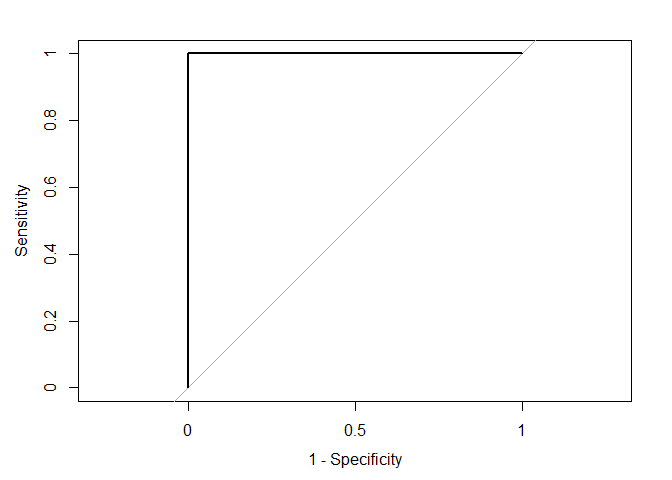

``` r
cat('AUC is', auc_pROC_1 <- pROC::auc(rocCurve_1),'\n\n')
```

    ## AUC is 1

``` r
#ci_1 <- ci(rocCurve_1)
```

### 3.2 Logistic regression model - Automated likelihood-ratio-test-based backward selection

**Build the model**

``` r
#Create a full and null logistic models
logit.full <- glm(paste('TARGET_FLAG ~',paste(names(fill_data_6[,-1]),collapse = "+")), fill_data_6, family=binomial(link = 'logit'))
```

    ## Warning: glm.fit: algorithm did not converge

    ## Warning: glm.fit: fitted probabilities numerically 0 or 1 occurred

``` r
logit.null <- glm(TARGET_FLAG ~ 1, fill_data_6, family=binomial(link = 'logit'))

#center the data before fit the full lrm model
num_var_cen <- data.frame(scale(num_var_1))
fill_data_6_cen <- fill_data_6[,-which(names(fill_data_6) %in% names(num_var_cen))] 
fill_data_6_cen <- cbind(fill_data_6_cen,num_var_cen)
  
lrm.full <- lrm(TARGET_FLAG ~ YOJ+TARGET_AMT+KIDSDRIV+AGE+HOMEKIDS+INCOME+PARENT1+HOME_VAL+MSTATUS+SEX+EDUCATION+JOB+TRAVTIME+CAR_USE+BLUEBOOK+TIF+CAR_TYPE+RED_CAR+OLDCLAIM+CLM_FREQ+REVOKED+MVR_PTS+CAR_AGE+URBANICITY,data=fill_data_6_cen,maxit=50)

fastbw(lrm.full, rule = "p", sls = 0.1)
```

    ## 
    ##  Deleted    Chi-Sq d.f. P     Residual d.f. P AIC 
    ##  TIF        0.01   17   1.000 0.01     17   1  -34
    ##  MVR_PTS    0.01   11   1.000 0.02     28   1  -56
    ##  JOB        0.00    8   1.000 0.02     36   1  -72
    ##  CAR_TYPE   0.00    5   1.000 0.03     41   1  -82
    ##  CLM_FREQ   0.00    5   1.000 0.03     46   1  -92
    ##  HOMEKIDS   0.01    5   1.000 0.04     51   1 -102
    ##  EDUCATION  0.01    4   1.000 0.05     55   1 -110
    ##  KIDSDRIV   0.01    3   1.000 0.06     58   1 -116
    ##  URBANICITY 0.00    1   0.999 0.06     59   1 -118
    ##  OLDCLAIM   0.00    1   0.985 0.06     60   1 -120
    ##  TRAVTIME   0.00    1   0.985 0.06     61   1 -122
    ##  HOME_VAL   0.00    1   0.972 0.06     62   1 -124
    ##  PARENT1    0.00    1   0.976 0.06     63   1 -126
    ##  RED_CAR    0.00    1   0.969 0.06     64   1 -128
    ##  SEX        0.00    1   0.975 0.07     65   1 -130
    ##  CAR_AGE    0.00    1   0.952 0.07     66   1 -132
    ##  INCOME     0.00    1   0.974 0.07     67   1 -134
    ##  YOJ        0.00    1   0.952 0.07     68   1 -136
    ##  REVOKED    0.01    1   0.943 0.08     69   1 -138
    ##  CAR_USE    0.00    1   0.946 0.08     70   1 -140
    ##  MSTATUS    0.00    1   0.954 0.09     71   1 -142
    ##  AGE        0.01    1   0.943 0.09     72   1 -144
    ##  BLUEBOOK   0.01    1   0.933 0.10     73   1 -146
    ##  TARGET_AMT 0.10    1   0.748 0.20     74   1 -148
    ## 
    ## Approximate Estimates after Deleting Factors
    ## 
    ##        Coef  S.E.  Wald Z      P
    ## [1,] -2.873 20.85 -0.1378 0.8904
    ## 
    ## Factors in Final Model
    ## 
    ## None

``` r
logit_2 <- glm(paste('TARGET_FLAG ~',paste(names(fill_data_6[,-1]),collapse = "+")),data=fill_data_6, family=binomial(link = 'logit'))
```

    ## Warning: glm.fit: algorithm did not converge

    ## Warning: glm.fit: fitted probabilities numerically 0 or 1 occurred

``` r
summary(logit_2)
```

    ## 
    ## Call:
    ## glm(formula = paste("TARGET_FLAG ~", paste(names(fill_data_6[, 
    ##     -1]), collapse = "+")), family = binomial(link = "logit"), 
    ##     data = fill_data_6)
    ## 
    ## Deviance Residuals: 
    ##      Min        1Q    Median        3Q       Max  
    ## -0.00168   0.00000   0.00000   0.00000   0.00208  
    ## 
    ## Coefficients:
    ##                                        Estimate      Std. Error z value
    ## (Intercept)                          -22.300628     4366.979933   -0.01
    ## YOJ                                    0.190613      121.444172    0.00
    ## TARGET_AMT                             0.211940        2.384695    0.09
    ## KIDSDRIV1                             -4.684561     2845.789585    0.00
    ## KIDSDRIV2                             -1.361699     4233.261799    0.00
    ## KIDSDRIV3                             29.096157     1818.875353    0.02
    ## AGE                                   -0.437220       60.113071   -0.01
    ## HOMEKIDS1                             -6.627778     2152.975060    0.00
    ## HOMEKIDS2                             -5.339166     2320.085080    0.00
    ## HOMEKIDS3                             -0.121847     2022.850972    0.00
    ## HOMEKIDS4                              2.217536     2676.689906    0.00
    ## HOMEKIDS5                           -430.094976   160884.780274    0.00
    ## INCOME                                -0.000117        0.029034    0.00
    ## PARENT1Yes                            -6.703815     2054.457087    0.00
    ## HOME_VAL                               0.000068        0.007788    0.01
    ## MSTATUSz_No                            4.841786     1045.491725    0.00
    ## SEXz_F                               -16.162752     1902.128680   -0.01
    ## EDUCATIONBachelors                    -6.399795     2262.565050    0.00
    ## EDUCATIONMasters                       0.986610     3252.079738    0.00
    ## EDUCATIONPhD                          13.650445     4628.872517    0.00
    ## EDUCATIONz_High School                 5.729973     1474.988793    0.00
    ## JOBDoctor                            -45.512804    52014.722956    0.00
    ## JOBHome Maker                        -16.316205     3736.823295    0.00
    ## JOBLawyer                            -17.529258     3420.599197   -0.01
    ## JOBManager                           -14.093444     2896.148534    0.00
    ## JOBProfessional                      -21.077111     5414.831923    0.00
    ## JOBStudent                            -5.315804     2972.075260    0.00
    ## JOBunkown                           -108.616713    23281.742105    0.00
    ## JOBz_Blue Collar                       3.032530     1506.771008    0.00
    ## TRAVTIME                               0.062744       22.756884    0.00
    ## CAR_USEPrivate                        -3.291232     1131.349398    0.00
    ## BLUEBOOK                              -0.000946        0.091210   -0.01
    ## TIF3                                 -12.632579     4444.282200    0.00
    ## TIF4                                  10.869462     1141.014618    0.01
    ## TIF5                                 -27.979315     7738.910714    0.00
    ## TIF6                                   9.204315     1058.996500    0.01
    ## TIF7                                  -9.365583     3433.859106    0.00
    ## TIF8                                  15.298106     8698.048012    0.00
    ## TIF9                                  -3.275483     4941.817381    0.00
    ## TIF10                                 -5.300288     2454.648536    0.00
    ## TIF11                                  1.087487     6781.764211    0.00
    ## TIF12                               -332.931688   623567.576660    0.00
    ## TIF13                                -11.997974     2741.847189    0.00
    ## TIF14                                  6.962099    18350.595219    0.00
    ## TIF15                                 18.942278    18345.973295    0.00
    ## TIF16                                  5.543892    18412.548263    0.00
    ## TIF17                                  3.710190    76502.593914    0.00
    ## TIF18                                -39.122958 13698539.841334    0.00
    ## TIF19                                 13.978090    82917.177184    0.00
    ## CAR_TYPEPanel Truck                   -4.428935     5565.858774    0.00
    ## CAR_TYPEPickup                        -3.579973     1395.414113    0.00
    ## CAR_TYPESports Car                    14.172230     1962.464685    0.01
    ## CAR_TYPEVan                            1.030752     4260.767705    0.00
    ## CAR_TYPEz_SUV                         -5.554363     2267.942743    0.00
    ## RED_CARyes                            -5.092601      955.109293   -0.01
    ## OLDCLAIM                              -0.000187        0.052164    0.00
    ## CLM_FREQ1                             12.304398     1445.756794    0.01
    ## CLM_FREQ2                             12.771869     1896.974360    0.01
    ## CLM_FREQ3                             20.430639     1930.087454    0.01
    ## CLM_FREQ4                              6.135883     2033.503202    0.00
    ## CLM_FREQ5                             38.529994    70687.936859    0.00
    ## REVOKEDYes                             7.675694     1447.703029    0.01
    ## MVR_PTS1                             -16.712945     3863.545803    0.00
    ## MVR_PTS2                             -12.399755     3633.075560    0.00
    ## MVR_PTS3                             -15.566852     2505.402956   -0.01
    ## MVR_PTS4                              -7.585185     1192.412591   -0.01
    ## MVR_PTS5                              -9.019405     1146.487096   -0.01
    ## MVR_PTS6                              -1.375721     2323.037910    0.00
    ## MVR_PTS7                              -1.817927     3002.704418    0.00
    ## MVR_PTS8                              16.944827     2385.151972    0.01
    ## MVR_PTS9                              -0.809655    27904.960636    0.00
    ## MVR_PTS10                           -209.051663    56607.866685    0.00
    ## MVR_PTS11                           -132.166146    60265.756788    0.00
    ## CAR_AGE                                1.036133      106.275503    0.01
    ## URBANICITYz_Highly Rural/ Rural       -1.342621      945.556200    0.00
    ##                                 Pr(>|z|)
    ## (Intercept)                         1.00
    ## YOJ                                 1.00
    ## TARGET_AMT                          0.93
    ## KIDSDRIV1                           1.00
    ## KIDSDRIV2                           1.00
    ## KIDSDRIV3                           0.99
    ## AGE                                 0.99
    ## HOMEKIDS1                           1.00
    ## HOMEKIDS2                           1.00
    ## HOMEKIDS3                           1.00
    ## HOMEKIDS4                           1.00
    ## HOMEKIDS5                           1.00
    ## INCOME                              1.00
    ## PARENT1Yes                          1.00
    ## HOME_VAL                            0.99
    ## MSTATUSz_No                         1.00
    ## SEXz_F                              0.99
    ## EDUCATIONBachelors                  1.00
    ## EDUCATIONMasters                    1.00
    ## EDUCATIONPhD                        1.00
    ## EDUCATIONz_High School              1.00
    ## JOBDoctor                           1.00
    ## JOBHome Maker                       1.00
    ## JOBLawyer                           1.00
    ## JOBManager                          1.00
    ## JOBProfessional                     1.00
    ## JOBStudent                          1.00
    ## JOBunkown                           1.00
    ## JOBz_Blue Collar                    1.00
    ## TRAVTIME                            1.00
    ## CAR_USEPrivate                      1.00
    ## BLUEBOOK                            0.99
    ## TIF3                                1.00
    ## TIF4                                0.99
    ## TIF5                                1.00
    ## TIF6                                0.99
    ## TIF7                                1.00
    ## TIF8                                1.00
    ## TIF9                                1.00
    ## TIF10                               1.00
    ## TIF11                               1.00
    ## TIF12                               1.00
    ## TIF13                               1.00
    ## TIF14                               1.00
    ## TIF15                               1.00
    ## TIF16                               1.00
    ## TIF17                               1.00
    ## TIF18                               1.00
    ## TIF19                               1.00
    ## CAR_TYPEPanel Truck                 1.00
    ## CAR_TYPEPickup                      1.00
    ## CAR_TYPESports Car                  0.99
    ## CAR_TYPEVan                         1.00
    ## CAR_TYPEz_SUV                       1.00
    ## RED_CARyes                          1.00
    ## OLDCLAIM                            1.00
    ## CLM_FREQ1                           0.99
    ## CLM_FREQ2                           0.99
    ## CLM_FREQ3                           0.99
    ## CLM_FREQ4                           1.00
    ## CLM_FREQ5                           1.00
    ## REVOKEDYes                          1.00
    ## MVR_PTS1                            1.00
    ## MVR_PTS2                            1.00
    ## MVR_PTS3                            1.00
    ## MVR_PTS4                            0.99
    ## MVR_PTS5                            0.99
    ## MVR_PTS6                            1.00
    ## MVR_PTS7                            1.00
    ## MVR_PTS8                            0.99
    ## MVR_PTS9                            1.00
    ## MVR_PTS10                           1.00
    ## MVR_PTS11                           1.00
    ## CAR_AGE                             0.99
    ## URBANICITYz_Highly Rural/ Rural     1.00
    ## 
    ## (Dispersion parameter for binomial family taken to be 1)
    ## 
    ##     Null deviance: 9417.962292043  on 8160  degrees of freedom
    ## Residual deviance:    0.000034355  on 8086  degrees of freedom
    ## AIC: 150
    ## 
    ## Number of Fisher Scoring iterations: 25

``` r
residualPlots(logit_2, layout = c(3, 4),ask=F) 
```

    ## Warning: glm.fit: algorithm did not converge

    ## Warning: glm.fit: fitted probabilities numerically 0 or 1 occurred

    ## Warning: glm.fit: algorithm did not converge

    ## Warning: glm.fit: fitted probabilities numerically 0 or 1 occurred

    ## Warning: glm.fit: algorithm did not converge

    ## Warning: glm.fit: fitted probabilities numerically 0 or 1 occurred

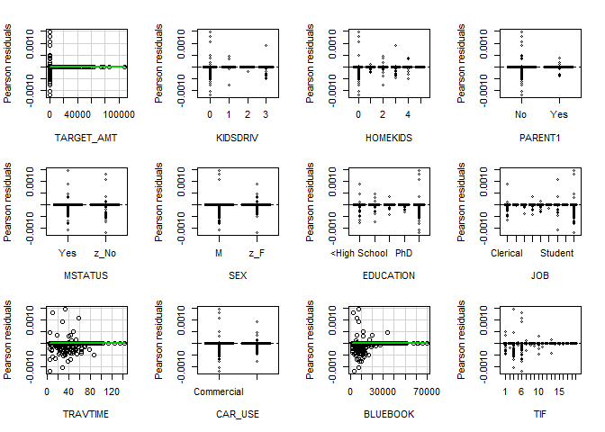

    ## Warning: glm.fit: algorithm did not converge

    ## Warning: glm.fit: fitted probabilities numerically 0 or 1 occurred

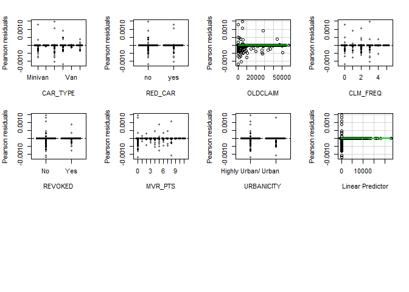

    ##            Test stat Pr(>|t|)
    ## TARGET_AMT     -3676    1.000
    ## KIDSDRIV          NA       NA
    ## HOMEKIDS          NA       NA
    ## PARENT1           NA       NA
    ## MSTATUS           NA       NA
    ## SEX               NA       NA
    ## EDUCATION         NA       NA
    ## JOB               NA       NA
    ## TRAVTIME           0    1.000
    ## CAR_USE           NA       NA
    ## BLUEBOOK           0    0.999
    ## TIF               NA       NA
    ## CAR_TYPE          NA       NA
    ## RED_CAR           NA       NA
    ## OLDCLAIM           0    1.000
    ## CLM_FREQ          NA       NA
    ## REVOKED           NA       NA
    ## MVR_PTS           NA       NA
    ## URBANICITY        NA       NA

``` r
mmps(logit_2,ask=F)
```

    ## Warning: glm.fit: algorithm did not converge

    ## Warning: glm.fit: fitted probabilities numerically 0 or 1 occurred

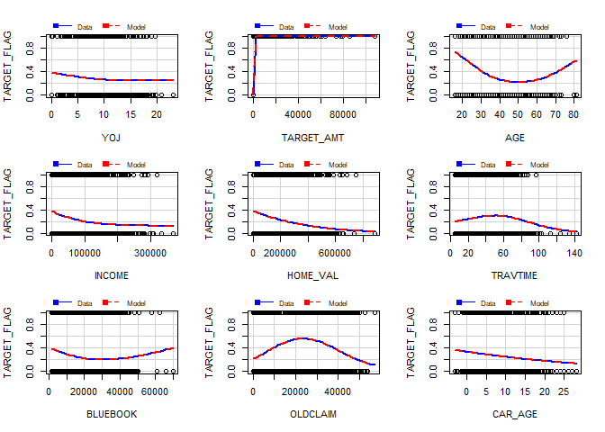

    ## Warning in mmps(logit_2, ask = F): Interactions and/or factors skipped

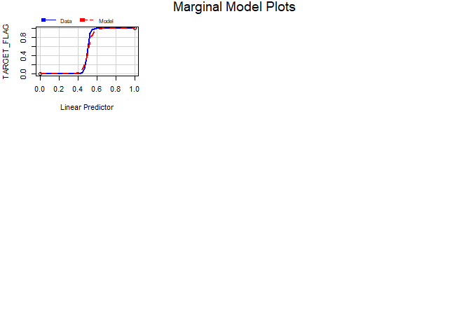

From the results of the lack-of-fit test we can see that there is no relationship between residuals with each numerical predictor variable. There is no need to add any log or quadratic transformation.

The goodness-of-fit test by the marginal model plots shows the agreement between the model and the data.

**Evaluation of the model**

``` r
# goodness of fit: pseudo R squared
(pR2_2 <- 1 - logit_2$deviance / logit_2$null.deviance)
```

    ## [1] 1

``` r
#or
#(pR2 <- 1- logLik(logitfit.1)/logLik(logit.null))
 
# AIC
AIC_2 <- extractAIC(logit_2 )[2]

# confusion matrix
clsdf_2 <- data.frame(fill_data_6$TARGET_FLAG)
clsdf_2$pre.prob <- predict( logit_2, newdata = fill_data_6, type = "response")
clsdf_2$pre.target <- ifelse(clsdf_2$pre.prob>0.5, 1,0)
clsdf_2$pre.target <- as.factor(clsdf_2$pre.target)
names(clsdf_2)[names(clsdf_2)=='fill_data_6.TARGET_FLAG'] <- 'TARGET_FLAG'

#X.test <- trsf_df[,-which(names(trsf_df)=='target')]
#X.test <- X.test[,which(names(X.test) %in% c('medv', 'q.medv', 'zn', 'l.zn', 'dis', 'chas', 'lstat', 'age'))]
#y_predicted <- predict(logitfit.1, newx = as.matrix(X.test))

cfmx_2 <- confusionMatrix(data = clsdf_2$pre.target, reference = clsdf_2$TARGET_FLAG, positive = "1")

(cfmx_2$table)
```

    ##           Reference
    ## Prediction    0    1
    ##          0 6008    0
    ##          1    0 2153

``` r
(acrcy_2 <- cfmx_2$overall['Accuracy'])
```

    ## Accuracy 
    ##        1

``` r
(err_rate_2 <- 1-cfmx_2$overall['Accuracy'])
```

    ## Accuracy 
    ##        0

``` r
(preci_2 <- cfmx_2$byClass['Precision'])
```

    ## Precision 
    ##         1

``` r
(sensi_2 <- cfmx_2$byClass['Sensitivity'])
```

    ## Sensitivity 
    ##           1

``` r
(speci_2 <- cfmx_2$byClass['Specificity'])
```

    ## Specificity 
    ##           1

``` r
(F1_2 <- cfmx_2$byClass['F1'])
```

    ## F1 
    ##  1

``` r
# ROC and AUC
rocCurve_2 <- roc(response = clsdf_2$TARGET_FLAG,
 predictor = clsdf_2$pre.prob,
 levels = levels(as.factor(clsdf_2$TARGET_FLAG)))

plot(rocCurve_2, legacy.axes = TRUE)
```

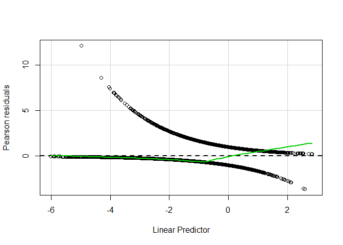

``` r
cat('AUC is', auc_pROC_2 <- pROC::auc(rocCurve_2),'\n\n')
```

    ## AUC is 1

``` r
#ci_2 <- ci(rocCurve_2)
```

In this model, the variable TARGET\_AMT is the only one predictor variable. From the results of the lack-of-fit test we can see that there is no relationship between the Pearson residuals with the predictor variable. There is no need to add any log or quadratic transformation.

The goodness-of-fit test by the marginal model plot shows the agreement between the model and the data.

### 3.3 Logistic regression model - Multinomial logistic regression model

**Build the model**

Since binomial logistic regression model is a special form of multinomial logistic regression model, I will use mlogit function to build the binomial logistic regression model.

``` r
suppressMessages(suppressWarnings(library(mlogit)))

fill_data_bi <- fill_data_6
fill_data_bi$TARGET_FLAG <- as.factor(ifelse(fill_data_6$TARGET_FLAG==1,'Yes','No'))

# Reshaping the data from wide to long format
#mydata$mode<-as.factor(mydata$mode)
mldata<-mlogit.data(fill_data_6, varying=NULL, choice="TARGET_FLAG", shape="wide")
mldata[1:20,]
```

    ##      TARGET_FLAG   YOJ TARGET_AMT KIDSDRIV AGE HOMEKIDS INCOME PARENT1
    ## 1.0         TRUE 11.00          0        0  60        0  67349      No
    ## 1.1        FALSE 11.00          0        0  60        0  67349      No
    ## 2.0         TRUE 11.00          0        0  43        0  91449      No
    ## 2.1        FALSE 11.00          0        0  43        0  91449      No
    ## 3.0         TRUE 10.00          0        0  35        1  16039      No
    ## 3.1        FALSE 10.00          0        0  35        1  16039      No
    ## 4.0         TRUE 14.00          0        0  51        0  64182      No
    ## 4.1        FALSE 14.00          0        0  51        0  64182      No
    ## 5.0         TRUE  7.07          0        0  50        0 114986      No
    ## 5.1        FALSE  7.07          0        0  50        0 114986      No
    ## 6.0        FALSE 12.00       2946        0  34        1 125301     Yes
    ## 6.1         TRUE 12.00       2946        0  34        1 125301     Yes
    ## 7.0         TRUE  9.02          0        0  54        0  18755      No
    ## 7.1        FALSE  9.02          0        0  54        0  18755      No
    ## 8.0        FALSE 12.75       4021        1  37        2 107961      No
    ## 8.1         TRUE 12.75       4021        1  37        2 107961      No
    ## 9.0        FALSE 10.00       2501        0  34        0  62978      No
    ## 9.1         TRUE 10.00       2501        0  34        0  62978      No
    ## 10.0        TRUE  7.00          0        0  50        0 106952      No
    ## 10.1       FALSE  7.00          0        0  50        0 106952      No
    ##      HOME_VAL MSTATUS SEX     EDUCATION           JOB TRAVTIME    CAR_USE
    ## 1.0         0    z_No   M           PhD  Professional       14    Private
    ## 1.1         0    z_No   M           PhD  Professional       14    Private
    ## 2.0    257252    z_No   M z_High School z_Blue Collar       22 Commercial
    ## 2.1    257252    z_No   M z_High School z_Blue Collar       22 Commercial
    ## 3.0    124191     Yes z_F z_High School      Clerical        5    Private
    ## 3.1    124191     Yes z_F z_High School      Clerical        5    Private
    ## 4.0    306251     Yes   M  <High School z_Blue Collar       32    Private
    ## 4.1    306251     Yes   M  <High School z_Blue Collar       32    Private
    ## 5.0    243925     Yes z_F           PhD        Doctor       36    Private
    ## 5.1    243925     Yes z_F           PhD        Doctor       36    Private
    ## 6.0         0    z_No z_F     Bachelors z_Blue Collar       46 Commercial
    ## 6.1         0    z_No z_F     Bachelors z_Blue Collar       46 Commercial
    ## 7.0    198414     Yes z_F  <High School z_Blue Collar       33    Private
    ## 7.1    198414     Yes z_F  <High School z_Blue Collar       33    Private
    ## 8.0    333680     Yes   M     Bachelors z_Blue Collar       44 Commercial
    ## 8.1    333680     Yes   M     Bachelors z_Blue Collar       44 Commercial
    ## 9.0         0    z_No z_F     Bachelors      Clerical       34    Private
    ## 9.1         0    z_No z_F     Bachelors      Clerical       34    Private
    ## 10.0        0    z_No   M     Bachelors  Professional       48 Commercial
    ## 10.1        0    z_No   M     Bachelors  Professional       48 Commercial
    ##      BLUEBOOK TIF   CAR_TYPE RED_CAR OLDCLAIM CLM_FREQ REVOKED MVR_PTS
    ## 1.0     14230  11    Minivan     yes     4461        2      No       3
    ## 1.1     14230  11    Minivan     yes     4461        2      No       3
    ## 2.0     14940   1    Minivan     yes        0        0      No       0
    ## 2.1     14940   1    Minivan     yes        0        0      No       0
    ## 3.0      4010   4      z_SUV      no    38690        2      No       3
    ## 3.1      4010   4      z_SUV      no    38690        2      No       3
    ## 4.0     15440   7    Minivan     yes        0        0      No       0
    ## 4.1     15440   7    Minivan     yes        0        0      No       0
    ## 5.0     18000   1      z_SUV      no    19217        2     Yes       3
    ## 5.1     18000   1      z_SUV      no    19217        2     Yes       3
    ## 6.0     17430   1 Sports Car      no        0        0      No       0
    ## 6.1     17430   1 Sports Car      no        0        0      No       0
    ## 7.0      8780   1      z_SUV      no        0        0      No       0
    ## 7.1      8780   1      z_SUV      no        0        0      No       0
    ## 8.0     16970   1        Van     yes     2374        1     Yes      10
    ## 8.1     16970   1        Van     yes     2374        1     Yes      10
    ## 9.0     11200   1      z_SUV      no        0        0      No       0
    ## 9.1     11200   1      z_SUV      no        0        0      No       0
    ## 10.0    18510   7        Van      no        0        0      No       1
    ## 10.1    18510   7        Van      no        0        0      No       1
    ##      CAR_AGE            URBANICITY chid alt
    ## 1.0       18   Highly Urban/ Urban    1   0
    ## 1.1       18   Highly Urban/ Urban    1   1
    ## 2.0        1   Highly Urban/ Urban    2   0
    ## 2.1        1   Highly Urban/ Urban    2   1
    ## 3.0       10   Highly Urban/ Urban    3   0
    ## 3.1       10   Highly Urban/ Urban    3   1
    ## 4.0        6   Highly Urban/ Urban    4   0
    ## 4.1        6   Highly Urban/ Urban    4   1
    ## 5.0       17   Highly Urban/ Urban    5   0
    ## 5.1       17   Highly Urban/ Urban    5   1
    ## 6.0        7   Highly Urban/ Urban    6   0
    ## 6.1        7   Highly Urban/ Urban    6   1
    ## 7.0        1   Highly Urban/ Urban    7   0
    ## 7.1        1   Highly Urban/ Urban    7   1
    ## 8.0        7   Highly Urban/ Urban    8   0
    ## 8.1        7   Highly Urban/ Urban    8   1
    ## 9.0        1   Highly Urban/ Urban    9   0
    ## 9.1        1   Highly Urban/ Urban    9   1
    ## 10.0      17 z_Highly Rural/ Rural   10   0
    ## 10.1      17 z_Highly Rural/ Rural   10   1

``` r
# Multinomial logit model coefficients 
logit_3 <- mlogit(TARGET_FLAG ~ 1 | YOJ+TARGET_AMT+KIDSDRIV+AGE+HOMEKIDS+INCOME+PARENT1+HOME_VAL+MSTATUS+SEX+EDUCATION+JOB+TRAVTIME+CAR_USE+BLUEBOOK+TIF+CAR_TYPE+RED_CAR+OLDCLAIM+CLM_FREQ+REVOKED+MVR_PTS+CAR_AGE+URBANICITY,data=mldata, reflevel=levels(fill_data_6$TARGET_FLAG)[1])
summary(logit_3)
```

    ## 
    ## Call:
    ## mlogit(formula = TARGET_FLAG ~ 1 | YOJ + TARGET_AMT + KIDSDRIV + 
    ##     AGE + HOMEKIDS + INCOME + PARENT1 + HOME_VAL + MSTATUS + 
    ##     SEX + EDUCATION + JOB + TRAVTIME + CAR_USE + BLUEBOOK + TIF + 
    ##     CAR_TYPE + RED_CAR + OLDCLAIM + CLM_FREQ + REVOKED + MVR_PTS + 
    ##     CAR_AGE + URBANICITY, data = mldata, reflevel = levels(fill_data_6$TARGET_FLAG)[1], 
    ##     method = "nr", print.level = 0)
    ## 
    ## Frequencies of alternatives:
    ##     0     1 
    ## 0.736 0.264 
    ## 
    ## nr method
    ## 23 iterations, 0h:0m:10s 
    ## g'(-H)^-1g =  78.4 
    ## successive function values within tolerance limits 
    ## 
    ## Coefficients :
    ##                                         Estimate     Std. Error t-value
    ## 1:(intercept)                     -4.68595548515  1.27214406641   -3.68
    ## 1:YOJ                              0.03537137707  0.03881139159    0.91
    ## 1:TARGET_AMT                       0.00663869967  0.00031933259   20.79
    ## 1:KIDSDRIV1                       -0.11098419643  0.53751895295   -0.21
    ## 1:KIDSDRIV2                        0.48231918327  0.62806514632    0.77
    ## 1:KIDSDRIV3                        1.47437529044  0.81542313154    1.81
    ## 1:AGE                              0.00733597041  0.01936209040    0.38
    ## 1:HOMEKIDS1                        0.45815413948  0.53347171168    0.86
    ## 1:HOMEKIDS2                        0.48427638915  0.53361380924    0.91
    ## 1:HOMEKIDS3                        0.60313636684  0.58341683440    1.03
    ## 1:HOMEKIDS4                        1.37630212005  0.70892626935    1.94
    ## 1:HOMEKIDS5                       -4.79560379983 18.49652415504   -0.26
    ## 1:INCOME                          -0.00000531561  0.00000607540   -0.87
    ## 1:PARENT1Yes                      -0.11499165061  0.55081634911   -0.21
    ## 1:HOME_VAL                        -0.00000000923  0.00000178561   -0.01
    ## 1:MSTATUSz_No                      0.46643032083  0.42985794192    1.09
    ## 1:SEXz_F                          -0.39142070879  0.52520286545   -0.75
    ## 1:EDUCATIONBachelors               0.13377451160  0.51283996385    0.26
    ## 1:EDUCATIONMasters                -0.20389738617  0.91047971034   -0.22
    ## 1:EDUCATIONPhD                     0.32098253753  1.04586941309    0.31
    ## 1:EDUCATIONz_High School          -0.27226623201  0.42060514484   -0.65
    ## 1:JOBDoctor                       -1.79434092277  1.79944727431   -1.00
    ## 1:JOBHome Maker                   -0.02757244647  0.66540840346   -0.04
    ## 1:JOBLawyer                       -0.42050092394  0.96247195717   -0.44
    ## 1:JOBManager                      -0.83549958753  0.67244880042   -1.24
    ## 1:JOBProfessional                 -0.64183697717  0.60788391631   -1.06
    ## 1:JOBStudent                      -0.16753040281  0.58111330251   -0.29
    ## 1:JOBunkown                       -0.92791049792  1.09415647185   -0.85
    ## 1:JOBz_Blue Collar                 0.18875323012  0.46949935741    0.40
    ## 1:TRAVTIME                         0.00774233887  0.00843619251    0.92
    ## 1:CAR_USEPrivate                  -0.52733605289  0.41255008721   -1.28
    ## 1:BLUEBOOK                        -0.00004008260  0.00002380752   -1.68
    ## 1:TIF3                            -0.63277299260  0.78422056579   -0.81
    ## 1:TIF4                             0.38777222680  0.37943967609    1.02
    ## 1:TIF5                             0.05588456470  1.43104554988    0.04
    ## 1:TIF6                             0.29364915008  0.38144084635    0.77
    ## 1:TIF7                            -0.32537772708  0.56825080156   -0.57
    ## 1:TIF8                             1.18086808001  1.03501586660    1.14
    ## 1:TIF9                            -0.21637950329  0.90616338354   -0.24
    ## 1:TIF10                           -1.01133149749  0.65976355864   -1.53
    ## 1:TIF11                            0.07442301507  0.81052173317    0.09
    ## 1:TIF12                           -3.50986861370  6.75598662825   -0.52
    ## 1:TIF13                           -0.54739201674  0.97998986291   -0.56
    ## 1:TIF14                           -0.26767650932  1.37780030048   -0.19
    ## 1:TIF15                            0.92601913680  1.70212163886    0.54
    ## 1:TIF16                            0.37760822222  1.50198363596    0.25
    ## 1:TIF17                           -1.27394271734  1.78132052541   -0.72
    ## 1:TIF18                           -2.18677306088  6.66536642285   -0.33
    ## 1:TIF19                           -3.91836167691 17.84999327246   -0.22
    ## 1:CAR_TYPEPanel Truck             -0.25670493529  0.86077237198   -0.30
    ## 1:CAR_TYPEPickup                   0.13546450180  0.45429428264    0.30
    ## 1:CAR_TYPESports Car               0.71160306157  0.58151534089    1.22
    ## 1:CAR_TYPEVan                      0.31419964684  0.60728179453    0.52
    ## 1:CAR_TYPEz_SUV                    0.26687053394  0.51562354102    0.52
    ## 1:RED_CARyes                      -0.29452090896  0.40351954544   -0.73
    ## 1:OLDCLAIM                        -0.00003158725  0.00002140319   -1.48
    ## 1:CLM_FREQ1                        0.17511427643  0.50480271052    0.35
    ## 1:CLM_FREQ2                        0.73022253141  0.42140722650    1.73
    ## 1:CLM_FREQ3                        0.42596759983  0.50464500557    0.84
    ## 1:CLM_FREQ4                        1.85011049862  0.60478169561    3.06
    ## 1:CLM_FREQ5                        1.14925694231  3.28432995003    0.35
    ## 1:REVOKEDYes                       0.69745162874  0.43500458468    1.60
    ## 1:MVR_PTS1                        -0.41126801408  0.47985858713   -0.86
    ## 1:MVR_PTS2                         0.10901583283  0.44591867772    0.24
    ## 1:MVR_PTS3                        -0.01864290838  0.48414475544   -0.04
    ## 1:MVR_PTS4                        -0.14317704954  0.55158763756   -0.26
    ## 1:MVR_PTS5                         0.46408929341  0.53766297463    0.86
    ## 1:MVR_PTS6                         0.43324103608  0.62976539520    0.69
    ## 1:MVR_PTS7                         0.67779184848  0.87440574441    0.78
    ## 1:MVR_PTS8                         1.20762638489  1.02908466347    1.17
    ## 1:MVR_PTS9                         1.04120858121  1.23908249122    0.84
    ## 1:MVR_PTS10                       -0.55158072979  5.81971277832   -0.09
    ## 1:MVR_PTS11                        0.74374712565  4.19287102175    0.18
    ## 1:CAR_AGE                         -0.01219071833  0.03635061548   -0.34
    ## 1:URBANICITYz_Highly Rural/ Rural -1.67825843130  0.47440968438   -3.54
    ##                                               Pr(>|t|)    
    ## 1:(intercept)                                  0.00023 ***
    ## 1:YOJ                                          0.36210    
    ## 1:TARGET_AMT                      < 0.0000000000000002 ***
    ## 1:KIDSDRIV1                                    0.83642    
    ## 1:KIDSDRIV2                                    0.44252    
    ## 1:KIDSDRIV3                                    0.07059 .  
    ## 1:AGE                                          0.70477    
    ## 1:HOMEKIDS1                                    0.39044    
    ## 1:HOMEKIDS2                                    0.36412    
    ## 1:HOMEKIDS3                                    0.30123    
    ## 1:HOMEKIDS4                                    0.05221 .  
    ## 1:HOMEKIDS5                                    0.79543    
    ## 1:INCOME                                       0.38161    
    ## 1:PARENT1Yes                                   0.83463    
    ## 1:HOME_VAL                                     0.99588    
    ## 1:MSTATUSz_No                                  0.27789    
    ## 1:SEXz_F                                       0.45611    
    ## 1:EDUCATIONBachelors                           0.79421    
    ## 1:EDUCATIONMasters                             0.82280    
    ## 1:EDUCATIONPhD                                 0.75892    
    ## 1:EDUCATIONz_High School                       0.51742    
    ## 1:JOBDoctor                                    0.31869    
    ## 1:JOBHome Maker                                0.96695    
    ## 1:JOBLawyer                                    0.66219    
    ## 1:JOBManager                                   0.21406    
    ## 1:JOBProfessional                              0.29103    
    ## 1:JOBStudent                                   0.77312    
    ## 1:JOBunkown                                    0.39640    
    ## 1:JOBz_Blue Collar                             0.68766    
    ## 1:TRAVTIME                                     0.35875    
    ## 1:CAR_USEPrivate                               0.20117    
    ## 1:BLUEBOOK                                     0.09226 .  
    ## 1:TIF3                                         0.41973    
    ## 1:TIF4                                         0.30680    
    ## 1:TIF5                                         0.96885    
    ## 1:TIF6                                         0.44139    
    ## 1:TIF7                                         0.56692    
    ## 1:TIF8                                         0.25390    
    ## 1:TIF9                                         0.81127    
    ## 1:TIF10                                        0.12531    
    ## 1:TIF11                                        0.92684    
    ## 1:TIF12                                        0.60340    
    ## 1:TIF13                                        0.57646    
    ## 1:TIF14                                        0.84596    
    ## 1:TIF15                                        0.58642    
    ## 1:TIF16                                        0.80150    
    ## 1:TIF17                                        0.47451    
    ## 1:TIF18                                        0.74285    
    ## 1:TIF19                                        0.82625    
    ## 1:CAR_TYPEPanel Truck                          0.76553    
    ## 1:CAR_TYPEPickup                               0.76556    
    ## 1:CAR_TYPESports Car                           0.22106    
    ## 1:CAR_TYPEVan                                  0.60489    
    ## 1:CAR_TYPEz_SUV                                0.60476    
    ## 1:RED_CARyes                                   0.46546    
    ## 1:OLDCLAIM                                     0.13999    
    ## 1:CLM_FREQ1                                    0.72867    
    ## 1:CLM_FREQ2                                    0.08313 .  
    ## 1:CLM_FREQ3                                    0.39862    
    ## 1:CLM_FREQ4                                    0.00222 ** 
    ## 1:CLM_FREQ5                                    0.72640    
    ## 1:REVOKEDYes                                   0.10886    
    ## 1:MVR_PTS1                                     0.39141    
    ## 1:MVR_PTS2                                     0.80686    
    ## 1:MVR_PTS3                                     0.96928    
    ## 1:MVR_PTS4                                     0.79519    
    ## 1:MVR_PTS5                                     0.38805    
    ## 1:MVR_PTS6                                     0.49149    
    ## 1:MVR_PTS7                                     0.43825    
    ## 1:MVR_PTS8                                     0.24060    
    ## 1:MVR_PTS9                                     0.40074    
    ## 1:MVR_PTS10                                    0.92449    
    ## 1:MVR_PTS11                                    0.85921    
    ## 1:CAR_AGE                                      0.73735    
    ## 1:URBANICITYz_Highly Rural/ Rural              0.00040 ***
    ## ---
    ## Signif. codes:  0 '***' 0.001 '**' 0.01 '*' 0.05 '.' 0.1 ' ' 1
    ## 
    ## Log-Likelihood: -120
    ## McFadden R^2:  0.975 
    ## Likelihood ratio test : chisq = 9180 (p.value = <0.0000000000000002)

TARGET\_AMT CLM\_FREQ4 URBANICITYz\_Highly Rural/ Rural KIDSDRIV3 HOMEKIDS4 BLUEBOOK CLM\_FREQ2

**Evaluation of the model**

### 3.4 Linear regression model - backward selection

**Build the model**

``` r
# OLS regression cofficients
olsreg <- lm(paste('TARGET_AMT ~',paste(names(fill_data_6[,-3]),collapse = "+")),fill_data_6)

olsfit_1 <- step(olsreg,direction="backward",trace=FALSE)
#coef(olsfit_1)
summary(olsfit_1)
```

    ## 
    ## Call:
    ## lm(formula = TARGET_AMT ~ TARGET_FLAG + PARENT1 + SEX + BLUEBOOK + 
    ##     REVOKED, data = fill_data_6)
    ## 
    ## Residuals:
    ##    Min     1Q Median     3Q    Max 
    ##  -5861   -394    -42    190 101661 
    ## 
    ## Coefficients:
    ##                Estimate Std. Error t value             Pr(>|t|)    
    ## (Intercept)  -349.25224  113.55564   -3.08               0.0021 ** 
    ## TARGET_FLAG1 5766.62305  102.47314   56.27 < 0.0000000000000002 ***
    ## PARENT1Yes    234.27757  131.84963    1.78               0.0756 .  
    ## SEXz_F       -193.57580   88.46455   -2.19               0.0287 *  
    ## BLUEBOOK        0.02805    0.00526    5.34          0.000000098 ***
    ## REVOKEDYes   -290.03122  135.56880   -2.14               0.0324 *  
    ## ---
    ## Signif. codes:  0 '***' 0.001 '**' 0.01 '*' 0.05 '.' 0.1 ' ' 1
    ## 
    ## Residual standard error: 3970 on 8155 degrees of freedom
    ## Multiple R-squared:  0.289,  Adjusted R-squared:  0.289 
    ## F-statistic:  663 on 5 and 8155 DF,  p-value: <0.0000000000000002

``` r
#diagnostic plots for linear regression
par(mfrow=c(2,2))
plot(olsfit_1)
```

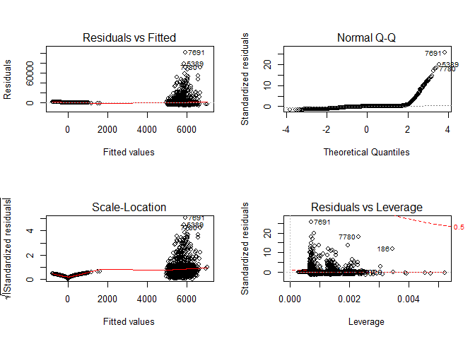

``` r
null <- lm(TARGET_AMT ~ 1, data=fill_data_6)
```

**Evaluation of the model**

### 3.5 Linear regression model - fit.mult.impute function

**Build the model**

``` r
(olsfit_2 <- fit.mult.impute(TARGET_AMT ~ YOJ+KIDSDRIV+AGE+HOMEKIDS+INCOME+PARENT1+HOME_VAL+MSTATUS+SEX+EDUCATION+JOB+TRAVTIME+CAR_USE+BLUEBOOK+TIF+CAR_TYPE+RED_CAR+OLDCLAIM+CLM_FREQ+REVOKED+MVR_PTS+CAR_AGE+URBANICITY,fitter=ols,xtrans=mi,data=collapse_train[,-1]))
```

    ## 
    ## Variance Inflation Factors Due to Imputation:
    ## 
    ##                        Intercept                              YOJ 
    ##                             1.01                             1.29 
    ##                       KIDSDRIV=1                       KIDSDRIV=2 
    ##                             1.00                             1.00 
    ##                       KIDSDRIV=3                              AGE 
    ##                             1.00                             1.01 
    ##                       HOMEKIDS=1                       HOMEKIDS=2 
    ##                             1.00                             1.01 
    ##                       HOMEKIDS=3                       HOMEKIDS=4 
    ##                             1.01                             1.00 
    ##                       HOMEKIDS=5                           INCOME 
    ##                             1.00                             1.05 
    ##                      PARENT1=Yes                         HOME_VAL 
    ##                             1.00                             1.03 
    ##                     MSTATUS=z_No                          SEX=z_F 
    ##                             1.01                             1.00 
    ##              EDUCATION=Bachelors                EDUCATION=Masters 
    ##                             1.00                             1.00 
    ##                    EDUCATION=PhD          EDUCATION=z_High School 
    ##                             1.00                             1.00 
    ##                       JOB=Doctor                   JOB=Home Maker 
    ##                             1.00                             1.03 
    ##                       JOB=Lawyer                      JOB=Manager 
    ##                             1.00                             1.00 
    ##                 JOB=Professional                      JOB=Student 
    ##                             1.00                             1.03 
    ##                       JOB=unkown                JOB=z_Blue Collar 
    ##                             1.00                             1.00 
    ##                         TRAVTIME                  CAR_USE=Private 
    ##                             1.00                             1.00 
    ##                         BLUEBOOK                            TIF=3 
    ##                             1.00                             1.00 
    ##                            TIF=4                            TIF=5 
    ##                             1.00                             1.00 
    ##                            TIF=6                            TIF=7 
    ##                             1.00                             1.00 
    ##                            TIF=8                            TIF=9 
    ##                             1.00                             1.00 
    ##                           TIF=10                           TIF=11 
    ##                             1.00                             1.00 
    ##                           TIF=12                           TIF=13 
    ##                             1.00                             1.00 
    ##                           TIF=14                           TIF=15 
    ##                             1.00                             1.00 
    ##                           TIF=16                           TIF=17 
    ##                             1.00                             1.00 
    ##                           TIF=18                           TIF=19 
    ##                             1.00                             1.00 
    ##             CAR_TYPE=Panel Truck                  CAR_TYPE=Pickup 
    ##                             1.00                             1.00 
    ##              CAR_TYPE=Sports Car                     CAR_TYPE=Van 
    ##                             1.00                             1.00 
    ##                   CAR_TYPE=z_SUV                      RED_CAR=yes 
    ##                             1.00                             1.00 
    ##                         OLDCLAIM                       CLM_FREQ=1 
    ##                             1.00                             1.00 
    ##                       CLM_FREQ=2                       CLM_FREQ=3 
    ##                             1.00                             1.00 
    ##                       CLM_FREQ=4                       CLM_FREQ=5 
    ##                             1.00                             1.00 
    ##                      REVOKED=Yes                        MVR_PTS=1 
    ##                             1.00                             1.00 
    ##                        MVR_PTS=2                        MVR_PTS=3 
    ##                             1.00                             1.00 
    ##                        MVR_PTS=4                        MVR_PTS=5 
    ##                             1.00                             1.00 
    ##                        MVR_PTS=6                        MVR_PTS=7 
    ##                             1.00                             1.00 
    ##                        MVR_PTS=8                        MVR_PTS=9 
    ##                             1.00                             1.00 
    ##                       MVR_PTS=10                       MVR_PTS=11 
    ##                             1.00                             1.00 
    ##                          CAR_AGE URBANICITY=z_Highly Rural/ Rural 
    ##                             1.01                             1.00 
    ## 
    ## Rate of Missing Information:
    ## 
    ##                        Intercept                              YOJ 
    ##                             0.01                             0.23 
    ##                       KIDSDRIV=1                       KIDSDRIV=2 
    ##                             0.00                             0.00 
    ##                       KIDSDRIV=3                              AGE 
    ##                             0.00                             0.01 
    ##                       HOMEKIDS=1                       HOMEKIDS=2 
    ##                             0.00                             0.01 
    ##                       HOMEKIDS=3                       HOMEKIDS=4 
    ##                             0.01                             0.00 
    ##                       HOMEKIDS=5                           INCOME 
    ##                             0.00                             0.05 
    ##                      PARENT1=Yes                         HOME_VAL 
    ##                             0.00                             0.03 
    ##                     MSTATUS=z_No                          SEX=z_F 
    ##                             0.01                             0.00 
    ##              EDUCATION=Bachelors                EDUCATION=Masters 
    ##                             0.00                             0.00 
    ##                    EDUCATION=PhD          EDUCATION=z_High School 
    ##                             0.00                             0.00 
    ##                       JOB=Doctor                   JOB=Home Maker 
    ##                             0.00                             0.03 
    ##                       JOB=Lawyer                      JOB=Manager 
    ##                             0.00                             0.00 
    ##                 JOB=Professional                      JOB=Student 
    ##                             0.00                             0.03 
    ##                       JOB=unkown                JOB=z_Blue Collar 
    ##                             0.00                             0.00 
    ##                         TRAVTIME                  CAR_USE=Private 
    ##                             0.00                             0.00 
    ##                         BLUEBOOK                            TIF=3 
    ##                             0.00                             0.00 
    ##                            TIF=4                            TIF=5 
    ##                             0.00                             0.00 
    ##                            TIF=6                            TIF=7 
    ##                             0.00                             0.00 
    ##                            TIF=8                            TIF=9 
    ##                             0.00                             0.00 
    ##                           TIF=10                           TIF=11 
    ##                             0.00                             0.00 
    ##                           TIF=12                           TIF=13 
    ##                             0.00                             0.00 
    ##                           TIF=14                           TIF=15 
    ##                             0.00                             0.00 
    ##                           TIF=16                           TIF=17 
    ##                             0.00                             0.00 
    ##                           TIF=18                           TIF=19 
    ##                             0.00                             0.00 
    ##             CAR_TYPE=Panel Truck                  CAR_TYPE=Pickup 
    ##                             0.00                             0.00 
    ##              CAR_TYPE=Sports Car                     CAR_TYPE=Van 
    ##                             0.00                             0.00 
    ##                   CAR_TYPE=z_SUV                      RED_CAR=yes 
    ##                             0.00                             0.00 
    ##                         OLDCLAIM                       CLM_FREQ=1 
    ##                             0.00                             0.00 
    ##                       CLM_FREQ=2                       CLM_FREQ=3 
    ##                             0.00                             0.00 
    ##                       CLM_FREQ=4                       CLM_FREQ=5 
    ##                             0.00                             0.00 
    ##                      REVOKED=Yes                        MVR_PTS=1 
    ##                             0.00                             0.00 
    ##                        MVR_PTS=2                        MVR_PTS=3 
    ##                             0.00                             0.00 
    ##                        MVR_PTS=4                        MVR_PTS=5 
    ##                             0.00                             0.00 
    ##                        MVR_PTS=6                        MVR_PTS=7 
    ##                             0.00                             0.00 
    ##                        MVR_PTS=8                        MVR_PTS=9 
    ##                             0.00                             0.00 
    ##                       MVR_PTS=10                       MVR_PTS=11 
    ##                             0.00                             0.00 
    ##                          CAR_AGE URBANICITY=z_Highly Rural/ Rural 
    ##                             0.01                             0.00 
    ## 
    ## d.f. for t-distribution for Tests of Single Coefficients:
    ## 
    ##                        Intercept                              YOJ 
    ##                          34078.8                             96.4 
    ##                       KIDSDRIV=1                       KIDSDRIV=2 
    ##                      275802080.6                        7699778.5 
    ##                       KIDSDRIV=3                              AGE 
    ##                       32196828.7                          46981.9 
    ##                       HOMEKIDS=1                       HOMEKIDS=2 
    ##                         992638.7                         127512.0 
    ##                       HOMEKIDS=3                       HOMEKIDS=4 
    ##                          53301.6                         241951.2 
    ##                       HOMEKIDS=5                           INCOME 
    ##                       37672295.3                           1946.4 
    ##                      PARENT1=Yes                         HOME_VAL 
    ##                       27924607.5                           4718.2 
    ##                     MSTATUS=z_No                          SEX=z_F 
    ##                          30021.0                      120269528.7 
    ##              EDUCATION=Bachelors                EDUCATION=Masters 
    ##                        2853897.5                        1650070.0 
    ##                    EDUCATION=PhD          EDUCATION=z_High School 
    ##                         605396.6                       32205429.8 
    ##                       JOB=Doctor                   JOB=Home Maker 
    ##                       20472459.9                           5451.0 
    ##                       JOB=Lawyer                      JOB=Manager 
    ##                       20845227.0                        3501516.2 
    ##                 JOB=Professional                      JOB=Student 
    ##                        4136374.4                           6651.8 
    ##                       JOB=unkown                JOB=z_Blue Collar 
    ##                        4018849.4                       17081231.1 
    ##                         TRAVTIME                  CAR_USE=Private 
    ##                      358183396.3                       63590176.0 
    ##                         BLUEBOOK                            TIF=3 
    ##                        1305277.7                      329315046.9 
    ##                            TIF=4                            TIF=5 
    ##                      122685055.8                     3573625815.9 
    ##                            TIF=6                            TIF=7 
    ##                      136714393.1                     2361232174.7 
    ##                            TIF=8                            TIF=9 
    ##                      348621346.4                        9131390.9 
    ##                           TIF=10                           TIF=11 
    ##                      216584560.7                     2585113943.4 
    ##                           TIF=12                           TIF=13 
    ##                      261752418.6                      706822875.8 
    ##                           TIF=14                           TIF=15 
    ##                      814933502.1                      157185426.7 
    ##                           TIF=16                           TIF=17 
    ##                      297102354.9                      645246143.0 
    ##                           TIF=18                           TIF=19 
    ##                     2534773147.2                     1186395675.2 
    ##             CAR_TYPE=Panel Truck                  CAR_TYPE=Pickup 
    ##                      431367800.1                      786451128.7 
    ##              CAR_TYPE=Sports Car                     CAR_TYPE=Van 
    ##                       49991453.1                      128477807.0 
    ##                   CAR_TYPE=z_SUV                      RED_CAR=yes 
    ##                      761840566.3                      248790166.5 
    ##                         OLDCLAIM                       CLM_FREQ=1 
    ##                       86157252.8                     2601665431.0 
    ##                       CLM_FREQ=2                       CLM_FREQ=3 
    ##                      342818420.8                      314447240.3 
    ##                       CLM_FREQ=4                       CLM_FREQ=5 
    ##                     7840249024.2                       72198771.4 
    ##                      REVOKED=Yes                        MVR_PTS=1 
    ##                      100407477.9                       55716955.9 
    ##                        MVR_PTS=2                        MVR_PTS=3 
    ##                       94837861.8                      126469561.2 
    ##                        MVR_PTS=4                        MVR_PTS=5 
    ##                      377271694.6                      681784124.2 
    ##                        MVR_PTS=6                        MVR_PTS=7 
    ##                       65041585.7                       37476454.8 
    ##                        MVR_PTS=8                        MVR_PTS=9 
    ##                      939729764.2                       11060114.8 
    ##                       MVR_PTS=10                       MVR_PTS=11 
    ##                      364860338.4                  1695241141182.2 
    ##                          CAR_AGE URBANICITY=z_Highly Rural/ Rural 
    ##                         119002.8                      189824850.7 
    ## 
    ## The following fit components were averaged over the 6 model fits:
    ## 
    ##   fitted.values stats linear.predictors

    ## Linear Regression Model
    ##  
    ##  fit.mult.impute(formula = TARGET_AMT ~ YOJ + KIDSDRIV + AGE + 
    ##      HOMEKIDS + INCOME + PARENT1 + HOME_VAL + MSTATUS + SEX + 
    ##      EDUCATION + JOB + TRAVTIME + CAR_USE + BLUEBOOK + TIF + CAR_TYPE + 
    ##      RED_CAR + OLDCLAIM + CLM_FREQ + REVOKED + MVR_PTS + CAR_AGE + 
    ##      URBANICITY, fitter = ols, xtrans = mi, data = collapse_train[, 
    ##      -1])
    ##  
    ##                    Model Likelihood     Discrimination    
    ##                       Ratio Test           Indexes        
    ##  Obs       8161    LR chi2    648.98    R2       0.076    
    ##  sigma4541.0185    d.f.           73    R2 adj   0.068    
    ##  d.f.      8087    Pr(> chi2) 0.0000    g     1461.261    
    ##  
    ##  Residuals
    ##  
    ##       Min       1Q   Median       3Q      Max 
    ##   -6938.6  -1682.9   -753.8    375.6 103420.2 
    ##  
    ##  
    ##                                   Coef       S.E.      t      Pr(>|t|)
    ##  Intercept                         1490.8100  495.2072   3.01 0.0026  
    ##  YOJ                                 -9.7518   16.9546  -0.58 0.5652  
    ##  KIDSDRIV=1                         551.3735  211.7798   2.60 0.0092  
    ##  KIDSDRIV=2                         509.3077  302.9126   1.68 0.0927  
    ##  KIDSDRIV=3                         377.2644  588.5326   0.64 0.5215  
    ##  AGE                                  7.1137    7.3603   0.97 0.3338  
    ##  HOMEKIDS=1                         238.7969  207.4557   1.15 0.2497  
    ##  HOMEKIDS=2                         334.2196  203.6606   1.64 0.1008  
    ##  HOMEKIDS=3                         198.2130  238.8136   0.83 0.4066  
    ##  HOMEKIDS=4                         231.0102  393.8609   0.59 0.5575  
    ##  HOMEKIDS=5                         672.0747 1233.5702   0.54 0.5859  
    ##  INCOME                              -0.0049    0.0019  -2.51 0.0120  
    ##  PARENT1=Yes                        472.2582  217.7638   2.17 0.0301  
    ##  HOME_VAL                            -0.0006    0.0006  -0.93 0.3532  
    ##  MSTATUS=z_No                       592.9554  153.0135   3.88 0.0001  
    ##  SEX=z_F                           -383.4699  184.2101  -2.08 0.0374  
    ##  EDUCATION=Bachelors               -240.8574  206.8737  -1.16 0.2443  
    ##  EDUCATION=Masters                   66.9872  304.8449   0.22 0.8261  
    ##  EDUCATION=PhD                      366.0406  362.6630   1.01 0.3129  
    ##  EDUCATION=z_High School            -89.6563  172.1887  -0.52 0.6026  
    ##  JOB=Doctor                        -984.1841  433.5555  -2.27 0.0232  
    ##  JOB=Home Maker                    -230.0039  258.0334  -0.89 0.3728  
    ##  JOB=Lawyer                        -273.8630  308.3829  -0.89 0.3745  
    ##  JOB=Manager                       -951.2002  240.4094  -3.96 <0.0001 
    ##  JOB=Professional                   -40.2187  217.8483  -0.18 0.8535  
    ##  JOB=Student                       -286.3094  242.4386  -1.18 0.2377  
    ##  JOB=unkown                        -489.2273  343.1972  -1.43 0.1541  
    ##  JOB=z_Blue Collar                    7.1946  193.3437   0.04 0.9703  
    ##  TRAVTIME                            11.7303    3.2245   3.64 0.0003  
    ##  CAR_USE=Private                   -755.3790  164.7350  -4.59 <0.0001 
    ##  BLUEBOOK                             0.0157    0.0087   1.82 0.0690  
    ##  TIF=3                              103.1395  237.6046   0.43 0.6642  
    ##  TIF=4                             -355.6907  157.9254  -2.25 0.0243  
    ##  TIF=5                              600.1209  638.6448   0.94 0.3474  
    ##  TIF=6                             -316.1828  153.6826  -2.06 0.0397  
    ##  TIF=7                             -455.2902  204.2407  -2.23 0.0258  
    ##  TIF=8                             -280.5567  595.2750  -0.47 0.6374  
    ##  TIF=9                             -846.5241  317.1140  -2.67 0.0076  
    ##  TIF=10                            -511.0712  186.9337  -2.73 0.0063  
    ##  TIF=11                            -337.2106  306.6935  -1.10 0.2716  
    ##  TIF=12                            -401.2498  684.6738  -0.59 0.5579  
    ##  TIF=13                            -408.1491  288.1933  -1.42 0.1567  
    ##  TIF=14                           -1143.9364  523.7376  -2.18 0.0290  
    ##  TIF=15                             445.3925  823.4043   0.54 0.5886  
    ##  TIF=16                           -1011.7666  693.6360  -1.46 0.1447  
    ##  TIF=17                            -585.5268  455.9230  -1.28 0.1991  
    ##  TIF=18                            -502.8296  934.0690  -0.54 0.5904  
    ##  TIF=19                           -1042.4117  809.8231  -1.29 0.1981  
    ##  CAR_TYPE=Panel Truck               261.8139  279.0433   0.94 0.3481  
    ##  CAR_TYPE=Pickup                    376.2741  171.0041   2.20 0.0278  
    ##  CAR_TYPE=Sports Car               1031.6316  218.1060   4.73 <0.0001 
    ##  CAR_TYPE=Van                       517.9821  213.4419   2.43 0.0153  
    ##  CAR_TYPE=z_SUV                     747.2616  179.6068   4.16 <0.0001 
    ##  RED_CAR=yes                        -38.3873  149.3467  -0.26 0.7972  
    ##  OLDCLAIM                            -0.0155    0.0080  -1.94 0.0522  
    ##  CLM_FREQ=1                         500.6527  191.0932   2.62 0.0088  
    ##  CLM_FREQ=2                         388.2653  182.0094   2.13 0.0329  
    ##  CLM_FREQ=3                         558.5922  205.9102   2.71 0.0067  
    ##  CLM_FREQ=4                         560.3546  350.4440   1.60 0.1099  
    ##  CLM_FREQ=5                         409.7966 1080.6578   0.38 0.7045  
    ##  REVOKED=Yes                        601.3980  175.6133   3.42 0.0006  
    ##  MVR_PTS=1                          100.7665  153.5546   0.66 0.5117  
    ##  MVR_PTS=2                          496.1199  167.1405   2.97 0.0030  
    ##  MVR_PTS=3                          250.6460  185.0098   1.35 0.1755  
    ##  MVR_PTS=4                          315.9085  208.6768   1.51 0.1301  
    ##  MVR_PTS=5                          755.9902  251.2464   3.01 0.0026  
    ##  MVR_PTS=6                          427.7531  300.5565   1.42 0.1547  
    ##  MVR_PTS=7                         1314.5201  370.5235   3.55 0.0004  
    ##  MVR_PTS=8                         2573.7134  510.6590   5.04 <0.0001 
    ##  MVR_PTS=9                         2233.7377  692.0640   3.23 0.0013  
    ##  MVR_PTS=10                        3937.7128 1272.0831   3.10 0.0020  
    ##  MVR_PTS=11                         930.0533 1270.0514   0.73 0.4640  
    ##  CAR_AGE                            -27.2928   12.9072  -2.11 0.0345  
    ##  URBANICITY=z_Highly Rural/ Rural -1606.4542  141.0864 -11.39 <0.0001 
    ## 

**Evaluation of the model**

4. SELECT MODELS
----------------

Decide on the criteria for selecting the best multiple linear regression model and the best binary logistic regression model. Will you select models with slightly worse performance if it makes more sense or is more parsimonious? Discuss why you selected your models.

For the multiple linear regression model, will you use a metric such as Adjusted R2, RMSE, etc.? Be sure to explain how you can make inferences from the model, discuss multi-collinearity issues (if any), and discuss other relevant model output. Using the training data set, evaluate the multiple linear regression model based on (a) mean squared error, (b) R2, (c) F-statistic, and (d) residual plots. For the binary logistic regression model, will you use a metric such as log likelihood, AIC, ROC curve, etc.? Using the training data set, evaluate the binary logistic regression model based on (a) accuracy, (b) classification error rate, (c) precision, (d) sensitivity, (e) specificity, (f)F1 score, (g) AUC, and (h) confusion matrix. Make predictions using the evaluation data set.

``` r
logLik(logit_1)
logLik(logit_2)
logLik(logit_3)
logLik(olsfit_1)
logLik(olsfit_2)

pR2_1
pR2_2
pR2_3
pR2_4
pR2_5

AIC_1

AIC_2
```

Base on the log likelihood, model 1 and 2 have the same highest values. model 1 and 2 also have the same highest R squared values and same AIC. So model 1 and 2 are the best.

Make predictions using the evaluation data set
