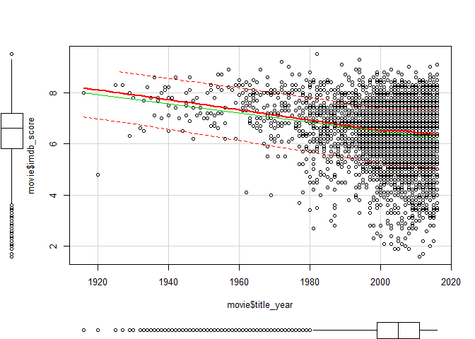
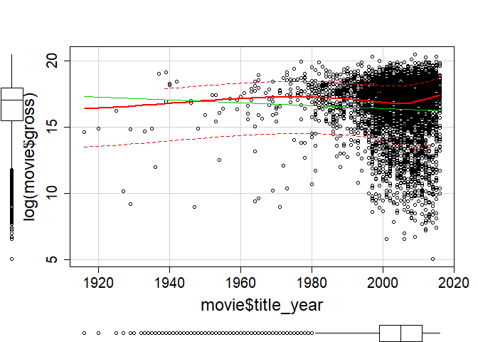

DATA621 Final Project\_Group4
================
Yun Mai, Gurpreet Singh, Chirag Vithalani
May 2, 2018

Purpose
=======

The motion picture industry is growing at a rapid growth rate, likely due to the acceleration of online and mobile distribution, lower admission prices, and government policy initiatives. This industry is also rich in data, thus making it extremely exciting for statisticians. The movie industry, which used to rely on traditional conventional wisdom and simple rules of thumb to predict box office outcomes, is slowly seeking new "analytical" approaches.

More and more analytical models will play a greater role in the motion picture industry by contributing towards superior marketing strategies that better predict the overall success of each movie.

Introduction
============

Data preparation
================

``` r
suppressMessages(suppressWarnings(library(data.table)))
suppressMessages(suppressWarnings(library(knitr)))
suppressMessages(suppressWarnings(library(stringr)))
suppressMessages(suppressWarnings(library(pastecs)))
suppressMessages(suppressWarnings(library(psych)))
suppressMessages(suppressWarnings(library(Hmisc)))
suppressMessages(suppressWarnings(library(reshape)))
suppressMessages(suppressWarnings(library(corrplot)))
suppressMessages(suppressMessages(library(MASS)))
suppressMessages(suppressWarnings(library(dplyr)))
suppressMessages(suppressWarnings(library(ggplot2)))
suppressMessages(suppressWarnings(library(mice)))
suppressMessages(suppressWarnings(library(VIM)))
suppressMessages(suppressWarnings(library(caret)))

suppressMessages(suppressWarnings(library(Amelia)))
suppressMessages(suppressWarnings(library(car)))
suppressMessages(suppressWarnings(library(Amelia)))


suppressMessages(suppressWarnings(library(readr)))

#options(stringsAsFactors = FALSE)
#movie <- readr::read_csv('https://raw.githubusercontent.com/chirag-vithlani/Business_Analytics_and_Data_Mining_DATA_621/master/Movie_data_analysis_project/data/movie_metadata.csv', locale = locale(encoding = "UTF-8"))

movie <- readr::read_csv('E:/YM_work/CUNY_DAMS/CUNY_621/DATA621_finalproject/movie_add_missing.csv', locale = locale(encoding = "UTF-8"))
```

    ## Parsed with column specification:
    ## cols(
    ##   .default = col_integer(),
    ##   movie_title = col_character(),
    ##   imdb_score = col_double(),
    ##   content_rating = col_character(),
    ##   color = col_character(),
    ##   aspect_ratio = col_double(),
    ##   language = col_character(),
    ##   country = col_character(),
    ##   director_name = col_character(),
    ##   actor_1_name = col_character(),
    ##   actor_2_name = col_character(),
    ##   actor_3_name = col_character(),
    ##   genres = col_character(),
    ##   plot_keywords = col_character(),
    ##   movie_imdb_link = col_character()
    ## )

    ## See spec(...) for full column specifications.

    ## Warning in rbind(names(probs), probs_f): number of columns of result is not
    ## a multiple of vector length (arg 1)

    ## Warning: 3 parsing failures.
    ## row # A tibble: 3 x 5 col     row col   expected               actual     file                       expected   <int> <chr> <chr>                  <chr>      <chr>                      actual 1  1457 gross an integer             2710796031 'E:/YM_work/CUNY_DAMS/CUN~ file 2  1727 gross no trailing characters s          'E:/YM_work/CUNY_DAMS/CUN~ row 3  2128 gross no trailing characters s          'E:/YM_work/CUNY_DAMS/CUN~

``` r
movie <- as.data.frame(movie)
movie$Index <- seq(1,nrow(movie))
movie <-movie[,c(length(movie),1:(length(movie)-1))]
#readr::write_csv(movie, "E:/YM_work/CUNY_DAMS/CUNY_621/DATA621_finalproject/movie_original.csv")
#temp <- movie <- readr::read_csv('E:/YM_work/CUNY_DAMS/CUNY_621/DATA621_finalproject/movie_original.csv', locale = locale(encoding = "UTF-8"))
```

Data preparation for linear regression
--------------------------------------

Clean up

``` r
# correct some incorrect aspect ratio 
movie$aspect_ratio[which(movie$aspect_ratio == 16)] <- 1.78
movie$aspect_ratio[which(movie$aspect_ratio == 4)] <- 1.33

# fill empty cell with NA if any
for(i in 1:length(movie)){
 movie[,i][which(movie[,i]=="")]<-NA
}

#replace NAs as string 'NA' 
for(i in 1:length(movie)){
  if (class(movie[,i]) == 'character'){
    movie[,i][which(is.na(movie[,i]))] <- 'NA'
  }
}

#replace 'Not Rated' in content_rating with 'Unrated' as they are the same
movie$'content_rating' <- str_replace_all(movie$'content_rating','Not Rated','Unrated')
 
#unique(movie$'content_rating')
```

check the missing data in movie

``` r
pMiss <- function(x){(sum(is.null(x))+sum(is.na(x)))/length(x)[1]*100}
pMiss_count <- function(x){sum(is.null(x))+sum(is.na(x))}
missfeature_percent <- as.data.frame(apply(movie[,-1],2,pMiss))
missfeature_count <- as.data.frame(apply(movie[,-1],2,pMiss_count))
feature_mode <- unlist(t(lapply(movie[,-1],class)))
miss_feature <- cbind(missfeature_count,feature_mode,missfeature_percent)
miss_feature <- miss_feature[,c(2,1,3)]
colnames(miss_feature) <- c('feature_mode','missing value','missing value(%)')
miss_feature <- miss_feature[order(miss_feature$'missing value', decreasing =TRUE ),]
miss_feature 
```

separate the numeric and the categorical variables
--------------------------------------------------

``` r
# Because of too many levels, variables "movie_title", "director_name","actor_1_name", "actor_2_name", "actor_3_name", "plot_keywords" and "movie_imdb_link" will not be used in the model.

# separate the numeric and the categorical variables
num_var <- dplyr::select_if(movie[,-1], is.numeric)

ctg_var <- movie[,-which(names(movie) %in% names(num_var))][,-1]

#temp <- movie

#temp <- movie[,-which(names(movie) %in% c("director_name","actor_1_name", "actor_2_name", "actor_3_name", "plot_keywords" ,"movie_imdb_link"))]

#for( i in 3: length(temp)){
#  if(class(temp[,i])=='character'){
#    temp[,i]<-as.factor(temp[,i])
#  }
#}
```

impute the missing values
=========================

``` r
#memory.limit()
#memory.limit(size=20000)

# impute 5 data sets for the missing values in the dataset
impData <- mice(num_var, m=5, printFlag=FALSE, meth="sample", maxit=50,seed=500) 

#compare the distributions of original and imputed data
densityplot(impData)
```


``` r
# get the completed dataset where the missing values have been replaced with the imputed values in the first of the five datasets
movie_im <- complete(impData,1)
movie_im <- cbind(movie$Index,movie_im)
colnames(movie_im)[1] <- 'Index'

#write.csv(movie_im,'impute.csv')

#delete the imputeded Y
not_na <- movie[!is.na(movie$gross),][,'Index']

num_mid <- movie_im[which(movie_im[,'Index'] %in% not_na),] 
```

remove rocords with NA in gross
-------------------------------

``` r
#remove NA from dicrector and actors columns
ctg_var <- cbind(movie$Index,ctg_var)
colnames(ctg_var)[1] <- 'Index'
ctg_mid <- ctg_var[which(ctg_var[,'Index'] %in% not_na),] 

movie_mid <- cbind(num_mid,ctg_mid[,-1])

#anyNA(movie_mid) #[1] FALSE
```

calculate the averger gross of each dicrector and actor made in the previous movies
-----------------------------------------------------------------------------------

``` r
# the compuation will be based on the whole dataset
# the records with missing gross values will be removed before calculation

#"director_name","actor_1_name", "actor_2_name", "actor_3_name",

####################################################
#convert director_name to dummay variable
####################################################
dummy_director <- as.data.frame(model.matrix(~director_name-1, data = movie_mid))
gross_director <- cbind(movie_mid[,'gross'],dummy_director)
colnames(gross_director)[1] <- c('gross')
director_sum <- as.matrix(unlist(lapply(dummy_director,sum)))
gross_director <- as.matrix(t(as.matrix(gross_director$gross)) %*% as.matrix(gross_director[,-1]))
director_ave_gross <- gross_director/t(director_sum)
hist(director_ave_gross)
```



``` r
#Aaron Schneider


#director_sum <- lapply(dummy_director,sum)
#for (i in 1:length(dummy_director)){
#  dummy_director[,i] <- ifelse(dummy_director[i]==1,director_sum[[i]],0)
#}

####################################################
#convert actor_1_name to dummay variable
####################################################
dummy_actor_1 <- as.data.frame(model.matrix(~actor_1_name-1, data = movie_mid))
gross_actor_1 <- cbind(movie_mid[,'gross'],dummy_actor_1)
colnames(gross_actor_1)[1] <- c('gross')
actor_1_sum <- as.matrix(unlist(lapply(dummy_actor_1,sum)))
gross_actor_1 <- as.matrix(t(as.matrix(gross_actor_1$gross)) %*% as.matrix(gross_actor_1[,-1]))
actor_1_ave_gross <- gross_actor_1/t(actor_1_sum)
hist(actor_1_ave_gross)
```



``` r
####################################################
#convert actor_2_name to dummay variable
####################################################
dummy_actor_2 <- as.data.frame(model.matrix(~actor_2_name-1, data = movie_mid))
gross_actor_2 <- cbind(movie_mid[,'gross'],dummy_actor_2)
colnames(gross_actor_2)[1] <- c('gross')
actor_2_sum <- as.matrix(unlist(lapply(dummy_actor_2,sum)))
gross_actor_2 <- as.matrix(t(as.matrix(gross_actor_2$gross)) %*% as.matrix(gross_actor_2[,-1]))
actor_2_ave_gross <- gross_actor_2/t(actor_2_sum)
hist(actor_2_ave_gross)
```


``` r
####################################################
#convert actor_3_name to dummay variable
####################################################
dummy_actor_3 <- as.data.frame(model.matrix(~actor_3_name-1, data = movie_mid))
gross_actor_3 <- cbind(movie_mid[,'gross'],dummy_actor_3)
colnames(gross_actor_3)[1] <- c('gross')
actor_3_sum <- as.matrix(unlist(lapply(dummy_actor_3,sum)))
gross_actor_3 <- as.matrix(t(as.matrix(gross_actor_3$gross)) %*% as.matrix(gross_actor_3[,-1]))
actor_3_ave_gross <- gross_actor_3/t(actor_3_sum)
hist(actor_3_ave_gross)
```


``` r
colnames(director_ave_gross) <- str_replace_all(colnames(director_ave_gross),"director_name","")
colnames(actor_1_ave_gross) <- str_replace_all(colnames(actor_1_ave_gross),"actor_1_name","")
colnames(actor_2_ave_gross) <- str_replace_all(colnames(actor_2_ave_gross),"actor_2_name","")
colnames(actor_3_ave_gross) <- str_replace_all(colnames(actor_3_ave_gross),"actor_3_name","")

director_ave_gross <- as.data.frame(t(director_ave_gross))
director_ave_gross$director <- rownames(director_ave_gross)

actor_1_ave_gross <- as.data.frame(t(actor_1_ave_gross))
actor_1_ave_gross$actor_1 <- rownames(actor_1_ave_gross)

actor_2_ave_gross <- as.data.frame(t(actor_2_ave_gross))
actor_2_ave_gross$actor_2 <- rownames(actor_2_ave_gross)

actor_3_ave_gross <- as.data.frame(t(actor_3_ave_gross))
actor_3_ave_gross$actor_3 <- rownames(actor_3_ave_gross)

movie_mid$director_ave_gross <- unlist(lapply(movie_mid$director_name, function(x) director_ave_gross$V1[match(x, director_ave_gross$director)]))

movie_mid$actor_1_ave_gross <- unlist(lapply(movie_mid$actor_1_name, function(x) actor_1_ave_gross$V1[match(x, actor_1_ave_gross$actor_1)]))

movie_mid$actor_2_ave_gross <- unlist( lapply(movie_mid$actor_2_name, function(x) actor_2_ave_gross$V1[match(x, actor_2_ave_gross$actor_2)]))

movie_mid$actor_3_ave_gross <- unlist( lapply(movie_mid$actor_3_name, function(x) actor_3_ave_gross$V1[match(x, actor_3_ave_gross$actor_3)]))


anyNA(movie_mid)
```

    ## [1] FALSE

calculate how many movies of each dicrector and actor has been involved previously
----------------------------------------------------------------------------------

``` r
rownames(director_sum) <- str_replace_all(rownames(director_sum),"director_name","")
rownames(actor_1_sum) <- str_replace_all(rownames(actor_1_sum),"actor_1_name","")
rownames(actor_2_sum) <- str_replace_all(rownames(actor_2_sum),"actor_2_name","")
rownames(actor_3_sum) <- str_replace_all(rownames(actor_3_sum),"actor_3_name","")

director_sum <- as.data.frame(director_sum)
director_sum$director <- rownames(director_sum)

actor_1_sum <- as.data.frame(actor_1_sum)
actor_1_sum$actor_1 <- rownames(actor_1_sum)

actor_2_sum <- as.data.frame(actor_2_sum)
actor_2_sum$actor_2 <- rownames(actor_2_sum)

actor_3_sum <- as.data.frame(actor_3_sum)
actor_3_sum$actor_3 <- rownames(actor_3_sum)

movie_mid$director_num <- unlist(lapply(movie_mid$director_name, function(x) director_sum$V1[match(x, director_sum$director)]))

movie_mid$actor_1_num <- unlist(lapply(movie_mid$actor_1_name, function(x) actor_1_sum$V1[match(x, actor_1_sum$actor_1)]))

movie_mid$actor_2_num <- unlist( lapply(movie_mid$actor_2_name, function(x) actor_2_sum$V1[match(x, actor_2_sum$actor_2)]))

movie_mid$actor_3_num <- unlist( lapply(movie_mid$actor_3_name, function(x) actor_3_sum$V1[match(x, actor_3_sum$actor_3)]))


anyNA(movie_mid)
```

    ## [1] FALSE

replace hyphen to lower score in 'genres' and 'content\_rating'
---------------------------------------------------------------

``` r
movie_mid$genres <- str_replace_all(movie_mid$genres,"-","_")
movie_mid$content_rating <- str_replace_all(movie_mid$content_rating,"-","_")
```

### convert some categorical variables to factor

``` r
movie_mid$content_rating <- as.factor(movie_mid$content_rating)
movie_mid$color <- as.factor(movie_mid$color)
movie_mid$language <- as.factor(movie_mid$language)
movie_mid$country <- as.factor(movie_mid$language)
movie_mid$genres <- as.factor(movie_mid$genres)
movie_mid$aspect_ratio <- as.factor(movie_mid$aspect_ratio)
```

split the data into train and evaluation datasets
-------------------------------------------------

``` r
#movie$Index <- seq(1,nrow(movie))
# <- movie[,c(29,1:28)]  

# fill the empty cell with NA
#movie [movie ==""] <- NA

#split the data for trainning and evaluation:
set.seed(123)
indexes <- sample(1:nrow(movie_mid), size=0.2*nrow(movie_mid))
 
# Split data into two part, train for building model and evaluation for 
evaluation <- movie_mid[indexes,]
train <- movie_mid[-indexes,]

#train.rows <- createDataPartition(y=movie$Index, p=0.8, list = FALSE)   # caret package
#train <- movie[train.rows,]  
#evaluation <-movie[-train.rows,]  
anyNA(train)
```

    ## [1] FALSE

multillinearity for dataset I
-----------------------------

``` r
suppressMessages(suppressWarnings(library(usdm)))

vif_test <- vif(train[,-which(names(train) %in% c("Index","gross","aspect_ratio","movie_title" , "content_rating" , "color", "language" ,"country" , "director_name" , "actor_1_name" ,"actor_2_name" , "actor_3_name" , "genres" , "plot_keywords",  "movie_imdb_link"))])
vif_test
```

    ##                    Variables       VIF
    ## 1       num_user_for_reviews  3.010793
    ## 2     num_critic_for_reviews  3.272572
    ## 3                 imdb_score  1.490539
    ## 4            num_voted_users  4.000220
    ## 5       facenumber_in_poster  1.055334
    ## 6                   duration  1.347857
    ## 7                     budget  1.269068
    ## 8                 title_year  1.406830
    ## 9    director_facebook_likes  1.551842
    ## 10    actor_1_facebook_likes 16.964478
    ## 11    actor_2_facebook_likes  1.505497
    ## 12    actor_3_facebook_likes  2.815392
    ## 13 cast_total_facebook_likes 21.577501
    ## 14      movie_facebook_likes  2.229626
    ## 15        director_ave_gross  2.368349
    ## 16         actor_1_ave_gross  1.876262
    ## 17         actor_2_ave_gross  2.616391
    ## 18         actor_3_ave_gross  2.812728
    ## 19              director_num  1.604498
    ## 20               actor_1_num  1.725136
    ## 21               actor_2_num  1.328993
    ## 22               actor_3_num  1.101177

``` r
vif_final <- vif(train[,-which(names(train) %in% c("Index","aspect_ratio","gross","movie_title" , "content_rating" , "color", "language" ,"country" , "director_name" , "actor_1_name" ,"actor_2_name" , "actor_3_name" , "genres" , "plot_keywords",  "movie_imdb_link","cast_total_facebook_likes"))])
vif_final
```

    ##                  Variables      VIF
    ## 1     num_user_for_reviews 3.010056
    ## 2   num_critic_for_reviews 3.271651
    ## 3               imdb_score 1.489755
    ## 4          num_voted_users 4.000124
    ## 5     facenumber_in_poster 1.055173
    ## 6                 duration 1.347187
    ## 7                   budget 1.268979
    ## 8               title_year 1.406757
    ## 9  director_facebook_likes 1.551396
    ## 10  actor_1_facebook_likes 1.523236
    ## 11  actor_2_facebook_likes 1.184523
    ## 12  actor_3_facebook_likes 1.278070
    ## 13    movie_facebook_likes 2.226994
    ## 14      director_ave_gross 2.368348
    ## 15       actor_1_ave_gross 1.871656
    ## 16       actor_2_ave_gross 2.565049
    ## 17       actor_3_ave_gross 2.812658
    ## 18            director_num 1.604312
    ## 19             actor_1_num 1.724564
    ## 20             actor_2_num 1.259875
    ## 21             actor_3_num 1.100775

dataset II - convert categorical variables to dummy variables
-------------------------------------------------------------

convert "content\_rating", "color", "language", "country","genres" to dummy variables

``` r
movie_mid_dummy <- movie_mid

####################################################
#convert genre to dummay variable
####################################################
genre <- paste(unique(movie_mid$genres),collapse=",")
genre <- str_replace_all(genre,"\\|",",")
genre <-as.list(strsplit(genre, ",")[[1]])
genre <- str_replace_all(genre," ","")
genre <- unique(genre)

#set the last levle of genre "Film-Noir" as control
for(i in 1: (length(genre)-1)){
  movie_mid_dummy[,paste('genre.',genre[i],sep='')] <- ifelse(grepl(genre[i], movie_mid_dummy$genres),1,0)
}


####################################################
#convert color to dummay variable
####################################################
color <- unique(movie_mid$color)

#set the last levle "Black and White" as control
movie_mid_dummy[,'color.Color'] <- ifelse(grepl('Color', movie_mid_dummy$color),1,0)


####################################################
#convert content rating (MMAP rating) to dummay variable
####################################################
#set the "NA" as control
content_rating <- relevel(movie_mid_dummy$content_rating, "NA")
dummy_mmap <- as.data.frame(model.matrix(~content_rating)[,-1])

####################################################
#convert language to dummay variable
####################################################
#set the "None" as control
language <- relevel(movie_mid_dummy$language, "None")
dummy_language <- as.data.frame(model.matrix(~language)[,-1])

####################################################
#convert country to dummay variable
####################################################
#set the "Zulu" as control
country <- relevel(movie_mid_dummy$country, "Zulu")
dummy_country <- as.data.frame(model.matrix(~country)[,-1])

####################################################
#convert aspect_ratio to dummay variable
####################################################
#set the "1.18" as control
aspect <- relevel(movie_mid_dummy$aspect_ratio, "1.18")
dummy_aspect_ratio <- as.data.frame(model.matrix(~aspect)[,-1])


movie_mid_dummy <- cbind(movie_mid_dummy,dummy_mmap,dummy_language,dummy_country,dummy_aspect_ratio)

# remove the variables converted to dummy
# movie_mid_dummy <- movie_mid_dummy[,-which(names(movie_mid_dummy) %in% c("content_rating",  "color", "language",  "country","genres","director_name","actor_1_name","actor_2_name","actor_3_name"))]

anyNA(movie_mid_dummy)
```

    ## [1] FALSE

split the data into train and evaluation datasets
-------------------------------------------------

``` r
#movie$Index <- seq(1,nrow(movie))
# <- movie[,c(29,1:28)]  

# fill the empty cell with NA
#movie [movie ==""] <- NA

#split the data for trainning and evaluation:
set.seed(123)
indexes <- sample(1:nrow(movie_mid_dummy), size=0.2*nrow(movie_mid_dummy))
 
# Split data into two part, train for building model and evaluation for 
evaluation_dummy <- movie_mid_dummy[indexes,]
train_dummy <- movie_mid_dummy[-indexes,]

#train.rows <- createDataPartition(y=movie$Index, p=0.8, list = FALSE)   # caret package
#train <- movie[train.rows,]  
#evaluation <-movie[-train.rows,]  
anyNA(train_dummy)
```

    ## [1] FALSE

Multiple Linear Regression I - based on dataset I
-------------------------------------------------

``` r
train$content_rating<- relevel(train$content_rating, "NA")
train$country <- relevel(train$country, "Zulu")
train$language <- relevel(train$language, "Zulu")
train$aspect_ratio<- relevel(train$aspect_ratio, "1.18")

fit_lm_1 <- lm(gross~.,
                  train[,-which(names(train) %in% c("Index", "movie_title","director_name" , "actor_1_name" ,"actor_2_name" , "actor_3_name" , "plot_keywords",  "movie_imdb_link","cast_total_facebook_likes"))])

fit_lm_1.sum <- summary(fit_lm_1)


data.frame(fit_lm_1.sum$coef[fit_lm_1.sum$coef[,4] <= .05, ])
```

    ##                                                           Estimate
    ## num_voted_users                                       7.047237e+01
    ## aspect_ratio1.5                                      -9.401695e+07
    ## aspect_ratio2                                         4.756703e+07
    ## budget                                                9.622645e-02
    ## director_facebook_likes                              -9.082822e+02
    ## actor_1_facebook_likes                               -1.111174e+02
    ## actor_3_facebook_likes                               -1.371376e+03
    ## content_ratingR                                      -1.252972e+07
    ## colorColor                                            1.027690e+07
    ## genresAction|Adventure|Comedy|Family|Fantasy          7.569083e+07
    ## genresAction|Adventure|Comedy|Family|Fantasy|Sci_Fi  -5.770279e+07
    ## genresAction|Adventure|Crime|Drama|Mystery|Thriller   6.197611e+07
    ## genresAction|Adventure|Drama|History|War             -4.011643e+07
    ## genresAction|Adventure|Drama|Sci_Fi|Thriller         -8.963541e+07
    ## genresAction|Adventure|Family|Sci_Fi                 -4.833490e+07
    ## genresAction|Adventure|Fantasy|Romance                9.761742e+07
    ## genresAction|Adventure|Fantasy|Sci_Fi                 4.723316e+07
    ## genresAction|Adventure|Horror|Sci_Fi                 -4.007143e+07
    ## genresAction|Adventure|Romance|Sci_Fi|Thriller       -8.916736e+07
    ## genresAction|Animation|Comedy|Family|Sci_Fi           7.336906e+07
    ## genresAction|Animation|Sci_Fi                        -1.084037e+08
    ## genresAction|Biography|Drama|History|Romance|War     -6.003502e+07
    ## genresAction|Comedy|Romance|Thriller                 -4.724267e+07
    ## genresAction|Drama|Mystery|Sci_Fi                    -5.917653e+07
    ## genresAction|Western                                 -7.392241e+07
    ## genresAdventure|Animation|Comedy|Family|Sport         5.720151e+07
    ## genresAdventure|Animation|Drama|Family|Fantasy       -1.032687e+08
    ## genresAdventure|Animation|Drama|Family|Musical        1.004262e+08
    ## genresAdventure|Comedy|Family|Mystery|Sci_Fi          9.729601e+07
    ## genresAdventure|Comedy|Fantasy                       -4.734159e+07
    ## genresAdventure|Comedy|Fantasy|Sci_Fi                -8.938838e+07
    ## genresAdventure|Drama                                -3.205044e+07
    ## genresAdventure|Drama|Family|Fantasy                  6.390156e+07
    ## genresAdventure|Drama|Fantasy|Romance                 4.439784e+07
    ## genresAdventure|Fantasy|Mystery                      -6.249960e+07
    ## genresAnimation|Comedy|Family|Fantasy|Music           4.827757e+07
    ## genresAnimation|Drama|Family|Fantasy|Musical|Romance -6.195227e+07
    ## genresBiography|Comedy|Crime|Drama                   -4.688229e+07
    ## genresBiography|Crime|Drama|History|Western          -6.257742e+07
    ## genresBiography|Crime|Drama|Romance|Thriller         -6.464115e+07
    ## genresBiography|Drama|History|Romance                -3.671502e+07
    ## genresComedy|Crime|Drama|Mystery                     -9.196786e+07
    ## genresComedy|Horror|Sci_Fi                           -6.388903e+07
    ## genresDrama | Fantasy | Thriller                     -1.592910e+08
    ## genresDrama|Fantasy|Thriller                         -5.373648e+07
    ## genresDrama|Musical                                  -4.300540e+07
    ## genresFamily|Sci_Fi                                   2.231789e+08
    ## genresFantasy | Horror | Mystery                     -9.581513e+07
    ## director_ave_gross                                    2.425076e-01
    ## actor_1_ave_gross                                     1.498446e-01
    ## actor_2_ave_gross                                     3.194067e-01
    ## actor_3_ave_gross                                     4.075478e-01
    ## actor_1_num                                          -1.882114e+05
    ##                                                        Std..Error
    ## num_voted_users                                      7.399735e+00
    ## aspect_ratio1.5                                      3.778090e+07
    ## aspect_ratio2                                        1.616566e+07
    ## budget                                               1.450376e-02
    ## director_facebook_likes                              1.991234e+02
    ## actor_1_facebook_likes                               4.782201e+01
    ## actor_3_facebook_likes                               3.173784e+02
    ## content_ratingR                                      5.640698e+06
    ## colorColor                                           3.031957e+06
    ## genresAction|Adventure|Comedy|Family|Fantasy         2.879614e+07
    ## genresAction|Adventure|Comedy|Family|Fantasy|Sci_Fi  1.954507e+07
    ## genresAction|Adventure|Crime|Drama|Mystery|Thriller  2.876825e+07
    ## genresAction|Adventure|Drama|History|War             1.627860e+07
    ## genresAction|Adventure|Drama|Sci_Fi|Thriller         3.364262e+07
    ## genresAction|Adventure|Family|Sci_Fi                 2.223793e+07
    ## genresAction|Adventure|Fantasy|Romance               1.951739e+07
    ## genresAction|Adventure|Fantasy|Sci_Fi                1.508717e+07
    ## genresAction|Adventure|Horror|Sci_Fi                 1.789570e+07
    ## genresAction|Adventure|Romance|Sci_Fi|Thriller       2.220761e+07
    ## genresAction|Animation|Comedy|Family|Sci_Fi          2.246493e+07
    ## genresAction|Animation|Sci_Fi                        3.428372e+07
    ## genresAction|Biography|Drama|History|Romance|War     2.878471e+07
    ## genresAction|Comedy|Romance|Thriller                 2.237128e+07
    ## genresAction|Drama|Mystery|Sci_Fi                    2.887617e+07
    ## genresAction|Western                                 2.867803e+07
    ## genresAdventure|Animation|Comedy|Family|Sport        2.283301e+07
    ## genresAdventure|Animation|Drama|Family|Fantasy       2.894023e+07
    ## genresAdventure|Animation|Drama|Family|Musical       3.005945e+07
    ## genresAdventure|Comedy|Family|Mystery|Sci_Fi         2.879525e+07
    ## genresAdventure|Comedy|Fantasy                       2.215450e+07
    ## genresAdventure|Comedy|Fantasy|Sci_Fi                2.895855e+07
    ## genresAdventure|Drama                                1.632394e+07
    ## genresAdventure|Drama|Family|Fantasy                 1.712222e+07
    ## genresAdventure|Drama|Fantasy|Romance                1.980703e+07
    ## genresAdventure|Fantasy|Mystery                      2.869722e+07
    ## genresAnimation|Comedy|Family|Fantasy|Music          2.230437e+07
    ## genresAnimation|Drama|Family|Fantasy|Musical|Romance 2.894124e+07
    ## genresBiography|Comedy|Crime|Drama                   1.944522e+07
    ## genresBiography|Crime|Drama|History|Western          2.884068e+07
    ## genresBiography|Crime|Drama|Romance|Thriller         2.878163e+07
    ## genresBiography|Drama|History|Romance                1.589788e+07
    ## genresComedy|Crime|Drama|Mystery                     3.227069e+07
    ## genresComedy|Horror|Sci_Fi                           2.879038e+07
    ## genresDrama | Fantasy | Thriller                     3.168131e+07
    ## genresDrama|Fantasy|Thriller                         1.946535e+07
    ## genresDrama|Musical                                  2.037422e+07
    ## genresFamily|Sci_Fi                                  2.901797e+07
    ## genresFantasy | Horror | Mystery                     3.175918e+07
    ## director_ave_gross                                   1.619826e-02
    ## actor_1_ave_gross                                    1.657780e-02
    ## actor_2_ave_gross                                    1.548762e-02
    ## actor_3_ave_gross                                    1.537190e-02
    ## actor_1_num                                          6.830025e+04
    ##                                                        t.value
    ## num_voted_users                                       9.523635
    ## aspect_ratio1.5                                      -2.488478
    ## aspect_ratio2                                         2.942474
    ## budget                                                6.634587
    ## director_facebook_likes                              -4.561404
    ## actor_1_facebook_likes                               -2.323561
    ## actor_3_facebook_likes                               -4.320951
    ## content_ratingR                                      -2.221306
    ## colorColor                                            3.389527
    ## genresAction|Adventure|Comedy|Family|Fantasy          2.628506
    ## genresAction|Adventure|Comedy|Family|Fantasy|Sci_Fi  -2.952294
    ## genresAction|Adventure|Crime|Drama|Mystery|Thriller   2.154323
    ## genresAction|Adventure|Drama|History|War             -2.464365
    ## genresAction|Adventure|Drama|Sci_Fi|Thriller         -2.664341
    ## genresAction|Adventure|Family|Sci_Fi                 -2.173535
    ## genresAction|Adventure|Fantasy|Romance                5.001562
    ## genresAction|Adventure|Fantasy|Sci_Fi                 3.130684
    ## genresAction|Adventure|Horror|Sci_Fi                 -2.239165
    ## genresAction|Adventure|Romance|Sci_Fi|Thriller       -4.015172
    ## genresAction|Animation|Comedy|Family|Sci_Fi           3.265938
    ## genresAction|Animation|Sci_Fi                        -3.161958
    ## genresAction|Biography|Drama|History|Romance|War     -2.085657
    ## genresAction|Comedy|Romance|Thriller                 -2.111755
    ## genresAction|Drama|Mystery|Sci_Fi                    -2.049320
    ## genresAction|Western                                 -2.577667
    ## genresAdventure|Animation|Comedy|Family|Sport         2.505211
    ## genresAdventure|Animation|Drama|Family|Fantasy       -3.568343
    ## genresAdventure|Animation|Drama|Family|Musical        3.340918
    ## genresAdventure|Comedy|Family|Mystery|Sci_Fi          3.378891
    ## genresAdventure|Comedy|Fantasy                       -2.136883
    ## genresAdventure|Comedy|Fantasy|Sci_Fi                -3.086770
    ## genresAdventure|Drama                                -1.963401
    ## genresAdventure|Drama|Family|Fantasy                  3.732083
    ## genresAdventure|Drama|Fantasy|Romance                 2.241520
    ## genresAdventure|Fantasy|Mystery                      -2.177897
    ## genresAnimation|Comedy|Family|Fantasy|Music           2.164489
    ## genresAnimation|Drama|Family|Fantasy|Musical|Romance -2.140622
    ## genresBiography|Comedy|Crime|Drama                   -2.410993
    ## genresBiography|Crime|Drama|History|Western          -2.169762
    ## genresBiography|Crime|Drama|Romance|Thriller         -2.245917
    ## genresBiography|Drama|History|Romance                -2.309428
    ## genresComedy|Crime|Drama|Mystery                     -2.849889
    ## genresComedy|Horror|Sci_Fi                           -2.219110
    ## genresDrama | Fantasy | Thriller                     -5.027915
    ## genresDrama|Fantasy|Thriller                         -2.760623
    ## genresDrama|Musical                                  -2.110775
    ## genresFamily|Sci_Fi                                   7.691057
    ## genresFantasy | Horror | Mystery                     -3.016928
    ## director_ave_gross                                   14.971215
    ## actor_1_ave_gross                                     9.038870
    ## actor_2_ave_gross                                    20.623352
    ## actor_3_ave_gross                                    26.512519
    ## actor_1_num                                          -2.755647
    ##                                                           Pr...t..
    ## num_voted_users                                       3.695013e-21
    ## aspect_ratio1.5                                       1.289147e-02
    ## aspect_ratio2                                         3.284916e-03
    ## budget                                                3.947674e-11
    ## director_facebook_likes                               5.317691e-06
    ## actor_1_facebook_likes                                2.022603e-02
    ## actor_3_facebook_likes                                1.612140e-05
    ## content_ratingR                                       2.641634e-02
    ## colorColor                                            7.106124e-04
    ## genresAction|Adventure|Comedy|Family|Fantasy          8.626719e-03
    ## genresAction|Adventure|Comedy|Family|Fantasy|Sci_Fi   3.182563e-03
    ## genresAction|Adventure|Crime|Drama|Mystery|Thriller   3.130677e-02
    ## genresAction|Adventure|Drama|History|War              1.379008e-02
    ## genresAction|Adventure|Drama|Sci_Fi|Thriller          7.761741e-03
    ## genresAction|Adventure|Family|Sci_Fi                  2.983039e-02
    ## genresAction|Adventure|Fantasy|Romance                6.067031e-07
    ## genresAction|Adventure|Fantasy|Sci_Fi                 1.763434e-03
    ## genresAction|Adventure|Horror|Sci_Fi                  2.522971e-02
    ## genresAction|Adventure|Romance|Sci_Fi|Thriller        6.108999e-05
    ## genresAction|Animation|Comedy|Family|Sci_Fi           1.105239e-03
    ## genresAction|Animation|Sci_Fi                         1.585239e-03
    ## genresAction|Biography|Drama|History|Romance|War      3.710736e-02
    ## genresAction|Comedy|Romance|Thriller                  3.480298e-02
    ## genresAction|Drama|Mystery|Sci_Fi                     4.053131e-02
    ## genresAction|Western                                  1.000177e-02
    ## genresAdventure|Animation|Comedy|Family|Sport         1.229875e-02
    ## genresAdventure|Animation|Drama|Family|Fantasy        3.657653e-04
    ## genresAdventure|Animation|Drama|Family|Musical        8.468584e-04
    ## genresAdventure|Comedy|Family|Mystery|Sci_Fi          7.385537e-04
    ## genresAdventure|Comedy|Fantasy                        3.270087e-02
    ## genresAdventure|Comedy|Fantasy|Sci_Fi                 2.044846e-03
    ## genresAdventure|Drama                                 4.970641e-02
    ## genresAdventure|Drama|Family|Fantasy                  1.939859e-04
    ## genresAdventure|Drama|Fantasy|Romance                 2.507678e-02
    ## genresAdventure|Fantasy|Mystery                       2.950358e-02
    ## genresAnimation|Comedy|Family|Fantasy|Music           3.051789e-02
    ## genresAnimation|Drama|Family|Fantasy|Musical|Romance  3.239758e-02
    ## genresBiography|Comedy|Crime|Drama                    1.597832e-02
    ## genresBiography|Crime|Drama|History|Western           3.011546e-02
    ## genresBiography|Crime|Drama|Romance|Thriller          2.479330e-02
    ## genresBiography|Drama|History|Romance                 2.099811e-02
    ## genresComedy|Crime|Drama|Mystery                      4.408010e-03
    ## genresComedy|Horror|Sci_Fi                            2.656555e-02
    ## genresDrama | Fantasy | Thriller                      5.296954e-07
    ## genresDrama|Fantasy|Thriller                          5.809758e-03
    ## genresDrama|Musical                                   3.488721e-02
    ## genresFamily|Sci_Fi                                   2.057892e-14
    ## genresFantasy | Horror | Mystery                      2.578344e-03
    ## director_ave_gross                                    1.156310e-48
    ## actor_1_ave_gross                                     3.021005e-19
    ## actor_2_ave_gross                                     1.267887e-87
    ## actor_3_ave_gross                                    3.025650e-137
    ## actor_1_num                                           5.898603e-03

### Pseudo R-squared, LogLikelihood, AIC

``` r
lm_1_null <- lm(gross~1,
                  train[,-which(names(train) %in% c("Index", "movie_title","director_name" , "actor_1_name" ,"actor_2_name" , "actor_3_name" , "plot_keywords",  "movie_imdb_link","cast_total_facebook_likes"))])

# McFadden's pseudo-R^2
(p_R2_1 <- 1 - deviance(fit_lm_1) / deviance(lm_1_null))
```

    ## [1] 0.8893085

``` r
# Log likelihood
(logLik_1 <-logLik(fit_lm_1))
```

    ## 'log Lik.' -62353.04 (df=808)

``` r
#or
#(pR2 <- 1- logLik(logitfit.1)/logLik(fit_lm_null))

# AIC
(AIC_1 <- AIC(fit_lm_1))
```

    ## [1] 126322.1

Multiple Linear Regression II - based on dataset II
---------------------------------------------------

### VIF test faild for the dummy dataset

``` r
suppressMessages(suppressWarnings(library(usdm)))

vif(train_dummy[,-which(names(train_dummy) %in% c(names(ctg_mid),"gross"))])
```

``` r
fit_lm_2 <- lm(gross~.,
                  train_dummy[,-which(names(train_dummy) %in% 
                        c("Index","movie_title","plot_keywords","movie_imdb_link","content_rating",  "color", "language","country","genres","aspect_ratio","director_name","actor_1_name","actor_2_name","actor_3_name"))])


fit_lm_2.sum <- summary(fit_lm_2)

data.frame(fit_lm_2.sum$coef[fit_lm_2.sum$coef[,4] <= .05, ])
```

    ##                              Estimate   Std..Error   t.value      Pr...t..
    ## (Intercept)              2.742317e+08 1.382791e+08  1.983176  4.743100e-02
    ## num_voted_users          7.220259e+01 6.729021e+00 10.730029  2.007113e-26
    ## budget                   4.380149e-02 8.841787e-03  4.953918  7.640960e-07
    ## title_year              -1.337406e+05 6.683453e+04 -2.001071  4.546697e-02
    ## director_facebook_likes -8.061407e+02 1.882712e+02 -4.281806  1.906911e-05
    ## actor_3_facebook_likes  -1.205453e+03 4.318249e+02 -2.791531  5.276271e-03
    ## director_ave_gross       2.638018e-01 1.427532e-02 18.479564  1.286648e-72
    ## actor_1_ave_gross        1.593852e-01 1.509264e-02 10.560457  1.166655e-25
    ## actor_2_ave_gross        3.188490e-01 1.391196e-02 22.919064 5.816603e-108
    ## actor_3_ave_gross        4.386336e-01 1.373677e-02 31.931347 4.399935e-195
    ## actor_1_num             -1.999891e+05 6.276820e+04 -3.186154  1.455301e-03
    ## actor_2_num             -4.271554e+05 2.043329e+05 -2.090488  3.665075e-02
    ## genre.Fantasy           -3.511051e+06 1.567339e+06 -2.240135  2.514883e-02
    ## genre.Family             8.278381e+06 2.457703e+06  3.368341  7.649363e-04
    ## genre.Drama             -2.657662e+06 1.241260e+06 -2.141100  3.233943e-02
    ## genre.History           -5.715232e+06 2.762160e+06 -2.069117  3.861320e-02
    ## color.Color              6.575856e+06 2.693947e+06  2.440974  1.470020e-02
    ## content_ratingApproved  -2.043656e+07 9.450724e+06 -2.162434  3.065675e-02
    ## content_ratingG         -1.202543e+07 6.015377e+06 -1.999114  4.567831e-02
    ## content_ratingR         -1.331142e+07 4.919119e+06 -2.706057  6.843944e-03
    ## aspect1.5               -7.576946e+07 3.019944e+07 -2.508969  1.215622e-02

### Pseudo R-squared, LogLikelihood, AIC

``` r
lm_2_null <- lm(gross~1,
                  train_dummy[,-which(names(train_dummy) %in% 
                        c("Index","movie_title","plot_keywords","movie_imdb_link","content_rating",  "color", "language","country","genres","aspect_ratio","director_name","actor_1_name","actor_2_name","actor_3_name"))])

# McFadden's pseudo-R^2
(p_R2_2 <- 1 - deviance(fit_lm_2) / deviance(lm_2_null))
```

    ## [1] 0.850665

``` r
# Log likelihood
(logLik_2 <-logLik(fit_lm_2))
```

    ## 'log Lik.' -62861.8 (df=116)

``` r
#or
#(pR2 <- 1- logLik(logitfit.1)/logLik(fit_lm_null))

# AIC
(AIC_2 <- AIC(fit_lm_2))
```

    ## [1] 125955.6

Ordinal Logistic Regression (OLR)
---------------------------------

### bin the dependent variable to 10 levels

``` r
hist(movie_mid$gross)
```


``` r
movie_bin<-movie_mid
movie_bin$Performance <- factor(ifelse(movie_mid$gross > 5*10^8, "10", ifelse(movie_mid$gross > 3*10^8, "9", ifelse(movie_mid$gross > 1*10^8, "8",ifelse(movie_mid$gross > 0.5*10^8, "7",ifelse(movie_mid$gross > 0.25*10^8, "6",ifelse(movie_mid$gross > 0.125*10^8, "5",ifelse(movie_mid$gross > 0.625*10^7,"4",ifelse(movie_mid$gross > 0.3*10^7,"3",ifelse(movie_mid$gross > 0.1*10^7,"2","1"))))))))))

#names(movie_mid_dummy)
#dummy code genre
movie_bin_2 <- movie_bin[,-which(names(movie_bin)%in% c('genres',"aspect_ratio","content_rating"))]
movie_bin_2 <- cbind(movie_bin,movie_mid_dummy[,c(38:60)])
movie_bin_2 <- cbind(movie_bin_2,movie_mid_dummy[,c(62:74)])
movie_bin_2 <- cbind(movie_bin_2,movie_mid_dummy[,c(157:173)])

sta_buket<- data.frame(table(movie_bin$Performance))
colnames(sta_buket)[1] <- 'Levels'
sta_buket[c(1,3:10,2),]
```

    ##    Levels Freq
    ## 1       1  593
    ## 3       2  262
    ## 4       3  297
    ## 5       4  359
    ## 6       5  598
    ## 7       6  819
    ## 8       7  710
    ## 9       8  545
    ## 10      9   58
    ## 2      10    6

``` r
anyNA(movie_bin_2)
```

    ## [1] FALSE

split the data
--------------

``` r
####################################################
# movie_bin
####################################################

#split the data for trainning and evaluation:
set.seed(125)
indexes <- sample(1:nrow(movie_bin), size=0.2*nrow(movie_bin))
 
# Split data into two part, train for building model and evaluation for 
evaluation_bin <- movie_bin[indexes,]
train_bin <- movie_bin[-indexes,]

#train.rows <- createDataPartition(y=movie$Index, p=0.8, list = FALSE)   # caret package
#train <- movie[train.rows,]  
#evaluation <-movie[-train.rows,]  
anyNA(train_bin)
```

    ## [1] FALSE

``` r
####################################################
# movie_bin_2
####################################################

set.seed(125)
indexes <- sample(1:nrow(movie_bin), size=0.2*nrow(movie_bin))
 
# Split data into two part, train for building model and evaluation for 
evaluation_bin_2 <- movie_bin_2[indexes,]
train_bin_2 <- movie_bin_2[-indexes,]

#train.rows <- createDataPartition(y=movie$Index, p=0.8, list = FALSE)   # caret package
#train <- movie[train.rows,]  
#evaluation <-movie[-train.rows,]  
anyNA(train_bin_2)
```

    ## [1] FALSE

``` r
library(VGAM)
```

    ## Loading required package: stats4

    ## Loading required package: splines

    ## 
    ## Attaching package: 'VGAM'

    ## The following object is masked from 'package:car':
    ## 
    ##     logit

    ## The following object is masked from 'package:caret':
    ## 
    ##     predictors

    ## The following objects are masked from 'package:psych':
    ## 
    ##     fisherz, logistic, logit

    ## The following objects are masked from 'package:boot':
    ## 
    ##     logit, simplex

``` r
## Without proportional odds assumptions
train_bin_2$Performance <- ordered(train_bin_2$Performance)
evaluation_bin_2$Performance <- ordered(evaluation_bin_2$Performance)

dif <- setdiff(names(train_bin_2) , strsplit("num_voted_users+num_user_for_reviews+num_critic_for_reviews+imdb_score+facenumber_in_poster+budget+title_year+director_facebook_likes+actor_1_facebook_likes+actor_2_facebook_likes+actor_3_facebook_likes+cast_total_facebook_likes+movie_facebook_likes+director_ave_gross+actor_1_ave_gross+actor_2_ave_gross+actor_3_ave_gross+director_num+actor_1_num+actor_2_num+actor_3_num+genre.Action+genre.Adventure+genre.Fantasy+genre.Sci_Fi+genre.Thriller+genre.Romance+genre.Animation+genre.Comedy+genre.Family+genre.Musical+genre.Mystery+genre.Western+genre.Drama+genre.History+genre.Sport+genre.Crime+genre.Horror+genre.War+genre.Biography+genre.Music+genre.Documentary+aspect1.33+aspect1.37+aspect1.44+aspect1.5+aspect1.66+aspect1.85+aspect2+aspect2.2+aspect2.35+aspect2.76+content_ratingApproved+content_ratingG+content_ratingM+content_ratingNC_17+content_ratingPG+content_ratingPG_13+content_ratingR+content_ratingX, train_bin_2","\\+")[[1]])
dif <- dif[-which(dif %in% c('Performance'))]

sub_ml <-train_bin_2[,-which(names(train_bin_2) %in% c(dif))]
sub_eva_ml <-train_bin_2[,-which(names(evaluation_bin_2) %in%c(dif))]

#sub_eva_ml <-train_bin_2[,-which(names(evaluation_bin_2) %in% c("Index","duration","genre.News","genre.Short", "aspect_ratio" , "gross","movie_title","content_rating" ,"language","director_name", "actor_1_name","actor_2_name" , "actor_3_name","genres","plot_keywords" , "movie_imdb_link" , "content_ratingTV_MA", "content_ratingUnrated", "content_ratingTV_PG","content_ratingGP","content_ratingPassed","aspect1.75","aspect1.77","aspect1.78","aspect2.24","aspect2.39","aspect2.4","aspect2.55"))]


## With nonproportional odds assumptions
fit_vglm <-
 vglm(Performance ~  ., sub_ml, family = cumulative(link = "logit", parallel = FALSE, reverse = TRUE))
```

    ## Warning in Deviance.categorical.data.vgam(mu = mu, y = y, w = w, residuals
    ## = residuals, : fitted values close to 0 or 1

    ## Warning in checkwz(wz, M = M, trace = trace, wzepsilon = control
    ## $wzepsilon): 1 diagonal elements of the working weights variable 'wz' have
    ## been replaced by 1.819e-12

    ## Warning in Deviance.categorical.data.vgam(mu = mu, y = y, w = w, residuals
    ## = residuals, : fitted values close to 0 or 1

    ## Warning in Deviance.categorical.data.vgam(mu = mu, y = y, w = w, residuals
    ## = residuals, : fitted values close to 0 or 1

    ## Warning in slot(family, "validparams")(eta, y, extra = extra): It seems
    ## that the nonparallelism assumption has resulted in intersecting linear/
    ## additive predictors. Try propodds() or fitting a partial nonproportional
    ## odds model or choosing some other link function, etc.

    ## Warning in Deviance.categorical.data.vgam(mu = mu, y = y, w = w, residuals
    ## = residuals, : fitted values close to 0 or 1

    ## Warning in slot(family, "validparams")(eta, y, extra = extra): It seems
    ## that the nonparallelism assumption has resulted in intersecting linear/
    ## additive predictors. Try propodds() or fitting a partial nonproportional
    ## odds model or choosing some other link function, etc.

    ## Warning in Deviance.categorical.data.vgam(mu = mu, y = y, w = w, residuals
    ## = residuals, : fitted values close to 0 or 1

    ## Warning in slot(family, "validparams")(eta, y, extra = extra): It seems
    ## that the nonparallelism assumption has resulted in intersecting linear/
    ## additive predictors. Try propodds() or fitting a partial nonproportional
    ## odds model or choosing some other link function, etc.

    ## Warning in Deviance.categorical.data.vgam(mu = mu, y = y, w = w, residuals
    ## = residuals, : fitted values close to 0 or 1

    ## Warning in slot(family, "validparams")(eta, y, extra = extra): It seems
    ## that the nonparallelism assumption has resulted in intersecting linear/
    ## additive predictors. Try propodds() or fitting a partial nonproportional
    ## odds model or choosing some other link function, etc.

    ## Warning in Deviance.categorical.data.vgam(mu = mu, y = y, w = w, residuals
    ## = residuals, : fitted values close to 0 or 1

    ## Warning in slot(family, "validparams")(eta, y, extra = extra): It seems
    ## that the nonparallelism assumption has resulted in intersecting linear/
    ## additive predictors. Try propodds() or fitting a partial nonproportional
    ## odds model or choosing some other link function, etc.

    ## Warning in Deviance.categorical.data.vgam(mu = mu, y = y, w = w, residuals
    ## = residuals, : fitted values close to 0 or 1

    ## Warning in slot(family, "validparams")(eta, y, extra = extra): It seems
    ## that the nonparallelism assumption has resulted in intersecting linear/
    ## additive predictors. Try propodds() or fitting a partial nonproportional
    ## odds model or choosing some other link function, etc.

    ## Warning in Deviance.categorical.data.vgam(mu = mu, y = y, w = w, residuals
    ## = residuals, : fitted values close to 0 or 1

    ## Warning in slot(family, "validparams")(eta, y, extra = extra): It seems
    ## that the nonparallelism assumption has resulted in intersecting linear/
    ## additive predictors. Try propodds() or fitting a partial nonproportional
    ## odds model or choosing some other link function, etc.

    ## Warning in Deviance.categorical.data.vgam(mu = mu, y = y, w = w, residuals
    ## = residuals, : fitted values close to 0 or 1

    ## Warning in slot(family, "validparams")(eta, y, extra = extra): It seems
    ## that the nonparallelism assumption has resulted in intersecting linear/
    ## additive predictors. Try propodds() or fitting a partial nonproportional
    ## odds model or choosing some other link function, etc.

    ## Warning in Deviance.categorical.data.vgam(mu = mu, y = y, w = w, residuals
    ## = residuals, : fitted values close to 0 or 1

    ## Warning in slot(family, "validparams")(eta, y, extra = extra): It seems
    ## that the nonparallelism assumption has resulted in intersecting linear/
    ## additive predictors. Try propodds() or fitting a partial nonproportional
    ## odds model or choosing some other link function, etc.

    ## Warning in Deviance.categorical.data.vgam(mu = mu, y = y, w = w, residuals
    ## = residuals, : fitted values close to 0 or 1

    ## Warning in slot(family, "validparams")(eta, y, extra = extra): It seems
    ## that the nonparallelism assumption has resulted in intersecting linear/
    ## additive predictors. Try propodds() or fitting a partial nonproportional
    ## odds model or choosing some other link function, etc.

    ## Warning in Deviance.categorical.data.vgam(mu = mu, y = y, w = w, residuals
    ## = residuals, : fitted values close to 0 or 1

    ## Warning in slot(family, "validparams")(eta, y, extra = extra): It seems
    ## that the nonparallelism assumption has resulted in intersecting linear/
    ## additive predictors. Try propodds() or fitting a partial nonproportional
    ## odds model or choosing some other link function, etc.

    ## Warning in Deviance.categorical.data.vgam(mu = mu, y = y, w = w, residuals
    ## = residuals, : fitted values close to 0 or 1

    ## Warning in slot(family, "validparams")(eta, y, extra = extra): It seems
    ## that the nonparallelism assumption has resulted in intersecting linear/
    ## additive predictors. Try propodds() or fitting a partial nonproportional
    ## odds model or choosing some other link function, etc.

    ## Warning in Deviance.categorical.data.vgam(mu = mu, y = y, w = w, residuals
    ## = residuals, : fitted values close to 0 or 1

    ## Warning in slot(family, "validparams")(eta, y, extra = extra): It seems
    ## that the nonparallelism assumption has resulted in intersecting linear/
    ## additive predictors. Try propodds() or fitting a partial nonproportional
    ## odds model or choosing some other link function, etc.

    ## Warning in Deviance.categorical.data.vgam(mu = mu, y = y, w = w, residuals
    ## = residuals, : fitted values close to 0 or 1

    ## Warning in slot(family, "validparams")(eta, y, extra = extra): It seems
    ## that the nonparallelism assumption has resulted in intersecting linear/
    ## additive predictors. Try propodds() or fitting a partial nonproportional
    ## odds model or choosing some other link function, etc.

    ## Warning in Deviance.categorical.data.vgam(mu = mu, y = y, w = w, residuals
    ## = residuals, : fitted values close to 0 or 1

    ## Warning in slot(family, "validparams")(eta, y, extra = extra): It seems
    ## that the nonparallelism assumption has resulted in intersecting linear/
    ## additive predictors. Try propodds() or fitting a partial nonproportional
    ## odds model or choosing some other link function, etc.

    ## Warning in Deviance.categorical.data.vgam(mu = mu, y = y, w = w, residuals
    ## = residuals, : fitted values close to 0 or 1

    ## Warning in slot(family, "validparams")(eta, y, extra = extra): It seems
    ## that the nonparallelism assumption has resulted in intersecting linear/
    ## additive predictors. Try propodds() or fitting a partial nonproportional
    ## odds model or choosing some other link function, etc.

    ## Warning in Deviance.categorical.data.vgam(mu = mu, y = y, w = w, residuals
    ## = residuals, : fitted values close to 0 or 1

    ## Warning in slot(family, "validparams")(eta, y, extra = extra): It seems
    ## that the nonparallelism assumption has resulted in intersecting linear/
    ## additive predictors. Try propodds() or fitting a partial nonproportional
    ## odds model or choosing some other link function, etc.

    ## Warning in Deviance.categorical.data.vgam(mu = mu, y = y, w = w, residuals
    ## = residuals, : fitted values close to 0 or 1

    ## Warning in slot(family, "validparams")(eta, y, extra = extra): It seems
    ## that the nonparallelism assumption has resulted in intersecting linear/
    ## additive predictors. Try propodds() or fitting a partial nonproportional
    ## odds model or choosing some other link function, etc.

    ## Warning in Deviance.categorical.data.vgam(mu = mu, y = y, w = w, residuals
    ## = residuals, : fitted values close to 0 or 1

    ## Warning in slot(family, "validparams")(eta, y, extra = extra): It seems
    ## that the nonparallelism assumption has resulted in intersecting linear/
    ## additive predictors. Try propodds() or fitting a partial nonproportional
    ## odds model or choosing some other link function, etc.

    ## Warning in vglm.fitter(x = x, y = y, w = w, offset = offset, Xm2 = Xm2, :
    ## iterations terminated because half-step sizes are very small

    ## Warning in vglm.fitter(x = x, y = y, w = w, offset = offset, Xm2 =
    ## Xm2, : some quantities such as z, residuals, SEs may be inaccurate due to
    ## convergence at a half-step

    ## Warning in log(prob): NaNs produced

``` r
#sub_ml <-train_bin_2[,-which(names(train_bin_2) %in% c("Index","gross","movie_title", "plot_keywords" , "movie_imdb_link","director_name", "actor_1_name", "actor_2_name", "actor_3_name", "language", "country", "genres","content_rating","aspect_ratio",  "genre.Sci-Fi" ,"genre.News","genre.Short","num_critic_for_reviews","num_voted_users","imdb_score","facenumber_in_poster","duration","title_year","content_ratingM","content_ratingGP","content_ratingNC-17","content_ratingNot Rated","content_ratingPassed","content_ratingPG-13","content_ratingTV-MA","content_ratingTV-PG","content_ratingX","aspect1.75","aspect1.77","aspect1.78","aspect2.24","aspect2.39","aspect2.4","aspect2.55" ))]

## With nonproportional odds assumptions
#fit_vglm <- vglm(Performance ~  ., sub_ml, family = cumulative(link = "logit", parallel = FALSE, reverse = TRUE))

#xfit_vglm <- vglm(Performance ~  num_user_for_reviews+budget+director_facebook_likes+actor_1_facebook_likes+actor_2_facebook_likes+actor_3_facebook_likes+cast_total_facebook_likes+movie_facebook_likes+color+director_ave_gross+actor_1_ave_gross+actor_2_ave_gross+actor_3_ave_gross+director_num+actor_1_num+actor_2_num+actor_3_num+genre.Action+genre.Adventure+genre.Fantasy+genre.Thriller+genre.Romance+genre.Animation+genre.Comedy+genre.Family+genre.Musical+genre.Mystery+genre.Western+genre.Drama+genre.History+genre.Sport+genre.Crime+genre.Horror+genre.War+genre.Biography+genre.Music+genre.Documentary+content_ratingApproved+content_ratingG+content_ratingPG+content_ratingR+aspect1.33+aspect1.37+aspect1.44+aspect1.5+aspect1.66+aspect1.85+aspect2+aspect2.2+aspect2.35+aspect2.76, sub_ml, family = cumulative(link = "logit", parallel = FALSE, reverse = TRUE))


#fit_vglm <- vglm(Performance ~  num_voted_users+budget+title_year+director_facebook_likes+actor_1_facebook_likes+actor_2_facebook_likes+actor_3_facebook_likes+cast_total_facebook_likes+movie_facebook_likes+color+director_ave_gross+actor_1_ave_gross+actor_2_ave_gross+actor_3_ave_gross+director_num+actor_1_num+actor_2_num+actor_3_num+genre.Action+genre.Adventure+genre.Fantasy+genre.Sci_Fi+genre.Thriller+genre.Romance+genre.Animation+genre.Comedy+genre.Family+genre.Musical+genre.Mystery+genre.Western+genre.Drama+genre.History+genre.Sport+genre.Crime+genre.Horror+genre.War+genre.Biography+genre.Music+genre.Documentary+genre.News+genre.Short+content_ratingApproved+content_ratingG+content_ratingGP+content_ratingM+content_ratingNC_17+content_ratingPassed+content_ratingPG+content_ratingPG_13+content_ratingR+content_ratingTV_MA+content_ratingTV_PG+content_ratingUnrated+content_ratingX+aspect1.33+aspect1.37+aspect1.44+aspect1.5+aspect1.66+aspect1.75+aspect1.77+aspect1.78+aspect1.85+aspect2+aspect2.2+aspect2.24+aspect2.35+aspect2.39+aspect2.4+aspect2.55+aspect2.76, train_bin_2, family = cumulative(link = "logit", parallel = FALSE, reverse = TRUE))


#fit_vglm <- vglm(Performance ~ num_voted_users+num_user_for_reviews+num_critic_for_reviews+imdb_score+facenumber_in_poster+budget+title_year+director_facebook_likes+actor_1_facebook_likes+actor_2_facebook_likes+actor_3_facebook_likes+cast_total_facebook_likes+movie_facebook_likes+director_ave_gross+actor_1_ave_gross+actor_2_ave_gross+actor_3_ave_gross+director_num+actor_1_num+actor_2_num+actor_3_num+genre.Action+genre.Adventure+genre.Fantasy+genre.Sci_Fi+genre.Thriller+genre.Romance+genre.Animation+genre.Comedy+genre.Family+genre.Musical+genre.Mystery+genre.Western+genre.Drama+genre.History+genre.Sport+genre.Crime+genre.Horror+genre.War+genre.Biography+genre.Music+genre.Documentary+aspect1.33+aspect1.37+aspect1.44+aspect1.5+aspect1.66+aspect1.85+aspect2+aspect2.2+aspect2.35+aspect2.76+content_ratingApproved+content_ratingG+content_ratingM+content_ratingNC_17+content_ratingPG+content_ratingPG_13+content_ratingR+content_ratingX, train_bin_2, family = cumulative(link = "logit", parallel = FALSE, reverse = TRUE))
```

### Pseudo R-squared, LogLikelihood, AIC

``` r
vglm_null <- vglm(Performance ~  1, sub_ml, family = cumulative(link = "logit", parallel = FALSE, reverse = TRUE))

# Log likelihood
logLik.vglm <- function(x) -x@criterion$deviance/2
logLik_3 <- logLik.vglm(fit_vglm)
logLik_3_null <- logLik.vglm(vglm_null)

# McFadden's pseudo-R^2
(p_R2_3 <- 1 - deviance(fit_vglm) / deviance(vglm_null))
```

    ## [1] -11.51245

``` r
#or
p_R2_3 <- 1- logLik_3/logLik_3_null
```

### predict the gross in test data

``` r
pred_3 <- predictvglm(fit_vglm, newdata = sub_eva_ml[,-which(names(sub_eva_ml) %in% 
                                                               c("Performance"))],
            type = "response",
            se.fit = FALSE, deriv = 0, dispersion = NULL,
            untransform = FALSE,
            type.fitted = NULL, percentiles = NULL)

clsdf_3 <- data.frame(cbind('Index'=train_bin_2$Index,'Pred.prob'=apply(pred_3,1,max),'Pred'=colnames(pred_3)[max.col(pred_3,ties.method="first")], sub_eva_ml$Performance))
colnames(clsdf_3)[4]<-'Performance'


suppressMessages(suppressWarnings(library(caret)))
cfmx_3 <- confusionMatrix(data = clsdf_3$Pred, reference = clsdf_3$Performance, positive = "1")
```

    ## Warning in levels(reference) != levels(data): longer object length is not a
    ## multiple of shorter object length

    ## Warning in confusionMatrix.default(data = clsdf_3$Pred, reference =
    ## clsdf_3$Performance, : Levels are not in the same order for reference and
    ## data. Refactoring data to match.

``` r
cfmx_3
```

    ## Confusion Matrix and Statistics
    ## 
    ##           Reference
    ## Prediction   1  10   2   3   4   5   6   7   8   9
    ##         1  411   0   0 137 128 122 136 101  31   0
    ##         10   0   0   0   0   0   0   0   0   0   0
    ##         2    4   0   0   8   3   3   3   2   0   0
    ##         3    4   0   0   1   6   4   2   8   0   0
    ##         4    1   0   0   3   4   2   1   2   1   0
    ##         5   18   0   0  21  25  29  79  34  12   0
    ##         6   38   0   0  31  53  98 205 393 158   5
    ##         7    1   0   0   3   6  15  21  78 124  15
    ##         8    0   1   0   1   5   6  11  35 161 140
    ##         9    2  42   3   1   4   4  12  25  80 275
    ## 
    ## Overall Statistics
    ##                                           
    ##                Accuracy : 0.3426          
    ##                  95% CI : (0.3266, 0.3588)
    ##     No Information Rate : 0.1995          
    ##     P-Value [Acc > NIR] : < 2.2e-16       
    ##                                           
    ##                   Kappa : 0.2353          
    ##  Mcnemar's Test P-Value : NA              
    ## 
    ## Statistics by Class:
    ## 
    ##                      Class: 1 Class: 10  Class: 2  Class: 3 Class: 4
    ## Sensitivity            0.8580   0.00000 0.0000000 0.0048544 0.017094
    ## Specificity            0.7756   1.00000 0.9932253 0.9924812 0.996839
    ## Pos Pred Value         0.3856       NaN 0.0000000 0.0400000 0.285714
    ## Neg Pred Value         0.9708   0.98735 0.9991111 0.9392232 0.932033
    ## Prevalence             0.1410   0.01265 0.0008829 0.0606239 0.068864
    ## Detection Rate         0.1210   0.00000 0.0000000 0.0002943 0.001177
    ## Detection Prevalence   0.3137   0.00000 0.0067687 0.0073573 0.004120
    ## Balanced Accuracy      0.8168   0.50000 0.4966127 0.4986678 0.506967
    ##                      Class: 5 Class: 6 Class: 7 Class: 8 Class: 9
    ## Sensitivity          0.102473  0.43617  0.11504  0.28395  0.63218
    ## Specificity          0.939326  0.73497  0.93199  0.92971  0.94161
    ## Pos Pred Value       0.133028  0.20897  0.29658  0.44722  0.61384
    ## Neg Pred Value       0.920126  0.89036  0.80861  0.86636  0.94576
    ## Prevalence           0.083284  0.13832  0.19953  0.16686  0.12802
    ## Detection Rate       0.008534  0.06033  0.02295  0.04738  0.08093
    ## Detection Prevalence 0.064155  0.28870  0.07740  0.10594  0.13184
    ## Balanced Accuracy    0.520900  0.58557  0.52351  0.60683  0.78690

``` r
(kappa_3 <- cfmx_3$overall['Kappa'])
```

    ##     Kappa 
    ## 0.2353212

``` r
(acrcy_3 <- cfmx_3$overall['Accuracy'])
```

    ##  Accuracy 
    ## 0.3425544

``` r
(err_rate_3 <- 1-cfmx_3$overall['Accuracy'])
```

    ##  Accuracy 
    ## 0.6574456

``` r
library(randomForest)
```

    ## Warning: package 'randomForest' was built under R version 3.4.4

    ## randomForest 4.6-14

    ## Type rfNews() to see new features/changes/bug fixes.

    ## 
    ## Attaching package: 'randomForest'

    ## The following object is masked from 'package:dplyr':
    ## 
    ##     combine

    ## The following object is masked from 'package:ggplot2':
    ## 
    ##     margin

    ## The following object is masked from 'package:psych':
    ## 
    ##     outlier

``` r
set.seed(100)

fit_rf <- randomForest(Performance ~ . , data = train_bin_2[,-which(names(train_bin_2)%in%c("Index","aspect_ratio", "movie_title","content_rating"  , "language" ,"country" , "director_name","actor_1_name", "actor_2_name","actor_3_name",      "genres" , "plot_keywords" , "movie_imdb_link"))] , importance=TRUE, ntree=2000)

varImpPlot(fit_rf)
```


``` r
pred_4 <- predict(fit_rf,evaluation_bin_2[,-which(names(train_bin_2)%in%c("Performance","Index","aspect_ratio", "movie_title","content_rating"  , "language" ,"country" , "director_name","actor_1_name", "actor_2_name","actor_3_name",      "genres" , "plot_keywords" , "movie_imdb_link"))] , type="response", norm.votes=TRUE, predict.all=FALSE, proximity=FALSE, nodes=FALSE)

clsdf_4 <- data.frame(cbind('Index'=train_bin_2$Index,'Pred'=pred_4, sub_eva_ml$Performance))
```

    ## Warning in cbind(Index = train_bin_2$Index, Pred = pred_4, sub_eva_ml
    ## $Performance): number of rows of result is not a multiple of vector length
    ## (arg 2)

``` r
colnames(clsdf_4)[3]<-'Performance'

cfmx_4 <- confusionMatrix(data = clsdf_4$Pred, reference = clsdf_4$Performance, positive = "1")

cfmx_4
```

    ## Confusion Matrix and Statistics
    ## 
    ##           Reference
    ## Prediction   1   2   3   4   5   6   7   8   9  10
    ##         1   64   0  23  43  33  61  86  76  49   5
    ##         2    0   0   0   0   0   1   2   1   0   0
    ##         3   31   0  10  16  16  27  35  42  23   5
    ##         4   29   0  18   9  18  41  49  42  31   3
    ##         5   38   0  16  17  21  31  50  42  35   2
    ##         6   77   1  50  39  50  81 118  96  86   7
    ##         7   79   0  30  35  56  82 106 100  77   7
    ##         8   86   1  31  42  51  80 116  82  76   7
    ##         9   70   0  24  25  32  60 101  81  52   7
    ##         10   5   1   4   8   6   6  15   5   6   0
    ## 
    ## Overall Statistics
    ##                                           
    ##                Accuracy : 0.1251          
    ##                  95% CI : (0.1141, 0.1367)
    ##     No Information Rate : 0.1995          
    ##     P-Value [Acc > NIR] : 1               
    ##                                           
    ##                   Kappa : -0.0132         
    ##  Mcnemar's Test P-Value : NA              
    ## 
    ## Statistics by Class:
    ## 
    ##                      Class: 1  Class: 2 Class: 3 Class: 4 Class: 5
    ## Sensitivity           0.13361 0.0000000 0.048544 0.038462  0.07420
    ## Specificity           0.87119 0.9988218 0.938910 0.926991  0.92584
    ## Pos Pred Value        0.14545 0.0000000 0.048780 0.037500  0.08333
    ## Neg Pred Value        0.85970 0.9991161 0.938616 0.928752  0.91672
    ## Prevalence            0.14097 0.0008829 0.060624 0.068864  0.08328
    ## Detection Rate        0.01883 0.0000000 0.002943 0.002649  0.00618
    ## Detection Prevalence  0.12949 0.0011772 0.060330 0.070630  0.07416
    ## Balanced Accuracy     0.50240 0.4994109 0.493727 0.482726  0.50002
    ##                      Class: 6 Class: 7 Class: 8 Class: 9 Class: 10
    ## Sensitivity           0.17234  0.15634  0.14462   0.1195   0.00000
    ## Specificity           0.82104  0.82868  0.82692   0.8650   0.98331
    ## Pos Pred Value        0.13388  0.18531  0.14336   0.1150   0.00000
    ## Neg Pred Value        0.86072  0.79759  0.82838   0.8700   0.98713
    ## Prevalence            0.13832  0.19953  0.16686   0.1280   0.01265
    ## Detection Rate        0.02384  0.03119  0.02413   0.0153   0.00000
    ## Detection Prevalence  0.17805  0.16833  0.16833   0.1330   0.01648
    ## Balanced Accuracy     0.49669  0.49251  0.48577   0.4923   0.49165

``` r
(kappa_4 <- cfmx_4$overall['Kappa'])
```

    ##       Kappa 
    ## -0.01322373

``` r
(acrcy_4 <- cfmx_4$overall['Accuracy'])
```

    ##  Accuracy 
    ## 0.1250736

``` r
(err_rate_4 <- 1-cfmx_4$overall['Accuracy'])
```

    ##  Accuracy 
    ## 0.8749264
